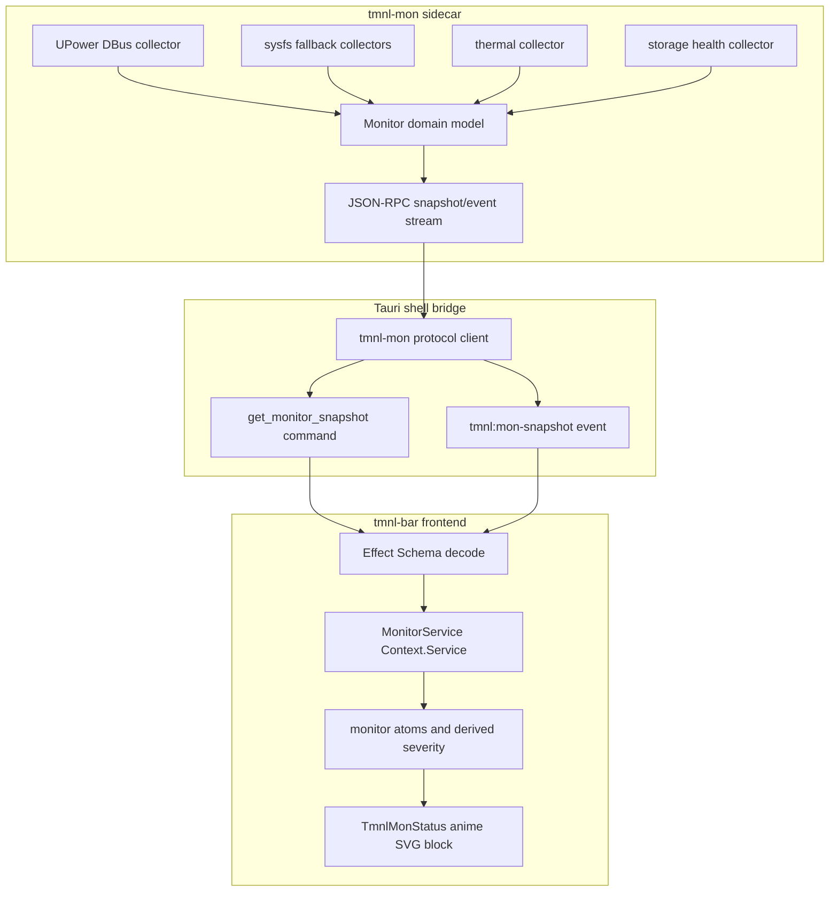
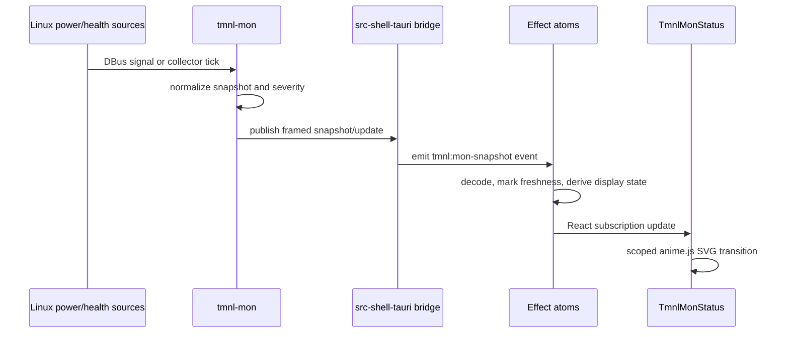

## Goal Capsule

| Field | Decision |
|---|---|
| Objective | Add `tmnl-mon` as a standalone Rust/Nix monitoring sidecar that feeds a compact tmnl-bar health block. |
| Primary surface | `packages/tmnl/src-shell` bar rail, with telemetry supplied by `tmnl-mon` rather than browser-side polling. |
| Authority | User clarification: `tmnl-mon` needs its own `flake.nix` and is a significant sidecar. Existing GetByShell rules keep the persistent bar physically narrow and avoid live compositor/service mutation during development. |
| Execution profile | Build sidecar foundation first, then bridge it into Tauri/Effect atoms, then render the animated React block. |
| Stop conditions | Stop if the sidecar cannot expose a stable local IPC contract, if UPower/sysfs permissions require privileged writes, or if the bar would need a wider persistent surface to show the data. |

---

## Product Contract

### Summary

`tmnl-mon` becomes a local desktop monitoring daemon for laptop power and health state, with a first tmnl-bar block focused on battery, AC, thermal, and storage-warning signals.
The bar should stay visually compact: one anime.js-driven SVG glyph/gauge plus terse status text, opening no new fullscreen or wide persistent UI.

### Problem Frame

The current bar already has Tauri, React, Effect atom state, compositor event bridging, and small status modules, but `NetworkStatus` is mock-like and there is no native telemetry service for battery or machine health.
Battery monitoring should not live as ad-hoc browser timers against OS files; it is a native Linux concern with DBus/sysfs semantics, process supervision, and future room for richer collectors.

### Requirements

- R1. `tmnl-mon` is a separate sidecar with its own `flake.nix`, Rust package, dev shell, and runtime packaging path.
- R2. The sidecar reports a typed snapshot for battery, AC/line power, thermal, and storage health without requiring privileged writes.
- R3. Battery data prefers UPower over raw sysfs because UPower exposes display-device aggregation, device add/remove signals, `OnBattery`, `Percentage`, `EnergyRate`, `TimeToEmpty`, `TimeToFull`, `WarningLevel`, and laptop-battery filtering through `Type` plus `PowerSupply`.
- R4. The sidecar falls back to read-only Linux sysfs for power and thermal values when UPower or DBus is unavailable.
- R5. The bar consumes sidecar snapshots through a small Tauri bridge and Effect/Atom view model, not direct React file polling.
- R6. The React block renders a compact, animated SVG health glyph using anime.js v4 scoped cleanup and SVG attribute animation.
- R7. Telemetry updates are event-pushed when the source supports it and rate-limited/polled only for sources that have no reliable push channel.
- R8. Degraded states are visible: no battery, no UPower, stale sidecar, low battery, thermal warning, and storage warning must have distinct model states even if the initial UI compresses them.

### Acceptance Examples

- AE1. On a laptop with UPower available, the bar shows charge percentage, charging/discharging state, and estimated time when UPower supplies it.
- AE2. When AC is connected or removed, the bar updates without waiting for a long frontend polling interval.
- AE3. On a desktop or VM with no battery, the bar shows a benign “line power / no battery” state rather than an error.
- AE4. When `tmnl-mon` is stopped, the bar keeps rendering and marks telemetry stale/disconnected.
- AE5. When UPower is unavailable but `/sys/class/power_supply` exists, the sidecar uses sysfs and marks the source as degraded.
- AE6. When thermal or storage collectors report a warning, the compact bar block prioritizes the warning over decorative battery animation.

### Scope Boundaries

#### In Scope

- `tmnl-mon` sidecar scaffold, flake, Rust domain model, collectors, JSON-RPC/JSON-lines IPC contract, and tests.
- Bar-side Tauri bridge, Effect Schema contracts, atoms/hooks, and the new `TmnlMonStatus` UI block.
- Read-only monitoring of laptop power/health: battery, AC/line power, thermal zones, and storage health status hooks.

#### Deferred to Follow-Up Work

- Charge threshold management through UPower `EnableChargeThreshold` or vendor firmware controls; those are write operations and need a separate safety plan.
- Full dashboards, historical charts, alert rules, notification actions, and per-device drilldowns.
- Replacing existing compositor/bar state with Effect v4 globally; this plan only creates the v4-shaped boundary for the new module while respecting current bar code.

---

## Planning Contract

### Key Technical Decisions

- KTD1. `tmnl-mon` is an independently packaged Rust sidecar, not another `src-shell-tauri` module. The user called out a significant sidecar with its own flake, and this keeps Linux telemetry dependencies out of the narrow bar Tauri binary.
- KTD2. UPower is the primary battery source; sysfs is the fallback. Official UPower docs expose `GetDisplayDevice`, `DeviceAdded`, `DeviceRemoved`, `OnBattery`, and battery properties such as `Percentage`, `EnergyRate`, `TimeToEmpty`, and `WarningLevel`; sysfs is simpler but lacks the same aggregate semantics.
- KTD3. Use direct `zbus`/UPower proxies or generated DBus bindings rather than committing to `upower_dbus` as the core dependency. `upower_dbus` demonstrates the right async DBus shape but is old/minimally maintained; `zbus` keeps the sidecar closer to the DBus contract.
- KTD4. First implementation uses a systemd/Home Manager-owned `tmnl-mon` daemon exposing JSON-RPC/JSON-lines frames over a Unix domain socket under `$XDG_RUNTIME_DIR`. Child-process stdio remains a protocol-compatible follow-up only if Tauri packaging later adds an `externalBin` sidecar path; it is not part of the first bridge implementation.
- KTD5. The Tauri bridge is a translator, not the collector or process supervisor. `src-shell-tauri` should connect/reconnect to the systemd-owned sidecar socket, expose a current snapshot command, and emit frontend events; it should not spawn `tmnl-mon` or own UPower/sysfs parsing in the first implementation.
- KTD6. Effect v4 owns the frontend boundary for new telemetry. Use Schema-backed decode at the edge, a `Context.Service` for the monitor client abstraction, and atoms for React-ready state; do not copy old `Schema.TaggedStruct` patterns into new v4 code.
- KTD7. anime.js is valid for this block, but only as direct scoped component animation. Existing repo research warns against broken generic animation abstraction layers; the plan uses anime.js v4 `createScope`/cleanup and SVG attributes directly.
- KTD8. The compact bar block is a summary, not a dashboard. The persistent bar remains narrow; richer status detail can become a popover/panel after the sidecar contract is stable.

### High-Level Technical Design





### Assumptions

- `tmnl-mon` starts as a Linux-first sidecar; macOS/Windows support is out of scope for the first implementation.
- Storage health is read-only and warning-oriented in the first pass; if SMART requires privileged access on a target machine, the collector reports unavailable/degraded rather than elevating.
- The sidecar can expose one partial aggregate snapshot quickly; collector-specific historical streams are deferred.
- Existing `@effect-atom` code remains in place; new `tmnl-mon` frontend contracts should use the workspace’s current Effect v4 service/layer doctrine where module resolution permits, including `Context.Service`, curried `Layer.succeed`, and avoiding removed v4 APIs.
- IPC framing follows the repo’s sidecar precedent: protocol frames are isolated from logs, blank/noisy lines are tolerated, and malformed frames never terminate the monitor daemon.
- Startup timeout defaults to 5s for the first power/health snapshot, but collectors have independent deadlines so slow storage probing reports degraded/unavailable without making the entire monitor stale.
- Multiple batteries aggregate by summed current/full energy where units are compatible; devices with zero full energy are skipped to avoid divide-by-zero.
- The compact bar block hides only when no battery has ever appeared, AC state is unknown, no thermal/storage warning is active, and the monitor is not stale/disconnected; it may show a minimal plug state when AC-only is known.

### Service Graph

| Layer | Service / module | Owns | Depends on |
|---|---|---|---|
| OS source | UPower DBus | Battery/AC aggregate, device add/remove, warning level | system DBus, UPower daemon |
| OS source | sysfs power_supply | Fallback battery and AC reads | `/sys/class/power_supply` |
| OS source | sysfs thermal | Thermal zone readings and warning thresholds | `/sys/class/thermal` |
| OS source | storage probe | Disk health warning/status | smartctl or read-only storage crate/probe selected during implementation |
| Sidecar domain | MonitorSnapshot model | Normalized data, severity, freshness, source provenance | collectors |
| Sidecar transport | MonitorProtocolServer | Current snapshot, pushed updates, heartbeat, and typed error envelope | sidecar domain, JSON-RPC frame model |
| Shell bridge | MonitorBridge | Socket reconnect policy, snapshot command, frontend events | sidecar protocol channel |
| Frontend service | MonitorService | Typed read/subscribe abstraction | Tauri command/event bridge |
| Frontend atoms | monitor atoms | React state, freshness, derived severity | MonitorService, Schema decode |
| UI block | TmnlMonStatus | SVG/status rendering and animation | monitor atoms, anime.js |

### Output Structure

```text
packages/tmnl/
├── tmnl-mon/
│   ├── flake.nix
│   ├── flake.lock
│   ├── Cargo.toml
│   ├── crates/
│   │   ├── tmnl-mon-ipc/
│   │   │   ├── Cargo.toml
│   │   │   └── src/lib.rs
│   │   └── tmnl-mon-daemon/
│   │       ├── Cargo.toml
│   │       └── src/
│   │           ├── main.rs
│   │           ├── model.rs
│   │           ├── severity.rs
│   │           ├── protocol.rs
│   │           └── collectors/
│   │               ├── mod.rs
│   │               ├── upower.rs
│   │               ├── sysfs_power.rs
│   │               ├── thermal.rs
│   │               └── storage.rs
│   └── tests/
│       ├── model_tests.rs
│       └── ipc_contract_tests.rs
├── src-shell-tauri/src/monitor_bridge.rs
├── src/lib/tmnl-mon/
│   ├── types.ts
│   ├── service.ts
│   ├── atoms.ts
│   ├── hooks.ts
│   └── __tests__/
│       ├── types.test.ts
│       └── atoms.test.ts
└── src-shell/components/
    ├── TmnlMonStatus.tsx
    └── __tests__/TmnlMonStatus.test.tsx
```

The tree is a scope declaration. Implementation may adjust file names if repo conventions demand it, but the sidecar/frontend/bridge boundaries should remain intact.

### Sources & Research

- `packages/tmnl/src-shell-tauri/README.md` documents the existing GetByShell sidecar layout, layer-shell hosting, compositor bridge, and Tauri event approach.
- `packages/tmnl/nix/lib/getbyshell/default.nix` and `surface.nix` show generated service-pair patterns for bar and panel; `tmnl-mon` should be supervised similarly but packaged through its own flake.
- `packages/tmnl/src/lib/getbyshell/hooks.ts` shows current Tauri event listeners feeding atoms for compositor state.
- `packages/tmnl/src-shell/components/NetworkStatus.tsx` is the closest existing compact SVG status block, but it uses local random samples and motion.dev; `tmnl-mon` should replace that kind of mock data with native telemetry.
- Tauri v2 docs show registered Rust commands invoked from JS via `@tauri-apps/api/core` and sidecar/event patterns for emitting backend output to the frontend.
- Anime.js v4 docs show React integration with `createScope` cleanup and SVG attribute animation through `animate(target, params)` plus SVG helpers.
- UPower docs define the DBus service, display device, device properties, `DeviceAdded`/`DeviceRemoved`, and battery-vs-device filtering via `Type` and `PowerSupply`.
- `packages/tmnl/src/lib/harness/pragma/pragma-sidecar/src/main.rs` and `pragma-ipc` are the repo’s sidecar protocol precedent: framed JSON-RPC over stdio, protocol types split from daemon logic, and logs kept off the protocol channel.
- Flow analysis adds operational defaults: a 5s first-snapshot timeout, exponential backoff for bridge reconnect/spawn, aggregate multi-battery math by summed energy, and a hidden/benign no-battery bar state for desktop or VM machines.

---

## Implementation Units

### U1. Scaffold tmnl-mon sidecar package

- **Goal:** Create the standalone Rust/Nix sidecar foundation with its own flake and package metadata.
- **Requirements:** R1.
- **Dependencies:** None.
- **Files:** `packages/tmnl/tmnl-mon/flake.nix`, `packages/tmnl/tmnl-mon/flake.lock`, `packages/tmnl/tmnl-mon/Cargo.toml`, `packages/tmnl/tmnl-mon/crates/tmnl-mon-ipc/Cargo.toml`, `packages/tmnl/tmnl-mon/crates/tmnl-mon-ipc/src/lib.rs`, `packages/tmnl/tmnl-mon/crates/tmnl-mon-daemon/Cargo.toml`, `packages/tmnl/tmnl-mon/crates/tmnl-mon-daemon/src/main.rs`, `packages/tmnl/tmnl-mon/tests/model_tests.rs`.
- **Approach:** Keep `tmnl-mon` independent enough to build from its own flake while still able to share pins or local path dependencies deliberately. Split protocol types into a small IPC crate and daemon logic into the binary crate, mirroring the pragma sidecar separation.
- **Patterns to follow:** `packages/tmnl/flake.nix` for flake-parts style; `packages/tmnl/Cargo.toml` for workspace dependency discipline; `packages/tmnl/src/lib/harness/pragma/pragma-ipc` plus `pragma-sidecar` for sidecar protocol separation; GetByShell prime rule that flakes only see tracked/indexed files.
- **Test scenarios:**
  - Instantiate the sidecar config with default Linux settings and verify no collector starts with write privileges.
  - Validate that a no-source snapshot can be created for desktop/VM environments.
  - Verify the binary starts far enough to expose its health/version metadata without requiring a battery.
- **Verification:** The sidecar package builds/checks from its own directory and has a clear dev shell/runtime closure boundary.

### U2. Define monitor domain model and severity rules

- **Goal:** Create a normalized, serializable model for battery, AC, thermal, storage, freshness, source provenance, and aggregate severity.
- **Requirements:** R2, R8, AE3, AE4, AE6.
- **Dependencies:** U1.
- **Files:** `packages/tmnl/tmnl-mon/crates/tmnl-mon-daemon/src/model.rs`, `packages/tmnl/tmnl-mon/crates/tmnl-mon-daemon/src/severity.rs`, `packages/tmnl/tmnl-mon/crates/tmnl-mon-ipc/src/lib.rs`, `packages/tmnl/tmnl-mon/tests/model_tests.rs`, `packages/tmnl/src/lib/tmnl-mon/types.ts`, `packages/tmnl/src/lib/tmnl-mon/__tests__/types.test.ts`.
- **Approach:** Model source-specific absence explicitly: `unavailable`, `degraded`, `stale`, and `ok` are different from numeric zero values. Mirror the Rust snapshot with a protocol crate and an Effect Schema frontend contract so malformed bridge payloads fail closed.
- **Execution note:** Start with characterization-style model tests for edge states before wiring collectors.
- **Patterns to follow:** `packages/tmnl/src/lib/getbyshell/types.ts` for Schema-backed frontend domain types, but use Effect v4-compatible `Schema.Struct` plus tags/classes rather than removed v4 APIs.
- **Test scenarios:**
  - Battery absent plus AC online produces a benign no-battery display state.
  - Low percentage plus discharging produces battery warning severity.
  - Thermal warning outranks normal battery animation.
  - Stale snapshot after freshness TTL produces disconnected/stale severity while preserving last known values.
  - Unknown future collector fields do not crash the frontend decoder when the stable snapshot fields are valid.
- **Verification:** Rust and TypeScript contracts agree on the required fields, optional fields, and failure/degraded states.

### U3. Implement read-only Linux collectors

- **Goal:** Implement UPower-first battery/AC collection plus sysfs fallback collectors for power and thermal, with a storage health probe abstraction.
- **Requirements:** R2, R3, R4, R7, AE1, AE2, AE3, AE5, AE6.
- **Dependencies:** U2.
- **Files:** `packages/tmnl/tmnl-mon/crates/tmnl-mon-daemon/src/collectors/mod.rs`, `packages/tmnl/tmnl-mon/crates/tmnl-mon-daemon/src/collectors/upower.rs`, `packages/tmnl/tmnl-mon/crates/tmnl-mon-daemon/src/collectors/sysfs_power.rs`, `packages/tmnl/tmnl-mon/crates/tmnl-mon-daemon/src/collectors/thermal.rs`, `packages/tmnl/tmnl-mon/crates/tmnl-mon-daemon/src/collectors/storage.rs`, `packages/tmnl/tmnl-mon/tests/model_tests.rs`.
- **Approach:** Subscribe to UPower changes where available and use bounded polling for sysfs/thermal/storage sources. Filter laptop batteries using UPower `Type=Battery` and `PowerSupply=true`; use UPower display-device aggregation for the primary compact battery summary.
- **Patterns to follow:** Existing Rust sidecars isolate OS IPC in Rust modules; `packages/tmnl/src-shared/src/state.rs` shows small serializable Rust types shared across the ecosystem.
- **Technical design:** Aggregate multi-battery state by summing normalized energy and full-energy values, then derive percentage from the aggregate. Treat mixed charge/energy units, hot-plug changes, and zero-capacity devices as collector-level edge cases rather than UI decisions.
- **Test scenarios:**
  - UPower display-device snapshot maps percentage, state, time, energy rate, and warning level.
  - Device add/remove updates source inventory without restarting the sidecar.
  - Missing UPower falls back to sysfs and marks provenance as fallback.
  - Missing battery and present AC maps to no-battery/line-power state.
  - Thermal collector reports unavailable when no thermal zones are readable.
  - Storage probe timeout or permission denial reports degraded without crashing the sidecar.
- **Verification:** Collectors are separately testable with fixture data and source failures produce typed degraded states instead of panics.

### U4. Expose sidecar IPC snapshot and update stream

- **Goal:** Provide a stable local IPC contract for current snapshot reads and pushed update events.
- **Requirements:** R5, R7, AE2, AE4.
- **Dependencies:** U2, U3.
- **Files:** `packages/tmnl/tmnl-mon/crates/tmnl-mon-ipc/src/lib.rs`, `packages/tmnl/tmnl-mon/crates/tmnl-mon-daemon/src/protocol.rs`, `packages/tmnl/tmnl-mon/crates/tmnl-mon-daemon/src/main.rs`, `packages/tmnl/tmnl-mon/tests/ipc_contract_tests.rs`.
- **Approach:** Use JSON-RPC/JSON-lines framing over a Unix domain socket for snapshot, subscribe/update, heartbeat/version, and typed error messages. The daemon is owned by the `tmnl-mon` flake/Home Manager systemd user service; Tauri child-process stdio is explicitly deferred unless a future unit adds `src-shell-tauri/tauri.conf.json` `externalBin` packaging and packaged-spawn verification.
- **Patterns to follow:** `packages/tmnl/src-shared/src/ipc.rs` for `$XDG_RUNTIME_DIR` JSON-lines precedent, plus `packages/tmnl/src/lib/harness/pragma/pragma-sidecar/src/main.rs` for frame discipline, protocol/log channel separation, and typed error envelopes.
- **Technical design:** The first snapshot deadline is 5s for power/health-critical fields. Individual collectors have shorter bounded deadlines; slow storage reports degraded/unavailable after its own timeout and must not block battery/AC/thermal data, heartbeat, or bar paint.
- **Test scenarios:**
  - Client receives an initial partial snapshot immediately after connecting when power/thermal data are ready and storage is still pending.
  - Client receives an update after a synthetic collector change.
  - Client reconnects after sidecar restart and gets a fresh snapshot.
  - Malformed client input is rejected without terminating the server.
  - Heartbeat timeout lets clients distinguish stale sidecar from quiet telemetry.
  - Slow storage probe reports degraded/unavailable without delaying heartbeat or first battery/AC snapshot.
- **Verification:** IPC tests prove snapshot/update/reconnect behavior without requiring live DBus or batteries.

### U5. Add Tauri monitor bridge to the bar shell

- **Goal:** Connect the bar Tauri process to `tmnl-mon` and expose snapshots/events to React.
- **Requirements:** R5, R7, AE4.
- **Dependencies:** U4.
- **Files:** `packages/tmnl/src-shell-tauri/src/monitor_bridge.rs`, `packages/tmnl/src-shell-tauri/src/lib.rs`, `packages/tmnl/src-shell-tauri/README.md`.
- **Approach:** Add a small bridge module that owns Unix socket protocol connection, reconnect/backoff, last-snapshot storage, a `get_monitor_snapshot` command, and `tmnl:mon-snapshot` events. It should log degraded connection states but never spawn the sidecar or block bar startup in the first implementation.
- **Patterns to follow:** `packages/tmnl/src-shell-tauri/src/lib.rs` command registration and event-emission style; `useNiriSync` frontend event handling in `packages/tmnl/src/lib/getbyshell/hooks.ts`; `packages/tmnl/src-shared/src/ipc.rs` for socket path/runtime-dir conventions.
- **Test scenarios:**
  - Command returns stale/disconnected when no sidecar channel exists.
  - Bridge emits frontend event after receiving a valid framed sidecar update.
  - Reconnect loop backs off and recovers after sidecar restart.
  - Invalid IPC payload is logged and ignored without poisoning the last good snapshot.
  - First snapshot timeout marks monitor state disconnected/stale after 5s.
  - Rapid AC attach/detach is debounced before event emission to avoid animation thrash.
- **Verification:** Bar can start with and without the sidecar; sidecar absence is visible as data state, not a startup failure.

### U6. Build Effect v4 monitor service, atoms, and hooks

- **Goal:** Decode monitor snapshots and expose React-ready state through an Effect service plus atoms/hooks.
- **Requirements:** R5, R8, AE4, AE5, AE6.
- **Dependencies:** U2, U5.
- **Files:** `packages/tmnl/src/lib/tmnl-mon/service.ts`, `packages/tmnl/src/lib/tmnl-mon/atoms.ts`, `packages/tmnl/src/lib/tmnl-mon/hooks.ts`, `packages/tmnl/src/lib/tmnl-mon/index.ts`, `packages/tmnl/src/lib/tmnl-mon/__tests__/atoms.test.ts`, `packages/tmnl/vite.config.shell.ts`.
- **Approach:** Create a `MonitorService` boundary for command/event access, Schema-decode every payload, keep writable atoms for latest snapshot and connection freshness, and derive compact display state for the bar. Display priority is warning-first: thermal warning, storage warning, low battery, stale/disconnected, decode/error, no UPower/sysfs degraded, ok charging/discharging, no-battery/line-power, then hidden no-battery/unknown-AC. Avoid cross-registry writes; keep side effects in hook/operation atoms that share the bar registry.
- **Execution note:** Treat this as the Effectify core: service owns IO/decode policy; atoms own interactive view state.
- **Patterns to follow:** `packages/tmnl/src/lib/getbyshell/atoms.ts` and `hooks.ts` for existing atom wiring; effect-v4 skill guidance for `Context.Service`, `Schema`, and `Atom.runtime` where the workspace permits.
- **Test scenarios:**
  - Initial command snapshot populates atoms before any pushed event.
  - Pushed event replaces snapshot and updates derived severity.
  - Decode failure moves the monitor state to degraded/error without crashing subscribers.
  - Freshness timer marks stale after missed heartbeat while preserving last known value.
  - No-battery snapshot derives the benign display state used by the UI.
  - Multiple battery snapshots derive one aggregate display value.
  - No-battery plus unknown AC can hide the block only when no warning, stale, or disconnected state is active.
- **Verification:** Unit tests prove state transitions and derived display state independent of the real Tauri runtime.

### U7. Render the tmnl-bar monitoring block

- **Goal:** Add the compact `TmnlMonStatus` block to the bar with anime.js SVG animation and degraded-state affordances.
- **Requirements:** R6, R8, AE1, AE2, AE3, AE4, AE6.
- **Dependencies:** U6.
- **Files:** `packages/tmnl/src-shell/components/TmnlMonStatus.tsx`, `packages/tmnl/src-shell/components/__tests__/TmnlMonStatus.test.tsx`, `packages/tmnl/src-shell/App.tsx`, `packages/tmnl/vite.config.shell.ts`.
- **Approach:** Render a narrow SVG gauge/glyph that animates charge level, charging pulse, warning flare, and stale/disconnected dimming. Wire it in the existing center status row near `NetworkStatus`; replace or collapse the mock-like network block if both would crowd the narrow bar, and keep the visible label to a short percentage/code. Use anime.js v4 `createScope` scoped to the component root and clean up on unmount; honor `prefers-reduced-motion` by disabling pulses/flares or replacing them with static state changes.
- **Patterns to follow:** `packages/tmnl/src-shell/components/NetworkStatus.tsx` for compact SVG status composition, `packages/tmnl/src-shell/components/BarLayout.tsx` for `InsetWell` slot behavior and narrow-bar density.
- **Accessibility:** Expose semantic status text via `role="status"` or an equivalent non-chatty accessible name, include SVG title/description or visually hidden text for compressed glyph states, avoid color-only warning encoding, and keep hover/focus text parity for the terse label.
- **Test scenarios:**
  - Charging snapshot renders charging visual state and percentage label.
  - Discharging low-battery snapshot renders warning state.
  - No-battery/line-power snapshot renders benign state.
  - Stale/disconnected snapshot renders degraded state without throwing.
  - Thermal and storage warnings render above ordinary battery status in the compact display hierarchy.
  - Missing UPower/sysfs degraded state renders distinctly from stale/disconnected and no-battery states.
  - Component unmount reverts anime.js scope and does not leak timers/animations.
- **Verification:** Component tests cover visual state selection and animation lifecycle cleanup; manual smoke confirms the bar remains physically compact.

### U8. Wire Nix/systemd and sidecar operations

- **Goal:** Make `tmnl-mon` operable through Nix and compatible with GetByShell deployment conventions.
- **Requirements:** R1, R2, AE4.
- **Dependencies:** U1, U4, U5.
- **Files:** `packages/tmnl/tmnl-mon/flake.nix`, `packages/tmnl/nix/lib/getbyshell/types.nix`, `packages/tmnl/nix/lib/getbyshell/default.nix`, `packages/tmnl/nix/lib/getbyshell/hm-module.nix`, `packages/tmnl/nix/lib/getbyshell/sidecar.nix`, `packages/tmnl/nix/lib/getbyshell/mission-control.nix`, `packages/tmnl/nix/modules/getbyshell/default.nix`.
- **Approach:** Keep the sidecar’s flake authoritative for building `tmnl-mon`; add dedicated GetByShell/Home Manager wiring as a sidecar service generator, not as a surface generator. The bar should depend on the monitor protocol contract, not on Cargo-invoking collectors inside the bar process, and `tmnl-mon` must not be added to the existing WebView surface map.
- **Patterns to follow:** Existing `bar` and `panel` declarations in `packages/tmnl/nix/lib/getbyshell/default.nix`; `packages/tmnl/nix/lib/getbyshell/hm-module.nix` plus `surface.nix` to understand current service generation; `packages/tmnl/nix/lib/getbyshell/SPEC.md` service generation contract; repo learning that `tmnl-mon` needs a non-Vite sidecar generator because it has no WebView surface.
- **Test scenarios:**
  - Disabled or missing `tmnl-mon` service leaves bar service startable.
  - Enabled sidecar service starts before or alongside the bar and exposes the expected protocol channel.
  - Dedicated sidecar generator creates a `tmnl-mon` systemd user service without creating a Vite/WebView service pair.
  - Mission-control/status scripts distinguish bar, panel, and monitor sidecar status without inventing a Vite service for `tmnl-mon`.
  - Nix evaluation includes required runtime packages such as UPower/smartmontools only for Linux systems.
- **Verification:** Nix evaluation/checks prove the package and service options are visible without live service restart or compositor mutation.

---

## Verification Contract

| Gate | Applies to | Done signal |
|---|---|---|
| Rust sidecar checks | U1-U4 | `tmnl-mon` compiles and its unit/IPC contract tests pass from the sidecar flake/dev shell. |
| Tauri bridge checks | U5 | Bar shell Tauri crate checks with `monitor_bridge` included, socket connection handling covered, and command/event registration intact. |
| TypeScript atom tests | U2, U6 | Schema decode, freshness, severity, and no-battery/degraded atom transitions pass under Vitest. |
| React component tests | U7 | `TmnlMonStatus` renders charging, discharging, no-battery, no-UPower/sysfs degraded, thermal/storage warning, and stale states; animation cleanup and reduced-motion behavior are asserted. |
| Nix evaluation | U1, U8 | `tmnl-mon` flake and GetByShell module additions evaluate without live activation. |
| Manual smoke | U5-U8 | With sidecar running, bar receives a snapshot; with sidecar stopped, bar renders stale/disconnected rather than failing startup. |

---

## Definition of Done

- `tmnl-mon` has its own flake, split protocol/daemon crates, testable domain model, collectors, and framed local IPC contract.
- Battery, AC, thermal, and storage-warning states are modeled with source provenance and freshness.
- UPower is the primary Linux battery source; sysfs fallback is implemented for read-only degraded operation.
- The bar does not read DBus/sysfs directly; it consumes typed snapshots through the Tauri bridge and frontend Effect/Atom boundary.
- `TmnlMonStatus` is wired into the bar and remains narrow-bar compatible.
- anime.js animation is component-scoped and cleaned up on unmount.
- Sidecar absence, no-battery hardware, DBus failure, stale heartbeat, and warning states are all covered by tests or smoke verification.
- Nix wiring evaluates without requiring live service activation, compositor reload, or `nixos-rebuild switch` during implementation verification.
- Dead-end scaffolding, mock collectors used only during development, and abandoned alternative transports are removed before completion.
