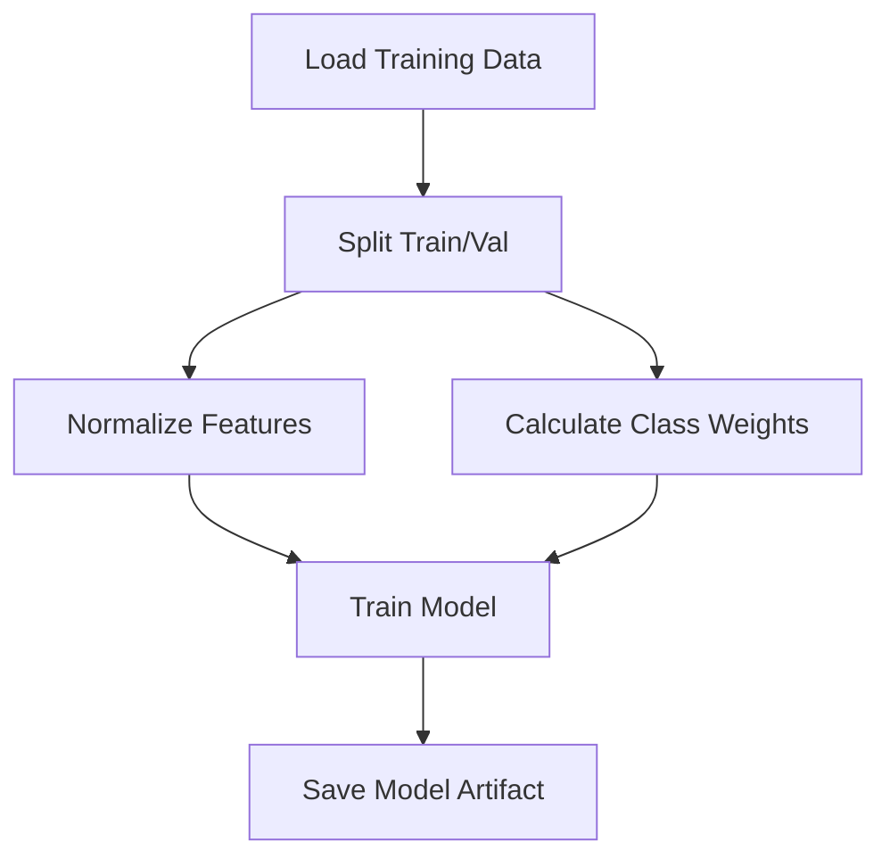
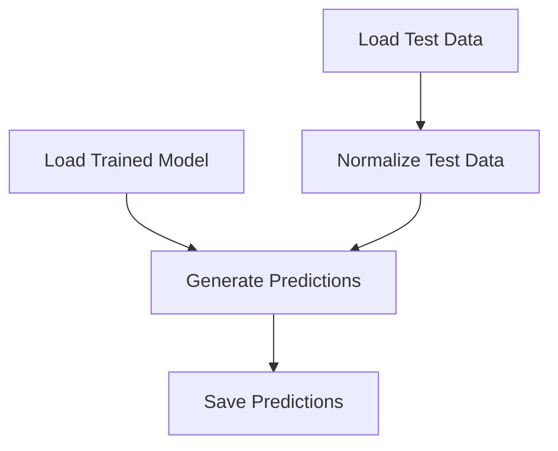

# Prefect Setup for IoT Smoke Detection

This document describes the Prefect integration for the smoke detection ML pipeline.

## Overview

The project has been refactored to use **Prefect 2.x** for workflow orchestration. The original scripts (`train_simple.py`, `predict_test.py`) have been converted into modular, observable, and resumable Prefect flows.

## Project Structure

```
iot-data-science/
├── flows/                      # Prefect flow definitions
│   ├── train_flow.py          # Training pipeline flow
│   └── predict_flow.py        # Prediction pipeline flow
├── src/                        # Original scripts (now importable modules)
│   ├── train_simple.py        # Core training logic
│   ├── predict_test.py        # Core prediction logic
│   └── analyze_model.py       # Model analysis
├── smoke_analysis/data/raw/    # Data files
│   ├── train_dataset.csv      # 5,000 training samples
│   └── test_dataset.csv       # 12,437 test samples
├── results/                    # Output directory
│   ├── model_run_001.eqx      # Saved model weights
│   └── test_predictions_run_001.csv  # Predictions
├── pyproject.toml              # Python dependencies (UV managed)
└── PREFECT_SETUP.md            # This file
```

## Installation

### 1. Install Dependencies with UV

The project uses UV for package management. Install all dependencies:

```bash
# From the project root directory
cd /path/to/iot-data-science

# Install dependencies (creates .venv if needed)
uv sync

# Or install individually
uv pip install jax jaxlib equinox optax prefect
```

### 2. Initialize Prefect (Local Mode)

No Prefect Cloud account needed for local development:

```bash
# Configure Prefect to use local SQLite database
prefect config set PREFECT_API_URL="http://127.0.0.1:4200/api"

# Optional: Start Prefect UI (in separate terminal)
prefect server start
```

The UI will be available at: `http://127.0.0.1:4200`

## Running Flows

### Training Flow

Train a new smoke detection model:

```bash
# Using uv run
uv run python flows/train_flow.py

# Or activate venv first
source .venv/bin/activate
python flows/train_flow.py
```

**What it does:**

1. Loads 5,000 training samples from CSV
2. Splits into 80% train / 20% validation
3. Normalizes features using training statistics
4. Calculates class weights (handles imbalanced data)
5. Trains JAX/Equinox MLP for 50 epochs
6. Evaluates on validation set
7. Saves model weights to `results/model_run_001.eqx`
8. Creates Prefect artifacts (training summary, metrics)

**Expected Output:**

```
INFO     | prefect.engine - Created flow run 'crimson-panther' for flow 'Smoke Detection Training'
INFO     | Flow run 'crimson-panther' - Loaded 5000 samples with 13 features
INFO     | Flow run 'crimson-panther' - Train set: 4000 samples
INFO     | Flow run 'crimson-panther' - Validation set: 1000 samples
INFO     | Flow run 'crimson-panther' - Training for 50 epochs with batch size 64
INFO     | Flow run 'crimson-panther' - Epoch 10 | Loss: 0.1234 | Train Acc: 0.985 | Val Acc: 0.978
...
INFO     | Flow run 'crimson-panther' - ✓ Model saved to: results/model_run_001.eqx
INFO     | Flow run 'crimson-panther' - ✓ TRAINING PIPELINE COMPLETE
```

### Prediction Flow

Generate predictions on test set using trained model:

```bash
# Using uv run
uv run python flows/predict_flow.py

# Or with activated venv
python flows/predict_flow.py
```

**What it does:**

1. Loads 12,437 test samples
2. Loads trained model weights
3. Normalizes test data (using training stats from train_dataset.csv)
4. Generates predictions in batches of 1,000
5. Saves predictions to `results/test_predictions_run_001.csv`
6. Creates Prefect artifacts (summary stats, sample predictions table)

**Expected Output:**

```
INFO     | prefect.engine - Created flow run 'violet-hawk' for flow 'Smoke Detection Prediction'
INFO     | Flow run 'violet-hawk' - Loading test data from: smoke_analysis/data/raw/test_dataset.csv
INFO     | Flow run 'violet-hawk' - Loaded 12,437 test samples with 13 features
INFO     | Flow run 'violet-hawk' - ✓ Model loaded successfully
INFO     | Flow run 'violet-hawk' - Generating predictions in batches of 1000...
INFO     | Flow run 'violet-hawk' - Processed 12,437/12,437 samples...
INFO     | Flow run 'violet-hawk' - ✓ Predictions saved to: results/test_predictions_run_001.csv
INFO     | Flow run 'violet-hawk' - Fire alarm rate: 15.3%
```

## Flow Architecture

### Training Flow Tasks



**Tasks:**

1. **load_training_data**: CSV → JAX arrays (retries=2)
2. **split_data**: 80/20 train/val split
3. **normalize_features**: Z-score normalization (mean=0, std=1)
4. **calculate_class_weights**: Inverse frequency weights for imbalanced classes
5. **train_model**: JAX/Equinox MLP training loop (50 epochs, Adam optimizer)
6. **save_model_artifact**: Serialize weights + create Prefect markdown artifact

### Prediction Flow Tasks



**Tasks:**

1. **load_test_data**: Load 12,437 test samples (retries=2)
2. **load_trained_model**: Deserialize Equinox model weights
3. **normalize_test_data**: Apply training normalization stats to test set
4. **generate_predictions**: Batch inference (1,000 samples/batch)
5. **save_predictions**: CSV export + Prefect artifacts (summary + table)

## Prefect Features Used

### Task Decorators

```python
@task(name="Load Training Data", retries=2, retry_delay_seconds=5)
def load_training_data(filepath: str):
    # Automatic retries on failure
    # Named task for better observability
    ...
```

### Flow Decorators

```python
@flow(name="Smoke Detection Training", log_prints=True)
def training_flow(...):
    # Orchestrates tasks
    # Captures all print() statements
    # Creates flow run in Prefect UI
    ...
```

### Logging

```python
from prefect import get_run_logger

logger = get_run_logger()
logger.info("Training complete!")
logger.warning("Class imbalance detected")
logger.error("Failed to load data")
```

### Artifacts

**Markdown Artifact** (training summary):

```python
from prefect.artifacts import create_markdown_artifact

create_markdown_artifact(
    key="training-summary",
    markdown=f"""# Training Summary
    - Validation Accuracy: {acc:.3f}
    - Model Path: {path}
    """,
    description="Training run summary"
)
```

**Table Artifact** (sample predictions):

```python
from prefect.artifacts import create_table_artifact

create_table_artifact(
    key="sample-predictions",
    table=[
        {'Sample ID': 0, 'Prediction': 1, 'Probability': 0.9234},
        ...
    ],
    description="First 10 predictions"
)
```

## Customizing Flows

### Training Flow Parameters

```python
# Customize training
result = training_flow(
    train_data_path="path/to/train.csv",
    model_output_path="models/custom_model.eqx",
    n_epochs=100,           # More epochs
    batch_size=128,         # Larger batches
    learning_rate=5e-4,     # Lower LR
    train_ratio=0.9,        # More training data
    seed=123                # Different seed
)
```

### Prediction Flow Parameters

```python
# Customize prediction
result = prediction_flow(
    test_data_path="path/to/test.csv",
    model_path="models/custom_model.eqx",
    output_path="predictions/custom.csv",
    batch_size=500,         # Smaller batches
    seed=123                # Match training seed
)
```

## Viewing Results in Prefect UI

1. Start the Prefect UI:

   ```bash
   prefect server start
   ```

2. Navigate to: `http://127.0.0.1:4200`

3. **Flow Runs** tab shows:

   - All training/prediction runs
   - Status (success/failed/running)
   - Duration
   - Parameters used
   - Task dependencies graph

4. **Artifacts** tab shows:

   - Training summaries (markdown)
   - Prediction tables
   - Metrics and stats

5. **Logs** tab shows:
   - All logger output
   - Task-level logs
   - Error tracebacks

## Next Steps

### 1. Scheduling

Run flows on a schedule:

```python
from prefect.deployments import Deployment
from prefect.server.schemas.schedules import CronSchedule

deployment = Deployment.build_from_flow(
    flow=training_flow,
    name="nightly-training",
    schedule=CronSchedule(cron="0 2 * * *"),  # 2 AM daily
    work_queue_name="training"
)

deployment.apply()
```

### 2. Parametrized Deployments

Create deployments for different configurations:

```bash
prefect deployment build flows/train_flow.py:training_flow \
    --name "production" \
    --param n_epochs=100 \
    --param batch_size=128 \
    --apply
```

### 3. Remote Execution

Deploy to workers for distributed execution:

```bash
# Start a work pool
prefect work-pool create --type process training-pool

# Start a worker
prefect worker start --pool training-pool
```

### 4. Prefect Cloud

For team collaboration:

```bash
# Connect to Prefect Cloud
prefect cloud login

# Deploy flows
prefect deployment apply flows/train_flow.py:training_flow
```

### 5. Notifications

Add Slack/email notifications on failure:

```python
from prefect.blocks.notifications import SlackWebhook

slack_webhook = SlackWebhook.load("my-slack-webhook")

@flow(on_failure=[slack_webhook])
def training_flow(...):
    ...
```

### 6. Data Validation

Add data quality checks:

```python
from prefect import task

@task
def validate_data(X, y):
    assert X.shape[0] > 1000, "Not enough samples"
    assert not jnp.isnan(X).any(), "NaN values detected"
    assert set(y.tolist()) == {0, 1}, "Invalid labels"
    return True
```

### 7. Experiment Tracking

Integrate with MLflow or Weights & Biases:

```python
import mlflow

@task
def track_experiment(model, history):
    with mlflow.start_run():
        mlflow.log_params({"n_epochs": 50, "lr": 1e-3})
        mlflow.log_metric("val_acc", history['final_val_acc'])
        mlflow.log_artifact("results/model_run_001.eqx")
```

### 8. Model Versioning

Add semantic versioning to models:

```python
@task
def save_versioned_model(model, version="1.0.0"):
    output_path = f"models/smoke_detector_v{version}.eqx"
    eqx.tree_serialise_leaves(output_path, model)
    return output_path
```

## Troubleshooting

### Import Errors

If you see `ModuleNotFoundError: No module named 'jax'`:

```bash
# Ensure you're in the project directory
cd /path/to/iot-data-science

# Install dependencies
uv sync
```

### Path Issues

If flows can't find data files:

```bash
# Run from project root
cd /path/to/iot-data-science
uv run python flows/train_flow.py
```

### Prefect Database Lock

If you see SQLite database lock errors:

```bash
# Reset Prefect database
prefect server database reset -y

# Restart server
prefect server start
```

### GPU/JAX Issues

For CPU-only JAX (no GPU):

```bash
# Install CPU-only JAX
uv pip install --upgrade "jax[cpu]"
```

## Performance Notes

- **Training**: ~30 seconds on CPU (50 epochs, 4,000 samples)
- **Prediction**: ~10 seconds on CPU (12,437 samples, batch_size=1000)
- **Model Size**: ~50 KB (Equinox serialized weights)

## References

- **Prefect Documentation**: https://docs.prefect.io/
- **JAX Documentation**: https://jax.readthedocs.io/
- **Equinox Documentation**: https://docs.kidger.site/equinox/
- **Project README**: `README.md`

---

**Last Updated**: December 16, 2024  
**Prefect Version**: 2.14+  
**Python Version**: 3.11+
