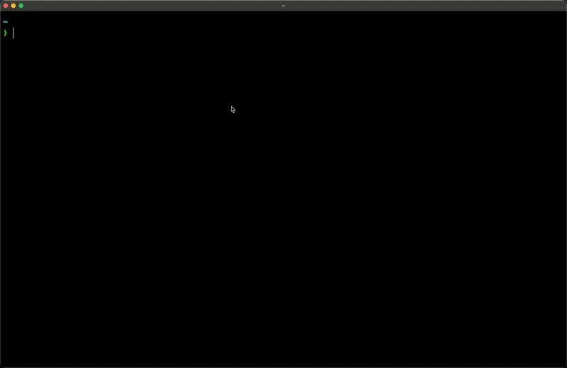

::::::::::::::::::::::::: {.astro-f44q3k6v role="main" pagefind-body="" lang="en" dir="ltr"}
:::: {.content-panel .astro-2wc2n45z style="--borderTop: initial;--pageTitleDisplay: block;"}
::: {.sl-container .astro-2wc2n45z style="--borderTop: initial;--pageTitleDisplay: block;"}
# Create Effect App {#_top .astro-np5lzwrf}
:::
::::

:::::::::::::::::::::: {.content-panel .astro-2wc2n45z style="--borderTop: initial;--pageTitleDisplay: block;"}
::::::::::::::::::::: {.sl-container .astro-2wc2n45z style="--borderTop: initial;--pageTitleDisplay: block;"}
:::::::::::::::::: sl-markdown-content
The `create-effect-app`{dir="auto"} CLI allow you to create a new Effect
application using a default template or an
[example](https://github.com/Effect-TS/examples) from a public Github
repository. It is the easiest way to get started with Effect.

::: {.autolink-heading-container .level-h2 tabindex="-1"}
## CLI

[[]{.anchor-icon
aria-hidden="true"}](index.html#cli){.anchor-link aria-labelledby="cli"}
:::

To begin, run the `create-effect-app`{dir="auto"} command in your
terminal using your preferred package manager:

::: {.tablist-wrapper .not-content .astro-5yo7dsk7}
- [![](data:image/svg+xml;base64,PHN2ZyBhcmlhLWhpZGRlbj0idHJ1ZSIgY2xhc3M9ImFzdHJvLTV5bzdkc2s3IGFzdHJvLTRyZ3k3Y3JwIiB3aWR0aD0iMTYiIGhlaWdodD0iMTYiIHZpZXdib3g9IjAgMCAyNCAyNCIgZmlsbD0iY3VycmVudENvbG9yIiBzdHlsZT0iLS1zbC1pY29uLXNpemU6IDFlbTsiPjxwYXRoIGQ9Ik0yNCA3LjI5NkwwIDcuMjk2TDAgMTUuMjk2TDYuODE2IDE1LjI5Nkw2LjgxNiAxNi43MDRMMTIuMDk2IDE2LjcwNEwxMi4wOTYgMTUuMzkyTDI0IDE1LjM5MkwyNCA3LjI5NlpNNi41OTIgOC43MDRMNi41OTIgMTMuOTg0TDUuMzEyIDEzLjk4NEw1LjMxMiAxMC4xMTJMNCAxMC4xMTJMNCAxMy45ODRMMS4zMTIgMTMuOTg0TDEuMzEyIDguNzA0TDYuNTkyIDguNzA0Wk0xMy4xODQgMTMuOTg0TDEzLjIxNiAxMy45ODRMMTAuNDk2IDEzLjk4NEwxMC40OTYgMTUuMzkyTDcuODA4IDE1LjM5Mkw3LjgwOCA4LjgwMEwxMy4wODggOC44MDBRMTMuMjE2IDEwLjQwMCAxMy4xODQgMTMuOTg0TDEzLjE4NCAxMy45ODRaTTIyLjU5MiA4LjcwNEwyMi41OTIgMTMuOTg0TDIxLjMxMiAxMy45ODRMMjEuMzEyIDEwLjExMkwyMCAxMC4xMTJMMjAgMTMuOTg0TDE4LjU5MiAxMy45ODRMMTguNTkyIDEwLjExMkwxNy4zMTIgMTAuMTEyTDE3LjMxMiAxMy45ODRMMTQuNTkyIDEzLjk4NEwxNC41OTIgOC43MDRMMjIuNTkyIDguNzA0Wk0xMS45MDQgMTIuNzA0TDExLjkwNCAxMC4xMTJMMTAuNTkyIDEwLjExMkwxMC41OTIgMTIuNzA0TDExLjkwNCAxMi43MDRaIiAvPjwvc3ZnPg==){.astro-5yo7dsk7
  .astro-4rgy7crp} npm](index.html#tab-panel-86){#tab-86 .astro-5yo7dsk7
  role="tab" aria-selected="true" tabindex="0"}
- [{.astro-5yo7dsk7
  .astro-4rgy7crp} pnpm](index.html#tab-panel-87){#tab-87
  .astro-5yo7dsk7 role="tab" aria-selected="false" tabindex="-1"}
- [![](data:image/svg+xml;base64,PHN2ZyBhcmlhLWhpZGRlbj0idHJ1ZSIgY2xhc3M9ImFzdHJvLTV5bzdkc2s3IGFzdHJvLTRyZ3k3Y3JwIiB3aWR0aD0iMTYiIGhlaWdodD0iMTYiIHZpZXdib3g9IjAgMCAyNCAyNCIgZmlsbD0iY3VycmVudENvbG9yIiBzdHlsZT0iLS1zbC1pY29uLXNpemU6IDFlbTsiPjxwYXRoIGQ9Ik02LjcyOSAyMS41NDVMNi43MjkgMjEuNTQ1UTYuMzkzIDIxLjM3NyA2LjIyNSAyMS4wNDFMNi4yMjUgMjEuMDQxUTYuMDk5IDIwLjkxNSA2LjA3OCAyMC45MTVRNi4wNTcgMjAuOTE1IDUuOTczIDIxLjA0MVE1Ljg4OSAyMS4xNjcgNS44MjYgMjEuNDE5UTUuNzYzIDIxLjY3MSA1LjY3OSAyMS44MzlMNS42NzkgMjEuODM5UTUuMzg1IDIyLjgwNSA0LjgzOSAyMy4xNDFRNC4yOTMgMjMuNDc3IDMuMzI3IDIzLjI2N0wzLjMyNyAyMy4yNjdRMy4wNzUgMjMuMjY3IDIuNTI5IDIzLjAxNUwyLjUyOSAyMy4wMTVRMS43MzEgMjIuNTk1IDIuMTUxIDIxLjgzOUwyLjE1MSAyMS44MzlRMi4xNTEgMjEuNzU1IDIuMjE0IDIxLjYyOVEyLjI3NyAyMS41MDMgMi4yNzcgMjEuNDE5TDIuMjc3IDIxLjQxOVExLjU2MyAyMS40MTkgMS4zNTMgMjAuNzg5TDEuMzUzIDIwLjc4OVEwLjg0OSAxOS40NDUgMS4wMTcgMTguNDE2UTEuMTg1IDE3LjM4NyAyLjE1MSAxNi40MjFMMi4xNTEgMTYuNDIxTDIuMjM1IDE2LjI1M1EyLjQwMyAxNS45NTkgMi40MDMgMTUuNzkxTDIuNDAzIDE1Ljc5MVEyLjQwMyAxNC4zNjMgMi42OTcgMTMuMzEzTDIuNjk3IDEzLjMxM1EzLjAzMyAxMi4wNTMgMy44MzEgMTEuMDQ1TDMuODMxIDExLjA0NVE0LjUwMyAxMC4xNjMgNS40MjcgOS42MTdMNS40MjcgOS42MTdRNS41OTUgOS41MzMgNS42MTYgOS40MDdRNS42MzcgOS4yODEgNS41NTMgOS4wNzFMNS41NTMgOS4wNzFRNC44MzkgOC4xODkgNC42MjkgNi45NzFMNC42MjkgNi45NzFRNC41NDUgNi42MzUgNC42NzEgNi4yMTVMNC42NzEgNi4yMTVRNC43NTUgNS45MjEgNS4wMDcgNS40MTdMNS4wMDcgNS40MTdMNS4xNzUgNS4wMzlRNS40MjcgNC43NDUgNS41NTMgNC43NDVMNS41NTMgNC43NDVRNS45MzEgNC42NjEgNi41NjEgNC4xOTlMNi41NjEgNC4xOTlMNi44NTUgMy45ODlROC4xNTcgMi42NDUgMTAuMTMxIDIuNjQ1TDEwLjEzMSAyLjY0NVExMC4zNDEgMi42NDUgMTAuNDQ2IDIuNTgyUTEwLjU1MSAyLjUxOSAxMC41NTEgMi4zOTNMMTAuNTUxIDIuMzkzUTEwLjcxOSAxLjU5NSAxMS4zMDcgMC44MzlMMTEuMzA3IDAuODM5TDExLjcyNyAwLjQxOVExMS45MzcgMC4yMDkgMTIuMTY4IDAuMjMwUTEyLjM5OSAwLjI1MSAxMi41MjUgMC41NDVMMTIuNTI1IDAuNTQ1UTEyLjc3NyAxLjAwNyAxMy4xNTUgMS44NDdMMTMuMTU1IDEuODQ3TDEzLjQwNyAyLjM5M1ExMy42MTcgMi43MjkgMTMuODI3IDIuNTE5TDEzLjgyNyAyLjUxOVExNC4zMzEgMi4zMDkgMTQuNDk5IDIuMjg4UTE0LjY2NyAyLjI2NyAxNC43NTEgMi4zOTNRMTQuODM1IDIuNTE5IDE1LjAwMyAzLjA2NUwxNS4wMDMgMy4wNjVRMTYuMDExIDcuMjY1IDEzLjcwMSAxMC45MTlMMTMuNzAxIDEwLjkxOVExMy42MTcgMTEuMDQ1IDEzLjQyOCAxMS4zMThRMTMuMjM5IDExLjU5MSAxMy4xNTUgMTEuNzU5UTEzLjA3MSAxMS45MjcgMTMuMDkyIDEyLjA1M1ExMy4xMTMgMTIuMTc5IDEzLjI4MSAxMi4zODlMMTMuMjgxIDEyLjM4OVExNC4xNjMgMTMuMTQ1IDE0Ljc1MSAxNC4xOTVRMTUuMzM5IDE1LjI0NSAxNS41MDcgMTYuNDIxTDE1LjUwNyAxNi40MjFRMTUuNzE3IDE3Ljg5MSAxNS41MDcgMTkuMzE5TDE1LjUwNyAxOS4zMTlRMTUuNDIzIDE5LjY5NyAxNS41MDcgMTkuNzYwUTE1LjU5MSAxOS44MjMgMTUuOTI3IDE5LjczOUwxNS45MjcgMTkuNzM5UTE3LjM5NyAxOS4yNzcgMTguNTMxIDE4LjUyMUwxOC41MzEgMTguNTIxTDE4Ljg2NyAxOC4zNTNRMTkuNjIzIDE3Ljg5MSAyMC4wNDMgMTcuNzIzTDIwLjA0MyAxNy43MjNRMjAuNjczIDE3LjQyOSAyMS4zMDMgMTcuMzQ1TDIxLjMwMyAxNy4zNDVMMjEuNjgxIDE3LjM0NVEyMi4xMDEgMTcuMjYxIDIyLjM3NCAxNy4zNjZRMjIuNjQ3IDE3LjQ3MSAyMi44MzYgMTcuNzIzUTIzLjAyNSAxNy45NzUgMjMuMDI1IDE4LjI2OUwyMy4wMjUgMTguMjY5UTIzLjAyNSAxOC44NTcgMjIuMzUzIDE5LjA2N0wyMi4zNTMgMTkuMDY3UTIwLjYzMSAxOS40MDMgMTguODA0IDIwLjcyNlExNi45NzcgMjIuMDQ5IDE0LjQ1NyAyMi43MjFMMTQuNDU3IDIyLjcyMVExNC4zNzMgMjIuNzIxIDE0LjIwNSAyMi44MDVRMTQuMDM3IDIyLjg4OSAxMy45NTMgMjMuMDE1TDEzLjk1MyAyMy4wMTVRMTMuNjU5IDIzLjIyNSAxMy4zMjMgMjMuMzA5TDEzLjMyMyAyMy4zMDlRMTMuMTEzIDIzLjM5MyAxMi42NTEgMjMuNDM1TDEyLjY1MSAyMy40MzVMMTIuMjMxIDIzLjUxOUwxMS44OTUgMjMuNTYxUTkuMzc1IDIzLjc3MSA4LjAzMSAyMy43NzFMOC4wMzEgMjMuNzcxUTcuMjc1IDIzLjc3MSA2LjcyOSAyMy42NDVMNi43MjkgMjMuNjQ1UTUuOTczIDIzLjM5MyA1LjgwNSAyMi44ODlMNS44MDUgMjIuODg5UTUuNTk1IDIyLjA5MSA2LjIyNSAyMS42NzFMNi4yMjUgMjEuNjcxUTYuMzUxIDIxLjY3MSA2LjUxOSAyMS42MDhRNi42ODcgMjEuNTQ1IDYuNzI5IDIxLjU0NVoiIC8+PC9zdmc+){.astro-5yo7dsk7
  .astro-4rgy7crp} Yarn](index.html#tab-panel-88){#tab-88
  .astro-5yo7dsk7 role="tab" aria-selected="false" tabindex="-1"}
- [![](data:image/svg+xml;base64,PHN2ZyBhcmlhLWhpZGRlbj0idHJ1ZSIgY2xhc3M9ImFzdHJvLTV5bzdkc2s3IGFzdHJvLTRyZ3k3Y3JwIiB3aWR0aD0iMTYiIGhlaWdodD0iMTYiIHZpZXdib3g9IjAgMCAyNCAyNCIgZmlsbD0iY3VycmVudENvbG9yIiBzdHlsZT0iLS1zbC1pY29uLXNpemU6IDFlbTsiPjxwYXRoIGQ9Ik0xMS45NjYgMjIuMTMyYzYuNjA5IDAgMTEuOTY2LTQuMzI2IDExLjk2Ni05LjY2MSAwLTMuMzA4LTIuMDUxLTYuMjMtNS4yMDQtNy45NjMtMS4yODMtLjcxMy0yLjI5MS0xLjM1My0zLjEzLTEuODg1QzE0LjAxOCAxLjYxOSAxMy4wNDMgMSAxMS45NjYgMWMtMS4wOTQgMC0yLjMyNy43ODMtMy45NTUgMS44MTZhNDkuNzggNDkuNzggMCAwIDEtMi44MDggMS42OTJDMi4wNTEgNi4yNDEgMCA5LjE2MyAwIDEyLjQ3MWMwIDUuMzM1IDUuMzU3IDkuNjYxIDExLjk2NiA5LjY2MVptLTEuMzk3LTE3LjgzYTUuODg1IDUuODg1IDAgMCAwIC40OTctMi40MDNjMC0uMTQ0LjIwMS0uMTg2LjIyOS0uMDI4LjY1NiAyLjc3NS0uOSA0LjE1LTIuMDUxIDQuNjEtLjEyNC4wNDgtLjE5OS0uMTItLjEwMy0uMjA4YTUuNzQ3IDUuNzQ3IDAgMCAwIDEuNDI4LTEuOTcxWm0yLjA1Mi0uMTAyYTUuNzk1IDUuNzk1IDAgMCAwLS43OC0yLjN2LS4wMTVjLS4wNjgtLjEyMy4wODYtLjI2My4xODUtLjE3MiAxLjk1NiAyLjEwNSAxLjMwMyA0LjA1NS41NTQgNS4wMzctLjA4Mi4xMDItLjIyOS0uMDAzLS4xODgtLjEyNmE1LjgzNyA1LjgzNyAwIDAgMCAuMjI5LTIuNDI0Wm0xLjc3MS0uNTU5YTUuNzA5IDUuNzA5IDAgMCAwLTEuNjA3LTEuODAxdi0uMDE0Yy0uMTEyLS4wODUtLjAyNC0uMjc0LjExMy0uMjE4IDIuNTg4IDEuMDg0IDIuNzY2IDMuMTcxIDIuNDUyIDQuMzk1YS4xMTYuMTE2IDAgMCAxLS4xMy4wOS4xMS4xMSAwIDAgMS0uMDcxLS4wNDUuMTE4LjExOCAwIDAgMS0uMDIyLS4wODMgNS44NjMgNS44NjMgMCAwIDAtLjczNS0yLjMyNFpNOS4zMiA0LjJjLS42MTYuNTQ0LTEuMjc5Ljc1OC0yLjA1OC45OTctLjExNiAwLS4xOTQtLjA3OC0uMTU1LS4xOCAxLjc0Ny0uOTA3IDIuMzY5LTEuNjQ1IDIuOTktMi43NzEgMCAwIC4xNTUtLjExNy4xODguMDg1IDAgLjMwMy0uMzQ4IDEuMzI1LS45NjUgMS44NjlabTQuOTMxIDExLjIwNWEyLjk1IDIuOTUgMCAwIDEtLjkzNSAxLjU0OSAyLjE2IDIuMTYgMCAwIDEtMS4yODIuNjE4IDIuMTY3IDIuMTY3IDAgMCAxLTEuMzIzLS42MTggMi45NSAyLjk1IDAgMCAxLS45MjMtMS41NDkuMjQzLjI0MyAwIDAgMSAuMDY0LS4xOTcuMjMuMjMgMCAwIDEgLjE5Mi0uMDY5aDMuOTU0YS4yMjcuMjI3IDAgMCAxIC4yNDQuMTZjLjAxLjAzNS4wMTQuMDcuMDA5LjEwNlptLTUuNDQzLTIuMTdhMS44NSAxLjg1IDAgMCAxLTIuMzc3LS4yNDQgMS45NjkgMS45NjkgMCAwIDEtLjIzMy0yLjQ0Yy4yMDctLjMxOC41MDItLjU2NS44NDYtLjcxMWExLjg0IDEuODQgMCAwIDEgMi4wNTMuNDJjLjI2NC4yNy40NDMuNjE2LjUxNS45OWExLjk4IDEuOTggMCAwIDEtLjEwOCAxLjExOGMtLjE0Mi4zNS0uMzg0LjY1My0uNjk2Ljg2N1ptOC40NzEuMDA1YTEuODUgMS44NSAwIDAgMS0yLjM3NC0uMjUyIDEuOTU2IDEuOTU2IDAgMCAxLS41NDYtMS4zNjJjMC0uMzgzLjExLS43NTguMzE5LTEuMDc2LjIwNy0uMzE4LjUwMi0uNTY2Ljg0Ny0uNzExYTEuODQgMS44NCAwIDAgMSAxLjA5LS4xMDhjLjM2Ni4wNzYuNzAyLjI2MS45NjUuNTMzcy40NC42MTcuNTEyLjk5M2ExLjk4IDEuOTggMCAwIDEtLjExMyAxLjExOCAxLjkyMiAxLjkyMiAwIDAgMS0uNy44NjVaIiAvPjwvc3ZnPg==){.astro-5yo7dsk7
  .astro-4rgy7crp} Bun](index.html#tab-panel-89){#tab-89 .astro-5yo7dsk7
  role="tab" aria-selected="false" tabindex="-1"}
- [![](data:image/svg+xml;base64,PHN2ZyBhcmlhLWhpZGRlbj0idHJ1ZSIgY2xhc3M9ImFzdHJvLTV5bzdkc2s3IGFzdHJvLTRyZ3k3Y3JwIiB3aWR0aD0iMTYiIGhlaWdodD0iMTYiIHZpZXdib3g9IjAgMCAyNCAyNCIgZmlsbD0iY3VycmVudENvbG9yIiBzdHlsZT0iLS1zbC1pY29uLXNpemU6IDFlbTsiPjxwYXRoIGQ9Ik0xMiAwYTEyIDEyIDAgMSAxIDAgMjQgMTIgMTIgMCAwIDEgMC0yNG0tLjQ3IDYuOGMtMy40OSAwLTYuMiAyLjE5LTYuMiA0LjkyIDAgMi41OCAyLjUgNC4yMyA2LjM3IDQuMTVoLjEybC40Mi0uMDItLjEuMjh2LjAzbC4wOS4yMnYuMDNsLjAyLjA0LjAyLjA3LjAyLjA0LjAxLjA1LjAyLjA1LjAyLjA3LjAyLjA4LjAyLjA2LjAyLjA4LjAyLjA5LjAyLjA5LjAzLjEuMDEuMDYuMDMuMS4wMi4xLjAzLjE1LjAyLjA3LjAyLjExLjAzLjEyLjAyLjEyLjA0LjE3LjAyLjE1LjA0LjIuMDIuMS4wMy4xNS4wMy4xNS4wNC4yMi4wNC4yMy4wNC4yMy4wNC4yNC4wNC4yNC4wNC4yNi4wNC4yNi4wNC4yLjA1LjM0LjAyLjE0LjA2LjM2LjA0LjMuMDQuMjIuMDQuMzEuMDMuMTZhMTAuNzYgMTAuNzYgMCAwIDAgNi41My0zLjQxbC4wNS0uMDYtLjI0LS44OS0uNjQtMi4zNy0uMzktMS40Ny0uMzUtMS4zLS4yMS0uNzgtLjE0LS41LS4wOC0uMy0uMDctLjI2LS4wMy0uMTEtLjAyLS4wNy0uMDEtLjAzdi0uMDNhNi4wNCA2LjA0IDAgMCAwLTIuMDUtMi45NyA2Ljc1IDYuNzUgMCAwIDAtNC4yNS0xLjM1TTguNDcgMTkuM2EuNTkuNTkgMCAwIDAtLjcyLjR2LjAxbC0uNTMgMS45NnEuNS4yNCAxLjAxLjQzbC4wOC4wMy41Ny0yLjExVjIwYS41OS41OSAwIDAgMC0uNDEtLjdtMy4yNi0xLjQzYS41OS41OSAwIDAgMC0uNzEuNHYuMDFsLS44IDIuOTZ2LjAxYS41OS41OSAwIDAgMCAxLjEyLjNsLjgtMi45NnYtLjAybC4wMi0uMDZ2LS4wMmwtLjAyLS4xLS4wMi0uMTQtLjAyLS4wOGEuNTguNTggMCAwIDAtLjM3LS4zWm0tNS41NS0zLjA0YTEgMSAwIDAgMC0uMDQuMDl2LjAybC0uOCAyLjk1di4wMmEuNTkuNTkgMCAwIDAgMS4xMy4zdi0uMDFsLjcyLTIuNjhhNS4zIDUuMyAwIDAgMS0xLjAxLS43Wm0tMS45LTMuNGEuNTkuNTkgMCAwIDAtLjcyLjR2LjAybC0uOCAyLjk1di4wMWEuNTkuNTkgMCAwIDAgMS4xMy4zbC44LTIuOTZ2LS4wMWEuNTkuNTkgMCAwIDAtLjQxLS43bTE3Ljg3LS42OGEuNTkuNTkgMCAwIDAtLjcyLjR2LjAybC0uOCAyLjk1di4wMWEuNTkuNTkgMCAwIDAgMS4xMy4zbC44LTIuOTZ2LS4wMWEuNTkuNTkgMCAwIDAtLjQxLS43TTIuNTUgNi44MWExMC43IDEwLjcgMCAwIDAtMS4yNiAzLjkzLjU5LjU5IDAgMCAwIDEtLjIydi0uMDJsLjgtMi45NXYtLjAxYS41OS41OSAwIDAgMC0uNTUtLjczbTE3LjU5LjAyYS41OS41OSAwIDAgMC0uNzIuNHYuMDFsLS44IDIuOTZ2LjAxYS41OS41OSAwIDAgMCAxLjEzLjNsLjgtMi45NnYtLjAxYS41OS41OSAwIDAgMC0uNDEtLjdabS03Ljg1IDEuOTNhLjc1Ljc1IDAgMSAxIDAgMS41Ljc1Ljc1IDAgMCAxIDAtMS41TTYuMDEgNC4wM2EuNTkuNTkgMCAwIDAtLjcxLjR2LjAyTDQuNSA3LjR2LjAxYS41OS41OSAwIDAgMCAxLjEyLjNsLjgtMi45NnYtLjAxYS41OS41OSAwIDAgMC0uNDEtLjdabTEwLjI0LjU2YS41OS41OSAwIDAgMC0uNzEuNFY1TDE1IDdxLjUyLjI2Ljk5LjZsLjA1LjA0LjYyLTIuMzJWNS4zYS41OS41OSAwIDAgMC0uNDEtLjdtLTUuMjEtMy4zNGExMSAxMSAwIDAgMC0xLjEyLjE2bC0uMDcuMDFMOS4xIDQuMnYuMDFhLjU5LjU5IDAgMCAwIDEuMTMuM2wuOC0yLjk2di0uMDFhLjYuNiAwIDAgMCAwLS4yN203LjM0IDIuMDQtLjE2LjU4di4wMmEuNTkuNTkgMCAwIDAgMS4xMy4zVjQuMmwuMDItLjA3YTExIDExIDAgMCAwLS45Mi0uNzd6bS00LjY0LTEuOTQtLjI4IDEuMDVhLjU5LjU5IDAgMCAwIDEuMTMuMzF2LS4wMWwuMy0xLjFxLS41Mi0uMTUtMS4wNi0uMjR6IiAvPjwvc3ZnPg==){.astro-5yo7dsk7
  .astro-4rgy7crp} Deno](index.html#tab-panel-90){#tab-90
  .astro-5yo7dsk7 role="tab" aria-selected="false" tabindex="-1"}
:::

:::: {#tab-panel-86 aria-labelledby="tab-86" role="tabpanel"}
::: expressive-code
<figure class="frame is-terminal not-content">
<pre data-language="sh"><code>npx create-effect-app@latest</code></pre>

<figcaption>Terminal
window</figcaption>
</figure>
:::
::::

:::: {#tab-panel-87 aria-labelledby="tab-87" role="tabpanel" hidden=""}
::: expressive-code
<figure class="frame is-terminal not-content">
<pre data-language="sh"><code>pnpm create effect-app@latest</code></pre>

<figcaption>Terminal
window</figcaption>
</figure>
:::
::::

:::: {#tab-panel-88 aria-labelledby="tab-88" role="tabpanel" hidden=""}
::: expressive-code
<figure class="frame is-terminal not-content">
<pre data-language="sh"><code>yarn create effect-app@latest</code></pre>

<figcaption>Terminal
window</figcaption>
</figure>
:::
::::

:::: {#tab-panel-89 aria-labelledby="tab-89" role="tabpanel" hidden=""}
::: expressive-code
<figure class="frame is-terminal not-content">
<pre data-language="sh"><code>bunx create-effect-app@latest</code></pre>

<figcaption>Terminal
window</figcaption>
</figure>
:::
::::

:::: {#tab-panel-90 aria-labelledby="tab-90" role="tabpanel" hidden=""}
::: expressive-code
<figure class="frame is-terminal not-content">
<pre data-language="sh"><code>deno init --npm effect-app@latest</code></pre>

<figcaption>Terminal
window</figcaption>
</figure>
:::
::::

This command starts an interactive setup that guides you through the
steps required to bootstrap your project:

{loading="lazy"
decoding="async" fetchpriority="auto" width="800" height="519"}

After making your selections, `create-effect-app`{dir="auto"} will
generate your new Effect project and configure it based on your choices.

**Example**

For instance, to create a new Effect project in a directory named
`"my-effect-app"`{dir="auto"} using the basic template with ESLint
integration, you can run:

::: expressive-code
<figure class="frame is-terminal not-content">
<pre data-language="sh"><code>npx create-effect-app --template basic --eslint my-effect-app</code></pre>

<figcaption>Terminal
window</figcaption>
</figure>
:::

::: {.autolink-heading-container .level-h2 tabindex="-1"}
## Non-Interactive Usage

[[]{.anchor-icon
aria-hidden="true"}](index.html#non-interactive-usage){.anchor-link
aria-labelledby="non-interactive-usage"}
:::

If you prefer, `create-effect-app`{dir="auto"} can also be used in a
non-interactive mode:

::: expressive-code
<figure class="frame is-terminal not-content">
<pre data-language="sh"><code>create-effect-app  (-t, --template basic | cli | monorepo)  [--changesets]  [--flake]  [--eslint]  [--workflows]  [&lt;project-name&gt;]create-effect-app  (-e, --example http-server)  [&lt;project-name&gt;]</code></pre>

<figcaption>Terminal
window</figcaption>
</figure>
:::

Below is a breakdown of the available options to customize an Effect
project template:

  Option                       Description
  ---------------------------- ------------------------------------------------------------------------------------
  `--changesets`{dir="auto"}   Initializes your project with the Changesets package for managing version control.
  `--flake`{dir="auto"}        Initializes your project with a Nix flake for managing system dependencies.
  `--eslint`{dir="auto"}       Includes ESLint for code formatting and linting.
  `--workflows`{dir="auto"}    Sets up Effect's recommended GitHub Action workflows for automation.
::::::::::::::::::

::: {.meta .sl-flex .astro-lfnsiwle}
[{.astro-qxnybsvq
.astro-4rgy7crp} Edit
page](https://github.com/Effect-TS/website/edit/main/content/src/content/docs/docs/getting-started/create-effect-app.mdx){.sl-flex
.print:hidden .astro-qxnybsvq}
:::

::: {.pagination-links .print:hidden .astro-u5aomj4k dir="ltr"}
[{.astro-u5aomj4k
.astro-4rgy7crp} [ Previous\
[Devtools]{.link-title .astro-u5aomj4k}
]{.astro-u5aomj4k}](../devtools/index.html){.astro-u5aomj4k rel="prev"}
[{.astro-u5aomj4k
.astro-4rgy7crp} [ Next\
[Importing Effect]{.link-title .astro-u5aomj4k}
]{.astro-u5aomj4k}](../importing-effect/index.html){.astro-u5aomj4k
rel="next"}
:::
:::::::::::::::::::::
::::::::::::::::::::::
:::::::::::::::::::::::::
