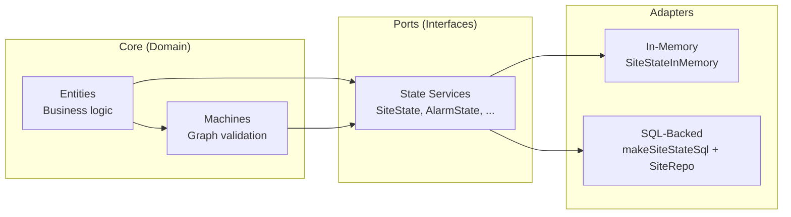
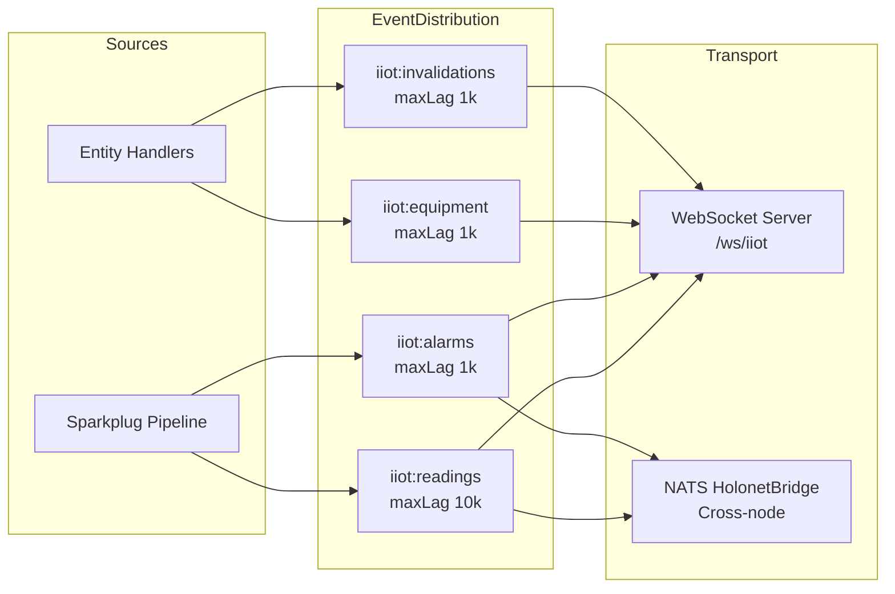

# TMNL IIoT v3 Architecture Overview

## Introduction

The v3 IIoT Service Architecture is a full-stack industrial automation platform built on **Effect-TS**. It unifies AMS v2 patterns (Entity/Event, CQRS, Effect Cluster) with IIoT patterns (Model/Repo, DDL co-location, PostgreSQL extensions) into a single coherent system.

The architecture follows ISA-95/IEC 62264 equipment hierarchy standards and implements hybrid event sourcing per ADR-0012: decision-critical domains (Alarms, Work Orders, Equipment State) use event sourcing with full audit trails, while asset CRUD domains (Sites, Plants, Lines, etc.) use direct state mutation.

## Phase Progression

The system was built across 7 phases, 25 epics, and ~267 story points:

| Phase | Epics | Focus |
|-------|-------|-------|
| **Phase 1: Foundation** | 1-6 | Schemas, Models, DDL, Repos, Errors, Infrastructure |
| **Phase 2: Event Sourcing** | 7-12 | ES Infrastructure, Alarm/WorkOrder/Equipment migration, Testing |
| **Phase 3: Entity & Service** | 13-16 | Entity definitions, State services, Events, Handlers |
| **Phase 4: RPC & HTTP** | 17-18 | RPC groups, HTTP handlers, Serialization |
| **Phase 5: Realtime** | 19-20 | Stream processing, WebSocket, EventDistribution |
| **Phase 6: Integration** | 21-22 | Migration tooling, Layer composition, Deployment |
| **Phase 7: DX** | 23-24 | Documentation, Code generators, CLI tools |

## Module Map

```
src/lib/iiot/
  schemas/         # Domain schemas (Effect Schema) — single source of truth
    assets/        #   ISA-95 hierarchy: enterprise, site, area, plant, line, workcell, machine, sensor, device
    common/        #   Shared types: AssetStatus, AssetLocation, AssetMetadata
    identifiers.ts #   Branded IDs: SiteId, PlantId, AlarmId, etc.
    hierarchy.ts   #   HierarchyPath, PathSegment
  models/          # Persistence models derived from schemas (@effect/sql Model)
    assets/        #   Asset models (SiteModel, PlantModel, etc.)
    alarms/        #   Alarm models
    readings/      #   Sensor reading models (TimescaleDB hypertables)
    work-orders/   #   Work order models
    equipment-state/ # Equipment state models
  repos/           # Manual SQL repositories with decode utilities
    SiteRepo.ts    #   Example: findById, findAll, insert, update, delete
    _decode.ts     #   Shared decode helpers: decodeOptional, decodeRows, decodeFirst, prepareUpdate
  state/           # State services (hexagonal port pattern)
    SiteState.ts   #   In-memory + SQL implementations, swappable via Layer
    AlarmState.ts  #   Alarm state with ISA-18.2 support
  entity/          # Effect Cluster entities (distributed actors)
    AlarmEntity.ts #   ES entity with Machine-delegated handlers
    SiteEntity.ts  #   CRUD entity with lifecycle state graph
    EntityStack.ts #   Pre-composed Layer stacks
    _helpers.ts    #   Feature-flag controlled event emission
  machines/        # @effect/experimental Machine actors (state graph validation)
    AlarmMachine.ts
    SiteMachine.ts
    graphs/        #   ISA-95 state transition graphs
  rpc/             # RPC group definitions (@effect/rpc)
    SiteRpcs.ts    #   EntityProxy.toRpcGroup() pattern
    AlarmRpcs.ts   #   Direct RpcGroup.make() pattern
    RealtimeRpcs.ts #  Streaming RPC definitions
  http/            # HTTP transport layer (@effect/platform HttpRouter)
  infrastructure/  # Cross-cutting concerns
    feature-flags.ts   # ES migration feature flags (per-domain toggles)
    deployment-mode.ts # Test/Tauri/Cluster deployment selection
    sql-event-journal.ts # Event journal for ES domains
    eventlog-layer.ts  # EventLog Layer composition
  realtime/        # WebSocket & streaming
    event-distribution.ts # ChannelService-backed event hub (4 channels)
    websocket-server.ts   # RpcServer WebSocket router
    realtime-handlers.ts  # Streaming RPC handler implementations
    holonet-bridge.ts     # NATS integration for cross-node distribution
    iiot-subjects.ts      # NATS subject hierarchy
    reactivity-bridge.ts  # Entity handler -> realtime bridge
  layers/          # Deployment profile layers
    index.ts       # IIoTTestLayer, IIoTClusterLayer, IIoTRuntimeLayer
  adapters/        # Sparkplug-B ingestion pipeline
    ingestion-service.ts # SparkplugPipelineLayer composition
  fermion/         # HTTP API handlers (fermion pattern)
  handlers/        # Event handlers
  services/        # L2 service layer
  migrations/      # Database migration scripts
  workflow/        # Workflow definitions
```

## Dependency Graph

```mermaid
graph TD
    subgraph "Phase 1: Foundation"
        SCH[Schemas<br/>Effect Schema types]
        MOD[Models<br/>@effect/sql Model]
        REPO[Repositories<br/>Manual SQL + decode]
        INF[Infrastructure<br/>Feature flags, DDL]
    end

    subgraph "Phase 3: Entity & Service"
        STATE[State Services<br/>Hexagonal ports]
        MACH[Machines<br/>@effect/experimental]
        ENT[Entities<br/>@effect/cluster]
    end

    subgraph "Phase 4: RPC & HTTP"
        RPC[RPC Groups<br/>@effect/rpc]
        HTTP[HTTP Handlers<br/>@effect/platform]
    end

    subgraph "Phase 5: Realtime"
        EVDIST[EventDistribution<br/>ChannelService hub]
        WS[WebSocket Server<br/>RpcServer.layerProtocol]
        HOLO[HolonetBridge<br/>NATS cross-node]
    end

    subgraph "Phase 6: Layers"
        LAYERS[Deployment Layers<br/>Test / Cluster / Runtime]
    end

    SCH --> MOD --> REPO
    SCH --> STATE
    SCH --> ENT
    INF --> ENT
    STATE --> MACH --> ENT
    ENT --> RPC --> HTTP
    ENT --> RPC --> WS
    EVDIST --> WS
    HOLO --> EVDIST
    STATE --> LAYERS
    ENT --> LAYERS
    REPO --> LAYERS
```

## Layer Composition Architecture

The system uses Effect's Layer system for dependency injection and deployment profiles. Three pre-composed stacks are available:

### IIoTTestLayer (In-Memory)

Self-contained testing stack. No external dependencies.

```
IIoTTestLayer
  EntityHandlersLayer (12 entity handlers)
    AlarmEntityHandlers
    WorkOrderEntityHandlers
    EquipmentStateEntityHandlers
    EnterpriseEntityHandlers
    SiteEntityHandlers
    AreaEntityHandlers
    PlantEntityHandlers
    LineEntityHandlers
    WorkCellEntityHandlers
    MachineAssetEntityHandlers
    DeviceEntityHandlers
    SensorAssetEntityHandlers
  AllStateServicesInMemory (12 in-memory state services)
  IIoTFeatureFlagsDisabledLayer
```

### IIoTClusterLayer (Production)

Production stack with SQL-backed state and events enabled.

```
IIoTClusterLayer
  EntityProductionHandlersWithEvents
    EntityHandlersLayer (12 handlers)
    IIoTFeatureFlagsEnabledLayer
  AllStateServicesSql (12 SQL-backed state services)
  IIoTRepositoriesLive (12 repositories)
  Requires: SqlClient.SqlClient
```

### IIoTRuntimeLayer (Config-Driven)

Selects the appropriate stack based on `DeploymentModeConfig`:

```typescript
const IIoTRuntimeLayer = Layer.unwrapEffect(
  Effect.gen(function* () {
    const { mode } = yield* DeploymentModeConfig
    switch (mode) {
      case 'test':    return IIoTTestLayer
      case 'tauri':   return IIoTTestLayer  // TODO: SQLite
      case 'cluster': return IIoTClusterLayer
    }
  })
)
```

## Hexagonal Architecture Pattern

The architecture follows a hexagonal (ports & adapters) pattern:



**State services** are the central port. Each has:
- An **interface** (e.g., `SiteStateShape`) defining CRUD operations
- A **Context.Tag** (e.g., `SiteState`) for dependency injection
- An **in-memory implementation** (`SiteStateInMemory`) for testing
- A **SQL factory** (`makeSiteStateSql`) that bridges to repositories

Entities and Machines depend on state services through Effect's Context system. The actual implementation (in-memory vs SQL) is injected via Layer composition at the application boundary.

## ISA-95 Equipment Hierarchy

The asset schemas follow the ISA-95/IEC 62264 equipment hierarchy:

```
Enterprise (Level 4 - Business Planning)
  Site (Level 3 - MES/MOM scope - geographic)
    Area (Level 3 - MES/MOM scope - functional)
      Plant (Level 2 - Control scope)
        Line (Level 1 - Process scope)
          WorkCell (Level 1 - Process scope)
            Machine (Level 0 - Equipment)
              Device (Level 0 - I/O)
                Sensor (Level 0 - Measurement)
```

Each asset type has:
- A **branded identifier** (e.g., `SiteId` = `SIT-{slug}`)
- A **domain-specific status enum** (e.g., `SiteStatus`: planned, under_construction, operational, ...)
- A **state transition graph** validated by its Machine
- A **HierarchyPath** for materialized path queries

## Event Sourcing Boundaries (ADR-0012)

The system implements **hybrid event sourcing** — not all domains are event sourced:

| Domain | Strategy | Rationale |
|--------|----------|-----------|
| **Alarms** | Event Sourced | ISA-18.2 audit trail, regulatory compliance |
| **Work Orders** | Event Sourced | Full lifecycle audit, 46 event types |
| **Equipment State** | Event Sourced | State transition history, 6 event types |
| **Assets** (Site, Plant, etc.) | CRUD | Low-frequency changes, no audit requirement |
| **Sensor Readings** | Append-Only | Time-series data, no mutations |

Feature flags control the ES migration per-domain:

```typescript
interface FeatureFlagsShape {
  alarmEventSourcingEnabled: boolean
  equipmentStateEventSourcingEnabled: boolean
  workOrderEventSourcingEnabled: boolean
  batchRecordEventSourcingEnabled: boolean
  pgLakeEnabled: boolean
}
```

## Realtime Architecture

The realtime layer distributes events from ingestion pipeline and entity handlers to WebSocket subscribers:



Each channel uses the ChannelService pattern:
- **PubSub** as inlet source (fire-and-forget publishing)
- **ChannelService** for managed fan-out with backpressure
- **Broadcast outlets** for subscriber streams (each subscriber gets its own outlet)
- **HolonetBridge** for dual-publishing to NATS (cross-node distribution)

## Technology Stack

| Concern | Technology |
|---------|-----------|
| Runtime | Effect-TS (services, layers, streams, schema) |
| Clustering | @effect/cluster (distributed entity actors) |
| State Machines | @effect/experimental Machine |
| RPC | @effect/rpc (typed RPC groups) |
| HTTP | @effect/platform HttpRouter |
| SQL | @effect/sql (PostgreSQL) |
| Database | PostgreSQL + TimescaleDB + AGE |
| Messaging | NATS (via HolonetBridge) |
| Protocol | Sparkplug-B (MQTT for IIoT) |
| Serialization | RpcSerialization.layerJson |
| Streaming | Effect Stream + ChannelService |
