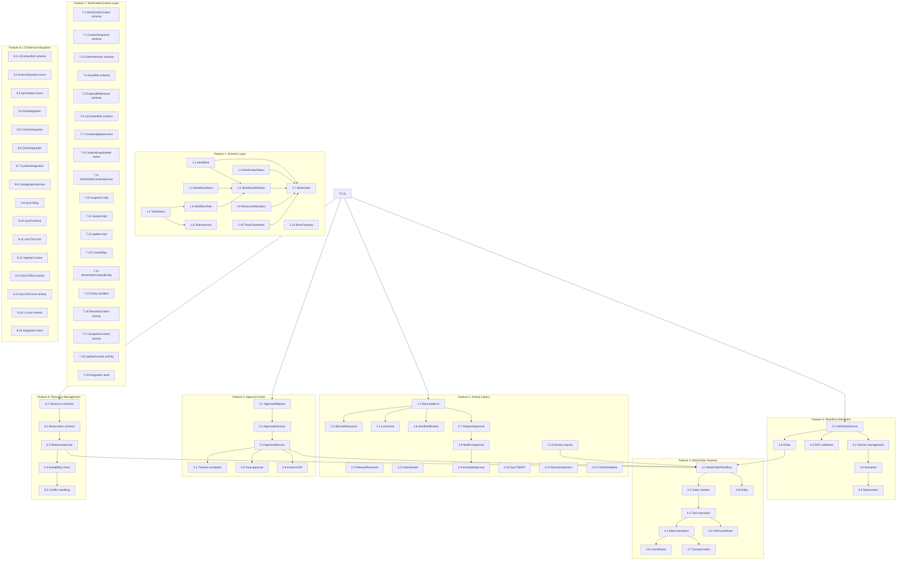

# WorkOrder + Workflow System Decomposition

**Generated:** 2026-01-29
**Updated:** 2026-01-30 (Parallel Agent Audit Integration)
**EDIN Phase:** DESIGN
**Decomposition Depth:** 2 (Features + Tasks)
**CAP Alignment:** `thoughts/shared/alignments/2026-01-29-work-order-workflow.md`

---

## CAP-Aligned Model (Round 3 - Confirmed)

The WorkOrder system is built around **WorkOrderContext** — a hybrid container that bridges audit requirements (immutable snapshots) with operational needs (live entity state).

### Shape: WorkOrderContext

```
┌─────────────────────────────────────────────────────────────────┐
│ SHAPE: WorkOrderContext                                          │
├─────────────────────────────────────────────────────────────────┤
│ • Hybrid snapshot + live references                              │
│ • Version-tracked updates (mid-execution mutations)              │
│ • Audit-ready: snapshot() for compliance, resolve() for state    │
└─────────────────────────────────────────────────────────────────┘
```

**Key Properties:**
- `workOrderId: WorkOrderId` — Owner work order
- `version: ContextVersion` — Monotonic version for conflict detection
- `snapshotAt: DateTime` — When context was captured
- `assets: Map<AssetId, AssetRef>` — Machine/line refs (live + snapshot)
- `resources: Map<ResourceId, ResourceAllocation>` — Parts, tools, personnel
- `alarms: Option<AlarmId>` — Triggering alarm if maintenance order
- `parentWorkOrder: Option<WorkOrderId>` — Nested workflow parent
- `childWorkOrders: Array<WorkOrderId>` — Spawned child workflows
- `externalRefs: Map<ExternalSystem, ExternalId>` — ERP IDs, ticket numbers
- `l3Context: L3ContextRef` — Progressive external integration layer

### Composition: 4-Layer Delegation Pattern

```
┌─────────────────────────────────────────────────────────────────┐
│ COMPOSITION: 4-Layer Delegation                                  │
├─────────────────────────────────────────────────────────────────┤
│ Activity.make()                                                  │
│     ↓ calls                                                      │
│ RPC Client (typed request/response)                              │
│     ↓ delegates to                                               │
│ Effect.Service (domain logic)                                    │
│     ↓ persists via                                               │
│ Cluster Entity (EventLog)                                        │
└─────────────────────────────────────────────────────────────────┘
```

**Layer Responsibilities:**

| Layer | Responsibility | Example |
|-------|---------------|---------|
| **Activity** | Workflow orchestration, retry, compensation | `AllocateResource`, `LockAsset` |
| **RPC Client** | Type-safe request/response, serialization | `ResourceRpc.allocate(params)` |
| **Effect.Service** | Domain logic, validation, business rules | `ResourceService.allocate()` |
| **Cluster Entity** | State persistence, event sourcing | `ResourceEntity.handle(AllocateCommand)` |

### API: Context Operations

```
┌─────────────────────────────────────────────────────────────────┐
│ API: Context Operations                                          │
├─────────────────────────────────────────────────────────────────┤
│ • Context.snapshot(workOrderId) → Immutable audit record         │
│ • Context.resolve(workOrderId)  → Live entity state              │
│ • Context.update(workOrderId, patch) → Version-tracked mutation  │
└─────────────────────────────────────────────────────────────────┘
```

**Operation Semantics:**

| Operation | Returns | Side Effects | Use Case |
|-----------|---------|--------------|----------|
| `snapshot()` | `ContextSnapshot` | None | Audit, compliance, history |
| `resolve()` | `WorkOrderContext` | None | Live state queries |
| `update()` | `WorkOrderContext` | Emits `ContextUpdated` event | Mid-execution mutations |

### Scope: What WorkOrderContext Contains

```
┌─────────────────────────────────────────────────────────────────┐
│ SCOPE: What WorkOrder Context Contains                           │
├─────────────────────────────────────────────────────────────────┤
│ • Assets: machines, lines (AssetId refs + snapshot)              │
│ • Resources: parts, tools, personnel (allocation state)          │
│ • Alarms: triggering alarm if maintenance order (AlarmId)        │
│ • Parent/child WorkOrders: nested workflow refs                  │
│ • External refs: ERP order IDs, ticket numbers                   │
│ • L3 Context: progressive external system integration            │
└─────────────────────────────────────────────────────────────────┘
```

---

## Event Schema Catalog (All ES Domains)

This section catalogs ALL events across the WorkOrder+Workflow system. Events are grouped by aggregate root.

### WorkOrder Events (Aggregate: WorkOrder)

```typescript
// ═══════════════════════════════════════════════════════════════════════════
// WORKORDER LIFECYCLE EVENTS
// ═══════════════════════════════════════════════════════════════════════════

/** Work order created from workflow definition */
export const WorkOrderCreated = Schema.TaggedStruct('WorkOrderCreated', {
  workOrderId: WorkOrderId,
  workflowDefinitionId: WorkflowDefinitionId,
  workflowVersion: Schema.Number,
  title: Schema.String,
  description: Schema.OptionFromNullOr(Schema.String),
  priority: WorkOrderPriority,
  createdBy: Schema.String,
  createdAt: Schema.DateTimeUtc,
  scheduledStart: Schema.OptionFromNullOr(Schema.DateTimeUtc),
  dueDate: Schema.OptionFromNullOr(Schema.DateTimeUtc),
})

/** Work order submitted for approval */
export const WorkOrderSubmitted = Schema.TaggedStruct('WorkOrderSubmitted', {
  workOrderId: WorkOrderId,
  submittedBy: Schema.String,
  submittedAt: Schema.DateTimeUtc,
})

/** Work order approved (single or final approval) */
export const WorkOrderApproved = Schema.TaggedStruct('WorkOrderApproved', {
  workOrderId: WorkOrderId,
  approvedBy: Schema.String,
  approvedAt: Schema.DateTimeUtc,
  approvalLevel: Schema.Number, // 1 = first approver, 2 = second (4-eyes), etc.
  comments: Schema.OptionFromNullOr(Schema.String),
})

/** Work order rejected */
export const WorkOrderRejected = Schema.TaggedStruct('WorkOrderRejected', {
  workOrderId: WorkOrderId,
  rejectedBy: Schema.String,
  rejectedAt: Schema.DateTimeUtc,
  reason: Schema.String,
})

/** Work order execution started */
export const WorkOrderStarted = Schema.TaggedStruct('WorkOrderStarted', {
  workOrderId: WorkOrderId,
  startedBy: Schema.String,
  startedAt: Schema.DateTimeUtc,
  actualStart: Schema.DateTimeUtc,
})

/** Work order paused/suspended */
export const WorkOrderSuspended = Schema.TaggedStruct('WorkOrderSuspended', {
  workOrderId: WorkOrderId,
  suspendedBy: Schema.String,
  suspendedAt: Schema.DateTimeUtc,
  reason: SuspensionReason,
  expectedResume: Schema.OptionFromNullOr(Schema.DateTimeUtc),
})

/** Work order resumed from suspension */
export const WorkOrderResumed = Schema.TaggedStruct('WorkOrderResumed', {
  workOrderId: WorkOrderId,
  resumedBy: Schema.String,
  resumedAt: Schema.DateTimeUtc,
})

/** Work order completed successfully */
export const WorkOrderCompleted = Schema.TaggedStruct('WorkOrderCompleted', {
  workOrderId: WorkOrderId,
  completedBy: Schema.String,
  completedAt: Schema.DateTimeUtc,
  actualEnd: Schema.DateTimeUtc,
  outcome: WorkOrderOutcome,
  summary: Schema.OptionFromNullOr(Schema.String),
})

/** Work order failed */
export const WorkOrderFailed = Schema.TaggedStruct('WorkOrderFailed', {
  workOrderId: WorkOrderId,
  failedAt: Schema.DateTimeUtc,
  failureReason: Schema.String,
  failedTaskId: Schema.OptionFromNullOr(TaskInstanceId),
})

/** Work order cancelled before completion */
export const WorkOrderCancelled = Schema.TaggedStruct('WorkOrderCancelled', {
  workOrderId: WorkOrderId,
  cancelledBy: Schema.String,
  cancelledAt: Schema.DateTimeUtc,
  reason: Schema.String,
  compensationRequired: Schema.Boolean,
})

/** Work order closed (final state, archived) */
export const WorkOrderClosed = Schema.TaggedStruct('WorkOrderClosed', {
  workOrderId: WorkOrderId,
  closedBy: Schema.String,
  closedAt: Schema.DateTimeUtc,
  finalStatus: WorkOrderFinalStatus,
})

/** Event group */
export const WorkOrderEvents = Schema.Union(
  WorkOrderCreated,
  WorkOrderSubmitted,
  WorkOrderApproved,
  WorkOrderRejected,
  WorkOrderStarted,
  WorkOrderSuspended,
  WorkOrderResumed,
  WorkOrderCompleted,
  WorkOrderFailed,
  WorkOrderCancelled,
  WorkOrderClosed,
)
```

### WorkOrderContext Events (Aggregate: WorkOrderContext)

```typescript
// ═══════════════════════════════════════════════════════════════════════════
// WORKORDER CONTEXT EVENTS
// ═══════════════════════════════════════════════════════════════════════════

/** Context created for work order */
export const ContextCreated = Schema.TaggedStruct('ContextCreated', {
  workOrderId: WorkOrderId,
  initialAssets: Schema.Array(AssetId),
  createdBy: Schema.String,
  createdAt: Schema.DateTimeUtc,
})

/** Context updated with version tracking */
export const ContextUpdated = Schema.TaggedStruct('ContextUpdated', {
  workOrderId: WorkOrderId,
  patch: ContextPatch,
  previousVersion: Schema.Number,
  newVersion: Schema.Number,
  updatedBy: Schema.String,
  updatedAt: Schema.DateTimeUtc,
})

/** Immutable snapshot created for audit */
export const ContextSnapshotted = Schema.TaggedStruct('ContextSnapshotted', {
  workOrderId: WorkOrderId,
  snapshotId: SnapshotId,
  version: Schema.Number,
  snapshotAt: Schema.DateTimeUtc,
  reason: SnapshotReason,
})

/** Asset attached to context */
export const AssetAttached = Schema.TaggedStruct('AssetAttached', {
  workOrderId: WorkOrderId,
  assetId: AssetId,
  assetType: AssetType,
  snapshotData: Schema.OptionFromNullOr(AssetSnapshot),
  attachedBy: Schema.String,
  attachedAt: Schema.DateTimeUtc,
})

/** Asset detached from context */
export const AssetDetached = Schema.TaggedStruct('AssetDetached', {
  workOrderId: WorkOrderId,
  assetId: AssetId,
  detachedBy: Schema.String,
  detachedAt: Schema.DateTimeUtc,
  reason: Schema.OptionFromNullOr(Schema.String),
})

/** Resource allocated to work order */
export const ResourceAllocated = Schema.TaggedStruct('ResourceAllocated', {
  workOrderId: WorkOrderId,
  resourceId: ResourceId,
  resourceType: ResourceType,
  quantity: Schema.Number,
  unit: Schema.String,
  allocatedBy: Schema.String,
  allocatedAt: Schema.DateTimeUtc,
})

/** Resource released from work order */
export const ResourceReleased = Schema.TaggedStruct('ResourceReleased', {
  workOrderId: WorkOrderId,
  resourceId: ResourceId,
  quantityReleased: Schema.Number,
  releasedBy: Schema.String,
  releasedAt: Schema.DateTimeUtc,
  reason: Schema.OptionFromNullOr(Schema.String),
})

/** External reference linked */
export const ExternalRefLinked = Schema.TaggedStruct('ExternalRefLinked', {
  workOrderId: WorkOrderId,
  system: ExternalSystem,
  externalId: Schema.String,
  linkedBy: Schema.String,
  linkedAt: Schema.DateTimeUtc,
})

/** External reference unlinked */
export const ExternalRefUnlinked = Schema.TaggedStruct('ExternalRefUnlinked', {
  workOrderId: WorkOrderId,
  system: ExternalSystem,
  externalId: Schema.String,
  unlinkedBy: Schema.String,
  unlinkedAt: Schema.DateTimeUtc,
})

/** Child work order spawned */
export const ChildWorkOrderSpawned = Schema.TaggedStruct('ChildWorkOrderSpawned', {
  parentWorkOrderId: WorkOrderId,
  childWorkOrderId: WorkOrderId,
  reason: Schema.String,
  spawnedAt: Schema.DateTimeUtc,
})

/** Event group */
export const WorkOrderContextEvents = Schema.Union(
  ContextCreated,
  ContextUpdated,
  ContextSnapshotted,
  AssetAttached,
  AssetDetached,
  ResourceAllocated,
  ResourceReleased,
  ExternalRefLinked,
  ExternalRefUnlinked,
  ChildWorkOrderSpawned,
)
```

### TaskInstance Events (Aggregate: TaskInstance)

```typescript
// ═══════════════════════════════════════════════════════════════════════════
// TASK INSTANCE EVENTS
// ═══════════════════════════════════════════════════════════════════════════

/** Task ready to start (dependencies satisfied) */
export const TaskBecameReady = Schema.TaggedStruct('TaskBecameReady', {
  taskInstanceId: TaskInstanceId,
  workOrderId: WorkOrderId,
  taskDefinitionId: TaskDefinitionId,
  becameReadyAt: Schema.DateTimeUtc,
})

/** Task execution started */
export const TaskStarted = Schema.TaggedStruct('TaskStarted', {
  taskInstanceId: TaskInstanceId,
  workOrderId: WorkOrderId,
  startedBy: Schema.String,
  startedAt: Schema.DateTimeUtc,
  assignedTo: Schema.OptionFromNullOr(Schema.String),
})

/** Task progress updated */
export const TaskProgressUpdated = Schema.TaggedStruct('TaskProgressUpdated', {
  taskInstanceId: TaskInstanceId,
  workOrderId: WorkOrderId,
  progress: Schema.Number.pipe(Schema.between(0, 100)),
  notes: Schema.OptionFromNullOr(Schema.String),
  updatedAt: Schema.DateTimeUtc,
})

/** Task blocked by dependency or issue */
export const TaskBlocked = Schema.TaggedStruct('TaskBlocked', {
  taskInstanceId: TaskInstanceId,
  workOrderId: WorkOrderId,
  blockedAt: Schema.DateTimeUtc,
  blockingReason: BlockingReason,
  blockedBy: Schema.OptionFromNullOr(TaskInstanceId),
})

/** Task unblocked */
export const TaskUnblocked = Schema.TaggedStruct('TaskUnblocked', {
  taskInstanceId: TaskInstanceId,
  workOrderId: WorkOrderId,
  unblockedAt: Schema.DateTimeUtc,
})

/** Task completed successfully */
export const TaskCompleted = Schema.TaggedStruct('TaskCompleted', {
  taskInstanceId: TaskInstanceId,
  workOrderId: WorkOrderId,
  completedBy: Schema.String,
  completedAt: Schema.DateTimeUtc,
  output: Schema.OptionFromNullOr(Schema.Unknown),
})

/** Task failed */
export const TaskFailed = Schema.TaggedStruct('TaskFailed', {
  taskInstanceId: TaskInstanceId,
  workOrderId: WorkOrderId,
  failedAt: Schema.DateTimeUtc,
  error: Schema.String,
  retryable: Schema.Boolean,
})

/** Task skipped (conditional skip) */
export const TaskSkipped = Schema.TaggedStruct('TaskSkipped', {
  taskInstanceId: TaskInstanceId,
  workOrderId: WorkOrderId,
  skippedBy: Schema.String,
  skippedAt: Schema.DateTimeUtc,
  reason: Schema.String,
})

/** Task compensated (rollback) */
export const TaskCompensated = Schema.TaggedStruct('TaskCompensated', {
  taskInstanceId: TaskInstanceId,
  workOrderId: WorkOrderId,
  compensatedAt: Schema.DateTimeUtc,
  compensationResult: CompensationResult,
})

/** Event group */
export const TaskInstanceEvents = Schema.Union(
  TaskBecameReady,
  TaskStarted,
  TaskProgressUpdated,
  TaskBlocked,
  TaskUnblocked,
  TaskCompleted,
  TaskFailed,
  TaskSkipped,
  TaskCompensated,
)
```

### Approval Events (Aggregate: ApprovalRequest)

```typescript
// ═══════════════════════════════════════════════════════════════════════════
// APPROVAL EVENTS
// ═══════════════════════════════════════════════════════════════════════════

/** Approval requested */
export const ApprovalRequested = Schema.TaggedStruct('ApprovalRequested', {
  approvalId: ApprovalId,
  workOrderId: WorkOrderId,
  taskInstanceId: Schema.OptionFromNullOr(TaskInstanceId),
  approvalType: ApprovalType,
  requiredApprovers: Schema.Number,
  requestedBy: Schema.String,
  requestedAt: Schema.DateTimeUtc,
  expiresAt: Schema.OptionFromNullOr(Schema.DateTimeUtc),
})

/** Approval granted by one approver */
export const ApprovalGranted = Schema.TaggedStruct('ApprovalGranted', {
  approvalId: ApprovalId,
  approvedBy: Schema.String,
  approvedAt: Schema.DateTimeUtc,
  comments: Schema.OptionFromNullOr(Schema.String),
  approvalCount: Schema.Number, // Current count after this approval
  requiredCount: Schema.Number,
})

/** Approval rejected */
export const ApprovalRejected = Schema.TaggedStruct('ApprovalRejected', {
  approvalId: ApprovalId,
  rejectedBy: Schema.String,
  rejectedAt: Schema.DateTimeUtc,
  reason: Schema.String,
})

/** Approval escalated due to timeout */
export const ApprovalEscalated = Schema.TaggedStruct('ApprovalEscalated', {
  approvalId: ApprovalId,
  escalatedAt: Schema.DateTimeUtc,
  escalationLevel: Schema.Number,
  newApprovers: Schema.Array(Schema.String),
  reason: Schema.String,
})

/** Approval completed (all required approvals received) */
export const ApprovalCompleted = Schema.TaggedStruct('ApprovalCompleted', {
  approvalId: ApprovalId,
  completedAt: Schema.DateTimeUtc,
  finalStatus: ApprovalFinalStatus,
})

/** Approval expired (timeout without decision) */
export const ApprovalExpired = Schema.TaggedStruct('ApprovalExpired', {
  approvalId: ApprovalId,
  expiredAt: Schema.DateTimeUtc,
  escalated: Schema.Boolean,
})

/** Event group */
export const ApprovalEvents = Schema.Union(
  ApprovalRequested,
  ApprovalGranted,
  ApprovalRejected,
  ApprovalEscalated,
  ApprovalCompleted,
  ApprovalExpired,
)
```

### L3 Sync Events (Aggregate: L3SyncOperation)

```typescript
// ═══════════════════════════════════════════════════════════════════════════
// L3 EXTERNAL SYNC EVENTS
// ═══════════════════════════════════════════════════════════════════════════

/** L3 sync operation started */
export const L3SyncStarted = Schema.TaggedStruct('L3SyncStarted', {
  syncId: SyncId,
  workOrderId: WorkOrderId,
  system: ExternalSystem,
  direction: SyncDirection,
  startedAt: Schema.DateTimeUtc,
  itemCount: Schema.OptionFromNullOr(Schema.Number),
})

/** L3 sync progress update */
export const L3SyncProgress = Schema.TaggedStruct('L3SyncProgress', {
  syncId: SyncId,
  progress: Schema.Number.pipe(Schema.between(0, 100)),
  itemsProcessed: Schema.Number,
  currentPhase: SyncPhase,
  updatedAt: Schema.DateTimeUtc,
})

/** L3 sync completed successfully */
export const L3SyncCompleted = Schema.TaggedStruct('L3SyncCompleted', {
  syncId: SyncId,
  workOrderId: WorkOrderId,
  system: ExternalSystem,
  completedAt: Schema.DateTimeUtc,
  itemsSynced: Schema.Number,
  duration: Schema.Duration,
})

/** L3 sync failed */
export const L3SyncFailed = Schema.TaggedStruct('L3SyncFailed', {
  syncId: SyncId,
  workOrderId: WorkOrderId,
  system: ExternalSystem,
  failedAt: Schema.DateTimeUtc,
  error: Schema.String,
  retryable: Schema.Boolean,
  itemsProcessedBeforeFailure: Schema.Number,
})

/** External change detected */
export const ExternalChangeDetected = Schema.TaggedStruct('ExternalChangeDetected', {
  workOrderId: WorkOrderId,
  system: ExternalSystem,
  changeType: ExternalChangeType,
  externalId: Schema.String,
  detectedAt: Schema.DateTimeUtc,
  payload: Schema.Unknown,
})

/** Event group */
export const L3SyncEvents = Schema.Union(
  L3SyncStarted,
  L3SyncProgress,
  L3SyncCompleted,
  L3SyncFailed,
  ExternalChangeDetected,
)
```

### WorkflowDefinition Events (Aggregate: WorkflowDefinition)

```typescript
// ═══════════════════════════════════════════════════════════════════════════
// WORKFLOW DEFINITION EVENTS
// ═══════════════════════════════════════════════════════════════════════════

/** Workflow definition created */
export const DefinitionCreated = Schema.TaggedStruct('DefinitionCreated', {
  definitionId: WorkflowDefinitionId,
  name: Schema.String,
  version: SemanticVersion,
  createdBy: Schema.String,
  createdAt: Schema.DateTimeUtc,
})

/** Workflow definition updated (new version) */
export const DefinitionVersioned = Schema.TaggedStruct('DefinitionVersioned', {
  definitionId: WorkflowDefinitionId,
  previousVersion: SemanticVersion,
  newVersion: SemanticVersion,
  changes: Schema.Array(DefinitionChange),
  versionedBy: Schema.String,
  versionedAt: Schema.DateTimeUtc,
})

/** Workflow definition activated (ready for use) */
export const DefinitionActivated = Schema.TaggedStruct('DefinitionActivated', {
  definitionId: WorkflowDefinitionId,
  version: SemanticVersion,
  activatedBy: Schema.String,
  activatedAt: Schema.DateTimeUtc,
})

/** Workflow definition deprecated (no new work orders) */
export const DefinitionDeprecated = Schema.TaggedStruct('DefinitionDeprecated', {
  definitionId: WorkflowDefinitionId,
  version: SemanticVersion,
  deprecatedBy: Schema.String,
  deprecatedAt: Schema.DateTimeUtc,
  reason: Schema.String,
  migrationPath: Schema.OptionFromNullOr(WorkflowDefinitionId),
})

/** Workflow definition archived */
export const DefinitionArchived = Schema.TaggedStruct('DefinitionArchived', {
  definitionId: WorkflowDefinitionId,
  archivedBy: Schema.String,
  archivedAt: Schema.DateTimeUtc,
})

/** Event group */
export const WorkflowDefinitionEvents = Schema.Union(
  DefinitionCreated,
  DefinitionVersioned,
  DefinitionActivated,
  DefinitionDeprecated,
  DefinitionArchived,
)
```

### Event Summary Table

| Aggregate | Event Count | Events |
|-----------|-------------|--------|
| **WorkOrder** | 11 | Created, Submitted, Approved, Rejected, Started, Suspended, Resumed, Completed, Failed, Cancelled, Closed |
| **WorkOrderContext** | 10 | ContextCreated, ContextUpdated, ContextSnapshotted, AssetAttached, AssetDetached, ResourceAllocated, ResourceReleased, ExternalRefLinked, ExternalRefUnlinked, ChildWorkOrderSpawned |
| **TaskInstance** | 9 | BecameReady, Started, ProgressUpdated, Blocked, Unblocked, Completed, Failed, Skipped, Compensated |
| **ApprovalRequest** | 6 | Requested, Granted, Rejected, Escalated, Completed, Expired |
| **L3SyncOperation** | 5 | Started, Progress, Completed, Failed, ExternalChangeDetected |
| **WorkflowDefinition** | 5 | Created, Versioned, Activated, Deprecated, Archived |
| **TOTAL** | **46** | |

---

## V-Model Trace Matrix

```
┌─────────────────────────────────────────────────────────────────────────────┐
│                         V-MODEL TRACE MATRIX                                 │
├─────────────────────────────────────────────────────────────────────────────┤
│ REQUIREMENTS (Left Arm)              VALIDATION (Right Arm)                  │
├─────────────────────────────────────────────────────────────────────────────┤
│ Epic: WorkOrder+Workflow System   ◄─► System Test: E2E workflow execution    │
│   F1: Schema Layer                ◄─► Integration: Schema serialization      │
│   F2: Activity Library            ◄─► Integration: Activity compensation     │
│   F3: Workflow Definitions        ◄─► Integration: Workflow persistence      │
│   F4: WorkOrder Runtime           ◄─► Integration: Order lifecycle           │
│   F5: Approval Gates              ◄─► Integration: DurableDeferred signals   │
│   F6: Resource Management         ◄─► Integration: Allocation/release        │
│   F7: WorkOrderContext Layer      ◄─► Integration: Snapshot/resolve tests    │
│   F8: L3 External Integration     ◄─► Integration: ERP sync, external refs   │
└─────────────────────────────────────────────────────────────────────────────┘
```

---

## Feature 1: Schema Layer

**Description:** Domain schemas for WorkflowDefinition, WorkOrder, WorkflowTask, and related types.

### Tasks

| ID | Task | Files | Pattern | Acceptance |
|----|------|-------|---------|------------|
| 1.1 | Define WorkflowDefinitionId, WorkOrderId identifiers | `schemas/identifiers.ts` | Schema.brand | Type-safe branded IDs |
| 1.2 | Define WorkflowStatus enum | `schemas/work-orders.ts` | Schema.Literal | draft, active, deprecated, archived |
| 1.3 | Define WorkOrderStatus enum | `schemas/work-orders.ts` | Schema.Literal | ISA-95 L3 states |
| 1.4 | Define TaskStatus enum | `schemas/work-orders.ts` | Schema.Literal | pending, in_progress, blocked, completed, skipped |
| 1.5 | Define WorkflowDefinition schema | `schemas/work-orders.ts` | Schema.TaggedClass | Versioned template with task DAG |
| 1.6 | Define WorkflowTask schema | `schemas/work-orders.ts` | Schema.TaggedClass | Individual task with approval config |
| 1.7 | Define WorkOrder schema | `schemas/work-orders.ts` | Schema.TaggedClass | Instance referencing definition |
| 1.8 | Define TaskInstance schema | `schemas/work-orders.ts` | Schema.TaggedClass | Runtime task state |
| 1.9 | Define ResourceAllocation schema | `schemas/work-orders.ts` | Schema.Struct | Parts, tools, personnel refs |
| 1.10 | Define TimeConstraints schema | `schemas/work-orders.ts` | Schema.Struct | SLA, due date, scheduling window |
| 1.11 | Define WorkOrderContext schema | `schemas/work-orders.ts` | Schema.TaggedClass | Hybrid snapshot+live refs container |
| 1.12 | Define ContextSnapshot schema | `schemas/work-orders.ts` | Schema.TaggedClass | Immutable audit record |
| 1.13 | Define ContextVersion schema | `schemas/work-orders.ts` | Schema.Struct | Version tracking for context updates |
| 1.14 | Define ExternalReference schema | `schemas/work-orders.ts` | Schema.Struct | ERP IDs, ticket numbers |
| 1.15 | Add barrel exports | `schemas/index.ts` | Re-export | All work-order types exported |

### Schemas Detail

```typescript
// WorkflowStatus - Template lifecycle
type WorkflowStatus = 'draft' | 'active' | 'deprecated' | 'archived'

// WorkOrderStatus - ISA-95 L3 Work Order states
type WorkOrderStatus =
  | 'created'      // Order created, not scheduled
  | 'scheduled'    // Assigned to time window
  | 'ready'        // Resources allocated, can start
  | 'in_progress'  // Execution started
  | 'suspended'    // Paused (waiting approval, resource unavailable)
  | 'completed'    // Successfully finished
  | 'cancelled'    // Aborted before completion
  | 'failed'       // Completed with failure

// TaskStatus - Individual task states
type TaskStatus = 'pending' | 'ready' | 'in_progress' | 'blocked' | 'completed' | 'skipped' | 'failed'

// ApprovalRequirement - Gate configuration
type ApprovalRequirement =
  | 'none'           // Auto-approve
  | 'single'         // One approver
  | 'dual'           // Two approvers (4-eyes)
  | 'supervisor'     // Requires supervisor role
  | 'quality'        // Requires QA role

// TaskType - What kind of work
type TaskType =
  | 'manual'         // Human performs physical work
  | 'inspection'     // QA check
  | 'automated'      // System executes activity
  | 'approval'       // Pure approval gate
  | 'subprocess'     // Child workflow
```

---

## Feature 2: Activity Library

**Description:** Reusable Activity definitions for workflow execution.

### Activity Categories

| Category | Activities | Purpose |
|----------|------------|---------|
| **Resource** | AllocateResource, ReleaseResource, CheckAvailability | Parts, tools, personnel |
| **Asset** | LockAsset, UnlockAsset, CheckAssetStatus | Machine/equipment control |
| **Notification** | SendNotification, SendEmail, SendPush | Alerts and comms |
| **Approval** | RequestApproval, WaitForApproval, EscalateApproval | Human gates |
| **Integration** | SyncToERP, CallExternalAPI, PublishEvent | External systems |
| **Quality** | RecordInspection, CheckQualityGate, LogNonConformance | QA/QC |
| **Time** | ScheduleTask, CheckDeadline, ExtendSLA | Time management |

### Tasks

| ID | Task | Files | Pattern | Acceptance |
|----|------|-------|---------|------------|
| 2.1 | Create activity base patterns | `workflow/activities/base.ts` | Activity.make | Base error types, retry config |
| 2.2 | Implement AllocateResource activity | `workflow/activities/resource.ts` | Activity.make + compensation | Allocate with rollback |
| 2.3 | Implement ReleaseResource activity | `workflow/activities/resource.ts` | Activity.make | Release allocated resources |
| 2.4 | Implement LockAsset activity | `workflow/activities/asset.ts` | Activity.make + compensation | Lock machine for maintenance |
| 2.5 | Implement UnlockAsset activity | `workflow/activities/asset.ts` | Activity.make | Release asset lock |
| 2.6 | Implement SendNotification activity | `workflow/activities/notification.ts` | Activity.make | Multi-channel notification |
| 2.7 | Implement RequestApproval activity | `workflow/activities/approval.ts` | DurableDeferred | Create approval request |
| 2.8 | Implement WaitForApproval activity | `workflow/activities/approval.ts` | DurableDeferred.await | Block until approved |
| 2.9 | Implement EscalateApproval activity | `workflow/activities/approval.ts` | Activity.make + DurableClock | Auto-escalate on timeout |
| 2.10 | Implement SyncToERP activity | `workflow/activities/integration.ts` | Activity.make + retry | Sync order to ERP |
| 2.11 | Implement RecordInspection activity | `workflow/activities/quality.ts` | Activity.make | Log inspection result |
| 2.12 | Implement CheckDeadline activity | `workflow/activities/time.ts` | DurableClock | SLA monitoring |
| 2.13 | Create activity barrel exports | `workflow/activities/index.ts` | Re-export | All activities exported |

### Activity Detail: AllocateResource

```typescript
export const AllocateResource = Activity.make({
  name: 'AllocateResource',
  success: ResourceAllocation,
  error: ResourceAllocationError,
  execute: Effect.gen(function* () {
    const attempt = yield* Activity.CurrentAttempt
    const resourceService = yield* ResourceService
    // Allocate parts, tools, personnel
    return yield* resourceService.allocate(...)
  }),
}).pipe(
  Workflow.withCompensation((allocation, _cause) =>
    Effect.gen(function* () {
      const resourceService = yield* ResourceService
      yield* resourceService.release(allocation)
      yield* Effect.log(`Compensated: Released resources ${allocation.id}`)
    })
  ),
  Activity.retry({ times: 3 })
)
```

---

## Feature 3: Workflow Definitions

**Description:** Template management and versioning for reusable procedures.

### Tasks

| ID | Task | Files | Pattern | Acceptance |
|----|------|-------|---------|------------|
| 3.1 | Define WorkflowDefinitionService | `services/WorkflowDefinitionService.ts` | Effect.Service | CRUD for definitions |
| 3.2 | Implement version management | `services/WorkflowDefinitionService.ts` | Semantic versioning | Major/minor/patch |
| 3.3 | Implement task DAG validation | `services/WorkflowDefinitionService.ts` | Graph validation | No cycles, valid deps |
| 3.4 | Implement definition activation | `services/WorkflowDefinitionService.ts` | Status transition | draft → active |
| 3.5 | Implement definition deprecation | `services/WorkflowDefinitionService.ts` | Status transition | active → deprecated |
| 3.6 | Create definition entity for EventLog | `entity/WorkflowDefinitionEntity.ts` | Entity pattern | Event-sourced versions |

---

## Feature 4: WorkOrder Runtime

**Description:** Workflow execution engine using @effect/workflow.

### Tasks

| ID | Task | Files | Pattern | Acceptance |
|----|------|-------|---------|------------|
| 4.1 | Define WorkOrderWorkflow | `workflow/WorkOrderWorkflow.ts` | Workflow.make | Main workflow definition |
| 4.2 | Implement order creation | `workflow/WorkOrderWorkflow.ts` | Activity sequence | Create from definition |
| 4.3 | Implement task execution loop | `workflow/WorkOrderWorkflow.ts` | Sequential/parallel | Execute task DAG |
| 4.4 | Implement state transitions | `workflow/WorkOrderWorkflow.ts` | Match.exhaustive | Status state machine |
| 4.5 | Implement child workflow spawning | `workflow/WorkOrderWorkflow.ts` | ChildWorkflow.execute | Nested procedures |
| 4.6 | Implement cancellation handling | `workflow/WorkOrderWorkflow.ts` | Effect.onInterrupt | Graceful abort |
| 4.7 | Implement compensation rollback | `workflow/WorkOrderWorkflow.ts` | Workflow.withCompensation | Undo on failure |
| 4.8 | Create WorkOrderEntity for persistence | `entity/WorkOrderEntity.ts` | Entity pattern | Event-sourced state |

---

## Feature 5: Approval Gates

**Description:** Human approval workflow integration.

### Tasks

| ID | Task | Files | Pattern | Acceptance |
|----|------|-------|---------|------------|
| 5.1 | Define ApprovalRequest schema | `schemas/approvals.ts` | Schema.TaggedClass | Approval request model |
| 5.2 | Define ApprovalDecision schema | `schemas/approvals.ts` | Schema.TaggedClass | Approve/reject with reason |
| 5.3 | Implement ApprovalService | `services/ApprovalService.ts` | Effect.Service | Approval CRUD + query |
| 5.4 | Implement approval timeout escalation | `workflow/ApprovalWorkflow.ts` | DurableClock.sleep | Auto-escalate |
| 5.5 | Implement dual approval (4-eyes) | `workflow/ApprovalWorkflow.ts` | Activity.raceAll | Two approvers |
| 5.6 | Create external approval API | `rpc/ApprovalRpc.ts` | RPC handlers | External completion |

---

## Feature 6: Resource Management

**Description:** Parts, tools, and personnel allocation tracking.

### Tasks

| ID | Task | Files | Pattern | Acceptance |
|----|------|-------|---------|------------|
| 6.1 | Define Resource schemas | `schemas/resources.ts` | Schema.TaggedClass | Part, Tool, Personnel |
| 6.2 | Define ResourceReservation schema | `schemas/resources.ts` | Schema.TaggedClass | Reservation model |
| 6.3 | Implement ResourceService | `services/ResourceService.ts` | Effect.Service | Allocate/release/query |
| 6.4 | Implement availability checking | `services/ResourceService.ts` | Effect query | Check before allocate |
| 6.5 | Implement reservation conflicts | `services/ResourceService.ts` | Optimistic locking | Handle contention |

---

## Feature 7: WorkOrderContext Layer

**Description:** Hybrid context management with snapshot/live duality and version-tracked updates. Implements the 4-layer delegation pattern.

### Architecture: 4-Layer Delegation

```
┌────────────────────────────────────────────────────────────────────────────┐
│                        4-LAYER DELEGATION PATTERN                           │
├────────────────────────────────────────────────────────────────────────────┤
│                                                                             │
│  ┌─────────────────────────────────────────────────────────────────────┐   │
│  │ LAYER 1: Activity (Workflow Orchestration)                           │   │
│  │   Activity.make({ name: 'ResolveContext', execute: ... })            │   │
│  │   • Retry policies, compensation, timeout handling                   │   │
│  │   • Workflow-level error boundaries                                  │   │
│  └─────────────────────────────────────────────────────────────────────┘   │
│                              ↓ calls                                       │
│  ┌─────────────────────────────────────────────────────────────────────┐   │
│  │ LAYER 2: RPC Client (Type-Safe Transport)                            │   │
│  │   ContextRpc.resolve({ workOrderId })                                │   │
│  │   • Serialization, request/response typing                           │   │
│  │   • Transport-agnostic (HTTP, WS, in-process)                        │   │
│  └─────────────────────────────────────────────────────────────────────┘   │
│                              ↓ delegates to                                │
│  ┌─────────────────────────────────────────────────────────────────────┐   │
│  │ LAYER 3: Effect.Service (Domain Logic)                               │   │
│  │   WorkOrderContextService.resolve(workOrderId)                       │   │
│  │   • Business rules, validation, aggregation                          │   │
│  │   • Composes repos, other services                                   │   │
│  └─────────────────────────────────────────────────────────────────────┘   │
│                              ↓ persists via                                │
│  ┌─────────────────────────────────────────────────────────────────────┐   │
│  │ LAYER 4: Cluster Entity (State + Events)                             │   │
│  │   WorkOrderContextEntity.handle(SnapshotCommand)                     │   │
│  │   • EventLog persistence, projections                                │   │
│  │   • Temporal queries via event replay                                │   │
│  └─────────────────────────────────────────────────────────────────────┘   │
│                                                                             │
└────────────────────────────────────────────────────────────────────────────┘
```

### Tasks

| ID | Task | Files | Pattern | Acceptance |
|----|------|-------|---------|------------|
| 7.1 | Define WorkOrderContext schema | `schemas/work-order-context.ts` | Schema.TaggedClass | Hybrid container with all refs |
| 7.2 | Define ContextSnapshot schema | `schemas/work-order-context.ts` | Schema.TaggedClass | Immutable audit record |
| 7.3 | Define ContextVersion schema | `schemas/work-order-context.ts` | Schema.Struct | version: number, updatedAt, updatedBy |
| 7.4 | Define AssetRef schema | `schemas/work-order-context.ts` | Schema.TaggedClass | AssetId + snapshot data |
| 7.5 | Define ExternalReference schema | `schemas/work-order-context.ts` | Schema.Struct | system: ExternalSystem, id: string |
| 7.6 | Define L3ContextRef schema | `schemas/work-order-context.ts` | Schema.TaggedClass | Progressive external layer |
| 7.7 | Define ContextUpdated event | `schemas/events/context-events.ts` | Event schema | patch, version, timestamp |
| 7.8 | Define ContextSnapshotted event | `schemas/events/context-events.ts` | Event schema | snapshot payload |
| 7.9 | Create WorkOrderContextService | `services/WorkOrderContextService.ts` | Effect.Service | snapshot, resolve, update |
| 7.10 | Implement Context.snapshot() | `services/WorkOrderContextService.ts` | Effect.gen | Create immutable audit record |
| 7.11 | Implement Context.resolve() | `services/WorkOrderContextService.ts` | Effect.gen | Live entity state lookup |
| 7.12 | Implement Context.update() | `services/WorkOrderContextService.ts` | Effect.gen | Version-tracked mutation |
| 7.13 | Create ContextRpc definitions | `rpc/ContextRpc.ts` | Rpc.make | snapshot, resolve, update RPCs |
| 7.14 | Create WorkOrderContextEntity | `entity/WorkOrderContextEntity.ts` | Entity pattern | Event-sourced context |
| 7.15 | Implement entity handlers | `entity/WorkOrderContextEntity.ts` | Handler pattern | Command → Event |
| 7.16 | Create ResolveContext activity | `workflow/activities/context.ts` | Activity.make | Workflow context resolution |
| 7.17 | Create SnapshotContext activity | `workflow/activities/context.ts` | Activity.make | Workflow snapshot creation |
| 7.18 | Create UpdateContext activity | `workflow/activities/context.ts` | Activity.make + compensation | Version-tracked update |
| 7.19 | Integration tests for context ops | `__tests__/context/*.test.ts` | @effect/vitest | snapshot/resolve/update |

### State Discrimination: Persisted vs Reactive

```
┌─────────────────────────────────────────────────────────────────────────────┐
│                    STATE DISCRIMINATION                                      │
├─────────────────────────────────────────────────────────────────────────────┤
│                                                                              │
│  PERSISTED (EventLog/ES Domain)              REACTIVE (Atoms for UI)        │
│  ─────────────────────────────               ──────────────────────         │
│  • WorkOrderContext aggregate                • currentContextAtom           │
│  • ContextSnapshot (immutable)                 (derived from entity)        │
│  • ContextVersion tracking                   • syncProgressAtom             │
│  • AssetRef mappings                           (real-time sync %)           │
│  • ResourceAllocation state                  • validationStateAtom          │
│  • AlarmId triggering ref                      (pending/valid/invalid)      │
│  • Parent/child WorkOrder refs               • contextLoadingAtom           │
│  • ExternalReference mappings                  (loading/ready/error)        │
│  • L3ContextRef sync state                   • selectedAssetsAtom           │
│                                                (UI selection state)         │
│  Events:                                                                    │
│  • ContextCreated                            Atom Operations:               │
│  • ContextUpdated                            • resolveContextOp             │
│  • ContextSnapshotted                        • refreshContextOp             │
│  • AssetAttached                             • updateSelectionOp            │
│  • ResourceAllocated                                                        │
│  • ExternalRefLinked                                                        │
│                                                                              │
└─────────────────────────────────────────────────────────────────────────────┘
```

### Effect-Native Service Pattern (Context.GenericTag)

```typescript
import { Context, Effect, Layer } from 'effect'
import { Atom } from '@effect-rx/rx-react'

// ═══════════════════════════════════════════════════════════════════════════
// INTERFACE DEFINITION (Context.GenericTag)
// ═══════════════════════════════════════════════════════════════════════════

/** WorkOrderContext service interface */
interface WorkOrderContextService {
  /** Create immutable snapshot → Effect (persists ContextSnapshotted event) */
  readonly snapshot: (
    workOrderId: WorkOrderId
  ) => Effect.Effect<ContextSnapshot, ContextNotFoundError>

  /** Resolve live context → Effect (reads from entity projection) */
  readonly resolve: (
    workOrderId: WorkOrderId
  ) => Effect.Effect<WorkOrderContext, ContextNotFoundError>

  /** Update context with version check → Effect (emits ContextUpdated event) */
  readonly update: (
    workOrderId: WorkOrderId,
    patch: ContextPatch,
    expectedVersion: number
  ) => Effect.Effect<WorkOrderContext, ContextNotFoundError | VersionConflictError>

  /** Attach asset to context → Effect (emits AssetAttached event) */
  readonly attachAsset: (
    workOrderId: WorkOrderId,
    assetId: AssetId,
    snapshot: boolean
  ) => Effect.Effect<void, ContextNotFoundError | AssetNotFoundError>

  /** Allocate resource → Effect (emits ResourceAllocated event) */
  readonly allocateResource: (
    workOrderId: WorkOrderId,
    resourceId: ResourceId,
    allocation: ResourceAllocation
  ) => Effect.Effect<void, ContextNotFoundError | ResourceUnavailableError>

  /** Link external reference → Effect (emits ExternalRefLinked event) */
  readonly linkExternalRef: (
    workOrderId: WorkOrderId,
    system: ExternalSystem,
    externalId: string
  ) => Effect.Effect<void, ContextNotFoundError>
}

/** Service tag using Context.GenericTag */
const WorkOrderContextService = Context.GenericTag<WorkOrderContextService>(
  '@tmnl/iiot/WorkOrderContextService'
)

// ═══════════════════════════════════════════════════════════════════════════
// REACTIVE ATOMS (UI State)
// ═══════════════════════════════════════════════════════════════════════════

/** Current resolved context (derived from service calls) */
export const currentContextAtom = Atom.make<Option.Option<WorkOrderContext>>(Option.none())

/** Sync progress for L3 integrations */
export const syncProgressAtom = Atom.make<{
  system: ExternalSystem
  progress: number  // 0-100
  status: 'idle' | 'syncing' | 'complete' | 'failed'
}>({ system: 'erp', progress: 0, status: 'idle' })

/** Context validation state */
export const validationStateAtom = Atom.make<'pending' | 'valid' | 'invalid'>('pending')

/** Loading state for context operations */
export const contextLoadingAtom = Atom.make<'idle' | 'loading' | 'ready' | 'error'>('idle')

// ═══════════════════════════════════════════════════════════════════════════
// LAYER IMPLEMENTATION
// ═══════════════════════════════════════════════════════════════════════════

const WorkOrderContextServiceLive = Layer.effect(
  WorkOrderContextService,
  Effect.gen(function* () {
    const eventLog = yield* IIoTEventLog
    const contextRepo = yield* WorkOrderContextRepo

    const snapshot: WorkOrderContextService['snapshot'] = (workOrderId) =>
      Effect.gen(function* () {
        const context = yield* contextRepo.findById(workOrderId).pipe(
          Effect.flatMap(Option.match({
            onNone: () => Effect.fail(new ContextNotFoundError({ workOrderId })),
            onSome: Effect.succeed,
          }))
        )

        const snapshotRecord = new ContextSnapshot({
          workOrderId: context.workOrderId,
          version: context.version,
          snapshotAt: yield* Effect.sync(() => DateTime.unsafeNow()),
          assets: context.assets,
          resources: context.resources,
          triggeringAlarm: context.triggeringAlarm,
          externalRefs: context.externalRefs,
        })

        // Emit event for audit trail
        yield* eventLog.emit(new ContextSnapshotted({
          workOrderId,
          version: context.version,
          snapshotAt: snapshotRecord.snapshotAt,
        }))

        return snapshotRecord
      }).pipe(
        Effect.withSpan('WorkOrderContextService.snapshot', {
          attributes: { workOrderId }
        })
      )

    const resolve: WorkOrderContextService['resolve'] = (workOrderId) =>
      Effect.gen(function* () {
        const context = yield* contextRepo.findById(workOrderId).pipe(
          Effect.flatMap(Option.match({
            onNone: () => Effect.fail(new ContextNotFoundError({ workOrderId })),
            onSome: Effect.succeed,
          }))
        )

        // Update reactive atom for UI
        Atom.set(currentContextAtom, Option.some(context))

        return context
      }).pipe(
        Effect.withSpan('WorkOrderContextService.resolve', {
          attributes: { workOrderId }
        })
      )

    const update: WorkOrderContextService['update'] = (workOrderId, patch, expectedVersion) =>
      Effect.gen(function* () {
        // Optimistic concurrency check
        const current = yield* resolve(workOrderId)

        if (current.version.version !== expectedVersion) {
          yield* Effect.fail(new VersionConflictError({
            workOrderId,
            expected: expectedVersion,
            actual: current.version.version,
          }))
        }

        const newVersion: ContextVersion = {
          version: current.version.version + 1,
          updatedAt: yield* Effect.sync(() => DateTime.unsafeNow()),
          updatedBy: patch.updatedBy,
        }

        // Emit update event
        yield* eventLog.emit(new ContextUpdated({
          workOrderId,
          patch,
          previousVersion: current.version.version,
          newVersion: newVersion.version,
        }))

        // Return updated context (projection will be updated by event handler)
        return yield* resolve(workOrderId)
      }).pipe(
        Effect.withSpan('WorkOrderContextService.update', {
          attributes: { workOrderId, expectedVersion }
        })
      )

    // ... other methods follow same pattern

    return {
      snapshot,
      resolve,
      update,
      attachAsset: () => Effect.void, // TODO
      allocateResource: () => Effect.void, // TODO
      linkExternalRef: () => Effect.void, // TODO
    } as const
  })
)

// ═══════════════════════════════════════════════════════════════════════════
// ATOM.RUNTIME FOR OPERATION ATOMS
// ═══════════════════════════════════════════════════════════════════════════

export const contextRuntime = Atom.runtime(
  Layer.mergeAll(
    WorkOrderContextServiceLive,
    IIoTEventLogLive,
    WorkOrderContextRepoLive,
  )
)

/** Operation atom: resolve context and update UI atoms */
export const resolveContextOp = contextRuntime.fn<{ workOrderId: WorkOrderId }>()(
  ({ workOrderId }) =>
    Effect.gen(function* () {
      Atom.set(contextLoadingAtom, 'loading')

      const service = yield* WorkOrderContextService
      const context = yield* service.resolve(workOrderId).pipe(
        Effect.tapError(() => Atom.set(contextLoadingAtom, 'error'))
      )

      Atom.set(contextLoadingAtom, 'ready')
      Atom.set(validationStateAtom, 'valid')

      return context
    })
)

/** Operation atom: create snapshot */
export const snapshotContextOp = contextRuntime.fn<{ workOrderId: WorkOrderId }>()(
  ({ workOrderId }) =>
    Effect.gen(function* () {
      const service = yield* WorkOrderContextService
      return yield* service.snapshot(workOrderId)
    })
)
```

### Schema Detail: WorkOrderContext (Persisted Aggregate)

```typescript
// ═══════════════════════════════════════════════════════════════════════════
// PERSISTED SCHEMAS (Event-Sourced via EventLog)
// ═══════════════════════════════════════════════════════════════════════════

export class WorkOrderContext extends Schema.TaggedClass<WorkOrderContext>()('WorkOrderContext', {
  /** Owner work order */
  workOrderId: WorkOrderId,

  /** Monotonic version for optimistic concurrency */
  version: ContextVersion,

  /** When this context was created/last snapshotted */
  snapshotAt: Schema.DateTimeUtc,

  /** Assets referenced by this work order (machines, lines) */
  assets: Schema.HashMap({ key: AssetId, value: AssetRef }),

  /** Resource allocations (parts, tools, personnel) */
  resources: Schema.HashMap({ key: ResourceId, value: ResourceAllocation }),

  /** Triggering alarm if this is a maintenance work order */
  triggeringAlarm: Schema.OptionFromNullOr(AlarmId),

  /** Parent work order if this is a child workflow */
  parentWorkOrder: Schema.OptionFromNullOr(WorkOrderId),

  /** Child work orders spawned by this workflow */
  childWorkOrders: Schema.Array(WorkOrderId),

  /** External system references (ERP IDs, ticket numbers) */
  externalRefs: Schema.HashMap({ key: ExternalSystem, value: Schema.String }),

  /** Progressive L3 external integration context */
  l3Context: Schema.OptionFromNullOr(L3ContextRef),
}) {}

/** Immutable snapshot for audit/compliance */
export class ContextSnapshot extends Schema.TaggedClass<ContextSnapshot>()('ContextSnapshot', {
  workOrderId: WorkOrderId,
  version: ContextVersion,
  snapshotAt: Schema.DateTimeUtc,
  assets: Schema.HashMap({ key: AssetId, value: AssetRef }),
  resources: Schema.HashMap({ key: ResourceId, value: ResourceAllocation }),
  triggeringAlarm: Schema.OptionFromNullOr(AlarmId),
  externalRefs: Schema.HashMap({ key: ExternalSystem, value: Schema.String }),
}) {}

/** Version tracking for optimistic concurrency */
export const ContextVersion = Schema.Struct({
  version: Schema.Number.pipe(Schema.int(), Schema.nonNegative()),
  updatedAt: Schema.DateTimeUtc,
  updatedBy: Schema.String,
})
export type ContextVersion = Schema.Schema.Type<typeof ContextVersion>

// ═══════════════════════════════════════════════════════════════════════════
// EVENTS (EventLog)
// ═══════════════════════════════════════════════════════════════════════════

export const ContextCreated = Schema.TaggedStruct('ContextCreated', {
  workOrderId: WorkOrderId,
  initialAssets: Schema.Array(AssetId),
  createdBy: Schema.String,
  createdAt: Schema.DateTimeUtc,
})

export const ContextUpdated = Schema.TaggedStruct('ContextUpdated', {
  workOrderId: WorkOrderId,
  patch: ContextPatch,
  previousVersion: Schema.Number,
  newVersion: Schema.Number,
})

export const ContextSnapshotted = Schema.TaggedStruct('ContextSnapshotted', {
  workOrderId: WorkOrderId,
  version: Schema.Number,
  snapshotAt: Schema.DateTimeUtc,
})

export const AssetAttached = Schema.TaggedStruct('AssetAttached', {
  workOrderId: WorkOrderId,
  assetId: AssetId,
  snapshotData: Schema.OptionFromNullOr(AssetSnapshot),
})

export const ResourceAllocated = Schema.TaggedStruct('ResourceAllocated', {
  workOrderId: WorkOrderId,
  resourceId: ResourceId,
  allocation: ResourceAllocation,
})

export const ExternalRefLinked = Schema.TaggedStruct('ExternalRefLinked', {
  workOrderId: WorkOrderId,
  system: ExternalSystem,
  externalId: Schema.String,
})

/** Event group for EventLog registration */
export const WorkOrderContextEvents = Schema.Union(
  ContextCreated,
  ContextUpdated,
  ContextSnapshotted,
  AssetAttached,
  ResourceAllocated,
  ExternalRefLinked,
)
type WorkOrderContextEvent = Schema.Schema.Type<typeof WorkOrderContextEvents>

// ═══════════════════════════════════════════════════════════════════════════
// MATCH.EXHAUSTIVE FOR EVENT HANDLING
// ═══════════════════════════════════════════════════════════════════════════

import { Match, pipe } from 'effect'

/** Exhaustive event handler using Match */
export const handleContextEvent = (event: WorkOrderContextEvent) =>
  pipe(
    Match.value(event),
    Match.tag('ContextCreated', (e) =>
      Effect.gen(function* () {
        yield* Effect.log(`Context created for ${e.workOrderId}`)
        // Insert initial projection
      })
    ),
    Match.tag('ContextUpdated', (e) =>
      Effect.gen(function* () {
        yield* Effect.log(`Context updated: v${e.previousVersion} → v${e.newVersion}`)
        // Update projection
      })
    ),
    Match.tag('ContextSnapshotted', (e) =>
      Effect.gen(function* () {
        yield* Effect.log(`Snapshot created at ${e.snapshotAt}`)
        // Archive snapshot
      })
    ),
    Match.tag('AssetAttached', (e) =>
      Effect.gen(function* () {
        yield* Effect.log(`Asset ${e.assetId} attached`)
        // Update asset mapping
      })
    ),
    Match.tag('ResourceAllocated', (e) =>
      Effect.gen(function* () {
        yield* Effect.log(`Resource ${e.resourceId} allocated`)
        // Update resource mapping
      })
    ),
    Match.tag('ExternalRefLinked', (e) =>
      Effect.gen(function* () {
        yield* Effect.log(`External ref ${e.system}:${e.externalId} linked`)
        // Update external refs
      })
    ),
    Match.exhaustive,
  )
```
```

---

## Feature 8: L3 External Integration

**Description:** Progressive integration layer for external MES/MOM systems (ERP, CMMS, QMS).

### L3 Context Model

The L3 Context provides a standardized interface for external system integration, allowing WorkOrders to reference and sync with enterprise systems.

```
┌─────────────────────────────────────────────────────────────────┐
│                    L3 EXTERNAL INTEGRATION                       │
├─────────────────────────────────────────────────────────────────┤
│                                                                  │
│  WorkOrderContext                                                │
│       │                                                          │
│       └── l3Context: L3ContextRef                                │
│               │                                                  │
│               ├── erp: ErpIntegration                            │
│               │     ├── orderId: string                          │
│               │     ├── lineItems: ErpLineItem[]                 │
│               │     └── syncStatus: SyncStatus                   │
│               │                                                  │
│               ├── cmms: CmmsIntegration                          │
│               │     ├── workOrderId: string                      │
│               │     ├── assetTags: string[]                      │
│               │     └── syncStatus: SyncStatus                   │
│               │                                                  │
│               ├── qms: QmsIntegration                            │
│               │     ├── inspectionId: string                     │
│               │     ├── qualityPlanId: string                    │
│               │     └── syncStatus: SyncStatus                   │
│               │                                                  │
│               └── custom: Map<string, CustomIntegration>         │
│                                                                  │
└─────────────────────────────────────────────────────────────────┘
```

### Tasks

| ID | Task | Files | Pattern | Acceptance |
|----|------|-------|---------|------------|
| 8.1 | Define L3ContextRef schema | `schemas/l3-context.ts` | Schema.TaggedClass | Container for all L3 integrations |
| 8.2 | Define ExternalSystem enum | `schemas/l3-context.ts` | Schema.Literal | erp, cmms, qms, scada, custom |
| 8.3 | Define SyncStatus enum | `schemas/l3-context.ts` | Schema.Literal | pending, synced, failed, stale |
| 8.4 | Define ErpIntegration schema | `schemas/l3-context.ts` | Schema.Struct | ERP-specific fields |
| 8.5 | Define CmmsIntegration schema | `schemas/l3-context.ts` | Schema.Struct | CMMS-specific fields |
| 8.6 | Define QmsIntegration schema | `schemas/l3-context.ts` | Schema.Struct | QMS-specific fields |
| 8.7 | Define CustomIntegration schema | `schemas/l3-context.ts` | Schema.Struct | Extensible custom fields |
| 8.8 | Create L3IntegrationService | `services/L3IntegrationService.ts` | Effect.Service | Sync operations |
| 8.9 | Implement syncToErp | `services/L3IntegrationService.ts` | Effect.gen | Push to ERP |
| 8.10 | Implement syncFromErp | `services/L3IntegrationService.ts` | Effect.gen | Pull from ERP |
| 8.11 | Implement syncToCmms | `services/L3IntegrationService.ts` | Effect.gen | Push to CMMS |
| 8.12 | Implement registerCustomIntegration | `services/L3IntegrationService.ts` | Effect.gen | Extensibility hook |
| 8.13 | Create SyncToErp activity | `workflow/activities/l3-sync.ts` | Activity.make + retry | Workflow-level ERP sync |
| 8.14 | Create SyncToCmms activity | `workflow/activities/l3-sync.ts` | Activity.make + retry | Workflow-level CMMS sync |
| 8.15 | Create L3 sync events | `schemas/events/l3-events.ts` | Event schemas | SyncStarted, SyncCompleted, SyncFailed |
| 8.16 | Integration tests for L3 sync | `__tests__/l3/*.test.ts` | @effect/vitest | Sync round-trips |

### Sync Status State Machine (Match.exhaustive)

```typescript
import { Match, pipe, Effect } from 'effect'

/** SyncStatus discriminated union */
export const SyncStatus = Schema.Literal('pending', 'syncing', 'synced', 'failed', 'stale')
export type SyncStatus = Schema.Schema.Type<typeof SyncStatus>

/** Valid transitions enforced via Match.exhaustive */
export const transitionSyncStatus = (current: SyncStatus, action: SyncAction): SyncStatus =>
  pipe(
    Match.value({ current, action }),
    // From pending
    Match.when({ current: 'pending', action: 'start' }, () => 'syncing' as const),
    // From syncing
    Match.when({ current: 'syncing', action: 'complete' }, () => 'synced' as const),
    Match.when({ current: 'syncing', action: 'fail' }, () => 'failed' as const),
    // From synced
    Match.when({ current: 'synced', action: 'expire' }, () => 'stale' as const),
    // From failed
    Match.when({ current: 'failed', action: 'retry' }, () => 'syncing' as const),
    // From stale
    Match.when({ current: 'stale', action: 'refresh' }, () => 'syncing' as const),
    // Invalid transitions
    Match.orElse(({ current, action }) => {
      Effect.logWarning(`Invalid sync transition: ${current} → ${action}`)
      return current
    }),
  )

/** Sync actions */
export const SyncAction = Schema.Literal('start', 'complete', 'fail', 'expire', 'retry', 'refresh')
export type SyncAction = Schema.Schema.Type<typeof SyncAction>
```

```
┌─────────────────────────────────────────────────────────────────┐
│                    SYNC STATUS TRANSITIONS                       │
├─────────────────────────────────────────────────────────────────┤
│                                                                  │
│                    ┌─────────┐                                   │
│                    │ pending │ ◄──── Initial state               │
│                    └────┬────┘                                   │
│                         │ start                                  │
│                         ▼                                        │
│                    ┌─────────┐                                   │
│          ┌─────────│ syncing │─────────┐                        │
│          │ fail    └─────────┘complete │                        │
│          ▼                             ▼                        │
│    ┌──────────┐                  ┌──────────┐                   │
│    │  failed  │                  │  synced  │                   │
│    └────┬─────┘                  └────┬─────┘                   │
│         │ retry                       │ expire                   │
│         │                             ▼                          │
│         │                        ┌──────────┐                   │
│         └───────────────────────►│  stale   │                   │
│               refresh            └──────────┘                   │
│                                                                  │
└─────────────────────────────────────────────────────────────────┘
```

### Effect Stream for Progressive Sync

```typescript
import { Stream, Effect, Chunk, Schedule } from 'effect'

/** L3 Integration Service interface */
interface L3IntegrationService {
  /** Sync to ERP with progressive updates → Stream */
  readonly syncToErp: (
    workOrderId: WorkOrderId
  ) => Stream.Stream<SyncProgress, SyncError>

  /** Sync from ERP with backpressure → Stream */
  readonly syncFromErp: (
    workOrderId: WorkOrderId
  ) => Stream.Stream<ErpUpdate, SyncError>

  /** Watch for external changes → infinite Stream */
  readonly watchExternalChanges: (
    system: ExternalSystem
  ) => Stream.Stream<ExternalChange, never>
}

const L3IntegrationService = Context.GenericTag<L3IntegrationService>(
  '@tmnl/iiot/L3IntegrationService'
)

/** Sync progress events for UI updates */
export const SyncProgress = Schema.TaggedStruct('SyncProgress', {
  system: ExternalSystem,
  phase: Schema.Literal('connecting', 'authenticating', 'fetching', 'transforming', 'writing'),
  progress: Schema.Number.pipe(Schema.between(0, 100)),
  itemsProcessed: Schema.Number,
  totalItems: Schema.OptionFromNullOr(Schema.Number),
})
type SyncProgress = Schema.Schema.Type<typeof SyncProgress>

/** Implementation using Stream.asyncScoped */
const L3IntegrationServiceLive = Layer.effect(
  L3IntegrationService,
  Effect.gen(function* () {
    const eventLog = yield* IIoTEventLog
    const contextService = yield* WorkOrderContextService

    const syncToErp: L3IntegrationService['syncToErp'] = (workOrderId) =>
      Stream.asyncScoped<SyncProgress, SyncError>((emit) =>
        Effect.gen(function* () {
          // Update atom on start
          Atom.set(syncProgressAtom, { system: 'erp', progress: 0, status: 'syncing' })

          yield* emit.single({
            _tag: 'SyncProgress',
            system: 'erp',
            phase: 'connecting',
            progress: 0,
            itemsProcessed: 0,
            totalItems: Option.none()
          })

          // Fetch context
          const context = yield* contextService.resolve(workOrderId)

          yield* emit.single({
            _tag: 'SyncProgress',
            system: 'erp',
            phase: 'fetching',
            progress: 25,
            itemsProcessed: 0,
            totalItems: Option.some(context.assets.size)
          })

          // Transform and push to ERP (with backpressure)
          let processed = 0
          for (const [assetId, assetRef] of context.assets) {
            yield* pushToErp(assetId, assetRef)
            processed++
            const progress = Math.round((processed / context.assets.size) * 50) + 25

            // Update atom for real-time UI
            Atom.set(syncProgressAtom, { system: 'erp', progress, status: 'syncing' })

            yield* emit.single({
              _tag: 'SyncProgress',
              system: 'erp',
              phase: 'writing',
              progress,
              itemsProcessed: processed,
              totalItems: Option.some(context.assets.size),
            })
          }

          // Complete
          Atom.set(syncProgressAtom, { system: 'erp', progress: 100, status: 'complete' })

          yield* emit.single({
            _tag: 'SyncProgress',
            system: 'erp',
            phase: 'writing',
            progress: 100,
            itemsProcessed: processed,
            totalItems: Option.some(processed),
          })

          yield* emit.end()

          // Emit event for audit
          yield* eventLog.emit(new L3SyncCompleted({
            workOrderId,
            system: 'erp',
            itemsSynced: processed,
          }))

          // Cleanup on scope close
          return Effect.sync(() => {
            Atom.set(syncProgressAtom, { system: 'erp', progress: 0, status: 'idle' })
          })
        })
      ).pipe(
        Stream.retry(Schedule.exponential('1 second').pipe(Schedule.jittered)),
        Stream.withSpan('L3IntegrationService.syncToErp'),
      )

    const watchExternalChanges: L3IntegrationService['watchExternalChanges'] = (system) =>
      Stream.async<ExternalChange>((emit) => {
        // Subscribe to external system webhooks/polling
        const unsubscribe = subscribeToExternalSystem(system, (change) => {
          emit.single(change)
        })
        return Effect.sync(unsubscribe)
      }).pipe(
        Stream.tap((change) =>
          Effect.log(`External change from ${system}: ${change.type}`)
        ),
      )

    return {
      syncToErp,
      syncFromErp: () => Stream.empty, // TODO
      watchExternalChanges,
    } as const
  })
)

// ═══════════════════════════════════════════════════════════════════════════
// OPERATION ATOMS FOR L3 SYNC
// ═══════════════════════════════════════════════════════════════════════════

export const l3Runtime = Atom.runtime(
  Layer.mergeAll(
    L3IntegrationServiceLive,
    WorkOrderContextServiceLive,
    IIoTEventLogLive,
  )
)

/** Operation atom: sync to ERP with progress updates */
export const syncToErpOp = l3Runtime.fn<{ workOrderId: WorkOrderId }>()(
  ({ workOrderId }) =>
    Effect.gen(function* () {
      const service = yield* L3IntegrationService

      // Consume stream, collecting all progress events
      const results = yield* service.syncToErp(workOrderId).pipe(
        Stream.runCollect,
      )

      return Chunk.last(results)
    })
)

/** Operation atom: watch external changes (long-running) */
export const watchExternalOp = l3Runtime.fn<{ system: ExternalSystem }>()(
  ({ system }) =>
    Effect.gen(function* () {
      const service = yield* L3IntegrationService

      // Returns stream for caller to consume
      return service.watchExternalChanges(system)
    })
)
```

---

## Dependency Graph



---

## Critical Path

1. **F1: Schema Layer** (Tasks 1.1-1.11) — Foundation, unblocked
2. **F2: Activity Library** (Tasks 2.1-2.13) — Depends on F1
3. **F3: Workflow Definitions** (Tasks 3.1-3.6) — Depends on F1
4. **F5: Approval Gates** (Tasks 5.1-5.6) — Depends on F1
5. **F6: Resource Management** (Tasks 6.1-6.5) — Depends on F1
6. **F4: WorkOrder Runtime** (Tasks 4.1-4.8) — Depends on F2, F3, F5, F6

**Parallelizable:** F2, F3, F5, F6 can proceed in parallel after F1 completes.

---

## Summary

| Metric | Count |
|--------|-------|
| Features | 8 |
| Tasks | 80 |
| Unblocked (ready now) | 15 (F1 tasks) |
| Effect-Native Patterns | Context.GenericTag, Match.exhaustive, Stream.asyncScoped, Atom.runtime |
| Estimated Story Points | ~85 SP |
| Estimated Sprints | 5-6 |

### Event-Sourced Domains in This Decomposition

| Domain | ES? | EventLog Events | Projection |
|--------|-----|-----------------|------------|
| **WorkOrder** | ✅ Yes | WorkOrderCreated, WorkOrderStarted, WorkOrderCompleted | WorkOrderModel |
| **WorkOrderContext** | ✅ Yes | ContextCreated, ContextUpdated, AssetAttached, ResourceAllocated | WorkOrderContextModel |
| **WorkflowDefinition** | ✅ Yes | DefinitionCreated, DefinitionActivated, DefinitionDeprecated | WorkflowDefinitionModel |
| **Approval** | ✅ Yes | ApprovalRequested, ApprovalGranted, ApprovalRejected | ApprovalModel |
| **L3Sync** | Partial | L3SyncStarted, L3SyncCompleted, L3SyncFailed | L3SyncStatusModel |
| **Resource** | ✅ Yes | ResourceAllocated, ResourceReleased | ResourceAllocationModel |

### Effect-Native Pattern Adoption

| Pattern | Where Used | Files |
|---------|------------|-------|
| `Context.GenericTag` | All service interfaces | `*Service.ts` |
| `Effect.Service<>()` | Service implementations | `*ServiceLive` layers |
| `Match.exhaustive` | Event handlers, state transitions | `handleContextEvent`, `transitionSyncStatus` |
| `Stream.asyncScoped` | L3 sync with backpressure | `syncToErp`, `watchExternalChanges` |
| `Atom.runtime` | Service-scoped reactive state | `contextRuntime`, `l3Runtime` |
| `Schema.TaggedStruct` | All ES events | `*Events.ts` |
| `Schema.TaggedClass` | Domain aggregates | `WorkOrderContext`, `ContextSnapshot` |
| `Data.TaggedError` | Domain errors | `ContextNotFoundError`, `VersionConflictError` |

---

## Critical Path (Updated)

1. **F1: Schema Layer** (Tasks 1.1-1.15) — Foundation, unblocked
2. **F7: WorkOrderContext Layer** (Tasks 7.1-7.19) — Core context mechanism
3. **F2: Activity Library** (Tasks 2.1-2.13) — Depends on F1, F7
4. **F3: Workflow Definitions** (Tasks 3.1-3.6) — Depends on F1
5. **F5: Approval Gates** (Tasks 5.1-5.6) — Depends on F1
6. **F6: Resource Management** (Tasks 6.1-6.5) — Depends on F1
7. **F8: L3 External Integration** (Tasks 8.1-8.16) — Depends on F7
8. **F4: WorkOrder Runtime** (Tasks 4.1-4.8) — Depends on F2, F3, F5, F6, F7

**Parallelizable:** F2, F3, F5, F6 can proceed in parallel after F1+F7 completes.
**F8 (L3):** Can start after F7 (context layer) is ready.

---

## Next Actions

1. **Implement Feature 1** — Schema Layer (15 tasks, unblocked)
2. **Implement Feature 7** — WorkOrderContext Layer (19 tasks, depends on F1)
3. After F1+F7: Parallel implementation of F2, F3, F5, F6, F8
4. After F2+F3+F5+F6+F7: Implement F4 (WorkOrder Runtime)

---

## Integration with V3 WBS

This decomposition maps to **Epic 9: Work Order Domain** in the V3 WBS (`thoughts/shared/plans/2026-01-26-v3-service-architecture-wbs.md`).

### WBS Integration Points

| Decomposition Feature | WBS Epic | WBS Tasks |
|-----------------------|----------|-----------|
| F1: Schema Layer | Epic 9 | 9.1.1 - 9.1.5 |
| F7: WorkOrderContext Layer | Epic 9 (NEW) | 9.1.6 - 9.1.20 |
| F2: Activity Library | Epic 9 | 9.2.x (NEW section) |
| F3: Workflow Definitions | Epic 9 | 9.3.x |
| F4: WorkOrder Runtime | Epic 9 | 9.4.x, 9.5.x |
| F5: Approval Gates | Epic 9 | 9.6.x (NEW section) |
| F6: Resource Management | Epic 9 | 9.7.x (NEW section) |
| F8: L3 External Integration | Epic 18 | 18.x (L3 scope) |

### WBS Tasks to Add (Epic 9 expansion)

The following tasks should be added to Epic 9 in the V3 WBS:

1. **9.1.6** - Define WorkOrderContext schema (Context.GenericTag interface)
2. **9.1.7** - Define ContextSnapshot schema
3. **9.1.8** - Define ContextVersion schema
4. **9.1.9** - Define AssetRef schema
5. **9.1.10** - Define WorkOrderContext events (ContextCreated, ContextUpdated, etc.)
6. **9.1.11** - Create WorkOrderContextService (Context.GenericTag)
7. **9.1.12** - Implement Context.snapshot() with EventLog emit
8. **9.1.13** - Implement Context.resolve() with Atom updates
9. **9.1.14** - Implement Context.update() with optimistic concurrency
10. **9.1.15** - Create contextRuntime Atom.runtime
11. **9.1.16** - Create resolveContextOp operation atom
12. **9.1.17** - Create snapshotContextOp operation atom
13. **9.1.18** - Create WorkOrderContextEntity
14. **9.1.19** - Create handleContextEvent (Match.exhaustive)
15. **9.1.20** - Integration tests for context operations

---

## Audit Findings (2026-01-30)

**5 Parallel Agents Dispatched** for thorough coverage audit. Results synthesized below.

### Audit Summary

| Audit Domain | Score | Key Gaps |
|--------------|-------|----------|
| **WorkOrderContext Events** | 78/100 | Missing literals, lock events, error types |
| **Approval + Definition Events** | 82/100 | Missing `approvalToken` (CRITICAL for DurableDeferred) |
| **WorkOrder + Task Events** | 82/100 | Missing ISA-95 states, `TaskCreated` |
| **L3 Sync Events** | 72/100 | Unbounded retries, missing backpressure config |
| **WBS Integration** | Complete | +88 SP, 4 new Epics proposed |

### Updated Event Count

| Aggregate | Original | After Audit | Delta |
|-----------|----------|-------------|-------|
| WorkOrder | 11 | **15** | +4 |
| WorkOrderContext | 10 | **14** | +4 |
| TaskInstance | 9 | **15** | +6 |
| ApprovalRequest | 6 | **9** | +3 |
| L3SyncOperation | 5 | **8** | +3 |
| WorkflowDefinition | 5 | **7** | +2 |
| **TOTAL** | **46** | **68** | **+22** |

---

### P0 CRITICAL — Must Fix Before Implementation

#### 1. Missing `approvalToken` in ApprovalRequested (BLOCKS DurableDeferred)

```typescript
// CURRENT (incomplete)
export const ApprovalRequested = Schema.TaggedStruct('ApprovalRequested', {
  approvalId: ApprovalId,
  // ... existing fields
})

// REQUIRED FIX
export const ApprovalRequested = Schema.TaggedStruct('ApprovalRequested', {
  approvalId: ApprovalId,
  workOrderId: WorkOrderId,
  taskInstanceId: Schema.OptionFromNullOr(TaskInstanceId),
  approvalType: ApprovalType,
  requiredApprovers: Schema.Number,
  requestedBy: Schema.String,
  requestedAt: Schema.DateTimeUtc,
  expiresAt: Schema.OptionFromNullOr(Schema.DateTimeUtc),
  // CRITICAL - MUST ADD:
  approvalToken: Schema.String, // DurableDeferred.token for external signaling
  approvalSlots: Schema.OptionFromNullOr(Schema.Array(Schema.Struct({
    slotNumber: Schema.Number,
    slotToken: Schema.String,
    approverRole: Schema.OptionFromNullOr(Schema.String),
  }))), // For 4-eyes principle
})
```

#### 2. Missing Literal Schemas

```typescript
// ADD TO schemas/work-order-context.ts

/** Reason for creating context snapshot */
export const SnapshotReason = Schema.Literal(
  'workflow_start',      // Snapshot at workflow execution start
  'approval_gate',       // Snapshot before approval
  'periodic',            // Scheduled compliance snapshot
  'manual',              // Operator-requested snapshot
  'before_mutation'      // Snapshot before significant update
)

/** Patch structure for context updates */
export const ContextPatch = Schema.Struct({
  addedAssets: Schema.optional(Schema.Array(AssetId)),
  removedAssets: Schema.optional(Schema.Array(AssetId)),
  addedResources: Schema.optional(Schema.Array(ResourceId)),
  removedResources: Schema.optional(Schema.Array(ResourceId)),
  externalRefsChanged: Schema.optional(Schema.Boolean),
  updatedBy: Schema.String,
})

/** Asset classification */
export const AssetType = Schema.Literal(
  'machine',
  'line',
  'station',
  'fixture',
  'tool'
)

/** Resource classification */
export const ResourceType = Schema.Literal(
  'part',
  'consumable',
  'tool',
  'personnel'
)

/** Change type for definition versioning */
export const DefinitionChange = Schema.TaggedStruct('DefinitionChange', {
  changeType: Schema.Literal(
    'task_added', 'task_removed', 'task_modified',
    'dependency_added', 'dependency_removed',
    'approval_gate_added', 'approval_gate_removed',
    'timeout_changed'
  ),
  affectedTaskId: Schema.OptionFromNullOr(TaskDefinitionId),
  description: Schema.String,
})
```

#### 3. Missing Error Types

```typescript
// ADD TO errors/context.ts

import { Data } from 'effect'

export class ContextNotFoundError extends Data.TaggedError('ContextNotFoundError')<{
  readonly workOrderId: WorkOrderId
}> {}

export class VersionConflictError extends Data.TaggedError('VersionConflictError')<{
  readonly workOrderId: WorkOrderId
  readonly expected: number
  readonly actual: number
}> {
  get message() {
    return `Version conflict for ${this.workOrderId}: expected ${this.expected}, got ${this.actual}`
  }
}

export class AssetAlreadyAttachedError extends Data.TaggedError('AssetAlreadyAttachedError')<{
  readonly workOrderId: WorkOrderId
  readonly assetId: AssetId
}> {}

export class ResourceUnavailableError extends Data.TaggedError('ResourceUnavailableError')<{
  readonly resourceId: ResourceId
  readonly reason: string
}> {}
```

#### 4. Missing `TaskCreated` Event (Audit Trail)

```typescript
/** Task instance created from definition */
export const TaskCreated = Schema.TaggedStruct('TaskCreated', {
  taskInstanceId: TaskInstanceId,
  workOrderId: WorkOrderId,
  taskDefinitionId: TaskDefinitionId,
  taskName: Schema.String,
  createdAt: Schema.DateTimeUtc,
})
```

#### 5. Fix Stream.asyncScoped Backpressure (CRITICAL)

```typescript
// CURRENT (missing config)
Stream.asyncScoped<SyncProgress, SyncError>((emit) => ...)

// REQUIRED FIX
Stream.asyncScoped<SyncProgress, SyncError>((emit) => ...,
  { bufferSize: 16, strategy: 'dropping' }  // CRITICAL: backpressure config
)
```

#### 6. Bound Retry Attempts (CRITICAL)

```typescript
// CURRENT (unbounded retries - DANGEROUS)
Stream.retry(Schedule.exponential('1 second').pipe(Schedule.jittered))

// REQUIRED FIX
Stream.retry(
  Schedule.exponential(Duration.seconds(1)).pipe(
    Schedule.jittered,
    Schedule.recurs(5),  // Max 5 retries
    Schedule.compose(Schedule.elapsed.pipe(
      Schedule.whileOutput((elapsed) => elapsed < Duration.minutes(5))
    ))
  )
)
```

---

### P1 HIGH — Required for MVP

#### Missing WorkOrder Events (ISA-95 Alignment)

```typescript
/** Work order scheduled (Forecast → Released) */
export const WorkOrderScheduled = Schema.TaggedStruct('WorkOrderScheduled', {
  workOrderId: WorkOrderId,
  scheduledBy: Schema.String,
  scheduledAt: Schema.DateTimeUtc,
  scheduledStart: Schema.DateTimeUtc,
  scheduledEnd: Schema.OptionFromNullOr(Schema.DateTimeUtc),
})

/** Work order ready (Waiting → Ready) */
export const WorkOrderReady = Schema.TaggedStruct('WorkOrderReady', {
  workOrderId: WorkOrderId,
  readyAt: Schema.DateTimeUtc,
  resourcesConfirmed: Schema.Boolean,
})
```

#### Missing Context Events (Locking)

```typescript
/** Asset locked for exclusive access */
export const AssetLocked = Schema.TaggedStruct('AssetLocked', {
  workOrderId: WorkOrderId,
  assetId: AssetId,
  lockedBy: Schema.String,
  lockedAt: Schema.DateTimeUtc,
  lockType: Schema.Literal('exclusive', 'shared'),
  expiresAt: Schema.OptionFromNullOr(Schema.DateTimeUtc),
})

/** Asset unlocked */
export const AssetUnlocked = Schema.TaggedStruct('AssetUnlocked', {
  workOrderId: WorkOrderId,
  assetId: AssetId,
  unlockedBy: Schema.String,
  unlockedAt: Schema.DateTimeUtc,
})

/** Resource consumed (distinct from allocation) */
export const ResourceConsumed = Schema.TaggedStruct('ResourceConsumed', {
  workOrderId: WorkOrderId,
  resourceId: ResourceId,
  quantityConsumed: Schema.Number,
  consumedBy: Schema.String,
  consumedAt: Schema.DateTimeUtc,
  lotNumber: Schema.OptionFromNullOr(Schema.String), // Traceability
})

/** Context initialized at workflow start */
export const ContextInitialized = Schema.TaggedStruct('ContextInitialized', {
  workOrderId: WorkOrderId,
  workflowDefinitionId: WorkflowDefinitionId,
  triggeringAlarmId: Schema.OptionFromNullOr(AlarmId),
  parentWorkOrderId: Schema.OptionFromNullOr(WorkOrderId),
  initializedBy: Schema.String,
  initializedAt: Schema.DateTimeUtc,
})
```

#### Missing Task Events

```typescript
/** Task suspended (distinct from WorkOrder suspension) */
export const TaskSuspended = Schema.TaggedStruct('TaskSuspended', {
  taskInstanceId: TaskInstanceId,
  workOrderId: WorkOrderId,
  suspendedBy: Schema.String,
  suspendedAt: Schema.DateTimeUtc,
  reason: Schema.String,
})

/** Task resumed */
export const TaskResumed = Schema.TaggedStruct('TaskResumed', {
  taskInstanceId: TaskInstanceId,
  workOrderId: WorkOrderId,
  resumedBy: Schema.String,
  resumedAt: Schema.DateTimeUtc,
})

/** Task timed out (SLA violation) */
export const TaskTimedOut = Schema.TaggedStruct('TaskTimedOut', {
  taskInstanceId: TaskInstanceId,
  workOrderId: WorkOrderId,
  timedOutAt: Schema.DateTimeUtc,
  deadline: Schema.DateTimeUtc,
  escalated: Schema.Boolean,
})

/** Task assigned to operator */
export const TaskAssigned = Schema.TaggedStruct('TaskAssigned', {
  taskInstanceId: TaskInstanceId,
  workOrderId: WorkOrderId,
  assignedTo: Schema.String,
  assignedBy: Schema.String,
  assignedAt: Schema.DateTimeUtc,
})
```

#### Missing Approval Events (4-Eyes, Delegation, Compensation)

```typescript
/** Individual approval slot granted (for 4-eyes tracking) */
export const ApprovalSlotGranted = Schema.TaggedStruct('ApprovalSlotGranted', {
  approvalId: ApprovalId,
  slotNumber: Schema.Number,
  slotToken: Schema.String,
  approvedBy: Schema.String,
  approvedAt: Schema.DateTimeUtc,
  comments: Schema.OptionFromNullOr(Schema.String),
})

/** Approval delegated to another approver */
export const ApprovalDelegated = Schema.TaggedStruct('ApprovalDelegated', {
  approvalId: ApprovalId,
  delegatedFrom: Schema.String,
  delegatedTo: Schema.String,
  delegatedAt: Schema.DateTimeUtc,
  reason: Schema.String,
  newSlotToken: Schema.String,
})

/** Approval compensated (rollback) */
export const ApprovalCompensated = Schema.TaggedStruct('ApprovalCompensated', {
  approvalId: ApprovalId,
  compensatedAt: Schema.DateTimeUtc,
  reason: Schema.String,
  originalDecision: ApprovalFinalStatus,
  compensationAction: Schema.Literal('revoked', 'rolled_back', 'notified'),
})
```

#### Missing L3 Sync Events

```typescript
/** L3 sync cancelled */
export const L3SyncCancelled = Schema.TaggedStruct('L3SyncCancelled', {
  syncId: SyncId,
  workOrderId: WorkOrderId,
  cancelledBy: Schema.String,
  cancelledAt: Schema.DateTimeUtc,
  reason: Schema.String,
  itemsProcessedBeforeCancel: Schema.Number,
})

/** L3 sync checkpoint (for resumable syncs) */
export const L3SyncCheckpoint = Schema.TaggedStruct('L3SyncCheckpoint', {
  syncId: SyncId,
  lastSuccessfulItem: Schema.Number,
  lastSuccessfulId: Schema.String,
  checkpointedAt: Schema.DateTimeUtc,
})

/** Enhanced L3SyncFailed with retry metadata */
export const L3SyncFailed = Schema.TaggedStruct('L3SyncFailed', {
  syncId: SyncId,
  workOrderId: WorkOrderId,
  system: ExternalSystem,
  failedAt: Schema.DateTimeUtc,
  error: Schema.String,
  errorCode: Schema.OptionFromNullOr(Schema.String),
  retryable: Schema.Boolean,
  retryCount: Schema.Number,
  nextRetryAt: Schema.OptionFromNullOr(Schema.DateTimeUtc),
  retryScheduleDescription: Schema.OptionFromNullOr(Schema.String),
  itemsProcessedBeforeFailure: Schema.Number,
  lastSuccessfulItemId: Schema.OptionFromNullOr(Schema.String),
})
```

---

### P2 MEDIUM — Post-MVP

#### Temporal Query Support

```typescript
/** Context state at specific point in time */
export class WorkOrderContextAtTime extends Schema.TaggedClass<WorkOrderContextAtTime>()('WorkOrderContextAtTime', {
  context: WorkOrderContext,
  asOf: Schema.DateTimeUtc,
  fromReplay: Schema.Boolean,
}) {}

/** Context transition record */
export class ContextTransition extends Schema.TaggedClass<ContextTransition>()('ContextTransition', {
  workOrderId: WorkOrderId,
  eventType: Schema.String,
  transitionedAt: Schema.DateTimeUtc,
  transitionedBy: Schema.String,
  details: Schema.Unknown,
}) {}
```

#### Definition Draft/Clone Events

```typescript
/** Definition draft saved (pre-activation) */
export const DefinitionDraftSaved = Schema.TaggedStruct('DefinitionDraftSaved', {
  definitionId: WorkflowDefinitionId,
  draftVersion: SemanticVersion,
  savedBy: Schema.String,
  savedAt: Schema.DateTimeUtc,
  taskGraph: Schema.Unknown,
})

/** Definition cloned from another */
export const DefinitionCloned = Schema.TaggedStruct('DefinitionCloned', {
  sourceDefinitionId: WorkflowDefinitionId,
  sourceVersion: SemanticVersion,
  targetDefinitionId: WorkflowDefinitionId,
  targetVersion: SemanticVersion,
  clonedBy: Schema.String,
  clonedAt: Schema.DateTimeUtc,
})
```

#### WorkOrder Priority/Due Date Events

```typescript
/** Work order priority changed */
export const WorkOrderPriorityChanged = Schema.TaggedStruct('WorkOrderPriorityChanged', {
  workOrderId: WorkOrderId,
  previousPriority: WorkOrderPriority,
  newPriority: WorkOrderPriority,
  changedBy: Schema.String,
  changedAt: Schema.DateTimeUtc,
  reason: Schema.String,
})

/** Work order due date changed */
export const WorkOrderDueDateChanged = Schema.TaggedStruct('WorkOrderDueDateChanged', {
  workOrderId: WorkOrderId,
  previousDueDate: Schema.OptionFromNullOr(Schema.DateTimeUtc),
  newDueDate: Schema.DateTimeUtc,
  changedBy: Schema.String,
  changedAt: Schema.DateTimeUtc,
  reason: Schema.String,
})
```

---

### WBS Integration Plan (from Architect Agent)

#### New Epics Proposed

| Epic | Name | Story Points | Tasks |
|------|------|--------------|-------|
| **9a** | Activity Library | 13 SP | 14 tasks |
| **9b** | Approval Gates | 8 SP | 21 tasks |
| **9c** | Resource Management | 5 SP | 14 tasks |
| **9d** | WorkOrderContext Layer | 21 SP | 37 tasks |

#### Updated Total WBS Impact

| Metric | Original | Updated | Delta |
|--------|----------|---------|-------|
| Total Story Points | ~236 SP | ~324 SP | +88 SP |
| Estimated Sprints | 10-14 | 14-18 | +4 |
| Estimated Duration | 5-7 months | 7-9 months | +2 months |

#### Critical Path Update

```
Epic 1 (Schemas) → Epic 5 (Errors + Context Errors)
                           ↓
                   Epic 7 (ES Infra) → Epic 9d (Context + Lock Events)
                           ↓                       ↓
                   Epic 9b (Approval + Token) → Epic 9a (Activities)
                           ↓                       ↓
                   Epic 9 (WorkOrder + ISA-95) → Epic 9.4 (Task Events)
                           ↓
                   Epic 13 (Entities)
```

**New blockers identified:**
- `approvalToken` blocks external approval signaling
- `DefinitionChange` blocks version event serialization
- `TaskCreated` blocks audit trail completeness
- Backpressure config blocks production L3 sync

#### Priority-Ordered Implementation Backlog

**P0 CRITICAL (5 tasks - block implementation):**
1. Add `approvalToken` + `approvalSlots` to ApprovalRequested
2. Define `DefinitionChange` schema
3. Define missing literal schemas (`SnapshotReason`, `ContextPatch`, `AssetType`, `ResourceType`)
4. Define context error types (`ContextNotFoundError`, `VersionConflictError`)
5. Define `TaskCreated` event

**P1 HIGH (15 tasks - required for MVP):**
6. Context lock/unlock events (`AssetLocked`, `AssetUnlocked`, `ResourceConsumed`, `ContextInitialized`)
7. Approval events (`ApprovalSlotGranted`, `ApprovalDelegated`, `ApprovalCompensated`)
8. ISA-95 state events (`WorkOrderScheduled`, `WorkOrderReady`)
9. Task lifecycle events (`TaskAssigned`, `TaskSuspended`, `TaskResumed`, `TaskTimedOut`)
10. DurableDeferred token lifecycle management
11. L3 sync fixes (backpressure, bounded retries, `L3SyncCancelled`)

**P2 MEDIUM (8 tasks - post-MVP):**
12. Temporal query support (`WorkOrderContextAtTime`, `ContextTransition`)
13. Definition events (`DefinitionDraftSaved`, `DefinitionCloned`)
14. WorkOrder events (`WorkOrderPriorityChanged`, `WorkOrderDueDateChanged`)
15. Task reassignment (`TaskReassigned`)
16. L3 sync enhancement (`L3SyncCheckpoint`, `L3SyncConflict`)

---

### Audit Reports Location

Full audit reports available at:
- `.claude/cache/workorder-audit/context-events-audit.md` (78/100)
- `.claude/cache/workorder-audit/approval-definition-events-audit.md` (82/100)
- `.claude/cache/workorder-audit/workorder-task-events-audit.md` (82/100)
- `.claude/cache/workorder-audit/l3-sync-events-audit.md` (72/100)
- `.claude/cache/workorder-audit/wbs-integration-plan.md` (Complete)

---

Co-Authored-By: Val <val@maidens.ai>
