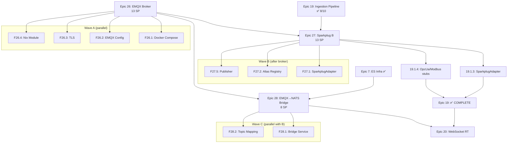

# Decomposition Report: IIoT Broker Infrastructure

**EDIN Phase:** DESIGN
**Decomposition Mode:** Balanced (features + tasks, depth=2)
**Generated:** 2026-02-07
**Source Plans:**
- `thoughts/shared/plans/emqx-broker-infrastructure-plan.md` (arch-emqx)
- `thoughts/shared/plans/sparkplug-b-plan.md` (arch-sparkplug)
- Prime's design decisions (session 2026-02-07)

---

## Summary

**3 new epics** extending the WBS (26-28), plus 2 tasks completing Epic 19.

| Epic | Title | SP | Dependencies |
|------|-------|-----|-------------|
| 26 | EMQX Broker Infrastructure | 13 SP | None (greenfield) |
| 27 | Sparkplug B Adapter + Publisher | 13 SP | Epic 26 (broker), Epic 19 (adapter interface) |
| 28 | EMQX→NATS Bridge L2 Service | 8 SP | Epic 26 (broker), Epic 7 (ES infra) |
| 19.1.3-4 | *(existing)* SparkplugAdapter + stubs | 0 SP (already counted) | Epic 27 |

**Total new SP:** 34 SP (~3 sprints)
**Created:** 3 epics, 10 features, ~30 tasks
**Critical path:** Epic 26 → Epic 27 → Epic 19 completion → Epic 20 unblocked

---

## V-Model Trace Matrix

```
┌──────────────────────────────────────────────────────────────────┐
│                    V-MODEL TRACE MATRIX                          │
├──────────────────────────────────────────────────────────────────┤
│ REQUIREMENTS (Left Arm)             VALIDATION (Right Arm)       │
├──────────────────────────────────────────────────────────────────┤
│ Epic 26: EMQX Broker           ◄─► E2E: mqtt pub/sub roundtrip  │
│   F26.1: Docker Compose        ◄─► Integration: container boot  │
│   F26.2: EMQX Config           ◄─► Integration: MQTT 5.0 feats  │
│   F26.3: TLS Infrastructure    ◄─► Integration: MQTTS connect   │
│   F26.4: Nix Module            ◄─► Unit: script execution       │
│   F26.5: Auth (PgSQL+JWT)      ◄─► Integration: auth flow       │
│                                                                  │
│ Epic 27: Sparkplug B           ◄─► E2E: pub→adapter→pipeline    │
│   F27.1: SparkplugAdapter      ◄─► Integration: DDATA decode    │
│   F27.2: Alias Registry        ◄─► Unit: alias CRUD + resolve   │
│   F27.3: Multi-Group Support   ◄─► Integration: N groups        │
│   F27.4: STATE Messages        ◄─► Unit: SCADA state tracking   │
│   F27.5: SparkplugPublisher    ◄─► Integration: synthetic data  │
│   F27.6: Protocol Stubs        ◄─► Unit: type-level compile     │
│   F27.7: Nix + Docker          ◄─► Integration: scripts work    │
│                                                                  │
│ Epic 28: EMQX→NATS Bridge     ◄─► E2E: MQTT→JetStream flow     │
│   F28.1: Bridge L2 Service     ◄─► Integration: msg forwarding  │
│   F28.2: Topic Mapping         ◄─► Unit: UNS→NATS subjects      │
│   F28.3: Health + Metrics      ◄─► Integration: prometheus      │
└──────────────────────────────────────────────────────────────────┘
```

---

## Dependency Graph



---

## Epic 26: EMQX Broker Infrastructure — 13 SP

**Phase:** 5.1 (new sub-phase)
**Blocks:** Epic 27, Epic 28
**Blocked by:** Nothing (greenfield)

### F26.1: Docker Compose Service (3 SP)

| Task | Description | Effort |
|------|-------------|--------|
| 26.1.1 | Create `docker/emqx/docker-compose.emqx.yml` — EMQX 5.8 service, volumes, ports, healthcheck | Small |
| 26.1.2 | Integrate into `docker/docker-compose.iiot.yml` — add EMQX alongside iiot-db on `iiot` network | Small |
| 26.1.3 | Verify: `docker compose up -d emqx` boots, dashboard at :18083, MQTT at :1883 | Small |

**Acceptance:** EMQX boots, dashboard accessible, MQTT connections accepted, health check passes.

### F26.2: EMQX Configuration (3 SP)

| Task | Description | Effort |
|------|-------------|--------|
| 26.2.1 | Create `docker/emqx/emqx.conf` — MQTT 5.0, retained messages, will messages, session persistence, max_packet_size 1MB | Small |
| 26.2.2 | Create `docker/emqx/acl.conf` — Dev permissive (`{allow, all}`), production ACL templates for Sparkplug B namespace | Small |
| 26.2.3 | Topic namespace design — ISA-95 UNS hierarchy + Sparkplug B `spBv1.0/` coexistence | Small |
| 26.2.4 | Prometheus metrics endpoint — verify `/api/v5/prometheus/stats` accessible | Tiny |

**Acceptance:** MQTT 5.0 features work (retained, will, topic aliases). ACL templates cover Sparkplug B edge node, ingestion service, and SCADA host roles.

### F26.3: TLS Infrastructure (2 SP)

| Task | Description | Effort |
|------|-------------|--------|
| 26.3.1 | Create `docker/emqx/certs/generate-dev-certs.sh` — self-signed CA + server cert | Small |
| 26.3.2 | Mount certs in docker compose, enable MQTTS on :8883 | Small |
| 26.3.3 | Add `docker/emqx/certs/.gitignore` — exclude generated certs | Tiny |

**Acceptance:** MQTTS connections work on port 8883 with self-signed certs.

### F26.4: Nix Module (3 SP)

| Task | Description | Effort |
|------|-------------|--------|
| 26.4.1 | Create `nix/modules/emqx/default.nix` — 8 mission-control scripts (emqx-up/down/status/shell/test-pub/test-sub/test-sparkplug/gen-certs/destroy) | Medium |
| 26.4.2 | Add `./modules/emqx/default.nix` to `nix/default.nix` imports | Tiny |
| 26.4.3 | Add `mosquitto` to `nix/modules/core.nix` nativeBuildInputs | Tiny |
| 26.4.4 | Verify all scripts work end-to-end | Small |

**Acceptance:** All 8 Nix scripts functional. `emqx-test-sparkplug` publishes NBIRTH+DBIRTH+DDATA lifecycle.

### F26.5: PostgreSQL + JWT Auth (2 SP)

| Task | Description | Effort |
|------|-------------|--------|
| 26.5.1 | EMQX PostgreSQL authentication backend — connect to existing iiot-db for user/password lookup | Medium |
| 26.5.2 | EMQX JWT authentication — validate JWTs signed with shared secret (same as HTTP API JWT) | Medium |
| 26.5.3 | Dev mode: anonymous allowed (`EMQX_ALLOW_ANONYMOUS=true`). Prod: require auth | Small |

**Acceptance:** Dev: anonymous connects. Prod config: PostgreSQL user lookup + JWT validation. JWT shared secret matches HTTP API auth middleware.

---

## Epic 27: Sparkplug B Adapter + Publisher — 13 SP

**Phase:** 5.2 (new sub-phase)
**Blocks:** Epic 19 completion (19.1.3, 19.1.4)
**Blocked by:** Epic 26 (broker), Epic 19 (adapter interface ✅)

### F27.1: SparkplugAdapter Core (3 SP)

| Task | Description | Effort |
|------|-------------|--------|
| 27.1.1 | `bun add sparkplug-client` — install v3.2.4 (brings mqtt@^4 + sparkplug-payload transitively) | Tiny |
| 27.1.2 | `SparkplugAdapterConfig` schema — serverUrl, username, password, groupIds (array!), clientId, subscribeTopics, trackLifecycle | Small |
| 27.1.3 | `SparkplugAdapterLive` — Layer implementation: sparkplug-client → `Stream.async` bridge → IngestedReading | Medium |
| 27.1.4 | Reconnection logic — `Effect.retry` with `Schedule.exponential` on connection failure | Small |
| 27.1.5 | Health check — `Effect.Ref<IngestionHealth>` updated on connect/disconnect/message/error | Small |

**Acceptance:** Adapter connects to EMQX, subscribes to DDATA topics, emits `IngestedReading` via Effect Stream. Reconnects on connection drop.

### F27.2: Alias Registry (2 SP)

| Task | Description | Effort |
|------|-------------|--------|
| 27.2.1 | `AliasRegistry` — `Effect.Ref<HashMap<string, HashMap<number, string>>>` per-edge-node alias maps | Small |
| 27.2.2 | `registerBirth(edgeNodeId, metrics)` — populate alias→name mappings from NBIRTH/DBIRTH | Small |
| 27.2.3 | `resolveAlias(edgeNodeId, alias)` — lookup metric name by numeric alias | Small |
| 27.2.4 | `clearNode(edgeNodeId)` — clear on NDEATH | Tiny |
| 27.2.5 | `decodeMetricValue(metric)` — type coercion (Double/Float/Int32→number, Boolean→0/1, Long→number with precision warning) | Small |

**Acceptance:** BIRTH messages establish alias registry. DDATA with alias-only metrics resolve correctly. NDEATH clears the node's aliases.

### F27.3: Multi-Group Support (2 SP)

| Task | Description | Effort |
|------|-------------|--------|
| 27.3.1 | Config accepts `groupIds: Schema.Array(Schema.String)` — multiple Sparkplug B groups | Small |
| 27.3.2 | Subscribe to `spBv1.0/{groupId}/DDATA/+/+` for EACH group | Small |
| 27.3.3 | Alias registry scoped per `groupId:edgeNodeId` (not just edgeNodeId) | Small |
| 27.3.4 | Dynamic route registration per DBIRTH — `spBv1.0/{group}/DDATA/{edge}/{device}/*` → `{group}:{edge}:{device}` | Small |

**Acceptance:** Adapter subscribes to N groups simultaneously. Readings from different groups have distinct device IDs. Alias registry isolates per group.

### F27.4: STATE Message Handling (1 SP)

| Task | Description | Effort |
|------|-------------|--------|
| 27.4.1 | Subscribe to `STATE/{host_id}` topics | Small |
| 27.4.2 | Track SCADA primary host state — `Effect.Ref<Option<string>>` for current primary | Small |
| 27.4.3 | Expose `scadaPrimaryHost` on health check response (add optional field to IngestionHealth or adapter-level property) | Tiny |

**Acceptance:** Adapter detects SCADA primary/standby transitions via STATE messages. Health check reports current primary host.

### F27.5: SparkplugPublisher Test Tool (2 SP)

| Task | Description | Effort |
|------|-------------|--------|
| 27.5.1 | `SparkplugPublisherConfig` schema — serverUrl, groupId, edgeNodeId, devices[], publishIntervalMs | Small |
| 27.5.2 | `createSparkplugPublisher` — Effect program: connect, NBIRTH, DBIRTH per device, periodic DDATA with random values | Medium |
| 27.5.3 | `scripts/sparkplug-publish.ts` — CLI entry point with env var config | Small |
| 27.5.4 | Integration tests — Publisher → EMQX → SparkplugAdapter → verify IngestedReading | Medium |

**Acceptance:** Publisher connects, publishes full Sparkplug B lifecycle (NBIRTH→DBIRTH→DDATA). CLI script runs with `bun run scripts/sparkplug-publish.ts`.

### F27.6: OPC-UA + Modbus Stub Adapters (1 SP)

| Task | Description | Effort |
|------|-------------|--------|
| 27.6.1 | `opcua-adapter-stub.ts` — `OpcUaAdapterConfig` schema + `OpcUaAdapterLive` with `Effect.die('Not implemented')` | Tiny |
| 27.6.2 | `modbus-adapter-stub.ts` — `ModbusAdapterConfig` schema + `ModbusAdapterLive` with `Effect.die('Not implemented')` | Tiny |
| 27.6.3 | Export stubs from `adapters/index.ts` | Tiny |

**Acceptance:** Both stubs compile. Config schemas validate. Completes WBS tasks 19.1.3 and 19.1.4.

### F27.7: Nix + Docker Infrastructure (2 SP)

| Task | Description | Effort |
|------|-------------|--------|
| 27.7.1 | `nix/modules/sparkplug/default.nix` — mission-control scripts (sparkplug-publish, sparkplug-subscribe, sparkplug-test) | Small |
| 27.7.2 | Add to `nix/modules/default.nix` imports | Tiny |
| 27.7.3 | `docker/docker-compose.sparkplug.yml` — publisher sidecar extending EMQX compose | Small |

**Acceptance:** Nix scripts work. Docker publisher connects to EMQX and publishes.

---

## Epic 28: EMQX→NATS Bridge L2 Service — 8 SP

**Phase:** 5.3 (new sub-phase)
**Blocks:** Epic 20 (real-time subscriptions consume NATS subjects)
**Blocked by:** Epic 26 (EMQX), Epic 7 (ES infra ✅)

This is a **new L2 service** that subscribes to EMQX MQTT topics and forwards selected messages to NATS JetStream subjects. This enables internal services (WebSocket RT, event processing, analytics) to consume IIoT data from NATS without directly connecting to the MQTT broker.

### F28.1: Bridge Service Core (3 SP)

| Task | Description | Effort |
|------|-------------|--------|
| 28.1.1 | `MqttNatsBridge` — Effect.Service definition: subscribe to EMQX topics, publish to NATS JetStream subjects | Medium |
| 28.1.2 | `MqttNatsBridgeConfig` — Schema: EMQX connection, NATS connection, topic-to-subject mapping rules | Small |
| 28.1.3 | `MqttNatsBridgeLive` — Layer: mqtt.js client → decode → NATS publish. Uses `Stream.async` for MQTT, NATS JetStream `publish` for output | Medium |
| 28.1.4 | Message transformation — Sparkplug B protobuf → JSON (or pass-through binary) for NATS consumers | Small |
| 28.1.5 | Reconnection + error recovery — Retry both MQTT and NATS connections independently | Small |

**Acceptance:** Bridge subscribes to EMQX, forwards to NATS JetStream. Messages are consumable by NATS subscribers.

### F28.2: Topic-to-Subject Mapping (2 SP)

| Task | Description | Effort |
|------|-------------|--------|
| 28.2.1 | Mapping rules — `spBv1.0/{group}/DDATA/{edge}/{device}` → `iiot.telemetry.{group}.{edge}.{device}` | Small |
| 28.2.2 | UNS hierarchy mapping — ISA-95 MQTT topics → NATS subject hierarchy | Small |
| 28.2.3 | Selective forwarding — Config allows include/exclude patterns (not all MQTT traffic goes to NATS) | Small |
| 28.2.4 | JetStream stream creation — `IIOT_TELEMETRY` stream with subject `iiot.telemetry.>`, retention policy, max age | Small |

**Acceptance:** Mapping rules correctly transform MQTT topics to NATS subjects. Only configured topics are forwarded.

### F28.3: Health + Metrics (1 SP)

| Task | Description | Effort |
|------|-------------|--------|
| 28.3.1 | Bridge health check — Reports MQTT connection, NATS connection, messages forwarded/s, error count | Small |
| 28.3.2 | `Effect.Metric` counters — messages_forwarded_total, forward_errors_total, bridge_latency_histogram | Small |

**Acceptance:** Health endpoint reports both connections. Metrics available for Prometheus scraping.

### F28.4: Integration Tests (2 SP)

| Task | Description | Effort |
|------|-------------|--------|
| 28.4.1 | Unit test — topic-to-subject mapping rules | Small |
| 28.4.2 | Integration test — SparkplugPublisher → EMQX → Bridge → NATS → verify subject + payload | Medium |
| 28.4.3 | Reconnection test — kill EMQX, verify bridge reconnects and resumes forwarding | Small |

**Acceptance:** Full round-trip verified. Reconnection works.

---

## Execution Sequencing

```
Sprint N:     Epic 26 (EMQX Broker)
              ┌──────────────────────────────┐
              │ F26.1 Docker ─┐              │
              │ F26.2 Config ─┤── parallel   │
              │ F26.3 TLS ────┘              │
              │ F26.4 Nix ─── after Docker   │
              │ F26.5 Auth ─── after Config  │
              └──────────────────────────────┘

Sprint N+1:   Epic 27 (Sparkplug B) ‖ Epic 28 (Bridge)
              ┌──────────────────────┐  ┌──────────────────────┐
              │ F27.1 Adapter        │  │ F28.1 Bridge Core    │
              │ F27.2 Alias Registry │  │ F28.2 Topic Mapping  │
              │ F27.3 Multi-Group    │  │ F28.3 Health         │
              │ F27.4 STATE          │  │ F28.4 Tests          │
              │ F27.5 Publisher      │  └──────────────────────┘
              │ F27.6 Stubs          │
              │ F27.7 Nix+Docker     │
              └──────────────────────┘

Sprint N+2:   Epic 19 completion → Epic 20 unblocked
              ┌──────────────────────┐
              │ 19.1.3 SparkplugAdpt │  (done by Epic 27)
              │ 19.1.4 OpcUa/Modbus  │  (done by F27.6)
              │ Epic 19 ✅ COMPLETE   │
              │ Epic 20 UNBLOCKED    │
              └──────────────────────┘
```

### Agent Dispatch Plan

| Agent | Epic | Features | subagent_type | Parallelism |
|-------|------|----------|---------------|-------------|
| kraken-emqx | 26 | F26.1-F26.5 | kraken | Wave A |
| kraken-sparkplug | 27 | F27.1-F27.5 | kraken | Wave B |
| spark-stubs | 27 | F27.6-F27.7 | spark | Wave B (parallel) |
| kraken-bridge | 28 | F28.1-F28.4 | kraken | Wave B (parallel with sparkplug) |

---

## Prime's Design Decisions (Captured)

| Decision | Value | Rationale |
|----------|-------|-----------|
| EMQX version | 5.8 (latest) | Best Sparkplug B support |
| K8s deployment | Docker only for now | Avoid k8s complexity at this stage |
| EMQX→NATS bridge | YES — new L2 service | Internal consumers use NATS, not MQTT |
| Auth backend | PostgreSQL + JWT | Matches existing HTTP API auth pattern |
| Multi-group | YES | Real-world plants have multiple Sparkplug groups |
| Metric filtering | TopicRouter level | Adapter passes all metrics through |
| STATE messages | YES | SCADA HA awareness needed |
| EMQX vs NATS MQTT | COEXIST | NATS lacks retained/will/MQTT 5.0 |

---

## Impact on WBS

### New Phase 5 Sub-Phases

```
Phase 5: Stream Processing & Real-time (Sprints 12-15) — 55 SP (was 21 SP)
├── 5.0: Ingestion Pipeline        — Epic 19 (13 SP) ✅ 8/10
├── 5.1: EMQX Broker Infrastructure — Epic 26 (13 SP) ⏳ NEW
├── 5.2: Sparkplug B Adapter        — Epic 27 (13 SP) ⏳ NEW
├── 5.3: EMQX→NATS Bridge           — Epic 28 (8 SP)  ⏳ NEW
└── 5.4: Real-time Subscriptions    — Epic 20 (8 SP)  ⏳ blocked
```

### Updated Progress Summary

| Phase | Epics | SP | Complete | Remaining |
|-------|-------|-----|----------|-----------|
| Phase 1: Foundation | 1-6 | 47 | ✅ 47 | 0 |
| Phase 2: ES Boundaries | 7-12, 25 | 89 | ✅ 89 | 0 |
| Phase 3: Entity & Service | 13-16 | 42 | ✅ 42 | 0 |
| Phase 4: RPC & HTTP | 17-18 | 26 | ✅ 26 | 0 |
| Phase 5: Stream & RT | 19-20, 26-28 | **55** | ~10 | **~45** |
| Phase 6-7: Future | 21-24 | 42 | 0 | 42 |
| **Total** | **28** | **301** | **~214** | **~87** |

**Overall Progress**: ~71% complete (214/301 SP)

---

Co-Authored-By: Val <val@maidens.ai>
