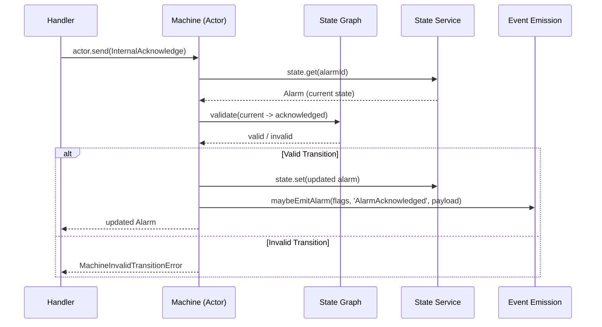

# Event Sourcing Patterns

## Overview

The IIoT v3 architecture implements **hybrid event sourcing** per ADR-0012. Only decision-critical domains use full event sourcing with audit trails. Asset CRUD domains use direct state mutation with optional log-only event emission.

## ES Domain Boundaries

| Domain | Strategy | Events | Rationale |
|--------|----------|--------|-----------|
| **Alarms** | Full ES | 10 event types | ISA-18.2 compliance, regulatory audit trail |
| **Work Orders** | Full ES | 46 event types | Full lifecycle audit, compliance |
| **Equipment State** | Full ES | 6 event types | State transition history, analytics |
| **Batch Records** | Full ES | 13 event types | Regulatory compliance (future) |
| **Assets** | CRUD + log | N/A | Low-frequency, no audit requirement |
| **Sensor Readings** | Append-only | N/A | Time-series, never mutated |

## Feature Flag System

Event sourcing is controlled by per-domain feature flags, enabling gradual rollout:

```typescript
// src/lib/iiot/infrastructure/feature-flags.ts

export interface FeatureFlagsShape {
  readonly alarmEventSourcingEnabled: boolean
  readonly equipmentStateEventSourcingEnabled: boolean
  readonly workOrderEventSourcingEnabled: boolean
  readonly batchRecordEventSourcingEnabled: boolean
  readonly pgLakeEnabled: boolean
}
```

### Flag Layers

```typescript
// All disabled (safe production default)
export const IIoTFeatureFlagsDisabledLayer: Layer.Layer<IIoTFeatureFlags> =
  Layer.succeed(IIoTFeatureFlags, IIoTFeatureFlagsDefault)

// All enabled (testing)
export const IIoTFeatureFlagsEnabledLayer: Layer.Layer<IIoTFeatureFlags> =
  Layer.succeed(IIoTFeatureFlags, {
    alarmEventSourcingEnabled: true,
    equipmentStateEventSourcingEnabled: true,
    workOrderEventSourcingEnabled: true,
    batchRecordEventSourcingEnabled: true,
    pgLakeEnabled: false,  // Requires full Docker image
  })

// Environment-based (reads ES_* env vars)
export const IIoTFeatureFlagsEnvLayer: Layer.Layer<IIoTFeatureFlags> =
  Layer.effect(IIoTFeatureFlags, featureFlagsConfig.pipe(
    Effect.orElseSucceed(() => IIoTFeatureFlagsDefault)
  ))

// Custom overrides
export const makeFeatureFlagsLayer = (
  overrides: Partial<FeatureFlagsShape>
): Layer.Layer<IIoTFeatureFlags> =>
  Layer.succeed(IIoTFeatureFlags, {
    ...IIoTFeatureFlagsDefault,
    ...overrides,
  })
```

### Environment Variables

```bash
ES_ALARM_ENABLED=true             # Enable alarm EventLog
ES_EQUIPMENT_STATE_ENABLED=true   # Enable equipment state EventLog
ES_WORK_ORDER_ENABLED=true        # Enable work order EventLog
ES_BATCH_RECORD_ENABLED=false     # Batch records (future)
PG_LAKE_ENABLED=false             # pg_lake Iceberg analytics (requires full Docker)
```

### Flag Guard Pattern

```typescript
// In entity handlers
const flags = yield* IIoTFeatureFlags

if (flags.alarmEventSourcingEnabled) {
  yield* eventLog.write('AlarmTriggered', payload)   // ES path
} else {
  yield* alarmRepo.insert(alarm)                     // Legacy CRUD path
}

// Or use the convenience type guard
const program = Effect.gen(function* () {
  if (yield* isAlarmEventSourcingEnabled) {
    // EventLog path
  }
})
```

## Non-Blocking Event Emission

The `_helpers.ts` module provides fire-and-forget event emission that never fails the parent operation:

```typescript
// src/lib/iiot/entity/_helpers.ts

export const maybeEmitAlarm = (
  flags: FeatureFlagsShape,
  eventType: string,
  payload: unknown
): Effect.Effect<void> => {
  if (!flags.alarmEventSourcingEnabled) {
    return Effect.void  // No-op when disabled
  }
  return Effect.logInfo(`[ES:Alarm] ${eventType}`, { payload }).pipe(
    Effect.catchAll((err) =>
      Effect.logWarning(`Event emission failed (non-blocking): ${String(err)}`)
    )
  )
}
```

**Design principles:**
1. **Feature-flag gated** — each domain checks its own flag
2. **Non-blocking** — failures are caught and logged, never propagated
3. **Domain-specific helpers** — `maybeEmitAlarm`, `maybeEmitWorkOrder`, `maybeEmitEquipment`
4. **Generic helper** — `emitIfEnabled(flags, domain, eventType, payload)` for explicit domain check
5. **Asset entities** — `maybeEmitAsset` always emits (log-only, no flag check)

## Event Journal Infrastructure

The `sql-event-journal.ts` module provides the EventLog persistence layer:

```
src/lib/iiot/infrastructure/
  sql-event-journal.ts    # SQL-backed event journal
  eventlog-layer.ts       # EventLog Layer composition
  feature-flags.ts        # Per-domain feature flag toggles
```

The event journal stores events in a PostgreSQL table with:
- Aggregate ID and type
- Event type and payload (JSONB)
- Sequence number (per aggregate)
- Timestamp
- Metadata (correlation IDs, user context)

## Machine + ES Integration

For event-sourced entities, the Machine actor coordinates state transitions with event emission:



## State Graph Validation

Each entity type has an ISA-95 compliant state transition graph:

```
Site State Graph:
  planned -> under_construction -> operational
  operational -> seasonal_shutdown -> operational (reopen)
  operational -> closed -> decommissioned (terminal)
  seasonal_shutdown -> operational (reopen)
  closed -> operational (reopen)

Alarm State Graph (ISA-18.2):
  active -> acknowledged -> cleared -> resolved (terminal)
  active -> cleared -> acknowledged -> resolved (terminal)
```

The Machine validates every transition against the graph before mutating state. Invalid transitions produce `MachineInvalidTransitionError`, which handlers map to `RpcTransitionError`.

## Migration Strategy

The hybrid ES approach enables a phased migration:

1. **Phase 1**: All flags disabled. Pure CRUD for all domains.
2. **Phase 2**: Enable alarm ES (`ES_ALARM_ENABLED=true`). Dual-write: CRUD + EventLog.
3. **Phase 3**: Enable work order ES. Dual-write.
4. **Phase 4**: Enable equipment state ES. Dual-write.
5. **Phase 5**: Verify event journal completeness. Switch reads to ES projections.
6. **Phase 6**: Remove CRUD write path for migrated domains.

Each phase is independently rollbackable by flipping a single flag.

## Testing ES Patterns

```typescript
// Test with events enabled
it.effect('emits event on alarm acknowledge', () =>
  Effect.gen(function* () {
    const state = yield* AlarmState
    const flags = yield* IIoTFeatureFlags
    // flags.alarmEventSourcingEnabled === true in this layer
    // ... create and acknowledge alarm
    // ... verify event was logged
  }).pipe(
    Effect.provide(EntityHandlersLayer),
    Effect.provide(AllStateServicesInMemory),
    Effect.provide(IIoTFeatureFlagsEnabledLayer),  // Events ON
  )
)

// Test with events disabled (legacy path)
it.effect('works without events', () =>
  Effect.gen(function* () {
    // ... same operations, no event emission
  }).pipe(
    Effect.provide(EntityTestingStack),  // Events OFF by default
  )
)
```

---

## Agent Quick Reference

### Key Imports

```typescript
import { Effect, Layer } from 'effect'
import { IIoTFeatureFlags, IIoTFeatureFlagsDefault } from '../infrastructure/feature-flags'
import { maybeEmitAlarm, maybeEmitWorkOrder, emitIfEnabled } from '../entity/_helpers'
```

### Minimal Example

```typescript
// Feature flag layer (custom overrides)
const TestFlagsLayer = Layer.succeed(IIoTFeatureFlags, {
  ...IIoTFeatureFlagsDefault,
  alarmEventSourcingEnabled: true,  // Enable just alarm ES
})

// Guard pattern in handler
const handleAcknowledge = Effect.gen(function* () {
  const flags = yield* IIoTFeatureFlags
  const alarm = yield* state.get(alarmId)
  const updated = yield* state.set({ ...alarm, status: 'acknowledged' })
  yield* maybeEmitAlarm(flags, 'AlarmAcknowledged', { alarmId, acknowledgedBy })
  return updated
})

// Non-blocking emission (never fails parent)
const maybeEmitAlarm = (flags: FeatureFlagsShape, eventType: string, payload: unknown) => {
  if (!flags.alarmEventSourcingEnabled) return Effect.void
  return Effect.logInfo(`[ES:Alarm] ${eventType}`, { payload }).pipe(
    Effect.catchAll((err) => Effect.logWarning(`Event emission failed: ${String(err)}`))
  )
}
```

### Common Pitfalls

- Making event emission blocking -- failures must never propagate to the parent operation; use `Effect.catchAll`
- Forgetting feature flag check -- emitting events when the flag is disabled creates noise and breaks the migration strategy
- Using `IIoTFeatureFlagsEnabledLayer` in production -- all flags enabled is for testing only; production uses env-based or disabled layers
- Testing only the ES-enabled path -- always test both enabled and disabled paths to ensure CRUD fallback works
- Emitting events before state mutation succeeds -- emit after `state.set()` to avoid phantom events for failed mutations
- Hardcoding domain flag checks instead of using `emitIfEnabled` helper -- fragile when new domains are added

### Cross-References

- [entities.md](./entities.md) -- Entity handlers call emission helpers after Machine state transitions
- [effect-services.md](./effect-services.md) -- Layer.succeed for feature flag injection
- [effect-testing.md](./effect-testing.md) -- Testing with different flag layers
- [effect-errors.md](./effect-errors.md) -- Non-blocking error handling pattern (catchAll for fire-and-forget)
```
