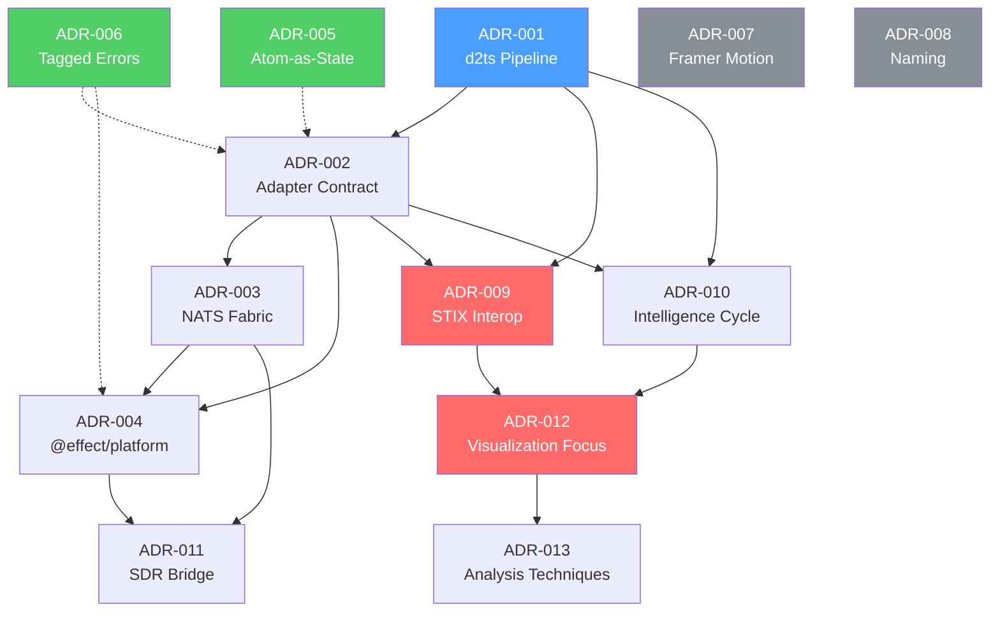

# Tsingou Architecture Decision Record Index

```
Document:      ADR Index — Tsingou Signal Analysis Platform
Status:        CURRENT
Author:        Val (architecture-reviewer)
Created:       2026-02-18
Scope:         All 13 ADRs governing Tsingou's architecture
```

> This document serves as the master cross-reference for all Architecture Decision Records
> in the Tsingou project. It provides a registry, dependency graph, impact matrix,
> implementation status, and terminology glossary. ADR numbering is sequential by
> acceptance date. All ADRs are located in `docs/tsingou/adr/`.

---

## Table of Contents

1. [ADR Registry](#1-adr-registry)
2. [Decision Timeline](#2-decision-timeline)
3. [ADR Dependency Graph](#3-adr-dependency-graph)
4. [Decision Impact Matrix](#4-decision-impact-matrix)
5. [Implementation Status](#5-implementation-status)
6. [Consistency Notes and Revision Candidates](#6-consistency-notes-and-revision-candidates)
7. [Candidate Future ADRs](#7-candidate-future-adrs)
8. [Terminology Glossary](#8-terminology-glossary)

---

## 1. ADR Registry

| # | Title | Status | Date | Decision Makers | Evidence Source |
|---|-------|--------|------|----------------|----------------|
| ADR-001 | d2ts as Signal Pipeline Core | Accepted | 2026-02-18 | Prime, Val | Questionnaire `tsingou-d2ts-signal-pipeline` |
| ADR-002 | Source Adapter Contract — Effect.Service with Push API | Accepted | 2026-02-18 | Prime, Val | Questionnaire `tsingou-source-adapters` |
| ADR-003 | NATS as Universal Signal Fabric | Accepted | 2026-02-18 | Prime, Val | Questionnaires: `tsingou-source-adapters`, `tsingou-adapter-serial`, `tsingou-adapter-filewatch` |
| ADR-004 | @effect/platform for HTTP, WebSocket, FileSystem Adapters | Accepted | 2026-02-18 | Prime, Val | Questionnaires: `tsingou-adapter-http`, `tsingou-adapter-ws`, `tsingou-adapter-filewatch` |
| ADR-005 | Atom-as-State Pattern — No Effect.Ref for React-Consumed State | Accepted | 2026-02-18 | Prime, Val | AGENTS.md, DataManager EPOCH-0002 precedent |
| ADR-006 | Tagged Errors Everywhere — Data.TaggedError for Typed Error Channels | Accepted | 2026-02-18 | Prime, Val | AGENTS.md project rules, all adapter questionnaires |
| ADR-007 | Framer Motion for Animation — Not Custom Animatable System | Accepted | 2026-02-18 | Prime | Conversation context |
| ADR-008 | System Named "Tsingou" — SIGINT/OSINT Analysis Platform | Accepted | 2026-02-18 | Prime, Val | Questionnaire `tsingou-d2ts-signal-pipeline` (naming) |
| ADR-009 | STIX Interoperability Layer — Custom Internal Signals + STIX Bridge | Accepted (revised) | 2026-02-18 | Prime, Val | Questionnaire `tsingou-sigint-scope` Q4 (revised from "STIX-native") |
| ADR-010 | Full Intelligence Cycle Coverage — All 6 Phases | Accepted | 2026-02-18 | Prime, Val | Questionnaire `tsingou-sigint-scope` Q2 |
| ADR-011 | SDR Integration via GNU Radio Bridge + RTL-SDR Sidecar | Accepted | 2026-02-18 | Prime, Val | Questionnaire `tsingou-sigint-scope` Q6 |
| ADR-012 | Tsingou as SIGINT Visualization Platform — Palantir for Knowledge Graph | Accepted | 2026-02-18 | Prime, Val | Questionnaire `tsingou-sigint-scope` Q7 |
| ADR-013 | Eight Analysis Techniques Across 4 Rendering Layers | Accepted | 2026-02-18 | Prime, Val | Questionnaire `tsingou-sigint-scope` Q3, Q8 |

---

## 2. Decision Timeline

All 13 ADRs were accepted on 2026-02-18 during a concentrated architectural design session. The decisions fall into three logical waves:

### Wave 1: Core Infrastructure (ADR-001 through ADR-008)

These decisions establish the foundational technology stack:

1. **ADR-001** (d2ts pipeline) — Selects the signal processing engine. All subsequent adapter and state decisions depend on the pipeline being differential-dataflow-based.
2. **ADR-002** (adapter contract) — Defines the service interface that all 8 source adapters implement. Depends on ADR-001 establishing the pipeline target.
3. **ADR-003** (NATS fabric) — Establishes the universal messaging layer. Enables the bridge pattern that ADR-002 adapters use for sidecar deployment.
4. **ADR-004** (@effect/platform) — Specifies the I/O primitives for HTTP, WebSocket, and FileSystem adapters. Builds on the adapter contract from ADR-002 and the NATS bridge from ADR-003.
5. **ADR-005** (Atom-as-State) — Establishes the state management doctrine. Applies to all services, independent of pipeline or adapter choices.
6. **ADR-006** (tagged errors) — Defines the error handling strategy. Applies universally across adapters and services.
7. **ADR-007** (framer-motion) — Selects the animation library for the DOM rendering layer. Independent of pipeline/adapter decisions.
8. **ADR-008** (naming) — Names the system. Identity decision, independent of technical choices.

### Wave 2: Domain Integration (ADR-009 through ADR-011)

These decisions connect Tsingou to the SIGINT/OSINT domain:

9. **ADR-009** (STIX interop) — Revised from "STIX-native" to "STIX as interop layer." Determines how Tsingou integrates with CTI platforms. Depends on ADR-001 (pipeline) and ADR-002 (adapter contract) for internal signal model.
10. **ADR-010** (intelligence cycle) — Maps all 6 intelligence phases to Tsingou subsystems. Depends on ADR-002 (collection phase) and ADR-001 (processing/analysis phases).
11. **ADR-011** (SDR bridge) — Specifies dual-path RF integration. Depends on ADR-003 (NATS bridge pattern) and ADR-004 (Holonet service stack).

### Wave 3: Visualization Strategy (ADR-012 through ADR-013)

These decisions define Tsingou's visualization scope and technique portfolio:

12. **ADR-012** (visualization focus) — Positions Tsingou as visualization layer with Palantir for knowledge graph. Depends on ADR-009 (STIX model) and ADR-010 (intelligence cycle scope).
13. **ADR-013** (analysis techniques) — Maps 8 techniques to 4 rendering layers. Depends on ADR-012 (visualization scope) and all rendering layer decisions.

---

## 3. ADR Dependency Graph



**Legend:**
- Blue: Pipeline foundation (ADR-001)
- Red: Domain integration (ADR-009, ADR-012) — where STIX terminology inconsistency exists
- Green: Cross-cutting concerns (ADR-005, ADR-006)
- Gray: Independent decisions (ADR-007, ADR-008)
- Solid arrows: explicit dependency ("this decision depends on...")
- Dashed arrows: implicit dependency ("this concern applies to...")

---

## 4. Decision Impact Matrix

Each cell indicates how strongly the ADR affects the given system component.

| ADR | Schema | Adapters | Pipeline | State | Rendering | Transport | Errors | External |
|-----|--------|----------|----------|-------|-----------|-----------|--------|----------|
| 001 (d2ts) | SECONDARY | SECONDARY | **PRIMARY** | SECONDARY | SECONDARY | -- | -- | -- |
| 002 (adapters) | SECONDARY | **PRIMARY** | SECONDARY | SECONDARY | -- | SECONDARY | SECONDARY | -- |
| 003 (NATS) | -- | SECONDARY | SECONDARY | -- | -- | **PRIMARY** | -- | SECONDARY |
| 004 (@effect/platform) | -- | **PRIMARY** | -- | -- | -- | SECONDARY | SECONDARY | SECONDARY |
| 005 (Atom-as-State) | -- | SECONDARY | SECONDARY | **PRIMARY** | SECONDARY | -- | -- | -- |
| 006 (tagged errors) | SECONDARY | SECONDARY | SECONDARY | -- | -- | -- | **PRIMARY** | -- |
| 007 (framer-motion) | -- | -- | -- | -- | **PRIMARY** | -- | -- | -- |
| 008 (naming) | -- | -- | -- | -- | -- | -- | -- | -- |
| 009 (STIX interop) | **PRIMARY** | SECONDARY | SECONDARY | -- | -- | SECONDARY | -- | **PRIMARY** |
| 010 (intel cycle) | SECONDARY | SECONDARY | SECONDARY | -- | SECONDARY | -- | -- | **PRIMARY** |
| 011 (SDR bridge) | SECONDARY | **PRIMARY** | SECONDARY | -- | SECONDARY | SECONDARY | -- | SECONDARY |
| 012 (viz focus) | -- | -- | -- | -- | **PRIMARY** | -- | -- | **PRIMARY** |
| 013 (techniques) | -- | -- | SECONDARY | -- | **PRIMARY** | -- | -- | SECONDARY |

**Key:**
- **PRIMARY** — The ADR's central concern. Changes to this ADR directly alter this component.
- SECONDARY — The ADR has implications for this component but does not primarily govern it.
- `--` — No meaningful impact.

---

## 5. Implementation Status

| ADR | Implementation Level | Evidence |
|-----|---------------------|---------|
| ADR-001 (d2ts) | **Stubbed** | `TsingouFlow.ts:122-135` — explicit comment "d2ts GRAPH PROCESSING (stubbed)". Pass-through until `@electric-sql/d2ts` stabilizes. |
| ADR-002 (adapters) | **Built** | `AdapterManager.ts` (411 lines), `adapters/` directory with 8 adapter modules. `Queue.bounded(4096)` confirmed at line 116. |
| ADR-003 (NATS) | **Partially Built** | NATS subjects defined, Holonet bridge pattern documented. Full JetStream replay not yet implemented. |
| ADR-004 (@effect/platform) | **Built** | HTTP (4 modes), WebSocket, FileWatch adapters use `@effect/platform` throughout. |
| ADR-005 (Atom-as-State) | **Built** | Both `TsingouFlow.ts` and `AdapterManager.ts` use `Atom.make()`, `Atom.unsafeGet()`, `Atom.set()`. No `Effect.Ref` for React-consumed state. |
| ADR-006 (tagged errors) | **Built** | `adapters/errors.ts` contains 17 `Data.TaggedError` classes. `AdapterManager.ts` adds `AdapterManagerError` (18th). |
| ADR-007 (framer-motion) | **Design-only** | Decision recorded. No Tsingou-specific framer-motion code yet. |
| ADR-008 (naming) | **Applied** | Package namespace `@tmnl/tsingou-*` used throughout. Source at `src/lib/tsingou-flow/`. |
| ADR-009 (STIX interop) | **Design-only** | Codec layer (`BaseSignal` <-> STIX) not yet implemented. Internal `BaseSignal` schema is built. |
| ADR-010 (intel cycle) | **Partially Built** | Collection phase (adapters) built. Processing/Analysis (d2ts) stubbed. Direction, Dissemination, Feedback are design-only. |
| ADR-011 (SDR bridge) | **Design-only** | Architecture documented. No sidecar code yet. SigMF schema defined in `SdrSignal` extension. |
| ADR-012 (viz focus) | **Design-only** | Visualization scope defined. Palantir integration architecture documented. |
| ADR-013 (techniques) | **Design-only** | Technique-to-layer mapping defined. No technique-specific visualization code yet. |

### Summary

| Level | Count | ADRs |
|-------|-------|------|
| Built | 4 | ADR-002, ADR-004, ADR-005, ADR-006 |
| Stubbed | 1 | ADR-001 |
| Partially Built | 2 | ADR-003, ADR-010 |
| Design-only | 6 | ADR-007, ADR-009, ADR-011, ADR-012, ADR-013 |
| Applied (meta) | 1 | ADR-008 (naming only) |

---

## 6. Consistency Notes and Revision Candidates

### 6.1 STIX Terminology — ADR-012 Contradicts ADR-009 (HIGH)

**Issue:** ADR-009 was revised from "STIX-native" to "Custom internal + STIX interop layer." However, ADR-012 Section "What Tsingou Does" still states:

> "STIX-native signals" and "Every signal is a STIX observed-data object"

This contradicts ADR-009's revised decision that signals are NOT STIX internally. They are custom `BaseSignal` with a bidirectional STIX codec.

**Recommendation:** Update ADR-012 to say "STIX-interoperable signals" instead of "STIX-native Signals."

### 6.2 Error Count Discrepancy — ADR-006 and SPEC.md (MEDIUM)

**Issue:** ADR-006 claims "17 tagged error classes" in `adapters/errors.ts`. This is technically correct for the `errors.ts` file. However, `AdapterManager.ts` defines an 18th tagged error class (`AdapterManagerError`) that is not counted.

SPEC.md Section 5 also says "17 typed error classes."

**Recommendation:** Clarify the count as "17 adapter error classes + 1 structural error class = 18 total tagged errors." Update ADR-006 and SPEC.md accordingly.

### 6.3 SPEC.md Reference Paths Are Stale (LOW)

**Issue:** SPEC.md Section 9 references documents at incorrect paths:
- `docs/01_SIGNAL_PIPELINE.md` should be `docs/tsingou/nw-wrld-reference/01_SIGNAL_PIPELINE.md`
- `R3F_MIGRATION_POSTULATION.md` should be `docs/tsingou/R3F_MIGRATION.md`
- Similar path issues for all 6 nw-wrld reference documents

**Recommendation:** Update SPEC.md Section 9 with correct relative paths.

### 6.4 SPEC.md ADR Range Incomplete (LOW)

**Issue:** SPEC.md Section 9 only lists "ADR-001 through ADR-008" but 13 ADRs exist.

**Recommendation:** Update to "ADR-001 through ADR-013" and add summary entries for ADR-009 through ADR-013.

### 6.5 Holonet vs NATS Terminology (MEDIUM)

**Issue:** Documents inconsistently use "Holonet" and "NATS." Holonet is the Effect.Service wrapper around NATS connections (HolonetConfig, HolonetConnection, HolonetInner, HolonetHub). NATS is the underlying messaging technology.

ADR-003 uses "NATS" throughout but the implementation references "Holonet" services.

**Recommendation:** Standardize terminology. "NATS" for the underlying technology. "Holonet" for Tsingou's Effect.Service abstraction layer over NATS.

### 6.6 nw-wrld Module Count (LOW)

**Issue:** ARCHITECTURE_ANALYSIS says "21 starter modules" but its table lists 20. R3F_MIGRATION lists 21 modules with migration tracks. Doc 02 lists 21 but the table shows 20 entries.

**Recommendation:** Cross-verify the exact module count against the nw-wrld submodule source.

### 6.7 Missing Formal ADRs for Key Decisions (MEDIUM)

**Issue:** Several significant architectural decisions lack formal ADRs:
- **Tauri v2** selection (mentioned in SPEC.md but no rationale ADR)
- **R3F** selection over raw Three.js or deck.gl (covered in R3F_MIGRATION.md but no ADR)
- **d2ts package selection** over other dataflow libraries (rationale exists in ADR-001 but no alternatives evaluation)

**Recommendation:** Consider creating ADR-014 (Tauri v2), ADR-015 (R3F), ADR-016 (d2ts alternatives) when these decisions are revisited.

---

## 7. Candidate Future ADRs

| Candidate | Rationale | Priority |
|-----------|-----------|----------|
| ADR-014: Tauri v2 Selection | No formal ADR for runtime selection. SPEC.md mentions Tauri but without alternatives evaluation. | Medium |
| ADR-015: R3F Selection | R3F_MIGRATION.md covers migration details but not the decision rationale vs alternatives (deck.gl, raw Three.js, Babylon.js). | Low |
| ADR-016: d2ts Alternatives Evaluation | ADR-001 accepts d2ts but doesn't formally evaluate alternatives (Materialize, Noria, custom streams). | Low |
| ADR-017: NATS KV vs SQLite for State | Current design uses NATS KV for schema registry and session state. SQLite alternative not evaluated. | Low |
| ADR-018: Multi-Workspace Architecture | Workspace isolation model not formally decided. | Low |

---

## 8. Terminology Glossary

| Term | Definition | Context |
|------|-----------|---------|
| **Tsingou** | The SIGINT/OSINT signal analysis platform. Named after Mary Tsingou (1928-2023). | System identity (ADR-008) |
| **tsingou-flow** | The TypeScript package containing the signal pipeline implementation. Located at `src/lib/tsingou-flow/`. | Package name |
| **d2ts** | Differential dataflow library (`@electric-sql/d2ts`). Provides incremental computation with multi-dimensional versioning. | Pipeline core (ADR-001) |
| **BaseSignal** | The internal signal schema. Effect Schema with branded IDs, version tuple, kind discriminator, payload, metadata. | Schema layer |
| **NATS** | The underlying messaging technology (nats.io). Provides pub/sub, JetStream, KV store. | Transport layer (ADR-003) |
| **Holonet** | Tsingou's Effect.Service abstraction over NATS. Stack: HolonetConfig -> NatsConnection -> HolonetInner -> HolonetHub -> PubSub/Stream/KV. | Service layer |
| **Atom** | Reactive state primitive from `effect-atom`. `Atom.make()` creates reactive state; `useAtomValue()` subscribes in React. | State management (ADR-005) |
| **Effect.Ref** | Effect-TS managed mutable reference. Used only for internal-only service state that React never consumes. | State management (ADR-005) |
| **STIX 2.1** | Structured Threat Information eXpression. Industry standard for CTI sharing. 18 SDOs, 2 SROs, ~30 SCOs. | Interop layer (ADR-009) |
| **TAXII** | Trusted Automated eXchange of Intelligence Information. Transport protocol for STIX data. | Transport (ADR-009) |
| **SigMF** | Signal Metadata Format. Standard for describing RF signal recordings. | SDR integration (ADR-011) |
| **nw_wrld** | The predecessor system included as a git submodule for architectural reference. Electron-based, imperative Three.js, Jotai state. | Reference system (ADR-008) |
| **OutputBridge** | The mechanism routing processed signals from the pipeline to rendering layers via atoms. | Pipeline-to-rendering bridge |
| **R3F** | React Three Fiber. Declarative React renderer for Three.js. Used for z:0 WebGL layer. | Rendering (R3F_MIGRATION.md) |
| **visx** | React visualization library built on D3. Used for z:1 SVG layer. | Rendering |
| **p5** | Creative coding library (p5.js). Used via p5-wrapper for z:2 Canvas layer. | Rendering |
| **Intelligence Cycle** | The 6-phase operational framework: Direction, Collection, Processing, Analysis, Dissemination, Feedback. | Domain model (ADR-010) |
| **ATT&CK** | MITRE ATT&CK framework. Adversary tactics, techniques, and procedures (TTPs) knowledge base. | Analysis (ADR-013) |
