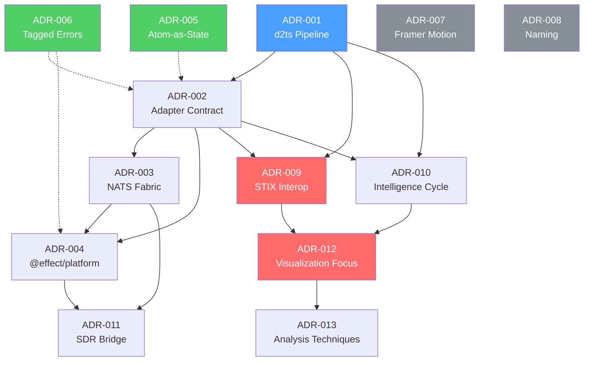

# TMNL-RFC-002: Tsingou — Signal Intelligence Visualization Platform

```
RFC:           002
Title:         Tsingou — Signal Intelligence Visualization Platform Specification
Status:        ASSEMBLED
Date:          2026-02-18
Authors:       Prime (architect), Val (agent coordinator)
Contributors:  sigint-researcher, stix-specialist, arch-reviewer, sdr-analyst,
               dsp-specialist, dataflow-theorist, graph-theorist,
               fusion-mathematician, ew-doctrine-advisor
Category:      Standards Track (Internal)
Supersedes:    N/A
Updates:       TMNL-RFC-001 (IIoT Platform Specification)
```

---

## Abstract

This document specifies the architecture, protocols, and mathematical
foundations of the Tsingou Signal Intelligence Visualization Platform.
Tsingou is a desktop application built on Effect-TS, NATS messaging,
and differential dataflow (d2ts) that ingests, processes, correlates,
and visualizes signals from heterogeneous intelligence sources including
SIGINT, OSINT, HUMINT, and GEOINT feeds.

The platform employs a 4-layer composited rendering architecture (React
Three Fiber, visx, p5.js, DOM) driven by an atom-as-state reactive
model, with STIX 2.1 as the interoperability format and TAXII 2.1 as
the transport protocol. Signal processing leverages differential
dataflow for incremental computation with cross-source joins, temporal
windowing, and anomaly detection.

This specification is organized into 36 normative and informative
sections across 8 parts, plus 6 appendices.

---

## Status of This Memo

This document is a DRAFT specification for internal use within the
TMNL project. It has not been submitted to any standards body. The
key words "MUST", "MUST NOT", "REQUIRED", "SHALL", "SHALL NOT",
"SHOULD", "SHOULD NOT", "RECOMMENDED", "NOT RECOMMENDED", "MAY",
and "OPTIONAL" in this document are to be interpreted as described
in BCP 14 [RFC2119] [RFC8174] when, and only when, they appear in
ALL CAPITALS, as shown here.

---

## Conventions and Terminology

### Normative Language

This document uses RFC 2119 / RFC 8174 keywords throughout. Sections
marked "(Informative)" use normative language descriptively, not
prescriptively. Sections marked "(Normative)" contain binding
requirements for conforming implementations.

### Citation Format

References use bracketed keys (e.g., `[MCSHERRY2013]`) defined in
Appendix B: Bibliography. Inline code references use monospace font
with file paths relative to `packages/tmnl/`.

### Section Numbering

All sections use the `TSG.N` prefix (Tsingou Section Group). Subsections
use dotted notation (e.g., `TSG.7.3`). Appendices use letter prefixes
(e.g., `Appendix A`).

### Signal Kind Identifiers

Signal kinds are lowercase strings matching the discriminant field of
BaseSignal: `http`, `rss`, `nats`, `websocket`, `file-watch`, `serial`,
`midi`, `osc`, `sdr`. See Appendix C for the full catalog.

---

## Table of Contents

### PART I: DOMAIN & CONTEXT (Informative)

| Section | Title | File | Lines | Status |
|---------|-------|------|-------|--------|
| TSG.1 | Introduction & Vision | `rfc-section-introduction.md` | — | PENDING |
| TSG.2 | SIGINT/OSINT Domain Reference | `rfc-section-sigint-domain.md` | 1,129 | COMPLETE |
| TSG.3 | Intelligence Cycle | `rfc-section-intelligence-cycle.md` | 732 | COMPLETE |
| TSG.4 | Data Fusion Mathematics | `rfc-section-data-fusion-mathematics.md` | 1,607 | COMPLETE |
| TSG.5 | Competitive Analysis | `rfc-section-competitive-analysis.md` | 648 | COMPLETE |

### PART II: ARCHITECTURE (Normative)

| Section | Title | File | Lines | Status |
|---------|-------|------|-------|--------|
| TSG.6 | Architecture Overview | `rfc-section-architecture-overview.md` | 808 | COMPLETE |
| TSG.7 | Signal Pipeline & d2ts | `rfc-section-signal-pipeline.md` | 812 | COMPLETE |
| TSG.8 | BaseSignal Schema | `rfc-section-base-signal-schema.md` | 1,682 | COMPLETE |
| TSG.9 | Source Adapter Contract | `rfc-section-source-adapters.md` | 1,952 | COMPLETE |
| TSG.10 | State Management (Atom-as-State) | `rfc-section-state-management.md` | 834 | COMPLETE |
| TSG.11 | NATS Messaging Fabric | `rfc-section-nats-fabric.md` | — | PENDING |

### PART III: INTEROPERABILITY (Normative)

| Section | Title | File | Lines | Status |
|---------|-------|------|-------|--------|
| TSG.12 | STIX 2.1 Data Model | `rfc-section-stix-data-model.md` | 842 | COMPLETE |
| TSG.13 | BaseSignal ↔ STIX Codec | `rfc-section-stix-codec.md` | 1,003 | COMPLETE |
| TSG.14 | TAXII 2.1 Transport | `rfc-section-taxii-transport.md` | 773 | COMPLETE |
| TSG.15 | CTI Platform Interop | `rfc-section-cti-platform-interop.md` | 954 | COMPLETE |

### PART IV: SDR & RF INTEGRATION (Normative)

| Section | Title | File | Lines | Status |
|---------|-------|------|-------|--------|
| TSG.16 | SDR Hardware Landscape | `rfc-section-sdr-hardware.md` | 940 | COMPLETE |
| TSG.17 | GNU Radio Bridge | `rfc-section-gnu-radio-bridge.md` | 753 | COMPLETE |
| TSG.18 | SigMF Codec | `rfc-section-sigmf-codec.md` | 1,334 | COMPLETE |
| TSG.19 | Spectrum Visualization | `rfc-section-spectrum-visualization.md` | 1,454 | COMPLETE |

### PART V: RENDERING & VISUALIZATION (Normative)

| Section | Title | File | Lines | Status |
|---------|-------|------|-------|--------|
| TSG.20 | 4-Layer Rendering Surface | `rfc-section-rendering-surface.md` | 813 | COMPLETE |
| TSG.21 | R3F 3D Scene Layer | `rfc-section-r3f-layer.md` | — | PENDING |
| TSG.22 | visx Data Visualization Layer | `rfc-section-visx-layer.md` | — | PENDING |
| TSG.23 | p5 Generative Layer | `rfc-section-p5-layer.md` | 1,636 | COMPLETE |
| TSG.24 | DOM Control Layer | `rfc-section-dom-layer.md` | 1,517 | COMPLETE |

### PART VI: ANALYSIS & MATHEMATICS (Normative)

| Section | Title | File | Lines | Status |
|---------|-------|------|-------|--------|
| TSG.25 | DSP Foundations | `rfc-section-dsp-foundations.md` | 1,701 | COMPLETE |
| TSG.26 | Differential Dataflow Theory | `rfc-section-differential-dataflow.md` | 1,505 | COMPLETE |
| TSG.27 | Statistical Analysis & Anomaly Detection | `rfc-section-statistical-analysis.md` | 1,624 | COMPLETE |
| TSG.28 | Graph Theory & Link Analysis | `rfc-section-graph-theory.md` | 1,904 | COMPLETE |
| TSG.29 | Information Theory | `rfc-section-information-theory.md` | 1,618 | COMPLETE |
| TSG.30 | Geospatial Mathematics | `rfc-section-geospatial-math.md` | 1,645 | COMPLETE |
| TSG.31 | Analysis Techniques Catalog | `rfc-section-analysis-techniques.md` | 1,872 | COMPLETE |

### PART VII: IMPLEMENTATION (Normative)

| Section | Title | File | Lines | Status |
|---------|-------|------|-------|--------|
| TSG.32 | Effect-TS Implementation Architecture | `rfc-section-effect-architecture.md` | 1,926 | COMPLETE |
| TSG.33 | Palantir Knowledge Graph Integration | `rfc-section-palantir-integration.md` | 1,645 | COMPLETE |
| TSG.34 | Deployment Topology (Tauri + Sidecars) | `rfc-section-deployment-topology.md` | 2,178 | COMPLETE |
| TSG.35 | Error Handling & Tagged Errors | `rfc-section-error-handling.md` | 2,113 | COMPLETE |

### PART VII-B: DOCTRINE ALIGNMENT (Informative)

| Section | Title | File | Lines | Status |
|---------|-------|------|-------|--------|
| TSG.36 | EW/SIGINT Doctrine Alignment | `rfc-section-ew-doctrine.md` | 1,826 | COMPLETE |

### PART VIII: APPENDICES (Informative)

| Appendix | Title | File | Lines | Status |
|----------|-------|------|-------|--------|
| A | ADR Cross-Reference Index | `../adr/INDEX.md` | 278 | COMPLETE |
| B | Bibliography | `bibliography.md` | — | PENDING |
| C | Signal Kind Catalog | `appendix-signal-kinds.md` | — | PENDING |
| D | STIX Mapping Tables | `appendix-stix-mappings.md` | — | PENDING |
| E | Research Document Index | `appendix-research-index.md` | — | PENDING |
| F | Glossary & Acronyms | `appendix-glossary.md` | — | PENDING |

---

## Metrics Summary

### Section Statistics

| Metric | Value |
|--------|-------|
| Total RFC sections | 36 |
| Sections complete | 36 |
| Sections pending | 0 |
| Total section lines | 61,324 |
| Average lines/section | 1,368 |
| Longest section | TSG.34 Deployment Topology (2,178 lines) |
| Shortest section | TSG.5 Competitive Analysis (648 lines) |

### Research Statistics

| Metric | Value |
|--------|-------|
| Total research files | 21 |
| Total research lines | 17,991 |
| Average lines/file | 857 |
| Longest research | research-stix-sdo-catalog.md (2,320 lines) |

### Combined Output

| Category | Files | Lines |
|----------|-------|-------|
| RFC sections (complete) | 32 | 43,780 |
| Research files | 21 | 17,991 |
| ADR Index | 1 | 278 |
| Assembly manifest | 1 | 170 |
| **Subtotal (on disk)** | **55** | **62,219** |
| Pending sections (4) | 4 | ~6,000 est. |
| Pending appendices (5) | 5 | ~3,500 est. |
| This document | 1 | ~400 |
| **Estimated final** | **65** | **~72,000** |

### Agent Contribution Matrix

| Agent | Sections Written | Total Lines | Research Lines |
|-------|-----------------|-------------|----------------|
| arch-reviewer | TSG.6, TSG.7, TSG.8, TSG.10, TSG.20, INDEX | 5,227 | — |
| fusion-mathematician | TSG.4, TSG.23, TSG.27, TSG.35 | 6,980 | 849 |
| dsp-specialist | TSG.25, TSG.30, TSG.32 | 5,272 | 2,018 |
| dataflow-theorist | TSG.26, TSG.29, TSG.31 | 4,995 | 1,247 |
| graph-theorist | TSG.9, TSG.28, TSG.33 | 5,501 | 987 |
| ew-doctrine-advisor | TSG.34, TSG.36 | 4,004 | 507 |
| stix-specialist | TSG.12, TSG.13, TSG.14, TSG.15, TSG.24 | 5,089 | 4,621 |
| sigint-researcher | TSG.2, TSG.3, TSG.5 | 2,509 | 2,566 |
| sdr-analyst | TSG.16, TSG.17, TSG.18, TSG.19 | 4,481 | 4,196 |

---

## Assembly Instructions

### Step 1: Complete Pending Sections

The following sections are currently being written and must be completed
before final assembly:

1. **TSG.1: Introduction & Vision** — arch-reviewer
2. **TSG.11: NATS Messaging Fabric** — arch-reviewer
3. **TSG.21: R3F 3D Scene Layer** — dataflow-theorist
4. **TSG.22: visx Data Visualization Layer** — graph-theorist

### Step 2: Complete Appendices

1. **Appendix B: Bibliography** — ew-doctrine-advisor
2. **Appendix C: Signal Kind Catalog** — dsp-specialist
3. **Appendix D: STIX Mapping Tables** — sigint-researcher
4. **Appendix E: Research Document Index** — ew-doctrine-advisor
5. **Appendix F: Glossary & Acronyms** — dsp-specialist

### Step 3: Cross-Reference Validation

After all sections are complete:

1. Verify all `[KEY]` citations resolve to entries in Appendix B
2. Verify all `TSG.N` cross-references point to existing sections
3. Verify all normative requirements have unique identifiers
4. Verify terminology consistency against Appendix F
5. Verify signal kind references against Appendix C

### Step 4: Final Assembly

Concatenate all section files in TOC order into a single assembled
document: `TMNL-RFC-002-assembled.md`. Insert this front matter as
the document header. Generate final line counts.

---

## Architectural Decision Records

This RFC is grounded in 13 ADRs documented in `docs/tsingou/adr/`:

| ADR | Title | RFC Sections |
|-----|-------|-------------|
| ADR-001 | d2ts as Signal Pipeline Core | TSG.7, TSG.26 |
| ADR-002 | BaseSignal as Internal Format | TSG.8, TSG.12 |
| ADR-003 | 4-Layer Rendering Architecture | TSG.20-24 |
| ADR-004 | NATS as Universal Messaging Fabric | TSG.11, TSG.14 |
| ADR-005 | Atom-as-State Doctrine | TSG.10, TSG.32 |
| ADR-006 | Tagged Error Taxonomy | TSG.35 |
| ADR-007 | Source Adapter Hot-Plug Contract | TSG.9 |
| ADR-008 | Effect-TS Service Architecture | TSG.32 |
| ADR-009 | STIX 2.1 Interoperability Layer | TSG.12-15 |
| ADR-010 | Full Intelligence Cycle Support | TSG.2, TSG.3 |
| ADR-011 | SDR/GNU Radio Bridge Architecture | TSG.16-19 |
| ADR-012 | Entity System & RPC Architecture | TSG.32, TSG.33 |
| ADR-013 | Analysis Technique Selection | TSG.25-31 |

Full ADR cross-reference index: `docs/tsingou/adr/INDEX.md` (Appendix A).

---

## References

- [RFC2119] Bradner, S., "Key words for use in RFCs to Indicate
  Requirement Levels", BCP 14, RFC 2119, March 1997.
- [RFC8174] Leiba, B., "Ambiguity of Uppercase vs Lowercase in
  RFC 2119 Key Words", BCP 14, RFC 8174, May 2017.
- [RFC-001] TMNL-RFC-001: IIoT Platform Specification, 2026.
- [MCSHERRY2013] McSherry, F., Murray, D.G., Isaacs, R., Isard, M.,
  "Differential Dataflow", CIDR 2013.
- [STIX21] OASIS, "STIX Version 2.1", OASIS Standard, June 2021.
- [TAXII21] OASIS, "TAXII Version 2.1", OASIS Standard, June 2021.

See Appendix B for the complete bibliography.

---

*End of TMNL-RFC-002 Front Matter*

---

# PART I: DOMAIN & CONTEXT (Informative)

---

# TSG.1: Introduction & Vision


> This section introduces the Tsingou Signal Intelligence Visualization Platform,
> establishes the problem domain, articulates the design vision, and provides a
> comprehensive orientation to the RFC-002 specification. It defines the platform
> identity, design philosophy, technology stack, target deployment scenarios,
> intelligence discipline coverage, and key architectural decisions. Forward
> references to all 35 subsequent sections are provided for navigation. The key
> words "MUST", "MUST NOT", "REQUIRED", "SHALL", "SHALL NOT", "SHOULD", "SHOULD
> NOT", "RECOMMENDED", "MAY", and "OPTIONAL" in this document are to be
> interpreted as described in [RFC2119] and [RFC8174].

---

## Table of Contents

1.  [TSG.1.1  Problem Statement](#tsg11-problem-statement)
2.  [TSG.1.2  Tsingou Vision](#tsg12-tsingou-vision)
    - [TSG.1.2.6  Signal Taxonomy and the SIGINT Processing Hierarchy](#tsg126-signal-taxonomy-and-the-sigint-processing-hierarchy)
3.  [TSG.1.3  Design Philosophy](#tsg13-design-philosophy)
4.  [TSG.1.4  Scope of This Document](#tsg14-scope-of-this-document)
5.  [TSG.1.5  Document Conventions](#tsg15-document-conventions)
6.  [TSG.1.6  Relationship to Prior Art](#tsg16-relationship-to-prior-art)
7.  [TSG.1.7  System Overview](#tsg17-system-overview)
8.  [TSG.1.8  Intelligence Disciplines Supported](#tsg18-intelligence-disciplines-supported)
9.  [TSG.1.9  Key Architectural Decisions](#tsg19-key-architectural-decisions)
10. [TSG.1.10 Technology Stack](#tsg110-technology-stack)
11. [TSG.1.11 Target Deployment Scenarios](#tsg111-target-deployment-scenarios)
12. [TSG.1.12 Terminology](#tsg112-terminology)
13. [TSG.1.13 Normative Requirements Summary](#tsg113-normative-requirements-summary)
14. [TSG.1.14 References](#tsg114-references)

---

## TSG.1.1 Problem Statement

### TSG.1.1.1 Fragmentation of Intelligence Analysis Tooling

The contemporary signals intelligence (SIGINT) and open-source intelligence (OSINT)
analyst operates within a fragmented ecosystem of disconnected platforms, each
addressing a narrow slice of the intelligence cycle. Radio frequency (RF) spectrum
analysis is performed in one application. Network traffic inspection resides in
another. Threat intelligence feeds are consumed through a third. Geospatial
correlation requires a fourth. Link analysis demands a fifth. The analyst is left
to perform the cognitive integration that the tooling ecosystem fails to provide.

This fragmentation manifests across several dimensions:

| Dimension | Manifestation | Consequence |
|-----------|--------------|-------------|
| **Temporal** | Tools operate on different time horizons — real-time RF analysis alongside batch-processed threat feeds | Correlation across time scales requires manual alignment |
| **Spatial** | Geospatial data (GEOINT) and network topology (SIGINT) are rendered in separate coordinate systems | Multi-domain spatial reasoning is performed mentally, not computationally |
| **Syntactic** | Each tool defines its own data model — PCAP, SigMF, STIX, CSV, JSON, proprietary binary formats | Data exchange requires format conversion at every boundary |
| **Semantic** | Intelligence meaning is encoded differently across platforms — an "indicator" in MISP differs from an "indicator" in OpenCTI | Ontological reconciliation is manual and error-prone |
| **Operational** | Each tool has its own deployment model, authentication scheme, and operational lifecycle | The analyst context-switches between 5-10 applications during a single analysis session |

The net effect is that the analyst's cognitive bandwidth — the scarcest resource
in any intelligence operation — is consumed by tool management rather than
analytical reasoning. Correlation insights that span multiple intelligence
disciplines are discovered late or not at all, because the tooling architecture
makes cross-discipline analysis prohibitively expensive in terms of human effort.

### TSG.1.1.2 The Multi-INT Visualization Gap

Existing visualization platforms fall into two categories, neither of which
addresses the multi-INT visualization requirement:

**Category 1: Domain-Specific Visualization Tools**

These tools excel within a single intelligence discipline but provide no
mechanism for cross-discipline correlation:

| Tool | Domain | Strength | Limitation |
|------|--------|----------|------------|
| GNU Radio Companion | SIGINT (RF) | Flow graph DSP, arbitrary modulation | No network or OSINT integration |
| Wireshark | SIGINT (COMINT) | Deep packet inspection, protocol dissection | No RF or geospatial correlation |
| Maltego | OSINT | Entity relationship graphing, transforms | No real-time signal ingestion |
| QGIS / Google Earth | GEOINT | Geospatial rendering, layer composition | No signal pipeline, no temporal analysis |
| Kibana / Grafana | Telemetry | Time-series dashboards, alerting | No intelligence-specific semantics |
| Palantir Gotham | Multi-INT | Knowledge graph, ontology management | Proprietary, no local-first operation |

**Category 2: General-Purpose Analysis Platforms**

These platforms provide extensibility but lack the signal processing pipeline
and rendering architecture required for real-time multi-INT analysis:

| Platform | Extensibility | Limitation |
|----------|--------------|------------|
| Jupyter / Observable | Arbitrary computation via notebooks | No real-time pipeline, no composited rendering |
| Splunk | Log ingestion and search | Enterprise-oriented, no RF or MIDI integration |
| Elastic SIEM | Security event correlation | No SDR integration, limited visualization |
| Apache NiFi | Dataflow orchestration | ETL-focused, no interactive visualization |

The gap is clear: no existing platform provides (a) real-time ingestion from
heterogeneous signal sources, (b) incremental computation via differential
dataflow, (c) multi-layer composited visualization, and (d) interoperability
with established intelligence data models (STIX 2.1, TAXII 2.1, SigMF) — all
within a single, locally deployable application.

### TSG.1.1.3 The Real-Time Correlation Problem

Intelligence analysis is fundamentally a correlation problem. The value of any
individual signal increases exponentially when correlated with signals from other
sources, disciplines, and time windows. Consider the following scenario:

```
Signal A: RSS feed reports unusual military vehicle movement (OSINT)
Signal B: SDR detects increased HF radio traffic in same region (SIGINT/COMINT)
Signal C: HTTP threat intel API reports new indicators for region (CYBINT)
Signal D: Serial GPS sensor shows analyst's own position relative to activity (GEOINT)
```

Each signal, in isolation, is informative but not actionable. Correlated across
time, space, and discipline, they paint an operational picture. The correlation
must happen in real time — the analyst cannot afford to wait for batch processing
when the operational tempo demands immediate situational awareness.

Current tooling requires the analyst to mentally correlate these signals, switching
between applications, manually aligning timestamps, and reasoning about spatial
proximity without computational assistance. This cognitive load is unsustainable
at scale and produces errors under the time pressure of active collection
operations.

### TSG.1.1.4 The Local-First Imperative

Intelligence analysis frequently occurs in environments where persistent cloud
connectivity cannot be assumed:

- Field collection stations with intermittent satellite uplinks
- Cyber Electromagnetic Activities (CEMA) cells operating in contested spectrum
- Disconnected analyst workstations in sensitive compartmented information
  facilities (SCIFs)
- Maritime and airborne platforms with bandwidth-constrained communications

These environments demand a local-first architecture where the full analysis
capability operates on the analyst's own hardware, with optional federation to
central repositories when connectivity permits. Cloud-dependent SaaS platforms
are categorically unsuitable for these deployment scenarios.

The platform MUST be capable of full analytical operation in a disconnected
state. Network connectivity SHOULD enhance capabilities (federation, shared
threat intelligence, distributed sensor networks) but MUST NOT be required for
core analysis functions.

### TSG.1.1.5 The Schema Validation Deficit

A persistent failure mode in intelligence analysis systems is the ingestion of
malformed or invalid data that propagates through the processing pipeline
undetected, producing erroneous analytical outputs. This failure mode is
particularly acute when:

1. Data arrives from untrusted external sources (TAXII feeds, public APIs,
   sensor networks)
2. Multiple data formats converge in a single pipeline (JSON, XML, binary,
   protocol-specific encodings)
3. Schema evolution occurs without version tracking (a field is added to
   an upstream API, silently breaking downstream consumers)

Systems that rely on runtime type checks (`typeof`, `instanceof`, assertion
functions) or no validation at all are brittle. The cost of a malformed signal
reaching the analysis layer is not merely a rendering glitch — it is a
potentially incorrect analytical conclusion derived from corrupted data.

The platform MUST validate all ingested signals against declared schemas at the
ingestion boundary. Invalid signals MUST NOT propagate to the analysis or
rendering layers.

---

## TSG.1.2 Tsingou Vision

### TSG.1.2.1 Platform Identity

Tsingou is a unified signal intelligence visualization platform. It ingests
signals from arbitrary sources — network feeds, messaging fabrics, hardware
interfaces, and local data — processes them through a differential dataflow
pipeline, and delivers derived analytical state to a composited rendering
surface spanning four technology layers.

The system is named after **Mary Tsingou (1928-2023)**, a programmer at Los
Alamos National Laboratory who programmed the MANIAC I computer for the
Fermi-Pasta-Ulam-Tsingou (FPUT) problem in 1955 [TSINGOU-NAMING]. Her work
established that nonlinear systems exhibit recurrent, quasi-periodic behavior —
a foundational insight for signal analysis. She was systematically uncredited
for decades until the problem was renamed to include her contribution in 2008.

The name carries the values of: **signals, analysis, computation, and justice.**

### TSG.1.2.2 Core Value Proposition

Tsingou delivers four capabilities that do not exist in combination in any
current platform:

| Capability | Description | Section Reference |
|-----------|-------------|-------------------|
| **Unified Multi-INT Ingestion** | 8+ source adapter types covering SIGINT, OSINT, GEOINT, CYBINT input modalities, with hot-plug runtime addition/removal | TSG.9 |
| **Incremental Differential Computation** | d2ts-based signal pipeline with joins, windowing, aggregation, and anomaly detection operating on incrementally maintained state | TSG.7, TSG.26 |
| **4-Layer Composited Rendering** | WebGL 3D (R3F) + SVG data visualization (visx) + Canvas generative (p5) + DOM controls, composited in a single viewport | TSG.20-TSG.24 |
| **Standards-Based Interoperability** | STIX 2.1 data model with bidirectional codec, TAXII 2.1 transport, SigMF metadata for RF captures, CTI platform connectors | TSG.12-TSG.15, TSG.18 |

### TSG.1.2.3 Signal as Primary Product

Implementations MUST treat the signal pipeline as the primary product [ADR-008].
The rendering surface is an output modality, not the product itself. This
distinction separates Tsingou from audiovisual sequencers, creative coding
tools, and dashboard platforms. The pipeline ingests, validates, processes,
correlates, and derives analytical state from signals. The rendering surface
makes that state visible to the analyst.

This principle has concrete architectural consequences:

1. The pipeline operates independently of any rendering layer. Removing all
   rendering layers does not affect signal ingestion, processing, or derived
   state computation.

2. Multiple rendering surfaces MAY consume the same pipeline output
   simultaneously. A desktop application and a web dashboard could subscribe
   to the same output atoms without pipeline modification.

3. Pipeline correctness is validated independently of rendering. Unit and
   integration tests exercise the pipeline without instantiating any rendering
   layer.

### TSG.1.2.4 Analyst-Centric Design

The platform is designed for the intelligence analyst as primary user. All
architectural decisions are evaluated against the criterion: "Does this reduce
the analyst's cognitive load or increase analytical throughput?"

Design decisions driven by this criterion include:

| Decision | Analyst Impact |
|----------|---------------|
| Hot-plug adapter registration (no restart required) | Analyst adds new sources during active investigation without interrupting analysis |
| Atom-as-state reactive model | UI updates instantly reflect pipeline state changes — no manual refresh |
| Cross-layer signal selection | Clicking a signal in the DOM table highlights it in R3F, visx, and p5 simultaneously |
| NATS JetStream replay | Analyst can replay historical signals through the same analysis pipeline for retrospective investigation |
| 4-layer composited rendering | Each intelligence discipline uses the rendering technology best suited to its data type |

### TSG.1.2.5 The Tsingou Principle

The namesake's discovery — that nonlinear systems exhibit recurrent, quasi-periodic
behavior rather than the expected thermodynamic equilibrium — informs the platform's
analytical philosophy. Intelligence signals are inherently nonlinear: threat actors
exhibit patterns that recur with variation, communication networks form and dissolve
cyclically, and electromagnetic spectrum usage follows quasi-periodic patterns
driven by operational rhythms.

Tsingou's differential dataflow pipeline is designed to detect and visualize these
recurrence patterns. The d2ts incremental computation model maintains state across
processing cycles, enabling the system to detect patterns that emerge only over
extended observation windows — the computational analogue of the FPUT recurrence
that Mary Tsingou first observed.

### TSG.1.2.6 Signal Taxonomy and the SIGINT Processing Hierarchy

#### TSG.1.2.6.1 The Semantic Overload of "Signal"

The word "signal" is semantically overloaded across the domains that Tsingou
spans. Failure to disambiguate leads to architectural confusion — specifically,
the expectation that a "signal intelligence visualization platform" must
necessarily process raw electromagnetic waveforms. This subsection establishes
a precise taxonomy.

The word "signal" carries at least four distinct technical meanings:

| Domain | "Signal" Means | Data Shape | Bandwidth |
|--------|---------------|------------|-----------|
| **RF Engineering** | An electromagnetic emission; a waveform defined by frequency, amplitude, phase, and modulation | IQ sample pairs (`Float32Array`), raw ADC captures, spectrograms | 10 MB/s – 1 GB/s per receiver |
| **Digital Signal Processing** | A discrete-time sequence of numerical samples subject to mathematical transformation (FFT, filtering, convolution) | `Float64Array` sample buffers, windowed frames, spectral coefficients | 1 MB/s – 100 MB/s per stream |
| **Intelligence Analysis** | A piece of actionable information derived from any collection discipline — an indicator, an observable, a reportable event | Structured metadata: entities, relationships, timestamps, confidence scores, source attribution | 1 KB – 100 KB per datum |
| **Software Engineering** | A named event carrying a payload through a reactive pipeline | Typed envelope: `{ id, source, timestamp, kind, payload }` | 100 B – 10 KB per message |

Tsingou's `BaseSignal` schema implements the **third and fourth meanings
simultaneously**. It is an intelligence datum in software envelope form. It is
explicitly NOT an RF waveform, NOT an IQ sample buffer, and NOT a DSP sample
sequence.

This is not a limitation. It is a deliberate architectural decision that
reflects how professional SIGINT systems are actually structured.

#### TSG.1.2.6.2 The Four Levels of SIGINT Processing

Real-world SIGINT operations follow a processing hierarchy that separates
concerns by data type, bandwidth, latency requirement, and analytical
function. This hierarchy is well-documented in doctrine (JP 2-01.3, FM 2-0)
and consistently reflected in the architecture of operational SIGINT systems:

```
Level 1 — COLLECTION
├── Function:    Intercept and capture raw electromagnetic emissions
├── Data:        IQ samples, raw RF captures, antenna pattern data
├── Bandwidth:   10 MB/s – 1 GB/s per receiver
├── Systems:     RTL-SDR, HackRF, USRP, dedicated SIGINT receivers,
│                antenna arrays, satellite ground stations
├── Output:      Raw captures in SigMF or proprietary binary format
└── Operator:    Collection technician, SIGINT collector (MOS 35N/S)

Level 2 — PROCESSING & EXPLOITATION (PED)
├── Function:    Demodulate, decrypt, decode, transcribe, characterize
├── Data:        Demodulated audio, decoded protocols, emitter parameters,
│                ELINT pulse descriptor words (PDWs), transcripts
├── Bandwidth:   100 KB/s – 10 MB/s per stream
├── Systems:     GNU Radio, MATLAB, custom DSP pipelines, speech-to-text,
│                protocol analyzers, ELINT Intercept Model (EIM)
├── Output:      Serialized SIGINT reports, emitter databases (EWIRDB),
│                decoded message traffic, parametric characterizations
└── Operator:    SIGINT analyst, EW officer, cryptologic linguist

Level 3 — ANALYSIS & CORRELATION
├── Function:    Correlate processed intelligence across sources, disciplines,
│                and time; identify patterns; assess significance; produce
│                analytical judgments
├── Data:        Entities, relationships, events, indicators, observables,
│                confidence assessments, temporal/spatial correlations
├── Bandwidth:   1 KB – 100 KB per analytical datum
├── Systems:     Palantir Gotham, IBM i2 Analyst Notebook, XKEYSCORE,
│                TRAFFICTHIEF, OpenCTI, MISP, Maltego
├── Output:      Intelligence products, link charts, pattern assessments,
│                target packages, threat assessments
└── Operator:    All-source analyst, intelligence analyst (MOS 35F)

Level 4 — DISSEMINATION & VISUALIZATION
├── Function:    Present analytical products to consumers; enable interactive
│                exploration; provide situational awareness displays;
│                generate formatted reports and feeds
├── Data:        Rendered visualizations, formatted reports, STIX bundles,
│                alerting feeds, dashboard state
├── Bandwidth:   Visual rendering pipeline (60 fps × viewport pixels)
├── Systems:     Analyst workstations, C2 dashboards, STIX/TAXII feeds,
│                intelligence community portals, briefing systems
├── Output:      Commander's intelligence updates, threat feeds,
│                watchlisted-entity alerts, operational graphics
└── Consumer:    Commander, decision-maker, partner analyst, allied service
```

These levels are NOT a waterfall — they operate concurrently with feedback
loops. An analyst at Level 3 may task Level 1 collectors based on analytical
findings. Level 4 dissemination may trigger new Level 2 processing against
archived collections. The hierarchy describes **data transformation stages**,
not sequential phases.

#### TSG.1.2.6.3 Where Tsingou Operates

Tsingou is a **Level 3–4 platform**. Its primary function is intelligence
analysis, correlation, and visualization — not raw signal collection or DSP
processing.

```
                    ┌─────────────────────────────────────────┐
                    │         TSINGOU PLATFORM BOUNDARY        │
                    │                                         │
Level 1             │                                         │
  Collection ───────┤  Ingestion boundary: BaseSignal envelope │
                    │      ┌───────────────────────────┐      │
Level 2             │      │                           │      │
  Processing ───────┤      │  Level 3: Analysis        │      │
                    │      │  ┌─────────────────────┐  │      │
Level 3             │      │  │ d2ts differential   │  │      │
  Analysis ─────────┤      │  │ dataflow pipeline   │  │      │
                    │      │  │                     │  │      │
                    │      │  │ Joins, windows,     │  │      │
                    │      │  │ anomaly detection,  │  │      │
                    │      │  │ link analysis       │  │      │
                    │      │  └─────────┬───────────┘  │      │
                    │      │            │              │      │
                    │      │            ▼              │      │
                    │      │  ┌─────────────────────┐  │      │
Level 4             │      │  │ Level 4: Rendering  │  │      │
  Dissemination ────┤      │  │ R3F / visx / p5 /   │  │      │
                    │      │  │ DOM composited      │  │      │
                    │      │  │ viewport            │  │      │
                    │      │  └─────────────────────┘  │      │
                    │      └───────────────────────────┘      │
                    └─────────────────────────────────────────┘
```

External systems at Level 1 and Level 2 emit **processed intelligence products**
into Tsingou's ingestion boundary. Each product arrives as a `BaseSignal`
envelope carrying structured metadata — not raw IQ samples. The source adapter
translates the external system's native format into a `BaseSignal` at the
boundary.

This positioning is consistent with the dominant architecture of professional
SIGINT analysis platforms:

| Platform | Level | Data Model | Signal Type |
|----------|-------|-----------|-------------|
| **Palantir Gotham** | 3–4 | Objects, relationships, events | Intelligence datums, not RF |
| **IBM i2 Analyst Notebook** | 3–4 | Entities, links, timelines | Intelligence datums, not RF |
| **TRAFFICTHIEF (NSA)** | 3 | Selectors, alerts, target activity | Metadata from collection systems |
| **OpenCTI** | 3–4 | STIX objects, indicators, observables | Structured CTI, not RF |
| **MISP** | 3–4 | Events, attributes, correlations | Threat indicators, not RF |
| **GNU Radio** | 1–2 | IQ samples, flowgraph blocks | Raw RF waveforms |
| **SDR#** | 1–2 | IQ samples, demodulated audio | Raw RF waveforms |
| **MATLAB Signal Processing** | 2 | Sample arrays, spectral matrices | Processed DSP data |
| **Tsingou** | **3–4** | **BaseSignal envelopes, STIX objects** | **Intelligence datums** |

Tsingou belongs in the same architectural category as Palantir Gotham and
TRAFFICTHIEF — not in the same category as GNU Radio or SDR#. This is an
intentional and defensible design choice, not an implementation gap.

#### TSG.1.2.6.4 What BaseSignal Actually Carries

When Tsingou ingests a "signal," it is receiving one of the following:

| Source | BaseSignal Kind | What's in `payload` | Level 1–2 System That Produced It |
|--------|----------------|--------------------|---------------------------------|
| RSS threat intelligence feed | `rss` | Feed entry: title, summary, indicators, source attribution | OSINT collection platform |
| STIX/TAXII CTI server | `http` | STIX 2.1 bundle: SDOs, SROs, observables | Threat intelligence platform |
| NATS sensor telemetry | `nats` | Sensor reading: temperature, position, status, timestamp | IoT/IIoT collection system |
| SDR/GNU Radio sidecar | `nats` or `websocket` | **Processed product**: detected emitter parameters, demodulated metadata, spectral features — NOT raw IQ samples | GNU Radio flowgraph (Level 2) |
| MIDI controller input | `midi` | Note/CC event: channel, type, note, velocity | Hardware MIDI device |
| Serial GPS receiver | `serial` | NMEA sentence: position fix, satellite count, HDOP | GPS receiver hardware |
| WebSocket live feed | `websocket` | Structured event: entity update, alert, status change | External analysis system |
| File system watcher | `file-watch` | File event: path, operation, content hash | Local filesystem |

The critical row is the SDR/GNU Radio entry. When Tsingou integrates with an
SDR system (as specified in TSG.16–TSG.19), it does NOT ingest raw IQ sample
buffers. The GNU Radio sidecar process (Level 2) performs demodulation, feature
extraction, and emitter characterization. The sidecar then publishes **processed
products** — structured metadata about what was detected — as `BaseSignal`
envelopes via NATS. Tsingou's d2ts pipeline correlates these detection events
with other intelligence sources.

This is the same architecture used by operational SIGINT systems: the collection
and processing infrastructure feeds structured intelligence into the analysis
platform. The analysis platform never touches raw waveforms.

#### TSG.1.2.6.5 The Bandwidth Argument

The data bandwidth difference between SIGINT levels makes the architectural
separation non-negotiable:

```
Level 1 (Collection):     500 MB/s    RTL-SDR at 2.4 Msps × 2 × float32
                          ───────────────────────────────────────── █████████████████████

Level 2 (Processing):       5 MB/s    Demodulated audio + metadata
                          ─────────── ██

Level 3 (Analysis):        50 KB/s    Entity/relationship events
                          ─ (invisible at this scale)

Level 4 (Visualization):   Rendering pipeline (GPU-bound, not data-bound)
```

A single RTL-SDR receiver at 2.4 Msps generates ~500 MB/s of raw IQ data. The
d2ts differential dataflow pipeline, which operates on JSON-serialized
`MultiSet<BaseSignal>` collections with version tracking and frontier
management, is architecturally unsuited to this data rate. Attempting to push
raw IQ samples through the d2ts graph would:

1. Serialize `Float32Array` sample buffers to JSON (catastrophic overhead)
2. Version-track individual samples (meaningless — samples have no independent
   identity)
3. Exhaust the NATS JetStream persistence layer (designed for KB-scale messages,
   not MB-scale sample buffers)
4. Collapse the d2ts frontier tracking (the version space would grow faster
   than the garbage collector can reclaim)

The correct architecture — and the one specified in TSG.17 (GNU Radio Bridge)
— is to run DSP processing in a sidecar process (Rust, C++, or Python with
GNU Radio) that maintains its own sample-rate-appropriate data pipeline, and
have the sidecar emit **detection events** into Tsingou's BaseSignal pipeline
at Level 3 rates (KB/s, not MB/s).

#### TSG.1.2.6.6 Future Level 1–2 Integration

The SDR integration sections (TSG.16–TSG.19) specify how Tsingou interfaces
with Level 1–2 systems. This integration follows the sidecar pattern:

```
┌──────────────────────────┐       ┌─────────────────────────────┐
│   SIDECAR (Level 1–2)    │       │   TSINGOU (Level 3–4)       │
│                          │       │                             │
│  RTL-SDR ──► GNU Radio   │       │                             │
│              flowgraph    │       │   BaseSignal pipeline       │
│              ┌────────┐  │  NATS │   ┌────────────────────┐    │
│              │ Demod   │──┼──────┼──►│ Source adapter      │    │
│              │ Detect  │  │      │   │ (nats kind)         │    │
│              │ Feature │  │      │   └────────┬───────────┘    │
│              │ Extract │  │      │            │               │
│              └────────┘  │       │            ▼               │
│                          │       │   d2ts ──► Atoms ──► Render │
│  SigMF recording  ◄─────┤       │                             │
│  (raw capture archive)   │       │                             │
└──────────────────────────┘       └─────────────────────────────┘
```

The sidecar publishes structured detection events:

```typescript
// What the GNU Radio sidecar publishes (Level 2 output → Level 3 input)
{
  id: "sig_sdr_0042" as SignalId,
  sourceId: "gnu-radio-sidecar-1" as SourceId,
  timestamp: new Date("2026-02-19T14:32:11.847Z"),
  version: [1042, 7],
  kind: "sdr",                    // Registered at runtime via schema registry
  payload: {
    detectionType: "emitter",
    centerFrequencyHz: 462_562_500, // FRS Channel 1
    bandwidthHz: 12_500,
    modulationType: "FM",
    signalStrengthDbm: -67.3,
    durationMs: 3_420,
    bearingDeg: 127.4,            // If DF antenna available
    confidence: 0.89,
    sigmfRecordingRef: "capture_20260219_143211.sigmf-meta",  // Reference to Level 1 archive
    demodulatedContent: "voice-detected",  // Or decoded digital payload
    emitterClassification: "handheld-radio",
    spectralFeatures: {
      peakFrequencyHz: 462_562_100,
      bandwidthAt3dB: 11_200,
      spurCount: 2,
    },
  },
  metadata: {
    receiverModel: "RTL-SDR V4",
    antennaType: "discone-omnidirectional",
    sampleRate: 2_400_000,
    gnuRadioFlowgraph: "frs_detector_v3.grc",
  },
}
```

This detection event is a Level 3 intelligence datum. It carries **what was
detected** (an FM emitter on FRS Channel 1, bearing 127.4 degrees, 89%
confidence), not **the raw waveform** that was detected. The raw waveform is
archived separately in SigMF format on the sidecar's local storage, referenced
by `sigmfRecordingRef` for forensic replay if the analyst needs to examine the
raw capture.

This architecture enables the d2ts pipeline to correlate SDR detections with
other intelligence sources — an emitter detection at bearing 127.4 degrees
correlated with an OSINT report of vehicle movement in the same azimuth,
cross-referenced with a STIX indicator for a known threat actor's radio
equipment. That correlation is Tsingou's value proposition. The DSP that
extracted the emitter parameters is the sidecar's job.

#### TSG.1.2.6.7 Normative Requirements

| ID | Requirement | Level |
|----|-------------|-------|
| SIG-T1 | Implementations MUST treat `BaseSignal` as a Level 3 intelligence datum, not a Level 1 RF sample container | MUST |
| SIG-T2 | Raw IQ sample data MUST NOT be transmitted through the d2ts differential dataflow pipeline | MUST NOT |
| SIG-T3 | Level 1–2 systems (SDR receivers, DSP pipelines) SHOULD interface with Tsingou via the sidecar pattern, publishing processed detection events as `BaseSignal` envelopes over NATS | SHOULD |
| SIG-T4 | SDR detection events SHOULD include a `sigmfRecordingRef` field referencing the raw capture archive for forensic replay | SHOULD |
| SIG-T5 | The schema registry (TSG.8.8) MUST support runtime registration of an `sdr` signal kind with a structured detection payload schema | MUST |
| SIG-T6 | Implementations MUST NOT conflate "signal" in the BaseSignal sense (intelligence datum) with "signal" in the RF sense (electromagnetic waveform) in user-facing documentation, API naming, or error messages | MUST NOT |
| SIG-T7 | Spectrum visualization (TSG.19) SHOULD render detection event metadata (frequency, bandwidth, bearing, confidence) received as BaseSignal payloads, NOT raw spectral data computed from IQ samples within the Tsingou process | SHOULD |

---

## TSG.1.3 Design Philosophy

### TSG.1.3.1 Effect-Native TypeScript

Tsingou is built entirely on Effect-TS [EFFECT]. Every service, adapter, pipeline
stage, state primitive, error type, and schema definition uses the Effect algebra
for composition, error handling, resource management, and lifecycle control. This
is a non-negotiable architectural constraint [ADR-005], [ADR-006].

The rationale for Effect-native architecture:

| Concern | Traditional TypeScript | Effect-TS | Benefit |
|---------|----------------------|-----------|---------|
| Error handling | `try/catch` with `unknown` error type | `Effect<A, E, R>` with typed `E` channel | Every error is typed, every recovery is explicit |
| Dependency injection | Constructor injection or global singletons | `Effect.Service<A>()` + Layer composition | Compile-time verified, test-friendly, tree-shakeable |
| Resource management | Manual `finally` blocks, forgotten cleanup | `Effect.addFinalizer`, `Scope` | Deterministic cleanup regardless of exit path |
| Concurrency | Raw `Promise.all`, unstructured `async/await` | `Fiber`, structured concurrency, `Effect.fork` | Interruption propagates, no orphan promises |
| State management | `useState`, `useEffect`, prop drilling | `Atom.make()` (effect-atom), `useAtomValue()` | Reactive, scoped, no setter soup |
| Schema validation | Zod/Yup at boundaries, raw types internally | `Schema` everywhere, branded types | Runtime + compile-time safety, single source of truth |
| Streaming | `AsyncIterable`, manual backpressure | `Stream` with built-in backpressure | Composable, resource-safe, interruptible |
| Observability | `console.log`, scattered instrumentation | `Effect.withSpan`, built-in tracing | Structured telemetry across all pipeline stages |

Raw TypeScript `interface` types for domain models, `Promise` for asynchronous
operations, `try/catch` for error handling, and `EventEmitter` for pub/sub are
all prohibited within Tsingou's core packages. These primitives MAY appear at
system boundaries (e.g., third-party library interop) but MUST be wrapped in
Effect types before crossing the boundary into Tsingou code.

The full specification of the Effect-TS implementation architecture is provided
in TSG.32.

### TSG.1.3.2 Differential Dataflow

The signal pipeline uses d2ts (`@electric-sql/d2ts`) for incremental
computation [ADR-001]. Differential dataflow is a computational model in which
collections are maintained incrementally: rather than recomputing results from
scratch when inputs change, the system propagates only the changes (deltas)
through the computation graph.

The key concepts of differential dataflow as applied in Tsingou:

| Concept | Definition | Tsingou Application |
|---------|-----------|---------------------|
| **MultiSet** | A collection where each element has an integer multiplicity (+1 for addition, -1 for retraction) | Signals enter with multiplicity +1; invalid or retracted signals get -1 |
| **Version** | A multi-dimensional timestamp that partially orders events | `[tick, source_seq]` tuple enabling concurrent source advancement |
| **Frontier** | An antichain of versions below which no further data will arrive | Enables garbage collection of operator state |
| **Operator** | A stateful transformation on versioned multisets | `map`, `filter`, `join`, `reduce`, `window`, `throttle` |
| **Graph** | A DAG of operators with input/output collections | Ingest graph (validation, normalization) feeds derived graph (analysis) |

Differential dataflow provides three capabilities that are unavailable in
traditional imperative pipelines:

1. **Incremental maintenance** — When a new signal arrives, only the affected
   portions of the derived state are recomputed. A join over 100,000 signals
   does not rescan all 100,000 when one new signal arrives.

2. **Retraction** — Signals can be explicitly retracted (multiplicity -1),
   causing all derived state that depends on the retracted signal to be
   updated. This enables correction of false positives without pipeline restart.

3. **Temporal reasoning** — The multi-dimensional version model enables
   operations that reason about time windows, causal ordering, and concurrent
   sources without global synchronization.

The full specification of the differential dataflow model is provided in TSG.26.
The signal pipeline architecture is specified in TSG.7.

### TSG.1.3.3 Atom-as-State Reactive Model

State management in Tsingou follows the atom-as-state pattern [ADR-005]. Atoms
are the primary state primitive. Effect services mutate atoms via `ctx.set()`.
React components subscribe to atoms via `useAtomValue()`. There is no
intermediate state management layer.

```
┌─────────────────────┐     ctx.set()     ┌──────────────┐
│   Effect Services    │ ───────────────── │    Atoms      │
│                      │                   │              │
│  TsingouFlow         │                   │  active-     │
│  AdapterManager      │                   │  SignalsAtom  │
│  OutputBridge        │                   │              │
│  SchemaRegistry      │                   │  healthAtom  │
└─────────────────────┘                   │              │
                                          │  tickAtom    │
                                          └──────┬───────┘
                                                 │
                                     useAtomValue()
                                                 │
                                          ┌──────▼───────┐
                                          │    React      │
                                          │  Components   │
                                          │              │
                                          │  R3F layer   │
                                          │  visx layer  │
                                          │  p5 layer    │
                                          │  DOM layer   │
                                          └──────────────┘
```

The atom-as-state pattern eliminates three classes of bugs that are endemic to
`useState`-based architectures:

| Bug Class | `useState` Cause | Atom Resolution |
|-----------|-----------------|-----------------|
| Stale closures | Callbacks capture stale setter references | Atoms are mutable references; `ctx.set()` always writes to current |
| Prop drilling | State must be threaded through component trees | Atoms are module-level; any component subscribes directly |
| Setter soup | Multiple `setX` calls in event handlers | `ctx.set()` batches writes within Effect transactions |

The atom-as-state pattern is fully specified in TSG.10.

### TSG.1.3.4 Four-Layer Composited Rendering

Tsingou renders analysis output across four composited layers, each using a
rendering technology optimized for its intelligence data type [ADR-012],
[ADR-013]:

```
┌───────────────────────────────────────────────────────────────┐
│                    TSINGOU VIEWPORT                             │
│                                                                │
│  ┌─────────────────────────────────────────────────────────┐  │
│  │  z:3  DOM (React + framer-motion)                        │  │
│  │  Controls, alerts, tables, status panels, annotation     │  │
│  │  pointer-events: auto                                    │  │
│  └─────────────────────────────────────────────────────────┘  │
│  ┌─────────────────────────────────────────────────────────┐  │
│  │  z:2  p5.js (Canvas 2D via @p5-wrapper/react)            │  │
│  │  Spectrum waterfall, noise fields, constellation diag.   │  │
│  │  pointer-events: none                                    │  │
│  └─────────────────────────────────────────────────────────┘  │
│  ┌─────────────────────────────────────────────────────────┐  │
│  │  z:1  visx (SVG, D3-based composable)                    │  │
│  │  Timelines, heatmaps, distributions, ATT&CK matrix      │  │
│  │  pointer-events: none                                    │  │
│  └─────────────────────────────────────────────────────────┘  │
│  ┌─────────────────────────────────────────────────────────┐  │
│  │  z:0  R3F (WebGL 3D via React Three Fiber)               │  │
│  │  Network graphs, geospatial, signal topology, links      │  │
│  │  pointer-events: auto (3D interaction)                   │  │
│  └─────────────────────────────────────────────────────────┘  │
│                                                                │
└───────────────────────────────────────────────────────────────┘
```

Each layer operates independently. No layer imports from another layer. All
layers subscribe to the same output atoms via `useAtomValue()`. This
independence guarantees that a failure in one layer (e.g., WebGL context loss)
does not propagate to other layers. The rendering surface architecture is fully
specified in TSG.20.

### TSG.1.3.5 NATS Messaging Backbone

NATS serves as the universal messaging fabric for Tsingou, fulfilling five
distinct roles [ADR-003]:

| Role | Description | Example |
|------|-------------|---------|
| **Direct Source** | Tsingou subscribes to NATS subjects as a signal source | External sensor publishes to `tsingou.signal.temperature.sensor-1` |
| **Message Bus** | Internal communication between Tsingou components | Adapter lifecycle events, schema change notifications |
| **Bridge** | Sidecar processes publish hardware/network data to NATS | Serial sidecar publishes to `tsingou.signal.serial.COM3` |
| **Fan-out** | Multiple consumers subscribe to the same signal subjects | Multiple rendering layers consume the same signal feed |
| **JetStream Replay** | Historical signal playback for retrospective analysis | Replay last 24h of signals through the same d2ts graph |

The NATS fabric is abstracted behind the Holonet service stack — a set of
Effect.Service wrappers that provide typed pub/sub, JetStream access, and KV
store operations. The distinction is intentional: "NATS" refers to the
underlying technology, "Holonet" refers to Tsingou's typed service layer.

The NATS messaging fabric is fully specified in TSG.11. The Holonet service
stack is specified as part of the Effect-TS implementation architecture in
TSG.32.

### TSG.1.3.6 Schema-First Domain Modeling

All domain types in Tsingou MUST be defined as Effect Schema constructs
[EFFECT-SCHEMA]. This discipline enables:

1. **Runtime validation** — Signals from external sources are validated at the
   ingestion boundary. `Schema.decodeUnknown(BaseSignal)(data)` returns
   `Effect<BaseSignal, ParseError>`.

2. **Encode/decode transformations** — Bidirectional codecs for STIX 2.1
   interoperability, NATS JetStream persistence, and WebSocket transport.

3. **JSON Schema generation** — `JSONSchema.make(BaseSignal)` produces
   compliant JSON Schema for API documentation, external validation tools,
   and schema registry storage.

4. **Branded identifiers** — `Schema.brand()` creates types like `SignalId`,
   `SourceId`, and `SessionId` that are compile-time distinct despite being
   runtime strings. A `SignalId` cannot be passed where a `SourceId` is
   expected.

5. **Composition** — `Schema.extend()`, `Schema.Union()`, and
   `Schema.Struct()` compose algebraically, enabling extension schemas that
   inherit all base signal fields while narrowing the `kind` discriminator
   and `payload` type.

Raw TypeScript `interface` and `type` declarations MUST NOT be used for domain
types that enter the signal pipeline. The BaseSignal schema is fully specified
in TSG.8.

---

## TSG.1.4 Scope of This Document

### TSG.1.4.1 What RFC-002 Covers

This specification — TMNL-RFC-002: Tsingou Signal Intelligence Visualization
Platform — is the complete architectural and design specification for the
Tsingou platform. It comprises 36 sections organized across 8 parts, plus
6 appendices:

| Part | Sections | Character | Content Summary |
|------|----------|-----------|-----------------|
| **I: Domain & Context** | TSG.1-TSG.5 | Informative | Problem domain, intelligence cycle, data fusion mathematics, competitive analysis |
| **II: Architecture** | TSG.6-TSG.11 | Normative | System architecture, signal pipeline, BaseSignal schema, source adapters, state management, NATS fabric |
| **III: Interoperability** | TSG.12-TSG.15 | Normative | STIX 2.1 data model, BaseSignal-STIX codec, TAXII 2.1 transport, CTI platform interop |
| **IV: SDR & RF Integration** | TSG.16-TSG.19 | Normative | SDR hardware landscape, GNU Radio bridge, SigMF codec, spectrum visualization |
| **V: Rendering & Visualization** | TSG.20-TSG.24 | Normative | 4-layer rendering surface, R3F layer, visx layer, p5 layer, DOM layer |
| **VI: Analysis & Mathematics** | TSG.25-TSG.31 | Normative | DSP foundations, differential dataflow theory, statistical analysis, graph theory, information theory, geospatial math, analysis catalog |
| **VII: Implementation** | TSG.32-TSG.36 | Mixed | Effect-TS architecture, Palantir integration, deployment topology, error handling, EW doctrine alignment |
| **VIII: Appendices** | A-F | Informative | ADR index, bibliography, signal kind catalog, STIX mappings, research index, glossary |

The total specification comprises approximately 44,000+ lines of normative and
informative content across 36 sections, with an additional 18,000+ lines of
supporting research material in 21 research files.

### TSG.1.4.2 Section Summary

| Section | Title | Lines | Key Deliverable |
|---------|-------|-------|-----------------|
| TSG.1 | Introduction & Vision | (this section) | Problem statement, design philosophy, system overview |
| TSG.2 | SIGINT/OSINT Domain Reference | 1,129 | Intelligence discipline taxonomy, collection methods |
| TSG.3 | Intelligence Cycle | 732 | 6-phase cycle mapping to Tsingou subsystems |
| TSG.4 | Data Fusion Mathematics | 1,607 | JDL model, Dempster-Shafer, Kalman filtering |
| TSG.5 | Competitive Analysis | 648 | Platform comparison matrix, capability gaps |
| TSG.6 | Architecture Overview | 808 | System topology, layer composition, service dependencies |
| TSG.7 | Signal Pipeline & d2ts | 812 | Pipeline architecture, operators, backpressure |
| TSG.8 | BaseSignal Schema | 1,682 | Universal signal contract, branded IDs, extensions |
| TSG.9 | Source Adapter Contract | 1,952 | Adapter interface, 8 implementations, deployment patterns |
| TSG.10 | State Management | 834 | Atom-as-state doctrine, service-to-view bridge |
| TSG.11 | NATS Messaging Fabric | (pending) | Holonet service stack, subject topology, JetStream |
| TSG.12 | STIX 2.1 Data Model | 842 | SDO/SRO/SCO taxonomy, Tsingou-relevant objects |
| TSG.13 | BaseSignal-STIX Codec | 1,003 | Bidirectional encode/decode, field mapping |
| TSG.14 | TAXII 2.1 Transport | 773 | Collection mapping, poll/subscribe patterns |
| TSG.15 | CTI Platform Interop | 954 | MISP, OpenCTI, TheHive, Cortex connectors |
| TSG.16 | SDR Hardware Landscape | 940 | Device taxonomy, capability matrix, integration paths |
| TSG.17 | GNU Radio Bridge | 753 | ZMQ bridge, flowgraph integration, sidecar architecture |
| TSG.18 | SigMF Codec | 1,334 | Signal Metadata Format encode/decode |
| TSG.19 | Spectrum Visualization | 1,454 | Waterfall, spectrogram, constellation rendering |
| TSG.20 | 4-Layer Rendering Surface | 813 | Compositing architecture, layer independence |
| TSG.21 | R3F 3D Scene Layer | (pending) | WebGL scene graph, network visualization |
| TSG.22 | visx Data Visualization | (pending) | SVG chart composition, timeline rendering |
| TSG.23 | p5 Generative Layer | 1,636 | Canvas generative rendering, spectrum waterfall |
| TSG.24 | DOM Control Layer | 1,517 | React component architecture, framer-motion animation |
| TSG.25 | DSP Foundations | 1,701 | FFT, windowing, demodulation, Nyquist, filter design |
| TSG.26 | Differential Dataflow Theory | 1,505 | Lattice theory, partial ordering, MVCC, frontiers |
| TSG.27 | Statistical Analysis | 1,624 | Z-scores, EWMA, Grubbs, Bayesian change-point |
| TSG.28 | Graph Theory & Link Analysis | 1,904 | Centrality metrics, community detection, k-cores |
| TSG.29 | Information Theory | 1,618 | Shannon entropy, mutual information, channel capacity |
| TSG.30 | Geospatial Mathematics | 1,645 | Haversine, Vincenty, H3 indexing, R-tree |
| TSG.31 | Analysis Techniques Catalog | 1,872 | 43 techniques across 8 domains, cross-reference matrix |
| TSG.32 | Effect-TS Architecture | 1,926 | Service model, schema discipline, concurrency, RPC |
| TSG.33 | Palantir Knowledge Graph | 1,645 | Ontology mapping, entity resolution, graph federation |
| TSG.34 | Deployment Topology | 2,178 | Tauri v2, sidecars, NATS leaf nodes, edge deployment |
| TSG.35 | Error Handling | 2,113 | Tagged error taxonomy, recovery patterns, propagation |
| TSG.36 | EW/SIGINT Doctrine Alignment | 1,826 | ATP 3-12.3, JP 3-13.1, CEMA integration |

### TSG.1.4.3 What RFC-002 Does NOT Cover

This specification explicitly excludes the following topics, which are deferred
to future work or separate specifications:

| Excluded Topic | Rationale | Future Vehicle |
|---------------|-----------|---------------|
| **User interface design** | UI is implementation-dependent; the RFC specifies the rendering architecture, not specific layouts or interaction patterns | Implementation-level design documents |
| **Authentication and authorization** | Security architecture is deployment-dependent and requires a dedicated threat model | TMNL-RFC-003 (proposed) |
| **Classification markings and handling** | Classified information handling is governed by organizational policy, not platform specification | Deployment-specific configuration guides |
| **Specific threat intelligence content** | The RFC specifies the ingestion and processing architecture, not the intelligence itself | Operational procedures |
| **Performance benchmarks** | Performance is hardware-dependent; the RFC specifies the architectural constraints that enable performance | Test and evaluation reports |
| **NATS cluster administration** | NATS operational procedures are governed by NATS documentation | NATS administration guides [NATS] |
| **Tauri plugin development** | Tauri plugin APIs are governed by Tauri documentation | Tauri plugin developer guides [TAURI] |
| **GNU Radio flowgraph design** | Specific DSP flowgraphs are operational configuration, not platform architecture | SDR operational procedures |
| **Tauri SQLite local state** | Local persistence via SQLite is deferred pending d2ts stabilization | TMNL-RFC-002 amendment or Epic 21 |
| **EMQX MQTT bridge** | MQTT integration is banked for future activation | Epic 26/28 when activated |

### TSG.1.4.4 Relationship to RFC-001

TMNL-RFC-001 specified the IIoT (Industrial Internet of Things) event sourcing
architecture for the TMNL platform. RFC-002 replicates RFC-001's sectional
authoring strategy — each section is authored as an independent document and
assembled into the final RFC — but addresses a fundamentally different domain.

| Aspect | RFC-001 (IIoT) | RFC-002 (Tsingou) |
|--------|---------------|------------------|
| Domain | Industrial IoT event sourcing | Signal intelligence visualization |
| Data model | EventLog with CQRS | BaseSignal with differential dataflow |
| Transport | NATS RPC + Entity system | NATS Holonet + d2ts pipeline |
| Rendering | AG-Grid data surfaces | 4-layer composited rendering |
| State | Event sourcing with projections | Atom-as-state with pipeline output |
| Interop | OPC UA, Sparkplug B | STIX 2.1, TAXII 2.1, SigMF |

The two RFCs share the Effect-TS runtime, NATS messaging fabric, and atom-as-state
pattern. They diverge in domain model, processing architecture, rendering
strategy, and interoperability targets.

---

## TSG.1.5 Document Conventions

### TSG.1.5.1 Normative Language

The key words "MUST", "MUST NOT", "REQUIRED", "SHALL", "SHALL NOT", "SHOULD",
"SHOULD NOT", "RECOMMENDED", "MAY", and "OPTIONAL" in this specification are to
be interpreted as described in [RFC2119] and [RFC8174].

When these words appear in uppercase, they carry their normative meaning. When
they appear in lowercase, they carry their natural English meaning.

| Keyword | Meaning | Usage |
|---------|---------|-------|
| MUST, REQUIRED, SHALL | Absolute requirement | Implementation is non-conformant without this |
| MUST NOT, SHALL NOT | Absolute prohibition | Implementation is non-conformant with this |
| SHOULD, RECOMMENDED | Strong recommendation with justified exceptions | Default behavior; deviation requires documented rationale |
| SHOULD NOT, NOT RECOMMENDED | Strong discouragement with justified exceptions | Avoidance is expected; usage requires documented rationale |
| MAY, OPTIONAL | Truly optional | Implementation may include or omit without affecting conformance |

### TSG.1.5.2 Section Numbering

All sections use the `TSG.N` prefix, where N is the section number. Subsections
use dotted notation: `TSG.N.M` for major subsections, `TSG.N.M.P` for minor
subsections. This document uses `TSG.1.x` numbering.

```
TSG.1          Section-level identifier
TSG.1.3        Major subsection
TSG.1.3.2      Minor subsection
```

Appendices use letter identifiers: Appendix A, Appendix B, etc.

### TSG.1.5.3 Citation Format

References to other documents, standards, and specifications use the `[KEY]`
citation format. Citations are resolved in the References section at the end
of each section (e.g., TSG.1.14) and in the consolidated bibliography
(Appendix B).

| Citation Pattern | Example | Resolution |
|-----------------|---------|------------|
| Standard | `[RFC2119]` | IETF RFC document |
| Technology | `[EFFECT]` | Effect-TS documentation |
| ADR | `[ADR-001]` | Architecture Decision Record in `docs/tsingou/adr/` |
| Section | `TSG.8` | Cross-reference to another RFC section |
| Index note | `[INDEX-6.1]` | Consistency note in ADR INDEX.md |
| Memory | `[MEMORY-NATS-KV]` | Persistent memory entry (Val operational context) |

### TSG.1.5.4 Code Examples

All code examples in this specification are written in Effect-TS using Effect
Schema types. Code examples use the following conventions:

- Import statements reference the actual package paths used in the Tsingou
  codebase
- Schema definitions use `Schema.Struct`, `Schema.Literal`, `Schema.brand`,
  and `Schema.extend` per the schema discipline (TSG.1.3.6)
- Service definitions use `Effect.Service<A>()` with Layer composition
- Error types use `Data.TaggedError` with `_tag` discriminators
- Comments indicate verified source locations where applicable (e.g.,
  "verified from `file.ts:42-55`")

Code examples are illustrative. The normative definition is the prose
specification. Where a code example conflicts with the prose, the prose
governs.

### TSG.1.5.5 Diagrams

Architectural diagrams in this specification use ASCII art within fenced code
blocks. This ensures rendering fidelity across all Markdown viewers and
avoids dependency on external diagram rendering services.

Box-drawing characters used:

```
┌──┐  ┌──┐
│  │──│  │   Horizontal connection (data flow)
└──┘  └──┘

┌──┐
│  │
└──┘
 │
 ▼            Vertical connection (data flow, downward)
┌──┐
│  │
└──┘

├──           Branch point
└──           Terminal branch

┊             Layer boundary (dashed vertical)
═             Major section separator
─             Minor connection
```

### TSG.1.5.6 Tables

Tables are used for all comparison, mapping, enumeration, and specification
content. Every table includes a header row. Columns are aligned for readability.
Tables with more than 5 rows include a summary count where applicable.

### TSG.1.5.7 Requirement Identifiers

Normative requirements are assigned identifiers in the format `TSG.N-Rn` for
MUST requirements, `TSG.N-Sn` for SHOULD requirements, and `TSG.N-Mn` for
MAY requirements, where N is the section number and n is a sequential counter
within that section.

Example: `TSG.1-R1` is the first MUST requirement in section TSG.1.

Each section concludes with a normative requirements summary table that
consolidates all requirements defined within that section.

---

## TSG.1.6 Relationship to Prior Art

### TSG.1.6.1 nw_wrld as Architectural Reference

Tsingou is NOT a fork of nw_wrld [ADR-008]. nw_wrld (`submodules/nw_wrld/`,
GPL-3.0, v0.5.0-beta) is an Electron-based event-driven visual sequencer — 177
source files, approximately 32,700 lines of code, 21 starter modules [NWWRLD].
It is included as a git submodule for architectural reference only.

The relationship is study, not derivation. No nw_wrld code is copied into the
Tsingou codebase. The implementation is entirely new, built on Effect-TS.
Tsingou studies nw_wrld's patterns, learns from its design decisions, and
deliberately diverges in every major architectural dimension where the
SIGINT/OSINT mission demands different architecture.

### TSG.1.6.2 What Tsingou Learns from nw_wrld

nw_wrld demonstrates five architectural insights that Tsingou preserves in
evolved form:

| Insight | nw_wrld Implementation | Tsingou Evolution |
|---------|----------------------|-------------------|
| **Signal normalization** | 7-stage imperative pipeline (Origin -> Normalize -> IPC -> Listener -> Dispatch -> Execute -> Sandbox) | d2ts ingest graph with `schemaValidate` operator at ingestion boundary |
| **Module isolation** | iframe sandbox per module, `postMessage` IPC | Effect.Service scoping with Layer composition — same isolation, lower overhead, type safety |
| **Workspace concept** | Project directory structure (`workspace/projects/<name>/`) | Adapted for Tauri filesystem scoping and NATS session persistence |
| **Real-time rendering** | Live signal-to-visual pipeline at 60fps via single Three.js canvas | Extended to 4 rendering layers, each optimized for its data type |
| **Channel dispatch** | `channelDispatch` routing signals to modules by channel and method | d2ts graph-based routing with incremental computation semantics |

### TSG.1.6.3 Architectural Divergence Summary

Tsingou diverges from nw_wrld in every major architectural dimension. The
complete divergence analysis is provided in TSG.6 (Architecture Overview).
A summary of the 14 most significant divergence points:

| Dimension | nw_wrld | Tsingou | Rationale |
|-----------|---------|---------|-----------|
| Runtime | Electron (Node.js + Chromium) | Tauri v2 (Rust + WebView) | 10x smaller binary, 6x lower memory |
| Language paradigm | OOP (classes, `this`, prototype) | FP (Effect-TS, algebraic composition) | Typed effects, testable services |
| Process model | 3 processes (main/renderer/sandbox) | 1 process + sidecar daemons | Simpler IPC, NATS replaces ipcRenderer |
| Signal pipeline | 7-stage imperative broadcast | d2ts differential dataflow graph | Incremental computation, joins, windowing |
| State management | Jotai atoms + closures + UserData | effect-atom `Atom.make()` + `Effect.Ref` | Reactive, scoped, no god-objects |
| IPC / messaging | `ipcMain` / `ipcRenderer` | NATS (transport-agnostic, distributed) | Works across processes, machines |
| Error handling | `try/catch` + `console.error` | `Data.TaggedError` + `catchTag` | Every error typed, every recovery explicit |
| Rendering | Single Canvas (imperative Three.js) | 4-layer composited (R3F + visx + p5 + DOM) | Domain-specific rendering per data type |
| Module system | iframe sandbox with `require()` | Effect.Service with Layer composition | Type-safe DI, no iframe overhead |
| Persistence | `fs.writeFile` + `.backup` | NATS KV + JetStream | Transactional, distributed |
| Schema validation | None (raw JSON, `typeof` checks) | Effect.Schema (branded, runtime validated) | Invalid signals caught at ingest |
| Animation | Custom `animatable()` + GSAP | framer-motion (declarative, React-native) | Simpler API, React integration |
| Hot reload | Module-level `require()` | Effect.Service hot-swap via AdapterManager | Type-safe, no eval, no sandbox risks |
| Dashboard | 300-line root + 60 hooks + 15 modals | Composited DOM layer with framer-motion | Decomposed, animated, accessible |

### TSG.1.6.4 IIoT RFC-001 as Process Model

TMNL-RFC-001 (IIoT Event Sourcing) established the multi-agent sectional
authoring strategy that RFC-002 replicates. Key process elements inherited:

| Process Element | Description |
|----------------|-------------|
| Sectional authoring | Each section is an independent Markdown document assembled into the final RFC |
| Research-first writing | Research files are produced before section authoring begins |
| Agent specialization | Domain-expert agents author sections in their specialty |
| Cross-reference QA | Dedicated pass for inter-section consistency |
| Normative requirements tables | Every section concludes with consolidated requirement tables |
| ADR integration | Architecture decisions are referenced by `[ADR-N]` throughout |

### TSG.1.6.5 Divergence from Legacy SIGINT Architectures

Traditional SIGINT processing architectures (as documented in military doctrine
[ATP-3-12.3], [JP-3-13.1]) follow a pipeline model:

```
Collection ──▶ Processing ──▶ Exploitation ──▶ Dissemination
```

Tsingou diverges from this linear model in three ways:

1. **Feedback loops** — The intelligence cycle (TSG.3) includes a feedback
   phase where analytical results influence collection priorities. Tsingou
   models this as a d2ts graph cycle where derived state feeds back into
   collection configuration.

2. **Concurrent multi-INT** — Traditional architectures process each INT
   discipline in a separate pipeline. Tsingou processes all disciplines
   in a single d2ts graph, enabling cross-discipline joins and correlations
   that would require manual analyst effort in a siloed architecture.

3. **Incremental rather than batch** — Traditional SIGINT processing is
   batch-oriented (process a recording, produce a report). Tsingou operates
   incrementally: every new signal immediately updates all derived state,
   enabling real-time situational awareness rather than periodic reporting.

The alignment of Tsingou's architecture with current EW/SIGINT doctrine is
fully analyzed in TSG.36.

---

## TSG.1.7 System Overview

### TSG.1.7.1 High-Level Architecture

The following diagram illustrates the complete signal flow from source to pixel:

```
┌─────────────────────────────────────────────────────────────────────────┐
│                          TSINGOU PLATFORM                                │
│                                                                          │
│  ┌───────────────────────────────────────────────────────────────────┐  │
│  │                      SOURCE ADAPTERS [TSG.9]                       │  │
│  │                                                                    │  │
│  │  ┌─────────────┐  ┌─────────────┐  ┌─────────────┐               │  │
│  │  │ In-Process   │  │ Sidecar     │  │ NATS Leaf   │               │  │
│  │  │              │  │ (bridge)    │  │ (edge)      │               │  │
│  │  │  NATS        │  │             │  │             │               │  │
│  │  │  HTTP (x4)   │  │  Serial     │  │  Remote     │               │  │
│  │  │  WebSocket   │  │  FileWatch  │  │  Sensors    │               │  │
│  │  │  RSS         │  │  GNU Radio  │  │  (Pi+SDR)   │               │  │
│  │  │              │  │  RTL-SDR    │  │             │               │  │
│  │  │  MIDI (stub) │  │             │  │             │               │  │
│  │  │  OSC (stub)  │  │             │  │             │               │  │
│  │  └──────┬───────┘  └──────┬──────┘  └──────┬──────┘               │  │
│  │         │ push()          │ NATS pub        │ NATS leaf           │  │
│  └─────────┼─────────────────┼─────────────────┼─────────────────────┘  │
│            │                 │                  │                        │
│            ▼                 ▼                  ▼                        │
│  ┌──────────────────────────────────────────────────────────────────┐   │
│  │          SIGNAL QUEUE  [TSG.7]                                    │   │
│  │          Queue.bounded<BaseSignal>(4096)                          │   │
│  │          Backpressure: adapters block on full queue               │   │
│  └──────────────────────────┬───────────────────────────────────────┘   │
│                              │                                          │
│                              ▼ TsingouFlow drain loop                   │
│  ┌──────────────────────────────────────────────────────────────────┐   │
│  │          INGEST GRAPH  [TSG.7, TSG.26]                            │   │
│  │                                                                   │   │
│  │  schemaValidate ──▶ normalize ──▶ enrich ──▶ consolidate         │   │
│  │                                                                   │   │
│  │  Input:  raw MultiSet<BaseSignal>                                 │   │
│  │  Output: validated, normalized MultiSet<BaseSignal>               │   │
│  └──────────────────────────┬───────────────────────────────────────┘   │
│                              │                                          │
│                              ▼                                          │
│  ┌──────────────────────────────────────────────────────────────────┐   │
│  │          DERIVED GRAPH  [TSG.7, TSG.26, TSG.31]                   │   │
│  │                                                                   │   │
│  │  join ──▶ window ──▶ reduce ──▶ topK ──▶ iterate                 │   │
│  │                                                                   │   │
│  │  Cross-source correlation, anomaly detection, pattern matching   │   │
│  │  43 analysis techniques across 8 mathematical domains             │   │
│  └──────────────────────────┬───────────────────────────────────────┘   │
│                              │                                          │
│                              ▼                                          │
│  ┌──────────────────────────────────────────────────────────────────┐   │
│  │          OUTPUT BRIDGE  [TSG.7, TSG.10]                           │   │
│  │                                                                   │   │
│  │  Queue(1024) ──▶ batch(8) ──▶ Atom.set(activeSignalsAtom)        │   │
│  │                                                                   │   │
│  │  Zero coupling: pipeline has no knowledge of rendering layers    │   │
│  └──────────────────────────┬───────────────────────────────────────┘   │
│                              │                                          │
│                    useAtomValue()                                        │
│                              │                                          │
│  ┌──────────────────────────▼───────────────────────────────────────┐   │
│  │          RENDERING SURFACE  [TSG.20-TSG.24]                       │   │
│  │                                                                   │   │
│  │  z:0  R3F ────── Network graphs, geospatial, signal topology     │   │
│  │  z:1  visx ───── Timelines, heatmaps, ATT&CK matrix             │   │
│  │  z:2  p5 ─────── Spectrum waterfall, noise fields, constellations│   │
│  │  z:3  DOM ────── Controls, alerts, tables, annotation            │   │
│  │                                                                   │   │
│  │  Each layer independent. No inter-layer imports. All subscribe    │   │
│  │  to shared atoms via useAtomValue().                              │   │
│  └──────────────────────────────────────────────────────────────────┘   │
│                                                                          │
│  ┌────────────────────────┐  ┌───────────────────────────────────────┐  │
│  │ STATE MANAGEMENT       │  │ MESSAGING FABRIC                      │  │
│  │ [TSG.10]               │  │ [TSG.11]                              │  │
│  │                        │  │                                        │  │
│  │ Atom.make()  (primary) │  │ NATS Core (pub/sub)                   │  │
│  │ Effect.Ref   (internal)│  │ JetStream (persistence + replay)      │  │
│  │ useAtomValue  (React)  │  │ KV Store (schemas, config, sessions)  │  │
│  └────────────────────────┘  │ Holonet service stack (typed wrappers)│  │
│                               └───────────────────────────────────────┘  │
│  ┌──────────────────────────────────────────────────────────────────┐   │
│  │ INTELLIGENCE INTEGRATION  [TSG.12-TSG.15, TSG.18]                 │   │
│  │                                                                   │   │
│  │ STIX 2.1 codec ┊ TAXII transport ┊ SigMF codec ┊ CTI connectors │   │
│  │ (bidirectional)  (poll/subscribe)  (RF metadata)  (MISP/OpenCTI) │   │
│  └──────────────────────────────────────────────────────────────────┘   │
│                                                                          │
│  ┌──────────────────────────────────────────────────────────────────┐   │
│  │ APPLICATION SHELL  [TSG.34]                                       │   │
│  │                                                                   │   │
│  │ Tauri v2 ──── Rust core, system WebView, fs scoping              │   │
│  │ Sidecars ──── Serial, GNU Radio, RTL-SDR (communicate via NATS)  │   │
│  │ Leaf nodes ── Edge sensors, remote collection stations            │   │
│  └──────────────────────────────────────────────────────────────────┘   │
│                                                                          │
└─────────────────────────────────────────────────────────────────────────┘
```

### TSG.1.7.2 Signal Flow Summary

The signal flow from source to pixel traverses seven stages:

| Stage | Component | Section | Description |
|-------|-----------|---------|-------------|
| 1. **Creation** | Source Adapter | TSG.9 | Adapter receives raw data, constructs BaseSignal with branded IDs, kind, timestamp |
| 2. **Ingestion** | Signal Queue | TSG.7 | Signal offered to `Queue.bounded(4096)` with backpressure |
| 3. **Normalization** | Ingest Graph | TSG.7, TSG.8 | Schema validation, timestamp normalization, metadata enrichment |
| 4. **Processing** | Derived Graph | TSG.7, TSG.26 | Cross-source joins, windowing, aggregation, anomaly detection |
| 5. **Routing** | Output Bridge | TSG.7, TSG.10 | Batched atom writes (batch size 8), capped at 10,000 items |
| 6. **Rendering** | 4-Layer Surface | TSG.20-TSG.24 | Each layer subscribes via `useAtomValue()`, renders independently |
| 7. **Archival** | JetStream | TSG.11 | Published to NATS JetStream for historical replay |

### TSG.1.7.3 Service Composition

The Effect Layer tree defines the dependency composition from leaf services to
the root:

```
TsingouFlowLive (root)
  └── TsingouFlow.Default (scoped service)
       └── AdapterManager.Default (scoped service)
            └── [adapters consume SignalQueueTag via register()]
                 └── NatsPubSubService.Default
                      └── NatsHubService.Default
                           └── NatsInnerService.Default
                                └── NatsConnectionService.Default
                                     └── HolonetConfigTag.Default
```

Individual services MUST NOT construct their own dependencies. All dependencies
are resolved at the composition root via `Effect.provide(TsingouFlowLive)`.
The full service architecture is specified in TSG.6 and TSG.32.

### TSG.1.7.4 Cross-Section Data Flow Map

The following table maps each data artifact to the sections that produce and
consume it:

| Data Artifact | Produced By | Consumed By |
|--------------|-------------|-------------|
| Raw external data | External sources | TSG.9 (Source Adapters) |
| `BaseSignal` | TSG.9 (Source Adapters) | TSG.7 (Signal Pipeline), TSG.8 (Schema) |
| Validated `BaseSignal` | TSG.7 (Ingest Graph) | TSG.7 (Derived Graph) |
| Derived analytical state | TSG.7 (Derived Graph) | TSG.10 (Output Bridge) |
| Output atoms | TSG.10 (Output Bridge) | TSG.20-TSG.24 (Rendering Layers) |
| STIX bundles | TSG.13 (STIX Codec) | TSG.14 (TAXII Transport) |
| SigMF metadata | TSG.18 (SigMF Codec) | TSG.19 (Spectrum Visualization) |
| JetStream messages | TSG.11 (NATS Fabric) | TSG.7 (Replay), TSG.9 (Audit) |
| Schema registry entries | TSG.8 (Schema) | TSG.7 (Validation), TSG.11 (NATS KV) |
| Tagged errors | TSG.35 (Error Handling) | All services |

---

## TSG.1.8 Intelligence Disciplines Supported

### TSG.1.8.1 Multi-INT Coverage

Tsingou is designed as a multi-INT platform, supporting the ingestion, processing,
and visualization of signals from five intelligence disciplines. The level of
support varies by discipline maturity within the platform.

### TSG.1.8.2 SIGINT — Signals Intelligence

Signals Intelligence is the primary discipline for Tsingou. SIGINT encompasses
the interception and analysis of electronic signals, subdivided into three
sub-disciplines:

**COMINT — Communications Intelligence**

| Aspect | Description | Tsingou Mechanism |
|--------|-------------|-------------------|
| Definition | Intelligence derived from the interception of communications between parties | Ingestion of network traffic, chat streams, messaging feeds |
| Sources | WebSocket streams (IRC, Matrix, Discord), HTTP APIs (social media), RSS/Atom feeds (blogs, news) | WebSocket, HTTP, RSS source adapters (TSG.9) |
| Processing | Content analysis, entity extraction, temporal pattern detection | d2ts derived graph operators (TSG.7), NLP enrichment (future) |
| Visualization | Timeline correlation, entity network graphs, communication pattern heatmaps | visx timelines (TSG.22), R3F network graphs (TSG.21), p5 pattern viz (TSG.23) |

**ELINT — Electronic Intelligence**

| Aspect | Description | Tsingou Mechanism |
|--------|-------------|-------------------|
| Definition | Intelligence derived from non-communication electromagnetic emanations | RF spectrum analysis via SDR hardware |
| Sources | RTL-SDR, HackRF, LimeSDR, USRP via GNU Radio bridge or direct sidecar | SDR integration (TSG.16-TSG.19), GNU Radio bridge (TSG.17) |
| Processing | FFT, spectral analysis, signal detection, modulation classification | DSP operators (TSG.25), d2ts windowing for spectral history |
| Visualization | Spectrum waterfall display, constellation diagrams, signal strength maps | p5 generative layer (TSG.23), R3F geospatial (TSG.21) |

**FISINT — Foreign Instrumentation Signals Intelligence**

| Aspect | Description | Tsingou Mechanism |
|--------|-------------|-------------------|
| Definition | Intelligence derived from the interception of telemetry, tracking, and remote control signals from foreign instruments | Serial adapter for telemetry streams, NATS for sensor networks |
| Sources | Serial port (UART/USB) for embedded device telemetry, NATS subjects for sensor arrays | Serial adapter, NATS adapter (TSG.9) |
| Processing | Protocol decoding, telemetry value extraction, anomaly detection | Schema-validated parsing, d2ts statistical operators (TSG.27) |
| Visualization | Time-series telemetry charts, anomaly highlight overlays | visx charts (TSG.22), DOM alert panels (TSG.24) |

### TSG.1.8.3 OSINT — Open-Source Intelligence

| Aspect | Description | Tsingou Mechanism |
|--------|-------------|-------------------|
| Definition | Intelligence derived from publicly available information sources | RSS feeds, HTTP APIs, file monitoring, WebSocket streams |
| Sources | News RSS feeds, social media APIs, government data portals, academic publications, dark web monitoring (via proxy) | RSS, HTTP (poll/SSE/webhook/long-poll), WebSocket, FileWatch adapters (TSG.9) |
| Processing | Feed deduplication (GUID-based), content extraction, entity recognition, temporal correlation | RSS dedup in adapter, d2ts graph for cross-source correlation (TSG.7) |
| Visualization | News timeline, entity relationship graph, geographic heat map, topic clustering | visx timeline (TSG.22), R3F entity graph (TSG.21), DOM feed panel (TSG.24) |

### TSG.1.8.4 GEOINT — Geospatial Intelligence

| Aspect | Description | Tsingou Mechanism |
|--------|-------------|-------------------|
| Definition | Intelligence derived from geospatial data — imagery, maps, and location information | GPS serial adapter, H3 geospatial indexing, coordinate correlation |
| Sources | Serial GPS receivers (NMEA sentences), HTTP geolocation APIs, file-based GeoJSON data | Serial adapter, HTTP adapter, FileWatch adapter (TSG.9) |
| Processing | Haversine distance, Vincenty geodesic, H3 hexagonal indexing, R-tree spatial queries, geofencing | Geospatial mathematics (TSG.30), d2ts spatial join operators |
| Visualization | 3D globe rendering, marker clustering, movement track visualization, geofence overlays | R3F 3D geospatial scene (TSG.21), visx map overlays (TSG.22) |

### TSG.1.8.5 HUMINT — Human Intelligence (Manual Entry)

| Aspect | Description | Tsingou Mechanism |
|--------|-------------|-------------------|
| Definition | Intelligence derived from human sources — interviews, observations, reports | Manual signal entry through DOM control layer |
| Sources | Analyst keyboard input, structured form submission, file upload | DOM layer input components (TSG.24), FileWatch adapter for bulk import |
| Processing | Schema validation of manually entered signals, cross-referencing with automated feeds | BaseSignal validation (TSG.8), d2ts join with automated sources (TSG.7) |
| Visualization | Annotation overlays on other visualization layers, manual marker placement on 3D globe | DOM annotation layer (TSG.24), R3F marker system (TSG.21) |

HUMINT support in Tsingou is limited to manual signal entry and annotation.
Tsingou does not automate HUMINT collection (which is inherently a human
activity), but provides the mechanism for human-sourced intelligence to be
entered into the same pipeline as automated sources, enabling cross-INT
correlation.

### TSG.1.8.6 CYBINT — Cyber Intelligence

| Aspect | Description | Tsingou Mechanism |
|--------|-------------|-------------------|
| Definition | Intelligence derived from cyber domain activity — threat indicators, malware analysis, vulnerability data | STIX/TAXII ingestion, threat intel API polling |
| Sources | TAXII 2.1 feeds (TSG.14), threat intel HTTP APIs (AlienVault OTX, VirusTotal, Shodan), MISP/OpenCTI connectors (TSG.15) | HTTP adapter, STIX codec (TSG.13), TAXII transport (TSG.14), CTI connectors (TSG.15) |
| Processing | IOC correlation, ATT&CK technique mapping, vulnerability scoring, threat actor attribution | d2ts join operators for IOC matching, ATT&CK matrix rendering (TSG.7, TSG.31) |
| Visualization | ATT&CK matrix heatmap, IOC timeline, threat actor relationship graph, vulnerability dashboard | visx ATT&CK matrix (TSG.22), R3F relationship graph (TSG.21), DOM indicator table (TSG.24) |

### TSG.1.8.7 Intelligence Discipline Coverage Matrix

| Discipline | Collection | Processing | Analysis | Visualization | Dissemination | Maturity |
|-----------|-----------|-----------|----------|---------------|---------------|----------|
| SIGINT/COMINT | Built (4 adapters) | Stubbed (d2ts) | Designed | Designed (R3F, visx, DOM) | Designed (STIX export) | Wave 1-2 |
| SIGINT/ELINT | Designed (SDR bridge) | Designed (DSP ops) | Designed | Designed (p5 waterfall) | Designed (SigMF) | Wave 2-3 |
| SIGINT/FISINT | Built (Serial adapter) | Stubbed (d2ts) | Designed | Designed (visx charts) | Designed (STIX export) | Wave 1-2 |
| OSINT | Built (3 adapters) | Stubbed (d2ts) | Designed | Designed (visx, DOM) | Designed (STIX export) | Wave 1-2 |
| GEOINT | Partial (Serial GPS) | Designed (spatial ops) | Designed | Designed (R3F globe) | Designed | Wave 2-3 |
| HUMINT | Manual entry only | Same pipeline | Same pipeline | Annotation overlays | Same export | Wave 3-4 |
| CYBINT | Designed (STIX/TAXII) | Designed (IOC matching) | Designed | Designed (ATT&CK viz) | Designed (STIX export) | Wave 2-3 |

---

## TSG.1.9 Key Architectural Decisions

### TSG.1.9.1 ADR Summary

Tsingou's architecture is governed by 13 Architecture Decision Records, all
accepted on 2026-02-18 during a concentrated architectural design session. The
ADRs fall into three decision waves.

### TSG.1.9.2 Decision Wave 1: Core Infrastructure (ADR-001 through ADR-008)

These decisions establish the foundational technology stack:

| ADR | Title | Decision | Section Reference |
|-----|-------|---------|-------------------|
| ADR-001 | d2ts as Signal Pipeline Core | Use `@electric-sql/d2ts` for differential dataflow incremental computation | TSG.7, TSG.26 |
| ADR-002 | Source Adapter Contract | Define `SourceAdapterShape` as Effect.Service with push API and scoped lifecycle | TSG.9 |
| ADR-003 | NATS as Universal Signal Fabric | Use NATS for 5 roles: direct source, message bus, bridge, fan-out, JetStream replay | TSG.11 |
| ADR-004 | @effect/platform for I/O | Use `@effect/platform` HttpClient, Socket, and FileSystem for adapter I/O | TSG.9, TSG.32 |
| ADR-005 | Atom-as-State Pattern | Use effect-atom `Atom.make()` for all React-consumed state; prohibit `useState` for cross-component state | TSG.10 |
| ADR-006 | Tagged Errors Everywhere | Use `Data.TaggedError` for all error types; enable `catchTag` precision recovery | TSG.35 |
| ADR-007 | Framer Motion for Animation | Use framer-motion for DOM layer animation; replace nw_wrld's GSAP/anime.js/custom `animatable()` | TSG.24 |
| ADR-008 | System Named "Tsingou" | Name the system after Mary Tsingou; establish identity as SIGINT/OSINT analysis platform | TSG.1 |

### TSG.1.9.3 Decision Wave 2: Domain Integration (ADR-009 through ADR-011)

These decisions connect Tsingou to the intelligence domain:

| ADR | Title | Decision | Section Reference |
|-----|-------|---------|-------------------|
| ADR-009 | STIX Interoperability Layer | Use custom internal signal model (BaseSignal) with bidirectional STIX 2.1 codec; NOT STIX-native signals | TSG.12, TSG.13 |
| ADR-010 | Full Intelligence Cycle Coverage | Map all 6 intelligence cycle phases to Tsingou subsystems | TSG.3 |
| ADR-011 | SDR Integration via GNU Radio Bridge | Dual-path SDR: GNU Radio bridge (full DSP) + RTL-SDR sidecar (lightweight FFT) | TSG.16, TSG.17 |

### TSG.1.9.4 Decision Wave 3: Visualization Strategy (ADR-012 through ADR-013)

These decisions define the visualization scope and analysis portfolio:

| ADR | Title | Decision | Section Reference |
|-----|-------|---------|-------------------|
| ADR-012 | Tsingou as Visualization Platform | Position as real-time visualization layer; delegate knowledge graph to Palantir Gotham | TSG.33 |
| ADR-013 | Eight Analysis Techniques | Map 8 analysis techniques across 4 rendering layers with mathematical foundations | TSG.31 |

### TSG.1.9.5 ADR Dependency Graph

```
ADR-001 (d2ts) ──────────┬──▶ ADR-002 (adapter contract)
                          │        │
                          │        ├──▶ ADR-003 (NATS fabric)
                          │        │        │
                          │        │        └──▶ ADR-011 (SDR bridge)
                          │        │
                          │        ├──▶ ADR-004 (@effect/platform)
                          │        │        │
                          │        │        └──▶ ADR-011 (SDR bridge)
                          │        │
                          │        └──▶ ADR-010 (intelligence cycle)
                          │
                          └──▶ ADR-009 (STIX interop)
                                   │
                                   └──▶ ADR-012 (viz platform)
                                            │
                                            └──▶ ADR-013 (analysis techniques)

ADR-005 (Atom-as-State) ......... cross-cutting (all services)
ADR-006 (Tagged Errors) ......... cross-cutting (all services)
ADR-007 (Framer Motion) ......... independent (DOM layer only)
ADR-008 (Naming)         ......... independent (identity only)
```

Solid arrows indicate hard dependencies. Dotted lines indicate cross-cutting
concerns that apply universally. The full ADR index with consistency notes
and implementation status is provided in Appendix A.

### TSG.1.9.6 ADR Cross-Reference Table

| ADR | Depends On | Depended On By | Cross-Cutting |
|-----|-----------|---------------|---------------|
| ADR-001 | (none) | ADR-002, ADR-009, ADR-010 | No |
| ADR-002 | ADR-001 | ADR-003, ADR-004, ADR-009, ADR-010 | No |
| ADR-003 | ADR-002 | ADR-004, ADR-011 | No |
| ADR-004 | ADR-002, ADR-003 | ADR-011 | No |
| ADR-005 | (none) | (all services) | Yes |
| ADR-006 | (none) | (all services) | Yes |
| ADR-007 | (none) | (none) | No |
| ADR-008 | (none) | (none) | No |
| ADR-009 | ADR-001, ADR-002 | ADR-012 | No |
| ADR-010 | ADR-001, ADR-002 | ADR-012 | No |
| ADR-011 | ADR-003, ADR-004 | (none) | No |
| ADR-012 | ADR-009, ADR-010 | ADR-013 | No |
| ADR-013 | ADR-012 | (none) | No |

---

## TSG.1.10 Technology Stack

### TSG.1.10.1 Core Runtime

| Technology | Version | Role | Section | Maturity |
|-----------|---------|------|---------|----------|
| **Effect-TS** | ^3.x | Service composition, typed errors, streams, scheduling, scoped resources | TSG.32 | Stable, production-ready |
| **effect-atom** | ^0.x | Reactive state, React subscriptions, service-to-view bridge | TSG.10 | Stable, used in production |
| **TypeScript** | ^5.x | Language | (all) | Stable |

### TSG.1.10.2 Signal Pipeline

| Technology | Version | Role | Section | Maturity |
|-----------|---------|------|---------|----------|
| **d2ts** (`@electric-sql/d2ts`) | ^0.x | Differential dataflow incremental computation | TSG.7, TSG.26 | **Pre-alpha** (critical path blocker) |
| **Effect.Schema** | (Effect) | Runtime validation, encode/decode, JSON Schema generation | TSG.8, TSG.32 | Stable |

### TSG.1.10.3 Messaging & Transport

| Technology | Version | Role | Section | Maturity |
|-----------|---------|------|---------|----------|
| **NATS** (`@nats-io/nats.js`) | ^3.x | Core pub/sub, universal signal fabric | TSG.11 | Stable, production-ready |
| **NATS JetStream** (`@nats-io/jetstream`) | ^3.x | Persistent message streams, replay | TSG.11 | Stable |
| **NATS KV** (`@nats-io/kv`) | ^3.x | Key-value store for schemas, config, sessions | TSG.11 | Stable |

### TSG.1.10.4 Rendering

| Technology | Version | Role | Section | Maturity |
|-----------|---------|------|---------|----------|
| **React Three Fiber (R3F)** | ^8.x | Declarative WebGL 3D scene graph | TSG.21 | Stable, production-ready |
| **visx** | ^3.x | D3-powered composable React charts | TSG.22 | Stable, production-ready |
| **p5.js** (`@p5-wrapper/react`) | ^4.x | Creative coding, spectrum visualization | TSG.23 | Stable |
| **framer-motion** | ^11.x | Layout transitions, enter/exit, gestures | TSG.24 | Stable, production-ready |
| **React** | ^18.x / ^19.x | Component framework | TSG.20-TSG.24 | Stable |

### TSG.1.10.5 Interoperability Standards

| Standard | Version | Role | Section |
|----------|---------|------|---------|
| **STIX** | 2.1 | Structured Threat Information eXpression — data model for CTI | TSG.12, TSG.13 |
| **TAXII** | 2.1 | Trusted Automated eXchange of Intelligence Information — transport | TSG.14 |
| **SigMF** | 1.x | Signal Metadata Format — RF capture metadata | TSG.18 |
| **MITRE ATT&CK** | (current) | Adversary tactics, techniques, and procedures framework | TSG.31 |

### TSG.1.10.6 Application Shell

| Technology | Version | Role | Section | Maturity |
|-----------|---------|------|---------|----------|
| **Tauri** | v2 | Native application shell (Rust + WebView) | TSG.34 | Stable |
| **Bun** | ^1.x | JavaScript runtime for sidecars | TSG.34 | Stable |

### TSG.1.10.7 Integration Targets

| Platform | Integration Role | Transport | Section |
|----------|-----------------|-----------|---------|
| **Palantir Gotham** | Knowledge graph persistence, ontology management | REST API + Streaming | TSG.33 |
| **MISP** | Threat intelligence sharing, IOC correlation | MISP API + STIX | TSG.15 |
| **OpenCTI** | CTI knowledge management | GraphQL + STIX/TAXII | TSG.15 |
| **TheHive** | Incident response, case management | REST API | TSG.15 |
| **Cortex** | Automated enrichment, observable analysis | REST API | TSG.15 |
| **GNU Radio** | DSP flowgraph processing, demodulation | ZMQ PUB socket | TSG.17 |

### TSG.1.10.8 Critical Path Dependency

The critical path dependency for Tsingou's implementation is `@electric-sql/d2ts`.
Until d2ts stabilizes, the differential dataflow graph processing remains stubbed
with a pass-through implementation in `TsingouFlow.ts`. All other dependencies in
the technology stack are production-ready.

| Dependency | Status | Impact if Unavailable |
|-----------|--------|----------------------|
| `@electric-sql/d2ts` | Pre-alpha, API stabilizing | d2ts graph processing stubbed; signals pass through without differential computation |
| All others | Stable | No impact — ready for production use |

The stub preserves the full service contract and data flow architecture. The d2ts
integration will be activated when `@electric-sql/d2ts` stabilizes. The stub MUST
NOT be removed until d2ts is fully wired [TSG.7].

---

## TSG.1.11 Target Deployment Scenarios

### TSG.1.11.1 Scenario Overview

Tsingou is designed for deployment across four operational scenarios, ranging from
a single analyst laptop to a distributed sensor network. The platform's local-first
architecture and NATS-based messaging fabric enable operation across this spectrum
without architectural changes.

### TSG.1.11.2 Scenario A: Analyst Laptop

| Aspect | Specification |
|--------|--------------|
| **Environment** | Single analyst workstation (laptop/desktop) |
| **Connectivity** | Intermittent or full internet access |
| **Users** | 1 analyst |
| **Hardware** | Modern laptop (8GB+ RAM, 4+ cores) |
| **Deployment** | Tauri application (single binary, ~10MB) |
| **NATS** | Embedded NATS server or localhost NATS daemon |
| **Sidecars** | Optional: serial sidecar for SDR, file watcher |
| **Sources** | 2-5 simultaneous adapters (RSS, HTTP, WebSocket, optional SDR) |
| **Throughput** | Low-medium (100-1,000 signals/minute) |
| **Use Case** | OSINT monitoring, threat feed correlation, individual analysis |

```
┌──────────────────────────────────────┐
│  ANALYST LAPTOP                       │
│                                       │
│  ┌─────────────────────────────────┐ │
│  │  Tsingou (Tauri)                │ │
│  │  ├── Embedded NATS              │ │
│  │  ├── 3-4 in-process adapters    │ │
│  │  ├── d2ts pipeline              │ │
│  │  └── 4-layer rendering          │ │
│  └─────────────────────────────────┘ │
│                                       │
│  ┌─────────────────────────────────┐ │
│  │  Optional: RTL-SDR sidecar      │ │
│  │  (communicates via localhost     │ │
│  │   NATS)                          │ │
│  └─────────────────────────────────┘ │
│                                       │
│  Internet ──▶ RSS/HTTP/WS adapters   │
└──────────────────────────────────────┘
```

### TSG.1.11.3 Scenario B: Field Collection Station

| Aspect | Specification |
|--------|--------------|
| **Environment** | Forward-deployed collection station |
| **Connectivity** | Limited/intermittent satellite or HF radio data link |
| **Users** | 1-3 analysts |
| **Hardware** | Ruggedized laptop or small form factor PC, SDR hardware, antenna systems |
| **Deployment** | Tauri application + sidecar daemons |
| **NATS** | Local NATS server with JetStream for signal persistence |
| **Sidecars** | Serial (SDR), GNU Radio bridge, GPS receiver |
| **Sources** | 3-8 simultaneous adapters, emphasis on SIGINT/ELINT |
| **Throughput** | Medium-high (1,000-10,000 signals/minute from SDR) |
| **Use Case** | RF spectrum monitoring, communications interception, ELINT collection |

```
┌───────────────────────────────────────────────────┐
│  FIELD COLLECTION STATION                          │
│                                                    │
│  ┌─────────────────────────┐  ┌────────────────┐ │
│  │  Tsingou (Tauri)         │  │  GNU Radio     │ │
│  │  ├── NATS (local)        │  │  bridge        │ │
│  │  ├── In-process adapters │  │  (HackRF)      │ │
│  │  ├── d2ts pipeline       │  └───────┬────────┘ │
│  │  └── 4-layer rendering   │          │ NATS pub │
│  │                          │◀─────────┘          │
│  └──────────┬───────────────┘                     │
│             │                                      │
│  ┌──────────▼───────────────┐  ┌────────────────┐ │
│  │  JetStream               │  │  RTL-SDR       │ │
│  │  (signal persistence     │  │  sidecar       │ │
│  │   for disconnected ops)  │  │  (spectrum)    │ │
│  └──────────────────────────┘  └───────┬────────┘ │
│                                         │ NATS pub │
│                                ◀────────┘          │
│                                                    │
│  ── Satellite uplink (when available) ──           │
│     └── NATS leaf node to HQ NATS cluster          │
└───────────────────────────────────────────────────┘
```

### TSG.1.11.4 Scenario C: CEMA Cell

| Aspect | Specification |
|--------|--------------|
| **Environment** | Cyber Electromagnetic Activities (CEMA) cell within a tactical operations center |
| **Connectivity** | Tactical network (SIPR/JWICS equivalent) with limited bandwidth |
| **Users** | 3-10 analysts with role-based views |
| **Hardware** | Server rack + analyst workstations, multiple SDR receivers, antenna array |
| **Deployment** | Multi-instance Tsingou with shared NATS cluster |
| **NATS** | Dedicated NATS cluster (3-node minimum for HA) |
| **Sidecars** | Multiple GNU Radio bridges, serial sensors, network taps |
| **Sources** | 10-30 simultaneous adapters across all INT disciplines |
| **Throughput** | High (10,000-100,000 signals/minute from multiple SDRs) |
| **Use Case** | Full-spectrum CEMA operations, real-time EW situational awareness |

```
┌────────────────────────────────────────────────────────────┐
│  CEMA CELL                                                  │
│                                                             │
│  ┌─────────────────────────────────────────────────────┐   │
│  │  NATS Cluster (3-node HA)                            │   │
│  │  JetStream + KV                                      │   │
│  └───────────────────┬─────────────────────────────────┘   │
│                      │                                      │
│  ┌───────────┐  ┌────▼──────┐  ┌───────────┐              │
│  │ Analyst 1  │  │ Analyst 2  │  │ Analyst 3  │   ...       │
│  │ (SIGINT)   │  │ (OSINT)    │  │ (CYBINT)   │              │
│  │ Tsingou    │  │ Tsingou    │  │ Tsingou    │              │
│  └───────────┘  └───────────┘  └───────────┘              │
│                                                             │
│  ┌──────────────────────────────────────────────────────┐  │
│  │  Collection Layer                                      │  │
│  │  GNU Radio (x3) + RTL-SDR (x5) + Network taps (x2)   │  │
│  │  All publish to shared NATS cluster                    │  │
│  └──────────────────────────────────────────────────────┘  │
│                                                             │
│  ── Tactical network ──▶ Higher HQ (NATS leaf node)        │
└────────────────────────────────────────────────────────────┘
```

### TSG.1.11.5 Scenario D: Distributed Sensor Network

| Aspect | Specification |
|--------|--------------|
| **Environment** | Geographically distributed sensor nodes with centralized analysis |
| **Connectivity** | Variable — satellite, cellular, wired, mesh radio |
| **Users** | 1-20 analysts at central facility |
| **Hardware** | Edge: Raspberry Pi + SDR per node. Central: server cluster + analyst workstations |
| **Deployment** | Edge: NATS leaf nodes with local JetStream. Central: NATS cluster + Tsingou instances |
| **NATS** | Leaf node topology — edge nodes connect to central cluster when connectivity permits |
| **Sidecars** | Edge: RTL-SDR sidecar + GPS. Central: GNU Radio bridge for re-processing |
| **Sources** | 50+ edge sensors, each contributing 1-3 signal types |
| **Throughput** | Very high aggregate (100,000+ signals/minute across all nodes) |
| **Use Case** | Wide-area spectrum monitoring, geolocation via multilateration, pattern-of-life analysis |

```
                     ┌──────────────────────────┐
                     │  CENTRAL ANALYSIS FACILITY │
                     │                           │
                     │  NATS Cluster (HA)         │
                     │  Tsingou Instances (x5)    │
                     │  JetStream (30-day retain) │
                     └─────────┬─────────────────┘
                               │
              ┌────────────────┼────────────────┐
              │                │                 │
     ┌────────▼────────┐ ┌────▼──────────┐ ┌───▼────────────┐
     │  Edge Node A     │ │  Edge Node B   │ │  Edge Node C    │
     │  (hilltop)       │ │  (urban)       │ │  (maritime)     │
     │                  │ │                │ │                 │
     │  Pi + RTL-SDR    │ │  Pi + HackRF   │ │  Pi + RTL-SDR   │
     │  + GPS           │ │  + GPS         │ │  + GPS          │
     │  NATS leaf node  │ │  NATS leaf node│ │  NATS leaf node │
     │  Local JetStream │ │  Local JS      │ │  Local JS       │
     └─────────────────┘ └────────────────┘ └────────────────┘

     Edge nodes buffer signals locally (JetStream) and forward
     to central facility when connectivity permits (leaf node).
```

### TSG.1.11.6 Deployment Scenario Comparison

| Capability | A: Laptop | B: Field Station | C: CEMA Cell | D: Sensor Network |
|-----------|----------|-----------------|-------------|------------------|
| Analyst count | 1 | 1-3 | 3-10 | 1-20 |
| Adapter count | 2-5 | 3-8 | 10-30 | 50+ (aggregate) |
| Signal throughput | 100-1K/min | 1K-10K/min | 10K-100K/min | 100K+/min |
| NATS topology | Embedded/local | Local server | 3-node cluster | Leaf node network |
| SDR hardware | Optional RTL-SDR | HackRF + RTL-SDR | Multiple SDRs | RTL-SDR per node |
| Connectivity | Internet | Intermittent sat | Tactical net | Variable |
| JetStream retention | 24h | 24-72h | 7-30 days | 30 days (central) |
| Primary INT focus | OSINT, CYBINT | SIGINT, ELINT | Full-spectrum | SIGINT, GEOINT |

The deployment topology is fully specified in TSG.34.

---

## TSG.1.12 Terminology

### TSG.1.12.1 Core Platform Terms

| Term | Definition | Section |
|------|-----------|---------|
| **BaseSignal** | The universal data contract for all signals entering, traversing, and exiting the Tsingou pipeline. Defined as an Effect Schema with 7 fields: `id`, `sourceId`, `timestamp`, `version`, `kind`, `payload`, `metadata`. | TSG.8 |
| **Signal kind** | The discriminator field on a BaseSignal that determines which extension schema validates the payload. Eight known kinds are defined at compile time; custom kinds are validated via the schema registry at runtime. | TSG.8.4 |
| **Source adapter** | An Effect.Service implementation of the `SourceAdapterShape` contract that ingests data from an external source and produces BaseSignal instances. Eight adapter types are defined. | TSG.9 |
| **Signal pipeline** | The complete data processing chain from source adapter through d2ts graphs to output bridge. Comprises ingestion, normalization, processing, and routing stages. | TSG.7 |
| **Output bridge** | The component that connects the d2ts pipeline output to rendering layers via batched atom writes. Enforces zero coupling between pipeline and rendering. | TSG.7 |
| **Rendering surface** | The 4-layer composited viewport (R3F + visx + p5 + DOM) that visualizes pipeline output. Each layer subscribes to output atoms independently. | TSG.20 |
| **Holonet** | Tsingou's typed Effect.Service abstraction layer over NATS. "NATS" refers to the underlying technology; "Holonet" refers to the typed service wrappers. | TSG.11, TSG.32 |
| **TsingouFlow** | The root service that manages the signal pipeline lifecycle, including the processing loop, output bridge, and adapter management. | TSG.6, TSG.7 |

### TSG.1.12.2 Differential Dataflow Terms

| Term | Definition | Section |
|------|-----------|---------|
| **Differential dataflow** | A computational model where collections are maintained incrementally by propagating deltas (changes) through a dataflow graph rather than recomputing from scratch. | TSG.26 |
| **MultiSet** | A collection where each element has an integer multiplicity. +1 represents addition, -1 represents retraction. The fundamental data structure in d2ts. | TSG.7, TSG.26 |
| **Version** | A multi-dimensional timestamp that partially orders events. In Tsingou, a 2-tuple `[tick, source_seq]` where tick is the global processing cycle and source_seq is a per-source counter. | TSG.8.3 |
| **Frontier** | An antichain of versions below which no further data will arrive. Enables garbage collection of operator state and progress tracking. | TSG.26 |
| **Antichain** | A set of versions where no version dominates another. Used to represent frontiers in the partial order. | TSG.26 |
| **Operator** | A stateful transformation on versioned multisets. Standard operators: `map`, `filter`, `join`, `reduce`. Custom operators: `window`, `throttle`, `schemaValidate`. | TSG.7 |
| **Consolidation** | The process of merging retractions with additions to produce a net multiset at a given version. | TSG.26 |

### TSG.1.12.3 Effect-TS Terms

| Term | Definition | Section |
|------|-----------|---------|
| **Effect** | The fundamental computation type `Effect<A, E, R>` — a lazy description of a computation that succeeds with `A`, fails with `E`, and requires environment `R`. | TSG.32 |
| **Layer** | A recipe for constructing a service from its dependencies. Layers compose to build the complete dependency graph. | TSG.32 |
| **Scope** | A resource management boundary. When a scope closes, all finalizers registered within it are executed, ensuring deterministic cleanup. | TSG.32 |
| **Atom** | A reactive state primitive from effect-atom. Created via `Atom.make()`, mutated via `ctx.set()`, subscribed via `useAtomValue()`. | TSG.10 |
| **Fiber** | A lightweight concurrency primitive. Fibers support structured concurrency with interruption propagation. | TSG.32 |
| **Schema** | An Effect Schema type definition that provides runtime validation, encode/decode, and JSON Schema generation. | TSG.8, TSG.32 |
| **TaggedError** | An error type created via `Data.TaggedError` with a `_tag` discriminator enabling `catchTag` precision recovery. | TSG.35 |
| **Branded type** | A string or number type with a compile-time brand (e.g., `SignalId`, `SourceId`) that prevents accidental cross-assignment while remaining a plain value at runtime. | TSG.8.2 |

### TSG.1.12.4 Intelligence Terms

| Term | Definition | Section |
|------|-----------|---------|
| **SIGINT** | Signals Intelligence — intelligence derived from electronic signals. Subdivided into COMINT (communications), ELINT (electronic), and FISINT (foreign instrumentation signals). | TSG.2 |
| **OSINT** | Open-Source Intelligence — intelligence derived from publicly available information. | TSG.2 |
| **GEOINT** | Geospatial Intelligence — intelligence derived from imagery, maps, and location data. | TSG.2 |
| **HUMINT** | Human Intelligence — intelligence derived from human sources. In Tsingou, limited to manual signal entry. | TSG.1.8 |
| **CYBINT** | Cyber Intelligence — intelligence derived from cyber domain activity including threat indicators, malware, and vulnerabilities. | TSG.1.8 |
| **Multi-INT** | The fusion of intelligence from multiple disciplines to produce a more complete analytical picture than any single discipline provides. | TSG.4 |
| **Intelligence cycle** | The 6-phase process: Direction, Collection, Processing, Analysis, Dissemination, Feedback. | TSG.3 |
| **STIX** | Structured Threat Information eXpression — OASIS standard for representing cyber threat intelligence objects and relationships. | TSG.12 |
| **TAXII** | Trusted Automated eXchange of Intelligence Information — OASIS standard for transporting STIX data between parties. | TSG.14 |
| **SigMF** | Signal Metadata Format — standard for annotating RF signal recordings. | TSG.18 |
| **IOC** | Indicator of Compromise — an observable artifact (IP address, domain, hash) that indicates potential malicious activity. | TSG.12 |
| **ATT&CK** | MITRE ATT&CK — a globally accessible knowledge base of adversary tactics, techniques, and procedures. | TSG.31 |

### TSG.1.12.5 Rendering Terms

| Term | Definition | Section |
|------|-----------|---------|
| **4-layer composited rendering** | Tsingou's rendering architecture: R3F (z:0), visx (z:1), p5 (z:2), DOM (z:3) stacked via CSS z-index with transparent backgrounds. | TSG.20 |
| **R3F** | React Three Fiber — a React renderer for Three.js, providing declarative WebGL 3D rendering. | TSG.21 |
| **visx** | A collection of composable D3-based React visualization primitives from Airbnb. | TSG.22 |
| **p5** | p5.js — a creative coding library used in Tsingou for generative signal visualization (spectrum waterfall, noise fields). | TSG.23 |
| **DOM layer** | The topmost rendering layer (z:3) built with React and framer-motion for controls, tables, alerts, and annotation. | TSG.24 |
| **Spectrum waterfall** | A visualization that displays frequency on the horizontal axis, time on the vertical axis, and signal power as color intensity. Standard SIGINT display for RF analysis. | TSG.19, TSG.23 |

### TSG.1.12.6 Deployment Terms

| Term | Definition | Section |
|------|-----------|---------|
| **Sidecar** | A separate process that communicates with the main Tsingou application via NATS. Used for hardware access (serial, SDR) and CPU-intensive processing (GNU Radio). | TSG.34 |
| **Leaf node** | A NATS leaf node deployed at the edge (e.g., Raspberry Pi with SDR) that connects to a central NATS cluster when connectivity permits. | TSG.34 |
| **CEMA cell** | Cyber Electromagnetic Activities cell — a military unit responsible for planning, integrating, and synchronizing cyber and electronic warfare operations. | TSG.36 |
| **Tauri v2** | The application shell technology for Tsingou, providing a Rust-based backend with a system WebView frontend. Replaces Electron. | TSG.34 |

---

## TSG.1.13 Normative Requirements Summary

### TSG.1.13.1 MUST Requirements

| ID | Requirement | Source |
|----|------------|--------|
| TSG.1-R1 | Implementations MUST treat the signal pipeline as the primary product; the rendering surface is an output modality | TSG.1.2.3 |
| TSG.1-R2 | The platform MUST be capable of full analytical operation in a disconnected state | TSG.1.1.4 |
| TSG.1-R3 | Network connectivity MUST NOT be required for core analysis functions | TSG.1.1.4 |
| TSG.1-R4 | The platform MUST validate all ingested signals against declared schemas at the ingestion boundary | TSG.1.1.5 |
| TSG.1-R5 | Invalid signals MUST NOT propagate to the analysis or rendering layers | TSG.1.1.5 |
| TSG.1-R6 | All domain types MUST be defined as Effect Schema constructs; raw TypeScript interface/type declarations MUST NOT be used for pipeline domain types | TSG.1.3.6 |
| TSG.1-R7 | Raw TypeScript Promise, try/catch, and EventEmitter MUST NOT be used within Tsingou core packages; Effect-TS primitives MUST be used for all concerns listed in the technology mapping table | TSG.1.3.1 |
| TSG.1-R8 | No rendering layer MUST import from another rendering layer; all layers MUST subscribe to shared atoms via useAtomValue() | TSG.1.3.4 |
| TSG.1-R9 | Individual services MUST NOT construct their own dependencies; all dependencies MUST be resolved at the composition root | TSG.1.7.3 |
| TSG.1-R10 | The d2ts stub MUST NOT be removed until d2ts is fully wired | TSG.1.10.8 |
| TSG.1-R11 | Normative keywords (MUST, SHALL, etc.) in uppercase MUST carry their RFC 2119 / RFC 8174 meaning | TSG.1.5.1 |

### TSG.1.13.2 SHOULD Requirements

| ID | Requirement | Source |
|----|------------|--------|
| TSG.1-S1 | Network connectivity SHOULD enhance capabilities (federation, shared threat intelligence, distributed sensor networks) | TSG.1.1.4 |
| TSG.1-S2 | Effect-TS boundary wrappers SHOULD be used when integrating with third-party libraries that do not use Effect | TSG.1.3.1 |
| TSG.1-S3 | Where a code example conflicts with the prose specification, the prose SHOULD govern | TSG.1.5.4 |

### TSG.1.13.3 MAY Requirements

| ID | Requirement | Source |
|----|------------|--------|
| TSG.1-M1 | Multiple rendering surfaces MAY consume the same pipeline output simultaneously | TSG.1.2.3 |
| TSG.1-M2 | Raw TypeScript primitives (Promise, try/catch) MAY appear at system boundaries for third-party library interop | TSG.1.3.1 |
| TSG.1-M3 | Implementations MAY deploy in any of the four target scenarios (Analyst Laptop, Field Station, CEMA Cell, Distributed Sensor Network) without architectural changes | TSG.1.11.1 |

---

## TSG.1.14 References

### TSG.1.14.1 Normative References

| Key | Reference |
|-----|-----------|
| [RFC2119] | Bradner, S., "Key words for use in RFCs to Indicate Requirement Levels", BCP 14, RFC 2119, March 1997 |
| [RFC8174] | Leiba, B., "Ambiguity of Uppercase vs Lowercase in RFC 2119 Key Words", BCP 14, RFC 8174, May 2017 |

### TSG.1.14.2 Technology References

| Key | Reference |
|-----|-----------|
| [EFFECT] | Effect-TS. "Effect: A TypeScript library for building production-grade applications." https://effect.website |
| [EFFECT-SCHEMA] | Effect-TS. "@effect/schema — Schema validation and transformation." Part of the Effect ecosystem. |
| [D2TS] | Electric SQL. "@electric-sql/d2ts — Differential dataflow in TypeScript." |
| [NATS] | NATS.io. "NATS — Cloud Native Messaging System." https://nats.io |
| [TAURI] | Tauri. "Tauri — Build an optimized, secure, and frontend-independent application." https://tauri.app |
| [R3F] | Poimandres. "React Three Fiber — A React renderer for Three.js." https://docs.pmnd.rs/react-three-fiber |
| [VISX] | Airbnb. "visx — A collection of reusable low-level visualization components." https://airbnb.io/visx |
| [P5JS] | Processing Foundation. "p5.js — A JavaScript library for creative coding." https://p5js.org |
| [FRAMER-MOTION] | Framer. "Framer Motion — A production-ready motion library for React." https://www.framer.com/motion/ |

### TSG.1.14.3 Standards References

| Key | Reference |
|-----|-----------|
| [STIX-2.1] | OASIS CTI TC. "STIX Version 2.1." OASIS Standard, June 2021. https://docs.oasis-open.org/cti/stix/v2.1/stix-v2.1.html |
| [TAXII-2.1] | OASIS CTI TC. "TAXII Version 2.1." OASIS Standard, June 2021. |
| [SIGMF] | The SigMF Specification. "Signal Metadata Format." https://sigmf.org |
| [MITRE-ATTACK] | MITRE Corporation. "ATT&CK: Adversarial Tactics, Techniques, and Common Knowledge." https://attack.mitre.org |

### TSG.1.14.4 Doctrine References

| Key | Reference |
|-----|-----------|
| [ATP-3-12.3] | U.S. Army. "ATP 3-12.3: Electronic Warfare Techniques." Headquarters, Department of the Army. |
| [JP-3-13.1] | Joint Chiefs of Staff. "JP 3-13.1: Electronic Warfare." Joint Publication. |

### TSG.1.14.5 Architecture Decision Records

| Key | Reference |
|-----|-----------|
| [ADR-001] | ADR-001: d2ts as Signal Pipeline Core. `docs/tsingou/adr/ADR-001-d2ts-as-signal-pipeline.md` |
| [ADR-002] | ADR-002: Source Adapter Contract. `docs/tsingou/adr/ADR-002-source-adapter-contract.md` |
| [ADR-003] | ADR-003: NATS as Universal Signal Fabric. `docs/tsingou/adr/ADR-003-nats-as-universal-fabric.md` |
| [ADR-004] | ADR-004: @effect/platform for HTTP, WebSocket, FileSystem. `docs/tsingou/adr/ADR-004-effect-platform-adapters.md` |
| [ADR-005] | ADR-005: Atom-as-State Pattern. `docs/tsingou/adr/ADR-005-atom-as-state.md` |
| [ADR-006] | ADR-006: Tagged Errors Everywhere. `docs/tsingou/adr/ADR-006-tagged-errors-everywhere.md` |
| [ADR-007] | ADR-007: Framer Motion for Animation. `docs/tsingou/adr/ADR-007-framer-motion-for-animation.md` |
| [ADR-008] | ADR-008: System Named "Tsingou". `docs/tsingou/adr/ADR-008-tsingou-naming-and-identity.md` |
| [ADR-009] | ADR-009: STIX Interoperability Layer. `docs/tsingou/adr/ADR-009-stix-interop-layer.md` |
| [ADR-010] | ADR-010: Full Intelligence Cycle Coverage. `docs/tsingou/adr/ADR-010-full-intelligence-cycle.md` |
| [ADR-011] | ADR-011: SDR Integration via GNU Radio Bridge. `docs/tsingou/adr/ADR-011-sdr-gnu-radio-bridge.md` |
| [ADR-012] | ADR-012: Tsingou as Visualization Platform. `docs/tsingou/adr/ADR-012-visualization-focused-platform.md` |
| [ADR-013] | ADR-013: Eight Analysis Techniques. `docs/tsingou/adr/ADR-013-analysis-techniques.md` |

### TSG.1.14.6 Project References

| Key | Reference |
|-----|-----------|
| [NWWRLD] | aagentah. "nw_wrld — Event-driven visual sequencer." GPL-3.0, v0.5.0-beta. `submodules/nw_wrld/` |
| [TSINGOU-NAMING] | ADR-008: System Named "Tsingou". Named after Mary Tsingou (1928-2023), Los Alamos National Laboratory. |
| [SPEC] | Tsingou System Specification. `docs/tsingou/SPEC.md` |

### TSG.1.14.7 Section Cross-References

| Target Section | Title | Relationship to TSG.1 |
|---------------|-------|----------------------|
| TSG.2 | SIGINT/OSINT Domain Reference | Expands intelligence discipline taxonomy from TSG.1.8 |
| TSG.3 | Intelligence Cycle | Expands 6-phase cycle mapping from TSG.1.8 |
| TSG.4 | Data Fusion Mathematics | Mathematical foundations for multi-INT fusion from TSG.1.1.3 |
| TSG.5 | Competitive Analysis | Detailed comparison of platforms from TSG.1.1.2 |
| TSG.6 | Architecture Overview | Detailed system topology from TSG.1.7 |
| TSG.7 | Signal Pipeline & d2ts | Detailed pipeline architecture from TSG.1.3.2, TSG.1.7.2 |
| TSG.8 | BaseSignal Schema | Detailed schema specification from TSG.1.3.6 |
| TSG.9 | Source Adapter Contract | Detailed adapter specification from TSG.1.7.1 |
| TSG.10 | State Management | Detailed atom-as-state specification from TSG.1.3.3 |
| TSG.11 | NATS Messaging Fabric | Detailed NATS specification from TSG.1.3.5 |
| TSG.12 | STIX 2.1 Data Model | STIX standard detail from TSG.1.10.5 |
| TSG.13 | BaseSignal-STIX Codec | Codec specification from TSG.1.10.5 |
| TSG.14 | TAXII 2.1 Transport | TAXII specification from TSG.1.10.5 |
| TSG.15 | CTI Platform Interop | Platform connectors from TSG.1.10.7 |
| TSG.16 | SDR Hardware Landscape | SDR hardware from TSG.1.10.7 |
| TSG.17 | GNU Radio Bridge | GNU Radio integration from TSG.1.10.7 |
| TSG.18 | SigMF Codec | Signal metadata from TSG.1.10.5 |
| TSG.19 | Spectrum Visualization | RF visualization from TSG.1.8.2 |
| TSG.20 | 4-Layer Rendering Surface | Rendering architecture from TSG.1.3.4 |
| TSG.21 | R3F 3D Scene Layer | WebGL layer from TSG.1.3.4 |
| TSG.22 | visx Data Visualization | SVG layer from TSG.1.3.4 |
| TSG.23 | p5 Generative Layer | Canvas layer from TSG.1.3.4 |
| TSG.24 | DOM Control Layer | DOM layer from TSG.1.3.4 |
| TSG.25 | DSP Foundations | DSP math from TSG.1.8.2 |
| TSG.26 | Differential Dataflow Theory | Dataflow theory from TSG.1.3.2 |
| TSG.27 | Statistical Analysis | Anomaly detection from TSG.1.8.2 |
| TSG.28 | Graph Theory & Link Analysis | Link analysis from TSG.1.8.6 |
| TSG.29 | Information Theory | Information theory from TSG.1.3.2 |
| TSG.30 | Geospatial Mathematics | Geospatial math from TSG.1.8.4 |
| TSG.31 | Analysis Techniques Catalog | Technique catalog from TSG.1.9.4 |
| TSG.32 | Effect-TS Architecture | Effect implementation from TSG.1.3.1 |
| TSG.33 | Palantir Knowledge Graph | Knowledge graph from TSG.1.10.7 |
| TSG.34 | Deployment Topology | Deployment from TSG.1.11 |
| TSG.35 | Error Handling | Error handling from TSG.1.3.1 |
| TSG.36 | EW/SIGINT Doctrine Alignment | Doctrine from TSG.1.6.5 |
| Appendix A | ADR Cross-Reference Index | ADR details from TSG.1.9 |
| Appendix B | Bibliography | Full citations from TSG.1.14 |
| Appendix C | Signal Kind Catalog | Signal kinds from TSG.1.12.1 |
| Appendix D | STIX Mapping Tables | STIX mappings from TSG.1.8.6 |
| Appendix E | Research Document Index | Research inventory from TSG.1.4 |
| Appendix F | Glossary & Acronyms | Term definitions from TSG.1.12 |

---

*End of Section TSG.1*


# TSG.2: SIGINT/OSINT Domain Reference


> This section establishes the signals intelligence and open-source intelligence
> domain context for the Tsingou visualization platform. It defines the taxonomy
> of intelligence disciplines, their relevance to Tsingou's mission, and the
> normative mappings between each discipline and Tsingou's technical architecture
> (adapters, d2ts operators, rendering layers, and STIX export). The key words
> "MUST", "MUST NOT", "SHOULD", "SHOULD NOT", and "MAY" are to be interpreted
> as described in [RFC2119] and [RFC8174].

---

## Table of Contents

1. [Scope and Applicability](#1-scope-and-applicability)
2. [Intelligence Discipline Taxonomy](#2-intelligence-discipline-taxonomy)
3. [COMINT: Communications Intelligence](#3-comint-communications-intelligence)
4. [ELINT: Electronic Intelligence](#4-elint-electronic-intelligence)
5. [FISINT: Foreign Instrumentation Signals Intelligence](#5-fisint-foreign-instrumentation-signals-intelligence)
6. [CYBINT: Cyber/Digital Network Intelligence](#6-cybint-cyberdigital-network-intelligence)
7. [MASINT: Measurement and Signature Intelligence](#7-masint-measurement-and-signature-intelligence)
8. [GEOINT: Geospatial Intelligence](#8-geoint-geospatial-intelligence)
9. [OSINT: Open Source Intelligence](#9-osint-open-source-intelligence)
10. [Legal and Classification Frameworks](#10-legal-and-classification-frameworks)
11. [Adapter-to-Discipline Master Matrix](#11-adapter-to-discipline-master-matrix)
12. [Platform Positioning and Integration Boundaries](#12-platform-positioning-and-integration-boundaries)
13. [Normative Requirements Summary](#13-normative-requirements-summary)
14. [Bibliography](#14-bibliography)

---

## 1. Scope and Applicability

### 1.1 Purpose

This section defines the intelligence domain model that governs Tsingou's
data ingestion, processing, analysis, and visualization capabilities. Every
source adapter, d2ts pipeline operator, rendering decision, and STIX export
mapping traces to the discipline taxonomy established herein.

### 1.2 Architecture Context

Tsingou operates at the Processing, Exploitation, and Dissemination (PED)
stages of the intelligence cycle [JP-2-01]. The platform does NOT perform
signals collection — it ingests from external collection sources and
provides visualization, analysis, and export capabilities.

```
┌─────────────────────────────────────────────────────────────────┐
│                    COLLECTION LAYER (External)                   │
│                                                                  │
│  SDR Hardware │ Network Sensors │ OSINT Crawlers │ Feeds/APIs    │
│       │              │                │               │          │
│       ▼              ▼                ▼               ▼          │
│  GNU Radio     Zeek/Suricata    SpiderFoot      Recorded Future  │
│       │              │                │               │          │
└───────┼──────────────┼────────────────┼───────────────┼──────────┘
        │              │                │               │
        ▼              ▼                ▼               ▼
┌─────────────────────────────────────────────────────────────────┐
│                    TSINGOU PED LAYER                             │
│                                                                  │
│  ┌──────────┐   ┌──────────┐   ┌──────────┐   ┌──────────┐     │
│  │   NATS   │   │   HTTP   │   │   RSS    │   │WebSocket │     │
│  │ Adapter  │   │ Adapter  │   │ Adapter  │   │ Adapter  │     │
│  └────┬─────┘   └────┬─────┘   └────┬─────┘   └────┬─────┘     │
│       │              │               │              │            │
│       ▼              ▼               ▼              ▼            │
│  ┌──────────────────────────────────────────────────────┐       │
│  │              d2ts Ingest Graph                        │       │
│  │  normalize → validate → dedup → enrich → version     │       │
│  └────────────────────────┬─────────────────────────────┘       │
│                           ▼                                      │
│  ┌──────────────────────────────────────────────────────┐       │
│  │              d2ts Derived Graph                       │       │
│  │  join → window → aggregate → anomaly → topK          │       │
│  └────────────────────────┬─────────────────────────────┘       │
│                           ▼                                      │
│  ┌──────────────────────────────────────────────────────┐       │
│  │              4-Layer Rendering                        │       │
│  │  R3F (z:0) │ visx (z:1) │ p5 (z:2) │ DOM (z:3)     │       │
│  └──────────────────────────────────────────────────────┘       │
│                           │                                      │
│                           ▼                                      │
│  ┌──────────────────────────────────────────────────────┐       │
│  │              STIX Export / TAXII Bridge               │       │
│  └──────────────────────────────────────────────────────┘       │
└─────────────────────────────────────────────────────────────────┘
```

### 1.3 Terminology

| Term | Definition |
|------|-----------|
| **BaseSignal** | The internal signal representation defined by Effect.Schema, with branded IDs, d2ts versioning, and kind discriminator [FLOW-ARCH] |
| **Signal Kind** | The `kind` discriminator field on BaseSignal — one of 8 known types or runtime-registered custom kinds |
| **Adapter** | A source adapter that converts external data into BaseSignal for d2ts ingestion |
| **d2ts** | Differential dataflow engine from `@electric-sql/d2ts` used for incremental computation |
| **PED** | Processing, Exploitation, and Dissemination — the intelligence cycle stages Tsingou owns |
| **TPED/TCPED** | Tasking, (Collection), Processing, Exploitation, Dissemination — full cycle [JP-2-01.3] |
| **INT** | Intelligence discipline (e.g., SIGINT, OSINT, CYBINT) |
| **Multi-INT** | Integration of intelligence from multiple disciplines |

---

## 2. Intelligence Discipline Taxonomy

### 2.1 Discipline Hierarchy

Tsingou recognizes the following intelligence discipline hierarchy, aligned
with ODNI IC discipline categories [NIDC-2022]:

```
Intelligence Disciplines
├── SIGINT (Signals Intelligence)
│   ├── COMINT (Communications Intelligence)
│   ├── ELINT (Electronic Intelligence)
│   └── FISINT (Foreign Instrumentation Signals Intelligence)
├── CYBINT/DNINT (Cyber/Digital Network Intelligence)
├── MASINT (Measurement and Signature Intelligence)
│   ├── RADINT, NUCINT, ACINT, IRINT, LASINT
│   ├── CBRINT, ELECTRO-OPTINT, RF/EMPINT
│   └── Seismic, Debris
├── GEOINT (Geospatial Intelligence)
│   ├── IMINT (Imagery Intelligence)
│   └── Geospatial Analysis
├── OSINT (Open Source Intelligence)
└── HUMINT (Human Intelligence) — NOT in Tsingou scope
```

### 2.2 Tsingou Support Levels

Each discipline is assigned a normative support level per [RFC2119]:

| Discipline | Support Level | Rationale |
|-----------|--------------|-----------|
| **CYBINT/DNINT** | MUST | Primary discipline — most STIX-native, direct adapter mapping |
| **OSINT** | MUST | Primary discipline — RSS, HTTP, WebSocket adapters are OSINT-native |
| **COMINT** | SHOULD | Core SIGINT — metadata analysis via API adapters, SDR bridge for RF |
| **ELINT** | SHOULD | Core SIGINT — SDR bridge provides PDW streams, spectrum data |
| **GEOINT** | SHOULD | Geospatial correlation enriches all disciplines via R3F layer |
| **MASINT** | MAY | Sensor data ingestible via custom adapters and schema extension |
| **FISINT** | MAY | Telemetry ingestible via custom adapters and schema extension |
| **HUMINT** | NOT SUPPORTED | Tsingou is a technical collection visualization platform |

**Normative Statement TSG.2-1**: Implementations MUST provide full support
for CYBINT and OSINT disciplines, including adapter ingestion, d2ts
processing, analysis operator coverage, and STIX export.

**Normative Statement TSG.2-2**: Implementations SHOULD provide support
for COMINT, ELINT, and GEOINT disciplines through appropriate adapter
configurations and rendering layer assignments.

**Normative Statement TSG.2-3**: Implementations MAY provide support for
MASINT and FISINT disciplines through runtime schema extension and custom
adapter registration.

### 2.3 Discipline-to-Architecture Mapping Overview

| Discipline | Primary Adapter(s) | d2ts Operators | Rendering Layer | STIX Export |
|-----------|-------------------|---------------|-----------------|-------------|
| CYBINT | HTTP, NATS, WebSocket, File | join, window, anomaly | DOM (matrix), visx (chart), R3F (graph) | indicator, malware, attack-pattern |
| OSINT | RSS, HTTP, WebSocket | map, filter, join | DOM (text), visx (timeline), R3F (graph) | observed-data, report |
| COMINT | HTTP, NATS, File | join, aggregate, window | visx (timeline, chart), DOM (table) | observed-data, relationship |
| ELINT | NATS (SDR bridge) | map, filter, iterate | p5 (spectrum, waterfall), visx (scatter) | observed-data (custom ext.) |
| GEOINT | HTTP (tile server, API) | join (geo-key) | R3F (3D map), visx (2D map) | location, observed-data |
| MASINT | NATS, WebSocket, HTTP | map, window, anomaly | visx (time-series), p5 (spectrogram) | observed-data |
| FISINT | HTTP, NATS | map, window | R3F (trajectory), visx (telemetry) | observed-data |

---

## 3. COMINT: Communications Intelligence

### 3.1 Definition

COMINT is intelligence derived from intercepted communications — the
content of messages, the metadata surrounding them, and the patterns
of communication behavior [JP-2-0]. COMINT is the largest SIGINT
sub-discipline by volume and organizational investment.

### 3.2 Tsingou COMINT Scope

Tsingou processes COMINT-derived data, not raw COMINT intercepts.
The distinction is critical:

| Activity | In Tsingou Scope? | Reason |
|----------|------------------|--------|
| Signal interception | NO | Requires classified collection platforms |
| Decryption | NO | Requires cryptanalytic capability |
| Translation | NO | External NLP service, results ingested via adapter |
| Metadata analysis | YES | CDR, contact chaining, traffic analysis via d2ts |
| Content analysis (post-processing) | YES | NLP-extracted entities via adapter |
| Visualization | YES | All rendering layers available |
| Pattern detection | YES | d2ts window, anomaly, aggregate operators |
| STIX export | YES | Observed-data, relationship SROs |

**Normative Statement TSG.2-4**: Implementations SHOULD support COMINT
metadata ingestion through at least `HttpSourceAdapter` (API polling for
CDR/metadata feeds) and `NatsSourceAdapter` (event streams from
processing systems).

### 3.3 COMINT Data Model in Tsingou

COMINT data enters Tsingou as BaseSignal instances with discipline-specific
metadata in the `meta` extension field:

```typescript
// Conceptual COMINT metadata extension
const ComintMetadata = Schema.Struct({
  discipline: Schema.Literal('COMINT'),
  sub_type: Schema.Literal('cdr', 'metadata', 'content_extract', 'traffic_analysis'),
  selector_type: Schema.optional(
    Schema.Literal('phone', 'email', 'imsi', 'ip', 'domain', 'account')
  ),
  source_reliability: Schema.optional(
    Schema.Literal('A', 'B', 'C', 'D', 'E', 'F')
  ),
  info_accuracy: Schema.optional(
    Schema.Literal('1', '2', '3', '4', '5', '6')
  ),
  classification: Schema.optional(Schema.String), // e.g., "TLP:AMBER"
})
```

### 3.4 COMINT Processing in d2ts

| Processing Activity | d2ts Operator | Requirement Level | Description |
|--------------------|--------------|------------------|-------------|
| Contact chaining (1-2 hop) | `join` (selector key) | SHOULD | Build social network from CDR selector co-occurrence |
| Traffic volume analysis | `window` + `count` | SHOULD | Aggregate communication events per time bucket |
| Temporal pattern detection | `window` + anomaly | SHOULD | Detect deviations from normal communication patterns |
| Selector co-occurrence | `join` (temporal key) | SHOULD | Identify selectors appearing together in time windows |
| Communication burst detection | `window` + threshold | MAY | Flag sudden increase in communication volume |
| Geographic call pattern | `join` (geo-key) + `window` | MAY | Correlate communication events with geospatial position |
| Protocol distribution | `aggregate` (group-by protocol) | MAY | Measure relative usage of communication protocols |
| Contact frequency profiling | `iterate` (rolling count) | SHOULD | Maintain per-selector contact frequency baselines |

### 3.5 COMINT Contact Chaining

Contact chaining is the primary COMINT analysis technique — constructing
social network graphs from communication metadata. In Tsingou, this maps
to d2ts `join` operators:

```
Contact Chaining Pipeline (d2ts Derived Graph)

CDR Stream (BaseSignal, kind: nats)
    │
    ▼
┌───────────────────────────────────────────────────────┐
│  Stage 1: Selector Extraction                          │
│  map(signal → { caller, callee, timestamp, duration }) │
└────────────────────────┬──────────────────────────────┘
                         │
                         ▼
┌───────────────────────────────────────────────────────┐
│  Stage 2: 1-Hop Join (Direct Contacts)                 │
│  join(caller == callee, within: window(24h))           │
│                                                         │
│  Input:  A calls B, B calls C                          │
│  Output: A → B → C (1-hop chain)                       │
└────────────────────────┬──────────────────────────────┘
                         │
                         ▼
┌───────────────────────────────────────────────────────┐
│  Stage 3: Contact Frequency Scoring                    │
│  aggregate(pair_key, count, window(7d))                │
│                                                         │
│  Output: { pair: (A,B), frequency: 47, window: 7d }   │
└────────────────────────┬──────────────────────────────┘
                         │
                         ▼
┌───────────────────────────────────────────────────────┐
│  Stage 4: Anomaly Detection                            │
│  iterate(baseline) + filter(deviation > threshold)     │
│                                                         │
│  Flags: new contacts, frequency spikes, dormant        │
│  reactivation, timing changes                          │
└───────────────────────────────────────────────────────┘
```

**Normative Statement TSG.2-4a**: COMINT contact chaining SHOULD support
configurable chain depth (1-hop, 2-hop) with analyst-defined selectors as
seed nodes. Chain depth beyond 2 hops is NOT RECOMMENDED due to
combinatorial explosion.

### 3.6 COMINT Traffic Analysis

Traffic analysis extracts intelligence from communication patterns without
access to message content — a critical capability when content is encrypted
or legally restricted:

| Traffic Analysis Technique | d2ts Implementation | Output |
|---------------------------|-------------------|--------|
| Volume analysis | `window(1h)` + `count` | Signal volume per time bucket |
| Frequency analysis | `iterate(rolling_freq)` | Contact frequency baseline + deviation |
| Timing analysis | `window(variable)` + pattern | Communication timing regularity |
| Network structure | `join(pair_key)` + centrality | Social graph topology metrics |
| Anomaly detection | `iterate(EWMA)` + threshold | Deviation from established patterns |
| Correlation with events | `join(temporal)` with OSINT | Communication surges around events |

### 3.7 COMINT Rendering

| Visualization | Rendering Layer | Data Source | Analyst Interaction |
|--------------|-----------------|-------------|-------------------|
| Contact network graph | R3F (z:0 WebGL) | d2ts join output — entity relationships | Click-to-expand, degree filtering |
| Communication timeline | visx (z:1 SVG) | d2ts window output — temporal events | Brush selection, zoom |
| Traffic volume chart | visx (z:1 SVG) | d2ts aggregate output — counts over time | Threshold overlay, export |
| Selector detail panel | DOM (z:3 React) | BaseSignal metadata | Search, filter, annotate |
| Alert indicators | DOM (z:3 React) | Anomaly detection threshold crossings | Acknowledge, escalate |
| Geographic overlay | R3F (z:0 WebGL) | Geolocation enrichment data | Layer toggle |
| Frequency heatmap | visx (z:1 SVG) | Contact frequency matrix | Sort by centrality |

---

## 4. ELINT: Electronic Intelligence

### 4.1 Definition

ELINT is intelligence derived from non-communications electromagnetic
emissions — primarily radar systems, navigation aids, IFF transponders,
and electronic emitters [JP-2-0]. ELINT analysis centers on characterizing
emitters through their Pulse Descriptor Word (PDW) parameters.

### 4.2 Tsingou ELINT Scope

Tsingou processes ELINT data received from SDR hardware via the GNU Radio
bridge [ADR-011]:

```
┌──────────────┐     ┌──────────────────┐     ┌────────────┐     ┌──────────┐
│  SDR Hardware │────▶│  GNU Radio       │────▶│  NATS      │────▶│ Tsingou  │
│  (RTL-SDR,   │     │  (signal proc.)  │     │ (transport)│     │ (PED)    │
│   HackRF,    │     │                  │     │            │     │          │
│   USRP)      │     │  - Decimation    │     │ Topics:    │     │ Adapters:│
│              │     │  - Channelizing  │     │ .sdr.fft.* │     │ NATS     │
│              │     │  - Demodulation  │     │ .sdr.pdw.* │     │          │
│              │     │  - PDW extraction│     │ .sdr.iq.*  │     │          │
└──────────────┘     └──────────────────┘     └────────────┘     └──────────┘
```

### 4.3 PDW Schema (Normative)

**Normative Statement TSG.2-5**: ELINT PDW data ingested by Tsingou
MUST conform to the following schema or a compatible superset:

```typescript
// TSG.2 Normative PDW Schema
const PulseDescriptorWord = Schema.Struct({
  // Required fields
  rf_mhz: Schema.Number.pipe(
    Schema.between(0.1, 100000),
    Schema.description('Center frequency in MHz')
  ),
  toa_us: Schema.Number.pipe(
    Schema.positive(),
    Schema.description('Time of arrival in microseconds (epoch-referenced)')
  ),

  // Conditionally required fields (SHOULD be present)
  pa_dbm: Schema.optional(Schema.Number.pipe(
    Schema.between(-150, 50),
    Schema.description('Pulse amplitude in dBm')
  )),
  pw_us: Schema.optional(Schema.Number.pipe(
    Schema.positive(),
    Schema.description('Pulse width in microseconds')
  )),
  pri_us: Schema.optional(Schema.Number.pipe(
    Schema.positive(),
    Schema.description('Pulse repetition interval in microseconds')
  )),

  // Optional fields (MAY be present)
  aoa_deg: Schema.optional(Schema.Number.pipe(
    Schema.between(0, 360),
    Schema.description('Angle of arrival in degrees')
  )),
  mop_type: Schema.optional(Schema.Literal(
    'none', 'linear_fm', 'barker', 'polyphase', 'frequency_hop', 'unknown'
  )),
  emitter_id: Schema.optional(Schema.String.pipe(
    Schema.description('Identified emitter from EOB matching')
  )),
})
```

### 4.4 Radar Type Classification

ELINT analysis requires understanding the radar types that produce the
electromagnetic emissions being analyzed. Tsingou's ELINT pipeline SHOULD
support classification against the following radar categories:

| Radar Type | Function | Key PDW Characteristics | Tsingou Visualization |
|-----------|----------|------------------------|---------------------|
| Early warning (EW) | Long-range air surveillance | Low PRF (250-500 Hz), L/S band | R3F coverage overlay |
| Height finder | Altitude determination | V-beam or nodding beam, variable PRI | visx altitude plot |
| Acquisition | Target acquisition for weapons | Medium PRF (500-2000 Hz), S/C band | R3F sector display |
| Track-while-scan | Simultaneous track + search | Complex PRI, multiple modes | visx mode timeline |
| Fire control | Weapons guidance | High PRF (5-50 kHz), X/Ku band | DOM threat alert |
| Airborne intercept | Fighter radar | Multiple modes, frequency agile | visx parametric scatter |
| SAR/ISAR | Imaging radar | Wideband, long dwell | p5 image reconstruction |
| Weather | Meteorological | C/S band, low power | visx precipitation map |
| Navigation | Ship/aircraft navigation | X band, medium power | R3F track display |
| IFF | Identification Friend/Foe | 1030/1090 MHz interrogation/reply | DOM transponder log |

### 4.5 Emitter Deinterleaving

When multiple radar emitters illuminate an ELINT receiver simultaneously,
their pulses arrive interleaved in a single PDW stream. Deinterleaving
separates the composite stream into per-emitter pulse trains:

```
Composite PDW Stream (from GNU Radio via NATS)
    │
    │  ┌─ Emitter A: RF=9400 MHz, PRI=1000 μs
    │  │  ┌─ Emitter B: RF=3200 MHz, PRI=2500 μs
    │  │  │  ┌─ Emitter C: RF=9400 MHz, PRI=750 μs  (same RF as A!)
    ▼  ▼  ▼  ▼
┌──────────────────────────────────────────────────────┐
│  Stage 1: Primary Sort (RF frequency bins)            │
│  filter(rf_mhz ∈ bin) — separate by frequency band   │
│                                                        │
│  Note: Emitters A and C share RF band — requires       │
│  secondary discrimination                              │
└────────────────────────┬─────────────────────────────┘
                         │
                         ▼
┌──────────────────────────────────────────────────────┐
│  Stage 2: PRI Analysis (within RF bin)                 │
│  iterate(toa_diff) — compute inter-pulse intervals    │
│                                                        │
│  A: PRI = 1000 ± 5 μs (stable)                       │
│  C: PRI = 750 ± 3 μs (stable, different from A)      │
│  → Separated by PRI discrimination                     │
└────────────────────────┬─────────────────────────────┘
                         │
                         ▼
┌──────────────────────────────────────────────────────┐
│  Stage 3: Emitter Clustering                           │
│  Cluster on multi-dimensional PDW space:               │
│  (RF, PRI, PW, MOP, AOA)                              │
│                                                        │
│  Output: Separate pulse trains per emitter             │
│  Each tagged with emitter_id                           │
└────────────────────────┬─────────────────────────────┘
                         │
                         ▼
┌──────────────────────────────────────────────────────┐
│  Stage 4: EOB Matching                                 │
│  join(emitter_params, eob_database)                    │
│                                                        │
│  Match deinterleaved parameters against Electronic     │
│  Order of Battle (EOB) reference database              │
│  → Emitter identification + threat classification      │
└──────────────────────────────────────────────────────┘
```

**Normative Statement TSG.2-5a**: ELINT deinterleaving, if implemented,
SHOULD use at minimum RF frequency and PRI as primary discriminants. AOA,
pulse width, and modulation-on-pulse (MOP) SHOULD serve as secondary
discriminants when available.

### 4.6 Scan Pattern Taxonomy

Radar scan patterns provide critical intelligence about emitter type and
operational mode. The following taxonomy defines the scan patterns Tsingou
SHOULD recognize:

| Scan Pattern | Description | Detection Method | Intelligence Value |
|-------------|-------------|-----------------|-------------------|
| Circular | 360° continuous rotation | Periodic amplitude modulation, constant period | Surveillance radar (EW) |
| Sector | Limited angular sweep | Periodic amplitude with asymmetric profile | Directed search mode |
| Raster | Rectangular area coverage | Nested scan periods (azimuth + elevation) | Height finder, PAR |
| Helical | Continuous circular + elevation | Amplitude modulation with elevation drift | 3D surveillance |
| Conical | Small cone around target | Amplitude modulation at scan rate | Tracking, fire control |
| Track-while-scan | Interleaved track + scan | Mode switching in PDW stream | Multi-function radar |
| Palmer | Conical + circular combined | Complex amplitude pattern | Anti-jamming tracking |
| Lobe-on-receive-only | No transmit scan pattern | Requires multi-receiver analysis | Passive radar |
| Electronic (ESA/AESA) | Beam steering without mechanical | Near-instantaneous frequency/PRI change | Modern AESA radars |
| Frequency agile | Rapid frequency hopping | Wide RF spread in short intervals | ECCM-equipped systems |

### 4.7 ELINT Schema Extensions

```typescript
// TSG.2 ELINT Extended Metadata Schema
const ElintMetadata = Schema.Struct({
  discipline: Schema.Literal('ELINT'),
  sub_type: Schema.Literal('pdw', 'spectrum', 'emitter_report', 'eob_match'),

  // PDW-specific fields (when sub_type === 'pdw')
  pdw: Schema.optional(PulseDescriptorWord),

  // Emitter classification (when sub_type === 'emitter_report')
  emitter: Schema.optional(Schema.Struct({
    emitter_id: Schema.String,
    radar_type: Schema.optional(Schema.Literal(
      'early_warning', 'height_finder', 'acquisition', 'track_while_scan',
      'fire_control', 'airborne_intercept', 'sar_isar', 'weather',
      'navigation', 'iff', 'unknown'
    )),
    scan_pattern: Schema.optional(Schema.Literal(
      'circular', 'sector', 'raster', 'helical', 'conical',
      'track_while_scan', 'palmer', 'loro', 'electronic', 'frequency_agile'
    )),
    pri_type: Schema.optional(Schema.Literal(
      'stable', 'jittered', 'stagger', 'dwell_switch', 'sliding', 'unknown'
    )),
    threat_level: Schema.optional(Schema.Literal('friendly', 'neutral', 'hostile', 'unknown')),
    eob_match_confidence: Schema.optional(Schema.Number.pipe(Schema.between(0, 1))),
  })),

  // Spectrum snapshot (when sub_type === 'spectrum')
  spectrum: Schema.optional(Schema.Struct({
    center_freq_mhz: Schema.Number,
    bandwidth_mhz: Schema.Number,
    bin_count: Schema.Number,
    sample_rate_hz: Schema.Number,
  })),
})
```

### 4.8 ELINT Processing in d2ts

| Processing Activity | d2ts Operator | Requirement Level | Description |
|--------------------|--------------|------------------|-------------|
| PDW stream ingestion | `map` (normalize) | MUST (if ELINT) | Convert raw PDW to BaseSignal with ElintMetadata |
| Frequency histogram | `window` + `count` (RF bins) | SHOULD | Aggregate pulse counts per frequency bin |
| PRI analysis | `iterate` (rolling statistics) | SHOULD | Compute PRI statistics, classify PRI type |
| Emitter deinterleaving | `filter` + clustering | MAY | Separate interleaved PDW streams per emitter |
| Scan pattern detection | `window` + temporal analysis | MAY | Classify radar scan pattern from amplitude envelope |
| Spectrum occupancy | `window` + `aggregate` | SHOULD | Track which frequency bands are active over time |
| EOB matching | `join` (emitter_params, eob_ref) | MAY | Match parameters against known emitter database |
| Threat classification | `map` (threat_level) | MAY | Assign threat level from EOB match + context |
| Frequency agility detection | `iterate` (RF spread) | MAY | Detect frequency-hopping or agile emitters |
| Emitter activity timeline | `window` + presence | SHOULD | Track when each identified emitter is active |

### 4.9 ELINT Rendering

| Visualization | Layer | Description | Analyst Interaction |
|--------------|-------|-------------|-------------------|
| Waterfall display | p5 (z:2 Canvas) | Time x frequency x amplitude heatmap | Zoom, frequency select |
| Spectrum plot (FFT) | p5 (z:2 Canvas) | Real-time frequency power display | Peak marker, bandwidth |
| PDW scatter plot | visx (z:1 SVG) | RF vs. PRI, RF vs. PW parametric plots | Cluster selection |
| Emitter location map | R3F (z:0 WebGL) | 3D geospatial emitter positions (AOA/TDOA) | Layer toggle, filter |
| Emitter parameter table | DOM (z:3 React) | Sortable/filterable emitter catalog | Sort, search, export |
| Signal timeline | visx (z:1 SVG) | Temporal activity of identified emitters | Brush select, zoom |
| Scan pattern display | p5 (z:2 Canvas) | Polar plot of detected scan pattern | Pattern match overlay |
| Constellation diagram | p5 (z:2 Canvas) | I/Q phase diagram for MOP analysis | Modulation classification |
| PRI histogram | visx (z:1 SVG) | PRI distribution for classification | Bin selection, overlay |
| Threat indicator | DOM (z:3 React) | EOB-matched threat classification badge | Acknowledge, escalate |

### 4.10 EW Doctrine Cross-Reference

ELINT analysis in Tsingou aligns with the Electronic Warfare Support (ES)
mission area as defined in [JP-3-85] and TSG.36. Key mapping points:

| EW Concept (TSG.36) | Tsingou ELINT Mapping | Cross-Reference |
|---------------------|---------------------|-----------------|
| ES search and intercept | GNU Radio flowgraph → NATS | TSG.36.4 (ES vs SIGINT) |
| Emitter identification | EOB matching via d2ts join | TSG.36.18 (subdiscipline mapping) |
| Electronic Order of Battle | Reference dataset for join operator | TSG.36.10 (TPED mapping) |
| ECCM awareness | Frequency agility detection | TSG.36.11 (cycle extension) |
| Threat warning | Fire control radar detection → alert | TSG.36.4 (immediate ES function) |

Cross-reference: DSP foundations in TSG.25. SDR hardware in TSG.16. GNU
Radio bridge in TSG.17. Spectrum visualization in TSG.19. EW doctrine
alignment in TSG.36.

---

## 5. FISINT: Foreign Instrumentation Signals Intelligence

### 5.1 Definition

FISINT is intelligence derived from foreign instrumentation signals
associated with aerospace, surface, and subsurface system testing —
including telemetry, beaconry, video data links, and command signals
[JP-2-0].

### 5.2 Tsingou FISINT Scope

**Normative Statement TSG.2-6**: Implementations MAY support FISINT
data ingestion via custom schema registration in the SchemaRegistry
(NATS KV). FISINT support is NOT required for conformance.

If implemented, FISINT data SHOULD enter Tsingou through:

- `HttpSourceAdapter`: REST API for telemetry archives
- `NatsSourceAdapter`: Real-time telemetry event streams
- `WebSocketSourceAdapter`: Live telemetry feeds

FISINT visualization maps to:

| Data Type | Rendering Layer |
|----------|-----------------|
| Vehicle trajectory | R3F (z:0 WebGL) — 3D path visualization |
| Telemetry time-series | visx (z:1 SVG) — parameter plots |
| Event markers | DOM (z:3 React) — annotated timeline |

---

## 6. CYBINT: Cyber/Digital Network Intelligence

### 6.1 Definition

CYBINT (also DNINT) is intelligence derived from computer networks, digital
infrastructure, and cyber operations. CYBINT is the fastest-growing
intelligence discipline and the most natively aligned with STIX 2.1 data
modeling [STIX-2.1].

### 6.2 Tsingou CYBINT Scope

**Normative Statement TSG.2-7**: Implementations MUST provide full CYBINT
support, including:

a) Ingestion of threat intelligence feeds via `HttpSourceAdapter` (TAXII
   poll, REST API) and `RssSourceAdapter` (advisory feeds)
b) Real-time alert processing via `WebSocketSourceAdapter` and
   `NatsSourceAdapter`
c) IOC correlation via d2ts `join` operators
d) ATT&CK technique mapping via d2ts `map` operators
e) STIX 2.1 bundle export for all CYBINT-derived intelligence

### 6.3 IOC Correlation Pipeline

```
Threat Intel Feed (STIX/API)        Network Telemetry (NATS)
        │                                    │
        ▼                                    ▼
  ┌───────────┐                       ┌───────────┐
  │  HTTP     │                       │  NATS     │
  │  Adapter  │                       │  Adapter  │
  └─────┬─────┘                       └─────┬─────┘
        │                                    │
        ▼ BaseSignal (kind: http)            ▼ BaseSignal (kind: nats)
  ┌──────────────────────────────────────────────────┐
  │                d2ts Ingest Graph                   │
  │  normalize → validate → extract-IOCs → tag        │
  └────────────────────────┬─────────────────────────┘
                           │
                           ▼
  ┌──────────────────────────────────────────────────┐
  │                d2ts Derived Graph                  │
  │                                                    │
  │  join(ioc_key) ─── Correlate IOCs across sources  │
  │       │                                            │
  │       ▼                                            │
  │  map(att&ck_tag) ─── Map to ATT&CK techniques     │
  │       │                                            │
  │       ▼                                            │
  │  window(time) ─── Detect temporal clustering       │
  │       │                                            │
  │       ▼                                            │
  │  anomaly ─── Score deviation from baseline         │
  └────────────────────────┬─────────────────────────┘
                           │
                           ▼
  ┌──────────────────────────────────────────────────┐
  │              Output Bridge                         │
  │  → indicator SDOs      → R3F graph visualization  │
  │  → relationship SROs   → visx timeline            │
  │  → attack-pattern SDOs → DOM ATT&CK matrix        │
  └──────────────────────────────────────────────────┘
```

### 6.4 ATT&CK Integration

**Normative Statement TSG.2-8**: CYBINT analysis MUST support mapping
of detected activities to MITRE ATT&CK Enterprise Matrix techniques.
Implementations SHOULD maintain an ATT&CK technique catalog as a
reference dataset.

**Full ATT&CK Tactic Coverage:**

| # | ATT&CK Tactic | ID | Detection d2ts Operator | Signal Source | STIX Export |
|---|---------------|-----|------------------------|---------------|-------------|
| 1 | Reconnaissance | TA0043 | `window` + frequency analysis | OSINT feeds, network logs | `attack-pattern` |
| 2 | Resource Development | TA0042 | `join` (infrastructure IOCs) | Threat intel, DNS | `infrastructure` |
| 3 | Initial Access | TA0001 | `join` (IOC correlation) | Threat intel + network | `indicator` → `attack-pattern` |
| 4 | Execution | TA0002 | `anomaly` (process behavior) | Endpoint telemetry | `malware`, `attack-pattern` |
| 5 | Persistence | TA0003 | `iterate` (state tracking) | Endpoint telemetry | `indicator`, `malware` |
| 6 | Privilege Escalation | TA0004 | `anomaly` (access pattern) | Auth logs, endpoint | `attack-pattern` |
| 7 | Defense Evasion | TA0005 | `iterate` (baseline deviation) | Endpoint, network | `attack-pattern` |
| 8 | Credential Access | TA0006 | `window` (auth failure bursts) | Auth logs | `indicator` |
| 9 | Discovery | TA0007 | `window` (scan patterns) | Network flows | `indicator` |
| 10 | Lateral Movement | TA0008 | `join` (source-dest chain) | Network, auth logs | `indicator`, `relationship` |
| 11 | Collection | TA0009 | `anomaly` (data access spikes) | File access, network | `attack-pattern` |
| 12 | Command and Control | TA0011 | `window` + periodicity | Network flows, DNS | `indicator`, `infrastructure` |
| 13 | Exfiltration | TA0010 | `anomaly` (volume deviation) | Network telemetry | `indicator` |
| 14 | Impact | TA0040 | `anomaly` (service disruption) | System telemetry | `attack-pattern` |

### 6.5 Diamond Model Integration

The Diamond Model of Intrusion Analysis [CALTAGIRONE-2013] provides a
complementary analytic framework to ATT&CK. Each intrusion event comprises
four vertices:

```
                    Adversary
                    ┌───────┐
                    │       │
                    │  Who  │
                    │       │
                    └───┬───┘
                        │
            ┌───────────┼───────────┐
            │           │           │
            ▼           │           ▼
      ┌───────┐         │     ┌───────┐
      │       │         │     │       │
      │ Infra-│◀────────┼────▶│Capabi-│
      │struct.│         │     │ lity  │
      │       │         │     │       │
      └───┬───┘         │     └───┬───┘
          │             │         │
          └─────────────┼─────────┘
                        │
                    ┌───┴───┐
                    │       │
                    │Victim │
                    │       │
                    └───────┘
```

**Diamond Model → Tsingou Mapping:**

| Diamond Vertex | Tsingou Representation | d2ts Processing | STIX Mapping |
|---------------|----------------------|-----------------|-------------|
| **Adversary** | BaseSignal with `actor` tag | `join` (attribution) | `threat-actor` SDO |
| **Infrastructure** | IP/domain/URL IOCs | `join` (IOC correlation) | `infrastructure` SDO |
| **Capability** | Malware, exploits, tools | `map` (ATT&CK tagging) | `malware`, `tool` SDOs |
| **Victim** | Targeted systems/organizations | `join` (target correlation) | `identity` SDO |

**Normative Statement TSG.2-8a**: Implementations SHOULD support Diamond
Model meta-features (timestamp, phase, result, direction, methodology,
resources) as BaseSignal metadata extensions for CYBINT signals.

### 6.6 Cyber Kill Chain Mapping

The Lockheed Martin Cyber Kill Chain [HUTCHINS-2011] defines seven phases
of an intrusion. Tsingou maps these to d2ts analysis stages:

| Kill Chain Phase | ATT&CK Tactics | d2ts Detection | Tsingou Response |
|-----------------|---------------|----------------|-----------------|
| 1. Reconnaissance | TA0043 | `window` (scan frequency) | Alert + OSINT correlation |
| 2. Weaponization | TA0042 | `join` (malware samples) | Threat intel enrichment |
| 3. Delivery | TA0001 | `join` (IOC match) | Block recommendation |
| 4. Exploitation | TA0002, TA0004 | `anomaly` (behavior) | Alert escalation |
| 5. Installation | TA0003 | `iterate` (persistence) | Alert + forensic markers |
| 6. C2 | TA0011 | `window` (periodicity) | Alert + infrastructure mapping |
| 7. Actions on Objectives | TA0009, TA0010, TA0040 | `anomaly` (exfil/impact) | Critical alert + STIX export |

### 6.7 CYBINT IOC Type Catalog

**Normative Statement TSG.2-8b**: Implementations MUST support the
following IOC types for CYBINT processing:

| IOC Type | STIX Cyber Observable | d2ts Join Key | Example |
|---------|----------------------|--------------|---------|
| IPv4 address | `ipv4-addr` | `value` | `192.168.1.1` |
| IPv6 address | `ipv6-addr` | `value` | `2001:db8::1` |
| Domain name | `domain-name` | `value` | `evil.example.com` |
| URL | `url` | `value` | `https://evil.example.com/payload` |
| Email address | `email-addr` | `value` | `phisher@evil.com` |
| File hash (MD5) | `file.hashes.MD5` | `hash` | `d41d8cd98f00b204e9800998ecf8427e` |
| File hash (SHA-256) | `file.hashes.SHA-256` | `hash` | `e3b0c44298fc1c149afbf4c8996fb924...` |
| File name | `file.name` | `name` | `malware.exe` |
| Registry key | `windows-registry-key` | `key` | `HKLM\Software\...` |
| Process name | `process.name` | `name` | `svchost.exe` (anomalous) |
| Mutex | `mutex.name` | `name` | `Global\MalwareMutex` |
| X.509 certificate | `x509-certificate` | `serial_number` | Certificate serial |
| User-agent string | `network-traffic.extensions` | `value` | Anomalous UA strings |
| CIDR range | `ipv4-addr` (network) | `value` | `10.0.0.0/8` |
| AS number | `autonomous-system` | `number` | `AS12345` |
| CVE identifier | `vulnerability` | `name` | `CVE-2024-12345` |

### 6.8 CYBINT Rendering

| Visualization | Layer | Description | Analyst Interaction |
|--------------|-------|-------------|-------------------|
| ATT&CK matrix heatmap | DOM (z:3) | Tactic x technique with activity heat coloring | Click technique for detail |
| Threat actor relationship graph | R3F (z:0) | Diamond Model entity graph with attributed edges | Expand vertices, filter |
| IOC timeline | visx (z:1) | Temporal distribution of indicators by type | Brush select, export |
| Kill chain progress | visx (z:1) | Phase tracking for active campaigns | Phase click, detail |
| Alert dashboard | DOM (z:3) | Real-time alert feed with severity and ATT&CK tag | Acknowledge, escalate |
| Network topology | R3F (z:0) | Infrastructure mapping with IOC overlay | Zoom to cluster |
| IOC correlation matrix | visx (z:1) | Source x IOC co-occurrence heatmap | Filter by source |
| Campaign timeline | visx (z:1) | Multi-phase intrusion progression | Phase annotation |

---

## 7. MASINT: Measurement and Signature Intelligence

### 7.1 Definition

MASINT is intelligence derived from the detection, tracking,
identification, and characterization of phenomena associated with
target signatures — acoustic, seismic, chemical, nuclear, electromagnetic,
and other physical properties [JP-2-0].

### 7.2 Tsingou MASINT Scope

**Normative Statement TSG.2-9**: Implementations MAY support MASINT data
ingestion. MASINT support is NOT required for conformance. If implemented,
MASINT data SHOULD enter through sensor adapters (`NatsSourceAdapter`,
`WebSocketSourceAdapter`, or custom adapters via runtime registration).

### 7.3 MASINT Sub-Discipline Mapping

| Sub-Discipline | Tsingou Adapter Path | Rendering Layer | Feasibility |
|---------------|---------------------|-----------------|-------------|
| RADINT | NATS (radar returns) | R3F (3D), p5 (PPI display) | Medium |
| NUCINT | HTTP (monitoring data) | visx (time-series) | Low (niche) |
| ACINT | WebSocket (hydrophone) | p5 (spectrogram), visx | Medium |
| IRINT | HTTP (thermal feeds) | R3F (3D overlay), p5 (heatmap) | Medium |
| CBRINT | HTTP (sensor data) | visx (charts), DOM (alerts) | Low (niche) |
| ELECTRO-OPTINT | HTTP (imagery tiles) | R3F (texture overlay) | Medium |
| Seismic | WebSocket/NATS | visx (seismogram), p5 | Low (niche) |

---

## 8. GEOINT: Geospatial Intelligence

### 8.1 Definition

GEOINT is intelligence derived from the exploitation and analysis of
imagery and geospatial information to describe, assess, and visually
depict physical features and geographically referenced activities
[NGA-GEOINT].

### 8.2 Tsingou GEOINT Scope

**Normative Statement TSG.2-10**: Implementations SHOULD support geospatial
data integration for enrichment of all intelligence disciplines. At minimum,
implementations SHOULD:

a) Accept geospatial coordinates (latitude, longitude, altitude) as
   BaseSignal metadata fields
b) Render geospatial data in the R3F layer (3D map) or visx layer (2D map)
c) Support GeoJSON feature ingestion via `HttpSourceAdapter`
d) Provide geospatial join capabilities in d2ts (co-location analysis)

### 8.3 Geospatial Enrichment Pattern

All intelligence disciplines benefit from geospatial context:

| Discipline | Geospatial Enrichment | Analysis |
|-----------|----------------------|----------|
| CYBINT | IP geolocation, infrastructure mapping | Geographic clustering of C2 servers |
| OSINT | Geotagged social media, news event locations | Event location correlation |
| COMINT | Cell tower locations, TDOA geolocation | Communication origin mapping |
| ELINT | Emitter geolocation (AOA, TDOA, FDOA) | Electronic Order of Battle |
| MASINT | Sensor placement, detection zones | Coverage analysis |

### 8.4 GEOINT Rendering

| Visualization | Layer | Data Source |
|--------------|-------|-------------|
| 3D globe/map | R3F (z:0) | Tile server (Mapbox, OSM) |
| Entity markers | R3F (z:0) | Geolocated BaseSignals |
| Heat map overlay | R3F (z:0) or visx (z:1) | Signal density by area |
| Geofence visualization | R3F (z:0) | Analyst-defined regions |
| Route/trajectory | R3F (z:0) | FISINT, COMINT movement data |

Cross-reference: Geospatial mathematics in TSG.30.

---

## 9. OSINT: Open Source Intelligence

### 9.1 Definition

OSINT is intelligence produced from publicly available information
collected, exploited, and disseminated in a timely manner [JP-2-0].
OSINT is a primary discipline for Tsingou alongside CYBINT.

### 9.2 Tsingou OSINT Scope

**Normative Statement TSG.2-11**: Implementations MUST provide full OSINT
support, including:

a) RSS/Atom feed ingestion via `RssSourceAdapter`
b) REST API polling and SSE streaming via `HttpSourceAdapter`
c) WebSocket stream consumption via `WebSocketSourceAdapter`
d) File import (CSV, JSON, structured text) via `HolonetBridgeAdapter`
e) NLP entity extraction for text-based signals (via external NLP
   service → NATS → adapter, or inline extraction operator)
f) Source evaluation metadata (Admiralty reliability/accuracy codes)

### 9.3 OSINT Source Categories and Adapter Mapping

| OSINT Category | Tsingou Adapter | Signal Kind | Processing |
|---------------|-----------------|-------------|------------|
| News feeds | `RssSourceAdapter` | `rss` | NLP entity extraction, topic classification |
| Social media APIs | `HttpSourceAdapter` (poll/SSE) | `http` | Entity extraction, sentiment, geo-tagging |
| Threat intel feeds | `HttpSourceAdapter` (TAXII) | `http` | STIX parsing, IOC extraction |
| Forum/dark web | `HttpSourceAdapter` (scraper API) | `http` | Content analysis, threat detection |
| Government data | `HttpSourceAdapter` (API) | `http` | Structured data parsing |
| Technical (DNS, Shodan) | `HttpSourceAdapter` (API) | `http` | Infrastructure profiling |
| Real-time streams | `WebSocketSourceAdapter` | `websocket` | Live event processing |
| Document imports | `HolonetBridgeAdapter` (file) | `file-watch` | Batch processing, entity extraction |

### 9.4 Source Evaluation

**Normative Statement TSG.2-12**: OSINT signals SHOULD carry source
evaluation metadata using the Admiralty/NATO system:

```typescript
// TSG.2 Source Evaluation Schema
const SourceEvaluation = Schema.Struct({
  reliability: Schema.Literal('A', 'B', 'C', 'D', 'E', 'F').pipe(
    Schema.description('Source reliability per Admiralty system')
  ),
  accuracy: Schema.Literal('1', '2', '3', '4', '5', '6').pipe(
    Schema.description('Information accuracy per Admiralty system')
  ),
})
```

Default reliability ratings SHOULD be configurable per adapter instance:

| Adapter Configuration | Default Reliability | Rationale |
|----------------------|--------------------|-----------|
| Established RSS feed (Reuters, AP) | B2 | Usually reliable, probably true |
| Government API (US-CERT, CISA) | A2 | Completely reliable, probably true |
| Social media stream | D3 | Not usually reliable, possibly true |
| Unknown WebSocket source | F6 | Cannot judge reliability or accuracy |
| Established threat intel (OTX) | B2 | Usually reliable, probably true |

### 9.5 OSINT Rendering

| Visualization | Layer | Description |
|--------------|-------|-------------|
| Feed aggregation | DOM (z:3) | Scrollable news/alert feed |
| Entity mention timeline | visx (z:1) | Temporal distribution of entity mentions |
| Source network graph | R3F (z:0) | Relationships between entities from OSINT |
| Topic heat map | visx (z:1) | Topic frequency × time visualization |
| Geographic event map | R3F (z:0) | Geotagged OSINT events on map |
| Word cloud / key phrases | DOM (z:3) | NLP-extracted significant terms |

---

## 10. Legal and Classification Frameworks

### 10.1 Traffic Light Protocol (TLP) — Normative

**Normative Statement TSG.2-13**: Implementations MUST support Traffic
Light Protocol (TLP) 2.0 marking on all signals and derived products.
TLP markings MUST map to STIX 2.1 `marking-definition` objects for export.

| TLP Level | STIX marking-definition ID | Sharing Scope |
|-----------|---------------------------|---------------|
| TLP:RED | `marking-definition--5e57c739-391a-4eb3-b6be-7d15ca92d5ed` | Named recipients only |
| TLP:AMBER | `marking-definition--f88d31f6-486f-44da-b317-01333bde0b82` | Organization + need-to-know |
| TLP:AMBER+STRICT | `marking-definition--826578e1-40a3-4b26-bf4c-9ea95e106e15` | Organization only |
| TLP:GREEN | `marking-definition--34098fce-860f-48ae-8e50-ebd3cc5e41da` | Community sharing |
| TLP:CLEAR | `marking-definition--613f2e26-407d-48c7-9eca-b8e91df99dc9` | Unrestricted |

### 10.2 TLP Schema

```typescript
// TSG.2 Normative TLP Schema
const TLPMarking = Schema.Literal(
  'TLP:RED', 'TLP:AMBER', 'TLP:AMBER+STRICT', 'TLP:GREEN', 'TLP:CLEAR'
)

const TLPStixMapping = Schema.Record({
  key: TLPMarking,
  value: Schema.String.pipe(Schema.description('STIX marking-definition UUID'))
})
```

### 10.3 Classification Display

**Normative Statement TSG.2-14**: Implementations SHOULD display TLP
marking indicators in the DOM rendering layer for all signals and derived
products. TLP:RED and TLP:AMBER signals SHOULD be visually distinguished
from TLP:GREEN and TLP:CLEAR signals.

### 10.4 Data Handling

**Normative Statement TSG.2-15**: Implementations SHOULD enforce data
handling rules consistent with TLP markings:

| TLP Level | Export Allowed | Persistence | Display |
|-----------|---------------|-------------|---------|
| TLP:RED | Only to named recipients | Encrypted at rest | Red banner |
| TLP:AMBER | Organization + need-to-know | Standard | Amber banner |
| TLP:AMBER+STRICT | Organization only | Standard | Amber+S banner |
| TLP:GREEN | Community | Standard | Green banner |
| TLP:CLEAR | Unrestricted | Standard | No banner |

---

## 11. Adapter-to-Discipline Master Matrix

**Normative Statement TSG.2-16**: The following matrix defines the
normative adapter-to-discipline mappings. Cells marked "Primary"
indicate the most natural data path for that discipline.

| Adapter | CYBINT | OSINT | COMINT | ELINT | GEOINT | MASINT | FISINT |
|---------|--------|-------|--------|-------|--------|--------|--------|
| `RssSourceAdapter` | Secondary | **Primary** | — | — | — | — | — |
| `HttpSourceAdapter` (poll) | **Primary** | **Primary** | Secondary | — | **Primary** | Secondary | Secondary |
| `HttpSourceAdapter` (SSE) | **Primary** | Secondary | — | — | — | — | — |
| `WebSocketSourceAdapter` | **Primary** | Secondary | — | — | — | Secondary | Secondary |
| `NatsSourceAdapter` | **Primary** | — | **Primary** | **Primary** | — | **Primary** | **Primary** |
| `HolonetBridgeAdapter` (file) | Secondary | Secondary | Secondary | — | — | — | — |
| `HolonetBridgeAdapter` (serial) | — | — | — | Secondary | — | Secondary | — |
| Stub (MIDI) | — | — | — | — | — | — | — |
| Stub (OSC) | — | — | — | — | — | Secondary | — |

**Legend:**
- **Primary**: Most natural/direct data path for this discipline
- Secondary: Viable but not primary
- —: Not applicable or not recommended

---

## 12. Platform Positioning and Integration Boundaries

### 12.1 Own vs. Defer Decision Matrix

Per [ADR-012], Tsingou is a visualization-focused platform. The following
matrix defines what Tsingou owns versus what it defers to external
platforms:

| Capability | Own | Defer | Defer To | Rationale |
|-----------|-----|-------|----------|-----------|
| Signal visualization | YES | — | — | Core mission |
| Real-time streaming analysis | YES | — | — | d2ts differentiator |
| Source adapter management | YES | — | — | Hot-plug lifecycle |
| STIX export | YES | — | — | Interoperability requirement |
| Knowledge graph (large-scale) | — | YES | Palantir, Neo4j | Scale, maturity |
| Indicator sharing network | — | YES | MISP | Community, protocol |
| Incident response workflow | — | YES | TheHive | Case management |
| Automated enrichment | — | YES | Cortex, IntelOwl | Analyzer ecosystem |
| Full-text document search | — | YES | Elastic/OpenSearch | Search at scale |
| Signal collection | — | YES | GNU Radio, SDR tools | Collection platforms |
| Cryptanalysis | — | YES | Specialized tools | Not in scope |

### 12.2 Integration Architecture

**Normative Statement TSG.2-17**: Tsingou MUST support bidirectional
integration with downstream CTI platforms via:

a) STIX 2.1 bundle export (`toStixBundle()`) per [ADR-009]
b) STIX 2.1 bundle import (`fromStixBundle()`) per [ADR-009]
c) TAXII 2.1 transport via NATS subject mapping per [ADR-009]

**Normative Statement TSG.2-18**: Tsingou SHOULD support direct API
integration with at least the following platform categories:

a) CTI platforms (OpenCTI, MISP) — via REST API adapters
b) SIEM systems — via NATS/syslog bridge
c) SDR processing (GNU Radio) — via NATS/ZMQ bridge per [ADR-011]

---

## 13. Normative Requirements Summary

| ID | Requirement | Level | Section |
|----|------------|-------|---------|
| TSG.2-1 | Full CYBINT and OSINT support | MUST | 2.2 |
| TSG.2-2 | COMINT, ELINT, and GEOINT support | SHOULD | 2.2 |
| TSG.2-3 | MASINT and FISINT via schema extension | MAY | 2.2 |
| TSG.2-4 | COMINT metadata ingestion adapters | SHOULD | 3.2 |
| TSG.2-5 | ELINT PDW schema conformance | MUST (if ELINT) | 4.3 |
| TSG.2-6 | FISINT via custom schema registration | MAY | 5.2 |
| TSG.2-7 | Full CYBINT support (5 sub-requirements) | MUST | 6.2 |
| TSG.2-8 | ATT&CK Enterprise Matrix mapping | MUST (CYBINT) | 6.4 |
| TSG.2-9 | MASINT via sensor adapters | MAY | 7.2 |
| TSG.2-10 | Geospatial enrichment (4 sub-requirements) | SHOULD | 8.2 |
| TSG.2-11 | Full OSINT support (6 sub-requirements) | MUST | 9.2 |
| TSG.2-12 | Admiralty source evaluation metadata | SHOULD | 9.4 |
| TSG.2-13 | TLP 2.0 marking support | MUST | 10.1 |
| TSG.2-14 | TLP display indicators | SHOULD | 10.3 |
| TSG.2-15 | TLP-based data handling | SHOULD | 10.4 |
| TSG.2-16 | Adapter-to-discipline matrix | MUST | 11 |
| TSG.2-17 | STIX/TAXII bidirectional integration | MUST | 12.2 |
| TSG.2-18 | Direct API integration (CTI, SIEM, SDR) | SHOULD | 12.2 |

---

## 14. Bibliography

| Key | Reference |
|-----|-----------|
| [RFC2119] | RFC 2119 — Key words for use in RFCs to Indicate Requirement Levels |
| [RFC8174] | RFC 8174 — Ambiguity of Uppercase vs Lowercase in RFC 2119 Key Words |
| [JP-2-0] | Joint Publication 2-0, Joint Intelligence (2013, revised 2022) |
| [JP-2-01] | Joint Publication 2-01, Joint and National Intelligence Support to Military Operations |
| [JP-2-01.3] | Joint Publication 2-01.3, Signals Intelligence Support to Operations |
| [NIDC-2022] | ODNI National Intelligence Discipline Categories (2022 revision) |
| [STIX-2.1] | STIX Version 2.1, OASIS Standard (2021) |
| [ATT&CK] | MITRE ATT&CK Framework, Enterprise Matrix v14 (2024) |
| [TLP-2.0] | Traffic Light Protocol 2.0, FIRST (2022) |
| [NGA-GEOINT] | NGA Geospatial Intelligence Basic Doctrine (2018) |
| [ADR-009] | Tsingou ADR-009: STIX Interop Layer |
| [ADR-010] | Tsingou ADR-010: Full Intelligence Cycle Coverage |
| [ADR-011] | Tsingou ADR-011: SDR/GNU Radio Bridge |
| [ADR-012] | Tsingou ADR-012: Visualization-Focused Platform |
| [ADR-013] | Tsingou ADR-013: Analysis Techniques Catalog |
| [FLOW-ARCH] | Tsingou Flow Architecture Document |
| [ADMIRALTY] | NATO Source/Information Evaluation System (Admiralty System) |
| [TSG.3] | RFC Section TSG.3: Intelligence Cycle |
| [TSG.5] | RFC Section TSG.5: Competitive Analysis |
| [TSG.16] | RFC Section TSG.16: SDR Hardware Landscape |
| [TSG.17] | RFC Section TSG.17: GNU Radio Bridge |
| [TSG.19] | RFC Section TSG.19: Spectrum Visualization |
| [TSG.25] | RFC Section TSG.25: DSP Foundations |
| [TSG.30] | RFC Section TSG.30: Geospatial Mathematics |
| [TSG.36] | RFC Section TSG.36: EW/SIGINT Doctrine Alignment |

---

*TSG.2 — SIGINT/OSINT Domain Reference. 18 normative statements.*
*Cross-references: TSG.3 (Intelligence Cycle), TSG.5 (Competitive Analysis),*
*TSG.16/17/19 (SDR), TSG.25 (DSP), TSG.30 (Geospatial), TSG.36 (EW Doctrine).*

---

*End of Section TSG.2*


# TSG.3: Intelligence Cycle


> This section specifies how Tsingou implements the six-phase intelligence cycle
> defined in [JP-2-0] and mandated by [ADR-010]. Every phase maps to concrete
> platform capabilities — from session configuration (Direction) through source
> adapters (Collection), d2ts pipeline (Processing), analysis operators (Analysis),
> STIX export (Dissemination), and closed-loop adjustment (Feedback). The key
> words "MUST", "MUST NOT", "SHOULD", "SHOULD NOT", and "MAY" are to be
> interpreted as described in [RFC2119] and [RFC8174].

---

## Table of Contents

1. [Scope and Applicability](#1-scope-and-applicability)
2. [Intelligence Cycle Overview](#2-intelligence-cycle-overview)
3. [Direction: Planning and Requirements](#3-direction-planning-and-requirements)
4. [Collection: Source Adapters](#4-collection-source-adapters)
5. [Processing: Ingest Graph](#5-processing-ingest-graph)
6. [Analysis: Derived Graph](#6-analysis-derived-graph)
7. [Dissemination: Output Bridge and STIX Export](#7-dissemination-output-bridge-and-stix-export)
8. [Feedback: Closed-Loop Adjustment](#8-feedback-closed-loop-adjustment)
9. [Structured Analytic Techniques Integration](#9-structured-analytic-techniques-integration)
10. [ICD 203 Analytic Standards Compliance](#10-icd-203-analytic-standards-compliance)
11. [Normative Requirements Summary](#11-normative-requirements-summary)
12. [Bibliography](#12-bibliography)

---

## 1. Scope and Applicability

### 1.1 Purpose

This section defines how Tsingou maps to each phase of the six-phase
intelligence cycle. The mapping is normative — implementations claiming
Tsingou conformance MUST support all six phases at the levels specified
herein [ADR-010].

### 1.2 Relationship to TCPED

The DoD TCPED (Tasking, Collection, Processing, Exploitation,
Dissemination) framework [JP-2-01.3] maps to the intelligence cycle as
follows:

| TCPED Stage | Intelligence Cycle Phase | Tsingou Component |
|------------|------------------------|-------------------|
| Tasking | Direction | Session configuration, adapter selection |
| Collection | Collection | Source adapters, hot-plug management |
| Processing | Processing | d2ts ingest graph |
| Exploitation | Analysis | d2ts derived graph, analysis operators |
| Dissemination | Dissemination | Output bridge, STIX export, rendering |
| (implicit) | Feedback | Analyst annotation, parameter tuning |

### 1.3 F3EAD Integration

The F3EAD (Find, Fix, Finish, Exploit, Analyze, Disseminate) targeting
cycle used in military operations maps to Tsingou capabilities:

| F3EAD Phase | Tsingou Mapping | Notes |
|------------|----------------|-------|
| Find | OSINT/CYBINT adapters + d2ts filter | Identify signals of interest |
| Fix | d2ts join + geospatial correlation | Locate and confirm target |
| Finish | NOT IN SCOPE | Kinetic/cyber action external to Tsingou |
| Exploit | d2ts derived graph + analysis operators | Extract intelligence from collected data |
| Analyze | Analysis techniques (ADR-013) | Apply SATs, produce assessments |
| Disseminate | STIX export, rendering, alerts | Deliver to consumers |

---

## 2. Intelligence Cycle Overview

### 2.1 Six-Phase Model

**Normative Statement TSG.3-1**: Tsingou MUST implement all six phases of
the intelligence cycle as defined in [JP-2-0]:

```
                    ┌─────────────────┐
                    │   1. DIRECTION   │
                    │   Session Config │
                    │   Adapter Select │
                    └────────┬────────┘
                             │
              ┌──────────────┤
              │              ▼
    ┌─────────┴───┐   ┌─────────────┐
    │ 6. FEEDBACK  │   │2. COLLECTION │
    │ Annotation   │   │ Source       │
    │ Tuning       │   │ Adapters     │
    │ Quality      │   │ Hot-Plug     │
    └─────────▲───┘   └──────┬──────┘
              │              │
              │              ▼
    ┌─────────┴───┐   ┌─────────────┐
    │5. DISSEM.    │   │3. PROCESSING │
    │ STIX Export  │   │ d2ts Ingest  │
    │ 4-Layer Viz  │   │ Normalize    │
    │ Alerts       │   │ Validate     │
    └─────────▲───┘   └──────┬──────┘
              │              │
              │              ▼
              │        ┌─────────────┐
              └────────│ 4. ANALYSIS  │
                       │ d2ts Derived │
                       │ 8 Techniques │
                       │ ICD 203      │
                       └─────────────┘
```

### 2.2 Phase-to-Component Mapping Summary

| Phase | Tsingou Component | Key Technologies | Latency Target |
|-------|------------------|-----------------|----------------|
| Direction | SessionConfiguration service | Effect.Schema, DOM layer | Interactive (ms) |
| Collection | AdapterManager, 8+ adapter types | Effect.Service, NATS | Per-adapter (<1s typical) |
| Processing | d2ts ingest graph | d2ts operators, Schema validation | Sub-second |
| Analysis | d2ts derived graph | 8 analysis techniques [ADR-013] | Sub-second to seconds |
| Dissemination | OutputBridge, STIX codec, rendering | STIX 2.1, 4-layer rendering | Sub-second (viz), seconds (export) |
| Feedback | Analyst annotation, parameter tuning | DOM layer, d2ts reconfiguration | Interactive (ms) |

---

## 3. Direction: Planning and Requirements

### 3.1 Session Configuration

**Normative Statement TSG.3-2**: Tsingou MUST support session configuration
that allows analysts to define:

a) Signal sources to activate (adapter selection and configuration)
b) Analysis parameters (window sizes, anomaly thresholds, join keys)
c) Rendering preferences (which layers active, layout, color schemes)
d) Alert conditions (threshold values, notification targets)
e) Export configuration (STIX bundle settings, TAXII endpoints)

### 3.2 Session Configuration Schema

```typescript
// TSG.3 Session Configuration Schema (Conceptual)
const SessionConfiguration = Schema.Struct({
  session_id: SessionId,
  name: Schema.NonEmptyString,
  created_at: Schema.DateTimeUtc,

  // Direction: Source selection
  sources: Schema.Array(Schema.Struct({
    adapter_type: Schema.Literal(
      'rss', 'http', 'websocket', 'nats', 'file-watch', 'serial', 'midi', 'osc'
    ),
    config: Schema.Record({ key: Schema.String, value: Schema.Unknown }),
    enabled: Schema.Boolean,
    reliability_default: Schema.optional(Schema.Literal('A','B','C','D','E','F')),
  })),

  // Direction: Analysis parameters
  analysis: Schema.Struct({
    window_duration_ms: Schema.Number.pipe(Schema.positive()),
    anomaly_threshold_sigma: Schema.Number.pipe(Schema.positive()),
    join_keys: Schema.Array(Schema.String),
    techniques_enabled: Schema.Array(Schema.Literal(
      'link_analysis', 'timeline', 'geospatial', 'anomaly_detection',
      'pattern_of_life', 'kill_chain', 'spectrum', 'signal_flow'
    )),
  }),

  // Direction: Rendering
  rendering: Schema.Struct({
    layers_active: Schema.Struct({
      r3f: Schema.Boolean,
      visx: Schema.Boolean,
      p5: Schema.Boolean,
      dom: Schema.Boolean,
    }),
  }),

  // Direction: Alert configuration
  alerts: Schema.Array(Schema.Struct({
    condition: Schema.String,
    threshold: Schema.Number,
    notification: Schema.Literal('visual', 'audio', 'external'),
  })),

  // Direction: Export
  export: Schema.optional(Schema.Struct({
    stix_enabled: Schema.Boolean,
    taxii_endpoint: Schema.optional(Schema.String),
    tlp_default: Schema.Literal(
      'TLP:RED', 'TLP:AMBER', 'TLP:AMBER+STRICT', 'TLP:GREEN', 'TLP:CLEAR'
    ),
  })),
})
```

### 3.3 Requirements Mapping

Tsingou's session configuration maps to intelligence requirements
terminology:

| Intelligence Concept | Tsingou Equivalent | Description |
|---------------------|-------------------|-------------|
| PIR (Priority Intelligence Requirement) | Session purpose/name | What the analyst is investigating |
| EEI (Essential Element of Information) | Enabled analysis techniques | What types of analysis to apply |
| Source selection | Adapter configuration | Which sources to collect from |
| Collection priority | Source ordering, reliability defaults | Which sources to prioritize |
| Alert conditions | Anomaly thresholds, window parameters | What triggers notification |

---

## 4. Collection: Source Adapters

### 4.1 Adapter Architecture

**Normative Statement TSG.3-3**: Tsingou MUST support hot-plug adapter
management — adding and removing signal sources at runtime without
platform restart.

The AdapterManager service provides lifecycle management for all
source adapters:

```
┌─────────────────────────────────────────────────────────┐
│                   AdapterManager                         │
│                                                          │
│  ┌──────────┐  ┌──────────┐  ┌──────────┐              │
│  │  RSS     │  │  HTTP    │  │  WebSock  │  ... more    │
│  │  Adapter │  │  Adapter │  │  Adapter  │              │
│  └────┬─────┘  └────┬─────┘  └────┬─────┘              │
│       │              │              │                    │
│       ▼              ▼              ▼                    │
│  ┌──────────────────────────────────────────────┐       │
│  │         SignalQueue (Effect.Queue, 4096)      │       │
│  │         push(BaseSignal) → drain loop         │       │
│  └──────────────────────┬───────────────────────┘       │
│                         │                                │
│                         ▼                                │
│  Health Monitor: heartbeat, error count, throughput      │
└─────────────────────────────────────────────────────────┘
```

### 4.2 Adapter Deployment Model

**Normative Statement TSG.3-4**: Each adapter MUST report its deployment
model, latency class, and bandwidth class for collection management:

| Adapter | Deployment Model | Latency Class | Bandwidth Class |
|---------|-----------------|---------------|-----------------|
| `RssSourceAdapter` | Pull (scheduled poll) | High (minutes) | Low (KB/poll) |
| `HttpSourceAdapter` (poll) | Pull (scheduled poll) | Medium (seconds) | Medium (KB-MB/poll) |
| `HttpSourceAdapter` (SSE) | Push (server-sent events) | Low (sub-second) | Medium (continuous) |
| `WebSocketSourceAdapter` | Push (bidirectional) | Very low (ms) | High (continuous) |
| `NatsSourceAdapter` | Push (subscribe) | Very low (ms) | Very high (continuous) |
| `HolonetBridgeAdapter` (file) | Event (fs watch) | Medium (seconds) | Variable (batch) |
| `HolonetBridgeAdapter` (serial) | Push (stream) | Very low (ms) | Low-medium (continuous) |
| Stub (MIDI) | Push (event) | Very low (ms) | Very low (events) |
| Stub (OSC) | Push (UDP) | Very low (ms) | Low-medium (packets) |

### 4.3 Health Monitoring

**Normative Statement TSG.3-5**: Each adapter MUST expose health metrics
via effect-atom state:

```typescript
// TSG.3 Adapter Health Schema (Conceptual)
const AdapterHealth = Schema.Struct({
  adapter_id: Schema.String,
  adapter_type: Schema.String,
  status: Schema.Literal('connected', 'disconnected', 'error', 'degraded'),
  last_signal_at: Schema.optional(Schema.DateTimeUtc),
  signals_received: Schema.Number,
  errors_count: Schema.Number,
  latency_ms: Schema.optional(Schema.Number),
  throughput_signals_per_sec: Schema.optional(Schema.Number),
})
```

### 4.4 Collection Synchronization

**Normative Statement TSG.3-6**: Multi-source collection MUST maintain
temporal ordering through BaseSignal versioning:

- `BaseSignal.version` tuple `[tick, source_seq]` provides d2ts-compatible
  multi-dimensional versioning [FLOW-ARCH]
- `tick`: Global logical clock advanced by the TsingouFlow service
- `source_seq`: Per-source sequence number for ordering within a source

This ensures that signals from different sources with different latencies
are correctly ordered in the d2ts graph.

---

## 5. Processing: Ingest Graph

### 5.1 Processing Pipeline

**Normative Statement TSG.3-7**: The d2ts ingest graph MUST perform the
following processing stages on all ingested signals:

| Stage | Operator | Requirement | Description |
|-------|----------|-------------|-------------|
| 1. Normalization | `map` | MUST | Convert raw adapter output to BaseSignal |
| 2. Schema validation | `schema-validate` | MUST | Validate against registered schemas |
| 3. Deduplication | `distinct` | SHOULD | Remove duplicate signals (same source + hash) |
| 4. Enrichment | `map` | SHOULD | Add metadata (geo, classification, tags) |
| 5. Versioning | `map` | MUST | Assign d2ts version [tick, source_seq] |
| 6. Routing | `filter`/`map` | MUST | Route to appropriate derived graph paths |

### 5.2 Ingest Graph Architecture

```
Adapter Output (raw)
    │
    ▼
┌─────────────────────────────────────────────────────┐
│                  d2ts INGEST GRAPH                    │
│                                                       │
│  ┌──────────┐   ┌──────────┐   ┌──────────┐         │
│  │ normalize │──▶│ validate │──▶│  dedup   │         │
│  │ (map)     │   │ (filter) │   │(distinct)│         │
│  └──────────┘   └──────────┘   └──────────┘         │
│                                      │               │
│                                      ▼               │
│  ┌──────────┐   ┌──────────┐   ┌──────────┐         │
│  │  route   │◀──│ version  │◀──│ enrich   │         │
│  │ (filter) │   │  (map)   │   │  (map)   │         │
│  └──────────┘   └──────────┘   └──────────┘         │
│       │                                               │
│       ├──▶ CYBINT path (IOC extraction, ATT&CK)      │
│       ├──▶ OSINT path (NLP, entity extraction)       │
│       ├──▶ ELINT path (PDW processing, spectrum)     │
│       └──▶ General path (all other signals)          │
│                                                       │
└─────────────────────────────────────────────────────┘
```

### 5.3 Processing Activity Mapping

| Processing Activity | d2ts Operator | Requirement Level | Intelligence Cycle Sub-phase |
|--------------------|--------------|-------------------|----------------------------|
| Format conversion | `map` (normalize) | MUST | Processing |
| Schema enforcement | `filter` (validate) | MUST | Processing |
| Duplicate removal | `distinct` | SHOULD | Processing |
| Geo-enrichment | `map` (enricher) | SHOULD | Processing |
| TLP tagging | `map` (tag) | MUST | Processing |
| Source reliability annotation | `map` (annotate) | SHOULD | Processing |
| Content extraction (NLP) | `map` (external NLP) | MAY | Exploitation |
| IOC extraction | `map` (regex/pattern) | MUST (CYBINT) | Exploitation |
| Entity extraction | `map` (NER) | SHOULD (OSINT) | Exploitation |

---

## 6. Analysis: Derived Graph

### 6.1 Analysis Technique Catalog

**Normative Statement TSG.3-8**: Tsingou MUST implement the eight analysis
techniques defined in [ADR-013], mapped to d2ts operators and rendering
layers:

| # | Technique | d2ts Operators | Primary Layer | STIX Output |
|---|----------|---------------|---------------|-------------|
| 1 | **Link Analysis** | `join`, `count`, `aggregate` | R3F (3D graph) | `relationship` SROs |
| 2 | **Timeline Analysis** | `window`, `aggregate` | visx (SVG timeline) | `observed-data` SDOs |
| 3 | **Geospatial Analysis** | `join` (geo-key), `aggregate` | R3F (3D map) | `location` SDOs |
| 4 | **Anomaly Detection** | `iterate`, statistical ops | visx (charts) | `indicator` SDOs |
| 5 | **Pattern-of-Life** | `window`, `join`, `aggregate` | visx + DOM | `observed-data` bundles |
| 6 | **Kill Chain / ATT&CK** | `map` (ATT&CK tag), `join` | DOM (matrix) | `attack-pattern` SDOs |
| 7 | **Spectrum Analysis** | FFT, waterfall operators | p5 (canvas) | Custom extensions |
| 8 | **Signal Flow** | `topK`, routing analysis | R3F (topology) | `infrastructure` SDOs |

### 6.2 Derived Graph Architecture

```
From Ingest Graph (BaseSignal, normalized, versioned)
    │
    ▼
┌───────────────────────────────────────────────────────┐
│                 d2ts DERIVED GRAPH                      │
│                                                         │
│  ┌─── Cross-Source Correlation ───────────────────┐    │
│  │  join(key) — match signals across sources       │    │
│  │  join(temporal) — temporal co-occurrence         │    │
│  │  join(geo) — geospatial proximity               │    │
│  └─────────────────────┬─────────────────────────┘    │
│                        │                               │
│  ┌─── Temporal Analysis ──────────────────────────┐    │
│  │  window(duration) — sliding time windows        │    │
│  │  aggregate(count/sum/avg) — windowed statistics │    │
│  │  iterate(rolling_stats) — EWMA, z-scores        │    │
│  └─────────────────────┬─────────────────────────┘    │
│                        │                               │
│  ┌─── Anomaly Detection ─────────────────────────┐    │
│  │  iterate(baseline) — establish normal patterns  │    │
│  │  iterate(deviation) — compute deviations        │    │
│  │  filter(threshold) — flag anomalies             │    │
│  └─────────────────────┬─────────────────────────┘    │
│                        │                               │
│  ┌─── Ranking and Selection ─────────────────────┐    │
│  │  topK(priority) — surface highest-priority      │    │
│  │  filter(relevance) — remove noise               │    │
│  └─────────────────────┬─────────────────────────┘    │
│                        │                               │
│                        ▼                               │
│              Output Collection                         │
│              (feeds OutputBridge)                       │
└───────────────────────────────────────────────────────┘
```

### 6.3 ICD 203 Confidence Scoring

**Normative Statement TSG.3-9**: Analysis outputs SHOULD carry confidence
annotations conforming to [ICD-203] probability language:

| Term | Probability Range | Numeric Encoding | Usage |
|------|------------------|-----------------|-------|
| Almost no chance | 01-05% | 0.01-0.05 | Very low confidence assessments |
| Very unlikely | 05-20% | 0.05-0.20 | Low confidence assessments |
| Unlikely | 20-45% | 0.20-0.45 | Below-median confidence |
| Roughly even chance | 45-55% | 0.45-0.55 | Evenly balanced evidence |
| Likely | 55-80% | 0.55-0.80 | Above-median confidence |
| Very likely | 80-95% | 0.80-0.95 | High confidence assessments |
| Almost certain(ly) | 95-99% | 0.95-0.99 | Very high confidence assessments |

```typescript
// TSG.3 Confidence Annotation Schema (Conceptual)
const AnalysisConfidence = Schema.Struct({
  probability: Schema.Number.pipe(Schema.between(0.01, 0.99)),
  probability_term: Schema.Literal(
    'almost_no_chance', 'very_unlikely', 'unlikely',
    'roughly_even', 'likely', 'very_likely', 'almost_certain'
  ),
  confidence_level: Schema.Literal('low', 'moderate', 'high'),
  source_count: Schema.Number.pipe(Schema.nonNegative()),
  corroborating_sources: Schema.Number.pipe(Schema.nonNegative()),
  basis: Schema.String,
})
```

### 6.4 Cross-Source Correlation

**Normative Statement TSG.3-10**: The derived graph MUST support
cross-source correlation via d2ts `join` operators with at least the
following join key types:

| Join Key Type | Description | Use Case |
|--------------|-------------|----------|
| Selector match | Same identifier across sources (IP, domain, hash) | IOC correlation |
| Temporal proximity | Events within configurable time window | Activity clustering |
| Geospatial proximity | Events within configurable distance | Co-location analysis |
| Entity match | Same NLP-extracted entity across sources | Entity profiling |
| Custom key | Analyst-defined join criteria | Ad-hoc correlation |

---

## 7. Dissemination: Output Bridge and STIX Export

### 7.1 Output Bridge

**Normative Statement TSG.3-11**: The OutputBridge MUST provide:

a) Real-time delivery of derived signals to rendering layers via
   effect-atom state (`activeSignalsAtom`, etc.)
b) Batched write optimization to prevent render thrashing
c) Configurable output filtering (by signal kind, confidence, priority)

### 7.2 Rendering as Dissemination

The 4-layer rendering surface serves as the primary dissemination channel
for real-time intelligence:

| Layer | Dissemination Role | Consumer |
|-------|-------------------|----------|
| R3F (z:0) | Spatial context — network topology, geospatial display | Spatial analysts |
| visx (z:1) | Analytical overlays — timelines, charts, distributions | Data analysts |
| p5 (z:2) | Signal representation — spectrum, waterfall, generative | Signal analysts |
| DOM (z:3) | Text and controls — alerts, details, annotations | All analysts |

### 7.3 STIX Export

**Normative Statement TSG.3-12**: Tsingou MUST support STIX 2.1 bundle
export per [ADR-009]:

| Export Operation | Function | Input | Output |
|-----------------|----------|-------|--------|
| `toStixBundle()` | Convert analysis state to STIX bundle | Derived signals | STIX Bundle JSON |
| `toObservedData()` | Convert signal to observed-data SDO | Single BaseSignal | `observed-data` SDO |
| `toIndicator()` | Convert anomaly to indicator SDO | Anomaly detection output | `indicator` SDO |
| `toRelationship()` | Convert correlation to relationship SRO | d2ts join output | `relationship` SRO |

### 7.4 TAXII Transport

**Normative Statement TSG.3-13**: Tsingou SHOULD support TAXII 2.1
transport for STIX bundle delivery. TAXII collections SHOULD map to
NATS subjects per [ADR-009]:

| TAXII Concept | NATS Mapping |
|--------------|-------------|
| API Root | NATS subject prefix `tsingou.taxii.` |
| Collection | NATS subject `tsingou.taxii.{collection_id}` |
| Object | STIX bundle published to collection subject |
| Status | NATS request-reply for operation status |

### 7.5 CTI Platform Integration

**Normative Statement TSG.3-14**: Tsingou SHOULD support export to at
least the following CTI platform categories:

| Platform | Integration Method | Data Format |
|---------|-------------------|-------------|
| OpenCTI | GraphQL API / STIX import | STIX 2.1 Bundle |
| MISP | REST API / MISP push | MISP format or STIX |
| TheHive | Alert API | TheHive alert JSON |
| Palantir | STIX import / custom API | STIX 2.1 or Ontology |
| Generic SIEM | NATS → syslog/CEF bridge | Syslog, CEF, STIX |

---

## 8. Feedback: Closed-Loop Adjustment

### 8.1 Feedback Mechanisms

**Normative Statement TSG.3-15**: Tsingou MUST support at least the
following feedback mechanisms:

| Mechanism | Description | Implementation |
|----------|-------------|----------------|
| False positive marking | Analyst marks alert as false positive | DOM annotation → derived graph weight adjustment |
| Source quality feedback | Analyst rates source reliability | Admiralty rating update → adapter weight |
| Threshold tuning | Analyst adjusts anomaly thresholds | Session config update → d2ts parameter change |
| Graph topology adjustment | Add/remove analysis paths | d2ts graph reconfiguration (hot-plug operators) |
| Collection gap reporting | Analyst identifies missing coverage | Session config update → new adapter activation |

### 8.2 Feedback Loop Architecture

```
Analyst Interaction (DOM Layer)
    │
    ├──▶ False Positive Annotation
    │         │
    │         ▼
    │    Derived Graph: weight adjustment
    │    (reduce score for similar patterns)
    │
    ├──▶ Source Quality Rating
    │         │
    │         ▼
    │    Adapter Health: reliability update
    │    (Admiralty code change, weight in joins)
    │
    ├──▶ Threshold Adjustment
    │         │
    │         ▼
    │    d2ts Parameters: anomaly_threshold_sigma
    │    (immediate effect via d2ts incremental)
    │
    └──▶ New Source Activation
              │
              ▼
         AdapterManager: hot-plug new adapter
         (runtime addition, no restart)
```

### 8.3 Feedback Metrics

**Normative Statement TSG.3-16**: Implementations SHOULD track the
following feedback metrics:

| Metric | Measurement | Purpose |
|--------|-------------|---------|
| False positive rate | FP annotations / total alerts | Alert quality assessment |
| Source freshness | Time since last signal per adapter | Collection health monitoring |
| Coverage ratio | Active adapters / configured adapters | Collection completeness |
| Analysis latency | Time from signal ingest to derived output | Pipeline performance |
| Export latency | Time from analysis to STIX export | Dissemination timeliness |
| Analyst annotation rate | Annotations per session hour | Analyst engagement |

---

## 9. Structured Analytic Techniques Integration

### 9.1 ACH (Analysis of Competing Hypotheses)

**Normative Statement TSG.3-17**: Implementations SHOULD support ACH
integration with the following capabilities:

a) Hypothesis definition via DOM layer interface
b) Evidence-to-hypothesis consistency scoring (C/I/NA matrix)
c) Automated evidence generation from d2ts analysis outputs
d) Diagnosticity calculation (inconsistency counting)
e) Sensitivity analysis (impact of removing key evidence)

### 9.2 ACH Data Model

```typescript
// TSG.3 ACH Schema (Conceptual)
const ACHHypothesis = Schema.Struct({
  id: Schema.String,
  description: Schema.NonEmptyString,
  status: Schema.Literal('active', 'rejected', 'accepted'),
})

const ACHEvidence = Schema.Struct({
  id: Schema.String,
  description: Schema.NonEmptyString,
  source_signal_ids: Schema.Array(SignalId),
  credibility: Schema.Literal('high', 'medium', 'low'),
  relevance: Schema.Literal('high', 'medium', 'low'),
})

const ACHRating = Schema.Struct({
  evidence_id: Schema.String,
  hypothesis_id: Schema.String,
  rating: Schema.Literal('C', 'I', 'NA'),  // Consistent, Inconsistent, Not Applicable
})

const ACHMatrix = Schema.Struct({
  session_id: SessionId,
  hypotheses: Schema.Array(ACHHypothesis),
  evidence: Schema.Array(ACHEvidence),
  ratings: Schema.Array(ACHRating),
  conclusion: Schema.optional(Schema.Struct({
    best_hypothesis_id: Schema.String,
    confidence: AnalysisConfidence,
    rationale: Schema.String,
  })),
})
```

### 9.3 Indicators and Warnings (I&W)

**Normative Statement TSG.3-18**: Implementations SHOULD support I&W
monitoring with the following capabilities:

a) Indicator definition linked to d2ts operators (window thresholds,
   anomaly scores, frequency changes)
b) Warning condition levels (WATCHCON 5 through WATCHCON 1)
c) Automated WATCHCON escalation based on indicator threshold crossings
d) WATCHCON dashboard display in DOM layer

| WATCHCON | Condition | Tsingou Response |
|----------|----------|-----------------|
| 5 (Normal) | No indicators triggered | Standard monitoring |
| 4 (Increased) | 1-2 low-priority indicators | Enhanced collection (add adapters) |
| 3 (Heightened) | Multiple indicators or 1 high-priority | Analyst notification, increased analysis |
| 2 (Possible) | Strong indicator convergence | Alert generation, STIX export |
| 1 (Imminent) | Critical threshold exceeded | Full alert, all layers active |

---

## 10. ICD 203 Analytic Standards Compliance

**Normative Statement TSG.3-19**: Tsingou analysis outputs SHOULD comply
with [ICD-203] analytic tradecraft standards to the extent applicable
for an automated analysis platform:

| # | Standard | Tsingou Implementation | Compliance Level |
|---|---------|----------------------|-----------------|
| 1 | Objectivity | Multi-source ingestion, no source bias in pipeline | SHOULD |
| 2 | Political Independence | N/A (tool-level, not policy) | N/A |
| 3 | Timeliness | Real-time d2ts pipeline, sub-second visualization | MUST |
| 4 | Sourcing | Source tracking in BaseSignal metadata, Admiralty codes | SHOULD |
| 5 | Uncertainty | ICD 203 probability language in confidence annotations | SHOULD |
| 6 | Distinguishing | Annotation layer distinguishes evidence vs. assumption | SHOULD |
| 7 | Analysis of Alternatives | ACH integration (Section 9.1) | SHOULD |
| 8 | Customer Relevance | Session configuration ties to PIR/EEI | SHOULD |
| 9 | Logical Argumentation | Signal lineage audit trail via d2ts versioning | SHOULD |

---

## 11. Normative Requirements Summary

| ID | Requirement | Level | Section |
|----|------------|-------|---------|
| TSG.3-1 | Implement all six intelligence cycle phases | MUST | 2.1 |
| TSG.3-2 | Session configuration (5 sub-requirements) | MUST | 3.1 |
| TSG.3-3 | Hot-plug adapter management | MUST | 4.1 |
| TSG.3-4 | Adapter deployment model reporting | MUST | 4.2 |
| TSG.3-5 | Adapter health metrics | MUST | 4.3 |
| TSG.3-6 | Temporal ordering via BaseSignal versioning | MUST | 4.4 |
| TSG.3-7 | Ingest graph processing stages (6 stages) | MUST/SHOULD | 5.1 |
| TSG.3-8 | Eight analysis techniques implementation | MUST | 6.1 |
| TSG.3-9 | ICD 203 confidence annotations | SHOULD | 6.3 |
| TSG.3-10 | Cross-source correlation join keys (5 types) | MUST | 6.4 |
| TSG.3-11 | OutputBridge capabilities (3 sub-requirements) | MUST | 7.1 |
| TSG.3-12 | STIX 2.1 bundle export | MUST | 7.3 |
| TSG.3-13 | TAXII 2.1 transport via NATS | SHOULD | 7.4 |
| TSG.3-14 | CTI platform export | SHOULD | 7.5 |
| TSG.3-15 | Feedback mechanisms (5 types) | MUST | 8.1 |
| TSG.3-16 | Feedback metrics tracking (6 metrics) | SHOULD | 8.3 |
| TSG.3-17 | ACH integration (5 capabilities) | SHOULD | 9.1 |
| TSG.3-18 | I&W monitoring (4 capabilities) | SHOULD | 9.3 |
| TSG.3-19 | ICD 203 compliance (9 standards) | SHOULD | 10 |

---

## 12. Bibliography

| Key | Reference |
|-----|-----------|
| [RFC2119] | RFC 2119 — Key words for use in RFCs to Indicate Requirement Levels |
| [RFC8174] | RFC 8174 — Ambiguity of Uppercase vs Lowercase in RFC 2119 Key Words |
| [JP-2-0] | Joint Publication 2-0, Joint Intelligence (2013, revised 2022) |
| [JP-2-01] | Joint Publication 2-01, Joint and National Intelligence Support |
| [JP-2-01.3] | Joint Publication 2-01.3, Signals Intelligence Support to Operations |
| [ICD-203] | Intelligence Community Directive 203 — Analytic Standards (2015) |
| [HEUER-1999] | Heuer, Richards J. "Psychology of Intelligence Analysis" (CIA, 1999) |
| [HEUER-PHERSON-2010] | Heuer & Pherson, "Structured Analytic Techniques" (2010, 3rd ed. 2020) |
| [ADR-009] | Tsingou ADR-009: STIX Interop Layer |
| [ADR-010] | Tsingou ADR-010: Full Intelligence Cycle Coverage |
| [ADR-013] | Tsingou ADR-013: Analysis Techniques Catalog |
| [FLOW-ARCH] | Tsingou Flow Architecture Document |
| [STIX-2.1] | STIX Version 2.1, OASIS Standard (2021) |
| [TAXII-2.1] | TAXII Version 2.1, OASIS Standard (2021) |
| [ATT&CK] | MITRE ATT&CK Framework, Enterprise Matrix v14 (2024) |
| [TSG.2] | RFC Section TSG.2: SIGINT/OSINT Domain Reference |
| [TSG.5] | RFC Section TSG.5: Competitive Analysis |
| [TSG.12] | RFC Section TSG.12: STIX 2.1 Data Model |
| [TSG.13] | RFC Section TSG.13: BaseSignal-STIX Codec |

---

*TSG.3 — Intelligence Cycle. 19 normative statements.*
*Cross-references: TSG.2 (SIGINT Domain), TSG.5 (Competitive Analysis),*
*TSG.12/13 (STIX), ADR-009/010/013.*

---

*End of Section TSG.3*


# TSG.4: Data Fusion Mathematics


> This section establishes the mathematical foundations for multi-source intelligence
> data fusion within the Tsingou platform. Every fusion algorithm, confidence metric,
> and track association method traces to peer-reviewed mathematical frameworks. The
> d2ts differential dataflow graph is the execution substrate; this section defines
> the mathematical operations that graph operators MUST implement. The key words
> "MUST", "MUST NOT", "SHOULD", "SHOULD NOT", and "MAY" are to be interpreted as
> described in [RFC2119] and [RFC8174].

---

## Table of Contents

1. [Fusion Taxonomies](#1-fusion-taxonomies)
   1.1 [JDL Data Fusion Model](#11-jdl-data-fusion-model)
   1.2 [Dasarathy Input/Output Taxonomy](#12-dasarathy-inputoutput-taxonomy)
   1.3 [Taxonomy Mapping to d2ts Graph Tiers](#13-taxonomy-mapping-to-d2ts-graph-tiers)
2. [Bayesian Inference Foundations](#2-bayesian-inference-foundations)
   2.1 [Bayes' Theorem for Multi-Source Evidence](#21-bayes-theorem-for-multi-source-evidence)
   2.2 [Bayesian Networks for Causal Reasoning](#22-bayesian-networks-for-causal-reasoning)
   2.3 [Recursive Bayesian Estimation](#23-recursive-bayesian-estimation)
   2.4 [Particle Filters (Sequential Monte Carlo)](#24-particle-filters-sequential-monte-carlo)
3. [Dempster-Shafer Theory of Evidence](#3-dempster-shafer-theory-of-evidence)
   3.1 [Belief Functions and Plausibility](#31-belief-functions-and-plausibility)
   3.2 [Dempster's Rule of Combination](#32-dempsters-rule-of-combination)
   3.3 [The Conflict Problem and Resolution Methods](#33-the-conflict-problem-and-resolution-methods)
   3.4 [STIX Confidence as Belief Function](#34-stix-confidence-as-belief-function)
4. [Transferable Belief Model](#4-transferable-belief-model)
   4.1 [Open-World Assumption](#41-open-world-assumption)
   4.2 [Pignistic Probability Transform](#42-pignistic-probability-transform)
   4.3 [Two-Level Architecture: Credal and Pignistic](#43-two-level-architecture-credal-and-pignistic)
5. [Kalman Filtering](#5-kalman-filtering)
   5.1 [Linear Kalman Filter](#51-linear-kalman-filter)
   5.2 [Extended Kalman Filter (EKF)](#52-extended-kalman-filter-ekf)
   5.3 [Unscented Kalman Filter (UKF)](#53-unscented-kalman-filter-ukf)
   5.4 [Filter Selection Criteria](#54-filter-selection-criteria)
6. [Multi-Target Tracking](#6-multi-target-tracking)
   6.1 [The Data Association Problem](#61-the-data-association-problem)
   6.2 [Nearest Neighbor and Global Nearest Neighbor](#62-nearest-neighbor-and-global-nearest-neighbor)
   6.3 [Joint Probabilistic Data Association (JPDA)](#63-joint-probabilistic-data-association-jpda)
   6.4 [Multiple Hypothesis Tracking (MHT)](#64-multiple-hypothesis-tracking-mht)
   6.5 [Probability Hypothesis Density (PHD) Filter](#65-probability-hypothesis-density-phd-filter)
   6.6 [Random Finite Sets (RFS) Framework](#66-random-finite-sets-rfs-framework)
7. [Fuzzy Logic Fusion](#7-fuzzy-logic-fusion)
   7.1 [Membership Functions and Linguistic Variables](#71-membership-functions-and-linguistic-variables)
   7.2 [Mamdani Inference](#72-mamdani-inference)
   7.3 [Sugeno Inference](#73-sugeno-inference)
   7.4 [Fuzzy-Probabilistic Hybrid Methods](#74-fuzzy-probabilistic-hybrid-methods)
8. [Intelligence-Specific Fusion](#8-intelligence-specific-fusion)
   8.1 [Multi-INT Fusion Framework](#81-multi-int-fusion-framework)
   8.2 [Source Reliability and Confidence Calibration](#82-source-reliability-and-confidence-calibration)
   8.3 [Temporal Fusion](#83-temporal-fusion)
   8.4 [Spatial Fusion](#84-spatial-fusion)
9. [Fusion Quality and Performance](#9-fusion-quality-and-performance)
   9.1 [Accuracy Metrics](#91-accuracy-metrics)
   9.2 [Information-Theoretic Measures](#92-information-theoretic-measures)
   9.3 [Computational Complexity Constraints](#93-computational-complexity-constraints)
10. [Normative Constraints](#10-normative-constraints)
11. [Open Questions](#11-open-questions)
12. [References](#12-references)

---

## 1. Fusion Taxonomies

### 1.1 JDL Data Fusion Model

The Joint Directors of Laboratories (JDL) Data Fusion Model [STEINBERG-1999] provides the canonical
functional decomposition for multi-source data fusion. Originally developed under the U.S. Department
of Defense in 1986, the model was revised by Steinberg, Bowman, and White in 1999 to address
criticisms of implied sequential processing. The Data Fusion Information Group (DFIG) extended it
further to include Levels 5 and 6 [LLINAS-HALL-1997].

Implementations MUST support the following functional levels:

| Level | Designation | Function | Formal Definition |
|-------|-------------|----------|-------------------|
| **0** | Sub-Object Data Assessment | Signal-level estimation and prediction on the basis of observable pixel-level or waveform-level data | Given raw observations `z_1, ..., z_m` from sensors `s_1, ..., s_p`, produce aligned measurement vectors `y_1, ..., y_m` in a common reference frame |
| **1** | Object Assessment | Entity state estimation from associated measurements; track formation and maintenance | Given aligned measurements `Y = {y_1, ..., y_m}`, partition into tracks `T = {T_1, ..., T_n}` where each `T_j` represents a hypothesized entity, and estimate state `x_j` for each |
| **2** | Situation Assessment | Relationship analysis among entities; aggregation of entity states into relational structures | Given entity states `{x_1, ..., x_n}`, compute relational graph `G = (V, E)` where vertices are entities and edges encode relationships (co-occurrence, communication, proximity, causation) |
| **3** | Impact Assessment | Threat evaluation, vulnerability analysis, and consequence prediction based on situation model | Given situation graph `G` and a threat model `M`, compute threat scores `tau_i` for entities and aggregate risk `R(G, M)` |
| **4** | Process Refinement | Sensor management and adaptive collection tasking; optimization of fusion process itself | Given current information state `I_k` and sensor capabilities `C`, compute optimal sensor tasking `u*` that maximizes expected information gain `Delta H(I | u)` |
| **5** | User Refinement (DFIG) | Cognitive fusion; analyst-in-the-loop hypothesis testing and belief revision | Given analyst hypothesis `H_a` and system state `I_k`, present evidence pro/contra and accept analyst updates to belief state |

The JDL model MUST NOT be interpreted as prescribing sequential processing. Implementations
SHOULD support concurrent operation across all levels. Level 4 process refinement MUST feed back
to Levels 0-1 as a closed control loop: the fusion system refines its own collection strategy
based on current situation assessment.

**Criticisms and mitigations**: The JDL model has been criticized for (a) implying sequential
processing [BLASCH-2006], (b) underspecifying the human element [STEINBERG-1999], and
(c) vagueness at Level 4 [LLINAS-HALL-1997]. Tsingou addresses (a) via the d2ts dataflow graph
which inherently supports non-sequential, incremental processing. Tsingou addresses (b) via
the DOM rendering layer that provides Level 5 analyst interaction. Tsingou addresses (c) by
defining Level 4 as the hot-plug source adapter management system — adaptive collection tasking
is implemented as runtime source reconfiguration.

### 1.2 Dasarathy Input/Output Taxonomy

Dasarathy [DASARATHY-1997] classifies fusion processes by the abstraction level of their inputs
and outputs, providing an orthogonal taxonomy to JDL. Where JDL describes *what* is being fused,
Dasarathy describes *how* abstraction levels transform.

Implementations MUST classify each fusion operator according to the Dasarathy taxonomy:

| Category | Input Level | Output Level | Formal Description | Example |
|----------|-------------|--------------|-------------------|---------|
| **DAI-DAO** | Data (raw) | Data (raw) | `f: D^n -> D` where `D` is the raw data space | Combining redundant RSS feed entries; sensor data averaging |
| **DAI-FEO** | Data (raw) | Features | `f: D^n -> F` where `F` is a feature space | NLP entity extraction from HTTP API text; FFT spectral decomposition |
| **FEI-FEO** | Features | Features | `f: F^n -> F'` where `F, F'` are feature spaces | Merging named entity lists from multiple sources; feature concatenation |
| **FEI-DEO** | Features | Decisions | `f: F^n -> Delta` where `Delta` is a decision space | Anomaly classification from fused feature vectors; threat level assignment |
| **DEI-DEO** | Decisions | Decisions | `f: Delta^n -> Delta'` | Majority voting across classifiers; Dempster's combination of independent assessments |

The Dasarathy taxonomy is REQUIRED for documentation of all d2ts fusion operators. Each operator
specification MUST include its Dasarathy classification to enable systematic analysis of the
fusion pipeline's abstraction flow.

### 1.3 Taxonomy Mapping to d2ts Graph Tiers

The d2ts differential dataflow graph [TSG.26] provides the computational substrate for all
fusion operations. The following mapping establishes the correspondence between JDL levels,
Dasarathy categories, and d2ts graph tiers:

| d2ts Tier | JDL Level | Primary Dasarathy | Operators | Normative Requirement |
|-----------|-----------|-------------------|-----------|-----------------------|
| **Ingest** | Level 0 | DAI-DAO | Source adapters, normalization, alignment | MUST produce measurements in common reference frame with unified timestamp format |
| **Transform** | Level 0-1 | DAI-FEO | `map`, `filter`, feature extractors | MUST preserve provenance metadata through transformation |
| **Correlation** | Level 1-2 | FEI-FEO | `join`, cross-source matching | MUST implement association metrics (Section 6) with configurable thresholds |
| **Detection** | Level 2-3 | FEI-DEO | `iterate`, statistical operators, anomaly detectors | MUST produce confidence scores calibrated per Section 8.2 |
| **Alert** | Level 3 | DEI-DEO | Multi-detector consensus, decision fusion | MUST apply Dempster's rule or equivalent (Section 3.2) for combining independent assessments |
| **Refinement** | Level 4 | Process control | Adapter management, source reconfiguration | SHOULD optimize information gain as defined in Section 1.1, Level 4 |
| **Analyst** | Level 5 | Human-in-the-loop | DOM layer annotations, hypothesis tools | MUST support belief revision without requiring full re-computation |

Implementations MUST ensure that provenance metadata (source identifier, original timestamp,
Dasarathy classification of the producing operator) flows through every tier of the graph.
This provenance chain is REQUIRED for audit trail compliance [TSG.7] and for conflict
resolution in Dempster-Shafer combination (Section 3.3).

---

## 2. Bayesian Inference Foundations

### 2.1 Bayes' Theorem for Multi-Source Evidence

Bayesian inference provides the foundational probabilistic framework for combining evidence
from multiple intelligence sources [BERGER-1985]. Given a hypothesis `H` and evidence
`E_1, E_2, ..., E_n` from `n` independent sources, Bayes' theorem yields:

```
                    P(E_1, E_2, ..., E_n | H) * P(H)
P(H | E_1, ..., E_n) = ------------------------------------------
                         P(E_1, E_2, ..., E_n)
```

Under the assumption of conditional independence of sources given the hypothesis:

```
P(H | E_1, ..., E_n) proportional to P(H) * product_{i=1}^{n} P(E_i | H)
```

This factorization is critical for Tsingou: each source adapter produces evidence independently,
and the conditional independence assumption allows incremental updates as new evidence arrives.
The d2ts graph SHOULD implement Bayesian updating incrementally — when a new measurement arrives
from source `s_j`, only the likelihood term `P(E_j | H)` needs recomputation, not the entire
posterior.

**Prior specification**: The prior `P(H)` MUST be explicitly specified for each hypothesis class.
Implementations MUST NOT use improper priors (priors that do not integrate to 1) without
mathematical justification. For intelligence analysis, the prior SHOULD reflect base rates
derived from historical data or analyst assessment. When no historical data is available,
implementations SHOULD use maximum entropy priors (uniform over the hypothesis space) and
MUST document this choice.

**Likelihood models**: Each source adapter MUST define a likelihood model `P(E_i | H)` that
quantifies the probability of observing evidence `E_i` given hypothesis `H`. The likelihood
model MUST account for:

1. **Source reliability**: The probability that the source produces accurate evidence (Section 8.2)
2. **Measurement noise**: The statistical properties of sensor errors
3. **False positive rate**: The probability of observing evidence `E_i` when `H` is false

### 2.2 Bayesian Networks for Causal Reasoning

Bayesian networks (BNs) [PEARL-1988] encode conditional dependencies among variables as a
directed acyclic graph (DAG). For intelligence analysis, BNs enable causal reasoning about
the relationships between observable signals and latent threat states.

A Bayesian network `B = (G, Theta)` consists of:

- **Structure** `G = (V, E)`: A DAG where vertices `V = {X_1, ..., X_n}` represent random
  variables and edges `E` represent conditional dependencies
- **Parameters** `Theta = {P(X_i | Pa(X_i))}`: Conditional probability distributions for each
  variable given its parents `Pa(X_i)` in the graph

The joint distribution factorizes according to the graph structure:

```
P(X_1, ..., X_n) = product_{i=1}^{n} P(X_i | Pa(X_i))
```

**Inference algorithms**: Implementations MUST support at least one of:

| Algorithm | Complexity | Applicability |
|-----------|------------|---------------|
| Variable elimination | Exponential in treewidth | Exact; suitable for small networks |
| Junction tree | Exponential in treewidth | Exact; efficient for repeated queries |
| Loopy belief propagation | O(n * k^2) per iteration | Approximate; suitable for large networks |
| Gibbs sampling | O(n * N) for N samples | Approximate; handles arbitrary distributions |

For Tsingou's multi-source correlation, the BN structure SHOULD encode:

- **Signal source nodes**: Observable variables from source adapters (RSS items, HTTP responses,
  WebSocket messages)
- **Entity nodes**: Latent variables representing hypothesized entities (threat actors, campaigns,
  infrastructure)
- **Relationship nodes**: Variables encoding relationships between entities (communication links,
  co-occurrence, command-and-control)

The BN parameters SHOULD be learned from historical data where available, and MUST support
manual specification by analysts for novel threat categories where training data is insufficient.

**Conditional independence and d-separation**: Two variables `X_i` and `X_j` are conditionally
independent given a set `Z` if every path between them in the DAG is **blocked** by `Z`.
A path is blocked if it contains:

1. A **chain** `X_i -> Z_k -> X_j` where `Z_k in Z` (evidence blocks transmission)
2. A **fork** `X_i <- Z_k -> X_j` where `Z_k in Z` (common cause is observed)
3. A **collider** `X_i -> Z_k <- X_j` where `Z_k not in Z` and no descendant of `Z_k` is in `Z`

This property, called **d-separation** [PEARL-1988], is essential for determining which
source observations are informationally redundant given other observations. Implementations
SHOULD use d-separation to identify conditionally independent source streams and avoid
redundant computation during fusion.

**Markov blanket**: The Markov blanket `MB(X_i)` of a variable `X_i` comprises its parents,
children, and co-parents (other parents of its children):

```
MB(X_i) = Pa(X_i) union Children(X_i) union CoPa(X_i)
```

A variable is conditionally independent of all other variables given its Markov blanket:
`P(X_i | all others) = P(X_i | MB(X_i))`. This property enables local computation:
updating the belief about an entity requires only the variables in its Markov blanket,
not the entire network.

**Structure learning**: When the BN structure is not known a priori, it MUST be learned
from data or specified by analysts. Three approaches are available:

| Approach | Method | Complexity | Tsingou Use Case |
|----------|--------|------------|------------------|
| **Constraint-based** | PC algorithm, FCI | O(n^d) where d is max degree | Discovering causal structure from observational data |
| **Score-based** | BIC/MDL scoring + search | NP-hard (heuristic search) | Selecting among candidate structures |
| **Hybrid** | MMHC (max-min hill climbing) | O(n^2) to O(n^3) | Practical default for moderate-sized networks |

Implementations SHOULD use the MMHC algorithm [TSAMARDINOS-2006] for automated structure
learning when sufficient training data is available (RECOMMENDED minimum: 10x the number
of parameters in the model). When training data is insufficient, analyst-specified structures
MUST be used.

### 2.3 Recursive Bayesian Estimation

For time-evolving states, recursive Bayesian estimation [HO-LEE-1964] provides the sequential
update framework. The state `x_k` at time step `k` evolves according to a Markov process with
observations `z_k`:

**Prediction** (Chapman-Kolmogorov equation):

```
p(x_k | z_{1:k-1}) = integral p(x_k | x_{k-1}) * p(x_{k-1} | z_{1:k-1}) dx_{k-1}
```

**Update** (Bayes' rule):

```
                       p(z_k | x_k) * p(x_k | z_{1:k-1})
p(x_k | z_{1:k}) = -------------------------------------------
                              p(z_k | z_{1:k-1})
```

where the normalizing constant is:

```
p(z_k | z_{1:k-1}) = integral p(z_k | x_k) * p(x_k | z_{1:k-1}) dx_k
```

These recursions are analytically tractable only for special cases:

| System Class | Closed-Form Solution | Section |
|--------------|---------------------|---------|
| Linear-Gaussian | Kalman filter | 5.1 |
| Finite-state HMM | Forward algorithm | N/A |
| General nonlinear | Particle filter (approximate) | 2.4 |

Implementations MUST select the appropriate recursive estimator based on the system model class.
The Kalman filter MUST be used when the state-space model is linear-Gaussian. Particle filters
MUST be used when nonlinear dynamics or non-Gaussian noise preclude closed-form solutions.

### 2.4 Particle Filters (Sequential Monte Carlo)

Particle filters [GORDON-1993] [DOUCET-2001] approximate the posterior distribution using a
weighted set of samples (particles):

```
p(x_k | z_{1:k}) approximately equal to sum_{i=1}^{N} w_k^{(i)} * delta(x_k - x_k^{(i)})
```

where `{x_k^{(i)}, w_k^{(i)}}_{i=1}^{N}` are the particle states and normalized weights.

**Algorithm: Sequential Importance Resampling (SIR)**

```
INPUT:  Particles {x_{k-1}^{(i)}, w_{k-1}^{(i)}}_{i=1}^{N}, observation z_k
OUTPUT: Updated particles {x_k^{(i)}, w_k^{(i)}}_{i=1}^{N}

FOR i = 1 TO N:
  1. PREDICT: Sample x_k^{(i)} ~ p(x_k | x_{k-1}^{(i)})     [state transition]
  2. WEIGHT:  w_k^{(i)} = p(z_k | x_k^{(i)})                 [measurement likelihood]

3. NORMALIZE: w_k^{(i)} = w_k^{(i)} / sum_j w_k^{(j)}

4. RESAMPLE: If N_eff < N_threshold:                           [effective sample size]
     Resample N particles from {x_k^{(i)}} with probabilities {w_k^{(i)}}
     Set all weights to 1/N
```

The effective sample size `N_eff = 1 / sum_i (w_k^{(i)})^2` measures particle diversity.
Implementations MUST perform resampling when `N_eff < N/2` to prevent weight degeneracy
[DOUCET-2001].

**Resampling strategies**:

| Strategy | Variance | Complexity | Recommended |
|----------|----------|------------|-------------|
| Multinomial | O(N) | O(N log N) | Baseline |
| Systematic | O(1/N^2) | O(N) | RECOMMENDED for real-time |
| Stratified | O(1/N^2) | O(N) | Alternative to systematic |
| Residual | O(1/N^2) | O(N) | Low variance, slightly complex |

Implementations SHOULD use systematic resampling for real-time processing due to its low
variance and O(N) complexity.

**Tsingou application**: Particle filters track the evolving "threat state" of observed entities
across multiple intelligence sources. The state vector includes:

- Entity classification (threat actor, infrastructure, victim, neutral)
- Activity level (active, dormant, escalating, de-escalating)
- Confidence in classification (derived from source reliability weights)

The d2ts `iterate` operator SHOULD implement particle filter recursion for entities whose
state evolution is nonlinear or whose observation model is non-Gaussian.

---

## 3. Dempster-Shafer Theory of Evidence

### 3.1 Belief Functions and Plausibility

Dempster-Shafer theory (DST) [DEMPSTER-1967] [SHAFER-1976] provides a mathematical framework
for representing and combining uncertain evidence that generalizes both probability theory and
set-based logic.

**Frame of discernment**: Let `Theta = {theta_1, theta_2, ..., theta_n}` be a finite set of
mutually exclusive and exhaustive hypotheses. The power set `2^Theta` contains all `2^n` subsets
of `Theta`, including the empty set and `Theta` itself.

**Basic Probability Assignment (BPA)**: A function `m: 2^Theta -> [0, 1]` satisfying:

```
(C1) m(empty_set) = 0                              [under closed-world assumption]
(C2) sum_{A in 2^Theta} m(A) = 1                   [normalization]
```

Any subset `A` with `m(A) > 0` is called a **focal element**. The value `m(A)` represents the
degree of belief committed exactly to proposition `A` and to no more specific subset.

**Belief function**: The total belief committed to proposition `A` and all its subsets:

```
Bel(A) = sum_{B subseteq A, B != empty_set} m(B)
```

**Plausibility function**: The total evidence not contradicting `A`:

```
Pl(A) = sum_{B cap A != empty_set} m(B) = 1 - Bel(complement(A))
```

The interval `[Bel(A), Pl(A)]` quantifies the epistemic uncertainty about `A`:

- `Bel(A)` is the **lower bound** on the probability of `A`
- `Pl(A)` is the **upper bound** on the probability of `A`
- `Pl(A) - Bel(A)` is the **uncertainty interval** — the degree of ignorance about `A`

When `Bel(A) = Pl(A)` for all `A`, DST reduces to classical probability theory.

Implementations MUST represent evidence from each source adapter as a BPA over the relevant
frame of discernment. The frame MUST be defined per analysis domain (e.g., for threat
classification: `Theta = {malicious, benign, suspicious, unknown}`).

**Worked example**: Consider a three-hypothesis frame `Theta = {A, B, C}` with a source
providing the following BPA:

```
m({A}) = 0.3,  m({B}) = 0.2,  m({A,B}) = 0.1,  m(Theta) = 0.4
```

The belief and plausibility for hypothesis `A`:

```
Bel({A}) = m({A}) = 0.3
Pl({A})  = m({A}) + m({A,B}) + m({A,C}) + m(Theta)
         = 0.3 + 0.1 + 0 + 0.4 = 0.8
```

The interval `[0.3, 0.8]` means: at least 30% of evidence supports `A`, and at most 80%
is compatible with `A`. The gap of 0.5 represents epistemic uncertainty that could resolve
either way with additional evidence. This interval representation is strictly more expressive
than a single probability value, which is why DST is preferred over point-probability
methods for intelligence analysis under deep uncertainty.

### 3.2 Dempster's Rule of Combination

Given two independent BPAs `m_1` and `m_2` from sources `s_1` and `s_2`, Dempster's rule
of combination [DEMPSTER-1967] produces the combined BPA:

```
                    1
m_{1,2}(A) = --------- * sum_{B cap C = A} m_1(B) * m_2(C)    for A != empty_set
              1 - K

m_{1,2}(empty_set) = 0
```

where the **conflict** `K` measures the degree of disagreement between sources:

```
K = sum_{B cap C = empty_set} m_1(B) * m_2(C)
```

The normalization factor `1/(1-K)` redistributes the conflicting mass. The rule is:

- **Commutative**: `m_1 combine m_2 = m_2 combine m_1`
- **Associative**: `(m_1 combine m_2) combine m_3 = m_1 combine (m_2 combine m_3)`
- **Not idempotent**: `m combine m != m` in general

Implementations MUST compute `K` for every combination and MUST log it as a fusion quality
metric (Section 9). When `K > 0.9`, the implementation MUST flag the combination as
high-conflict and SHOULD defer to conflict resolution methods (Section 3.3).

### 3.3 The Conflict Problem and Resolution Methods

Zadeh's counterexample [ZADEH-1986] demonstrates that Dempster's rule can produce
counter-intuitive results when sources are highly conflicting. Consider two sources
assessing threat type over `Theta = {A, B, C}`:

```
Source 1: m_1({A}) = 0.99,  m_1({B}) = 0.01
Source 2: m_2({B}) = 0.99,  m_2({C}) = 0.01
```

Dempster's combination yields `m({B}) = 1.0` — complete certainty in `B` — despite neither
source strongly supporting it. The conflict `K = 0.9999` indicates near-total disagreement,
yet the normalization assigns all belief to the thin intersection.

Implementations MUST support at least two of the following conflict resolution methods:

#### 3.3.1 Yager's Modification [YAGER-1987]

Assign conflict mass to the universal set `Theta` (total ignorance) instead of normalizing:

```
m_{Y}(A) = sum_{B cap C = A} m_1(B) * m_2(C)          for A != empty_set, A != Theta
m_{Y}(Theta) = m_{Y}^{orig}(Theta) + K
m_{Y}(empty_set) = 0
```

**Properties**: Preserves commutativity and associativity. Conservative — inflates ignorance
rather than making strong claims from conflicting evidence.

**Use when**: Sources are suspected of systematic bias; conservative estimates preferred.

#### 3.3.2 Murphy's Averaging Method [MURPHY-2000]

Average all `n` BPAs into a single BPA, then self-combine `(n-1)` times:

```
m_avg(A) = (1/n) * sum_{i=1}^{n} m_i(A)

m_fused = m_avg combine m_avg combine ... combine m_avg    (n-1 times)
```

**Properties**: Simple to implement. Reduces conflict by averaging before combination.
Loses individual source identity — treats all sources as equally reliable.

**Use when**: Sources are approximately equally reliable; fast computation needed.

#### 3.3.3 Deng's Weighted Average [DENG-2004]

Weight BPAs by inter-source similarity before averaging:

```
d(m_i, m_j) = distance metric between BPAs (e.g., Jousselme distance)
sup_i = sum_{j != i} (1 - d(m_i, m_j))     [support for source i]
w_i = sup_i / sum_j sup_j                    [normalized weight]

m_weighted(A) = sum_{i=1}^{n} w_i * m_i(A)

m_fused = m_weighted combine m_weighted combine ... combine m_weighted    (n-1 times)
```

**Properties**: Sources consistent with the majority receive higher weight. More discriminating
than Murphy's method. Higher computational cost.

**Use when**: Sources have varying reliability; outlier detection desired.

#### 3.3.4 Zhang's Redistribution [ZHANG-1994]

Redistribute conflict mass proportionally to focal elements:

```
m_{Z}(A) = m_{D}(A) + m_{D}(A) * K / (1 - K)    for each focal element A
```

where `m_{D}(A)` is the unnormalized Dempster combination.

**Properties**: Equivalent to Dempster's rule in the non-conflicting case. Better
discrimination than Yager for moderate conflict. Loses associativity.

**Use when**: Moderate conflict; associativity not required.

#### 3.3.5 Selection Criteria

| Conflict Level | `K` Range | RECOMMENDED Method | Rationale |
|----------------|-----------|-------------------|-----------|
| Low | `K < 0.3` | Dempster's rule (unmodified) | Normalization is benign |
| Moderate | `0.3 <= K < 0.7` | Zhang or Deng | Better discrimination without over-normalization |
| High | `0.7 <= K < 0.9` | Deng's weighted average | Outlier source down-weighted |
| Very high | `K >= 0.9` | Yager or analyst escalation | Conservative; flag for human review |

Implementations SHOULD adaptively select the combination method based on computed `K` value.
The method selection MUST be logged alongside the conflict value for audit purposes.

### 3.4 STIX Confidence as Belief Function

STIX 2.1 [STIX-2.1] defines a `confidence` field as an integer in `[0, 100]` representing
the creator's confidence that the content is correct. This scalar confidence MUST be mapped
to a Dempster-Shafer belief function for mathematical fusion.

**Mapping from STIX confidence `c` to BPA**: For a binary frame `Theta = {true, false}`
(the indicator is or is not malicious):

```
m({true})  = c / 100
m({false}) = 0                                  [STIX does not express negative confidence]
m(Theta)   = 1 - c / 100                       [remaining mass assigned to ignorance]
```

This mapping preserves the semantic intent of STIX confidence: a confidence of 80 means
0.80 belief in the indicator being true with 0.20 ignorance (not 0.20 belief in false).

**Combining STIX indicators**: When multiple STIX sources report on the same indicator,
their BPAs are combined via Dempster's rule (with appropriate conflict resolution). The
resulting `Bel({true})` is the fused confidence.

The Admiralty/NATO system (Section 8.2) provides the source reliability weighting `r_i`
that scales the BPA:

```
m_weighted_i({true}) = r_i * m_i({true})
m_weighted_i(Theta)  = 1 - r_i * m_i({true})
```

where `r_i in [0, 1]` is derived from the source's Admiralty reliability grade (Section 8.2).

Implementations MUST apply source reliability weighting BEFORE Dempster combination.

---

## 4. Transferable Belief Model

### 4.1 Open-World Assumption

The Transferable Belief Model (TBM) [SMETS-KENNES-1994] extends classical Dempster-Shafer
theory by relaxing the closed-world assumption. In classical DST, the frame of discernment
`Theta` is assumed exhaustive — all possible hypotheses are enumerated. TBM introduces the
**open-world assumption**:

```
m(empty_set) >= 0                               [mass on empty set permitted]
```

The mass `m(empty_set)` represents belief that the true hypothesis lies OUTSIDE the frame
of discernment — an outcome not yet considered by the analyst. This is not the same as
ignorance (`m(Theta)`), which represents inability to discriminate among known hypotheses.

**Tsingou application**: In SIGINT analysis, the open-world assumption is critical. A signal
intercepted from an unknown source MAY belong to a threat category not in the current frame.
Forcing all mass onto known categories (closed world) produces overconfident assessments.
TBM allows the system to express "this evidence suggests something we haven't categorized yet."

Implementations MUST support both closed-world (`m(empty_set) = 0`, standard DST) and
open-world (`m(empty_set) >= 0`, TBM) modes. The choice MUST be configurable per analysis
domain. Open-world mode SHOULD be the default for novel threat analysis. Closed-world mode
MAY be used for well-characterized domains with exhaustive category lists.

### 4.2 Pignistic Probability Transform

When a decision is required (e.g., generating an alert, classifying a threat), the belief
function at the credal level must be transformed into a probability function at the pignistic
level [SMETS-1990]:

```
                      m(A)            1
BetP(theta_i) = sum  ------  *  ------------          for theta_i in Theta
               A containing theta_i  |A|     1 - m(empty_set)
```

This transform distributes the mass of composite hypotheses equally among their constituent
elements and normalizes by removing the open-world mass.

**Interpretation**: BetP is the probability an analyst SHOULD use when forced to bet on a
specific hypothesis. It is not a representation of belief (that is `Bel`) but a decision aid.

Implementations MUST compute pignistic probabilities only when a discrete decision is required
(alert generation, classification output). Internal fusion operations MUST operate on belief
functions, not pignistic probabilities. Premature pignistic transformation discards uncertainty
information that is valuable for downstream fusion.

### 4.3 Two-Level Architecture: Credal and Pignistic

TBM defines a strict two-level architecture:

| Level | Purpose | Representation | Operations |
|-------|---------|----------------|------------|
| **Credal** | Belief representation and combination | Belief functions `m, Bel, Pl` | Dempster combination, conditioning, marginalization |
| **Pignistic** | Decision making | Probability functions `BetP` | Expected utility maximization, threshold comparison |

The separation is REQUIRED: beliefs are held and combined at the credal level; decisions are
made at the pignistic level. Mixing the levels (e.g., converting to probability before
combining) produces mathematically inconsistent results.

Tsingou's d2ts graph MUST maintain the credal level throughout the correlation and detection
tiers. The pignistic transform SHOULD be applied only at the alert tier when discrete
decisions (alert/no-alert) are required.

---

## 5. Kalman Filtering

### 5.1 Linear Kalman Filter

The Kalman filter [KALMAN-1960] is the optimal recursive estimator for linear-Gaussian
state-space models. It provides the closed-form solution to the recursive Bayesian estimation
equations (Section 2.3) when the system is linear and noise is Gaussian.

**State-space model**:

```
State transition:   x_k = F_k * x_{k-1} + B_k * u_k + w_k
Measurement:        z_k = H_k * x_k + v_k
```

where:
- `x_k in R^n` is the state vector at time `k`
- `F_k in R^{n x n}` is the state transition matrix
- `B_k in R^{n x l}` is the control input matrix
- `u_k in R^l` is the control input vector
- `H_k in R^{m x n}` is the measurement matrix
- `w_k ~ N(0, Q_k)` is the process noise with covariance `Q_k`
- `v_k ~ N(0, R_k)` is the measurement noise with covariance `R_k`

**Predict step**:

```
x_hat_{k|k-1} = F_k * x_hat_{k-1|k-1} + B_k * u_k            [state prediction]
P_{k|k-1}     = F_k * P_{k-1|k-1} * F_k^T + Q_k              [covariance prediction]
```

**Update step**:

```
S_k           = H_k * P_{k|k-1} * H_k^T + R_k                 [innovation covariance]
K_k           = P_{k|k-1} * H_k^T * S_k^{-1}                  [Kalman gain]
y_k           = z_k - H_k * x_hat_{k|k-1}                     [innovation (residual)]
x_hat_{k|k}   = x_hat_{k|k-1} + K_k * y_k                    [state update]
P_{k|k}       = (I - K_k * H_k) * P_{k|k-1}                  [covariance update]
```

The Kalman gain `K_k` optimally balances the prediction uncertainty `P_{k|k-1}` against the
measurement noise `R_k`. When `R_k` is large (noisy measurements), `K_k` is small and the
filter trusts the prediction more. When `P_{k|k-1}` is large (uncertain prediction), `K_k`
is large and the filter trusts the measurement more.

**Optimality**: The Kalman filter minimizes the mean square error `E[||x_k - x_hat_k||^2]`
among all linear estimators. For Gaussian noise, it is the minimum variance unbiased estimator
(MVUE) among all estimators, linear or nonlinear.

Implementations MUST use the Kalman filter for linear-Gaussian tracking problems (e.g.,
tracking signal source transmission intervals, smoothing time-series telemetry).

### 5.2 Extended Kalman Filter (EKF)

For nonlinear state-space models, the Extended Kalman Filter [SMITH-1962] linearizes the
system about the current estimate using first-order Taylor expansion.

**Nonlinear model**:

```
x_k = f(x_{k-1}, u_k) + w_k
z_k = h(x_k) + v_k
```

**Linearization** via Jacobians evaluated at the current estimate:

```
F_k = partial f / partial x |_{x=x_hat_{k-1|k-1}}
H_k = partial h / partial x |_{x=x_hat_{k|k-1}}
```

The standard Kalman filter equations (Section 5.1) are then applied using these linearized
matrices.

**Limitations**:

1. First-order approximation only — fails for strongly nonlinear systems
2. Jacobian computation required — may be analytically intractable
3. Can diverge if linearization error accumulates
4. Not guaranteed optimal — loses the MVUE property of the linear Kalman filter

Implementations SHOULD prefer the UKF (Section 5.3) over the EKF unless the Jacobian is
analytically available and the nonlinearity is mild.

### 5.3 Unscented Kalman Filter (UKF)

The Unscented Kalman Filter [JULIER-UHLMANN-1997] propagates a deterministic set of
**sigma points** through the nonlinear functions, capturing mean and covariance to
second-order accuracy without requiring Jacobian computation.

**Sigma point generation**: For an `n`-dimensional state with mean `x_hat` and covariance `P`:

```
chi_0       = x_hat                                             [central point]
chi_i       = x_hat + (sqrt{(n + lambda) * P})_i               for i = 1, ..., n
chi_{n+i}   = x_hat - (sqrt{(n + lambda) * P})_i               for i = 1, ..., n
```

where `lambda = alpha^2 * (n + kappa) - n` is a scaling parameter, `alpha` controls the spread
of sigma points (typically `alpha = 10^{-3}`), and `kappa` is a secondary scaling parameter
(typically `kappa = 0` or `kappa = 3 - n`).

**Weights**:

```
W_0^m = lambda / (n + lambda)
W_0^c = lambda / (n + lambda) + (1 - alpha^2 + beta)
W_i^m = W_i^c = 1 / (2 * (n + lambda))                        for i = 1, ..., 2n
```

where `beta = 2` is optimal for Gaussian distributions.

**Predict step**: Propagate sigma points through state transition:

```
chi_{k|k-1}^{(i)} = f(chi_{k-1|k-1}^{(i)}, u_k)

x_hat_{k|k-1} = sum_{i=0}^{2n} W_i^m * chi_{k|k-1}^{(i)}

P_{k|k-1} = sum_{i=0}^{2n} W_i^c * (chi_{k|k-1}^{(i)} - x_hat_{k|k-1}) * (chi_{k|k-1}^{(i)} - x_hat_{k|k-1})^T + Q_k
```

**Update step**: Propagate sigma points through measurement function:

```
gamma_k^{(i)} = h(chi_{k|k-1}^{(i)})

z_hat_k = sum_{i=0}^{2n} W_i^m * gamma_k^{(i)}

S_k = sum_{i=0}^{2n} W_i^c * (gamma_k^{(i)} - z_hat_k) * (gamma_k^{(i)} - z_hat_k)^T + R_k

P_{xz} = sum_{i=0}^{2n} W_i^c * (chi_{k|k-1}^{(i)} - x_hat_{k|k-1}) * (gamma_k^{(i)} - z_hat_k)^T

K_k = P_{xz} * S_k^{-1}

x_hat_{k|k} = x_hat_{k|k-1} + K_k * (z_k - z_hat_k)
P_{k|k} = P_{k|k-1} - K_k * S_k * K_k^T
```

**Advantages over EKF**:

| Property | EKF | UKF |
|----------|-----|-----|
| Accuracy | First-order | Second-order |
| Jacobian required | Yes | No |
| Robustness to nonlinearity | Poor for strong nonlinearity | Good |
| Computational cost | O(n^3) + Jacobian | O(n^3) + 2n+1 function evaluations |
| Divergence risk | Higher | Lower |

Implementations SHOULD use the UKF as the default nonlinear filter. EKF MAY be used when
Jacobians are analytically available and nonlinearity is weak (as verified by filter
consistency checks — the normalized innovation squared SHOULD be chi-squared distributed).

### 5.4 Filter Selection Criteria

The following decision tree MUST guide filter selection for each tracking problem:

```
Is the system linear-Gaussian?
  |
  +-- YES --> Use Kalman filter (Section 5.1)
  |
  +-- NO --> Is the nonlinearity mild?
              |
              +-- YES --> Is the Jacobian analytically available?
              |            |
              |            +-- YES --> EKF acceptable; UKF preferred
              |            |
              |            +-- NO --> Use UKF (Section 5.3)
              |
              +-- NO --> Is the state space low-dimensional (n < 10)?
                          |
                          +-- YES --> Use UKF
                          |
                          +-- NO --> Use Particle filter (Section 2.4)
```

Implementations MUST document the filter selection rationale for each tracking application,
including the system model assumptions and the degree of nonlinearity.

---

## 6. Multi-Target Tracking

### 6.1 The Data Association Problem

Multi-target tracking (MTT) addresses the fundamental problem of determining which
measurements originate from which targets when multiple targets and measurements coexist.

**Formal statement**: At time step `k`, given:

- A set of `T_k` predicted tracks `{tau_1, ..., tau_{T_k}}`
- A set of `M_k` measurements `{z_1, ..., z_{M_k}}`
- Clutter (false alarms) with spatial density `lambda_c`

Determine the assignment `theta: {1, ..., M_k} -> {0, 1, ..., T_k}` where `theta(j) = i`
means measurement `j` is assigned to track `i`, and `theta(j) = 0` means measurement `j`
is clutter.

**Gating**: Before association, implementations MUST apply a gating procedure to reduce
the combinatorial space. A measurement `z_j` is within the gate of track `tau_i` if:

```
(z_j - z_hat_i)^T * S_i^{-1} * (z_j - z_hat_i) <= gamma
```

where `z_hat_i` is the predicted measurement for track `i`, `S_i` is the innovation covariance,
and `gamma` is the gate threshold (typically set for 99% probability under chi-squared
distribution with `m` degrees of freedom, where `m` is the measurement dimension).

### 6.2 Nearest Neighbor and Global Nearest Neighbor

**Nearest Neighbor (NN)**: For each track, select the gated measurement with minimum
Mahalanobis distance:

```
theta_NN(i) = argmin_j (z_j - z_hat_i)^T * S_i^{-1} * (z_j - z_hat_i)
```

Simple and fast but commits to a single hard assignment. Breaks down in clutter or with
closely-spaced targets.

**Global Nearest Neighbor (GNN)**: Formulate as a bipartite assignment problem. Minimize
total assignment cost:

```
theta_GNN = argmin_theta sum_{j: theta(j) > 0} c(j, theta(j))
```

where `c(j, i)` is the association cost (negative log-likelihood or Mahalanobis distance).
Solved optimally by the **Hungarian algorithm** [KUHN-1955] in `O(n^3)` time.

GNN provides the optimal single-scan assignment but still commits to hard assignments.
Implementations MUST use GNN (not NN) when multiple tracks compete for the same measurement.

### 6.3 Joint Probabilistic Data Association (JPDA)

JPDA [BAR-SHALOM-1988] computes the posterior probability of each track-measurement
association and updates track states using soft (probabilistic) assignments.

**Association probabilities**: For track `i` and measurement `j`:

```
beta_{ij} = P(theta(j) = i | z_{1:k})
```

computed by summing over all feasible joint association events that include the pairing
`(i, j)`.

**State update**: Each track is updated as a weighted sum over all associations:

```
x_hat_i^{updated} = sum_{j=0}^{M_k} beta_{ij} * x_hat_i^{(j)}
```

where `x_hat_i^{(j)}` is the state updated with measurement `j` (and `j=0` represents no
measurement, i.e., missed detection).

**Covariance update** (includes the spread of conditional means):

```
P_i^{updated} = beta_{i0} * P_i^{predicted} + (1 - beta_{i0}) * P_i^{normal}
                + sum_{j=1}^{M_k} beta_{ij} * (x_hat_i^{(j)} - x_hat_i^{updated}) * (...)^T
```

JPDA handles measurement uncertainty gracefully but assumes a known, fixed number of targets.
Implementations SHOULD use JPDA when targets are well-separated but measurements are noisy.

### 6.4 Multiple Hypothesis Tracking (MHT)

MHT [REID-1979] defers association decisions across multiple time scans by maintaining a
tree of association hypotheses.

**Core principle**: Instead of committing to a single association at time `k`, maintain all
feasible association hypotheses and evaluate them over a sliding window of `N` scans. Future
measurements disambiguate past associations.

**Hypothesis management**:

1. **Generation**: At each scan, expand each existing hypothesis with all feasible associations
2. **Evaluation**: Compute likelihood of each hypothesis given all measurements in the window
3. **Pruning**: Remove hypotheses with probability below threshold `P_min`
4. **Merging**: Combine hypotheses that agree on recent associations
5. **N-scan-back**: Commit to associations older than `N` scans; truncate history

**Types of MHT**:

| Type | Description | Complexity | Use Case |
|------|-------------|------------|----------|
| **HOMHT** | Hypothesis-oriented; global hypothesis tree | Exponential (mitigated by pruning) | Best accuracy; small-to-medium scenarios |
| **TOMHT** | Track-oriented; per-track hypothesis lists | Lower than HOMHT | Scalable; large-scale scenarios |

MHT is optimal in the Neyman-Pearson sense for track initiation and termination decisions.
Implementations SHOULD use MHT when:

- Detection probability is low (`P_D < 0.8`)
- Clutter density is high
- Targets are closely spaced (within gate of each other)
- Track initiation and termination must be handled explicitly

### 6.5 Probability Hypothesis Density (PHD) Filter

The PHD filter [MAHLER-2003] provides a computationally tractable alternative to the full
multi-target Bayes recursion by propagating the first-order moment (intensity function) of
the multi-target state distribution.

**PHD definition**: The Probability Hypothesis Density `D(x)` is a function on the state
space such that:

```
integral_S D(x) dx = E[|X intersection S|]
```

for any region `S` — the integral gives the expected number of targets in `S`.

**PHD prediction**:

```
D_{k|k-1}(x) = integral p_S(xi) * f_k(x | xi) * D_{k-1|k-1}(xi) dxi
                + gamma_k(x)
```

where:
- `p_S(xi)` is the survival probability of a target at state `xi`
- `f_k(x | xi)` is the single-target transition density
- `gamma_k(x)` is the birth intensity (new target appearance rate)

**PHD update**:

```
                                       p_D(x) * g_k(z | x)
D_{k|k}(x) = [1 - p_D(x)] * D_{k|k-1}(x) + sum_z ----------------------------------------- * D_{k|k-1}(x)
                                          kappa_k(z) + integral p_D(xi) * g_k(z | xi) * D_{k|k-1}(xi) dxi
```

where:
- `p_D(x)` is the detection probability at state `x`
- `g_k(z | x)` is the single-target measurement likelihood
- `kappa_k(z)` is the clutter intensity

**Gaussian Mixture (GM) implementation**: The PHD is approximated as a Gaussian mixture:

```
D(x) = sum_{j=1}^{J} w_j * N(x; mu_j, Sigma_j)
```

The GM-PHD filter maintains the mixture weights, means, and covariances through the
prediction and update equations. Pruning and merging of Gaussian components control
computational cost.

**Key advantage**: The PHD filter does NOT require explicit data association. The number of
targets is estimated as the integral of the PHD over the state space. Targets appear and
disappear naturally through the birth and survival terms.

**GM-PHD component management**: The Gaussian mixture representation requires active
management to prevent unbounded growth:

| Operation | Trigger | Action |
|-----------|---------|--------|
| **Pruning** | Component weight `w_j < T_prune` | Remove component (RECOMMENDED: `T_prune = 10^{-5}`) |
| **Merging** | Mahalanobis distance `d_M(j, k) < U_merge` | Merge into single component (RECOMMENDED: `U_merge = 4.0`) |
| **Capping** | Total components `J > J_max` | Retain top `J_max` by weight (RECOMMENDED: `J_max = 100`) |

**Cardinalized PHD (CPHD) filter**: The PHD filter propagates only the first-order moment,
losing cardinality distribution information. The CPHD filter [MAHLER-2007] jointly propagates
the PHD and the cardinality distribution `p(n) = P(|X| = n)`:

```
CPHD update jointly computes:
  D_{k|k}(x)  — updated PHD (intensity function)
  p_{k|k}(n)  — updated cardinality distribution

Expected target count: N_hat = sum_n n * p(n)
Cardinality variance:  Var(N) = sum_n (n - N_hat)^2 * p(n)
```

The CPHD filter produces significantly better cardinality estimates than the PHD filter,
especially in scenarios with high clutter or low detection probability. Implementations
SHOULD use CPHD over PHD when accurate entity count estimation is required (e.g., "how
many active threat actors are operating in this campaign?").

**Multi-Bernoulli filter**: An alternative RFS approximation that represents the multi-target
state as a multi-Bernoulli distribution — a union of independent Bernoulli processes, each
with existence probability `r_i` and state density `p_i(x)`:

```
pi = {(r_1, p_1), (r_2, p_2), ..., (r_M, p_M)}
```

The multi-Bernoulli filter maintains explicit track identities (unlike PHD/CPHD) while
remaining within the RFS framework. This is RECOMMENDED for Tsingou entity tracking where
entity identity persistence across time steps is required for analyst review.

### 6.6 Random Finite Sets (RFS) Framework

The PHD filter derives from the Random Finite Set (RFS) formalism [MAHLER-2007], which
provides a unified mathematical framework for multi-target tracking.

**RFS definition**: A Random Finite Set `X` is a random variable taking values in the space
of all finite subsets of the state space. The cardinality `|X|` is itself a random variable.

**Multi-target state**: `X_k = {x_k^1, x_k^2, ..., x_k^{N_k}}` where `N_k` is random.

**Multi-target measurement**: `Z_k = {z_k^1, z_k^2, ..., z_k^{M_k}}` where `M_k` is random.

**Multi-target Bayes recursion**:

```
f_{k|k}(X | Z_{1:k}) proportional to g_k(Z_k | X) * integral f_{k|k-1}(X | X') * f_{k-1|k-1}(X' | Z_{1:k-1}) delta X'
```

This recursion is computationally intractable for general distributions (the state space is
the power set of a continuous space). The PHD filter (Section 6.5) and its extensions
(Cardinalized PHD, Multi-Bernoulli) provide tractable approximations.

**Tsingou mapping**: In the SIGINT context, the RFS framework models:

- **State set**: The set of active entities (threat actors, infrastructure nodes, signal emitters)
  with each entity having a continuous state (location, activity level, communication pattern)
- **Measurement set**: The set of observations from all source adapters at each processing cycle
- **Birth model**: New entities appearing (newly discovered signal sources, emerging threats)
- **Death model**: Entities disappearing (signal sources going silent, threats neutralized)
- **Clutter model**: False detections (noise, benign signals misclassified as threats)

Implementations MUST use the RFS framework (via GM-PHD or Cardinalized PHD) for entity
tracking when the number of entities is unknown and variable. This is the expected condition
for Tsingou's multi-source intelligence analysis.

---

## 7. Fuzzy Logic Fusion

### 7.1 Membership Functions and Linguistic Variables

Fuzzy logic [ZADEH-1965] provides a framework for reasoning with imprecise linguistic
concepts. A **fuzzy set** `A` on a universe `X` is defined by a **membership function**
`mu_A: X -> [0, 1]` that assigns each element a degree of membership.

**Common membership function shapes**:

| Shape | Definition | Parameters | Use Case |
|-------|------------|------------|----------|
| **Triangular** | `mu(x) = max(0, 1 - |x - c| / w)` | Center `c`, width `w` | Simple, computationally cheap |
| **Trapezoidal** | Linear ramps with flat top | `[a, b, c, d]` endpoints | Ranges with tolerance band |
| **Gaussian** | `mu(x) = exp(-(x-c)^2 / (2*sigma^2))` | Center `c`, spread `sigma` | Smooth, differentiable |
| **Sigmoidal** | `mu(x) = 1 / (1 + exp(-a*(x-c)))` | Slope `a`, center `c` | One-sided boundaries |

**Linguistic variables**: A fuzzy variable takes linguistic values such as "low", "medium",
"high", each defined by a membership function. For signal strength:

```
mu_low(x) = trapezoidal(x; 0, 0, 20, 40)
mu_medium(x) = triangular(x; 30, 50, 70)
mu_high(x) = trapezoidal(x; 60, 80, 100, 100)
```

Implementations MUST define membership functions for each linguistic variable used in fuzzy
fusion rules. The membership functions MUST be specified in the analysis configuration and
SHOULD be adjustable by analysts.

### 7.2 Mamdani Inference

Mamdani inference [MAMDANI-1975] maps fuzzy inputs to fuzzy outputs via linguistic rules:

**Step 1 — Fuzzification**: Evaluate membership degree for each input:

```
mu_{A_j}(x_0) for each input x_0 and each fuzzy set A_j
```

**Step 2 — Rule evaluation**: For each rule `R_i`:

```
IF x_1 IS A_{i1} AND x_2 IS A_{i2} THEN y IS B_i

firing_strength_i = min(mu_{A_{i1}}(x_1), mu_{A_{i2}}(x_2))     [AND = min]
clipped_output_i(y) = min(firing_strength_i, mu_{B_i}(y))
```

**Step 3 — Aggregation**: Combine all rule outputs:

```
mu_aggregate(y) = max_i clipped_output_i(y)                       [OR = max]
```

**Step 4 — Defuzzification**: Convert fuzzy output to crisp value:

| Method | Formula | Properties |
|--------|---------|------------|
| **Centroid** | `y* = integral y * mu(y) dy / integral mu(y) dy` | Most common; smooth |
| **Bisector** | Divides area into two equal halves | Symmetric interpretation |
| **Mean of maxima** | Average of `y` values where `mu(y)` is maximum | Crisp when output has flat max |

Mamdani inference SHOULD be used for encoding analyst heuristics as linguistic rules, where
interpretability is valued over computational efficiency.

### 7.3 Sugeno Inference

Sugeno (Takagi-Sugeno-Kang) inference [SUGENO-1985] replaces fuzzy output sets with
polynomial functions of the inputs:

```
IF x_1 IS A_{i1} AND x_2 IS A_{i2} THEN y_i = a_i * x_1 + b_i * x_2 + c_i
```

**Defuzzification**: Weighted average of rule outputs:

```
y* = sum_i firing_strength_i * y_i / sum_i firing_strength_i
```

Sugeno inference is computationally more efficient than Mamdani (no centroid integration)
and is well-suited for adaptive systems where rule parameters are learned from data.

Implementations SHOULD use Sugeno inference when fusion rules are learned from training data
or when computational efficiency is critical (real-time processing in the d2ts graph).

### 7.4 Fuzzy-Probabilistic Hybrid Methods

Fuzzy logic and probabilistic methods address different types of uncertainty:

| Uncertainty Type | Appropriate Framework | Example |
|------------------|----------------------|---------|
| **Aleatory** (randomness) | Probability theory | Measurement noise in sensor data |
| **Epistemic** (ignorance) | Dempster-Shafer / TBM | Unknown source reliability |
| **Linguistic** (vagueness) | Fuzzy logic | "signal strength is high" |

Implementations MAY combine these frameworks in a layered architecture:

1. **Fuzzy preprocessing**: Fuzzify raw inputs into linguistic variables
2. **Probabilistic fusion**: Apply Bayesian or DS combination on fuzzified features
3. **Defuzzified output**: Convert fused results back to crisp decisions

This layered approach is RECOMMENDED when inputs include both numeric measurements (handled
probabilistically) and qualitative assessments (handled linguistically).

---

## 8. Intelligence-Specific Fusion

### 8.1 Multi-INT Fusion Framework

Multi-INT fusion combines intelligence from multiple collection disciplines to produce
assessments that no single discipline could achieve alone [WALTZ-LLINAS-1990]. The primary
disciplines relevant to Tsingou:

| Discipline | Abbreviation | Collection Method | Data Characteristics | Tsingou Source |
|------------|--------------|-------------------|---------------------|----------------|
| Signals Intelligence | SIGINT | Electronic interception | Structured metadata, waveforms, timing | WebSocket, NATS subjects |
| Geospatial Intelligence | GEOINT | Imagery, GIS | Coordinates, imagery, terrain models | HTTP APIs (geolocation) |
| Human Intelligence | HUMINT | Human sources | Unstructured reports, subjective assessments | Manual analyst input (DOM layer) |
| Open Source Intelligence | OSINT | Public data | Text, social media, news, documents | RSS feeds, HTTP APIs |
| Measurement & Signature | MASINT | Technical sensors | Spectral signatures, radar, acoustic | Serial (SDR), NATS (sensor networks) |
| Communications Intelligence | COMINT | Communications interception | Voice, data, messaging content | WebSocket streams |
| Electronic Intelligence | ELINT | Radar/emitter interception | Radar parameters, emitter characteristics | Serial (SDR hardware) |

Each discipline produces evidence with different characteristics (structured vs. unstructured,
real-time vs. batch, quantitative vs. qualitative). Implementations MUST normalize evidence
from different disciplines into a common representation before fusion. The BPA representation
(Section 3.1) provides this common basis: each source produces a BPA over the relevant frame
of discernment, regardless of the intelligence discipline.

### 8.2 Source Reliability and Confidence Calibration

The Admiralty Code (NATO STANAG 2511 [STANAG-2511]) provides the standard two-character grading
system for source reliability and information credibility used by NATO member nations and
Five Eyes partners.

**Source reliability grades**:

| Grade | Designation | Description | Numeric Weight `r` |
|-------|-------------|-------------|---------------------|
| **A** | Completely reliable | Historically verified; no significant errors | 1.00 |
| **B** | Usually reliable | Minor inaccuracies in past; generally trustworthy | 0.80 |
| **C** | Fairly reliable | Occasional inaccuracies; use with caution | 0.60 |
| **D** | Not usually reliable | Significant past inaccuracies; requires corroboration | 0.40 |
| **E** | Unreliable | History of invalid information | 0.20 |
| **F** | Cannot be judged | Insufficient history to evaluate | 0.50 (maximum entropy) |

**Information credibility grades**:

| Grade | Designation | Description | Credibility Factor `c` |
|-------|-------------|-------------|------------------------|
| **1** | Confirmed | Independently verified by other sources | 1.00 |
| **2** | Probably true | Consistent with known patterns; not contradicted | 0.80 |
| **3** | Possibly true | Consistent but not confirmed; no contradiction | 0.60 |
| **4** | Doubtful | Inconsistent with some known information | 0.40 |
| **5** | Improbable | Contradicts known information | 0.20 |
| **6** | Cannot be judged | No basis for evaluation | 0.50 (maximum entropy) |

**Composite confidence**: The combined reliability-credibility score:

```
confidence(s, i) = r_s * c_i
```

where `r_s` is the source reliability weight and `c_i` is the credibility factor.

**Mapping to STIX confidence**: The STIX 2.1 confidence field (0-100) is computed as:

```
stix_confidence = floor(confidence(s, i) * 100)
```

| Admiralty | Composite | STIX Range | Semantic |
|-----------|-----------|------------|----------|
| A1 | 1.00 | 95-100 | Confirmed from completely reliable source |
| A2, B1 | 0.80 | 75-89 | High confidence from strong source |
| B2, C1 | 0.60-0.64 | 55-69 | Moderate confidence |
| C2, B3 | 0.48-0.48 | 40-54 | Low-moderate confidence |
| C3, D2 | 0.36 | 30-39 | Low confidence; requires corroboration |
| D3-E5 | 0.08-0.24 | 5-29 | Very low confidence |
| F6 | 0.25 | 20-30 | Unknown — maximum entropy default |

Implementations MUST assign Admiralty grades to each source adapter. The grades MUST be
configurable and SHOULD be updated dynamically based on source track record (the fraction
of past assessments that were subsequently confirmed).

**Dynamic calibration**: Source reliability SHOULD be updated using a Bayesian approach:

```
r_s^{new} = (alpha * confirmed + beta) / (alpha * total + beta + gamma)
```

where `confirmed` is the count of confirmed assessments, `total` is the count of all
assessments, and `alpha, beta, gamma` are smoothing hyperparameters. This update MUST be
logged for audit purposes.

### 8.3 Temporal Fusion

Fusing evidence across time windows introduces temporal ordering, decay, and synchronization
challenges.

**Temporal decay**: Evidence loses relevance over time. The temporal weight for evidence
observed at time `t_obs` evaluated at time `t_now`:

```
w_temporal(t_obs, t_now) = exp(-lambda * (t_now - t_obs))
```

where `lambda > 0` is the decay rate constant. The half-life `t_{1/2} = ln(2) / lambda`
controls the effective memory window.

| Intelligence Domain | Recommended Half-Life | Rationale |
|--------------------|-----------------------|-----------|
| Network infrastructure (IPs, domains) | 24 hours | Infrastructure changes frequently |
| Threat actor TTPs | 30 days | Behavioral patterns evolve slowly |
| Vulnerability intelligence | 7 days | Patching cycles; exploit relevance |
| OSINT news signals | 6 hours | News cycle velocity |

Implementations MUST apply temporal decay to evidence BPAs before combination:

```
m_decayed(A) = w_temporal * m_original(A)
m_decayed(Theta) = m_original(Theta) + (1 - w_temporal) * m_original(A)
```

The decayed mass is redistributed to ignorance (`Theta`), reflecting the increasing
uncertainty about aging evidence.

**Temporal synchronization**: Evidence from different sources arrives with different latencies.
Implementations MUST align evidence to a common time reference before fusion. The d2ts
`window(duration)` operator provides the synchronization mechanism: evidence within the same
window is considered simultaneous for fusion purposes.

**Discounting operator**: An alternative to temporal decay is the discounting operator
[SHAFER-1976], which reduces the strength of a BPA without redistributing to specific
hypotheses:

```
m_discounted(A) = alpha * m_original(A)          for A != Theta
m_discounted(Theta) = 1 - alpha * (1 - m_original(Theta))
```

where `alpha in [0, 1]` is the discounting factor. When `alpha = 1`, no discounting
occurs. When `alpha = 0`, complete discounting reduces the BPA to total ignorance
(`m(Theta) = 1`). The discounting factor SHOULD be computed from temporal decay:

```
alpha(t) = w_temporal(t_obs, t_now) = exp(-lambda * (t_now - t_obs))
```

Discounting preserves the relative distribution of focal element masses while scaling
overall evidence strength, which is mathematically cleaner than the additive decay
formulation. Implementations SHOULD prefer discounting over additive decay for temporal
BPA degradation.

**Temporal ordering constraints**: When fusing evidence from sources with known causal
ordering (e.g., event A necessarily precedes event B), implementations MUST respect temporal
ordering in the fusion process. The d2ts graph's incremental computation model naturally
preserves insertion order; however, out-of-order arrivals (due to network latency) MUST be
handled via buffering within the `window` operator. Evidence that arrives outside the current
window MUST be either discarded or processed in a catch-up pass with appropriate discounting.

### 8.4 Spatial Fusion

Geospatial correlation enables fusion of intelligence based on physical proximity.

**Distance metrics**: For two geographic coordinates `(lat_1, lon_1)` and `(lat_2, lon_2)`:

**Haversine distance** (great-circle distance on a sphere):

```
d = 2 * R * arcsin(sqrt(sin^2((lat_2 - lat_1)/2) + cos(lat_1) * cos(lat_2) * sin^2((lon_2 - lon_1)/2)))
```

where `R = 6371` km is the Earth's mean radius.

**Mahalanobis distance** (accounting for uncertainty ellipses):

```
d_M = sqrt((x_1 - x_2)^T * Sigma^{-1} * (x_1 - x_2))
```

where `Sigma` is the combined covariance of the two position estimates.

**Spatial co-location test**: Two observations are considered co-located if:

```
d_M(x_1, x_2) <= gamma_spatial
```

where `gamma_spatial` is the spatial gate threshold (analogous to the tracking gate in
Section 6.1). The threshold SHOULD be set for 99% probability under the chi-squared
distribution with 2 degrees of freedom: `gamma_spatial = 9.21`.

**Spatial join in d2ts**: The `join` operator SHOULD support spatial predicates:

```
join(stream_A, stream_B, predicate: haversine(A.location, B.location) < threshold)
```

This enables cross-source correlation based on geographic proximity (e.g., correlating
SIGINT intercepts with GEOINT imagery of the same location).

**Covariance intersection**: When fusing position estimates from sources with unknown
correlation (which is the default in multi-INT fusion — the correlation between a SIGINT
and GEOINT estimate of the same entity's position is generally unknown), the covariance
intersection (CI) algorithm [JULIER-UHLMANN-CI-1997] provides a consistent estimate without
requiring knowledge of the cross-correlation:

```
P_fused^{-1} = omega * P_1^{-1} + (1 - omega) * P_2^{-1}
x_fused = P_fused * (omega * P_1^{-1} * x_1 + (1 - omega) * P_2^{-1} * x_2)
```

where `omega in [0, 1]` is chosen to minimize a criterion (typically trace or determinant
of `P_fused`). The optimization over `omega` is a scalar convex problem, solvable in O(1)
per fusion step.

**Properties of CI**:

| Property | Value |
|----------|-------|
| Consistency | Guaranteed (never underestimates covariance) |
| Optimality | Suboptimal (conservative by design) |
| Cross-correlation required | No (key advantage) |
| Computational cost | O(n^3) for n-dimensional state (matrix inversion) |

CI is RECOMMENDED as the default spatial fusion method for Tsingou because:

1. Cross-correlations between intelligence disciplines are rarely known
2. Conservatism (slight overestimation of uncertainty) is preferable to overconfidence
3. Computational cost is equivalent to a single Kalman update

Implementations MUST use covariance intersection (not naive covariance fusion) when the
cross-correlation between position estimates from different sources is unknown. Naive fusion
`P_fused = (P_1^{-1} + P_2^{-1})^{-1}` assumes zero cross-correlation and MUST NOT be
used without explicit justification.

---

## 9. Fusion Quality and Performance

### 9.1 Accuracy Metrics

Implementations MUST compute and report the following accuracy metrics for fusion outputs:

**Continuous state estimation**:

| Metric | Definition | Interpretation |
|--------|------------|----------------|
| **RMSE** | `sqrt(E[||x - x_hat||^2])` | Root mean square error; lower is better |
| **NEES** | `(x - x_hat)^T * P^{-1} * (x - x_hat)` | Normalized estimation error squared; SHOULD be chi-squared(n) |
| **NIS** | `y^T * S^{-1} * y` | Normalized innovation squared; filter consistency check |

**Discrete classification**:

| Metric | Definition | Interpretation |
|--------|------------|----------------|
| **Precision** | `TP / (TP + FP)` | Fraction of positive classifications that are correct |
| **Recall** | `TP / (TP + FN)` | Fraction of actual positives that are detected |
| **F1 score** | `2 * Precision * Recall / (Precision + Recall)` | Harmonic mean of precision and recall |

**Track metrics** (for multi-target tracking):

| Metric | Definition | Interpretation |
|--------|------------|----------------|
| **Track purity** | Fraction of track lifetime correctly associated | Higher is better |
| **Track fragmentation** | Number of track breaks per true target | Lower is better |
| **OSPA** | Optimal Sub-Pattern Assignment distance | Combined localization + cardinality error |

### 9.2 Information-Theoretic Measures

**Mutual information**: Quantifies the information gain from fusion:

```
I(X; Z_fused) = H(X) - H(X | Z_fused)
```

where `H(X)` is the prior entropy and `H(X | Z_fused)` is the posterior entropy after fusion.
Higher `I` means the fusion adds more information.

**Kullback-Leibler divergence**: Measures the "distance" between the fused distribution and
the true distribution:

```
D_KL(P_true || P_fused) = sum_x P_true(x) * log(P_true(x) / P_fused(x))
```

Lower `D_KL` indicates better calibration of the fused distribution.

**Dempster-Shafer specific metrics**:

| Metric | Definition | Use |
|--------|------------|-----|
| **Conflict mass** `K` | `sum_{B cap C = empty} m_1(B) * m_2(C)` | Source disagreement measure |
| **Jousselme distance** | `d_J(m_1, m_2) = sqrt(0.5 * (m_1 - m_2)^T * D * (m_1 - m_2))` | Distance between BPAs |
| **Non-specificity** | `N(m) = sum_{A: m(A)>0} m(A) * log_2(|A|)` | Degree of ignorance in BPA |
| **Strife** | `S(m) = sum_{A} m(A) * sum_{B} m(B) * (1 - |A cap B| / |A cup B|)` | Internal conflict within single BPA |

Implementations MUST log conflict mass `K` for every Dempster combination. Implementations
SHOULD compute Jousselme distance between source BPAs as a pre-combination diagnostic.

### 9.3 Computational Complexity Constraints

Real-time fusion within the d2ts graph imposes computational constraints. The following
complexity bounds MUST be satisfied for real-time operation:

| Algorithm | Time per Step | Space | Maximum Feasible Scale |
|-----------|---------------|-------|------------------------|
| Dempster's rule | `O(2^n)` per source pair | `O(2^n)` | `n <= 15` hypotheses |
| Kalman filter | `O(n^3)` | `O(n^2)` | `n <= 1000` state dimensions |
| UKF | `O(n^3)` | `O(n^2)` | `n <= 500` (more sigma points) |
| Particle filter | `O(N * n)` | `O(N * n)` | `N = 1000, n <= 100` |
| GM-PHD | `O(J * M)` | `O(J)` | `J <= 10000` Gaussians, `M <= 1000` measurements |
| GNN (Hungarian) | `O(k^3)` | `O(k^2)` | `k <= 5000` tracks/measurements |
| MHT | `O(exp)` with pruning | `O(exp)` | `T <= 100` tracks with aggressive pruning |

When the problem exceeds these bounds, implementations MUST either:

1. **Approximate**: Use a tractable approximation (e.g., PHD instead of MHT)
2. **Decompose**: Partition the problem into independent sub-problems
3. **Subsample**: Reduce the input size through gating or attention mechanisms

The choice MUST be documented and the approximation error SHOULD be bounded.

---

## 10. Normative Constraints

The following normative constraints are derived from the mathematical foundations established
in this section:

| ID | Constraint | Derived From | Enforcement |
|----|-----------|--------------|-------------|
| **TSG.4-N1** | All fusion operators MUST be classified by both JDL level and Dasarathy category | Section 1.1, 1.2 | Operator specification review |
| **TSG.4-N2** | Provenance metadata MUST flow through every graph tier | Section 1.3 | Runtime assertion |
| **TSG.4-N3** | Bayesian priors MUST be explicitly specified; no improper priors without justification | Section 2.1 | Configuration validation |
| **TSG.4-N4** | Source likelihood models MUST account for reliability, noise, and false positive rate | Section 2.1 | Source adapter interface contract |
| **TSG.4-N5** | Particle filter resampling MUST trigger when `N_eff < N/2` | Section 2.4 | Runtime monitoring |
| **TSG.4-N6** | Conflict mass `K` MUST be logged for every Dempster combination | Section 3.2 | Audit log requirement |
| **TSG.4-N7** | When `K > 0.9`, combination MUST be flagged and conflict resolution applied | Section 3.3 | Alert generation |
| **TSG.4-N8** | Source reliability weighting MUST be applied BEFORE Dempster combination | Section 3.4 | Operator ordering |
| **TSG.4-N9** | Open-world mode SHOULD be default for novel threat analysis | Section 4.1 | Configuration default |
| **TSG.4-N10** | Pignistic transform MUST be applied only at decision points, NOT during internal fusion | Section 4.2 | Architecture review |
| **TSG.4-N11** | Kalman filter MUST be used for linear-Gaussian; UKF for nonlinear; particle filter for non-Gaussian | Section 5.4 | Filter selection review |
| **TSG.4-N12** | Tracking gates MUST be applied before data association | Section 6.1 | Runtime assertion |
| **TSG.4-N13** | GNN (not NN) MUST be used when multiple tracks compete for measurements | Section 6.2 | Algorithm selection |
| **TSG.4-N14** | RFS framework MUST be used when entity count is unknown and variable | Section 6.6 | Architecture review |
| **TSG.4-N15** | Admiralty grades MUST be assigned to each source adapter | Section 8.2 | Configuration validation |
| **TSG.4-N16** | Temporal decay MUST be applied to evidence BPAs before combination | Section 8.3 | Operator ordering |
| **TSG.4-N17** | Fusion accuracy metrics (RMSE, F1, track purity) MUST be computed and reported | Section 9.1 | Monitoring requirement |
| **TSG.4-N18** | Real-time complexity bounds MUST be satisfied; approximations MUST be documented | Section 9.3 | Performance review |
| **TSG.4-N19** | Covariance intersection MUST be used for spatial fusion when cross-correlation is unknown | Section 8.4 | Algorithm selection |
| **TSG.4-N20** | BN structure learning SHOULD use MMHC with minimum 10x parameters in training data | Section 2.2 | Data quality validation |
| **TSG.4-N21** | GM-PHD component pruning MUST be applied with weight threshold `T_prune <= 10^{-5}` | Section 6.5 | Runtime performance |
| **TSG.4-N22** | Discounting SHOULD be preferred over additive decay for temporal BPA degradation | Section 8.3 | Operator implementation |

---

## 11. Open Questions

| ID | Question | Relevant Section | Impact |
|----|----------|-----------------|--------|
| **OQ-4.1** | Should Tsingou implement full MHT or rely solely on PHD for multi-entity tracking? MHT provides better accuracy for closely-spaced targets but has higher computational cost. | Section 6.4, 6.5 | Algorithm selection |
| **OQ-4.2** | What is the appropriate frame of discernment size limit for Dempster-Shafer fusion? The exponential complexity of `2^n` limits practical frame sizes to `n <= 15`. | Section 3.1, 9.3 | Scalability |
| **OQ-4.3** | Should Bayesian network structure be learned from data or specified by analysts? Data-driven learning requires training data; analyst specification requires domain expertise. | Section 2.2 | Training data requirements |
| **OQ-4.4** | How should temporal decay rates (`lambda`) be calibrated for each intelligence domain? The recommended half-lives in Section 8.3 are heuristic — empirical validation is needed. | Section 8.3 | Configuration tuning |
| **OQ-4.5** | Can fuzzy membership functions be learned from analyst feedback, or must they be manually specified? Adaptive fuzzy systems (ANFIS) could auto-tune from historical assessments. | Section 7.1 | Automation level |
| **OQ-4.6** | How should the TBM open-world mass `m(empty_set)` be initialized? Too high = excessive uncertainty; too low = overconfidence in exhaustive frame. | Section 4.1 | Calibration |

---

## 12. References

- [KALMAN-1960] R. E. Kalman. "A New Approach to Linear Filtering and Prediction Problems." Journal of Basic Engineering, ASME, 82(1):35-45, 1960.
- [SMITH-1962] G. L. Smith, S. F. Schmidt, L. A. McGee. "Application of Statistical Filter Theory to the Optimal Estimation of Position and Velocity on Board a Circumlunar Vehicle." NASA TR R-135, 1962.
- [ZADEH-1965] L. A. Zadeh. "Fuzzy Sets." Information and Control, 8(3):338-353, 1965.
- [DEMPSTER-1967] A. P. Dempster. "Upper and Lower Probabilities Induced by a Multivalued Mapping." Annals of Mathematical Statistics, 38(2):325-339, 1967.
- [MAMDANI-1975] E. H. Mamdani, S. Assilian. "An Experiment in Linguistic Synthesis with a Fuzzy Logic Controller." International Journal of Man-Machine Studies, 7(1):1-13, 1975.
- [SHAFER-1976] G. Shafer. A Mathematical Theory of Evidence. Princeton University Press, 1976.
- [KUHN-1955] H. W. Kuhn. "The Hungarian Method for the Assignment Problem." Naval Research Logistics Quarterly, 2(1-2):83-97, 1955.
- [REID-1979] D. B. Reid. "An Algorithm for Tracking Multiple Targets." IEEE Transactions on Automatic Control, 24(6):843-854, 1979.
- [RASMUSSEN-1983] J. Rasmussen. "Skills, Rules, and Knowledge; Signals, Signs, and Symbols, and Other Distinctions in Human Performance Models." IEEE Transactions on Systems, Man, and Cybernetics, SMC-13(3):257-266, 1983.
- [BERGER-1985] J. O. Berger. Statistical Decision Theory and Bayesian Analysis. Springer, 2nd ed., 1985.
- [SUGENO-1985] M. Sugeno. "An Introductory Survey of Fuzzy Control." Information Sciences, 36(1-2):59-83, 1985.
- [ZADEH-1986] L. A. Zadeh. "A Simple View of the Dempster-Shafer Theory of Evidence and Its Implication for the Rule of Combination." AI Magazine, 7(2):85-90, 1986.
- [YAGER-1987] R. R. Yager. "On the Dempster-Shafer Framework and New Combination Rules." Information Sciences, 41(2):93-137, 1987.
- [BAR-SHALOM-1988] Y. Bar-Shalom, T. E. Fortmann. Tracking and Data Association. Academic Press, 1988.
- [PEARL-1988] J. Pearl. Probabilistic Reasoning in Intelligent Systems: Networks of Plausible Inference. Morgan Kaufmann, 1988.
- [WALTZ-LLINAS-1990] E. Waltz, J. Llinas. Multisensor Data Fusion. Artech House, 1990.
- [SMETS-1990] P. Smets. "The Combination of Evidence in the Transferable Belief Model." IEEE Transactions on Pattern Analysis and Machine Intelligence, 12(5):447-458, 1990.
- [GORDON-1993] N. J. Gordon, D. J. Salmond, A. F. M. Smith. "Novel Approach to Nonlinear/Non-Gaussian Bayesian State Estimation." IEE Proceedings F, 140(2):107-113, 1993.
- [SMETS-KENNES-1994] P. Smets, R. Kennes. "The Transferable Belief Model." Artificial Intelligence, 66(2):191-234, 1994.
- [ZHANG-1994] L. Zhang. "Representation, Independence, and Combination of Evidence in the Dempster-Shafer Theory." Advances in the Dempster-Shafer Theory of Evidence, Wiley, 1994.
- [HO-LEE-1964] Y. C. Ho, R. C. K. Lee. "A Bayesian Approach to Problems in Stochastic Estimation and Control." IEEE Transactions on Automatic Control, 9(4):333-339, 1964.
- [LLINAS-HALL-1997] J. Llinas, D. L. Hall. "An Introduction to Multi-Sensor Data Fusion." Proceedings of IEEE International Symposium on Circuits and Systems, 6:537-540, 1997.
- [DASARATHY-1997] B. V. Dasarathy. "Sensor Fusion Potential Exploitation — Innovative Architectures and Illustrative Applications." Proceedings of IEEE, 85(1):24-38, 1997.
- [JULIER-UHLMANN-1997] S. J. Julier, J. K. Uhlmann. "A New Extension of the Kalman Filter to Nonlinear Systems." Proceedings of AeroSense: 11th International Symposium Aerospace/Defense Sensing, Simulation and Controls, SPIE, 1997.
- [STEINBERG-1999] A. N. Steinberg, C. L. Bowman, F. E. White. "Revisions to the JDL Data Fusion Model." Proceedings of SPIE 3719, Sensor Fusion: Architectures, Algorithms, and Applications III, 1999.
- [MURPHY-2000] C. K. Murphy. "Combining Belief Functions When Evidence Conflicts." Decision Support Systems, 29(1):1-9, 2000.
- [DOUCET-2001] A. Doucet, N. de Freitas, N. Gordon (eds.). Sequential Monte Carlo Methods in Practice. Springer, 2001.
- [MAHLER-2003] R. P. S. Mahler. "Multitarget Bayes Filtering via First-Order Multitarget Moments." IEEE Transactions on Aerospace and Electronic Systems, 39(4):1152-1178, 2003.
- [DENG-2004] Y. Deng, W. Shi, Z. Zhu, Q. Liu. "Combining Belief Functions Based on Distance of Evidence." Decision Support Systems, 38(3):489-493, 2004.
- [BLASCH-2006] E. P. Blasch, S. Plano. "JDL Level 5 Fusion Model: User Refinement Issues and Applications in Group Tracking." Proceedings of SPIE 6235, 2006.
- [MAHLER-2007] R. P. S. Mahler. Statistical Multisource-Multitarget Information Fusion. Artech House, 2007.
- [STANAG-2511] NATO. "Intelligence Procedures." STANAG 2511 (Allied Joint Doctrine for Intelligence Procedures AJP-2.1), Edition B.
- [STIX-2.1] OASIS. "STIX Version 2.1." OASIS Standard, June 2021.
- [CASTANEDO-2013] F. Castanedo. "A Review of Data Fusion Techniques." The Scientific World Journal, 2013, Article 704504.
- [TSAMARDINOS-2006] I. Tsamardinos, L. E. Brown, C. F. Aliferis. "The Max-Min Hill-Climbing Bayesian Network Structure Learning Algorithm." Machine Learning, 65(1):31-78, 2006.
- [JULIER-UHLMANN-CI-1997] S. J. Julier, J. K. Uhlmann. "A Non-Divergent Estimation Algorithm in the Presence of Unknown Correlations." Proceedings of the American Control Conference, 1997.
- [RFC2119] S. Bradner. "Key Words for Use in RFCs to Indicate Requirement Levels." RFC 2119, March 1997.
- [RFC8174] B. Leiba. "Ambiguity of Uppercase vs Lowercase in RFC 2119 Key Words." RFC 8174, May 2017.

---

*End of Section TSG.4*

# TSG.5: Competitive Analysis


> This section analyzes the competitive landscape of intelligence analysis,
> visualization, and CTI platforms relevant to Tsingou's positioning. It
> establishes Tsingou's differentiated value propositions, identifies capability
> gaps that Tsingou addresses, and defines normative integration boundaries
> with existing platforms per [ADR-012]. The key words "MUST", "MUST NOT",
> "SHOULD", "SHOULD NOT", and "MAY" are to be interpreted as described in
> [RFC2119] and [RFC8174].

---

## Table of Contents

1. [Scope and Applicability](#1-scope-and-applicability)
2. [Market Segmentation](#2-market-segmentation)
3. [Enterprise SIGINT Platforms (Tier 1)](#3-enterprise-sigint-platforms-tier-1)
4. [Commercial Threat Intelligence (Tier 2)](#4-commercial-threat-intelligence-tier-2)
5. [Open Source CTI Platforms (Tier 3)](#5-open-source-cti-platforms-tier-3)
6. [OSINT and Enrichment Tools (Tier 4)](#6-osint-and-enrichment-tools-tier-4)
7. [SDR and RF Analysis (Tier 5)](#7-sdr-and-rf-analysis-tier-5)
8. [Visualization Platforms (Tier 6)](#8-visualization-platforms-tier-6)
9. [Capability Gap Analysis](#9-capability-gap-analysis)
10. [Tsingou Differentiation](#10-tsingou-differentiation)
11. [Integration Boundary Specification](#11-integration-boundary-specification)
12. [Normative Requirements Summary](#12-normative-requirements-summary)
13. [Bibliography](#13-bibliography)

---

## 1. Scope and Applicability

### 1.1 Purpose

This section provides the competitive context that justifies Tsingou's
architectural decisions — particularly [ADR-012] (visualization-focused
platform), [ADR-009] (STIX interop for CTI integration), and [ADR-011]
(SDR/GNU Radio bridge as a unique differentiator). Understanding what
exists informs what Tsingou builds versus what it defers.

### 1.2 Assessment Methodology

Platforms are evaluated across 15 dimensions:

| # | Dimension | Description |
|---|----------|-------------|
| 1 | Link analysis | Entity relationship graph capabilities |
| 2 | Timeline | Temporal event analysis |
| 3 | Geospatial | Map-based visualization and analysis |
| 4 | STIX native | Native STIX 2.1 data model support |
| 5 | Real-time | Sub-second streaming capability |
| 6 | SDR/RF | Spectrum and radio frequency integration |
| 7 | Customizable viz | Configurable visualization beyond defaults |
| 8 | Open source | Free/open source availability |
| 9 | Multi-source ingest | Concurrent multi-source collection |
| 10 | Streaming | Continuous data processing (not batch) |
| 11 | Anomaly detection | Statistical anomaly detection |
| 12 | Data fusion | Multi-source data fusion/correlation |
| 13 | Desktop-first | Native desktop deployment (air-gap capable) |
| 14 | Typed architecture | Type-safe, schema-validated data model |
| 15 | Cost | Acquisition and operational cost |

---

## 2. Market Segmentation

### 2.1 Six-Tier Intelligence Platform Taxonomy

```
┌───────────────────────────────────────────────────────────┐
│  Tier 1: ENTERPRISE SIGINT ($10M-$100M+/yr)               │
│  Palantir Gotham, BAE NORMA, L3Harris, Raytheon DCGS      │
│  Full lifecycle, classified, national-level                │
├───────────────────────────────────────────────────────────┤
│  Tier 2: COMMERCIAL CTI ($100K-$1M/yr)                     │
│  Recorded Future, Mandiant, CrowdStrike Falcon X           │
│  Threat intelligence feeds, IOC management                 │
├───────────────────────────────────────────────────────────┤
│  Tier 3: OPEN SOURCE CTI (Free + support)                  │
│  OpenCTI, MISP, TheHive/Cortex, YETI                      │
│  Community-driven, STIX-native, self-hosted                │
├───────────────────────────────────────────────────────────┤
│  Tier 4: OSINT TOOLS ($0-$50K/yr)                          │
│  Maltego, SpiderFoot, IntelOwl, Shodan                     │
│  Reconnaissance, enrichment, link analysis                 │
├───────────────────────────────────────────────────────────┤
│  Tier 5: SDR/RF (Free-$5K)                                 │
│  GNU Radio, SDR++, SDRangel, URH                           │
│  Signal reception, spectrum analysis, demodulation          │
├───────────────────────────────────────────────────────────┤
│  Tier 6: VISUALIZATION (Free-$10K/yr)                      │
│  Gephi, Cytoscape, ArcGIS, Kepler.gl, D3.js               │
│  Data viz, network graphs, geospatial rendering            │
└───────────────────────────────────────────────────────────┘

          ┌────────────────────────────────┐
          │         TSINGOU                 │
          │   Spans Tier 3-6 uniquely       │
          │                                 │
          │   Open Source CTI    ✓          │
          │   + SDR/RF Bridge   ✓          │
          │   + 4-Layer Viz     ✓          │
          │   + Differential    ✓          │
          │     Dataflow                    │
          │   + Desktop-first   ✓          │
          └────────────────────────────────┘
```

### 2.2 Tsingou's Unique Position

No existing platform spans Tier 3-6. Tsingou's combination of open-source
CTI capability (Tier 3), SDR integration (Tier 5), and advanced visualization
(Tier 6) with streaming differential dataflow is unprecedented.

---

## 3. Enterprise SIGINT Platforms (Tier 1)

### 3.1 Palantir Gotham — Detailed Assessment

| Dimension | Score (1-5) | Assessment |
|----------|------------|------------|
| Link analysis | 5 | Industry-leading graph analysis, optimized graph DB |
| Timeline | 5 | Full temporal analysis suite |
| Geospatial | 5 | Integrated map with military-grade geospatial |
| STIX native | 3 | Partial STIX support, proprietary ontology primary |
| Real-time | 4 | Streaming capabilities but not differential dataflow |
| SDR/RF | 0 | No spectrum analysis capability |
| Customizable viz | 4 | Configurable dashboards and views |
| Open source | 0 | Fully proprietary |
| Multi-source ingest | 5 | Excellent multi-source pipeline (Foundry) |
| Streaming | 4 | Good streaming but batch-oriented at scale |
| Anomaly detection | 4 | Statistical and ML-based detection |
| Data fusion | 5 | Strongest multi-INT fusion capability |
| Desktop-first | 3 | On-premise deployment, not desktop-native |
| Typed architecture | 4 | Ontology-driven typing |
| Cost | 1 | $10M-$100M+ annual contracts |

**Gotham Weaknesses Exploitable by Tsingou:**

1. **No SDR/RF**: Zero spectrum visualization — Tsingou's GNU Radio bridge
   is a capability Gotham does not offer [ADR-011]
2. **No differential dataflow**: Gotham recomputes; Tsingou incrementally
   updates via d2ts [FLOW-ARCH]
3. **Single rendering paradigm**: Traditional web rendering vs. Tsingou's
   4-layer composited surface (WebGL + SVG + Canvas + DOM)
4. **Vendor lock-in**: Proprietary ontology vs. open STIX/Effect.Schema
5. **Cost**: $10M+ vs. open source

### 3.2 BAE Systems NORMA

| Dimension | Score | Notes |
|----------|-------|-------|
| SIGINT collection | 5 | Full TPED chain from antenna to analyst |
| SIGINT analysis | 4 | Established ELINT/COMINT processing |
| Visualization | 3 | Functional but dated UI |
| Integration | 3 | Military C4ISR focus, NATO interoperable |

**Tsingou Relationship**: Complementary. BAE NORMA handles collection and
initial processing; Tsingou could serve as a modern visualization overlay
consuming NORMA's processed output.

### 3.3 Raytheon DCGS

| Dimension | Score | Notes |
|----------|-------|-------|
| Multi-INT | 4 | Designed for all-source analysis |
| UI/UX | 2 | Well-documented usability issues |
| Interoperability | 3 | Inter-variant issues between Army/AF/Navy |
| Deployment | 4 | Theater-level deployable |

**Tsingou Opportunity**: DCGS UI/UX deficiencies are well-known in the
defense community. A modern visualization surface (Tsingou) consuming
DCGS-processed data could address the "last mile" visualization problem.

---

## 4. Commercial Threat Intelligence (Tier 2)

### 4.1 Platform Comparison

| Capability | Recorded Future | Mandiant | CrowdStrike FX | Tsingou |
|-----------|----------------|---------|----------------|---------|
| Collection scale | Massive (web-scale) | Moderate (IR-driven) | Large (endpoint) | Adapter-dependent |
| AI/ML analysis | Extensive | Moderate | Extensive | d2ts + external |
| STIX export | Yes | Yes | Yes | Yes [ADR-009] |
| Real-time streaming | Good | Limited | Good | **Excellent** (d2ts) |
| SDR/RF | No | No | No | **Yes** |
| Visualization | Dashboard | Report-based | Dashboard | **4-layer composited** |
| Open source | No | No | No | **Yes** |
| Cost | $100K-500K/yr | $200K+/yr | $100K+/yr | **Free** |

### 4.2 Integration Role

**Normative Statement TSG.5-1**: Tier 2 commercial platforms SHOULD be
treated as upstream data sources. Their STIX/TAXII feeds and REST APIs
are prime candidates for `HttpSourceAdapter` ingestion.

| Platform | Integration Method | Adapter |
|---------|-------------------|---------|
| Recorded Future | REST API (STIX) | `HttpSourceAdapter` (poll) |
| Mandiant | REST API | `HttpSourceAdapter` (poll) |
| CrowdStrike | Falcon API (STIX) | `HttpSourceAdapter` (poll) |
| VirusTotal | REST API | `HttpSourceAdapter` (poll) |

---

## 5. Open Source CTI Platforms (Tier 3)

### 5.1 Full Comparison Matrix

| Dimension | OpenCTI | MISP | TheHive | Tsingou |
|----------|---------|------|---------|---------|
| **Link analysis** | Good (graph viz) | Basic | Basic | **Good** (R3F 3D) |
| **Timeline** | Good | Basic | Good | **Good** (visx) |
| **Geospatial** | Basic | Basic | None | **Good** (R3F) |
| **STIX native** | **Full** | Partial (translation) | Partial | Export [ADR-009] |
| **Real-time** | Good | Limited | Good (webhooks) | **Excellent** (d2ts) |
| **SDR/RF** | None | None | None | **Yes** |
| **Customizable viz** | Limited | Limited | Limited | **Excellent** (4-layer) |
| **Open source** | Yes (Apache/EE) | Yes (AGPL) | Yes (AGPL) | **Yes** |
| **Multi-source** | Good (80+ connectors) | Good (feeds) | Limited | **Excellent** (8 adapters) |
| **Streaming** | Limited | None | Webhook-based | **Excellent** (d2ts) |
| **Anomaly detection** | None | None | None | **Good** (d2ts operators) |
| **Data fusion** | Good (STIX graph) | Limited | None | **Good** (d2ts join) |
| **Desktop-first** | No (server) | No (server) | No (server) | **Yes** (Tauri) |
| **Typed architecture** | Partial | No | No | **Yes** (Effect.Schema) |
| **Deployment** | 5+ services (Docker) | 1 service | 3+ services | **1 binary** (Tauri) |

### 5.2 OpenCTI Deep Dive

**Architecture Comparison:**

```
OpenCTI                               Tsingou
──────────────                        ──────────────
ElasticSearch (primary DB)            NATS JetStream (persistence)
Redis (cache)                         effect-atom (reactive state)
RabbitMQ (message broker)             NATS (messaging + persistence)
MinIO (file storage)                  Tauri fs scoping
React frontend                        React + R3F + visx + p5
GraphQL API                           Effect.Service + NATS RPC
80+ connectors                        8 adapter types + hot-plug
Server-dependent                      Desktop-first (Tauri)
```

**What OpenCTI Does Better:**
- STIX-native internal model (Tsingou uses BaseSignal internally)
- Larger connector ecosystem (80+ vs 8 adapter types)
- Mature collaboration features (RBAC, multi-user workspaces)
- Established community and sharing network

**What Tsingou Does Better:**
- Real-time streaming via differential dataflow
- SDR/RF integration (unique capability)
- 4-layer composited visualization
- Desktop deployment without server infrastructure
- Typed architecture with Effect-TS
- Hot-plug source management at runtime

### 5.3 MISP Deep Dive

**Sharing Model — Tsingou Integration:**

**Normative Statement TSG.5-2**: Tsingou SHOULD support export to MISP
via the MISP REST API. Export SHOULD map Tsingou analysis outputs to
MISP Events and Attributes.

| Tsingou Output | MISP Mapping | Method |
|---------------|-------------|--------|
| Analysis session | MISP Event | REST POST `/events` |
| IOC (indicator) | MISP Attribute | REST POST `/attributes` |
| Entity correlation | MISP Object | REST POST `/objects` |
| ATT&CK mapping | MISP Galaxy cluster | REST POST `/tags` |
| TLP marking | MISP Tag | Automatic tag assignment |

### 5.4 TheHive — Downstream Consumer

**Normative Statement TSG.5-3**: Tsingou SHOULD support alert generation
to TheHive for incident response workflow. Alerts SHOULD include:

a) Alert title and description from analysis output
b) Observable list from correlated IOCs
c) Severity based on confidence level
d) TLP marking
e) Source reference (Tsingou session ID)

---

## 6. OSINT and Enrichment Tools (Tier 4)

### 6.1 Maltego Comparison

| Dimension | Maltego | Tsingou |
|----------|---------|---------|
| **Primary mode** | Pull (transform-triggered) | Push (adapter-streaming) |
| **Data flow** | Batch (transform → result) | Continuous (d2ts differential) |
| **Real-time** | No | Yes |
| **Graph rendering** | 2D Java canvas | R3F 3D WebGL |
| **SDR/RF** | No | Yes |
| **STIX export** | No | Yes [ADR-009] |
| **Data fusion** | Manual (analyst-driven) | Automated (d2ts join/window) |
| **Enrichment** | Excellent (100+ transforms) | Defer to Cortex/IntelOwl |

**Key Insight**: Maltego and Tsingou serve different analyst workflows.
Maltego excels at OSINT reconnaissance (pull-based discovery); Tsingou
excels at continuous monitoring and streaming analysis (push-based).

### 6.2 Enrichment Ecosystem Integration

**Normative Statement TSG.5-4**: Tsingou SHOULD NOT replicate enrichment
capabilities provided by established tools. Instead, Tsingou SHOULD
integrate with enrichment services:

| Enrichment Need | Defer To | Integration Method |
|----------------|---------|-------------------|
| IOC reputation | VirusTotal, AbuseIPDB, OTX | HTTP API → `HttpSourceAdapter` |
| Domain intelligence | PassiveTotal, DomainTools | HTTP API → `HttpSourceAdapter` |
| IP intelligence | Shodan, Censys, GreyNoise | HTTP API → `HttpSourceAdapter` |
| Malware analysis | Cuckoo, Any.Run | HTTP API or NATS |
| Automated enrichment pipeline | Cortex, IntelOwl | HTTP API → `HttpSourceAdapter` |

---

## 7. SDR and RF Analysis (Tier 5)

### 7.1 SDR Tool Comparison

| Tool | Real-time | Demod | Analysis | Integration | Tsingou Role |
|------|----------|-------|---------|-------------|-------------|
| **GNU Radio** | Yes | Full (300+ blocks) | Signal processing | ZMQ, TCP, file | **Upstream processor** |
| **SDR++** | Yes | Basic | Reception | None | N/A (standalone) |
| **SDRangel** | Yes | Good | Channelizing | TCP/UDP | Potential upstream |
| **URH** | Partial | Protocol | Protocol analysis | File | N/A (analysis tool) |
| **inspectrum** | No | Visual | File-based analysis | File | N/A (offline tool) |

### 7.2 Tsingou SDR Architecture

**Normative Statement TSG.5-5**: Tsingou's SDR integration MUST follow
the architecture defined in [ADR-011]:

```
SDR Hardware                GNU Radio Sidecar            NATS              Tsingou
────────────               ──────────────────           ──────            ────────
RTL-SDR      ─┐
HackRF       ─┤           ┌─────────────────┐
USRP         ─┼──────────▶│  GNU Radio       │
LimeSDR      ─┤           │  Flowgraph       │
BladeRF      ─┘           │                  │
                           │  Decimation      │
                           │  Channelizing    │──────▶ tsingou.signal.sdr.fft.{dev}
                           │  FFT             │──────▶ tsingou.signal.sdr.iq.{dev}
                           │  Demodulation    │──────▶ tsingou.signal.sdr.decoded.{dev}
                           │  PDW Extraction  │──────▶ tsingou.signal.sdr.pdw.{dev}
                           │                  │──────▶ tsingou.signal.sdr.waterfall.{dev}
                           └─────────────────┘
```

**Key Differentiator**: No Tier 1-4 intelligence platform provides this
SDR-to-analysis bridge. Enterprise SIGINT (Tier 1) platforms handle RF
natively but are classified/military-only and cost $10M+. Open-source
CTI (Tier 3) platforms have zero RF capability. Tsingou bridges this gap.

### 7.3 SDR Visualization Mapping

| SDR Data Type | NATS Subject | Rendering Layer | Visualization |
|--------------|-------------|-----------------|---------------|
| FFT spectrum | `.sdr.fft.*` | p5 (z:2 Canvas) | Real-time frequency power plot |
| Waterfall | `.sdr.waterfall.*` | p5 (z:2 Canvas) | Time × frequency × power heatmap |
| IQ samples | `.sdr.iq.*` | p5 (z:2 Canvas) | Constellation diagram, eye diagram |
| Decoded data | `.sdr.decoded.*` | DOM (z:3 React) | Protocol decode display |
| PDW stream | `.sdr.pdw.*` | visx (z:1 SVG) | Parametric scatter plots |

Cross-reference: SDR hardware in TSG.16. GNU Radio bridge in TSG.17.
SigMF codec in TSG.18. Spectrum visualization in TSG.19.

---

## 8. Visualization Platforms (Tier 6)

### 8.1 Network Graph Comparison

| Tool | Technology | 3D | WebGL | Real-time | Max Nodes | Tsingou Comparison |
|------|-----------|-----|-------|----------|-----------|-------------------|
| Gephi | Java/OpenGL | Limited | No | No | 100K+ | Offline analysis tool |
| Cytoscape | Java | No | No | No | 50K | Biological focus |
| Sigma.js | JS/WebGL | No | **Yes** | Yes | 500K+ | 2D only, no compositing |
| KeyLines | JS/Canvas | No | No | Yes | 50K | Commercial, 2D |
| D3.js/visx | JS/SVG | No | No | Yes | 10K | Used in Tsingou z:1 layer |
| R3F/Three.js | JS/WebGL | **Yes** | **Yes** | Yes | 100K+ | Used in Tsingou z:0 layer |
| deck.gl | JS/WebGL | Limited | **Yes** | Yes | 1M+ | Geospatial focus |

**Tsingou Visualization Architecture Advantage:**

No single visualization tool provides all four rendering paradigms. Tsingou
composites them:

```
┌─────────────────────────────────────────────┐
│               Rendering Surface              │
│                                              │
│  z:0  R3F (React Three Fiber)               │
│       └─ WebGL 3D: graphs, maps, topology   │
│                                              │
│  z:1  visx (D3 composable)                  │
│       └─ SVG: timelines, charts, overlays   │
│                                              │
│  z:2  p5 (via @p5-wrapper/react)            │
│       └─ Canvas: spectrum, waterfall, gen.  │
│                                              │
│  z:3  DOM (React + framer-motion)           │
│       └─ HTML: controls, text, annotations  │
│                                              │
└─────────────────────────────────────────────┘
```

This composited approach enables:
- 3D network topology (R3F) with analytical overlays (visx)
- Spectrum waterfall (p5) with measurement annotations (DOM)
- Geospatial map (R3F) with statistical heatmap overlay (visx)
- Any combination of rendering paradigms for any analysis technique

### 8.2 Geospatial Comparison

| Tool | Type | 3D | Real-time | Intelligence Focus | Tsingou Integration |
|------|------|-----|----------|-------------------|-------------------|
| ArcGIS | Enterprise GIS | Yes | Limited | NGA standard | Tile source |
| QGIS | Desktop GIS | Limited | No | General GIS | Data export |
| Kepler.gl | Web geo viz | 3D deck.gl | Yes | Large-scale viz | Design reference |
| Mapbox | Tile service | 3D | Yes | Base maps | Tile source for R3F |
| Leaflet | JS map lib | No | Yes | 2D mapping | Alternative for simple maps |

**Normative Statement TSG.5-6**: Tsingou SHOULD use tile-based map
services (Mapbox, OSM) for base map rendering in the R3F layer rather
than implementing a GIS engine.

---

## 9. Capability Gap Analysis

### 9.1 Cross-Tier Gap Matrix

The following matrix identifies capabilities that NO existing platform
provides, which Tsingou addresses:

| Capability Gap | Tier 1 | Tier 2 | Tier 3 | Tier 4 | Tier 5 | Tier 6 | Tsingou |
|---------------|--------|--------|--------|--------|--------|--------|---------|
| SDR → intelligence pipeline | Classified | No | No | No | Yes* | No | **Yes** |
| Differential dataflow | No | No | No | No | No | No | **Yes** |
| 4-layer composited rendering | No | No | No | No | No | Partial** | **Yes** |
| Open-source + desktop + SDR + STIX | No | No | No | No | No | No | **Yes** |
| Hot-plug multi-source + streaming | Partial | No | No | No | No | No | **Yes** |
| Effect-TS typed pipeline | No | No | No | No | No | No | **Yes** |

\* Tier 5 tools process RF signals but do not provide intelligence analysis
\** Tier 6 tools use individual rendering paradigms, not composited

### 9.2 Gap Significance Assessment

| Gap | Significance | Why It Matters |
|-----|-------------|---------------|
| SDR → intelligence | **High** | Bridges SIGINT collection tools with analysis platforms |
| Differential dataflow | **High** | Enables sub-second incremental analysis on streaming data |
| 4-layer rendering | **Medium** | Richer analytical visualization than any single layer |
| Desktop + open source + SDR | **High** | Enables classified/air-gapped SIGINT analysis without enterprise contracts |
| Hot-plug streaming | **Medium** | Operational agility during live investigations |
| Typed architecture | **Medium** | Architectural quality, runtime safety, developer experience |

---

## 10. Tsingou Differentiation

### 10.1 Unique Value Propositions

**UVP 1: SDR-to-Analysis Bridge**

Tsingou is the only open-source platform that bridges SDR/RF signal
processing (GNU Radio) to intelligence analysis and visualization.
Enterprise SIGINT platforms (Tier 1) handle RF natively but cost $10M+
and require security clearances. CTI platforms (Tier 3) ignore RF entirely.

**UVP 2: Differential Dataflow**

d2ts provides incremental computation on streaming data — when new signals
arrive, only the affected portion of the analysis graph recomputes. No
other intelligence platform uses this paradigm.

**UVP 3: 4-Layer Composited Rendering**

The composited rendering surface (WebGL + SVG + Canvas + DOM) provides
visualization capabilities that exceed any single-paradigm platform.

**UVP 4: Desktop-First Air-Gap Readiness**

Tauri's single-binary deployment with sidecar daemons enables operation
in classified/air-gapped environments without cloud infrastructure — a
critical requirement for SIGINT work.

**UVP 5: Effect-TS Architectural Foundation**

Typed errors, structured concurrency, Effect.Schema validation, and
service composition provide architectural rigor absent in Python/Java/PHP
CTI tools.

### 10.2 Competitive Threat Assessment

| Threat | Likelihood | Impact | Mitigation |
|--------|-----------|--------|------------|
| Palantir adds SDR support | Low | High | Architecture not SDR-friendly; maintain velocity |
| OpenCTI adds streaming | Medium | Medium | d2ts is fundamentally different from bolt-on streaming |
| New competitor bridges SDR + CTI | Medium | High | Effect-TS architecture is high barrier to replicate |
| MISP v3 major modernization | Medium | Low | MISP focus is sharing, not viz |
| Commercial SDR tools add analysis | Low | Medium | Commercial tools optimize for RF, not intelligence |

---

## 11. Integration Boundary Specification

### 11.1 Own vs. Defer Matrix

**Normative Statement TSG.5-7**: Tsingou's integration strategy follows
the own-vs-defer principle established in [ADR-012]:

| Capability | Own/Defer | Defer To | Integration Method |
|-----------|----------|---------|-------------------|
| Signal visualization | **OWN** | — | Core capability |
| Streaming analysis | **OWN** | — | d2ts pipeline |
| Source adapter management | **OWN** | — | AdapterManager service |
| STIX 2.1 export | **OWN** | — | BaseSignal-STIX codec |
| SDR bridge | **OWN** | — | GNU Radio → NATS → adapter |
| Knowledge graph (scale) | **DEFER** | Palantir, Neo4j | STIX export, API push |
| Indicator sharing | **DEFER** | MISP | REST API export |
| Incident response | **DEFER** | TheHive | Alert API |
| Automated enrichment | **DEFER** | Cortex, IntelOwl | HTTP API |
| Full-text search | **DEFER** | Elastic/OpenSearch | API integration |
| Signal collection | **DEFER** | GNU Radio, SDR tools | Sidecar architecture |
| Cryptanalysis | **DEFER** | Specialized tools | Not in scope |
| GIS analysis | **DEFER** | ArcGIS, QGIS | Tile consumption |
| ML model training | **DEFER** | External ML platforms | Model inference via API |

### 11.2 Integration Architecture

**Normative Statement TSG.5-8**: Tsingou MUST support the following
integration patterns:

```
┌──────────────────────────────────────────────────────────────┐
│                     UPSTREAM SOURCES                          │
│                                                               │
│  Tier 2 Feeds    Tier 3 Exports    Tier 4 Results    Tier 5  │
│  (STIX/API)      (STIX/MISP)      (JSON/API)        (NATS)  │
│       │               │                │               │     │
│       ▼               ▼                ▼               ▼     │
│  ┌─────────────────────────────────────────────────────┐     │
│  │              TSINGOU ADAPTERS                        │     │
│  │  HttpAdapter  │  NatsAdapter  │  RssAdapter  │ ...  │     │
│  └──────────────────────┬──────────────────────────────┘     │
│                         │                                     │
│                         ▼                                     │
│  ┌──────────────────────────────────────────────────────┐    │
│  │              TSINGOU PIPELINE (d2ts)                  │    │
│  │  Ingest → Process → Analyze → Visualize               │    │
│  └──────────────────────┬───────────────────────────────┘    │
│                         │                                     │
│                         ▼                                     │
│  ┌──────────────────────────────────────────────────────┐    │
│  │              DOWNSTREAM EXPORT                        │    │
│  │  STIX/TAXII │ MISP API │ TheHive Alert │ SIEM/syslog │    │
│  └──────────────────────────────────────────────────────┘    │
│                         │                                     │
│                         ▼                                     │
│  ┌──────────────────────────────────────────────────────┐    │
│  │              DOWNSTREAM CONSUMERS                     │    │
│  │  Palantir │ OpenCTI │ MISP │ TheHive │ Elastic │ SIEM│    │
│  └──────────────────────────────────────────────────────┘    │
└──────────────────────────────────────────────────────────────┘
```

### 11.3 Integration Protocol Requirements

| Integration Type | Protocol | Format | Requirement Level |
|-----------------|----------|--------|------------------|
| CTI feed ingestion | HTTPS/TAXII | STIX 2.1 | MUST |
| CTI platform export | HTTPS/TAXII | STIX 2.1 | MUST |
| SDR data ingestion | NATS | Custom (FFT, PDW, IQ) | MUST (if SDR) |
| MISP export | HTTPS REST | MISP format or STIX | SHOULD |
| TheHive alerts | HTTPS REST | TheHive alert JSON | SHOULD |
| SIEM integration | NATS → syslog | CEF, STIX | MAY |
| Enrichment services | HTTPS REST | JSON | SHOULD |

---

## 12. Normative Requirements Summary

| ID | Requirement | Level | Section |
|----|------------|-------|---------|
| TSG.5-1 | Treat Tier 2 platforms as upstream data sources | SHOULD | 4.2 |
| TSG.5-2 | MISP export support | SHOULD | 5.3 |
| TSG.5-3 | TheHive alert generation (5 fields) | SHOULD | 5.4 |
| TSG.5-4 | Defer enrichment to established tools | SHOULD NOT replicate | 6.2 |
| TSG.5-5 | SDR integration per ADR-011 architecture | MUST (if SDR) | 7.2 |
| TSG.5-6 | Tile-based map services for base maps | SHOULD | 8.2 |
| TSG.5-7 | Own-vs-defer integration boundaries | MUST | 11.1 |
| TSG.5-8 | Upstream/downstream integration patterns | MUST | 11.2 |

---

## 13. Bibliography

| Key | Reference |
|-----|-----------|
| [RFC2119] | RFC 2119 — Key words for use in RFCs to Indicate Requirement Levels |
| [RFC8174] | RFC 8174 — Ambiguity of Uppercase vs Lowercase in RFC 2119 Key Words |
| [ADR-009] | Tsingou ADR-009: STIX Interop Layer |
| [ADR-011] | Tsingou ADR-011: SDR/GNU Radio Bridge |
| [ADR-012] | Tsingou ADR-012: Visualization-Focused Platform |
| [FLOW-ARCH] | Tsingou Flow Architecture Document |
| [PALANTIR-GOTHAM] | Palantir Technologies — Gotham Platform (public documentation) |
| [BAE-NORMA] | BAE Systems — NORMA SIGINT Solution (public overview) |
| [DCGS] | DoD Distributed Common Ground System overview |
| [OPENCTI] | OpenCTI Platform Documentation, Filigran (2024) |
| [MISP-PROJECT] | MISP Project — misp-project.org (2024) |
| [THEHIVE] | TheHive Project — thehive-project.org (2024) |
| [MALTEGO] | Maltego Technologies — Product Documentation |
| [GNU-RADIO] | GNU Radio Project — gnuradio.org |
| [REC-FUTURE] | Recorded Future — Platform Overview |
| [MANDIANT] | Mandiant (Google) — Advantage Platform |
| [CROWDSTRIKE] | CrowdStrike — Falcon X |
| [TSG.2] | RFC Section TSG.2: SIGINT/OSINT Domain Reference |
| [TSG.3] | RFC Section TSG.3: Intelligence Cycle |
| [TSG.16] | RFC Section TSG.16: SDR Hardware Landscape |
| [TSG.17] | RFC Section TSG.17: GNU Radio Bridge |
| [TSG.19] | RFC Section TSG.19: Spectrum Visualization |

---

*TSG.5 — Competitive Analysis. 8 normative statements.*
*Cross-references: TSG.2 (SIGINT Domain), TSG.3 (Intelligence Cycle),*
*TSG.16/17/19 (SDR), ADR-009/011/012.*

---

*End of Section TSG.5*


---

# PART II: ARCHITECTURE (Normative)

---

# TSG.6: Architecture Overview


> This section provides the system-level architecture overview for Tsingou, a unified
> signal-driven SIGINT/OSINT analysis platform. It establishes the design philosophy,
> component topology, service composition model, messaging fabric, intelligence
> integration strategy, deployment model, and relationship to the predecessor system
> nw_wrld. The key words "MUST", "MUST NOT", "SHOULD", "SHOULD NOT", and "MAY" are
> to be interpreted as described in [RFC2119] and [RFC8174].

---

## Table of Contents

1. [TSG.6.1 Design Philosophy](#tsg11-design-philosophy)
2. [TSG.6.2 System Topology](#tsg12-system-topology)
3. [TSG.6.3 Layer Composition and Service Dependencies](#tsg13-layer-composition-and-service-dependencies)
4. [TSG.6.4 Messaging Fabric](#tsg14-messaging-fabric)
5. [TSG.6.5 Intelligence Integration](#tsg15-intelligence-integration)
6. [TSG.6.6 Deployment Model](#tsg16-deployment-model)
7. [TSG.6.7 nw_wrld Divergence Analysis](#tsg17-nw_wrld-divergence-analysis)
8. [TSG.6.8 Implementation Status](#tsg18-implementation-status)
9. [TSG.6.9 Normative Requirements](#tsg19-normative-requirements)
10. [TSG.6.10 References](#tsg110-references)

---

## TSG.6.1 Design Philosophy

### TSG.6.1.1 Identity and Mission

Tsingou is a unified, signal-driven, multi-layer SIGINT/OSINT analysis platform [ADR-008]. It ingests signals from arbitrary sources — network feeds, messaging fabrics, hardware interfaces, and local data — processes them through a differential dataflow pipeline, and delivers derived analytical state to a composited rendering surface.

The system is named after Mary Tsingou (1928-2023), a programmer at Los Alamos National Laboratory who programmed the MANIAC I computer for the Fermi-Pasta-Ulam-Tsingou problem in 1955. Her work established that nonlinear systems exhibit recurrent, quasi-periodic behavior — a foundational insight for signal analysis. The name carries the values of signals, analysis, computation, and justice.

Implementations MUST treat the signal pipeline as the primary product. The rendering surface is the output modality, not the product itself. This distinction separates Tsingou from audiovisual sequencers and creative coding tools.

### TSG.6.1.2 Foundational Runtime

Tsingou is built entirely on Effect-TS [EFFECT]. Every service, adapter, pipeline stage, and state primitive uses the Effect algebra for composition, error handling, resource management, and lifecycle control. This is a non-negotiable architectural constraint.

| Concern | Effect-TS Primitive | Rationale |
|---------|-------------------|-----------|
| Service composition | `Effect.Service<A>()` | Typed dependency injection, testable isolation |
| Error handling | `Data.TaggedError` | Typed error channels with `catchTag` precision recovery [ADR-006] |
| Resource lifecycle | `Effect.addFinalizer`, `Scope` | Deterministic cleanup, no leaked connections |
| Concurrency | `Fiber`, `Queue`, `Effect.fork` | Structured concurrency without raw Promise chains |
| State management | `Atom.make()` (effect-atom) | Reactive state bridge between services and React [ADR-005] |
| Schema validation | `Effect.Schema` | Runtime validation, encode/decode, JSON Schema generation |
| Streaming | `Effect.Stream` | Backpressure-aware data flow |
| Tracing | `Effect.withSpan` | Observability through all pipeline stages |

Implementations MUST use Effect-TS primitives for all concerns listed in the table above. Raw TypeScript `interface` types for domain models, `Promise` for asynchronous operations, `try/catch` for error handling, and `EventEmitter` for pub/sub are all prohibited within Tsingou's core packages.

### TSG.6.1.3 Schema-First Design

All domain types MUST be defined as `Effect.Schema` constructs [EFFECT-SCHEMA]. This enables:

1. **Runtime validation** — Signals from external sources are validated at ingest.
2. **Encode/decode transformations** — Bidirectional codec for STIX interop [ADR-009].
3. **JSON Schema generation** — `JSONSchema.make()` for API documentation and AI tool integration.
4. **Branded types** — `Schema.brand()` for `SignalId`, `SourceId`, `SessionId` preventing misuse at the type level.

```typescript
// Canonical pattern — branded identifier
const SignalId = Schema.String.pipe(Schema.brand('SignalId'))

// Canonical pattern — tagged struct for domain entity
const BaseSignal = Schema.Struct({
  id:        SignalId,
  sourceId:  SourceId,
  timestamp: Schema.DateFromSelf,
  version:   SignalVersion,
  kind:      SignalKind,
  payload:   Schema.Unknown,
  metadata:  Schema.optional(SignalMetadata),
})
```

### TSG.6.1.4 Relationship to nw_wrld

Tsingou is NOT a fork of nw_wrld [ADR-008]. nw_wrld (`submodules/nw_wrld/`, GPL-3.0, v0.5.0-beta) is included as a git submodule for architectural reference only. The project studies nw_wrld's patterns, learns from its decisions, and deliberately diverges where the SIGINT/OSINT mission demands different architecture.

No nw_wrld code is copied. The implementation is entirely new, built on Effect-TS. See [TSG.6.7](#tsg17-nw_wrld-divergence-analysis) for the complete divergence analysis.

---

## TSG.6.2 System Topology

### TSG.6.2.1 High-Level Component Diagram

```
┌──────────────────────────────────────────────────────────────────────┐
│                        TSINGOU PLATFORM                              │
│                                                                      │
│  ┌─────────────────────┐    ┌──────────────────────────────────┐    │
│  │   SOURCE ADAPTERS    │    │        SIGNAL PIPELINE            │    │
│  │                      │    │                                   │    │
│  │  NATS ──────────┐   │    │  ┌──────────┐   ┌────────────┐  │    │
│  │  HTTP (4 modes)─┤   │    │  │  INGEST   │   │  DERIVED   │  │    │
│  │  WebSocket ─────┤   │    │  │  GRAPH    │──▶│  GRAPH     │  │    │
│  │  RSS ───────────┤   │    │  │  (d2ts)   │   │  (d2ts)    │  │    │
│  │  FileWatch ─────┼───┼───▶│  └──────────┘   └─────┬──────┘  │    │
│  │  Serial ────────┤   │    │                        │         │    │
│  │  MIDI (stub) ───┤   │    │  Queue.bounded(4096)   │         │    │
│  │  OSC (stub) ────┘   │    │                   OutputBridge   │    │
│  │                      │    │                        │         │    │
│  └─────────────────────┘    └────────────────────────┼─────────┘    │
│                                                      │              │
│  ┌───────────────────────────────────────────────────▼──────────┐   │
│  │                    RENDERING SURFACE                           │   │
│  │                                                               │   │
│  │   z:0 R3F (WebGL 3D)  ┊  z:1 visx (SVG)  ┊  z:2 p5 (Canvas) │   │
│  │   Link analysis       ┊  Timelines       ┊  Spectrum waterfall│   │
│  │   Geospatial          ┊  Heatmaps        ┊  Noise fields      │   │
│  │   Signal flow         ┊  ATT&CK matrix   ┊  Constellations    │   │
│  │                                                               │   │
│  │   z:3 DOM (React + framer-motion)                             │   │
│  │   Controls, alerts, tables, annotation                        │   │
│  └───────────────────────────────────────────────────────────────┘   │
│                                                                      │
│  ┌──────────────────────┐    ┌──────────────────────────────────┐   │
│  │   STATE MANAGEMENT    │    │      MESSAGING FABRIC             │   │
│  │                       │    │                                   │   │
│  │  Atom.make() (primary)│    │  NATS (5 roles)                  │   │
│  │  Effect.Ref (internal)│    │  Holonet service stack            │   │
│  │  useAtomValue() (sub) │    │  JetStream + KV                  │   │
│  └──────────────────────┘    └──────────────────────────────────┘   │
│                                                                      │
│  ┌──────────────────────────────────────────────────────────────┐   │
│  │   INTELLIGENCE INTEGRATION                                     │   │
│  │                                                               │   │
│  │  STIX 2.1 codec ┊ TAXII transport ┊ Palantir KG ┊ MISP/CTI  │   │
│  └──────────────────────────────────────────────────────────────┘   │
└──────────────────────────────────────────────────────────────────────┘
```

### TSG.6.2.2 Technology Stack

| Layer | Technology | Version | Role |
|-------|-----------|---------|------|
| Runtime | Effect-TS | ^3.x | Service composition, typed errors, streams, scheduling, scoped resources |
| State | effect-atom | ^0.x | Reactive state, React subscriptions, service-to-view bridge |
| Pipeline | d2ts | ^0.x | Incremental computation, joins, windowing, aggregation |
| Transport | NATS | ^3.x | Universal signal fabric, JetStream persistence, KV schema registry |
| Shell | Tauri v2 | ^2.x | Native window, filesystem scoping, system tray, plugin ecosystem |
| 3D Rendering | React Three Fiber (R3F) | ^8.x | Declarative WebGL scene graph |
| Data Visualization | visx | ^3.x | D3-powered composable React charts |
| Generative | p5.js (@p5-wrapper/react) | ^4.x | Creative coding, spectrum visualization |
| Animation | framer-motion | ^11.x | Layout transitions, enter/exit, gestures |
| Schemas | Effect.Schema | ^0.x | Runtime validation, encode/decode, JSON Schema |
| Errors | Data.TaggedError | (Effect) | Typed error channels, catchTag recovery |

### TSG.6.2.3 Package Structure

The primary package is `@tmnl/tsingou-flow`, located at `src/lib/tsingou-flow/`. It contains 40 TypeScript files totaling approximately 5,800 lines of code.

```
src/lib/tsingou-flow/              # @tmnl/tsingou-flow
├── schemas/                        # 13 files — signal schemas
│   ├── base-signal.ts             #   BaseSignal + branded IDs + SignalVersion
│   ├── midi-signal.ts             #   MidiSignal extension (kind: 'midi')
│   ├── osc-signal.ts              #   OscSignal extension (kind: 'osc')
│   ├── nats-signal.ts             #   NatsSignal extension (kind: 'nats')
│   ├── http-signal.ts             #   HttpSignal extension (kind: 'http')
│   ├── serial-signal.ts           #   SerialSignal extension (kind: 'serial')
│   ├── rss-signal.ts              #   RssSignal extension (kind: 'rss')
│   ├── websocket-signal.ts        #   WebSocketSignal extension (kind: 'websocket')
│   ├── file-watch-signal.ts       #   FileWatchSignal extension (kind: 'file-watch')
│   ├── signal-union.ts            #   Signal union type (all 8 extensions)
│   ├── schema-registry-entry.ts   #   SchemaRegistryEntry for NATS KV
│   ├── adapter-types.ts           #   SourceAdapterShape, AdapterHealth
│   └── index.ts                   #   Schema barrel export
├── adapters/                       # 12 files — source adapters
│   ├── types.ts                   #   SourceAdapterShape interface
│   ├── errors.ts                  #   17 Data.TaggedError classes
│   ├── NatsAdapter.ts             #   NATS JetStream subscription
│   ├── HttpAdapter.ts             #   HTTP poll / SSE / webhook / long-poll
│   ├── WebSocketAdapter.ts        #   WebSocket bidirectional
│   ├── RssAdapter.ts              #   RSS/Atom feed polling
│   ├── FileWatchAdapter.ts        #   Filesystem watching (Holonet bridge)
│   ├── SerialAdapter.ts           #   Serial port (Holonet bridge)
│   ├── MidiAdapter.ts             #   Web MIDI (stub)
│   ├── OscAdapter.ts              #   OSC UDP (stub)
│   ├── xml-parser.ts              #   RSS XML parsing utilities
│   └── index.ts                   #   Adapter barrel export
├── services/                       # 4 files — core services
│   ├── TsingouFlow.ts             #   Main pipeline lifecycle (276 lines)
│   ├── AdapterManager.ts          #   Hot-plug adapter registry (411 lines)
│   ├── SchemaRegistry.ts          #   NATS KV schema registry
│   └── OutputBridge.ts            #   Queue -> Atom bridge
├── graph/                          # 5 files — d2ts graph construction
│   ├── ingest.ts                  #   Ingest D2 graph factory
│   ├── derived.ts                 #   Derived D2 graph factory
│   ├── version.ts                 #   Version/Antichain helpers
│   ├── multiset-helpers.ts        #   MultiSet<Signal> constructors
│   └── index.ts                   #   Graph barrel export
├── operators/                      # 4 files — custom d2ts operators
│   ├── window.ts                  #   Sliding time window
│   ├── throttle.ts                #   Rate limiter
│   ├── schema-validate.ts         #   Schema validation operator
│   └── index.ts                   #   Operator barrel export
└── index.ts                       # Master barrel — all public exports
```

Implementations MUST maintain this package structure. New adapters MUST be added to `adapters/`. New signal schemas MUST be added to `schemas/` with a corresponding entry in the Signal union type. New graph operators MUST be added to `operators/`.

---

## TSG.6.3 Layer Composition and Service Dependencies

### TSG.6.3.1 Effect Layer Tree

Tsingou uses Effect's Layer system for dependency injection. The complete layer composition tree, from leaf dependencies to the root service, is:

```
TsingouFlowLive (root)
  └── TsingouFlow.Default (scoped service)
       └── AdapterManager.Default (scoped service)
            └── [adapters consume SignalQueueTag via register()]
                 └── NatsPubSubService.Default
                      └── NatsHubService.Default
                           └── NatsInnerService.Default
                                └── NatsConnectionService.Default
                                     └── HolonetConfigTag.Default
```

This composition is defined in `TsingouFlow.ts:269`:

```typescript
export const TsingouFlowLive = TsingouFlow.Default
```

Where `TsingouFlow.Default` includes `AdapterManager.Default` via the `dependencies` array at line 223:

```typescript
dependencies: [AdapterManager.Default],
```

### TSG.6.3.2 Service Dependency Table

| Service | Depends On | Provides | Scoped? |
|---------|-----------|----------|---------|
| `HolonetConfigTag` | (none — configuration) | NATS connection parameters | No |
| `NatsConnectionService` | `HolonetConfigTag` | Raw NATS connection | No |
| `NatsInnerService` | `NatsConnectionService` | Internal NATS operations | No |
| `NatsHubService` | `NatsInnerService` | NATS hub abstraction | No |
| `NatsPubSubService` | `NatsHubService` | Pub/sub messaging | No |
| `NatsStreamService` | `NatsInnerService` | JetStream operations | No |
| `NatsKVService` | `NatsInnerService` | Key-Value store operations | No |
| `SchemaRegistry` | `NatsKVService` | Signal schema CRUD + watch | No |
| `AdapterManager` | `NatsPubSubService` | Adapter registration, signal queue | Yes |
| `TsingouFlow` | `AdapterManager` | Pipeline lifecycle, output bridge | Yes |

### TSG.6.3.3 Scoped Lifecycle Semantics

Services marked as "scoped" use `Effect.addFinalizer()` for deterministic cleanup when the enclosing scope closes. This is critical for:

1. **AdapterManager** — All registered adapters MUST be disconnected and their scopes closed when the AdapterManager scope closes. The service uses `Scope.make()` and `Scope.close()` for per-adapter lifecycle management [ADR-002].

2. **TsingouFlow** — The processing fiber MUST be interrupted, and the output bridge MUST be shut down when the TsingouFlow scope closes. This is implemented via `Effect.addFinalizer(() => shutdown)` at line 202 of `TsingouFlow.ts`.

Implementations MUST ensure that scoped services clean up all forked fibers, open connections, and allocated resources when their scope closes. Resource leaks are treated as correctness bugs, not performance issues.

### TSG.6.3.4 Layer Provision Pattern

Consumer code provides the full layer stack in a single `Effect.provide` call:

```typescript
const program = Effect.gen(function* () {
  const flow = yield* TsingouFlow
  yield* flow.start

  // Hot-plug an adapter
  const adapter = yield* flow.adapterManager.registerSimple(
    HttpSourceAdapter.scoped,
    Layer.succeed(HttpAdapterConfigTag, myConfig),
  )

  // Subscribe to output via atoms
  const signals = Atom.unsafeGet(activeSignalsAtom)
})

// Run with full layer stack:
Effect.runFork(program.pipe(Effect.provide(TsingouFlowLive)))
```

This pattern ensures that all dependencies are resolved at the composition root. Individual services MUST NOT construct their own dependencies.

---

## TSG.6.4 Messaging Fabric

### TSG.6.4.1 NATS Five-Role Architecture

NATS serves as the universal messaging fabric for Tsingou, fulfilling five distinct roles [ADR-003]:

| Role | Description | Subject Pattern | Example |
|------|-------------|----------------|---------|
| **Direct Source** | Tsingou subscribes to NATS subjects as a signal source | `tsingou.signal.>` | External sensor publishes to `tsingou.signal.temperature.sensor-1` |
| **Message Bus** | Internal communication between Tsingou components | `tsingou.internal.>` | Adapter lifecycle events, schema change notifications |
| **Bridge** | Sidecar processes publish hardware/network data to NATS | `tsingou.signal.{kind}.{sourceId}` | Serial sidecar publishes to `tsingou.signal.serial.COM3` |
| **Fan-out** | Multiple consumers subscribe to the same signal subjects | `tsingou.signal.>` | Multiple rendering layers consume same signal feed |
| **JetStream Replay** | Historical signal playback for retrospective analysis | `TSINGOU_SIGNALS` stream | Replay last 24h of signals through the same d2ts graph |

### TSG.6.4.2 Holonet Service Stack

"Holonet" is Tsingou's Effect.Service abstraction layer over NATS. The name distinction is intentional: "NATS" refers to the underlying technology, "Holonet" refers to Tsingou's typed service wrappers.

The Holonet stack provides:

| Service | NATS Primitive | Tsingou Capability |
|---------|---------------|-------------------|
| `HolonetConfigTag` | Connection config | URL, credentials, TLS, reconnect policy |
| `NatsConnectionService` | `NatsConnection` | Managed connection with automatic reconnect |
| `NatsInnerService` | Internal ops | Connection state monitoring |
| `NatsHubService` | Hub abstraction | Multi-consumer message routing |
| `NatsPubSubService` | Core NATS pub/sub | Typed publish/subscribe with Effect integration |
| `NatsStreamService` | JetStream | Persistent message streams with delivery guarantees |
| `NatsKVService` | KV Store | Configuration and schema persistence |

### TSG.6.4.3 Subject Naming Convention

All NATS subjects in Tsingou follow a hierarchical naming convention:

```
tsingou.signal.{kind}.{sourceId}          — Raw signal subjects
tsingou.derived.{computationId}           — Derived state subjects
tsingou.schema.{kind}                     — Schema registry notifications
tsingou.adapter.{adapterId}.health        — Adapter health telemetry
tsingou.adapter.{adapterId}.control       — Adapter control commands
tsingou.internal.{component}.{event}      — Internal system events
```

Implementations MUST follow this naming convention for all NATS subjects. Subject names MUST use lowercase alphanumeric characters and hyphens for identifiers. Colons MUST NOT be used in subject names because NATS subjects become dot-separated hierarchies [MEMORY-NATS-KV].

### TSG.6.4.4 Persistence: KV Buckets and JetStream Streams

**KV Buckets** (configuration and registry state):

| Bucket | Key Pattern | Value | Purpose |
|--------|------------|-------|---------|
| `tsingou-schemas` | Signal kind string | JSON Schema AST + version metadata | Schema registry [TSG.2.3] |
| `tsingou-adapters` | Adapter ID | Adapter configuration JSON | Adapter config persistence |
| `tsingou-sessions` | Session ID | Graph configuration + analysis state | Session state persistence |

**JetStream Streams** (historical data):

| Stream | Subjects | Retention | Purpose |
|--------|---------|-----------|---------|
| `TSINGOU_SIGNALS` | `tsingou.signal.>` | Limits (time + size) | Signal replay for retrospective analysis |
| `TSINGOU_DERIVED` | `tsingou.derived.>` | Limits | Derived state history |
| `TSINGOU_AUDIT` | `tsingou.adapter.*.health`, `tsingou.internal.>` | Workqueue | Adapter lifecycle audit trail |

---

## TSG.6.5 Intelligence Integration

### TSG.6.5.1 STIX Interoperability Layer

Tsingou uses a custom internal signal model (`BaseSignal`) and provides STIX 2.1 interoperability as a bidirectional codec layer [ADR-009]. This is a revised position from the initial "STIX-native" decision.

**Note on consistency:** ADR-012 currently states "STIX-native Signals" and "Every signal is a STIX observed-data object." This contradicts ADR-009's revised decision. ADR-012 SHOULD be updated to say "STIX-interoperable signals." See [ADR INDEX — Consistency Note 6.1][INDEX-6.1].

| Concern | Internal Model | STIX Interop |
|---------|---------------|-------------|
| Signal identity | `SignalId` (branded nanoid) | STIX `id` (UUID v4 with SCO prefix) |
| Versioning | `[tick, source_seq]` tuple | `created` / `modified` timestamps |
| Schema validation | `Effect.Schema` with branded types | STIX JSON Schema |
| Payload format | Minimal, domain-specific | STIX SCO properties (verbose) |
| Throughput | Optimized for 10k+ signals/sec | Designed for sharing, not processing |

The codec layer provides:

```
BaseSignal ──encode──▶ STIX observed-data SDO
STIX observed-data SDO ──decode──▶ BaseSignal
```

### TSG.6.5.2 Intelligence Cycle Coverage

Tsingou covers all 6 phases of the intelligence cycle [ADR-010]:

| Phase | Tsingou Subsystem | Implementation Status |
|-------|-------------------|----------------------|
| **1. Direction** | Session configuration — collection requirements, priority sources, ATT&CK focus | Design-only |
| **2. Collection** | 8 source adapters + SDR bridge + STIX/TAXII ingestion | Built |
| **3. Processing** | d2ts ingest graph — validation, normalization, enrichment, dedup | Stubbed |
| **4. Analysis** | d2ts derived graph — correlation, windowing, anomaly, ATT&CK mapping | Stubbed |
| **5. Dissemination** | STIX/TAXII export, NATS fan-out, alerts, CTI connectors | Design-only |
| **6. Feedback** | Accuracy tracking, collection priority adjustment, graph tuning | Design-only |

### TSG.6.5.3 Platform Integration Points

Tsingou is positioned as the visualization and real-time analysis layer [ADR-012]. Knowledge graph persistence and entity management are delegated to specialized platforms:

| Platform | Integration Role | Transport |
|----------|-----------------|-----------|
| **Palantir Gotham** | Entity/knowledge graph persistence, ontology management | REST API + Streaming |
| **MISP** | Threat intelligence sharing, IOC correlation | MISP API + STIX |
| **OpenCTI** | CTI knowledge management, STIX native storage | GraphQL + STIX/TAXII |
| **TheHive** | Incident response, case management | REST API |
| **Cortex** | Automated enrichment, observable analysis | REST API |

### TSG.6.5.4 TAXII Transport Bridge

STIX data exchange with external platforms uses the TAXII protocol. Tsingou maps NATS subjects to TAXII collections:

```
NATS subject: tsingou.signal.{kind}.{sourceId}
    ↕ (STIX codec)
TAXII collection: tsingou-signals-{kind}
```

The bridge operates bidirectionally:
- **Ingest**: TAXII poll/subscribe -> STIX decode -> BaseSignal -> pipeline
- **Export**: BaseSignal -> STIX encode -> TAXII publish

### TSG.6.5.5 STIX Object Coverage

The following STIX 2.1 object types are relevant to Tsingou's signal processing and interop:

| STIX Category | Object Types | Tsingou Usage |
|--------------|-------------|---------------|
| **SDOs (domain)** | `observed-data`, `indicator`, `attack-pattern`, `malware`, `threat-actor`, `identity`, `location` | Signal encoding, threat correlation, ATT&CK mapping |
| **SROs (relationship)** | `relationship`, `sighting` | Link analysis, correlation graph edges |
| **SCOs (cyber observable)** | `ipv4-addr`, `domain-name`, `url`, `file`, `network-traffic`, `artifact` | HTTP/RSS/NATS signal payload encoding |
| **Custom SCOs** | `x-tsingou-sdr-capture`, `x-tsingou-serial-frame` | SDR IQ data and serial telemetry (non-standard) |

For signal types that have no STIX SCO equivalent (MIDI, OSC, serial telemetry, SDR IQ samples), Tsingou defines custom STIX extensions using the `x-tsingou-` prefix. These extensions follow the STIX 2.1 custom object specification [STIX-CUSTOM] and MUST include:
- A `type` property with the `x-tsingou-` prefix
- All required STIX common properties (`id`, `type`, `spec_version`, `created`, `modified`)
- The source-specific payload in an `extensions` property

### TSG.6.5.6 Intelligence Cycle Phase Detail

Each intelligence cycle phase maps to specific Tsingou components with defined interfaces:

```
┌─────────────────────────────────────────────────────────────────────┐
│                     INTELLIGENCE CYCLE                               │
│                                                                      │
│  ┌──────────┐    ┌──────────┐    ┌──────────┐                       │
│  │1.DIRECTION│───▶│2.COLLECT │───▶│3.PROCESS │                       │
│  │           │    │          │    │          │                       │
│  │ Session   │    │ 8 Source │    │ d2ts     │                       │
│  │ Config UI │    │ Adapters │    │ Ingest   │                       │
│  │ (Design)  │    │ (Built)  │    │ Graph    │                       │
│  └─────▲─────┘    └──────────┘    └─────┬────┘                       │
│        │                                │                            │
│  ┌─────┴─────┐    ┌──────────┐    ┌─────▼────┐                       │
│  │6.FEEDBACK │◀───│5.DISSEMIN│◀───│4.ANALYSIS│                       │
│  │           │    │          │    │          │                       │
│  │ Accuracy  │    │ STIX/    │    │ d2ts     │                       │
│  │ Tracking  │    │ TAXII    │    │ Derived  │                       │
│  │ (Design)  │    │ (Design) │    │ Graph    │                       │
│  └───────────┘    └──────────┘    └──────────┘                       │
└─────────────────────────────────────────────────────────────────────┘
```

The four-wave implementation strategy prioritizes Collection and Processing (Waves 1-2) because they are prerequisites for Analysis, which in turn is a prerequisite for Dissemination and Feedback.

### TSG.6.5.7 SDR Integration Architecture

The SDR integration [ADR-011] provides SIGINT-specific capabilities through a dual-path architecture:

```
┌─────────────────────────────────┐
│  GNU Radio Flow Graph           │
│                                 │
│  RTL-SDR ──▶ Demod ──▶ Decode  │
│                       ──▶ FFT  │
│                                 │
│  Output: decoded data + FFT    │
└────────────┬────────────────────┘
             │ ZMQ PUB socket
             ▼
┌────────────────────────────────┐
│  GNU Radio Bridge Sidecar      │
│                                │
│  ZMQ SUB → BaseSignal → NATS  │
│  (kind: 'sdr', SigMF metadata)│
└────────────┬───────────────────┘
             │ NATS publish
             ▼
┌────────────────────────────────┐
│  Tsingou (NatsAdapter)         │
│                                │
│  Subscribe tsingou.signal.sdr.>│
│  → Pipeline → p5 waterfall    │
└────────────────────────────────┘

┌─────────────────────────────────┐
│  RTL-SDR Sidecar (lightweight)  │
│                                 │
│  librtlsdr → raw IQ → FFT     │
│  → NATS publish                │
│  (lighter weight than GNU Radio)│
└────────────┬────────────────────┘
             │ NATS publish
             ▼
             (same Tsingou NatsAdapter)
```

Supported SDR devices and their integration paths:

| Device | Price | Integration | Bandwidth | Use Case |
|--------|-------|-------------|-----------|----------|
| RTL-SDR v4 | ~$30 | RTL-SDR sidecar | 2.4 MHz | ADS-B, FM, pager |
| HackRF One | ~$350 | GNU Radio bridge | 20 MHz | Wideband survey |
| LimeSDR | ~$300 | GNU Radio bridge | 61.44 MHz | MIMO, cellular |
| USRP | $1k+ | GNU Radio bridge | 40+ MHz | Professional SIGINT |

---

## TSG.6.6 Deployment Model

### TSG.6.6.1 Tauri v2 Architecture

Tsingou uses Tauri v2 as its application shell, replacing nw_wrld's Electron 3-process model with a leaner single-process architecture:

| Aspect | nw_wrld (Electron) | Tsingou (Tauri v2) |
|--------|-------------------|-------------------|
| Process model | 3 processes (main, renderer, sandbox) | 1 process + sidecar daemons |
| Backend | Node.js (main process) | Rust (Tauri core) |
| Frontend | Chromium renderer | System WebView |
| IPC | `ipcMain`/`ipcRenderer` | Tauri commands + NATS |
| Sandbox | Custom iframe sandbox | NATS subject isolation |
| Binary size | ~150MB (Chromium bundled) | ~10MB (system WebView) |
| Memory baseline | ~200MB (3 Chromium processes) | ~30MB (single process) |

### TSG.6.6.2 Sidecar Architecture

Sources that cannot run in the Tauri WebView (Node.js serial port, UDP sockets, GNU Radio) deploy as sidecar processes that communicate via NATS:

```
┌─────────────────┐     NATS      ┌────────────────────┐
│  Serial Sidecar  │─────publish───▶│                    │
│  (Node/Bun)      │               │  Tsingou WebView   │
└─────────────────┘               │                    │
                                   │  NatsAdapter       │
┌─────────────────┐     NATS      │  subscribes to     │
│  GNU Radio       │─────publish───▶│  tsingou.signal.>  │
│  Bridge          │               │                    │
└─────────────────┘               └────────────────────┘

┌─────────────────┐     NATS
│  RTL-SDR         │─────publish───▶ (same pattern)
│  Sidecar         │
└─────────────────┘
```

This architecture MUST be used for any source adapter that requires:
- Native hardware access (serial, USB, GPIO)
- UDP socket listeners (OSC, GNU Radio ZMQ)
- CPU-intensive DSP processing (FFT, demodulation)
- Libraries unavailable in the WebView runtime

### TSG.6.6.3 NATS Leaf Nodes for Edge Deployment

For edge and remote sensor deployments, NATS leaf nodes provide geographic distribution:

```
┌───────────────────┐          ┌──────────────────┐
│  Edge Sensor (Pi)  │──leaf───▶│  NATS Cluster     │
│  + RTL-SDR         │   node  │  (cloud/on-prem)  │
│  + GPS             │          │                   │
└───────────────────┘          │  Tsingou connects  │
                                │  as subscriber     │
┌───────────────────┐          │                   │
│  Remote Station    │──leaf───▶│                   │
│  + HackRF          │   node  └──────────────────┘
│  + Antenna array   │
└───────────────────┘
```

### TSG.6.6.4 Workspace Structure

Tsingou workspaces provide project-level isolation for analysis sessions:

```
~/.tsingou/                    # Global Tsingou configuration
├── config.toml                # Global preferences
├── schemas/                   # User-defined signal schemas
└── sessions/                  # Session history index

<project>/                     # Project workspace
├── tsingou.toml              # Project configuration
├── adapters/                 # Adapter configurations
├── graphs/                   # d2ts graph definitions
├── recordings/               # Signal recordings (SigMF format for SDR)
└── exports/                  # STIX/TAXII export packages
```

---

## TSG.6.7 nw_wrld Divergence Analysis

### TSG.6.7.1 Architectural Divergence Table

Tsingou studies nw_wrld's patterns and deliberately diverges in every major architectural dimension:

| Dimension | nw_wrld | Tsingou | Rationale |
|-----------|---------|---------|-----------|
| **Runtime** | Electron (Node.js + Chromium) | Tauri v2 (Rust + WebView) | 10x smaller binary, 6x lower memory, no Chromium bundling |
| **Language paradigm** | OOP (classes, `this`, prototype) | FP (Effect-TS, algebraic composition) | Typed effects, testable services, composable errors |
| **Process model** | 3 processes (main/renderer/sandbox) | 1 process + sidecar daemons | Simpler IPC, NATS replaces `ipcRenderer` |
| **Signal pipeline** | 7-stage imperative (`broadcast` -> `forEach` -> `execute`) | d2ts differential dataflow (declarative graph) | Joins, aggregation, incremental computation, windowing |
| **State management** | Jotai atoms + mutable closures + `UserData` god-object | effect-atom `Atom.make()` + `Effect.Ref` (internal only) | Reactive, scoped, no god-objects, no split-brain state |
| **IPC / messaging** | `ipcMain` / `ipcRenderer` (Electron-only) | NATS (transport-agnostic, persistent, distributed) | Works across processes, machines, datacenters |
| **Error handling** | `try/catch` + `console.error` (silently swallowed) | `Data.TaggedError` + `catchTag` (typed, recoverable) | Every error is typed, every recovery is explicit |
| **Rendering** | Single Canvas (Three.js imperative) | 4-layer composited (R3F + visx + p5 + DOM) | Multiple rendering technologies for different data types |
| **Module system** | Sandboxed iframe modules (21 starter modules) | Effect.Service with Layer composition | Type-safe dependency injection, no iframe overhead |
| **Persistence** | `fs.writeFile` + `.backup` (split-brain) | NATS KV + JetStream (transactional, distributed) | No file corruption, no backup dance, distributed state |
| **Schema validation** | None (raw JSON, `typeof` checks) | Effect.Schema (branded types, runtime validation) | Invalid signals caught at ingest, not at render time |
| **Animation** | Custom `animatable()` + GSAP + anime.js | framer-motion (declarative, React-native) | Simpler API, better React integration, smaller bundle |
| **Hot reload** | Module-level `require()` with sandbox | Effect.Service hot-swap via AdapterManager | Type-safe, no eval, no sandbox security risks |
| **Dashboard** | 300-line monolith root + 60 hooks + 15 modals | Composited DOM layer (z:3) with framer-motion | Decomposed, animated, accessible |

### TSG.6.7.2 What nw_wrld Does Well

The divergence analysis acknowledges nw_wrld's strengths that Tsingou preserves in evolved form:

1. **Signal normalization** — nw_wrld's insight that raw input must be normalized before processing is preserved in Tsingou's ingest graph. The 7-stage signal flow (`Origin -> Normalize -> IPC -> Listener -> Dispatch -> Execute -> Sandbox`) demonstrated that normalization at ingest prevents downstream errors.

2. **Module isolation** — nw_wrld's sandbox architecture (iframe per module, `postMessage` IPC) demonstrates the need for module boundaries. Tsingou replaces iframe sandboxes with Effect.Service scoping, achieving the same isolation with lower overhead and type safety.

3. **Workspace concept** — nw_wrld's project directory structure (`workspace/projects/<name>/`) provides a sound model for workspace isolation. Tsingou adapts it for Tauri's filesystem scoping and NATS session persistence.

4. **Real-time rendering** — nw_wrld proves that live signal-to-visual pipelines are viable at 60fps. Tsingou extends this to 4 rendering layers with domain-specific technologies, each optimized for its data type.

5. **Channel dispatch pattern** — nw_wrld's `channelDispatch` mechanism (routing signals to rendering modules by channel and method) inspired Tsingou's d2ts graph-based routing, which provides the same flexibility with incremental computation semantics.

### TSG.6.7.3 Critical nw_wrld Architecture Issues

The nw_wrld architecture analysis (`ARCHITECTURE_ANALYSIS.md`, 700 lines) identifies 14 key observations. The following issues directly informed Tsingou's design decisions:

| nw_wrld Issue | Observation | Tsingou Resolution |
|--------------|-------------|-------------------|
| `Projector` god-object | ~2000 LOC monolith handling graphics, state, sequencing, rendering | Decomposed into TsingouFlow, AdapterManager, OutputBridge, SchemaRegistry |
| Split-brain state | 3 state sources (Jotai, closures, UserData) requiring manual sync | Single source per concern (atoms), persistence as downstream projection |
| Error swallowing | `try/catch` + `console.error` hides failures | `Data.TaggedError` + typed error channels make every error visible |
| Global mutable state | `Projector` state accessible from anywhere | Scoped `Effect.Service` instances with explicit dependency injection |
| Manual resource cleanup | `clearState()` functions called at various lifecycle points | `Effect.addFinalizer()` guarantees cleanup regardless of exit path |
| Synchronous file I/O | `fs.writeFileSync` blocks the main thread during saves | NATS KV operations are async and non-blocking |
| No schema validation | Raw JSON parsed with `typeof` checks | `Effect.Schema` validates at ingest with branded types |
| Tight coupling | Rendering modules directly reference InputManager and Projector | Zero-coupling via atom subscription [TSG.2.8.4] |

### TSG.6.7.4 nw_wrld Metrics

For reference, nw_wrld v0.5.0-beta contains:

| Metric | Value |
|--------|-------|
| Source files | 177 TypeScript files |
| Lines of code | ~32,700 LOC |
| Starter modules | 21 (20-21, count varies across docs — see [INDEX-6.6]) |
| Processes | 3 (Electron main, renderer, sandbox) |
| IPC bridge modules | 10 |
| React hooks | 60+ |
| Modals | 15 |
| `Projector` LOC | ~2,000 |
| `UserData` fields | ~2,000 |

---

## TSG.6.8 Implementation Status

### TSG.6.8.1 Status by Component

| Component | Status | Evidence | Lines |
|-----------|--------|---------|-------|
| BaseSignal schema + 8 extensions | Built | `schemas/base-signal.ts` + 8 extension files | ~600 |
| Signal union type | Built | `schemas/signal-union.ts` | ~30 |
| Adapter error hierarchy | Built | `adapters/errors.ts` — 17 `Data.TaggedError` classes | 188 |
| AdapterManager service | Built | `services/AdapterManager.ts` — hot-plug lifecycle, scoped cleanup | 411 |
| TsingouFlow service | Built (d2ts stubbed) | `services/TsingouFlow.ts` — processing loop, output bridge | 276 |
| OutputBridge | Built | `services/OutputBridge.ts` — Queue -> Atom bridge | ~150 |
| SchemaRegistry | Built | `services/SchemaRegistry.ts` — NATS KV wrapper | ~100 |
| 8 source adapters | Built | `adapters/*.ts` — NATS, HTTP, WS, RSS, File, Serial, MIDI(stub), OSC(stub) | ~1,500 |
| d2ts graph processing | Stubbed | `TsingouFlow.ts:122-135` — pass-through until `@electric-sql/d2ts` installed | -- |
| Custom operators | Built | `operators/window.ts`, `throttle.ts`, `schema-validate.ts` | ~300 |
| Graph construction | Built | `graph/ingest.ts`, `derived.ts`, `version.ts`, `multiset-helpers.ts` | ~200 |
| STIX codec | Design-only | ADR-009 documents architecture, no implementation | -- |
| Direction phase UI | Design-only | ADR-010 documents design, no implementation | -- |
| Dissemination / TAXII | Design-only | ADR-009, ADR-010 document architecture | -- |
| Feedback loop | Design-only | ADR-010 documents design | -- |
| SDR sidecar | Design-only | ADR-011 documents architecture | -- |
| R3F rendering layer | Design-only | R3F_MIGRATION.md documents migration plan | -- |
| visx rendering layer | Design-only | ADR-013 documents technique mapping | -- |
| p5 rendering layer | Design-only | ADR-013 documents technique mapping | -- |

### TSG.6.8.2 Codebase Metrics

| Metric | Value | Source |
|--------|-------|--------|
| Total TypeScript files | 40 | `src/lib/tsingou-flow/` Glob |
| Total lines of code | ~5,800 | SPEC.md §7 |
| Schema files | 13 | `schemas/` directory |
| Adapter files | 12 | `adapters/` directory |
| Service files | 4 | `services/` directory |
| Graph files | 5 | `graph/` directory |
| Operator files | 4 | `operators/` directory |
| Tagged error classes | 18 | 17 in `errors.ts` + 1 in `AdapterManager.ts` |
| Atom definitions | 12 (built) | Across TsingouFlow, AdapterManager, OutputBridge |
| Signal extensions | 8 | One per adapter type |
| d2ts integration | Stubbed | Pass-through until `@electric-sql/d2ts` stabilizes |

### TSG.6.8.3 Implementation Wave Progression

| Wave | Focus | Status | Dependencies |
|------|-------|--------|-------------|
| **Wave 1** | Collection + Processing (adapters, schema, pipeline service) | Built (d2ts stub) | None |
| **Wave 2** | Analysis + Rendering (d2ts wiring, OutputBridge -> rendering layers) | Pending | `@electric-sql/d2ts` stabilization |
| **Wave 3** | Dissemination (STIX codec, TAXII bridge, CTI connectors) | Design-only | Wave 2 (d2ts for derived state) |
| **Wave 4** | Direction + Feedback (session UI, collection tuning, accuracy tracking) | Design-only | Wave 3 (dissemination for feedback loop) |

### TSG.6.8.4 External Dependency Readiness

| Dependency | Version | Status | Blocking |
|-----------|---------|--------|----------|
| `effect` | ^3.x | Stable, production-ready | No |
| `@effect/platform` | ^0.x | Stable API, pre-1.0 | No |
| `@effect-atom/atom` | ^0.x | Stable, used in production | No |
| `@electric-sql/d2ts` | ^0.x | Pre-alpha, API stabilizing | **Yes** — blocks Wave 2 |
| `@nats-io/nats.js` | ^3.x | Stable, production-ready | No |
| `@nats-io/jetstream` | ^3.x | Stable | No |
| `@nats-io/kv` | ^3.x | Stable | No |
| `@react-three/fiber` | ^8.x | Stable, production-ready | No |
| `visx` | ^3.x | Stable, production-ready | No |
| `@p5-wrapper/react` | ^4.x | Stable | No |
| `framer-motion` | ^11.x | Stable, production-ready | No |

The critical path dependency is `@electric-sql/d2ts`. Until it stabilizes, the d2ts graph processing remains stubbed with a pass-through implementation. All other dependencies are production-ready.

---

## TSG.6.9 Normative Requirements

This section consolidates all normative requirements from TSG.1:

### MUST Requirements

| ID | Requirement | Source |
|----|------------|--------|
| TSG.1-R1 | Implementations MUST treat the signal pipeline as the primary product | TSG.6.1.1 |
| TSG.1-R2 | Implementations MUST use Effect-TS primitives for service composition, error handling, resource lifecycle, concurrency, state management, schema validation, streaming, and tracing | TSG.6.1.2 |
| TSG.1-R3 | All domain types MUST be defined as Effect.Schema constructs | TSG.6.1.3 |
| TSG.1-R4 | Implementations MUST maintain the package structure defined in TSG.6.2.3 | TSG.6.2.3 |
| TSG.1-R5 | Scoped services MUST clean up all forked fibers, open connections, and allocated resources when their scope closes | TSG.6.3.3 |
| TSG.1-R6 | Individual services MUST NOT construct their own dependencies | TSG.6.3.4 |
| TSG.1-R7 | Implementations MUST follow the NATS subject naming convention defined in TSG.6.4.3 | TSG.6.4.3 |
| TSG.1-R8 | Colons MUST NOT be used in NATS subject names | TSG.6.4.3 |
| TSG.1-R9 | The sidecar architecture MUST be used for adapters requiring native hardware access, UDP sockets, CPU-intensive DSP, or libraries unavailable in the WebView | TSG.6.6.2 |

### SHOULD Requirements

| ID | Requirement | Source |
|----|------------|--------|
| TSG.1-S1 | ADR-012 SHOULD be updated to say "STIX-interoperable signals" instead of "STIX-native Signals" | TSG.6.5.1 |

### MAY Requirements

| ID | Requirement | Source |
|----|------------|--------|
| TSG.1-M1 | Implementations MAY use `Effect.Ref` for internal-only service state that React never consumes | TSG.6.1.2 |
| TSG.1-M2 | Implementations MAY extend the subject naming convention with additional hierarchical levels | TSG.6.4.3 |

---

## TSG.6.10 References

| Key | Reference |
|-----|-----------|
| [RFC2119] | Bradner, S., "Key words for use in RFCs to Indicate Requirement Levels", BCP 14, RFC 2119, March 1997 |
| [RFC8174] | Leiba, B., "Ambiguity of Uppercase vs Lowercase in RFC 2119 Key Words", BCP 14, RFC 8174, May 2017 |
| [EFFECT] | Effect-TS. "Effect: A TypeScript library for building production-grade applications." https://effect.website |
| [EFFECT-SCHEMA] | Effect-TS. "@effect/schema — Schema validation and transformation." Part of the Effect ecosystem. |
| [ADR-001] | ADR-001: d2ts as Signal Pipeline Core. `docs/tsingou/adr/ADR-001-d2ts-as-signal-pipeline.md` |
| [ADR-002] | ADR-002: Source Adapter Contract. `docs/tsingou/adr/ADR-002-source-adapter-contract.md` |
| [ADR-003] | ADR-003: NATS as Universal Signal Fabric. `docs/tsingou/adr/ADR-003-nats-as-universal-fabric.md` |
| [ADR-004] | ADR-004: @effect/platform for HTTP, WebSocket, FileSystem. `docs/tsingou/adr/ADR-004-effect-platform-adapters.md` |
| [ADR-005] | ADR-005: Atom-as-State Pattern. `docs/tsingou/adr/ADR-005-atom-as-state.md` |
| [ADR-006] | ADR-006: Tagged Errors Everywhere. `docs/tsingou/adr/ADR-006-tagged-errors-everywhere.md` |
| [ADR-007] | ADR-007: Framer Motion for Animation. `docs/tsingou/adr/ADR-007-framer-motion-for-animation.md` |
| [ADR-008] | ADR-008: System Named "Tsingou". `docs/tsingou/adr/ADR-008-tsingou-naming-and-identity.md` |
| [ADR-009] | ADR-009: STIX Interoperability Layer. `docs/tsingou/adr/ADR-009-stix-interop-layer.md` |
| [ADR-010] | ADR-010: Full Intelligence Cycle Coverage. `docs/tsingou/adr/ADR-010-full-intelligence-cycle.md` |
| [ADR-011] | ADR-011: SDR Integration via GNU Radio Bridge. `docs/tsingou/adr/ADR-011-sdr-gnu-radio-bridge.md` |
| [ADR-012] | ADR-012: Tsingou as Visualization Platform. `docs/tsingou/adr/ADR-012-visualization-focused-platform.md` |
| [ADR-013] | ADR-013: Eight Analysis Techniques. `docs/tsingou/adr/ADR-013-analysis-techniques.md` |
| [INDEX-6.1] | ADR Index — Consistency Note 6.1. `docs/tsingou/adr/INDEX.md` |
| [MEMORY-NATS-KV] | Val's persistent memory: "NATS KV keys become NATS subjects — colons INVALID" |
| [NATS] | NATS.io. "NATS — Cloud Native Messaging System." https://nats.io |
| [TAURI] | Tauri. "Tauri — Build an optimized, secure, and frontend-independent application." https://tauri.app |
| [D2TS] | Electric SQL. "@electric-sql/d2ts — Differential dataflow in TypeScript." |
| [STIX] | OASIS. "STIX Version 2.1." OASIS Standard, June 2021 |
| [TAXII] | OASIS. "TAXII Version 2.1." OASIS Standard, June 2021 |

---

*End of Section TSG.6*


# TSG.7: Signal Pipeline & d2ts


> This section specifies the signal pipeline architecture for Tsingou — from source
> ingestion through differential dataflow processing to output delivery. It covers the
> BaseSignal schema, source adapter contract, schema registry, d2ts graph architecture,
> custom operators, error handling hierarchy, NATS subject topology, and the OutputBridge
> mechanism. The key words "MUST", "MUST NOT", "SHOULD", "SHOULD NOT", and "MAY" are
> to be interpreted as described in [RFC2119] and [RFC8174].

---

## Table of Contents

1. [TSG.7.1 BaseSignal Schema](#tsg21-basesignal-schema)
2. [TSG.7.2 Source Adapters](#tsg22-source-adapters)
3. [TSG.7.3 Schema Registry](#tsg23-schema-registry)
4. [TSG.7.4 Differential Dataflow (d2ts)](#tsg24-differential-dataflow-d2ts)
5. [TSG.7.5 Custom Operators](#tsg25-custom-operators)
6. [TSG.7.6 Error Handling](#tsg26-error-handling)
7. [TSG.7.7 NATS Subject Topology](#tsg27-nats-subject-topology)
8. [TSG.7.8 OutputBridge](#tsg28-outputbridge)
9. [TSG.7.9 Normative Requirements](#tsg29-normative-requirements)
10. [TSG.7.10 References](#tsg210-references)

---

## TSG.7.1 BaseSignal Schema

### TSG.7.1.1 Core Schema Definition

Every signal in Tsingou, regardless of source, MUST conform to the `BaseSignal` schema. This schema is defined using `Effect.Schema` with branded identifiers and a multi-dimensional version tuple.

The canonical implementation resides at `src/lib/tsingou-flow/schemas/base-signal.ts` (159 lines). The following is the verified schema definition:

```typescript
import { Schema } from 'effect'

// ─── Branded Identifiers ──────────────────────────────────────────────
// Branded types prevent misuse at the type level. A SignalId cannot be
// used where a SourceId is expected, even though both are strings at runtime.

const SignalId = Schema.String.pipe(Schema.brand('SignalId'))
type SignalId = typeof SignalId.Type

const SourceId = Schema.String.pipe(Schema.brand('SourceId'))
type SourceId = typeof SourceId.Type

const SessionId = Schema.String.pipe(Schema.brand('SessionId'))
type SessionId = typeof SessionId.Type

// ─── Version Tuple ────────────────────────────────────────────────────
// Multi-dimensional versioning for d2ts differential dataflow.
// Dimension 0: global logical clock (tick) — monotonic, incremented per cycle
// Dimension 1: per-source sequence number — allows partial ordering

const SignalVersion = Schema.Tuple(
  Schema.Number,  // tick (global logical clock)
  Schema.Number   // source_seq (per-source sequence)
)
type SignalVersion = typeof SignalVersion.Type

// ─── Signal Kind ──────────────────────────────────────────────────────
// Discriminator for schema registry lookup and typed extensions.

const KnownSignalKind = Schema.Literal(
  'midi', 'osc', 'nats', 'http', 'serial', 'rss', 'websocket', 'file-watch'
)

const SignalKind = Schema.Union(KnownSignalKind, Schema.String)
type SignalKind = typeof SignalKind.Type

// ─── Signal Metadata ──────────────────────────────────────────────────
const SignalMetadata = Schema.Record({
  key: Schema.String,
  value: Schema.Unknown,
})

// ─── BaseSignal ───────────────────────────────────────────────────────
const BaseSignal = Schema.Struct({
  id:        SignalId,
  sourceId:  SourceId,
  timestamp: Schema.DateFromSelf,
  version:   SignalVersion,
  kind:      SignalKind,
  payload:   Schema.Unknown,
  metadata:  Schema.optional(SignalMetadata),
})
type BaseSignal = typeof BaseSignal.Type
```

### TSG.7.1.2 Field Semantics

| Field | Type | Semantics | Constraints |
|-------|------|-----------|-------------|
| `id` | `SignalId` (branded string) | Unique signal identifier | MUST be generated via `nanoid()` for performance; UUID v4 acceptable but slower |
| `sourceId` | `SourceId` (branded string) | Identifies the source adapter that produced this signal | MUST match the `adapterId` of the producing adapter |
| `timestamp` | `Date` | When the signal was created or received | MUST be set at ingest time if not provided by the source |
| `version` | `[number, number]` | d2ts multi-dimensional version | Dimension 0: tick (global clock). Dimension 1: source sequence. See [TSG.7.4.2] |
| `kind` | `string` (discriminated) | Signal type discriminator | MUST be one of `KnownSignalKind` for typed extensions, or a custom string for dynamic schemas |
| `payload` | `unknown` | Source-specific data | MUST be decoded by the schema registry at ingest [TSG.7.3] |
| `metadata` | `Record<string, unknown>` (optional) | Arbitrary metadata | MAY contain enrichment data, provenance tags, or classification labels |

### TSG.7.1.3 Source-Specific Extensions

Each known signal source has a typed extension schema that refines `BaseSignal` with source-specific payload structure. Extensions use `Schema.extend()` to preserve all base fields while constraining `kind` to a literal and `payload` to a typed struct.

| Extension | Kind Literal | Payload Fields | Status |
|-----------|-------------|---------------|--------|
| `MidiSignal` | `'midi'` | `channel` (0-15), `type` (note-on/off/cc/etc), `note`, `velocity`, `cc`, `value` | Stub |
| `OscSignal` | `'osc'` | `address` (string), `args` (Array<number\|string\|Uint8Array>) | Stub |
| `NatsSignal` | `'nats'` | `subject`, `data`, `headers` (optional), `sequence` (optional JetStream) | Built |
| `HttpSignal` | `'http'` | `url`, `method`, `statusCode` (optional), `body`, `headers` (optional) | Built |
| `SerialSignal` | `'serial'` | `port`, `baudRate`, `raw` (Uint8Array), `parsed` (optional) | Built |
| `RssSignal` | `'rss'` | `feedUrl`, `itemGuid`, `title`, `link`, `pubDate`, `content`, `categories` | Built |
| `WebSocketSignal` | `'websocket'` | `url`, `data`, `type` ('text'\|'binary') | Built |
| `FileWatchSignal` | `'file-watch'` | `path`, `event` ('create'\|'modify'\|'delete'), `content` (optional) | Built |

The `Signal` union type combines all 8 extensions:

```typescript
const Signal = Schema.Union(
  MidiSignal, OscSignal, NatsSignal, HttpSignal,
  SerialSignal, RssSignal, WebSocketSignal, FileWatchSignal
)
type Signal = typeof Signal.Type
```

Implementations MUST add new extensions to this union when introducing new adapter types. The extension MUST use `Schema.extend(BaseSignal, ...)` to ensure all base fields are preserved.

### TSG.7.1.4 SDR Signal Extension

ADR-011 defines an additional extension for SDR (Software Defined Radio) signals that uses the SigMF (Signal Metadata Format) standard:

```typescript
const SdrSignal = Schema.extend(BaseSignal, Schema.Struct({
  kind:    Schema.Literal('sdr'),
  payload: Schema.Struct({
    centerFrequencyHz: Schema.Number,
    sampleRate:        Schema.Number,
    gain:              Schema.Number,
    antenna:           Schema.optional(Schema.String),
    device:            Schema.optional(Schema.String),
    iqData:            Schema.optional(Schema.Uint8ArrayFromSelf),
    fftMagnitudes:     Schema.optional(Schema.Array(Schema.Number)),
    demodulated:       Schema.optional(Schema.Unknown),
    sigmfAnnotation:   Schema.optional(Schema.Unknown),
  })
}))
```

This extension is design-only and will be implemented when the SDR sidecar integration is built [ADR-011].

---

## TSG.7.2 Source Adapters

### TSG.7.2.1 SourceAdapterShape Contract

Every source adapter MUST implement the `SourceAdapterShape` interface [ADR-002]. This is an `Effect.Service` contract with lifecycle management, signal production via push callback, and health monitoring:

```typescript
interface SourceAdapterShape<Config = unknown> {
  // ─── Identity ───────────────────────────────────────────────────
  readonly adapterId: string         // Unique adapter instance ID
  readonly sourceId: string          // SourceId for produced signals
  readonly kind: string              // Signal kind this adapter produces

  // ─── Lifecycle ──────────────────────────────────────────────────
  readonly connect: (config: Config) => Effect.Effect<void, AdapterError>
  readonly disconnect: Effect.Effect<void, AdapterError>
  readonly isConnected: Effect.Effect<boolean>

  // ─── Signal Production (push model) ─────────────────────────────
  readonly onSignal: (handler: (signal: BaseSignal) => void) => Effect.Effect<void>

  // ─── Health ─────────────────────────────────────────────────────
  readonly health: Effect.Effect<AdapterHealth>

  // ─── Reactive State ─────────────────────────────────────────────
  readonly healthAtom: Atom<AdapterHealth>
  readonly signalCountAtom: Atom<number>

  // ─── Control ────────────────────────────────────────────────────
  readonly pause: Effect.Effect<void>
  readonly resume: Effect.Effect<void>
}
```

The push model was chosen over `Effect.Stream<Signal>` because adapters push signals at their own rate — the pipeline controls consumption via `Queue.bounded(4096)` backpressure [ADR-002].

### TSG.7.2.2 AdapterHealth Schema

```typescript
const AdapterHealth = Schema.Struct({
  status:       Schema.Literal('connected', 'disconnected', 'degraded', 'error'),
  lastSignalAt: Schema.optional(Schema.DateFromSelf),
  signalCount:  Schema.Number,
  errorCount:   Schema.Number,
  latencyMs:    Schema.optional(Schema.Number),
})
```

### TSG.7.2.3 Adapter Implementations

| Adapter | I/O Primitive | Deployment | Key Feature |
|---------|--------------|------------|-------------|
| `NatsAdapter` | `@nats-io/nats.js` subscribe | In-process | JetStream replay, subject wildcards |
| `HttpAdapter` | `@effect/platform HttpClient` | In-process | 4 modes: poll, SSE, webhook, long-poll [ADR-004] |
| `WebSocketAdapter` | `@effect/platform Socket` | In-process | Bidirectional, pluggable decoders |
| `RssAdapter` | `@effect/platform HttpClient` + XML parser | In-process | Feed manager, GUID dedup, adaptive polling |
| `FileWatchAdapter` | Holonet bridge (NATS subscribe) | Sidecar -> NATS | Filesystem watcher in sidecar, signals via NATS |
| `SerialAdapter` | Holonet bridge (NATS subscribe) | Sidecar -> NATS | Serial port in sidecar, signals via NATS |
| `MidiAdapter` | Web MIDI API / node-midi | In-process (stub) | MIDI controller input |
| `OscAdapter` | UDP socket (sidecar) | Sidecar -> NATS (stub) | OSC protocol for sensor networks |

### TSG.7.2.4 HTTP Adapter Four Modes

The HTTP adapter supports 4 ingestion modes [ADR-004], selectable via configuration:

| Mode | Mechanism | Use Case | Polling Strategy |
|------|-----------|----------|-----------------|
| **Poll** | Periodic `GET` requests | REST APIs, threat intel feeds | Adaptive: hash response, speed up on change |
| **SSE** | Server-Sent Events via `HttpClientResponse.stream` | Real-time event streams | Persistent connection, auto-reconnect |
| **Webhook** | `HttpApi` + `HttpApiEndpoint.post` server | External push notifications | Schema-validated typed endpoint |
| **Long-poll** | Blocking `GET` with timeout | APIs with long-poll support | Immediate re-request after response |

### TSG.7.2.5 AdapterManager — Hot-Plug Lifecycle

The `AdapterManager` service (`services/AdapterManager.ts`, 411 lines) provides runtime adapter registration and removal [ADR-002]. Key implementation details verified against source code:

**Signal Queue:** `Queue.bounded<BaseSignal>(4096)` — confirmed at line 116. This bounded queue provides backpressure: if the pipeline cannot consume signals fast enough, adapters will block on `Queue.offer()`.

**Scoped Lifecycle:** Each adapter registration creates a dedicated `Scope` via `Scope.make()`. When an adapter is unregistered, its scope is closed via `Scope.close()`, which triggers all `Effect.addFinalizer()` cleanup handlers registered by the adapter.

**Reactive State Atoms:** The AdapterManager maintains several atoms for UI observability:

| Atom | Type | Purpose |
|------|------|---------|
| `adapterRegistryAtom` | `Map<string, SourceAdapterShape>` | Active adapter registry |
| `adapterHealthAtom` | `Map<string, AdapterHealth>` | Per-adapter health status |
| `totalSignalCountAtom` | `number` | Total signals received across all adapters |
| `lifecycleEventsAtom` | `Array<LifecycleEvent>` | Adapter registration/unregistration log |

**Note on error count:** `AdapterManager.ts` defines an 18th tagged error class (`AdapterManagerError`) beyond the 17 adapter error classes in `errors.ts`. ADR-006 and SPEC.md state "17 typed error classes" — this count refers to the adapter-specific errors only and SHOULD be clarified to "17 adapter errors + 1 structural error = 18 total." See [ADR INDEX — Consistency Note 6.2][INDEX-6.2].

### TSG.7.2.6 Deployment Patterns

Adapters deploy in one of three patterns depending on their I/O requirements:

```
IN-PROCESS (low latency, direct access):
  Source API ──▶ SourceAdapter (Effect.Service) ──push──▶ Queue ──▶ d2ts

SIDECAR (hardware/native access):
  Hardware ──▶ Sidecar daemon (Node/Bun) ──NATS publish──▶
  ──NATS subscribe──▶ HolonetBridgeAdapter ──push──▶ Queue ──▶ d2ts

NATS LEAF (edge/remote):
  Remote sensor ──▶ Pi sidecar ──▶ NATS leaf node ──▶ NATS cluster ──▶
  ──subscribe──▶ NatsAdapter ──push──▶ Queue ──▶ d2ts
```

Implementations MUST use the sidecar pattern for adapters that require native hardware access, UDP socket listeners, or CPU-intensive processing [TSG.1-R9].

---

## TSG.7.3 Schema Registry

### TSG.7.3.1 Registry Architecture

The Schema Registry provides runtime signal type discovery and validation. It is backed by a NATS KV bucket (`tsingou-schemas`) and exposed as an `Effect.Service`.

```typescript
const SchemaRegistryEntry = Schema.Struct({
  kind:       Schema.String,         // Signal kind (KV key)
  version:    Schema.Number,         // Schema version (monotonic)
  schema:     Schema.Unknown,        // Serialized Schema AST (JSONSchema.make output)
  createdAt:  Schema.DateFromSelf,
  createdBy:  Schema.String,
  deprecated: Schema.optional(Schema.Boolean),
})
```

### TSG.7.3.2 Operations

| Operation | NATS KV Primitive | Purpose |
|-----------|------------------|---------|
| `register(entry)` | `kv.put(kind, JSON.stringify(entry))` | Register a new signal schema |
| `lookup(kind)` | `kv.get(kind)` | Retrieve schema for validation at ingest |
| `watch()` | `kv.watch({ key: '>' })` | Real-time schema change notifications |
| `list()` | `kv.keys()` | Enumerate all registered schemas |

### TSG.7.3.3 Validation Pipeline Integration

At ingest, each signal's `kind` field is used to look up the corresponding schema from the registry. The `schemaValidate` custom operator [TSG.7.5.3] performs this validation within the d2ts ingest graph.

Signals with a `kind` matching a `KnownSignalKind` are validated against their static extension schema. Signals with a custom `kind` are validated against the dynamically registered schema from the NATS KV bucket.

Implementations MUST validate all signals at ingest. Signals that fail validation MUST be routed to a dead-letter queue or logged with a `SignalValidationError` [TSG.7.6].

---

## TSG.7.4 Differential Dataflow (d2ts)

### TSG.7.4.1 Pipeline Architecture

Tsingou uses d2ts (`@electric-sql/d2ts`) for incremental computation [ADR-001]. The pipeline uses a tiered graph topology:

```
┌──────────────────────────────────────────────────────┐
│                 AdapterManager.signalQueue             │
│                 (Queue.bounded<BaseSignal>(4096))      │
└─────────────────────────┬────────────────────────────┘
                          │
                          ▼ TsingouFlow drain loop
┌──────────────────────────────────────────────────────┐
│                   INGEST GRAPH (D2)                    │
│                                                        │
│  Consumer fiber drains Queue.takeAll(signalQueue)      │
│  → input.sendData(version, MultiSet(signals))          │
│                                                        │
│  Operators:                                            │
│    1. schemaValidate(SchemaRegistry) — validate kind   │
│    2. map(normalize timestamps)      — uniform times   │
│    3. map(tag with source metadata)  — enrichment      │
│    4. consolidate()                  — merge retracts   │
│                                                        │
│  Output: normalized MultiSet<BaseSignal>               │
└─────────────────────────┬────────────────────────────┘
                          │
                          ▼
┌──────────────────────────────────────────────────────┐
│                  DERIVED GRAPH (D2)                     │
│                                                        │
│  Inputs:                                               │
│    - Ingest output (normalized signals)                │
│    - Historical data (JetStream replay)                │
│    - Module state (feedback loop)                      │
│                                                        │
│  Operators (configurable per analysis session):        │
│    - join    (cross-source correlation)                │
│    - reduce  (aggregation, counting)                   │
│    - count   (signal frequency)                        │
│    - topK    (most frequent signals)                   │
│    - window  (sliding time window) [TSG.7.5.1]        │
│    - throttle(rate limiting)       [TSG.7.5.2]        │
│    - iterate (convergence, anomaly detection)          │
│                                                        │
│  Output: derived state collections                     │
└─────────────────────────┬────────────────────────────┘
                          │
                          ▼
┌──────────────────────────────────────────────────────┐
│                    OUTPUT BRIDGE                        │
│                                                        │
│  d2ts output() → Effect.Queue(1024)                    │
│  Consumer fiber → batch(8) → Atom.set()                │
│  Atoms feed rendering layers via useAtomValue()        │
└──────────────────────────────────────────────────────┘
```

### TSG.7.4.2 Version Strategy

d2ts uses multi-dimensional versioning for partial ordering [ADR-001]. Each version is a tuple `[tick, source_seq]`:

```typescript
import { v, Antichain } from '@electric-sql/d2ts'

// Create a version: v([tick, source_seq])
const makeVersion = (tick: number, sourceSeq: number) => v([tick, sourceSeq])

// Frontier: "I will never send data for versions <= this"
const makeFrontier = (tick: number, sourceSeq: number) =>
  new Antichain([v([tick, sourceSeq])])
```

| Dimension | Name | Semantics | Advancement |
|-----------|------|-----------|-------------|
| 0 | `tick` | Global logical clock | Incremented once per processing cycle by `TsingouFlow` |
| 1 | `source_seq` | Per-source sequence number | Incremented per signal by the producing adapter |

This two-dimensional versioning allows:
1. **Temporal ordering** — Signals from the same cycle share a tick.
2. **Causal ordering** — Signals from the same source have a total order via `source_seq`.
3. **Partial ordering** — Signals from different sources at the same tick are unordered (correct for concurrent sources).
4. **Frontier advancement** — Each source advances its own dimension independently, avoiding head-of-line blocking.

### TSG.7.4.3 MultiSet Semantics

d2ts operates on `MultiSet<T>` collections where each element has a multiplicity [ADR-001]:

```typescript
import { MultiSet } from '@electric-sql/d2ts'

// Event accumulation: +1 for new signals
const signalToMultiSet = (signal: BaseSignal): MultiSet<BaseSignal> =>
  new MultiSet([[signal, 1]])

// Explicit retraction: -1 (e.g., source disconnected, signal invalidated)
const retractSignal = (signal: BaseSignal): MultiSet<BaseSignal> =>
  new MultiSet([[signal, -1]])

// Batch conversion
const batchToMultiSet = (signals: BaseSignal[]): MultiSet<BaseSignal> =>
  new MultiSet(signals.map(s => [s, 1] as [BaseSignal, number]))
```

Tsingou uses append-only semantics by default: signals accumulate with multiplicity +1. Explicit retractions (-1) are only used for:
- Source disconnection (retract all pending signals from that source)
- Signal invalidation (analyst marks signal as false positive)
- Schema migration (retract signals with old schema version)

### TSG.7.4.4 Current Implementation Status

The d2ts graph processing is currently **stubbed** in `TsingouFlow.ts:122-135`:

```typescript
// =================================================================
// d2ts GRAPH PROCESSING (stubbed until @electric-sql/d2ts installed)
//
// When d2ts is available, this section will:
//   1. Create MultiSet from signalArray via fromBatch()
//   2. Feed into ingest D2 graph input
//   3. Send frontier advancement [tick, source_seq]
//   4. Run ingest graph
//   5. Ingest output feeds derived graph input
//   6. Run derived graph
//   7. Derived output() pushes to outputBridge.enqueue
//
// For now: pass-through (signals go directly to output bridge)
// =================================================================

for (const signal of signalArray) {
  yield* Queue.offer(outputBridge.enqueue, signal)
}
```

This pass-through stub preserves the full service contract and data flow. The d2ts integration will be activated when `@electric-sql/d2ts` stabilizes. The stub MUST NOT be removed until d2ts is fully wired.

### TSG.7.4.5 Processing Cycle

The `TsingouFlow` service runs a continuous processing loop (verified from `TsingouFlow.ts:100-153`):

1. **Drain** — `Queue.takeAll(adapterManager.signalQueue)` collects all available signals.
2. **Tick** — Global tick counter is incremented via `Atom.set(tickAtom, currentTick + 1)`.
3. **Process** — Signals are fed through the d2ts graph (currently: pass-through to output bridge).
4. **Measure** — Cycle duration is recorded in `cycleDurationMsAtom`. Throughput is computed over a rolling 5-second window and stored in `throughputAtom`.
5. **Yield** — If no signals are available, `Effect.sleep('1 millis')` prevents busy-waiting.

The loop runs as a forked fiber via `Effect.fork(Effect.forever(processCycle))` and is interrupted on shutdown via `Fiber.interrupt(processingFiber)`.

---

## TSG.7.5 Custom Operators

### TSG.7.5.1 window(durationMs)

A sliding time window operator that emits the collection of signals within the last N milliseconds.

```typescript
// Extends d2ts UnaryOperator
// Internal state: buffer keyed by timestamp
// Each run():
//   1. Evict entries where (now - entry.timestamp) > durationMs
//   2. Emit current window contents as MultiSet
//   3. Retract expired entries via -1 multiplicity
```

Use cases:
- "Show me all signals from the last 5 minutes"
- "Alert when signal rate exceeds threshold over 30-second window"
- Pattern-of-life detection over hourly/daily windows

### TSG.7.5.2 throttle(maxPerVersion)

A rate-limiting operator that passes at most N signals per version, dropping excess.

```typescript
// Extends d2ts UnaryOperator
// Internal state: count per version
// Each run():
//   1. Count signals at current version
//   2. Pass first maxPerVersion signals
//   3. Drop remainder (log as dropped)
```

Use cases:
- Protecting the derived graph from burst traffic
- Limiting rendering updates to a sustainable frame rate
- Prioritizing signals by source (lower throttle for high-priority sources)

### TSG.7.5.3 schemaValidate(registry)

A validation operator that validates incoming signals against the schema registry.

```typescript
// Extends d2ts UnaryOperator
// Dependencies: SchemaRegistry service
// Each run():
//   1. For each signal: lookup schema by signal.kind
//   2. If known kind: validate against static extension schema
//   3. If custom kind: validate against dynamic registry schema
//   4. Pass valid signals, retract invalid signals
//   5. Log validation errors via Effect.log
```

Implementations MUST place `schemaValidate` as the first operator in the ingest graph. Invalid signals MUST NOT propagate to the derived graph.

### TSG.7.5.4 Backpressure Strategy

The signal pipeline implements backpressure at multiple points to prevent resource exhaustion under burst traffic:

| Pressure Point | Mechanism | Capacity | Overflow Behavior |
|----------------|-----------|----------|-------------------|
| Adapter → SignalQueue | `Queue.bounded(1024)` | 1,024 signals | Back-pressures adapter fiber (blocks on `Queue.offer`) |
| d2ts ingest graph | Tick-driven pull | 1 tick per cycle | Signals accumulate in queue until next tick |
| OutputBridge | `Queue.bounded(4096)` | 4,096 signals | Back-pressures processing loop |
| OutputBridge → Atoms | `batch(8)` | 8 signals/write | Throttles React re-renders |

When all adapters produce signals simultaneously, the bounded queues ensure that no single adapter can monopolize memory. The processing loop drains `Queue.takeAll` each cycle, which collects all available signals up to the queue capacity, providing natural batching under load.

Under extreme burst conditions (e.g., an RSS adapter resolving thousands of historical entries at once), the following cascade occurs:

1. Adapter fiber blocks on `Queue.offer` when SignalQueue is full.
2. Processing loop drains queue on next tick, freeing capacity.
3. If OutputBridge queue fills, processing loop blocks on `outputBridge.enqueue`.
4. React rendering is decoupled — batch writes ensure at most 1 atom update per 8 signals.

This layered backpressure model ensures that the system degrades gracefully under load rather than consuming unbounded memory. The `throughputAtom` and `cycleDurationMsAtom` provide observability into pipeline pressure.

---

## TSG.7.6 Error Handling

### TSG.7.6.1 Error Hierarchy

Tsingou uses `Data.TaggedError` for all error types [ADR-006]. Each error has a `_tag` discriminator that enables `Effect.catchTag()` and `Effect.catchTags()` for precision recovery.

The adapter error hierarchy is defined in `adapters/errors.ts` (188 lines, verified). There are 17 adapter-specific error classes plus 1 structural error class:

### TSG.7.6.2 Adapter Error Classes (17)

| # | Error Class | Tag | Category | Retryable |
|---|------------|-----|----------|-----------|
| 1 | `AdapterConnectError` | `AdapterConnectError` | Connection | Yes |
| 2 | `AdapterDisconnectError` | `AdapterDisconnectError` | Connection | No |
| 3 | `HttpRequestError` | `HttpRequestError` | HTTP | Yes |
| 4 | `HttpParseError` | `HttpParseError` | HTTP | No |
| 5 | `HttpAuthError` | `HttpAuthError` | HTTP | No (config fix needed) |
| 6 | `HttpTimeoutError` | `HttpTimeoutError` | HTTP | Yes |
| 7 | `SseConnectionError` | `SseConnectionError` | HTTP/SSE | Yes |
| 8 | `WsConnectError` | `WsConnectError` | WebSocket | Yes |
| 9 | `WsMessageError` | `WsMessageError` | WebSocket | No |
| 10 | `NatsSubscribeError` | `NatsSubscribeError` | NATS | Yes |
| 11 | `FileWatchError` | `FileWatchError` | FileSystem | Yes |
| 12 | `FileParseError` | `FileParseError` | FileSystem | No |
| 13 | `RssFetchError` | `RssFetchError` | RSS | Yes |
| 14 | `RssParseError` | `RssParseError` | RSS | No |
| 15 | `SerialConnectError` | `SerialConnectError` | Serial | Yes |
| 16 | `SignalValidationError` | `SignalValidationError` | Validation | No |
| 17 | `SignalQueueFullError` | `SignalQueueFullError` | Backpressure | Yes (after drain) |

### TSG.7.6.3 Structural Error Class (1)

| # | Error Class | Tag | Location | Purpose |
|---|------------|-----|----------|---------|
| 18 | `AdapterManagerError` | `AdapterManagerError` | `AdapterManager.ts` | Adapter registration/unregistration failures |

### TSG.7.6.4 Union Type

```typescript
const AdapterError = Schema.Union(
  AdapterConnectError,
  AdapterDisconnectError,
  HttpRequestError,
  HttpParseError,
  HttpAuthError,
  HttpTimeoutError,
  SseConnectionError,
  WsConnectError,
  WsMessageError,
  NatsSubscribeError,
  FileWatchError,
  FileParseError,
  RssFetchError,
  RssParseError,
  SerialConnectError,
  SignalValidationError,
  SignalQueueFullError,
)
type AdapterError = typeof AdapterError.Type
```

### TSG.7.6.5 Recovery Patterns

Error recovery uses `Effect.catchTag` for single-error recovery and `Effect.catchTags` for multi-error matching:

```typescript
// Single-error recovery — retry on connect failure
adapter.connect(config).pipe(
  Effect.catchTag('AdapterConnectError', (err) =>
    Effect.retry(adapter.connect(config), { times: 3, schedule: Schedule.exponential('1 second') })
  )
)

// Multi-error recovery — handle HTTP error family
httpAdapter.fetch(url).pipe(
  Effect.catchTags({
    HttpRequestError: (err) => Effect.retry(/* ... */),
    HttpAuthError:    (err) => Effect.fail(new AdapterConnectError({ /* config error */ })),
    HttpTimeoutError: (err) => Effect.retry(/* ... */),
    HttpParseError:   (err) => Effect.log(`Parse error: ${err.message}`).pipe(Effect.zipRight(Effect.void)),
  })
)
```

### TSG.7.6.6 Error Propagation Through Pipeline

Errors propagate through the pipeline in typed channels:

```
Adapter ──AdapterError──▶ AdapterManager ──AdapterManagerError──▶ TsingouFlow
                                                                      │
Signal validation ──SignalValidationError──▶ Ingest graph (retract)  │
                                                                      │
Queue full ──SignalQueueFullError──▶ Adapter (backpressure signal)     │
```

Implementations MUST NOT use `Effect.catchAll` to swallow typed errors. Each error MUST be handled by its tag or explicitly propagated to the caller.

---

## TSG.7.7 NATS Subject Topology

### TSG.7.7.1 Subject Hierarchy

```
tsingou.
├── signal.                              # Raw signal subjects
│   ├── {kind}.{sourceId}               # Per-source signals
│   │   e.g., tsingou.signal.rss.bbc-news
│   │   e.g., tsingou.signal.serial.arduino-sensor-3
│   │   e.g., tsingou.signal.nats.external-telemetry
│   └── >                               # Wildcard: all signals
│
├── derived.                             # Derived state subjects
│   ├── {computationId}                 # Per-computation results
│   │   e.g., tsingou.derived.cross-source-correlation
│   │   e.g., tsingou.derived.anomaly-detection-1
│   └── >                               # Wildcard: all derived
│
├── schema.                              # Schema registry notifications
│   └── {kind}                          # Schema change for kind
│
├── adapter.                             # Adapter telemetry
│   ├── {adapterId}.health              # Health status updates
│   └── {adapterId}.control             # Control commands (start/stop)
│
└── internal.                            # Internal system events
    ├── {component}.{event}             # Component lifecycle events
    └── >                               # Wildcard: all internal
```

### TSG.7.7.2 JetStream Stream Configuration

| Stream | Subjects | Retention | Max Age | Max Bytes | Purpose |
|--------|---------|-----------|---------|-----------|---------|
| `TSINGOU_SIGNALS` | `tsingou.signal.>` | Limits | 24h | 1 GB | Signal replay for retrospective analysis |
| `TSINGOU_DERIVED` | `tsingou.derived.>` | Limits | 24h | 512 MB | Derived state history |
| `TSINGOU_AUDIT` | `tsingou.adapter.*.health`, `tsingou.internal.>` | Workqueue | 7d | 256 MB | Audit trail, lifecycle events |

### TSG.7.7.3 Consumer Patterns

| Consumer | Stream | Deliver Policy | Use Case |
|----------|--------|---------------|----------|
| Real-time analysis | `TSINGOU_SIGNALS` | `DeliverNew` | Live signal processing |
| Retrospective replay | `TSINGOU_SIGNALS` | `DeliverByStartTime` | Historical analysis from a specific timestamp |
| Audit review | `TSINGOU_AUDIT` | `DeliverAll` | Full lifecycle review |

---

## TSG.7.8 OutputBridge

### TSG.7.8.1 Architecture

The OutputBridge connects the d2ts pipeline output to Tsingou's rendering layers. It uses an `Effect.Queue` as a buffer and a consumer fiber that batches signals into atom updates.

The bridge is created by `TsingouFlow` with the following configuration (verified from `TsingouFlow.ts:77-81`):

```typescript
const outputBridge = yield* makeOutputBridge({
  queueCapacity: 1024,    // Output queue depth
  maxAtomItems: 10_000,   // Maximum signals in activeSignalsAtom
  batchSize: 8,           // Signals per atom update
})
```

### TSG.7.8.2 Data Flow

```
d2ts derived graph output()
    │
    ▼ Queue.offer(outputBridge.enqueue, signal)
┌────────────────────────────────┐
│  Effect.Queue(1024)             │  ◄── Bounded buffer
│  (backpressure if full)        │
└────────────┬───────────────────┘
             │
             ▼ Consumer fiber: Queue.takeAll → batch(8)
┌────────────────────────────────┐
│  Atom.set(activeSignalsAtom,   │  ◄── Reactive state update
│    [...existing, ...batch]     │
│    .slice(-maxAtomItems))      │      Capped at 10,000 items
│                                │
│  Atom.set(derivedSignalCountAtom, │  ◄── Counter update
│    count + batch.length)       │
└────────────────────────────────┘
             │
             ▼ React subscribes
┌────────────────────────────────┐
│  useAtomValue(activeSignalsAtom)│
│                                │
│  z:0 R3F ──▶ 3D signal graph  │
│  z:1 visx ──▶ timeline chart  │
│  z:2 p5   ──▶ spectrum viz    │
│  z:3 DOM  ──▶ signal table    │
└────────────────────────────────┘
```

### TSG.7.8.3 Output Atoms

| Atom | Type | Purpose | Consumer |
|------|------|---------|----------|
| `activeSignalsAtom` | `BaseSignal[]` | Most recent signals (capped at `maxAtomItems`) | All 4 rendering layers |
| `derivedSignalCountAtom` | `number` | Total derived signals produced | DOM status display |
| `signalCountAtom` | `number` | Total signals through the bridge | visx counters |
| `topKSignalsAtom` | `BaseSignal[]` | Top-K most frequent signal kinds | visx ranking display |
| `crossCorrelationAtom` | `Correlation[]` | Cross-source correlation results | R3F network graph |
| `anomalyAtom` | `Anomaly[]` | Detected anomalies | R3F alert markers, DOM alerts |

### TSG.7.8.4 Zero-Coupling Guarantee

The OutputBridge enforces zero coupling between the pipeline and rendering layers. Rendering layers subscribe to atoms via `useAtomValue()` and have no knowledge of the pipeline, d2ts, queues, or fibers. The pipeline has no knowledge of rendering layers.

This separation MUST be maintained. Rendering components MUST NOT import from `services/` or `graph/`. Pipeline services MUST NOT import from rendering components.

---

## TSG.7.9 Normative Requirements

### MUST Requirements

| ID | Requirement | Source |
|----|------------|--------|
| TSG.2-R1 | Every signal MUST conform to the BaseSignal schema | TSG.7.1.1 |
| TSG.2-R2 | Signal IDs MUST be generated via nanoid() or UUID v4 | TSG.7.1.2 |
| TSG.2-R3 | Timestamps MUST be set at ingest time if not provided by the source | TSG.7.1.2 |
| TSG.2-R4 | New adapter extensions MUST use Schema.extend(BaseSignal, ...) | TSG.7.1.3 |
| TSG.2-R5 | Every source adapter MUST implement the SourceAdapterShape interface | TSG.7.2.1 |
| TSG.2-R6 | All signals MUST be validated at ingest via the schemaValidate operator | TSG.7.3.3 |
| TSG.2-R7 | Invalid signals MUST NOT propagate to the derived graph | TSG.7.3.3 |
| TSG.2-R8 | The schemaValidate operator MUST be the first operator in the ingest graph | TSG.7.5.3 |
| TSG.2-R9 | Implementations MUST NOT use Effect.catchAll to swallow typed errors | TSG.7.6.6 |
| TSG.2-R10 | Rendering components MUST NOT import from services/ or graph/ | TSG.7.8.4 |
| TSG.2-R11 | Pipeline services MUST NOT import from rendering components | TSG.7.8.4 |
| TSG.2-R12 | The d2ts stub MUST NOT be removed until d2ts is fully wired | TSG.7.4.4 |

### SHOULD Requirements

| ID | Requirement | Source |
|----|------------|--------|
| TSG.2-S1 | ADR-006 and SPEC.md SHOULD clarify the error count as 17 adapter + 1 structural = 18 total | TSG.7.2.5 |
| TSG.2-S2 | Signals failing validation SHOULD be routed to a dead-letter queue | TSG.7.3.3 |

### MAY Requirements

| ID | Requirement | Source |
|----|------------|--------|
| TSG.2-M1 | Adapters MAY use adaptive polling strategies (hash-based, exponential backoff) | TSG.7.2.4 |
| TSG.2-M2 | The derived graph MAY accept additional inputs beyond ingest output (JetStream replay, feedback) | TSG.7.4.1 |

---

## TSG.7.10 References

| Key | Reference |
|-----|-----------|
| [RFC2119] | Bradner, S., "Key words for use in RFCs to Indicate Requirement Levels", BCP 14, RFC 2119, March 1997 |
| [RFC8174] | Leiba, B., "Ambiguity of Uppercase vs Lowercase in RFC 2119 Key Words", BCP 14, RFC 8174, May 2017 |
| [ADR-001] | ADR-001: d2ts as Signal Pipeline Core. `docs/tsingou/adr/ADR-001-d2ts-as-signal-pipeline.md` |
| [ADR-002] | ADR-002: Source Adapter Contract. `docs/tsingou/adr/ADR-002-source-adapter-contract.md` |
| [ADR-004] | ADR-004: @effect/platform for HTTP, WebSocket, FileSystem. `docs/tsingou/adr/ADR-004-effect-platform-adapters.md` |
| [ADR-006] | ADR-006: Tagged Errors Everywhere. `docs/tsingou/adr/ADR-006-tagged-errors-everywhere.md` |
| [ADR-011] | ADR-011: SDR Integration. `docs/tsingou/adr/ADR-011-sdr-gnu-radio-bridge.md` |
| [INDEX-6.2] | ADR Index — Consistency Note 6.2. `docs/tsingou/adr/INDEX.md` |
| [D2TS] | Electric SQL. "@electric-sql/d2ts — Differential dataflow in TypeScript." |
| [EFFECT] | Effect-TS. "Effect: A TypeScript library for building production-grade applications." |
| [EFFECT-SCHEMA] | Effect-TS. "@effect/schema — Schema validation and transformation." |
| [NATS] | NATS.io. "NATS — Cloud Native Messaging System." https://nats.io |
| [SIGMF] | The SigMF Specification. "Signal Metadata Format." https://sigmf.org |

---

*End of Section TSG.7*


# TSG.8: BaseSignal Schema


---

## TSG.8.1 Introduction

### TSG.8.1.1 Purpose

This section specifies the BaseSignal schema — the universal data contract for all signals entering, traversing, and exiting the Tsingou pipeline. Every signal, regardless of source adapter, transport mechanism, or payload content, conforms to this schema. BaseSignal is the atomic unit of the Tsingou data model.

The key words "MUST", "MUST NOT", "REQUIRED", "SHALL", "SHALL NOT", "SHOULD", "SHOULD NOT", "RECOMMENDED", "MAY", and "OPTIONAL" in this document are to be interpreted as described in [RFC2119] and [RFC8174].

### TSG.8.1.2 Scope

This section covers:

1. **Branded identity types** — Compile-time type safety for identifiers (TSG.8.2)
2. **Version tuple** — Multi-dimensional versioning for d2ts partial ordering (TSG.8.3)
3. **Signal kind discriminator** — Schema dispatch mechanism (TSG.8.4)
4. **BaseSignal core schema** — Universal signal contract (TSG.8.5)
5. **Source-specific extensions** — 8 typed signal variants (TSG.8.6)
6. **Signal union** — Discriminated union semantics (TSG.8.7)
7. **Schema registry** — Runtime registration of dynamic signal types (TSG.8.8)
8. **Adapter operational schemas** — Health, status, error, lifecycle (TSG.8.9)
9. **Validation pipeline** — Schema enforcement at ingestion boundary (TSG.8.10)
10. **Encoding and serialization** — JSON Schema generation and codec behavior (TSG.8.11)
11. **STIX interoperability** — Mapping BaseSignal to STIX 2.1 objects (TSG.8.12)

### TSG.8.1.3 Design Philosophy

The BaseSignal schema is designed around four principles:

| Principle | Description | Enforcement |
|-----------|-------------|-------------|
| **Schema-first** | All domain types are Effect Schema, never raw TypeScript interfaces | Compiler + runtime validation |
| **Extension by composition** | Source-specific signals use `Schema.extend(BaseSignal, ...)` | Type-level guarantee |
| **Branded identifiers** | String types carry compile-time brands preventing misuse | `Schema.brand()` |
| **Open-closed** | Known kinds are compile-time literals; unknown kinds validated at runtime via registry | `Schema.Union(KnownSignalKind, Schema.String)` |

These principles ensure that every signal in the system is structurally validated at the ingestion boundary, carries type-safe identifiers that prevent cross-type confusion, and supports extensibility without schema modification.

### TSG.8.1.4 Semantic Clarification: "Signal" as Intelligence Datum

The term "signal" in `BaseSignal` refers to a **Level 3 intelligence datum** — a
structured piece of actionable information — not a Level 1 electromagnetic
waveform or a Level 2 DSP sample sequence. This distinction is established
normatively in TSG.1.2.6 (Signal Taxonomy and the SIGINT Processing Hierarchy).

A `BaseSignal` is a **polymorphic message envelope** with:

- A unique identity (`SignalId`)
- Source attribution (`SourceId`)
- Temporal ordering (`timestamp` + `SignalVersion` for d2ts partial ordering)
- Schema dispatch (`kind` discriminator)
- Typed payload (extended per source via `Schema.extend`)
- Optional metadata bag

This envelope design is intentionally agnostic to the intelligence discipline
that produced the data. An RSS threat feed entry, a STIX indicator, a NATS
sensor reading, and an SDR emitter detection event all conform to the same
schema. The `kind` discriminator and typed `payload` extension carry the
discipline-specific semantics; the envelope carries the universal pipeline
semantics (identity, ordering, routing).

**What BaseSignal is NOT:**

| Misconception | Reality |
|---------------|---------|
| An IQ sample buffer | IQ samples are Level 1 data; BaseSignal carries Level 3 detection event metadata |
| A DSP sample frame | DSP frames are Level 2 data; BaseSignal carries processed analytical products |
| A raw RF capture | Raw captures are archived in SigMF format by the collection sidecar; BaseSignal references them via `sigmfRecordingRef` |
| A waveform container | Waveform data flows through dedicated Level 1–2 pipelines (GNU Radio, Rust DSP); BaseSignal receives the output |

Implementations MUST NOT attempt to serialize raw sample data (`Float32Array`,
`Int16Array`, binary IQ captures) into the `payload` field. The d2ts
differential dataflow pipeline operates on JSON-serialized `MultiSet`
collections with version tracking — a data model designed for KB-scale
intelligence datums, not MB-scale sample buffers.

When integrating with SDR systems, the collection/processing sidecar (Level 1–2)
performs demodulation, feature extraction, and emitter characterization, then
publishes **detection events** as `BaseSignal` envelopes via NATS. See TSG.17
(GNU Radio Bridge) and TSG.1.2.6.6 (Future Level 1–2 Integration) for the
normative sidecar architecture.

### TSG.8.1.5 Effect Schema Foundation

Tsingou uses Effect Schema [EFFECT-SCHEMA] as the sole schema technology. Effect Schema provides:

- **Runtime validation** — `Schema.decodeUnknown(BaseSignal)(data)` returns `Effect<BaseSignal, ParseError>`
- **Encode/decode transformations** — `DateFromSelf`, `Uint8ArrayFromSelf` handle non-JSON-native types
- **JSON Schema generation** — `JSONSchema.make(BaseSignal)` produces compliant JSON Schema output
- **TypeScript type derivation** — `typeof BaseSignal.Type` extracts the TypeScript type
- **Composition** — `Schema.extend()`, `Schema.Union()`, `Schema.Struct()` compose algebraically

Raw TypeScript `interface` and `type` declarations MUST NOT be used for domain types that enter the signal pipeline. All such types MUST be defined as Effect Schema values.

---

## TSG.8.2 Branded Identity Types

### TSG.8.2.1 Rationale

Signal processing systems frequently pass string identifiers between functions. Without branded types, a `sourceId` can be accidentally assigned to a `signalId` parameter — the TypeScript compiler accepts both as `string`. Branded types prevent this class of error at compile time.

Tsingou defines three branded identity types using `Schema.brand()`:

### TSG.8.2.2 SignalId

```typescript
export const SignalId = Schema.String.pipe(
  Schema.brand('SignalId'),
  Schema.minLength(1),
)
export type SignalId = typeof SignalId.Type
```

**Semantics:**

| Property | Value |
|----------|-------|
| Underlying type | `string` |
| Brand | `SignalId` |
| Constraint | `minLength(1)` — empty strings are rejected |
| Uniqueness | One per ingestion event — every signal gets exactly one |
| Generation | Created by the adapter at signal construction time |
| Lifetime | Immutable once assigned — persists through pipeline, JetStream, rendering |
| Format recommendation | UUID v4 or `sig_${nanoid()}` — implementations choose |

**Usage constraints:**

- A `SignalId` MUST NOT be reused across different signals.
- A `SignalId` MUST NOT be empty.
- A `SignalId` MUST be assigned at signal construction time, before the signal enters the SignalQueue.
- Functions accepting `SignalId` parameters MUST NOT accept unbranded `string` values.

### TSG.8.2.3 SourceId

```typescript
export const SourceId = Schema.String.pipe(
  Schema.brand('SourceId'),
  Schema.minLength(1),
)
export type SourceId = typeof SourceId.Type
```

**Semantics:**

| Property | Value |
|----------|-------|
| Underlying type | `string` |
| Brand | `SourceId` |
| Constraint | `minLength(1)` |
| Stability | Stable across reconnections — identifies the *logical* source |
| Assignment | Configured per adapter at registration time |
| Examples | `"nats-threat-intel"`, `"http-rss-bbc"`, `"serial-sdr-1"` |

**Usage constraints:**

- A `SourceId` MUST identify a logical signal source, not a physical connection.
- When an adapter reconnects to the same source, it MUST use the same `SourceId`.
- Two adapters connected to different sources MUST NOT share a `SourceId`.
- `SourceId` is used as a dimension in d2ts version partial ordering (TSG.8.3).

### TSG.8.2.4 SessionId

```typescript
export const SessionId = Schema.String.pipe(
  Schema.brand('SessionId'),
  Schema.minLength(1),
)
export type SessionId = typeof SessionId.Type
```

**Semantics:**

| Property | Value |
|----------|-------|
| Underlying type | `string` |
| Brand | `SessionId` |
| Constraint | `minLength(1)` |
| Scope | Identifies an analysis workspace/session |
| Lifetime | Created when user opens a session, destroyed when session closes |
| Persistence | Stored in NATS KV bucket `tsingou-sessions` |

### TSG.8.2.5 Brand Safety Guarantees

The following code demonstrates the compile-time protection provided by branded types:

```typescript
const signalId: SignalId = 'sig_abc123' as SignalId
const sourceId: SourceId = 'nats-source-1' as SourceId

// ✓ Correct usage
function findSignal(id: SignalId): Effect.Effect<BaseSignal> { ... }
findSignal(signalId)   // Compiles

// ✗ Compile error — SourceId is not assignable to SignalId
findSignal(sourceId)   // Type error: SourceId not assignable

// ✗ Compile error — plain string is not assignable to SignalId
findSignal('raw-string')  // Type error: string not assignable
```

The brand is erased at runtime — the value is still a plain JavaScript string. The protection is purely compile-time. However, the `Schema.minLength(1)` constraint IS enforced at runtime during `Schema.decodeUnknown()`.

### TSG.8.2.6 Branded Type Summary

| Type | Brand | Runtime Constraint | Purpose |
|------|-------|--------------------|---------|
| `SignalId` | `'SignalId'` | `minLength(1)` | Unique signal identifier |
| `SourceId` | `'SourceId'` | `minLength(1)` | Logical source identifier |
| `SessionId` | `'SessionId'` | `minLength(1)` | Analysis workspace identifier |

---

## TSG.8.3 Version Tuple

### TSG.8.3.1 Multi-Dimensional Versioning

Tsingou uses a 2-dimensional version tuple for d2ts differential dataflow [D2TS] partial ordering:

```typescript
export const SignalVersion = Schema.Tuple(
  Schema.Number.pipe(Schema.int(), Schema.greaterThanOrEqualTo(0)),
  Schema.Number.pipe(Schema.int(), Schema.greaterThanOrEqualTo(0)),
)
export type SignalVersion = typeof SignalVersion.Type
// Type: readonly [number, number]
```

### TSG.8.3.2 Dimension Semantics

| Dimension | Index | Name | Semantics | Advancement |
|-----------|-------|------|-----------|-------------|
| 0 | `TICK_DIM` | Global tick | Monotonically increasing per TsingouFlow processing cycle | `advanceTick([t, s]) → [t+1, s]` |
| 1 | `SOURCE_DIM` | Source sequence | Per-source monotonic counter — independent per adapter | `advanceSource([t, s]) → [t, s+1]` |

### TSG.8.3.3 Partial Order

Two versions `a` and `b` are compared element-wise across both dimensions:

```
a ≤ b  iff  a[0] ≤ b[0]  AND  a[1] ≤ b[1]
a < b  iff  a ≤ b  AND  a ≠ b
```

When neither `a ≤ b` nor `b ≤ a`, the versions are **concurrent** (incomparable). This occurs when signals from different sources arrive at different ticks.

The comparison function (verified from `graph/version.ts:79-90`):

```typescript
export const compareVersions = (
  a: [number, number],
  b: [number, number],
): -1 | 0 | 1 | null => {
  const tickCmp = Math.sign(a[TICK_DIM] - b[TICK_DIM])
  const srcCmp = Math.sign(a[SOURCE_DIM] - b[SOURCE_DIM])

  if (tickCmp === 0 && srcCmp === 0) return 0    // equal
  if (tickCmp <= 0 && srcCmp <= 0) return -1      // a < b
  if (tickCmp >= 0 && srcCmp >= 0) return 1       // a > b
  return null  // concurrent / incomparable
}
```

### TSG.8.3.4 Version Lifecycle

```
Signal Created by Adapter
  │
  ├── sourceSeq = adapter's local counter (incremented per signal)
  ├── tick = 0 (placeholder — set by TsingouFlow on drain)
  │
  ▼
SignalQueue (bounded, backpressure)
  │
  ▼
TsingouFlow Processing Cycle
  │
  ├── tick = currentTick (global processing cycle number)
  ├── sourceSeq = preserved from adapter
  │
  ▼
d2ts Graph (ingest → derived)
  │
  ├── Version determines partial order for joins, windows, aggregations
  │
  ▼
OutputBridge → Atoms → Rendering
```

### TSG.8.3.5 Version Helper Functions

The `graph/version.ts` module (91 lines, verified) provides utility functions:

| Function | Signature | Purpose |
|----------|-----------|---------|
| `makeVersion` | `(tick, sourceSeq) → [number, number]` | Construct a version tuple |
| `initialVersion` | `() → [0, 0]` | Create the zero version |
| `advanceTick` | `(v) → [v[0]+1, v[1]]` | Increment global tick |
| `advanceSource` | `(v) → [v[0], v[1]+1]` | Increment source sequence |
| `getTick` | `(v) → number` | Extract tick component |
| `getSourceSeq` | `(v) → number` | Extract source sequence |
| `compareVersions` | `(a, b) → -1 \| 0 \| 1 \| null` | Partial order comparison |

### TSG.8.3.6 Design Rationale

The two-dimensional version enables **independent source advancement** without global synchronization:

```
Source A:  [1,0]  [2,1]  [3,2]  [4,3]
Source B:  [1,0]  [1,1]  [2,2]  [3,3]  [4,4]
                   ↑
                   Concurrent: [2,1] vs [1,1]
                   Neither dominates — processed independently
```

This is critical for SIGINT analysis where sources operate at different frequencies (a 1Hz RSS poller vs a 10kHz serial sensor). Without partial ordering, the slow source would block the fast source. With it, both advance independently, and d2ts handles the join semantics when correlation is requested.

### TSG.8.3.7 Version Constraints

- Both dimensions MUST be non-negative integers.
- The tick dimension MUST be monotonically non-decreasing within a processing session.
- The source sequence MUST be monotonically increasing per source adapter.
- Version `[0, 0]` is reserved as the initial version.

---

## TSG.8.4 Signal Kind Discriminator

### TSG.8.4.1 Known Signal Kinds

The `kind` field is the primary discriminator for schema dispatch. Eight signal kinds are known at compile time:

```typescript
export const KnownSignalKind = Schema.Literal(
  'midi',
  'osc',
  'nats',
  'http',
  'serial',
  'rss',
  'websocket',
  'file-watch',
)
export type KnownSignalKind = typeof KnownSignalKind.Type
```

### TSG.8.4.2 Open-Closed Kind System

The `SignalKind` type is the union of known kinds and arbitrary strings:

```typescript
export const SignalKind = Schema.Union(KnownSignalKind, Schema.String)
export type SignalKind = typeof SignalKind.Type
```

This design follows the open-closed principle:

- **Closed for known kinds** — The 8 known kinds have compile-time typed extension schemas. Pattern matching on `signal.kind` provides exhaustive checking for these 8 cases.
- **Open for custom kinds** — Any string is accepted as a signal kind. Custom kinds are validated at runtime via the schema registry (TSG.8.8).

### TSG.8.4.3 Schema Dispatch

When a signal enters the pipeline, the `kind` field determines which schema is used for validation:

```
Signal arrives with kind = K
  │
  ├── K ∈ KnownSignalKind?
  │   ├── YES → Validate against compile-time extension schema
  │   │         (e.g., kind='midi' → MidiSignal schema)
  │   │
  │   └── NO  → K is a custom kind
  │             ├── Lookup K in SchemaRegistry (NATS KV)
  │             │   ├── FOUND → Validate payload against registered JSON Schema
  │             │   └── NOT FOUND → Reject signal with SchemaValidationError
  │             │
  │             └── (Alternatively: accept with BaseSignal validation only,
  │                  if permissive mode is configured)
  │
  ▼
Validated signal enters d2ts graph
```

### TSG.8.4.4 Kind Naming Convention

| Constraint | Rule | Example |
|------------|------|---------|
| Format | Lowercase, hyphen-separated | `file-watch`, `custom-sensor` |
| Length | 1-64 characters | Enforced by registry, not BaseSignal |
| Characters | `[a-z0-9-]` | No underscores, dots, or uppercase |
| Reserved prefix | `_` prefix reserved for internal system kinds | `_diagnostic`, `_heartbeat` |
| STIX prefix | `stix-` prefix recommended for STIX-derived kinds | `stix-indicator`, `stix-observed-data` |

### TSG.8.4.5 Kind-to-Adapter Mapping

Each known signal kind maps to exactly one source adapter type:

| Kind | Adapter | Transport | Frequency Range |
|------|---------|-----------|----------------|
| `midi` | `MidiAdapter` (stub) | Web MIDI API / node-midi | Event-driven, 0-1kHz |
| `osc` | `OscAdapter` (stub) | UDP | Event-driven, 0-10kHz |
| `nats` | `NatsSourceAdapter` | NATS JetStream | 0-100kHz+ |
| `http` | `HttpSourceAdapter` | HTTP poll / SSE / long-poll / webhook | 0.01-100Hz |
| `serial` | `SerialAdapter` | USB/UART | 9600-115200 baud |
| `rss` | `RssSourceAdapter` | HTTP GET (periodic poll) | 0.001-0.1Hz |
| `websocket` | `WebSocketSourceAdapter` | WebSocket | 0-10kHz |
| `file-watch` | `FileWatchAdapter` | Filesystem events | Event-driven |

---

## TSG.8.5 BaseSignal Core Schema

### TSG.8.5.1 Schema Definition

The BaseSignal schema is the universal contract for all signals (verified from `schemas/base-signal.ts:134-158`):

```typescript
export const BaseSignal = Schema.Struct({
  /** Unique signal identifier (generated at ingestion) */
  id: SignalId,

  /** Logical source identifier (stable across reconnections) */
  sourceId: SourceId,

  /** When the signal was produced (source-side timestamp) */
  timestamp: Schema.DateFromSelf,

  /** d2ts multi-dimensional version [tick, source_seq] */
  version: SignalVersion,

  /** Discriminator for schema dispatch and registry lookup */
  kind: SignalKind,

  /** Signal payload — typed by source-specific extensions */
  payload: Schema.Unknown,

  /** Optional metadata bag for adapter-specific context */
  metadata: Schema.optional(SignalMetadata),
})

export type BaseSignal = typeof BaseSignal.Type
export type BaseSignalEncoded = typeof BaseSignal.Encoded
```

### TSG.8.5.2 Field Specification

| Field | Schema Type | Required | Description |
|-------|-------------|----------|-------------|
| `id` | `SignalId` (branded string) | REQUIRED | Unique identifier, one per signal, immutable after creation |
| `sourceId` | `SourceId` (branded string) | REQUIRED | Logical source — stable across reconnections |
| `timestamp` | `Schema.DateFromSelf` | REQUIRED | Source-side production timestamp. Uses `DateFromSelf` for in-memory `Date` objects; serialized as ISO 8601 string |
| `version` | `SignalVersion` (tuple `[number, number]`) | REQUIRED | d2ts multi-dimensional version `[tick, source_seq]` |
| `kind` | `SignalKind` (union of known literals + string) | REQUIRED | Discriminator for schema dispatch |
| `payload` | `Schema.Unknown` | REQUIRED | Signal data — typed by extension schemas for known kinds, validated by registry for custom kinds |
| `metadata` | `SignalMetadata` (Record<string, unknown>) | OPTIONAL | Adapter-specific key-value context bag |

### TSG.8.5.3 Field Semantics: Detailed

#### `id` (SignalId)

The signal identifier is the primary key for the signal across the entire system. It is used:

- As the key in `activeSignalsAtom` for O(1) lookups
- As the selection key in `selectedSignalIdsAtom` for cross-layer coordination
- As the deduplication key in JetStream replay (TSG.8.3.4)
- As the correlation key for d2ts join operators

Implementations MUST generate the `id` at signal construction time within the adapter. The `id` MUST NOT be generated lazily or assigned after the signal enters the queue.

#### `sourceId` (SourceId)

The source identifier enables:

- Per-source filtering in the rendering layers
- Per-source sequence numbering in the version tuple
- Adapter health correlation (which source produced which errors)
- Source-specific schema dispatch in the registry

#### `timestamp` (DateFromSelf)

The timestamp represents when the signal was **produced** at the source, not when it was **ingested** by Tsingou. For sources that provide timestamps (NATS server timestamps, RSS pubDate, HTTP Date headers), the adapter SHOULD use the source-provided timestamp. For sources without timestamps (serial, MIDI), the adapter MUST use the local system time at reception.

`Schema.DateFromSelf` is used because signals are constructed in-memory as JavaScript `Date` objects. When serialized to JSON (e.g., for NATS JetStream), the `Date` is encoded as an ISO 8601 string. When decoded, the ISO 8601 string is parsed back to a `Date` object.

#### `payload` (Unknown)

The payload is `Schema.Unknown` in the BaseSignal definition. This is intentional: the BaseSignal does not constrain payload structure. Extension schemas (TSG.8.6) narrow the payload type for each known kind. Custom kinds validate payloads through the schema registry (TSG.8.8).

This design enables:

- BaseSignal validation without knowing the payload schema
- Extension schemas that refine the payload type at compile time
- Runtime-registered custom kinds that validate payloads dynamically

#### `metadata` (optional)

The metadata bag is a `Record<string, unknown>` for adapter-specific context that does not belong in the payload. Examples:

| Key | Value | Source |
|-----|-------|--------|
| `nats.stream` | `"signals"` | NATS adapter — JetStream stream name |
| `http.etag` | `"abc123"` | HTTP adapter — response ETag for caching |
| `serial.baud` | `115200` | Serial adapter — connection baud rate |
| `rss.feedTitle` | `"BBC News"` | RSS adapter — feed-level metadata |
| `stix.type` | `"indicator"` | STIX codec — original STIX object type |

Metadata MUST NOT contain large binary data. Metadata keys SHOULD use dot-namespaced prefixes to avoid collisions.

### TSG.8.5.4 SignalMetadata Schema

```typescript
export const SignalMetadata = Schema.Record({
  key: Schema.String,
  value: Schema.Unknown,
})
export type SignalMetadata = typeof SignalMetadata.Type
```

The metadata bag uses `Schema.Unknown` values rather than `Schema.String` to allow structured metadata (numbers, booleans, nested objects) without stringification. However, all metadata values MUST be JSON-serializable — `Date` objects, functions, and circular references are prohibited.

---

## TSG.8.6 Source-Specific Extension Schemas

### TSG.8.6.1 Extension Mechanism

Each known signal kind defines an extension schema using `Schema.extend(BaseSignal, ...)`:

```typescript
// Pattern used by all 8 extension schemas
export const XxxSignal = Schema.extend(
  BaseSignal,
  Schema.Struct({
    kind: Schema.Literal('xxx'),     // Narrows kind to literal
    payload: XxxPayload,             // Narrows payload to typed struct
  }),
)
```

The `Schema.extend()` call:

1. Inherits all BaseSignal fields (id, sourceId, timestamp, version, kind, payload, metadata)
2. Narrows `kind` from `SignalKind` (string union) to the specific literal (e.g., `'midi'`)
3. Narrows `payload` from `Schema.Unknown` to the typed payload struct (e.g., `MidiPayload`)

This means an `MidiSignal` IS a `BaseSignal` — it satisfies all BaseSignal constraints plus the additional MIDI-specific constraints.

### TSG.8.6.2 MIDI Signal Extension

**Source**: Web MIDI API (browser) or node-midi (Node.js sidecar)
**File**: `schemas/midi-signal.ts` (89 lines, verified)

#### MIDI Payload Schema

```typescript
export const MidiPayload = Schema.Struct({
  channel: MidiChannel,         // 0-15
  type: MidiMessageType,        // note-on | note-off | cc | ...
  note: Schema.optional(Midi7Bit),        // 0-127
  velocity: Schema.optional(Midi7Bit),    // 0-127
  cc: Schema.optional(Midi7Bit),          // CC number 0-127
  value: Schema.optional(Midi7Bit),       // CC value 0-127
  program: Schema.optional(Midi7Bit),     // Program number
  pitchBend: Schema.optional(Midi14Bit),  // -8192 to 8191
  pressure: Schema.optional(Midi7Bit),    // Aftertouch pressure
  raw: Schema.optional(Schema.Array(Schema.Number)),  // Raw bytes
  deviceName: Schema.optional(Schema.String),
  deviceId: Schema.optional(Schema.String),
})
```

#### MIDI Message Types

```typescript
export const MidiMessageType = Schema.Literal(
  'note-on', 'note-off', 'cc', 'program-change',
  'pitch-bend', 'aftertouch', 'channel-pressure', 'sysex',
)
```

#### MIDI Value Constraints

| Type | Schema | Range | MIDI Spec |
|------|--------|-------|-----------|
| `Midi7Bit` | `Schema.Number.pipe(int(), between(0, 127))` | 0-127 | Standard 7-bit MIDI value |
| `MidiChannel` | `Schema.Number.pipe(int(), between(0, 15))` | 0-15 | MIDI channel (16 channels) |
| `Midi14Bit` | `Schema.Number.pipe(int(), between(-8192, 8191))` | -8192 to 8191 | 14-bit pitch bend |

#### MIDI Field Presence by Message Type

| Message Type | `note` | `velocity` | `cc` | `value` | `program` | `pitchBend` | `pressure` | `raw` |
|-------------|--------|-----------|------|---------|-----------|------------|-----------|------|
| `note-on` | REQUIRED | REQUIRED | - | - | - | - | - | - |
| `note-off` | REQUIRED | REQUIRED | - | - | - | - | - | - |
| `cc` | - | - | REQUIRED | REQUIRED | - | - | - | - |
| `program-change` | - | - | - | - | REQUIRED | - | - | - |
| `pitch-bend` | - | - | - | - | - | REQUIRED | - | - |
| `aftertouch` | REQUIRED | - | - | - | - | - | REQUIRED | - |
| `channel-pressure` | - | - | - | - | - | - | REQUIRED | - |
| `sysex` | - | - | - | - | - | - | - | REQUIRED |

#### MIDI SIGINT Use Cases

- **Control surface mapping** — Map MIDI CC knobs to d2ts graph parameters (window size, threshold)
- **Operator interaction logging** — Record analyst interactions for workflow replay
- **Hardware sensor bridge** — Arduino/ESP32 → MIDI → Tsingou via serial-to-MIDI bridge

### TSG.8.6.3 OSC Signal Extension

**Source**: UDP listener for Open Sound Control messages
**File**: `schemas/osc-signal.ts` (65 lines, verified)

#### OSC Payload Schema

```typescript
export const OscPayload = Schema.Struct({
  address: Schema.String.pipe(Schema.startsWith('/')),
  args: Schema.Array(OscArgument),
  timetag: Schema.optional(Schema.Number),
  isBundle: Schema.optional(Schema.Boolean),
  remoteAddress: Schema.optional(Schema.String),
})
```

#### OSC Argument Types

```typescript
export const OscArgument = Schema.Union(
  Schema.Number,               // i (int32) or f (float32)
  Schema.String,               // s (string)
  Schema.Boolean,              // T (true) or F (false)
  Schema.Uint8ArrayFromSelf,   // b (blob)
  Schema.Null,                 // N (nil)
)
```

#### OSC Field Specification

| Field | Schema | Description |
|-------|--------|-------------|
| `address` | `String.pipe(startsWith('/'))` | OSC address pattern (e.g., `/synth/filter/cutoff`) |
| `args` | `Array(OscArgument)` | Typed argument list — matches OSC type tags |
| `timetag` | `optional(Number)` | NTP timestamp from OSC bundle (64-bit, seconds since 1900) |
| `isBundle` | `optional(Boolean)` | Whether this message was extracted from an OSC bundle |
| `remoteAddress` | `optional(String)` | Source host:port (e.g., `192.168.1.50:9000`) |

#### OSC SIGINT Use Cases

- **IoT sensor networks** — OSC is widely used in sensor installations for real-time telemetry
- **Distributed monitoring** — Multiple OSC sources aggregate environmental readings
- **SDR integration** — GNU Radio can emit demodulated data via OSC

### TSG.8.6.4 NATS Signal Extension

**Source**: NATS JetStream consumer
**File**: `schemas/nats-signal.ts` (60 lines, verified)

#### NATS Payload Schema

```typescript
export const NatsPayload = Schema.Struct({
  subject: Schema.String,
  data: Schema.Unknown,
  headers: Schema.optional(
    Schema.Record({ key: Schema.String, value: Schema.String }),
  ),
  sequence: Schema.optional(
    Schema.Number.pipe(Schema.int(), Schema.greaterThanOrEqualTo(0)),
  ),
  stream: Schema.optional(Schema.String),
  consumer: Schema.optional(Schema.String),
  replyTo: Schema.optional(Schema.String),
  serverTimestamp: Schema.optional(Schema.DateFromSelf),
})
```

#### NATS Field Specification

| Field | Schema | Description |
|-------|--------|-------------|
| `subject` | `String` | NATS subject the message was published to (e.g., `tsingou.signals.http`) |
| `data` | `Unknown` | Decoded message data — schema determined by subject pattern via registry |
| `headers` | `optional(Record)` | NATS message headers (key-value string pairs) |
| `sequence` | `optional(int ≥ 0)` | JetStream sequence number — enables replay from specific point |
| `stream` | `optional(String)` | JetStream stream name (e.g., `TSINGOU_SIGNALS`) |
| `consumer` | `optional(String)` | JetStream consumer name |
| `replyTo` | `optional(String)` | NATS reply subject for request-reply patterns |
| `serverTimestamp` | `optional(DateFromSelf)` | Timestamp from NATS server (more accurate than client time) |

#### NATS as Primary Transport

NATS signals are special: NATS is both a signal source AND the universal messaging fabric (TSG.8.3). A NatsSignal represents a message received from an external NATS subject — distinguishing external NATS messages from internal Holonet traffic.

### TSG.8.6.5 HTTP Signal Extension

**Source**: HTTP poll (REST API), SSE streams, long-poll, or webhook receiver
**File**: `schemas/http-signal.ts` (66 lines, verified)

#### HTTP Payload Schema

```typescript
export const HttpPayload = Schema.Struct({
  url: Schema.String,
  method: HttpMethod,
  statusCode: Schema.optional(
    Schema.Number.pipe(Schema.int(), Schema.between(100, 599)),
  ),
  body: Schema.Unknown,
  headers: Schema.optional(
    Schema.Record({ key: Schema.String, value: Schema.String }),
  ),
  sseEventType: Schema.optional(Schema.String),
  sseEventId: Schema.optional(Schema.String),
  contentType: Schema.optional(Schema.String),
  responseTimeMs: Schema.optional(Schema.Number),
})
```

#### HTTP Method Values

```typescript
export const HttpMethod = Schema.Literal(
  'GET', 'POST', 'PUT', 'DELETE', 'PATCH',
)
```

#### HTTP Adapter Modes

The HTTP adapter operates in four modes, each producing HttpSignal with different field patterns:

| Mode | `statusCode` | `sseEventType` | `sseEventId` | `responseTimeMs` | Frequency |
|------|-------------|---------------|-------------|-----------------|-----------|
| **Poll** | Present | Absent | Absent | Present | Fixed interval (configurable) |
| **SSE** | Absent (streaming) | Present | Present | Absent | Event-driven |
| **Long-poll** | Present | Absent | Absent | Present | Response-driven |
| **Webhook** | Absent (receiver) | Absent | Absent | Absent | Push-driven |

#### HTTP SIGINT Use Cases

- **Threat intel API polling** — AlienVault OTX, VirusTotal, Shodan APIs
- **Social media monitoring** — Twitter/X streaming API via SSE
- **News feed augmentation** — REST APIs for news services beyond RSS
- **STIX/TAXII ingestion** — TAXII 2.1 endpoints provide STIX bundles via HTTP GET

### TSG.8.6.6 Serial Signal Extension

**Source**: USB/UART serial port (serialport lib, WebSerial API, or Tauri sidecar)
**File**: `schemas/serial-signal.ts` (64 lines, verified)

#### Serial Payload Schema

```typescript
export const SerialPayload = Schema.Struct({
  port: Schema.String,
  baudRate: Schema.Number.pipe(Schema.int(), Schema.positive()),
  raw: Schema.Uint8ArrayFromSelf,
  parsed: Schema.optional(Schema.Unknown),
  parserType: Schema.optional(SerialParserType),
  delimiter: Schema.optional(Schema.String),
  vendorId: Schema.optional(Schema.String),
  productId: Schema.optional(Schema.String),
  manufacturer: Schema.optional(Schema.String),
})
```

#### Serial Parser Types

```typescript
export const SerialParserType = Schema.Literal(
  'line',        // Newline-delimited (most common)
  'delimiter',   // Custom delimiter byte/string
  'byte-length', // Fixed byte count per frame
  'ready',       // Ready pattern match (e.g., "> " prompt)
  'raw',         // No parsing — raw byte chunks
)
```

#### Serial SIGINT Use Cases

- **SDR output ingestion** — RTL-SDR → serial → Tsingou for RF spectrum analysis
- **Hardware sensor telemetry** — Arduino/ESP32 sensor boards streaming readings
- **Embedded device monitoring** — UART debug output from embedded systems
- **GPS receiver** — NMEA sentences via serial for geolocation enrichment

### TSG.8.6.7 RSS Signal Extension

**Source**: RSS/Atom feed poller with configurable interval
**File**: `schemas/rss-signal.ts` (67 lines, verified)

#### RSS Payload Schema

```typescript
export const RssPayload = Schema.Struct({
  feedUrl: Schema.String,
  feedTitle: Schema.optional(Schema.String),
  itemGuid: Schema.String,
  title: Schema.String,
  link: Schema.optional(Schema.String),
  pubDate: Schema.optional(Schema.DateFromSelf),
  content: Schema.optional(Schema.String),
  description: Schema.optional(Schema.String),
  author: Schema.optional(Schema.String),
  categories: Schema.optional(Schema.Array(Schema.String)),
  enclosureUrl: Schema.optional(Schema.String),
  enclosureType: Schema.optional(Schema.String),
  enclosureLength: Schema.optional(Schema.Number),
})
```

#### RSS Deduplication

The `itemGuid` field serves as the deduplication key. When the RSS adapter polls a feed, it MUST track seen GUIDs to avoid re-emitting previously processed items. The adapter SHOULD store the last-seen GUID set in NATS KV for persistence across restarts.

#### RSS SIGINT Use Cases

- **OSINT monitoring** — Track news feeds, government bulletins, threat advisories
- **Blog surveillance** — Monitor known actor blogs for new publications
- **Vulnerability feeds** — NVD, CERT/CC advisories as RSS
- **Podcast intelligence** — Enclosure URLs for audio analysis pipelines

### TSG.8.6.8 WebSocket Signal Extension

**Source**: WebSocket client connecting to arbitrary servers
**File**: `schemas/websocket-signal.ts` (55 lines, verified)

#### WebSocket Payload Schema

```typescript
export const WebSocketPayload = Schema.Struct({
  url: Schema.String,
  data: Schema.Unknown,
  type: WebSocketMessageType,
  protocol: Schema.optional(Schema.String),
  byteLength: Schema.optional(Schema.Number),
  connectionSeq: Schema.optional(
    Schema.Number.pipe(Schema.int(), Schema.greaterThanOrEqualTo(0)),
  ),
})
```

#### WebSocket Message Types

```typescript
export const WebSocketMessageType = Schema.Literal('text', 'binary')
```

#### WebSocket SIGINT Use Cases

- **Real-time market feeds** — Cryptocurrency exchanges, stock tickers
- **Chat monitoring** — IRC-over-WebSocket, Matrix, Discord streams
- **IoT device streams** — MQTT-over-WebSocket from sensor networks
- **Collaborative platform feeds** — Real-time document changes, collaboration events

### TSG.8.6.9 File Watch Signal Extension

**Source**: Filesystem watcher (JSON/CSV tail, directory monitoring)
**File**: `schemas/file-watch-signal.ts` (59 lines, verified)

#### File Watch Payload Schema

```typescript
export const FileWatchPayload = Schema.Struct({
  path: Schema.String,
  event: FileWatchEventType,
  content: Schema.optional(Schema.Unknown),
  size: Schema.optional(Schema.Number.pipe(Schema.greaterThanOrEqualTo(0))),
  mimeType: Schema.optional(Schema.String),
  lineRange: Schema.optional(Schema.Struct({
    start: Schema.Number.pipe(Schema.int(), Schema.greaterThanOrEqualTo(0)),
    end: Schema.Number.pipe(Schema.int(), Schema.greaterThanOrEqualTo(0)),
  })),
  hash: Schema.optional(Schema.String),
})
```

#### File Watch Event Types

```typescript
export const FileWatchEventType = Schema.Literal('create', 'modify', 'delete')
```

#### File Watch SIGINT Use Cases

- **Log ingestion** — Tail log files for security event monitoring
- **PCAP analysis** — Watch directory for new packet capture files
- **Data drops** — Monitor directory for intelligence data drops (CSV, JSON)
- **Configuration monitoring** — Detect changes to system configuration files

### TSG.8.6.10 Extension Schema Summary

| Kind | Payload Fields | Required Fields | Optional Fields | File Size |
|------|---------------|-----------------|-----------------|-----------|
| `midi` | 12 | 2 (`channel`, `type`) | 10 | 89 lines |
| `osc` | 5 | 2 (`address`, `args`) | 3 | 65 lines |
| `nats` | 8 | 2 (`subject`, `data`) | 6 | 60 lines |
| `http` | 9 | 2 (`url`, `method`) | 7 | 66 lines |
| `serial` | 9 | 3 (`port`, `baudRate`, `raw`) | 6 | 64 lines |
| `rss` | 12 | 3 (`feedUrl`, `itemGuid`, `title`) | 9 | 67 lines |
| `websocket` | 6 | 3 (`url`, `data`, `type`) | 3 | 55 lines |
| `file-watch` | 7 | 2 (`path`, `event`) | 5 | 59 lines |
| `sdr` | 11 | 4 (`centerFreqHz`, `sampleRate`, `format`, `samples`) | 7 | (planned) |
| **Total** | **79** | **23** | **56** | **525+ lines** |

### TSG.8.6.11 SDR Signal Extension (Planned)

**Source**: RTL-SDR dongle → GNU Radio → serial/NATS bridge → Tsingou
**File**: `schemas/sdr-signal.ts` (planned — not yet implemented)
**Status**: Design phase — ADR-011 specifies the integration architecture

#### SDR Payload Schema (Planned)

```typescript
// PLANNED — not yet in codebase
export const SdrPayload = Schema.Struct({
  /** Center frequency in Hz */
  centerFreqHz: Schema.Number.pipe(Schema.positive()),

  /** Sample rate in samples per second */
  sampleRate: Schema.Number.pipe(Schema.positive()),

  /** IQ sample format */
  format: Schema.Literal('cu8', 'cs8', 'cf32', 'cs16'),

  /** IQ sample data (interleaved I/Q values) */
  samples: Schema.Uint8ArrayFromSelf,

  /** Number of IQ sample pairs in this chunk */
  sampleCount: Schema.optional(
    Schema.Number.pipe(Schema.int(), Schema.positive()),
  ),

  /** SDR hardware identifier */
  deviceId: Schema.optional(Schema.String),

  /** SDR gain setting in dB */
  gainDb: Schema.optional(Schema.Number),

  /** Bandwidth in Hz */
  bandwidthHz: Schema.optional(Schema.Number.pipe(Schema.positive())),

  /** SigMF metadata reference (if available) */
  sigmfAnnotation: Schema.optional(Schema.Unknown),

  /** GNU Radio flowgraph identifier */
  flowgraphId: Schema.optional(Schema.String),

  /** Whether automatic gain control is enabled */
  agcEnabled: Schema.optional(Schema.Boolean),
})
```

#### SDR Sample Formats

| Format | Description | Bytes/Sample | Dynamic Range |
|--------|-------------|-------------|---------------|
| `cu8` | Complex unsigned 8-bit | 2 | 48 dB |
| `cs8` | Complex signed 8-bit | 2 | 48 dB |
| `cs16` | Complex signed 16-bit | 4 | 96 dB |
| `cf32` | Complex float 32-bit | 8 | ~150 dB |

RTL-SDR natively outputs `cu8`. GNU Radio typically processes in `cf32`. The adapter MUST specify the format so downstream DSP operators can correctly interpret the sample buffer.

#### SDR Integration Path

```
RTL-SDR Dongle (USB)
  │
  ▼
GNU Radio Flowgraph (sidecar process)
  │
  ├── Demodulation, filtering, decimation
  ├── SigMF metadata annotation
  │
  ▼
Serial/NATS Bridge
  │
  ├── Chunked IQ samples + SigMF metadata
  │
  ▼
Tsingou SdrAdapter (kind='sdr')
  │
  ├── Validate against SdrPayload schema
  ├── Assign SignalId, version
  │
  ▼
d2ts Graph → FFT operators → Spectrum atoms → p5 waterfall rendering
```

#### SDR SIGINT Use Cases

- **RF spectrum monitoring** — Visualize electromagnetic spectrum occupancy
- **Signal detection** — Identify unknown transmitters in a frequency band
- **Direction finding** — Multi-SDR correlation for transmitter geolocation
- **Protocol analysis** — Demodulate and decode digital protocols (ADS-B, AIS, ACARS)
- **Spectrum recording** — SigMF-annotated IQ captures for retrospective analysis

---

## TSG.8.7 Signal Union

### TSG.8.7.1 Discriminated Union Definition

The Signal type is a discriminated union of all 8 known signal types (verified from `schemas/signal-union.ts:44-55`):

```typescript
export const Signal = Schema.Union(
  MidiSignal,
  OscSignal,
  NatsSignal,
  HttpSignal,
  SerialSignal,
  RssSignal,
  WebSocketSignal,
  FileWatchSignal,
)
export type Signal = typeof Signal.Type
export type SignalEncoded = typeof Signal.Encoded
```

### TSG.8.7.2 Pattern Matching

The `kind` field serves as the discriminant for pattern matching:

```typescript
const handle = (signal: Signal) => {
  switch (signal.kind) {
    case 'midi':      return processMidi(signal)      // signal: MidiSignal
    case 'osc':       return processOsc(signal)       // signal: OscSignal
    case 'nats':      return processNats(signal)      // signal: NatsSignal
    case 'http':      return processHttp(signal)      // signal: HttpSignal
    case 'serial':    return processSerial(signal)    // signal: SerialSignal
    case 'rss':       return processRss(signal)       // signal: RssSignal
    case 'websocket': return processWebSocket(signal) // signal: WebSocketSignal
    case 'file-watch': return processFileWatch(signal) // signal: FileWatchSignal
  }
}
```

TypeScript narrows the `signal` type within each `case` branch, providing type-safe access to the kind-specific payload.

### TSG.8.7.3 Union vs BaseSignal

The system uses two levels of signal typing:

| Type | When Used | Payload Access |
|------|-----------|----------------|
| `BaseSignal` | Pipeline infrastructure (queue, bridge, d2ts operators) | `signal.payload` is `unknown` — cast or validate |
| `Signal` | Kind-specific processing, rendering, analysis | `signal.payload` is typed (e.g., `MidiPayload`) |

Most pipeline code operates on `BaseSignal` because it does not need payload access. Kind-specific logic (rendering layers, analysis techniques) uses `Signal` or a specific extension type.

### TSG.8.7.4 Custom Signals Outside the Union

Signals with custom kinds (registered via SchemaRegistry) are NOT part of the compile-time `Signal` union. They are typed as `BaseSignal` with `payload: unknown`. The schema registry provides runtime validation, but compile-time narrowing is not available for dynamic kinds.

If a custom kind becomes stable enough to warrant compile-time typing, it SHOULD be added to `KnownSignalKind` and a new extension schema file created.

---

## TSG.8.8 Schema Registry

### TSG.8.8.1 Purpose

The schema registry enables runtime registration of custom signal kinds without recompiling the system. It is backed by a NATS KV bucket (`tsingou-schemas`) for persistence and distribution.

### TSG.8.8.2 Registry Entry Schema

```typescript
export const SchemaRegistryEntry = Schema.Struct({
  kind: Schema.String.pipe(Schema.minLength(1)),
  version: Schema.Number.pipe(Schema.int(), Schema.greaterThanOrEqualTo(1)),
  jsonSchema: Schema.Unknown,
  description: Schema.optional(Schema.String),
  createdAt: Schema.DateFromSelf,
  createdBy: Schema.String,
  deprecated: Schema.optional(Schema.Boolean),
  previousVersion: Schema.optional(
    Schema.Number.pipe(Schema.int(), Schema.greaterThanOrEqualTo(1)),
  ),
})
```

### TSG.8.8.3 Registry Entry Field Specification

| Field | Type | Required | Description |
|-------|------|----------|-------------|
| `kind` | `String (minLength 1)` | REQUIRED | Signal kind string this schema validates |
| `version` | `int ≥ 1` | REQUIRED | Schema version — monotonically increasing |
| `jsonSchema` | `Unknown` | REQUIRED | JSON Schema output from `JSONSchema.make()` |
| `description` | `String` | OPTIONAL | Human-readable description |
| `createdAt` | `DateFromSelf` | REQUIRED | When this version was registered |
| `createdBy` | `String` | REQUIRED | Who registered it (adapter ID, user, system) |
| `deprecated` | `Boolean` | OPTIONAL | Whether this version is deprecated |
| `previousVersion` | `int ≥ 1` | OPTIONAL | Previous version for migration reference |

### TSG.8.8.4 Schema Compatibility

```typescript
export const SchemaCompatibility = Schema.Literal(
  'backward',   // New schema can read old data
  'forward',    // Old schema can read new data
  'full',       // Both directions
  'none',       // No compatibility check
)
```

Implementations SHOULD enforce at least `backward` compatibility when updating a schema version. This means a new schema version MUST be able to validate data produced under the previous version.

### TSG.8.8.5 NATS KV Storage

Registry entries are stored in NATS KV bucket `tsingou-schemas`:

| Property | Value |
|----------|-------|
| Bucket name | `tsingou-schemas` |
| Key format | `{kind}` (e.g., `custom-sensor-xyz`) |
| Value format | JSON-encoded `SchemaRegistryEntry` |
| History | KV maintains version history (configurable depth) |
| Replication | Follows NATS cluster replication settings |

### TSG.8.8.6 Registry Operations

| Operation | Method | Description |
|-----------|--------|-------------|
| Register | `kv.put(kind, entry)` | Store a new or updated schema entry |
| Lookup | `kv.get(kind)` | Retrieve schema for a given kind |
| List | `kv.keys()` | List all registered kinds |
| Watch | `kv.watch({ key: '>' })` | Subscribe to registry changes in real-time |
| Delete | `kv.delete(kind)` | Remove a schema entry |
| History | `kv.history(kind)` | Retrieve version history for a kind |

---

## TSG.8.9 Adapter Operational Schemas

### TSG.8.9.1 Adapter Status

The adapter status represents the connection lifecycle state (verified from `schemas/adapter.ts:17-25`):

```typescript
export const AdapterStatus = Schema.Literal(
  'disconnected',  // Not connected, not attempting
  'connecting',    // Connection in progress
  'connected',     // Active and receiving signals
  'degraded',      // Connected but experiencing errors
  'reconnecting',  // Lost connection, attempting recovery
  'error',         // Fatal error, needs manual intervention
)
```

#### Adapter Status State Machine

```
                    ┌───────────────┐
                    │  disconnected │
                    └───────┬───────┘
                            │ register()
                            ▼
                    ┌───────────────┐
              ┌────►│  connecting   │◄────┐
              │     └───────┬───────┘     │
              │             │ connected   │ retry
              │             ▼             │
              │     ┌───────────────┐     │
              │     │   connected   │─────┤
              │     └───────┬───────┘     │
              │             │ error       │
              │             ▼             │
              │     ┌───────────────┐     │
              │     │   degraded    │─────┘
              │     └───────┬───────┘
              │             │ connection lost
              │             ▼
              │     ┌───────────────┐
              │     │ reconnecting  │──── max retries exceeded
              │     └───────┬───────┘                │
              │             │ connected               ▼
              │             │                 ┌───────────────┐
              └─────────────┘                 │     error     │
                                              └───────────────┘
                                                      │
                                                      │ unregister()
                                                      ▼
                                              ┌───────────────┐
                                              │  disconnected │
                                              └───────────────┘
```

### TSG.8.9.2 Adapter Health

The health snapshot represents the operational metrics for a running adapter (verified from `schemas/adapter.ts:35-57`):

```typescript
export const AdapterHealth = Schema.Struct({
  status: AdapterStatus,
  lastSignalAt: Schema.optional(Schema.DateFromSelf),
  signalCount: Schema.Number.pipe(Schema.int(), Schema.greaterThanOrEqualTo(0)),
  errorCount: Schema.Number.pipe(Schema.int(), Schema.greaterThanOrEqualTo(0)),
  latencyMs: Schema.optional(Schema.Number.pipe(Schema.greaterThanOrEqualTo(0))),
  details: Schema.optional(Schema.Record({
    key: Schema.String,
    value: Schema.Unknown,
  })),
})
```

#### Health Field Specification

| Field | Type | Description |
|-------|------|-------------|
| `status` | `AdapterStatus` | Current connection state |
| `lastSignalAt` | `optional(DateFromSelf)` | When the last signal was successfully produced |
| `signalCount` | `int ≥ 0` | Total signals produced since last connect |
| `errorCount` | `int ≥ 0` | Total errors since last connect |
| `latencyMs` | `optional(Number ≥ 0)` | Average processing latency in milliseconds |
| `details` | `optional(Record)` | Source-specific health details |

### TSG.8.9.3 Adapter Error Schema

```typescript
export const AdapterError = Schema.TaggedStruct('AdapterError', {
  adapterId: Schema.String,
  sourceId: SourceId,
  message: Schema.String,
  cause: Schema.optional(Schema.Unknown),
  retryable: Schema.Boolean,
  timestamp: Schema.DateFromSelf,
})
```

Note: `AdapterError` uses `Schema.TaggedStruct` with the tag `'AdapterError'`. This adds a `_tag: 'AdapterError'` discriminator field, enabling `Effect.catchTag('AdapterError', ...)` recovery.

### TSG.8.9.4 Adapter Lifecycle Events

The lifecycle event union represents the 5 lifecycle transitions (verified from `schemas/adapter.ts:88-119`):

```typescript
export const AdapterLifecycleEvent = Schema.Union(
  Schema.TaggedStruct('AdapterRegistered', { ... }),
  Schema.TaggedStruct('AdapterConnected', { ... }),
  Schema.TaggedStruct('AdapterDisconnected', { ... }),
  Schema.TaggedStruct('AdapterError', { ... }),
  Schema.TaggedStruct('AdapterUnregistered', { ... }),
)
```

#### Lifecycle Event Types

| Event | Tag | Trigger | Fields |
|-------|-----|---------|--------|
| Registration | `AdapterRegistered` | `AdapterManager.register()` | adapterId, sourceId, kind, timestamp |
| Connection | `AdapterConnected` | Adapter successfully connects to source | adapterId, sourceId, timestamp |
| Disconnection | `AdapterDisconnected` | Connection lost or intentional disconnect | adapterId, sourceId, reason?, timestamp |
| Error | `AdapterError` | Adapter encounters an error | adapterId, sourceId, message, retryable, timestamp |
| Unregistration | `AdapterUnregistered` | `AdapterManager.unregister()` | adapterId, sourceId, timestamp |

---

## TSG.8.10 Validation Pipeline

### TSG.8.10.1 Validation Boundary

Signal validation occurs at the ingestion boundary — the point where raw data from an external source is transformed into a typed `BaseSignal`. This is the system boundary where untrusted input meets the typed pipeline.

```
External Source (untrusted)
  │
  ├── Raw data (JSON, bytes, XML, RSS XML, MIDI bytes)
  │
  ▼
Source Adapter
  │
  ├── Parse raw data into candidate signal object
  ├── Assign SignalId, SourceId, timestamp, version
  ├── Set kind field
  │
  ▼
Schema Validation (schemaValidate operator)
  │
  ├── Validate against BaseSignal schema
  ├── If known kind: validate against extension schema
  ├── If custom kind: validate against registry entry
  │
  ├── PASS → Signal enters d2ts graph
  └── FAIL → Signal routed to dead-letter queue
              Error logged with ParseError details
```

### TSG.8.10.2 Validation Stages

| Stage | Schema | Validates | Error on Failure |
|-------|--------|-----------|-----------------|
| 1. Structure | `BaseSignal` | All 7 fields present and typed correctly | `SchemaValidationError` |
| 2. Identity | `SignalId`, `SourceId` | Non-empty branded strings | `SchemaValidationError` |
| 3. Version | `SignalVersion` | Tuple of two non-negative integers | `SchemaValidationError` |
| 4. Kind | `SignalKind` | Valid string (any non-empty string passes) | `SchemaValidationError` |
| 5. Payload | Extension schema or registry | Kind-specific payload structure | `SchemaValidationError` |
| 6. Metadata | `SignalMetadata` | JSON-serializable key-value pairs | `SchemaValidationError` |

### TSG.8.10.3 Validation in Effect

```typescript
// Validating a BaseSignal from unknown input
const validateBaseSignal = (input: unknown) =>
  Schema.decodeUnknown(BaseSignal)(input).pipe(
    Effect.mapError((error) =>
      new SchemaValidationError({
        message: `BaseSignal validation failed`,
        cause: error,
        retryable: false,
      })
    ),
  )

// Validating a specific signal type
const validateMidiSignal = (input: unknown) =>
  Schema.decodeUnknown(MidiSignal)(input).pipe(
    Effect.mapError((error) =>
      new SchemaValidationError({
        message: `MidiSignal validation failed`,
        cause: error,
        retryable: false,
      })
    ),
  )
```

### TSG.8.10.4 Dead-Letter Queue

Signals that fail validation MUST NOT propagate into the d2ts graph. Instead, they SHOULD be routed to a dead-letter queue for diagnostic inspection:

```
Dead Letter Queue (NATS subject: tsingou.internal.dead-letter)
  │
  ├── Original signal data (pre-validation)
  ├── Validation error details (ParseError tree)
  ├── Adapter source information
  ├── Timestamp of rejection
  │
  └── Retained for configurable duration (default: 24 hours)
```

---

## TSG.8.11 Encoding and Serialization

### TSG.8.11.1 JSON Encoding

BaseSignal is encoded to JSON for NATS JetStream persistence, WebSocket transport, and diagnostic output. The encoding handles non-JSON-native types:

| Field | In-Memory Type | JSON Encoded Type | Codec |
|-------|---------------|-------------------|-------|
| `id` | `string & Brand<'SignalId'>` | `string` | Brand erased (identity) |
| `sourceId` | `string & Brand<'SourceId'>` | `string` | Brand erased (identity) |
| `timestamp` | `Date` | `string` (ISO 8601) | `DateFromSelf` |
| `version` | `readonly [number, number]` | `[number, number]` | Identity |
| `kind` | `string` | `string` | Identity |
| `payload` | `unknown` | varies | Identity (already JSON-compatible) |
| `metadata` | `Record<string, unknown> \| undefined` | `object \| undefined` | Identity |

### TSG.8.11.2 JSON Schema Generation

Effect Schema generates JSON Schema for external tool interoperability:

```typescript
import { JSONSchema } from 'effect'

const baseSignalJsonSchema = JSONSchema.make(BaseSignal)
// Output: JSON Schema Draft 2020-12 compatible object
```

This JSON Schema can be used for:

- External validation tools (ajv, JSON Schema validators)
- API documentation (OpenAPI/Swagger integration)
- NATS Schema Registry storage (TSG.8.8)
- Code generation for non-TypeScript consumers

### TSG.8.11.3 Binary Encoding Considerations

For high-throughput scenarios (serial adapter, NATS core at 100kHz+), JSON encoding may become a bottleneck. The schema design supports future binary encoding:

| Encoding | When | Format | Compatibility |
|----------|------|--------|--------------|
| JSON (default) | All normal operations | `JSON.stringify` + Effect codec | Universal |
| MessagePack | High-throughput internal channels | `@msgpack/msgpack` | Subset of JSON types |
| Protocol Buffers | Cross-language interop (future) | `.proto` generated from JSON Schema | Requires schema compilation |

Binary encoding is not currently implemented. When implemented, it MUST preserve schema validation semantics — the decoded value MUST pass `Schema.decodeUnknown(BaseSignal)`.

---

## TSG.8.12 STIX Interoperability Mapping

### TSG.8.12.1 BaseSignal to STIX 2.1

Tsingou uses BaseSignal internally and provides a bidirectional codec to STIX 2.1 format [ADR-009]. The mapping is not 1:1 — BaseSignal is a more general concept than any single STIX object type.

### TSG.8.12.2 Field Mapping

| BaseSignal Field | STIX 2.1 Common Property | Notes |
|-----------------|------------------------|-------|
| `id` | `id` | BaseSignal uses free-form string; STIX uses `{type}--{uuid}` format |
| `sourceId` | `created_by_ref` | Maps to STIX Identity object reference |
| `timestamp` | `created` / `modified` | BaseSignal has single timestamp; STIX has two |
| `version` | (no equivalent) | d2ts versioning is Tsingou-specific |
| `kind` | `type` | BaseSignal kind maps to STIX type with `stix-` prefix convention |
| `payload` | (object body) | Extension payload maps to STIX object-specific properties |
| `metadata` | `extensions` / `custom_properties` | Adapter metadata maps to STIX extension namespace |

### TSG.8.12.3 Signal Kind to STIX Object Type

| BaseSignal Kind | STIX Object Type | Category |
|----------------|-----------------|----------|
| `stix-indicator` | `indicator` | SDO |
| `stix-observed-data` | `observed-data` | SDO |
| `stix-malware` | `malware` | SDO |
| `stix-threat-actor` | `threat-actor` | SDO |
| `stix-attack-pattern` | `attack-pattern` | SDO |
| `stix-relationship` | `relationship` | SRO |
| `stix-sighting` | `sighting` | SRO |
| `stix-artifact` | `artifact` | SCO |
| Custom kinds | `x-tsingou-{kind}` | Custom Object |

### TSG.8.12.4 Codec Direction

```
Inbound (TAXII → Tsingou):
  STIX Bundle → decode → Array<BaseSignal> (kind='stix-{type}')

Outbound (Tsingou → TAXII):
  Array<BaseSignal> → encode → STIX Bundle
```

The full STIX codec specification is in TSG.13 (BaseSignal ↔ STIX Codec).

---

## TSG.8.13 Schema Export Structure

### TSG.8.13.1 Barrel Export

The schema module exports all types through a barrel file (verified from `schemas/index.ts`, 55 lines):

```
schemas/index.ts
  ├── Base signal + branded IDs (8 exports + 7 type exports)
  ├── Source-specific signals (8 files × ~3 exports each)
  ├── Signal union (1 export + 2 type exports)
  ├── Schema registry (2 exports)
  └── Adapter operational types (4 exports)
```

### TSG.8.13.2 Module Dependency Graph

```
base-signal.ts ◄── midi-signal.ts
               ◄── osc-signal.ts
               ◄── nats-signal.ts
               ◄── http-signal.ts
               ◄── serial-signal.ts
               ◄── rss-signal.ts
               ◄── websocket-signal.ts
               ◄── file-watch-signal.ts
               ◄── adapter.ts (imports SourceId)

signal-union.ts ◄── all 8 extension signals

registry.ts ◄── (independent — no signal imports)

index.ts ◄── all of the above
```

No circular dependencies exist. `base-signal.ts` is the root of the schema dependency graph.

### TSG.8.13.3 File Inventory

| File | Lines | Exports | Purpose |
|------|-------|---------|---------|
| `base-signal.ts` | 159 | 9 values, 2 types | Core schema + branded IDs + version + kind |
| `midi-signal.ts` | 89 | 3 values, 1 type | MIDI extension |
| `osc-signal.ts` | 65 | 3 values, 1 type | OSC extension |
| `nats-signal.ts` | 60 | 2 values, 1 type | NATS extension |
| `http-signal.ts` | 66 | 3 values, 1 type | HTTP extension |
| `serial-signal.ts` | 64 | 3 values, 1 type | Serial extension |
| `rss-signal.ts` | 67 | 2 values, 1 type | RSS extension |
| `websocket-signal.ts` | 55 | 3 values, 1 type | WebSocket extension |
| `file-watch-signal.ts` | 59 | 3 values, 1 type | File watch extension |
| `signal-union.ts` | 56 | 1 value, 2 types | Discriminated union |
| `registry.ts` | 68 | 2 values, 2 types | Schema registry entry |
| `adapter.ts` | 120 | 4 values, 4 types | Adapter operational types |
| `index.ts` | 55 | Barrel re-exports | Module entry point |
| **Total** | **983** | **38 values, 18 types** | |

---

## TSG.8.14 Signal Lifecycle

### TSG.8.14.1 Lifecycle Overview

A signal passes through 7 phases from creation to archival:

```
Phase 1: CREATION
  │  Adapter receives raw data from external source
  │  Adapter constructs BaseSignal (assigns id, sourceId, kind, timestamp)
  │  Source-specific payload is populated
  │
  ▼
Phase 2: INGESTION
  │  Signal is offered to SignalQueue (Queue.bounded(1024))
  │  Backpressure applied if queue is full — adapter fiber blocks
  │
  ▼
Phase 3: NORMALIZATION
  │  TsingouFlow drain loop takes all signals from queue
  │  Global tick assigned to version[0]
  │  Schema validation via schemaValidate operator
  │  Invalid signals rejected to dead-letter queue
  │
  ▼
Phase 4: PROCESSING
  │  Valid signals enter d2ts ingest graph
  │  Operators apply: window, throttle, join, aggregate
  │  Derived signals produced by derived graph
  │
  ▼
Phase 5: ROUTING
  │  OutputBridge receives processed signals
  │  Batched writes to atoms (batch size = 8)
  │  Atoms updated: activeSignalsAtom, derivedSignalCountAtom
  │
  ▼
Phase 6: RENDERING
  │  React layers subscribe via useAtomValue()
  │  Each layer renders independently (R3F, visx, p5, DOM)
  │  Cross-layer coordination via selectedSignalIdsAtom
  │
  ▼
Phase 7: ARCHIVAL
  │  Signals published to NATS JetStream (tsingou.signals.{kind})
  │  Retained per JetStream retention policy
  │  Available for replay via DeliverByStartSequence
```

### TSG.8.14.2 Signal Ownership

| Phase | Owner | Mutation Allowed |
|-------|-------|-----------------|
| Creation | Adapter | Full — adapter constructs the signal |
| Ingestion | Queue | None — signal is immutable in queue |
| Normalization | TsingouFlow | Version assignment only — tick dimension set |
| Processing | d2ts graph | None — operators produce new signals, not mutate |
| Routing | OutputBridge | None — signal written to atom as-is |
| Rendering | React layer | None — read-only via useAtomValue() |
| Archival | JetStream | None — immutable once published |

Signals are **effectively immutable** after Phase 1. The only mutation is the tick assignment in Phase 3, which fills the placeholder `version[0] = 0` set by the adapter. After normalization, the signal is frozen.

### TSG.8.14.3 Signal Retention

| Storage | Retention | Purpose |
|---------|-----------|---------|
| SignalQueue | Transient — consumed on drain | Flow control buffer |
| d2ts operator state | Operator-dependent (window duration, etc.) | Incremental computation |
| OutputBridge queue | Transient — consumed by atom writer | Rendering buffer |
| Atoms | Current state only (last batch) | Live rendering |
| JetStream | Configurable (default: 24h, max 10GB) | Historical replay |

### TSG.8.14.4 Signal Garbage Collection

Signals are garbage-collected at each phase boundary:

- **Queue**: Automatically freed when drained by TsingouFlow
- **d2ts state**: Window operators evict entries older than `durationMs`
- **Atoms**: Overwritten on each batch write (previous array dereferenced)
- **JetStream**: Evicted per retention policy (time-based or size-based)

No explicit garbage collection is needed. The pipeline is designed so that signals flow through without accumulation at any point.

---

## TSG.8.15 Schema Evolution Strategy

### TSG.8.15.1 Versioning Model

The BaseSignal schema uses **structural versioning** rather than explicit version numbers. Schema changes are categorized by their impact:

| Category | Description | Compatibility | Example |
|----------|-------------|---------------|---------|
| **Additive** | New optional field added to payload | Backward compatible | Adding `sseRetry` to HttpPayload |
| **Narrowing** | Constraint tightened on existing field | Forward compatible | Changing `String` to `String.pipe(minLength(1))` |
| **Widening** | Constraint relaxed on existing field | Backward compatible | Changing `int()` to `Number` |
| **Breaking** | Required field added/removed/renamed | Incompatible | Removing `sourceId` from BaseSignal |

### TSG.8.15.2 Evolution Rules

1. **BaseSignal core fields MUST NOT change.** The 7 core fields (id, sourceId, timestamp, version, kind, payload, metadata) are frozen. Any change to these fields constitutes a new major version of the Tsingou protocol.

2. **Extension payload schemas MAY add optional fields.** This is the primary evolution mechanism. Adding `Schema.optional(...)` fields to a payload struct is always backward compatible.

3. **Extension payload schemas MUST NOT remove required fields.** Removing a required field breaks all producers that include it.

4. **New signal kinds MAY be added to KnownSignalKind.** Adding a new literal to the union is backward compatible — existing signals with other kinds are unaffected.

5. **Signal kinds MUST NOT be removed from KnownSignalKind.** Removing a kind would break any producer still emitting it.

### TSG.8.15.3 Runtime Schema Registry Evolution

For custom (registry-based) signal kinds, the schema registry provides explicit versioning:

```
Version 1: { kind: 'custom-sensor', version: 1, jsonSchema: {...} }
  │
  │ New field added
  ▼
Version 2: { kind: 'custom-sensor', version: 2, jsonSchema: {...},
             previousVersion: 1 }
```

The registry entry's `previousVersion` field enables migration tooling to understand the evolution chain. Implementations SHOULD enforce backward compatibility: the version 2 schema MUST accept data produced under version 1.

### TSG.8.15.4 Migration Strategy

When a breaking change is unavoidable (e.g., a fundamental redesign of the SDR payload structure):

1. **Introduce new kind** — Create `sdr-v2` alongside `sdr`, not replace `sdr`.
2. **Deprecate old kind** — Set `deprecated: true` in the registry entry for `sdr`.
3. **Dual-emit period** — Adapters emit both `sdr` and `sdr-v2` signals during transition.
4. **Sunset old kind** — Remove `sdr` from KnownSignalKind after all consumers migrate.

This approach ensures zero-downtime migration for running Tsingou instances.

### TSG.8.15.5 JSON Schema Compatibility Testing

Schema compatibility SHOULD be tested automatically by comparing the JSON Schema output of consecutive versions:

```typescript
// Compatibility test pattern
const v1Schema = JSONSchema.make(PayloadV1)
const v2Schema = JSONSchema.make(PayloadV2)

// Generate sample data from v1
const v1Data = Schema.decodeUnknownSync(PayloadV1)(sampleInput)

// v2 MUST accept v1 data (backward compatibility)
const result = Schema.decodeUnknown(PayloadV2)(v1Data)
expect(Effect.runSync(result)).toBeDefined()
```

---

## TSG.8.16 Normative Requirements

### MUST Requirements

| ID | Requirement | Source |
|----|------------|--------|
| TSG.8-R1 | All domain types entering the signal pipeline MUST be defined as Effect Schema values | TSG.8.1.5 |
| TSG.8-R2 | Raw TypeScript `interface` and `type` declarations MUST NOT be used for pipeline domain types | TSG.8.1.5 |
| TSG.8-R3 | SignalId MUST NOT be reused across different signals | TSG.8.2.2 |
| TSG.8-R4 | SignalId MUST be assigned at signal construction time, before entering the SignalQueue | TSG.8.2.2 |
| TSG.8-R5 | Functions accepting branded ID parameters MUST NOT accept unbranded string values | TSG.8.2.5 |
| TSG.8-R6 | Both version dimensions MUST be non-negative integers | TSG.8.3.7 |
| TSG.8-R7 | The tick dimension MUST be monotonically non-decreasing within a processing session | TSG.8.3.7 |
| TSG.8-R8 | The source sequence MUST be monotonically increasing per source adapter | TSG.8.3.7 |
| TSG.8-R9 | When an adapter reconnects to the same source, it MUST use the same SourceId | TSG.8.2.3 |
| TSG.8-R10 | Two adapters connected to different sources MUST NOT share a SourceId | TSG.8.2.3 |
| TSG.8-R11 | Extension schemas MUST use `Schema.extend(BaseSignal, ...)` for composition | TSG.8.6.1 |
| TSG.8-R12 | Signals failing validation MUST NOT propagate into the d2ts graph | TSG.8.10.1 |
| TSG.8-R13 | Metadata values MUST be JSON-serializable | TSG.8.5.4 |
| TSG.8-R14 | Binary encoding MUST preserve schema validation semantics | TSG.8.11.3 |

### SHOULD Requirements

| ID | Requirement | Source |
|----|------------|--------|
| TSG.8-S1 | Adapters SHOULD use source-provided timestamps when available | TSG.8.5.3 |
| TSG.8-S2 | Metadata keys SHOULD use dot-namespaced prefixes to avoid collisions | TSG.8.5.3 |
| TSG.8-S3 | RSS adapters SHOULD store last-seen GUID set in NATS KV for dedup persistence | TSG.8.6.7 |
| TSG.8-S4 | Schema registry updates SHOULD enforce at least backward compatibility | TSG.8.8.4 |
| TSG.8-S5 | Failed validation signals SHOULD be routed to a dead-letter queue | TSG.8.10.4 |
| TSG.8-S6 | Stable custom kinds SHOULD be promoted to KnownSignalKind with extension schemas | TSG.8.7.4 |

### MAY Requirements

| ID | Requirement | Source |
|----|------------|--------|
| TSG.8-M1 | Implementations MAY use UUID v4 or nanoid for SignalId generation | TSG.8.2.2 |
| TSG.8-M2 | Custom signal kinds MAY use the `stix-` prefix for STIX-derived types | TSG.8.4.4 |
| TSG.8-M3 | High-throughput adapters MAY use MessagePack encoding for internal channels | TSG.8.11.3 |

---

## TSG.8.17 References

| Key | Reference |
|-----|-----------|
| [RFC2119] | Bradner, S., "Key words for use in RFCs to Indicate Requirement Levels", BCP 14, RFC 2119, March 1997 |
| [RFC8174] | Leiba, B., "Ambiguity of Uppercase vs Lowercase in RFC 2119 Key Words", BCP 14, RFC 8174, May 2017 |
| [ADR-009] | ADR-009: STIX as Bidirectional Codec. `docs/tsingou/adr/ADR-009-stix-bidirectional-codec.md` |
| [D2TS] | Electric SQL. "@electric-sql/d2ts — Differential dataflow in TypeScript." |
| [EFFECT] | Effect-TS. "Effect: A TypeScript library for building production-grade applications." |
| [EFFECT-SCHEMA] | Effect-TS. "@effect/schema — Schema validation and transformation." |
| [JSON-SCHEMA] | JSON Schema. "JSON Schema: A Media Type for Describing JSON Documents." https://json-schema.org |
| [MIDI-SPEC] | MIDI Manufacturers Association. "MIDI 1.0 Detailed Specification." |
| [OSC-SPEC] | Wright, M. and Freed, A., "Open Sound Control: A New Protocol for Communicating with Sound Synthesizers." |
| [NATS] | NATS.io. "NATS — Cloud Native Messaging System." https://nats.io |
| [STIX-2.1] | OASIS CTI TC. "STIX Version 2.1." https://docs.oasis-open.org/cti/stix/v2.1/stix-v2.1.html |
| [SIGMF] | The SigMF Specification. "Signal Metadata Format." https://sigmf.org |
| [RSS-2.0] | Winer, D., "RSS 2.0 Specification." https://www.rssboard.org/rss-specification |
| [ATOM-RFC] | Nottingham, M. and Sayre, R., "The Atom Syndication Format", RFC 4287, December 2005 |

---

*End of Section TSG.8*


# TSG.9: Source Adapter Contract


> This section specifies the universal source adapter contract for the Tsingou signal
> intelligence visualization platform. Every signal source — network feeds, messaging
> fabrics, hardware interfaces, file watchers — is normalized into the `BaseSignal`
> schema and delivered to the d2ts pipeline through a uniform `Effect.Service`-based
> contract. The contract defines scoped lifecycle management, hot-plug registration,
> health monitoring via atoms, backpressure via bounded queues, and a typed error
> hierarchy with 17 tagged error classes. The key words "MUST", "MUST NOT",
> "SHOULD", "SHOULD NOT", and "MAY" are to be interpreted as described in [RFC2119]
> and [RFC8174].

---

## Table of Contents

1.  [Conventions and Terminology](#tsg91-conventions-and-terminology)
2.  [Architectural Overview](#tsg92-architectural-overview)
3.  [BaseSignal Schema](#tsg93-basesignal-schema)
4.  [SourceAdapterShape Interface](#tsg94-sourceadaptershape-interface)
5.  [Adapter Internals Factory](#tsg95-adapter-internals-factory)
6.  [SignalQueue and Backpressure](#tsg96-signalqueue-and-backpressure)
7.  [Scoped Lifecycle Contract](#tsg97-scoped-lifecycle-contract)
8.  [AdapterManager Service](#tsg98-adaptermanager-service)
9.  [Hot-Plug Registration Protocol](#tsg99-hot-plug-registration-protocol)
10. [Health Monitoring and Telemetry](#tsg910-health-monitoring-and-telemetry)
11. [Tagged Error Hierarchy](#tsg911-tagged-error-hierarchy)
12. [Adapter Catalog](#tsg912-adapter-catalog)
13. [Configuration Schema Patterns](#tsg913-configuration-schema-patterns)
14. [Sidecar Bridge Pattern](#tsg914-sidecar-bridge-pattern)
15. [Signal Kind Extensibility](#tsg915-signal-kind-extensibility)
16. [Pause and Resume Semantics](#tsg916-pause-and-resume-semantics)
17. [Integration with d2ts Pipeline](#tsg917-integration-with-d2ts-pipeline)
18. [Normative Constraints](#tsg918-normative-constraints)
19. [Worked Examples](#tsg919-worked-examples)
20. [Cross-References](#tsg920-cross-references-to-other-rfc-sections)
21. [Open Questions](#tsg921-open-questions)
22. [References](#tsg922-references)

---

## TSG.9.1 Conventions and Terminology

The key words "MUST", "MUST NOT", "REQUIRED", "SHALL", "SHALL NOT", "SHOULD",
"SHOULD NOT", "RECOMMENDED", "NOT RECOMMENDED", "MAY", and "OPTIONAL" in this
section are to be interpreted as described in [RFC2119].

### TSG.9.1.1 Terminology

| Term | Definition |
|------|-----------|
| **BaseSignal** | The universal signal schema carried by every signal in the pipeline [TSG.8] |
| **Source Adapter** | An `Effect.Service` instance that connects to an external signal source and normalizes data into `BaseSignal` |
| **SourceAdapterShape** | The TypeScript interface that all source adapter services MUST implement |
| **AdapterManager** | The `Effect.Service` that orchestrates adapter lifecycle (registration, health, shutdown) |
| **SignalQueue** | A bounded `Effect.Queue<BaseSignal>` shared across all adapters for backpressure-controlled signal delivery |
| **SignalQueueTag** | The `Context.Tag` that provides the shared signal queue to all adapters |
| **Hot-Plug** | Runtime addition or removal of adapters without pipeline restart |
| **Sidecar** | An out-of-process daemon (Node/Bun/Rust) that reads hardware/OS sources and publishes to NATS |
| **Holonet Bridge** | The generic adapter that subscribes to sidecar-published NATS subjects |
| **Signal Kind** | Discriminator string identifying the signal type (`"nats"`, `"http"`, `"websocket"`, etc.) |
| **Adapter Health** | A structured snapshot of adapter operational status (status, counts, latency) |
| **Scope** | An Effect resource boundary; closing a scope triggers all registered finalizers |
| **Atom-as-State** | The pattern where `Atom.make()` is the primary state primitive, with React subscribing via `useAtomValue()` |
| **d2ts** | Differential dataflow engine for incremental stream computation [TSG.26] |
| **Tick** | A global logical clock increment in the d2ts processing cycle |
| **Source Sequence** | A per-adapter monotonic counter for ordering signals within a single source |

### TSG.9.1.2 Architectural Position

The source adapter layer sits between external signal sources and the d2ts ingest
graph. It is Part II of the Tsingou architecture (Architecture, §TSG.6) and is a
prerequisite for all downstream processing:

```
External Sources          Adapter Layer                d2ts Pipeline
───────────────     ─────────────────────────     ─────────────────
  NATS server    →  NatsSourceAdapter            →
  HTTP APIs      →  HttpSourceAdapter            →  SignalQueue
  WebSocket      →  WebSocketSourceAdapter       →  (bounded 4096)  → Ingest Graph
  RSS feeds      →  RssSourceAdapter             →
  File watch     →  HolonetBridgeAdapter         →
  Serial/MIDI    →  HolonetBridgeAdapter         →
                    (managed by AdapterManager)
```

Every adapter implementation MUST conform to the `SourceAdapterShape` interface
(TSG.9.4) and register through the `AdapterManager` service (TSG.9.8).

### TSG.9.1.3 Design Lineage

The adapter contract derives from three architectural precedents:

1. **Holonet NatsConnectionService** — Scoped `Effect.acquireRelease` for connection
   lifecycle, where constructing the service opens the connection and scope closure
   triggers cleanup [ADR-003].

2. **TMNL Feed construct** — The `src/lib/streams` library's Feed pattern with
   lifecycle states (connecting, connected, degraded, error, disconnected) and
   health monitoring atoms.

3. **effect-atom Atom-as-State** — All operational state is stored in atoms, enabling
   direct React subscription without intermediate state management layers [ADR-002].

---

## TSG.9.2 Architectural Overview

### TSG.9.2.1 Push vs. Pull Design Decision

The adapter contract uses a **push-based** model rather than a pull-based (Stream
return) model. ADR-002 evaluated four options:

| Option | Model | Verdict | Rationale |
|--------|-------|---------|-----------|
| `Effect.Stream<BaseSignal>` | Pull | Rejected | Stream producers must be lazy; protocol-specific adapters are inherently imperative (event callbacks, message handlers) |
| `Effect.Service` with `push()` callback | Push | **Selected** | Natural fit for protocol event handlers; backpressure delegated to bounded Queue |
| `Effect.Channel<BaseSignal>` | Bidirectional | Rejected | Channel API is more complex than needed for unidirectional signal ingestion |
| `@effect/platform` native adapters | Pull | Rejected | Not all sources have platform-native abstractions (serial, MIDI, OSC) |

The push model works as follows:

1. Each adapter receives a reference to the shared `SignalQueue` via `Context.Tag`.
2. The adapter's internal event loop (NATS subscription, HTTP poll, WebSocket frames)
   invokes `Queue.offer(signalQueue, signal)` for each normalized signal.
3. The `Queue.offer` operation SUSPENDS if the queue is at capacity (backpressure).
4. The d2ts pipeline drains the queue from the other end.

### TSG.9.2.2 Service-Per-Adapter Pattern

Each adapter type is an `Effect.Service` with a `scoped` constructor:

```
class NatsSourceAdapter extends Effect.Service<NatsSourceAdapter>()(
  'tsingou/adapter/Nats',
  { scoped: Effect.gen(function* () { ... }) }
)
```

The `scoped` keyword means:
- Construction runs as a scoped effect (may acquire resources).
- Closing the scope triggers all `Effect.addFinalizer` callbacks.
- The service instance lives exactly as long as its scope.

### TSG.9.2.3 Adapter Classification

Adapters are classified by their ingestion model:

| Class | Adapters | Pattern | Push Mechanism |
|-------|----------|---------|----------------|
| **Subscription** | NATS, WebSocket | Persistent connection, server pushes data | Stream.runForEach → internals.push |
| **Polling** | HTTP (poll), RSS | Periodic request/response | Schedule.fixed → fetch → internals.push |
| **Server-Sent** | HTTP (SSE) | Persistent connection, server pushes events | Sse.makeChannel → Stream.mapEffect → internals.push |
| **Receiver** | HTTP (webhook) | Adapter hosts an endpoint, source sends data | HttpApi endpoint → internals.push |
| **Bridge** | HolonetBridge (file, serial, OSC) | Sidecar process publishes to NATS; adapter subscribes | NatsPubSubService.subscribe → internals.push |

Despite these differences, all adapters return the same `SourceAdapterShape` interface.

---

## TSG.9.3 BaseSignal Schema

The `BaseSignal` schema is the universal contract for all signals entering the pipeline.
It is defined in `tsingou-flow/schemas/base-signal.ts` and specified fully in [TSG.8].
This section provides the normative summary relevant to adapter implementations.

### TSG.9.3.1 Schema Definition

```typescript
const BaseSignal = Schema.Struct({
  id:        SignalId,          // Branded string, unique per ingestion event
  sourceId:  SourceId,          // Branded string, stable across reconnections
  timestamp: Schema.DateFromSelf, // Source-side timestamp when available
  version:   SignalVersion,      // [tick, source_seq] for d2ts partial ordering
  kind:      SignalKind,         // Discriminator: "nats" | "http" | "websocket" | ... | string
  payload:   Schema.Unknown,     // Typed by source-specific extensions
  metadata:  Schema.optional(SignalMetadata), // Adapter-specific context bag
})
```

### TSG.9.3.2 Field Semantics

**Table TSG.9-1: BaseSignal Field Semantics**

| Field | Type | Constraint | Adapter Responsibility |
|-------|------|-----------|----------------------|
| `id` | `SignalId` (branded string) | MUST be unique across the pipeline | Generated via `generateSignalId(prefix)` |
| `sourceId` | `SourceId` (branded string) | MUST be stable across reconnections | Set from adapter configuration |
| `timestamp` | `Date` | SHOULD reflect source-side time | Use source timestamp when available; fall back to `new Date()` |
| `version` | `[tick, source_seq]` | MUST be non-negative integers | Tick = 0 at ingestion (set by pipeline); source_seq = adapter-generated monotonic counter |
| `kind` | `SignalKind` | MUST match a known kind or registered extension | Set to adapter's kind string |
| `payload` | `unknown` | MUST contain source-specific data | Adapter-defined; typed by extension schemas |
| `metadata` | `Record<string, unknown>` | MAY contain adapter context | Optional; used for routing hints, provenance tags |

### TSG.9.3.3 Branded Identity Types

Signal identifiers use Schema-branded strings for type safety:

```typescript
const SignalId = Schema.String.pipe(Schema.brand('SignalId'), Schema.minLength(1))
const SourceId = Schema.String.pipe(Schema.brand('SourceId'), Schema.minLength(1))
```

An adapter MUST NOT create `SignalId` values through plain string casting. The
`generateSignalId(prefix)` utility function MUST be used:

```typescript
const generateSignalId = (prefix: string): SignalId =>
  `${prefix}_${Date.now()}_${_globalSeq++}` as SignalId
```

The `SourceId` is drawn from adapter configuration and remains constant across
reconnections. This enables the d2ts pipeline to maintain per-source state
(sequence numbers, frontier advancement) independently of connection lifecycle.

### TSG.9.3.4 Version Tuple

The `SignalVersion` is a two-dimensional tuple for d2ts partial ordering:

```typescript
const SignalVersion = Schema.Tuple(
  Schema.Number.pipe(Schema.int(), Schema.greaterThanOrEqualTo(0)),  // dim 0: tick
  Schema.Number.pipe(Schema.int(), Schema.greaterThanOrEqualTo(0)),  // dim 1: source_seq
)
```

- **Dimension 0 (tick)**: Global logical clock. Set to 0 by adapters at ingestion
  time; updated by the d2ts ingest graph during processing. This enables
  transport-locked processing (all sources advance together).

- **Dimension 1 (source_seq)**: Per-source sequence number. Set by adapters when
  available (e.g., NATS JetStream sequence). Enables independent source ordering
  without blocking on other sources.

### TSG.9.3.5 Signal Kind Discriminator

Known signal kinds are compile-time constants:

```typescript
const KnownSignalKind = Schema.Literal(
  'midi', 'osc', 'nats', 'http', 'serial', 'rss', 'websocket', 'file-watch'
)
const SignalKind = Schema.Union(KnownSignalKind, Schema.String)
```

The union with `Schema.String` enables runtime-registered signal kinds without
requiring code changes. Custom kinds are registered via the NATS KV schema registry
(see TSG.9.15).

### TSG.9.3.6 Source-Specific Extensions

Each adapter MAY define a typed extension schema via `Schema.extend`:

```typescript
const NatsSignal = Schema.extend(BaseSignal, Schema.Struct({
  kind: Schema.Literal('nats'),
  payload: Schema.Struct({
    subject: Schema.String,
    data: Schema.Unknown,
    sequence: Schema.optional(Schema.Number),
    replyTo: Schema.optional(Schema.String),
  }),
}))
```

Extension schemas refine the `payload` field with source-specific types while
preserving all `BaseSignal` fields. The d2ts ingest graph uses the `kind`
discriminator to route signals to the appropriate processing operators.

---

## TSG.9.4 SourceAdapterShape Interface

### TSG.9.4.1 Interface Definition

Every source adapter `Effect.Service` MUST return an object conforming to this
interface:

```typescript
interface SourceAdapterShape {
  /** Unique adapter instance ID (e.g., "nats-threat-intel-feed-1") */
  readonly adapterId: string

  /** Logical source ID (stable across reconnections) */
  readonly sourceId: string

  /** Signal kind this adapter produces (e.g., "nats", "http", "websocket") */
  readonly kind: string

  /** Health atom — React subscribes directly via useAtomValue() */
  readonly healthAtom: Atom.Atom<AdapterHealth>

  /** Signal count atom — total signals pushed since last connect */
  readonly signalCountAtom: Atom.Atom<number>

  /** Pause signal production (adapter stays connected but stops pushing) */
  readonly pause: Effect.Effect<void>

  /** Resume signal production after pause */
  readonly resume: Effect.Effect<void>
}
```

### TSG.9.4.2 Contract Invariants

The following invariants MUST hold for all implementations:

**SA-INV-1**: `adapterId` MUST be unique across all registered adapters. The
`AdapterManager` MUST reject registration of an adapter with a duplicate ID.

**SA-INV-2**: `sourceId` MUST be stable across reconnections. If an adapter
disconnects and reconnects (e.g., WebSocket reconnect), the `sourceId` MUST
remain the same. This is critical for d2ts frontier tracking.

**SA-INV-3**: `kind` MUST be a non-empty string matching either a known signal
kind or a runtime-registered extension kind.

**SA-INV-4**: `healthAtom` MUST reflect the current operational state of the
adapter. Health updates SHOULD occur within 500ms of a state change.

**SA-INV-5**: `signalCountAtom` MUST be monotonically non-decreasing during a
single connection session. It MAY reset to 0 on reconnection.

**SA-INV-6**: Calling `pause` followed by `resume` MUST restore signal production
without data loss (signals generated during the pause period MAY be discarded
by the source, but the adapter MUST NOT buffer unbounded data during pause).

**SA-INV-7**: The adapter MUST NOT push signals to the `SignalQueue` after its
scope has been closed. Scope closure triggers `Effect.addFinalizer` callbacks
that MUST interrupt all internal fibers before the adapter is unregistered.

### TSG.9.4.3 Extended Shapes

Adapters MAY extend `SourceAdapterShape` with additional capabilities:

```typescript
// WebSocket extends with bidirectional send + reconnect count
interface WsSourceAdapterShape extends SourceAdapterShape {
  readonly send: (data: string | Uint8Array) => Effect.Effect<void, Socket.SocketError>
  readonly reconnectCountAtom: Atom.Atom<number>
}

// RSS extends with feed metadata
interface RssFeedAdapterShape extends SourceAdapterShape {
  readonly feedTitle: string
  readonly lastETag: Atom.Atom<string | null>
}
```

Extended shapes MUST be type-safe supersets of `SourceAdapterShape`. The
`AdapterManager` operates on the base shape; extended capabilities are accessed
by consumers who know the specific adapter type.

---

## TSG.9.5 Adapter Internals Factory

### TSG.9.5.1 Purpose

The `makeAdapterInternals` factory function provides shared primitives that every
adapter implementation needs. It eliminates boilerplate and ensures consistent
behavior across all adapter types.

### TSG.9.5.2 Factory Definition

```typescript
const makeAdapterInternals = (
  adapterId: string,
  sourceId: string,
  kind: string,
): Effect.Effect<AdapterInternals, never, SignalQueueTag> =>
  Effect.gen(function* () {
    const queue = yield* SignalQueueTag

    const healthAtom = Atom.make<AdapterHealth>({
      status: 'connecting' as AdapterStatus,
      signalCount: 0,
      errorCount: 0,
    })

    const signalCountAtom = Atom.make(0)

    const updateHealth = (update: Partial<AdapterHealth>) => {
      const current = Atom.unsafeGet(healthAtom)
      Atom.set(healthAtom, { ...current, ...update })
    }

    const push = (signal: BaseSignal): Effect.Effect<void> =>
      Queue.offer(queue, signal).pipe(
        Effect.tap(() =>
          Effect.sync(() => {
            const count = Atom.unsafeGet(signalCountAtom) + 1
            Atom.set(signalCountAtom, count)
            updateHealth({
              signalCount: count,
              lastSignalAt: new Date(),
              status: 'connected',
            })
          }),
        ),
        Effect.catchAll((err) =>
          Effect.sync(() => {
            const current = Atom.unsafeGet(healthAtom)
            updateHealth({
              errorCount: current.errorCount + 1,
              status: 'degraded',
            })
          }),
        ),
        Effect.asVoid,
      )

    return { healthAtom, signalCountAtom, push, updateHealth }
  })
```

### TSG.9.5.3 Internals Interface

```typescript
interface AdapterInternals {
  readonly healthAtom: Atom.Atom<AdapterHealth>
  readonly signalCountAtom: Atom.Atom<number>
  readonly push: (signal: BaseSignal) => Effect.Effect<void>
  readonly updateHealth: (update: Partial<AdapterHealth>) => void
}
```

### TSG.9.5.4 Behavioral Guarantees

| Aspect | Behavior |
|--------|----------|
| Initial health | `{ status: 'connecting', signalCount: 0, errorCount: 0 }` |
| After first push | Status transitions to `'connected'`; `signalCount` incremented |
| Queue at capacity | `Queue.offer` suspends the calling fiber (backpressure) |
| Queue offer failure | `errorCount` incremented; status transitions to `'degraded'` |
| Health update atomicity | `Atom.unsafeGet` + `Atom.set` are synchronous; no Effect context required |

Every adapter implementation MUST call `makeAdapterInternals` at the beginning of
its `scoped` constructor. Adapters MUST NOT create their own health atoms or push
functions.

---

## TSG.9.6 SignalQueue and Backpressure

### TSG.9.6.1 Queue Architecture

All adapters share a single bounded `Effect.Queue<BaseSignal>`:

```typescript
const signalQueue = yield* Queue.bounded<BaseSignal>(4096)
```

The queue is created by the `AdapterManager` service and provided to all adapters
via the `SignalQueueTag` context tag:

```typescript
class SignalQueueTag extends Context.Tag('tsingou/SignalQueue')<
  SignalQueueTag,
  Queue.Queue<BaseSignal>
>() {}
```

### TSG.9.6.2 Backpressure Model

The Tsingou backpressure model uses **suspension-based flow control**:

```
Source → Adapter → Queue.offer ──┐
                                  │ suspends if capacity reached
                                  ▼
Pipeline ← Queue.take ──────────┘
```

**Table TSG.9-2: Backpressure Behavior**

| Condition | Behavior | Impact |
|-----------|----------|--------|
| Queue below capacity | `Queue.offer` completes immediately | Adapter continues at source rate |
| Queue at capacity (4096) | `Queue.offer` suspends the fiber | Adapter pauses until pipeline drains |
| Pipeline drains one slot | Suspended `Queue.offer` resumes | Adapter resumes pushing |
| Queue shutdown | `Queue.offer` fails | Adapter error handler invoked |

This model prevents unbounded memory growth without requiring explicit rate limiting
or dropping strategies. The 4096 capacity provides ~10 seconds of buffering at
~400 signals/second sustained throughput.

### TSG.9.6.3 Capacity Tuning

The queue capacity of 4096 is a fixed default selected by ADR-002. Implementations
SHOULD provide a configuration parameter for capacity tuning:

| Deployment | Recommended Capacity | Rationale |
|-----------|---------------------|-----------|
| Desktop analysis (Tauri) | 4096 (default) | Balanced memory vs. latency |
| High-throughput server | 16384 | Higher burst absorption |
| Constrained embedded | 1024 | Lower memory footprint |
| Development/testing | 256 | Surface backpressure issues early |

### TSG.9.6.4 Multi-Adapter Queue Sharing

All registered adapters push to the **same** queue. This design ensures:

1. **Single drain point**: The d2ts ingest graph has one input stream.
2. **Fair scheduling**: Effect's bounded queue provides FIFO ordering across adapters.
3. **Global backpressure**: If the pipeline stalls, ALL adapters suspend (correct
   behavior — pipeline cannot process, so no adapter should produce).

The alternative (one queue per adapter) was rejected because it would require a
merge operator before the ingest graph, adding complexity without benefit.

---

## TSG.9.7 Scoped Lifecycle Contract

### TSG.9.7.1 Lifecycle State Machine

Every source adapter follows this lifecycle state machine:

```
                     ┌──────────────────────────┐
                     │                          │
                     ▼                          │
  ┌──────────┐  construct   ┌──────────────┐   │  reconnect
  │          │ ─────────── →│              │───┘
  │ CREATED  │              │  CONNECTING  │
  │          │              │              │──── success ───→ CONNECTED
  └──────────┘              └──────────────┘
                                   │
                                   │ failure
                                   ▼
                            ┌──────────────┐
                            │              │
                            │    ERROR     │──── retry ───→ RECONNECTING
                            │              │
                            └──────────────┘
                                   │
                                   │ fatal / scope.close
                                   ▼
                            ┌──────────────┐
                            │              │
                            │ DISCONNECTED │
                            │              │
                            └──────────────┘
```

**Table TSG.9-3: Adapter Status Values**

| Status | Meaning | Transitions To |
|--------|---------|---------------|
| `disconnected` | Not connected, not attempting | `connecting` (on register) |
| `connecting` | Connection in progress | `connected`, `error` |
| `connected` | Active and receiving signals | `degraded`, `reconnecting`, `disconnected` |
| `degraded` | Connected but experiencing errors | `connected`, `error` |
| `reconnecting` | Lost connection, attempting recovery | `connected`, `error` |
| `error` | Fatal error, needs manual intervention | `disconnected` (on unregister) |

### TSG.9.7.2 Scoped Construction

Adapter services use the `scoped` constructor pattern:

```typescript
class NatsSourceAdapter extends Effect.Service<NatsSourceAdapter>()(
  'tsingou/adapter/Nats',
  {
    scoped: Effect.gen(function* () {
      // 1. Read configuration from Context
      const config = yield* NatsAdapterConfigTag

      // 2. Create internals (health atom, push function)
      const internals = yield* makeAdapterInternals(
        config.adapterId, config.sourceId, 'nats'
      )

      // 3. Acquire resources (subscribe to NATS subjects)
      const subscription = yield* pubsub.subscribe(subject, schema)

      // 4. Fork consumer fibers
      const fiber = yield* Effect.fork(
        Stream.runForEach(subscription, (msg) => internals.push(normalize(msg)))
      )

      // 5. Register cleanup (runs when scope closes)
      yield* Effect.addFinalizer(() =>
        Effect.gen(function* () {
          yield* Fiber.interrupt(fiber)
          internals.updateHealth({ status: 'disconnected' })
        })
      )

      // 6. Return the shape
      return { adapterId, sourceId, kind, healthAtom, signalCountAtom, pause, resume }
        satisfies SourceAdapterShape
    }),
  }
)
```

### TSG.9.7.3 Cleanup Guarantees

The scoped lifecycle provides these cleanup guarantees:

| Guarantee | Mechanism |
|-----------|-----------|
| All consumer fibers are interrupted | `Effect.addFinalizer → Fiber.interrupt(fiber)` |
| Network connections are closed | Protocol-specific cleanup in finalizer |
| Health status reflects disconnection | `updateHealth({ status: 'disconnected' })` in finalizer |
| Lifecycle event is emitted | `AdapterManager` logs `'unregistered'` event |
| Scope is non-reentrant | Once closed, scope cannot be reopened |

Finalizers run in `Effect.uninterruptibleMask` to prevent partial cleanup:

```typescript
yield* Effect.addFinalizer(() =>
  Effect.uninterruptibleMask((_restore) =>
    Effect.gen(function* () {
      for (const fiber of consumerFibers) {
        yield* Fiber.interrupt(fiber)
      }
      internals.updateHealth({ status: 'disconnected' })
    })
  )
)
```

### TSG.9.7.4 Reconnection Strategies

Adapters that support reconnection SHOULD use `Effect.retry` with a bounded schedule:

```typescript
// WebSocket exponential backoff: 500ms, 1s, 2s, 4s, ... up to 10 attempts
const reconnectSchedule = Schedule.exponential(Duration.millis(500)).pipe(
  Schedule.either(Schedule.recurs(10)),
  Schedule.tapOutput(() =>
    Effect.sync(() => {
      internals.updateHealth({ status: 'reconnecting' })
      Atom.set(reconnectCountAtom, Atom.unsafeGet(reconnectCountAtom) + 1)
    })
  ),
)
```

Reconnection MUST NOT change the `sourceId`. The d2ts pipeline relies on stable
source identity for frontier tracking and per-source state management.

**Table TSG.9-4: Reconnection Strategies by Adapter**

| Adapter | Strategy | Max Attempts | Backoff |
|---------|----------|-------------|---------|
| NATS | Handled by nats.js client | Configurable | Jitter + exponential |
| WebSocket | `Effect.retry(Schedule.exponential)` | 10 (default) | 500ms base, exponential |
| HTTP (poll) | Built into schedule loop | Unlimited (inherent) | Fixed poll interval |
| HTTP (SSE) | `Effect.retry` on stream error | 5 (transient) | 500ms base, exponential |
| RSS | Built into schedule loop | Unlimited (inherent) | Fixed poll interval + ETag |
| HolonetBridge | Delegated to NATS subscription | See NATS | See NATS |

---

## TSG.9.8 AdapterManager Service

### TSG.9.8.1 Service Definition

The `AdapterManager` is the central orchestrator for all source adapter instances:

```typescript
class AdapterManager extends Effect.Service<AdapterManager>()(
  'tsingou/AdapterManager',
  {
    scoped: Effect.gen(function* () {
      const signalQueue = yield* Queue.bounded<BaseSignal>(4096)
      const queueLayer = Layer.succeed(SignalQueueTag, signalQueue)

      // Counter fiber: polls adapter atoms every 500ms
      const counterFiber = yield* Effect.fork(
        Effect.forever(/* aggregate health + signal counts */)
      )

      yield* Effect.addFinalizer(() => shutdownAll)

      return {
        register,         // Hot-plug a new adapter
        registerSimple,   // Simplified registration API
        unregister,       // Remove and cleanup an adapter
        pauseAdapter,     // Pause a specific adapter
        resumeAdapter,    // Resume a specific adapter
        list,             // List all registered adapters
        getHealth,        // Get health for a specific adapter
        getAdapter,       // Get adapter shape by ID
        shutdownAll,      // Graceful shutdown of all adapters
        signalQueue,      // The shared signal queue (for pipeline drain)
      }
    }),
  }
)
```

### TSG.9.8.2 State Atoms

The `AdapterManager` maintains its state in module-level atoms:

```typescript
// Live registry: adapterId → { shape, scope, registeredAt }
const adapterRegistryAtom = Atom.make(new Map<string, RegisteredAdapter>())

// Aggregated health: adapterId → AdapterHealth
const adapterHealthAtom = Atom.make(new Map<string, AdapterHealth>())

// Global signal count (sum of all adapter counts)
const totalSignalCountAtom = Atom.make(0)

// Lifecycle event log (capped at 200 entries, trimmed to 100)
const lifecycleEventsAtom = Atom.make<ReadonlyArray<LifecycleEvent>>([])
```

React components subscribe to these atoms directly:

- **DOM layer**: Adapter status panel → `adapterRegistryAtom`, `adapterHealthAtom`
- **visx layer**: Signal throughput chart → `totalSignalCountAtom`
- **DOM layer**: Lifecycle event log → `lifecycleEventsAtom`

### TSG.9.8.3 Health Aggregation

The `AdapterManager` runs a background fiber that aggregates health data every 500ms:

```typescript
const counterFiber = yield* Effect.fork(
  Effect.forever(
    Effect.gen(function* () {
      const registry = Atom.unsafeGet(adapterRegistryAtom)
      let total = 0
      const healthMap = new Map<string, AdapterHealth>()
      for (const [id, entry] of registry) {
        const count = Atom.unsafeGet(entry.shape.signalCountAtom)
        total += count
        const health = Atom.unsafeGet(entry.shape.healthAtom)
        healthMap.set(id, health)
      }
      Atom.set(totalSignalCountAtom, total)
      Atom.set(adapterHealthAtom, healthMap)
      yield* Effect.sleep('500 millis')
    })
  )
)
```

The 500ms polling interval provides a balance between UI responsiveness and
computational overhead. Implementations MAY adjust this interval.

### TSG.9.8.4 Shutdown Protocol

Graceful shutdown proceeds in order:

1. Unregister all adapters (closes their scopes, triggers finalizers).
2. Shutdown the signal queue (`Queue.shutdown`).
3. Interrupt the counter fiber (`Fiber.interrupt`).
4. Emit lifecycle event (`'shutdown'`).

```typescript
const shutdownAll: Effect.Effect<void> = Effect.gen(function* () {
  const registry = Atom.unsafeGet(adapterRegistryAtom)
  const ids = Array.from(registry.keys())

  yield* Effect.forEach(ids, (id) =>
    unregister(id).pipe(
      Effect.catchAll((err) =>
        Effect.log(`Shutdown error for ${id}: ${err.message}`)
      ),
    ),
  )

  yield* Queue.shutdown(signalQueue)
  yield* Fiber.interrupt(counterFiber)
})
```

The `AdapterManager` scope finalizer calls `shutdownAll` automatically when the
parent scope (the `TsingouFlow` service or application root) closes.

---

## TSG.9.9 Hot-Plug Registration Protocol

### TSG.9.9.1 Registration API

The `AdapterManager` provides two registration methods:

**Method 1: Layer-based registration** (full control)

```typescript
const register = <S extends SourceAdapterShape>(
  adapterLayer: Layer.Layer<any, any, any>,
  extract: (ctx: Context.Context<any>) => S,
  baseLayer?: Layer.Layer<any, any, never>,
): Effect.Effect<S, AdapterManagerError>
```

This method is used when the adapter has complex layer dependencies (e.g., Holonet
services). The `extract` function pulls the `SourceAdapterShape` from the built
context.

**Method 2: Simple registration** (common case)

```typescript
const registerSimple = (
  make: Effect.Effect<SourceAdapterShape, any, any>,
  deps?: Layer.Layer<any, any, never>,
): Effect.Effect<SourceAdapterShape, AdapterManagerError>
```

This method accepts a scoped effect that directly produces a `SourceAdapterShape`.
The `AdapterManager` manages the scope and provides the `SignalQueueTag` automatically.

### TSG.9.9.2 Registration Protocol

The registration protocol follows these steps:

```
1. Fork a dedicated Scope for the new adapter
2. Build the adapter layer within the scope (compose SignalQueue + deps)
3. Extract the SourceAdapterShape from the built context
4. Check for duplicate adapterId
   ├─ Duplicate: Close the new scope, return AdapterManagerError
   └─ Unique: Continue
5. Add to adapterRegistryAtom
6. Emit 'registered' lifecycle event
7. Return the SourceAdapterShape
```

### TSG.9.9.3 Unregistration Protocol

```
1. Look up adapter by ID in adapterRegistryAtom
   ├─ Not found: Return AdapterManagerError
   └─ Found: Continue
2. Close the adapter's scope (triggers all finalizers)
   ├─ Runs inside Effect.uninterruptibleMask (no partial cleanup)
   └─ Scope close errors are logged, not propagated
3. Remove from adapterRegistryAtom
4. Remove from adapterHealthAtom
5. Emit 'unregistered' lifecycle event
```

### TSG.9.9.4 Duplicate Detection

The `AdapterManager` MUST reject registration of an adapter whose `adapterId`
already exists in the registry:

```typescript
const existing = Atom.unsafeGet(adapterRegistryAtom)
if (existing.has(shape.adapterId)) {
  yield* Scope.close(adapterScope, { _tag: 'Success', value: undefined })
  return yield* new AdapterManagerError({
    message: `Adapter already registered: ${shape.adapterId}`,
    adapterId: shape.adapterId,
  })
}
```

The newly created scope is closed immediately to prevent resource leaks when
rejecting a duplicate.

---

## TSG.9.10 Health Monitoring and Telemetry

### TSG.9.10.1 AdapterHealth Schema

```typescript
const AdapterHealth = Schema.Struct({
  status: AdapterStatus,
  lastSignalAt: Schema.optional(Schema.DateFromSelf),
  signalCount: Schema.Number.pipe(Schema.int(), Schema.greaterThanOrEqualTo(0)),
  errorCount: Schema.Number.pipe(Schema.int(), Schema.greaterThanOrEqualTo(0)),
  latencyMs: Schema.optional(Schema.Number.pipe(Schema.greaterThanOrEqualTo(0))),
  details: Schema.optional(Schema.Record({ key: Schema.String, value: Schema.Unknown })),
})
```

### TSG.9.10.2 Health Fields

**Table TSG.9-5: AdapterHealth Field Semantics**

| Field | Type | Update Frequency | Source |
|-------|------|-----------------|--------|
| `status` | `AdapterStatus` | On state change | `internals.updateHealth` |
| `lastSignalAt` | `Date?` | On every signal push | `internals.push` (automatic) |
| `signalCount` | `int >= 0` | On every signal push | `internals.push` (automatic) |
| `errorCount` | `int >= 0` | On push failure or source error | `internals.push` catchAll / manual |
| `latencyMs` | `number >= 0?` | Adapter-specific | Manual measurement by adapter |
| `details` | `Record<string, unknown>?` | Adapter-specific | Source-specific diagnostics |

### TSG.9.10.3 Lifecycle Events

The `AdapterManager` emits structured lifecycle events:

```typescript
const AdapterLifecycleEvent = Schema.Union(
  Schema.TaggedStruct('AdapterRegistered', {
    adapterId: Schema.String,
    sourceId: SourceId,
    kind: Schema.String,
    timestamp: Schema.DateFromSelf,
  }),
  Schema.TaggedStruct('AdapterConnected', {
    adapterId: Schema.String,
    sourceId: SourceId,
    timestamp: Schema.DateFromSelf,
  }),
  Schema.TaggedStruct('AdapterDisconnected', {
    adapterId: Schema.String,
    sourceId: SourceId,
    reason: Schema.optional(Schema.String),
    timestamp: Schema.DateFromSelf,
  }),
  Schema.TaggedStruct('AdapterError', {
    adapterId: Schema.String,
    sourceId: SourceId,
    message: Schema.String,
    retryable: Schema.Boolean,
    timestamp: Schema.DateFromSelf,
  }),
  Schema.TaggedStruct('AdapterUnregistered', {
    adapterId: Schema.String,
    sourceId: SourceId,
    timestamp: Schema.DateFromSelf,
  }),
)
```

Events are stored in `lifecycleEventsAtom` with a rolling cap of 200 entries
(trimmed to 100 when exceeded). This prevents unbounded memory growth while
maintaining enough history for UI rendering.

### TSG.9.10.4 Telemetry Atoms

**Table TSG.9-6: Manager-Level Telemetry Atoms**

| Atom | Type | UI Consumer | Update Source |
|------|------|------------|---------------|
| `adapterRegistryAtom` | `Map<string, RegisteredAdapter>` | Adapter list panel | register/unregister |
| `adapterHealthAtom` | `Map<string, AdapterHealth>` | Health dashboard | 500ms aggregation fiber |
| `totalSignalCountAtom` | `number` | Throughput indicator | 500ms aggregation fiber |
| `lifecycleEventsAtom` | `ReadonlyArray<LifecycleEvent>` | Event log panel | register/unregister/error |
| `tickAtom` | `number` | Pipeline cycle counter | TsingouFlow drain loop |
| `pipelineStatusAtom` | `PipelineStatus` | Pipeline status badge | TsingouFlow lifecycle |
| `throughputAtom` | `number` | Signals/sec gauge | TsingouFlow 5s window |

---

## TSG.9.11 Tagged Error Hierarchy

### TSG.9.11.1 Error Design Philosophy

All adapter errors use `Data.TaggedError` from Effect-TS. This provides:

- **Type-safe error channels**: Errors appear in the Effect `E` type parameter.
- **Pattern matching**: `Effect.catchTag('HttpRequestError', handler)` for precise
  recovery strategies.
- **Yieldable errors**: `yield* new HttpRequestError({...})` in Effect.gen.
- **No unknown escapes**: Every error has a defined structure.

### TSG.9.11.2 Error Catalog

**Table TSG.9-7: Complete Tagged Error Hierarchy (17 classes)**

| Error Class | `_tag` | Category | Fields | Recovery |
|-------------|--------|----------|--------|----------|
| `AdapterConnectError` | `AdapterConnectError` | Connection | adapterId, kind, message, cause? | Retry with backoff |
| `AdapterDisconnectError` | `AdapterDisconnectError` | Connection | adapterId, message, cause? | Log and cleanup |
| `HttpRequestError` | `HttpRequestError` | HTTP | adapterId, url, method, statusCode?, message, cause? | Retry transient; fail permanent |
| `HttpParseError` | `HttpParseError` | HTTP | adapterId, url, message, rawBody?, cause? | Log and skip item |
| `HttpAuthError` | `HttpAuthError` | HTTP | adapterId, url, statusCode, message | Fail; refresh credentials |
| `HttpTimeoutError` | `HttpTimeoutError` | HTTP | adapterId, url, timeoutMs | Retry (expected for long-poll) |
| `SseConnectionError` | `SseConnectionError` | HTTP | adapterId, url, message, cause? | Retry with backoff |
| `WsConnectError` | `WsConnectError` | WebSocket | adapterId, url, message, cause? | Retry with exponential backoff |
| `WsMessageError` | `WsMessageError` | WebSocket | adapterId, message, cause? | Log and skip frame |
| `NatsSubscribeError` | `NatsSubscribeError` | NATS | adapterId, subject, message, cause? | Retry or fail |
| `FileWatchError` | `FileWatchError` | File | adapterId, path, message, cause? | Log and continue |
| `FileParseError` | `FileParseError` | File | adapterId, path, format, message, cause? | Log and skip file |
| `RssFetchError` | `RssFetchError` | RSS | adapterId, feedUrl, message, cause? | Retry on next poll |
| `RssParseError` | `RssParseError` | RSS | adapterId, feedUrl, message, cause? | Log and skip feed |
| `SerialConnectError` | `SerialConnectError` | Serial | adapterId, port, baudRate, message, cause? | Retry or notify |
| `SignalValidationError` | `SignalValidationError` | Signal | adapterId, kind, message, rawPayload? | Log and drop signal |
| `SignalQueueFullError` | `SignalQueueFullError` | Signal | adapterId, queueCapacity | Backpressure (suspend) |
| `AdapterManagerError` | `AdapterManagerError` | Manager | message, adapterId?, cause? | Fail operation |

### TSG.9.11.3 Error Recovery Strategies

Each error category has a prescribed recovery strategy:

**Connection errors** (AdapterConnectError, WsConnectError, SerialConnectError):
```typescript
Effect.retry(reconnectSchedule)
// Exponential backoff with bounded attempts
```

**Transient HTTP errors** (HttpRequestError with 5xx):
```typescript
HttpClient.retryTransient({
  schedule: Schedule.exponential(Duration.millis(500)).pipe(
    Schedule.intersect(Schedule.recurs(5))
  )
})
```

**Parse errors** (HttpParseError, WsMessageError, FileParseError, RssParseError):
```typescript
Stream.catchTag('WsMessageError', (err) =>
  Stream.fromEffect(Effect.log(`${err.message}`)).pipe(Stream.drain)
)
// Log and continue — do not crash the adapter for one bad message
```

**Auth errors** (HttpAuthError):
```typescript
// Fatal — requires credential refresh. Transition to 'error' status.
internals.updateHealth({ status: 'error' })
```

**Timeout errors** (HttpTimeoutError):
```typescript
// Expected for long-poll. Retry immediately.
Schedule.recurWhile((err) => err._tag === 'HttpTimeoutError')
```

### TSG.9.11.4 Error Propagation Contract

Adapter errors MUST NOT propagate to the `AdapterManager` or pipeline. Each adapter
is responsible for handling its own errors using `Effect.catchTag`, `Effect.catchTags`,
or `Effect.retry`. Unhandled errors cause the adapter's consumer fiber to terminate,
which transitions the adapter to `'error'` status.

The only error that propagates to the `AdapterManager` is `AdapterManagerError`,
which is returned from `register`, `unregister`, `pauseAdapter`, and `resumeAdapter`
operations.

---

## TSG.9.12 Adapter Catalog

### TSG.9.12.1 NATS Source Adapter

**Service Tag**: `tsingou/adapter/Nats`
**Kind**: `"nats"`
**Dependencies**: `NatsPubSubService`, `NatsStreamService` (optional), `SignalQueueTag`, `NatsAdapterConfigTag`

The NATS adapter is the primary adapter for Tsingou. NATS serves five roles in the
Tsingou architecture [TSG.11]:

1. **Direct source** — Subscribe to external NATS subjects
2. **Message bus** — Inter-adapter and inter-service communication
3. **Bridge** — Sidecar-to-WebView signal transport
4. **Fan-out** — Broadcast signals to multiple consumers
5. **JetStream replay** — Historical signal replay

**Configuration Schema**:

```typescript
const NatsAdapterConfig = Schema.Struct({
  adapterId: Schema.String.pipe(Schema.minLength(1)),
  sourceId: Schema.String.pipe(Schema.minLength(1)),
  subjects: Schema.Array(Schema.String.pipe(Schema.minLength(1))),
  jetstream: Schema.optional(Schema.Boolean),
  streamName: Schema.optional(Schema.String),
  durableName: Schema.optional(Schema.String),
  deliverPolicy: Schema.optional(Schema.Literal(
    'all', 'last', 'new', 'by_start_sequence', 'by_start_time', 'last_per_subject'
  )),
})
```

**Ingestion Modes**:

| Mode | Trigger | Version Dimension 1 | Acknowledgement |
|------|---------|---------------------|-----------------|
| Core NATS pub/sub | `pubsub.subscribe(subject, schema)` | 0 (no ordering) | None (fire-and-forget) |
| JetStream durable | `streamSvc.subscribe(stream, schema, opts)` | `msg.seq` (ordered) | `msg.ack()` after push |

**Signal Payload Schema**:

```typescript
payload: {
  subject: string,      // NATS subject the message arrived on
  data: unknown,        // Decoded message body
  sequence?: number,    // JetStream sequence (if applicable)
  replyTo?: string,     // Reply-to subject (for request/reply patterns)
}
```

### TSG.9.12.2 HTTP Source Adapter

**Service Tag**: `tsingou/adapter/Http`
**Kind**: `"http"`
**Dependencies**: `HttpClient.HttpClient`, `SignalQueueTag`, `HttpAdapterConfigTag`

Supports four ingestion modes via a discriminated union configuration:

**Table TSG.9-8: HTTP Ingestion Modes**

| Mode | Transport | Pattern | Use Case |
|------|-----------|---------|----------|
| `poll` | GET/POST + Schedule.fixed | Periodic fetch, adaptive interval | REST APIs, threat intel feeds |
| `sse` | GET + Sse.makeChannel | Persistent stream, server push | Real-time event feeds |
| `webhook` | POST receiver (HttpApi) | Reverse HTTP, source pushes | Alert endpoints, notification callbacks |
| `longPoll` | GET + timeout + immediate retry | Held connection, server replies when data ready | Comet-style APIs |

**Auth Middleware** (composable HttpClient transforms):

```typescript
const HttpAuthConfig = Schema.Union(
  Schema.TaggedStruct('bearer', { token: Schema.String }),
  Schema.TaggedStruct('basic', { username: Schema.String, password: Schema.String }),
  Schema.TaggedStruct('apiKey', { header?, queryParam?, value }),
  Schema.TaggedStruct('custom', { headers: Record<string, string> }),
  Schema.TaggedStruct('none', {}),
)
```

Auth is applied as a composable `HttpClient` transform — not as request-level
configuration. This enables middleware stacking (auth → retryTransient → filterStatusOk).

**Adaptive Polling**: When `adaptive: true`, the poll interval adjusts based on
data freshness:

- Data changed → interval *= 0.7 (speed up, clamped to `minIntervalMs`)
- Data unchanged → interval *= 1.3 (slow down, clamped to `maxIntervalMs`)

### TSG.9.12.3 WebSocket Source Adapter

**Service Tag**: `tsingou/adapter/WebSocket`
**Kind**: `"websocket"`
**Dependencies**: `Socket.layerWebSocketConstructorGlobal`, `SignalQueueTag`, `WsAdapterConfigTag`

Built entirely on `@effect/platform` Socket primitives:

| Effect Primitive | Usage |
|-----------------|-------|
| `Socket.makeWebSocket(url, opts)` | Scoped WebSocket connection |
| `Socket.toChannelString(socket)` | Bidirectional text channel |
| `Stream.fromChannel(ch)` | Channel → Stream conversion |
| `socket.writer` | Scoped write function |
| `Socket.layerWebSocketConstructorGlobal` | Browser WebSocket provider |

**Bidirectional Support**: The WebSocket adapter extends `SourceAdapterShape` with
a `send` method for bidirectional communication:

```typescript
interface WsSourceAdapterShape extends SourceAdapterShape {
  readonly send: (data: string | Uint8Array) => Effect.Effect<void, Socket.SocketError>
  readonly reconnectCountAtom: Atom.Atom<number>
}
```

**Frame Decoders**: Pluggable frame decoding with four built-in decoders:

| Format | Decoder | Input | Output |
|--------|---------|-------|--------|
| `json` | JSON.parse | String | Single object or array |
| `ndjson` | Line-split + JSON.parse | String | Array of objects |
| `binary` | Passthrough | Uint8Array | Single Uint8Array |
| `msgpack` | Pluggable via `customDecoder` | Uint8Array | Decoded object |

**Reconnection**: Automatic exponential backoff via `Effect.retry(reconnectSchedule)`.
Socket errors (`SocketGenericError`, `SocketCloseError`) trigger retry; other
errors propagate.

### TSG.9.12.4 RSS Source Adapter

**Service Tag**: `tsingou/adapter/Rss`
**Kind**: `"rss"`
**Dependencies**: `HttpClient.HttpClient`, `SignalQueueTag`, `RssAdapterConfigTag`

**Architecture**: Two-tier — `RssFeedManagerService` manages N individual
`RssSourceAdapter` instances.

Key features:

- **Conditional GET**: ETag / If-Modified-Since headers reduce redundant downloads.
- **Deduplication**: In-memory `HashSet<string>` tracks seen item IDs.
- **XML parsing**: Effectual wrapper around `fast-xml-parser` with tagged error
  channel (`XmlParseError`, `XmlValidationError`).
- **Format support**: RSS 2.0 and Atom 1.0 with schema-validated items.

**Feed Manager API**:

```typescript
interface RssFeedManagerShape {
  addFeed: (config: RssAdapterConfig) => Effect.Effect<SourceAdapterShape, AdapterManagerError>
  removeFeed: (adapterId: string) => Effect.Effect<void, AdapterManagerError>
  listFeeds: Effect.Effect<ReadonlyArray<SourceAdapterShape>>
  getState: Effect.Effect<RssFeedManagerState>
}
```

### TSG.9.12.5 Holonet Bridge Adapter

**Service Tag**: `tsingou/adapter/HolonetBridge`
**Kind**: Configurable (`"file-watch"`, `"serial"`, `"osc"`, etc.)
**Dependencies**: `NatsPubSubService`, `SignalQueueTag`, `HolonetBridgeConfigTag`

The Holonet Bridge is the generic adapter for sidecar-bridged sources. The sidecar
process (running outside the Tauri WebView) reads the actual hardware or OS source
and publishes normalized data to NATS. The bridge adapter subscribes to the NATS
subject and pushes signals to the queue.

**Configuration Factory Functions**:

```typescript
// File watch: sidecar monitors filesystem via @effect/platform FileSystem.watch
const makeFileWatchBridgeConfig = (paths: string[], opts?) => HolonetBridgeConfig

// Serial: sidecar reads USB/UART via serialport npm or tauri-plugin-serialplugin
const makeSerialBridgeConfig = (port: string, baudRate: number, opts?) => HolonetBridgeConfig

// OSC: sidecar listens on UDP via osc.js
const makeOscBridgeConfig = (listenPort: number, opts?) => HolonetBridgeConfig
```

**Payload Validation**: Optional `payloadSchema` field enables Schema-based
validation of sidecar messages. Messages that fail validation are sent to the
error channel (not silently dropped).

### TSG.9.12.6 Stub Adapters

MIDI and OSC have stub implementations that conform to `SourceAdapterShape` but
do not connect to real hardware. They serve as architectural placeholders:

```typescript
// MidiSourceAdapter: produces kind "midi", accepts MidiAdapterConfig
// OscSourceAdapter: produces kind "osc", accepts OscAdapterConfig
```

Stubs SHOULD be replaced with real implementations when the target hardware
libraries are available. The stub's `SourceAdapterShape` contract ensures that
downstream consumers (d2ts graph, UI panels) work without modification.

### TSG.9.12.7 Adapter Summary Table

**Table TSG.9-9: Complete Adapter Catalog**

| Adapter | Kind | Status | Dependencies | Ingestion Model | Bidirectional |
|---------|------|--------|-------------|-----------------|---------------|
| `NatsSourceAdapter` | `nats` | Production | Holonet NatsPubSub + NatsStream | Subscription | No |
| `HttpSourceAdapter` | `http` | Production | @effect/platform HttpClient | Poll / SSE / Webhook / Long-poll | No |
| `WebSocketSourceAdapter` | `websocket` | Production | @effect/platform Socket | Subscription | Yes (send) |
| `RssSourceAdapter` | `rss` | Production | @effect/platform HttpClient + fast-xml-parser | Polling | No |
| `HolonetBridgeAdapter` | configurable | Production | Holonet NatsPubSub | Subscription (via sidecar) | No |
| `MidiSourceAdapter` | `midi` | Stub | None | — | — |
| `OscSourceAdapter` | `osc` | Stub | None | — | — |

---

## TSG.9.13 Configuration Schema Patterns

### TSG.9.13.1 Configuration via Context.Tag

Every adapter defines a configuration schema and a corresponding `Context.Tag`:

```typescript
// 1. Schema definition
const NatsAdapterConfig = Schema.Struct({
  adapterId: Schema.String.pipe(Schema.minLength(1)),
  sourceId: Schema.String.pipe(Schema.minLength(1)),
  subjects: Schema.Array(Schema.String.pipe(Schema.minLength(1))),
  // ... adapter-specific fields
})

// 2. Context.Tag for dependency injection
class NatsAdapterConfigTag extends Context.Tag('tsingou/adapter/NatsConfig')<
  NatsAdapterConfigTag,
  NatsAdapterConfig
>() {}

// 3. Consumed in scoped constructor
scoped: Effect.gen(function* () {
  const config = yield* NatsAdapterConfigTag
  // ... use config
})
```

### TSG.9.13.2 Common Configuration Fields

All adapter configurations MUST include these fields:

| Field | Type | Purpose |
|-------|------|---------|
| `adapterId` | `Schema.String.pipe(Schema.minLength(1))` | Unique instance identifier |
| `sourceId` | `Schema.String.pipe(Schema.minLength(1))` | Stable logical source identity |

### TSG.9.13.3 Configuration Composition

Adapter layers are composed with configuration via `Layer.succeed`:

```typescript
const natsConfig: NatsAdapterConfig = {
  adapterId: 'nats-threat-feed-1',
  sourceId: 'threat-intel-primary',
  subjects: ['tsingou.signal.threat.>'],
  jetstream: true,
  streamName: 'SIGNALS',
  durableName: 'tsingou-ingest',
  deliverPolicy: 'new',
}

const configLayer = Layer.succeed(NatsAdapterConfigTag, natsConfig)
const adapterLayer = NatsSourceAdapter.Default.pipe(Layer.provide(configLayer))

yield* adapterManager.register(adapterLayer, (ctx) => Context.get(ctx, NatsSourceAdapter))
```

### TSG.9.13.4 Runtime Configuration Updates

Adapter configurations are immutable after registration. To change configuration:

1. Unregister the existing adapter (`adapterManager.unregister(id)`)
2. Register a new adapter with updated configuration
3. The `sourceId` SHOULD remain the same to maintain d2ts continuity

This explicit lifecycle prevents subtle bugs from mid-flight configuration changes.

---

## TSG.9.14 Sidecar Bridge Pattern

### TSG.9.14.1 Motivation

Tauri WebView (WKWebView on macOS, WebView2 on Windows) cannot directly access:

- Serial ports (USB/UART)
- Raw UDP sockets (OSC)
- Filesystem inotify/FSEvents
- Low-level hardware interfaces (SDR, GPIO)

The sidecar pattern delegates hardware access to an out-of-process daemon that
communicates via NATS:

```
┌─────────────────────┐     NATS      ┌─────────────────────┐
│  Tauri WebView      │ ◄──────────── │  Sidecar Process    │
│                     │               │                     │
│  HolonetBridge      │               │  Serial Reader      │
│  Adapter            │               │  File Watcher       │
│  (subscriber)       │               │  OSC Listener       │
│                     │               │  SDR Decoder        │
└─────────────────────┘               └─────────────────────┘
```

### TSG.9.14.2 Sidecar Subject Namespace

Sidecars publish to a well-defined NATS subject namespace:

```
tsingou.signal.<kind>.<source-detail>
```

**Table TSG.9-10: Sidecar Subject Patterns**

| Kind | Subject Pattern | Example |
|------|----------------|---------|
| `file-watch` | `tsingou.signal.file-watch.<path-hash>` | `tsingou.signal.file-watch.a3f7b2` |
| `serial` | `tsingou.signal.serial.<port>` | `tsingou.signal.serial.COM3` |
| `osc` | `tsingou.signal.osc.<port>` | `tsingou.signal.osc.9000` |
| `sdr` | `tsingou.signal.sdr.<device-id>` | `tsingou.signal.sdr.rtlsdr-0` |

### TSG.9.14.3 Sidecar Message Format

Sidecar messages SHOULD conform to the following schema:

```typescript
const SidecarMessage = Schema.Struct({
  kind: Schema.String,
  sourceId: Schema.String,
  timestamp: Schema.String,  // ISO 8601
  data: Schema.Unknown,
  metadata: Schema.optional(Schema.Record({
    key: Schema.String,
    value: Schema.Unknown,
  })),
})
```

The `HolonetBridgeAdapter` normalizes sidecar messages into `BaseSignal` format.

### TSG.9.14.4 Deployment Modes

| Mode | Sidecar Runtime | When |
|------|----------------|------|
| Development | In-process (same Bun/Node runtime) | Local dev, near-realtime debugging |
| Desktop (Tauri) | Tauri sidecar (Rust or Node binary) | Production desktop deployment |
| Server | Separate container/process | Headless server deployment |

---

## TSG.9.15 Signal Kind Extensibility

### TSG.9.15.1 Known vs. Runtime-Registered Kinds

The `SignalKind` type is a union of compile-time known kinds and arbitrary strings:

```typescript
const KnownSignalKind = Schema.Literal(
  'midi', 'osc', 'nats', 'http', 'serial', 'rss', 'websocket', 'file-watch'
)
const SignalKind = Schema.Union(KnownSignalKind, Schema.String)
```

### TSG.9.15.2 Schema Registry

Custom signal kinds are registered at runtime via the NATS KV schema registry
[TSG.11]. The registry stores:

1. **Kind name**: String identifier (e.g., `"sdr-iq"`, `"stix-bundle"`)
2. **Payload schema**: JSON Schema for the payload field
3. **Metadata schema**: Optional JSON Schema for expected metadata

The d2ts ingest graph uses the registry to dispatch signals to the appropriate
processing operators based on their `kind`.

### TSG.9.15.3 Custom Adapter Development

To create a custom adapter for a new signal kind:

1. Define a payload schema using `Schema.extend(BaseSignal, ...)`:
   ```typescript
   const SdrIqSignal = Schema.extend(BaseSignal, Schema.Struct({
     kind: Schema.Literal('sdr-iq'),
     payload: Schema.Struct({
       centerFrequency: Schema.Number,
       sampleRate: Schema.Number,
       samples: Schema.Array(Schema.Tuple(Schema.Number, Schema.Number)),
     }),
   }))
   ```

2. Define configuration schema and `Context.Tag`.

3. Implement `Effect.Service` with `scoped` constructor that:
   - Calls `makeAdapterInternals`
   - Connects to source
   - Forks consumer fiber(s)
   - Registers finalizer
   - Returns `SourceAdapterShape`

4. Register the payload schema in the KV registry.

5. Register the adapter via `AdapterManager.register` or `registerSimple`.

---

## TSG.9.16 Pause and Resume Semantics

### TSG.9.16.1 Pause Behavior

When `adapter.pause` is invoked:

1. A local `paused` flag is set to `true`.
2. Consumer fibers check `if (paused) return` before pushing each signal.
3. The adapter remains connected to the source (no disconnect).
4. Signals arriving during pause are silently discarded at the adapter level.
5. Health status is NOT changed (adapter is still `connected`).

```typescript
let paused = false

// In consumer fiber:
Stream.mapEffect((item) =>
  Effect.gen(function* () {
    if (paused) return  // Skip signal
    yield* internals.push(normalize(item))
  })
)

// Exposed on shape:
pause: Effect.sync(() => { paused = true }),
resume: Effect.sync(() => { paused = false }),
```

### TSG.9.16.2 Resume Behavior

When `adapter.resume` is invoked:

1. The `paused` flag is set to `false`.
2. The next signal from the source is processed normally.
3. Signals discarded during the pause period are NOT replayed (they are lost).

### TSG.9.16.3 Pause vs. Unregister

| Action | Connection | Signals | Resumable | Scope |
|--------|-----------|---------|-----------|-------|
| Pause | Maintained | Discarded | Yes | Alive |
| Unregister | Closed | Stopped | No (re-register required) | Closed |

Pause is designed for temporary analysis pauses (e.g., user is reviewing a snapshot).
Unregister is for removing a source from the pipeline.

---

## TSG.9.17 Integration with d2ts Pipeline

### TSG.9.17.1 Queue Drain Pattern

The `TsingouFlow` service drains the signal queue and feeds signals into the d2ts
ingest graph:

```typescript
// In TsingouFlow.scoped:
const adapterManager = yield* AdapterManager

// Drain loop: take signals from queue, feed to d2ts
yield* Effect.fork(
  Effect.forever(
    Effect.gen(function* () {
      const signal = yield* Queue.take(adapterManager.signalQueue)

      // Update tick and process
      const tick = Atom.unsafeGet(tickAtom) + 1
      Atom.set(tickAtom, tick)

      // Feed to d2ts ingest graph (stub until d2ts installed)
      yield* processSignal(signal, tick)

      // Update telemetry
      Atom.set(totalProcessedAtom, Atom.unsafeGet(totalProcessedAtom) + 1)
    })
  )
)
```

### TSG.9.17.2 Signal Ordering

Signals arrive at the queue in FIFO order across all adapters. The d2ts pipeline
uses the two-dimensional `SignalVersion` to establish partial order:

1. **Within a source**: `version[1]` (source_seq) provides total order.
2. **Across sources**: `version[0]` (tick) is set by the pipeline during processing,
   enabling transport-locked or independent advancement.

### TSG.9.17.3 Output Bridge

Processed signals (d2ts output) are routed to the rendering layers via the
`OutputBridge`:

```
Adapters → SignalQueue → d2ts Ingest → d2ts Derived → OutputBridge → Rendering
                                                           │
                                                           ├─ activeSignalsAtom (R3F)
                                                           ├─ derivedSignalCountAtom (visx)
                                                           └─ (future: NATS publish for distributed)
```

---

## TSG.9.18 Normative Constraints

### TSG.9.18.1 Adapter Contract Constraints

**AC-1**: Every source adapter MUST implement the `SourceAdapterShape` interface
as defined in TSG.9.4.1.

**AC-2**: Every source adapter MUST use a `scoped` constructor with
`Effect.addFinalizer` for resource cleanup.

**AC-3**: Every source adapter MUST call `makeAdapterInternals` to create shared
health and push primitives. Adapters MUST NOT create custom push functions.

**AC-4**: Every source adapter MUST obtain the signal queue from the `SignalQueueTag`
context. Adapters MUST NOT create their own queues.

**AC-5**: Adapter `adapterId` values MUST be unique across all registered adapters.
The `AdapterManager` MUST enforce uniqueness at registration time.

**AC-6**: Adapter `sourceId` values MUST be stable across reconnections for the
same logical source.

**AC-7**: All signals MUST conform to the `BaseSignal` schema defined in [TSG.8].

**AC-8**: Signal `id` values MUST be generated via `generateSignalId(prefix)`.
Adapters MUST NOT construct signal IDs through other means.

### TSG.9.18.2 Lifecycle Constraints

**AC-9**: Scope closure MUST trigger all registered finalizers within
`Effect.uninterruptibleMask` to prevent partial cleanup.

**AC-10**: Finalizers MUST interrupt all forked consumer fibers before returning.

**AC-11**: Health status MUST transition to `'disconnected'` in the finalizer.

**AC-12**: The `AdapterManager` MUST close the adapter's scope during unregistration,
even if scope closure raises errors (errors are logged, not propagated).

### TSG.9.18.3 Error Constraints

**AC-13**: All adapter errors MUST use `Data.TaggedError` with a unique `_tag` string.

**AC-14**: Adapter errors MUST NOT propagate to the `AdapterManager` or pipeline.
Each adapter is responsible for its own error recovery.

**AC-15**: Parse/decode errors MUST be logged and the offending message skipped,
not cause adapter termination.

### TSG.9.18.4 Queue Constraints

**AC-16**: The signal queue MUST be bounded. The default capacity is 4096.

**AC-17**: When the queue is at capacity, `Queue.offer` MUST suspend the calling
fiber (backpressure). Signals MUST NOT be dropped without explicit configuration.

**AC-18**: The signal queue MUST be shared across all registered adapters.

### TSG.9.18.5 Configuration Constraints

**AC-19**: All adapter configurations MUST be defined as `Effect.Schema` structs.

**AC-20**: Configurations MUST include `adapterId` and `sourceId` fields.

**AC-21**: Configurations MUST be immutable after registration. Changes require
unregister + re-register.

---

## TSG.9.19 Worked Examples

### TSG.9.19.1 Example 1: NATS Threat Intelligence Feed

**Scenario**: A SIGINT analyst subscribes to a threat intelligence feed published
by a partner organization via NATS JetStream.

**Configuration**:

```typescript
const threatFeedConfig: NatsAdapterConfig = {
  adapterId: 'nats-threat-intel-primary',
  sourceId: 'partner-alpha-threat-feed',
  subjects: ['intel.threat.stix.>'],
  jetstream: true,
  streamName: 'THREAT_INTEL',
  durableName: 'tsingou-threat-consumer',
  deliverPolicy: 'new',
}
```

**Registration**:

```typescript
const adapterManager = yield* AdapterManager

const configLayer = Layer.succeed(NatsAdapterConfigTag, threatFeedConfig)
const adapterLayer = NatsSourceAdapter.Default.pipe(Layer.provide(configLayer))

const adapter = yield* adapterManager.register(
  adapterLayer,
  (ctx) => Context.get(ctx, NatsSourceAdapter)
)
```

**Signal Flow**:

```
Partner NATS → subject: intel.threat.stix.indicator.new
                ↓
NatsSourceAdapter (JetStream durable consumer)
  → msg.data = { type: "indicator", pattern: "...", valid_from: "..." }
  → msg.seq = 42
                ↓
BaseSignal {
  id: "nats_1708300800000_0",
  sourceId: "partner-alpha-threat-feed",
  timestamp: msg.time,
  version: [0, 42],     // tick=0 (set by pipeline), source_seq=42 (JetStream)
  kind: "nats",
  payload: { subject: "intel.threat.stix.indicator.new", data: {...}, sequence: 42 },
}
                ↓
SignalQueue → d2ts ingest → STIX codec → graph analysis
```

### TSG.9.19.2 Example 2: Multi-Source OSINT Monitoring

**Scenario**: An analyst monitors three RSS feeds, two WebSocket streams, and one
HTTP API simultaneously for open-source intelligence gathering.

**Registration (parallel)**:

```typescript
const adapterManager = yield* AdapterManager

// RSS feeds (via RssFeedManagerService)
const feedManager = yield* RssFeedManagerService
yield* feedManager.addFeed({
  adapterId: 'rss-reuters-world',
  sourceId: 'reuters-world-news',
  feedUrl: 'https://feeds.reuters.com/reuters/worldNews',
  intervalMs: 60_000,
})
yield* feedManager.addFeed({
  adapterId: 'rss-hackernews',
  sourceId: 'ycombinator-hackernews',
  feedUrl: 'https://hnrss.org/newest',
  intervalMs: 30_000,
})
yield* feedManager.addFeed({
  adapterId: 'rss-cve-nist',
  sourceId: 'nist-cve-feed',
  feedUrl: 'https://nvd.nist.gov/feeds/json/cve/1.1/nvdcve-1.1-recent.json',
  intervalMs: 300_000,
})

// WebSocket streams
yield* adapterManager.registerSimple(
  WebSocketSourceAdapter.scoped.pipe(
    Effect.provide(Layer.succeed(WsAdapterConfigTag, {
      adapterId: 'ws-crypto-prices',
      sourceId: 'binance-trade-stream',
      url: 'wss://stream.binance.com:9443/ws/btcusdt@trade',
      frameFormat: 'json',
    }))
  )
)

// HTTP API (polling)
yield* adapterManager.registerSimple(
  HttpSourceAdapter.scoped.pipe(
    Effect.provide(Layer.succeed(HttpAdapterConfigTag, {
      adapterId: 'http-shodan-monitor',
      sourceId: 'shodan-internet-monitor',
      mode: {
        _tag: 'poll',
        url: 'https://api.shodan.io/shodan/alert/triggers',
        intervalMs: 120_000,
        adaptive: true,
      },
      auth: { _tag: 'apiKey', header: 'Authorization', value: 'Bearer sk-...' },
    }))
  )
)
```

**Health Dashboard** (React):

```typescript
function AdapterHealthPanel() {
  const healthMap = useAtomValue(adapterHealthAtom)
  const totalSignals = useAtomValue(totalSignalCountAtom)

  return (
    <div>
      <h3>Adapters ({healthMap.size} active)</h3>
      <p>Total signals: {totalSignals.toLocaleString()}</p>
      {[...healthMap.entries()].map(([id, health]) => (
        <AdapterRow key={id} adapterId={id} health={health} />
      ))}
    </div>
  )
}
```

### TSG.9.19.3 Example 3: Serial SDR Sidecar Integration

**Scenario**: A field-deployed Tsingou instance reads IQ data from an RTL-SDR
dongle connected via USB. A Rust sidecar process reads the device and publishes
to NATS.

**Sidecar** (Rust, out of scope for this RFC):

```
rtl_sdr → read IQ samples → encode as NATS message → publish to tsingou.signal.sdr.rtlsdr-0
```

**Bridge Configuration**:

```typescript
const sdrBridgeConfig: HolonetBridgeConfig = {
  adapterId: 'bridge-sdr-rtlsdr-0',
  sourceId: 'rtlsdr-field-unit-alpha',
  kind: 'sdr',
  subjects: ['tsingou.signal.sdr.rtlsdr-0'],
  payloadSchema: SdrIqPayloadSchema,  // Optional validation
  queueGroup: 'tsingou-sdr-consumers',
}

yield* adapterManager.registerSimple(
  HolonetBridgeAdapter.scoped.pipe(
    Effect.provide(Layer.succeed(HolonetBridgeConfigTag, sdrBridgeConfig))
  ),
  NatsPubSubService.Default, // Bridge needs Holonet
)
```

**Signal Flow**:

```
RTL-SDR USB → Rust sidecar → NATS subject → HolonetBridgeAdapter
                                                     ↓
                                              Schema validation
                                                     ↓
                                              BaseSignal {
                                                kind: "sdr",
                                                payload: { centerFreq, sampleRate, samples: [...] },
                                              }
                                                     ↓
                                              SignalQueue → d2ts → DSP operators [TSG.25]
```

---

## TSG.9.20 Cross-References to Other RFC Sections

**Table TSG.9-11: Cross-Reference Matrix**

| Referenced Section | Relationship | Nature |
|-------------------|-------------|--------|
| [TSG.7] Signal Pipeline & d2ts | Adapters feed signals into the d2ts ingest graph | Upstream dependency |
| [TSG.8] BaseSignal Schema | Defines the signal schema that adapters produce | Schema dependency |
| [TSG.9] (this section) | Self-reference | — |
| [TSG.10] State Management | Atom-as-State pattern used for health and telemetry atoms | Pattern dependency |
| [TSG.11] NATS Messaging Fabric | NATS is both a signal source and the sidecar bridge transport | Transport dependency |
| [TSG.12] STIX 2.1 Data Model | STIX objects may arrive as signals via NATS or HTTP adapters | Data format |
| [TSG.16] SDR Hardware | SDR sources use the sidecar bridge pattern (TSG.9.14) | Hardware integration |
| [TSG.17] GNU Radio Bridge | GNU Radio flowgraphs publish to NATS for sidecar ingestion | Sidecar integration |
| [TSG.20] 4-Layer Rendering | Health atoms are consumed by DOM layer panels | UI integration |
| [TSG.25] DSP Foundations | DSP operators process SDR/serial signals downstream | Processing dependency |
| [TSG.26] Differential Dataflow | d2ts operators consume signals from the SignalQueue | Processing dependency |
| [TSG.32] Effect-TS Architecture | Service, Layer, Scope patterns used throughout | Implementation framework |
| [TSG.34] Deployment Topology | Sidecar pattern is deployment-topology dependent | Deployment dependency |
| [TSG.35] Error Handling | Tagged error hierarchy defined in TSG.9.11 follows the global error strategy | Error pattern |

---

## TSG.9.21 Open Questions

1. **Queue capacity auto-tuning**: Should the `SignalQueue` capacity be dynamically
   adjusted based on pipeline throughput? A static 4096 may be suboptimal for both
   low-throughput desktop and high-throughput server deployments.

2. **Priority queuing**: Should some adapters have priority over others? Critical
   threat intelligence signals may need to bypass backpressure from high-volume
   sensor data. A priority queue or separate fast-track queue could address this.

3. **Signal deduplication**: Should deduplication be an adapter-level concern (as
   in RSS) or a pipeline-level concern (d2ts operator)? The current design is
   adapter-specific, which may lead to inconsistent dedup behavior.

4. **Adapter versioning**: When adapter implementations change (new config fields,
   different payload schemas), how should running adapters be upgraded? Hot-swap
   (unregister + re-register) works but loses transient state.

5. **Backpressure signaling**: Should adapters be notified when backpressure is
   active? Currently they suspend silently. A notification mechanism could enable
   adapters to shed load proactively (e.g., reduce poll frequency).

6. **Distributed adapter registry**: For multi-node deployments, should the adapter
   registry be replicated via NATS KV? This would enable centralized monitoring of
   adapters running across multiple Tsingou instances.

7. **Adapter discovery**: Should adapters auto-discover available sources? For NATS,
   this could use subject listing. For serial, USB device enumeration. This would
   enable a "scan and connect" workflow for field deployment.

---

## TSG.9.22 References

### Architecture Decision Records

- [ADR-002] Prime, Val. "Source Adapter Contract — Effect.Service with Push API."
  ADR-002, 2026-02-18.
  `docs/tsingou/adr/ADR-002-source-adapter-contract.md`

- [ADR-003] Prime, Val. "NATS as Universal Fabric."
  ADR-003, 2026-02-18.
  `docs/tsingou/adr/ADR-003-nats-as-universal-fabric.md`

### Effect-TS

- [EFFECT-SERVICE] Effect-TS. "Effect.Service API."
  https://effect.website/docs/guides/context-management/services

- [EFFECT-SCOPE] Effect-TS. "Scope and Resource Management."
  https://effect.website/docs/guides/resource-management/scope

- [EFFECT-QUEUE] Effect-TS. "Queue — Bounded and Unbounded."
  https://effect.website/docs/guides/concurrency/queues

- [EFFECT-SCHEMA] Effect-TS. "Schema — Runtime Validation."
  https://effect.website/docs/guides/schema/introduction

- [EFFECT-TAGGED-ERROR] Effect-TS. "Data.TaggedError."
  https://effect.website/docs/guides/error-management/expected-errors

- [EFFECT-SCHEDULE] Effect-TS. "Schedule — Retry and Repetition."
  https://effect.website/docs/guides/scheduling/introduction

### @effect/platform

- [EFFECT-HTTP-CLIENT] Effect-TS. "@effect/platform HttpClient."
  https://effect.website/docs/guides/platform/http-client

- [EFFECT-SOCKET] Effect-TS. "@effect/platform Socket."
  https://effect.website/docs/guides/platform/socket

### effect-atom

- [EFFECT-ATOM] Tim Smart. "effect-atom — Reactive State for Effect."
  https://github.com/tim-smart/effect-atom

### NATS

- [NATS-PUBSUB] Synadia. "NATS Core Publish/Subscribe."
  https://docs.nats.io/nats-concepts/core-nats/pubsub

- [NATS-JETSTREAM] Synadia. "NATS JetStream."
  https://docs.nats.io/nats-concepts/jetstream

### Standards

- [STIX-2.1] OASIS. "STIX Version 2.1." Committee Specification 01, 2021.
  https://docs.oasis-open.org/cti/stix/v2.1/stix-v2.1.html

### Normative References

- [RFC2119] Bradner, S. "Key words for use in RFCs to Indicate Requirement Levels."
  BCP 14, RFC 2119, March 1997.

- [RFC8174] Leiba, B. "Ambiguity of Uppercase vs Lowercase in RFC 2119 Key Words."
  BCP 14, RFC 8174, May 2017.

### Cross-Referenced RFC Sections

- [TSG.7] Signal Pipeline & d2ts — `rfc-section-signal-pipeline.md`
- [TSG.8] BaseSignal Schema — `rfc-section-base-signal-schema.md`
- [TSG.10] State Management — `rfc-section-state-management.md`
- [TSG.11] NATS Messaging Fabric — `rfc-section-nats-fabric.md`
- [TSG.12] STIX 2.1 Data Model — `rfc-section-stix-data-model.md`
- [TSG.16] SDR Hardware — `rfc-section-sdr-hardware.md`
- [TSG.17] GNU Radio Bridge — `rfc-section-gnu-radio-bridge.md`
- [TSG.20] 4-Layer Rendering Surface — `rfc-section-rendering-surface.md`
- [TSG.25] DSP Foundations — `rfc-section-dsp-foundations.md`
- [TSG.26] Differential Dataflow — `rfc-section-differential-dataflow.md`
- [TSG.32] Effect-TS Architecture — `rfc-section-effect-architecture.md`
- [TSG.34] Deployment Topology — `rfc-section-deployment-topology.md`
- [TSG.35] Error Handling — `rfc-section-error-handling.md`

---

*End of Section TSG.9*


# TSG.10: State Management (Atom-as-State)


> This section specifies the state management architecture for Tsingou. It covers the
> Atom-as-State doctrine, the complete atom inventory across services, the Effect.Ref
> boundary rules, the reactive subscription model, NATS KV state persistence, scoped
> lifecycle management, and error state propagation. The key words "MUST", "MUST NOT",
> "SHOULD", "SHOULD NOT", and "MAY" are to be interpreted as described in [RFC2119]
> and [RFC8174].

---

## Table of Contents

1. [TSG.10.1 Atom-as-State Doctrine](#tsg41-atom-as-state-doctrine)
2. [TSG.10.2 Atom Inventory](#tsg42-atom-inventory)
3. [TSG.10.3 Effect.Ref Boundaries](#tsg43-effectref-boundaries)
4. [TSG.10.4 Reactive Subscription Model](#tsg44-reactive-subscription-model)
5. [TSG.10.5 NATS KV Integration](#tsg45-nats-kv-integration)
6. [TSG.10.6 State Persistence](#tsg46-state-persistence)
7. [TSG.10.7 Scoped Lifecycle Management](#tsg47-scoped-lifecycle-management)
8. [TSG.10.8 Error State Management](#tsg48-error-state-management)
9. [TSG.10.9 Normative Requirements](#tsg49-normative-requirements)
10. [TSG.10.10 References](#tsg410-references)

---

## TSG.10.1 Atom-as-State Doctrine

### TSG.10.1.1 Design Rationale

The Atom-as-State pattern [ADR-005] establishes `Atom.make()` from effect-atom as the primary state primitive for all mutable state that React consumes. This is a deliberate departure from the default Effect-TS pattern of using `Effect.Ref<T>` inside services.

The problem with `Effect.Ref` for React-consumed state:

1. `Effect.Ref` lives inside the Effect runtime — React cannot subscribe to it directly.
2. Bridging `Effect.Ref` to React requires either polling, `SubscriptionRef`, or streams-to-consume-streams — all of which add complexity and latency.
3. The bridge code becomes a source of bugs: stale closures, missed updates, memory leaks from unsubscribed streams.

The Atom-as-State doctrine eliminates the bridge entirely:

```
TRADITIONAL (Effect.Ref + bridge):
  Service ──set──▶ Effect.Ref ──bridge──▶ React state ──render──▶ DOM

ATOM-AS-STATE (no bridge):
  Service ──Atom.set()──▶ Atom ◀──useAtomValue()── React ──render──▶ DOM
```

### TSG.10.1.2 Decision Rules

| State Type | Primitive | Rationale |
|-----------|-----------|-----------|
| React-visible pipeline status | `Atom.make()` | React subscribes via `useAtomValue()` |
| React-visible adapter health | `Atom.make()` | React subscribes via `useAtomValue()` |
| React-visible signal counts | `Atom.make()` | React subscribes via `useAtomValue()` |
| React-visible lifecycle events | `Atom.make()` | React subscribes via `useAtomValue()` |
| React-visible output signals | `Atom.make()` | React subscribes via `useAtomValue()` |
| Internal HTTP adapter ETag | `Effect.Ref` | React never sees this; purely internal cache |
| Internal RSS dedup HashSet | `Effect.Ref` | React never sees this; purely internal dedup state |
| Internal adapter sequence counter | `Effect.Ref` | React never sees this; monotonic counter for version tuple |

The rule is unambiguous: **If React will ever consume this state, use `Atom.make()`. If React will never see it, use `Effect.Ref` or local mutable state.**

### TSG.10.1.3 TMNL Precedent

The Atom-as-State pattern was established in TMNL's DataManager EPOCH-0002. The DataManager service uses atoms for all observable state (loading status, cached data, error state) and `Effect.Ref` only for internal cache management. This precedent directly informed ADR-005.

### TSG.10.1.4 Comparison with nw_wrld

nw_wrld uses a split-brain state model that Tsingou deliberately rejects:

| Aspect | nw_wrld | Tsingou |
|--------|---------|---------|
| **Primary state** | Jotai atoms (React) + mutable closures (services) + `UserData` (persistence) | `Atom.make()` for React-visible, `Effect.Ref` for internal-only |
| **Synchronization** | Manual sync between Jotai, closures, and UserData | No sync needed — atoms ARE the state |
| **God-object** | `UserData` contains all state (~2000 fields) | No god-object — state scoped to services |
| **Persistence** | `fs.writeFile` with `.backup` dance | NATS KV (transactional, distributed) |
| **Initialization** | Read JSON file → parse → set atoms → hope nothing races | Effect Layer composition provides state in order |
| **Cleanup** | Manual `clearState()` functions | `Effect.addFinalizer()` deterministic cleanup |

The fundamental insight: nw_wrld has THREE sources of truth (Jotai atoms, mutable closures, UserData JSON) that must be manually synchronized. Tsingou has ONE source of truth per concern (an atom), with persistence as a downstream projection (NATS KV snapshot of atom state).

### TSG.10.1.5 Prohibited Patterns

The following patterns MUST NOT be used in Tsingou:

```typescript
// PROHIBITED: useState for cross-component state
const [status, setStatus] = useState<'idle' | 'running'>('idle')
// This leaks setter props through the component tree ("setter soup")

// PROHIBITED: Effect.Ref for React-consumed state
const statusRef = yield* Effect.Ref.make<Status>('idle')
yield* Effect.Ref.set(statusRef, 'running')
// React cannot subscribe to this without a bridge

// PROHIBITED: SubscriptionRef bridge
const subRef = yield* SubscriptionRef.make<Status>('idle')
const stream = yield* SubscriptionRef.changes(subRef)
// Unnecessary complexity — atoms already provide subscription

// PROHIBITED: Atom.family() inside components
function MyComponent() {
  const atom = Atom.family(myKey)  // Creates new atom on every render!
  // Atom.family must be called at module level
}
```

---

## TSG.10.2 Atom Inventory

### TSG.10.2.1 TsingouFlow Service Atoms

Defined in `TsingouFlow.ts:47-64`, verified:

| Atom | Type | Initial Value | Purpose | Consumer |
|------|------|--------------|---------|----------|
| `tickAtom` | `number` | `0` | Global processing cycle counter | DOM metrics, visx timeline |
| `pipelineStatusAtom` | `'idle' \| 'running' \| 'paused' \| 'error' \| 'shutdown'` | `'idle'` | Pipeline lifecycle status | DOM status indicator |
| `tickSignalCountAtom` | `number` | `0` | Signals processed in current tick | DOM metrics |
| `cycleDurationMsAtom` | `number` | `0` | Processing cycle duration (ms) | DOM performance display |
| `totalProcessedAtom` | `number` | `0` | Total signals processed across all ticks | DOM counter |
| `throughputAtom` | `number` | `0` | Signals/sec (rolling 5-second window) | DOM throughput gauge |

### TSG.10.2.2 AdapterManager Service Atoms

Defined in `AdapterManager.ts:60-92`, verified:

| Atom | Type | Initial Value | Purpose | Consumer |
|------|------|--------------|---------|----------|
| `adapterRegistryAtom` | `Map<string, RegisteredAdapter>` | `new Map()` | Active adapter registry | DOM adapter list |
| `adapterHealthAtom` | `Map<string, AdapterHealth>` | `new Map()` | Per-adapter health status | DOM health cards |
| `totalSignalCountAtom` | `number` | `0` | Total signals ingested across all adapters | DOM counter |
| `lifecycleEventsAtom` | `Array<LifecycleEvent>` | `[]` | Adapter lifecycle event log (capped at 200) | DOM event log |

### TSG.10.2.3 OutputBridge Atoms

Defined in `OutputBridge.ts`, verified:

| Atom | Type | Initial Value | Purpose | Consumer |
|------|------|--------------|---------|----------|
| `activeSignalsAtom` | `BaseSignal[]` | `[]` | Most recent signals (capped at `maxAtomItems`) | All 4 rendering layers |
| `derivedSignalCountAtom` | `number` | `0` | Total derived signals produced | DOM counter |

### TSG.10.2.4 Planned Derived Atoms (design-only)

| Atom | Type | Purpose | Consumer |
|------|------|---------|----------|
| `topKSignalsAtom` | `BaseSignal[]` | Top-K most frequent signal kinds | visx ranking, DOM table |
| `crossCorrelationAtom` | `Correlation[]` | Cross-source correlation results | R3F graph, visx matrix |
| `anomalyAtom` | `Anomaly[]` | Detected anomalies | R3F markers, DOM alerts |
| `fftMagnitudesAtom` | `number[]` | SDR FFT output | p5 waterfall |
| `selectedSignalIdsAtom` | `Set<string>` | Cross-layer selection state | All layers |
| `hoveredSignalIdAtom` | `string \| null` | Cross-layer hover state | All layers |

### TSG.10.2.5 Atom Summary

| Service | Atom Count (built) | Atom Count (planned) | Total |
|---------|-------------------|---------------------|-------|
| TsingouFlow | 6 | 0 | 6 |
| AdapterManager | 4 | 0 | 4 |
| OutputBridge | 2 | 4 | 6 |
| Cross-layer | 0 | 2 | 2 |
| **Total** | **12** | **6** | **18** |

---

## TSG.10.3 Effect.Ref Boundaries

### TSG.10.3.1 When to Use Effect.Ref

`Effect.Ref` is the Effect-TS primitive for managed mutable references within the Effect runtime. It provides atomic read-modify-write operations and integrates with Effect's concurrency model.

`Effect.Ref` SHOULD be used when:

1. The state is internal to a service and React will NEVER consume it.
2. The state requires atomic compare-and-swap semantics.
3. The state is used only within `Effect.gen()` blocks, never in React components.

### TSG.10.3.2 Effect.Ref Use Cases in Tsingou

| Service | Ref Purpose | Type | Why Not Atom |
|---------|------------|------|-------------|
| `HttpAdapter` | HTTP ETag cache | `Ref<Map<string, string>>` | React never displays ETags; purely for conditional requests |
| `HttpAdapter` | Adaptive poll interval | `Ref<number>` | Internal timer adjustment; React doesn't need poll frequency |
| `RssAdapter` | Dedup hash set | `Ref<HashSet<string>>` | GUID dedup state; React doesn't need to see which GUIDs were seen |
| `RssAdapter` | Feed error count | `Ref<number>` | Internal retry logic; adapter health atom covers the observable status |
| `SerialAdapter` | Buffer accumulator | `Ref<Uint8Array>` | Partial frame reassembly; signals are emitted as complete frames |

### TSG.10.3.3 Decision Flowchart

```
Does React need to see this state?
│
├─ YES ──▶ Atom.make()
│          ├── Atom.set() in services
│          └── useAtomValue() in React
│
└─ NO ──▶ Is this state internal to a single Effect.gen block?
          │
          ├─ YES ──▶ Local mutable variable (let x = ...)
          │          Simplest option for loop counters, accumulators
          │
          └─ NO ──▶ Effect.Ref
                    ├── Shared between multiple Effect.gen blocks
                    ├── Needs atomic read-modify-write
                    └── Lives for the duration of the service scope
```

---

## TSG.10.4 Reactive Subscription Model

### TSG.10.4.1 Service-Side: Atom.set() and Atom.unsafeGet()

Services mutate atoms using `Atom.set()` for writes and `Atom.unsafeGet()` for synchronous reads within `Effect.gen()` blocks:

```typescript
// WRITE — set atom value (verified from TsingouFlow.ts:114-119)
const currentTick = Atom.unsafeGet(tickAtom) + 1
Atom.set(tickAtom, currentTick)
Atom.set(tickSignalCountAtom, signalArray.length)
Atom.set(
  totalProcessedAtom,
  Atom.unsafeGet(totalProcessedAtom) + signalArray.length,
)

// WRITE — lifecycle event append (verified from AdapterManager.ts:94-105)
const appendLifecycleEvent = (type: string, adapterId: string, detail?: string) => {
  const events = Atom.unsafeGet(lifecycleEventsAtom)
  const capped = events.length > 200 ? events.slice(-100) : events
  Atom.set(lifecycleEventsAtom, [
    ...capped,
    { type, adapterId, timestamp: new Date(), detail },
  ])
}
```

### TSG.10.4.2 React-Side: useAtomValue()

React components subscribe to atoms via `useAtomValue()` from effect-atom. This hook:

1. Subscribes to the atom on mount.
2. Triggers a React re-render when the atom value changes.
3. Unsubscribes on unmount (no memory leak).
4. Uses referential equality check to avoid unnecessary re-renders.

```typescript
function PipelineStatus() {
  const status = useAtomValue(pipelineStatusAtom)
  const throughput = useAtomValue(throughputAtom)
  const totalProcessed = useAtomValue(totalProcessedAtom)

  return (
    <div>
      <StatusBadge status={status} />
      <span>{throughput} signals/sec</span>
      <span>{totalProcessed.toLocaleString()} total</span>
    </div>
  )
}

function AdapterDashboard() {
  const registry = useAtomValue(adapterRegistryAtom)
  const health = useAtomValue(adapterHealthAtom)

  return (
    <div>
      {Array.from(registry.entries()).map(([id, adapter]) => (
        <AdapterCard
          key={id}
          adapter={adapter}
          health={health.get(id)}
        />
      ))}
    </div>
  )
}
```

### TSG.10.4.3 Atom Subscription Architecture

```
┌───────────────────────────────────────────────────────────────────┐
│                        EFFECT RUNTIME                              │
│                                                                    │
│  TsingouFlow                         AdapterManager                │
│  ┌────────────────────┐              ┌─────────────────────┐      │
│  │ Atom.set(tickAtom)  │              │ Atom.set(registryAtom)│      │
│  │ Atom.set(statusAtom)│              │ Atom.set(healthAtom) │      │
│  │ Atom.set(throughput)│              │ appendLifecycleEvent │      │
│  └────────┬───────────┘              └─────────┬───────────┘      │
│           │                                     │                  │
│           ▼                                     ▼                  │
│  ┌─────────────────────────────────────────────────────────────┐  │
│  │                    ATOM STORE                                │  │
│  │                                                              │  │
│  │  tickAtom ─────────────────────────┐                        │  │
│  │  pipelineStatusAtom ───────────────┤                        │  │
│  │  throughputAtom ───────────────────┤                        │  │
│  │  totalProcessedAtom ───────────────┤── subscribers notified │  │
│  │  adapterRegistryAtom ──────────────┤                        │  │
│  │  adapterHealthAtom ────────────────┤                        │  │
│  │  activeSignalsAtom ────────────────┤                        │  │
│  │  lifecycleEventsAtom ──────────────┘                        │  │
│  └──────────────────────────┬──────────────────────────────────┘  │
│                              │                                     │
└──────────────────────────────┼─────────────────────────────────────┘
                               │
                               ▼ useAtomValue() subscriptions
┌──────────────────────────────────────────────────────────────────┐
│                        REACT TREE                                 │
│                                                                   │
│  ┌─────────────┐  ┌──────────────┐  ┌────────────────────────┐  │
│  │ PipelineStatus│  │ AdapterDash  │  │ SignalTable / R3F / p5 │  │
│  │ statusAtom   │  │ registryAtom │  │ activeSignalsAtom      │  │
│  │ throughputAtom│  │ healthAtom   │  │ crossCorrelationAtom   │  │
│  └─────────────┘  └──────────────┘  └────────────────────────┘  │
└──────────────────────────────────────────────────────────────────┘
```

---

## TSG.10.5 NATS KV Integration

### TSG.10.5.1 KV Buckets as State Stores

NATS KV provides persistent, distributed key-value storage for configuration and registry state. Three buckets are defined [TSG.1.4.4]:

| Bucket | Key Pattern | Value Schema | Purpose |
|--------|------------|-------------|---------|
| `tsingou-schemas` | Signal kind string | `SchemaRegistryEntry` | Signal type schemas for runtime validation |
| `tsingou-adapters` | Adapter ID | Adapter configuration JSON | Adapter configuration persistence |
| `tsingou-sessions` | Session ID | Session state JSON | Analysis session configuration and state |

### TSG.10.5.2 KV -> Atom Synchronization

For state that lives in NATS KV and also needs to be reactive in the UI, the synchronization pattern is:

```
NATS KV (persistent)
    │
    ├── kv.watch({ key: '>' })  ── real-time change notifications
    │
    ▼
SchemaRegistry service
    │
    ├── Updates internal cache
    ├── Atom.set(schemaRegistryAtom, updatedMap)
    │
    ▼
React (useAtomValue(schemaRegistryAtom))
```

The NATS KV is the source of truth for persistent state. The atom is a reactive projection of that state for the UI. On startup, the service reads from KV to initialize the atom. During operation, KV watches push changes to the atom.

### TSG.10.5.3 Key Format Constraints

NATS KV keys become NATS subjects internally (`$KV.bucket.key`). Therefore:

- Colons (`:`) MUST NOT be used in keys — they are invalid in NATS subjects.
- Dots (`.`) SHOULD be used as separators within keys.
- Keys MUST use lowercase alphanumeric characters, dots, and hyphens only.

Example: `host.sensor-1` (correct), NOT `host:sensor-1` (invalid).

---

## TSG.10.6 State Persistence

### TSG.10.6.1 Persistence Model

Tsingou uses a three-tier persistence model:

| Tier | Technology | Lifetime | Content |
|------|-----------|----------|---------|
| **Ephemeral** | Atoms (`Atom.make()`) | Process lifetime | Pipeline status, signal buffers, health snapshots |
| **Session** | NATS KV | Session lifetime | Adapter configs, graph configurations, schema registry |
| **Historical** | NATS JetStream | Configurable retention | Signal history, derived state, audit events |

### TSG.10.6.2 Persistence Guarantees

| Operation | Guarantee |
|-----------|-----------|
| Atom writes | Immediate (in-memory), lost on process exit |
| KV puts | Durable after `kv.put()` returns (NATS server acknowledged) |
| JetStream publish | Durable after `js.publish()` returns with `PubAck` |
| Session recovery | Read KV -> rebuild atoms -> resume pipeline |

### TSG.10.6.3 Session Recovery Protocol

When Tsingou restarts or recovers from a crash, the following recovery sequence MUST be executed:

```
1. Read HolonetConfig from tsingou.toml
2. Connect to NATS cluster
3. Read KV bucket: tsingou-schemas → initialize SchemaRegistry atoms
4. Read KV bucket: tsingou-adapters → reconstruct adapter configurations
5. Read KV bucket: tsingou-sessions → restore last session state
6. Create AdapterManager with recovered configurations
7. Re-register adapters from recovered configs (triggers connect)
8. Create TsingouFlow with recovered graph configuration
9. Start processing loop
10. Resume signal ingestion from JetStream at last known sequence
```

Step 10 is critical: NATS JetStream provides `DeliverByStartSequence` consumer delivery, allowing Tsingou to resume ingestion from the exact point where it stopped. This means no signal loss during restart, provided JetStream retention has not expired.

### TSG.10.6.4 State Snapshot Pattern

For diagnostic purposes, implementations MAY periodically snapshot all atom values to a state dump:

```typescript
const snapshotState = Effect.gen(function* () {
  return {
    timestamp: new Date(),
    pipeline: {
      status: Atom.unsafeGet(pipelineStatusAtom),
      tick: Atom.unsafeGet(tickAtom),
      throughput: Atom.unsafeGet(throughputAtom),
      totalProcessed: Atom.unsafeGet(totalProcessedAtom),
      cycleDurationMs: Atom.unsafeGet(cycleDurationMsAtom),
    },
    adapters: {
      count: Atom.unsafeGet(adapterRegistryAtom).size,
      health: Object.fromEntries(Atom.unsafeGet(adapterHealthAtom)),
      totalIngested: Atom.unsafeGet(totalSignalCountAtom),
    },
    output: {
      activeSignals: Atom.unsafeGet(activeSignalsAtom).length,
      derivedCount: Atom.unsafeGet(derivedSignalCountAtom),
    },
  }
})
```

This snapshot is published to `tsingou.internal.diagnostics.snapshot` for monitoring tools.

### TSG.10.6.5 nw_wrld Persistence Comparison

| Aspect | nw_wrld | Tsingou |
|--------|---------|---------|
| Write mechanism | `fs.writeFile(path, JSON.stringify(data))` | `kv.put(key, value)` |
| Backup strategy | Rename current to `.backup`, write new, delete `.backup` | NATS KV maintains version history |
| Transaction safety | None — power loss during write = corrupt file | NATS server handles atomicity |
| Distribution | Single-machine file | NATS cluster replication |
| Format | Raw JSON files | NATS KV (binary, schema-validated) |
| Recovery | Parse JSON, hope it's valid | KV.get() with version history |

---

## TSG.10.7 Scoped Lifecycle Management

### TSG.10.7.1 Effect.addFinalizer() for Cleanup

Tsingou services use `Effect.addFinalizer()` to register deterministic cleanup handlers that execute when the enclosing scope closes. This is the Effect equivalent of `try/finally` but composable and guaranteed.

**TsingouFlow cleanup** (verified from `TsingouFlow.ts:202`):

```typescript
// Cleanup on scope close — interrupts processing fiber, shuts down output bridge
yield* Effect.addFinalizer(() => shutdown)
```

Where `shutdown` (lines 191-199):

```typescript
const shutdown: Effect.Effect<void> = Effect.gen(function* () {
  if (processingFiber) {
    yield* Fiber.interrupt(processingFiber)
    processingFiber = null
  }
  yield* outputBridge.shutdown
  Atom.set(pipelineStatusAtom, 'shutdown')
  yield* Effect.log('[TsingouFlow] Shutdown complete')
}).pipe(Effect.withSpan('tsingou.flow.shutdown'))
```

### TSG.10.7.2 AdapterManager Scoped Lifecycle

Each adapter registration creates a dedicated scope (verified from `AdapterManager.ts:15-16` docstring):

```
register(layer) → Scope.fork → Layer.buildWithScope → adapter running
unregister(id)  → Scope.close → adapter finalizers run → cleanup
```

This means:
1. **Registration**: A new `Scope` is created via `Scope.make()`. The adapter's Effect.Service is built within this scope.
2. **Running**: The adapter pushes signals via the shared `SignalQueueTag`. Its finalizers are registered in its scope.
3. **Unregistration**: `Scope.close()` is called. All finalizers run — disconnecting from the source, releasing resources, cleaning up subscriptions.

### TSG.10.7.3 Scope Hierarchy

```
Application Scope (top-level Effect.runFork)
  │
  └── TsingouFlow Scope (scoped: true)
       │ Finalizer: interrupt processing fiber, shutdown output bridge
       │
       └── AdapterManager Scope (scoped: true)
            │ Finalizer: close all adapter scopes
            │
            ├── Adapter Scope: nats-source-1
            │   Finalizer: NATS unsubscribe, cleanup
            │
            ├── Adapter Scope: http-poll-bbc
            │   Finalizer: cancel poll timer, cleanup
            │
            └── Adapter Scope: serial-arduino-3
                Finalizer: serial port close, cleanup
```

When the application scope closes, cleanup propagates from TsingouFlow -> AdapterManager -> each adapter scope, in reverse registration order.

### TSG.10.7.4 Resource Leak Prevention

Implementations MUST ensure that every resource acquired within a scope has a corresponding `Effect.addFinalizer()`:

| Resource | Acquisition | Finalizer |
|----------|------------|-----------|
| NATS subscription | `nats.subscribe(subject)` | `subscription.drain()` |
| HTTP poll timer | `Effect.schedule(poll, Schedule.spaced(...))` | Fiber interrupt (automatic with scope) |
| WebSocket connection | `Socket.open(url)` | `Socket.close()` |
| Serial port | `serial.open(config)` | `serial.close()` |
| File watcher | `fs.watch(path)` | `watcher.close()` |
| Processing fiber | `Effect.fork(loop)` | `Fiber.interrupt(fiber)` |
| Output bridge queue | `Queue.bounded(1024)` | `Queue.shutdown(queue)` |

Scope closures MUST be treated as infallible. If a finalizer fails, the failure is logged but cleanup continues. Implementations MUST NOT allow a single finalizer failure to prevent other finalizers from running.

### TSG.10.7.5 Adapter Lifecycle State Machine

Each adapter transitions through a defined lifecycle managed by the AdapterManager:

```
            register()              connect()
UNREGISTERED ──────────▶ REGISTERED ──────────▶ CONNECTED
                              │                     │
                              │                     │ error
                              │                     ▼
                              │                 DEGRADED
                              │                     │
                              │                     │ reconnect / error
                              │                     ▼
                              │                  ERROR
                              │                     │
                         unregister()          unregister()
                              │                     │
                              ▼                     ▼
                         UNREGISTERED          UNREGISTERED
                         (scope closed)        (scope closed)
```

State transitions are recorded in `lifecycleEventsAtom` and published to `tsingou.adapter.{adapterId}.health`.

| State | healthAtom Status | Behavior |
|-------|-------------------|----------|
| REGISTERED | `'disconnected'` | Adapter created, scope allocated, not yet connected |
| CONNECTED | `'connected'` | Actively producing signals |
| DEGRADED | `'degraded'` | Experiencing intermittent errors, still producing some signals |
| ERROR | `'error'` | Failed, not producing signals, may auto-retry |
| UNREGISTERED | (atom removed) | Scope closed, all resources released |

### TSG.10.7.6 Concurrency Considerations

Tsingou uses structured concurrency via Effect fibers. Key concurrency patterns:

| Pattern | Usage | Effect Primitive |
|---------|-------|-----------------|
| Processing loop | TsingouFlow drain loop | `Effect.fork(Effect.forever(processCycle))` |
| Output bridge consumer | Batch Queue -> Atom writes | `Effect.fork(Effect.forever(drainOutput))` |
| Adapter health polling | Periodic health checks | `Effect.schedule(checkHealth, Schedule.spaced('5 seconds'))` |
| Throughput calculation | Rolling 5-second window | In-loop calculation (no separate fiber) |

All forked fibers are children of their service's scope. When the scope closes, all child fibers are interrupted automatically. This prevents orphaned fibers.

Implementations MUST NOT use raw `Promise` or `setTimeout` for concurrency. All concurrent operations MUST use Effect fibers so they participate in the structured concurrency hierarchy.

---

## TSG.10.8 Error State Management

### TSG.10.8.1 Error Atoms

Error state is propagated to the UI through atoms, following the Atom-as-State doctrine:

| Atom | Error Source | Content |
|------|-------------|---------|
| `pipelineStatusAtom` (value: `'error'`) | TsingouFlow processing loop crash | Pipeline-level error |
| `adapterHealthAtom` (status: `'error'`) | Individual adapter connection failure | Per-adapter error |
| `lifecycleEventsAtom` (type: `'error'`) | Adapter registration/unregistration failure | Event log entry |

### TSG.10.8.2 Health Status Propagation

```
Adapter error (Data.TaggedError)
    │
    ├── catchTag recovery attempt
    │   ├── Success → adapter continues, health: 'connected'
    │   └── Failure → health: 'degraded' or 'error'
    │
    ├── Atom.set(adapter.healthAtom, { status: 'error', ... })
    │
    ▼
AdapterManager
    │
    ├── Updates adapterHealthAtom map entry
    ├── Appends to lifecycleEventsAtom
    │
    ▼
React (useAtomValue(adapterHealthAtom))
    │
    └── Renders health card with error indicator
```

### TSG.10.8.3 Diagnostic State

For debugging and operational monitoring, Tsingou exposes diagnostic atoms:

| Atom | Type | Content |
|------|------|---------|
| `cycleDurationMsAtom` | `number` | How long each processing cycle takes |
| `throughputAtom` | `number` | Signals per second (rolling 5s window) |
| `totalProcessedAtom` | `number` | Cumulative signal count |
| `totalSignalCountAtom` | `number` | Cumulative ingestion count |
| `lifecycleEventsAtom` | `Array<LifecycleEvent>` | Timestamped event log |

These atoms enable the DOM layer to render a diagnostic dashboard showing pipeline health, adapter status, throughput trends, and lifecycle event history — without any direct coupling to the pipeline implementation.

---

## TSG.10.9 Atom Testing Patterns

### TSG.10.9.1 Registry-Based Testing

All atom tests use `Registry.make()` to create an isolated registry per test case. This prevents test pollution and eliminates the need for global state cleanup:

```typescript
import { Registry } from '@effect-rx/rx'
import { Atom } from '@effect-rx/rx'

describe('TsingouFlow atoms', () => {
  let registry: Registry.Registry

  beforeEach(() => {
    registry = Registry.make()
  })

  it('pipelineStatusAtom defaults to idle', () => {
    expect(registry.get(pipelineStatusAtom)).toBe('idle')
  })

  it('tickAtom increments', () => {
    registry.set(tickAtom, 1)
    expect(registry.get(tickAtom)).toBe(1)
    registry.set(tickAtom, 2)
    expect(registry.get(tickAtom)).toBe(2)
  })

  it('throughputAtom reflects processing rate', () => {
    registry.set(throughputAtom, 150.5)
    expect(registry.get(throughputAtom)).toBeCloseTo(150.5)
  })
})
```

### TSG.10.9.2 Effect Service + Atom Integration Testing

When testing services that mutate atoms, use `Effect.runPromise` with a provided layer. The test verifies both the Effect return value and the atom side-effects:

```typescript
import { Effect } from 'effect'
import { it } from '@effect/vitest'

describe('AdapterManager atom integration', () => {
  it.effect('register updates adapterRegistryAtom', () =>
    Effect.gen(function* () {
      const manager = yield* AdapterManager
      yield* manager.register(mockNatsAdapter)

      const registry = yield* AtomRegistry
      const adapters = registry.get(adapterRegistryAtom)
      expect(adapters.size).toBe(1)
    }).pipe(
      Effect.provide(AdapterManager.Default),
      Effect.provide(TestAtomRegistry)
    )
  )
})
```

### TSG.10.9.3 Derived Atom Testing

Derived atoms (atoms computed from other atoms) require setting the source atoms first, then reading the derived atom:

```typescript
// Example: derived atom that computes adapter health summary
const healthSummaryAtom = Atom.derive((get) => {
  const health = get(adapterHealthAtom)
  return {
    total: health.size,
    connected: [...health.values()].filter(h => h.status === 'connected').length,
    errored: [...health.values()].filter(h => h.status === 'error').length,
  }
})

describe('healthSummaryAtom', () => {
  it('computes from adapterHealthAtom', () => {
    const registry = Registry.make()
    registry.set(adapterHealthAtom, new Map([
      ['nats-1', { status: 'connected', lastSeen: Date.now() }],
      ['http-1', { status: 'error', lastSeen: Date.now(), error: 'timeout' }],
    ]))

    const summary = registry.get(healthSummaryAtom)
    expect(summary.total).toBe(2)
    expect(summary.connected).toBe(1)
    expect(summary.errored).toBe(1)
  })
})
```

### TSG.10.9.4 Test Classification Matrix

| Test Category | Tool | Registry | Effect Layer | Assertion Target |
|---------------|------|----------|-------------|------------------|
| Atom defaults | `describe()` | `Registry.make()` | None | Initial values |
| Atom mutations | `describe()` | `Registry.make()` | None | Values after `set()` |
| Derived atoms | `describe()` | `Registry.make()` | None | Computed values |
| Service → atom | `it.effect()` | `TestAtomRegistry` | Service.Default | Atom side-effects |
| KV → atom sync | `it()` + `runPromise` | `Registry.make()` | NatsTestLayer | KV watch → atom update |
| React → atom | `@testing-library/react` | `<RegistryProvider>` | None | DOM reflects atom state |

---

## TSG.10.10 Migration Checklist: useState to Atom

### TSG.10.10.1 Identification Criteria

During Tsingou development, existing `useState` patterns from nw_wrld MUST be migrated to atoms when they meet any of the following criteria:

| Criterion | Example | Migration Action |
|-----------|---------|-----------------|
| Cross-component consumption | Signal list used by both sidebar and main panel | Extract to module-level `Atom.make()` |
| Service mutation | Pipeline status set by TsingouFlow service | Replace with `Atom.set()` in Effect context |
| Async derivation | Adapter health derived from periodic NATS checks | Use `Atom.derive()` or operation atom |
| Multiple writers | Both user action and service update same state | Centralize in atom, use `ctx.set()` |
| Persistence requirement | Session config saved to NATS KV | Atom + KV sync pattern (TSG.10.5.2) |

### TSG.10.10.2 Migration Steps

For each identified `useState` pattern:

1. **Audit consumers** — `grep -rn "useStateName" src/` to find all read/write sites.
2. **Define atom** — Create `export const nameAtom = Atom.make<Type>(defaultValue)` at module level.
3. **Replace reads** — Change `const [value] = useState()` to `const value = useAtomValue(nameAtom)`.
4. **Replace writes** — Change `setValue(x)` to `registry.set(nameAtom, x)` (React) or `Atom.set(nameAtom, x)` (Effect).
5. **Remove useState** — Delete the `useState` declaration.
6. **Verify** — Run tests and confirm no `useState` references remain for this state.

### TSG.10.10.3 nw_wrld useState Inventory

The following nw_wrld patterns are candidates for atom migration during Tsingou reimplementation:

| nw_wrld Pattern | File(s) | State Shape | Migration Priority |
|----------------|---------|------------|-------------------|
| `useSelectedNode` | Graph views | `string \| null` | High — cross-layer |
| `useFilterState` | Filter panel | `FilterConfig` | High — multiple consumers |
| `useThemeMode` | Theme provider | `'light' \| 'dark'` | Medium — single writer |
| `useSignalBuffer` | Signal list | `BaseSignal[]` | Critical — service-mutated |
| `usePipelineStatus` | Status bar | `PipelineStatus` | Critical — service-mutated |
| `useAdapterList` | Adapter panel | `AdapterInfo[]` | Critical — service-mutated |

---

## TSG.10.11 Normative Requirements

### MUST Requirements

| ID | Requirement | Source |
|----|------------|--------|
| TSG.4-R1 | All mutable state consumed by React MUST use Atom.make() | TSG.10.1.1 |
| TSG.4-R2 | Services MUST NOT use Effect.Ref for state that React consumes | TSG.10.1.2 |
| TSG.4-R3 | Services MUST NOT use useState for cross-component state | TSG.10.1.5 |
| TSG.4-R4 | Services MUST NOT use SubscriptionRef bridges | TSG.10.1.5 |
| TSG.4-R5 | Atom.family() MUST NOT be called inside component render functions | TSG.10.1.5 |
| TSG.4-R6 | Colons MUST NOT be used in NATS KV keys | TSG.10.5.3 |
| TSG.4-R7 | Every resource acquired within a scope MUST have a corresponding Effect.addFinalizer() | TSG.10.7.4 |
| TSG.4-R8 | Scope closures MUST be treated as infallible | TSG.10.7.4 |
| TSG.4-R9 | Finalizer failures MUST NOT prevent other finalizers from running | TSG.10.7.4 |

### SHOULD Requirements

| ID | Requirement | Source |
|----|------------|--------|
| TSG.4-S1 | Effect.Ref SHOULD be used for internal-only service state that React never consumes | TSG.10.3.1 |
| TSG.4-S2 | Dots SHOULD be used as separators within NATS KV keys | TSG.10.5.3 |
| TSG.4-S3 | KV watches SHOULD be used to push persistent state changes to atoms | TSG.10.5.2 |

### MAY Requirements

| ID | Requirement | Source |
|----|------------|--------|
| TSG.4-M1 | Local mutable variables MAY be used for loop counters and accumulators within single Effect.gen blocks | TSG.10.3.3 |
| TSG.4-M2 | Lifecycle event atoms MAY cap their length to prevent unbounded memory growth | TSG.10.4.1 |

---

## TSG.10.12 References

| Key | Reference |
|-----|-----------|
| [RFC2119] | Bradner, S., "Key words for use in RFCs to Indicate Requirement Levels", BCP 14, RFC 2119, March 1997 |
| [RFC8174] | Leiba, B., "Ambiguity of Uppercase vs Lowercase in RFC 2119 Key Words", BCP 14, RFC 8174, May 2017 |
| [ADR-005] | ADR-005: Atom-as-State Pattern. `docs/tsingou/adr/ADR-005-atom-as-state.md` |
| [EFFECT] | Effect-TS. "Effect: A TypeScript library for building production-grade applications." |
| [EFFECT-ATOM] | Tim Smart. "effect-atom — Reactive state management for Effect-TS." |
| [NATS-KV] | NATS.io. "NATS Key-Value Store." https://docs.nats.io/nats-concepts/jetstream/key-value-store |
| [04_STATE_PERSISTENCE] | nw_wrld State & Persistence Reference. `docs/tsingou/nw-wrld-reference/04_STATE_PERSISTENCE.md` |
| [ARCHITECTURE_ANALYSIS] | nw_wrld Architecture Analysis. `docs/tsingou/nw-wrld-reference/ARCHITECTURE_ANALYSIS.md` |

---

*End of Section TSG.10*


# TSG.11: NATS Messaging Fabric


> This section specifies the NATS messaging fabric that serves as the universal
> communication backbone for the Tsingou SIGINT visualization platform. NATS
> provides core publish/subscribe messaging, JetStream persistence for signal
> replay, KV Store for schema registry and adapter configuration, Object Store
> for large payloads, and leaf node topology for distributed deployments. The
> key words "MUST", "MUST NOT", "REQUIRED", "SHALL", "SHALL NOT", "SHOULD",
> "SHOULD NOT", "RECOMMENDED", "NOT RECOMMENDED", "MAY", and "OPTIONAL" in
> this document are to be interpreted as described in [RFC2119] and [RFC8174].

---

## Table of Contents

1.  [Introduction](#tsg111-introduction)
2.  [NATS Core Concepts](#tsg112-nats-core-concepts)
3.  [Subject Topology](#tsg113-subject-topology)
4.  [JetStream Persistence](#tsg114-jetstream-persistence)
5.  [KV Store](#tsg115-kv-store)
6.  [Object Store](#tsg116-object-store)
7.  [Backpressure Strategy](#tsg117-backpressure-strategy)
8.  [NATS-TAXII Bridge](#tsg118-nats-taxii-bridge)
9.  [Leaf Node Topology](#tsg119-leaf-node-topology)
10. [Connection Management](#tsg1110-connection-management)
11. [Multi-Tenant Isolation](#tsg1111-multi-tenant-isolation)
12. [Monitoring and Observability](#tsg1112-monitoring-and-observability)
13. [Security](#tsg1113-security)
14. [Performance Considerations](#tsg1114-performance-considerations)
15. [Normative Requirements Summary](#tsg1115-normative-requirements-summary)
16. [References](#tsg1116-references)

---

## TSG.11.1 Introduction

### TSG.11.1.1 Purpose

NATS is the universal messaging backbone for the Tsingou platform. It serves as
the sole inter-process communication mechanism between the core application
(Tauri WebView hosting the Effect-TS runtime and d2ts pipeline), sidecar
processes (SDR hardware bridges, GNU Radio flowgraphs, serial device readers,
file watchers), and external systems (TAXII servers, partner NATS clusters,
distributed collection nodes).

Every signal that enters, traverses, or exits the Tsingou boundary passes
through NATS. The messaging fabric is not merely a transport convenience -- it
is the architectural spine upon which signal persistence, schema distribution,
backpressure propagation, multi-tenant isolation, and distributed deployment
all depend.

### TSG.11.1.2 Scope

This section covers:

1. **Core messaging primitives** -- publish/subscribe, request/reply, queue
   groups, wildcard subjects (TSG.11.2)
2. **Subject namespace design** -- the hierarchical subject tree that organizes
   all Tsingou communication (TSG.11.3)
3. **JetStream persistence** -- streams, consumers, retention policies, and
   exactly-once delivery (TSG.11.4)
4. **KV Store** -- schema registry, adapter configuration, session state
   (TSG.11.5)
5. **Object Store** -- large payload storage for IQ samples and STIX bundles
   (TSG.11.6)
6. **Backpressure** -- four-point flow control from adapter to rendering
   (TSG.11.7)
7. **TAXII bridge** -- mapping TAXII collections to NATS subjects (TSG.11.8)
8. **Leaf node topology** -- hub-and-spoke for distributed deployments
   (TSG.11.9)
9. **Connection management** -- Effect Layer lifecycle, reconnection, health
   (TSG.11.10)
10. **Multi-tenant isolation** -- NATS accounts and subject permissions
    (TSG.11.11)
11. **Monitoring** -- $SYS subjects, advisory streams, health atoms
    (TSG.11.12)
12. **Security** -- TLS, NKey, JWT authorization (TSG.11.13)
13. **Performance** -- throughput benchmarks, latency targets, buffer sizing
    (TSG.11.14)

### TSG.11.1.3 Architectural Position

NATS occupies the center of the Tsingou process model. Every process in the
deployment topology [TSG.34] communicates exclusively through NATS, with the
sole exception of the Tauri IPC bridge between the Rust backend and the WebView.

```
                    ┌─────────────────────────────────┐
                    │         NATS Server              │
                    │    (nats-server, embedded)        │
                    │                                   │
                    │  Core NATS    JetStream   KV/OBJ  │
                    │  pub/sub      streams     stores   │
                    └──────────┬────────────────────────┘
                               │
          ┌────────────────────┼────────────────────┐
          │                    │                    │
    ┌─────▼──────┐      ┌─────▼──────┐      ┌─────▼──────┐
    │  WebView    │      │  SDR       │      │  GNU Radio │
    │  (nats.ws)  │      │  Sidecar   │      │  Sidecar   │
    │             │      │  (nats-c)  │      │  (nats-py) │
    │  Effect-TS  │      │            │      │            │
    │  d2ts       │      │  Hardware  │      │  DSP       │
    │  Adapters   │      │  I/O       │      │  Flowgraph │
    └────────────┘      └────────────┘      └────────────┘
          │
    ┌─────▼──────┐
    │  Serial    │
    │  Bridge    │
    │  (nats-rs) │
    └────────────┘
```

### TSG.11.1.4 Design Lineage

The choice of NATS as the universal fabric is documented in ADR-003 [ADR-003].
The decision evaluated four messaging systems:

| System | Verdict | Rationale |
|--------|---------|-----------|
| NATS | **Selected** | Single binary, JetStream persistence, KV/Object Store, leaf nodes, WebSocket transport, <10ms latency, zero-config embedded deployment |
| MQTT | Rejected | No built-in persistence, no KV store, no object store, no leaf node topology |
| Redis Pub/Sub | Rejected | No persistence guarantees, no subject wildcards, no leaf nodes |
| Apache Kafka | Rejected | JVM dependency, heavy operational overhead, excessive for desktop deployment |

NATS is deployed as an embedded sidecar managed by the Tauri shell plugin. No
external infrastructure is required for single-host deployments. Multi-host
deployments use NATS leaf nodes to extend the subject namespace across hosts.

### TSG.11.1.5 Terminology

**Table TSG.11-1: NATS Terminology**

| Term | Definition |
|------|-----------|
| **Subject** | A string-based address for message routing (e.g., `tsingou.signal.http.feed-1`) |
| **Publisher** | A client that sends messages to a subject |
| **Subscriber** | A client that receives messages from a subject (or wildcard pattern) |
| **Queue Group** | A named group of subscribers where each message is delivered to exactly one member |
| **Wildcard** | `*` matches a single token; `>` matches one or more trailing tokens |
| **JetStream** | NATS persistence layer providing at-least-once and exactly-once delivery |
| **Stream** | A JetStream storage unit that captures messages published to matching subjects |
| **Consumer** | A stateful view of a stream; tracks acknowledged messages for a subscriber |
| **KV Bucket** | A NATS-native key-value store backed by a JetStream stream |
| **Object Store** | A NATS-native large-object store with chunked upload/download |
| **Leaf Node** | A NATS server that connects to a hub, transparently bridging local subjects |
| **Hub** | The central NATS server or cluster that leaf nodes connect to |
| **Account** | A NATS namespace providing subject isolation between tenants |
| **NKey** | An Ed25519 key pair used for NATS authentication |
| **JWT** | A JSON Web Token encoding NATS authorization claims (accounts, users, permissions) |
| **$SYS** | The NATS system account subject namespace for server monitoring |

### TSG.11.1.6 Conventions

- NATS subjects use dot-separated tokens: `tsingou.signal.http.feed-1`
- Subject tokens MUST NOT contain spaces, colons, or null bytes
- Subject tokens SHOULD use lowercase alphanumeric characters and hyphens
- The `>` wildcard MUST only appear as the last token in a subject pattern
- The `*` wildcard matches exactly one token at any position

---

## TSG.11.2 NATS Core Concepts

### TSG.11.2.1 Publish/Subscribe

NATS core pub/sub is the foundational messaging pattern. A publisher sends a
message to a subject; all subscribers matching that subject receive the message.
Delivery is **at-most-once** -- if no subscriber is connected when the message
is published, the message is lost.

```
Publisher                         Subscribers
─────────                         ───────────
                                  ┌─── Sub A (tsingou.signal.http.>)
nats.publish(                     │
  "tsingou.signal.http.feed-1",  ─┤─── Sub B (tsingou.signal.http.feed-1)
  payload                         │
)                                 └─── Sub C (tsingou.signal.>)
```

**Characteristics:**

| Property | Value |
|----------|-------|
| Delivery guarantee | At-most-once |
| Ordering | Per-publisher FIFO within a single connection |
| Fan-out | All matching subscribers receive the message |
| Latency | Sub-millisecond on localhost |
| Persistence | None -- message exists only in transit |
| Backpressure | None at the NATS level (see TSG.11.7 for application-level) |

### TSG.11.2.2 Request/Reply

Request/reply is a synchronous pattern built on pub/sub. The requester publishes
a message with a unique reply subject; the responder subscribes, processes, and
publishes the response to the reply subject.

```
Requester                                      Responder
─────────                                      ─────────
nats.request(                                  nats.subscribe(
  "tsingou.control.adapter.pause",               "tsingou.control.adapter.pause",
  { adapterId: "nats-feed-1" }                   (msg) => {
)                                                  pause(msg.data.adapterId)
  │                                                msg.respond({ ok: true })
  └──── awaits on unique _INBOX.xxx ◄──────────  }
                                               )
```

Tsingou uses request/reply for:

- **Adapter control** -- pause, resume, reconfigure commands
- **Schema registry lookup** -- query-by-kind with cached response
- **Sidecar commands** -- start, stop, reconfigure sidecar processes
- **Health probes** -- synchronous health check with timeout

### TSG.11.2.3 Queue Groups

Queue groups provide load-balanced message delivery. When multiple subscribers
join the same queue group on the same subject, each message is delivered to
exactly one member of the group. NATS selects the recipient using round-robin
distribution.

```
Publisher                          Queue Group "tsingou-processors"
─────────                          ────────────────────────────────
                                   ┌─── Worker A ← receives msg 1, 4, 7, ...
nats.publish(                      │
  "tsingou.signal.http.feed-1",   ─┤─── Worker B ← receives msg 2, 5, 8, ...
  payload                          │
)                                  └─── Worker C ← receives msg 3, 6, 9, ...
```

Tsingou uses queue groups for:

| Use Case | Queue Group Name | Purpose |
|----------|-----------------|---------|
| Signal processing | `tsingou-processors` | Distribute signal processing across workers |
| TAXII bridge | `tsingou-taxii-bridge` | Load-balance STIX encoding across bridge instances |
| Sidecar health aggregation | `tsingou-health-agg` | Single health aggregator per cluster |

### TSG.11.2.4 Subject Wildcards

NATS supports two wildcard tokens for subject pattern matching:

| Wildcard | Matches | Position | Example Pattern | Matches Subject |
|----------|---------|----------|----------------|-----------------|
| `*` | Exactly one token | Any | `tsingou.signal.*.feed-1` | `tsingou.signal.http.feed-1` |
| `>` | One or more tokens | Last only | `tsingou.signal.>` | `tsingou.signal.http.feed-1`, `tsingou.signal.sdr.rtlsdr-0.iq` |

**Wildcard usage in Tsingou:**

| Pattern | Meaning | Consumer |
|---------|---------|----------|
| `tsingou.signal.>` | All signals from all sources | SignalQueue drain (d2ts ingest) |
| `tsingou.signal.http.>` | All HTTP-sourced signals | HTTP-specific processing operators |
| `tsingou.signal.sdr.*` | All SDR signals (one level) | SDR adapter health aggregation |
| `tsingou.sidecar.*.health` | Health from any sidecar | Sidecar health dashboard |
| `tsingou.control.>` | All control messages | Control plane router |

### TSG.11.2.5 Subject Token Format

Subject tokens in Tsingou follow these conventions:

| Token Position | Convention | Examples |
|---------------|-----------|----------|
| Root | `tsingou` (always) | `tsingou.*` |
| Category | Functional area | `signal`, `control`, `telemetry`, `sidecar`, `taxii`, `internal` |
| Kind | Signal kind or service name | `http`, `nats`, `sdr`, `serial`, `rss` |
| Instance | Source or device identifier | `feed-1`, `rtlsdr-0`, `COM3` |
| Qualifier | Sub-resource or action | `health`, `metrics`, `status`, `iq`, `fft` |

Token values MUST conform to:

- Lowercase alphanumeric characters: `[a-z0-9]`
- Hyphens for multi-word tokens: `threat-intel`, `file-watch`
- No dots within tokens (dots are separators)
- No colons, spaces, or special characters
- Maximum 64 characters per token

---

## TSG.11.3 Subject Topology

### TSG.11.3.1 Subject Tree Overview

The Tsingou subject namespace is organized as a hierarchical tree. Every NATS
message published by Tsingou components uses a subject within this tree.

```
tsingou
├── signal                                    Signal data plane
│   ├── nats                                  NATS-sourced signals
│   │   ├── {source_id}                       Per-source instance
│   │   └── ...
│   ├── http                                  HTTP-sourced signals
│   │   ├── {source_id}
│   │   └── ...
│   ├── websocket                             WebSocket-sourced signals
│   │   └── {source_id}
│   ├── rss                                   RSS feed signals
│   │   └── {source_id}
│   ├── serial                                Serial device signals
│   │   └── {port_id}
│   ├── midi                                  MIDI signals
│   │   └── {device_id}
│   ├── osc                                   OSC signals
│   │   └── {port}
│   ├── file-watch                            File watch events
│   │   └── {path_hash}
│   └── sdr                                   SDR signals
│       ├── iq.{device_id}                    Raw IQ samples
│       ├── fft.{device_id}                   FFT spectrum data
│       ├── waterfall.{device_id}             Waterfall display data
│       ├── decoded.{protocol}                Decoded protocol data
│       └── recording.{device_id}             SigMF recording notifications
│
├── derived                                   Derived/processed signals
│   ├── correlation.{session_id}              Correlation results
│   ├── aggregate.{window_id}                 Aggregation outputs
│   ├── alert.{rule_id}                       Alert triggers
│   └── enrichment.{source_id}                Enrichment outputs
│
├── control                                   Control plane
│   ├── adapter                               Adapter management
│   │   ├── pause                             Pause adapter (request/reply)
│   │   ├── resume                            Resume adapter
│   │   ├── register                          Register new adapter
│   │   └── unregister                        Unregister adapter
│   ├── pipeline                              Pipeline management
│   │   ├── start                             Start d2ts pipeline
│   │   ├── stop                              Stop pipeline
│   │   └── reconfigure                       Update pipeline config
│   └── sidecar                               Sidecar management
│       ├── {name}.start                      Start sidecar
│       ├── {name}.stop                       Stop sidecar
│       └── {name}.reconfigure                Reconfigure sidecar
│
├── telemetry                                 Health and metrics
│   ├── adapter.{adapter_id}.health           Adapter health snapshots
│   ├── pipeline.health                       Pipeline health
│   ├── pipeline.throughput                   Signal throughput metrics
│   └── system.resources                      System resource usage
│
├── sidecar                                   Sidecar lifecycle
│   ├── {name}.health                         Sidecar health heartbeat
│   ├── {name}.status                         Sidecar lifecycle events
│   ├── {name}.metrics                        Performance metrics
│   ├── {name}.log                            Structured log messages
│   └── {name}.devices                        Device discovery results
│
├── taxii                                     TAXII bridge subjects
│   ├── {api_root}.{collection_id}            TAXII collection mapping
│   ├── ingestion.{source}.{collection}       Inbound TAXII objects
│   └── export.{collection}                   Outbound TAXII objects
│
├── schema                                    Schema registry events
│   ├── registered                            New schema registered
│   ├── updated                               Schema version updated
│   └── deprecated                            Schema deprecated
│
├── session                                   Analysis session events
│   ├── {session_id}.created                  Session created
│   ├── {session_id}.closed                   Session closed
│   └── {session_id}.snapshot                 Session state snapshot
│
├── audit                                     Audit trail
│   ├── config.change                         Configuration changes
│   ├── auth.event                            Authentication events
│   └── security.alert                        Security alerts
│
└── internal                                  Internal system subjects
    ├── dead-letter                            Failed validation signals
    ├── gc.expired                             Expired signal notifications
    └── diagnostic.{component}                Component diagnostics
```

### TSG.11.3.2 Subject Pattern Reference

**Table TSG.11-2: Complete Subject Pattern Reference**

| Subject Pattern | Direction | Publisher | Subscriber | Payload |
|----------------|-----------|-----------|------------|---------|
| `tsingou.signal.{kind}.{source_id}` | Data plane | Source adapter | SignalQueue / JetStream | BaseSignal (JSON) |
| `tsingou.signal.sdr.iq.{device}` | Data plane | SDR sidecar | JetStream / Object Store ref | IQ samples (binary or ref) |
| `tsingou.signal.sdr.fft.{device}` | Data plane | SDR sidecar / GNU Radio | d2ts pipeline | FFT magnitude array |
| `tsingou.signal.sdr.decoded.{proto}` | Data plane | GNU Radio sidecar | d2ts pipeline | Decoded protocol data |
| `tsingou.derived.correlation.{sid}` | Data plane | d2ts pipeline | OutputBridge / JetStream | Correlation result |
| `tsingou.derived.alert.{rule}` | Data plane | d2ts pipeline | Alert service / UI | Alert trigger event |
| `tsingou.control.adapter.*` | Control | AdapterManager | NatsSourceAdapter | Command payload |
| `tsingou.control.pipeline.*` | Control | UI / API | TsingouFlow service | Pipeline command |
| `tsingou.control.sidecar.{name}.*` | Control | Tauri backend | Sidecar process | Sidecar command |
| `tsingou.telemetry.adapter.{id}.health` | Telemetry | Adapter | Health dashboard | AdapterHealth |
| `tsingou.telemetry.pipeline.health` | Telemetry | TsingouFlow | Health dashboard | PipelineHealth |
| `tsingou.telemetry.pipeline.throughput` | Telemetry | TsingouFlow | Throughput gauge | Throughput snapshot |
| `tsingou.sidecar.{name}.health` | Sidecar | Sidecar process | Sidecar manager | SidecarHealth |
| `tsingou.sidecar.{name}.status` | Sidecar | Sidecar process | Lifecycle log | Lifecycle event |
| `tsingou.taxii.{root}.{collection}` | Bridge | TAXII bridge | TAXII server | STIX Bundle |
| `tsingou.schema.registered` | Schema | SchemaRegistry | Schema watchers | SchemaRegistryEntry |
| `tsingou.audit.config.change` | Audit | Config services | Audit log | Change record |
| `tsingou.internal.dead-letter` | Internal | Validation layer | Dead-letter inspector | Failed signal + error |

### TSG.11.3.3 Subject Naming Rules

Implementations MUST enforce the following subject naming rules:

1. All Tsingou subjects MUST begin with the `tsingou.` prefix.
2. Subject tokens MUST NOT contain colons (`:`), spaces, or null bytes.
3. Subject tokens MUST use lowercase alphanumeric characters and hyphens only.
4. The `>` wildcard MUST only appear as the last token.
5. Source identifiers used as subject tokens MUST use dots (`.`) as separators
   within the NATS subject hierarchy, NOT colons.

**CRITICAL: NATS KV keys become NATS subjects internally (`$KV.{bucket}.{key}`).
Colons are INVALID in NATS subjects. All keys MUST use dots as separators.**

Example:
```
CORRECT:   host.sensor-alpha.config     (dots as separators)
INCORRECT: host:sensor-alpha:config     (colons — INVALID)
```

This constraint originates from the NATS subject addressing model and applies
to all NATS interactions including KV keys, stream subject filters, and
consumer filter subjects.

### TSG.11.3.4 Subject Hierarchy Design Rationale

The subject tree is organized by **function first, kind second, instance third**.
This hierarchy enables efficient wildcard subscriptions:

| Subscription Need | Wildcard Pattern | Tokens Matched |
|------------------|-----------------|----------------|
| All signals | `tsingou.signal.>` | All signal subjects across all kinds and sources |
| All HTTP signals | `tsingou.signal.http.>` | All HTTP-sourced signals |
| Specific source | `tsingou.signal.http.feed-1` | Exactly one source |
| All sidecar health | `tsingou.sidecar.*.health` | Health from any sidecar |
| All telemetry | `tsingou.telemetry.>` | All telemetry subjects |
| All SDR data | `tsingou.signal.sdr.>` | IQ, FFT, waterfall, decoded, recordings |

The function-first design ensures that subscribing to `tsingou.signal.>` captures
ALL signals regardless of kind -- this is the pattern used by the SignalQueue
drain in the d2ts ingest graph. An alternative kind-first design would require
multiple subscriptions or a top-level wildcard that also captures control and
telemetry messages.

---

## TSG.11.4 JetStream Persistence

### TSG.11.4.1 Purpose

NATS JetStream provides persistent, replay-capable message storage. In Tsingou,
JetStream enables:

1. **Signal replay** -- Replay historical signals for retrospective analysis
2. **At-least-once delivery** -- Guaranteed processing of every signal
3. **Exactly-once semantics** -- Deduplication via message ID headers
4. **Durable consumers** -- Resume from last acknowledged position after restart
5. **Time-based retention** -- Automatic signal expiration (default 24 hours)
6. **Size-based retention** -- Prevent disk exhaustion on constrained deployments

### TSG.11.4.2 Stream Definitions

**Table TSG.11-3: JetStream Stream Configuration**

| Stream Name | Subjects | Storage | Max Age | Max Bytes | Retention | Replicas | Purpose |
|------------|----------|---------|---------|-----------|-----------|----------|---------|
| `TSINGOU_SIGNALS` | `tsingou.signal.>` | File | 24h | 1 GB | Limits | 1 (embedded) / 3 (cluster) | Raw signal history for replay |
| `TSINGOU_DERIVED` | `tsingou.derived.>` | File | 24h | 512 MB | Limits | 1 / 3 | Derived state snapshots |
| `TSINGOU_SIDECAR` | `tsingou.sidecar.>` | File | 7d | 256 MB | Limits | 1 / 3 | Sidecar health, status, metrics |
| `TSINGOU_AUDIT` | `tsingou.audit.>` | File | 30d | 128 MB | Limits | 1 / 3 | Configuration changes, security events |
| `TSINGOU_TELEMETRY` | `tsingou.telemetry.>` | Memory | 1h | 64 MB | Limits | 1 | Adapter and pipeline telemetry |
| `TSINGOU_TAXII` | `tsingou.taxii.>` | File | 7d | 1 GB | Limits | 1 / 3 | TAXII bridge message history |
| `TSINGOU_SCHEMA` | `tsingou.schema.>` | File | None | 32 MB | Interest | 1 / 3 | Schema registry events |
| `TSINGOU_DEADLETTER` | `tsingou.internal.dead-letter` | File | 72h | 256 MB | Limits | 1 | Failed validation signals |

### TSG.11.4.3 Retention Policies

JetStream supports three retention policies:

| Policy | Behavior | Tsingou Usage |
|--------|----------|---------------|
| **Limits** | Messages retained until age/size/count limit exceeded; oldest purged first | Signal streams, sidecar, audit, telemetry |
| **Interest** | Messages retained only while at least one consumer exists; purged when all consumers acknowledge | Schema events (ephemeral interest) |
| **WorkQueue** | Each message delivered to exactly one consumer; purged after acknowledgement | TAXII batch processing (future) |

Implementations MUST use the **Limits** retention policy for all signal streams.
The Interest policy MAY be used for ephemeral event streams where replay is not
required. The WorkQueue policy SHOULD be used for distributed processing where
exactly-once semantics are required.

### TSG.11.4.4 Consumer Configuration

**Table TSG.11-4: Standard Consumer Definitions**

| Consumer Name | Stream | Type | Deliver Policy | Ack Policy | Max Ack Pending | Filter Subject | Purpose |
|--------------|--------|------|---------------|------------|-----------------|---------------|---------|
| `tsingou-ingest` | `TSINGOU_SIGNALS` | Durable | New | Explicit | 4096 | `tsingou.signal.>` | d2ts pipeline ingest |
| `tsingou-replay-{session}` | `TSINGOU_SIGNALS` | Ephemeral | ByStartSequence | None | 1024 | `tsingou.signal.>` | Session replay |
| `tsingou-taxii-bridge` | `TSINGOU_SIGNALS` | Durable | New | Explicit | 256 | `tsingou.signal.>` | TAXII export bridge |
| `tsingou-health-agg` | `TSINGOU_SIDECAR` | Durable | Last | Explicit | 64 | `tsingou.sidecar.*.health` | Health aggregation |
| `tsingou-audit-log` | `TSINGOU_AUDIT` | Durable | All | Explicit | 128 | `tsingou.audit.>` | Audit log persistence |

### TSG.11.4.5 Deliver Policies

| Policy | Behavior | When to Use |
|--------|----------|-------------|
| `All` | Deliver all messages in the stream | Audit log replay, full history reconstruction |
| `Last` | Deliver only the last message per subject | Health snapshots, configuration state |
| `New` | Deliver only messages published after consumer creation | Live signal processing |
| `ByStartSequence` | Deliver from a specific stream sequence number | Replay from known checkpoint |
| `ByStartTime` | Deliver from a specific timestamp | Time-based replay |
| `LastPerSubject` | Deliver the last message for each unique subject | State reconstruction across sources |

### TSG.11.4.6 Acknowledgement Semantics

JetStream consumers with `ackPolicy: 'explicit'` require the subscriber to
acknowledge each message after processing:

```typescript
// JetStream consumer with explicit ack
const jsStream = yield* streamSvc.subscribe(
  'TSINGOU_SIGNALS',
  RawPayload,
  {
    consumer: 'tsingou-ingest',
    filterSubject: 'tsingou.signal.>',
    deliverPolicy: 'new',
    ackPolicy: 'explicit',
  },
)

yield* Stream.runForEach(jsStream, (msg) =>
  Effect.gen(function* () {
    yield* internals.push(normalizeSignal(msg))
    yield* msg.ack()  // Acknowledge AFTER successful push
  }),
)
```

**Ack timing contract:**

| Scenario | Ack Timing | Guarantee |
|----------|-----------|-----------|
| Normal processing | After `internals.push()` succeeds | At-least-once |
| Push failure (queue full) | After backpressure resolves and push succeeds | At-least-once |
| Processing error | No ack; message redelivered after `ack_wait` timeout | At-least-once |
| Adapter crash | No ack; message redelivered to durable consumer on restart | At-least-once |

### TSG.11.4.7 Exactly-Once Delivery

For scenarios requiring exactly-once semantics (e.g., TAXII export to avoid
duplicate STIX objects), JetStream provides deduplication via message headers:

```typescript
// Publish with deduplication ID
yield* nats.publish('tsingou.signal.http.feed-1', payload, {
  headers: {
    'Nats-Msg-Id': signalId,  // SignalId serves as dedup key
  },
})
```

The JetStream server maintains a deduplication window (default: 2 minutes).
Messages with duplicate `Nats-Msg-Id` values within this window are silently
discarded.

**Deduplication configuration:**

| Parameter | Default | Tsingou Setting | Rationale |
|-----------|---------|----------------|-----------|
| `duplicate_window` | 2m | 5m | Accommodate adapter restart + replay overlap |
| `max_msgs_per_subject` | Unlimited | 10000 | Prevent subject-level unbounded growth |

### TSG.11.4.8 Stream Mirroring and Sourcing

For multi-cluster deployments [TSG.34], JetStream supports stream mirroring
(read-only copy) and sourcing (merge from multiple streams):

```
                Hub Cluster
    ┌─────────────────────────────┐
    │  TSINGOU_SIGNALS (primary)  │
    │  ◄── sources:               │
    │       TSINGOU_SIGNALS_LEAF_A│
    │       TSINGOU_SIGNALS_LEAF_B│
    └─────────────────────────────┘
           ▲              ▲
           │              │
    ┌──────┴──────┐ ┌────┴────────┐
    │ Leaf Node A │ │ Leaf Node B │
    │ TSINGOU_    │ │ TSINGOU_    │
    │ SIGNALS_    │ │ SIGNALS_    │
    │ LEAF_A      │ │ LEAF_B      │
    └─────────────┘ └─────────────┘
```

The hub cluster sources signals from all leaf node streams, providing a
unified view of all signals across the deployment. Consumers on the hub
stream receive signals from all leaf nodes.

---

## TSG.11.5 KV Store

### TSG.11.5.1 Purpose

NATS KV Store provides a simple key-value interface backed by JetStream. In
Tsingou, KV stores manage configuration state, schema definitions, and session
metadata that must persist across process restarts and be observable by multiple
components.

KV Store is preferred over external databases (PostgreSQL, SQLite) because:

1. **No additional dependency** -- KV is built into the same NATS server
2. **Watch capability** -- Subscribers receive real-time updates on key changes
3. **Versioned entries** -- KV maintains revision history for each key
4. **Consistent deployment** -- Same storage backend (JetStream) for all persistence

### TSG.11.5.2 KV Bucket Inventory

**Table TSG.11-5: KV Bucket Definitions**

| Bucket Name | Key Pattern | Value Schema | History Depth | TTL | Purpose |
|-------------|------------|-------------|---------------|-----|---------|
| `tsingou-schemas` | `{signal_kind}` | `SchemaRegistryEntry` | 5 | None | Signal type schema definitions |
| `tsingou-adapters` | `{adapter_id}` | `AdapterConfig` | 3 | None | Adapter configuration snapshots |
| `tsingou-sessions` | `{session_id}` | `SessionState` | 1 | 24h | Analysis session state |
| `tsingou-sidecars` | `{sidecar_name}` | `SidecarConfig` | 3 | None | Last-known sidecar configuration |
| `tsingou-rss-dedup` | `{feed_id}` | `RssDeduplicationState` | 1 | 7d | RSS item GUID dedup sets |
| `tsingou-taxii-sync` | `sync.{source}.{collection}` | `TaxiiSyncState` | 3 | None | TAXII delta sync watermarks |
| `tsingou-pipeline` | `{config_key}` | `PipelineConfig` | 5 | None | Pipeline configuration parameters |

### TSG.11.5.3 KV Key Format

**CRITICAL:** NATS KV keys become NATS subjects internally. The internal subject
format is `$KV.{bucket}.{key}`. Because NATS subjects MUST NOT contain colons,
KV keys MUST NOT contain colons.

**Key format rules:**

| Rule | Valid | Invalid | Rationale |
|------|-------|---------|-----------|
| Dot separators | `host.sensor-alpha` | `host:sensor-alpha` | NATS subject compatibility |
| Lowercase tokens | `mqtt-bridge` | `MQTT_Bridge` | Convention consistency |
| Alphanumeric + hyphens | `feed-1` | `feed_1` | Subject token convention |
| No spaces | `threat-intel` | `threat intel` | NATS subject constraint |
| Wildcard in watch only | `>` in `kv.watch({key: '>'})` | `>` in `kv.put()` | Wildcards are for patterns, not keys |

### TSG.11.5.4 SchemaRegistry KV Usage

The TsingouSchemaRegistry service [TSG.8.8] stores runtime-registered signal
schemas in the `tsingou-schemas` KV bucket:

```typescript
// Register a runtime schema (from SchemaRegistry.ts)
const KV_BUCKET = 'tsingou-schemas'

// Store schema entry
yield* holonetKV.put(KV_BUCKET, schemaId, SchemaRegistryEntry, entry)

// Lookup schema entry
const entry = yield* holonetKV.get(KV_BUCKET, schemaId, SchemaRegistryEntry)

// List all registered schemas
const entries = yield* holonetKV.list(KV_BUCKET, SchemaRegistryEntry)

// Watch for schema changes (real-time)
const watchStream = holonetKV.watch(KV_BUCKET, SchemaRegistryEntry, { key: '>' })
```

**Watch semantics:**

The `kv.watch()` operation returns a `Stream` of key-value change events. This
enables reactive schema updates -- when a new schema is registered on any node
in the cluster, all nodes with active watches receive the update immediately.

```
Node A: kv.put("tsingou-schemas", "custom-sensor", entry)
  │
  ├──► JetStream persists entry
  │
  ├──► Node B watch stream emits: { key: "custom-sensor", value: entry, op: "PUT" }
  │
  └──► Node C watch stream emits: { key: "custom-sensor", value: entry, op: "PUT" }
```

### TSG.11.5.5 Adapter Configuration KV Usage

Adapter configurations are persisted to enable reconstruction after restart:

**Table TSG.11-6: Adapter Configuration KV Entries**

| Key | Value | Written By | Read By |
|-----|-------|-----------|---------|
| `nats-threat-feed-1` | NatsAdapterConfig JSON | AdapterManager.register | AdapterManager.bootstrap |
| `http-shodan-monitor` | HttpAdapterConfig JSON | AdapterManager.register | AdapterManager.bootstrap |
| `ws-crypto-stream-1` | WsAdapterConfig JSON | AdapterManager.register | AdapterManager.bootstrap |
| `rss-reuters-world` | RssAdapterConfig JSON | RssFeedManager.addFeed | RssFeedManager.bootstrap |

### TSG.11.5.6 Session State KV Usage

Analysis session state is stored with a 24-hour TTL:

```typescript
const SessionState = Schema.Struct({
  sessionId: SessionId,
  createdAt: Schema.DateFromSelf,
  lastActiveAt: Schema.DateFromSelf,
  selectedSignalIds: Schema.Array(SignalId),
  activeAdapterIds: Schema.Array(Schema.String),
  pipelineConfig: Schema.optional(Schema.Unknown),
  viewState: Schema.optional(Schema.Unknown),
})
```

Session state is written periodically (every 30 seconds) and on session close.
On application restart, the last session state is hydrated from KV to restore
the user's workspace.

### TSG.11.5.7 KV Bucket Configuration

```
# JetStream KV bucket creation (via NATS CLI or programmatic)

# Schema registry — persistent, versioned
nats kv add tsingou-schemas \
  --history=5 \
  --storage=file \
  --replicas=1 \
  --max-value-size=1048576    # 1 MB max per schema entry

# Adapter config — persistent
nats kv add tsingou-adapters \
  --history=3 \
  --storage=file \
  --replicas=1

# Session state — ephemeral with TTL
nats kv add tsingou-sessions \
  --history=1 \
  --storage=file \
  --ttl=24h \
  --replicas=1

# RSS deduplication — ephemeral with TTL
nats kv add tsingou-rss-dedup \
  --history=1 \
  --storage=file \
  --ttl=7d \
  --replicas=1
```

---

## TSG.11.6 Object Store

### TSG.11.6.1 Purpose

NATS Object Store provides storage for large payloads that exceed the practical
message size limit of core NATS (~1 MB default, configurable up to 64 MB). In
Tsingou, large payloads include:

- **Raw IQ samples** -- SDR captures at 2.4 MSPS produce 19 MB/s of raw data
- **SigMF recordings** -- Signal Metadata Format files with multi-GB IQ data
- **STIX bundles** -- Large intelligence packages with embedded artifacts
- **PCAP captures** -- Network packet captures for protocol analysis
- **Analysis reports** -- Generated PDF/HTML reports with embedded visualizations

### TSG.11.6.2 Object Store Buckets

**Table TSG.11-7: Object Store Bucket Definitions**

| Bucket Name | Max Object Size | Max Bucket Size | TTL | Chunk Size | Purpose |
|-------------|----------------|----------------|-----|------------|---------|
| `tsingou-iq-samples` | 1 GB | 50 GB | 72h | 256 KB | Raw IQ sample data files |
| `tsingou-sigmf` | 2 GB | 100 GB | 7d | 256 KB | SigMF recordings (.sigmf-data + .sigmf-meta) |
| `tsingou-stix-bundles` | 50 MB | 5 GB | 30d | 128 KB | Large STIX 2.1 bundles with artifacts |
| `tsingou-pcap` | 500 MB | 20 GB | 7d | 256 KB | Network packet captures |
| `tsingou-reports` | 100 MB | 10 GB | 90d | 128 KB | Generated analysis reports |

### TSG.11.6.3 Chunked Upload Pattern

Object Store automatically chunks large objects and stores each chunk as a
JetStream message. The upload/download process is transparent to the application:

```
Application                    NATS Object Store
───────────                    ─────────────────
                               ┌─────────────────────┐
obj.put(                       │  Chunk 1 (256 KB)   │
  "iq-capture-2026-02-18",    │  Chunk 2 (256 KB)   │
  iqData  // 50 MB            │  ...                 │
)                              │  Chunk 200 (256 KB) │
  │                            │  Metadata entry      │
  └── chunked upload ────────►│  (name, size, digest)│
                               └─────────────────────┘
```

### TSG.11.6.4 Reference-by-Key in BaseSignal

When a signal payload references a large object, the BaseSignal metadata
carries the object store reference:

```typescript
const signal: BaseSignal = {
  id: generateSignalId('sdr'),
  sourceId: 'rtlsdr-field-0' as SourceId,
  timestamp: new Date(),
  version: [0, seq],
  kind: 'sdr',
  payload: {
    centerFreqHz: 433920000,
    sampleRate: 2400000,
    format: 'cf32',
    // Reference to object store instead of inline data
    objectStoreRef: {
      bucket: 'tsingou-iq-samples',
      key: 'iq-capture-2026-02-18T14-30-00',
      sizeBytes: 52428800,
      digest: 'sha256:a3f7b2...',
    },
  },
  metadata: {
    'sdr.objectStore': true,
    'sdr.chunkCount': 200,
  },
}
```

This pattern keeps BaseSignal messages small (< 1 KB) while enabling arbitrary
payload sizes through indirection.

### TSG.11.6.5 Object Store vs. Direct Disk Storage

| Criterion | Object Store | Direct Disk |
|-----------|-------------|-------------|
| Distribution | Automatically replicated in NATS cluster | Requires manual file sync |
| Access from WebView | Via NATS WebSocket client | Requires Tauri IPC for filesystem access |
| Retention | TTL-based automatic cleanup | Manual cleanup required |
| Discovery | `obj.list()` returns all objects | Filesystem walk required |
| Chunking | Automatic | Application-level |
| Size limit | Configurable per bucket | Filesystem limit |

For objects requiring maximum throughput (real-time IQ streaming), direct disk
storage with a NATS notification message (containing the file path) is
RECOMMENDED [TSG.34.9.4]. For objects requiring distribution and discovery,
Object Store is RECOMMENDED.

---

## TSG.11.7 Backpressure Strategy

### TSG.11.7.1 Four Pressure Points

The Tsingou data path has four pressure points where backpressure is applied
to prevent unbounded memory growth:

```
Pressure Point 1          Pressure Point 2          Pressure Point 3          Pressure Point 4
Adapter Output            SignalQueue                JetStream Consumer        OutputBridge
Queue.bounded(4096)       Queue.bounded(4096)        max_ack_pending(4096)    Queue.bounded(1024)
                          (shared across adapters)

      ┌──────────┐            ┌──────────┐            ┌──────────┐            ┌──────────┐
      │ Source    │            │ Signal   │            │ d2ts     │            │ Output   │
      │ Adapter   │───push───►│ Queue    │───drain───►│ Pipeline │───emit───►│ Bridge   │───write──► Atoms
      │          │            │          │            │          │            │          │
      └──────────┘            └──────────┘            └──────────┘            └──────────┘
           │                       │                       │                       │
           ▼                       ▼                       ▼                       ▼
      Queue full?             Queue full?             Acks pending?            Queue full?
      Fiber suspends          Adapter fiber           Consumer paused          Pipeline fiber
                              suspends                by NATS server           suspends
```

### TSG.11.7.2 Pressure Point Details

**Table TSG.11-8: Backpressure Pressure Points**

| Point | Component | Mechanism | Capacity | Trigger | Effect |
|-------|-----------|-----------|----------|---------|--------|
| PP-1 | Adapter output | `Queue.bounded(4096)` | 4096 signals | Queue full | Adapter fiber suspends; source may buffer or drop |
| PP-2 | SignalQueue | `Queue.bounded(4096)` | 4096 signals | Queue full | All adapter push fibers suspend |
| PP-3 | JetStream consumer | `max_ack_pending` | 4096 messages | Ack limit reached | NATS stops delivering to consumer |
| PP-4 | OutputBridge | `Queue.bounded(1024)` | 1024 signals | Queue full | d2ts output fiber suspends |

### TSG.11.7.3 Backpressure Propagation

Backpressure propagates upstream through the fiber suspension chain:

```
Scenario: Rendering layer stalls (e.g., GC pause, tab backgrounded)
  │
  ├── PP-4: OutputBridge queue fills → d2ts output fiber suspends
  │
  ├── PP-3: d2ts stops draining → ack count reaches max_ack_pending
  │         → NATS pauses consumer delivery
  │
  ├── PP-2: SignalQueue fills → Queue.offer suspends calling fibers
  │
  └── PP-1: Adapter push suspends → source-specific behavior:
              ├── NATS: Messages accumulate in JetStream (replay on resume)
              ├── WebSocket: Frames buffer in OS socket buffer
              ├── HTTP poll: Next poll delayed until current signal processed
              ├── RSS: Items queue in memory; next poll delayed
              └── Serial: OS serial buffer fills; bytes may be lost
```

### TSG.11.7.4 NATS Flow Control

NATS JetStream provides server-side flow control through two mechanisms:

1. **Max Ack Pending** -- Limits the number of unacknowledged messages a consumer
   can have outstanding. When reached, the server stops delivering.

2. **Max Waiting** -- Limits the number of pull requests that can be outstanding
   for pull-based consumers.

```typescript
// Consumer configuration with flow control
const consumerConfig = {
  durable_name: 'tsingou-ingest',
  filter_subject: 'tsingou.signal.>',
  deliver_policy: 'new',
  ack_policy: 'explicit',
  max_ack_pending: 4096,       // Flow control: max unacked messages
  ack_wait: Duration.seconds(30).toNanos(), // Redeliver after 30s if not acked
  max_deliver: 5,              // Give up after 5 delivery attempts
}
```

### TSG.11.7.5 Capacity Tuning Guidelines

**Table TSG.11-9: Backpressure Capacity Tuning**

| Deployment | PP-1 (Adapter) | PP-2 (SignalQueue) | PP-3 (max_ack_pending) | PP-4 (OutputBridge) | Rationale |
|-----------|---------------|-------------------|----------------------|--------------------|-----------|
| Desktop (analyst laptop) | 4096 | 4096 | 4096 | 1024 | Balanced memory vs. latency |
| High-throughput server | 16384 | 16384 | 16384 | 4096 | Higher burst absorption |
| Constrained embedded | 1024 | 1024 | 1024 | 256 | Lower memory footprint |
| Development/testing | 256 | 256 | 256 | 64 | Surface backpressure issues early |

---

## TSG.11.8 NATS-TAXII Bridge

### TSG.11.8.1 Purpose

The NATS-TAXII bridge maps TAXII 2.1 collections [TSG.14] to NATS subjects,
enabling bidirectional intelligence exchange between Tsingou's internal signal
pipeline and external CTI platforms (OpenCTI, MISP, Anomali).

### TSG.11.8.2 Subject-to-Collection Mapping

**Table TSG.11-10: TAXII Collection to NATS Subject Mapping**

| TAXII Collection | Collection ID | NATS Subject | Direction | STIX Types |
|-----------------|--------------|-------------|-----------|------------|
| NATS Observations | `col-nats-obs` | `tsingou.taxii.internal.col-nats-obs` | Export | observed-data |
| HTTP Observations | `col-http-obs` | `tsingou.taxii.internal.col-http-obs` | Export | observed-data, network-traffic |
| WebSocket Observations | `col-ws-obs` | `tsingou.taxii.internal.col-ws-obs` | Export | observed-data |
| Threat Indicators | `col-indicators` | `tsingou.taxii.internal.col-indicators` | Export | indicator |
| Correlations | `col-correlations` | `tsingou.taxii.internal.col-correlations` | Export | relationship, sighting |
| Partner Indicators | `col-partner-indicators` | `tsingou.taxii.partner.col-partner-indicators` | Export (filtered) | indicator (TLP:AMBER) |
| External Feed | `{ext-collection}` | `tsingou.taxii.ingestion.{source}.{collection}` | Import | * |

### TSG.11.8.3 Export Pipeline (NATS to TAXII)

```
NATS JetStream Consumer (TSINGOU_SIGNALS)
  │  subscribe(tsingou.signal.>)
  │  queue group: tsingou-taxii-bridge
  ▼
Signal Demultiplexer
  │  Route by subject → collection mapping
  │  tsingou.signal.nats.* → col-nats-obs
  │  tsingou.signal.http.* → col-http-obs
  ▼
Batch Accumulator
  │  Buffer per collection
  │  Flush conditions:
  │    batch_size = 100 signals
  │    timeout = 5 seconds
  │    buffer_bytes = 5 MB
  ▼
STIX Codec (TSG.13)
  │  BaseSignal[] → StixBundle
  │  Deterministic UUIDs for dedup
  ▼
TAXII Server Ingest (internal API)
  │  Bypasses HTTP for same-process efficiency
  ▼
JetStream ACK
  │  Acknowledge consumed messages
  │  Retry on failure (max 3 attempts)
```

### TSG.11.8.4 Import Pipeline (TAXII to NATS)

```
TAXII Client (TSG.14.6)
  │  poll external TAXII server
  │  delta sync via manifest watermark
  ▼
STIX Bundle
  │  Decode via StixCodec
  ▼
BaseSignal[] (kind = stix-{type})
  │
  ├── Publish to NATS: tsingou.taxii.ingestion.{source}.{collection}
  │   (for JetStream persistence and audit)
  │
  └── Publish to NATS: tsingou.signal.nats.{source-id}
      (for d2ts pipeline ingestion as standard signals)
```

### TSG.11.8.5 Polling vs. Push Synchronization

| Mode | Mechanism | Latency | Use Case |
|------|-----------|---------|----------|
| **Polling** | TAXII Client polls external server on schedule | Minutes | External feeds without webhook support |
| **Push (NATS)** | External system publishes directly to NATS subject | Milliseconds | Partner systems with NATS connectivity |
| **Push (Webhook)** | External system sends HTTP POST; bridge publishes to NATS | Seconds | Systems with webhook support |

Implementations SHOULD prefer push-based synchronization for partner feeds to
minimize latency. Polling SHOULD be used as a fallback for systems that do not
support push mechanisms.

---

## TSG.11.9 Leaf Node Topology

### TSG.11.9.1 Purpose

NATS leaf nodes extend the Tsingou messaging topology across host boundaries
without requiring full cluster membership. A leaf node is a NATS server instance
that connects to a hub server, transparently bridging local subjects to the hub's
subject namespace.

### TSG.11.9.2 Hub-and-Spoke Architecture

```
                    ┌──────────────────────────────────┐
                    │          NATS Hub Server          │
                    │  (Analyst Station / Datacenter)   │
                    │                                    │
                    │  Subjects visible:                 │
                    │    tsingou.signal.>                │
                    │    tsingou.sidecar.>               │
                    │    tsingou.control.>               │
                    │    tsingou.telemetry.>             │
                    │                                    │
                    │  JetStream:                        │
                    │    TSINGOU_SIGNALS (sourced from   │
                    │      leaf streams)                 │
                    │    TSINGOU_SIDECAR                 │
                    │    TSINGOU_AUDIT                   │
                    │                                    │
                    │  KV Buckets:                       │
                    │    tsingou-schemas (authoritative)  │
                    │    tsingou-sessions                │
                    └──────┬──────────┬────────────┬────┘
                           │          │            │
          ┌────────────────┘          │            └────────────────┐
          │                           │                            │
    ┌─────▼──────────┐        ┌──────▼───────────┐        ┌──────▼───────────┐
    │  Leaf Node A   │        │  Leaf Node B     │        │  Leaf Node C     │
    │  (SDR Station) │        │  (Serial Bridge) │        │  (GNU Radio)     │
    │                │        │                  │        │                  │
    │  Local NATS    │        │  Local NATS      │        │  Local NATS      │
    │  server        │        │  server          │        │  server          │
    │                │        │                  │        │                  │
    │  Sidecars:     │        │  Sidecars:       │        │  Sidecars:       │
    │  - SDR bridge  │        │  - Serial bridge │        │  - GR flowgraph  │
    │  - GPS bridge  │        │  - GPS bridge    │        │  - SDR bridge    │
    │                │        │                  │        │                  │
    │  Publishes:    │        │  Publishes:      │        │  Publishes:      │
    │  tsingou.      │        │  tsingou.        │        │  tsingou.        │
    │  signal.sdr.>  │        │  signal.serial.> │        │  signal.sdr.     │
    │                │        │                  │        │  decoded.>       │
    └────────────────┘        └──────────────────┘        └──────────────────┘
```

### TSG.11.9.3 Subject Filtering for Bandwidth-Constrained Links

Leaf nodes MAY filter which subjects are bridged to the hub to conserve
bandwidth on constrained links (satellite, radio modem, cellular):

**Table TSG.11-11: Subject Filtering Strategies**

| Strategy | Subjects Forwarded | Bandwidth Savings | Use Case |
|----------|-------------------|-------------------|----------|
| **Full bridge** | `tsingou.>` (all) | None | High-bandwidth LAN |
| **Signal only** | `tsingou.signal.>` | ~30% (no telemetry/control) | Moderate bandwidth |
| **Filtered signal** | `tsingou.signal.sdr.fft.>` (no raw IQ) | ~90% (FFT only, no IQ) | Low bandwidth |
| **Alerts only** | `tsingou.derived.alert.>` | ~99% (alerts only) | Extremely constrained |
| **Store-and-forward** | None (batch upload) | Variable | Disconnected operation |

Subject filtering is configured in the leaf node configuration:

```
# Leaf node with subject filtering
leafnodes {
  remotes [
    {
      url: "nats-leaf://hub.tsingou.local:7422"
      credentials: "/etc/tsingou/leaf.creds"

      # Only forward signal subjects and alerts
      # Keeps telemetry and control local
      deny_exports: [
        "tsingou.telemetry.>",
        "tsingou.sidecar.>",
        "tsingou.internal.>"
      ]
      deny_imports: [
        "tsingou.control.>",       # Don't receive control from hub
      ]
    }
  ]
}
```

### TSG.11.9.4 NATS Account Isolation for Leaf Nodes

In multi-organization deployments, leaf nodes from different organizations MUST
be isolated using NATS accounts:

```
Hub Server
├── Account: org-alpha
│   ├── Leaf Node: alpha-station-1
│   ├── Leaf Node: alpha-station-2
│   └── Subjects: tsingou.alpha.>
│
├── Account: org-bravo
│   ├── Leaf Node: bravo-station-1
│   └── Subjects: tsingou.bravo.>
│
└── Account: shared
    ├── Imported from org-alpha: tsingou.alpha.signal.>
    ├── Imported from org-bravo: tsingou.bravo.signal.>
    └── Subjects: tsingou.shared.>
```

Subject export/import between accounts enables controlled data sharing:

```
# Account org-alpha exports signals to shared account
accounts {
  org-alpha {
    exports: [
      { stream: "tsingou.alpha.signal.>", accounts: ["shared"] }
    ]
  }
  shared {
    imports: [
      { stream: { account: "org-alpha", subject: "tsingou.alpha.signal.>" },
        to: "tsingou.shared.alpha.signal.>" }
    ]
  }
}
```

### TSG.11.9.5 Cluster Formation

For high-availability deployments, NATS servers can form clusters. A cluster
provides:

- **Automatic failover** -- If one node fails, clients reconnect to another
- **JetStream replication** -- Streams replicated across cluster nodes
- **Consistent KV** -- Raft-based consensus for KV operations

```
                ┌─────────────────┐
                │   NATS Cluster  │
                │                 │
                │  ┌───┐ ┌───┐   │
                │  │ N1│─│ N2│   │
                │  └─┬─┘ └─┬─┘   │
                │    │     │     │
                │  ┌─┴─────┴─┐   │
                │  │   N3    │   │
                │  └─────────┘   │
                │                 │
                │  Raft consensus │
                │  for JetStream  │
                │  and KV ops     │
                └─────────────────┘
                      │
            ┌─────────┴─────────┐
            │                   │
      ┌─────▼─────┐       ┌────▼──────┐
      │ Leaf A    │       │ Leaf B    │
      └───────────┘       └───────────┘
```

**Cluster sizing recommendations:**

| Deployment | Nodes | JetStream Replicas | Rationale |
|-----------|-------|-------------------|-----------|
| Desktop (single host) | 1 | 1 | No redundancy needed |
| Field station | 3 | 3 | Survive single-node failure |
| CEMA cell | 5 | 3 | Higher availability, more capacity |
| Datacenter | 5-7 | 3 | Production redundancy |

---

## TSG.11.10 Connection Management

### TSG.11.10.1 Effect Layer Lifecycle

The NATS client connection is managed as an Effect service with scoped lifecycle.
The connection is acquired when the service layer is provided and released when
the scope closes:

```typescript
// NatsClient Effect.Service (from Holonet)
export class NatsClient extends Effect.Service<NatsClient>()(
  'holonet/NatsClient',
  {
    scoped: Effect.gen(function* () {
      const config = yield* NatsClientConfigTag

      // Acquire: connect to NATS server
      const nc = yield* Effect.tryPromise(() =>
        nats.connect({
          servers: config.servers,
          reconnect: true,
          maxReconnectAttempts: config.maxReconnectAttempts ?? -1,
          reconnectTimeWait: config.reconnectTimeWaitMs ?? 2000,
          pingInterval: config.pingIntervalMs ?? 30000,
          maxPingOut: config.maxPingOut ?? 3,
          tls: config.tls,
          authenticator: config.authenticator,
        })
      )

      // Release: drain and close on scope close
      yield* Effect.addFinalizer(() =>
        Effect.tryPromise(() => nc.drain()).pipe(
          Effect.catchAll((err) =>
            Effect.log(`NATS drain error: ${err}`)
          ),
        )
      )

      return {
        connection: nc,
        status: () => nc.status(),
        publish: (subject, data, opts) => /* ... */,
        subscribe: (subject, opts) => /* ... */,
        request: (subject, data, opts) => /* ... */,
        jetstream: () => nc.jetstream(),
        jetstreamManager: () => nc.jetstreamManager(),
      }
    }),
  },
)
```

### TSG.11.10.2 acquireRelease Pattern

The NATS connection follows the Effect `acquireRelease` pattern, ensuring that
the connection is always properly drained on shutdown:

```
Application Start
  │
  ├── Effect.provide(NatsClient.Default)
  │     │
  │     ├── Acquire: nats.connect(servers)
  │     │     ├── TCP handshake
  │     │     ├── TLS negotiation (if configured)
  │     │     ├── Authentication (NKey/JWT/token)
  │     │     └── INFO exchange (server capabilities)
  │     │
  │     └── Connection established → service available
  │
  ├── ... application runs ...
  │
  └── Scope closes (shutdown or error)
        │
        ├── Release: nc.drain()
        │     ├── Flush pending publishes
        │     ├── Unsubscribe from all subjects
        │     ├── Wait for in-flight messages to complete
        │     └── Close TCP connection
        │
        └── Connection released
```

### TSG.11.10.3 Reconnection Strategy

The NATS client library (`nats.ws` for WebView, `nats` for Node.js) provides
built-in reconnection with configurable parameters:

**Table TSG.11-12: Reconnection Parameters**

| Parameter | Default | Tsingou Setting | Rationale |
|-----------|---------|----------------|-----------|
| `reconnect` | `true` | `true` | Always attempt reconnection |
| `maxReconnectAttempts` | 10 | `-1` (unlimited) | Desktop apps should reconnect indefinitely |
| `reconnectTimeWait` | 2000ms | 2000ms | Base reconnection interval |
| `reconnectJitter` | 100ms | 100ms | Jitter to prevent thundering herd |
| `reconnectJitterTLS` | 1000ms | 1000ms | Higher jitter for TLS connections |
| `pingInterval` | 120000ms | 30000ms | More frequent pings for health detection |
| `maxPingOut` | 2 | 3 | Allow 3 missed pings before disconnect |

### TSG.11.10.4 Connection State Machine

```
                    ┌───────────────┐
                    │  DISCONNECTED │
                    └───────┬───────┘
                            │ connect()
                            ▼
                    ┌───────────────┐
              ┌────►│  CONNECTING   │
              │     └───────┬───────┘
              │             │ INFO received
              │             ▼
              │     ┌───────────────┐
              │     │   CONNECTED   │◄─── reconnected
              │     └───────┬───────┘
              │             │ connection lost
              │             ▼
              │     ┌───────────────┐
              │     │ RECONNECTING  │──── timeout ───┐
              │     └───────┬───────┘                │
              │             │ reconnected            ▼
              └─────────────┘                ┌───────────────┐
                                             │    CLOSED     │
                                             └───────────────┘
                                                     │
                                                     │ drain complete
                                                     ▼
                                             ┌───────────────┐
                                             │   DRAINED     │
                                             └───────────────┘
```

### TSG.11.10.5 Health Heartbeat

The NatsClient service publishes health status to an effect-atom for UI
consumption:

```typescript
// Connection health atom
export const connectionHealthAtom = Atom.make<NatsConnectionHealth>({
  status: 'disconnected',
  server: null,
  rtt: null,
  reconnectCount: 0,
  lastError: null,
  connectedAt: null,
})

// Health update on connection events
nc.on('connect', () => {
  Atom.set(connectionHealthAtom, {
    status: 'connected',
    server: nc.getServer(),
    rtt: null,
    reconnectCount: 0,
    lastError: null,
    connectedAt: new Date(),
  })
})

nc.on('reconnect', () => {
  const current = Atom.unsafeGet(connectionHealthAtom)
  Atom.set(connectionHealthAtom, {
    ...current,
    status: 'connected',
    reconnectCount: current.reconnectCount + 1,
  })
})

nc.on('disconnect', () => {
  Atom.set(connectionHealthAtom, (prev) => ({
    ...prev,
    status: 'reconnecting',
  }))
})
```

### TSG.11.10.6 $SYS Monitoring Integration

The NATS server publishes monitoring data on the `$SYS` account subjects:

| Subject | Data | Frequency |
|---------|------|-----------|
| `$SYS.SERVER.ACCOUNT.{id}.CONNS` | Connection count per account | 1s |
| `$SYS.SERVER.ACCOUNT.{id}.LEAFNODES` | Leaf node count per account | 1s |
| `$SYS.REQ.SERVER.PING` | Server ping (request/reply) | On demand |
| `$SYS.ACCOUNT.{id}.SERVER.CONNS` | Connection details | On demand |

Tsingou subscribes to `$SYS` subjects for server health monitoring:

```typescript
// Server health atom (updated from $SYS)
export const serverHealthAtom = Atom.make<NatsServerHealth>({
  connections: 0,
  leafNodes: 0,
  jetstreamEnabled: false,
  memoryBytes: 0,
  cpuPercent: 0,
})
```

---

## TSG.11.11 Multi-Tenant Isolation

### TSG.11.11.1 NATS Account Model

NATS accounts provide namespace isolation for multi-tenant deployments. Each
account has its own subject namespace, JetStream resources, and user permissions.

### TSG.11.11.2 Tsingou Account Architecture

**Table TSG.11-13: NATS Account Architecture**

| Account | Purpose | Users | Subject Access | JetStream |
|---------|---------|-------|---------------|-----------|
| `tsingou-system` | Platform infrastructure | Core services, AdapterManager | `tsingou.>` (full access) | All streams, all KV |
| `tsingou-operator` | Analyst workstation | Human operators, UI | `tsingou.signal.>` (read), `tsingou.control.>` (pub) | Read-only on signal streams |
| `tsingou-sidecar` | Sidecar processes | SDR bridge, GNU Radio, serial bridge | `tsingou.signal.{kind}.>` (pub), `tsingou.sidecar.{name}.>` (pub) | Publish to signal streams only |
| `tsingou-partner` | External partner feeds | Partner NATS clients | `tsingou.taxii.partner.>` (pub/sub) | Limited JetStream access |
| `$SYS` | Server monitoring | Internal | `$SYS.>` (read) | None |

### TSG.11.11.3 User-Level Permissions

Within each account, users have granular subject permissions:

```typescript
// User permission schema
const NatsUserPermission = Schema.Struct({
  publish: Schema.Struct({
    allow: Schema.Array(Schema.String),
    deny: Schema.optional(Schema.Array(Schema.String)),
  }),
  subscribe: Schema.Struct({
    allow: Schema.Array(Schema.String),
    deny: Schema.optional(Schema.Array(Schema.String)),
  }),
  allow_responses: Schema.optional(Schema.Boolean),
})
```

**Example: SDR sidecar user permissions:**

```json
{
  "publish": {
    "allow": [
      "tsingou.signal.sdr.>",
      "tsingou.sidecar.sdr-bridge.>"
    ],
    "deny": [
      "tsingou.control.>",
      "tsingou.audit.>"
    ]
  },
  "subscribe": {
    "allow": [
      "tsingou.control.sidecar.sdr-bridge.>",
      "_INBOX.>"
    ]
  },
  "allow_responses": true
}
```

### TSG.11.11.4 Subject Export/Import Between Accounts

Accounts communicate through explicit subject exports and imports:

```
Account: tsingou-sidecar
  │
  ├── exports: tsingou.signal.sdr.> (to tsingou-system)
  │
  └── imports: tsingou.control.sidecar.> (from tsingou-system)

Account: tsingou-system
  │
  ├── imports: tsingou.signal.sdr.> (from tsingou-sidecar)
  │
  └── exports: tsingou.control.sidecar.> (to tsingou-sidecar)
```

This model ensures that a compromised sidecar cannot access or modify system-level
subjects (audit, session, schema) even if it gains full access to its own account.

### TSG.11.11.5 Single-Host vs. Multi-Host Isolation

| Deployment | Account Isolation | Authentication | Rationale |
|-----------|------------------|---------------|-----------|
| Single laptop | None (single account) | None (localhost only) | Minimal overhead |
| Field station | 2 accounts (system + sidecar) | NKey | Sidecar isolation |
| CEMA cell | 4 accounts (full model) | NKey + JWT | Multi-operator security |
| Multi-organization | Per-organization accounts | NKey + JWT + mTLS | Full isolation |

---

## TSG.11.12 Monitoring and Observability

### TSG.11.12.1 $SYS Subjects for Server Stats

The NATS server exposes operational statistics on the `$SYS` account:

**Table TSG.11-14: $SYS Monitoring Subjects**

| Subject | Payload | Update Frequency |
|---------|---------|-----------------|
| `$SYS.SERVER.{id}.STATSZ` | Server statistics (connections, messages, bytes) | On request |
| `$SYS.SERVER.{id}.VARZ` | Server configuration variables | On request |
| `$SYS.SERVER.{id}.CONNZ` | Active connections detail | On request |
| `$SYS.SERVER.{id}.ROUTEZ` | Cluster route information | On request |
| `$SYS.SERVER.{id}.GATEWAYZ` | Gateway connections | On request |
| `$SYS.SERVER.{id}.LEAFZ` | Leaf node connections | On request |
| `$SYS.SERVER.{id}.JSZ` | JetStream statistics | On request |
| `$SYS.ACCOUNT.{id}.CONNS` | Account connection events | Real-time |

### TSG.11.12.2 JetStream Advisory Subjects

JetStream publishes advisory messages for significant events:

**Table TSG.11-15: JetStream Advisory Subjects**

| Subject | Event | Severity |
|---------|-------|----------|
| `$JS.EVENT.ADVISORY.API` | JetStream API calls | Info |
| `$JS.EVENT.ADVISORY.STREAM.CREATED.{stream}` | Stream created | Info |
| `$JS.EVENT.ADVISORY.STREAM.DELETED.{stream}` | Stream deleted | Warning |
| `$JS.EVENT.ADVISORY.STREAM.UPDATED.{stream}` | Stream configuration updated | Info |
| `$JS.EVENT.ADVISORY.CONSUMER.CREATED.{stream}.{consumer}` | Consumer created | Info |
| `$JS.EVENT.ADVISORY.CONSUMER.DELETED.{stream}.{consumer}` | Consumer deleted | Warning |
| `$JS.EVENT.ADVISORY.CONSUMER.MSG_TERMINATED.{stream}.{consumer}` | Message exceeded max deliveries | Error |
| `$JS.EVENT.METRIC.CONSUMER.ACK.{stream}.{consumer}` | Consumer acknowledgement metrics | Info |

### TSG.11.12.3 Health Atoms

Tsingou maintains effect-atom instances for NATS health monitoring. React
components subscribe to these atoms via `useAtomValue()` for real-time
dashboard rendering:

**Table TSG.11-16: NATS Health Atoms**

| Atom | Type | Updated By | UI Consumer |
|------|------|-----------|-------------|
| `connectionHealthAtom` | `NatsConnectionHealth` | NATS client events | Connection status badge |
| `serverHealthAtom` | `NatsServerHealth` | $SYS polling (5s interval) | Server health panel |
| `streamHealthAtom` | `Map<string, StreamHealth>` | JetStream API polling (10s) | Stream status table |
| `consumerHealthAtom` | `Map<string, ConsumerHealth>` | JetStream API polling (10s) | Consumer status table |
| `leafNodeHealthAtom` | `Array<LeafNodeHealth>` | $SYS.LEAFZ polling (10s) | Leaf node topology view |

### TSG.11.12.4 Stream Health Schema

```typescript
const StreamHealth = Schema.Struct({
  name: Schema.String,
  state: Schema.Struct({
    messages: Schema.Number,
    bytes: Schema.Number,
    firstSeq: Schema.Number,
    lastSeq: Schema.Number,
    consumerCount: Schema.Number,
  }),
  config: Schema.Struct({
    subjects: Schema.Array(Schema.String),
    retention: Schema.Literal('limits', 'interest', 'workqueue'),
    maxAge: Schema.Number,
    maxBytes: Schema.Number,
    storage: Schema.Literal('file', 'memory'),
    replicas: Schema.Number,
  }),
  healthy: Schema.Boolean,
})
```

### TSG.11.12.5 Tsingou Telemetry Subjects

In addition to NATS-native monitoring, Tsingou publishes its own telemetry:

| Subject | Payload | Frequency | Publisher |
|---------|---------|-----------|-----------|
| `tsingou.telemetry.adapter.{id}.health` | AdapterHealth | 500ms | AdapterManager aggregation fiber |
| `tsingou.telemetry.pipeline.health` | PipelineHealth | 1s | TsingouFlow service |
| `tsingou.telemetry.pipeline.throughput` | `{ signalsPerSecond, totalProcessed }` | 5s | TsingouFlow service |
| `tsingou.telemetry.system.resources` | `{ cpuPercent, memoryMb, diskMb }` | 10s | System monitor |
| `tsingou.telemetry.nats.connection` | NatsConnectionHealth | On change | NatsClient |

---

## TSG.11.13 Security

### TSG.11.13.1 Transport Encryption

All NATS connections MUST use TLS for transport encryption in production
deployments. The embedded (localhost-only) deployment MAY use unencrypted
connections.

**Table TSG.11-17: TLS Configuration Requirements**

| Deployment | TLS Required | TLS Version | Certificate Source |
|-----------|-------------|-------------|-------------------|
| Embedded (localhost) | NOT REQUIRED | N/A | N/A |
| Leaf node to hub | REQUIRED | TLS 1.3 | CA-signed or self-signed with pinned CA |
| Client to cluster | REQUIRED | TLS 1.3 | CA-signed |
| WebSocket (WSS) | REQUIRED | TLS 1.3 | CA-signed (browser requires valid cert) |
| Inter-cluster route | REQUIRED | TLS 1.3 | CA-signed, mutual TLS |

### TSG.11.13.2 NKey Authentication

NATS NKeys use Ed25519 key pairs for authentication. Each client presents its
public key; the server verifies using a challenge-response protocol. No secrets
are transmitted over the wire.

**NKey types:**

| Key Type | Prefix | Purpose |
|----------|--------|---------|
| Operator | `O` | Top-level authority; signs account JWTs |
| Account | `A` | Account authority; signs user JWTs |
| User | `U` | Client authentication |
| Server | `N` | Server identity |
| Cluster | `C` | Cluster identity |

**NKey generation (via `nsc` tool):**

```bash
# Generate operator key pair
nsc add operator --name tsingou-ops

# Generate account
nsc add account --name tsingou-system

# Generate user for core service
nsc add user --account tsingou-system --name core-service

# Generate user for SDR sidecar
nsc add user --account tsingou-sidecar --name sdr-bridge-1
```

### TSG.11.13.3 JWT-Based Authorization

NATS JWTs encode authorization claims (accounts, users, permissions). JWTs are
signed by the issuing authority (operator or account NKey) and verified by the
NATS server without requiring the server to hold the signing key.

**JWT claim hierarchy:**

```
Operator JWT
  │  Signs: Account JWTs
  │  Contains: Operator NKey, system account
  │
  ├── Account JWT (tsingou-system)
  │   │  Signs: User JWTs
  │   │  Contains: JetStream limits, subject permissions, exports/imports
  │   │
  │   ├── User JWT (core-service)
  │   │   Contains: publish/subscribe permissions
  │   │
  │   └── User JWT (adapter-manager)
  │       Contains: publish/subscribe permissions
  │
  ├── Account JWT (tsingou-sidecar)
  │   │
  │   ├── User JWT (sdr-bridge-1)
  │   │   Contains: limited publish/subscribe
  │   │
  │   └── User JWT (serial-bridge-1)
  │       Contains: limited publish/subscribe
  │
  └── Account JWT (tsingou-partner)
      │
      └── User JWT (partner-alpha)
          Contains: restricted TAXII subject access
```

### TSG.11.13.4 Credential Rotation

Credentials SHOULD be rotated on the following schedule:

| Credential Type | Rotation Interval | Mechanism |
|----------------|-------------------|-----------|
| User NKey seed | 90 days | Generate new seed, reissue JWT |
| Account JWT | 365 days | Reissue with updated claims |
| TLS certificate | 90 days | CA renewal, distribute new cert |
| Leaf node credentials | 90 days | Regenerate via `nsc` |

Rotation MUST be performed without service interruption. NATS supports online
credential reloading:

```bash
# Signal NATS server to reload TLS certificates
nats-server --signal reload

# Or via management API
nats server request reload
```

### TSG.11.13.5 Security Hardening Checklist

Implementations MUST verify the following for production deployments:

| Item | Requirement | Verification |
|------|-------------|-------------|
| TLS for all external connections | MUST | `nats server check connection --tls` |
| NKey authentication for all clients | MUST | No anonymous connections in CONNZ output |
| Account isolation for sidecars | SHOULD | Separate accounts in VARZ output |
| No wildcard publish permissions | MUST | User JWTs specify explicit publish subjects |
| Audit logging enabled | SHOULD | TSINGOU_AUDIT stream receiving events |
| JetStream encryption at rest | MAY | `jetstream.cipher` configuration |
| Rate limiting for partner accounts | SHOULD | Account-level `max_payload`, `max_connections` |

---

## TSG.11.14 Performance Considerations

### TSG.11.14.1 Message Throughput Benchmarks

**Table TSG.11-18: Expected NATS Throughput (Embedded, Single Host)**

| Payload Size | Core NATS Pub/Sub | JetStream (File) | JetStream (Memory) | Notes |
|-------------|------------------|------------------|-------------------|-------|
| 100 bytes | ~5M msgs/s | ~1M msgs/s | ~2M msgs/s | Metadata, control messages |
| 1 KB | ~2M msgs/s | ~500K msgs/s | ~1M msgs/s | Typical BaseSignal payload |
| 10 KB | ~500K msgs/s | ~200K msgs/s | ~400K msgs/s | Large signal payloads |
| 100 KB | ~100K msgs/s | ~50K msgs/s | ~80K msgs/s | SDR FFT batches |
| 1 MB | ~10K msgs/s | ~5K msgs/s | ~8K msgs/s | STIX bundles, IQ chunks |

These are theoretical maximums for a single NATS server on modern hardware
(8-core, 32 GB RAM, NVMe SSD). Actual throughput depends on payload encoding,
client library overhead, and application processing time.

### TSG.11.14.2 Latency Targets

**Table TSG.11-19: Latency Targets**

| Path | Target | Measured At |
|------|--------|-------------|
| Adapter push to SignalQueue | < 1ms | `Queue.offer` return |
| NATS pub to sub (localhost) | < 0.5ms | Wire-to-wire |
| NATS pub to JetStream ack | < 2ms | Publish ack return (file storage) |
| NATS pub to JetStream ack | < 0.5ms | Publish ack return (memory storage) |
| KV get | < 1ms | Key lookup return |
| KV put | < 2ms | Write acknowledgement |
| Leaf node hub to leaf | < 5ms + network RTT | Cross-host wire-to-wire |
| Full pipeline (adapter to atom) | < 10ms | Signal creation to atom write |

### TSG.11.14.3 Buffer Sizing

**Table TSG.11-20: Buffer Size Recommendations**

| Component | Buffer | Size | Memory Impact | Tuning Knob |
|-----------|--------|------|---------------|-------------|
| NATS client write buffer | Per-connection | 32 KB | N * 32 KB (N connections) | `write_buffer_size` |
| NATS client read buffer | Per-connection | 32 KB | N * 32 KB | `read_buffer_size` |
| JetStream in-memory cache | Per-stream | 64 MB max | Sum of all stream caches | `max_mem` |
| JetStream file store | Per-stream | Disk-based | `max_file` per stream | Stream `max_bytes` |
| Effect Queue (SignalQueue) | Application | 4096 signals | ~4 MB (1 KB/signal) | `Queue.bounded` capacity |
| Effect Queue (OutputBridge) | Application | 1024 signals | ~1 MB | `Queue.bounded` capacity |

### TSG.11.14.4 Batch Publishing for High-Rate Sources

For SDR and serial sources producing > 1000 signals/second, batch publishing
reduces per-message overhead:

```typescript
// Batch publish pattern for high-rate sources
const BATCH_SIZE = 64
const BATCH_TIMEOUT_MS = 50

const batchPublish = (signals: BaseSignal[]) =>
  Effect.gen(function* () {
    const batched: BaseSignal[][] = []
    for (let i = 0; i < signals.length; i += BATCH_SIZE) {
      batched.push(signals.slice(i, i + BATCH_SIZE))
    }

    yield* Effect.forEach(batched, (batch) =>
      nats.publish(
        `tsingou.signal.sdr.batch.${deviceId}`,
        JSON.stringify(batch),
        {
          headers: {
            'Nats-Msg-Id': `batch-${Date.now()}-${batchSeq++}`,
            'Tsingou-Batch-Size': String(batch.length),
          },
        },
      ),
    )
  })
```

**Batch sizing trade-offs:**

| Batch Size | Throughput | Latency | Memory | Recommendation |
|-----------|-----------|---------|--------|----------------|
| 1 (no batch) | Baseline | Lowest | Lowest | < 100 signals/s |
| 16 | ~4x | +2ms | ~16 KB | 100-1000 signals/s |
| 64 | ~10x | +10ms | ~64 KB | 1000-10000 signals/s |
| 256 | ~20x | +50ms | ~256 KB | > 10000 signals/s |
| 1024 | ~30x | +200ms | ~1 MB | Bulk replay only |

### TSG.11.14.5 Message Size Limits

| Limit | Default | Tsingou Setting | Rationale |
|-------|---------|----------------|-----------|
| `max_payload` | 1 MB | 8 MB | Accommodate SDR FFT batches |
| `max_pending` | 64 MB | 128 MB | Higher burst tolerance |
| `max_connections` | 65536 | 1024 | Desktop deployment limit |
| `max_subscriptions` | Unlimited | 10000 | Prevent resource exhaustion |

Payloads exceeding `max_payload` MUST be stored in Object Store (TSG.11.6) with
a reference published as a standard-sized NATS message.

---

## TSG.11.15 Normative Requirements Summary

### TSG.11.15.1 MUST Requirements

**Table TSG.11-21: MUST Requirements**

| ID | Requirement | Source |
|----|------------|--------|
| TSG.11-R1 | All Tsingou NATS subjects MUST begin with the `tsingou.` prefix | TSG.11.3.3 |
| TSG.11-R2 | Subject tokens MUST NOT contain colons, spaces, or null bytes | TSG.11.3.3 |
| TSG.11-R3 | NATS KV keys MUST NOT contain colons (keys become NATS subjects internally) | TSG.11.5.3 |
| TSG.11-R4 | JetStream consumers for signal processing MUST use explicit acknowledgement | TSG.11.4.6 |
| TSG.11-R5 | Messages MUST NOT be acknowledged before successful processing | TSG.11.4.6 |
| TSG.11-R6 | The SignalQueue MUST be bounded with configurable capacity (default 4096) | TSG.11.7.2 |
| TSG.11-R7 | Backpressure MUST propagate upstream through fiber suspension | TSG.11.7.3 |
| TSG.11-R8 | All external NATS connections MUST use TLS in production deployments | TSG.11.13.1 |
| TSG.11-R9 | NKey authentication MUST be used for all clients in multi-host deployments | TSG.11.13.2 |
| TSG.11-R10 | Payloads exceeding `max_payload` MUST use Object Store with reference messages | TSG.11.14.5 |
| TSG.11-R11 | NATS client connections MUST use the Effect scoped lifecycle (acquireRelease) | TSG.11.10.1 |
| TSG.11-R12 | Connection finalization MUST call `nc.drain()` to flush pending operations | TSG.11.10.2 |
| TSG.11-R13 | JetStream stream `TSINGOU_SIGNALS` MUST use Limits retention policy | TSG.11.4.3 |
| TSG.11-R14 | TAXII export bridge MUST acknowledge JetStream messages only after successful TAXII ingest | TSG.11.8.3 |
| TSG.11-R15 | Leaf node connections MUST use TLS and credential-based authentication | TSG.11.9.4 |
| TSG.11-R16 | Multi-organization leaf nodes MUST be isolated using NATS accounts | TSG.11.9.4 |
| TSG.11-R17 | The `>` wildcard MUST only appear as the last token in a subject pattern | TSG.11.2.4 |
| TSG.11-R18 | Subject tokens MUST use lowercase alphanumeric characters and hyphens | TSG.11.2.5 |

### TSG.11.15.2 SHOULD Requirements

**Table TSG.11-22: SHOULD Requirements**

| ID | Requirement | Source |
|----|------------|--------|
| TSG.11-S1 | Implementations SHOULD use push-based synchronization for partner TAXII feeds | TSG.11.8.5 |
| TSG.11-S2 | Subject filtering SHOULD be configured on leaf nodes for bandwidth-constrained links | TSG.11.9.3 |
| TSG.11-S3 | Health atoms SHOULD be updated within 500ms of a NATS connection state change | TSG.11.10.5 |
| TSG.11-S4 | Credential rotation SHOULD occur every 90 days for user NKeys and TLS certificates | TSG.11.13.4 |
| TSG.11-S5 | High-rate sources (> 1000 signals/s) SHOULD use batch publishing | TSG.11.14.4 |
| TSG.11-S6 | Field deployments SHOULD use 3-node NATS clusters for fault tolerance | TSG.11.9.5 |
| TSG.11-S7 | JetStream deduplication window SHOULD be set to 5 minutes | TSG.11.4.7 |
| TSG.11-S8 | KV bucket `tsingou-schemas` SHOULD maintain 5 versions of history per key | TSG.11.5.7 |
| TSG.11-S9 | Audit logging SHOULD be enabled for all configuration changes | TSG.11.13.5 |
| TSG.11-S10 | Sidecar accounts SHOULD deny publish access to control and audit subjects | TSG.11.11.3 |

### TSG.11.15.3 MAY Requirements

**Table TSG.11-23: MAY Requirements**

| ID | Requirement | Source |
|----|------------|--------|
| TSG.11-M1 | Embedded deployments MAY use unencrypted NATS connections (localhost only) | TSG.11.13.1 |
| TSG.11-M2 | Single-host deployments MAY omit account isolation (single account) | TSG.11.11.5 |
| TSG.11-M3 | Implementations MAY use memory-based JetStream storage for telemetry streams | TSG.11.4.2 |
| TSG.11-M4 | Object Store MAY be used for large STIX bundles instead of inline payloads | TSG.11.6.1 |
| TSG.11-M5 | JetStream encryption at rest MAY be enabled for sensitive deployments | TSG.11.13.5 |
| TSG.11-M6 | Implementations MAY adjust backpressure queue capacities based on deployment profile | TSG.11.7.5 |

---

## TSG.11.16 References

### Normative References

| Key | Reference |
|-----|-----------|
| [RFC2119] | Bradner, S., "Key words for use in RFCs to Indicate Requirement Levels", BCP 14, RFC 2119, March 1997 |
| [RFC8174] | Leiba, B., "Ambiguity of Uppercase vs Lowercase in RFC 2119 Key Words", BCP 14, RFC 8174, May 2017 |

### Architecture Decision Records

| Key | Reference |
|-----|-----------|
| [ADR-003] | Prime, Val. "NATS as Universal Fabric." ADR-003, 2026-02-18. `docs/tsingou/adr/ADR-003-nats-as-universal-fabric.md` |
| [ADR-002] | Prime, Val. "Source Adapter Contract — Effect.Service with Push API." ADR-002, 2026-02-18. `docs/tsingou/adr/ADR-002-source-adapter-contract.md` |
| [ADR-011] | Prime, Val. "SDR Integration Architecture." ADR-011, 2026-02-18. `docs/tsingou/adr/ADR-011-sdr-integration.md` |

### NATS Documentation

| Key | Reference |
|-----|-----------|
| [NATS-CORE] | Synadia. "NATS Core — Publish/Subscribe." https://docs.nats.io/nats-concepts/core-nats/pubsub |
| [NATS-JETSTREAM] | Synadia. "NATS JetStream." https://docs.nats.io/nats-concepts/jetstream |
| [NATS-KV] | Synadia. "NATS Key/Value Store." https://docs.nats.io/nats-concepts/jetstream/key-value-store |
| [NATS-OBJSTORE] | Synadia. "NATS Object Store." https://docs.nats.io/nats-concepts/jetstream/obj_store |
| [NATS-LEAF] | Synadia. "NATS Leaf Nodes." https://docs.nats.io/running-a-nats-service/configuration/leafnodes |
| [NATS-CLUSTER] | Synadia. "NATS Clustering." https://docs.nats.io/running-a-nats-service/configuration/clustering |
| [NATS-ACCOUNTS] | Synadia. "NATS Multi-Tenancy with Accounts." https://docs.nats.io/running-a-nats-service/configuration/securing_nats/accounts |
| [NATS-NKEY] | Synadia. "NATS NKey Authentication." https://docs.nats.io/running-a-nats-service/configuration/securing_nats/auth_intro/nkey_auth |
| [NATS-JWT] | Synadia. "NATS JWT Authentication." https://docs.nats.io/running-a-nats-service/configuration/securing_nats/jwt |
| [NATS-TLS] | Synadia. "NATS TLS Configuration." https://docs.nats.io/running-a-nats-service/configuration/securing_nats/tls |
| [NATS-MONITORING] | Synadia. "NATS Monitoring." https://docs.nats.io/running-a-nats-service/configuration/monitoring |
| [NATS-SYS] | Synadia. "NATS System Events." https://docs.nats.io/running-a-nats-service/configuration/sys_accounts |
| [NATS-SERVER] | Synadia. "NATS Server." https://github.com/nats-io/nats-server |

### Effect-TS

| Key | Reference |
|-----|-----------|
| [EFFECT] | Effect-TS. "Effect: A TypeScript library for building production-grade applications." https://effect.website |
| [EFFECT-SERVICE] | Effect-TS. "Effect.Service API." https://effect.website/docs/guides/context-management/services |
| [EFFECT-SCOPE] | Effect-TS. "Scope and Resource Management." https://effect.website/docs/guides/resource-management/scope |
| [EFFECT-QUEUE] | Effect-TS. "Queue — Bounded and Unbounded." https://effect.website/docs/guides/concurrency/queues |
| [EFFECT-SCHEMA] | Effect-TS. "@effect/schema — Schema validation and transformation." https://effect.website/docs/guides/schema/introduction |
| [EFFECT-ATOM] | Tim Smart. "effect-atom — Reactive State for Effect." https://github.com/tim-smart/effect-atom |

### Standards

| Key | Reference |
|-----|-----------|
| [STIX-2.1] | OASIS CTI TC. "STIX Version 2.1." https://docs.oasis-open.org/cti/stix/v2.1/stix-v2.1.html |
| [TAXII-2.1] | OASIS CTI TC. "TAXII Version 2.1." https://docs.oasis-open.org/cti/taxii/v2.1/taxii-v2.1.html |
| [SIGMF] | The SigMF Specification. "Signal Metadata Format." https://sigmf.org |
| [RFC8446] | Rescorla, E., "The Transport Layer Security (TLS) Protocol Version 1.3", RFC 8446, August 2018 |

### Cross-Referenced RFC Sections

| Key | Reference |
|-----|-----------|
| [TSG.6] | Architecture Overview — `rfc-section-architecture-overview.md` |
| [TSG.7] | Signal Pipeline & d2ts — `rfc-section-signal-pipeline.md` |
| [TSG.8] | BaseSignal Schema — `rfc-section-base-signal-schema.md` |
| [TSG.9] | Source Adapter Contract — `rfc-section-source-adapters.md` |
| [TSG.10] | State Management — `rfc-section-state-management.md` |
| [TSG.12] | STIX 2.1 Data Model — `rfc-section-stix-data-model.md` |
| [TSG.13] | BaseSignal-STIX Codec — `rfc-section-stix-codec.md` |
| [TSG.14] | TAXII 2.1 Transport — `rfc-section-taxii-transport.md` |
| [TSG.32] | Effect-TS Architecture — `rfc-section-effect-architecture.md` |
| [TSG.34] | Deployment Topology — `rfc-section-deployment-topology.md` |
| [TSG.35] | Error Handling — `rfc-section-error-handling.md` |
| [TSG.36] | EW Doctrine — `rfc-section-ew-doctrine.md` |

### Implementation References

| File | Purpose |
|------|---------|
| `src/lib/tsingou-flow/adapters/NatsAdapter.ts` | NatsSourceAdapter Effect.Service implementation |
| `src/lib/tsingou-flow/services/SchemaRegistry.ts` | TsingouSchemaRegistry with NATS KV backing |
| `src/lib/holonet/nats/pubsub.ts` | Holonet NatsPubSubService (typed pub/sub) |
| `src/lib/holonet/nats/stream.ts` | Holonet NatsStreamService (JetStream) |
| `src/lib/holonet/nats/kv.ts` | Holonet NatsKVService (KV Store) |
| `src/lib/holonet/core/schema/SchemaRegistry.ts` | Holonet in-memory schema registry |

---

*End of Section TSG.11*


---

# PART III: INTEROPERABILITY (Normative)

---

# TSG.12: STIX 2.1 Data Model


---

## TSG.12.1 Introduction

This section defines how the Tsingou platform adopts STIX 2.1 (Structured Threat Information eXpression) [STIX21] as its canonical interoperability data model. STIX 2.1 provides a standardized vocabulary and serialization format for representing cyber threat intelligence (CTI), enabling Tsingou to exchange signal observations, analytical findings, and threat indicators with external CTI platforms.

Tsingou does NOT replace its internal BaseSignal format (TSG.8) with STIX. Rather, STIX serves as the **interoperability boundary** — a codec layer that translates between the lean, real-time BaseSignal representation and the rich, standards-compliant STIX representation required by external consumers.

### TSG.12.1.1 Normative References

| Key | Reference |
|-----|-----------|
| [STIX21] | OASIS, "STIX Version 2.1", Committee Specification 03, June 2020 |
| [RFC2119] | IETF, "Key words for use in RFCs to Indicate Requirement Levels", March 1997 |
| [RFC8174] | IETF, "Ambiguity of Uppercase vs Lowercase in RFC 2119 Key Words", May 2017 |
| [RFC4122] | IETF, "A Universally Unique IDentifier (UUID) URN Namespace", July 2005 |
| [STIXPATT] | OASIS, "STIX Patterning Language", Part 9 of STIX 2.1, June 2020 |

The key words "MUST", "MUST NOT", "REQUIRED", "SHALL", "SHALL NOT", "SHOULD", "SHOULD NOT", "RECOMMENDED", "NOT RECOMMENDED", "MAY", and "OPTIONAL" in this document are to be interpreted as described in BCP 14 [RFC2119] [RFC8174] when, and only when, they appear in all capitals, as shown here.

### TSG.12.1.2 Scope

This section covers:

1. The subset of STIX 2.1 object types relevant to Tsingou signal intelligence
2. Custom STIX extensions (SCOs) for signal kinds without native STIX equivalents
3. The identity architecture for Tsingou-generated intelligence
4. STIX bundle structure for signal export
5. Deterministic UUID mapping between BaseSignal IDs and STIX IDs
6. Confidence and marking definition assignments

This section does NOT cover:
- The codec implementation (see TSG.13)
- The TAXII transport layer (see TSG.14)
- Platform-specific integration adapters (see TSG.15)

---

## TSG.12.2 STIX 2.1 Object Type Inventory

### TSG.12.2.1 Object Categories

STIX 2.1 defines 42 object types across four categories:

| Category | Count | Purpose |
|----------|-------|---------|
| STIX Domain Objects (SDOs) | 18 | High-level intelligence concepts |
| STIX Relationship Objects (SROs) | 2 | Links between objects |
| STIX Cyber-observable Objects (SCOs) | 18 | Technical observables |
| Meta Objects | 4 | Bundles, markings, extensions |

### TSG.12.2.2 Tsingou Relevance Classification

Implementations MUST support object types classified as CRITICAL. Implementations SHOULD support types classified as HIGH. Types classified as MEDIUM or LOW are OPTIONAL.

**SDO Relevance:**

| SDO Type | Relevance | Tsingou Use Case |
|----------|-----------|-----------------|
| observed-data | CRITICAL | Primary export container for all signal observations |
| indicator | CRITICAL | d2ts anomaly detection rules exported as STIX patterns |
| identity | CRITICAL | Source attribution for all Tsingou-generated intelligence |
| report | HIGH | Aggregated analysis reports from d2ts pipeline |
| note | HIGH | Analyst annotations on signal observations |
| grouping | HIGH | Logical grouping of related signals |
| opinion | MEDIUM | Analyst confidence assertions |
| malware | MEDIUM | Malware samples detected in signal payloads |
| vulnerability | MEDIUM | CVE references correlated with signals |
| threat-actor | MEDIUM | Attribution of signal sources to actors |
| attack-pattern | MEDIUM | MITRE ATT&CK technique mapping |
| intrusion-set | LOW | Campaign-level attribution |
| campaign | LOW | Multi-signal campaign tracking |
| tool | LOW | Tool identification from signals |
| infrastructure | LOW | Infrastructure mapping from network signals |
| course-of-action | LOW | Automated response recommendations |
| malware-analysis | LOW | Payload analysis results |
| location | LOW | Geospatial context for signals |

**SRO Relevance:**

| SRO Type | Relevance | Tsingou Use Case |
|----------|-----------|-----------------|
| relationship | CRITICAL | Links between signals, indicators, and entities |
| sighting | CRITICAL | Records when a signal matches a known indicator |

**SCO Relevance:**

| SCO Type | Relevance | Signal Kind Affinity |
|----------|-----------|---------------------|
| network-traffic | CRITICAL | http, websocket |
| ipv4-addr / ipv6-addr | CRITICAL | http, nats, websocket |
| url | CRITICAL | http, rss, websocket |
| domain-name | HIGH | http, rss |
| file | HIGH | file-watch |
| artifact | HIGH | serial, file-watch (raw bytes) |
| email-addr | MEDIUM | rss (author field) |
| software | MEDIUM | http (User-Agent), serial (device firmware) |
| user-account | LOW | http (auth), nats (credentials) |
| process | LOW | Sidecar process monitoring |
| autonomous-system | LOW | Network attribution |
| mac-addr | LOW | Serial device identification |
| directory | LOW | file-watch (parent directory) |
| windows-registry-key | NONE | Not applicable |
| x509-certificate | LOW | TLS signals |
| email-message | LOW | RSS-derived email content |
| mutex | NONE | Not applicable |
| windows-pe-* | NONE | Not applicable |

### TSG.12.2.3 Custom SCO Extensions

Five signal kinds lack native STIX 2.1 SCO equivalents. Implementations MUST define custom extensions per Section 11.2 of [STIX21].

**Custom Extension Registry:**

| Custom SCO Type | Signal Kind | Justification |
|----------------|-------------|---------------|
| x-tsingou-nats-message | nats | NATS messaging is not a standard CTI observable |
| x-tsingou-midi-event | midi | MIDI is not a standard CTI observable |
| x-tsingou-osc-message | osc | OSC is not a standard CTI observable |
| x-tsingou-serial-data | serial | Serial port data requires custom properties |
| x-tsingou-sdr-capture | (future: sdr) | SDR/RF captures are not standard CTI observables |

Each custom SCO MUST be registered via a STIX `extension-definition` object (see TSG.12.5).

---

## TSG.12.3 Signal Kind to STIX Mapping

### TSG.12.3.1 Mapping Architecture

Every BaseSignal (TSG.8) is exported to STIX as an `observed-data` SDO containing one or more SCO references. The `observed-data` serves as the temporal container, while the SCOs carry the signal payload content.

```
BaseSignal                     STIX Bundle
──────────                     ───────────
{                              {
  id: SignalId,                  type: "bundle",
  sourceId: SourceId,            objects: [
  timestamp: Date,                 {
  kind: "nats",                      type: "observed-data",
  payload: NatsPayload,              first_observed: timestamp,
  metadata: SignalMetadata           last_observed: timestamp,
}                                    number_observed: 1,
                                     object_refs: [
                                       "x-tsingou-nats-message--uuid"
                                     ]
                                   },
                                   {
                                     type: "x-tsingou-nats-message",
                                     id: "x-tsingou-nats-message--uuid",
                                     subject: "tsingou.signals.nats.temp",
                                     data: { ... },
                                     headers: { ... }
                                   },
                                   {
                                     type: "identity",
                                     id: "identity--tsingou-platform-uuid",
                                     name: "Tsingou SIGINT Platform",
                                     identity_class: "system"
                                   }
                                 ]
                               }
```

### TSG.12.3.2 Per-Kind Mapping Table

Implementations MUST map each signal kind according to this table:

| Signal Kind | Primary SCO | Secondary SCOs | observed-data object_refs |
|------------|-------------|---------------|--------------------------|
| nats | x-tsingou-nats-message | ipv4-addr (if headers contain remote) | [nats-msg, ?ip] |
| http | network-traffic | url, ipv4-addr/ipv6-addr, domain-name | [net-traffic, url, ip, ?domain] |
| websocket | network-traffic | url, ipv4-addr/ipv6-addr | [net-traffic, url, ip] |
| midi | x-tsingou-midi-event | software (device) | [midi-evt, ?software] |
| osc | x-tsingou-osc-message | ipv4-addr (remote), software | [osc-msg, ?ip, ?software] |
| serial | x-tsingou-serial-data | artifact (raw bytes), software (device) | [serial-data, ?artifact, ?software] |
| rss | url | artifact (content), email-addr (author) | [url, ?artifact, ?email] |
| file-watch | file | directory (parent), artifact (content) | [file, ?directory, ?artifact] |

The `?` prefix denotes OPTIONAL SCOs — included only when the corresponding payload field is non-empty.

### TSG.12.3.3 HTTP Signal Mapping (Detailed)

The HTTP signal kind maps to standard STIX network SCOs:

```
HttpPayload                              STIX SCOs
───────────                              ─────────
url ────────────────────────────────────► url { value: payload.url }
method + statusCode ────────────────────► (embedded in network-traffic extensions)
headers ────────────────────────────────► network-traffic { extensions: { http-request-ext } }
body ───────────────────────────────────► artifact { payload_bin: base64(body) }
sseEventType / sseEventId ─────────────► (custom property on network-traffic)
responseTimeMs ─────────────────────────► (custom property on observed-data)
```

**network-traffic SCO structure:**

```json
{
  "type": "network-traffic",
  "id": "network-traffic--<uuid>",
  "src_ref": "ipv4-addr--<client-uuid>",
  "dst_ref": "ipv4-addr--<server-uuid>",
  "dst_port": 443,
  "protocols": ["tcp", "http"],
  "extensions": {
    "http-request-ext": {
      "request_method": "GET",
      "request_value": "/api/data",
      "request_header": {
        "Content-Type": "application/json",
        "User-Agent": "Tsingou/1.0"
      }
    }
  }
}
```

### TSG.12.3.4 NATS Signal Mapping (Detailed)

NATS signals use the custom `x-tsingou-nats-message` SCO:

```json
{
  "type": "x-tsingou-nats-message",
  "id": "x-tsingou-nats-message--<uuid>",
  "spec_version": "2.1",
  "extensions": {
    "extension-definition--<nats-ext-uuid>": {
      "extension_type": "new-sco"
    }
  },
  "subject": "tsingou.signals.temperature.sensor-01",
  "data": {
    "temperature": 72.5,
    "unit": "fahrenheit",
    "sensor_id": "temp-001"
  },
  "headers": {
    "Nats-Msg-Id": "msg-12345"
  },
  "sequence": 42,
  "stream": "SIGNALS",
  "consumer": "tsingou-processor",
  "reply_to": null,
  "server_timestamp": "2026-02-18T10:30:00.000Z"
}
```

### TSG.12.3.5 MIDI Signal Mapping (Detailed)

MIDI signals use the custom `x-tsingou-midi-event` SCO:

```json
{
  "type": "x-tsingou-midi-event",
  "id": "x-tsingou-midi-event--<uuid>",
  "spec_version": "2.1",
  "extensions": {
    "extension-definition--<midi-ext-uuid>": {
      "extension_type": "new-sco"
    }
  },
  "channel": 0,
  "message_type": "note-on",
  "note": 60,
  "velocity": 100,
  "device_name": "Arturia KeyLab 61",
  "device_id": "usb-midi-001"
}
```

### TSG.12.3.6 File-Watch Signal Mapping (Detailed)

File-watch signals map to the standard STIX `file` SCO:

```json
{
  "type": "file",
  "id": "file--<uuid>",
  "spec_version": "2.1",
  "name": "config.yaml",
  "size": 4096,
  "hashes": {
    "SHA-256": "<hash-from-payload>"
  },
  "mime_type": "application/yaml",
  "parent_directory_ref": "directory--<uuid>"
}
```

With accompanying `directory` SCO:

```json
{
  "type": "directory",
  "id": "directory--<uuid>",
  "path": "/etc/tsingou/config/"
}
```

---

## TSG.12.4 Deterministic UUID Mapping

### TSG.12.4.1 UUID Generation Strategy

STIX 2.1 requires UUIDs in the format `<type>--<uuid>` [STIX21, Section 2.9]. Implementations MUST use UUID v5 (name-based, SHA-1) [RFC4122] to generate deterministic STIX IDs from BaseSignal IDs.

This ensures:
1. **Idempotency**: The same BaseSignal always produces the same STIX ID
2. **Round-trip fidelity**: STIX IDs can be reversed to recover the original SignalId
3. **Deduplication**: CTI platforms can detect and merge duplicate observations

### TSG.12.4.2 UUID Namespace

Implementations MUST use the following UUID v5 namespace for all Tsingou-generated STIX objects:

```
TSINGOU_STIX_NAMESPACE = UUID("6ba7b810-9dad-11d1-80b4-00c04fd430c8")  // DNS namespace
  → v5(DNS_NS, "tsingou.stix.local")
  = <computed-namespace-uuid>
```

**Mapping formula:**

```
STIX_UUID = UUIDv5(TSINGOU_NS, BaseSignal.id)
STIX_ID   = "<stix-type>--" + STIX_UUID
```

**Example:**

```
BaseSignal.id = "sig_abc123def456"
Signal.kind   = "nats"

observed-data ID = "observed-data--" + UUIDv5(TSINGOU_NS, "sig_abc123def456")
                 = "observed-data--7f3a8b2c-4d5e-5f6a-8b9c-0d1e2f3a4b5c"

SCO ID = "x-tsingou-nats-message--" + UUIDv5(TSINGOU_NS, "sig_abc123def456:sco:0")
       = "x-tsingou-nats-message--a1b2c3d4-e5f6-5789-abcd-ef1234567890"
```

### TSG.12.4.3 Reverse Mapping

Implementations SHOULD maintain a lookup table mapping STIX UUIDs back to BaseSignal IDs:

```
Map<STIX_UUID, SignalId>
```

This table is populated during codec encoding and consulted during decoding, enabling round-trip conversion.

### TSG.12.4.4 UUID Collision Handling

UUID v5 with SHA-1 has a theoretical collision probability of 2^(-80). Implementations MUST NOT rely on collision-free guarantees and SHOULD implement:

1. Log warnings if a UUID collision is detected
2. Append a monotonic counter suffix to the namespace input on collision
3. Never silently overwrite an existing STIX object with a different BaseSignal

---

## TSG.12.5 Custom Extension Definitions

### TSG.12.5.1 Extension Registration

Each custom SCO MUST be accompanied by a STIX `extension-definition` object included in every bundle that references the custom type:

```json
{
  "type": "extension-definition",
  "id": "extension-definition--<stable-uuid>",
  "spec_version": "2.1",
  "name": "Tsingou NATS Message Observable",
  "description": "Custom STIX Cyber-observable Object for NATS messaging system messages captured by the Tsingou SIGINT platform.",
  "created": "2026-01-01T00:00:00.000Z",
  "modified": "2026-01-01T00:00:00.000Z",
  "created_by_ref": "identity--<tsingou-identity-uuid>",
  "schema": "https://tsingou.example.com/stix/extensions/x-tsingou-nats-message/v1.0/schema.json",
  "version": "1.0.0",
  "extension_types": ["new-sco"]
}
```

### TSG.12.5.2 Extension Definition Registry

| Extension ID (stable) | Custom SCO Type | Version | Schema URL |
|-----------------------|----------------|---------|------------|
| extension-definition--e1 | x-tsingou-nats-message | 1.0.0 | .../x-tsingou-nats-message/v1.0/schema.json |
| extension-definition--e2 | x-tsingou-midi-event | 1.0.0 | .../x-tsingou-midi-event/v1.0/schema.json |
| extension-definition--e3 | x-tsingou-osc-message | 1.0.0 | .../x-tsingou-osc-message/v1.0/schema.json |
| extension-definition--e4 | x-tsingou-serial-data | 1.0.0 | .../x-tsingou-serial-data/v1.0/schema.json |
| extension-definition--e5 | x-tsingou-sdr-capture | 1.0.0 | .../x-tsingou-sdr-capture/v1.0/schema.json |

Implementations MUST include the relevant `extension-definition` objects in every STIX bundle that contains custom SCOs. Implementations MUST NOT include extension definitions for types not present in the bundle.

### TSG.12.5.3 Custom SCO Property Specifications

**x-tsingou-nats-message:**

| Property | Type | Required | Description |
|----------|------|----------|-------------|
| type | string | YES | MUST be "x-tsingou-nats-message" |
| id | identifier | YES | MUST use type prefix |
| subject | string | YES | NATS subject string |
| data | object | NO | Parsed message payload (JSON) |
| raw_data | string | NO | Base64-encoded raw bytes |
| headers | object | NO | NATS message headers |
| sequence | integer | NO | JetStream sequence number |
| stream | string | NO | JetStream stream name |
| consumer | string | NO | JetStream consumer name |
| reply_to | string | NO | NATS reply subject |
| server_timestamp | timestamp | NO | Server-assigned timestamp |

**x-tsingou-midi-event:**

| Property | Type | Required | Description |
|----------|------|----------|-------------|
| type | string | YES | MUST be "x-tsingou-midi-event" |
| id | identifier | YES | MUST use type prefix |
| channel | integer (0-15) | YES | MIDI channel |
| message_type | string | YES | note-on, note-off, cc, program-change, etc. |
| note | integer (0-127) | NO | Note number (for note-on/off) |
| velocity | integer (0-127) | NO | Velocity (for note-on/off) |
| control_number | integer (0-127) | NO | CC number (for cc) |
| control_value | integer (0-127) | NO | CC value (for cc) |
| program | integer (0-127) | NO | Program number (for program-change) |
| pitch_bend | integer | NO | Pitch bend value (-8192 to 8191) |
| raw_bytes | string | NO | Base64-encoded raw MIDI bytes |
| device_name | string | NO | Source device name |
| device_id | string | NO | Source device identifier |

**x-tsingou-osc-message:**

| Property | Type | Required | Description |
|----------|------|----------|-------------|
| type | string | YES | MUST be "x-tsingou-osc-message" |
| id | identifier | YES | MUST use type prefix |
| address | string | YES | OSC address pattern (starts with /) |
| args | list | NO | OSC argument values |
| arg_types | string | NO | OSC type tag string |
| timetag | timestamp | NO | OSC timetag |
| is_bundle | boolean | NO | Whether this is an OSC bundle |
| remote_address | string | NO | Sender IP:port |

**x-tsingou-serial-data:**

| Property | Type | Required | Description |
|----------|------|----------|-------------|
| type | string | YES | MUST be "x-tsingou-serial-data" |
| id | identifier | YES | MUST use type prefix |
| port | string | YES | Serial port path (e.g., /dev/ttyUSB0) |
| baud_rate | integer | YES | Connection baud rate |
| raw_data | string | NO | Base64-encoded raw bytes |
| parsed_data | object | NO | Parsed payload (protocol-dependent) |
| parser_type | string | NO | Parser used (e.g., readline, modbus) |
| delimiter | string | NO | Line delimiter |
| vendor_id | string | NO | USB vendor ID |
| product_id | string | NO | USB product ID |
| manufacturer | string | NO | Device manufacturer name |

**x-tsingou-sdr-capture:**

| Property | Type | Required | Description |
|----------|------|----------|-------------|
| type | string | YES | MUST be "x-tsingou-sdr-capture" |
| id | identifier | YES | MUST use type prefix |
| center_frequency_hz | number | YES | Center frequency in Hz |
| sample_rate_hz | number | YES | Sample rate in samples/sec |
| bandwidth_hz | number | NO | Capture bandwidth |
| gain_db | number | NO | Receiver gain in dB |
| antenna | string | NO | Antenna identifier |
| modulation | string | NO | Detected modulation type |
| signal_power_dbm | number | NO | Measured signal power |
| noise_floor_dbm | number | NO | Measured noise floor |
| sigmf_ref | string | NO | Reference to SigMF metadata file |

---

## TSG.12.6 Identity Architecture

### TSG.12.6.1 Platform Identity

Every STIX bundle generated by Tsingou MUST include an `identity` SDO representing the platform:

```json
{
  "type": "identity",
  "id": "identity--<stable-tsingou-uuid>",
  "spec_version": "2.1",
  "created": "2026-01-01T00:00:00.000Z",
  "modified": "2026-01-01T00:00:00.000Z",
  "name": "Tsingou SIGINT Visualization Platform",
  "identity_class": "system",
  "description": "Automated signal intelligence collection and analysis platform.",
  "sectors": ["technology"],
  "contact_information": "admin@tsingou.example.com"
}
```

All `observed-data` and `indicator` objects MUST reference this identity via `created_by_ref`.

### TSG.12.6.2 Source Identities

Each signal source adapter (TSG.9) SHOULD be represented as a separate `identity`:

```json
{
  "type": "identity",
  "id": "identity--<adapter-uuid>",
  "spec_version": "2.1",
  "name": "NATS Signal Adapter",
  "identity_class": "system",
  "description": "NATS JetStream message collection adapter."
}
```

The `created_by_ref` on `observed-data` objects SHOULD reference the specific adapter identity, not the platform identity, to preserve provenance.

### TSG.12.6.3 Analyst Identities

Human analysts interacting with the platform SHOULD be represented as `individual` identities for `note`, `opinion`, and manually created objects:

```json
{
  "type": "identity",
  "id": "identity--<analyst-uuid>",
  "spec_version": "2.1",
  "name": "Jane Analyst",
  "identity_class": "individual"
}
```

---

## TSG.12.7 Confidence and Marking

### TSG.12.7.1 Confidence Scale

STIX 2.1 uses a 0-100 integer confidence scale. Implementations MUST apply confidence values according to the following scheme:

| Source | Confidence Range | Rationale |
|--------|-----------------|-----------|
| Direct signal observation | 90-100 | Platform captured the signal directly |
| d2ts anomaly detection (statistical) | 60-80 | Algorithmic analysis, subject to false positives |
| d2ts correlation (graph-based) | 50-70 | Inferred relationships |
| External feed ingestion | 30-60 | Inherited confidence from upstream |
| Human analyst assertion | 70-95 | Analyst provides explicit confidence |

### TSG.12.7.2 Traffic Light Protocol (TLP)

Implementations MUST support TLP marking definitions per CISA's TLP standard:

| TLP Level | STIX Marking ID | Sharing Scope |
|-----------|-----------------|---------------|
| TLP:CLEAR | marking-definition--94868c89-83c2-464b-929b-a1a8aa3c8487 | Unrestricted |
| TLP:GREEN | marking-definition--bab4a63c-aed9-4b5f-a869-75b77dcc1ef3 | Community |
| TLP:AMBER | marking-definition--55d920b0-5e8b-4f79-9ee9-91f868d9b421 | Organization + partners |
| TLP:AMBER+STRICT | marking-definition--939a9414-2ddd-4d32-a0cd-b7c2c2b9e2c8 | Organization only |
| TLP:RED | marking-definition--e828b379-4e03-4974-9ac4-e53a884c97c1 | Named recipients only |

Default marking for automated observations: **TLP:AMBER** (shared within organization and trusted partners).

### TSG.12.7.3 Marking Assignment Rules

| Object Type | Default TLP | Override Allowed |
|------------|-------------|-----------------|
| observed-data (automated) | TLP:AMBER | YES — via adapter config |
| indicator (d2ts) | TLP:AMBER | YES — via pipeline config |
| indicator (analyst) | Per analyst | YES — at creation time |
| relationship | Inherit from source | NO — MUST match highest-TLP participant |
| sighting | Inherit from sighted object | NO |
| report | Per analyst | YES |
| identity (platform) | TLP:CLEAR | NO |

---

## TSG.12.8 STIX Bundle Structure

### TSG.12.8.1 Bundle Composition Rules

A STIX bundle exported by Tsingou MUST contain:

1. At least one `observed-data` or `indicator` SDO
2. All SCOs referenced by `object_refs` in any `observed-data`
3. The platform `identity` SDO (referenced by `created_by_ref`)
4. All `extension-definition` objects for custom SCOs in the bundle
5. Applicable `marking-definition` objects (or references to well-known markings)

A bundle SHOULD contain:
1. Source adapter `identity` SDO (if different from platform identity)
2. `relationship` SROs linking related observations
3. `sighting` SROs for indicator matches

### TSG.12.8.2 Minimal Bundle Example

```json
{
  "type": "bundle",
  "id": "bundle--<uuid>",
  "objects": [
    {
      "type": "identity",
      "id": "identity--<tsingou-uuid>",
      "spec_version": "2.1",
      "name": "Tsingou SIGINT Platform",
      "identity_class": "system",
      "created": "2026-01-01T00:00:00.000Z",
      "modified": "2026-01-01T00:00:00.000Z"
    },
    {
      "type": "extension-definition",
      "id": "extension-definition--<nats-ext-uuid>",
      "spec_version": "2.1",
      "name": "Tsingou NATS Message Observable",
      "created": "2026-01-01T00:00:00.000Z",
      "modified": "2026-01-01T00:00:00.000Z",
      "created_by_ref": "identity--<tsingou-uuid>",
      "schema": "https://tsingou.example.com/stix/extensions/x-tsingou-nats-message/v1.0/schema.json",
      "version": "1.0.0",
      "extension_types": ["new-sco"]
    },
    {
      "type": "observed-data",
      "id": "observed-data--<uuid>",
      "spec_version": "2.1",
      "created": "2026-02-18T10:30:00.000Z",
      "modified": "2026-02-18T10:30:00.000Z",
      "created_by_ref": "identity--<tsingou-uuid>",
      "first_observed": "2026-02-18T10:29:58.000Z",
      "last_observed": "2026-02-18T10:29:58.000Z",
      "number_observed": 1,
      "object_refs": [
        "x-tsingou-nats-message--<sco-uuid>"
      ],
      "object_marking_refs": [
        "marking-definition--55d920b0-5e8b-4f79-9ee9-91f868d9b421"
      ],
      "confidence": 95
    },
    {
      "type": "x-tsingou-nats-message",
      "id": "x-tsingou-nats-message--<sco-uuid>",
      "spec_version": "2.1",
      "extensions": {
        "extension-definition--<nats-ext-uuid>": {
          "extension_type": "new-sco"
        }
      },
      "subject": "tsingou.signals.temperature.sensor-01",
      "data": {
        "temperature": 72.5,
        "unit": "fahrenheit"
      },
      "sequence": 42,
      "stream": "SIGNALS"
    }
  ]
}
```

### TSG.12.8.3 Bundle Size Constraints

| Constraint | Value | Rationale |
|------------|-------|-----------|
| Max objects per bundle | 10,000 | TAXII server max_content_length alignment |
| Max bundle size (bytes) | 10,485,760 (10MB) | HTTP payload limits |
| Max SCOs per observed-data | 50 | Practical readability limit |
| Recommended batch size | 100 observed-data | Balances latency vs throughput |

---

## TSG.12.9 Effect Schema Definitions

### TSG.12.9.1 Schema Strategy

All STIX types used by Tsingou MUST be defined as Effect Schema types for:
1. Runtime validation of STIX objects during codec encoding/decoding
2. JSON Schema generation for extension-definition schema URLs
3. Type-safe codec transforms between BaseSignal and STIX
4. Integration with the EventLog infrastructure (TSG.7)

### TSG.12.9.2 Core STIX Schemas (Conceptual)

```typescript
import { Schema } from "effect"

// STIX Identifier
const StixId = Schema.TemplateLiteral(
  Schema.String,  // type prefix
  Schema.Literal("--"),
  Schema.String   // UUID
)

// STIX Timestamp (RFC 3339)
const StixTimestamp = Schema.String.pipe(
  Schema.pattern(/^\d{4}-\d{2}-\d{2}T\d{2}:\d{2}:\d{2}(\.\d+)?Z$/)
)

// Common SDO Properties
const StixSdoCommon = Schema.Struct({
  type: Schema.String,
  spec_version: Schema.Literal("2.1"),
  id: StixId,
  created: StixTimestamp,
  modified: StixTimestamp,
  created_by_ref: Schema.optional(StixId),
  revoked: Schema.optional(Schema.Boolean),
  labels: Schema.optional(Schema.Array(Schema.String)),
  confidence: Schema.optional(Schema.Number.pipe(
    Schema.int(),
    Schema.between(0, 100)
  )),
  lang: Schema.optional(Schema.String),
  external_references: Schema.optional(Schema.Array(Schema.Unknown)),
  object_marking_refs: Schema.optional(Schema.Array(StixId)),
  granular_markings: Schema.optional(Schema.Array(Schema.Unknown)),
})

// Observed Data SDO
const ObservedData = StixSdoCommon.pipe(
  Schema.extend(Schema.Struct({
    type: Schema.Literal("observed-data"),
    first_observed: StixTimestamp,
    last_observed: StixTimestamp,
    number_observed: Schema.Number.pipe(Schema.int(), Schema.positive()),
    object_refs: Schema.Array(StixId),
  }))
)

// STIX Bundle
const StixBundle = Schema.Struct({
  type: Schema.Literal("bundle"),
  id: StixId,
  objects: Schema.Array(Schema.Unknown),  // heterogeneous STIX objects
})
```

### TSG.12.9.3 Custom SCO Schemas (Conceptual)

```typescript
// x-tsingou-nats-message SCO
const TsingouNatsMessage = Schema.Struct({
  type: Schema.Literal("x-tsingou-nats-message"),
  id: StixId,
  spec_version: Schema.Literal("2.1"),
  extensions: Schema.Record({ key: Schema.String, value: Schema.Unknown }),
  subject: Schema.String,
  data: Schema.optional(Schema.Unknown),
  raw_data: Schema.optional(Schema.String),
  headers: Schema.optional(Schema.Record({ key: Schema.String, value: Schema.String })),
  sequence: Schema.optional(Schema.Number.pipe(Schema.int())),
  stream: Schema.optional(Schema.String),
  consumer: Schema.optional(Schema.String),
  reply_to: Schema.optional(Schema.NullOr(Schema.String)),
  server_timestamp: Schema.optional(StixTimestamp),
})
```

---

## TSG.12.10 Security Considerations

### TSG.12.10.1 Data Classification

STIX objects exported by Tsingou MAY contain sensitive operational data. Implementations MUST:

1. Apply TLP markings to all exported objects
2. Validate TLP compliance before publishing to TAXII collections
3. Strip or redact sensitive payload fields for lower-trust collections
4. Log all STIX export operations for audit trail

### TSG.12.10.2 Custom Extension Risks

Custom SCOs (x-tsingou-*) expose platform-specific schemas to external consumers. Implementations SHOULD:

1. Version all extension-definition schemas
2. Document breaking changes in schema URLs
3. Consider the information disclosure implications of each custom property
4. Provide stripped-down variants for public-facing TAXII collections

### TSG.12.10.3 UUID Predictability

Deterministic UUID v5 generation means that knowing a BaseSignal ID allows prediction of the STIX UUID. Implementations SHOULD:

1. Use a deployment-specific namespace UUID (not a well-known constant)
2. Rotate the namespace UUID periodically for high-security deployments
3. Never expose the namespace UUID to external consumers

---

## TSG.12.11 Implementation Notes

### TSG.12.11.1 Phased Implementation

| Phase | Scope | STIX Types |
|-------|-------|-----------|
| Phase 1 | Core signal export | observed-data, identity, 5 custom SCOs, 3 standard SCOs |
| Phase 2 | Analysis export | indicator, relationship, sighting, report |
| Phase 3 | Full interop | All CRITICAL and HIGH relevance types |
| Phase 4 | Bidirectional | STIX import → BaseSignal conversion |

### TSG.12.11.2 Validation Requirements

Implementations MUST validate all STIX output against:

1. STIX 2.1 JSON Schema (OASIS-provided)
2. Custom extension JSON Schemas (Tsingou-provided)
3. Bundle composition rules (TSG.12.8.1)
4. UUID format compliance ([RFC4122])
5. Timestamp format compliance (RFC 3339)

---

## References

| Key | Citation |
|-----|----------|
| [STIX21] | OASIS, "STIX Version 2.1", Committee Specification 03, June 2020 |
| [RFC2119] | IETF, "Key words for use in RFCs to Indicate Requirement Levels", March 1997 |
| [RFC8174] | IETF, "Ambiguity of Uppercase vs Lowercase in RFC 2119 Key Words", May 2017 |
| [RFC4122] | IETF, "A Universally Unique IDentifier (UUID) URN Namespace", July 2005 |
| [STIXPATT] | OASIS, "STIX Patterning Language", Part 9 of STIX 2.1, June 2020 |
| [TLP] | CISA, "Traffic Light Protocol (TLP) Definitions and Usage", Version 2.0 |

---

*End of Section TSG.12*

# TSG.13: BaseSignal ↔ STIX Codec


---

## TSG.13.1 Introduction

This section specifies the bidirectional codec that transforms between Tsingou's BaseSignal format (TSG.8) and STIX 2.1 bundles (TSG.12). The codec is the critical interoperability boundary — it preserves signal fidelity during conversion while ensuring STIX compliance for external consumers.

The codec operates in two directions:

1. **Encode** (BaseSignal → STIX): Transforms internal signals into STIX bundles for export via TAXII (TSG.14) or direct file output.
2. **Decode** (STIX → BaseSignal): Transforms incoming STIX objects from external CTI platforms into BaseSignal format for internal processing.

### TSG.13.1.1 Normative References

| Key | Reference |
|-----|-----------|
| [STIX21] | OASIS, "STIX Version 2.1", Committee Specification 03, June 2020 |
| [RFC2119] | IETF, "Key words for use in RFCs to Indicate Requirement Levels", March 1997 |
| [RFC4122] | IETF, "A Universally Unique IDentifier (UUID) URN Namespace", July 2005 |
| [EFFECT] | Effect-TS, "Effect: The Missing Standard Library for TypeScript" |

The key words "MUST", "MUST NOT", "REQUIRED", "SHALL", "SHALL NOT", "SHOULD", "SHOULD NOT", "RECOMMENDED", "NOT RECOMMENDED", "MAY", and "OPTIONAL" in this document are to be interpreted as described in BCP 14 [RFC2119] [RFC8174].

### TSG.13.1.2 Design Principles

1. **Lossless round-trip for Tsingou-generated signals**: `decode(encode(signal))` MUST produce a signal equivalent to the original.
2. **Best-effort import for external STIX**: External STIX objects MAY lack Tsingou-specific metadata; the codec MUST NOT reject valid STIX.
3. **Schema-driven transforms**: All transformations are defined as Effect Schema encode/decode pipelines.
4. **Streaming codec**: The codec MUST support both single-object and streaming (batched) transformation.
5. **Fail-fast validation**: Invalid STIX or BaseSignal objects MUST be rejected at the codec boundary, not silently dropped.

---

## TSG.13.2 Codec Architecture

### TSG.13.2.1 Service Model

The codec is an Effect.Service with the following contract:

```typescript
interface StixCodec {
  // Single signal encode
  readonly encodeSignal: (
    signal: BaseSignal
  ) => Effect<StixBundle, CodecError>

  // Batch signal encode
  readonly encodeBatch: (
    signals: ReadonlyArray<BaseSignal>
  ) => Effect<StixBundle, CodecError>

  // Stream encode (for pipeline integration)
  readonly encodeStream: (
    signals: Stream<BaseSignal>
  ) => Stream<StixBundle>

  // Single bundle decode
  readonly decodeBundle: (
    bundle: StixBundle
  ) => Effect<ReadonlyArray<BaseSignal>, CodecError>

  // Single observed-data decode
  readonly decodeObservedData: (
    observedData: ObservedData,
    referencedScos: ReadonlyArray<StixCyberObservable>
  ) => Effect<BaseSignal, CodecError>

  // Indicator to signal pattern decode
  readonly decodeIndicatorPattern: (
    indicator: Indicator
  ) => Effect<SignalFilter, CodecError>
}
```

### TSG.13.2.2 Dependency Graph

```
StixCodec
  ├── UuidMapper          (deterministic UUID generation)
  ├── IdentityProvider    (platform + adapter identities)
  ├── MarkingProvider     (TLP markings)
  ├── ExtensionRegistry   (custom SCO extension-definitions)
  ├── SignalSchemaRegistry (signal kind schemas from TSG.8)
  └── Clock               (timestamp generation)
```

### TSG.13.2.3 Error Model

The codec defines tagged errors for each failure mode:

```typescript
const CodecError = Schema.Union(
  Schema.TaggedStruct("InvalidSignal", {
    message: Schema.String,
    signalId: Schema.optional(Schema.String),
    field: Schema.optional(Schema.String),
  }),
  Schema.TaggedStruct("InvalidStix", {
    message: Schema.String,
    stixId: Schema.optional(Schema.String),
    stixType: Schema.optional(Schema.String),
  }),
  Schema.TaggedStruct("UnsupportedSignalKind", {
    kind: Schema.String,
  }),
  Schema.TaggedStruct("UnsupportedStixType", {
    stixType: Schema.String,
  }),
  Schema.TaggedStruct("UuidMappingFailed", {
    signalId: Schema.String,
    reason: Schema.String,
  }),
  Schema.TaggedStruct("SchemaValidationFailed", {
    path: Schema.String,
    expected: Schema.String,
    received: Schema.String,
  }),
)
```

---

## TSG.13.3 Encode Pipeline

### TSG.13.3.1 Pipeline Stages

The encode pipeline transforms a BaseSignal through four stages:

```
Stage 1: Signal Validation
  │  Validate BaseSignal against Schema (TSG.8)
  │  Reject malformed signals with InvalidSignal error
  ▼
Stage 2: SCO Generation
  │  Dispatch on signal.kind
  │  Generate primary + secondary SCOs from payload
  │  Apply UUID v5 deterministic mapping
  ▼
Stage 3: SDO Generation
  │  Wrap SCOs in observed-data SDO
  │  Attach identity, marking, confidence
  │  Generate STIX timestamps from BaseSignal.timestamp
  ▼
Stage 4: Bundle Assembly
  │  Collect all objects (identities, extensions, SDOs, SCOs)
  │  Validate bundle composition (TSG.12.8.1)
  │  Generate bundle ID
  ▼
Output: StixBundle
```

### TSG.13.3.2 Stage 1: Signal Validation

Implementations MUST validate the input BaseSignal before encoding:

```typescript
const validateSignal = (signal: unknown): Effect<BaseSignal, CodecError> =>
  Schema.decodeUnknown(BaseSignal)(signal).pipe(
    Effect.mapError((parseError) =>
      CodecError.InvalidSignal({
        message: `BaseSignal validation failed: ${parseError.message}`,
        field: parseError.path?.join("."),
      })
    )
  )
```

**Validation checks:**
1. All required fields present (id, sourceId, timestamp, kind, payload)
2. `kind` matches a known KnownSignalKind literal
3. `payload` validates against the kind-specific schema
4. `timestamp` is a valid Date
5. `version` (if present) is a valid [tick, source_seq] tuple

### TSG.13.3.3 Stage 2: SCO Generation

The SCO generator dispatches on `signal.kind` to produce type-specific STIX Cyber-observable Objects:

```typescript
const generateScos = (signal: BaseSignal): Effect<ReadonlyArray<StixSco>, CodecError> => {
  switch (signal.kind) {
    case "nats":     return generateNatsScos(signal)
    case "http":     return generateHttpScos(signal)
    case "websocket": return generateWebSocketScos(signal)
    case "midi":     return generateMidiScos(signal)
    case "osc":      return generateOscScos(signal)
    case "serial":   return generateSerialScos(signal)
    case "rss":      return generateRssScos(signal)
    case "file-watch": return generateFileWatchScos(signal)
    default:         return Effect.fail(CodecError.UnsupportedSignalKind({ kind: signal.kind }))
  }
}
```

**Per-kind SCO generation:**

| Kind | Generator Function | Primary SCO | Secondary SCOs |
|------|-------------------|-------------|----------------|
| nats | generateNatsScos | x-tsingou-nats-message | ipv4-addr (conditional) |
| http | generateHttpScos | network-traffic | url, ipv4-addr, domain-name |
| websocket | generateWebSocketScos | network-traffic | url, ipv4-addr |
| midi | generateMidiScos | x-tsingou-midi-event | software (conditional) |
| osc | generateOscScos | x-tsingou-osc-message | ipv4-addr (conditional) |
| serial | generateSerialScos | x-tsingou-serial-data | artifact, software (conditional) |
| rss | generateRssScos | url | artifact, email-addr (conditional) |
| file-watch | generateFileWatchScos | file | directory, artifact (conditional) |

### TSG.13.3.4 Stage 2 Example: HTTP SCO Generation

```typescript
const generateHttpScos = (signal: BaseSignal): Effect<ReadonlyArray<StixSco>, CodecError> =>
  Effect.gen(function* () {
    const payload = signal.payload as HttpPayload
    const uuidMapper = yield* UuidMapper

    const scos: StixSco[] = []

    // 1. URL SCO (always generated for HTTP signals)
    const urlId = yield* uuidMapper.scoId(signal.id, "url", 0)
    scos.push({
      type: "url",
      id: urlId,
      value: payload.url,
    })

    // 2. Parse URL for IP/domain
    const parsed = new URL(payload.url)

    // 3. Domain SCO
    if (parsed.hostname && !isIpAddress(parsed.hostname)) {
      const domainId = yield* uuidMapper.scoId(signal.id, "domain-name", 0)
      scos.push({
        type: "domain-name",
        id: domainId,
        value: parsed.hostname,
      })
    }

    // 4. IP Address SCO (if resolvable)
    if (isIpAddress(parsed.hostname)) {
      const ipType = parsed.hostname.includes(":") ? "ipv6-addr" : "ipv4-addr"
      const ipId = yield* uuidMapper.scoId(signal.id, ipType, 0)
      scos.push({
        type: ipType,
        id: ipId,
        value: parsed.hostname,
      })
    }

    // 5. Network Traffic SCO
    const netId = yield* uuidMapper.scoId(signal.id, "network-traffic", 0)
    const networkTraffic: any = {
      type: "network-traffic",
      id: netId,
      dst_port: parsed.port ? parseInt(parsed.port) : (parsed.protocol === "https:" ? 443 : 80),
      protocols: ["tcp", parsed.protocol.replace(":", "")],
      extensions: {},
    }

    // 6. HTTP Request Extension
    if (payload.method) {
      networkTraffic.extensions["http-request-ext"] = {
        request_method: payload.method,
        request_value: parsed.pathname + parsed.search,
        ...(payload.headers && { request_header: payload.headers }),
      }
    }

    scos.push(networkTraffic)

    return scos
  })
```

### TSG.13.3.5 Stage 3: SDO Generation

The SDO generator wraps SCOs in an `observed-data` container:

```typescript
const generateObservedData = (
  signal: BaseSignal,
  scos: ReadonlyArray<StixSco>
): Effect<ObservedData, CodecError> =>
  Effect.gen(function* () {
    const uuidMapper = yield* UuidMapper
    const identityProvider = yield* IdentityProvider
    const markingProvider = yield* MarkingProvider
    const clock = yield* Clock

    const observedDataId = yield* uuidMapper.sdoId(signal.id, "observed-data")
    const timestamp = signal.timestamp.toISOString()
    const now = (yield* clock.currentTimeMillis).toString()

    return {
      type: "observed-data" as const,
      spec_version: "2.1" as const,
      id: observedDataId,
      created: timestamp,
      modified: timestamp,
      created_by_ref: yield* identityProvider.adapterIdentityId(signal.sourceId),
      first_observed: timestamp,
      last_observed: timestamp,
      number_observed: 1,
      object_refs: scos.map((sco) => sco.id),
      object_marking_refs: yield* markingProvider.defaultMarkings(),
      confidence: 95,  // Direct observation
    }
  })
```

### TSG.13.3.6 Stage 4: Bundle Assembly

```typescript
const assembleBundle = (
  observedData: ReadonlyArray<ObservedData>,
  scos: ReadonlyArray<StixSco>,
  signal: BaseSignal
): Effect<StixBundle, CodecError> =>
  Effect.gen(function* () {
    const uuidMapper = yield* UuidMapper
    const identityProvider = yield* IdentityProvider
    const extensionRegistry = yield* ExtensionRegistry

    // Collect required extension definitions
    const customTypes = new Set(
      scos
        .filter((sco) => sco.type.startsWith("x-tsingou-"))
        .map((sco) => sco.type)
    )
    const extensionDefs = yield* extensionRegistry.getDefinitions(customTypes)

    // Collect identity objects
    const identities = yield* identityProvider.allIdentities()

    // Assemble bundle
    const bundleId = yield* uuidMapper.bundleId(signal.id)

    return {
      type: "bundle" as const,
      id: bundleId,
      objects: [
        ...identities,
        ...extensionDefs,
        ...observedData,
        ...scos,
      ],
    }
  })
```

---

## TSG.13.4 Decode Pipeline

### TSG.13.4.1 Pipeline Stages

The decode pipeline transforms a STIX bundle into BaseSignal(s) through four stages:

```
Stage 1: Bundle Validation
  │  Validate STIX bundle structure
  │  Extract and index objects by ID
  ▼
Stage 2: Object Resolution
  │  Resolve object_refs in observed-data
  │  Match SCOs to signal kind discriminator
  │  Build SCO dependency graph
  ▼
Stage 3: Signal Reconstruction
  │  Map SCO properties back to BaseSignal payload
  │  Recover SignalId from UUID reverse mapping
  │  Reconstruct metadata and version
  ▼
Stage 4: Validation
  │  Validate reconstructed BaseSignal against Schema
  │  Report unrecoverable objects as warnings
  ▼
Output: ReadonlyArray<BaseSignal>
```

### TSG.13.4.2 Stage 1: Bundle Validation

```typescript
const validateBundle = (raw: unknown): Effect<StixBundle, CodecError> =>
  Schema.decodeUnknown(StixBundle)(raw).pipe(
    Effect.mapError((parseError) =>
      CodecError.InvalidStix({
        message: `STIX bundle validation failed: ${parseError.message}`,
      })
    ),
    Effect.tap((bundle) =>
      bundle.objects.length === 0
        ? Effect.fail(CodecError.InvalidStix({ message: "Empty bundle" }))
        : Effect.void
    )
  )
```

### TSG.13.4.3 Stage 2: Object Resolution

The resolver builds an index and resolves observed-data → SCO references:

```typescript
const resolveObjects = (bundle: StixBundle) =>
  Effect.gen(function* () {
    // Index all objects by STIX ID
    const index = new Map<string, StixObject>()
    for (const obj of bundle.objects) {
      index.set(obj.id, obj)
    }

    // Find all observed-data SDOs
    const observations = bundle.objects.filter(
      (obj) => obj.type === "observed-data"
    ) as ObservedData[]

    // Resolve object_refs for each observation
    const resolved = observations.map((od) => ({
      observedData: od,
      scos: od.object_refs
        .map((ref) => index.get(ref))
        .filter(Boolean) as StixCyberObservable[],
      missingRefs: od.object_refs.filter((ref) => !index.has(ref)),
    }))

    return resolved
  })
```

### TSG.13.4.4 Stage 3: Signal Reconstruction — Kind Discriminator

The codec determines the BaseSignal kind by inspecting the primary SCO type:

```typescript
const discriminateKind = (scos: ReadonlyArray<StixSco>): Effect<KnownSignalKind, CodecError> => {
  const primaryType = scos[0]?.type

  const kindMap: Record<string, KnownSignalKind> = {
    "x-tsingou-nats-message": "nats",
    "x-tsingou-midi-event": "midi",
    "x-tsingou-osc-message": "osc",
    "x-tsingou-serial-data": "serial",
    "x-tsingou-sdr-capture": "sdr",
    "network-traffic": "http",  // refined below
    "url": "rss",               // refined below
    "file": "file-watch",
  }

  const kind = kindMap[primaryType]

  if (!kind) {
    return Effect.fail(CodecError.UnsupportedStixType({ stixType: primaryType }))
  }

  // Refine http vs websocket based on protocol
  if (kind === "http") {
    const netTraffic = scos.find((s) => s.type === "network-traffic") as any
    if (netTraffic?.protocols?.includes("websocket")) {
      return Effect.succeed("websocket" as const)
    }
  }

  // Refine url → rss vs http
  if (kind === "rss") {
    const hasNetTraffic = scos.some((s) => s.type === "network-traffic")
    if (hasNetTraffic) {
      return Effect.succeed("http" as const)
    }
  }

  return Effect.succeed(kind)
}
```

### TSG.13.4.5 Stage 3: Signal Reconstruction — Payload Mapping

Each signal kind has a reverse mapper from STIX SCO properties to BaseSignal payload:

**NATS reverse mapping:**

```typescript
const decodeNatsPayload = (scos: ReadonlyArray<StixSco>): Effect<NatsPayload, CodecError> => {
  const natsMsg = scos.find((s) => s.type === "x-tsingou-nats-message") as any
  if (!natsMsg) {
    return Effect.fail(CodecError.InvalidStix({
      message: "No x-tsingou-nats-message SCO found",
    }))
  }

  return Effect.succeed({
    subject: natsMsg.subject,
    data: natsMsg.data ?? natsMsg.raw_data,
    headers: natsMsg.headers ?? {},
    sequence: natsMsg.sequence,
    stream: natsMsg.stream,
    consumer: natsMsg.consumer,
    replyTo: natsMsg.reply_to ?? undefined,
    serverTimestamp: natsMsg.server_timestamp
      ? new Date(natsMsg.server_timestamp)
      : undefined,
  })
}
```

**HTTP reverse mapping:**

```typescript
const decodeHttpPayload = (scos: ReadonlyArray<StixSco>): Effect<HttpPayload, CodecError> => {
  const netTraffic = scos.find((s) => s.type === "network-traffic") as any
  const urlSco = scos.find((s) => s.type === "url") as any

  if (!urlSco) {
    return Effect.fail(CodecError.InvalidStix({
      message: "No url SCO found for HTTP signal decode",
    }))
  }

  const httpExt = netTraffic?.extensions?.["http-request-ext"]

  return Effect.succeed({
    url: urlSco.value,
    method: httpExt?.request_method ?? "GET",
    statusCode: undefined,  // Not preserved in STIX network-traffic
    body: undefined,
    headers: httpExt?.request_header ?? {},
    contentType: httpExt?.request_header?.["Content-Type"],
    responseTimeMs: undefined,  // Lost in STIX encoding
  })
}
```

### TSG.13.4.6 Information Loss Matrix

Not all BaseSignal fields survive round-trip through STIX. This table documents known information loss:

| Signal Kind | Lost Fields | Reason | Severity |
|------------|------------|--------|----------|
| http | responseTimeMs | No STIX equivalent | LOW |
| http | statusCode | Not in http-request-ext (response-ext needed) | MEDIUM |
| http | sseEventType, sseEventId | No STIX equivalent | LOW |
| nats | consumer | No standard equivalent (preserved in custom SCO) | NONE |
| websocket | connectionSeq | No STIX equivalent | LOW |
| websocket | protocol (subprotocol) | Partially in protocols array | LOW |
| serial | parserType, delimiter | Preserved in custom SCO | NONE |
| midi | pitchBend range encoding | Integer precision preserved | NONE |
| rss | feedTitle | Lost unless wrapped in report SDO | LOW |
| file-watch | lineRange | No STIX equivalent | LOW |
| all | version [tick, source_seq] | Custom property in observed-data | NONE |
| all | metadata (arbitrary) | Custom property in observed-data | NONE |

**Mitigation:** Implementations SHOULD add a custom property `x_tsingou_metadata` to `observed-data` objects to preserve fields that have no STIX equivalent:

```json
{
  "type": "observed-data",
  "id": "observed-data--...",
  "x_tsingou_metadata": {
    "signal_id": "sig_abc123",
    "signal_version": [42, 1],
    "response_time_ms": 123,
    "sse_event_type": "update"
  }
}
```

---

## TSG.13.5 UUID Mapper Service

### TSG.13.5.1 Service Contract

```typescript
interface UuidMapper {
  // Generate deterministic STIX ID for an SDO
  readonly sdoId: (
    signalId: string,
    stixType: string
  ) => Effect<string, UuidMappingFailed>

  // Generate deterministic STIX ID for an SCO
  readonly scoId: (
    signalId: string,
    stixType: string,
    index: number
  ) => Effect<string, UuidMappingFailed>

  // Generate bundle ID
  readonly bundleId: (
    signalId: string
  ) => Effect<string, UuidMappingFailed>

  // Reverse lookup: STIX UUID → SignalId
  readonly reverseMap: (
    stixUuid: string
  ) => Effect<Option<string>, UuidMappingFailed>

  // Register a forward mapping
  readonly register: (
    signalId: string,
    stixUuid: string
  ) => Effect<void, UuidMappingFailed>
}
```

### TSG.13.5.2 UUID Generation Algorithm

```
Input: signalId, stixType, index?
Namespace: TSINGOU_STIX_NS (deployment-specific UUID v5)

SDO: UUIDv5(TSINGOU_STIX_NS, signalId + ":" + stixType)
SCO: UUIDv5(TSINGOU_STIX_NS, signalId + ":sco:" + stixType + ":" + index)
Bundle: UUIDv5(TSINGOU_STIX_NS, signalId + ":bundle")

Output: "<stixType>--" + uuid
```

**Example trace:**

```
signalId = "sig_abc123"
stixType = "observed-data"

namespace input = "sig_abc123:observed-data"
UUIDv5(NS, "sig_abc123:observed-data") = "7f3a8b2c-4d5e-5f6a-8b9c-0d1e2f3a4b5c"

result = "observed-data--7f3a8b2c-4d5e-5f6a-8b9c-0d1e2f3a4b5c"
```

### TSG.13.5.3 Reverse Mapping Store

Implementations MUST maintain a bidirectional mapping store:

| Store Backend | Use Case | Persistence |
|--------------|----------|-------------|
| In-memory Map | Single-session codec operations | None (ephemeral) |
| NATS KV | Multi-instance bridge deployments | JetStream persistence |
| SQLite | Tauri desktop deployments | Local file |

---

## TSG.13.6 Batch and Stream Encoding

### TSG.13.6.1 Batch Encoding

When encoding multiple signals into a single bundle, implementations MUST:

1. Deduplicate identity and extension-definition objects (include each once)
2. Generate one `observed-data` SDO per signal
3. Include all SCOs for all signals
4. Respect bundle size constraints (TSG.12.8.3)

```typescript
const encodeBatch = (signals: ReadonlyArray<BaseSignal>): Effect<StixBundle, CodecError> =>
  Effect.gen(function* () {
    const allSdos: ObservedData[] = []
    const allScos: StixSco[] = []

    for (const signal of signals) {
      const scos = yield* generateScos(signal)
      const sdo = yield* generateObservedData(signal, scos)
      allSdos.push(sdo)
      allScos.push(...scos)
    }

    // Assemble with deduplication
    return yield* assembleBatchBundle(allSdos, allScos)
  })
```

### TSG.13.6.2 Stream Encoding

For pipeline integration, the codec provides a streaming interface:

```typescript
const encodeStream = (
  signals: Stream<BaseSignal>,
  batchSize: number = 100,
  flushIntervalMs: number = 5000
): Stream<StixBundle> =>
  signals.pipe(
    Stream.grouped(batchSize),
    // Also flush on time interval
    Stream.mapEffect((batch) => encodeBatch(batch)),
  )
```

### TSG.13.6.3 Backpressure

The streaming codec MUST respect backpressure from downstream consumers (TAXII POST, file write, etc.):

1. If downstream is slow, the stream buffers up to `maxBatchSize` signals
2. If buffer is full, upstream signal production is paused
3. Backpressure propagates through the NATS consumer (Flow Control)

---

## TSG.13.7 Indicator Encoding

### TSG.13.7.1 d2ts Anomaly → STIX Indicator

When the d2ts analysis engine detects anomalies, the codec MUST encode them as STIX `indicator` objects with patterns:

```typescript
const encodeAnomaly = (anomaly: D2tsAnomaly): Effect<Indicator, CodecError> =>
  Effect.gen(function* () {
    const uuidMapper = yield* UuidMapper
    const identityProvider = yield* IdentityProvider

    const indicatorId = yield* uuidMapper.sdoId(anomaly.id, "indicator")
    const now = new Date().toISOString()

    return {
      type: "indicator" as const,
      spec_version: "2.1" as const,
      id: indicatorId,
      created: now,
      modified: now,
      created_by_ref: yield* identityProvider.platformIdentityId(),
      name: anomaly.name,
      description: anomaly.description,
      indicator_types: [mapAnomalyTypeToIndicatorType(anomaly.type)],
      pattern: yield* generateStixPattern(anomaly),
      pattern_type: "stix" as const,
      valid_from: now,
      confidence: anomaly.confidence,
    }
  })
```

### TSG.13.7.2 STIX Pattern Generation

The codec generates STIX Patterning Language [STIXPATT] expressions from d2ts anomaly parameters:

| Anomaly Type | STIX Pattern Template |
|-------------|----------------------|
| High NATS throughput | `[x-tsingou-nats-message:subject MATCHES '<subject>' AND x-tsingou-nats-message:data.payload_size > <threshold>]` |
| Suspicious HTTP endpoint | `[url:value MATCHES '<url_pattern>' AND network-traffic:extensions.'http-request-ext'.request_method = '<method>']` |
| MIDI velocity anomaly | `[x-tsingou-midi-event:velocity > <threshold> AND x-tsingou-midi-event:channel = <channel>]` |
| File modification burst | `[file:name MATCHES '<pattern>' AND file:size > <threshold>]` |
| OSC address spike | `[x-tsingou-osc-message:address MATCHES '<pattern>']` |
| Serial data anomaly | `[x-tsingou-serial-data:port = '<port>' AND x-tsingou-serial-data:baud_rate = <baud>]` |

### TSG.13.7.3 Pattern Validation

Generated patterns MUST comply with the STIX Patterning Language grammar. Implementations MUST validate patterns before including them in indicator objects:

1. All object types in patterns MUST be valid STIX object types (including custom x-tsingou-* types)
2. Property paths MUST use dot notation for nested properties
3. Comparison operators MUST be valid (=, !=, <, >, <=, >=, MATCHES, LIKE, IN, ISSUBSET, ISSUPERSET)
4. Observation expressions MAY use AND, OR, FOLLOWEDBY combinators
5. Qualifiers (WITHIN, REPEATS, START/STOP) are OPTIONAL

---

## TSG.13.8 Sighting and Relationship Encoding

### TSG.13.8.1 Sighting Generation

When a signal matches a known indicator, the codec MUST generate a `sighting` SRO:

```typescript
const encodeSighting = (
  signal: BaseSignal,
  matchedIndicator: Indicator
): Effect<Sighting, CodecError> =>
  Effect.gen(function* () {
    const uuidMapper = yield* UuidMapper
    const identityProvider = yield* IdentityProvider

    const sightingId = yield* uuidMapper.sdoId(
      `${signal.id}:sighting:${matchedIndicator.id}`,
      "sighting"
    )
    const now = new Date().toISOString()

    return {
      type: "sighting" as const,
      spec_version: "2.1" as const,
      id: sightingId,
      created: now,
      modified: now,
      created_by_ref: yield* identityProvider.platformIdentityId(),
      first_seen: signal.timestamp.toISOString(),
      last_seen: signal.timestamp.toISOString(),
      count: 1,
      sighting_of_ref: matchedIndicator.id,
      observed_data_refs: [
        yield* uuidMapper.sdoId(signal.id, "observed-data"),
      ],
      where_sighted_refs: [
        yield* identityProvider.platformIdentityId(),
      ],
      confidence: 80,
    }
  })
```

### TSG.13.8.2 Relationship Generation

When d2ts correlates signals, the codec generates `relationship` SROs:

| Source Type | Relationship Type | Target Type | Description |
|------------|------------------|-------------|-------------|
| observed-data | derived-from | observed-data | Signal A derived from Signal B |
| indicator | based-on | observed-data | Indicator derived from observations |
| indicator | indicates | malware | Indicator matches known malware |
| observed-data | related-to | observed-data | Temporal or spatial correlation |
| sighting | sighting-of | indicator | Signal matches indicator |

```typescript
const encodeRelationship = (
  sourceId: string,
  relationshipType: string,
  targetId: string,
  description?: string
): Effect<Relationship, CodecError> =>
  Effect.gen(function* () {
    const uuidMapper = yield* UuidMapper
    const now = new Date().toISOString()

    const relId = yield* uuidMapper.sdoId(
      `${sourceId}:rel:${relationshipType}:${targetId}`,
      "relationship"
    )

    return {
      type: "relationship" as const,
      spec_version: "2.1" as const,
      id: relId,
      created: now,
      modified: now,
      relationship_type: relationshipType,
      source_ref: sourceId,
      target_ref: targetId,
      description,
    }
  })
```

---

## TSG.13.9 Effect Layer Composition

### TSG.13.9.1 Service Layer Stack

```typescript
// Live implementation
const StixCodecLive = Layer.effect(
  StixCodec,
  Effect.gen(function* () {
    const uuidMapper = yield* UuidMapper
    const identityProvider = yield* IdentityProvider
    const markingProvider = yield* MarkingProvider
    const extensionRegistry = yield* ExtensionRegistry
    const clock = yield* Clock

    return StixCodec.of({
      encodeSignal: (signal) => /* ... */,
      encodeBatch: (signals) => /* ... */,
      encodeStream: (signals) => /* ... */,
      decodeBundle: (bundle) => /* ... */,
      decodeObservedData: (od, scos) => /* ... */,
      decodeIndicatorPattern: (indicator) => /* ... */,
    })
  })
)

// Full dependency graph
const StixCodecFull = StixCodecLive.pipe(
  Layer.provide(UuidMapperLive),
  Layer.provide(IdentityProviderLive),
  Layer.provide(MarkingProviderLive),
  Layer.provide(ExtensionRegistryLive),
  Layer.provide(Clock.Live),
)
```

### TSG.13.9.2 Test Layer

```typescript
const StixCodecTest = StixCodecLive.pipe(
  Layer.provide(UuidMapperTest),      // Predictable UUIDs
  Layer.provide(IdentityProviderTest), // Fixed identity
  Layer.provide(MarkingProviderTest),  // TLP:CLEAR only
  Layer.provide(ExtensionRegistryTest), // All extensions
  Layer.provide(Clock.Test),           // Fixed timestamp
)
```

---

## TSG.13.10 Validation and Conformance

### TSG.13.10.1 Encode Conformance

Implementations MUST verify that encoded STIX output passes:

1. STIX 2.1 JSON Schema validation
2. Bundle composition completeness (no dangling object_refs)
3. Extension-definition inclusion for all custom types
4. Identity presence for all created_by_ref references
5. Timestamp format compliance (RFC 3339 with Z suffix)

### TSG.13.10.2 Decode Conformance

Implementations MUST handle the following decode scenarios:

| Scenario | Behavior |
|----------|----------|
| Valid Tsingou-generated STIX | Full round-trip reconstruction |
| Valid external STIX with standard SCOs | Best-effort signal reconstruction |
| Valid external STIX with unknown SCO types | Skip unknown, decode known |
| Invalid STIX bundle structure | Reject with CodecError.InvalidStix |
| STIX with missing object_refs targets | Decode available, warn on missing |
| STIX 2.0 objects | Reject with version mismatch error |

### TSG.13.10.3 Round-Trip Test Suite

Implementations MUST pass the following round-trip tests:

| Test | Input | Expected |
|------|-------|----------|
| RT-1 | BaseSignal(kind=nats) | decode(encode(signal)).payload ≡ signal.payload |
| RT-2 | BaseSignal(kind=http) | decode(encode(signal)).payload.url ≡ signal.payload.url |
| RT-3 | BaseSignal(kind=midi) | decode(encode(signal)).payload.note ≡ signal.payload.note |
| RT-4 | BaseSignal(kind=file-watch) | decode(encode(signal)).payload.path ≡ signal.payload.path |
| RT-5 | BaseSignal(kind=rss) | decode(encode(signal)).payload.feedUrl ≡ signal.payload.feedUrl |
| RT-6 | BaseSignal(kind=serial) | decode(encode(signal)).payload.port ≡ signal.payload.port |
| RT-7 | BaseSignal(kind=osc) | decode(encode(signal)).payload.address ≡ signal.payload.address |
| RT-8 | BaseSignal(kind=websocket) | decode(encode(signal)).payload.url ≡ signal.payload.url |
| RT-9 | Batch(100 mixed signals) | decode(encode(batch)).length === 100 |
| RT-10 | External STIX indicator | decodeIndicatorPattern produces valid filter |

---

## TSG.13.11 Performance Considerations

### TSG.13.11.1 Codec Throughput Targets

| Operation | Target (signals/sec) | Rationale |
|-----------|---------------------|-----------|
| Single encode | 10,000+ | Must keep up with NATS ingestion |
| Batch encode (100) | 50,000+ | Amortized bundle overhead |
| Single decode | 5,000+ | External import is less latency-sensitive |
| Stream encode | Wire-rate | Must not bottleneck the d2ts pipeline |

### TSG.13.11.2 Optimization Strategies

1. **Pre-compute identities and extensions**: Resolve once per service lifecycle, not per signal
2. **UUID caching**: Cache UUIDv5 computations for repeated namespace inputs
3. **Schema pre-compilation**: Compile Effect Schema validators once at startup
4. **Object pooling**: Reuse STIX object templates, mutate only variable fields
5. **Batch bundle assembly**: Amortize identity/extension inclusion across batch

---

## TSG.13.12 Security Considerations

### TSG.13.12.1 Payload Sanitization

When encoding signals to STIX, implementations MUST:

1. Sanitize string fields to prevent STIX pattern injection
2. Base64-encode binary payloads (serial raw data, file content)
3. Truncate oversized payloads to bundle size limits
4. Redact sensitive fields per TLP marking level

### TSG.13.12.2 Decode Validation

When decoding external STIX, implementations MUST:

1. Validate all JSON inputs against Schema before processing
2. Reject objects with suspiciously large payloads (DoS mitigation)
3. Sanitize decoded string values before NATS publishing (subject injection prevention)
4. Rate-limit decode operations per source identity

---

## References

| Key | Citation |
|-----|----------|
| [STIX21] | OASIS, "STIX Version 2.1", Committee Specification 03, June 2020 |
| [RFC2119] | IETF, "Key words for use in RFCs to Indicate Requirement Levels", March 1997 |
| [RFC8174] | IETF, "Ambiguity of Uppercase vs Lowercase in RFC 2119 Key Words", May 2017 |
| [RFC4122] | IETF, "A Universally Unique IDentifier (UUID) URN Namespace", July 2005 |
| [STIXPATT] | OASIS, "STIX Patterning Language", Part 9 of STIX 2.1, June 2020 |
| [EFFECT] | Effect-TS, "Effect: The Missing Standard Library for TypeScript" |

---

*End of Section TSG.13*

# TSG.14: TAXII 2.1 Transport


---

## TSG.14.1 Introduction

This section specifies how the Tsingou platform implements TAXII 2.1 [TAXII21] as the primary transport protocol for exchanging STIX-encoded intelligence with external CTI platforms. Tsingou operates both a TAXII Server (exposing signal observations to consumers) and a TAXII Client (ingesting external threat feeds).

### TSG.14.1.1 Normative References

| Key | Reference |
|-----|-----------|
| [TAXII21] | OASIS, "TAXII Version 2.1", Committee Specification 01, June 2020 |
| [STIX21] | OASIS, "STIX Version 2.1", Committee Specification 03, June 2020 |
| [RFC2119] | IETF, "Key words for use in RFCs to Indicate Requirement Levels", March 1997 |
| [RFC6749] | IETF, "The OAuth 2.0 Authorization Framework", October 2012 |
| [RFC8446] | IETF, "TLS Protocol Version 1.3", August 2018 |

The key words "MUST", "MUST NOT", "REQUIRED", "SHALL", "SHALL NOT", "SHOULD", "SHOULD NOT", "RECOMMENDED", "NOT RECOMMENDED", "MAY", and "OPTIONAL" in this document are to be interpreted as described in BCP 14 [RFC2119] [RFC8174].

### TSG.14.1.2 Scope

This section covers:
1. Tsingou TAXII Server architecture and endpoints
2. NATS-to-TAXII bridge for real-time signal export
3. Tsingou TAXII Client for external feed ingestion
4. Collection topology and subject mapping
5. Authentication, authorization, and transport security
6. Pagination, filtering, and performance

This section does NOT cover:
- STIX object definitions (see TSG.12)
- Codec transforms (see TSG.13)
- Platform-specific connector logic (see TSG.15)

---

## TSG.14.2 TAXII Server Architecture

### TSG.14.2.1 Deployment Topology

```
┌─────────────────────────────────────────────────────────────┐
│                    Tsingou Platform                           │
│                                                             │
│  ┌──────────┐   ┌────────────┐   ┌──────────────────────┐  │
│  │  Signal    │   │  d2ts       │   │  TAXII Server         │  │
│  │  Pipeline  │──►│  Analysis   │──►│  (Effect HttpServer)  │  │
│  │  (TSG.7)   │   │  Engine     │   │                      │  │
│  └──────────┘   └────────────┘   │  GET  /taxii2/         │  │
│        │                          │  GET  /api/{root}/     │  │
│        │                          │  GET  /api/{root}/     │  │
│        ▼                          │       collections/     │  │
│  ┌──────────────────┐            │  GET  /api/{root}/     │  │
│  │  NATS JetStream    │◄──────────│       collections/     │  │
│  │  Signal Subjects   │  bridge   │       {id}/objects/   │  │
│  │                    │──────────►│  POST /api/{root}/     │  │
│  │  tsingou.signals.> │           │       collections/     │  │
│  │  tsingou.analysis.>│           │       {id}/objects/   │  │
│  └──────────────────┘            └──────────────────────┘  │
│                                           │                 │
└───────────────────────────────────────────┼─────────────────┘
                                            │ HTTPS
                                            ▼
                              ┌──────────────────────────┐
                              │  External CTI Consumers    │
                              │  (OpenCTI, MISP, etc.)     │
                              └──────────────────────────┘
```

### TSG.14.2.2 Effect Service Model

The TAXII Server is implemented as an Effect.Service with the following contract:

```typescript
interface TaxiiServer {
  // Server lifecycle
  readonly start: Effect<void, TaxiiServerError>
  readonly stop: Effect<void, TaxiiServerError>

  // Collection management
  readonly createCollection: (config: CollectionConfig) => Effect<TaxiiCollection, TaxiiServerError>
  readonly deleteCollection: (id: string) => Effect<void, TaxiiServerError>
  readonly listCollections: (apiRoot: string) => Effect<ReadonlyArray<TaxiiCollection>, TaxiiServerError>

  // Object management (internal API for bridge)
  readonly ingestObjects: (collectionId: string, objects: ReadonlyArray<StixObject>) => Effect<TaxiiStatus, TaxiiServerError>
  readonly queryObjects: (collectionId: string, filters: TaxiiFilters) => Effect<TaxiiEnvelope, TaxiiServerError>
}
```

### TSG.14.2.3 HTTP Router

The TAXII server exposes endpoints via `@effect/platform` HttpServer:

```typescript
const TaxiiRouter = HttpRouter.empty.pipe(
  // Discovery
  HttpRouter.get("/taxii2/", handleDiscovery),

  // API Root
  HttpRouter.get("/api/:root/", handleApiRoot),

  // Collections
  HttpRouter.get("/api/:root/collections/", handleListCollections),
  HttpRouter.get("/api/:root/collections/:id/", handleGetCollection),

  // Objects
  HttpRouter.get("/api/:root/collections/:id/objects/", handleGetObjects),
  HttpRouter.post("/api/:root/collections/:id/objects/", handlePostObjects),
  HttpRouter.delete("/api/:root/collections/:id/objects/:objectId/", handleDeleteObject),

  // Manifest
  HttpRouter.get("/api/:root/collections/:id/manifest/", handleGetManifest),

  // Status
  HttpRouter.get("/api/:root/status/:statusId/", handleGetStatus),

  // Object versions
  HttpRouter.get("/api/:root/collections/:id/objects/:objectId/versions/", handleGetVersions),
)
```

---

## TSG.14.3 Discovery and API Root Configuration

### TSG.14.3.1 Discovery Response

The discovery endpoint MUST return:

```json
{
  "title": "Tsingou SIGINT TAXII Server",
  "description": "STIX 2.1 intelligence exchange for the Tsingou signal intelligence platform",
  "contact": "admin@tsingou.example.com",
  "default": "https://tsingou.example.com/api/internal/",
  "api_roots": [
    "https://tsingou.example.com/api/internal/",
    "https://tsingou.example.com/api/partner/",
    "https://tsingou.example.com/api/public/"
  ]
}
```

### TSG.14.3.2 API Root Architecture

Implementations MUST provide three API Roots corresponding to trust boundaries:

| API Root | Path | Access Level | Collection Scope |
|----------|------|-------------|-----------------|
| Internal | `/api/internal/` | Full read/write, all signal kinds | All collections |
| Partner | `/api/partner/` | Read-only, filtered | Curated subset |
| Public | `/api/public/` | Read-only, declassified | Indicators and reports only |

**API Root response:**

```json
{
  "title": "Tsingou Internal API",
  "description": "Full-access API root for platform operators",
  "versions": ["taxii-2.1"],
  "max_content_length": 10485760
}
```

### TSG.14.3.3 max_content_length Determination

The `max_content_length` MUST be configured per API Root:

| API Root | max_content_length | Rationale |
|----------|-------------------|-----------|
| Internal | 10,485,760 (10MB) | Large batch ingestion supported |
| Partner | 5,242,880 (5MB) | Standard exchange batches |
| Public | 1,048,576 (1MB) | Lightweight consumer access |

---

## TSG.14.4 Collection Topology

### TSG.14.4.1 Collection Registry

Implementations MUST maintain the following collections on the Internal API Root:

| Collection ID | Title | NATS Subject | STIX Types | can_read | can_write |
|--------------|-------|-------------|-----------|----------|-----------|
| col-nats-obs | NATS Observations | tsingou.signals.nats.> | observed-data, x-tsingou-nats-message | true | true |
| col-http-obs | HTTP Observations | tsingou.signals.http.> | observed-data, network-traffic, url | true | true |
| col-ws-obs | WebSocket Observations | tsingou.signals.websocket.> | observed-data, network-traffic | true | true |
| col-midi-obs | MIDI Observations | tsingou.signals.midi.> | observed-data, x-tsingou-midi-event | true | true |
| col-osc-obs | OSC Observations | tsingou.signals.osc.> | observed-data, x-tsingou-osc-message | true | true |
| col-serial-obs | Serial Observations | tsingou.signals.serial.> | observed-data, x-tsingou-serial-data | true | true |
| col-rss-obs | RSS Observations | tsingou.signals.rss.> | observed-data, url, artifact | true | true |
| col-file-obs | File Observations | tsingou.signals.file-watch.> | observed-data, file | true | true |
| col-indicators | Threat Indicators | tsingou.analysis.indicators.> | indicator | true | false |
| col-correlations | Correlations | tsingou.analysis.correlations.> | relationship, sighting | true | false |
| col-reports | Analysis Reports | tsingou.analysis.reports.> | report, grouping | true | false |
| col-identities | Platform Identities | tsingou.identities.> | identity | true | false |
| col-all-signals | All Signal Observations | tsingou.signals.> | observed-data, * | true | false |

### TSG.14.4.2 Partner Collection Filtering

The Partner API Root MUST expose a filtered subset:

| Collection ID | Source Collection | Filter | Rationale |
|--------------|------------------|--------|-----------|
| col-partner-indicators | col-indicators | TLP:AMBER or below | Share threat indicators |
| col-partner-correlations | col-correlations | TLP:AMBER or below | Share correlations |
| col-partner-network | col-http-obs + col-ws-obs | TLP:GREEN or below | Share network observations |

### TSG.14.4.3 Public Collection Filtering

The Public API Root MUST expose only declassified content:

| Collection ID | Source Collection | Filter | Rationale |
|--------------|------------------|--------|-----------|
| col-public-indicators | col-indicators | TLP:CLEAR only | Community threat feeds |
| col-public-reports | col-reports | TLP:CLEAR only | Published analysis |

---

## TSG.14.5 NATS-to-TAXII Bridge

### TSG.14.5.1 Bridge Service Model

The bridge is an Effect.Service that subscribes to NATS subjects and publishes encoded STIX objects to TAXII collections:

```typescript
interface NatsTaxiiBridge {
  // Start bridge for all configured subject-collection mappings
  readonly start: Effect<void, BridgeError>
  readonly stop: Effect<void, BridgeError>

  // Runtime statistics
  readonly stats: Effect<BridgeStats, BridgeError>

  // Per-subject control
  readonly pause: (subject: string) => Effect<void, BridgeError>
  readonly resume: (subject: string) => Effect<void, BridgeError>
}

interface BridgeStats {
  readonly signalsReceived: number
  readonly bundlesPublished: number
  readonly objectsPublished: number
  readonly errorsEncountered: number
  readonly lastPublishTimestamp: Date | null
  readonly activeSubscriptions: number
  readonly bufferDepth: number
}
```

### TSG.14.5.2 Bridge Pipeline

```
NATS JetStream Consumer
  │  subscribe(tsingou.signals.>)
  ▼
Signal Demultiplexer
  │  Route by subject prefix to collection
  │  tsingou.signals.nats.* → col-nats-obs
  │  tsingou.signals.http.* → col-http-obs
  │  etc.
  ▼
Batch Accumulator
  │  Buffer signals per collection
  │  Flush on: batch_size (100) OR timeout (5s) OR buffer_bytes (5MB)
  ▼
StixCodec.encodeBatch
  │  BaseSignal[] → StixBundle
  ▼
TAXII Server.ingestObjects
  │  Internal API — bypasses HTTP for efficiency
  │  Returns TaxiiStatus with success/failure counts
  ▼
JetStream ACK
  │  Acknowledge consumed messages
  │  Retry on failure (up to 3 attempts)
  ▼
Metrics Emission
  │  Update BridgeStats counters
  │  Publish metrics to tsingou.metrics.bridge.>
```

### TSG.14.5.3 Bridge Configuration

| Parameter | Type | Default | Description |
|-----------|------|---------|-------------|
| batch_size | integer | 100 | Max signals per STIX bundle |
| flush_timeout_ms | integer | 5000 | Max time before flushing buffer |
| max_batch_bytes | integer | 5242880 | Max bundle size in bytes |
| retry_attempts | integer | 3 | Retries on ingestion failure |
| retry_backoff_ms | integer | 1000 | Initial retry backoff (doubles per retry) |
| consumer_ack_wait_ms | integer | 30000 | JetStream ack timeout |
| max_pending | integer | 10000 | Max unacked messages per consumer |
| deliver_policy | string | "new" | JetStream deliver policy |

### TSG.14.5.4 Delivery Guarantees

| Guarantee | Mechanism | Use Case |
|-----------|-----------|----------|
| At-most-once | Ack before TAXII ingest | Non-critical telemetry |
| At-least-once | Ack after successful TAXII ingest | Default for all collections |
| Exactly-once | Deterministic UUIDs + TAXII dedup | Regulatory compliance |

Implementations MUST use at-least-once delivery by default. The JetStream consumer MUST NOT acknowledge a message until the TAXII server confirms successful ingestion.

---

## TSG.14.6 TAXII Client

### TSG.14.6.1 Client Service Model

The TAXII Client ingests external feeds into Tsingou's NATS fabric:

```typescript
interface TaxiiClient {
  // Discover and connect to external TAXII server
  readonly connect: (config: TaxiiClientConfig) => Effect<TaxiiConnection, TaxiiClientError>

  // List collections on connected server
  readonly listCollections: (conn: TaxiiConnection) => Effect<ReadonlyArray<TaxiiCollection>, TaxiiClientError>

  // Pull objects from collection (one-shot)
  readonly pullObjects: (
    conn: TaxiiConnection,
    collectionId: string,
    filters: TaxiiFilters
  ) => Effect<StixBundle, TaxiiClientError>

  // Subscribe to collection changes (polling)
  readonly subscribe: (
    conn: TaxiiConnection,
    collectionId: string,
    pollIntervalMs: number
  ) => Stream<StixBundle>

  // Manifest-based delta sync
  readonly deltaSync: (
    conn: TaxiiConnection,
    collectionId: string,
    watermark: Date
  ) => Effect<SyncResult, TaxiiClientError>
}
```

### TSG.14.6.2 Client Configuration

```typescript
const TaxiiClientConfig = Schema.Struct({
  // Connection
  serverUrl: Schema.String,
  apiRoot: Schema.optional(Schema.String),

  // Authentication
  auth: Schema.Union(
    Schema.TaggedStruct("basic", {
      username: Schema.String,
      password: Schema.Redacted(Schema.String),
    }),
    Schema.TaggedStruct("bearer", {
      token: Schema.Redacted(Schema.String),
    }),
    Schema.TaggedStruct("oauth2", {
      clientId: Schema.String,
      clientSecret: Schema.Redacted(Schema.String),
      tokenUrl: Schema.String,
    }),
    Schema.TaggedStruct("mtls", {
      certPath: Schema.String,
      keyPath: Schema.String,
    }),
  ),

  // Polling
  pollIntervalMs: Schema.optional(Schema.Number.pipe(Schema.int(), Schema.positive())),
  initialWatermark: Schema.optional(Schema.DateFromString),

  // Limits
  maxObjectsPerRequest: Schema.optional(Schema.Number.pipe(Schema.int(), Schema.positive())),
  requestTimeoutMs: Schema.optional(Schema.Number.pipe(Schema.int(), Schema.positive())),
})
```

### TSG.14.6.3 Delta Synchronization

The client MUST implement manifest-based delta sync for efficient feed ingestion:

```
Tsingou TAXII Client                  External TAXII Server
────────────────────                  ─────────────────────

1. GET /manifest/?added_after=<watermark>
   ◄── manifest entries (IDs + dates)

2. Compare with local NATS KV cache
   Filter out already-ingested IDs

3. GET /objects/?match[id]=<new_ids>
   ◄── only new STIX objects

4. Decode via StixCodec → BaseSignal[]

5. Publish to NATS: tsingou.ingestion.<source>.>

6. Update watermark in NATS KV
```

**Watermark storage:**

Implementations MUST persist sync watermarks in NATS KV:

```
Bucket: tsingou-taxii-sync
Key:    sync.<source-name>.<collection-id>
Value:  { "watermark": "2026-02-18T12:00:00Z", "last_sync": "2026-02-18T12:05:00Z", "objects_synced": 1234 }
```

### TSG.14.6.4 Feed Registry

Implementations SHOULD maintain a registry of configured external feeds:

| Feed Name | Server URL | API Root | Collection | Poll Interval | Auth Type |
|-----------|-----------|----------|------------|---------------|-----------|
| Anomali Community | taxii.anomali.com | /api/v1/ | community-feed | 15 min | API Key |
| AlienVault OTX | otx.alienvault.com/taxii/ | /api/v1/ | pulse-feed | 30 min | API Key |
| MISP Shared | misp.partner.org | /taxii2/ | shared-events | 5 min | mTLS |
| OpenCTI Export | opencti.internal/taxii2/ | /api/v1/ | all-objects | 1 min | OAuth2 |

---

## TSG.14.7 Filtering and Pagination

### TSG.14.7.1 Server-Side Filtering

The Tsingou TAXII Server MUST support the following filters:

| Filter | Support Level | Implementation |
|--------|--------------|----------------|
| added_after | REQUIRED | Timestamp index on object store |
| match[id] | REQUIRED | Primary key lookup |
| match[type] | REQUIRED | Type index on object store |
| match[version] | REQUIRED | Modified timestamp filter |
| match[spec_version] | SHOULD | Always "2.1" for Tsingou |
| limit | REQUIRED | Result set truncation |

### TSG.14.7.2 Pagination Strategy

Implementations MUST use cursor-based pagination with opaque tokens:

```typescript
interface PaginationCursor {
  readonly collectionId: string
  readonly lastDateAdded: Date
  readonly lastObjectId: string
  readonly filters: TaxiiFilters
  readonly pageSize: number
}
```

The cursor is encoded as a base64 JSON string for the `next` token:

```
next = base64(JSON.stringify(cursor))
```

**Cursor expiration:** Implementations SHOULD expire cursors after 1 hour. Expired cursors MUST return HTTP 416 Requested Range Not Satisfiable.

### TSG.14.7.3 Default Page Size

| API Root | Default Page Size | Max Page Size |
|----------|------------------|---------------|
| Internal | 100 | 10,000 |
| Partner | 50 | 1,000 |
| Public | 25 | 500 |

---

## TSG.14.8 Authentication and Authorization

### TSG.14.8.1 Authentication Mechanisms

Implementations MUST support the following authentication mechanisms:

| Mechanism | API Root | Required | Implementation |
|-----------|----------|----------|----------------|
| OAuth 2.0 Client Credentials | Internal | YES | [RFC6749] Section 4.4 |
| API Key (Bearer token) | Partner | YES | Authorization: Bearer <key> |
| Mutual TLS | Partner | RECOMMENDED | [RFC8446] client certificates |
| HTTP Basic (over TLS) | Public | MAY | [RFC7617] for simple consumers |
| Anonymous | Public | MAY | Rate-limited, read-only |

### TSG.14.8.2 Authorization Matrix

| API Root | Role | Collections | Operations |
|----------|------|------------|-----------|
| Internal | admin | All | Read, Write, Delete |
| Internal | operator | All | Read, Write |
| Internal | viewer | All | Read |
| Partner | partner-org | Filtered subset | Read |
| Partner | partner-write | Designated write collections | Read, Write |
| Public | anonymous | Public only | Read |
| Public | community | Public only | Read |

### TSG.14.8.3 OAuth 2.0 Integration

```
Client (OpenCTI)                     Tsingou Auth Server
─────────────────                    ─────────────────────

1. POST /oauth/token
   grant_type=client_credentials
   client_id=opencti-connector
   client_secret=<secret>
   scope=taxii:read:internal

   ◄── { "access_token": "ey...", "expires_in": 3600 }

2. GET /api/internal/collections/
   Authorization: Bearer ey...

   ◄── { "collections": [...] }
```

---

## TSG.14.9 Error Handling

### TSG.14.9.1 TAXII Error Responses

All error responses MUST use the TAXII error object format:

```json
{
  "title": "Authentication Required",
  "description": "A valid OAuth 2.0 bearer token is required for this API Root",
  "error_id": "err-20260218-001",
  "error_code": "TAXII_AUTH_REQUIRED",
  "http_status": "401",
  "external_details": "https://docs.tsingou.example.com/taxii/errors/401"
}
```

### TSG.14.9.2 Error Code Registry

| Error Code | HTTP Status | Description |
|-----------|-------------|-------------|
| TAXII_AUTH_REQUIRED | 401 | Missing authentication credentials |
| TAXII_AUTH_INVALID | 401 | Invalid or expired credentials |
| TAXII_FORBIDDEN | 403 | Insufficient permissions for operation |
| TAXII_NOT_FOUND | 404 | Collection or object not found |
| TAXII_METHOD_NOT_ALLOWED | 405 | Operation not supported (e.g., DELETE) |
| TAXII_CONTENT_TYPE | 406 | Unsupported Accept header |
| TAXII_PAYLOAD_TOO_LARGE | 413 | Request exceeds max_content_length |
| TAXII_MEDIA_TYPE | 415 | Unsupported Content-Type header |
| TAXII_VALIDATION_FAILED | 422 | STIX object failed validation |
| TAXII_RATE_LIMITED | 429 | Rate limit exceeded |
| TAXII_INTERNAL_ERROR | 500 | Unexpected server error |
| TAXII_CURSOR_EXPIRED | 416 | Pagination cursor expired |

### TSG.14.9.3 Rate Limiting

| API Root | Rate Limit | Window | Burst |
|----------|-----------|--------|-------|
| Internal | 1000 req/min | Per client | 100 |
| Partner | 100 req/min | Per API key | 20 |
| Public | 30 req/min | Per IP | 10 |

Rate limit headers:

```http
X-RateLimit-Limit: 100
X-RateLimit-Remaining: 42
X-RateLimit-Reset: 1708266000
Retry-After: 30
```

---

## TSG.14.10 Transport Security

### TSG.14.10.1 TLS Requirements

| Requirement | Level | Description |
|-------------|-------|-------------|
| TLS 1.3 | REQUIRED | Minimum protocol version |
| TLS 1.2 | MAY | Only for legacy client compatibility |
| HSTS | REQUIRED | Strict-Transport-Security header |
| Certificate transparency | RECOMMENDED | CT logs for public endpoints |
| OCSP stapling | RECOMMENDED | Certificate revocation checking |

### TSG.14.10.2 CORS Configuration

For browser-based consumers (Tsingou web frontend accessing its own TAXII server):

```http
Access-Control-Allow-Origin: https://tsingou.example.com
Access-Control-Allow-Methods: GET, POST, DELETE, OPTIONS
Access-Control-Allow-Headers: Accept, Content-Type, Authorization
Access-Control-Expose-Headers: X-RateLimit-Limit, X-RateLimit-Remaining, X-RateLimit-Reset
Access-Control-Max-Age: 86400
```

Implementations MUST NOT set `Access-Control-Allow-Origin: *` on authenticated API Roots.

---

## TSG.14.11 Object Store

### TSG.14.11.1 Storage Backend

The TAXII server requires a persistent store for STIX objects. Implementations SHOULD use:

| Backend | Deployment | Latency | Capacity |
|---------|-----------|---------|----------|
| NATS JetStream KV | Primary (all deployments) | <5ms | Millions of objects |
| SQLite | Tauri desktop (offline) | <1ms | Hundreds of thousands |
| Elasticsearch | Large-scale (optional) | 10-50ms | Billions of objects |

### TSG.14.11.2 NATS KV Storage Schema

```
Bucket: tsingou-taxii-objects
  Key: obj.<collection_id>.<stix_type>.<stix_uuid>
  Value: { stix_object_json, date_added, collection_id }

Bucket: tsingou-taxii-manifest
  Key: manifest.<collection_id>.<stix_uuid>
  Value: { id, date_added, version, media_type }

Bucket: tsingou-taxii-status
  Key: status.<status_uuid>
  Value: { status_resource_json }
```

### TSG.14.11.3 Index Requirements

| Index | Fields | Purpose |
|-------|--------|---------|
| Primary | collection_id + stix_id | Object lookup |
| Type | collection_id + stix_type | Type filtering |
| Time | collection_id + date_added | added_after filter |
| Version | collection_id + stix_id + modified | Version queries |

---

## TSG.14.12 Performance Targets

### TSG.14.12.1 Throughput Benchmarks

| Operation | Target | Conditions |
|-----------|--------|-----------|
| GET /objects/ (100 per page) | <50ms p99 | Cached, filtered by type |
| POST /objects/ (100 objects) | <200ms p99 | Validation + store |
| GET /manifest/ (1000 entries) | <30ms p99 | Lightweight metadata |
| GET /objects/{id}/ (single) | <10ms p99 | Primary key lookup |
| Bridge throughput | 10,000 signals/sec | Batched, at-least-once |
| Client delta sync | <5s for 10K objects | Manifest-based |

### TSG.14.12.2 Scaling Strategy

```
Low Volume (<1K signals/min)
  └── Single TAXII server instance
       └── NATS KV object store

Medium Volume (1K-100K signals/min)
  └── Load-balanced TAXII server (2-4 instances)
       └── Shared NATS KV cluster
       └── Partitioned bridge (one per signal kind)

High Volume (>100K signals/min)
  └── TAXII server cluster with API gateway
       └── Elasticsearch object store
       └── Sharded bridge fleet with consumer groups
       └── CDN for public API Root
```

---

## TSG.14.13 Effect Layer Composition

### TSG.14.13.1 Service Dependency Graph

```
TaxiiServer
  ├── HttpServer          (@effect/platform)
  ├── TaxiiObjectStore    (NATS KV or SQLite)
  ├── StixCodec           (TSG.13)
  ├── AuthProvider        (OAuth 2.0 / API Key / mTLS)
  ├── RateLimiter         (Token bucket per client)
  └── MetricsCollector    (Prometheus-compatible)

NatsTaxiiBridge
  ├── NatsClient          (JetStream consumers)
  ├── StixCodec           (TSG.13)
  ├── TaxiiServer         (internal ingest API)
  └── Clock               (flush timing)

TaxiiClient
  ├── HttpClient          (@effect/platform)
  ├── StixCodec           (TSG.13)
  ├── NatsClient          (publish decoded signals)
  └── WatermarkStore      (NATS KV)
```

### TSG.14.13.2 Layer Assembly

```typescript
// TAXII Server full stack
const TaxiiServerFull = TaxiiServerLive.pipe(
  Layer.provide(HttpServerLive),
  Layer.provide(TaxiiObjectStoreLive),
  Layer.provide(StixCodecFull),
  Layer.provide(AuthProviderLive),
  Layer.provide(RateLimiterLive),
  Layer.provide(MetricsCollectorLive),
)

// Bridge full stack
const NatsTaxiiBridgeFull = NatsTaxiiBridgeLive.pipe(
  Layer.provide(NatsClientLive),
  Layer.provide(StixCodecFull),
  Layer.provide(TaxiiServerFull),
  Layer.provide(Clock.Live),
)

// Combined platform layer
const TaxiiPlatformLive = Layer.mergeAll(
  TaxiiServerFull,
  NatsTaxiiBridgeFull,
)
```

---

## TSG.14.14 Implementation Phases

| Phase | Scope | Dependencies |
|-------|-------|-------------|
| Phase 1 | TAXII Server (read-only): Discovery, API Root, Collections, Objects GET, Manifest | TSG.12, TSG.13 |
| Phase 2 | TAXII Server (write): Objects POST, Status, Bridge | Phase 1 + NATS |
| Phase 3 | TAXII Client: Pull, Delta Sync | Phase 1 |
| Phase 4 | Authentication: OAuth 2.0, API Keys, mTLS | Phase 2 |
| Phase 5 | Multi-root: Partner and Public API Roots with filtering | Phase 4 |
| Phase 6 | Performance: Pagination optimization, caching, rate limiting | Phase 5 |

---

## References

| Key | Citation |
|-----|----------|
| [TAXII21] | OASIS, "TAXII Version 2.1", Committee Specification 01, June 2020 |
| [STIX21] | OASIS, "STIX Version 2.1", Committee Specification 03, June 2020 |
| [RFC2119] | IETF, "Key words for use in RFCs to Indicate Requirement Levels", March 1997 |
| [RFC8174] | IETF, "Ambiguity of Uppercase vs Lowercase in RFC 2119 Key Words", May 2017 |
| [RFC6749] | IETF, "The OAuth 2.0 Authorization Framework", October 2012 |
| [RFC8446] | IETF, "TLS Protocol Version 1.3", August 2018 |
| [RFC7617] | IETF, "The 'Basic' HTTP Authentication Scheme", September 2015 |

---

*End of Section TSG.14*

# TSG.15: CTI Platform Interop


---

## TSG.15.1 Introduction

This section specifies how the Tsingou platform integrates with external Cyber Threat Intelligence (CTI) platforms for bidirectional intelligence exchange. While TSG.12-14 define the STIX data model, codec, and transport respectively, this section defines the **platform-specific adaptation layer** — the connectors, data transformations, and operational patterns required to interoperate with the CTI ecosystem.

### TSG.15.1.1 Normative References

| Key | Reference |
|-----|-----------|
| [STIX21] | OASIS, "STIX Version 2.1", Committee Specification 03, June 2020 |
| [TAXII21] | OASIS, "TAXII Version 2.1", Committee Specification 01, June 2020 |
| [RFC2119] | IETF, "Key words for use in RFCs to Indicate Requirement Levels", March 1997 |
| [MISP] | CIRCL, "MISP — Malware Information Sharing Platform" |
| [OPENCTI] | Filigran, "OpenCTI — Open Cyber Threat Intelligence Platform" |
| [THEHIVE] | StrangeBee, "TheHive 5 — Security Incident Response Platform" |

The key words "MUST", "MUST NOT", "REQUIRED", "SHALL", "SHALL NOT", "SHOULD", "SHOULD NOT", "RECOMMENDED", "NOT RECOMMENDED", "MAY", and "OPTIONAL" in this document are to be interpreted as described in BCP 14 [RFC2119] [RFC8174].

### TSG.15.1.2 Connector Architecture

All platform connectors follow a common service model:

```
┌─────────────────────────────────────────────────────┐
│                  CtiBridge (Abstract)                 │
│                                                     │
│  ingest(source) → Stream<StixBundle>                │
│  publish(target, bundle) → Effect<Status>           │
│  subscribe(target, filter) → Stream<StixObject>     │
│  health(target) → Effect<HealthStatus>              │
└──────────────┬──────────────────────────────────────┘
               │ implements
    ┌──────────┼──────────┬──────────────┐
    │          │          │              │
┌───▼───┐ ┌───▼───┐ ┌────▼────┐ ┌──────▼──────┐
│OpenCTI│ │ MISP  │ │TheHive  │ │  Generic    │
│ Conn  │ │ Conn  │ │  Conn   │ │ TAXII Conn  │
└───────┘ └───────┘ └─────────┘ └─────────────┘
```

Each connector is an Effect.Service composable into the platform's Layer stack.

---

## TSG.15.2 OpenCTI Integration

### TSG.15.2.1 Integration Overview

OpenCTI [OPENCTI] is the PRIMARY integration target due to its native STIX 2.1 data model. Tsingou-generated STIX objects flow into OpenCTI with zero format translation.

| Property | Value |
|----------|-------|
| Protocol (inbound) | TAXII 2.1 (OpenCTI's built-in TAXII client) |
| Protocol (outbound) | GraphQL API + TAXII 2.1 |
| Data format | STIX 2.1 (native both sides) |
| Integration effort | LOW (3-5 days) |
| Bidirectional | YES |
| Priority | P0 |

### TSG.15.2.2 Inbound: OpenCTI → Tsingou

OpenCTI exports intelligence to Tsingou via two mechanisms:

**Mechanism A: TAXII Pull (Recommended)**

```
Tsingou TaxiiClient            OpenCTI TAXII Server
──────────────────             ─────────────────────

1. GET /taxii2/
   ◄── Discovery (API Roots)

2. GET /api/opencti/collections/
   ◄── Collection list

3. GET /api/opencti/collections/{id}/objects/
   ?added_after=<watermark>
   &match[type]=indicator,malware,threat-actor
   ◄── STIX bundle (indicators, malware profiles, actors)

4. StixCodec.decodeBundle → BaseSignal[]
   Publish to NATS: tsingou.ingestion.opencti.>

5. Update watermark in NATS KV
```

**Mechanism B: Stream Connector (Real-time)**

OpenCTI provides a Server-Sent Events (SSE) stream for real-time entity changes:

```
Tsingou OpenCTI Connector      OpenCTI SSE Endpoint
─────────────────────────      ─────────────────────

1. GET /stream?type=live
   Authorization: Bearer <token>
   Accept: text/event-stream

   ◄── data: {"data":{"type":"indicator","id":"indicator--...","x_opencti_patch":{...}}}
   ◄── data: {"data":{"type":"relationship","id":"relationship--...","x_opencti_patch":{...}}}

2. Parse SSE events → STIX objects
3. Filter by relevance (indicators, malware, threat-actors)
4. StixCodec.decodeBundle → BaseSignal[]
5. Publish to NATS: tsingou.ingestion.opencti.live.>
```

### TSG.15.2.3 Outbound: Tsingou → OpenCTI

OpenCTI consumes Tsingou intelligence via its built-in TAXII connector:

```
OpenCTI TAXII Connector        Tsingou TAXII Server
───────────────────────        ─────────────────────

1. OpenCTI admin configures TAXII connector:
   - Server URL: https://tsingou.example.com/taxii2/
   - API Root: /api/partner/
   - Collection: col-partner-indicators
   - Auth: Bearer token
   - Poll interval: 60s

2. OpenCTI polls Tsingou TAXII:
   GET /api/partner/collections/col-partner-indicators/objects/
   ?added_after=<last_sync>

   ◄── STIX bundle (observed-data, indicators, relationships)

3. OpenCTI ingests directly (STIX-native, no translation)
```

### TSG.15.2.4 OpenCTI Connector Service

```typescript
interface OpenCtiConnector {
  // TAXII-based pull (recommended)
  readonly pullViaAxi: (
    config: OpenCtiTaxiiConfig
  ) => Stream<StixBundle>

  // SSE-based real-time stream
  readonly streamViaSSE: (
    config: OpenCtiStreamConfig
  ) => Stream<StixObject>

  // GraphQL query (for specific entity lookups)
  readonly queryEntity: (
    config: OpenCtiGraphqlConfig,
    query: string,
    variables: Record<string, unknown>
  ) => Effect<unknown, OpenCtiError>

  // Health check
  readonly health: Effect<HealthStatus, OpenCtiError>
}
```

### TSG.15.2.5 OpenCTI Custom Extension Handling

OpenCTI uses custom STIX extensions (x-opencti-*) for internal entities. The Tsingou connector MUST:

1. Accept x-opencti-* types during STIX import without error
2. Preserve x-opencti-* extensions in pass-through scenarios
3. Map relevant x-opencti extensions to BaseSignal metadata:
   - `x_opencti_score` → signal metadata confidence
   - `x_opencti_detection` → signal metadata detection flag
   - `x_opencti_workflow_id` → ignored (OpenCTI internal)

---

## TSG.15.3 MISP Integration

### TSG.15.3.1 Integration Overview

MISP [MISP] is the most widely deployed open-source CTI platform with 6,000+ instances globally. Integration requires format translation between MISP's Event/Attribute model and STIX 2.1.

| Property | Value |
|----------|-------|
| Protocol (inbound) | MISP REST API + STIX export |
| Protocol (outbound) | MISP REST API + TAXII feed |
| Data format | MISP JSON (native), STIX 2.1 (export) |
| Integration effort | MEDIUM (5-8 days) |
| Bidirectional | YES |
| Priority | P1 |

### TSG.15.3.2 Inbound: MISP → Tsingou

**Path A: STIX Export (Preferred)**

```
Tsingou MISP Connector         MISP Server
──────────────────────         ────────────

1. POST /events/restSearch
   Content-Type: application/json
   Authorization: <api-key>
   Body: {
     "returnFormat": "stix2",
     "timestamp": "<last_sync_epoch>",
     "enforceWarninglist": true
   }

   ◄── STIX 2.1 bundle (MISP-generated)

2. StixCodec.decodeBundle → BaseSignal[]
   Note: MISP STIX export maps Events→Reports, Attributes→Indicators/SCOs

3. Publish to NATS: tsingou.ingestion.misp.<org>.>
4. Update sync watermark
```

**Path B: Native MISP JSON (For richer data)**

```
Tsingou MISP Connector         MISP Server
──────────────────────         ────────────

1. GET /events/restSearch
   Body: {
     "returnFormat": "json",
     "timestamp": "<last_sync_epoch>",
     "includeAttachments": false,
     "includeGalaxy": true,
     "includeSightings": true
   }

   ◄── MISP JSON events

2. MispToStixTransformer:
   - Event → report SDO
   - Attribute (to_ids=true) → indicator SDO (with STIX pattern)
   - Attribute (to_ids=false) → observed-data + SCO
   - Galaxy cluster → threat-actor / malware / attack-pattern SDO
   - Sighting → sighting SRO
   - Tag → object_marking_refs or labels

3. StixCodec.decodeBundle → BaseSignal[]
4. Publish to NATS: tsingou.ingestion.misp.<org>.>
```

### TSG.15.3.3 MISP-to-STIX Attribute Mapping

Implementations MUST map MISP attribute types to STIX objects:

| MISP Category | MISP Type | STIX Type | STIX Object |
|--------------|-----------|-----------|-------------|
| Network activity | ip-src | ipv4-addr | SCO |
| Network activity | ip-dst | ipv4-addr | SCO |
| Network activity | domain | domain-name | SCO |
| Network activity | url | url | SCO |
| Network activity | hostname | domain-name | SCO |
| Payload delivery | md5 | file (hashes) | SCO |
| Payload delivery | sha256 | file (hashes) | SCO |
| Payload delivery | filename | file (name) | SCO |
| Payload delivery | email-src | email-addr | SCO |
| Payload delivery | email-dst | email-addr | SCO |
| Artifacts | malware-sample | artifact + malware | SCO + SDO |
| External analysis | vulnerability | vulnerability | SDO |
| Attribution | threat-actor | threat-actor | SDO |
| Antivirus detection | detection-name | indicator | SDO (with pattern) |

### TSG.15.3.4 Outbound: Tsingou → MISP

Tsingou publishes to MISP via two mechanisms:

**Mechanism A: TAXII Feed**

Configure MISP to consume a Tsingou TAXII collection as a STIX feed:

1. MISP Admin → Sync Actions → Feeds → Add
2. Feed type: STIX (TAXII)
3. URL: `https://tsingou.example.com/api/partner/collections/col-partner-indicators/`
4. Auth: API key or OAuth token
5. Distribution: Your organization only
6. Pull frequency: 15 minutes

**Mechanism B: Direct REST API**

```
Tsingou MISP Connector         MISP Server
──────────────────────         ────────────

1. Tsingou d2ts produces indicator
2. StixCodec.encodeSignal → STIX indicator

3. Transform STIX → MISP Event:
   - indicator.name → Event.info
   - indicator.pattern → Attribute.value (parsed)
   - indicator.indicator_types → Event.tag (MISP taxonomy)
   - observed-data → Event.Object (MISP object)

4. POST /events/add
   Body: { "Event": { ... } }

5. POST /attributes/add/{event_id}
   Body: { "Attribute": { ... } }
```

### TSG.15.3.5 MISP Connector Service

```typescript
interface MispConnector {
  // Pull events since watermark
  readonly pullEvents: (
    config: MispConfig,
    since: Date
  ) => Stream<StixBundle>

  // Pull via native MISP JSON (richer data)
  readonly pullEventsNative: (
    config: MispConfig,
    since: Date
  ) => Stream<MispEvent>

  // Push indicator to MISP
  readonly pushIndicator: (
    config: MispConfig,
    indicator: StixIndicator
  ) => Effect<MispEvent, MispError>

  // Push observed-data as MISP attributes
  readonly pushObservation: (
    config: MispConfig,
    observedData: StixObservedData,
    scos: ReadonlyArray<StixSco>
  ) => Effect<MispAttribute[], MispError>

  // Sighting propagation
  readonly pushSighting: (
    config: MispConfig,
    sighting: StixSighting
  ) => Effect<MispSighting, MispError>

  // Health check
  readonly health: (config: MispConfig) => Effect<HealthStatus, MispError>
}
```

---

## TSG.15.4 TheHive Integration

### TSG.15.4.1 Integration Overview

TheHive [THEHIVE] is a Security Incident Response Platform (SIRP). Integration focuses on alert creation and case management, not bulk intelligence exchange.

| Property | Value |
|----------|-------|
| Protocol | REST API (v1) |
| Data format | TheHive JSON (Cases, Alerts, Observables) |
| Integration effort | MEDIUM (3-5 days) |
| Bidirectional | YES (alerts in, case findings out) |
| Priority | P1 |

### TSG.15.4.2 Inbound: Tsingou Alerts → TheHive

When d2ts detects a critical anomaly, Tsingou pushes an alert to TheHive:

```
Tsingou d2ts Engine            TheHive 5
───────────────────            ──────────

1. d2ts detects anomaly → StixCodec produces indicator + observed-data

2. StixToTheHiveTransformer:
   - indicator.name → Alert.title
   - indicator.description → Alert.description
   - indicator.indicator_types[0] → Alert.type
   - indicator.confidence → Alert.severity (mapped 0-100 → 1-4)
   - observed-data.object_refs → Alert.observables[]
   - SCO values → Observable.data (typed by SCO type)

3. POST /api/v1/alert
   Body: {
     "type": "tsingou-anomaly",
     "source": "Tsingou SIGINT Platform",
     "sourceRef": "<indicator-stix-id>",
     "title": "Anomalous NATS traffic pattern detected",
     "description": "d2ts statistical analysis detected...",
     "severity": 3,
     "tlp": 2,
     "pap": 2,
     "tags": ["tsingou", "d2ts", "nats-anomaly"],
     "observables": [
       { "dataType": "ip", "data": "198.51.100.1", "message": "Source IP" },
       { "dataType": "other", "data": "tsingou.signals.nats.temp", "message": "NATS subject" }
     ]
   }

4. TheHive returns Alert ID → stored in NATS KV for tracking
```

### TSG.15.4.3 Severity Mapping

| STIX Confidence Range | TheHive Severity | Label |
|----------------------|-----------------|-------|
| 0-25 | 1 | Low |
| 26-50 | 2 | Medium |
| 51-75 | 3 | High |
| 76-100 | 4 | Critical |

### TSG.15.4.4 Observable Type Mapping

| STIX SCO Type | TheHive Observable Type | Notes |
|--------------|----------------------|-------|
| ipv4-addr | ip | Direct mapping |
| ipv6-addr | ip | Direct mapping |
| domain-name | domain | Direct mapping |
| url | url | Direct mapping |
| file (name) | filename | Name property |
| file (hashes.SHA-256) | hash | SHA-256 hash |
| file (hashes.MD5) | hash | MD5 hash |
| email-addr | mail | Direct mapping |
| x-tsingou-nats-message | other | Subject as value |
| x-tsingou-midi-event | other | Channel + type as value |
| x-tsingou-osc-message | other | Address as value |
| x-tsingou-serial-data | other | Port + baud as value |
| network-traffic | other | Src:port → Dst:port as value |

### TSG.15.4.5 Outbound: TheHive Findings → Tsingou

When analysts close TheHive cases with findings, results flow back to Tsingou:

```
TheHive 5 Webhook              Tsingou TheHive Connector
─────────────────              ─────────────────────────

1. TheHive fires webhook on case close:
   POST /webhooks/thehive
   Body: {
     "operation": "Update",
     "objectType": "case",
     "object": {
       "status": "Resolved",
       "resolutionStatus": "TruePositive",
       "summary": "Confirmed malicious NATS traffic from ...",
       "tags": ["confirmed", "apt-28"],
       "observables": [...]
     }
   }

2. Tsingou TheHive Connector:
   - Case.resolutionStatus → sighting.confidence (TruePositive=95, FalsePositive=5)
   - Case.observables → sighting.observed_data_refs
   - Case.tags → relationship targets (e.g., "apt-28" → threat-actor lookup)

3. Generate STIX sighting + relationship SROs
4. Publish to NATS: tsingou.analysis.correlations.thehive.>
5. Optionally update original Tsingou indicator confidence
```

### TSG.15.4.6 TheHive Connector Service

```typescript
interface TheHiveConnector {
  // Push alert to TheHive
  readonly createAlert: (
    config: TheHiveConfig,
    indicator: StixIndicator,
    observedData: StixObservedData,
    scos: ReadonlyArray<StixSco>
  ) => Effect<TheHiveAlert, TheHiveError>

  // Handle webhook from TheHive
  readonly handleWebhook: (
    payload: TheHiveWebhookPayload
  ) => Effect<ReadonlyArray<StixObject>, TheHiveError>

  // Query case status
  readonly getCaseStatus: (
    config: TheHiveConfig,
    caseId: string
  ) => Effect<TheHiveCase, TheHiveError>

  // Run Cortex analyzer on observable
  readonly analyzeObservable: (
    config: TheHiveConfig,
    observable: TheHiveObservable,
    analyzerId: string
  ) => Effect<CortexReport, TheHiveError>

  // Health check
  readonly health: (config: TheHiveConfig) => Effect<HealthStatus, TheHiveError>
}
```

---

## TSG.15.5 Cortex Integration

### TSG.15.5.1 Integration Overview

Cortex is TheHive's analysis engine, providing 300+ analyzers for observable enrichment. Tsingou integrates with Cortex for automated signal enrichment.

| Property | Value |
|----------|-------|
| Protocol | REST API |
| Integration | Via TheHive or standalone |
| Bidirectional | YES (submit observables, receive reports) |
| Priority | P2 |

### TSG.15.5.2 Enrichment Pipeline

```
Tsingou Signal Pipeline
  │
  ▼
SCO Extraction (from observed-data)
  │  IP addresses, domains, URLs, file hashes
  ▼
Cortex Analyzer Dispatch
  │  Submit SCOs as Cortex observables
  │  Select analyzers by observable type
  ▼
Cortex Analysis
  │  VirusTotal, AbuseIPDB, Shodan, etc.
  │  Returns taxonomies + reports
  ▼
Enrichment Merge
  │  Update signal metadata with analysis results
  │  Generate STIX note SDOs with findings
  │  Update indicator confidence based on enrichment
  ▼
NATS Publish
  tsingou.enrichment.<analyzer>.>
```

### TSG.15.5.3 Analyzer Selection Matrix

| Observable Type | Recommended Analyzers | Expected Response |
|----------------|----------------------|-------------------|
| ip | AbuseIPDB, Shodan, MaxMind GeoIP, VirusTotal | Reputation score, geolocation, open ports |
| domain | PassiveTotal, DomainTools, VirusTotal | WHOIS, DNS history, reputation |
| url | VirusTotal, URLhaus, Google Safe Browsing | Reputation, malware detection |
| hash (SHA-256) | VirusTotal, MalwareBazaar, Hybrid Analysis | Malware family, detection rate |
| email | EmailRep, HaveIBeenPwned | Reputation, breach status |

### TSG.15.5.4 Custom Tsingou Analyzer

Implementations SHOULD provide a custom Cortex analyzer for cross-referencing TheHive observables against Tsingou's signal history:

| Property | Value |
|----------|-------|
| Name | Tsingou_SignalCorrelator |
| Version | 1.0 |
| Input types | ip, domain, url, hash, other |
| Output | Report with signal history, first/last seen, signal kinds |
| Integration | Queries Tsingou TAXII server via manifest-based search |

---

## TSG.15.6 Generic TAXII Connector

### TSG.15.6.1 Purpose

The generic TAXII connector enables Tsingou to consume any TAXII 2.1-compliant feed without platform-specific adaptation.

### TSG.15.6.2 Supported Feeds

| Feed Provider | TAXII URL | Content | Auth |
|--------------|-----------|---------|------|
| Anomali STAXX | taxii.anomali.com | Aggregated threat feeds | API Key |
| AlienVault OTX | otx.alienvault.com/taxii/ | Pulse indicators | API Key |
| Hail a TAXII | hailataxii.com | Community feeds | Anonymous |
| CISA AIS | ais.cisa.gov | US government indicators | mTLS |
| CIRCL OSINT | circl.lu/taxii/ | CIRCL open intelligence | API Key |

### TSG.15.6.3 Generic Connector Service

```typescript
interface GenericTaxiiConnector {
  // Configure and register a new feed
  readonly registerFeed: (
    config: TaxiiFeedConfig
  ) => Effect<FeedRegistration, TaxiiConnectorError>

  // Start polling registered feed
  readonly startPolling: (
    feedId: string
  ) => Effect<void, TaxiiConnectorError>

  // Stop polling
  readonly stopPolling: (
    feedId: string
  ) => Effect<void, TaxiiConnectorError>

  // Manual pull
  readonly pullNow: (
    feedId: string
  ) => Effect<SyncResult, TaxiiConnectorError>

  // List registered feeds with status
  readonly listFeeds: Effect<ReadonlyArray<FeedStatus>, TaxiiConnectorError>
}
```

---

## TSG.15.7 STIX Shifter Integration

### TSG.15.7.1 Purpose

STIX Shifter translates STIX patterns into native query languages for SIEMs and data stores. This enables Tsingou-generated indicators to trigger searches across the enterprise security stack.

### TSG.15.7.2 Integration Flow

```
Tsingou d2ts                   STIX Shifter               Target SIEM
───────────                    ─────────────               ───────────

1. d2ts produces STIX indicator:
   pattern: "[ipv4-addr:value = '198.51.100.1']"

2. StixShifterBridge.translate(pattern, "qradar"):
   ◄── "SELECT * FROM events WHERE sourceip = '198.51.100.1'"

3. StixShifterBridge.translate(pattern, "splunk"):
   ◄── 'index=* src_ip="198.51.100.1"'

4. Execute translated query against target SIEM

5. Results → STIX observed-data (via STIX Shifter reverse translate)

6. Publish findings to NATS: tsingou.enrichment.siem.<target>.>
```

### TSG.15.7.3 Supported Backends

| Backend | Query Language | Translation Quality |
|---------|---------------|-------------------|
| QRadar | AQL | Excellent |
| Splunk | SPL | Excellent |
| Elastic | EQL / Lucene | Good |
| Azure Sentinel | KQL | Good |
| CrowdStrike | FQL | Moderate |
| NATS (custom) | JetStream filter | Custom module needed |

### TSG.15.7.4 Custom NATS Module

Implementations SHOULD develop a STIX Shifter module that translates STIX patterns into NATS JetStream filters, enabling STIX-based queries against Tsingou's signal history:

```
STIX Pattern:
  [x-tsingou-nats-message:subject MATCHES '^tsingou\.signals\.nats\.temp']

Translated to NATS filter:
  Subject: tsingou.signals.nats.temp.>
  Consumer filter: subject prefix match
```

---

## TSG.15.8 Connector Lifecycle Management

### TSG.15.8.1 Connector States

```
┌─────────┐    configure    ┌────────────┐    start    ┌─────────┐
│ Unknown  │───────────────►│ Configured  │───────────►│ Running  │
└─────────┘                └────────────┘            └────┬────┘
                                  ▲                       │
                                  │    stop               │
                                  └───────────────────────┘
                                                          │
                                  ┌─────────┐    error    │
                                  │  Error   │◄───────────┘
                                  └────┬────┘
                                       │ retry (auto)
                                       └────────────────►Running
```

### TSG.15.8.2 Health Check Protocol

All connectors MUST implement a health check that returns:

```typescript
const HealthStatus = Schema.Struct({
  status: Schema.Literal("healthy", "degraded", "unhealthy"),
  lastSuccess: Schema.optional(Schema.DateFromString),
  lastFailure: Schema.optional(Schema.DateFromString),
  consecutiveFailures: Schema.Number.pipe(Schema.int()),
  latencyMs: Schema.optional(Schema.Number),
  details: Schema.optional(Schema.String),
})
```

Health checks MUST run at 60-second intervals. After 3 consecutive failures, the connector MUST transition to Error state and emit an alert to `tsingou.alerts.connector.<name>`.

### TSG.15.8.3 Connector Configuration Store

All connector configurations MUST be persisted in NATS KV:

```
Bucket: tsingou-cti-connectors
Key:    connector.<platform>.<instance-id>
Value:  {
  "platform": "opencti",
  "instanceId": "prod-opencti-01",
  "config": { ... },
  "state": "running",
  "lastSync": "2026-02-18T12:00:00Z",
  "watermark": "2026-02-18T11:55:00Z",
  "stats": {
    "objectsIngested": 12345,
    "objectsPublished": 6789,
    "errorsTotal": 3
  }
}
```

---

## TSG.15.9 Data Flow Patterns

### TSG.15.9.1 Hub-and-Spoke (Recommended)

Tsingou acts as a STIX hub, with platform-specific connectors as spokes:

```
                         ┌──────────────┐
                         │   Anomali     │ ─── TAXII feed
                         └──────┬───────┘
                                │
┌──────────┐            ┌───────▼────────┐            ┌──────────┐
│  MISP     │◄──────────│    Tsingou      │──────────►│  OpenCTI  │
│           │──────────►│    STIX Hub     │◄──────────│           │
└──────────┘    REST    │                │   TAXII    └──────────┘
                        │  NATS Fabric   │
                        │  d2ts Engine   │
┌──────────┐            │  STIX Codec    │            ┌──────────┐
│ TheHive   │◄──────────│                │──────────►│  SIEM     │
│           │──────────►│                │  (via      │ (QRadar)  │
└──────────┘   REST     └────────────────┘  STIX     └──────────┘
                                           Shifter)
```

### TSG.15.9.2 Intelligence Enrichment Loop

```
Signal arrives (BaseSignal)
  │
  ├─ Stage 1: Observation
  │  └─ Encode to STIX observed-data
  │     Publish to TAXII collection
  │
  ├─ Stage 2: Indicator Matching
  │  └─ Match against ingested indicators (from OpenCTI, MISP, feeds)
  │     Generate sighting SROs on match
  │
  ├─ Stage 3: External Enrichment
  │  └─ Submit SCOs to Cortex analyzers
  │     Merge enrichment results into signal metadata
  │
  ├─ Stage 4: Correlation
  │  └─ d2ts links related signals
  │     Generate relationship SROs
  │
  ├─ Stage 5: Alert Generation
  │  └─ High-confidence indicators → TheHive alerts
  │     Critical anomalies → TheHive cases
  │
  └─ Stage 6: Intelligence Publication
     └─ Enriched indicators → TAXII server
        Sightings + relationships → OpenCTI, MISP
        Analysis reports → all connected platforms
```

### TSG.15.9.3 TLP Compliance in Cross-Platform Flows

| Flow | Minimum TLP | Enforcement |
|------|------------|-------------|
| Tsingou → OpenCTI (partner) | TLP:AMBER | Collection-level filter |
| Tsingou → MISP (shared) | TLP:GREEN | Feed-level filter |
| Tsingou → TheHive (internal) | TLP:RED allowed | Per-alert marking |
| OpenCTI → Tsingou | Inherit source TLP | Preserve on import |
| MISP → Tsingou | Map MISP distribution → TLP | Distribution-to-TLP mapping |
| Public TAXII feed → Tsingou | TLP:CLEAR | Only public feeds |

**MISP Distribution to TLP Mapping:**

| MISP Distribution Level | TLP Equivalent |
|------------------------|----------------|
| 0 — Your organisation only | TLP:RED |
| 1 — This community only | TLP:AMBER |
| 2 — Connected communities | TLP:AMBER |
| 3 — All communities | TLP:GREEN |
| 4 — Sharing groups | Per-group TLP |
| 5 — Inherit event | Inherit parent |

---

## TSG.15.10 Error Handling and Resilience

### TSG.15.10.1 Error Categories

| Category | Examples | Recovery |
|----------|---------|----------|
| Transient network | Connection timeout, DNS failure | Exponential backoff retry |
| Authentication | Token expired, key revoked | Re-authenticate, alert admin |
| Rate limiting | 429 responses | Honor Retry-After header |
| Validation | Invalid STIX, schema mismatch | Log and skip object, continue batch |
| Platform outage | 503/502 responses | Circuit breaker, alert admin |
| Data conflict | Duplicate UUID, version conflict | Dedup strategy per platform |

### TSG.15.10.2 Circuit Breaker Pattern

Each connector MUST implement a circuit breaker:

| State | Behavior | Transition |
|-------|----------|-----------|
| Closed | Normal operation | → Open on 5 consecutive failures |
| Open | No requests sent | → Half-Open after 60s cooldown |
| Half-Open | Single probe request | → Closed on success, → Open on failure |

### TSG.15.10.3 Dead Letter Queue

Objects that fail ingestion after all retries MUST be published to a dead letter queue:

```
NATS Subject: tsingou.cti.dlq.<connector>.<reason>
Payload: {
  "originalObject": { ... },
  "error": "STIX validation failed: missing required property 'pattern'",
  "connector": "opencti-prod",
  "timestamp": "2026-02-18T12:00:00Z",
  "retryCount": 3
}
```

Operators MUST be able to inspect and replay dead letter queue items.

---

## TSG.15.11 Effect Layer Composition

### TSG.15.11.1 Connector Layer Stack

```typescript
// Individual connector layers
const OpenCtiConnectorLive = OpenCtiConnectorLayer.pipe(
  Layer.provide(TaxiiClientLive),
  Layer.provide(HttpClientLive),
  Layer.provide(StixCodecFull),
)

const MispConnectorLive = MispConnectorLayer.pipe(
  Layer.provide(HttpClientLive),
  Layer.provide(MispToStixTransformerLive),
  Layer.provide(StixCodecFull),
)

const TheHiveConnectorLive = TheHiveConnectorLayer.pipe(
  Layer.provide(HttpClientLive),
  Layer.provide(StixToTheHiveTransformerLive),
)

const GenericTaxiiConnectorLive = GenericTaxiiConnectorLayer.pipe(
  Layer.provide(TaxiiClientLive),
  Layer.provide(StixCodecFull),
)

// Combined CTI bridge layer
const CtiBridgeLive = Layer.mergeAll(
  OpenCtiConnectorLive,
  MispConnectorLive,
  TheHiveConnectorLive,
  GenericTaxiiConnectorLive,
).pipe(
  Layer.provide(NatsClientLive),
  Layer.provide(ConnectorConfigStoreLive),
  Layer.provide(CircuitBreakerLive),
  Layer.provide(MetricsCollectorLive),
)
```

---

## TSG.15.12 Implementation Phases

| Phase | Scope | Priority | Effort |
|-------|-------|----------|--------|
| Phase 1 | OpenCTI bidirectional (TAXII + SSE) | P0 | 3-5 days |
| Phase 2 | MISP inbound (STIX export pull) | P1 | 3-4 days |
| Phase 3 | TheHive alert push | P1 | 2-3 days |
| Phase 4 | MISP outbound (TAXII feed + REST push) | P1 | 2-3 days |
| Phase 5 | Generic TAXII connector (Anomali, OTX, CISA) | P2 | 2-3 days |
| Phase 6 | Cortex enrichment integration | P2 | 2-3 days |
| Phase 7 | STIX Shifter SIEM integration | P2 | 5-8 days |
| Phase 8 | Custom NATS STIX Shifter module | P3 | 3-5 days |

---

## TSG.15.13 Security Considerations

### TSG.15.13.1 Credential Management

All connector credentials MUST be:

1. Stored encrypted at rest (not in plaintext config files)
2. Rotated on a schedule (90-day maximum for API keys)
3. Scoped to minimum required permissions per platform
4. Audited for access patterns

Implementations SHOULD use NATS KV with server-side encryption for credential storage.

### TSG.15.13.2 Cross-Platform Trust

Implementations MUST NOT automatically trust intelligence from external platforms. All ingested STIX objects MUST:

1. Be validated against the STIX 2.1 schema
2. Have their TLP markings preserved and enforced
3. Be attributed to their source identity (not re-attributed to Tsingou)
4. Be tagged with ingestion source for provenance tracking

### TSG.15.13.3 Information Leakage Prevention

When publishing Tsingou intelligence to external platforms, implementations MUST:

1. Strip internal metadata (signal IDs, NATS subjects, internal identifiers)
2. Apply TLP filtering per API Root (TSG.14.3)
3. Redact payload content below the configured TLP threshold
4. Log all external publications for audit

---

## References

| Key | Citation |
|-----|----------|
| [STIX21] | OASIS, "STIX Version 2.1", Committee Specification 03, June 2020 |
| [TAXII21] | OASIS, "TAXII Version 2.1", Committee Specification 01, June 2020 |
| [RFC2119] | IETF, "Key words for use in RFCs to Indicate Requirement Levels", March 1997 |
| [RFC8174] | IETF, "Ambiguity of Uppercase vs Lowercase in RFC 2119 Key Words", May 2017 |
| [MISP] | CIRCL, "MISP — Malware Information Sharing Platform", https://www.misp-project.org/ |
| [OPENCTI] | Filigran, "OpenCTI — Open Cyber Threat Intelligence Platform", https://www.opencti.io/ |
| [THEHIVE] | StrangeBee, "TheHive 5 — Security Incident Response Platform", https://thehive-project.org/ |
| [CORTEX] | StrangeBee, "Cortex — Observable Analysis Engine", https://thehive-project.org/ |
| [STIXSHIFT] | IBM, "STIX-Shifter — Universal Data Source Connector", GitHub |

---

*End of Section TSG.15*

---

# PART IV: SDR & RF INTEGRATION (Normative)

---

# TSG.16: SDR Hardware Landscape


> This section specifies the Software Defined Radio (SDR) hardware integration
> model for the Tsingou SIGINT visualization platform. It establishes device
> requirements, API contracts, IQ sample format handling, sidecar process
> architecture, and multi-device coordination. The key words "MUST", "MUST NOT",
> "REQUIRED", "SHALL", "SHALL NOT", "SHOULD", "SHOULD NOT", "RECOMMENDED",
> "NOT RECOMMENDED", "MAY", and "OPTIONAL" in this document are to be interpreted
> as described in [RFC2119] and [RFC8174].

---

## Table of Contents

1. [TSG.16.1 Scope and Design Philosophy](#tsg161-scope-and-design-philosophy)
2. [TSG.16.2 RTL-SDR v4](#tsg162-rtl-sdr-v4)
3. [TSG.16.3 HackRF One](#tsg163-hackrf-one)
4. [TSG.16.4 USRP B200/B210](#tsg164-usrp-b200b210)
5. [TSG.16.5 Additional Devices](#tsg165-additional-devices)
6. [TSG.16.6 SoapySDR Abstraction Layer](#tsg166-soapysdr-abstraction-layer)
7. [TSG.16.7 IQ Sample Formats](#tsg167-iq-sample-formats)
8. [TSG.16.8 Device Selection Matrix](#tsg168-device-selection-matrix)
9. [TSG.16.9 Sidecar Architecture](#tsg169-sidecar-architecture)
10. [TSG.16.10 Normative Requirements Summary](#tsg1610-normative-requirements-summary)
11. [TSG.16.11 References](#tsg1611-references)

---

## TSG.16.1 Scope and Design Philosophy

### TSG.16.1.1 Separation of Concerns

Tsingou is a signal intelligence *analysis and visualization* platform. It is NOT a digital signal processing framework. This distinction is fundamental and governs the entire SDR integration architecture:

```
┌─────────────────────────────────────────────────────────────────────┐
│ OUT OF SCOPE FOR TSINGOU                                           │
│                                                                     │
│  RF Reception → Analog Frontend → ADC → DSP → Demodulation         │
│                                                                     │
│  Handled by: GNU Radio, sidecar processes, external decoders        │
└──────────────────────────────────┬──────────────────────────────────┘
                                   │
                                   │ NATS messages (JSON/binary)
                                   │
                                   ▼
┌─────────────────────────────────────────────────────────────────────┐
│ IN SCOPE FOR TSINGOU                                               │
│                                                                     │
│  Signal Ingestion → Schema Validation → d2ts Pipeline →             │
│  Atom State → 4-Layer Rendering → SIGINT Analysis                   │
│                                                                     │
│  Handled by: Effect-TS services, HolonetBridgeAdapter, BaseSignal   │
└─────────────────────────────────────────────────────────────────────┘
```

Implementations MUST NOT embed DSP processing within the Tsingou application. All DSP — including FFT computation, demodulation, protocol decoding, and filtering — MUST execute in external processes (GNU Radio flow graphs, sidecar binaries, or standalone decoders). Tsingou receives only the *products* of DSP via the NATS messaging fabric.

### TSG.16.1.2 Dual-Path Architecture

Tsingou supports two integration paths for SDR hardware [ADR-011]:

1. **GNU Radio Bridge Path**: GNU Radio flow graph performs all DSP. Processed output (FFT magnitudes, decoded protocol data, demodulated audio metadata) is published to NATS via a custom sink block (gr-nats) or a ZMQ-to-NATS bridge process. See TSG.17.

2. **Direct Sidecar Path**: A lightweight sidecar process interfaces directly with SDR hardware via vendor libraries (librtlsdr, libhackrf, UHD). The sidecar performs minimal processing (typically FFT only) and publishes results to NATS. This path is optimized for simplicity and low latency when full GNU Radio DSP is not required.

```
Path 1: GNU Radio Bridge                Path 2: Direct Sidecar

  SDR HW                                  SDR HW
    │                                       │
    ▼                                       ▼
  GNU Radio                               Sidecar Process
  (full DSP)                              (librtlsdr FFI)
    │                                       │
    ▼                                       ▼
  gr-nats / ZMQ bridge                    NATS publish
    │                                       │
    └──────────── NATS ─────────────────────┘
                   │
                   ▼
            HolonetBridgeAdapter
            (kind: "sdr")
                   │
                   ▼
              d2ts Pipeline
                   │
                   ▼
             4-Layer Rendering
```

Implementations MUST support at least one integration path. Implementations SHOULD support both paths for maximum flexibility.

### TSG.16.1.3 HolonetBridgeAdapter Integration

SDR data enters Tsingou through the same `HolonetBridgeAdapter` service used for all sidecar-bridged sources (file-watch, serial, OSC). The adapter subscribes to NATS subjects, validates incoming messages against the SDR signal schema, and pushes validated signals to the d2ts ingest pipeline.

See `src/lib/tsingou-flow/adapters/HolonetBridgeAdapter.ts` for the service implementation. The SDR-specific configuration factory (`makeSdrBridgeConfig`) is specified in TSG.19.7.

---

## TSG.16.2 RTL-SDR v4

### TSG.16.2.1 Overview

The RTL-SDR v4 is a USB DVB-T dongle repurposed for general-purpose SDR reception. It is the minimum-viable SDR hardware for Tsingou and MUST be supported by all conforming implementations.

| Parameter | Value |
|-----------|-------|
| Tuner | Rafael Micro R828D |
| ADC | Realtek RTL2832U (8-bit) |
| Frequency range | 24 MHz — 1766 MHz (HF via built-in upconverter) |
| Maximum sample rate | 3.2 MSPS (2.4 MSPS recommended) |
| IQ format | CU8 (complex unsigned 8-bit) |
| Interface | USB 2.0 High Speed |
| Duplex | RX only |
| Bias-tee | 4.5V via software (V4 only) |
| Clock | TCXO, <0.5 PPM stability |
| Price | ~$30 USD |

### TSG.16.2.2 Hardware Architecture

```
Antenna ──► R828D Tuner ──► RTL2832U ADC ──► USB 2.0 ──► Host
               │                 │
          ┌────┴────┐       ┌────┴────┐
          │ LNA     │       │ 8-bit   │
          │ Mixer   │       │ ADC     │
          │ IF Filt │       │ USB PHY │
          │ PLL/VCO │       │ I2C Ctl │
          └─────────┘       └─────────┘
```

The R828D tuner downconverts the RF signal to an intermediate frequency, which the RTL2832U digitizes at 8-bit resolution. The RTL2832U was originally designed as a DVB-T demodulator, but its raw IQ output mode (discovered by Antti Palosaari in 2012) enabled its use as a general-purpose SDR receiver.

### TSG.16.2.3 V4 Improvements

The V4 revision introduces critical improvements over previous versions:

| Feature | V3 (R820T2) | V4 (R828D) |
|---------|------------|-----------|
| HF reception | Requires external upconverter | Built-in (direct sampling mode) |
| Bias-tee | External modification | Software-controlled, 4.5V, ~180 mA |
| Frequency stability | 1-60 PPM (XO) | <0.5 PPM (TCXO) |
| Case | Plastic | Metal (thermal dissipation, shielding) |
| ESD protection | Minimal | ESD protection diodes on antenna input |
| DC offset | ~127.5 | ~127.4 (empirically measured) |

### TSG.16.2.4 librtlsdr API Reference

Implementations interfacing directly with RTL-SDR hardware MUST use the librtlsdr API [RTLSDR]. The following functions constitute the required API surface:

**Device Discovery:**

| Function | Returns | Description |
|----------|---------|-------------|
| `rtlsdr_get_device_count()` | `uint32_t` | Number of attached RTL-SDR devices |
| `rtlsdr_get_device_name(index)` | `const char*` | Device name string |
| `rtlsdr_get_device_usb_strings(index, mfg, prod, serial)` | `int` | USB descriptor strings |
| `rtlsdr_get_index_by_serial(serial)` | `int` | Device index for serial number |

Implementations SHOULD use serial numbers for persistent device identification across system reboots.

**Device Lifecycle:**

| Function | Description |
|----------|-------------|
| `rtlsdr_open(dev, index)` | Opens device. Only one process MAY open a device simultaneously. |
| `rtlsdr_close(dev)` | Releases device. Implementations MUST close devices on shutdown. |

**Frequency Control:**

| Function | Parameter | Range | Notes |
|----------|-----------|-------|-------|
| `rtlsdr_set_center_freq(dev, freq)` | Hz (uint32_t) | 24M-1766M | PLL lock time ~5-10 ms |
| `rtlsdr_set_freq_correction(dev, ppm)` | PPM (int) | Typically -60 to +60 | V4 TCXO: set to 0 |
| `rtlsdr_set_direct_sampling(dev, mode)` | 0/1/2 | 0=off, 1=I-ADC, 2=Q-ADC | V4 HF reception |

**Sample Rate:**

| Function | Parameter | Recommended Range |
|----------|-----------|-------------------|
| `rtlsdr_set_sample_rate(dev, rate)` | Hz (uint32_t) | 225001-2400000 |

Implementations MUST default to 2,400,000 Hz (2.4 MSPS). Implementations MUST NOT configure rates above 2,560,000 Hz without user acknowledgment of potential sample drops.

**Gain Control:**

| Function | Description |
|----------|-------------|
| `rtlsdr_set_tuner_gain_mode(dev, manual)` | 0=auto, 1=manual |
| `rtlsdr_get_tuner_gains(dev, gains)` | Available gain values (tenths of dB) |
| `rtlsdr_set_tuner_gain(dev, gain)` | Set gain (must match available value) |
| `rtlsdr_set_agc_mode(dev, on)` | RTL2832U internal AGC |

The R828D tuner provides 29 discrete gain steps from 0.0 dB to 49.6 dB. Implementations SHOULD default to automatic gain unless the user explicitly selects manual gain.

**Sample Reading:**

| Function | Mode | Description |
|----------|------|-------------|
| `rtlsdr_read_sync(dev, buf, len, n_read)` | Synchronous | Blocks until `len` bytes available |
| `rtlsdr_read_async(dev, cb, ctx, buf_num, buf_len)` | Asynchronous | Callback-based, ring buffer |
| `rtlsdr_cancel_async(dev)` | — | Cancels pending async read |
| `rtlsdr_reset_buffer(dev)` | — | MUST be called before first read |

Implementations SHOULD use `rtlsdr_read_async` with the default ring buffer configuration (15 buffers, 524,288 bytes each) for production use. Synchronous reads are acceptable for testing.

### TSG.16.2.5 Sample Rate Stability

| Rate (MSPS) | Stability | Recommended Use |
|-------------|-----------|----------------|
| 0.225-1.0 | Excellent | Narrowband single-channel monitoring |
| 1.0-2.0 | Good | Standard operation |
| 2.4 | Good | Default — most tested configuration |
| 2.56 | Fair | Maximum stable for most USB host controllers |
| 2.8-3.0 | Poor | USB frame timing issues on many systems |
| 3.2 | Unstable | Theoretical maximum — NOT RECOMMENDED |

USB host controller quality significantly affects stability. Intel controllers consistently outperform Renesas and VIA controllers at higher sample rates. Direct USB connection (no hub) is RECOMMENDED for rates above 2.0 MSPS.

### TSG.16.2.6 Known Artifacts

1. **DC Spike**: RTL2832U ADC produces a spectral spike at the center frequency due to DC offset in the IQ path. Mitigation: offset-tune by bandwidth/4, digitally shift, and ignore the center bin. The sidecar SHOULD implement this mitigation.

2. **Thermal Drift**: Crystal frequency drifts with temperature changes. V4 TCXO limits drift to <0.5 PPM. For V3 devices, the sidecar SHOULD periodically recalibrate using `rtlsdr_set_freq_correction`.

3. **Intermodulation**: Strong nearby transmitters can generate spurious signals through intermodulation in the R828D mixer. Mitigation: bandpass filtering before antenna input, gain reduction.

4. **Quantization Noise**: 8-bit ADC limits dynamic range to ~48 dB (ENOB ~6.5 bits). This is adequate for signal detection but insufficient for precise amplitude measurements. See TSG.16.7.5 for dynamic range analysis.

### TSG.16.2.7 Optimal Settings Per Protocol

| Protocol | Freq (MHz) | Rate (MSPS) | Gain | Notes |
|----------|-----------|-------------|------|-------|
| ADS-B | 1090 | 2.0-2.4 | Maximum | dump1090 requires >= 2 MSPS |
| FM Broadcast | 88-108 | 2.4 | Auto | Decimate to 250 kHz for mono |
| POCSAG | varies | 2.4 | 30-40 dB | 25 kHz channel bandwidth |
| AIS | 162.0 | 2.4 | Auto | Captures both Ch A and Ch B |
| ISM (433 MHz) | 433.92 | 1.0 | Auto | rtl_433 recommended |
| NOAA APT | 137.x | 2.4 | Auto | ~40 kHz bandwidth signal |
| P25 / DMR | varies | 2.4 | 30-40 dB | 12.5 kHz channel |
| ACARS (VHF) | 131.55 | 2.4 | Auto | Multiple frequencies |

---

## TSG.16.3 HackRF One

### TSG.16.3.1 Overview

The HackRF One is a wideband SDR transceiver designed by Great Scott Gadgets [HACKRF]. It provides significantly wider bandwidth and frequency coverage than RTL-SDR, at the cost of the same 8-bit resolution.

| Parameter | Value |
|-----------|-------|
| Frequency range | 1 MHz — 6 GHz |
| Sample rates | 2-20 MSPS (8, 10, 12.5, 16, 20 MHz recommended) |
| ADC/DAC resolution | 8-bit signed (CS8) |
| Duplex | Half-duplex (TX or RX, not simultaneous) |
| Instantaneous bandwidth | Up to 20 MHz |
| Interface | USB 2.0 High Speed |
| RF amplifier | 14 dB (switchable) |
| LNA gain | 0-40 dB (8 dB steps) |
| VGA gain | 0-62 dB (2 dB steps) |
| TX VGA gain | 0-47 dB (1 dB steps) |
| Clock | 10 MHz TCXO, external clock I/O |
| Open hardware | Yes (full schematics and PCB files) |

Implementations SHOULD support HackRF One for wideband spectrum monitoring and sweep analysis.

### TSG.16.3.2 Hardware Architecture

Five-chip design:

| Chip | Function | Key Specifications |
|------|----------|-------------------|
| RFFC5072 | Wideband synthesizer/VCO | 85 MHz — 4200 MHz LO generation |
| MAX2839 | Wideband transceiver | 2.3-2.7 GHz IF, baseband filtering |
| MAX5864 | ADC/DAC | 22 MSPS, 8-bit, simultaneous ADC+DAC |
| LPC4320 | MCU | ARM Cortex-M4 + Cortex-M0, USB 2.0 HS |
| XC2C64A | CPLD | Clock domain crossing, RX/TX mux, routing |

### TSG.16.3.3 libhackrf API Reference

Implementations interfacing with HackRF hardware MUST use the libhackrf API [HACKRF].

**Core Lifecycle:**

| Function | Description |
|----------|-------------|
| `hackrf_init()` | Initialize library. MUST be called first. |
| `hackrf_exit()` | Deinitialize library. MUST be called after closing all devices. |
| `hackrf_open()` | Open first available device. |
| `hackrf_open_by_serial(serial)` | Open specific device by serial number. |
| `hackrf_close(device)` | Close device. |

**Configuration:**

| Function | Range | Step |
|----------|-------|------|
| `hackrf_set_freq(device, freq_hz)` | 1 MHz — 6 GHz | 1 Hz |
| `hackrf_set_sample_rate(device, rate_hz)` | 2-20 MSPS | Continuous |
| `hackrf_set_baseband_filter_bandwidth(device, bw_hz)` | 1.75-28 MHz | Discrete steps |
| `hackrf_set_lna_gain(device, value)` | 0-40 dB | 8 dB |
| `hackrf_set_vga_gain(device, value)` | 0-62 dB | 2 dB |
| `hackrf_set_amp_enable(device, value)` | 0 or 1 | — |

**Streaming:**

| Function | Description |
|----------|-------------|
| `hackrf_start_rx(device, callback, ctx)` | Start receiving. Callback receives CS8 sample buffers. |
| `hackrf_stop_rx(device)` | Stop receiving. |
| `hackrf_start_tx(device, callback, ctx)` | Start transmitting. Callback fills CS8 buffers. |
| `hackrf_stop_tx(device)` | Stop transmitting. |

### TSG.16.3.4 Sweep Mode

HackRF One supports a unique hardware-accelerated sweep mode via `hackrf_init_sweep` and `hackrf_start_rx_sweep`. This enables wideband spectrum monitoring at approximately 8 GHz/second sweep rate (full 1 MHz — 6 GHz coverage in ~625 ms).

Sweep mode is particularly valuable for spectrum surveillance applications where detecting signal activity across a wide frequency range is more important than continuous monitoring of a single frequency.

Implementations MAY support HackRF sweep mode for wideband spectrum monitoring. When sweep mode is used, the sidecar MUST publish FFT data with per-segment center frequency metadata so that the visualization layer can assemble a composite wideband display.

### TSG.16.3.5 Preferred Sample Rates

| Rate (MSPS) | BB Filter | Data Rate (CS8) | USB Utilization | Recommended |
|-------------|-----------|-----------------|----------------|-------------|
| 2 | 1.75 MHz | 4 MB/s | 11% | Narrowband |
| 8 | 5.0 MHz | 16 MB/s | 44% | Standard |
| 10 | 7.0 MHz | 20 MB/s | 56% | Common |
| 12.5 | 9.0 MHz | 25 MB/s | 69% | High bandwidth |
| 16 | 12.0 MHz | 32 MB/s | 89% | Very high bandwidth |
| 20 | 14.0 MHz | 40 MB/s | ~100% | Maximum — USB limit |

The `hackrf_set_sample_rate` function automatically configures the baseband filter to approximately 0.75 * sample_rate. Implementations MAY override this with `hackrf_set_baseband_filter_bandwidth` for custom anti-aliasing.

---

## TSG.16.4 USRP B200/B210

### TSG.16.4.1 Overview

The Ettus Research USRP (Universal Software Radio Peripheral) B-series represents professional-grade SDR hardware with 12-bit resolution, USB 3.0 interface, and FPGA-accelerated processing [UHD].

| Parameter | B200 | B210 |
|-----------|------|------|
| Transceiver | AD9364 | AD9361 |
| Channels | 1x1 | 2x2 MIMO |
| Frequency range | 70 MHz — 6 GHz | 70 MHz — 6 GHz |
| Max sample rate | 61.44 MSPS (1 ch) | 61.44 MSPS (1 ch), 30.72 MSPS (2 ch) |
| ADC/DAC | 12-bit | 12-bit |
| Bandwidth | 56 MHz | 56 MHz (1 ch), 28 MHz (2 ch) |
| Interface | USB 3.0 SuperSpeed | USB 3.0 SuperSpeed |
| FPGA | Xilinx Spartan-6 XC6SLX75 | Xilinx Spartan-6 XC6SLX150 |
| Clock | Internal TCXO, external 10 MHz input | Internal TCXO, external 10 MHz input |
| GPSDO | Optional | Optional |
| IQ formats | CS16 (native), CF32 (host-side conversion) | CS16, CF32 |

Implementations MAY support USRP B-series for professional-grade SIGINT collection. Note that raw IQ streaming at full rate (56 MSPS CS16 = 224 MB/s) exceeds practical NATS throughput limits and MUST be handled via sidecar-side FFT or decimation before NATS transport.

### TSG.16.4.2 UHD API Key Operations

The UHD (USRP Hardware Driver) API is the vendor-provided interface [UHD]. Key operations:

```
Device creation:     uhd::usrp::multi_usrp::make("type=b200")
Set sample rate:     usrp->set_rx_rate(rate_hz)
Set frequency:       usrp->set_rx_freq(tune_request)
Set gain:            usrp->set_rx_gain(gain_db)
Set antenna:         usrp->set_rx_antenna("TX/RX" or "RX2")
Create streamer:     usrp->get_rx_stream(stream_args)
Start streaming:     rx_stream->issue_stream_cmd(STREAM_MODE_START_CONTINUOUS)
Receive samples:     rx_stream->recv(buffer, num_samples, metadata)
Set clock source:    usrp->set_clock_source("external" or "gpsdo")
```

### TSG.16.4.3 RFNoC (RF Network-on-Chip)

The Spartan-6 FPGA in USRP B-series supports RFNoC blocks for FPGA-accelerated DSP:

| Block | Function | Benefit |
|-------|----------|---------|
| DDC | Digital Down Converter | Frequency translation + decimation in FPGA |
| FFT | Fast Fourier Transform | Offloads FFT to FPGA, reduces USB bandwidth |
| FIR Filter | Programmable filter | Channel selection in FPGA |
| Replay | Record/replay from FPGA memory | Trigger-based recording |
| Window | FFT windowing | Complete FFT pipeline in FPGA |

RFNoC processing occurs BEFORE data reaches the host, significantly reducing USB bandwidth requirements and CPU load. Implementations MAY leverage RFNoC blocks to perform FFT computation entirely in the FPGA, publishing only magnitude data to NATS.

### TSG.16.4.4 GPS-Disciplined Oscillator

USRP devices optionally support a GPS-disciplined oscillator (GPSDO) for:
- Absolute frequency accuracy (locked to GPS satellite constellation)
- PPS (Pulse Per Second) time synchronization for sample timestamping
- Phase-coherent operation across multiple synchronized USRP devices

When GPSDO is available, implementations SHOULD use it for timestamping:
```
usrp->set_clock_source("gpsdo")
usrp->set_time_source("gpsdo")
```

---

## TSG.16.5 Additional Devices

### TSG.16.5.1 LimeSDR

The LimeSDR (Lime Microsystems) provides full-duplex MIMO capability with 12-bit ADC/DAC:

| Parameter | LimeSDR USB | LimeSDR Mini |
|-----------|-------------|--------------|
| Transceiver | LMS7002M | LMS7002M |
| Frequency | 100 kHz — 3.8 GHz | 10 MHz — 3.5 GHz |
| Channels | 2x2 MIMO | 1x1 |
| Sample rate | Up to 61.44 MSPS | Up to 30.72 MSPS |
| Full-duplex | Yes | Yes |
| Interface | USB 3.0 | USB 3.0 |
| Price | ~$300 | ~$150 |

Integration via SoapySDR (SoapyLMS7 module) or GNU Radio (gr-limesdr).

### TSG.16.5.2 ADALM-Pluto (PlutoSDR)

The Analog Devices ADALM-Pluto is an educational SDR with professional-grade internals:

| Parameter | Value |
|-----------|-------|
| Transceiver | AD9364 (same chip as USRP B200) |
| Frequency | 325 MHz — 3.8 GHz (hackable to 70 MHz — 6 GHz) |
| Sample rate | Up to 61.44 MSPS |
| Bandwidth | 20 MHz |
| Full-duplex | Yes |
| Interface | USB 2.0 (OTG) |
| Price | ~$150 |

Note: The ADALM-Pluto's AD9364 transceiver supports 70 MHz — 6 GHz, but firmware restricts the range to 325 MHz — 3.8 GHz. Community firmware patches change the device-tree compatible string from `ad9364` to `ad9361`, unlocking the full range. Implementations MAY support this extended range but MUST NOT require it.

Integration via libiio, SoapySDR (SoapyPlutoSDR module), or GNU Radio (gr-iio).

---

## TSG.16.6 SoapySDR Abstraction Layer

### TSG.16.6.1 Architecture

SoapySDR [SOAPYSDR] is a vendor-neutral SDR API that provides a common interface across all SDR hardware through dynamically loaded driver modules:

```
Application (Tsingou sidecar)
         │
         ▼
  SoapySDR API (C/C++/Python)
         │
         ▼
  Driver Modules (runtime-loaded .so/.dll)
         │
    ┌────┼────┬────────┬─────────┬──────────┐
    │    │    │        │         │          │
    ▼    ▼    ▼        ▼         ▼          ▼
 RTL   HackRF  UHD    LMS7     PlutoSDR  Remote
 SDR    One    USRP   LimeSDR             (network)
```

Implementations SHOULD support SoapySDR as the primary hardware abstraction layer. This enables a single sidecar binary to operate with any supported SDR device without code changes.

### TSG.16.6.2 Core API Operations

**Device discovery:**
```
SoapySDR::Device::enumerate()           → list of device descriptors
SoapySDR::Device::enumerate("driver=rtlsdr")  → filtered list
```

**Device lifecycle:**
```
SoapySDR::Device::make(args)            → device handle
SoapySDR::Device::unmake(device)        → release device
```

**Configuration:**
```
device->setSampleRate(direction, channel, rate)
device->setFrequency(direction, channel, frequency)
device->setGain(direction, channel, gain)
device->setBandwidth(direction, channel, bandwidth)
device->setAntenna(direction, channel, antenna_name)
```

**Streaming:**
```
device->setupStream(direction, format)  → stream handle
device->activateStream(stream)
device->readStream(stream, buffers, numElems, flags, timeNs)
device->deactivateStream(stream)
device->closeStream(stream)
```

### TSG.16.6.3 Driver Module Matrix

| Module | Hardware | Status |
|--------|----------|--------|
| SoapyRTLSDR | RTL-SDR v3/v4 | Stable (RX only) |
| SoapyHackRF | HackRF One | Stable (TX/RX) |
| SoapyUHD | USRP family | Stable (full UHD features) |
| SoapyLMS7 | LimeSDR family | Stable (full-duplex, MIMO) |
| SoapyPlutoSDR | ADALM-Pluto | Stable (full-duplex) |
| SoapyAirspy | Airspy R2/Mini | Stable (RX only) |
| SoapyAirspyHF | Airspy HF+ Discovery | Stable (RX only, HF+VHF) |
| SoapyBladeRF | BladeRF family | Stable (full-duplex) |
| SoapyRemote | Network bridge | Stable (any device over network) |

### TSG.16.6.4 SoapyRemote

SoapyRemote enables network-attached SDR operation, allowing the SDR hardware to be physically separated from the processing host:

```
┌─────────────┐     TCP/UDP     ┌──────────────┐
│ Client      │◄───────────────►│ SoapyRemote  │
│ (sidecar)   │                 │ Server       │
│ SoapySDR    │                 │ + local drv  │
│ remote drv  │                 │ + SDR HW     │
└─────────────┘                 └──────────────┘
```

Server: `SoapySDRServer --bind=0.0.0.0:55132`

This is particularly valuable for distributed deployment scenarios where SDR antennas are mounted at elevated positions (rooftop, tower) while analysis processing runs elsewhere.

Implementations MAY support SoapyRemote for distributed SDR deployment. When used, implementations MUST account for network latency in frequency change commands (add ~1-5 ms per control operation).

---

## TSG.16.7 IQ Sample Formats

### TSG.16.7.1 Mathematical Foundation

SDR receivers convert analog RF signals to digital baseband complex (IQ) representation:

```
RF signal:    s(t) = A(t) * cos(2*pi*f_c*t + phi(t))

IQ baseband:  I(t) = A(t) * cos(phi(t))       ← In-phase
              Q(t) = A(t) * sin(phi(t))       ← Quadrature

Complex:      z(t) = I(t) + j*Q(t) = A(t) * e^(j*phi(t))
```

This representation preserves amplitude A(t) and phase phi(t), enabling frequency discrimination, phase-sensitive demodulation, and full Nyquist bandwidth utilization.

### TSG.16.7.2 Format Catalog

Implementations MUST support at least CU8 and CF32 formats. Implementations SHOULD support CS8 and CS16.

| Format | Bits/Value | Bytes/Sample | Value Range | SigMF Datatype | Primary Device |
|--------|-----------|-------------|-------------|----------------|----------------|
| CU8 | 8 | 2 | 0-255 | `cu8` | RTL-SDR |
| CS8 | 8 | 2 | -128..127 | `ci8` | HackRF One |
| CS16 | 16 | 4 | -32768..32767 | `ci16_le` | USRP, PlutoSDR |
| CF32 | 32 | 8 | +-3.4e38 | `cf32_le` | GNU Radio |
| CF64 | 64 | 16 | +-1.8e308 | `cf64_le` | MATLAB, SciPy |

### TSG.16.7.3 Memory Layout

All IQ formats interleave I and Q values. Multi-byte formats use little-endian byte order (indicated by `_le` suffix in SigMF datatype strings).

CU8 (RTL-SDR native):
```
Byte offset: 0    1    2    3    4    5    ...
Content:     I[0] Q[0] I[1] Q[1] I[2] Q[2]
Type:        u8   u8   u8   u8   u8   u8
```

CS16 (USRP native):
```
Byte offset: 0  1    2  3    4  5    6  7    ...
Content:     I[0]_LE  Q[0]_LE  I[1]_LE  Q[1]_LE
Type:        s16      s16      s16      s16
```

### TSG.16.7.4 Conversion Formulas

When converting between formats, implementations MUST use the following formulas:

**CU8 → CF32** (RTL-SDR to processing):
```
I_f32 = (I_u8 - 127.4) / 128.0
Q_f32 = (Q_u8 - 127.4) / 128.0
```

The offset value 127.4 (not 127.5 or 128.0) is the empirically measured DC offset for the RTL2832U ADC. Using the correct offset minimizes the DC spike artifact.

**CS8 → CF32** (HackRF to processing):
```
I_f32 = I_s8 / 128.0
Q_f32 = Q_s8 / 128.0
```

**CS16 → CF32** (USRP to processing):
```
I_f32 = I_s16 / 32768.0
Q_f32 = Q_s16 / 32768.0
```

**CF32 → CS16** (processing to recording with quantization):
```
I_s16 = clamp(round(I_f32 * 32767), -32768, 32767)
Q_s16 = clamp(round(Q_f32 * 32767), -32768, 32767)
```

### TSG.16.7.5 Dynamic Range Analysis

| Format | Bits | Theoretical DR | Quantization Noise | ENOB |
|--------|------|---------------|-------------------|------|
| CU8/CS8 | 8 | 48.16 dB | -48.16 dBFS | ~6.5 |
| CS12 | 12 | 72.25 dB | -72.25 dBFS | ~10.5 |
| CS16 | 16 | 96.33 dB | -96.33 dBFS | ~14 |
| CF32 | 23 (mantissa) | 138.5 dB | -138.5 dBFS | ~23 |

Formula: `DR = 6.02 * N + 1.76 dB` where N = effective number of bits.

8-bit formats (CU8, CS8) provide approximately 48 dB of dynamic range. This is sufficient for detecting signals above the noise floor and for basic spectrum monitoring, but insufficient for precise amplitude measurements or weak signal detection near strong transmitters. When dynamic range requirements exceed 48 dB, implementations SHOULD use USRP (12-bit) or perform DSP in CF32 format.

### TSG.16.7.6 Data Rate Calculations

| Device | Rate | Format | Data Rate | MB/s | GB/hour |
|--------|------|--------|-----------|------|---------|
| RTL-SDR | 2.4 MSPS | CU8 | 4.8 MB/s | 4.58 | 16.5 |
| HackRF | 8 MSPS | CS8 | 16 MB/s | 15.26 | 54.9 |
| HackRF | 20 MSPS | CS8 | 40 MB/s | 38.15 | 137.3 |
| USRP B200 | 10 MSPS | CS16 | 40 MB/s | 38.15 | 137.3 |
| USRP B200 | 56 MSPS | CS16 | 224 MB/s | 213.6 | 769.0 |

These data rates apply to raw IQ streaming. FFT-only output is dramatically smaller (typically 10-50 KB/s) because it transmits only the magnitude array, not the raw samples.

---

## TSG.16.8 Device Selection Matrix

### TSG.16.8.1 Comprehensive Comparison

| Feature | RTL-SDR v4 | HackRF One | USRP B200 | USRP B210 | LimeSDR USB | PlutoSDR |
|---------|-----------|------------|-----------|-----------|-------------|----------|
| Price | ~$30 | ~$350 | ~$800 | ~$1,400 | ~$300 | ~$150 |
| Freq (MHz) | 24-1766 | 1-6000 | 70-6000 | 70-6000 | 0.1-3800 | 325-3800* |
| Bandwidth | 2.56 MHz | 20 MHz | 56 MHz | 56 MHz | 61.44 MHz | 20 MHz |
| ADC Bits | 8 | 8 | 12 | 12 | 12 | 12 |
| TX | No | Yes | Yes | Yes | Yes | Yes |
| Duplex | N/A | Half | Full | Full | Full | Full |
| MIMO | No | No | No | 2x2 | 2x2 | No |
| USB | 2.0 | 2.0 | 3.0 | 3.0 | 3.0 | 2.0 |
| FPGA | No | No | Yes | Yes | Yes | Yes |
| GPS Sync | No | No | Optional | Optional | No | No |
| HF | Yes (V4) | Yes | No | No | Yes | No |
| Open HW | Partial | Full | No | No | Full | No |
| SoapySDR | Yes | Yes | Yes | Yes | Yes | Yes |

\* Hackable to 70-6000 MHz

### TSG.16.8.2 Device Tier Classification

| Tier | Devices | Use Case | Tsingou Support Level |
|------|---------|----------|----------------------|
| Entry | RTL-SDR v4 | Learning, ADS-B, narrowband monitoring | MUST support |
| Intermediate | HackRF One | Wideband analysis, spectrum sweep | SHOULD support |
| Professional | USRP B200/B210 | High-dynamic-range SIGINT, MIMO | MAY support |
| Specialty | LimeSDR, PlutoSDR | Full-duplex, research | MAY support (via SoapySDR) |

### TSG.16.8.3 Selection Decision Tree

```
Primary use case?
│
├─ Signal monitoring (RX only)
│  ├─ Budget < $50 ─────────────► RTL-SDR v4
│  ├─ Need wideband (>3 MHz) ──► HackRF One
│  ├─ Need high dynamic range ─► USRP B200
│  └─ Need MIMO ───────────────► USRP B210
│
├─ Spectrum surveillance
│  ├─ Full 1-6 GHz sweep ──────► HackRF One (sweep mode)
│  ├─ High-resolution scan ────► USRP B200 (12-bit)
│  └─ Multi-band simultaneous ─► USRP B210 (MIMO) or RTL-SDR array
│
└─ Protocol decoding
   ├─ ADS-B / AIS / POCSAG ───► RTL-SDR v4 (sufficient, cheapest)
   ├─ P25 / DMR / trunked ────► RTL-SDR v4 or HackRF One
   └─ Wideband digital ────────► HackRF One or USRP
```

---

## TSG.16.9 Sidecar Architecture

### TSG.16.9.1 Design Philosophy

The SDR sidecar is a standalone process that:
1. Opens SDR hardware via vendor library (librtlsdr, libhackrf, UHD, SoapySDR)
2. Reads IQ samples from the device
3. Performs minimal processing (FFT, format conversion)
4. Publishes results to NATS
5. Accepts commands from NATS (tune, scan, configure)
6. Reports health status to NATS

The sidecar runs outside the Tauri webview process for resource isolation and crash containment. If the sidecar crashes (e.g., USB disconnect), the Tsingou application continues running and can restart the sidecar when the device is reconnected.

### TSG.16.9.2 Implementation Language

Implementations SHOULD use Rust for production sidecar binaries:

| Concern | Rust Advantage |
|---------|---------------|
| FFI to C libraries | First-class C FFI via `extern "C"` |
| Performance | Zero-cost abstractions, no GC pauses |
| Safety | Borrow checker prevents use-after-free, data races |
| Async I/O | Tokio runtime for async NATS (async-nats crate) |
| FFT | rustfft crate (pure Rust, competitive with FFTW) |
| Cross-compilation | Cargo cross-compile for ARM targets |

Implementations MAY use Python (pyrtlsdr + nats.py) for prototyping and testing. Python sidecars are acceptable for Tier 1 (hobby) deployments.

### TSG.16.9.3 Configuration Schema

The sidecar configuration MUST be expressible as an Effect Schema for consistency with the Tsingou type system:

```typescript
const SdrSidecarConfig = Schema.Struct({
  /** SDR device identifier (serial number or index) */
  deviceId: Schema.String,

  /** Device type for driver selection */
  deviceType: Schema.Literal('rtlsdr', 'hackrf', 'usrp', 'soapy'),

  /** Center frequency in Hz */
  centerFreq: Schema.Number.pipe(Schema.greaterThan(0)),

  /** Sample rate in Hz */
  sampleRate: Schema.Number.pipe(Schema.greaterThan(0)),

  /** Gain in dB (null = auto) */
  gain: Schema.NullOr(Schema.Number),

  /** FFT configuration */
  fft: Schema.Struct({
    /** FFT size (must be power of 2) */
    size: Schema.Number.pipe(Schema.int(), Schema.greaterThan(0)),
    /** Overlap ratio (0.0-1.0) */
    overlap: Schema.Number.pipe(Schema.greaterThanOrEqualTo(0), Schema.lessThanOrEqualTo(1)),
    /** Window function name */
    window: Schema.Literal('hann', 'hamming', 'blackman', 'blackman_harris', 'kaiser', 'rectangular'),
    /** Number of FFTs to average before publishing */
    averaging: Schema.Number.pipe(Schema.int(), Schema.greaterThan(0)),
  }),

  /** Output mode */
  outputMode: Schema.Literal('fft', 'iq', 'both'),

  /** NATS connection */
  nats: Schema.Struct({
    url: Schema.String,
    subjectPrefix: Schema.String,
  }),
})
```

### TSG.16.9.4 Device Lifecycle State Machine

```
                    ┌───────────┐
                    │           │
            ┌──────►  INIT     │
            │       │           │
            │       └─────┬─────┘
            │             │ device found
            │             ▼
            │       ┌───────────┐
            │       │           │
       error│  ┌────► CONFIGURE │◄──── tune/reconfig command
            │  │    │           │
            │  │    └─────┬─────┘
            │  │          │ configured
            │  │          ▼
            │  │    ┌───────────┐
            │  │    │           │ ◄─── resume command
            │  │    │  RUNNING  ├────► PAUSED ──┐
            │  │    │           │ pause         │
            │  │    └─────┬─────┘          resume
            │  │          │                     │
            │  │          │ stop command    ┌────┘
            │  │          ▼                │
            │  │    ┌───────────┐          │
            │  │    │           │◄─────────┘
            │  └────┤ SHUTDOWN  │
            │       │           │
            │       └─────┬─────┘
            │             │ device released
            └─────────────┘
```

Implementations MUST handle USB disconnect (device removal) as a transition to INIT state with automatic retry. The sidecar SHOULD publish a health message indicating the device disconnect.

### TSG.16.9.5 Multi-Device Coordination

When multiple SDR devices are attached, the sidecar MUST:

1. **Enumerate devices** at startup using serial numbers for persistent identification
2. **Register each device** in NATS KV store at `tsingou.sdr.devices.{serial}`
3. **Assign frequency bands** per device (manually configured or auto-divided)
4. **Publish health** for each device independently on `tsingou.signal.sdr.health.{device_id}`

Device registry KV value schema:

```typescript
const SdrDeviceRegistryEntry = Schema.Struct({
  serial: Schema.String,
  deviceType: Schema.String,
  centerFreq: Schema.Number,
  sampleRate: Schema.Number,
  status: Schema.Literal('running', 'paused', 'error', 'disconnected'),
  lastSeen: Schema.DateFromSelf,
  metrics: Schema.Struct({
    droppedSamples: Schema.Number,
    fftRate: Schema.Number,
    usbErrors: Schema.Number,
  }),
})
```

### TSG.16.9.6 Health Monitoring

The sidecar MUST publish health heartbeat messages at a minimum interval of 5 seconds:

Subject: `tsingou.signal.sdr.health.{device_id}`

```json
{
  "type": "health",
  "deviceId": "rtlsdr-00000001",
  "status": "running",
  "uptime": 3600,
  "metrics": {
    "sampleRate": 2400000,
    "actualSampleRate": 2399987,
    "droppedSamples": 0,
    "fftRate": 10.2,
    "usbErrors": 0,
    "temperature": null,
    "cpuUsage": 12.5
  },
  "config": {
    "centerFreq": 433920000,
    "gain": 40,
    "fftSize": 1024
  },
  "timestamp": 1708300000.123
}
```

If no health message is received within 15 seconds (3x the minimum interval), the Tsingou application SHOULD consider the sidecar unresponsive and MAY attempt to restart it.

---

## TSG.16.10 Normative Requirements Summary

### TSG.16.10.1 Device Support

| Requirement | Level | Rationale |
|-------------|-------|-----------|
| RTL-SDR v4 support | MUST | Minimum viable SDR, lowest barrier to entry |
| HackRF One support | SHOULD | Wideband capability, common in SIGINT |
| USRP B200/B210 support | MAY | Professional grade, higher cost |
| SoapySDR abstraction | SHOULD | Enables broad device compatibility |

### TSG.16.10.2 Architecture

| Requirement | Level |
|-------------|-------|
| DSP in external processes (not in Tsingou) | MUST |
| Support at least one integration path (GNU Radio or sidecar) | MUST |
| Support both integration paths | SHOULD |
| Sidecar crash isolation from Tsingou application | MUST |
| Device serial number for persistent identification | SHOULD |

### TSG.16.10.3 IQ Formats

| Requirement | Level |
|-------------|-------|
| Support CU8 format | MUST |
| Support CF32 format | MUST |
| Support CS8 format | SHOULD |
| Support CS16 format | SHOULD |
| Use correct DC offset (127.4) for CU8 conversion | MUST |

### TSG.16.10.4 Sample Rates

| Requirement | Level |
|-------------|-------|
| Default RTL-SDR to 2.4 MSPS | MUST |
| Warn user for RTL-SDR rates > 2.56 MSPS | MUST |
| Publish health heartbeat every 5 seconds | MUST |

### TSG.16.10.5 NATS Integration

| Requirement | Level |
|-------------|-------|
| Publish SDR data to NATS subjects per taxonomy (TSG.18.5) | MUST |
| Accept frequency commands on `tsingou.signal.sdr.command.*` | SHOULD |
| Register devices in NATS KV store | SHOULD |
| Handle USB disconnect with automatic retry | MUST |

---

## TSG.16.11 References

| Key | Reference |
|-----|-----------|
| [RFC2119] | Bradner, S., "Key words for use in RFCs to Indicate Requirement Levels", BCP 14, RFC 2119, March 1997 |
| [RFC8174] | Leiba, B., "Ambiguity of Uppercase vs Lowercase in RFC 2119 Key Words", BCP 14, RFC 8174, May 2017 |
| [ADR-011] | "ADR-011: SDR Integration via GNU Radio Bridge + RTL-SDR Sidecar", Tsingou ADR |
| [RTLSDR] | steve-m, "librtlsdr", https://github.com/steve-m/librtlsdr |
| [HACKRF] | Great Scott Gadgets, "HackRF", https://github.com/greatscottgadgets/hackrf |
| [UHD] | Ettus Research, "UHD Manual", https://files.ettus.com/manual/ |
| [SOAPYSDR] | Pothosware, "SoapySDR", https://github.com/pothosware/SoapySDR |
| [SIGMF] | "Signal Metadata Format Specification", https://github.com/sigmf/SigMF |
| [EFFECT] | "Effect-TS", https://effect.website |

---

*End of Section TSG.16*


# TSG.17: GNU Radio Bridge


> This section specifies the GNU Radio integration bridge for the Tsingou SIGINT
> visualization platform. It establishes bridge architecture patterns, the custom
> NATS sink block design, ZMQ bridge alternative, DSP processing reference, and
> protocol decoder integration. The key words "MUST", "MUST NOT", "REQUIRED",
> "SHALL", "SHALL NOT", "SHOULD", "SHOULD NOT", "RECOMMENDED", "NOT RECOMMENDED",
> "MAY", and "OPTIONAL" in this document are to be interpreted as described in
> [RFC2119] and [RFC8174].

---

## Table of Contents

1. [TSG.17.1 Bridge Architecture](#tsg171-bridge-architecture)
2. [TSG.17.2 GNU Radio Flow Graph Model](#tsg172-gnu-radio-flow-graph-model)
3. [TSG.17.3 ZMQ Bridge Pattern](#tsg173-zmq-bridge-pattern)
4. [TSG.17.4 Custom NATS Sink (gr-nats)](#tsg174-custom-nats-sink-gr-nats)
5. [TSG.17.5 DSP Processing Reference](#tsg175-dsp-processing-reference)
6. [TSG.17.6 Protocol Decoder Integration](#tsg176-protocol-decoder-integration)
7. [TSG.17.7 Example Flow Graphs](#tsg177-example-flow-graphs)
8. [TSG.17.8 GNU Radio 4.0 Migration](#tsg178-gnu-radio-40-migration)
9. [TSG.17.9 Normative Requirements](#tsg179-normative-requirements)
10. [TSG.17.10 References](#tsg1710-references)

---

## TSG.17.1 Bridge Architecture

### TSG.17.1.1 Overview

The GNU Radio Bridge provides a transport layer between GNU Radio [GNURADIO] signal processing flow graphs and the Tsingou analysis platform via the NATS messaging fabric. GNU Radio handles all DSP operations; the bridge publishes processed results to NATS subjects where Tsingou's HolonetBridgeAdapter (kind: "sdr") subscribes.

### TSG.17.1.2 Bridge Strategies

Three bridge strategies exist, in order of preference:

| Strategy | Path | Latency | Complexity | Recommended For |
|----------|------|---------|------------|-----------------|
| gr-nats OOT sink | GNU Radio → NATS (direct) | Lowest | Medium | Production |
| ZMQ bridge | GNU Radio → ZMQ → bridge → NATS | Medium | Low | Prototyping |
| Embedded Python | GNU Radio → Python block → NATS | Variable | Lowest | Quick tests |

Implementations MUST support at least one bridge strategy. Implementations SHOULD support the gr-nats OOT sink for production deployments.

### TSG.17.1.3 Data Flow Diagrams

**Strategy 1: gr-nats OOT Sink (Recommended)**

```
┌─────────────────────────────────────────────────────┐
│ GNU Radio Flow Graph                                │
│                                                     │
│ ┌──────────┐   ┌─────────┐   ┌──────────────────┐ │
│ │ SDR      │──►│ DSP     │──►│ nats_pub_sink    │─┼──► NATS
│ │ Source   │   │ Blocks  │   │ (gr-nats OOT)    │ │
│ └──────────┘   └─────────┘   └──────────────────┘ │
└─────────────────────────────────────────────────────┘
```

**Strategy 2: ZMQ Bridge**

```
┌──────────────────────────────────┐
│ GNU Radio Flow Graph             │    ┌──────────────────┐
│                                  │    │ Bridge Process   │
│ ┌──────────┐   ┌──────────────┐ │    │ (Python/Rust)    │
│ │ SDR      │──►│ zmq_pub_sink │─┼──► │                  │──► NATS
│ │ Source   │   │ (ZMQ PUB)    │ │ZMQ │ ZMQ SUB → JSON   │
│ └──────────┘   └──────────────┘ │    │ → NATS publish   │
└──────────────────────────────────┘    └──────────────────┘
```

**Strategy 3: Embedded Python Block**

```
┌─────────────────────────────────────────────────────┐
│ GNU Radio Flow Graph                                │
│                                                     │
│ ┌──────────┐   ┌─────────┐   ┌──────────────────┐ │
│ │ SDR      │──►│ DSP     │──►│ Embedded Python  │─┼──► NATS
│ │ Source   │   │ Blocks  │   │ (nats.py inline) │ │
│ └──────────┘   └─────────┘   └──────────────────┘ │
└─────────────────────────────────────────────────────┘
```

---

## TSG.17.2 GNU Radio Flow Graph Model

### TSG.17.2.1 Block Type Reference

GNU Radio processing is organized as a flow graph of typed blocks [GNURADIO]. Understanding block types is essential for designing GNU Radio flow graphs that integrate with Tsingou.

| Block Type | Class | I/O Ratio | work() Contract | Use Case |
|------------|-------|-----------|----------------|----------|
| Sync block | `gr.sync_block` | 1:1 | Equal input/output | Gain, threshold, type conversion |
| Decimation block | `gr.decim_block` | N:1 | N inputs → 1 output | FIR decimator, CIC |
| Interpolation block | `gr.interp_block` | 1:N | 1 input → N outputs | Upsampler, interpolator |
| General block | `gr.basic_block` | Arbitrary | Manual consume/produce | Variable-rate decoder, AGC |
| Tagged stream block | `gr.tagged_stream_block` | Packet-based | Length-tagged packets | Packet encoder/decoder |
| Hierarchical block | `gr.hier_block2` | Composite | Sub-flowgraph | WBFM receiver, channel filter |
| Message-only block | `gr.basic_block` (no sig) | Messages only | PMT handler callback | Protocol message decoder |

### TSG.17.2.2 Buffer Management

Stream connections between blocks use circular buffers with memory-mapped double-mapping (the buffer appears twice in virtual memory, eliminating copy at wraparound). The scheduler negotiates buffer sizes based on each block's output_multiple and history requirements.

### TSG.17.2.3 PMT (Polymorphic Types)

GNU Radio's message passing system uses PMT values for inter-block communication:

| PMT Type | Constructor | Python Equivalent |
|----------|-------------|-------------------|
| Boolean | `pmt.PMT_T` / `pmt.PMT_F` | `bool` |
| Integer | `pmt.from_long(n)` | `int` |
| Float | `pmt.from_double(x)` | `float` |
| Complex | `pmt.from_complex(z)` | `complex` |
| String | `pmt.intern("str")` | `str` |
| Pair | `pmt.cons(car, cdr)` | `tuple` |
| Dict | `pmt.make_dict()` | `dict` |
| Vector | `pmt.init_f32vector(N, data)` | `np.ndarray` |
| Blob | `pmt.make_blob(data, len)` | `bytes` |

PMT values are used in:
- **Message passing**: Async communication between blocks (e.g., decoded protocol data)
- **Stream tags**: Key-value metadata attached to specific sample positions (e.g., `rx_freq` on retune)

### TSG.17.2.4 Stream Tags

Stream tags are key-value annotations at specific sample positions. Standard tags include:

| Tag Key | Type | Description | Set By |
|---------|------|-------------|--------|
| `rx_freq` | double | Center frequency (Hz) | Source block on tune |
| `rx_rate` | double | Sample rate (Hz) | Source block |
| `rx_time` | pair(long, double) | UHD timestamp | UHD source |
| `packet_len` | long | Packet length (samples) | Tagged stream blocks |
| `burst_start` | bool | Burst detection | Signal detection blocks |

The gr-nats sink block MUST propagate `rx_freq` and `rx_rate` tags to NATS message metadata so that Tsingou can correctly label spectrum displays.

---

## TSG.17.3 ZMQ Bridge Pattern

### TSG.17.3.1 Available ZMQ Blocks

GNU Radio provides ZMQ blocks [ZMQ] for inter-process communication:

**Stream blocks:**

| Sink | Source | Pattern | Use Case |
|------|--------|---------|----------|
| `zmq_pub_sink` | `zmq_sub_source` | PUB/SUB | Fan-out to multiple receivers |
| `zmq_push_sink` | `zmq_pull_source` | PUSH/PULL | Load-balanced pipeline |
| `zmq_rep_sink` | `zmq_req_source` | REQ/REP | Request-reply |

**Message blocks:**

| Sink | Source | Pattern |
|------|--------|---------|
| `zmq_pub_msg_sink` | `zmq_sub_msg_source` | PUB/SUB (PMT) |
| `zmq_push_msg_sink` | `zmq_pull_msg_source` | PUSH/PULL (PMT) |

Implementations using the ZMQ bridge SHOULD use the PUB/SUB pattern (`zmq_pub_sink`) for stream data.

### TSG.17.3.2 ZMQ Sink Configuration

```python
from gnuradio import zeromq

pub_sink = zeromq.pub_sink(
    gr.sizeof_gr_complex,    # item_size: 8 bytes per complex sample
    1,                        # vlen: vector length
    "tcp://*:5555",           # address: bind to all interfaces, port 5555
    100,                      # timeout: ms
    True,                     # pass_tags: propagate stream tags
    65536                     # hwm: high water mark (messages)
)
```

### TSG.17.3.3 ZMQ → NATS Bridge Process

The bridge subscribes to the ZMQ PUB socket, computes FFT (if receiving raw IQ), serializes to JSON, and publishes to NATS.

**Python implementation:**

```python
async def zmq_to_nats_bridge(zmq_addr, nats_url, nats_subject, fft_size=1024):
    ctx = zmq.asyncio.Context()
    sub = ctx.socket(zmq.SUB)
    sub.connect(zmq_addr)
    sub.setsockopt(zmq.SUBSCRIBE, b"")

    nc = await nats.connect(nats_url)
    window = np.hanning(fft_size)
    seq = 0

    while True:
        raw = await sub.recv()
        samples = np.frombuffer(raw, dtype=np.complex64)

        if len(samples) >= fft_size:
            fft_data = np.fft.fftshift(np.fft.fft(samples[:fft_size] * window))
            magnitudes = 20 * np.log10(np.abs(fft_data) + 1e-12)

            msg = json.dumps({
                "type": "fft",
                "magnitudes": magnitudes.tolist(),
                "fftSize": fft_size,
                "timestamp": time.time(),
                "seq": seq,
            }).encode()

            await nc.publish(nats_subject, msg)
            seq += 1
```

**Rust implementation** (higher performance) is provided in the research file `research-gnu-radio-architecture.md` Section 6.3, using the `zmq`, `rustfft`, `async-nats`, and `serde_json` crates.

### TSG.17.3.4 Performance Characteristics

| Metric | ZMQ PUB/SUB | Impact on Bridge |
|--------|-------------|-----------------|
| Latency | <1 ms (local) | Adds ~1-2 ms to pipeline |
| Throughput | >1 GB/s (local) | Not a bottleneck |
| Memory | HWM * message_size | ~65 MB at default HWM |
| Reliability | Best-effort (drop on slow) | Acceptable for real-time display |

---

## TSG.17.4 Custom NATS Sink (gr-nats)

### TSG.17.4.1 Module Design

The gr-nats Out-Of-Tree (OOT) module provides two blocks:

| Block | Type | Input | Output |
|-------|------|-------|--------|
| `nats_pub_sink` | `gr.sync_block` | Complex stream | NATS messages (JSON or binary) |
| `nats_pub_msg_sink` | Message-only | PMT messages | NATS messages (JSON) |

### TSG.17.4.2 nats_pub_sink Specification

The stream sink block receives continuous complex samples, applies FFT with configurable windowing, and publishes magnitude arrays to NATS.

**Parameters:**

| Parameter | Type | Default | Description |
|-----------|------|---------|-------------|
| `nats_url` | string | `nats://localhost:4222` | NATS server URL |
| `subject` | string | `tsingou.signal.sdr.fft.device0` | NATS publish subject |
| `output_format` | enum | `fft_json` | `fft_json`, `iq_binary`, or `iq_json` |
| `fft_size` | int | 1024 | FFT size (power of 2) |
| `window` | enum | `hann` | Window function |
| `fft_averaging` | int | 1 | Number of FFTs to average before publish |

**Window functions available:**

| Name | Sidelobe | Mainlobe | Best For |
|------|----------|----------|----------|
| `rectangular` | -13 dB | Narrowest | Transient analysis |
| `hann` | -32 dB | 1.44 bins | General spectrum analysis |
| `hamming` | -43 dB | 1.30 bins | Communications |
| `blackman` | -58 dB | 1.68 bins | High dynamic range |
| `blackman_harris` | -92 dB | 1.90 bins | Weak signal detection |
| `kaiser` | -90 dB | ~1.8 bins | Tunable trade-off |
| `flat_top` | -94 dB | 3.72 bins | Amplitude measurement |

### TSG.17.4.3 Thread/Async Bridge

GNU Radio blocks execute in synchronous threads (`work()` is a blocking function), while NATS clients use async I/O. The gr-nats sink bridges these worlds:

```
GNU Radio thread ──► work() ──► asyncio.run_coroutine_threadsafe() ──► NATS async publish
                                            │
                                     Background thread
                                     (asyncio event loop)
```

Implementations MUST NOT block the `work()` function on NATS publish operations. The async bridge pattern (background thread running an asyncio event loop) ensures that NATS network latency does not stall the GNU Radio scheduler.

### TSG.17.4.4 FFT Output Message Format

When `output_format = fft_json`, each published NATS message contains:

```json
{
  "type": "fft",
  "magnitudes": [-80.5, -78.2, -75.1, ...],
  "centerFrequency": 433920000,
  "bandwidth": 2400000,
  "fftSize": 1024,
  "windowFunction": "hann",
  "averageCount": 1,
  "timestamp": 1708300000.123,
  "seq": 42
}
```

| Field | Type | Required | Description |
|-------|------|----------|-------------|
| `type` | string | MUST | Always "fft" |
| `magnitudes` | number[] | MUST | dBFS values, length = fftSize |
| `centerFrequency` | number | MUST | Center frequency in Hz |
| `bandwidth` | number | MUST | Instantaneous bandwidth in Hz (= sampleRate) |
| `fftSize` | number | MUST | Number of FFT points |
| `windowFunction` | string | SHOULD | Window function name |
| `averageCount` | number | MAY | Number of averaged FFTs |
| `timestamp` | number | MUST | Unix timestamp (seconds, fractional) |
| `seq` | number | MUST | Monotonically increasing sequence number |

### TSG.17.4.5 IQ Output Message Format

When `output_format = iq_binary`, the message is a binary frame:

```
┌──────────────────────┬───────────────────────────────┐
│ Header Length (4B LE) │ JSON Header                   │
├──────────────────────┼───────────────────────────────┤
│ uint32               │ UTF-8 JSON string             │
└──────────────────────┴───────────────────────────────┘
│ Binary IQ Samples (CF32 or native format)             │
└───────────────────────────────────────────────────────┘
```

JSON header:
```json
{
  "type": "iq",
  "format": "cf32",
  "centerFrequency": 433920000,
  "sampleRate": 2400000,
  "sampleCount": 65536,
  "timestamp": 1708300000.123,
  "seq": 42
}
```

### TSG.17.4.6 nats_pub_msg_sink Specification

The message sink block converts incoming PMT messages to JSON and publishes to NATS. This is used for decoded protocol output from GNU Radio demodulator/decoder blocks that produce PMT messages rather than stream data.

**Message format:**
```json
{
  "type": "decoded",
  "data": { ... PMT message converted to JSON ... },
  "timestamp": 1708300000.123
}
```

### TSG.17.4.7 GRC Block Descriptor

The gr-nats blocks MUST provide YAML block descriptors for GNU Radio Companion (GRC) integration:

```yaml
id: nats_nats_pub_sink
label: NATS Publish Sink
category: '[NATS]'
parameters:
- id: nats_url
  label: NATS URL
  dtype: string
  default: 'nats://localhost:4222'
- id: subject
  label: NATS Subject
  dtype: string
- id: output_format
  label: Output Format
  dtype: enum
  options: ['fft_json', 'iq_binary', 'iq_json']
- id: fft_size
  label: FFT Size
  dtype: int
  default: '1024'
- id: window
  label: Window Function
  dtype: enum
  options: ['hann', 'hamming', 'blackman', 'blackman_harris', 'kaiser', 'flat_top']
inputs:
- label: in
  domain: stream
  dtype: complex
```

---

## TSG.17.5 DSP Processing Reference

This subsection provides the DSP theory reference for signal processing operations performed in GNU Radio flow graphs. See TSG.25 for the full DSP foundations treatment.

### TSG.17.5.1 FFT Computation

The Discrete Fourier Transform converts time-domain samples to frequency-domain representation:

```
X[k] = SUM_{n=0}^{N-1} x[n] * e^(-j*2*pi*k*n/N)    for k = 0, 1, ..., N-1
```

The Fast Fourier Transform (FFT) computes this in O(N log N) operations via the Cooley-Tukey divide-and-conquer algorithm [OPPENHEIM].

**Frequency resolution:**
```
delta_f = sample_rate / fft_size
```

**dBFS conversion:**
```
dBFS[k] = 20 * log10(|X[k]| / N)
```

### TSG.17.5.2 Windowing

Implementations MUST apply a window function before FFT to reduce spectral leakage. The default window SHOULD be Hann (good general-purpose trade-off between mainlobe width and sidelobe level).

Windowing formulas:

| Window | Formula |
|--------|---------|
| Hann | `w[n] = 0.5 * (1 - cos(2*pi*n/(N-1)))` |
| Hamming | `w[n] = 0.54 - 0.46 * cos(2*pi*n/(N-1))` |
| Blackman | `w[n] = 0.42 - 0.50*cos(2*pi*n/(N-1)) + 0.08*cos(4*pi*n/(N-1))` |
| Blackman-Harris | `a0 - a1*cos(x) + a2*cos(2x) - a3*cos(3x)` where a0=0.35875, a1=0.48829, a2=0.14128, a3=0.01168, x=2*pi*n/(N-1) |
| Kaiser | `w[n] = I0(beta*sqrt(1-(2n/(N-1)-1)^2)) / I0(beta)` where I0 is the modified Bessel function |

### TSG.17.5.3 Demodulation

**FM quadrature discriminator** (the fundamental FM demodulation operation):
```
diff[n] = z[n] * conj(z[n-1])
output[n] = atan2(imag(diff[n]), real(diff[n]))
```

GNU Radio gain parameter: `gain = sample_rate / (2*pi*max_deviation)`

| Mode | Max Deviation | Channel BW | Gain (@ 240 kHz rate) |
|------|--------------|-----------|----------------------|
| WBFM | 75 kHz | 200 kHz | 0.509 |
| NBFM | 5 kHz | 12.5-25 kHz | 7.639 |

**AM envelope detection:**
```
output[n] = |z[n]| = sqrt(I[n]^2 + Q[n]^2)
```

### TSG.17.5.4 Filtering

The Frequency Xlating FIR Filter is the most important block for SDR channelization, combining:

1. Frequency translation (mix to baseband)
2. FIR low-pass filtering (channel selection)
3. Decimation (sample rate reduction)

In a single, computationally efficient operation.

```python
xlating_fir = filter.freq_xlating_fir_filter_ccc(
    decimation,     # integer decimation factor
    taps,           # FIR filter taps
    center_freq,    # frequency to translate to DC (Hz)
    sample_rate     # input sample rate (Hz)
)
```

This is 3-5x more efficient than implementing mixing, filtering, and decimation as separate blocks.

---

## TSG.17.6 Protocol Decoder Integration

### TSG.17.6.1 Universal Bridge Architecture

All protocol decoders follow a common integration pattern:

```
┌──────────────┐   stdout/TCP/HTTP   ┌────────────┐   NATS    ┌──────────┐
│ Decoder      │────────────────────►│ Bridge     │─────────►│ Tsingou  │
│ (standalone) │   (text/JSON/       │ Process    │          │ via      │
│              │    binary)          │            │          │ Holonet  │
└──────────────┘                     └────────────┘          └──────────┘
```

### TSG.17.6.2 ADS-B Integration

**Decoder**: dump1090-fa [DUMP1090] — the standard open-source ADS-B decoder.

**RF**: 1090 MHz, Pulse Position Modulation, 1 Mbit/s, Mode S Extended Squitter (DF17).

**Message structure** (112 bits):
```
DF (5 bits) | CA (3 bits) | ICAO (24 bits) | ME (56 bits) | PI/CRC (24 bits)
```

**Type Codes** (first 5 bits of ME):

| TC | Content |
|----|---------|
| 1-4 | Aircraft identification (callsign) |
| 9-18 | Airborne position (baro alt + CPR lat/lon) |
| 19 | Airborne velocity (speed, heading, vrate) |
| 20-22 | Airborne position (GNSS altitude) |
| 28 | Aircraft status (emergency) |
| 31 | Operational status (version, capability) |

**Bridge**: HTTP poll dump1090 JSON API (port 8080) → NATS publish on `tsingou.signal.sdr.decoded.adsb`.

**NATS message:**
```json
{
  "protocol": "adsb",
  "data": {
    "icao": "4840D6",
    "callsign": "UAL123",
    "altitude": 35000,
    "lat": 40.6892,
    "lon": -74.0445,
    "speed": 450,
    "heading": 270,
    "verticalRate": -500,
    "squawk": "1200",
    "rssi": -8.5
  },
  "frequency": 1090000000
}
```

### TSG.17.6.3 AIS Integration

**Decoder**: rtl_ais, gnuais, or gr-ais — AIS (Automatic Identification System) decoders.

**RF**: 161.975 MHz (Ch A), 162.025 MHz (Ch B), 9600 baud GMSK.

**27 message types** defined in ITU-R M.1371-5. Types 1-3 (position reports) and Type 5 (static/voyage data) are most common.

**Bridge**: Pipe decoder stdout (NMEA sentences) → parse → NATS publish on `tsingou.signal.sdr.decoded.ais`.

### TSG.17.6.4 POCSAG Integration

**Decoder**: multimon-ng [MULTIMON] — multi-protocol pager/amateur radio decoder.

**RF**: Various frequencies, FSK modulation, 512/1200/2400 baud.

**Transmission structure**: Preamble (576+ bits alternating 10) → Frame Sync (0x7CD215D8) → Batches of 8 frames x 2 codewords.

**Codeword format** (32 bits): 1-bit type flag + 18-20 data bits + 10 BCH parity + 1 even parity.

**Bridge**: Pipe multimon-ng stdout → parse → NATS publish on `tsingou.signal.sdr.decoded.pocsag`.

### TSG.17.6.5 P25 / DMR Integration

**P25 decoder**: OP25 [OP25] — full Phase 1 decoder with trunking support.
**DMR decoder**: DSD/DSD+ [DSD] — multi-protocol digital voice decoder.

Both produce decoded audio and metadata. The bridge publishes:
- Voice activity indicators
- Talkgroup assignments
- Unit registrations
- Encryption status

**NATS subjects**: `tsingou.signal.sdr.decoded.p25`, `tsingou.signal.sdr.decoded.dmr`

### TSG.17.6.6 ISM Band Integration

**Decoder**: rtl_433 [RTL433] — universal 433/868/915 MHz ISM band decoder supporting 200+ device protocols.

```bash
rtl_433 -F json   # Output one JSON object per decoded message
```

**Bridge**: Pipe rtl_433 JSON stdout → NATS publish on `tsingou.signal.sdr.decoded.ism.{model}`.

### TSG.17.6.7 Bridge Message Envelope

All decoded protocol messages MUST use a common JSON envelope:

```json
{
  "protocol": "<protocol_name>",
  "decoderVersion": "<decoder/version>",
  "data": { ... },
  "frequency": <reception_frequency_hz>,
  "signalStrength": <dbfs_or_null>,
  "timestamp": <unix_seconds>,
  "rawHex": "<original_hex_or_null>"
}
```

| Field | Type | Required | Description |
|-------|------|----------|-------------|
| `protocol` | string | MUST | Protocol identifier (adsb, ais, pocsag, p25, dmr, ism, acars, aprs) |
| `decoderVersion` | string | SHOULD | Decoder name and version |
| `data` | object | MUST | Protocol-specific decoded data |
| `frequency` | number | MUST | Reception frequency in Hz |
| `signalStrength` | number | MAY | Signal strength in dBFS (null if unavailable) |
| `timestamp` | number | MUST | Unix timestamp (fractional seconds) |
| `rawHex` | string | MAY | Original hex-encoded raw message |

### TSG.17.6.8 Deployment Patterns

**Systemd service unit** (recommended for Linux deployments):
```ini
[Unit]
Description=Tsingou Protocol Bridge ({protocol})
After=network.target nats-server.service

[Service]
ExecStart=/usr/local/bin/tsingou-{protocol}-bridge --nats-url nats://localhost:4222
Restart=always
RestartSec=5

[Install]
WantedBy=multi-user.target
```

**Docker Compose** (recommended for containerized deployments): See `research-protocol-decoders.md` Section 7.4 for complete service definitions.

---

## TSG.17.7 Example Flow Graphs

### TSG.17.7.1 FM Broadcast Receiver

**Use case**: Receive local FM radio stations (88-108 MHz), publish audio metadata and RDS data to NATS.

```
┌──────────┐   ┌─────────────────┐   ┌────────────┐   ┌──────────┐
│ soapy    │──►│ freq_xlating    │──►│ wbfm_rcv   │──►│ nats_pub │
│ _source  │   │ _fir_filter     │   │ _pll       │   │ _sink    │
│ 2.4 MSPS │   │ decim=10        │   │ stereo     │   │ fft_json │
│          │   │ channel filter  │   │ demod      │   │          │
└──────────┘   └─────────────────┘   └────┬───────┘   └──────────┘
                                          │
                                     ┌────▼───────┐
                                     │ rds_decoder│──► nats_pub_msg_sink
                                     └────────────┘    (decoded.fm_rds)
```

### TSG.17.7.2 ADS-B Receiver

**Use case**: Track aircraft in real-time using dump1090.

This flow graph uses dump1090 as the decoder (not GNU Radio DSP), with a bridge process publishing to NATS:

```
RTL-SDR (2 MSPS) ──► dump1090-fa ──► JSON HTTP API ──► Bridge ──► NATS
                                                                    │
                                                          tsingou.signal.sdr
                                                          .decoded.adsb
```

### TSG.17.7.3 Multi-Protocol Scanner

**Use case**: Simultaneously decode ADS-B, POCSAG, and ISM protocols from a single wideband source.

```
                            ┌──► freq_xlating (1090 MHz) ──► dump1090 bridge
                            │
soapy_source (20 MSPS) ────┼──► freq_xlating (157.9 MHz) ──► multimon-ng bridge
(HackRF One)                │
                            └──► freq_xlating (433.9 MHz) ──► rtl_433 bridge
```

Note: This requires a HackRF or equivalent wideband device to capture all frequencies simultaneously within one 20 MHz bandwidth. The frequency xlating FIR filter extracts each channel and decimates to the protocol's required sample rate.

### TSG.17.7.4 Wideband Spectrum Monitor

**Use case**: Continuous spectrum surveillance across the full SDR bandwidth.

```
soapy_source ──► nats_pub_sink (output_format=fft_json, fft_size=4096)
(HackRF 20 MSPS)
```

For full 1-6 GHz coverage, use HackRF sweep mode (see TSG.16.3.4) with per-segment FFT data published to NATS.

---

## TSG.17.8 GNU Radio 4.0 Migration

### TSG.17.8.1 Architectural Changes

GNU Radio 4.0 [GNURADIO4] is a clean-slate redesign with:

| Feature | 3.x | 4.0 |
|---------|-----|-----|
| Scheduler | Thread-per-block | Plugin schedulers (CPU, GPU, distributed) |
| Block API | Python classes, work() | C++20 concepts, processOne() |
| Parameters | Callback-based | Property-based (auto getter/setter) |
| Buffers | Fixed circular | Flexible (NUMA-aware, GPU-mapped) |
| GRC | Python code generation | Domain-specific graph representation |

### TSG.17.8.2 Impact on Tsingou

The GNU Radio → NATS bridge is version-agnostic because the bridge operates at the I/O boundary:

- **3.x**: Python `gr.sync_block` with `nats.py` async bridge
- **4.0**: C++20 block with `nats.c` or async framework

Both produce the same NATS messages. The ZMQ bridge pattern works with either version.

Implementations SHOULD design bridge interfaces to be GNU Radio version-independent. The NATS message format (TSG.17.4.4) is the stable contract — the implementation of the sink block is an internal detail.

---

## TSG.17.9 Normative Requirements

| Requirement | Level |
|-------------|-------|
| Support at least one bridge strategy | MUST |
| gr-nats OOT sink for production deployments | SHOULD |
| Apply window function before FFT | MUST |
| Default window function: Hann | SHOULD |
| Propagate `rx_freq` and `rx_rate` tags to NATS metadata | MUST |
| Non-blocking NATS publish from work() function | MUST |
| Common JSON envelope for all decoded protocol messages | MUST |
| Include `protocol`, `data`, `frequency`, `timestamp` in envelope | MUST |
| Bridge process auto-restart on failure | SHOULD |
| Version-independent NATS message format | SHOULD |

---

## TSG.17.10 References

| Key | Reference |
|-----|-----------|
| [RFC2119] | Bradner, S., "Key words for use in RFCs to Indicate Requirement Levels", BCP 14, RFC 2119, March 1997 |
| [RFC8174] | Leiba, B., "Ambiguity of Uppercase vs Lowercase in RFC 2119 Key Words", BCP 14, RFC 8174, May 2017 |
| [GNURADIO] | GNU Radio Project, https://www.gnuradio.org/ |
| [GNURADIO4] | GNU Radio 4.0, https://github.com/gnuradio/gnuradio4 |
| [ZMQ] | ZeroMQ, https://zeromq.org/ |
| [OPPENHEIM] | Oppenheim & Schafer, "Discrete-Time Signal Processing", 3rd ed., Pearson, 2010 |
| [DUMP1090] | dump1090-fa, FlightAware, https://github.com/flightaware/dump1090 |
| [MULTIMON] | multimon-ng, https://github.com/EliasOenal/multimon-ng |
| [OP25] | OP25 decoder, https://github.com/boatbod/op25 |
| [DSD] | Digital Speech Decoder, https://github.com/szechyjs/dsd |
| [RTL433] | rtl_433, https://github.com/merbanan/rtl_433 |
| [NATS] | NATS Messaging, https://nats.io/ |

---

*End of Section TSG.17*


# TSG.18: SigMF Codec


> This section specifies the Signal Metadata Format (SigMF) codec for the Tsingou
> SIGINT visualization platform. It establishes the SigMF data model, the
> BaseSignal-to-SigMF codec for bidirectional conversion, recording lifecycle
> management, annotation schema, capture segment handling, and the Effect-TS
> service contract for SigMF I/O operations. The key words "MUST", "MUST NOT",
> "REQUIRED", "SHALL", "SHALL NOT", "SHOULD", "SHOULD NOT", "RECOMMENDED",
> "NOT RECOMMENDED", "MAY", and "OPTIONAL" in this document are to be interpreted
> as described in [RFC2119] and [RFC8174].

---

## Table of Contents

1. [TSG.18.1 Scope and Motivation](#tsg181-scope-and-motivation)
2. [TSG.18.2 SigMF Specification Overview](#tsg182-sigmf-specification-overview)
3. [TSG.18.3 SigMF Data Model](#tsg183-sigmf-data-model)
4. [TSG.18.4 Global Object](#tsg184-global-object)
5. [TSG.18.5 Capture Segments](#tsg185-capture-segments)
6. [TSG.18.6 Annotations](#tsg186-annotations)
7. [TSG.18.7 SigMF Dataset Formats](#tsg187-sigmf-dataset-formats)
8. [TSG.18.8 SigMF Archive Format](#tsg188-sigmf-archive-format)
9. [TSG.18.9 BaseSignal-to-SigMF Codec](#tsg189-basesignal-to-sigmf-codec)
10. [TSG.18.10 Effect-TS Service Contract](#tsg1810-effect-ts-service-contract)
11. [TSG.18.11 Recording Lifecycle](#tsg1811-recording-lifecycle)
12. [TSG.18.12 Extension Namespaces](#tsg1812-extension-namespaces)
13. [TSG.18.13 NATS Subject Taxonomy for SigMF](#tsg1813-nats-subject-taxonomy-for-sigmf)
14. [TSG.18.14 Storage and Retrieval Patterns](#tsg1814-storage-and-retrieval-patterns)
15. [TSG.18.15 Normative Requirements Summary](#tsg1815-normative-requirements-summary)
16. [TSG.18.16 References](#tsg1816-references)

---

## TSG.18.1 Scope and Motivation

### TSG.18.1.1 Purpose

SigMF (Signal Metadata Format) [SIGMF] is the industry-standard metadata
format for describing recorded RF signal datasets. It provides a structured,
machine-readable way to describe what was captured, how it was captured, and
where within the captured data interesting events occur.

Tsingou integrates SigMF for three primary purposes:

1. **Recording**: Persistently store IQ recordings from SDR devices with
   complete provenance metadata, enabling replay and offline analysis.

2. **Interchange**: Exchange recorded signal data with external tools
   (GNU Radio, MATLAB, SciPy, inspectrum, Universal Radio Hacker) using a
   universally supported format.

3. **Annotation**: Attach analysis results (signal detections, protocol
   identifications, anomalies) to specific regions of recorded data, creating
   a layered, enrichable signal archive.

### TSG.18.1.2 Relationship to Other Sections

```
TSG.16 (SDR Hardware)
    |
    | IQ samples + device metadata
    v
TSG.18 (SigMF Codec) <-------> External Tools (GNU Radio, MATLAB, etc.)
    |
    | BaseSignal conversion
    v
TSG.7 (Signal Pipeline / d2ts)
    |
    | Analysis results (annotations)
    v
TSG.18 (SigMF Codec) --------> SigMF Archive (.sigmf)
```

SigMF operates at the boundary between Tsingou and the external signal
recording ecosystem. The codec translates between the Tsingou-native BaseSignal
schema (TSG.8) and the SigMF metadata format, preserving complete provenance
through bidirectional conversion.

### TSG.18.1.3 Design Philosophy

Implementations MUST treat SigMF as a first-class interchange format, not an
afterthought export. This means:

- Recording metadata MUST be captured at acquisition time, not reconstructed
  after the fact
- SigMF global, capture, and annotation objects MUST be populated from live
  device telemetry (center frequency, sample rate, gain settings) as reported
  by the SDR sidecar process
- Annotations created by Tsingou analysis MUST use the SigMF annotation
  schema, enabling round-trip compatibility with external tools

---

## TSG.18.2 SigMF Specification Overview

### TSG.18.2.1 Specification Version

This section is normative against SigMF Specification v1.2.0 [SIGMF]. Where
the SigMF specification permits implementation choices, this section selects
specific options appropriate for the Tsingou platform.

### TSG.18.2.2 File Structure

A SigMF recording consists of two or three files sharing a common base name:

```
recording.sigmf-meta    ← JSON metadata (REQUIRED)
recording.sigmf-data    ← Binary IQ samples (REQUIRED)
recording.sigmf-archive ← tar archive of both (OPTIONAL)
```

| File | Extension | Format | Required | Description |
|------|-----------|--------|----------|-------------|
| Metadata | `.sigmf-meta` | JSON (UTF-8) | MUST | Global, captures, annotations |
| Dataset | `.sigmf-data` | Binary | MUST | Raw IQ samples |
| Archive | `.sigmf` | tar (uncompressed) | MAY | Portable bundle |

Implementations MUST use the `.sigmf-meta` extension for metadata files.
Implementations MUST use the `.sigmf-data` extension for dataset files.
The two files MUST share the same base name (e.g., `recording.sigmf-meta`
and `recording.sigmf-data`).

### TSG.18.2.3 Metadata Structure

The metadata file is a JSON object with exactly three top-level keys:

```json
{
  "global": { ... },
  "captures": [ ... ],
  "annotations": [ ... ]
}
```

| Key | Type | Required | Description |
|-----|------|----------|-------------|
| `global` | object | MUST | Recording-level metadata |
| `captures` | array | MUST | Array of capture segment objects |
| `annotations` | array | MUST | Array of annotation objects |

All three keys MUST be present, even if `captures` or `annotations` arrays
are empty.

---

## TSG.18.3 SigMF Data Model

### TSG.18.3.1 Core Namespace

SigMF defines a `core` namespace of standardized fields. All field names are
prefixed with `core:` in the metadata JSON. The namespace prefix is REQUIRED
for all core fields.

### TSG.18.3.2 Data Types

SigMF metadata values use the following data types:

| SigMF Type | JSON Type | Description | Example |
|------------|-----------|-------------|---------|
| `string` | string | UTF-8 text | `"RTL-SDR v4"` |
| `double` | number | IEEE 754 double | `433920000.0` |
| `uint` | number | Non-negative integer | `2400000` |
| `int` | number | Signed integer | `-40` |
| `boolean` | boolean | true/false | `true` |
| `datetime` | string | ISO 8601 / RFC 3339 | `"2026-02-18T12:00:00.000Z"` |

### TSG.18.3.3 Sample Counting Convention

SigMF uses zero-based sample indexing throughout:

- Sample 0 is the first sample in the dataset file
- `core:sample_start` in captures and annotations refers to the absolute
  sample offset from the beginning of the dataset
- `core:sample_count` in annotations specifies the number of samples covered

The relationship between byte offset and sample index is:

```
byte_offset = sample_index * bytes_per_sample

Where:
  bytes_per_sample = bits_per_component / 8 * 2  (for complex formats)
  bytes_per_sample = bits_per_component / 8      (for real formats)
```

For common SDR formats:

| Format | Bits/Component | Bytes/Sample | 1M Samples = |
|--------|---------------|-------------|-------------|
| `cu8` | 8 | 2 | 2 MB |
| `ci8` | 8 | 2 | 2 MB |
| `ci16_le` | 16 | 4 | 4 MB |
| `cf32_le` | 32 | 8 | 8 MB |
| `cf64_le` | 64 | 16 | 16 MB |

---

## TSG.18.4 Global Object

### TSG.18.4.1 Required Fields

The global object MUST contain the following fields:

| Field | Type | Description |
|-------|------|-------------|
| `core:datatype` | string | Sample format descriptor (see TSG.18.7) |
| `core:version` | string | SigMF spec version (`"1.2.0"`) |

### TSG.18.4.2 Recommended Fields

Implementations SHOULD populate the following fields when information is
available from the SDR device or sidecar process:

| Field | Type | Description | Source |
|-------|------|-------------|--------|
| `core:sample_rate` | double | Sample rate in samples/sec | SDR device config |
| `core:description` | string | Human-readable description | User or auto-generated |
| `core:author` | string | Recording author | User config |
| `core:license` | string | License identifier (SPDX) | User config |
| `core:hw` | string | Hardware description | SDR device type/serial |
| `core:recorder` | string | Recording software name | `"tsingou-sdr-sidecar/1.0"` |
| `core:geolocation` | object | GeoJSON Point | GPS if available |
| `core:sha512` | string | SHA-512 hash of dataset file | Post-recording computation |
| `core:offset` | uint | Offset of first sample in dataset | 0 for simple recordings |
| `core:num_channels` | uint | Number of interleaved channels | 1 for single, 2 for MIMO |
| `core:trailing_bytes` | uint | Bytes after last sample | 0 for clean recordings |
| `core:metadata_only` | boolean | No associated dataset | false for recordings |

### TSG.18.4.3 Geolocation

When the SDR receiver location is known (via GPS, manual entry, or network
geolocation), the `core:geolocation` field SHOULD be populated as a GeoJSON
Point object [RFC7946]:

```json
{
  "core:geolocation": {
    "type": "Point",
    "coordinates": [-74.0060, 40.7128, 10.0]
  }
}
```

The coordinates array contains `[longitude, latitude, altitude]` where
altitude is in meters above the WGS-84 reference ellipsoid and is OPTIONAL.

### TSG.18.4.4 Example Global Object

```json
{
  "core:datatype": "cu8",
  "core:version": "1.2.0",
  "core:sample_rate": 2400000,
  "core:description": "433 MHz ISM band scan — RTL-SDR v4",
  "core:author": "Tsingou Operator",
  "core:license": "CC-BY-4.0",
  "core:hw": "RTL-SDR v4 (R828D), serial 00000001",
  "core:recorder": "tsingou-sdr-sidecar/1.0.0",
  "core:geolocation": {
    "type": "Point",
    "coordinates": [-74.0060, 40.7128]
  },
  "core:offset": 0,
  "core:num_channels": 1,
  "core:trailing_bytes": 0,
  "core:metadata_only": false
}
```

### TSG.18.4.5 Tsingou Extension Fields

Tsingou defines an extension namespace `tsingou:` for platform-specific
metadata that has no SigMF core equivalent:

| Field | Type | Description |
|-------|------|-------------|
| `tsingou:session_id` | string | Tsingou recording session identifier |
| `tsingou:device_id` | string | Sidecar device identifier |
| `tsingou:pipeline_version` | string | Tsingou pipeline version |
| `tsingou:fft_config` | object | FFT configuration used during recording |
| `tsingou:nats_subject` | string | NATS subject the data was published to |
| `tsingou:gain_db` | double | Configured gain in dB |
| `tsingou:bias_tee` | boolean | Whether bias-tee was enabled |
| `tsingou:ppm_correction` | int | Frequency correction in PPM |

Extension fields are OPTIONAL and MUST use the `tsingou:` namespace prefix.

---

## TSG.18.5 Capture Segments

### TSG.18.5.1 Purpose

Capture segments describe contiguous blocks of samples within the dataset.
Each segment begins at a specific sample index and describes the RF
configuration active during that segment. A new capture segment is created
whenever the RF configuration changes (retune, gain change, etc.).

### TSG.18.5.2 Required Fields

Each capture object MUST contain:

| Field | Type | Description |
|-------|------|-------------|
| `core:sample_start` | uint | Absolute sample index where this segment begins |

### TSG.18.5.3 Optional Fields

| Field | Type | Description | Source |
|-------|------|-------------|--------|
| `core:frequency` | double | Center frequency in Hz | SDR tuner |
| `core:datetime` | datetime | ISO 8601 timestamp of segment start | System clock or GPS |
| `core:global_index` | uint | Globally unique sample counter | For multi-file recordings |
| `core:header_bytes` | uint | Non-sample bytes before this segment | Usually 0 |

### TSG.18.5.4 Capture Segment Semantics

Capture segments are ordered by `core:sample_start` and partition the dataset:

```
Dataset (binary):
  [--- Segment 0 ---][--- Segment 1 ---][--- Segment 2 ---]
  sample_start=0      sample_start=N     sample_start=M

Metadata (JSON):
  "captures": [
    { "core:sample_start": 0, "core:frequency": 433920000 },
    { "core:sample_start": N, "core:frequency": 462000000 },
    { "core:sample_start": M, "core:frequency": 433920000 }
  ]
```

Each segment's configuration applies from `core:sample_start` until the
next segment's `core:sample_start` (or end of dataset for the last segment).

A recording MUST contain at least one capture segment with
`core:sample_start` equal to 0.

### TSG.18.5.5 Multi-Frequency Recording

When the SDR sidecar performs frequency hopping or scanning, each frequency
dwell creates a new capture segment:

```json
{
  "captures": [
    {
      "core:sample_start": 0,
      "core:frequency": 433920000,
      "core:datetime": "2026-02-18T12:00:00.000Z"
    },
    {
      "core:sample_start": 2400000,
      "core:frequency": 462562500,
      "core:datetime": "2026-02-18T12:00:01.000Z"
    },
    {
      "core:sample_start": 4800000,
      "core:frequency": 433920000,
      "core:datetime": "2026-02-18T12:00:02.000Z"
    }
  ]
}
```

This example shows a 1-second dwell per frequency at 2.4 MSPS (2,400,000
samples per second). The sidecar MUST create new capture segments on each
retune operation and MUST include the `core:frequency` field.

### TSG.18.5.6 Timestamping

Implementations SHOULD include `core:datetime` in every capture segment.
When a GPS-disciplined oscillator is available (USRP GPSDO), the timestamp
SHOULD be derived from GPS time. Otherwise, the system clock SHOULD be used
with NTP synchronization.

Timestamp precision MUST be at least millisecond. Microsecond precision is
RECOMMENDED when the platform supports it.

---

## TSG.18.6 Annotations

### TSG.18.6.1 Purpose

Annotations attach metadata to specific regions of the recorded signal data.
They describe what is present in a given time-frequency window: signal
detections, protocol identifications, modulation classifications, anomaly
markers, or any other analysis result.

Annotations are the primary mechanism by which Tsingou analysis results
enrich recorded signal data.

### TSG.18.6.2 Required Fields

Each annotation object MUST contain:

| Field | Type | Description |
|-------|------|-------------|
| `core:sample_start` | uint | First sample index of the annotation |
| `core:sample_count` | uint | Number of samples covered |

### TSG.18.6.3 Optional Core Fields

| Field | Type | Description |
|-------|------|-------------|
| `core:freq_lower_edge` | double | Lower frequency bound in Hz |
| `core:freq_upper_edge` | double | Upper frequency bound in Hz |
| `core:label` | string | Short human-readable label |
| `core:comment` | string | Free-text description |
| `core:generator` | string | Tool/algorithm that created this annotation |
| `core:uuid` | string | Globally unique annotation identifier |

### TSG.18.6.4 Time-Frequency Annotation Windows

Annotations describe rectangular regions in the time-frequency plane:

```
Frequency
    ^
    |  ┌───────────────────────┐  freq_upper_edge
    |  │                       │
    |  │    ANNOTATION         │
    |  │    (label, comment)   │
    |  │                       │
    |  └───────────────────────┘  freq_lower_edge
    |  ^                       ^
    |  sample_start            sample_start + sample_count
    └──────────────────────────────────────────────> Time (samples)
```

When `core:freq_lower_edge` and `core:freq_upper_edge` are omitted, the
annotation applies to the full bandwidth of the recording.

### TSG.18.6.5 Annotation Layering

Multiple annotations MAY overlap in time, frequency, or both. This enables
layered analysis where different detectors annotate the same region:

```json
{
  "annotations": [
    {
      "core:sample_start": 0,
      "core:sample_count": 48000,
      "core:freq_lower_edge": 433800000,
      "core:freq_upper_edge": 434050000,
      "core:label": "ISM-device",
      "core:generator": "rtl_433/23.01"
    },
    {
      "core:sample_start": 0,
      "core:sample_count": 48000,
      "core:freq_lower_edge": 433800000,
      "core:freq_upper_edge": 434050000,
      "core:label": "OOK-modulation",
      "core:generator": "tsingou-modclassifier/1.0"
    },
    {
      "core:sample_start": 12000,
      "core:sample_count": 24000,
      "core:label": "anomaly:power-spike",
      "core:generator": "tsingou-anomaly-detector/1.0",
      "core:comment": "Unexpected 12 dB power increase"
    }
  ]
}
```

### TSG.18.6.6 Tsingou Annotation Extensions

Tsingou defines extension fields for analysis-specific annotation metadata:

| Field | Type | Description |
|-------|------|-------------|
| `tsingou:signal_kind` | string | BaseSignal kind identifier |
| `tsingou:confidence` | double | Detection confidence (0.0-1.0) |
| `tsingou:protocol` | string | Identified protocol name |
| `tsingou:modulation` | string | Identified modulation type |
| `tsingou:snr_db` | double | Measured signal-to-noise ratio |
| `tsingou:bandwidth_hz` | double | Measured signal bandwidth |
| `tsingou:duration_sec` | double | Signal duration in seconds |
| `tsingou:stix_indicator_id` | string | Linked STIX indicator (see TSG.13) |
| `tsingou:d2ts_version` | string | d2ts pipeline version at annotation time |

### TSG.18.6.7 Annotation from d2ts Pipeline

When the d2ts signal pipeline (TSG.7) detects a signal of interest, it
SHOULD emit a SigMF annotation object through the annotation service:

```
d2ts pipeline
    |
    | SignalDetection event
    v
AnnotationService
    |
    | Creates SigMF annotation
    v
SigMF metadata file (appended to annotations array)
```

The annotation service MUST calculate `core:sample_start` and
`core:sample_count` from the detection timestamp and the recording's sample
rate:

```
sample_start = floor((detection_time - recording_start_time) * sample_rate)
sample_count = floor(detection_duration * sample_rate)
```

---

## TSG.18.7 SigMF Dataset Formats

### TSG.18.7.1 Datatype String Syntax

The `core:datatype` field uses a structured string format:

```
<type_prefix><bit_width>[_<endianness>]
```

Where:
- `type_prefix` indicates real/complex and signed/unsigned:

| Prefix | Meaning | Components per Sample |
|--------|---------|----------------------|
| `r` | Real | 1 (I only) |
| `c` | Complex | 2 (I + Q) |
| `u` | Unsigned integer | — |
| `i` | Signed integer | — |
| `f` | IEEE 754 float | — |

- `bit_width` is bits per component (not per sample)
- `_le` or `_be` suffix for endianness (REQUIRED for multi-byte types)

### TSG.18.7.2 Complete Datatype Reference

| Datatype String | Description | Bytes/Sample | Value Range | SDR Device |
|-----------------|-------------|-------------|-------------|------------|
| `cu8` | Complex unsigned 8-bit | 2 | I,Q: 0-255 | RTL-SDR |
| `ci8` | Complex signed 8-bit | 2 | I,Q: -128..127 | HackRF One |
| `ci16_le` | Complex signed 16-bit LE | 4 | I,Q: -32768..32767 | USRP, PlutoSDR |
| `ci16_be` | Complex signed 16-bit BE | 4 | I,Q: -32768..32767 | (rare) |
| `ci32_le` | Complex signed 32-bit LE | 8 | I,Q: -2^31..2^31-1 | (rare) |
| `cf32_le` | Complex float 32-bit LE | 8 | I,Q: IEEE 754 single | GNU Radio |
| `cf64_le` | Complex float 64-bit LE | 16 | I,Q: IEEE 754 double | MATLAB |
| `ru8` | Real unsigned 8-bit | 1 | 0-255 | AM demod output |
| `ri16_le` | Real signed 16-bit LE | 2 | -32768..32767 | Audio recordings |
| `rf32_le` | Real float 32-bit LE | 4 | IEEE 754 single | DSP output |

### TSG.18.7.3 Endianness

Multi-byte types MUST specify endianness explicitly:

- `_le`: Little-endian (x86/x86-64, ARM little-endian). RECOMMENDED default.
- `_be`: Big-endian (network byte order, some FPGA outputs).

Single-byte types (`cu8`, `ci8`, `ru8`, `ri8`) do not require endianness
suffixes.

Implementations MUST default to little-endian when writing new recordings on
x86/x86-64 and ARM platforms. Implementations MUST correctly handle both
endianness values when reading.

### TSG.18.7.4 Format Conversion

When converting between SigMF datatypes, implementations MUST use the
conversion formulas specified in TSG.16.7.4. The datatype string in the
SigMF metadata MUST match the actual binary format of the dataset file.

Implementations MUST NOT modify the dataset file without updating the
`core:datatype` field. If format conversion is performed (e.g., `cu8` to
`cf32_le` for analysis), a new SigMF recording with the converted datatype
MUST be created rather than modifying the original.

### TSG.18.7.5 Tsingou Default Format

For recordings initiated by the Tsingou sidecar:

| Recording Scenario | Default Datatype | Rationale |
|-------------------|-----------------|-----------|
| RTL-SDR raw capture | `cu8` | Native device format, smallest file |
| HackRF raw capture | `ci8` | Native device format |
| USRP raw capture | `ci16_le` | Native device format, 12-bit in 16-bit container |
| Post-processing output | `cf32_le` | Full-precision analysis format |
| SoapySDR generic | `cf32_le` | SoapySDR normalizes to CF32 |

Implementations SHOULD record in the device's native format to minimize
processing overhead and preserve original sample fidelity. Format conversion
for analysis SHOULD be performed in-memory during pipeline processing, not
by rewriting the dataset file.

---

## TSG.18.8 SigMF Archive Format

### TSG.18.8.1 Archive Structure

A SigMF archive bundles the metadata and dataset files into a single
uncompressed tar archive with the `.sigmf` extension:

```
recording.sigmf (tar archive)
  |
  +-- recording.sigmf-meta   (JSON metadata)
  +-- recording.sigmf-data   (Binary IQ data)
```

### TSG.18.8.2 Tar Format Requirements

The archive MUST use POSIX.1-2001 (pax) tar format [IEEE1003]. The archive
MUST NOT be compressed (no gzip, bzip2, xz, or zstd). This is intentional:
IQ data is essentially noise and does not compress well. Compression adds
CPU overhead without meaningful size reduction.

Implementations MUST set file names within the archive to the base name
with appropriate extensions (no directory prefix).

### TSG.18.8.3 Multi-Recording Archives

SigMF archives MAY contain multiple recordings. In this case, each recording
has a unique base name:

```
multi-recording.sigmf (tar archive)
  |
  +-- capture-001.sigmf-meta
  +-- capture-001.sigmf-data
  +-- capture-002.sigmf-meta
  +-- capture-002.sigmf-data
```

Implementations SHOULD support multi-recording archives for batch import
and export.

### TSG.18.8.4 Archive Size Considerations

| Recording Duration | Device | Format | Archive Size |
|-------------------|--------|--------|-------------|
| 1 minute | RTL-SDR 2.4 MSPS | `cu8` | ~275 MB |
| 10 minutes | RTL-SDR 2.4 MSPS | `cu8` | ~2.7 GB |
| 1 hour | RTL-SDR 2.4 MSPS | `cu8` | ~16.5 GB |
| 1 minute | HackRF 8 MSPS | `ci8` | ~916 MB |
| 10 minutes | HackRF 8 MSPS | `ci8` | ~9.2 GB |
| 1 minute | USRP 10 MSPS | `ci16_le` | ~2.3 GB |
| 10 minutes | USRP 10 MSPS | `ci16_le` | ~22.9 GB |

For recordings exceeding 4 GB, implementations MUST use pax tar format
which supports files up to 8 EB (exabytes). Implementations MUST NOT use
the legacy USTAR format which limits files to ~8 GB.

### TSG.18.8.5 Streaming Archive Creation

For long recordings, the sidecar MUST NOT buffer the entire dataset in
memory before creating the archive. Instead, the sidecar SHOULD:

1. Create the metadata file in memory (small, typically <100 KB)
2. Write the dataset file directly to disk during capture
3. After capture completes, create the archive by:
   a. Writing the tar header for the metadata file
   b. Writing the metadata content
   c. Writing the tar header for the dataset file
   d. Appending the dataset file content (by reading from disk)

This pattern limits memory usage to the tar header + metadata size,
regardless of recording duration.

---

## TSG.18.9 BaseSignal-to-SigMF Codec

### TSG.18.9.1 Codec Architecture

The SigMF codec provides bidirectional conversion between the Tsingou
BaseSignal schema (TSG.8) and SigMF metadata:

```
                    ┌──────────────────────┐
                    │   SigMF Codec        │
                    │                      │
BaseSignal --------►│  encode()            │--------► SigMF metadata
(kind: "sdr")       │                      │          + dataset
                    │  decode()            │
SigMF metadata ----►│                      │--------► BaseSignal[]
+ dataset           │                      │
                    └──────────────────────┘
```

### TSG.18.9.2 Encoding: BaseSignal to SigMF

When a recording session is initiated, the codec translates BaseSignal
stream metadata to SigMF global and capture objects:

**Global mapping:**

| BaseSignal Field | SigMF Global Field | Transformation |
|-----------------|-------------------|----------------|
| `source.type` | `core:hw` | `"sdr:" + source.type` |
| `source.id` | `tsingou:device_id` | Direct copy |
| `metadata.sampleRate` | `core:sample_rate` | Direct copy |
| `metadata.format` | `core:datatype` | Format name to SigMF datatype string |
| `metadata.description` | `core:description` | Direct copy |
| `timestamp` | `core:datetime` (in first capture) | ISO 8601 conversion |
| — | `core:version` | Always `"1.2.0"` |
| — | `core:recorder` | `"tsingou-sdr-sidecar/" + version` |

**Format name to SigMF datatype mapping:**

| Tsingou Format | SigMF Datatype |
|---------------|---------------|
| `"cu8"` | `"cu8"` |
| `"cs8"` / `"ci8"` | `"ci8"` |
| `"cs16"` / `"ci16"` | `"ci16_le"` |
| `"cf32"` | `"cf32_le"` |
| `"cf64"` | `"cf64_le"` |

Implementations MUST append the `_le` endianness suffix for multi-byte
types when encoding on little-endian platforms.

**Capture segment mapping:**

| BaseSignal Field | SigMF Capture Field | Transformation |
|-----------------|--------------------|--------------  |
| `data.centerFrequency` | `core:frequency` | Direct copy |
| `timestamp` | `core:datetime` | ISO 8601 conversion |
| — | `core:sample_start` | Calculated from timestamp and sample rate |

### TSG.18.9.3 Decoding: SigMF to BaseSignal

When importing a SigMF recording for analysis, the codec translates SigMF
metadata to a stream of BaseSignal objects:

**Global to BaseSignal source:**

| SigMF Global Field | BaseSignal Field | Transformation |
|-------------------|-----------------|----------------|
| `core:hw` | `source.type` | Extract device type from hw string |
| `core:datatype` | `metadata.format` | SigMF datatype to Tsingou format name |
| `core:sample_rate` | `metadata.sampleRate` | Direct copy |
| `core:description` | `metadata.description` | Direct copy |
| `core:geolocation` | `metadata.location` | GeoJSON to lat/lon |

**Capture segments to BaseSignal stream:**

Each capture segment generates one or more BaseSignal objects. The number of
signals per segment depends on the configured chunk size (default: 1 FFT
window worth of samples per signal).

```
SigMF capture segment [N..M]
    |
    | chunk into FFT-sized windows
    v
BaseSignal (sample_start=N)
BaseSignal (sample_start=N+fft_size)
BaseSignal (sample_start=N+2*fft_size)
...
BaseSignal (sample_start=M-fft_size)
```

### TSG.18.9.4 Annotation to BaseSignal Enrichment

SigMF annotations are decoded into BaseSignal `annotations` metadata:

| SigMF Annotation Field | BaseSignal Field | Transformation |
|------------------------|-----------------|----------------|
| `core:label` | `annotations[].label` | Direct copy |
| `core:comment` | `annotations[].comment` | Direct copy |
| `core:generator` | `annotations[].source` | Direct copy |
| `core:freq_lower_edge` | `annotations[].freqLower` | Direct copy |
| `core:freq_upper_edge` | `annotations[].freqUpper` | Direct copy |
| `core:sample_start` | `annotations[].sampleStart` | Direct copy |
| `core:sample_count` | `annotations[].sampleCount` | Direct copy |
| `tsingou:confidence` | `annotations[].confidence` | Direct copy |
| `tsingou:protocol` | `annotations[].protocol` | Direct copy |

### TSG.18.9.5 Effect Schema Definitions

The codec uses Effect Schema for all data structures:

```typescript
// SigMF Global Schema
const SigMFGlobal = Schema.Struct({
  "core:datatype": Schema.String,
  "core:version": Schema.String,
  "core:sample_rate": Schema.optional(Schema.Number),
  "core:description": Schema.optional(Schema.String),
  "core:author": Schema.optional(Schema.String),
  "core:license": Schema.optional(Schema.String),
  "core:hw": Schema.optional(Schema.String),
  "core:recorder": Schema.optional(Schema.String),
  "core:geolocation": Schema.optional(Schema.Unknown),
  "core:sha512": Schema.optional(Schema.String),
  "core:offset": Schema.optional(Schema.Number),
  "core:num_channels": Schema.optional(Schema.Number),
  "core:trailing_bytes": Schema.optional(Schema.Number),
  "core:metadata_only": Schema.optional(Schema.Boolean),
})

// SigMF Capture Segment Schema
const SigMFCapture = Schema.Struct({
  "core:sample_start": Schema.Number,
  "core:frequency": Schema.optional(Schema.Number),
  "core:datetime": Schema.optional(Schema.String),
  "core:global_index": Schema.optional(Schema.Number),
  "core:header_bytes": Schema.optional(Schema.Number),
})

// SigMF Annotation Schema
const SigMFAnnotation = Schema.Struct({
  "core:sample_start": Schema.Number,
  "core:sample_count": Schema.Number,
  "core:freq_lower_edge": Schema.optional(Schema.Number),
  "core:freq_upper_edge": Schema.optional(Schema.Number),
  "core:label": Schema.optional(Schema.String),
  "core:comment": Schema.optional(Schema.String),
  "core:generator": Schema.optional(Schema.String),
  "core:uuid": Schema.optional(Schema.String),
})

// Complete SigMF Metadata Schema
const SigMFMetadata = Schema.Struct({
  global: SigMFGlobal,
  captures: Schema.Array(SigMFCapture),
  annotations: Schema.Array(SigMFAnnotation),
})
```

---

## TSG.18.10 Effect-TS Service Contract

### TSG.18.10.1 SigMFCodec Service

The SigMF codec is exposed as an Effect-TS service for dependency injection
and testability:

```typescript
interface SigMFCodec {
  /**
   * Encode a recording session's metadata as SigMF.
   * Returns the complete SigMF metadata JSON string.
   */
  readonly encodeMetadata: (
    session: RecordingSession
  ) => Effect.Effect<string, SigMFEncodeError>

  /**
   * Decode a SigMF metadata file into a RecordingSession.
   */
  readonly decodeMetadata: (
    json: string
  ) => Effect.Effect<RecordingSession, SigMFDecodeError>

  /**
   * Create a SigMF annotation from a signal detection event.
   */
  readonly createAnnotation: (
    detection: SignalDetection,
    recording: RecordingSession
  ) => Effect.Effect<SigMFAnnotationObject, SigMFEncodeError>

  /**
   * Validate a SigMF metadata file against the specification.
   */
  readonly validate: (
    json: string
  ) => Effect.Effect<SigMFValidationResult, SigMFValidateError>

  /**
   * Read a SigMF archive (.sigmf) and return metadata + dataset path.
   */
  readonly readArchive: (
    archivePath: string
  ) => Effect.Effect<SigMFArchiveContents, SigMFIOError>

  /**
   * Write a SigMF archive (.sigmf) from metadata + dataset.
   */
  readonly writeArchive: (
    metadata: SigMFMetadataObject,
    datasetPath: string,
    outputPath: string
  ) => Effect.Effect<void, SigMFIOError>

  /**
   * Compute SHA-512 hash of a dataset file for integrity verification.
   */
  readonly hashDataset: (
    datasetPath: string
  ) => Effect.Effect<string, SigMFIOError>
}
```

### TSG.18.10.2 Error Types

```typescript
const SigMFError = Schema.Union(
  Schema.TaggedStruct("SigMFEncodeError", {
    message: Schema.String,
    field: Schema.optional(Schema.String),
  }),
  Schema.TaggedStruct("SigMFDecodeError", {
    message: Schema.String,
    path: Schema.optional(Schema.String),
    cause: Schema.optional(Schema.Unknown),
  }),
  Schema.TaggedStruct("SigMFValidateError", {
    message: Schema.String,
    violations: Schema.Array(Schema.Struct({
      field: Schema.String,
      rule: Schema.String,
      message: Schema.String,
    })),
  }),
  Schema.TaggedStruct("SigMFIOError", {
    message: Schema.String,
    path: Schema.String,
    cause: Schema.optional(Schema.Unknown),
  }),
)
```

### TSG.18.10.3 Validation Rules

The `validate` method MUST check:

| Rule | Level | Description |
|------|-------|-------------|
| SIGMF-V001 | ERROR | `core:datatype` is a valid SigMF datatype string |
| SIGMF-V002 | ERROR | `core:version` matches `"1.x.y"` pattern |
| SIGMF-V003 | ERROR | First capture has `core:sample_start` = 0 |
| SIGMF-V004 | ERROR | Capture `core:sample_start` values are monotonically increasing |
| SIGMF-V005 | ERROR | Annotation `core:sample_count` > 0 |
| SIGMF-V006 | WARN | `core:sample_rate` is present in global |
| SIGMF-V007 | WARN | `core:frequency` is present in first capture |
| SIGMF-V008 | WARN | `core:datetime` is present in first capture |
| SIGMF-V009 | WARN | `core:sha512` matches dataset file (if present and file available) |
| SIGMF-V010 | ERROR | Annotation `core:sample_start` + `core:sample_count` does not exceed dataset length |
| SIGMF-V011 | ERROR | `core:freq_lower_edge` < `core:freq_upper_edge` in annotations |
| SIGMF-V012 | WARN | Extension fields use valid namespace prefix |

---

## TSG.18.11 Recording Lifecycle

### TSG.18.11.1 State Machine

```
                     ┌──────────────┐
                     │              │
         ┌──────────►│    IDLE      │
         │           │              │
         │           └──────┬───────┘
         │                  │ start_recording
         │                  v
         │           ┌──────────────┐
         │           │              │
    stop │      ┌───►│  RECORDING   │◄──── retune (new capture segment)
         │      │    │              │
         │      │    └──────┬───────┘
         │      │           │ pause
         │   resume         v
         │      │    ┌──────────────┐
         │      │    │              │
         │      └────┤   PAUSED     │
         │           │              │
         │           └──────┬───────┘
         │                  │ stop
         │                  v
         │           ┌──────────────┐
         │           │              │
         │           │  FINALIZING  │ ← compute SHA-512, write archive
         │           │              │
         │           └──────┬───────┘
         │                  │ finalized
         │                  v
         │           ┌──────────────┐
         │           │              │
         └───────────┤  COMPLETED   │
                     │              │
                     └──────────────┘
```

### TSG.18.11.2 Lifecycle Events

| Event | From State | To State | Actions |
|-------|-----------|----------|---------|
| `start_recording` | IDLE | RECORDING | Create metadata, open dataset file, add first capture |
| `retune` | RECORDING | RECORDING | Add new capture segment with updated frequency |
| `annotate` | RECORDING | RECORDING | Append annotation to metadata |
| `pause` | RECORDING | PAUSED | Flush buffers, record pause timestamp |
| `resume` | PAUSED | RECORDING | Add new capture segment (gap marker) |
| `stop` | RECORDING/PAUSED | FINALIZING | Close dataset file, begin finalization |
| `finalized` | FINALIZING | COMPLETED | SHA-512 computed, archive created (if requested) |

### TSG.18.11.3 NATS Commands

The sidecar accepts recording commands via NATS request-reply:

| Subject | Payload | Response |
|---------|---------|----------|
| `tsingou.signal.sdr.record.start` | `{ "deviceId": "...", "config": {...} }` | `{ "status": "ok", "sessionId": "..." }` |
| `tsingou.signal.sdr.record.stop` | `{ "sessionId": "..." }` | `{ "status": "ok", "path": "..." }` |
| `tsingou.signal.sdr.record.pause` | `{ "sessionId": "..." }` | `{ "status": "ok" }` |
| `tsingou.signal.sdr.record.resume` | `{ "sessionId": "..." }` | `{ "status": "ok" }` |
| `tsingou.signal.sdr.record.annotate` | `{ "sessionId": "...", "annotation": {...} }` | `{ "status": "ok" }` |

### TSG.18.11.4 Concurrent Recording and Analysis

Implementations MUST support concurrent recording and real-time analysis.
The sidecar MUST be able to write IQ samples to disk while simultaneously
publishing FFT data (or decimated IQ) to NATS for live visualization:

```
SDR Hardware
    |
    v
Sidecar Process
    |
    +-----> Disk (SigMF dataset)    ← recording path
    |
    +-----> NATS (FFT/IQ messages)  ← real-time analysis path
```

This dual-output pattern ensures that recordings capture the full-resolution
raw IQ data while the real-time analysis path operates at the reduced
bandwidth required for visualization (typically FFT magnitudes only).

---

## TSG.18.12 Extension Namespaces

### TSG.18.12.1 Namespace Registration

SigMF supports arbitrary extension namespaces for domain-specific metadata.
Extension field names use the format `namespace:field_name`.

Tsingou registers the `tsingou` namespace. All Tsingou-specific extension
fields MUST use the `tsingou:` prefix.

### TSG.18.12.2 Tsingou Extension Fields — Global

| Field | Type | Description |
|-------|------|-------------|
| `tsingou:session_id` | string | Unique recording session identifier |
| `tsingou:device_id` | string | SDR sidecar device identifier |
| `tsingou:pipeline_version` | string | Tsingou pipeline version string |
| `tsingou:gain_db` | double | Configured receiver gain in dB |
| `tsingou:gain_mode` | string | `"auto"` or `"manual"` |
| `tsingou:bias_tee` | boolean | Whether bias-tee power was enabled |
| `tsingou:ppm_correction` | int | Frequency correction applied (PPM) |
| `tsingou:antenna` | string | Antenna port name (e.g., `"TX/RX"`, `"RX2"`) |
| `tsingou:fft_config` | object | FFT parameters for concurrent analysis |

### TSG.18.12.3 Tsingou Extension Fields — Capture

| Field | Type | Description |
|-------|------|-------------|
| `tsingou:gain_db` | double | Gain setting for this capture segment |
| `tsingou:temperature_c` | double | Device temperature at segment start |
| `tsingou:dropped_samples` | uint | Samples dropped before this segment |

### TSG.18.12.4 Tsingou Extension Fields — Annotation

| Field | Type | Description |
|-------|------|-------------|
| `tsingou:signal_kind` | string | BaseSignal kind from signal taxonomy |
| `tsingou:confidence` | double | Detection confidence (0.0-1.0) |
| `tsingou:protocol` | string | Identified protocol name |
| `tsingou:modulation` | string | Identified modulation type |
| `tsingou:symbol_rate` | double | Measured symbol rate (baud) |
| `tsingou:snr_db` | double | Measured SNR in dB |
| `tsingou:bandwidth_hz` | double | Measured occupied bandwidth in Hz |
| `tsingou:duration_sec` | double | Signal duration in seconds |
| `tsingou:power_dbfs` | double | Average power in dBFS |
| `tsingou:stix_indicator_id` | string | Linked STIX indicator ID (TSG.13) |
| `tsingou:d2ts_version` | string | d2ts pipeline version |
| `tsingou:analysis_chain` | string[] | Ordered list of analysis stages |

### TSG.18.12.5 Extension Namespace Discovery

When reading SigMF files from external sources, implementations MUST
gracefully handle unknown extension namespaces by preserving but not
interpreting the fields. Unknown extension fields MUST NOT cause parsing
errors.

---

## TSG.18.13 NATS Subject Taxonomy for SigMF

### TSG.18.13.1 Subject Hierarchy

SigMF-related NATS subjects follow the Tsingou signal subject taxonomy:

```
tsingou.signal.sdr.
    |
    +-- fft.{device_id}          ← FFT magnitude data (real-time)
    +-- iq.{device_id}           ← Raw IQ samples (real-time, high bandwidth)
    +-- decoded.{protocol}       ← Decoded protocol messages
    +-- health.{device_id}       ← Device health heartbeats
    +-- command.{device_id}      ← Control commands (tune, gain, etc.)
    +-- record.start             ← Start recording command
    +-- record.stop              ← Stop recording command
    +-- record.pause             ← Pause recording command
    +-- record.resume            ← Resume recording command
    +-- record.annotate          ← Add annotation to active recording
    +-- record.status.{session}  ← Recording status updates
    +-- sigmf.import             ← Import SigMF recording for analysis
    +-- sigmf.export             ← Export analysis results as SigMF
```

### TSG.18.13.2 FFT Message Format (Recap)

FFT messages published to `tsingou.signal.sdr.fft.{device_id}` use the
format specified in TSG.17.4.4:

```json
{
  "type": "fft",
  "magnitudes": [-80.5, -78.2, ...],
  "centerFrequency": 433920000,
  "bandwidth": 2400000,
  "fftSize": 1024,
  "windowFunction": "hann",
  "timestamp": 1708300000.123,
  "seq": 42
}
```

### TSG.18.13.3 Recording Status Messages

During recording, the sidecar publishes status updates to
`tsingou.signal.sdr.record.status.{session_id}`:

```json
{
  "type": "recording_status",
  "sessionId": "rec-20260218-120000",
  "state": "recording",
  "duration": 60.5,
  "samplesWritten": 145200000,
  "bytesWritten": 290400000,
  "captureSegments": 1,
  "annotations": 3,
  "diskFreeBytes": 107374182400,
  "timestamp": 1708300060.5
}
```

---

## TSG.18.14 Storage and Retrieval Patterns

### TSG.18.14.1 File System Layout

Tsingou stores SigMF recordings in a structured directory hierarchy:

```
$TSINGOU_DATA/recordings/
    |
    +-- 2026/
    |   +-- 02/
    |       +-- 18/
    |           +-- rec-20260218-120000/
    |           |   +-- rec-20260218-120000.sigmf-meta
    |           |   +-- rec-20260218-120000.sigmf-data
    |           |
    |           +-- rec-20260218-143000/
    |               +-- rec-20260218-143000.sigmf-meta
    |               +-- rec-20260218-143000.sigmf-data
    +-- imports/
        +-- external-recording-001.sigmf-meta
        +-- external-recording-001.sigmf-data
```

The directory hierarchy uses `YYYY/MM/DD/session_id/` to prevent flat
directory performance issues with large numbers of recordings.

### TSG.18.14.2 Recording Index

Implementations SHOULD maintain a recording index in NATS KV store for
fast metadata queries without scanning the file system:

KV Bucket: `tsingou-recordings`

Key format: `recordings.{session_id}`

Value:
```json
{
  "sessionId": "rec-20260218-120000",
  "startTime": "2026-02-18T12:00:00.000Z",
  "endTime": "2026-02-18T12:05:00.000Z",
  "duration": 300.0,
  "deviceId": "rtlsdr-00000001",
  "deviceType": "rtlsdr",
  "centerFrequency": 433920000,
  "sampleRate": 2400000,
  "datatype": "cu8",
  "fileSize": 1440000000,
  "captureSegments": 1,
  "annotationCount": 12,
  "path": "/data/recordings/2026/02/18/rec-20260218-120000/",
  "sha512": "abc123..."
}
```

### TSG.18.14.3 Recording Replay

To replay a SigMF recording through the d2ts pipeline for re-analysis:

1. Read the `.sigmf-meta` file and decode via `SigMFCodec.decodeMetadata()`
2. Open the `.sigmf-data` file for sequential reading
3. For each capture segment:
   a. Seek to the segment's byte offset
   b. Read samples in FFT-sized chunks
   c. Convert to CF32 if necessary (using TSG.16.7.4 formulas)
   d. Publish as BaseSignal objects to the d2ts ingest pipeline
   e. Maintain the original timestamp progression (scaled by replay speed)

Implementations SHOULD support variable replay speed (0.1x to 10x real-time)
by adjusting the delay between published BaseSignal batches.

### TSG.18.14.4 Integrity Verification

Implementations SHOULD compute the SHA-512 hash of the dataset file after
recording and store it in `core:sha512`. On subsequent reads,
implementations MAY verify the hash to detect corruption.

The SHA-512 computation is performed on the raw binary content of the
`.sigmf-data` file, not including the metadata.

---

## TSG.18.15 Normative Requirements Summary

### TSG.18.15.1 File Format

| Requirement | Level |
|-------------|-------|
| Use `.sigmf-meta` extension for metadata files | MUST |
| Use `.sigmf-data` extension for dataset files | MUST |
| Metadata and dataset share same base name | MUST |
| Include `global`, `captures`, `annotations` keys in metadata | MUST |
| Include `core:datatype` and `core:version` in global | MUST |
| Include at least one capture with `core:sample_start` = 0 | MUST |
| Use SigMF v1.2.0 specification | MUST |

### TSG.18.15.2 Datatype Handling

| Requirement | Level |
|-------------|-------|
| Support `cu8` datatype (RTL-SDR native) | MUST |
| Support `ci8` datatype (HackRF native) | MUST |
| Support `ci16_le` datatype (USRP native) | SHOULD |
| Support `cf32_le` datatype (processing format) | MUST |
| Append `_le` suffix for multi-byte types on LE platforms | MUST |
| Handle both `_le` and `_be` endianness when reading | MUST |
| Datatype string matches actual binary format | MUST |

### TSG.18.15.3 Recording

| Requirement | Level |
|-------------|-------|
| Create new capture segment on frequency change | MUST |
| Include `core:frequency` in capture segments | MUST |
| Include `core:datetime` in capture segments | SHOULD |
| Support concurrent recording and real-time analysis | MUST |
| Record in device native format | SHOULD |
| Compute SHA-512 hash after recording | SHOULD |

### TSG.18.15.4 Annotations

| Requirement | Level |
|-------------|-------|
| Include `core:sample_start` and `core:sample_count` | MUST |
| Support overlapping annotations | MUST |
| Use `tsingou:` namespace for extension fields | MUST |
| Preserve unknown extension namespaces when reading | MUST |
| Include `core:generator` in Tsingou-created annotations | SHOULD |

### TSG.18.15.5 Archives

| Requirement | Level |
|-------------|-------|
| Use uncompressed pax tar format for archives | MUST |
| Use `.sigmf` extension for archives | MUST |
| Support multi-recording archives for import | SHOULD |
| Use pax tar (not USTAR) for files > 4 GB | MUST |

### TSG.18.15.6 Service Contract

| Requirement | Level |
|-------------|-------|
| Expose SigMFCodec as Effect-TS service | MUST |
| Validate metadata against SigMF specification | MUST |
| Support bidirectional BaseSignal <-> SigMF conversion | MUST |
| Effect Schema for all SigMF data structures | MUST |

---

## TSG.18.16 References

| Key | Reference |
|-----|-----------|
| [RFC2119] | Bradner, S., "Key words for use in RFCs to Indicate Requirement Levels", BCP 14, RFC 2119, March 1997 |
| [RFC8174] | Leiba, B., "Ambiguity of Uppercase vs Lowercase in RFC 2119 Key Words", BCP 14, RFC 8174, May 2017 |
| [RFC7946] | Butler, H., Daly, M., Doyle, A., Gillies, S., Hagen, S., Schaub, T., "The GeoJSON Format", RFC 7946, August 2016 |
| [SIGMF] | Signal Metadata Format Specification v1.2.0, https://github.com/sigmf/SigMF |
| [IEEE1003] | IEEE Std 1003.1-2017, "POSIX.1-2017 (pax archive format)" |
| [ADR-011] | "ADR-011: SDR Integration via GNU Radio Bridge + RTL-SDR Sidecar", Tsingou ADR |
| [EFFECT] | "Effect-TS", https://effect.website |
| [INSPECTRUM] | inspectrum SDR signal viewer, https://github.com/miek/inspectrum |
| [URH] | Universal Radio Hacker, https://github.com/jopohl/urh |

---

*End of Section TSG.18*


# TSG.19: Spectrum Visualization


> This section specifies the spectrum visualization subsystem for the Tsingou
> SIGINT visualization platform. It establishes the data pipeline from FFT
> output to rendered display, specifies the waterfall, spectrum analyzer,
> spectrogram, and signal browser visualization modes, defines the rendering
> layer architecture for RF data, and establishes the atom-based reactive
> state model for real-time spectrum display. The key words "MUST", "MUST NOT",
> "REQUIRED", "SHALL", "SHALL NOT", "SHOULD", "SHOULD NOT", "RECOMMENDED",
> "NOT RECOMMENDED", "MAY", and "OPTIONAL" in this document are to be interpreted
> as described in [RFC2119] and [RFC8174].

---

## Table of Contents

1. [TSG.19.1 Scope and Design Philosophy](#tsg191-scope-and-design-philosophy)
2. [TSG.19.2 Data Pipeline Architecture](#tsg192-data-pipeline-architecture)
3. [TSG.19.3 Spectrum Analyzer View](#tsg193-spectrum-analyzer-view)
4. [TSG.19.4 Waterfall Display](#tsg194-waterfall-display)
5. [TSG.19.5 Spectrogram View](#tsg195-spectrogram-view)
6. [TSG.19.6 Signal Browser View](#tsg196-signal-browser-view)
7. [TSG.19.7 Wideband Composite Display](#tsg197-wideband-composite-display)
8. [TSG.19.8 Color Mapping and Palettes](#tsg198-color-mapping-and-palettes)
9. [TSG.19.9 Axis Systems and Frequency Labels](#tsg199-axis-systems-and-frequency-labels)
10. [TSG.19.10 Reactive State Model](#tsg1910-reactive-state-model)
11. [TSG.19.11 Performance Budget](#tsg1911-performance-budget)
12. [TSG.19.12 Interaction Model](#tsg1912-interaction-model)
13. [TSG.19.13 Rendering Layer Integration](#tsg1913-rendering-layer-integration)
14. [TSG.19.14 BaseSignal SDR Schema](#tsg1914-basesignal-sdr-schema)
15. [TSG.19.15 Annotation Overlay](#tsg1915-annotation-overlay)
16. [TSG.19.16 Normative Requirements Summary](#tsg1916-normative-requirements-summary)
17. [TSG.19.17 References](#tsg1917-references)

---

## TSG.19.1 Scope and Design Philosophy

### TSG.19.1.1 Purpose

Spectrum visualization is the primary user interface for SDR data in Tsingou.
It transforms frequency-domain data (FFT magnitudes) into visual
representations that enable operators to detect, classify, and analyze radio
frequency signals in real-time.

### TSG.19.1.2 Visualization Modes

Tsingou provides four complementary spectrum visualization modes:

```
┌───────────────────────────────────────────────────┐
│  Spectrum Analyzer                                │
│  ________________________________________________ │
│ -40 ╭──╮                          ╭─╮            │
│ -60 │  │     ╭──╮                 │ │            │
│ -80 │  ╰─────╯  ╰─────────────╮  │ │  ╭──╮     │
│ -100│                          ╰──╯ ╰──╯  ╰──   │
│     433.0    433.5    434.0    434.5   435.0 MHz  │
├───────────────────────────────────────────────────┤
│  Waterfall (time ↓, frequency →, power = color)   │
│  ▓▓▓▓░░░░░▓▓░░░░░░░░░░░░░░░░░▓▓░░░░▓▓░░░░░░   │
│  ▓▓▓▓░░░░░▓▓░░░░░░░░░░░░░░░░░▓▓░░░░▓▓░░░░░░   │
│  ▓▓▓▓░░░░░░░░░░░░░░░░░░░░░░░░▓▓░░░░░░░░░░░░   │
│  ▓▓▓▓░░░░░▓▓▓░░░░░░░░░░░░░░░░▓▓░░░░▓▓▓░░░░   │
│  ▓▓▓▓░░░░░▓▓░░░░░░░░░░░░░░░░░▓▓░░░░▓▓░░░░░░   │
│     433.0    433.5    434.0    434.5   435.0 MHz  │
└───────────────────────────────────────────────────┘
```

| Mode | Axes | Data | Primary Use |
|------|------|------|-------------|
| Spectrum Analyzer | Frequency (x) vs Power (y) | Single FFT frame | Signal detection, power measurement |
| Waterfall | Frequency (x) vs Time (y), Power (color) | Rolling FFT history | Temporal signal patterns |
| Spectrogram | Frequency (x) vs Time (y), Power (intensity) | Full recording | Long-duration signal analysis |
| Signal Browser | Time (x) vs IQ (y) | Raw IQ samples | Modulation analysis, timing |

### TSG.19.1.3 Relationship to 4-Layer Rendering

Spectrum visualization operates within the Tsingou 4-layer rendering
surface (TSG.20):

```
Layer 4: DOM Control Layer
    |  Frequency labels, toolbar, controls, annotation popups
    |
Layer 3: visx Data Visualization Layer  ← SPECTRUM ANALYZER (SVG/Canvas)
    |  Spectrum line chart, axis grid, markers
    |
Layer 2: p5/Canvas Layer  ← WATERFALL (Canvas 2D / WebGL)
    |  Waterfall pixel rendering, spectrogram heatmap
    |
Layer 1: R3F 3D Scene Layer  ← 3D SPECTRUM (optional)
    |  3D waterfall surface, perspective spectrum view
```

The spectrum analyzer view renders on Layer 3 (visx) for precision SVG
graphics with data-driven axes. The waterfall renders on Layer 2 (Canvas)
for high-throughput pixel operations. The 3D spectrum view (if present)
renders on Layer 1 (R3F).

### TSG.19.1.4 Performance Constraints

Spectrum visualization must maintain real-time responsiveness at the FFT
output rate. Key constraints:

| Parameter | Minimum | Recommended | Maximum |
|-----------|---------|-------------|---------|
| FFT update rate | 1 Hz | 10 Hz | 30 Hz |
| FFT size (points per frame) | 128 | 1024 | 16384 |
| Waterfall history depth | 100 rows | 500 rows | 2000 rows |
| Frame render time | -- | <16 ms | 33 ms |
| NATS → display latency | -- | <50 ms | 200 ms |

Implementations MUST maintain at least 10 Hz display update rate for
spectrum visualization. Implementations SHOULD target 30 Hz when GPU
resources are available.

---

## TSG.19.2 Data Pipeline Architecture

### TSG.19.2.1 End-to-End Pipeline

```
SDR Device
    |
    | IQ samples (CU8/CS8/CS16/CF32)
    v
Sidecar / GNU Radio
    |
    | FFT computation (windowed, dBFS conversion)
    v
NATS Message
    |
    | JSON: { type: "fft", magnitudes: [...], centerFrequency, ... }
    v
HolonetBridgeAdapter (kind: "sdr")
    |
    | BaseSignal validation + schema enforcement
    v
d2ts Ingest Pipeline
    |
    | Incremental processing, operator chain
    v
Atom State (SpectrumAtoms)
    |
    | Reactive subscription
    v
React Components (Spectrum Analyzer, Waterfall, etc.)
    |
    | visx / Canvas 2D / WebGL rendering
    v
Display
```

### TSG.19.2.2 NATS to Atom Bridge

The HolonetBridgeAdapter subscribes to NATS FFT subjects and converts
incoming messages to BaseSignal objects that feed the d2ts pipeline. The
pipeline output drives atom state updates:

```typescript
// Atom declarations for spectrum state
export const currentFftAtom = Atom.make<Float64Array>(
  new Float64Array(1024)
)

export const waterfallHistoryAtom = Atom.make<Float64Array[]>([])

export const centerFrequencyAtom = Atom.make<number>(0)

export const bandwidthAtom = Atom.make<number>(0)

export const fftSizeAtom = Atom.make<number>(1024)
```

### TSG.19.2.3 Data Flow Rate Analysis

| Source | FFT Rate | Points/Frame | JSON Payload | NATS Bandwidth |
|--------|----------|-------------|-------------|----------------|
| RTL-SDR 2.4 MSPS, 1024-pt | ~4,688 Hz raw | 1024 | ~12 KB | ~56 MB/s |
| RTL-SDR 2.4 MSPS, 1024-pt, avg=10 | ~469 Hz | 1024 | ~12 KB | ~5.6 MB/s |
| RTL-SDR 2.4 MSPS, 1024-pt, avg=100 | ~47 Hz | 1024 | ~12 KB | ~564 KB/s |
| HackRF 8 MSPS, 4096-pt | ~3,906 Hz raw | 4096 | ~47 KB | ~184 MB/s |
| HackRF 8 MSPS, 4096-pt, avg=100 | ~39 Hz | 4096 | ~47 KB | ~1.8 MB/s |

FFT averaging in the sidecar is REQUIRED to reduce NATS bandwidth to
manageable levels. Without averaging, even modest FFT rates overwhelm both
NATS and the browser rendering pipeline.

Implementations MUST configure FFT averaging such that the output rate does
not exceed 60 Hz. Implementations SHOULD default to an averaging count that
produces approximately 10-15 Hz output rate.

**Recommended averaging counts:**

| Sample Rate | FFT Size | Raw FFT Rate | Recommended Avg | Output Rate |
|-------------|----------|-------------|----------------|-------------|
| 2.4 MSPS | 1024 | 4,688 Hz | 200 | ~23 Hz |
| 2.4 MSPS | 2048 | 2,344 Hz | 100 | ~23 Hz |
| 8 MSPS | 1024 | 15,625 Hz | 800 | ~20 Hz |
| 8 MSPS | 4096 | 3,906 Hz | 200 | ~20 Hz |
| 20 MSPS | 4096 | 9,766 Hz | 500 | ~20 Hz |

---

## TSG.19.3 Spectrum Analyzer View

### TSG.19.3.1 Visual Design

The spectrum analyzer displays a single FFT frame as a frequency-domain
power plot:

```
Power (dBFS)
     ^
 -20 |
 -30 |      ╭─╮
 -40 |   ╭──╯ ╰──╮                     ╭──╮
 -50 |  ╭╯       ╰─╮              ╭──╮╭╯  ╰╮
 -60 | ╭╯          ╰─╮   ╭──╮   ╭╯  ╰╯    ╰╮
 -70 |╭╯              ╰─╮╭╯ ╰╮ ╭╯           ╰╮
 -80 |╯                 ╰╯   ╰─╯             ╰
 -90 |
-100 |───────────────────────────────────────────
     +──────┬──────┬──────┬──────┬──────┬───────>
          433.0  433.5  434.0  434.5  435.0   MHz
                        Frequency
```

### TSG.19.3.2 Display Elements

| Element | Description | Rendering Layer |
|---------|-------------|----------------|
| Spectrum trace | Current FFT magnitude line | visx LinePath (SVG) or Canvas |
| Max hold trace | Historical peak values | visx LinePath (dashed, semi-transparent) |
| Average trace | Exponential moving average | visx LinePath (dotted) |
| Noise floor line | Estimated noise floor | visx horizontal line |
| Grid lines | Reference grid (major/minor) | visx AxisBottom/AxisLeft |
| Frequency axis | Bottom axis with Hz/kHz/MHz labels | visx AxisBottom |
| Power axis | Left axis with dBFS labels | visx AxisLeft |
| Cursor readout | Frequency + power at cursor position | DOM overlay |
| Markers | User-placed frequency markers | visx circles + DOM labels |
| Peak markers | Automatic peak detection markers | visx circles (auto) |
| Channel overlays | Protocol channel boundaries | visx rect (semi-transparent) |

### TSG.19.3.3 Trace Modes

Implementations MUST support the following trace modes:

| Mode | Formula | Description |
|------|---------|-------------|
| Live | `trace[k] = fft[k]` | Current FFT frame (default) |
| Max Hold | `trace[k] = max(trace[k], fft[k])` | Persistent peak envelope |
| Min Hold | `trace[k] = min(trace[k], fft[k])` | Persistent minimum |
| Average | `trace[k] = alpha * fft[k] + (1-alpha) * trace[k]` | Exponential moving average |
| Peak | `trace[k] = fft[k]; peak[k] = max(peak[k], fft[k])` | Live + peak overlay |

The averaging alpha parameter controls the smoothing time constant:

```
alpha = 1 - exp(-1 / (averaging_time * fft_rate))
```

Where `averaging_time` is in seconds. Typical values:

| Averaging Time | Alpha (@ 10 Hz FFT) | Visual Effect |
|---------------|---------------------|---------------|
| 0.1 s | 0.632 | Fast tracking, noisy |
| 0.5 s | 0.181 | Moderate smoothing |
| 1.0 s | 0.095 | Smooth, ~1s response |
| 5.0 s | 0.020 | Very smooth, slow response |
| 10.0 s | 0.010 | Near-static display |

### TSG.19.3.4 Peak Detection

Automatic peak detection identifies local maxima in the FFT frame:

```
A bin k is a peak if:
  1. fft[k] > fft[k-1]  AND  fft[k] > fft[k+1]     (local maximum)
  2. fft[k] > noise_floor + threshold_db              (above noise floor)
  3. fft[k] is among the top N peaks                   (limit count)
```

| Parameter | Default | Range | Description |
|-----------|---------|-------|-------------|
| `threshold_db` | 10 | 3-30 | Minimum dB above noise floor |
| `max_peaks` | 10 | 1-50 | Maximum number of peaks displayed |
| `noise_percentile` | 25 | 10-50 | Percentile for noise floor estimation |

The noise floor is estimated as the Nth percentile of the FFT magnitude
array. The 25th percentile is RECOMMENDED as a robust noise floor estimator
that tolerates moderate signal occupancy.

### TSG.19.3.5 Frequency Resolution Display

The spectrum analyzer SHOULD display the current frequency resolution:

```
delta_f = sample_rate / fft_size
```

This value SHOULD be shown in the display header or tooltip to inform the
operator about the measurement granularity.

### TSG.19.3.6 visx Implementation Architecture

The spectrum analyzer is implemented as a visx compound component:

```typescript
interface SpectrumAnalyzerProps {
  /** Width in pixels */
  readonly width: number
  /** Height in pixels */
  readonly height: number
  /** FFT magnitude data (dBFS) */
  readonly magnitudes: Float64Array
  /** Center frequency in Hz */
  readonly centerFrequency: number
  /** Bandwidth in Hz (= sample rate) */
  readonly bandwidth: number
  /** Trace modes to display */
  readonly traces: readonly TraceMode[]
  /** Power range (dBFS) */
  readonly powerRange: readonly [number, number]
  /** Whether to show peak markers */
  readonly showPeaks: boolean
  /** Peak detection threshold (dB above noise) */
  readonly peakThreshold: number
  /** Callback on frequency click */
  readonly onFrequencyClick?: (freqHz: number) => void
  /** Callback on range selection */
  readonly onRangeSelect?: (lower: number, upper: number) => void
}
```

The component uses visx scales for frequency-to-pixel and power-to-pixel
mapping:

```typescript
const freqScale = scaleLinear({
  domain: [
    centerFrequency - bandwidth / 2,
    centerFrequency + bandwidth / 2,
  ],
  range: [margin.left, width - margin.right],
})

const powerScale = scaleLinear({
  domain: [powerRange[1], powerRange[0]],  // inverted: top = high power
  range: [margin.top, height - margin.bottom],
})
```

---

## TSG.19.4 Waterfall Display

### TSG.19.4.1 Visual Design

The waterfall display maps FFT history to a scrolling 2D image where the
x-axis is frequency, the y-axis is time (most recent at top), and pixel
color represents power:

```
     433.0    433.5    434.0    434.5    435.0 MHz
  t  ▓▓▓▓░░░░░▓▓░░░░░░░░░░░░░░░░▓▓░░░░▓▓░░░░  ← newest
  |  ▓▓▓▓░░░░░▓▓░░░░░░░░░░░░░░░░▓▓░░░░▓▓░░░░
  |  ▓▓▓▓░░░░░░░░░░░░░░░░░░░░░░░▓▓░░░░░░░░░░
  |  ▓▓▓▓░░░░░▓▓▓░░░░░░░░░░░░░░░▓▓░░░░▓▓▓░░
  |  ▓▓▓▓░░░░░▓▓░░░░░░░░░░░░░░░░▓▓░░░░▓▓░░░░
  v  ░░░░░░░░░▓▓░░░░░░░░░░░░░░░░░░░░░░▓▓░░░░  ← oldest
```

### TSG.19.4.2 Rendering Strategy

The waterfall renders on Canvas 2D (Layer 2) for maximum pixel throughput.
Two rendering strategies are supported:

**Strategy A: ImageData scroll (CPU-bound)**

```
On each new FFT frame:
  1. Shift existing pixels down by 1 row (memmove or getImageData/putImageData)
  2. Map new FFT magnitudes to colors using the active palette
  3. Write new pixel row at y=0
```

**Strategy B: Circular buffer + OffscreenCanvas (GPU-assisted)**

```
Maintain a circular buffer of FFT rows (Ring<Float64Array>):
  1. Append new FFT to circular buffer at write_index
  2. On render: draw from write_index backward, wrapping around
  3. Use OffscreenCanvas for palette-to-pixel mapping
```

Strategy B is RECOMMENDED for waterfall depths > 500 rows as it avoids the
O(rows * width) memmove cost on each frame.

**Strategy C: WebGL texture scroll (GPU-optimal)**

```
Maintain FFT data as a WebGL 2D texture:
  1. Upload new FFT row to texture at y = write_index (glTexSubImage2D)
  2. Render with fragment shader that:
     a. Reads from texture with circular offset
     b. Applies color palette lookup texture
  3. Write_index advances modulo texture_height
```

Strategy C is RECOMMENDED for maximum performance. The fragment shader
performs the color mapping on the GPU, completely offloading the CPU.

### TSG.19.4.3 WebGL Fragment Shader

```glsl
// Waterfall fragment shader
precision highp float;

uniform sampler2D u_fftTexture;     // FFT magnitude data (R channel)
uniform sampler2D u_paletteTexture; // Color palette lookup (256 entries)
uniform float u_writeIndex;         // Current write position (0.0-1.0)
uniform float u_powerMin;           // Minimum power (dBFS) for color map
uniform float u_powerMax;           // Maximum power (dBFS) for color map

varying vec2 v_texCoord;

void main() {
    // Circular buffer offset
    float y = mod(v_texCoord.y + u_writeIndex, 1.0);

    // Read FFT magnitude from texture
    float power = texture2D(u_fftTexture, vec2(v_texCoord.x, y)).r;

    // Normalize to 0-1 range for palette lookup
    float normalized = clamp((power - u_powerMin) / (u_powerMax - u_powerMin), 0.0, 1.0);

    // Look up color from palette texture
    gl_FragColor = texture2D(u_paletteTexture, vec2(normalized, 0.5));
}
```

### TSG.19.4.4 Waterfall Configuration

| Parameter | Type | Default | Description |
|-----------|------|---------|-------------|
| `historyDepth` | uint | 500 | Number of FFT rows to display |
| `scrollDirection` | enum | `"down"` | `"down"` (newest top) or `"up"` (newest bottom) |
| `palette` | string | `"viridis"` | Color palette name |
| `powerMin` | number | -100 | Minimum power for color mapping (dBFS) |
| `powerMax` | number | -20 | Maximum power for color mapping (dBFS) |
| `renderStrategy` | enum | `"webgl"` | `"imagedata"`, `"circular"`, or `"webgl"` |

### TSG.19.4.5 Waterfall Time Scale

The vertical axis represents time. The time span covered by the waterfall
depends on the FFT output rate and history depth:

```
time_span = history_depth / fft_output_rate

Example: 500 rows / 10 Hz = 50 seconds of history
```

Implementations SHOULD display the time scale on the right axis, with
labels in seconds or minutes as appropriate.

---

## TSG.19.5 Spectrogram View

### TSG.19.5.1 Distinction from Waterfall

The spectrogram view differs from the waterfall in scope and interaction:

| Aspect | Waterfall | Spectrogram |
|--------|-----------|-------------|
| Time span | Recent history (seconds) | Full recording (minutes-hours) |
| Data source | Live FFT stream | SigMF recording or accumulated buffer |
| Scrolling | Auto-scroll (real-time) | User-controlled pan/zoom |
| Resolution | 1:1 pixel-per-FFT-bin | Downsampled to fit viewport |
| Interaction | Limited (cursor readout) | Rich (selection, annotation, zoom) |

### TSG.19.5.2 Data Structure

The spectrogram operates on a 2D matrix of FFT magnitudes:

```typescript
interface SpectrogramData {
  /** 2D matrix: rows = time, columns = frequency bins */
  readonly matrix: Float64Array[]
  /** Number of time rows */
  readonly timeRows: number
  /** Number of frequency bins per row */
  readonly freqBins: number
  /** Sample rate (Hz) */
  readonly sampleRate: number
  /** FFT size */
  readonly fftSize: number
  /** Center frequency (Hz) */
  readonly centerFrequency: number
  /** Start time (Unix seconds) */
  readonly startTime: number
  /** Time resolution (seconds per row) */
  readonly timeResolution: number
}
```

### TSG.19.5.3 Level-of-Detail Rendering

For recordings with thousands of FFT rows, the spectrogram MUST implement
level-of-detail (LOD) rendering to maintain interactive performance:

| Zoom Level | Strategy | Description |
|-----------|----------|-------------|
| Overview (full recording) | Max-pooled thumbnail | Downsample to viewport pixels |
| Medium (10-100x) | Tile-based rendering | Load tiles on demand |
| Detail (1-10x) | Full resolution | Render all FFT bins in viewport |
| Pixel (1:1) | Direct mapping | Each pixel = one FFT bin |

The LOD system computes the appropriate resolution based on the current
viewport dimensions and zoom level:

```
target_freq_bins = viewport_width
target_time_rows = viewport_height
freq_downsample = ceil(total_freq_bins / target_freq_bins)
time_downsample = ceil(total_time_rows / target_time_rows)
```

When downsampling, implementations MUST use max-pooling (not averaging) to
preserve peak signal visibility.

### TSG.19.5.4 Tile-Based Architecture

For large recordings, the spectrogram uses a tile-based architecture:

```
┌────────┬────────┬────────┬────────┐
│ Tile   │ Tile   │ Tile   │ Tile   │
│ (0,0)  │ (1,0)  │ (2,0)  │ (3,0)  │  ← Row 0
├────────┼────────┼────────┼────────┤
│ Tile   │ Tile   │ Tile   │ Tile   │
│ (0,1)  │ (1,1)  │ (2,1)  │ (3,1)  │  ← Row 1
├────────┼────────┼────────┼────────┤
│ Tile   │ Tile   │ Tile   │ Tile   │
│ (0,2)  │ (1,2)  │ (2,2)  │ (3,2)  │  ← Row 2
└────────┴────────┴────────┴────────┘
```

Each tile is a fixed-size image (e.g., 256x256 pixels) pre-rendered at
multiple LOD levels. Only tiles visible in the current viewport are rendered.

Tile cache size SHOULD be limited to 2x the viewport area to balance memory
usage and scroll smoothness.

---

## TSG.19.6 Signal Browser View

### TSG.19.6.1 Purpose

The signal browser displays time-domain IQ samples for detailed signal
analysis:

```
  I(t) / Q(t)
     ^
 1.0 |  ╭╮  ╭╮  ╭╮  ╭╮  ╭╮
     | ╭╯╰╮╭╯╰╮╭╯╰╮╭╯╰╮╭╯╰╮    ← I channel
 0.0 |─╯──╰╯──╰╯──╰╯──╰╯──╰─
     |                             ← Q channel (dashed)
-1.0 |  ╰╯  ╰╯  ╰╯  ╰╯  ╰╯
     └──────────────────────────>
                              Time (samples)
```

### TSG.19.6.2 Display Modes

| Mode | Y-Axis | Description |
|------|--------|-------------|
| IQ (I + Q overlay) | Amplitude | In-phase and quadrature on same plot |
| IQ (I vs Q scatter) | Q amplitude | Constellation diagram |
| Magnitude | `|z|` | Signal envelope |
| Phase | `arg(z)` | Instantaneous phase |
| Frequency | `d(arg(z))/dt` | Instantaneous frequency |
| Eye Diagram | Amplitude | Overlapped symbol periods for ISI analysis |

### TSG.19.6.3 Constellation Diagram

The IQ scatter mode displays the I/Q constellation:

```
  Q
  ^
  |  x    x    x    x
  |  x    x    x    x
  |  x    x    x    x
  |  x    x    x    x
  +─────────────────────> I
  |  x    x    x    x
  |  x    x    x    x
  |  x    x    x    x
  |  x    x    x    x
```

For phase-shift keying (PSK) and quadrature amplitude modulation (QAM),
the constellation diagram reveals modulation order, SNR, and impairments
(phase noise, IQ imbalance, amplitude droop).

### TSG.19.6.4 Data Source

The signal browser operates on raw IQ samples, not FFT data. IQ data
arrives via:

1. **Live stream**: NATS subject `tsingou.signal.sdr.iq.{device_id}` in
   binary format (TSG.17.4.5)
2. **SigMF recording**: Loaded from `.sigmf-data` file via SigMF codec
   (TSG.18)
3. **Captured segment**: User-selected time window from the waterfall,
   triggering a burst capture request to the sidecar

Due to the high data rate of raw IQ (see TSG.16.7.6), the signal browser
MUST NOT attempt to display more than 100,000 samples simultaneously.
For longer signals, implementations MUST provide pan/zoom controls to
navigate through the recording.

---

## TSG.19.7 Wideband Composite Display

### TSG.19.7.1 Purpose

When using HackRF sweep mode (TSG.16.3.4), the sidecar publishes FFT
segments from different center frequencies as it sweeps across the band.
The composite display assembles these segments into a single wideband
spectrum view.

### TSG.19.7.2 Segment Assembly

```
Segment 1:          Segment 2:          Segment 3:
fc=100 MHz          fc=120 MHz          fc=140 MHz
BW=20 MHz           BW=20 MHz           BW=20 MHz
[── 90-110 MHz ──]  [── 110-130 MHz ──] [── 130-150 MHz ──]

Assembled composite:
[────────────────── 90-150 MHz ─────────────────────]
```

### TSG.19.7.3 Assembly Algorithm

```
For each incoming FFT segment:
  1. Extract centerFrequency and bandwidth from NATS message
  2. Calculate frequency range: [fc - bw/2, fc + bw/2]
  3. Map FFT bins to absolute frequencies
  4. Place bins into the composite buffer at correct positions
  5. Mark this frequency range as "fresh" (timestamp updated)

For rendering:
  1. Iterate composite buffer left to right
  2. Color-code by age: fresh = normal, stale = dimmed
  3. Show sweep coverage indicator
```

### TSG.19.7.4 Sweep Freshness

Each frequency bin in the composite display has an associated timestamp.
Bins are rendered differently based on age:

| Age | Visual Treatment | Opacity |
|-----|-----------------|---------|
| < 1 sweep cycle | Normal | 100% |
| 1-2 sweep cycles | Slightly dimmed | 75% |
| 2-5 sweep cycles | Dimmed | 50% |
| > 5 sweep cycles | Very dim | 25% |

This visual aging provides immediate feedback about which parts of the
spectrum have been recently observed.

### TSG.19.7.5 HackRF Sweep Mode NATS Message

Each sweep segment includes the center frequency of that specific segment:

```json
{
  "type": "fft",
  "magnitudes": [-80.5, -78.2, ...],
  "centerFrequency": 120000000,
  "bandwidth": 20000000,
  "fftSize": 1024,
  "sweepSegment": true,
  "sweepIndex": 2,
  "sweepTotal": 10,
  "timestamp": 1708300000.123,
  "seq": 42
}
```

The `sweepSegment`, `sweepIndex`, and `sweepTotal` fields are RECOMMENDED
for sweep mode to enable the composite display to track sweep progress.

---

## TSG.19.8 Color Mapping and Palettes

### TSG.19.8.1 Palette Requirements

Color palettes map normalized power values (0.0-1.0) to RGB colors. The
palette MUST provide:

1. **Perceptual uniformity**: Equal power differences produce equal
   perceptual color differences
2. **Monotonic luminance**: Increasing power always increases brightness
3. **Colorblind safety**: Distinguishable by deuteranopia and protanopia
4. **Print safety**: Meaningful when printed in grayscale

### TSG.19.8.2 Built-In Palettes

Implementations MUST support the following palettes:

| Name | Source | Description | Primary Use |
|------|--------|-------------|-------------|
| `viridis` | matplotlib | Blue-green-yellow, perceptually uniform | Default, general purpose |
| `inferno` | matplotlib | Black-red-yellow-white, high contrast | Weak signal detection |
| `plasma` | matplotlib | Blue-pink-yellow, good range | Wide dynamic range |
| `turbo` | Google AI | Rainbow-like but perceptually improved | SDR tradition |
| `grayscale` | -- | Black to white linear | Print, minimal distractions |
| `hot` | -- | Black-red-yellow-white | Traditional heatmap |

### TSG.19.8.3 Palette Lookup Table

Each palette is represented as a 256-entry lookup table (LUT):

```typescript
type PaletteLUT = Uint8Array  // 256 * 4 = 1024 bytes (RGBA)

function applyPalette(
  normalized: number,  // 0.0-1.0
  lut: PaletteLUT
): [number, number, number, number] {
  const index = Math.floor(Math.min(normalized, 0.999) * 256) * 4
  return [lut[index], lut[index+1], lut[index+2], lut[index+3]]
}
```

For WebGL waterfall rendering, the palette LUT is uploaded as a 256x1
RGBA texture and sampled in the fragment shader (see TSG.19.4.3).

### TSG.19.8.4 Power Normalization

The normalization function maps dBFS values to the 0-1 palette range:

```
normalized = clamp((power_dbfs - power_min) / (power_max - power_min), 0, 1)
```

Where `power_min` and `power_max` are user-adjustable thresholds that
control the dynamic range window. Default values:

| Parameter | Default | Typical Range | Description |
|-----------|---------|---------------|-------------|
| `power_min` | -100 dBFS | -120 to -60 | Maps to palette index 0 (darkest) |
| `power_max` | -20 dBFS | -40 to 0 | Maps to palette index 255 (brightest) |

### TSG.19.8.5 Auto-Scaling

Implementations SHOULD support automatic power range adjustment:

```
power_min = percentile(all_bins, 5)   // 5th percentile = noise floor
power_max = percentile(all_bins, 99)  // 99th percentile = strongest signal
```

Auto-scaling SHOULD update at a slow rate (once per second) to avoid
visual instability. Implementations MAY use exponential smoothing on the
percentile values.

---

## TSG.19.9 Axis Systems and Frequency Labels

### TSG.19.9.1 Frequency Axis

The frequency axis MUST display human-readable frequency labels with
appropriate unit scaling:

| Frequency Range | Unit | Example |
|----------------|------|---------|
| < 1 kHz | Hz | `500 Hz` |
| 1 kHz - 1 MHz | kHz | `433.920 kHz` |
| 1 MHz - 1 GHz | MHz | `433.920 MHz` |
| >= 1 GHz | GHz | `2.437 GHz` |

### TSG.19.9.2 Frequency Label Precision

Implementations MUST display sufficient decimal places to distinguish
adjacent grid lines:

```
Grid spacing: delta_f = bandwidth / num_grid_lines

Required decimals: ceil(-log10(delta_f / unit_scale))

Example:
  bandwidth = 2.4 MHz, 8 grid lines
  delta_f = 300 kHz = 0.3 MHz
  Required: ceil(-log10(0.3)) = 1 decimal place
  Labels: 433.0, 433.3, 433.6, 433.9, 434.2, 434.5, 434.8, 435.1 MHz
```

### TSG.19.9.3 Power Axis

The power axis MUST use dBFS (decibels relative to full scale):

| Parameter | Requirement |
|-----------|-------------|
| Unit | dBFS |
| Range | At least 80 dB visible |
| Grid spacing | 10 dB major grid lines |
| Minor grid | 5 dB or 2 dB |

The axis label MUST read "Power (dBFS)" or "Magnitude (dBFS)".

### TSG.19.9.4 Time Axis (Waterfall/Spectrogram)

For waterfall and spectrogram views, the time axis SHOULD display:

| Time Span | Format | Example |
|-----------|--------|---------|
| < 60 seconds | `-Ns` (relative) | `-30s`, `-15s`, `-5s`, `0s` |
| 1-60 minutes | `HH:MM:SS` | `12:30:00`, `12:30:30` |
| > 60 minutes | `HH:MM` | `12:30`, `13:00`, `13:30` |

---

## TSG.19.10 Reactive State Model

### TSG.19.10.1 Atom Architecture

Spectrum visualization state is managed via effect-atom, following the
Atom-as-State doctrine:

```typescript
// === FFT Data Atoms ===

/** Current FFT magnitude array (dBFS values) */
export const currentFftAtom = Atom.make<Float64Array>(
  new Float64Array(0)
)

/** Waterfall history ring buffer */
export const waterfallHistoryAtom = Atom.make<{
  readonly buffer: Float64Array[]
  readonly writeIndex: number
  readonly depth: number
}>({
  buffer: [],
  writeIndex: 0,
  depth: 500,
})

/** Max-hold trace */
export const maxHoldAtom = Atom.make<Float64Array>(
  new Float64Array(0)
)

/** Average trace (exponential moving average) */
export const averageTraceAtom = Atom.make<Float64Array>(
  new Float64Array(0)
)

// === Configuration Atoms ===

/** Center frequency in Hz */
export const centerFrequencyAtom = Atom.make<number>(0)

/** Bandwidth in Hz */
export const bandwidthAtom = Atom.make<number>(0)

/** FFT size */
export const fftSizeAtom = Atom.make<number>(1024)

/** Active trace modes */
export const traceModesAtom = Atom.make<readonly TraceMode[]>(
  ["live"]
)

/** Power range for color mapping */
export const powerRangeAtom = Atom.make<readonly [number, number]>(
  [-100, -20]
)

/** Active color palette */
export const paletteAtom = Atom.make<string>("viridis")

/** Whether auto-scaling is enabled */
export const autoScaleAtom = Atom.make<boolean>(false)

// === Interaction Atoms ===

/** Cursor frequency (null when not hovering) */
export const cursorFrequencyAtom = Atom.make<number | null>(null)

/** Cursor power (null when not hovering) */
export const cursorPowerAtom = Atom.make<number | null>(null)

/** User-placed frequency markers */
export const markersAtom = Atom.make<readonly FrequencyMarker[]>([])

/** Selection range (frequency) */
export const selectionRangeAtom = Atom.make<{
  readonly lower: number
  readonly upper: number
} | null>(null)

// === Derived Atoms ===

/** Detected peaks (derived from currentFft + config) */
export const detectedPeaksAtom = Atom.derived((get) => {
  const fft = get(currentFftAtom)
  const centerFreq = get(centerFrequencyAtom)
  const bandwidth = get(bandwidthAtom)
  const range = get(powerRangeAtom)
  return detectPeaks(fft, centerFreq, bandwidth, range)
})

/** Noise floor estimate (derived) */
export const noiseFloorAtom = Atom.derived((get) => {
  const fft = get(currentFftAtom)
  return estimateNoiseFloor(fft, 25)  // 25th percentile
})
```

### TSG.19.10.2 Update Path

When a new FFT frame arrives:

```
NATS message received
    |
    v
HolonetBridgeAdapter.onMessage()
    |
    v
ctx.set(currentFftAtom, newMagnitudes)     ← triggers spectrum re-render
ctx.set(centerFrequencyAtom, newCenterFreq) ← if changed
ctx.set(bandwidthAtom, newBandwidth)        ← if changed
    |
    v
Update waterfall history:
  ctx.set(waterfallHistoryAtom, pushRow(current, newMagnitudes))
    |
    v
Update max-hold (if active):
  ctx.set(maxHoldAtom, elementWiseMax(current, newMagnitudes))
    |
    v
Update average (if active):
  ctx.set(averageTraceAtom, ema(current, newMagnitudes, alpha))
```

### TSG.19.10.3 React Subscription

Components subscribe to atoms via `useAtomValue`:

```typescript
function SpectrumAnalyzer() {
  const magnitudes = useAtomValue(currentFftAtom)
  const centerFreq = useAtomValue(centerFrequencyAtom)
  const bandwidth = useAtomValue(bandwidthAtom)
  const powerRange = useAtomValue(powerRangeAtom)
  const peaks = useAtomValue(detectedPeaksAtom)

  // Render with visx...
}

function WaterfallDisplay() {
  const history = useAtomValue(waterfallHistoryAtom)
  const palette = useAtomValue(paletteAtom)
  const powerRange = useAtomValue(powerRangeAtom)

  // Render with Canvas 2D or WebGL...
}
```

---

## TSG.19.11 Performance Budget

### TSG.19.11.1 Frame Budget

At 30 Hz display update rate, each frame has 33.3 ms. The budget is
allocated as follows:

| Phase | Budget | Description |
|-------|--------|-------------|
| NATS receive + parse | 2 ms | JSON parse of FFT message |
| Schema validation | 1 ms | BaseSignal validation |
| d2ts pipeline | 3 ms | Operator chain processing |
| Atom update | 1 ms | State mutation + subscriber notification |
| Spectrum trace render | 4 ms | visx SVG path or Canvas line |
| Waterfall row render | 3 ms | Palette lookup + pixel write |
| Peak detection | 2 ms | Local maxima scan |
| Axis labels | 2 ms | visx axis render |
| DOM overlay update | 2 ms | Cursor readout, markers |
| **Total** | **20 ms** | **13 ms margin** |

### TSG.19.11.2 Memory Budget

| Structure | Size | Calculation |
|-----------|------|-------------|
| Current FFT (4096 points) | 32 KB | 4096 * 8 bytes |
| Max-hold trace | 32 KB | Same as current FFT |
| Average trace | 32 KB | Same as current FFT |
| Waterfall history (500 x 4096) | 16 MB | 500 * 4096 * 8 bytes |
| Waterfall ImageData (500 x 4096 RGBA) | 8 MB | 500 * 4096 * 4 bytes |
| Palette LUT | 1 KB | 256 * 4 bytes |
| **Total** | **~24 MB** | |

For FFT sizes of 1024 (default), the total is approximately 6 MB. This is
within the acceptable range for a desktop application.

### TSG.19.11.3 Optimization Strategies

| Strategy | Savings | Trade-off |
|----------|---------|-----------|
| FFT averaging in sidecar | Reduces NATS bandwidth 10-100x | Reduced time resolution |
| WebGL waterfall rendering | GPU-accelerated palette mapping | Requires WebGL support |
| Typed arrays (Float64Array) | No GC pressure for FFT data | Slightly more complex API |
| Ring buffer for waterfall | O(1) append, no array copy | Fixed history depth |
| requestAnimationFrame throttle | Limits render to display rate | May skip FFT frames |
| OffscreenCanvas for waterfall | Moves rendering to worker | Async, delayed display |

---

## TSG.19.12 Interaction Model

### TSG.19.12.1 Mouse Interactions

| Action | Spectrum Analyzer | Waterfall | Spectrogram |
|--------|------------------|-----------|-------------|
| Hover | Show frequency + power readout | Show freq + time + power | Show freq + time + power |
| Click | Place frequency marker | Select time row | Select time-freq point |
| Drag horizontal | Select frequency range | Select frequency range | Zoom frequency |
| Drag vertical | Adjust power range | N/A | Zoom time |
| Scroll wheel | Zoom frequency range | Zoom frequency range | Zoom both axes |
| Double-click | Reset zoom | Center on click frequency | Reset zoom |
| Right-click | Context menu (marker, annotation) | Context menu | Context menu |

### TSG.19.12.2 Keyboard Shortcuts

| Key | Action |
|-----|--------|
| `+` / `=` | Zoom in (frequency) |
| `-` | Zoom out (frequency) |
| `Arrow Left` / `Arrow Right` | Pan frequency |
| `Arrow Up` / `Arrow Down` | Adjust power range |
| `M` | Toggle max-hold |
| `A` | Toggle averaging |
| `P` | Toggle peak markers |
| `R` | Reset all views |
| `Space` | Pause/resume live display |
| `C` | Center on strongest signal |
| `1` | Spectrum analyzer view |
| `2` | Waterfall view |
| `3` | Split view (spectrum + waterfall) |
| `4` | Spectrogram view |

### TSG.19.12.3 Touch Interactions

For mobile and tablet deployments:

| Gesture | Action |
|---------|--------|
| Single tap | Show readout at point |
| Long press | Context menu |
| Pinch horizontal | Zoom frequency |
| Pinch vertical | Zoom power range |
| Two-finger pan | Pan frequency + time |
| Double-tap | Reset zoom |

### TSG.19.12.4 Frequency Tuning Integration

When the user clicks a frequency in the spectrum analyzer or waterfall,
implementations SHOULD offer to retune the SDR device to that frequency:

```
User clicks at 434.5 MHz
    |
    v
Context menu: "Tune to 434.5 MHz?"
    |
    v (if confirmed)
NATS publish to tsingou.signal.sdr.command.{device_id}:
{
  "command": "tune",
  "centerFrequency": 434500000,
  "timestamp": 1708300000.123
}
```

---

## TSG.19.13 Rendering Layer Integration

### TSG.19.13.1 Layer Assignment

| Visualization Component | Rendering Layer | Technology | Rationale |
|------------------------|----------------|------------|-----------|
| Spectrum trace (line chart) | Layer 3 (visx) | SVG or Canvas 2D | Precise data-driven axis, interaction |
| Spectrum grid / axes | Layer 3 (visx) | SVG | Clean vector graphics |
| Waterfall pixels | Layer 2 (Canvas) | Canvas 2D / WebGL | High-throughput pixel rendering |
| Spectrogram tiles | Layer 2 (Canvas) | Canvas 2D / WebGL | Large-area pixel rendering |
| 3D spectrum surface | Layer 1 (R3F) | Three.js / WebGL | Optional 3D perspective view |
| Frequency labels | Layer 4 (DOM) | HTML/CSS | Crisp text, accessible |
| Cursor readout | Layer 4 (DOM) | HTML/CSS | Floating overlay |
| Toolbar / controls | Layer 4 (DOM) | React components | Standard UI |
| Annotation popups | Layer 4 (DOM) | Floating panel | Rich content |

### TSG.19.13.2 Layer Synchronization

All layers share the same frequency axis and MUST be synchronized:

```typescript
// Shared frequency domain
const freqDomain = useAtomValue(freqDomainAtom)  // [lowerHz, upperHz]

// Layer 3 (visx): use visx scaleLinear
const freqScale = scaleLinear({
  domain: freqDomain,
  range: [0, width],
})

// Layer 2 (Canvas): use same mapping
function freqToPixel(freqHz: number): number {
  return ((freqHz - freqDomain[0]) / (freqDomain[1] - freqDomain[0])) * width
}

// Layer 1 (R3F): use same mapping in world coordinates
function freqToWorld(freqHz: number): number {
  return ((freqHz - freqDomain[0]) / (freqDomain[1] - freqDomain[0])) * worldWidth - worldWidth / 2
}
```

When the user zooms or pans in any layer, the shared `freqDomainAtom`
is updated, and all layers re-render with the new frequency range.

### TSG.19.13.3 Split View Layout

The default spectrum visualization layout is a vertical split:

```
┌─────────────────────────────────────────┐
│ ┌─────────────────────────────────────┐ │
│ │  Spectrum Analyzer                  │ │  40% height
│ │  (Layer 3: visx)                    │ │
│ └─────────────────────────────────────┘ │
│ ┌─────────────────────────────────────┐ │
│ │  Waterfall                          │ │  60% height
│ │  (Layer 2: Canvas/WebGL)            │ │
│ └─────────────────────────────────────┘ │
│ ┌─────────────────────────────────────┐ │
│ │  Frequency Axis (shared)            │ │  Fixed height
│ │  (Layer 4: DOM)                     │ │
│ └─────────────────────────────────────┘ │
└─────────────────────────────────────────┘
```

The split ratio SHOULD be adjustable by dragging a divider handle. The
frequency axis at the bottom MUST be shared between both views.

---

## TSG.19.14 BaseSignal SDR Schema

### TSG.19.14.1 SDR Signal Kind

SDR data enters Tsingou through the BaseSignal schema (TSG.8) with
`kind: "sdr"`. The SDR-specific metadata fields are:

```typescript
const SdrSignalMetadata = Schema.Struct({
  /** Center frequency in Hz */
  centerFrequency: Schema.Number,
  /** Bandwidth in Hz (= sample rate for baseband) */
  bandwidth: Schema.Number,
  /** FFT size */
  fftSize: Schema.Number,
  /** Window function used */
  windowFunction: Schema.optional(Schema.String),
  /** Number of FFTs averaged */
  averageCount: Schema.optional(Schema.Number),
  /** Device identifier */
  deviceId: Schema.optional(Schema.String),
  /** Device type */
  deviceType: Schema.optional(
    Schema.Literal("rtlsdr", "hackrf", "usrp", "soapy", "gnuradio")
  ),
})
```

### TSG.19.14.2 FFT Signal

```typescript
const SdrFftSignal = Schema.TaggedStruct("SdrFftSignal", {
  kind: Schema.Literal("sdr"),
  subKind: Schema.Literal("fft"),
  /** FFT magnitudes in dBFS */
  magnitudes: Schema.Unknown,  // Float64Array at runtime
  /** Metadata */
  metadata: SdrSignalMetadata,
  /** Sequence number */
  seq: Schema.Number,
  /** Timestamp */
  timestamp: Schema.Number,
})
```

### TSG.19.14.3 Decoded Signal

```typescript
const SdrDecodedSignal = Schema.TaggedStruct("SdrDecodedSignal", {
  kind: Schema.Literal("sdr"),
  subKind: Schema.Literal("decoded"),
  /** Protocol name */
  protocol: Schema.String,
  /** Decoded data (protocol-specific) */
  data: Schema.Unknown,
  /** Reception frequency in Hz */
  frequency: Schema.Number,
  /** Signal strength in dBFS */
  signalStrength: Schema.optional(Schema.Number),
  /** Timestamp */
  timestamp: Schema.Number,
})
```

### TSG.19.14.4 Health Signal

```typescript
const SdrHealthSignal = Schema.TaggedStruct("SdrHealthSignal", {
  kind: Schema.Literal("sdr"),
  subKind: Schema.Literal("health"),
  /** Device identifier */
  deviceId: Schema.String,
  /** Device status */
  status: Schema.Literal("running", "paused", "error", "disconnected"),
  /** Uptime in seconds */
  uptime: Schema.Number,
  /** Device metrics */
  metrics: Schema.Struct({
    sampleRate: Schema.Number,
    droppedSamples: Schema.Number,
    fftRate: Schema.Number,
    usbErrors: Schema.Number,
    cpuUsage: Schema.optional(Schema.Number),
  }),
  /** Timestamp */
  timestamp: Schema.Number,
})
```

### TSG.19.14.5 HolonetBridgeAdapter SDR Configuration

The `makeSdrBridgeConfig` factory creates the adapter configuration for
SDR signal ingestion:

```typescript
function makeSdrBridgeConfig(deviceId: string): HolonetBridgeConfig {
  return {
    kind: "sdr",
    natsSubjects: [
      `tsingou.signal.sdr.fft.${deviceId}`,
      `tsingou.signal.sdr.decoded.*`,
      `tsingou.signal.sdr.health.${deviceId}`,
    ],
    schemaValidator: SdrSignalSchema,
    batchSize: 1,          // FFT frames are individual messages
    maxLag: 100,           // Drop frames if >100 behind
    processingPriority: 1, // High priority (real-time display)
  }
}
```

---

## TSG.19.15 Annotation Overlay

### TSG.19.15.1 Visual Representation

Annotations from the d2ts pipeline or SigMF metadata are displayed as
overlays on the spectrum and waterfall views:

```
Spectrum Analyzer with Annotations:
      ┌───── "ISM Device" ─────┐
      │                        │
 -40  │  ╭──╮                  │
 -60  │╭╯  ╰╮    ╭──╮         │
 -80  ╰╯    ╰────╯  ╰─────────╰─────────────
      433.8        434.0
           freq_lower  freq_upper

Waterfall with Annotations:
  ┌──────── Annotation Box ────────┐
  │▓▓▓▓▓▓▓▓▓▓▓▓▓▓▓▓▓▓▓▓▓▓▓▓▓▓▓▓▓│  ← annotation region
  │▓▓▓▓▓▓▓▓▓▓▓▓▓▓▓▓▓▓▓▓▓▓▓▓▓▓▓▓▓│     (semi-transparent border)
  │▓▓▓▓▓▓▓▓▓▓▓▓▓▓▓▓▓▓▓▓▓▓▓▓▓▓▓▓▓│
  └────────────────────────────────┘
```

### TSG.19.15.2 Annotation Rendering

| Element | Layer | Style |
|---------|-------|-------|
| Frequency band highlight | Layer 3 (visx) | Semi-transparent rectangle |
| Time-frequency box | Layer 2 (Canvas overlay) | Dashed border rectangle |
| Label text | Layer 4 (DOM) | Positioned div with CSS class |
| Confidence indicator | Layer 4 (DOM) | Color-coded badge |
| Click-to-expand | Layer 4 (DOM) | Popover with full annotation |

### TSG.19.15.3 Annotation Atom

```typescript
interface SpectrumAnnotation {
  readonly id: string
  readonly label: string
  readonly freqLower: number
  readonly freqUpper: number
  readonly timeStart: number
  readonly timeEnd: number
  readonly confidence: number
  readonly protocol: string | null
  readonly source: string
}

export const spectrumAnnotationsAtom = Atom.make<
  readonly SpectrumAnnotation[]
>([])
```

---

## TSG.19.16 Normative Requirements Summary

### TSG.19.16.1 Visualization Modes

| Requirement | Level |
|-------------|-------|
| Support spectrum analyzer view | MUST |
| Support waterfall display | MUST |
| Support spectrogram view | SHOULD |
| Support signal browser (IQ) view | MAY |
| Support wideband composite (sweep) display | MAY |
| Support split view (spectrum + waterfall) | SHOULD |

### TSG.19.16.2 Spectrum Analyzer

| Requirement | Level |
|-------------|-------|
| Display current FFT as frequency-domain plot | MUST |
| Support live, max-hold, and average trace modes | MUST |
| Automatic peak detection with configurable threshold | SHOULD |
| Display frequency and power at cursor position | MUST |
| User-adjustable power range | MUST |

### TSG.19.16.3 Waterfall

| Requirement | Level |
|-------------|-------|
| Display FFT history as scrolling color image | MUST |
| Configurable history depth | MUST |
| Support multiple color palettes | MUST |
| Default palette: viridis | SHOULD |
| WebGL-accelerated rendering | RECOMMENDED |

### TSG.19.16.4 Performance

| Requirement | Level |
|-------------|-------|
| Maintain >= 10 Hz display update rate | MUST |
| Target 30 Hz when GPU resources available | SHOULD |
| FFT averaging to limit output to <= 60 Hz | MUST |
| Frame render time < 33 ms | MUST |
| NATS-to-display latency < 200 ms | MUST |
| Typed arrays for FFT data (no GC pressure) | SHOULD |

### TSG.19.16.5 Interaction

| Requirement | Level |
|-------------|-------|
| Frequency readout on hover | MUST |
| Zoom/pan on frequency axis | MUST |
| Adjustable power range | MUST |
| Frequency markers | SHOULD |
| Range selection | SHOULD |
| Keyboard shortcuts | SHOULD |

### TSG.19.16.6 Data Model

| Requirement | Level |
|-------------|-------|
| BaseSignal schema for SDR signals (kind: "sdr") | MUST |
| Atom-based reactive state model | MUST |
| Effect Schema for all SDR data types | MUST |
| HolonetBridgeAdapter configuration for SDR | MUST |

### TSG.19.16.7 Rendering Layer

| Requirement | Level |
|-------------|-------|
| Spectrum trace on Layer 3 (visx) | SHOULD |
| Waterfall on Layer 2 (Canvas/WebGL) | SHOULD |
| Shared frequency axis across layers | MUST |
| Annotation overlay rendering | SHOULD |
| Font size minimum 12px for all labels | MUST |

---

## TSG.19.17 References

| Key | Reference |
|-----|-----------|
| [RFC2119] | Bradner, S., "Key words for use in RFCs to Indicate Requirement Levels", BCP 14, RFC 2119, March 1997 |
| [RFC8174] | Leiba, B., "Ambiguity of Uppercase vs Lowercase in RFC 2119 Key Words", BCP 14, RFC 8174, May 2017 |
| [VISX] | visx visualization primitives, https://airbnb.io/visx/ |
| [D3SCALE] | d3-scale, https://github.com/d3/d3-scale |
| [WEBGL2] | WebGL 2.0 Specification, https://www.khronos.org/webgl/ |
| [VIRIDIS] | van der Walt, S. and Smith, N., "mpl colormaps", https://bids.github.io/colormap/ |
| [TURBO] | Mikhailov, A., "Turbo, An Improved Rainbow Colormap for Visualization", Google AI Blog, 2019 |
| [EFFECT-ATOM] | tim-smart, "effect-atom", https://github.com/tim-smart/effect-atom |
| [EFFECT] | "Effect-TS", https://effect.website |
| [ADR-011] | "ADR-011: SDR Integration via GNU Radio Bridge + RTL-SDR Sidecar", Tsingou ADR |

---

*End of Section TSG.19*


---

# PART V: RENDERING & VISUALIZATION (Normative)

---

# TSG.20: 4-Layer Rendering Surface


> This section specifies the composited rendering surface architecture for Tsingou. It
> covers the 4-layer rendering model, per-layer technology selection, the OutputBridge
> signal routing mechanism, analysis technique mapping to rendering layers, and the
> nw_wrld module migration strategy. The key words "MUST", "MUST NOT", "SHOULD",
> "SHOULD NOT", and "MAY" are to be interpreted as described in [RFC2119] and [RFC8174].

---

## Table of Contents

1. [TSG.20.1 4-Layer Composited Architecture](#tsg31-4-layer-composited-architecture)
2. [TSG.20.2 R3F Layer (z:0, WebGL 3D)](#tsg32-r3f-layer-z0-webgl-3d)
3. [TSG.20.3 visx Layer (z:1, SVG)](#tsg33-visx-layer-z1-svg)
4. [TSG.20.4 p5 Layer (z:2, Canvas 2D)](#tsg34-p5-layer-z2-canvas-2d)
5. [TSG.20.5 DOM Layer (z:3, React/framer-motion)](#tsg35-dom-layer-z3-reactframer-motion)
6. [TSG.20.6 OutputBridge Routing](#tsg36-outputbridge-routing)
7. [TSG.20.7 Analysis Technique Mapping](#tsg37-analysis-technique-mapping)
8. [TSG.20.8 nw_wrld Module Migration](#tsg38-nw_wrld-module-migration)
9. [TSG.20.9 Normative Requirements](#tsg39-normative-requirements)
10. [TSG.20.10 References](#tsg310-references)

---

## TSG.20.1 4-Layer Composited Architecture

### TSG.20.1.1 Layer Stack

Tsingou renders analysis output across four composited layers, each using a rendering technology optimized for its data type. The layers are stacked via CSS z-index with transparent backgrounds, allowing all four layers to be visible simultaneously.

| Layer | Z-Index | Technology | Rendering Target | Primary Use Cases |
|-------|---------|-----------|-----------------|-------------------|
| **3D Scene** | 0 | React Three Fiber (R3F) | WebGL | Network graphs, geospatial, signal topology, link analysis |
| **Data Visualization** | 1 | visx (D3 composable) | SVG | Timelines, heatmaps, distributions, ATT&CK matrix |
| **Generative Canvas** | 2 | p5.js (@p5-wrapper/react) | Canvas 2D | Spectrum waterfall, noise fields, constellation diagrams |
| **Controls & Text** | 3 | React + framer-motion | DOM | Controls, alerts, status panels, tables, annotation |

### TSG.20.1.2 Compositing Strategy

The 4-layer compositing uses CSS stacking context with the following constraints:

```css
.tsingou-viewport {
  position: relative;
  width: 100%;
  height: 100%;
  overflow: hidden;
}

.tsingou-layer {
  position: absolute;
  inset: 0;
}

.tsingou-layer--r3f      { z-index: 0; }  /* WebGL canvas, opaque background */
.tsingou-layer--visx     { z-index: 1; pointer-events: none; }  /* SVG overlay */
.tsingou-layer--p5       { z-index: 2; pointer-events: none; }  /* Canvas overlay */
.tsingou-layer--dom      { z-index: 3; }  /* DOM controls, captures events */
```

Key compositing rules:

1. **R3F (z:0)** renders the base 3D scene. It MUST have an opaque or semi-transparent background.
2. **visx (z:1)** and **p5 (z:2)** overlay the 3D scene with transparent backgrounds. They MUST have `pointer-events: none` unless specific interactive elements require event handling.
3. **DOM (z:3)** sits on top as the control surface. It captures pointer events for buttons, sliders, and text input.
4. Layers MUST NOT have inter-layer import dependencies. Each layer subscribes to atoms independently [TSG.2.8.4].

### TSG.20.1.3 Layer Independence Guarantees

Each rendering layer operates independently:

- **Data flow**: Each layer subscribes to the same output atoms via `useAtomValue()`. No layer passes data to another layer.
- **Lifecycle**: Each layer can be mounted/unmounted independently. Removing the p5 layer does not affect R3F or visx.
- **Performance**: Each layer manages its own render loop. R3F uses `requestAnimationFrame` via Three.js. p5 uses its own draw loop. visx re-renders on atom change. DOM re-renders via React.
- **Failure isolation**: A crash in one layer (e.g., WebGL context loss) MUST NOT propagate to other layers.

Implementations MUST maintain this independence. If a new visualization requires data from multiple layers, the coordination MUST happen through shared atoms, not through direct inter-layer communication.

---

## TSG.20.2 R3F Layer (z:0, WebGL 3D)

### TSG.20.2.1 Technology Selection

React Three Fiber (R3F) replaces nw_wrld's imperative Three.js code with a declarative React renderer for Three.js [R3F_MIGRATION]. This decision was driven by:

| Factor | nw_wrld (imperative Three.js) | Tsingou (R3F) |
|--------|------------------------------|---------------|
| Scene management | Manual `scene.add()`, `scene.remove()` | React component tree |
| State synchronization | Manual sync between Jotai atoms and Three.js objects | `useAtomValue()` drives component props directly |
| Memory management | Manual `dispose()` on unmount | React lifecycle handles cleanup |
| Code organization | Monolithic render loop with conditional branches | Composable components with hooks |
| Hot module reload | Breaks scene state | Preserves scene tree |
| TypeScript integration | Weak (Three.js types are complex) | Strong (R3F provides React-style types) |

### TSG.20.2.2 R3F Use Cases for SIGINT Analysis

| Visualization | Data Source | R3F Components | d2ts Operator |
|--------------|-----------|----------------|---------------|
| **Link analysis graph** | Cross-source correlation atoms | `<ForceGraph3D>`, `<Line>`, `<Sphere>` | `join`, `distinct` |
| **Geospatial overlay** | Location-enriched signals | `<GeoJsonMesh>`, `<Globe>`, `<Marker>` | `join` (signal x location) |
| **Signal flow topology** | Pipeline metadata | `<FlowGraph>`, `<Edge>`, `<Node>` | Graph topology |
| **3D scatter plot** | Multi-dimensional signal features | `<Points>`, `<InstancedMesh>` | `reduce`, `window` |
| **Network topology** | NATS subject routing | `<HierarchicalGraph>` | Subject tree |

### TSG.20.2.3 R3F Integration with Atom-as-State

R3F components subscribe to pipeline output atoms via `useAtomValue()`:

```typescript
function SignalFlowScene() {
  const signals = useAtomValue(activeSignalsAtom)
  const correlations = useAtomValue(crossCorrelationAtom)

  return (
    <Canvas>
      <ambientLight />
      {signals.map(signal => (
        <SignalNode key={signal.id} signal={signal} />
      ))}
      {correlations.map(corr => (
        <CorrelationEdge key={corr.id} correlation={corr} />
      ))}
    </Canvas>
  )
}
```

This pattern preserves the zero-coupling guarantee: the R3F layer knows nothing about TsingouFlow, d2ts, or queues. It reads atoms and renders.

### TSG.20.2.4 R3F Performance Considerations

WebGL rendering in R3F introduces performance constraints that implementations MUST account for:

| Concern | Constraint | Mitigation |
|---------|-----------|------------|
| Draw calls | >1000 draw calls degrades FPS | Use `<InstancedMesh>` for repeated geometries (signal nodes) |
| Texture memory | WebGL has finite texture slots | Pool textures, dispose unused materials |
| Re-render scope | `useFrame()` runs every frame | Avoid atom reads in `useFrame()` — use refs |
| State updates | React state changes trigger full scene reconciliation | Prefer `useRef` + imperative mutation for animations |
| Context loss | WebGL context can be lost (tab switch, GPU pressure) | Handle `onContextLost` event, rebuild scene |

For link analysis graphs with >10,000 nodes, implementations SHOULD use:
- `<InstancedMesh>` for node rendering (single draw call for all nodes)
- GPU-based force simulation via compute shaders or Web Workers
- Level-of-detail (LOD) to reduce geometry complexity at distance
- Frustum culling to skip off-screen nodes

### TSG.20.2.5 R3F Ecosystem Libraries

| Library | Purpose | Use in Tsingou |
|---------|---------|---------------|
| `@react-three/fiber` | Core React Three Fiber renderer | All R3F rendering |
| `@react-three/drei` | Helper components (OrbitControls, Text, etc.) | Camera controls, labels |
| `@react-three/postprocessing` | Post-processing effects | Bloom for highlighted signals |
| `react-force-graph-3d` | Force-directed graph in 3D | Link analysis visualization |
| `three-globe` | Globe with data points | Geospatial signal overlay |

---

## TSG.20.3 visx Layer (z:1, SVG)

### TSG.20.3.1 Technology Selection

visx replaces nw_wrld's raw D3.js usage with composable React components built on D3 primitives. visx provides:

| Capability | Raw D3 | visx |
|-----------|--------|------|
| React integration | Manual DOM manipulation conflicts with React | Native React components |
| Composability | Monolithic chart functions | Small, composable primitives (`@visx/scale`, `@visx/axis`, etc.) |
| TypeScript | Community types, often incomplete | First-class TypeScript |
| SSR support | Browser-only (requires `window`) | SSR-compatible |
| Animation | D3 transition (fights React) | Compatible with framer-motion |

### TSG.20.3.2 visx Use Cases for SIGINT Analysis

| Visualization | visx Packages | Data Source | d2ts Operator |
|--------------|--------------|-----------|---------------|
| **Timeline analysis** | `@visx/timeline`, `@visx/axis`, `@visx/scale` | `observed-data.first_observed` | `window`, `count` |
| **Heatmap** | `@visx/heatmap` | Signal density by kind x time | `reduce`, `count` |
| **ATT&CK matrix** | `@visx/grid`, `@visx/group` | ATT&CK technique mappings | `join` (signal x ATT&CK) |
| **Pattern-of-life** | `@visx/voronoi`, `@visx/pattern` | Temporal activity patterns | `window`, `reduce`, `iterate` |
| **Distribution** | `@visx/stats`, `@visx/boxplot` | Signal feature distributions | `reduce` |
| **Network graph (2D)** | `@visx/network` | Entity relationships | `join`, `distinct` |
| **Sparklines** | `@visx/sparkline` | Signal rate over time | `window`, `count` |

### TSG.20.3.3 visx Package Inventory

The visx ecosystem provides fine-grained packages. Tsingou uses the following:

| Package | Size | Purpose in Tsingou |
|---------|------|-------------------|
| `@visx/scale` | Core | Map signal timestamps, values to pixel coordinates |
| `@visx/axis` | Core | Time axes, value axes for all charts |
| `@visx/shape` | Core | Lines, bars, areas, arcs for signal visualization |
| `@visx/group` | Core | SVG group composition |
| `@visx/grid` | Layout | ATT&CK matrix grid, heatmap grid |
| `@visx/heatmap` | Specialty | Signal density heatmap (kind x time) |
| `@visx/network` | Specialty | 2D link analysis graph |
| `@visx/hierarchy` | Specialty | NATS subject tree visualization |
| `@visx/stats` | Specialty | Signal feature distributions |
| `@visx/tooltip` | Interaction | Signal detail on hover |
| `@visx/voronoi` | Interaction | Efficient nearest-point detection for selection |
| `@visx/responsive` | Layout | Viewport-responsive chart sizing |
| `@visx/pattern` | Visual | Pattern fills for categorical encoding |
| `@visx/text` | Typography | Rotated axis labels, signal annotations |
| `@visx/threshold` | Analysis | Anomaly threshold lines |
| `@visx/annotation` | Analysis | Signal event annotations |

### TSG.20.3.4 SVG Performance Considerations

SVG rendering has performance characteristics distinct from Canvas and WebGL:

| Concern | SVG Behavior | Threshold | Mitigation |
|---------|-------------|-----------|------------|
| DOM node count | Each SVG element is a DOM node | >5000 elements degrades | Virtualize: only render visible elements |
| Reflow | SVG layout triggers reflow | On any attribute change | Use `transform` instead of `x/y` changes |
| Text rendering | SVG text is crisp at any zoom | CPU-intensive for many labels | Limit visible labels, hide on zoom-out |
| Animation | CSS/SMIL animation available | 60fps for <1000 elements | framer-motion for complex animations |

For timeline visualizations with >10,000 signal events, implementations SHOULD:
- Aggregate signals into time buckets (bar chart instead of individual points)
- Use Canvas fallback for the signal density layer
- Implement viewport-based rendering (only render visible time range)

### TSG.20.3.5 SVG Overlay Pattern

visx renders as an SVG overlay on top of the R3F canvas:

```typescript
function TimelineOverlay() {
  const signals = useAtomValue(activeSignalsAtom)
  const { width, height } = useViewportSize()

  const timeScale = scaleTime({
    domain: [earliest(signals), latest(signals)],
    range: [0, width],
  })

  return (
    <svg width={width} height={height} style={{ pointerEvents: 'none' }}>
      <Group>
        <AxisBottom scale={timeScale} top={height - 40} />
        {signals.map(s => (
          <Circle
            key={s.id}
            cx={timeScale(s.timestamp)}
            cy={height / 2}
            r={3}
            fill={kindToColor(s.kind)}
          />
        ))}
      </Group>
    </svg>
  )
}
```

---

## TSG.20.4 p5 Layer (z:2, Canvas 2D)

### TSG.20.4.1 Technology Selection

p5.js provides creative coding capabilities not available in R3F or visx. It is integrated via `@p5-wrapper/react` for React lifecycle management.

| Capability | p5.js Strength | Alternative Weakness |
|-----------|---------------|---------------------|
| Spectrum waterfall | Pixel-level control, efficient canvas updates | R3F: overkill for 2D; visx: SVG too slow for pixel operations |
| Noise fields | Built-in `noise()` function, Perlin noise | No equivalent in R3F or visx |
| Constellation diagrams | Direct canvas draw with blending modes | SVG cannot do per-pixel blending efficiently |
| Generative patterns | `draw()` loop with state accumulation | React re-render model incompatible with accumulation |

### TSG.20.4.2 p5 Use Cases for SIGINT Analysis

| Visualization | p5 Features | Data Source | d2ts Operator |
|--------------|------------|-----------|---------------|
| **Spectrum waterfall** | Canvas pixel manipulation, color mapping | SDR FFT magnitudes | Custom FFT operators |
| **Noise field** | `noise()`, `map()`, `lerpColor()` | Signal density patterns | `reduce`, `window` |
| **Constellation diagram** | Points with alpha blending | IQ sample data (SDR) | Raw signal pass-through |
| **Signal waveform** | `beginShape()`, `vertex()`, `endShape()` | Time-domain signal samples | `window` |
| **Particle system** | `createVector()`, `applyForce()` | Signal events as particle emitters | Event accumulation |

### TSG.20.4.3 Sketch Lifecycle Management

p5 sketches are managed via `@p5-wrapper/react`:

```typescript
function SpectrumWaterfall() {
  const fftData = useAtomValue(fftMagnitudesAtom)

  const sketch = useCallback((p5: P5) => {
    let waterfall: number[][] = []

    p5.setup = () => {
      p5.createCanvas(800, 400)
      p5.colorMode(p5.HSB)
    }

    p5.draw = () => {
      // Shift waterfall down, add new FFT line at top
      waterfall.unshift([...fftData])
      if (waterfall.length > p5.height) waterfall.pop()

      for (let y = 0; y < waterfall.length; y++) {
        for (let x = 0; x < waterfall[y].length; x++) {
          const magnitude = waterfall[y][x]
          p5.stroke(p5.map(magnitude, -100, 0, 240, 0), 100, 100)
          p5.point(x, y)
        }
      }
    }
  }, [fftData])

  return <ReactP5Wrapper sketch={sketch} />
}
```

The p5 `draw()` loop runs independently of React's render cycle. Atom values are read at the start of each frame. This decoupling is essential for maintaining smooth 60fps rendering even when React is busy.

### TSG.20.4.4 p5 Performance Considerations

Canvas 2D rendering is efficient for pixel-level operations but has distinct constraints:

| Concern | Canvas Behavior | Mitigation |
|---------|----------------|------------|
| Pixel access | `loadPixels()` / `updatePixels()` for per-pixel manipulation | Minimize calls per frame, batch updates |
| State accumulation | `draw()` loop accumulates visual state over frames | Use offscreen buffer for waterfall scroll |
| Canvas size | Large canvases consume proportional GPU memory | Match canvas to viewport, use `pixelDensity(1)` |
| Text rendering | Canvas text is rasterized (not crisp at zoom) | Use DOM overlay for text labels |

For spectrum waterfall displays receiving SDR data at 1024 FFT bins x 60fps:
- Each frame shifts the waterfall image down by one pixel row
- New FFT data is drawn as a colored line at the top
- Total pixel operations: 1024 x 400 = 409,600 per frame (feasible at 60fps)
- Implementations SHOULD use `p5.Graphics` offscreen buffer for scroll performance

### TSG.20.4.5 p5 Color Mapping for SDR

Spectrum waterfall displays require mapping dB magnitude to color. The standard SDR color mapping:

| dB Range | Color | Interpretation |
|----------|-------|---------------|
| -100 to -80 dB | Dark blue/black | Noise floor |
| -80 to -60 dB | Blue → cyan | Weak signal |
| -60 to -40 dB | Cyan → green | Moderate signal |
| -40 to -20 dB | Green → yellow | Strong signal |
| -20 to 0 dB | Yellow → red | Very strong / clipping |

```typescript
// p5 HSB color mapping for SDR waterfall
p5.colorMode(p5.HSB, 360, 100, 100)
const hue = p5.map(magnitudeDb, -100, 0, 240, 0)  // Blue(240) → Red(0)
p5.stroke(hue, 100, p5.map(magnitudeDb, -100, 0, 20, 100))
```

---

## TSG.20.5 DOM Layer (z:3, React/framer-motion)

### TSG.20.5.1 Technology Selection

The DOM layer uses standard React components with framer-motion for animation [ADR-007]. It handles all text rendering, controls, alerts, tables, and user interaction that does not require canvas or WebGL.

### TSG.20.5.2 framer-motion Integration

framer-motion was chosen over TMNL's custom `animatable()` system (GSAP + anime.js drivers) for Tsingou-specific use [ADR-007]:

| Factor | Custom animatable | framer-motion |
|--------|------------------|---------------|
| React integration | Hook-based, manual cleanup | `motion.*` components, declarative |
| Layout animation | Manual FLIP calculation | `layoutId` + `AnimatePresence` |
| Exit animations | Manual cleanup on unmount | `AnimatePresence` handles unmount |
| Gesture support | None built-in | Drag, tap, hover, pan built-in |
| TypeScript | Custom types | First-class TypeScript |
| Bundle size | GSAP + anime.js + custom code | framer-motion standalone (~30KB) |

### TSG.20.5.3 DOM Layer Use Cases

| Component | framer-motion Feature | Data Source |
|-----------|----------------------|-----------|
| **Alert panel** | `AnimatePresence`, `motion.div` with `layout` | `anomalyAtom` |
| **Signal table** | `motion.tr` with `layout` for row transitions | `activeSignalsAtom` |
| **Adapter status cards** | `motion.div` with `initial/animate/exit` | `adapterHealthAtom` |
| **Pipeline metrics** | `motion.span` with number spring | `throughputAtom`, `totalProcessedAtom` |
| **Session controls** | Drag handles, expandable panels | Session configuration state |
| **Source controls** | Toggle adapters, configure parameters | `adapterRegistryAtom` |

### TSG.20.5.4 framer-motion Animation Patterns

Tsingou uses specific framer-motion patterns for SIGINT analysis interfaces:

**Alert entry/exit animation** — Anomaly alerts animate in from the right and exit to the left:

```typescript
function AlertItem({ anomaly }: { anomaly: Anomaly }) {
  return (
    <motion.div
      initial={{ opacity: 0, x: 100 }}
      animate={{ opacity: 1, x: 0 }}
      exit={{ opacity: 0, x: -100 }}
      transition={{ type: 'spring', stiffness: 300, damping: 30 }}
    >
      <AlertContent anomaly={anomaly} />
    </motion.div>
  )
}

function AlertPanel() {
  const anomalies = useAtomValue(anomalyAtom)
  return (
    <AnimatePresence mode="popLayout">
      {anomalies.map(a => <AlertItem key={a.id} anomaly={a} />)}
    </AnimatePresence>
  )
}
```

**Adapter card status transition** — Health status changes trigger color transitions:

```typescript
function AdapterCard({ adapter, health }: Props) {
  const statusColor = {
    connected: 'var(--tmnl-success)',
    degraded: 'var(--tmnl-warning)',
    error: 'var(--tmnl-error)',
    disconnected: 'var(--tmnl-muted)',
  }[health?.status ?? 'disconnected']

  return (
    <motion.div
      animate={{ borderColor: statusColor }}
      transition={{ duration: 0.3 }}
      layout
    >
      {/* adapter details */}
    </motion.div>
  )
}
```

**Pipeline metrics spring animation** — Throughput counter uses spring physics for smooth number transitions:

```typescript
function ThroughputGauge() {
  const throughput = useAtomValue(throughputAtom)
  const springValue = useSpring(throughput, { stiffness: 100, damping: 30 })

  return (
    <motion.span>
      {useTransform(springValue, v => `${Math.round(v)} sig/s`)}
    </motion.span>
  )
}
```

### TSG.20.5.5 Typography Constraints

All text in the DOM layer MUST comply with the TMNL typography discipline:

| Token | Size | Use Case |
|-------|------|----------|
| `--tmnl-text-xs` | 12px | Labels, badges, captions — THE FLOOR |
| `--tmnl-text-sm` | 14px | Secondary text, table cells |
| `--tmnl-text-base` | 16px | Body text, input fields |
| `--tmnl-text-lg` | 18px | Subheadings, panel titles |

Text below 12px is prohibited. Implementations MUST NOT use Tailwind arbitrary values below 12px (e.g., `text-[8px]`, `text-[9px]`).

---

## TSG.20.6 OutputBridge Routing

### TSG.20.6.1 Atom-Mediated Routing

The OutputBridge [TSG.2.8] delivers processed signals to rendering layers through atoms. Each rendering layer subscribes to the atoms relevant to its visualization:

```
OutputBridge
    │
    ├──▶ activeSignalsAtom ──────────▶ R3F (all signals as 3D nodes)
    │                                ──▶ visx (signal timeline)
    │                                ──▶ DOM (signal table)
    │
    ├──▶ crossCorrelationAtom ───────▶ R3F (correlation edges)
    │                                ──▶ visx (correlation matrix)
    │
    ├──▶ anomalyAtom ────────────────▶ R3F (alert markers)
    │                                ──▶ DOM (alert panel)
    │
    ├──▶ fftMagnitudesAtom ──────────▶ p5 (spectrum waterfall)
    │
    └──▶ topKSignalsAtom ────────────▶ visx (ranking display)
                                     ──▶ DOM (top-K table)
```

### TSG.20.6.2 Selective Subscription

Rendering layers SHOULD subscribe only to the atoms they need. Subscribing to `activeSignalsAtom` when only `anomalyAtom` is needed wastes render cycles.

```typescript
// CORRECT — selective subscription
function AlertPanel() {
  const anomalies = useAtomValue(anomalyAtom)  // Only anomalies
  return <AnimatePresence>{anomalies.map(/* ... */)}</AnimatePresence>
}

// INCORRECT — over-subscription
function AlertPanel() {
  const signals = useAtomValue(activeSignalsAtom)  // ALL signals
  const anomalies = signals.filter(isAnomaly)       // Filter in render
  return <AnimatePresence>{anomalies.map(/* ... */)}</AnimatePresence>
}
```

### TSG.20.6.3 Batch Update Performance

The OutputBridge batches signals in groups of 8 before updating atoms [TSG.2.8.1]. This reduces React re-render frequency:

- **Without batching**: 10,000 signals/sec = 10,000 atom updates/sec = 10,000 React re-renders/sec (unsustainable)
- **With batching(8)**: 10,000 signals/sec = 1,250 atom updates/sec = 1,250 React re-renders/sec (manageable)
- **With requestAnimationFrame**: Rendering layers MAY further throttle their subscription to 60fps using `requestAnimationFrame` or React's `useDeferredValue`.

---

## TSG.20.7 Analysis Technique Mapping

### TSG.20.7.1 Eight Techniques Across Four Layers

Tsingou supports 8 intelligence analysis techniques, each mapped to optimal rendering layers [ADR-013]:

| # | Technique | Primary Layer | Secondary Layer | d2ts Operators | STIX Objects |
|---|-----------|--------------|----------------|----------------|-------------|
| 1 | **Link Analysis** | R3F (z:0) | visx (z:1) | `join`, `distinct` | SDOs + SROs (relationship) |
| 2 | **Timeline Analysis** | visx (z:1) | DOM (z:3) | `window`, `count` | `observed-data.first_observed` |
| 3 | **Geospatial Analysis** | R3F (z:0) | visx (z:1) | `join` (signal x location) | `location` SDO |
| 4 | **Anomaly Detection** | DOM (z:3) | visx (z:1) | `reduce`, `window`, custom | `indicator` SDO |
| 5 | **Pattern-of-Life** | visx (z:1) | R3F (z:0) | `window`, `reduce`, `iterate` | `observed-data` sequences |
| 6 | **Signal Flow** | R3F (z:0) | p5 (z:2) | Graph topology viz | Pipeline metadata |
| 7 | **Kill Chain / ATT&CK** | visx (z:1) | DOM (z:3) | `join` (signal x ATT&CK) | `attack-pattern` SDO |
| 8 | **Spectrum Analysis** | p5 (z:2) | visx (z:1) | Custom FFT operators | `artifact` SCO (SigMF) |

### TSG.20.7.2 MVP-per-Layer Strategy

Each technique is implemented with an MVP for its primary rendering layer [ADR-013]. The secondary layer adds supplementary views:

```
Primary MVP:   Minimum viable visualization in the primary layer
Secondary:     Additional views in secondary layer(s)
Full:          Cross-layer coordinated visualization with linked selection
```

Implementation wave:
1. **Wave 1 (MVP)**: One technique per layer as proof-of-concept
   - R3F: Link analysis graph
   - visx: Timeline with signal density
   - p5: Spectrum waterfall (SDR)
   - DOM: Alert panel with anomaly list
2. **Wave 2 (Breadth)**: Remaining techniques, primary layer only
3. **Wave 3 (Depth)**: Secondary layers, cross-layer coordination

### TSG.20.7.3 Cross-Layer Coordination

When an analyst selects a signal in one layer, the selection MUST propagate to all layers through a shared selection atom:

```typescript
// Selection state — shared across all layers
const selectedSignalIdsAtom = Atom.make<Set<string>>(new Set())
const hoveredSignalIdAtom = Atom.make<string | null>(null)

// R3F highlights selected nodes
function SignalNode({ signal }: { signal: BaseSignal }) {
  const selectedIds = useAtomValue(selectedSignalIdsAtom)
  const isSelected = selectedIds.has(signal.id)
  return <Sphere color={isSelected ? 'yellow' : 'blue'} />
}

// visx highlights selected points on timeline
function TimelinePoint({ signal }: { signal: BaseSignal }) {
  const selectedIds = useAtomValue(selectedSignalIdsAtom)
  const isSelected = selectedIds.has(signal.id)
  return <Circle fill={isSelected ? 'yellow' : 'blue'} />
}
```

This coordination happens through atoms, preserving the zero-coupling guarantee between layers.

### TSG.20.7.4 Rendering Layer Budget

Each analysis session SHOULD distribute rendering resources across layers based on the active techniques:

| Configuration | R3F Budget | visx Budget | p5 Budget | DOM Budget |
|--------------|-----------|------------|----------|-----------|
| Link analysis focused | 60% GPU | 20% SVG | 5% Canvas | 15% DOM |
| Timeline focused | 10% GPU | 60% SVG | 5% Canvas | 25% DOM |
| SDR/spectrum focused | 5% GPU | 15% SVG | 60% Canvas | 20% DOM |
| Multi-technique | 30% GPU | 30% SVG | 20% Canvas | 20% DOM |

"Budget" refers to the relative allocation of visual viewport area, update frequency, and signal routing. Implementations MAY adjust these budgets dynamically based on the analyst's focus area.

### TSG.20.7.5 Technique Interaction Matrix

Some techniques produce outputs that feed into other techniques:

| Producer Technique | Consumer Technique | Shared Atom | Data |
|-------------------|-------------------|-------------|------|
| Anomaly Detection | Timeline Analysis | `anomalyAtom` | Anomaly timestamps for timeline markers |
| Link Analysis | Kill Chain / ATT&CK | `crossCorrelationAtom` | Entity relationships for ATT&CK mapping |
| Spectrum Analysis | Signal Flow | `fftMagnitudesAtom` | Frequency domain data for flow visualization |
| Pattern-of-Life | Anomaly Detection | `polBaselineAtom` | Baseline patterns for deviation detection |

These interactions happen exclusively through atoms. No technique implementation imports code from another technique.

---

## TSG.20.8 nw_wrld Module Migration

### TSG.20.8.1 Module Inventory

R3F_MIGRATION.md documents 21 nw_wrld starter modules (note: module count varies between 20 and 21 across documents — see [ADR INDEX — Consistency Note 6.6][INDEX-6.6]). Each module maps to a Tsingou rendering layer:

| # | nw_wrld Module | Category | Tsingou Layer | Migration Strategy |
|---|---------------|----------|--------------|-------------------|
| 1 | `visualizer-3d` | 3D Scene | R3F (z:0) | Full R3F rewrite with `@react-three/fiber` |
| 2 | `particle-system` | 3D Scene | R3F (z:0) | `<InstancedMesh>` with `@react-three/drei` |
| 3 | `terrain-mesh` | 3D Scene | R3F (z:0) | `<Plane>` with displacement map |
| 4 | `galaxy-spiral` | 3D Scene | R3F (z:0) | Procedural geometry with `useFrame()` |
| 5 | `force-graph` | 3D Scene | R3F (z:0) | `react-force-graph-3d` or custom |
| 6 | `globe` | 3D Scene | R3F (z:0) | `@react-three/drei` Globe |
| 7 | `bar-chart` | Data Viz | visx (z:1) | `@visx/bar` |
| 8 | `line-chart` | Data Viz | visx (z:1) | `@visx/curve` + `@visx/shape` |
| 9 | `heatmap` | Data Viz | visx (z:1) | `@visx/heatmap` |
| 10 | `radar-chart` | Data Viz | visx (z:1) | `@visx/shape` RadialArea |
| 11 | `treemap` | Data Viz | visx (z:1) | `@visx/hierarchy` Treemap |
| 12 | `network-graph` | Data Viz | visx (z:1) | `@visx/network` |
| 13 | `noise-field` | Generative | p5 (z:2) | p5 `noise()` direct |
| 14 | `flow-field` | Generative | p5 (z:2) | p5 vector field |
| 15 | `reaction-diffusion` | Generative | p5 (z:2) | p5 pixel buffer |
| 16 | `cellular-automata` | Generative | p5 (z:2) | p5 grid |
| 17 | `waveform` | Generative | p5 (z:2) | p5 `beginShape()` |
| 18 | `text-overlay` | DOM | DOM (z:3) | React + framer-motion |
| 19 | `control-panel` | DOM | DOM (z:3) | React compound components |
| 20 | `status-dashboard` | DOM | DOM (z:3) | React + visx sparklines |
| 21 | `sequencer-grid` | DOM | DOM (z:3) | React grid with framer-motion |

### TSG.20.8.2 Migration Principles

1. **No code copy**: nw_wrld module code is NOT copied. Modules are reimplemented using the appropriate layer's technology.
2. **Declarative over imperative**: All R3F modules use the React component tree, not `scene.add()`.
3. **Atom-driven**: All module state comes from atoms, not from props drilling or global mutable state.
4. **Schema-typed**: Module configurations use `Effect.Schema`, not raw interfaces.
5. **Scoped lifecycle**: Module resources (WebGL textures, audio buffers) use `Effect.addFinalizer()` for cleanup.

### TSG.20.8.3 Migration Priority

Not all 21 modules are equally relevant to Tsingou's SIGINT/OSINT mission. Migration priority is based on analysis technique relevance:

| Priority | Modules | Rationale |
|----------|---------|-----------|
| **P0 (immediate)** | `force-graph`, `network-graph`, `heatmap`, `line-chart`, `text-overlay`, `control-panel` | Core link analysis, timeline, controls |
| **P1 (Wave 2)** | `globe`, `bar-chart`, `radar-chart`, `status-dashboard`, `noise-field` | Geospatial, frequency analysis, monitoring |
| **P2 (Wave 3)** | `particle-system`, `waveform`, `flow-field`, `treemap` | Signal flow viz, hierarchy viz |
| **P3 (low)** | `terrain-mesh`, `galaxy-spiral`, `reaction-diffusion`, `cellular-automata`, `sequencer-grid`, `visualizer-3d` | Creative/experimental, low SIGINT relevance |

Implementations SHOULD prioritize P0 modules first, as they directly serve the analysis techniques defined in [ADR-013].

### TSG.20.8.4 Key Architectural Differences

| Aspect | nw_wrld Modules | Tsingou Rendering Layers |
|--------|----------------|-------------------------|
| Container | iframe sandbox per module | React component tree (no iframe) |
| Communication | `postMessage` IPC | Atom subscription (zero-copy) |
| State | Module-local + `UserData` sync | Shared atoms + module-scoped atoms |
| Rendering | Single canvas, shared context | 4 independent rendering contexts |
| Lifecycle | `init()` / `update()` / `destroy()` | React mount/unmount + `Effect.addFinalizer()` |
| Hot reload | `require()` re-evaluation | React Fast Refresh (Vite HMR) |

### TSG.20.8.3 Layer Integration Testing Strategy

Each rendering layer MUST be testable in isolation. The atom-mediated architecture enables this by decoupling layers from the pipeline:

**Unit test pattern** — Layer components receive data exclusively through atoms. Tests can set atom values directly without running the pipeline:

```typescript
import { Registry } from '@effect-rx/rx'
import { render } from '@testing-library/react'

describe('AlertPanel', () => {
  it('renders anomalies from atom', () => {
    const registry = Registry.make()
    registry.set(anomalyAtom, [
      { id: '1', type: 'z_score', severity: 'high', timestamp: Date.now() },
    ])

    const { getByText } = render(
      <RegistryProvider registry={registry}>
        <AlertPanel />
      </RegistryProvider>
    )

    expect(getByText('z_score')).toBeDefined()
  })
})
```

**Layer isolation test matrix:**

| Layer | Test Strategy | Mock Data Source | Assertion Target |
|-------|--------------|------------------|------------------|
| R3F (z:0) | `@react-three/test-renderer` | `activeSignalsAtom` with synthetic signals | Scene graph node count, material colors |
| visx (z:1) | `@testing-library/react` + SVG queries | `activeSignalsAtom` with timestamps | SVG element count, axis labels |
| p5 (z:2) | Canvas pixel sampling | `activeSignalsAtom` with frequency data | Canvas dimensions, draw() call count |
| DOM (z:3) | `@testing-library/react` | `anomalyAtom`, `adapterHealthAtom` | Text content, animation classes |

**Cross-layer integration test** — Verifies that selection propagation works across all layers by setting `selectedSignalIdsAtom` and asserting that each layer reflects the selection:

```typescript
describe('Cross-layer selection', () => {
  it('propagates selection to all layers', () => {
    const registry = Registry.make()
    registry.set(activeSignalsAtom, testSignals)
    registry.set(selectedSignalIdsAtom, new Set(['signal-1']))

    const { container } = render(
      <RegistryProvider registry={registry}>
        <CompositeRenderingSurface />
      </RegistryProvider>
    )

    // R3F layer highlights selected node
    const r3fLayer = container.querySelector('[data-layer="r3f"]')
    expect(r3fLayer).toBeDefined()

    // DOM layer shows selection detail
    const domLayer = container.querySelector('[data-layer="dom"]')
    expect(domLayer?.textContent).toContain('signal-1')
  })
})
```

**Performance regression test** — Each layer SHOULD have a benchmark test that renders N signals and asserts frame time remains below threshold:

| Layer | Signal Count | Max Frame Time | Measurement |
|-------|-------------|---------------|-------------|
| R3F | 1,000 nodes | 16ms (60fps) | `performance.now()` around render |
| visx | 5,000 points | 16ms (60fps) | SVG element creation time |
| p5 | 2,048 FFT bins | 16ms (60fps) | `draw()` duration |
| DOM | 100 alerts | 16ms (60fps) | React commit phase |

---

## TSG.20.9 Normative Requirements

### MUST Requirements

| ID | Requirement | Source |
|----|------------|--------|
| TSG.3-R1 | Rendering layers MUST NOT have inter-layer import dependencies | TSG.20.1.2 |
| TSG.3-R2 | Each layer MUST subscribe to atoms independently via useAtomValue() | TSG.20.1.2 |
| TSG.3-R3 | A crash in one layer MUST NOT propagate to other layers | TSG.20.1.3 |
| TSG.3-R4 | Cross-layer coordination MUST happen through shared atoms, not direct communication | TSG.20.1.3 |
| TSG.3-R5 | R3F (z:0) MUST have an opaque or semi-transparent background | TSG.20.1.2 |
| TSG.3-R6 | visx (z:1) and p5 (z:2) MUST have pointer-events: none unless specific elements require interaction | TSG.20.1.2 |
| TSG.3-R7 | All text in the DOM layer MUST be at least 12px | TSG.20.5.4 |
| TSG.3-R8 | Text below 12px is prohibited across all rendering layers | TSG.20.5.4 |
| TSG.3-R9 | Signal selection MUST propagate to all layers through the selectedSignalIdsAtom | TSG.20.7.3 |
| TSG.3-R10 | Module reimplementation MUST NOT copy nw_wrld source code | TSG.20.8.2 |

### SHOULD Requirements

| ID | Requirement | Source |
|----|------------|--------|
| TSG.3-S1 | Rendering layers SHOULD subscribe only to atoms they need (selective subscription) | TSG.20.6.2 |
| TSG.3-S2 | High-throughput rendering layers SHOULD throttle subscription updates to 60fps | TSG.20.6.3 |
| TSG.3-S3 | Module configurations SHOULD use Effect.Schema for type safety | TSG.20.8.2 |

### MAY Requirements

| ID | Requirement | Source |
|----|------------|--------|
| TSG.3-M1 | Rendering layers MAY use useDeferredValue for non-critical updates | TSG.20.6.3 |
| TSG.3-M2 | p5 sketches MAY accumulate state across frames in the draw() loop | TSG.20.4.3 |

---

## TSG.20.10 References

| Key | Reference |
|-----|-----------|
| [RFC2119] | Bradner, S., "Key words for use in RFCs to Indicate Requirement Levels", BCP 14, RFC 2119, March 1997 |
| [RFC8174] | Leiba, B., "Ambiguity of Uppercase vs Lowercase in RFC 2119 Key Words", BCP 14, RFC 8174, May 2017 |
| [ADR-007] | ADR-007: Framer Motion for Animation. `docs/tsingou/adr/ADR-007-framer-motion-for-animation.md` |
| [ADR-012] | ADR-012: Visualization-Focused Platform. `docs/tsingou/adr/ADR-012-visualization-focused-platform.md` |
| [ADR-013] | ADR-013: Eight Analysis Techniques. `docs/tsingou/adr/ADR-013-analysis-techniques.md` |
| [INDEX-6.6] | ADR Index — Consistency Note 6.6. `docs/tsingou/adr/INDEX.md` |
| [R3F_MIGRATION] | R3F Migration Document. `docs/tsingou/R3F_MIGRATION.md` |
| [R3F] | React Three Fiber. "React renderer for Three.js." https://docs.pmnd.rs/react-three-fiber |
| [VISX] | Airbnb. "visx — A collection of expressive, low-level visualization primitives for React." https://airbnb.io/visx |
| [P5] | Processing Foundation. "p5.js — JavaScript library for creative coding." https://p5js.org |
| [FRAMER] | Framer. "framer-motion — A production-ready motion library for React." https://www.framer.com/motion |
| [DREI] | Poimandres. "@react-three/drei — Useful helpers for React Three Fiber." |

---

*End of Section TSG.20*


# TSG.21: R3F 3D Scene Layer


> This section specifies the React Three Fiber (R3F) 3D scene layer within
> Tsingou's 4-layer composited rendering architecture. It covers scene graph
> organization, 3D force-directed graph visualization for intelligence link
> analysis, signal node geometry and material systems, instanced rendering
> for high-cardinality datasets, geospatial 3D visualization, spectrum
> waterfall meshes, post-processing pipelines, camera management, interaction
> models, cross-layer compositing, and the atom-as-state integration that
> drives reactive 3D scene updates. The key words "MUST", "MUST NOT",
> "REQUIRED", "SHALL", "SHALL NOT", "SHOULD", "SHOULD NOT", "RECOMMENDED",
> "MAY", and "OPTIONAL" in this document are to be interpreted as described
> in [RFC2119] and [RFC8174].

---

## Table of Contents

1. [TSG.21.1 Scope and Position in the 4-Layer Stack](#tsg211-scope-and-position-in-the-4-layer-stack)
2. [TSG.21.2 R3F Canvas Configuration](#tsg212-r3f-canvas-configuration)
3. [TSG.21.3 Scene Graph Hierarchy](#tsg213-scene-graph-hierarchy)
4. [TSG.21.4 Camera Management](#tsg214-camera-management)
5. [TSG.21.5 Lighting Model](#tsg215-lighting-model)
6. [TSG.21.6 Controls and Navigation](#tsg216-controls-and-navigation)
7. [TSG.21.7 Signal Node Rendering System](#tsg217-signal-node-rendering-system)
8. [TSG.21.8 3D Force-Directed Graph for Link Analysis](#tsg218-3d-force-directed-graph-for-link-analysis)
9. [TSG.21.9 Instanced Rendering for High Cardinality](#tsg219-instanced-rendering-for-high-cardinality)
10. [TSG.21.10 Geospatial 3D Visualization](#tsg2110-geospatial-3d-visualization)
11. [TSG.21.11 Spectrum Visualization in 3D](#tsg2111-spectrum-visualization-in-3d)
12. [TSG.21.12 drei Library Usage](#tsg2112-drei-library-usage)
13. [TSG.21.13 Post-Processing Pipeline](#tsg2113-post-processing-pipeline)
14. [TSG.21.14 Animation System](#tsg2114-animation-system)
15. [TSG.21.15 Interaction Model](#tsg2115-interaction-model)
16. [TSG.21.16 Atom-as-State Integration](#tsg2116-atom-as-state-integration)
17. [TSG.21.17 Cross-Layer Compositing](#tsg2117-cross-layer-compositing)
18. [TSG.21.18 Performance Budget and Optimization](#tsg2118-performance-budget-and-optimization)
19. [TSG.21.19 Testing Strategy](#tsg2119-testing-strategy)
20. [TSG.21.20 Normative Requirements Summary](#tsg2120-normative-requirements-summary)
21. [TSG.21.21 References and Cross-References](#tsg2121-references-and-cross-references)

---

## TSG.21.1 Scope and Position in the 4-Layer Stack

### TSG.21.1.1 Layer Identity

The R3F layer occupies z-index 0 (bottom) in Tsingou's 4-layer composited
rendering architecture [TSG.3.1]. It is the only layer with access to WebGL
and GPU-accelerated 3D rendering. All other layers (visx at z:1, p5 at z:2,
DOM at z:3) composite above it with transparent or semi-transparent backgrounds.

```
 ┌──────────────────────────────────────────────────────┐
 │  z:3  DOM Layer (React + framer-motion)              │ ← pointer-events: auto
 │        Controls, alerts, tables, annotations         │
 ├──────────────────────────────────────────────────────┤
 │  z:2  p5 Layer (Canvas 2D)                           │ ← pointer-events: none
 │        Spectrum waterfall, noise fields, waveforms   │
 ├──────────────────────────────────────────────────────┤
 │  z:1  visx Layer (SVG)                               │ ← pointer-events: none
 │        Timelines, heatmaps, distributions, ATT&CK    │
 ├──────────────────────────────────────────────────────┤
 │  z:0  R3F Layer (WebGL) ◄── THIS SECTION             │ ← pointer-events: auto
 │        3D graph, geospatial, topology, scatter        │    (when upper layers
 │        Link analysis, signal nodes, globe view        │     pass through)
 └──────────────────────────────────────────────────────┘
```

### TSG.21.1.2 Responsibilities

The R3F layer is REQUIRED to handle:

1. **3D force-directed graph** — Intelligence link analysis with nodes
   representing signals, entities, and indicators, connected by relationship
   edges derived from STIX SROs [TSG.28].

2. **Geospatial 3D** — Globe view with signal overlay, H3 hexagon grids for
   density mapping, and terrain mesh for theater-level analysis.

3. **Signal topology** — Pipeline flow visualization showing data movement
   through TsingouFlow operators.

4. **3D scatter plots** — Multi-dimensional signal feature spaces for
   clustering and anomaly detection.

5. **Spectrum meshes** — 3D waterfall displays (frequency x time x magnitude)
   for SDR signal analysis.

### TSG.21.1.3 Non-Responsibilities

The R3F layer MUST NOT handle:

- 2D data visualization (charts, timelines) — visx layer [TSG.3.3]
- Pixel-level generative graphics — p5 layer [TSG.3.4]
- Text-heavy UI (tables, panels, controls) — DOM layer [TSG.3.5]
- Data processing or pipeline logic — TsingouFlow engine [TSG.28]
- Direct inter-layer communication — atom-mediated only [TSG.3.1.3]

---

## TSG.21.2 R3F Canvas Configuration

### TSG.21.2.1 Canvas Component

The R3F `<Canvas>` element is the root of the 3D scene. It creates and
manages the WebGL rendering context, the Three.js renderer, the scene
graph, and the animation loop.

```typescript
import { Canvas } from '@react-three/fiber'

function R3FLayer() {
  return (
    <Canvas
      className="tsingou-layer tsingou-layer--r3f"
      gl={{
        antialias: true,
        alpha: false,
        powerPreference: 'high-performance',
        stencil: false,
        depth: true,
      }}
      dpr={[1, 2]}
      frameloop="demand"
      flat
      style={{ position: 'absolute', inset: 0, zIndex: 0 }}
      onCreated={({ gl }) => {
        gl.setClearColor('#0a0e17', 1.0)
      }}
    >
      <TsingouScene />
    </Canvas>
  )
}
```

### TSG.21.2.2 WebGL Context Parameters

| Parameter | Value | Rationale |
|-----------|-------|-----------|
| `antialias` | `true` | Edge smoothing for graph edges and node outlines |
| `alpha` | `false` | R3F is the bottom layer; no transparency to layers below |
| `powerPreference` | `'high-performance'` | Prefer discrete GPU when available |
| `stencil` | `false` | Stencil buffer not used; saves GPU memory |
| `depth` | `true` | Required for correct 3D occlusion |
| `dpr` | `[1, 2]` | Clamp device pixel ratio to avoid 3x+ retina overhead |
| `frameloop` | `'demand'` | Only re-render when scene invalidates (saves GPU idle) |
| `flat` | `true` | Disable tone mapping; Tsingou uses linear color space |

### TSG.21.2.3 Context Loss Recovery

WebGL context loss can occur during GPU pressure, tab backgrounding, or
driver crashes. Implementations MUST handle this gracefully:

```typescript
function ContextLossHandler() {
  const { gl } = useThree()

  useEffect(() => {
    const canvas = gl.domElement

    const handleLost = (event: WebGLContextEvent) => {
      event.preventDefault()
      console.warn('[R3F] WebGL context lost — awaiting restore')
    }

    const handleRestored = () => {
      console.info('[R3F] WebGL context restored — invalidating scene')
      gl.dispose()
      invalidate()
    }

    canvas.addEventListener('webglcontextlost', handleLost)
    canvas.addEventListener('webglcontextrestored', handleRestored)

    return () => {
      canvas.removeEventListener('webglcontextlost', handleLost)
      canvas.removeEventListener('webglcontextrestored', handleRestored)
    }
  }, [gl])

  return null
}
```

A context loss event MUST NOT propagate errors to other rendering layers.
The R3F layer SHOULD display a fallback indicator (e.g., "3D view
recovering...") in the DOM layer via a shared atom while the context is
lost [TSG.3-R3].

### TSG.21.2.4 Renderer Capabilities Detection

Before enabling advanced features (instanced rendering, compute, float
textures), implementations MUST detect renderer capabilities:

```typescript
function useRendererCapabilities() {
  const { gl } = useThree()

  return useMemo(() => ({
    maxTextureSize: gl.capabilities.maxTextureSize,
    maxInstances: gl.capabilities.maxVertexUniformVectors,
    floatTextures: gl.capabilities.isWebGL2,
    maxDrawBuffers: gl.capabilities.maxDrawBuffers ?? 1,
    logarithmicDepth: gl.capabilities.logarithmicDepthBuffer,
  }), [gl])
}
```

---

## TSG.21.3 Scene Graph Hierarchy

### TSG.21.3.1 Component Tree Architecture

The R3F scene is organized as a React component tree that mirrors the
logical structure of a SIGINT analysis workspace. Each branch of the tree
is independently mountable and responds to atoms for visibility toggling.

```
<Canvas>
  ├── <ContextLossHandler />
  ├── <CameraRig>
  │     ├── <PerspectiveCamera />       ← default camera
  │     ├── <OrthographicCamera />      ← top-down mode
  │     └── <CameraTransitionManager /> ← smooth preset switches
  ├── <LightingEnvironment>
  │     ├── <ambientLight />
  │     ├── <directionalLight />
  │     └── <hemisphereLight />
  ├── <EnvironmentSphere />             ← starfield / dark environment
  ├── <SceneContent>
  │     ├── <ForceGraphGroup>           ← link analysis (TSG.21.8)
  │     │     ├── <InstancedSignalNodes />
  │     │     ├── <EdgeLines />
  │     │     └── <NodeLabels />
  │     ├── <GlobeGroup>               ← geospatial (TSG.21.10)
  │     │     ├── <GlobeMesh />
  │     │     ├── <SignalMarkers />
  │     │     ├── <H3HexGrid />
  │     │     └── <ArcLines />
  │     ├── <SpectrumGroup>            ← 3D waterfall (TSG.21.11)
  │     │     ├── <WaterfallMesh />
  │     │     ├── <FrequencyAxis />
  │     │     └── <RidgePlot />
  │     └── <ScatterGroup>            ← feature space
  │           ├── <InstancedPoints />
  │           └── <ClusterHulls />
  ├── <InteractionManager>             ← raycasting (TSG.21.15)
  ├── <OrbitControls />                ← navigation (TSG.21.6)
  ├── <EffectComposer>                 ← post-processing (TSG.21.13)
  │     ├── <Bloom />
  │     ├── <SSAO />
  │     └── <Outline />
  └── <PerformanceMonitor />           ← adaptive quality (TSG.21.18)
```

### TSG.21.3.2 Scene Group Visibility

Each major scene group (`ForceGraphGroup`, `GlobeGroup`, `SpectrumGroup`,
`ScatterGroup`) is independently toggled via atoms. Only the active
visualization mode is mounted, preventing GPU resource waste:

```typescript
const activeSceneModeAtom = Atom.make<
  'force-graph' | 'globe' | 'spectrum' | 'scatter'
>('force-graph')

function SceneContent() {
  const mode = useAtomValue(activeSceneModeAtom)

  return (
    <group>
      {mode === 'force-graph' && <ForceGraphGroup />}
      {mode === 'globe' && <GlobeGroup />}
      {mode === 'spectrum' && <SpectrumGroup />}
      {mode === 'scatter' && <ScatterGroup />}
    </group>
  )
}
```

Implementations MUST unmount inactive scene groups rather than hiding them
with `visible={false}`. Unmounting releases GPU resources (geometries,
textures, materials). Hiding retains them in VRAM.

### TSG.21.3.3 Scene Graph Invariants

The following invariants MUST hold for the scene graph:

1. **Single Canvas**: Exactly one `<Canvas>` element exists per R3F layer
   instance. Multiple canvases create multiple WebGL contexts and compete
   for GPU resources.

2. **No scene.add()**: Scene graph mutations MUST occur through React
   component mount/unmount, never through imperative `scene.add()` or
   `scene.remove()` calls. R3F manages the Three.js scene tree via its
   React reconciler.

3. **Disposal**: When components unmount, R3F automatically disposes their
   Three.js objects (geometries, materials, textures). Implementations
   MUST NOT manually call `.dispose()` on objects managed by R3F.

4. **Frame invalidation**: With `frameloop="demand"`, components MUST call
   `invalidate()` (from `useThree()`) when they update state that should
   trigger a re-render. Atom-driven updates invalidate automatically via
   React reconciliation.

---

## TSG.21.4 Camera Management

### TSG.21.4.1 Camera Types

Tsingou supports two camera modes, selectable per visualization context:

| Camera | Three.js Class | Use Cases | Characteristics |
|--------|---------------|-----------|-----------------|
| **Perspective** | `PerspectiveCamera` | Force graph, geospatial, scatter | Natural depth perception, vanishing point |
| **Orthographic** | `OrthographicCamera` | Top-down topology, spectrum mesh | No foreshortening, scale-accurate measurement |

The active camera is selected via atom:

```typescript
const cameraTypeAtom = Atom.make<'perspective' | 'orthographic'>('perspective')
```

### TSG.21.4.2 Perspective Camera Configuration

```typescript
<PerspectiveCamera
  makeDefault
  fov={60}
  near={0.1}
  far={10000}
  position={[0, 50, 200]}
/>
```

| Parameter | Value | Rationale |
|-----------|-------|-----------|
| `fov` | 60 | Balance between spatial awareness and distortion |
| `near` | 0.1 | Close enough for node inspection without z-fighting |
| `far` | 10000 | Sufficient for globe-scale views (radius ~100) |
| `position` | `[0, 50, 200]` | Default overview angle for force graph |

### TSG.21.4.3 Orthographic Camera Configuration

```typescript
<OrthographicCamera
  makeDefault={cameraType === 'orthographic'}
  zoom={1}
  near={-10000}
  far={10000}
  position={[0, 500, 0]}
  rotation={[-Math.PI / 2, 0, 0]}
/>
```

### TSG.21.4.4 Preset Views

Implementations SHOULD provide preset camera positions for common analysis
perspectives. Each preset defines position, target, and camera type:

| Preset | Camera | Position | Target | Use Case |
|--------|--------|----------|--------|----------|
| **Overview** | Perspective | `[0, 50, 200]` | `[0, 0, 0]` | Default force graph view |
| **Top-down** | Orthographic | `[0, 500, 0]` | `[0, 0, 0]` | Topology map view |
| **Isometric** | Perspective | `[150, 150, 150]` | `[0, 0, 0]` | 3D structure inspection |
| **Globe** | Perspective | `[0, 0, 300]` | `[0, 0, 0]` | Geospatial overview |
| **First-person** | Perspective | Node position | Nearest neighbor | Immersive graph walk |
| **Spectrum** | Perspective | `[0, 30, 100]` | `[0, 0, 0]` | Waterfall inspection |

### TSG.21.4.5 Camera Transitions

Camera transitions between presets MUST be smooth, not instantaneous.
Implementations SHOULD use spring-based interpolation for natural motion:

```typescript
import { useSpring } from '@react-spring/three'

function CameraTransitionManager() {
  const targetPreset = useAtomValue(cameraPresetAtom)
  const presetConfig = PRESETS[targetPreset]

  const spring = useSpring({
    position: presetConfig.position,
    target: presetConfig.target,
    config: { mass: 1, tension: 170, friction: 26 },
  })

  useFrame(({ camera }) => {
    camera.position.set(...spring.position.get())
    camera.lookAt(...spring.target.get())
  })

  return null
}
```

Camera transitions MUST complete within 800ms. Transitions longer than
1200ms create a "swimming" sensation that degrades analyst orientation.

### TSG.21.4.6 Focus-on-Selection

When an analyst selects a signal in any layer, the R3F camera SHOULD
smoothly dolly to frame the selected signal node. The `selectedSignalAtom`
[TSG.3.7.3] drives this behavior:

```typescript
function CameraFocusController() {
  const selectedIds = useAtomValue(selectedSignalIdsAtom)
  const nodePositions = useAtomValue(nodePositionMapAtom)

  useEffect(() => {
    if (selectedIds.size === 0) return

    const positions = [...selectedIds]
      .map(id => nodePositions.get(id))
      .filter(Boolean)

    if (positions.length === 0) return

    const centroid = computeCentroid(positions)
    const boundingRadius = computeBoundingRadius(positions, centroid)

    // Set camera target atom — CameraTransitionManager handles animation
    cameraTargetAtom.set({
      position: [
        centroid[0],
        centroid[1] + boundingRadius * 0.5,
        centroid[2] + boundingRadius * 2.0,
      ],
      target: centroid,
    })
  }, [selectedIds, nodePositions])

  return null
}
```

---

## TSG.21.5 Lighting Model

### TSG.21.5.1 SIGINT Scene Lighting

The R3F layer uses a dark-theme lighting model optimized for data
visualization. The goal is functional clarity, not photorealism. Signal
nodes MUST be clearly distinguishable against a dark background, with
threat-level color encoding preserved under lighting conditions.

```typescript
function LightingEnvironment() {
  return (
    <group>
      {/* Base ambient: enough to see all nodes, never pitch-black */}
      <ambientLight intensity={0.3} color="#b0c4de" />

      {/* Key light: directional, soft shadow for depth cues */}
      <directionalLight
        position={[50, 100, 50]}
        intensity={0.6}
        color="#ffffff"
        castShadow={false}
      />

      {/* Fill: hemisphere for ground/sky gradient */}
      <hemisphereLight
        skyColor="#1a1a2e"
        groundColor="#0a0a14"
        intensity={0.4}
      />
    </group>
  )
}
```

### TSG.21.5.2 Lighting Constraints

| Constraint | Value | Rationale |
|------------|-------|-----------|
| Ambient minimum | 0.2 intensity | Nodes must be visible without direct light |
| Directional maximum | 0.8 intensity | Avoid washing out color-encoded threat levels |
| Shadow casting | Disabled by default | Shadows add visual noise to dense graphs |
| Color temperature | Neutral white (6500K) | Preserve hue accuracy for color encoding |

Implementations MUST NOT use colored directional lights that shift the
perceived hue of signal nodes. Threat-level color encoding (TSG.21.7.4)
depends on accurate color reproduction.

### TSG.21.5.3 Environment Map

For the dark SIGINT aesthetic, the scene SHOULD use a procedural starfield
environment rather than an HDR environment map:

```typescript
import { Stars } from '@react-three/drei'

function EnvironmentSphere() {
  return (
    <Stars
      radius={500}
      depth={50}
      count={2000}
      factor={4}
      saturation={0}
      fade
      speed={0.5}
    />
  )
}
```

The starfield provides spatial orientation cues during camera rotation
without the overhead of loading and sampling an HDR environment map.

---

## TSG.21.6 Controls and Navigation

### TSG.21.6.1 OrbitControls as Default

The primary navigation control for the R3F layer is `OrbitControls` from
`@react-three/drei`. It provides orbit (left-click drag), zoom (scroll),
and pan (right-click drag) as a unified interaction model:

```typescript
import { OrbitControls } from '@react-three/drei'

function NavigationControls() {
  const controlsRef = useRef<OrbitControlsImpl>(null)

  return (
    <OrbitControls
      ref={controlsRef}
      enableDamping
      dampingFactor={0.08}
      minDistance={5}
      maxDistance={2000}
      minPolarAngle={0}
      maxPolarAngle={Math.PI}
      makeDefault
    />
  )
}
```

### TSG.21.6.2 Control Parameters

| Parameter | Value | Rationale |
|-----------|-------|-----------|
| `enableDamping` | `true` | Smooth deceleration after drag release |
| `dampingFactor` | `0.08` | Low damping = longer coast, feels "weightless" |
| `minDistance` | `5` | Prevent clipping into node geometry |
| `maxDistance` | `2000` | Allow full-scene overview without losing context |
| `minPolarAngle` | `0` | Allow looking straight down (top-down view) |
| `maxPolarAngle` | `Math.PI` | Allow looking straight up (bottom view) |

### TSG.21.6.3 Control Mode Switching

Different visualization modes require different control behaviors. The
active control mode is determined by the scene mode atom:

| Scene Mode | Control | Orbit Center | Constraints |
|------------|---------|-------------|-------------|
| Force Graph | OrbitControls | Graph centroid | Free rotation |
| Globe | OrbitControls | Globe center `[0,0,0]` | Lock distance to globe radius + offset |
| Spectrum | OrbitControls | Mesh center | Limit polar angle to prevent underside view |
| First-Person | PointerLockControls | Camera position | WASD movement, mouse look |

### TSG.21.6.4 Keyboard Shortcuts

Implementations SHOULD support keyboard navigation within the R3F layer
when it has focus:

| Key | Action | Context |
|-----|--------|---------|
| `1` | Switch to Overview preset | All modes |
| `2` | Switch to Top-down preset | All modes |
| `3` | Switch to Isometric preset | All modes |
| `F` | Focus on selection | When signal selected |
| `R` | Reset camera to default | All modes |
| `+` / `-` | Zoom in / out | All modes |
| `Space` | Toggle force simulation pause | Force graph mode |

---

## TSG.21.7 Signal Node Rendering System

### TSG.21.7.1 Signal-to-Geometry Mapping

Each signal type in Tsingou's STIX-aligned taxonomy [TSG.28] is rendered
with a distinct 3D geometry. Geometry selection follows the principle of
pre-attentive visual processing: analysts should identify signal type by
shape alone, without reading labels.

| Signal Kind | STIX Type | Geometry | Three.js Class | Segment Count | Rationale |
|-------------|-----------|----------|---------------|---------------|-----------|
| `indicator` | `indicator` | Octahedron | `OctahedronGeometry` | 1 | Diamond-like, suggests "alert" |
| `observed-data` | `observed-data` | Sphere | `SphereGeometry` | 16, 12 | Neutral, most common signal type |
| `malware` | `malware` | Icosahedron | `IcosahedronGeometry` | 1 | Spiky, irregular, suggests threat |
| `attack-pattern` | `attack-pattern` | Tetrahedron | `TetrahedronGeometry` | 0 | Sharp, minimal facets, aggressive |
| `threat-actor` | `threat-actor` | Box | `BoxGeometry` | 1, 1, 1 | Solid, human-scale, blocky |
| `campaign` | `campaign` | Cylinder | `CylinderGeometry` | 0.5, 0.5, 1, 8 | Pillar, connotes organization |
| `vulnerability` | `vulnerability` | Torus | `TorusGeometry` | 0.7, 0.3, 8, 16 | Ring/hole, suggests exploit surface |
| `infrastructure` | `infrastructure` | Cone | `ConeGeometry` | 0.5, 1, 6 | Beacon shape, directional |
| `identity` | `identity` | Dodecahedron | `DodecahedronGeometry` | 0 | Many faces, represents persona |
| `location` | `location` | Plane (marker) | `PlaneGeometry` | 1, 1 | Flat marker for map overlay |
| `sdr-signal` | `artifact` (SigMF) | Ring (Torus) | `TorusGeometry` | 1.0, 0.1, 8, 32 | Waveform ring, RF connotation |
| `generic` | Any unmatched | Sphere (small) | `SphereGeometry` | 8, 6 | Fallback, lower detail |

### TSG.21.7.2 Geometry Registry

Geometries MUST be created once and shared across all instances of the same
signal kind. This prevents per-node geometry allocation:

```typescript
import { useMemo } from 'react'
import * as THREE from 'three'

const GEOMETRY_REGISTRY: Record<string, THREE.BufferGeometry> = {}

function getGeometryForKind(kind: string): THREE.BufferGeometry {
  if (GEOMETRY_REGISTRY[kind]) return GEOMETRY_REGISTRY[kind]

  const geom = createGeometryForKind(kind)
  GEOMETRY_REGISTRY[kind] = geom
  return geom
}

function createGeometryForKind(kind: string): THREE.BufferGeometry {
  switch (kind) {
    case 'indicator':    return new THREE.OctahedronGeometry(1, 1)
    case 'observed-data': return new THREE.SphereGeometry(1, 16, 12)
    case 'malware':      return new THREE.IcosahedronGeometry(1, 1)
    case 'attack-pattern': return new THREE.TetrahedronGeometry(1, 0)
    case 'threat-actor': return new THREE.BoxGeometry(1, 1, 1)
    case 'campaign':     return new THREE.CylinderGeometry(0.5, 0.5, 1, 8)
    case 'vulnerability': return new THREE.TorusGeometry(0.7, 0.3, 8, 16)
    case 'infrastructure': return new THREE.ConeGeometry(0.5, 1, 6)
    case 'identity':     return new THREE.DodecahedronGeometry(1, 0)
    case 'sdr-signal':   return new THREE.TorusGeometry(1.0, 0.1, 8, 32)
    default:             return new THREE.SphereGeometry(1, 8, 6)
  }
}
```

### TSG.21.7.3 Material System

Signal nodes use `MeshStandardMaterial` for consistent lighting response.
Material properties encode signal metadata:

| Material Property | Encoding | Range |
|-------------------|----------|-------|
| `color` | Threat level (TSG.21.7.4) | Gradient blue → red |
| `emissive` | Active/selected state | `#000000` (inactive) → color (active) |
| `emissiveIntensity` | Alert urgency | 0.0 (normal) → 1.0 (critical) |
| `opacity` | Confidence score | 0.3 (low) → 1.0 (high) |
| `metalness` | Corroborated vs raw | 0.0 (raw) → 0.6 (corroborated) |
| `roughness` | Recency | 0.8 (stale) → 0.2 (fresh) |

```typescript
function createMaterialForSignal(signal: BaseSignal): THREE.MeshStandardMaterial {
  const color = threatLevelToColor(signal.threatLevel)
  return new THREE.MeshStandardMaterial({
    color,
    emissive: new THREE.Color(color),
    emissiveIntensity: signal.isActive ? 0.4 : 0.0,
    transparent: signal.confidence < 1.0,
    opacity: Math.max(0.3, signal.confidence),
    metalness: signal.corroborated ? 0.6 : 0.0,
    roughness: mapRecencyToRoughness(signal.lastSeen),
  })
}
```

### TSG.21.7.4 Threat Level Color Encoding

Threat level maps to a perceptually uniform color gradient designed for
dark backgrounds. Colors are chosen to be distinguishable under the
neutral-white lighting model (TSG.21.5.2) and to analysts with common
forms of color vision deficiency (deuteranopia).

| Threat Level | Numeric | Hex Color | RGB | Visual |
|-------------|---------|-----------|-----|--------|
| `none` | 0 | `#4a9eff` | (74, 158, 255) | Cool blue |
| `low` | 1 | `#22d3ee` | (34, 211, 238) | Cyan |
| `medium` | 2 | `#facc15` | (250, 204, 21) | Amber/yellow |
| `high` | 3 | `#f97316` | (249, 115, 22) | Orange |
| `critical` | 4 | `#ef4444` | (239, 68, 68) | Red |
| `unknown` | -1 | `#94a3b8` | (148, 163, 184) | Slate gray |

```typescript
const THREAT_COLORS: Record<number, string> = {
  [-1]: '#94a3b8', // unknown
  [0]:  '#4a9eff', // none
  [1]:  '#22d3ee', // low
  [2]:  '#facc15', // medium
  [3]:  '#f97316', // high
  [4]:  '#ef4444', // critical
}

function threatLevelToColor(level: number): string {
  return THREAT_COLORS[level] ?? THREAT_COLORS[-1]
}
```

Implementations MUST NOT use green/red only encoding. The blue-to-red
gradient via cyan/amber provides CVD-accessible differentiation.

### TSG.21.7.5 Node Sizing

Node radius encodes a secondary data dimension. The default encoding is
signal weight (derived from corroboration count, source reliability, and
temporal recency):

| Weight Range | Radius | Scale Factor |
|-------------|--------|-------------|
| 0.0 - 0.2 | Small | 0.5 |
| 0.2 - 0.5 | Medium | 0.8 |
| 0.5 - 0.8 | Large | 1.2 |
| 0.8 - 1.0 | Extra Large | 1.8 |

```typescript
function weightToRadius(weight: number): number {
  // Clamp weight to [0, 1]
  const w = Math.max(0, Math.min(1, weight))
  // Non-linear scaling: sqrt for perceptual area proportionality
  return 0.5 + Math.sqrt(w) * 1.3
}
```

The sqrt scaling ensures that a signal with 4x the weight appears 2x the
radius, which is 4x the projected area — maintaining perceptual
proportionality.

---

## TSG.21.8 3D Force-Directed Graph for Link Analysis

### TSG.21.8.1 Architecture

The 3D force-directed graph is the primary visualization for intelligence
link analysis. It renders STIX SDOs as nodes and STIX SROs (relationships)
as edges in 3D space, using force simulation to produce a spatial layout
that reveals community structure, hub entities, and isolated clusters.

```
┌─────────────────────────────────────────────────────────────────┐
│                    Force Graph Pipeline                         │
│                                                                 │
│  activeSignalsAtom ──▶ ┌───────────────┐                       │
│                        │  d3-force-3d   │ ──▶ nodePositionMapAtom│
│  correlationAtom ────▶ │  Simulation    │                       │
│                        │  (Web Worker)  │ ──▶ edgePositionAtom  │
│  selectedIdsAtom ────▶ └───────────────┘                       │
│                              │                                  │
│                              ▼                                  │
│                     ┌──────────────────┐                       │
│                     │  R3F Components   │                       │
│                     │  InstancedNodes   │                       │
│                     │  EdgeLines        │                       │
│                     │  NodeLabels       │                       │
│                     └──────────────────┘                       │
└─────────────────────────────────────────────────────────────────┘
```

### TSG.21.8.2 d3-force-3d Integration

The force simulation runs in a Web Worker to avoid blocking the main thread.
The `d3-force-3d` library extends d3-force with a z-axis:

```typescript
import {
  forceSimulation,
  forceLink,
  forceManyBody,
  forceCenter,
  forceCollide,
} from 'd3-force-3d'

interface GraphNode {
  id: string
  kind: string
  threatLevel: number
  weight: number
  x?: number
  y?: number
  z?: number
  vx?: number
  vy?: number
  vz?: number
}

interface GraphLink {
  source: string
  target: string
  type: string   // STIX SRO relationship type
  weight: number // correlation strength
}

function createSimulation(nodes: GraphNode[], links: GraphLink[]) {
  return forceSimulation(nodes, 3) // 3 = three dimensions
    .force('link', forceLink(links)
      .id((d: GraphNode) => d.id)
      .distance((l: GraphLink) => 30 / (l.weight + 0.1))
      .strength((l: GraphLink) => Math.min(1, l.weight))
    )
    .force('charge', forceManyBody()
      .strength(-120)
      .distanceMax(300)
    )
    .force('center', forceCenter(0, 0, 0))
    .force('collide', forceCollide()
      .radius((d: GraphNode) => weightToRadius(d.weight) * 2)
      .iterations(2)
    )
    .alphaDecay(0.02)
    .velocityDecay(0.3)
}
```

### TSG.21.8.3 Force Parameters

| Force | Parameter | Value | Rationale |
|-------|-----------|-------|-----------|
| `link` | `distance` | `30 / (weight + 0.1)` | Strong correlations pull nodes closer |
| `link` | `strength` | `min(1, weight)` | Proportional to correlation confidence |
| `charge` | `strength` | `-120` | Repulsion prevents node overlap |
| `charge` | `distanceMax` | `300` | Limit repulsion range for performance |
| `center` | position | `(0, 0, 0)` | Keep graph centered in view |
| `collide` | `radius` | `nodeRadius * 2` | Prevent visual overlap |
| `collide` | `iterations` | `2` | Balance accuracy vs performance |
| — | `alphaDecay` | `0.02` | Slow cooldown for stable layout |
| — | `velocityDecay` | `0.3` | Moderate friction, not too bouncy |

### TSG.21.8.4 Web Worker Simulation

The force simulation MUST run in a Web Worker for graphs exceeding 500
nodes. The worker receives node/link updates via `postMessage` and emits
position arrays each simulation tick:

```
Main Thread                              Web Worker
─────────────                            ──────────

 atomUpdate ──▶ postMessage({
   type: 'UPDATE_GRAPH',
   nodes: [...],   ──────────────────▶   simulation.nodes(nodes)
   links: [...]                          simulation.force('link').links(links)
 })
                                         simulation.on('tick', () => {
 nodePositionMapAtom ◀── postMessage({     postMessage({
   type: 'TICK',           ◀─────────       type: 'TICK',
   positions: Float32Array                   positions: Float32Array
 })                                        })
                                         })
```

The position data is transferred as `Float32Array` via structured clone
(not JSON serialization) to minimize transfer overhead. For 10,000 nodes,
this is 10,000 * 3 * 4 = 120KB per tick — acceptable at 60 ticks/sec.

### TSG.21.8.5 Edge Rendering

Edges between nodes represent STIX SRO relationships. They are rendered
as `<Line>` elements from `@react-three/drei`:

| Edge Property | Encoding | Visual |
|---------------|----------|--------|
| Width | Correlation strength | 0.5px (weak) → 3px (strong) |
| Color | Relationship type | See table below |
| Opacity | Recency | 0.2 (stale) → 1.0 (fresh) |
| Dash pattern | Confidence | Solid (high) → dashed (low) |

**Edge Color by Relationship Type:**

| STIX Relationship | Color | Hex |
|-------------------|-------|-----|
| `uses` | Purple | `#a855f7` |
| `targets` | Red | `#ef4444` |
| `attributed-to` | Orange | `#f97316` |
| `indicates` | Cyan | `#22d3ee` |
| `related-to` | Gray | `#6b7280` |
| `derived-from` | Blue | `#3b82f6` |
| `mitigates` | Green | `#22c55e` |
| `communicates-with` | Yellow | `#eab308` |

### TSG.21.8.6 Node Label Rendering

Labels are rendered using drei's `<Html>` component for crisp text that
scales with the DOM, not with 3D perspective:

```typescript
import { Html } from '@react-three/drei'

function NodeLabel({ node, position }: { node: GraphNode; position: [number, number, number] }) {
  const isSelected = useAtomValue(selectedSignalIdsAtom).has(node.id)

  return (
    <Html
      position={position}
      center
      distanceFactor={10}
      style={{
        fontSize: 'var(--tmnl-text-xs, 12px)',
        color: 'white',
        background: 'rgba(0, 0, 0, 0.6)',
        padding: '2px 6px',
        borderRadius: '3px',
        whiteSpace: 'nowrap',
        pointerEvents: 'none',
        opacity: isSelected ? 1 : 0.7,
      }}
    >
      {node.id.slice(0, 12)}
    </Html>
  )
}
```

Labels MUST NOT render below 12px font size [TSG.3-R7]. The `distanceFactor`
prop scales label visibility by camera distance — labels fade when zoomed
out to prevent visual clutter.

### TSG.21.8.7 Graph Layout Strategies

Beyond the default force-directed layout, implementations SHOULD support
alternative layout strategies selectable via atom:

| Layout | Algorithm | Use Case | Library |
|--------|-----------|----------|---------|
| **Force-directed** | d3-force-3d | General link analysis | `d3-force-3d` |
| **Hierarchical** | Sugiyama / Dagre | Kill chain, campaign flow | `dagre` |
| **Radial** | Concentric circles | Ego network (focal entity) | Custom |
| **Clustered** | Force + cluster force | Community detection | `d3-force-3d` + custom |
| **Geographic** | Lat/lon projection | Location-aware graph | `d3-geo` |

---

## TSG.21.9 Instanced Rendering for High Cardinality

### TSG.21.9.1 The Instanced Rendering Imperative

For datasets exceeding 1,000 nodes, individual `<mesh>` components per
node become prohibitively expensive. Each `<mesh>` is a separate draw call,
and at 10,000+ draw calls, GPU driver overhead dominates frame time.

`InstancedMesh` solves this by rendering all instances of a geometry in a
single draw call. A 10,000-node graph with one geometry type requires 1
draw call instead of 10,000.

```
Without InstancedMesh:                With InstancedMesh:
─────────────────────                 ────────────────────
10,000 <mesh> components              1 <instancedMesh>
= 10,000 draw calls                   = 1 draw call
= ~16ms+ per frame                    = ~0.5ms per frame
= <60 FPS (failure)                   = 60+ FPS (target)
```

### TSG.21.9.2 Per-Kind Instanced Meshes

Since each signal kind has a distinct geometry (TSG.21.7.1), the scene uses
one `InstancedMesh` per signal kind. With ~12 signal kinds, this means 12
draw calls total — well within the performance budget.

```typescript
function InstancedSignalNodes() {
  const signals = useAtomValue(activeSignalsAtom)
  const positions = useAtomValue(nodePositionMapAtom)

  // Group signals by kind
  const grouped = useMemo(() => {
    const groups = new Map<string, BaseSignal[]>()
    for (const signal of signals) {
      const list = groups.get(signal.kind) ?? []
      list.push(signal)
      groups.set(signal.kind, list)
    }
    return groups
  }, [signals])

  return (
    <group>
      {[...grouped.entries()].map(([kind, kindSignals]) => (
        <KindInstancedMesh
          key={kind}
          kind={kind}
          signals={kindSignals}
          positions={positions}
        />
      ))}
    </group>
  )
}
```

### TSG.21.9.3 Buffer Attribute Updates

Instance transforms (position, rotation, scale) and per-instance colors
are written to buffer attributes. These updates MUST use `useFrame` with
ref-based mutation to avoid React reconciliation overhead:

```typescript
import { useRef } from 'react'
import { useFrame } from '@react-three/fiber'
import * as THREE from 'three'

function KindInstancedMesh({
  kind,
  signals,
  positions,
}: {
  kind: string
  signals: BaseSignal[]
  positions: Map<string, [number, number, number]>
}) {
  const meshRef = useRef<THREE.InstancedMesh>(null!)
  const tempObject = useMemo(() => new THREE.Object3D(), [])
  const tempColor = useMemo(() => new THREE.Color(), [])
  const geometry = useMemo(() => getGeometryForKind(kind), [kind])

  useFrame(() => {
    if (!meshRef.current) return

    for (let i = 0; i < signals.length; i++) {
      const signal = signals[i]
      const pos = positions.get(signal.id)
      if (!pos) continue

      // Position
      tempObject.position.set(pos[0], pos[1], pos[2])

      // Scale by weight
      const radius = weightToRadius(signal.weight)
      tempObject.scale.setScalar(radius)

      tempObject.updateMatrix()
      meshRef.current.setMatrixAt(i, tempObject.matrix)

      // Per-instance color
      tempColor.set(threatLevelToColor(signal.threatLevel))
      meshRef.current.setColorAt(i, tempColor)
    }

    meshRef.current.instanceMatrix.needsUpdate = true
    if (meshRef.current.instanceColor) {
      meshRef.current.instanceColor.needsUpdate = true
    }
  })

  return (
    <instancedMesh
      ref={meshRef}
      args={[geometry, undefined, signals.length]}
    >
      <meshStandardMaterial vertexColors />
    </instancedMesh>
  )
}
```

### TSG.21.9.4 Instance Count Management

When signal count changes (signals added or removed), the `InstancedMesh`
must be re-created with the new count. Implementations SHOULD over-allocate
by 20% to absorb minor count fluctuations without full re-creation:

```typescript
function useInstanceCount(actualCount: number): number {
  const [allocatedCount, setAllocatedCount] = useState(
    Math.ceil(actualCount * 1.2)
  )

  useEffect(() => {
    if (actualCount > allocatedCount || actualCount < allocatedCount * 0.5) {
      setAllocatedCount(Math.ceil(actualCount * 1.2))
    }
  }, [actualCount, allocatedCount])

  return allocatedCount
}
```

### TSG.21.9.5 drei Helpers: Instances and Merged

For simpler use cases, `@react-three/drei` provides `<Instances>` and
`<Merged>` components that abstract the `InstancedMesh` API:

```typescript
import { Instances, Instance } from '@react-three/drei'

function SimpleInstancedNodes({ signals }: { signals: BaseSignal[] }) {
  return (
    <Instances limit={signals.length}>
      <sphereGeometry args={[1, 16, 12]} />
      <meshStandardMaterial />
      {signals.map(signal => (
        <Instance
          key={signal.id}
          position={getPosition(signal.id)}
          scale={weightToRadius(signal.weight)}
          color={threatLevelToColor(signal.threatLevel)}
        />
      ))}
    </Instances>
  )
}
```

Implementations SHOULD use the raw `<instancedMesh>` API (TSG.21.9.3) for
maximum performance in the force graph, and MAY use drei's `<Instances>`
for secondary visualizations with lower node counts (<1,000).

### TSG.21.9.6 Performance Scaling Table

| Node Count | Rendering Strategy | Expected Draw Calls | Target FPS |
|-----------|-------------------|--------------------|-----------|
| < 100 | Individual `<mesh>` | ~100 | 60 |
| 100 - 1,000 | drei `<Instances>` | ~12 (per kind) | 60 |
| 1,000 - 10,000 | Raw `<instancedMesh>` | ~12 (per kind) | 60 |
| 10,000 - 50,000 | `<instancedMesh>` + LOD + culling | ~12 + LOD overhead | 30-60 |
| > 50,000 | Server-side aggregation required | N/A | N/A |

---

## TSG.21.10 Geospatial 3D Visualization

### TSG.21.10.1 Globe View Architecture

The globe view renders signals on a 3D Earth sphere, providing geographic
context for signal source locations. This is the primary view for
geospatial analysis [TSG.3.7, Technique #3].

```
┌─────────────────────────────────────────────────────────────┐
│                    Globe View Stack                          │
│                                                             │
│  ┌────────────────────────────────────────────────────┐     │
│  │  <GlobeGroup>                                      │     │
│  │    ├── <GlobeMesh>         Earth sphere, texture    │     │
│  │    │     ├── land masses   (low-poly or textured)   │     │
│  │    │     └── grid lines    latitude/longitude       │     │
│  │    ├── <AtmosphereShell>   Fresnel glow effect      │     │
│  │    ├── <SignalMarkers>     Instanced points on      │     │
│  │    │                       sphere surface           │     │
│  │    ├── <ArcLines>          Great-circle arcs for     │     │
│  │    │                       signal-to-signal links   │     │
│  │    ├── <H3HexGrid>        Hexagonal density bins    │     │
│  │    └── <CountryBorders>   GeoJSON boundary lines    │     │
│  └────────────────────────────────────────────────────┘     │
└─────────────────────────────────────────────────────────────┘
```

### TSG.21.10.2 Globe Mesh

The globe uses a `SphereGeometry` with either a procedural or textured
surface:

```typescript
function GlobeMesh() {
  const texture = useTexture('/textures/earth-blue-marble-4k.jpg')
  const bumpMap = useTexture('/textures/earth-topology-2k.jpg')

  return (
    <mesh>
      <sphereGeometry args={[100, 64, 64]} />
      <meshStandardMaterial
        map={texture}
        bumpMap={bumpMap}
        bumpScale={0.5}
        metalness={0.1}
        roughness={0.8}
      />
    </mesh>
  )
}
```

For lightweight deployments, implementations MAY use a procedural globe
with GeoJSON country outlines rendered as `<Line>` elements instead of
a textured sphere:

```typescript
function ProceduralGlobe() {
  return (
    <group>
      {/* Dark sphere base */}
      <mesh>
        <sphereGeometry args={[100, 48, 48]} />
        <meshStandardMaterial color="#0a1628" />
      </mesh>

      {/* GeoJSON country outlines */}
      <CountryBorders radius={100.1} color="#1e3a5f" />

      {/* Atmosphere Fresnel */}
      <AtmosphereShell radius={102} />
    </group>
  )
}
```

### TSG.21.10.3 Latitude/Longitude to 3D Conversion

All geographic coordinates MUST be converted from (lat, lon) to (x, y, z)
on the sphere surface using the standard spherical-to-Cartesian transform:

```typescript
function latLonToXYZ(
  lat: number,   // degrees, -90 to +90
  lon: number,   // degrees, -180 to +180
  radius: number // sphere radius
): [number, number, number] {
  const phi   = (90 - lat) * (Math.PI / 180)
  const theta = (lon + 180) * (Math.PI / 180)

  return [
    -(radius * Math.sin(phi) * Math.cos(theta)),
      radius * Math.cos(phi),
      radius * Math.sin(phi) * Math.sin(theta),
  ]
}
```

### TSG.21.10.4 Signal Markers on Globe

Signals with location data are rendered as instanced points on the globe
surface. Each marker is offset slightly above the sphere to prevent
z-fighting:

```typescript
function SignalMarkers({ signals, radius }: Props) {
  const meshRef = useRef<THREE.InstancedMesh>(null!)
  const tempObject = useMemo(() => new THREE.Object3D(), [])
  const tempColor = useMemo(() => new THREE.Color(), [])

  useFrame(() => {
    if (!meshRef.current) return

    let i = 0
    for (const signal of signals) {
      if (!signal.location) continue

      const [x, y, z] = latLonToXYZ(
        signal.location.lat,
        signal.location.lon,
        radius + 0.5 // offset above surface
      )

      tempObject.position.set(x, y, z)
      tempObject.lookAt(0, 0, 0) // orient marker outward
      tempObject.rotateX(Math.PI / 2)
      tempObject.scale.setScalar(weightToRadius(signal.weight) * 0.3)
      tempObject.updateMatrix()

      meshRef.current.setMatrixAt(i, tempObject.matrix)
      tempColor.set(threatLevelToColor(signal.threatLevel))
      meshRef.current.setColorAt(i, tempColor)
      i++
    }

    meshRef.current.count = i
    meshRef.current.instanceMatrix.needsUpdate = true
    if (meshRef.current.instanceColor) {
      meshRef.current.instanceColor.needsUpdate = true
    }
  })

  return (
    <instancedMesh ref={meshRef} args={[undefined, undefined, signals.length]}>
      <coneGeometry args={[0.5, 1.5, 4]} />
      <meshStandardMaterial vertexColors />
    </instancedMesh>
  )
}
```

### TSG.21.10.5 Arc Lines (Great Circle Connections)

Edges between geographically located signals are rendered as 3D arcs
(great circle segments with altitude) above the globe surface:

```typescript
import { QuadraticBezierLine } from '@react-three/drei'

function ArcLine({
  from,
  to,
  radius,
  color,
}: {
  from: [number, number]  // [lat, lon]
  to: [number, number]    // [lat, lon]
  radius: number
  color: string
}) {
  const start = latLonToXYZ(from[0], from[1], radius + 0.5)
  const end   = latLonToXYZ(to[0], to[1], radius + 0.5)

  // Midpoint elevated above the surface for arc visibility
  const mid: [number, number, number] = [
    (start[0] + end[0]) / 2,
    (start[1] + end[1]) / 2,
    (start[2] + end[2]) / 2,
  ]
  const midLength = Math.sqrt(mid[0]**2 + mid[1]**2 + mid[2]**2)
  const arcHeight = radius * 1.3 // 30% above surface
  const scale = arcHeight / midLength
  const control: [number, number, number] = [
    mid[0] * scale,
    mid[1] * scale,
    mid[2] * scale,
  ]

  return (
    <QuadraticBezierLine
      start={start}
      end={end}
      mid={control}
      color={color}
      lineWidth={1.5}
      transparent
      opacity={0.6}
    />
  )
}
```

### TSG.21.10.6 H3 Hexagonal Grid

For signal density visualization, the globe surface is divided into
H3 hexagonal cells [Uber H3]. Each cell aggregates signal count and renders
as a hexagonal prism extruded from the sphere surface. Height encodes
signal density, color encodes maximum threat level in the cell:

```
             Top-down view of H3 hexagons
            on globe (Mercator approximation)

          ╱╲    ╱╲    ╱╲    ╱╲    ╱╲
         ╱  ╲  ╱  ╲  ╱  ╲  ╱  ╲  ╱  ╲
        │    ││ 3  ││ 7  ││ 2  ││    │
         ╲  ╱  ╲  ╱  ╲  ╱  ╲  ╱  ╲  ╱
          ╲╱    ╲╱    ╲╱    ╲╱    ╲╱
         ╱╲    ╱╲    ╱╲    ╱╲    ╱╲
        ╱  ╲  ╱  ╲  ╱  ╲  ╱  ╲  ╱  ╲
       │    ││ 12 ││ 45 ││ 8  ││    │   ← number = signal count
        ╲  ╱  ╲  ╱  ╲  ╱  ╲  ╱  ╲  ╱      height = extrusion
         ╲╱    ╲╱    ╲╱    ╲╱    ╲╱
```

| H3 Resolution | Hex Area (avg) | Use Case |
|---------------|---------------|----------|
| 2 | ~86,745 km^2 | Continental overview |
| 3 | ~12,392 km^2 | Regional analysis |
| 4 | ~1,770 km^2 | City-level clusters |
| 5 | ~252 km^2 | Neighborhood precision |

Implementations SHOULD use H3 resolution 3 as the default and allow
analysts to adjust resolution via the DOM layer controls.

### TSG.21.10.7 Terrain Overlays

For theater-level analysis (military/operational SIGINT), the globe view
MAY support terrain mesh overlays using heightmap-displaced planes:

```typescript
function TerrainOverlay({
  bounds,
  heightmap,
  resolution,
}: {
  bounds: { north: number; south: number; east: number; west: number }
  heightmap: Float32Array
  resolution: [number, number]
}) {
  const geometry = useMemo(() => {
    const geo = new THREE.PlaneGeometry(
      1, 1,
      resolution[0] - 1, resolution[1] - 1
    )
    const positions = geo.attributes.position

    for (let i = 0; i < positions.count; i++) {
      const elevation = heightmap[i] * 0.001 // scale meters to scene units
      positions.setZ(i, elevation)
    }

    positions.needsUpdate = true
    geo.computeVertexNormals()
    return geo
  }, [heightmap, resolution])

  return (
    <mesh geometry={geometry}>
      <meshStandardMaterial
        color="#2d4a2d"
        wireframe={false}
        side={THREE.DoubleSide}
      />
    </mesh>
  )
}
```

---

## TSG.21.11 Spectrum Visualization in 3D

### TSG.21.11.1 3D Waterfall Mesh

While the primary spectrum waterfall is rendered in the p5 layer (z:2)
[TSG.3.4], the R3F layer provides a complementary 3D waterfall visualization
that maps frequency x time x magnitude to a scrolling mesh surface. This
allows analysts to rotate and inspect the waterfall from arbitrary angles.

```
        Frequency →
    ┌───────────────────────┐
    │                       │  ↑
    │   ╱╲    ╱╲  ╱╲       │  │ Magnitude
    │  ╱  ╲╱╲╱  ╲╱  ╲╱╲   │  │ (height)
    │ ╱              ╲  ╲  │  ↓
    │╱                 ╲╱  │
    │                       │
  T ├───────────────────────┤  ← newest FFT frame
  i │   ╱╲                  │
  m │  ╱  ╲   ╱╲╱╲         │
  e │ ╱    ╲ ╱    ╲        │
    │╱      ╲╱      ╲      │
  ↓ ├───────────────────────┤
    │  ╱╲╱╲                 │  ← oldest visible frame
    │ ╱    ╲  ╱╲            │
    │╱      ╲╱  ╲           │
    └───────────────────────┘

    3D view allows rotation around all axes
```

### TSG.21.11.2 Waterfall Mesh Implementation

The waterfall uses a `PlaneGeometry` with vertex height displacement driven
by FFT magnitude data. New FFT frames scroll the vertex buffer:

```typescript
function WaterfallMesh({
  fftHistory,
  bins,
  historyLength,
}: {
  fftHistory: Float32Array[]  // ring buffer of FFT frames
  bins: number                // FFT bin count (e.g., 1024)
  historyLength: number       // visible history frames (e.g., 256)
}) {
  const meshRef = useRef<THREE.Mesh>(null!)

  const geometry = useMemo(() => {
    return new THREE.PlaneGeometry(
      bins * 0.1,           // width
      historyLength * 0.1,  // depth
      bins - 1,             // widthSegments
      historyLength - 1     // heightSegments
    )
  }, [bins, historyLength])

  useFrame(() => {
    if (!meshRef.current) return

    const positions = geometry.attributes.position as THREE.BufferAttribute
    const colors = geometry.attributes.color as THREE.BufferAttribute

    for (let t = 0; t < historyLength; t++) {
      const frame = fftHistory[t]
      if (!frame) continue

      for (let f = 0; f < bins; f++) {
        const idx = t * bins + f
        const magnitude = frame[f] ?? -100

        // Height = magnitude mapped from [-100, 0] dB to [0, 10] units
        const height = ((magnitude + 100) / 100) * 10
        positions.setZ(idx, height)

        // Color: blue (-100dB) → red (0dB)
        const hue = ((magnitude + 100) / 100)  // 0 (cold) → 1 (hot)
        const r = hue
        const g = hue * 0.3
        const b = 1 - hue
        if (colors) {
          colors.setXYZ(idx, r, g, b)
        }
      }
    }

    positions.needsUpdate = true
    if (colors) colors.needsUpdate = true
    geometry.computeVertexNormals()
  })

  return (
    <mesh ref={meshRef} geometry={geometry} rotation={[-Math.PI / 4, 0, 0]}>
      <meshStandardMaterial
        vertexColors
        side={THREE.DoubleSide}
        wireframe={false}
      />
    </mesh>
  )
}
```

### TSG.21.11.3 Frequency Ridge Plots

An alternative spectrum visualization renders each time slice as an
independent line (ridge) stacked in the z-axis, creating a "joy plot"
effect in 3D:

```typescript
import { Line } from '@react-three/drei'

function RidgePlot({
  fftHistory,
  bins,
  visibleFrames,
}: Props) {
  return (
    <group>
      {fftHistory.slice(0, visibleFrames).map((frame, t) => {
        const points: [number, number, number][] = []

        for (let f = 0; f < bins; f++) {
          const x = (f / bins) * 100 - 50
          const y = ((frame[f] + 100) / 100) * 5
          const z = t * 0.5
          points.push([x, y, z])
        }

        return (
          <Line
            key={t}
            points={points}
            color={`hsl(${240 - t * (240 / visibleFrames)}, 80%, 60%)`}
            lineWidth={1}
          />
        )
      })}
    </group>
  )
}
```

### TSG.21.11.4 Spectrum Performance Constraints

| Parameter | Budget | Rationale |
|-----------|--------|-----------|
| FFT bins | 1024 max per frame | Vertex count = bins x history |
| History frames | 256 max | Total vertices = 1024 x 256 = 262K |
| Update rate | 30 Hz | Half of target FPS to leave headroom |
| Vertex updates | 262,144 per frame (max) | ~1MB buffer write per frame |

For SDR data arriving at 60+ frames/sec, implementations MUST decimate to
30 Hz for the 3D waterfall. The p5 layer (z:2) MAY render at full rate for
its 2D waterfall since Canvas 2D pixel writes are lighter than vertex
buffer updates.

---

## TSG.21.12 drei Library Usage

### TSG.21.12.1 drei Component Inventory

`@react-three/drei` provides helper components that simplify common R3F
patterns. The following components are used in the Tsingou R3F layer:

| Component | drei Export | Use in Tsingou | Section |
|-----------|-----------|---------------|---------|
| `OrbitControls` | `@react-three/drei` | Primary camera navigation | TSG.21.6 |
| `Html` | `@react-three/drei` | Node labels, info overlays | TSG.21.8.6 |
| `Text` | `@react-three/drei` | 3D axis labels, titles | TSG.21.11 |
| `Billboard` | `@react-three/drei` | Labels that face camera | TSG.21.8.6 |
| `Line` | `@react-three/drei` | Graph edges, ridge plots | TSG.21.8.5 |
| `QuadraticBezierLine` | `@react-three/drei` | Globe arc connections | TSG.21.10.5 |
| `Instances` / `Instance` | `@react-three/drei` | Simple instanced rendering | TSG.21.9.5 |
| `Stars` | `@react-three/drei` | Environment starfield | TSG.21.5.3 |
| `Environment` | `@react-three/drei` | HDR environment maps (optional) | TSG.21.5 |
| `useTexture` | `@react-three/drei` | Globe textures | TSG.21.10.2 |
| `PerspectiveCamera` | `@react-three/drei` | Managed perspective camera | TSG.21.4.2 |
| `OrthographicCamera` | `@react-three/drei` | Managed orthographic camera | TSG.21.4.3 |
| `Merged` | `@react-three/drei` | Multi-geometry instancing | TSG.21.9 |
| `PerformanceMonitor` | `@react-three/drei` | Adaptive quality | TSG.21.18 |
| `AdaptiveDpr` | `@react-three/drei` | Dynamic DPR reduction | TSG.21.18 |
| `Preload` | `@react-three/drei` | Asset preloading | TSG.21.18 |
| `useHelper` | `@react-three/drei` | Debug light/camera helpers | Debug only |

### TSG.21.12.2 Text Rendering with drei

drei's `<Text>` component uses MSDF (Multi-channel Signed Distance Field)
font rendering for crisp 3D text at any camera distance. It is preferred
over `<Html>` when text must exist in 3D space (e.g., axis labels):

```typescript
import { Text } from '@react-three/drei'

function FrequencyAxisLabel() {
  return (
    <Text
      position={[50, -2, 0]}
      fontSize={1.5}
      color="#94a3b8"
      anchorX="center"
      anchorY="top"
      font="/fonts/inter-medium.woff"
    >
      Frequency (MHz)
    </Text>
  )
}
```

`<Text>` font size is in 3D scene units, not pixels. Implementations MUST
ensure that text remains legible at the expected camera distances. For axis
labels viewed from the default camera distance of ~200 units, a `fontSize`
of 1.5 scene units corresponds to approximately 14-16px on screen.

### TSG.21.12.3 Billboard Components

`<Billboard>` wraps its children so they always face the camera, regardless
of the camera's rotation. This is used for node labels and info cards that
should remain readable from any angle:

```typescript
import { Billboard, Text } from '@react-three/drei'

function NodeInfo({ position, label }: Props) {
  return (
    <Billboard position={position} follow lockX={false} lockY={false}>
      <Text fontSize={0.8} color="white" anchorY="bottom">
        {label}
      </Text>
    </Billboard>
  )
}
```

---

## TSG.21.13 Post-Processing Pipeline

### TSG.21.13.1 Effect Composer

Post-processing effects are applied after the main scene render using
`@react-three/postprocessing`, which wraps the `postprocessing` library
with React components:

```typescript
import { EffectComposer, Bloom, SSAO, Outline } from '@react-three/postprocessing'
import { BlendFunction, KernelSize } from 'postprocessing'

function PostProcessingPipeline() {
  const selectedMeshes = useAtomValue(selectedMeshRefsAtom)

  return (
    <EffectComposer multisampling={0}>
      {/* Bloom: active/alert signals glow */}
      <Bloom
        intensity={0.8}
        luminanceThreshold={0.6}
        luminanceSmoothing={0.3}
        kernelSize={KernelSize.MEDIUM}
        mipmapBlur
      />

      {/* SSAO: depth perception for dense graphs */}
      <SSAO
        samples={16}
        radius={5}
        intensity={20}
        luminanceInfluence={0.5}
        color="#000000"
      />

      {/* Outline: selection highlight */}
      <Outline
        selection={selectedMeshes}
        edgeStrength={3}
        pulseSpeed={0}
        visibleEdgeColor={0xffffff}
        hiddenEdgeColor={0x444444}
        blur
        xRay={false}
      />
    </EffectComposer>
  )
}
```

### TSG.21.13.2 Effect Configuration

| Effect | Purpose | Performance Cost | When Active |
|--------|---------|-----------------|-------------|
| **Bloom** | Glow on emissive nodes (alerts, active signals) | Medium (mipmapBlur) | Always |
| **SSAO** | Ambient occlusion for depth cues in dense graphs | High (16 samples) | >100 nodes |
| **Outline** | White outline on selected nodes | Low (edge detection) | When selection active |
| **Vignette** | Subtle edge darkening for focus | Very low | Optional |
| **ChromaticAberration** | Alert/critical state visual warning | Low | Threat level >= critical |

### TSG.21.13.3 Bloom Configuration for Threat Signals

Bloom creates a halo/glow effect around emissive objects. In Tsingou,
signal nodes with high threat levels emit light (via `emissiveIntensity`
in TSG.21.7.3), and Bloom amplifies this emission visually:

| Signal State | `emissiveIntensity` | Bloom Response |
|-------------|--------------------|--------------|
| Normal (no threat) | 0.0 | No bloom |
| Low threat | 0.1 | Faint glow |
| Medium threat | 0.3 | Visible glow |
| High threat | 0.6 | Prominent glow |
| Critical threat | 1.0 | Intense bloom halo |
| Selected | 0.4 | Moderate glow + outline |

The `luminanceThreshold` of 0.6 ensures that only nodes with
`emissiveIntensity >= 0.6` trigger significant bloom, preventing the
entire scene from glowing.

### TSG.21.13.4 SSAO for Dense Graphs

Screen-Space Ambient Occlusion adds subtle shadows in crevices between
closely packed nodes, providing depth perception that flat ambient lighting
cannot:

```
Without SSAO:                    With SSAO:
  ○ ○ ○ ○ ○                      ○ ○ ○ ○ ○
  ○ ○ ○ ○ ○  ← all same shade    ○◐○◐○◐○ ○  ← darker in tight clusters
  ○ ○ ○ ○ ○                      ○ ○◐○ ○ ○     reveals 3D structure
  ○ ○ ○ ○ ○                      ○ ○ ○ ○ ○
```

SSAO SHOULD be disabled when node count is below 100 (insufficient
density to benefit from occlusion cues).

### TSG.21.13.5 Outline for Selection

The `<Outline>` effect renders a screen-space edge detection pass around
selected meshes. It provides a clear visual indicator that does not depend
on color (important for CVD accessibility):

```typescript
// Selection drives outline effect via mesh refs
const selectedMeshRefsAtom = Atom.make<THREE.Mesh[]>([])

function useSelectionOutline(
  meshRef: React.RefObject<THREE.Mesh>,
  isSelected: boolean
) {
  useEffect(() => {
    if (!meshRef.current) return

    if (isSelected) {
      selectedMeshRefsAtom.update(refs => [...refs, meshRef.current!])
    }

    return () => {
      selectedMeshRefsAtom.update(refs =>
        refs.filter(r => r !== meshRef.current)
      )
    }
  }, [isSelected, meshRef])
}
```

### TSG.21.13.6 Adaptive Post-Processing

Post-processing effects SHOULD be dynamically toggled based on frame
performance. The `PerformanceMonitor` from drei drives these decisions:

| Frame Time | Action |
|-----------|--------|
| < 12ms (>83 FPS) | Enable all effects |
| 12-16ms (60-83 FPS) | Normal operation, all effects |
| 16-20ms (50-60 FPS) | Reduce SSAO samples to 8 |
| 20-33ms (30-50 FPS) | Disable SSAO entirely |
| > 33ms (<30 FPS) | Disable Bloom, reduce DPR |

---

## TSG.21.14 Animation System

### TSG.21.14.1 Signal Pulse Animations

Active signals emit a periodic "pulse" animation — a sphere that expands
outward and fades. This provides a visual heartbeat for live signal sources:

```typescript
function SignalPulse({
  position,
  color,
  active,
}: {
  position: [number, number, number]
  color: string
  active: boolean
}) {
  const meshRef = useRef<THREE.Mesh>(null!)
  const materialRef = useRef<THREE.MeshBasicMaterial>(null!)

  useFrame(({ clock }) => {
    if (!active || !meshRef.current || !materialRef.current) return

    const t = (clock.getElapsedTime() % 2) / 2 // 0-1 over 2 seconds
    const scale = 1 + t * 3                     // expand 1x → 4x
    const opacity = 1 - t                        // fade 1 → 0

    meshRef.current.scale.setScalar(scale)
    materialRef.current.opacity = opacity * 0.4
  })

  if (!active) return null

  return (
    <mesh ref={meshRef} position={position}>
      <sphereGeometry args={[1, 16, 12]} />
      <meshBasicMaterial
        ref={materialRef}
        color={color}
        transparent
        opacity={0.4}
        depthWrite={false}
      />
    </mesh>
  )
}
```

### TSG.21.14.2 Edge Flow Particles

Edges in the force graph MAY display animated particles flowing along them
to indicate data flow direction (e.g., "communicates-with" relationships):

```typescript
function EdgeFlowParticle({
  start,
  end,
  speed,
  color,
}: {
  start: [number, number, number]
  end: [number, number, number]
  speed: number
  color: string
}) {
  const meshRef = useRef<THREE.Mesh>(null!)

  useFrame(({ clock }) => {
    if (!meshRef.current) return

    const t = (clock.getElapsedTime() * speed) % 1 // loop 0-1
    meshRef.current.position.lerpVectors(
      new THREE.Vector3(...start),
      new THREE.Vector3(...end),
      t
    )
  })

  return (
    <mesh ref={meshRef}>
      <sphereGeometry args={[0.15, 8, 6]} />
      <meshBasicMaterial color={color} />
    </mesh>
  )
}
```

For edges with many flow particles, implementations SHOULD use instanced
rendering with a shared particle geometry and per-particle offset stored
in an attribute buffer.

### TSG.21.14.3 Threat Escalation Visual Effects

When a signal's threat level increases, the transition SHOULD be visually
emphasized:

| Transition | Visual Effect | Duration |
|-----------|--------------|----------|
| Any → `high` | Color lerp + scale bounce (1.0 → 1.5 → 1.2) | 400ms |
| Any → `critical` | Color lerp + bloom spike + camera shake (subtle) | 600ms |
| `critical` → lower | Color lerp, no special effect | 300ms |
| Node first appearance | Fade in (opacity 0 → 1) + scale (0 → 1) | 500ms |
| Node removal | Fade out (opacity 1 → 0) + scale (1 → 0) | 300ms |

```typescript
function useThreatEscalation(
  meshRef: React.RefObject<THREE.Mesh>,
  prevLevel: number,
  currentLevel: number
) {
  useEffect(() => {
    if (!meshRef.current || prevLevel >= currentLevel) return

    if (currentLevel >= 4) {
      // Critical escalation: scale bounce
      const mesh = meshRef.current
      const originalScale = mesh.scale.x

      // Frame-based animation via useFrame would be preferred,
      // but this demonstrates the transition intent
      const bounce = () => {
        mesh.scale.setScalar(originalScale * 1.5)
        setTimeout(() => {
          mesh.scale.setScalar(originalScale * 1.2)
        }, 200)
        setTimeout(() => {
          mesh.scale.setScalar(originalScale)
        }, 400)
      }
      bounce()
    }
  }, [currentLevel, prevLevel, meshRef])
}
```

### TSG.21.14.4 Animation Performance Budget

| Animation Type | Instances | Frame Cost | Budget |
|---------------|-----------|-----------|--------|
| Signal pulse | Max 50 active | ~0.5ms (50 scale/opacity writes) | 3% of frame |
| Edge flow particles | Max 200 | ~1ms (200 position lerps) | 6% of frame |
| Threat escalation | Max 5 simultaneous | ~0.1ms (5 scale writes) | <1% of frame |
| Camera transition | 1 | ~0.1ms (1 position/target lerp) | <1% of frame |
| **Total animation** | — | ~1.7ms | **10% of 16ms budget** |

---

## TSG.21.15 Interaction Model

### TSG.21.15.1 Raycasting for Selection

R3F provides built-in raycasting via the `onPointerDown`, `onPointerOver`,
and `onPointerOut` event handlers on `<mesh>` elements. For instanced
meshes, raycasting requires manual intersection testing:

```typescript
import { ThreeEvent } from '@react-three/fiber'

function InteractionManager() {
  const { raycaster, camera, scene } = useThree()
  const signals = useAtomValue(activeSignalsAtom)
  const positions = useAtomValue(nodePositionMapAtom)

  const handlePointerDown = useCallback((event: ThreeEvent<PointerEvent>) => {
    // For InstancedMesh, event.instanceId gives the instance index
    if (event.instanceId !== undefined) {
      const signal = signals[event.instanceId]
      if (signal) {
        selectedSignalIdsAtom.update(ids => {
          const next = new Set(ids)
          if (event.nativeEvent.shiftKey) {
            // Shift+click: toggle in selection
            if (next.has(signal.id)) next.delete(signal.id)
            else next.add(signal.id)
          } else {
            // Click: replace selection
            next.clear()
            next.add(signal.id)
          }
          return next
        })
      }
    }
  }, [signals])

  return null // Interaction is handled via mesh event props
}
```

### TSG.21.15.2 Hover State Management

Hover state is tracked via `hoveredSignalIdAtom` [TSG.3.7.3]. When a
signal node is hovered, the R3F layer provides visual feedback (scale
increase, emissive boost) and the DOM layer shows a tooltip:

```typescript
const hoveredSignalIdAtom = Atom.make<string | null>(null)

function useHoverFeedback(
  meshRef: React.RefObject<THREE.Mesh>,
  signalId: string
) {
  const isHovered = useAtomValue(hoveredSignalIdAtom) === signalId

  useFrame(() => {
    if (!meshRef.current) return

    // Scale up on hover
    const targetScale = isHovered ? 1.3 : 1.0
    meshRef.current.scale.lerp(
      new THREE.Vector3(targetScale, targetScale, targetScale),
      0.15
    )
  })
}
```

### TSG.21.15.3 Selection Interaction Patterns

| Interaction | Input | Behavior |
|------------|-------|----------|
| **Select single** | Click on node | Clear selection, add clicked node |
| **Add to selection** | Shift + click | Toggle node in selection set |
| **Box select** | Click + drag on background | Select all nodes in screen-space rectangle |
| **Deselect all** | Click on background | Clear selection |
| **Hover inspect** | Mouse over node | Show tooltip, scale up node |
| **Drill down** | Double-click on node | Open detail panel in DOM layer |
| **Context menu** | Right-click on node | Show context menu in DOM layer |

### TSG.21.15.4 Box Selection

Box selection (marquee select) requires projecting 3D node positions to
screen space and testing against the 2D selection rectangle:

```typescript
function useBoxSelection() {
  const { camera, size } = useThree()
  const positions = useAtomValue(nodePositionMapAtom)
  const signals = useAtomValue(activeSignalsAtom)

  const selectInBox = useCallback((
    screenStart: [number, number],
    screenEnd: [number, number]
  ) => {
    const selected = new Set<string>()

    const minX = Math.min(screenStart[0], screenEnd[0])
    const maxX = Math.max(screenStart[0], screenEnd[0])
    const minY = Math.min(screenStart[1], screenEnd[1])
    const maxY = Math.max(screenStart[1], screenEnd[1])

    for (const signal of signals) {
      const pos = positions.get(signal.id)
      if (!pos) continue

      const projected = new THREE.Vector3(...pos).project(camera)
      const screenX = (projected.x + 1) / 2 * size.width
      const screenY = (-projected.y + 1) / 2 * size.height

      if (screenX >= minX && screenX <= maxX &&
          screenY >= minY && screenY <= maxY) {
        selected.add(signal.id)
      }
    }

    selectedSignalIdsAtom.set(selected)
  }, [camera, size, positions, signals])

  return selectInBox
}
```

### TSG.21.15.5 Pointer Events and Layer Compositing

The R3F canvas sits at z-index 0. Upper layers (visx, p5) have
`pointer-events: none` [TSG.3.1.2], so pointer events fall through to the
R3F canvas unless intercepted by the DOM layer (z:3).

```
Pointer event flow:

  User clicks at (x, y)
        │
        ▼
  DOM layer (z:3)
  ┌──────────────────────┐
  │ Has interactive       │
  │ element at (x, y)?    │──── YES ──▶ DOM handles event
  │                       │
  └──────────┬────────────┘
             │ NO (pointer-events: auto, but no target)
             ▼
  p5 layer (z:2)  pointer-events: none → passes through
             │
             ▼
  visx layer (z:1)  pointer-events: none → passes through
             │
             ▼
  R3F layer (z:0)
  ┌──────────────────────┐
  │ Raycast into 3D scene │
  │ Hit node? ────────────│──── YES ──▶ Select/hover node
  │                       │
  │ No hit ───────────────│──── YES ──▶ Deselect / start box select
  └───────────────────────┘
```

---

## TSG.21.16 Atom-as-State Integration

### TSG.21.16.1 Reactive 3D Scene Updates

The R3F layer subscribes to atoms for all data and configuration. It MUST
NOT receive data via props from parent components (which would couple it to
the component hierarchy) or via direct imports from pipeline modules (which
would couple it to TsingouFlow).

**Data flow atoms** (populated by OutputBridge [TSG.3.6]):

| Atom | Type | Source | R3F Consumer |
|------|------|--------|-------------|
| `activeSignalsAtom` | `BaseSignal[]` | OutputBridge batch | InstancedSignalNodes |
| `crossCorrelationAtom` | `Correlation[]` | OutputBridge | EdgeLines |
| `nodePositionMapAtom` | `Map<string, Vec3>` | Force worker | All positioned elements |
| `fftMagnitudesAtom` | `Float32Array` | SDR adapter | WaterfallMesh |
| `anomalyAtom` | `Anomaly[]` | Anomaly detector | Alert markers |

**Selection/interaction atoms** (shared across layers [TSG.3.7.3]):

| Atom | Type | Writers | Readers |
|------|------|---------|---------|
| `selectedSignalIdsAtom` | `Set<string>` | InteractionManager (R3F, DOM) | All layers |
| `hoveredSignalIdAtom` | `string \| null` | InteractionManager | All layers |
| `activeSceneModeAtom` | `SceneMode` | DOM controls | SceneContent |
| `cameraPresetAtom` | `CameraPreset` | DOM controls, keyboard | CameraTransitionManager |
| `cameraTypeAtom` | `CameraType` | DOM controls | CameraRig |

**Configuration atoms** (set by DOM layer controls):

| Atom | Type | Default | Controls |
|------|------|---------|----------|
| `forceSimulationPausedAtom` | `boolean` | `false` | Pause/resume simulation |
| `showLabelsAtom` | `boolean` | `true` | Toggle node labels |
| `showEdgesAtom` | `boolean` | `true` | Toggle edge visibility |
| `bloomIntensityAtom` | `number` | `0.8` | Post-processing strength |
| `h3ResolutionAtom` | `number` | `3` | Globe hex grid resolution |
| `lodThresholdAtom` | `number` | `500` | Distance for LOD switch |

### TSG.21.16.2 useAtomValue in useFrame

A critical performance constraint: `useAtomValue()` triggers React
re-renders when the atom changes. Inside a `useFrame` callback (which runs
every animation frame), re-renders from atom changes are acceptable because
R3F batches them efficiently. However, for high-frequency atoms (e.g.,
`nodePositionMapAtom` updating at 60Hz from the force worker), implementations
SHOULD use a ref-based pattern to avoid re-render storms:

```typescript
function InstancedSignalNodes() {
  // useAtomValue is fine for low-frequency atoms
  const signals = useAtomValue(activeSignalsAtom)

  // For high-frequency position data, use a ref updated by effect
  const positionsRef = useRef<Map<string, [number, number, number]>>(new Map())

  // Subscribe to high-frequency atom outside React render cycle
  useEffect(() => {
    const unsubscribe = nodePositionMapAtom.subscribe((positions) => {
      positionsRef.current = positions
      invalidate() // Request R3F re-render
    })
    return unsubscribe
  }, [])

  useFrame(() => {
    // Read from ref, not from atom (avoids React re-render)
    updateInstanceMatrices(positionsRef.current)
  })

  return <instancedMesh /* ... */ />
}
```

### TSG.21.16.3 selectedSignalAtom Drives Camera Focus

The `selectedSignalIdsAtom` is the primary cross-layer coordination
mechanism. When selection changes in any layer, the R3F camera
smoothly transitions to frame the selected nodes (TSG.21.4.6):

```
  User clicks signal in DOM table
          │
          ▼
  selectedSignalIdsAtom.update({ 'signal-42' })
          │
          ├──▶ R3F: CameraFocusController reads atom
          │         → computes centroid of selected nodes
          │         → triggers camera spring animation
          │
          ├──▶ R3F: InstancedNodes reads atom
          │         → sets emissiveIntensity on selected instances
          │         → triggers Outline post-processing
          │
          ├──▶ visx: TimelinePoint reads atom
          │         → highlights selected point on timeline
          │
          └──▶ DOM: DetailPanel reads atom
                    → shows signal detail card
```

---

## TSG.21.17 Cross-Layer Compositing

### TSG.21.17.1 R3F at Z-Index 0

The R3F canvas MUST render at z-index 0, forming the base of the
compositing stack. Its CSS configuration:

```css
.tsingou-layer--r3f {
  position: absolute;
  inset: 0;
  z-index: 0;
  /* R3F canvas has alpha: false — opaque dark background */
}

.tsingou-layer--r3f canvas {
  display: block;
  width: 100% !important;
  height: 100% !important;
}
```

### TSG.21.17.2 Pointer Events Pass-Through

The R3F canvas captures pointer events by default. Upper layers (visx at
z:1, p5 at z:2) have `pointer-events: none`, allowing clicks to fall
through to the R3F canvas. The DOM layer (z:3) has `pointer-events: auto`
only on its interactive children, not on the layer itself:

```css
.tsingou-layer--dom {
  position: absolute;
  inset: 0;
  z-index: 3;
  pointer-events: none; /* layer itself passes through */
}

.tsingou-layer--dom > .interactive {
  pointer-events: auto; /* interactive children capture events */
}
```

This ensures that clicking "through" the DOM controls area reaches the R3F
canvas for node selection.

### TSG.21.17.3 drei Html Overlays and Layer Z-Index

drei's `<Html>` component renders DOM elements positioned in 3D space. These
elements are injected into the DOM outside the R3F canvas, which means they
participate in the CSS z-index stacking context. Implementations MUST
ensure that `<Html>` elements have a z-index that places them above the visx
and p5 layers but below (or alongside) the DOM layer:

```typescript
<Html
  style={{
    zIndex: 5,           // above p5 (z:2) and visx (z:1)
    pointerEvents: 'none' // labels should not capture events
  }}
  prepend={false}
>
  {/* label content */}
</Html>
```

### TSG.21.17.4 Compositing Stack Diagram

```
 Browser viewport
 ┌────────────────────────────────────────────────────────────┐
 │                                                            │
 │  ┌── z:5+ ──────────────────────────────────────────────┐  │
 │  │  drei <Html> overlays (node labels, info cards)       │  │
 │  │  pointer-events: none                                 │  │
 │  └──────────────────────────────────────────────────────┘  │
 │                                                            │
 │  ┌── z:3 ───────────────────────────────────────────────┐  │
 │  │  DOM layer: controls, alerts, tables                  │  │
 │  │  pointer-events: none (layer) / auto (children)       │  │
 │  └──────────────────────────────────────────────────────┘  │
 │                                                            │
 │  ┌── z:2 ───────────────────────────────────────────────┐  │
 │  │  p5 layer: spectrum waterfall, noise fields           │  │
 │  │  pointer-events: none | background: transparent       │  │
 │  └──────────────────────────────────────────────────────┘  │
 │                                                            │
 │  ┌── z:1 ───────────────────────────────────────────────┐  │
 │  │  visx layer: timelines, heatmaps, SVG overlays        │  │
 │  │  pointer-events: none | background: transparent       │  │
 │  └──────────────────────────────────────────────────────┘  │
 │                                                            │
 │  ┌── z:0 ───────────────────────────────────────────────┐  │
 │  │  R3F layer: WebGL canvas (this section)               │  │
 │  │  pointer-events: auto | background: opaque #0a0e17    │  │
 │  │                                                       │  │
 │  │  ┌─────────────┐  ┌────────────────────┐              │  │
 │  │  │ Force Graph  │  │ Globe / Spectrum   │              │  │
 │  │  │ (active mode)│  │ (inactive, unmounted)│            │  │
 │  │  └─────────────┘  └────────────────────┘              │  │
 │  └──────────────────────────────────────────────────────┘  │
 │                                                            │
 └────────────────────────────────────────────────────────────┘
```

---

## TSG.21.18 Performance Budget and Optimization

### TSG.21.18.1 Frame Time Budget

The R3F layer MUST maintain 60 FPS (16.67ms frame time) for graphs up to
5,000 nodes, and SHOULD maintain 30 FPS (33.33ms frame time) for graphs
up to 50,000 nodes.

| Phase | Budget (ms) | Components |
|-------|------------|-----------|
| Force simulation (worker) | 0ms main thread | Web Worker, does not block |
| Instance buffer update | 3.0ms | Matrix writes for all instances |
| Scene graph traversal | 1.0ms | R3F reconciler + Three.js |
| WebGL draw calls | 4.0ms | ~12 instanced + edges + environment |
| Post-processing | 3.0ms | Bloom + SSAO + Outline |
| Animation updates | 1.7ms | Pulses, particles, camera (TSG.21.14.4) |
| React overhead | 1.0ms | Atom subscriptions, re-renders |
| **Headroom** | **3.0ms** | Buffer for GC, OS jank |
| **Total** | **16.7ms** | 60 FPS target |

### TSG.21.18.2 Level of Detail (LOD)

For large graphs, implementations MUST implement LOD to reduce geometric
complexity for distant nodes:

| Distance from Camera | LOD Level | Geometry Segments | Visual |
|---------------------|-----------|------------------|--------|
| < 50 units | High | Full (TSG.21.7.1 values) | Full detail geometry |
| 50 - 200 units | Medium | Half segments | Simplified geometry |
| 200 - 500 units | Low | Billboard sprite | 2D circle facing camera |
| > 500 units | Culled | Not rendered | Frustum culled |

```typescript
import { Detailed } from '@react-three/drei'

function LODSignalNode({ position, kind, threatLevel }: Props) {
  return (
    <Detailed distances={[0, 50, 200, 500]}>
      {/* LOD 0: Full geometry */}
      <mesh geometry={getGeometryForKind(kind)}>
        <meshStandardMaterial color={threatLevelToColor(threatLevel)} />
      </mesh>

      {/* LOD 1: Simplified geometry */}
      <mesh>
        <sphereGeometry args={[1, 8, 6]} />
        <meshStandardMaterial color={threatLevelToColor(threatLevel)} />
      </mesh>

      {/* LOD 2: Billboard sprite */}
      <Billboard>
        <mesh>
          <circleGeometry args={[1, 8]} />
          <meshBasicMaterial color={threatLevelToColor(threatLevel)} />
        </mesh>
      </Billboard>

      {/* LOD 3: null (culled) */}
      <group />
    </Detailed>
  )
}
```

Note: LOD with `InstancedMesh` requires splitting instances into LOD
groups, which increases draw calls. Implementations SHOULD use LOD only
when node count exceeds 5,000.

### TSG.21.18.3 Frustum Culling

Three.js performs automatic frustum culling for objects with computed
bounding spheres. Implementations MUST ensure that:

1. All geometries have computed bounding spheres (Three.js computes
   these automatically for standard geometries).
2. `InstancedMesh` frustum culling is handled at the instance group level,
   not per-instance (Three.js does not cull individual instances).
3. Off-screen scene groups are unmounted entirely via conditional rendering
   (TSG.21.3.2), not hidden with `visible={false}`.

### TSG.21.18.4 Adaptive Quality with PerformanceMonitor

drei's `<PerformanceMonitor>` tracks frame rate and triggers quality
adjustments:

```typescript
import { PerformanceMonitor, AdaptiveDpr } from '@react-three/drei'

function AdaptiveQuality() {
  const [degraded, setDegraded] = useState(false)

  return (
    <>
      <PerformanceMonitor
        onDecline={() => setDegraded(true)}
        onIncline={() => setDegraded(false)}
        flipflops={3}       // require 3 consecutive changes
        factor={0.5}        // DPR reduction factor
        threshold={0.75}    // 75% of target FPS (45 of 60)
      >
        <AdaptiveDpr pixelated />
      </PerformanceMonitor>

      <EffectComposer>
        <Bloom intensity={degraded ? 0.3 : 0.8} />
        {!degraded && <SSAO samples={16} radius={5} intensity={20} />}
        <Outline /* always active, low cost */ />
      </EffectComposer>
    </>
  )
}
```

### TSG.21.18.5 Memory Budget

| Resource | Budget | Monitoring |
|----------|--------|-----------|
| WebGL textures | 256 MB VRAM | `gl.getParameter(gl.TEXTURE_BINDING_2D)` |
| Geometry buffers | 128 MB | Instance count x vertex size |
| Post-processing FBOs | 64 MB | Screen resolution x effect count |
| **Total GPU memory** | **448 MB** | Below integrated GPU limit (~512 MB) |

For the globe view with 4K Earth texture:
- Earth diffuse: 4096 x 2048 x 4 bytes = 32 MB
- Earth bump: 2048 x 1024 x 1 byte = 2 MB
- Total texture: ~34 MB (within budget)

### TSG.21.18.6 Performance Optimization Checklist

| Optimization | When to Apply | Impact |
|-------------|--------------|--------|
| `InstancedMesh` for repeated geometries | Always (>100 nodes) | 100x fewer draw calls |
| `frameloop="demand"` | Always | Eliminates idle GPU work |
| `useRef` + imperative mutation in `useFrame` | Animations, high-frequency | Avoids React re-renders |
| `Float32Array` transfer from worker | Force simulation | Avoids JSON parse overhead |
| Geometry registry (shared geometries) | Always | Reduces GPU memory |
| `dpr={[1, 2]}` clamping | Always | Prevents 3x+ DPR overhead |
| SSAO conditional on node count | >100 nodes to enable | Saves ~3ms per frame |
| LOD with distance thresholds | >5,000 nodes | Reduces vertex count |
| Unmount inactive scene groups | Always | Releases GPU resources |
| `AdaptiveDpr` via PerformanceMonitor | Always | Graceful degradation |

---

## TSG.21.19 Testing Strategy

### TSG.21.19.1 @react-three/test-renderer

R3F provides a headless test renderer that creates a Three.js scene without
a browser or WebGL context:

```typescript
import ReactThreeTestRenderer from '@react-three/test-renderer'

describe('SignalNode', () => {
  it('renders correct geometry for indicator kind', async () => {
    const renderer = await ReactThreeTestRenderer.create(
      <SignalNode
        signal={{
          id: 'sig-1',
          kind: 'indicator',
          threatLevel: 3,
          weight: 0.5,
        }}
        position={[0, 0, 0]}
      />
    )

    const mesh = renderer.scene.children[0]
    expect(mesh.type).toBe('Mesh')
    // OctahedronGeometry for 'indicator' kind
    expect(mesh.instance.geometry.type).toBe('OctahedronGeometry')
  })
})
```

### TSG.21.19.2 Scene Graph Snapshot Tests

Snapshot tests capture the scene graph structure to detect unintended
changes:

```typescript
describe('ForceGraphGroup', () => {
  it('renders correct number of instances', async () => {
    const testSignals = generateTestSignals(100)
    const testPositions = generateTestPositions(testSignals)

    // Set atoms for test
    activeSignalsAtom.set(testSignals)
    nodePositionMapAtom.set(testPositions)

    const renderer = await ReactThreeTestRenderer.create(
      <ForceGraphGroup />
    )

    const instancedMeshes = renderer.scene.findAll(
      (node) => node.type === 'InstancedMesh'
    )

    // One InstancedMesh per signal kind present in test data
    const uniqueKinds = new Set(testSignals.map(s => s.kind))
    expect(instancedMeshes.length).toBe(uniqueKinds.size)
  })
})
```

### TSG.21.19.3 Interaction Tests

Interaction tests verify that raycasting and selection behave correctly:

```typescript
describe('Selection', () => {
  it('selects node on pointer down', async () => {
    const testSignals = [
      { id: 'sig-1', kind: 'indicator', threatLevel: 2, weight: 0.5 },
    ]
    activeSignalsAtom.set(testSignals)
    selectedSignalIdsAtom.set(new Set())

    const renderer = await ReactThreeTestRenderer.create(
      <Canvas>
        <ForceGraphGroup />
        <InteractionManager />
      </Canvas>
    )

    // Simulate pointer event on first instance
    const instancedMesh = renderer.scene.findByType('InstancedMesh')
    await renderer.fireEvent(instancedMesh, 'onPointerDown', {
      instanceId: 0,
      nativeEvent: { shiftKey: false },
    })

    expect(selectedSignalIdsAtom.get().has('sig-1')).toBe(true)
  })

  it('adds to selection with shift+click', async () => {
    selectedSignalIdsAtom.set(new Set(['sig-1']))

    const renderer = await ReactThreeTestRenderer.create(
      <Canvas>
        <ForceGraphGroup />
        <InteractionManager />
      </Canvas>
    )

    const instancedMesh = renderer.scene.findByType('InstancedMesh')
    await renderer.fireEvent(instancedMesh, 'onPointerDown', {
      instanceId: 1,
      nativeEvent: { shiftKey: true },
    })

    expect(selectedSignalIdsAtom.get().has('sig-1')).toBe(true)
    expect(selectedSignalIdsAtom.get().has('sig-2')).toBe(true)
  })
})
```

### TSG.21.19.4 Test Matrix

| Test Category | Tool | Assertions | Coverage Target |
|--------------|------|-----------|----------------|
| **Unit: Geometry registry** | vitest | Correct geometry type per kind | 100% of kinds |
| **Unit: Color encoding** | vitest | Correct hex per threat level | 100% of levels |
| **Unit: lat/lon conversion** | vitest | Correct XYZ for known coordinates | Poles, equator, dateline |
| **Scene: Component mounting** | @react-three/test-renderer | Correct scene graph structure | All scene groups |
| **Scene: Instance count** | @react-three/test-renderer | Instance count matches signal count | Per-kind verification |
| **Interaction: Selection** | @react-three/test-renderer | Atom update on pointer events | Click, shift+click, deselect |
| **Interaction: Hover** | @react-three/test-renderer | hoveredSignalIdAtom updated | Enter, leave |
| **Integration: Cross-layer** | @testing-library/react | Selection propagates to DOM | R3F select → DOM reflects |
| **Performance: Frame time** | performance.now() benchmark | < 16ms for N nodes | 1K, 5K, 10K node counts |

---

## TSG.21.20 Normative Requirements Summary

### MUST Requirements

| ID | Requirement | Source |
|----|------------|--------|
| TSG.21-R1 | The R3F layer MUST render at z-index 0 in the compositing stack | TSG.21.1.1 |
| TSG.21-R2 | The R3F layer MUST NOT handle 2D charts, pixel graphics, or text-heavy UI | TSG.21.1.3 |
| TSG.21-R3 | Exactly one `<Canvas>` element MUST exist per R3F layer instance | TSG.21.3.3 |
| TSG.21-R4 | Scene graph mutations MUST occur through React component mount/unmount, not imperative scene.add() | TSG.21.3.3 |
| TSG.21-R5 | WebGL context loss MUST NOT propagate errors to other rendering layers | TSG.21.2.3 |
| TSG.21-R6 | Implementations MUST handle WebGL context loss and restore events | TSG.21.2.3 |
| TSG.21-R7 | Camera transitions between presets MUST complete within 800ms | TSG.21.4.5 |
| TSG.21-R8 | Implementations MUST NOT use colored directional lights that shift perceived hue of signal nodes | TSG.21.5.2 |
| TSG.21-R9 | Geometries MUST be created once and shared via a geometry registry | TSG.21.7.2 |
| TSG.21-R10 | Threat-level color encoding MUST NOT rely on green/red only differentiation (CVD accessibility) | TSG.21.7.4 |
| TSG.21-R11 | Node labels MUST NOT render below 12px font size | TSG.21.8.6 |
| TSG.21-R12 | Force simulation MUST run in a Web Worker for graphs exceeding 500 nodes | TSG.21.8.4 |
| TSG.21-R13 | Position data from the force worker MUST be transferred as Float32Array | TSG.21.8.4 |
| TSG.21-R14 | Geographic coordinates MUST be converted using the standard spherical-to-Cartesian transform | TSG.21.10.3 |
| TSG.21-R15 | The R3F layer MUST maintain 60 FPS for graphs up to 5,000 nodes | TSG.21.18.1 |
| TSG.21-R16 | Inactive scene groups MUST be unmounted, not hidden with visible=false | TSG.21.3.2 |
| TSG.21-R17 | The R3F layer MUST subscribe to atoms for all data; it MUST NOT receive data via props from parent components | TSG.21.16.1 |
| TSG.21-R18 | drei `<Html>` overlays MUST have z-index above visx/p5 layers but compatible with DOM layer | TSG.21.17.3 |

### SHOULD Requirements

| ID | Requirement | Source |
|----|------------|--------|
| TSG.21-S1 | Implementations SHOULD provide preset camera positions for common analysis perspectives | TSG.21.4.4 |
| TSG.21-S2 | Camera SHOULD smoothly dolly to frame selected signal nodes | TSG.21.4.6 |
| TSG.21-S3 | The scene SHOULD use a procedural starfield environment | TSG.21.5.3 |
| TSG.21-S4 | Implementations SHOULD support alternative graph layout strategies beyond force-directed | TSG.21.8.7 |
| TSG.21-S5 | The R3F layer SHOULD maintain 30 FPS for graphs up to 50,000 nodes | TSG.21.18.1 |
| TSG.21-S6 | Implementations SHOULD over-allocate InstancedMesh count by 20% | TSG.21.9.4 |
| TSG.21-S7 | SSAO SHOULD be disabled when node count is below 100 | TSG.21.13.4 |
| TSG.21-S8 | Post-processing effects SHOULD be dynamically toggled based on frame performance | TSG.21.13.6 |
| TSG.21-S9 | H3 resolution 3 SHOULD be the default for globe hex grids | TSG.21.10.6 |
| TSG.21-S10 | High-frequency atom reads SHOULD use ref-based pattern to avoid re-render storms | TSG.21.16.2 |
| TSG.21-S11 | LOD SHOULD be applied when node count exceeds 5,000 | TSG.21.18.2 |
| TSG.21-S12 | Edge flow particles SHOULD use instanced rendering for >50 particles | TSG.21.14.2 |
| TSG.21-S13 | Keyboard navigation shortcuts SHOULD be supported when the R3F layer has focus | TSG.21.6.4 |

### MAY Requirements

| ID | Requirement | Source |
|----|------------|--------|
| TSG.21-M1 | Implementations MAY use drei's `<Instances>` for secondary visualizations with <1,000 nodes | TSG.21.9.5 |
| TSG.21-M2 | Edge animations MAY display particles flowing along edges to indicate data direction | TSG.21.14.2 |
| TSG.21-M3 | The globe view MAY support terrain mesh overlays using heightmap-displaced planes | TSG.21.10.7 |
| TSG.21-M4 | Implementations MAY use a procedural globe with GeoJSON outlines instead of textured sphere | TSG.21.10.2 |
| TSG.21-M5 | ChromaticAberration MAY be applied during critical threat state as a visual warning | TSG.21.13.2 |
| TSG.21-M6 | Vignette MAY be applied for subtle edge darkening to focus attention | TSG.21.13.2 |

---

## TSG.21.21 References and Cross-References

### Internal Cross-References

| Key | Reference | Relationship |
|-----|-----------|-------------|
| [TSG.3] | Rendering Surface | Parent architecture — 4-layer compositing model |
| [TSG.3.1] | 4-Layer Composited Architecture | R3F position at z:0, compositing rules |
| [TSG.3.2] | R3F Layer (z:0, WebGL 3D) | Overview of R3F role (this section expands) |
| [TSG.3.6] | OutputBridge Routing | Atom-mediated data flow to rendering layers |
| [TSG.3.7] | Analysis Technique Mapping | R3F serves: Link Analysis, Geospatial, Signal Flow |
| [TSG.3-R3] | Crash isolation requirement | Context loss must not propagate |
| [TSG.3-R7] | 12px text floor | Node labels must comply |
| [TSG.20] | Atom-as-State | Reactive state management for scene data |
| [TSG.28] | d2ts Dataflow | STIX signal types, correlation outputs |
| [TSG.30] | Performance Budget | Frame time allocation, GPU memory limits |

### External References

| Key | Reference |
|-----|-----------|
| [RFC2119] | Bradner, S., "Key words for use in RFCs to Indicate Requirement Levels", BCP 14, RFC 2119, March 1997 |
| [RFC8174] | Leiba, B., "Ambiguity of Uppercase vs Lowercase in RFC 2119 Key Words", BCP 14, RFC 8174, May 2017 |
| [R3F] | Poimandres. "React Three Fiber — React renderer for Three.js." https://docs.pmnd.rs/react-three-fiber |
| [DREI] | Poimandres. "@react-three/drei — Useful helpers for React Three Fiber." https://github.com/pmndrs/drei |
| [R3F-PP] | Poimandres. "@react-three/postprocessing — Post-processing for R3F." https://github.com/pmndrs/react-postprocessing |
| [R3F-TEST] | Poimandres. "@react-three/test-renderer — Headless test renderer for R3F." https://docs.pmnd.rs/react-three-fiber/api/hooks#testing |
| [THREE] | Three.js. "Three.js — JavaScript 3D Library." https://threejs.org/ |
| [D3-FORCE-3D] | Vasco Asturiano. "d3-force-3d — Force-directed graph layout in 3D." https://github.com/vasturiano/d3-force-3d |
| [REACT-SPRING-THREE] | Poimandres. "@react-spring/three — Spring animations for R3F." https://www.react-spring.dev/ |
| [H3] | Uber Technologies. "H3 — Hexagonal hierarchical geospatial indexing system." https://h3geo.org/ |
| [STIX-2.1] | OASIS. "STIX Version 2.1." https://oasis-open.github.io/cti-documentation/stix/intro.html |
| [POSTPROCESSING] | vanruesc. "postprocessing — Post-processing library for Three.js." https://github.com/pmndrs/postprocessing |

### ADR References

| Key | Reference |
|-----|-----------|
| [ADR-007] | ADR-007: Framer Motion for Animation. `docs/tsingou/adr/ADR-007-framer-motion-for-animation.md` |
| [ADR-012] | ADR-012: Visualization-Focused Platform. `docs/tsingou/adr/ADR-012-visualization-focused-platform.md` |
| [ADR-013] | ADR-013: Eight Analysis Techniques. `docs/tsingou/adr/ADR-013-analysis-techniques.md` |

### R3F Migration Reference

| Key | Reference |
|-----|-----------|
| [R3F_MIGRATION] | R3F Migration Document. `docs/tsingou/R3F_MIGRATION.md` |

---

*End of TSG.21: R3F 3D Scene Layer*

# TSG.22: visx Data Visualization Layer


> This section specifies the visx data visualization layer (z-index 1, SVG/Canvas)
> within Tsingou's 4-layer composited rendering architecture. It defines the chart
> type catalog, data binding pipeline from atom state, interaction patterns (brush,
> zoom, tooltip, crosshair), performance optimization strategies, scale and axis
> configuration, color encoding conventions, annotation layers, accessibility
> requirements, compound component composition, and cross-layer compositing rules.
> The visx layer is the primary surface for 2D analytical visualizations including
> time series, distributions, heatmaps, scatter plots, network graphs, and
> hierarchical displays. The key words "MUST", "MUST NOT", "SHOULD", "SHOULD NOT",
> and "MAY" are to be interpreted as described in [RFC2119] and [RFC8174].

---

## Table of Contents

1.  [TSG.22.1 Scope and Architecture Context](#tsg221-scope-and-architecture-context)
2.  [TSG.22.2 visx Architecture: D3-Based React Primitives](#tsg222-visx-architecture-d3-based-react-primitives)
3.  [TSG.22.3 Package Inventory and Dependency Map](#tsg223-package-inventory-and-dependency-map)
4.  [TSG.22.4 Chart Type Catalog](#tsg224-chart-type-catalog)
5.  [TSG.22.5 Signal Timeline](#tsg225-signal-timeline)
6.  [TSG.22.6 Spectrum Display](#tsg226-spectrum-display)
7.  [TSG.22.7 Data Binding from Atom State](#tsg227-data-binding-from-atom-state)
8.  [TSG.22.8 Scale Types and Configuration](#tsg228-scale-types-and-configuration)
9.  [TSG.22.9 Axis Formatting](#tsg229-axis-formatting)
10. [TSG.22.10 Color Encoding](#tsg2210-color-encoding)
11. [TSG.22.11 Responsive Sizing](#tsg2211-responsive-sizing)
12. [TSG.22.12 Annotation Layers](#tsg2212-annotation-layers)
13. [TSG.22.13 Interaction Patterns](#tsg2213-interaction-patterns)
14. [TSG.22.14 Performance Optimization](#tsg2214-performance-optimization)
15. [TSG.22.15 Cross-Layer Compositing](#tsg2215-cross-layer-compositing)
16. [TSG.22.16 Chart Composition Patterns](#tsg2216-chart-composition-patterns)
17. [TSG.22.17 Accessibility](#tsg2217-accessibility)
18. [TSG.22.18 Testing Strategy](#tsg2218-testing-strategy)
19. [TSG.22.19 Normative Requirements Summary](#tsg2219-normative-requirements-summary)
20. [TSG.22.20 References](#tsg2220-references)

---

## TSG.22.1 Scope and Architecture Context

### TSG.22.1.1 Layer Position

The visx layer occupies z-index 1 in the 4-layer composited rendering stack
defined in [TSG.3.1]. It renders as an SVG (or Canvas fallback) overlay above the
R3F WebGL scene (z:0) and below the p5 generative canvas (z:2) and DOM controls
(z:3).

```
  z:3  ┌──────────────────────────────────────┐  DOM (React + framer-motion)
       │  Controls, alerts, tables, text       │
  ─────├──────────────────────────────────────┤──────────────────────────────
  z:2  │  p5.js Canvas (generative/waterfall) │  p5 Layer
  ─────├──────────────────────────────────────┤──────────────────────────────
  z:1  │  ████████████████████████████████████│  visx Layer (THIS SECTION)
       │  █ SVG: charts, timelines, heatmaps █│
       │  █ Canvas fallback for >10k points  █│
       │  ████████████████████████████████████│
  ─────├──────────────────────────────────────┤──────────────────────────────
  z:0  │  R3F WebGL (3D scenes, force graphs)│  R3F Layer
       └──────────────────────────────────────┘
```

### TSG.22.1.2 Responsibility Boundaries

The visx layer is responsible for:

- All 2D analytical chart rendering (time series, bar, scatter, heatmap, network,
  hierarchy)
- Scale computation from atom-sourced domain data to pixel-space range
- Axis rendering with time-aware and SI-prefix formatting
- Interactive overlays: brush selection, zoom controls, tooltips, crosshairs
- Annotation layers: threshold lines, event markers, anomaly highlight regions
- Responsive viewport management via `ParentSize`

The visx layer is NOT responsible for:

- 3D visualization (R3F, z:0)
- Pixel-level generative rendering (p5, z:2)
- Text-heavy controls, tables, or alert panels (DOM, z:3)
- Spectrum waterfall rendering (p5, z:2 — visx provides only the 2D FFT line
  plot complement)

### TSG.22.1.3 Cross-Section Dependencies

| Dependency                   | Section    | Relationship                                  |
|------------------------------|------------|-----------------------------------------------|
| 4-layer compositing          | TSG.3.1    | visx at z:1, `pointer-events: none` default   |
| Atom-as-State doctrine       | TSG.4.1    | All chart data via `useAtomValue()`           |
| OutputBridge routing         | TSG.3.6    | Atom → scale → chart re-render pipeline       |
| Signal pipeline              | TSG.5      | Upstream data shapes: BaseSignal, FFT bins    |
| DSP foundations              | TSG.25     | FFT magnitude line plots, spectral math       |
| Analysis techniques          | TSG.3.7    | Timeline, heatmap, pattern-of-life in visx    |
| R3F layer                    | TSG.3.2    | 2D complement to 3D force graph               |
| p5 layer                     | TSG.3.4    | 2D complement to waterfall                    |
| DOM layer                    | TSG.3.5    | Sparklines embedded in DOM panels             |

---

## TSG.22.2 visx Architecture: D3-Based React Primitives

### TSG.22.2.1 Design Philosophy

visx is Airbnb's collection of expressive, low-level visualization primitives for
React. Unlike monolithic charting libraries (Recharts, Victory, Nivo), visx
exposes D3's mathematical functions (scales, shapes, layouts) as composable React
components without wrapping them in opinionated abstractions.

This design aligns with Tsingou's requirements:

| Requirement                       | Monolithic Library       | visx                               |
|-----------------------------------|--------------------------|-------------------------------------|
| Custom SIGINT visualizations      | Constrained by API       | Composable primitives               |
| D3 scale/shape access             | Abstracted away          | Direct D3 usage                     |
| React lifecycle integration       | Varies (some fight React)| Native React components             |
| TypeScript                        | Community types           | First-class TypeScript              |
| Bundle size                       | All-or-nothing (~200KB)  | Tree-shakeable packages (~5KB each) |
| Custom interaction (brush, zoom)  | Library-specific hooks   | D3-native via `@visx/brush`, `@visx/zoom` |
| SVG + Canvas hybrid               | Usually SVG-only         | `@visx/xychart` supports both       |

### TSG.22.2.2 Architectural Decomposition

visx decomposes charting into orthogonal concerns, each mapped to a package:

```
                         ┌──────────────────────────────────┐
                         │        @visx/xychart             │
                         │  (High-level XY chart wrapper)   │
                         └──────────┬───────────────────────┘
                                    │ orchestrates
            ┌───────────────────────┼───────────────────────┐
            │                       │                       │
   ┌────────▼────────┐   ┌─────────▼────────┐   ┌──────────▼─────────┐
   │  @visx/scale     │   │  @visx/shape      │   │  @visx/axis         │
   │  scaleLinear     │   │  LineSeries       │   │  AxisBottom         │
   │  scaleTime       │   │  AreaSeries       │   │  AxisLeft           │
   │  scaleLog        │   │  BarSeries        │   │  AxisRight          │
   │  scaleOrdinal    │   │  GlyphSeries      │   │  AxisTop            │
   │  scaleBand       │   │  AreaClosed       │   └────────────────────┘
   └──────────────────┘   │  Line, Bar, Arc   │
                          └────────────────────┘
            ┌───────────────────────┼───────────────────────┐
            │                       │                       │
   ┌────────▼────────┐   ┌─────────▼────────┐   ┌──────────▼─────────┐
   │  @visx/grid      │   │  @visx/tooltip    │   │  @visx/responsive   │
   │  GridRows        │   │  useTooltip       │   │  ParentSize         │
   │  GridColumns     │   │  TooltipWithBounds│   │  ScaleSVG           │
   │  GridRadial      │   │  Portal           │   │  debounced resize   │
   └──────────────────┘   └──────────────────┘   └────────────────────┘
            ┌───────────────────────┼───────────────────────┐
            │                       │                       │
   ┌────────▼────────┐   ┌─────────▼────────┐   ┌──────────▼─────────┐
   │  @visx/brush     │   │  @visx/zoom       │   │  @visx/annotation   │
   │  BaseBrush       │   │  Zoom             │   │  Annotation         │
   │  BrushHandle     │   │  transform matrix │   │  Connector          │
   │  selection rect  │   │  pan, pinch        │   │  Label              │
   └──────────────────┘   └──────────────────┘   └────────────────────┘
            ┌───────────────────────┼───────────────────────┐
            │                       │                       │
   ┌────────▼────────┐   ┌─────────▼────────┐   ┌──────────▼─────────┐
   │  @visx/heatmap   │   │  @visx/network    │   │  @visx/hierarchy    │
   │  HeatmapRect    │   │  Graph            │   │  Treemap            │
   │  HeatmapCircle  │   │  DefaultNode      │   │  Pack               │
   │  bin layout     │   │  DefaultLink      │   │  Partition (sunburst)│
   └──────────────────┘   └──────────────────┘   └────────────────────┘
```

### TSG.22.2.3 XYChart vs. Low-Level Primitives

`@visx/xychart` provides a higher-level API that composes scales, axes, series,
and tooltips into a single coordinated chart. Implementations SHOULD use
`@visx/xychart` for standard chart types (time series, bar, scatter) and fall
back to low-level primitives only for specialized visualizations (heatmap,
network, hierarchy).

| Use Case                       | API Choice          | Rationale                                |
|--------------------------------|---------------------|------------------------------------------|
| Time series line/area chart    | `@visx/xychart`     | Built-in scale sync, tooltip, axis        |
| Bar chart / stacked bars       | `@visx/xychart`     | BarSeries handles grouping, stacking      |
| Scatter / glyph plot           | `@visx/xychart`     | GlyphSeries with customizable renderGlyph |
| Heatmap (time x frequency)    | `@visx/heatmap`     | XYChart does not support heatmap layout   |
| Network graph (2D)             | `@visx/network`     | Force-directed requires custom layout     |
| Hierarchy (treemap/sunburst)   | `@visx/hierarchy`   | Specialized partition layout              |
| Sparkline (embedded in DOM)    | `@visx/shape` only  | Minimal: LinePath + scaleLinear           |

---

## TSG.22.3 Package Inventory and Dependency Map

### TSG.22.3.1 Required Packages

Implementations MUST include the following visx packages:

| Package              | Category     | Size (gzip) | Purpose in Tsingou                                        |
|----------------------|-------------|-------------|-----------------------------------------------------------|
| `@visx/xychart`      | Core        | ~18KB       | Orchestrated XY charts: line, area, bar, scatter          |
| `@visx/scale`        | Core        | ~3KB        | D3 scale wrappers: linear, log, time, ordinal, band       |
| `@visx/shape`        | Core        | ~5KB        | SVG shape primitives: Line, Bar, Area, Arc, Circle         |
| `@visx/axis`         | Core        | ~4KB        | Axis components with tick formatting                       |
| `@visx/grid`         | Core        | ~2KB        | Background grid lines (rows, columns, radial)              |
| `@visx/group`        | Core        | ~1KB        | SVG `<g>` wrapper with transform props                     |
| `@visx/tooltip`      | Interaction | ~3KB        | Tooltip positioning, portal, bounds detection              |
| `@visx/brush`        | Interaction | ~6KB        | Rectangular brush selection for time/frequency ranges       |
| `@visx/zoom`         | Interaction | ~4KB        | Pan/zoom transform matrix, minimap support                 |
| `@visx/responsive`   | Layout      | ~2KB        | `ParentSize` wrapper, debounced resize observer             |
| `@visx/heatmap`      | Specialty   | ~3KB        | Signal density heatmap (time x frequency, spectrogram 2D)  |
| `@visx/network`      | Specialty   | ~2KB        | 2D force-directed graph (complement to TSG.21 3D)          |
| `@visx/hierarchy`    | Specialty   | ~3KB        | Treemap, sunburst for signal taxonomy visualization         |
| `@visx/annotation`   | Analysis    | ~3KB        | Event markers, labels, connectors for signal annotations    |
| `@visx/threshold`    | Analysis    | ~2KB        | Above/below threshold area fill for anomaly detection       |
| `@visx/text`         | Typography  | ~2KB        | Rotated axis labels, signal annotations                    |
| `@visx/pattern`      | Visual      | ~2KB        | Pattern fills for categorical encoding                      |
| `@visx/voronoi`      | Interaction | ~2KB        | Nearest-point detection for efficient tooltip triggering    |
| `@visx/crosshair`    | Interaction | ~1KB        | Vertical + horizontal guide lines                          |

### TSG.22.3.2 Optional Packages

| Package              | Category   | Purpose                                                  |
|----------------------|-----------|----------------------------------------------------------|
| `@visx/stats`        | Specialty | Box plots, violin plots for signal feature distributions  |
| `@visx/wordcloud`    | Specialty | Keyword cloud for OSINT source analysis                   |
| `@visx/geo`          | Specialty | Geographic projections (if 2D geo needed alongside R3F)   |
| `@visx/gradient`     | Visual    | SVG gradient definitions for chart backgrounds             |
| `@visx/curve`        | Shape     | D3 curve interpolation (monotoneX, natural, step)         |
| `@visx/event`        | Utility   | Cross-browser event coordinate normalization               |
| `@visx/bounds`       | Utility   | Element bounds measurement                                 |
| `@visx/clip-path`    | Visual    | SVG clip paths for chart area masking                      |

### TSG.22.3.3 Package Dependency Graph

```
@visx/xychart
 ├── @visx/scale
 ├── @visx/shape
 ├── @visx/axis
 ├── @visx/grid
 ├── @visx/group
 ├── @visx/tooltip
 ├── @visx/text
 ├── @visx/responsive
 └── @visx/event

@visx/brush ──── @visx/scale (brush domain ↔ scale inversion)
@visx/zoom ───── (standalone, transform matrix)
@visx/heatmap ── @visx/scale (bin positioning)
@visx/network ── @visx/group (node/link grouping)
@visx/hierarchy ─ d3-hierarchy (layout computation)
@visx/voronoi ── d3-voronoi (Delaunay triangulation)
@visx/threshold ─ @visx/shape (area clipping)
@visx/annotation ─ @visx/group, @visx/text
```

---

## TSG.22.4 Chart Type Catalog

### TSG.22.4.1 Chart-to-Use-Case Mapping

| Chart Type     | visx Components                              | SIGINT Use Case                                       | Analysis Technique    | Data Atom                     |
|----------------|----------------------------------------------|-------------------------------------------------------|-----------------------|-------------------------------|
| Time Series    | XYChart + LineSeries + AreaSeries            | Signal rate over time, adapter throughput              | Timeline Analysis     | `activeSignalsAtom`           |
| Bar Chart      | XYChart + BarSeries                          | Signal kind distribution, source comparison            | Kill Chain / ATT&CK   | `signalKindCountAtom`         |
| Stacked Bar    | XYChart + BarSeries (stacked)                | Multi-source signal breakdown by kind per time bucket  | Timeline Analysis     | `signalSourceDistributionAtom`|
| Heatmap        | HeatmapRect                                  | Signal density by time x frequency (spectrogram 2D)    | Spectrum Analysis     | `spectralDensityAtom`         |
| Scatter        | XYChart + GlyphSeries                        | Signal correlation (confidence x recency)              | Pattern-of-Life       | `signalFeatureAtom`           |
| Network        | Graph + DefaultNode + DefaultLink            | 2D force-directed entity relationship graph            | Link Analysis         | `crossCorrelationAtom`        |
| Treemap        | Treemap (hierarchy)                          | Signal taxonomy: kind > subtype > source               | Kill Chain / ATT&CK   | `signalTaxonomyAtom`          |
| Sunburst       | Partition (hierarchy)                        | Hierarchical signal classification drill-down          | Kill Chain / ATT&CK   | `signalTaxonomyAtom`          |
| Sparkline      | LinePath + scaleLinear                       | Inline throughput gauges in DOM adapter cards           | (embedded in DOM)     | `adapterThroughputAtom`       |
| Threshold      | Threshold (above/below)                      | Anomaly deviation from baseline                        | Anomaly Detection     | `anomalyBaselineAtom`         |
| Box Plot       | BoxPlot (stats)                              | Signal feature distribution (SNR, bandwidth)           | Anomaly Detection     | `signalStatisticsAtom`        |

### TSG.22.4.2 Time Series Charts

Time series visualizations are the primary visx use case in Tsingou. They render
signal activity over temporal axes using `@visx/xychart`.

#### TSG.22.4.2.1 Line Series — Signal Rate Over Time

```typescript
import { XYChart, LineSeries, Axis, Grid, Tooltip } from '@visx/xychart'

type SignalRatePoint = {
  readonly timestamp: Date
  readonly count: number
  readonly kind: string
}

const accessors = {
  xAccessor: (d: SignalRatePoint) => d.timestamp,
  yAccessor: (d: SignalRatePoint) => d.count,
}

function SignalRateChart({ width, height }: { width: number; height: number }) {
  const rateData = useAtomValue(signalRateAtom)

  return (
    <XYChart
      width={width}
      height={height}
      xScale={{ type: 'time' }}
      yScale={{ type: 'linear', nice: true }}
    >
      <Grid columns={false} numTicks={4} />
      <Axis orientation="bottom" numTicks={6} />
      <Axis orientation="left" numTicks={4} />
      <LineSeries
        dataKey="signal-rate"
        data={rateData}
        {...accessors}
        stroke="var(--tmnl-accent)"
      />
      <Tooltip
        snapTooltipToDatumX
        snapTooltipToDatumY
        showVerticalCrosshair
        renderTooltip={({ tooltipData }) => (
          <SignalRateTooltip datum={tooltipData?.nearestDatum} />
        )}
      />
    </XYChart>
  )
}
```

#### TSG.22.4.2.2 Area Series — Cumulative Signal Volume

```typescript
function CumulativeSignalChart({ width, height }: Dimensions) {
  const cumulativeData = useAtomValue(cumulativeSignalAtom)

  return (
    <XYChart
      width={width}
      height={height}
      xScale={{ type: 'time' }}
      yScale={{ type: 'linear', nice: true }}
    >
      <Axis orientation="bottom" />
      <Axis orientation="left" />
      <AreaSeries
        dataKey="cumulative"
        data={cumulativeData}
        xAccessor={(d) => d.timestamp}
        yAccessor={(d) => d.total}
        fillOpacity={0.3}
        fill="var(--tmnl-accent)"
        lineProps={{ stroke: 'var(--tmnl-accent)' }}
      />
    </XYChart>
  )
}
```

#### TSG.22.4.2.3 Multi-Series — Source Comparison

When comparing signal rates across multiple adapter sources, each source MUST
render as a separate `LineSeries` with distinct stroke color from the ordinal
color map [TSG.22.10.1]:

```typescript
function MultiSourceRateChart({ width, height }: Dimensions) {
  const sourceData = useAtomValue(perSourceRateAtom)
  const sourceKeys = Object.keys(sourceData)

  return (
    <XYChart
      width={width}
      height={height}
      xScale={{ type: 'time' }}
      yScale={{ type: 'linear', nice: true }}
    >
      <Grid columns={false} numTicks={4} />
      <Axis orientation="bottom" numTicks={6} />
      <Axis orientation="left" numTicks={4} />
      {sourceKeys.map((sourceId) => (
        <LineSeries
          key={sourceId}
          dataKey={sourceId}
          data={sourceData[sourceId]}
          xAccessor={(d) => d.timestamp}
          yAccessor={(d) => d.count}
          stroke={sourceColorScale(sourceId)}
        />
      ))}
      <Tooltip
        showSeriesGlyphs
        renderTooltip={({ tooltipData }) => (
          <MultiSourceTooltip data={tooltipData} />
        )}
      />
    </XYChart>
  )
}
```

### TSG.22.4.3 Bar Charts

#### TSG.22.4.3.1 Signal Kind Distribution

Bar charts display categorical signal distributions using `@visx/xychart`
BarSeries with `scaleBand` on the ordinal axis:

```typescript
function SignalKindDistribution({ width, height }: Dimensions) {
  const kindCounts = useAtomValue(signalKindCountAtom)

  return (
    <XYChart
      width={width}
      height={height}
      xScale={{ type: 'band', paddingInner: 0.3 }}
      yScale={{ type: 'linear', nice: true }}
    >
      <Grid columns={false} numTicks={4} />
      <Axis orientation="bottom" />
      <Axis orientation="left" />
      <BarSeries
        dataKey="kind-distribution"
        data={kindCounts}
        xAccessor={(d) => d.kind}
        yAccessor={(d) => d.count}
        colorAccessor={(d) => kindColorScale(d.kind)}
      />
    </XYChart>
  )
}
```

#### TSG.22.4.3.2 Stacked Bars — Source x Kind Comparison

For comparing signal kind distributions across multiple sources, stacked bars
use multiple `BarSeries` with the same x-axis (time bucket or source):

```typescript
function StackedSourceComparison({ width, height }: Dimensions) {
  const distribution = useAtomValue(signalSourceDistributionAtom)

  return (
    <XYChart
      width={width}
      height={height}
      xScale={{ type: 'band', paddingInner: 0.2 }}
      yScale={{ type: 'linear', nice: true }}
    >
      <Axis orientation="bottom" />
      <Axis orientation="left" />
      {SIGNAL_KINDS.map((kind) => (
        <BarSeries
          key={kind}
          dataKey={kind}
          data={distribution}
          xAccessor={(d) => d.source}
          yAccessor={(d) => d.counts[kind] ?? 0}
          colorAccessor={() => kindColorScale(kind)}
        />
      ))}
    </XYChart>
  )
}
```

### TSG.22.4.4 Heatmap — Signal Density by Time x Frequency

The heatmap is a critical visualization for spectrum analysis, rendering signal
density across a 2D grid of time (x-axis) and frequency (y-axis). This provides
a spectrogram-like 2D view complementing the p5 layer's 3D waterfall [TSG.3.4].

```typescript
import { HeatmapRect } from '@visx/heatmap'
import { scaleLinear, scaleTime } from '@visx/scale'

type SpectralBin = {
  readonly timeBucket: Date
  readonly frequencyBin: number
  readonly magnitude: number  // dBFS
}

function SpectralHeatmap({ width, height }: Dimensions) {
  const spectralData = useAtomValue(spectralDensityAtom)
  const margin = { top: 20, right: 20, bottom: 40, left: 60 }
  const innerWidth = width - margin.left - margin.right
  const innerHeight = height - margin.top - margin.bottom

  const timeBuckets = useMemo(
    () => Array.from(new Set(spectralData.map((d) => d.timeBucket.getTime()))),
    [spectralData]
  )
  const freqBins = useMemo(
    () => Array.from(new Set(spectralData.map((d) => d.frequencyBin))).sort(),
    [spectralData]
  )

  const xScale = useMemo(
    () => scaleBand({ domain: timeBuckets, range: [0, innerWidth] }),
    [timeBuckets, innerWidth]
  )
  const yScale = useMemo(
    () => scaleBand({ domain: freqBins, range: [innerHeight, 0] }),
    [freqBins, innerHeight]
  )
  const colorScale = useMemo(
    () => scaleLinear({
      domain: [-100, -60, -30, 0],
      range: ['#000033', '#0066cc', '#00cc66', '#ff3300'],
    }),
    []
  )

  const binWidth = innerWidth / timeBuckets.length
  const binHeight = innerHeight / freqBins.length

  return (
    <svg width={width} height={height}>
      <Group top={margin.top} left={margin.left}>
        <HeatmapRect
          data={spectralData}
          xScale={(d) => xScale(d.timeBucket.getTime()) ?? 0}
          yScale={(d) => yScale(d.frequencyBin) ?? 0}
          colorScale={colorScale}
          binWidth={binWidth}
          binHeight={binHeight}
          gap={0}
        >
          {(heatmap) =>
            heatmap.map((bins) =>
              bins.map((bin) => (
                <rect
                  key={`heatmap-rect-${bin.row}-${bin.column}`}
                  width={bin.width}
                  height={bin.height}
                  x={bin.x}
                  y={bin.y}
                  fill={bin.color}
                />
              ))
            )
          }
        </HeatmapRect>
        <AxisBottom scale={xScale} top={innerHeight} />
        <AxisLeft scale={yScale} />
      </Group>
    </svg>
  )
}
```

### TSG.22.4.5 Scatter — Signal Correlation Plots

Scatter plots use `GlyphSeries` in `@visx/xychart` to render multi-dimensional
signal features. The primary use case is confidence-vs-recency correlation:

```typescript
function SignalCorrelationPlot({ width, height }: Dimensions) {
  const features = useAtomValue(signalFeatureAtom)

  return (
    <XYChart
      width={width}
      height={height}
      xScale={{ type: 'linear', domain: [0, 1], nice: true }}
      yScale={{ type: 'time' }}
    >
      <Grid numTicks={5} />
      <Axis orientation="bottom" label="Confidence" />
      <Axis orientation="left" label="Time Observed" />
      <GlyphSeries
        dataKey="correlation"
        data={features}
        xAccessor={(d) => d.confidence}
        yAccessor={(d) => d.firstObserved}
        colorAccessor={(d) => kindColorScale(d.kind)}
        size={(d) => Math.max(4, d.severity * 8)}
        renderGlyph={({ x, y, size, color, datum }) => (
          <circle
            cx={x}
            cy={y}
            r={size / 2}
            fill={color}
            fillOpacity={0.7}
            stroke={color}
            strokeWidth={1}
          />
        )}
      />
      <Tooltip renderTooltip={({ tooltipData }) => (
        <CorrelationTooltip datum={tooltipData?.nearestDatum} />
      )} />
    </XYChart>
  )
}
```

### TSG.22.4.6 Network — 2D Force-Directed Graph

`@visx/network` provides a 2D complement to the R3F 3D force graph [TSG.3.2].
The 2D view is used when the analyst needs a simpler, more readable entity
relationship view or when WebGL is unavailable.

```typescript
import { Graph, DefaultNode, DefaultLink } from '@visx/network'

type EntityNode = {
  readonly x: number
  readonly y: number
  readonly id: string
  readonly kind: string
}

type RelationshipLink = {
  readonly source: EntityNode
  readonly target: EntityNode
  readonly type: string
  readonly confidence: number
}

function EntityRelationshipGraph({ width, height }: Dimensions) {
  const correlations = useAtomValue(crossCorrelationAtom)
  const { nodes, links } = useMemo(
    () => buildNetworkLayout(correlations, width, height),
    [correlations, width, height]
  )

  return (
    <svg width={width} height={height}>
      <Graph
        graph={{ nodes, links }}
        nodeComponent={({ node }) => (
          <DefaultNode
            fill={kindColorScale(node.kind)}
            r={6}
          />
        )}
        linkComponent={({ link }) => (
          <DefaultLink
            link={link}
            stroke="var(--tmnl-muted)"
            strokeWidth={Math.max(1, link.confidence * 3)}
            strokeOpacity={0.6}
          />
        )}
      />
    </svg>
  )
}
```

### TSG.22.4.7 Hierarchy — Treemap and Sunburst

#### TSG.22.4.7.1 Treemap — Signal Taxonomy

The treemap displays signal taxonomy as nested rectangles sized by signal count:

```
┌────────────────────────────────────────────────────┐
│  indicator (45%)                                    │
│  ┌──────────────────┐ ┌────────────┐ ┌───────────┐ │
│  │ ip-addr (25%)    │ │domain (12%)│ │ url (8%)  │ │
│  │                  │ │            │ │           │ │
│  └──────────────────┘ └────────────┘ └───────────┘ │
├────────────────────────┬───────────────────────────┤
│  malware (30%)         │  attack-pattern (25%)      │
│  ┌────────┐ ┌────────┐ │  ┌──────────┐ ┌─────────┐ │
│  │ trojan │ │ransomwr│ │  │ T1566    │ │ T1059   │ │
│  └────────┘ └────────┘ │  └──────────┘ └─────────┘ │
└────────────────────────┴───────────────────────────┘
```

#### TSG.22.4.7.2 Sunburst — Hierarchical Classification

The sunburst (radial partition) provides drill-down through signal classification
hierarchy: kind > subtype > source > confidence level.

```typescript
import { Partition } from '@visx/hierarchy'
import { hierarchy } from 'd3-hierarchy'
import { scaleOrdinal } from '@visx/scale'
import { Arc } from '@visx/shape'

function SignalTaxonomySunburst({ width, height }: Dimensions) {
  const taxonomy = useAtomValue(signalTaxonomyAtom)
  const root = useMemo(
    () => hierarchy(taxonomy).sum((d) => d.count),
    [taxonomy]
  )
  const radius = Math.min(width, height) / 2

  return (
    <svg width={width} height={height}>
      <Group top={height / 2} left={width / 2}>
        <Partition root={root} size={[2 * Math.PI, radius]}>
          {(partitioned) =>
            partitioned.descendants().map((node, i) => (
              <Arc
                key={`arc-${i}`}
                data={node}
                innerRadius={node.y0}
                outerRadius={node.y1}
                startAngle={node.x0}
                endAngle={node.x1}
                fill={kindColorScale(node.data.kind)}
                fillOpacity={1 - node.depth * 0.15}
                stroke="var(--tmnl-bg)"
                strokeWidth={1}
              />
            ))
          }
        </Partition>
      </Group>
    </svg>
  )
}
```

---

## TSG.22.5 Signal Timeline

### TSG.22.5.1 Temporal Axis Architecture

The signal timeline is the most important visx visualization in Tsingou. It
renders signal events along a temporal axis with brush selection for time range
filtering and zoom for temporal detail.

```
┌──────────────────────────────────────────────────────────────────────┐
│  Signal Timeline                                                     │
│                                                                      │
│  ▲ count                                                             │
│  │                                                                   │
│  │  ████                         ██████                              │
│  │  ████  ██                     ██████ ████                         │
│  │  ████  ████  ██          ██   ██████ ████████                     │
│  │  ████  ████  ████  ██    ██   ██████ ████████  ██                 │
│  │  ████  ████  ████  ████  ██   ██████ ████████  ████  ██           │
│  └──┴─────┴─────┴─────┴─────┴─────┴─────┴─────┴─────┴─────▶ time   │
│    00:00  02:00  04:00  06:00  08:00  10:00  12:00  14:00  16:00     │
│                                                                      │
│  ┌──────────────────────────────────────────────────────────────────┐│
│  │  ░░░░░░░░░░░░█████████████████████░░░░░░░░░░░░░░░░░░░░░░░░░░░░░ ││
│  │              ◄── brush selection ──►                              ││
│  └──────────────────────────────────────────────────────────────────┘│
│  minimap / overview                                                  │
└──────────────────────────────────────────────────────────────────────┘
```

### TSG.22.5.2 Brush Selection for Time Range Filtering

The brush interaction uses `@visx/brush` to enable analysts to select a time
range. The selected range updates a shared atom that filters data across all
layers:

```typescript
import { Brush } from '@visx/brush'
import { PatternLines } from '@visx/pattern'
import { scaleTime, scaleLinear } from '@visx/scale'

const selectedTimeRangeAtom = Atom.make<{
  start: Date
  end: Date
} | null>(null)

function TimelineBrush({ width, height, data }: TimelineBrushProps) {
  const brushHeight = 40
  const margin = { top: 0, right: 20, bottom: 20, left: 60 }
  const innerWidth = width - margin.left - margin.right

  const timeScale = useMemo(
    () => scaleTime({
      domain: [earliest(data), latest(data)],
      range: [0, innerWidth],
    }),
    [data, innerWidth]
  )

  const onBrushChange = useCallback((domain: Bounds | null) => {
    if (!domain) {
      setAtom(selectedTimeRangeAtom, null)
      return
    }
    setAtom(selectedTimeRangeAtom, {
      start: new Date(domain.x0),
      end: new Date(domain.x1),
    })
  }, [])

  return (
    <svg width={width} height={brushHeight + margin.bottom}>
      <Group left={margin.left}>
        <PatternLines
          id="brush-pattern"
          height={8}
          width={8}
          stroke="var(--tmnl-accent)"
          strokeWidth={1}
          orientation={['diagonal']}
        />
        {/* Minimap overview bars */}
        {data.map((d, i) => (
          <rect
            key={i}
            x={timeScale(d.timestamp)}
            y={brushHeight - (d.count / maxCount) * brushHeight}
            width={Math.max(1, innerWidth / data.length - 1)}
            height={(d.count / maxCount) * brushHeight}
            fill="var(--tmnl-muted)"
          />
        ))}
        <Brush
          xScale={timeScale}
          yScale={scaleLinear({ domain: [0, 1], range: [brushHeight, 0] })}
          width={innerWidth}
          height={brushHeight}
          handleSize={8}
          resizeTriggerAreas={['left', 'right']}
          brushDirection="horizontal"
          onChange={onBrushChange}
          selectedBoxStyle={{
            fill: 'url(#brush-pattern)',
            stroke: 'var(--tmnl-accent)',
          }}
        />
        <AxisBottom scale={timeScale} top={brushHeight} numTicks={8} />
      </Group>
    </svg>
  )
}
```

### TSG.22.5.3 Zoom for Temporal Detail

Zoom uses `@visx/zoom` to provide pan and zoom on the main timeline chart. The
zoom transform is applied to the time scale, allowing analysts to drill into
specific time windows:

```typescript
import { Zoom } from '@visx/zoom'

function ZoomableTimeline({ width, height, data }: ZoomableTimelineProps) {
  const margin = { top: 20, right: 20, bottom: 40, left: 60 }
  const innerWidth = width - margin.left - margin.right
  const innerHeight = height - margin.top - margin.bottom

  return (
    <Zoom
      width={innerWidth}
      height={innerHeight}
      scaleXMin={1}
      scaleXMax={100}
      scaleYMin={1}
      scaleYMax={1}
      transformMatrix={{
        scaleX: 1, scaleY: 1,
        translateX: 0, translateY: 0,
        skewX: 0, skewY: 0,
      }}
    >
      {(zoom) => {
        const rescaledTimeScale = zoom.transformMatrix.scaleX !== 1
          ? timeScale.copy().range([
              zoom.transformMatrix.translateX,
              zoom.transformMatrix.translateX +
                innerWidth * zoom.transformMatrix.scaleX,
            ])
          : timeScale

        return (
          <svg width={width} height={height}>
            <rect
              width={innerWidth}
              height={innerHeight}
              x={margin.left}
              y={margin.top}
              fill="transparent"
              ref={zoom.containerRef}
              onWheel={zoom.handleWheel}
              onMouseDown={zoom.dragStart}
              onMouseMove={zoom.dragMove}
              onMouseUp={zoom.dragEnd}
              style={{ cursor: zoom.isDragging ? 'grabbing' : 'grab' }}
            />
            <Group top={margin.top} left={margin.left}>
              <clipPath id="timeline-clip">
                <rect width={innerWidth} height={innerHeight} />
              </clipPath>
              <g clipPath="url(#timeline-clip)">
                {/* Render data with rescaled time scale */}
                {data.map((d, i) => (
                  <circle
                    key={i}
                    cx={rescaledTimeScale(d.timestamp)}
                    cy={valueScale(d.value)}
                    r={3}
                    fill={kindColorScale(d.kind)}
                  />
                ))}
              </g>
              <AxisBottom scale={rescaledTimeScale} top={innerHeight} />
              <AxisLeft scale={valueScale} />
            </Group>
          </svg>
        )
      }}
    </Zoom>
  )
}
```

### TSG.22.5.4 Timeline Event Markers

Signal events on the timeline SHOULD be annotated with event markers using
`@visx/annotation` for significant signals (high severity, anomaly triggers):

```
  ▲ value
  │                    ┌── Annotation ──────────┐
  │         *          │ T1566.001 Phishing      │
  │        / \     ◄───│ Confidence: 0.92        │
  │  ─────/───\───────│ Source: STIX-TAXII-001  │
  │      /     \      └─────────────────────────┘
  │     /       \
  └────────────────────────────────────────────▶ time
```

---

## TSG.22.6 Spectrum Display

### TSG.22.6.1 FFT Magnitude Line Plots

The visx layer provides 2D FFT magnitude line plots as a complement to the p5
layer's 3D waterfall display [TSG.3.4]. This is a snapshot view: a single FFT
frame rendered as amplitude vs. frequency.

```
  ▲ Magnitude (dBFS)
  │
  0├──────────────────────────────────────────────────
  │
 -20├         ╱╲
  │        ╱  ╲              ╱╲
 -40├───────╱────╲────────────╱──╲──────────────────── threshold
  │      ╱      ╲          ╱    ╲
 -60├─────╱────────╲────────╱──────╲───────────────────
  │    ╱          ╲      ╱        ╲         ╱╲
 -80├───╱────────────╲────╱──────────╲───────╱──╲──────
  │  ╱              ╲──╱            ╲─────╱    ╲───
-100├╱────────────────────────────────────────────╲────
  └────┬─────┬─────┬─────┬─────┬─────┬─────┬─────▶
      0    200    400    600    800   1000  1200  freq (MHz)
```

Implementation uses `@visx/shape` LinePath with `scaleLog` or `scaleLinear` for
the frequency axis and `scaleLinear` for the magnitude axis:

```typescript
import { LinePath } from '@visx/shape'
import { scaleLinear, scaleLog } from '@visx/scale'
import { curveMonotoneX } from '@visx/curve'

function FFTMagnitudePlot({ width, height }: Dimensions) {
  const fftData = useAtomValue(fftMagnitudesAtom)
  const margin = { top: 20, right: 20, bottom: 40, left: 60 }
  const innerWidth = width - margin.left - margin.right
  const innerHeight = height - margin.top - margin.bottom

  const freqScale = useMemo(
    () => scaleLinear({
      domain: [fftData[0]?.frequency ?? 0, fftData[fftData.length - 1]?.frequency ?? 1],
      range: [0, innerWidth],
    }),
    [fftData, innerWidth]
  )

  const magScale = useMemo(
    () => scaleLinear({
      domain: [-100, 0],
      range: [innerHeight, 0],
    }),
    [innerHeight]
  )

  return (
    <svg width={width} height={height}>
      <Group top={margin.top} left={margin.left}>
        <GridRows scale={magScale} width={innerWidth} stroke="var(--tmnl-border)" />
        <LinePath
          data={fftData}
          x={(d) => freqScale(d.frequency)}
          y={(d) => magScale(d.magnitude)}
          stroke="var(--tmnl-accent)"
          strokeWidth={1.5}
          curve={curveMonotoneX}
        />
        {/* Noise floor threshold line */}
        <line
          x1={0}
          x2={innerWidth}
          y1={magScale(-40)}
          y2={magScale(-40)}
          stroke="var(--tmnl-warning)"
          strokeDasharray="4,4"
          strokeWidth={1}
        />
        <AxisBottom scale={freqScale} top={innerHeight} label="Frequency (MHz)" />
        <AxisLeft scale={magScale} label="Magnitude (dBFS)" />
      </Group>
    </svg>
  )
}
```

### TSG.22.6.2 Spectrogram 2D — Heatmap View

The spectrogram 2D view is a time-frequency heatmap using `@visx/heatmap` as
defined in [TSG.22.4.4]. This provides a flat 2D complement to the p5 layer's
scrolling 3D waterfall [TSG.3.4.2]:

| Dimension | Spectrogram 2D (visx)       | Waterfall 3D (p5)                    |
|-----------|-----------------------------|--------------------------------------|
| X axis    | Time (scaleTime)            | Frequency (pixel column)             |
| Y axis    | Frequency (scaleLinear)     | Time (scroll axis)                   |
| Color     | Magnitude → heatmap color   | Magnitude → HSB hue                  |
| Rendering | SVG `<rect>` per bin        | Canvas pixel manipulation             |
| Use case  | Overview, static analysis   | Real-time scrolling display           |
| Max bins  | ~5000 (SVG limit)           | ~400K pixels/frame (Canvas)           |

---

## TSG.22.7 Data Binding from Atom State

### TSG.22.7.1 Reactive Re-Render Pipeline

The data binding pipeline flows from atom state through scale computation to
chart rendering. This pipeline MUST be entirely reactive — charts re-render
when atom values change, with no imperative data pushing.

```
┌──────────────────────┐
│  OutputBridge         │
│  (upstream pipeline)  │
└──────────┬───────────┘
           │ Atom.set()
           ▼
┌──────────────────────┐
│  Atom Store           │
│  - activeSignalsAtom  │
│  - fftMagnitudesAtom  │
│  - crossCorrelationA. │
└──────────┬───────────┘
           │ useAtomValue()
           ▼
┌──────────────────────┐
│  Scale Computation    │
│  (useMemo)            │
│  - domain: data range │
│  - range: pixel space │
└──────────┬───────────┘
           │ scale(datum)
           ▼
┌──────────────────────┐
│  Chart Rendering      │
│  (React reconcile)    │
│  - SVG elements       │
│  - Canvas draw calls  │
└──────────────────────┘
```

### TSG.22.7.2 Scale Domain Computation

Scale domains MUST be computed from the atom data using `useMemo` to prevent
unnecessary recalculation:

```typescript
function useTimeScale(
  data: readonly SignalRatePoint[],
  width: number
) {
  return useMemo(
    () => scaleTime<number>({
      domain: [
        Math.min(...data.map((d) => d.timestamp.getTime())),
        Math.max(...data.map((d) => d.timestamp.getTime())),
      ],
      range: [0, width],
      nice: true,
    }),
    [data, width]
  )
}

function useLinearScale(
  data: readonly SignalRatePoint[],
  height: number,
  accessor: (d: SignalRatePoint) => number
) {
  return useMemo(
    () => scaleLinear<number>({
      domain: [0, Math.max(...data.map(accessor))],
      range: [height, 0],
      nice: true,
    }),
    [data, height, accessor]
  )
}
```

### TSG.22.7.3 Atom Subscription Rules

| Rule                                                          | Enforcement               |
|---------------------------------------------------------------|---------------------------|
| Charts MUST subscribe via `useAtomValue()`, never `useState`  | [TSG.4.1] Atom-as-State   |
| Charts MUST NOT subscribe to atoms they do not render         | [TSG.3.6.2] Selective sub |
| Scale computation MUST be memoized with `useMemo`             | Performance               |
| Atom data MUST NOT be mutated in the chart component          | Immutability              |
| Charts MUST NOT trigger atom updates (read-only consumers)    | Unidirectional flow       |

### TSG.22.7.4 Derived Atoms for Chart-Specific Projections

When a chart needs a projection of raw data (e.g., time-bucketed counts from
raw signals), implementations SHOULD create derived atoms rather than computing
the projection in the render function:

```typescript
// Derived atom: raw signals → time-bucketed rate counts
const signalRateAtom = Atom.derive((get) => {
  const signals = get(activeSignalsAtom)
  return bucketByTime(signals, '5m')  // 5-minute buckets
})

// Derived atom: raw signals → kind distribution counts
const signalKindCountAtom = Atom.derive((get) => {
  const signals = get(activeSignalsAtom)
  return countByKind(signals)
})

// Chart subscribes to the derived atom, not the raw data
function SignalRateChart({ width, height }: Dimensions) {
  const rateData = useAtomValue(signalRateAtom)  // pre-bucketed
  // ...render with rateData directly
}
```

This pattern ensures that:
1. Projection computation runs once per atom update, not once per render
2. Multiple charts sharing the same projection share the computed result
3. React reconciliation receives stable references when data is unchanged

---

## TSG.22.8 Scale Types and Configuration

### TSG.22.8.1 Scale Type Reference

| Scale Type     | visx Function     | Domain               | Range           | Tsingou Use Case                              |
|----------------|-------------------|----------------------|-----------------|-----------------------------------------------|
| `scaleLinear`  | `scaleLinear()`   | Numeric [min, max]   | Pixel [0, w/h]  | Signal count, magnitude, confidence            |
| `scaleLog`     | `scaleLog()`      | Numeric [min, max]   | Pixel [0, w/h]  | Frequency axis (logarithmic Hz scale)          |
| `scaleTime`    | `scaleTime()`     | Date [start, end]    | Pixel [0, w]    | Temporal axis on all time series               |
| `scaleOrdinal` | `scaleOrdinal()`  | String[]             | Color[]         | Signal kind → color mapping                    |
| `scaleBand`    | `scaleBand()`     | String[]             | Pixel [0, w]    | Bar chart categories (signal kinds, sources)   |
| `scaleThreshold`| `scaleThreshold()`| Numeric breakpoints | Color[]         | Threat level → sequential color                |
| `scaleQuantize`| `scaleQuantize()` | Numeric [min, max]  | Color[]         | Heatmap magnitude → discrete color steps       |

### TSG.22.8.2 Scale Configuration Table

| Chart Type         | X Scale           | Y Scale           | Color Scale               |
|--------------------|-------------------|--------------------|---------------------------|
| Time series        | `scaleTime`       | `scaleLinear`      | `scaleOrdinal` (series)   |
| Bar chart          | `scaleBand`       | `scaleLinear`      | `scaleOrdinal` (kind)     |
| Heatmap            | `scaleTime/Band`  | `scaleLinear/Band` | `scaleLinear` (magnitude) |
| Scatter            | `scaleLinear`     | `scaleTime`        | `scaleOrdinal` (kind)     |
| FFT magnitude      | `scaleLinear/Log` | `scaleLinear`      | (single stroke color)     |
| Network graph      | `scaleLinear`     | `scaleLinear`      | `scaleOrdinal` (kind)     |
| Treemap/sunburst   | (layout-driven)   | (layout-driven)    | `scaleOrdinal` (kind)     |

### TSG.22.8.3 Scale Invariants

1. All scales MUST use `nice: true` for numeric/time domains to produce
   human-readable tick values.
2. Time scales MUST use UTC-aware Date objects to prevent timezone skew.
3. Log scales MUST clamp the domain minimum to a positive value (e.g., 1 Hz,
   not 0 Hz) to avoid `log(0) = -Infinity`.
4. Ordinal color scales MUST use the Tsingou color palette defined in
   [TSG.22.10].
5. Scale domain recomputation MUST be gated behind `useMemo` with correct
   dependency arrays.

---

## TSG.22.9 Axis Formatting

### TSG.22.9.1 Time-Aware Tick Labels

Temporal axes MUST format tick labels based on the visible time span to prevent
label collision and maximize readability:

| Visible Span    | Tick Interval  | Label Format                 | Example          |
|-----------------|----------------|------------------------------|------------------|
| < 1 minute      | 5 seconds      | `HH:mm:ss`                  | `14:32:05`       |
| 1-60 minutes    | 1-5 minutes    | `HH:mm`                     | `14:32`          |
| 1-24 hours      | 1-4 hours      | `HH:mm`                     | `14:00`          |
| 1-7 days        | 1 day          | `MMM dd`                    | `Feb 18`         |
| 7-30 days       | 7 days         | `MMM dd`                    | `Feb 18`         |
| > 30 days       | 1 month        | `MMM yyyy`                  | `Feb 2026`       |

Implementation SHOULD use a format selector based on scale domain extent:

```typescript
function timeTickFormat(scale: ScaleTime<number, number>) {
  const [start, end] = scale.domain()
  const spanMs = end.getTime() - start.getTime()
  const spanHours = spanMs / (1000 * 60 * 60)

  if (spanHours < 1) return timeFormat('%H:%M:%S')
  if (spanHours < 24) return timeFormat('%H:%M')
  if (spanHours < 168) return timeFormat('%b %d')  // 7 days
  if (spanHours < 720) return timeFormat('%b %d')   // 30 days
  return timeFormat('%b %Y')
}
```

### TSG.22.9.2 SI Prefix for Large Numbers

Value axes displaying large numbers (signal counts, byte sizes, frequencies)
MUST use SI prefix formatting:

| Value Range        | SI Prefix | Formatted Example  |
|--------------------|-----------|--------------------|
| < 1,000            | (none)    | `842`              |
| 1,000 - 999,999    | k         | `12.4k`            |
| 1,000,000+         | M         | `3.2M`             |
| 1,000,000,000+     | G         | `1.8G`             |

```typescript
function siFormat(value: number): string {
  if (value >= 1_000_000_000) return `${(value / 1_000_000_000).toFixed(1)}G`
  if (value >= 1_000_000) return `${(value / 1_000_000).toFixed(1)}M`
  if (value >= 1_000) return `${(value / 1_000).toFixed(1)}k`
  return `${Math.round(value)}`
}
```

### TSG.22.9.3 Rotated Labels for Dense Axes

When category labels on the x-axis exceed the available space per tick (e.g.,
STIX attack pattern names, long source identifiers), labels MUST be rotated
to prevent overlap:

```typescript
<AxisBottom
  scale={bandScale}
  top={innerHeight}
  tickLabelProps={() => ({
    angle: -45,
    textAnchor: 'end',
    fontSize: 'var(--tmnl-text-xs)',  // 12px floor
    dy: '0.25em',
  })}
/>
```

Rotation angles MUST NOT exceed -60 degrees. If labels still collide at -45
degrees, implementations SHOULD reduce the number of visible ticks or truncate
label text with an ellipsis and full text in the tooltip.

### TSG.22.9.4 Frequency Axis Formatting

Frequency axes for spectrum displays MUST use engineering notation:

| Frequency Range | Unit  | Example      |
|-----------------|-------|--------------|
| < 1 kHz         | Hz    | `440 Hz`     |
| 1 kHz - 999 kHz | kHz   | `88.1 kHz`   |
| 1 MHz - 999 MHz | MHz   | `433.9 MHz`  |
| 1 GHz+          | GHz   | `2.4 GHz`    |

---

## TSG.22.10 Color Encoding

### TSG.22.10.1 Signal Kind Color Map (Ordinal)

Signal kinds are mapped to colors via `scaleOrdinal`. The palette MUST be
perceptually distinct and colorblind-safe:

| Signal Kind        | Color Variable           | Hex        | WCAG AA  |
|--------------------|--------------------------|------------|----------|
| `indicator`        | `--tsngu-kind-indicator` | `#4C9AFF`  | Pass     |
| `malware`          | `--tsngu-kind-malware`   | `#FF5630`  | Pass     |
| `attack-pattern`   | `--tsngu-kind-attack`    | `#FF991F`  | Pass     |
| `threat-actor`     | `--tsngu-kind-actor`     | `#6554C0`  | Pass     |
| `vulnerability`    | `--tsngu-kind-vuln`      | `#00B8D9`  | Pass     |
| `campaign`         | `--tsngu-kind-campaign`  | `#36B37E`  | Pass     |
| `identity`         | `--tsngu-kind-identity`  | `#8993A4`  | Pass     |
| `observed-data`    | `--tsngu-kind-observed`  | `#97A0AF`  | Pass     |
| `infrastructure`   | `--tsngu-kind-infra`     | `#C1C7D0`  | Pass     |

```typescript
const SIGNAL_KIND_COLORS = {
  'indicator':      '#4C9AFF',
  'malware':        '#FF5630',
  'attack-pattern': '#FF991F',
  'threat-actor':   '#6554C0',
  'vulnerability':  '#00B8D9',
  'campaign':       '#36B37E',
  'identity':       '#8993A4',
  'observed-data':  '#97A0AF',
  'infrastructure': '#C1C7D0',
} as const

const kindColorScale = scaleOrdinal({
  domain: Object.keys(SIGNAL_KIND_COLORS),
  range: Object.values(SIGNAL_KIND_COLORS),
})
```

### TSG.22.10.2 Threat Level Color Map (Sequential)

Threat severity is encoded as a sequential color gradient from low (cool) to
critical (hot):

| Threat Level | Color   | Hex        | Use Case                     |
|--------------|---------|------------|------------------------------|
| None         | Gray    | `#505F79`  | Informational signals        |
| Low          | Blue    | `#2684FF`  | Low-severity indicators      |
| Medium       | Yellow  | `#FFAB00`  | Medium-severity alerts       |
| High         | Orange  | `#FF5630`  | High-severity threats        |
| Critical     | Red     | `#DE350B`  | Critical / active compromise |

```typescript
const threatColorScale = scaleThreshold<number, string>({
  domain: [0.2, 0.4, 0.6, 0.8],
  range: ['#505F79', '#2684FF', '#FFAB00', '#FF5630', '#DE350B'],
})
```

### TSG.22.10.3 Confidence to Opacity Mapping

Signal confidence (0.0 to 1.0) is encoded as SVG fill opacity. Higher
confidence produces more opaque rendering:

```typescript
function confidenceToOpacity(confidence: number): number {
  return Math.max(0.15, confidence)  // Floor at 15% to remain visible
}

// Usage in scatter plot:
<circle
  fill={kindColorScale(datum.kind)}
  fillOpacity={confidenceToOpacity(datum.confidence)}
/>
```

### TSG.22.10.4 Heatmap Color Ramp

The heatmap uses a multi-stop linear gradient mapping magnitude (dBFS) to color.
This ramp MUST be consistent with the p5 waterfall color mapping [TSG.3.4.5]:

```
-100 dBFS ──▶ #000033 (dark blue / noise floor)
 -80 dBFS ──▶ #003366 (deep blue)
 -60 dBFS ──▶ #0066CC (blue)
 -40 dBFS ──▶ #00CC66 (green / threshold)
 -20 dBFS ──▶ #FFCC00 (yellow)
   0 dBFS ──▶ #FF3300 (red / clipping)
```

---

## TSG.22.11 Responsive Sizing

### TSG.22.11.1 ParentSize Wrapper

All visx charts MUST be wrapped in `@visx/responsive` `ParentSize` to receive
the parent container's dimensions. Charts MUST NOT use hardcoded pixel
dimensions:

```typescript
import { ParentSize } from '@visx/responsive'

function ResponsiveSignalRateChart() {
  return (
    <ParentSize debounceTime={150}>
      {({ width, height }) =>
        width > 0 && height > 0 ? (
          <SignalRateChart width={width} height={height} />
        ) : null
      }
    </ParentSize>
  )
}
```

### TSG.22.11.2 Debounced Resize Observer

`ParentSize` uses a `ResizeObserver` internally. The debounce time MUST be set
to at least 100ms to prevent excessive re-renders during window resize:

| Parameter      | Value   | Rationale                                        |
|----------------|---------|--------------------------------------------------|
| `debounceTime` | 150ms   | Prevents rapid re-render during drag-resize       |
| Min width      | 200px   | Below this, chart elements overlap                |
| Min height     | 120px   | Below this, axes consume all space                |

### TSG.22.11.3 Responsive Breakpoint Handling

Charts MUST adapt their rendering complexity based on available width:

| Width Range    | Adaptation                                              |
|----------------|---------------------------------------------------------|
| < 300px        | Hide axes, show data only (sparkline mode)              |
| 300-600px      | Show one axis (bottom), reduce tick count to 3-4         |
| 600-1000px     | Show both axes, standard tick count (5-6)               |
| > 1000px       | Full chart with grid, legend, annotations               |

```typescript
function adaptToWidth(width: number) {
  if (width < 300) return { showAxes: false, showGrid: false, numTicks: 0 }
  if (width < 600) return { showAxes: true, showGrid: false, numTicks: 3 }
  if (width < 1000) return { showAxes: true, showGrid: true, numTicks: 5 }
  return { showAxes: true, showGrid: true, numTicks: 8 }
}
```

### TSG.22.11.4 Margin Convention

All charts MUST use a consistent margin convention to prevent axis labels from
being clipped:

```typescript
type ChartMargin = {
  readonly top: number
  readonly right: number
  readonly bottom: number
  readonly left: number
}

const DEFAULT_MARGIN: ChartMargin = {
  top: 20,
  right: 20,
  bottom: 40,  // space for x-axis labels
  left: 60,    // space for y-axis labels (SI prefix numbers)
}

const COMPACT_MARGIN: ChartMargin = {
  top: 8,
  right: 8,
  bottom: 24,
  left: 40,
}
```

---

## TSG.22.12 Annotation Layers

### TSG.22.12.1 Threshold Lines

Threshold lines mark reference values on charts. Common uses include anomaly
detection baselines, noise floor levels, and SLA targets:

```typescript
import { Annotation, Label, Connector } from '@visx/annotation'

function ThresholdLine({
  scale,
  value,
  label,
  width,
  color = 'var(--tmnl-warning)',
}: ThresholdLineProps) {
  const y = scale(value)

  return (
    <g>
      <line
        x1={0}
        x2={width}
        y1={y}
        y2={y}
        stroke={color}
        strokeWidth={1}
        strokeDasharray="6,3"
      />
      <text
        x={width - 4}
        y={y - 4}
        textAnchor="end"
        fill={color}
        fontSize="var(--tmnl-text-xs)"
      >
        {label}
      </text>
    </g>
  )
}
```

### TSG.22.12.2 Event Markers

Event markers annotate specific timestamps on the timeline with contextual
information (e.g., "Adapter disconnected", "Anomaly spike detected"):

```typescript
function EventMarker({
  timeScale,
  event,
  chartHeight,
}: EventMarkerProps) {
  const x = timeScale(event.timestamp)

  return (
    <Annotation x={x} y={20} dx={0} dy={chartHeight - 40}>
      <Connector stroke="var(--tmnl-accent)" type="line" />
      <Label
        title={event.title}
        subtitle={event.description}
        showAnchorLine={false}
        backgroundFill="var(--tmnl-surface)"
        backgroundPadding={6}
        titleFontSize={12}  // 12px floor
        subtitleFontSize={12}
        fontColor="var(--tmnl-text)"
        width={160}
      />
      {/* Vertical marker line */}
      <line
        x1={x}
        x2={x}
        y1={0}
        y2={chartHeight}
        stroke="var(--tmnl-accent)"
        strokeWidth={1}
        strokeDasharray="4,2"
        opacity={0.6}
      />
    </Annotation>
  )
}
```

### TSG.22.12.3 Anomaly Highlight Regions

Anomalous time ranges are highlighted using `@visx/shape` `AreaClosed` with
reduced opacity, creating a shaded background region:

```typescript
import { AreaClosed } from '@visx/shape'

function AnomalyHighlight({
  timeScale,
  start,
  end,
  chartHeight,
  color = 'var(--tmnl-error)',
}: AnomalyHighlightProps) {
  const x0 = timeScale(start)
  const x1 = timeScale(end)

  return (
    <rect
      x={x0}
      y={0}
      width={x1 - x0}
      height={chartHeight}
      fill={color}
      fillOpacity={0.08}
      stroke={color}
      strokeWidth={1}
      strokeOpacity={0.3}
    />
  )
}
```

### TSG.22.12.4 Threshold Area (Above/Below)

`@visx/threshold` provides dual-area rendering that fills differently above and
below a threshold value. This is used for baseline deviation visualization:

```typescript
import { Threshold } from '@visx/threshold'

function BaselineDeviationChart({ width, height, data, baseline }: Props) {
  return (
    <svg width={width} height={height}>
      <Group top={margin.top} left={margin.left}>
        <Threshold
          id="baseline-threshold"
          data={data}
          x={(d) => timeScale(d.timestamp)}
          y0={(d) => valueScale(d.value)}
          y1={() => valueScale(baseline)}
          clipAboveTo={0}
          clipBelowTo={innerHeight}
          aboveAreaProps={{
            fill: 'var(--tmnl-error)',
            fillOpacity: 0.2,
          }}
          belowAreaProps={{
            fill: 'var(--tmnl-success)',
            fillOpacity: 0.2,
          }}
        />
        {/* Baseline reference line */}
        <line
          x1={0}
          x2={innerWidth}
          y1={valueScale(baseline)}
          y2={valueScale(baseline)}
          stroke="var(--tmnl-muted)"
          strokeDasharray="4,4"
        />
      </Group>
    </svg>
  )
}
```

---

## TSG.22.13 Interaction Patterns

### TSG.22.13.1 Interaction Model Overview

The visx layer provides four primary interaction patterns. Each operates
independently but MAY coordinate through shared atoms:

```
┌─────────────────────────────────────────────────────┐
│  Interaction Layer                                   │
│                                                      │
│  ┌──────────┐  ┌──────────┐  ┌──────────┐  ┌──────┐│
│  │  Brush   │  │   Zoom   │  │ Tooltip  │  │Cross-││
│  │          │  │          │  │          │  │ hair ││
│  │ time/freq│  │ pan/zoom │  │ nearest  │  │ vert ││
│  │ selection│  │ + minimap│  │ datum    │  │+horiz││
│  └────┬─────┘  └────┬─────┘  └────┬─────┘  └──┬───┘│
│       │             │             │            │    │
│       ▼             ▼             ▼            ▼    │
│  selectedTime   zoomTransform  hoveredDatum  cursor │
│  RangeAtom      (local state)  IdAtom        pos   │
└─────────────────────────────────────────────────────┘
```

### TSG.22.13.2 Brush Interaction

Brush enables rectangular selection over the chart area. Primary use cases:

| Brush Type       | Direction    | Atom Updated                | Cross-Layer Effect          |
|------------------|-------------|-----------------------------|-----------------------------|
| Time range       | Horizontal  | `selectedTimeRangeAtom`     | All charts filter to range  |
| Frequency range  | Horizontal  | `selectedFreqRangeAtom`     | Spectrum zooms to range     |
| 2D selection     | Both        | `selectedRegionAtom`        | Scatter plot selection       |

Brush implementation details are defined in [TSG.22.5.2].

The brush selection atom is a shared cross-layer atom per [TSG.3.7.3]. When the
analyst brushes a time range in the timeline, ALL rendering layers filter their
data to that range:

```
Timeline (visx) ──brush──▶ selectedTimeRangeAtom
                                    │
                    ┌───────────────┼───────────────┐
                    ▼               ▼               ▼
              R3F filter      visx filter      DOM filter
              (3D nodes)    (other charts)   (alert table)
```

### TSG.22.13.3 Zoom Interaction

Zoom provides pan and scale on the chart area via `@visx/zoom`. The zoom
transform is maintained as local component state (not an atom) because zoom
is chart-specific, not cross-layer.

Implementation details are defined in [TSG.22.5.3].

Zoom constraints:

| Parameter          | Value     | Rationale                                         |
|--------------------|-----------|---------------------------------------------------|
| `scaleXMin`        | 1         | Cannot zoom out past original domain               |
| `scaleXMax`        | 100       | Maximum 100x zoom into temporal detail             |
| `scaleYMin`        | 1         | Y-axis zoom disabled for most charts               |
| `scaleYMax`        | 1         | Y-axis auto-scales to visible data range           |
| Wheel sensitivity  | 0.001     | Smooth zoom increments                             |
| Double-click       | Reset     | Double-click resets zoom to initial state           |

### TSG.22.13.4 Tooltip Interaction

Tooltips display detailed information about the nearest datum to the cursor.
`@visx/tooltip` provides positioning logic and portal rendering.

```typescript
import {
  useTooltip,
  useTooltipInPortal,
  TooltipWithBounds,
} from '@visx/tooltip'
import { localPoint } from '@visx/event'
import { voronoiLayout } from '@visx/voronoi'

function ChartWithTooltip({ width, height, data }: Props) {
  const {
    tooltipOpen,
    tooltipData,
    tooltipLeft,
    tooltipTop,
    showTooltip,
    hideTooltip,
  } = useTooltip<SignalDatum>()

  const voronoi = useMemo(
    () => voronoiLayout<SignalDatum>({
      x: (d) => timeScale(d.timestamp),
      y: (d) => valueScale(d.value),
      width: innerWidth,
      height: innerHeight,
    })(data),
    [data, innerWidth, innerHeight]
  )

  const handleMouseMove = useCallback(
    (event: React.MouseEvent<SVGRectElement>) => {
      const point = localPoint(event)
      if (!point) return
      const nearest = voronoi.find(point.x - margin.left, point.y - margin.top)
      if (nearest) {
        showTooltip({
          tooltipData: nearest.data,
          tooltipLeft: timeScale(nearest.data.timestamp) + margin.left,
          tooltipTop: valueScale(nearest.data.value) + margin.top,
        })
      }
    },
    [voronoi, showTooltip]
  )

  return (
    <>
      <svg width={width} height={height}>
        {/* Chart content */}
        <rect
          width={innerWidth}
          height={innerHeight}
          x={margin.left}
          y={margin.top}
          fill="transparent"
          onMouseMove={handleMouseMove}
          onMouseLeave={hideTooltip}
        />
      </svg>
      {tooltipOpen && tooltipData && (
        <TooltipWithBounds
          left={tooltipLeft}
          top={tooltipTop}
          style={{
            backgroundColor: 'var(--tmnl-surface)',
            color: 'var(--tmnl-text)',
            border: '1px solid var(--tmnl-border)',
            borderRadius: '4px',
            padding: '8px',
            fontSize: 'var(--tmnl-text-xs)',  // 12px floor
          }}
        >
          <SignalTooltipContent datum={tooltipData} />
        </TooltipWithBounds>
      )}
    </>
  )
}
```

Tooltip via Voronoi provides O(log n) nearest-datum lookup via Delaunay
triangulation, which is critical for performance with large datasets.

### TSG.22.13.5 Crosshair Interaction

Crosshair renders vertical and horizontal guide lines from the cursor position,
helping analysts read exact values from axes:

```typescript
import { Crosshair } from '@visx/xychart'

// Within XYChart:
<XYChart /* ... */>
  {/* ...series, axes... */}
  <Tooltip
    showVerticalCrosshair
    showHorizontalCrosshair
    verticalCrosshairStyle={{
      stroke: 'var(--tmnl-accent)',
      strokeDasharray: '4,2',
      strokeWidth: 1,
      opacity: 0.5,
    }}
    horizontalCrosshairStyle={{
      stroke: 'var(--tmnl-accent)',
      strokeDasharray: '4,2',
      strokeWidth: 1,
      opacity: 0.5,
    }}
    renderTooltip={/* ... */}
  />
</XYChart>
```

### TSG.22.13.6 Pointer Events and Layer Compositing

By default, the visx layer at z:1 has `pointer-events: none` [TSG.3.1.2]. For
interactive charts, specific SVG elements MUST selectively re-enable pointer
events:

```typescript
// Container SVG remains pointer-events: none (inherited from layer CSS)
// Interactive overlay rect enables pointer events for that area
<svg
  width={width}
  height={height}
  style={{ pointerEvents: 'none' }}  // layer default
>
  <Group top={margin.top} left={margin.left}>
    {/* Data elements: no pointer events */}
    {data.map((d) => <circle /* ... */ />)}

    {/* Interaction overlay: pointer events enabled */}
    <rect
      width={innerWidth}
      height={innerHeight}
      fill="transparent"
      style={{ pointerEvents: 'all' }}  // override for interaction
      onMouseMove={handleMouseMove}
      onMouseLeave={hideTooltip}
    />
  </Group>
</svg>
```

---

## TSG.22.14 Performance Optimization

### TSG.22.14.1 Performance Thresholds

| Metric                        | Threshold   | Measurement                           |
|-------------------------------|-------------|---------------------------------------|
| SVG DOM node count            | < 5,000     | `document.querySelectorAll('svg *')`  |
| Chart render time             | < 16ms      | React Profiler commit phase           |
| Scale computation             | < 2ms       | `performance.now()` around `useMemo`  |
| Tooltip response              | < 50ms      | Voronoi lookup + React render         |
| Brush update propagation      | < 100ms     | Atom set → all charts re-render       |
| Data decimation                | < 5ms       | LTTB algorithm for N points           |

### TSG.22.14.2 Canvas Fallback for >10k Data Points

When data point count exceeds the SVG performance threshold (~5,000 DOM nodes),
implementations MUST switch to Canvas rendering via `@visx/xychart`'s Canvas
support:

```typescript
function LargeDatasetChart({ width, height, data }: Props) {
  const useCanvas = data.length > 5000

  return (
    <XYChart
      width={width}
      height={height}
      xScale={{ type: 'time' }}
      yScale={{ type: 'linear' }}
    >
      {useCanvas ? (
        <GlyphSeries
          dataKey="large-dataset"
          data={data}
          xAccessor={(d) => d.timestamp}
          yAccessor={(d) => d.value}
          renderGlyph={({ x, y, color }) => (
            // Canvas-rendered glyphs
            <circle cx={x} cy={y} r={2} fill={color} />
          )}
        />
      ) : (
        <LineSeries
          dataKey="standard-dataset"
          data={data}
          xAccessor={(d) => d.timestamp}
          yAccessor={(d) => d.value}
        />
      )}
    </XYChart>
  )
}
```

### TSG.22.14.3 LTTB Data Decimation

Largest-Triangle-Three-Buckets (LTTB) is the preferred downsampling algorithm
for time series data. LTTB preserves visual shape while reducing point count:

```
Original:  10,000 points ────▶ LTTB(1000) ────▶ 1,000 points
                                                  (shape preserved)

Algorithm: For each bucket of N/M points:
  1. Divide data into M buckets
  2. For each bucket, select the point that forms the
     largest triangle with the previous and next selected points
  3. This maximizes visual fidelity per rendered point
```

```typescript
function lttbDecimate<T>(
  data: readonly T[],
  targetCount: number,
  xAccessor: (d: T) => number,
  yAccessor: (d: T) => number
): T[] {
  if (data.length <= targetCount) return [...data]

  const bucketSize = (data.length - 2) / (targetCount - 2)
  const result: T[] = [data[0]]  // Always include first point

  for (let i = 0; i < targetCount - 2; i++) {
    const bucketStart = Math.floor((i + 0) * bucketSize) + 1
    const bucketEnd = Math.floor((i + 1) * bucketSize) + 1
    const nextBucketStart = Math.floor((i + 1) * bucketSize) + 1
    const nextBucketEnd = Math.min(
      Math.floor((i + 2) * bucketSize) + 1,
      data.length
    )

    // Average of next bucket (the "target" point)
    let avgX = 0, avgY = 0
    for (let j = nextBucketStart; j < nextBucketEnd; j++) {
      avgX += xAccessor(data[j])
      avgY += yAccessor(data[j])
    }
    avgX /= (nextBucketEnd - nextBucketStart)
    avgY /= (nextBucketEnd - nextBucketStart)

    // Find point in current bucket that maximizes triangle area
    const prev = result[result.length - 1]
    let maxArea = -1
    let maxIdx = bucketStart

    for (let j = bucketStart; j < bucketEnd; j++) {
      const area = Math.abs(
        (xAccessor(prev) - avgX) * (yAccessor(data[j]) - yAccessor(prev)) -
        (xAccessor(prev) - xAccessor(data[j])) * (avgY - yAccessor(prev))
      )
      if (area > maxArea) {
        maxArea = area
        maxIdx = j
      }
    }

    result.push(data[maxIdx])
  }

  result.push(data[data.length - 1])  // Always include last point
  return result
}
```

Implementations SHOULD apply LTTB when the data length exceeds the chart pixel
width, as rendering more points than there are horizontal pixels provides no
visual benefit.

### TSG.22.14.4 React.memo Boundaries

Each chart component MUST be wrapped in `React.memo` to prevent re-rendering
when parent state changes but chart data is unchanged:

```typescript
const SignalRateChart = React.memo(function SignalRateChart({
  width,
  height,
}: Dimensions) {
  const rateData = useAtomValue(signalRateAtom)
  // ... chart implementation
})
```

Memo boundaries SHOULD be placed at the chart container level, NOT at
individual SVG element level (which would add overhead exceeding savings).

### TSG.22.14.5 useMemo for Scale Computation

Scale objects MUST be memoized to prevent D3 scale reconstruction on every
render:

```typescript
// CORRECT: memoized scale
const timeScale = useMemo(
  () => scaleTime({
    domain: [earliest(data), latest(data)],
    range: [0, width],
  }),
  [data, width]
)

// INCORRECT: scale reconstructed every render
const timeScale = scaleTime({
  domain: [earliest(data), latest(data)],
  range: [0, width],
})
```

### TSG.22.14.6 Virtualized Rendering for Dense Data

For heatmaps with >5,000 bins or timelines with >10,000 events, implementations
SHOULD virtualize rendering to draw only visible elements:

```typescript
function VirtualizedHeatmap({ data, viewport }: VirtualizedProps) {
  const visibleBins = useMemo(
    () => data.filter((bin) =>
      bin.x >= viewport.left &&
      bin.x <= viewport.right &&
      bin.y >= viewport.top &&
      bin.y <= viewport.bottom
    ),
    [data, viewport]
  )

  // Only render bins within the viewport
  return visibleBins.map((bin) => (
    <rect key={bin.id} /* ... */ />
  ))
}
```

---

## TSG.22.15 Cross-Layer Compositing

### TSG.22.15.1 Z-Index Position

The visx layer sits at z-index 1 in the compositing stack [TSG.3.1.2]:

```css
.tsingou-layer--visx {
  z-index: 1;
  pointer-events: none;
  position: absolute;
  inset: 0;
  background: transparent;
}
```

### TSG.22.15.2 Transparency Requirements

The visx SVG MUST have a transparent background to allow the R3F layer (z:0)
to show through. SVG elements that require opaque backgrounds (e.g., tooltip
content, axis label backgrounds) MUST use explicit background fills on those
elements only, never on the root SVG.

### TSG.22.15.3 Compositing Rules

| Rule                                                                  | Requirement |
|-----------------------------------------------------------------------|-------------|
| visx root SVG MUST have `background: transparent`                     | MUST        |
| visx MUST NOT import from R3F, p5, or DOM layer modules               | MUST NOT    |
| visx MUST subscribe to atoms independently, not receive layer props    | MUST        |
| Interactive elements MUST use `pointer-events: all` on specific rects  | MUST        |
| Non-interactive elements MUST inherit `pointer-events: none`           | MUST        |
| visx SVG SHOULD cover the full viewport (inset: 0)                    | SHOULD      |
| visx SHOULD use CSS custom properties for colors (shared palette)      | SHOULD      |

### TSG.22.15.4 Layer Communication via Atoms

Cross-layer interaction (e.g., analyst clicks a signal in visx, R3F highlights
the 3D node) happens exclusively through shared selection atoms:

```
visx (z:1) ──onClick──▶ selectedSignalIdsAtom ◀──useAtomValue── R3F (z:0)
                                               ◀──useAtomValue── DOM (z:3)
                                               ◀──useAtomValue── p5  (z:2)
```

The visx layer MUST NOT call functions on other layers. The visx layer MUST NOT
pass callback props to other layers. All coordination MUST happen through atoms.

### TSG.22.15.5 Visual Hierarchy with R3F

When visx charts overlay R3F 3D scenes, visual clarity requires:

1. visx chart backgrounds SHOULD be semi-transparent panels (`fillOpacity: 0.85`)
   to maintain readability while showing 3D context behind.
2. visx chart borders SHOULD use `var(--tmnl-border)` for consistent visual
   separation.
3. visx text MUST maintain the 12px floor regardless of underlying 3D content.
4. visx annotations SHOULD use high-contrast colors that stand out against
   both light and dark 3D backgrounds.

---

## TSG.22.16 Chart Composition Patterns

### TSG.22.16.1 Compound Component Pattern

Charts MUST use the compound component pattern for composability and
customization. This pattern provides a `ChartProvider` context that coordinates
scales, dimensions, and interaction state across child components:

```
┌────────────────────────────────────────────────────┐
│  <TsingouChart>                                     │
│    (ChartProvider: scales, dimensions, theme)        │
│                                                      │
│    ┌──────────────────────────────────────────────┐  │
│    │  <TsingouChart.Canvas>                       │  │
│    │    (SVG or Canvas element, margins applied)   │  │
│    │                                               │  │
│    │    ┌────────────────────────────────────────┐ │  │
│    │    │  <TsingouChart.Grid />                 │ │  │
│    │    │  <TsingouChart.Series type="line" />   │ │  │
│    │    │  <TsingouChart.Series type="bar" />    │ │  │
│    │    │  <TsingouChart.Axis orient="bottom" /> │ │  │
│    │    │  <TsingouChart.Axis orient="left" />   │ │  │
│    │    │  <TsingouChart.Threshold value={42} /> │ │  │
│    │    │  <TsingouChart.Annotations events />   │ │  │
│    │    └────────────────────────────────────────┘ │  │
│    └──────────────────────────────────────────────┘  │
│                                                      │
│    ┌──────────────────────────────────────────────┐  │
│    │  <TsingouChart.Tooltip />                    │  │
│    │  <TsingouChart.Brush />                      │  │
│    │  <TsingouChart.Legend />                     │  │
│    └──────────────────────────────────────────────┘  │
└────────────────────────────────────────────────────┘
```

### TSG.22.16.2 Provider Context Shape

```typescript
type TsingouChartContext = {
  readonly width: number
  readonly height: number
  readonly margin: ChartMargin
  readonly innerWidth: number
  readonly innerHeight: number
  readonly xScale: ScaleTime<number, number> | ScaleBand<string>
  readonly yScale: ScaleLinear<number, number>
  readonly colorScale: ScaleOrdinal<string, string>
  readonly theme: TsingouChartTheme
}
```

### TSG.22.16.3 Composition Example

```typescript
function SignalAnalysisDashboard() {
  const signals = useAtomValue(activeSignalsAtom)
  const anomalies = useAtomValue(anomalyAtom)
  const baseline = useAtomValue(anomalyBaselineAtom)

  return (
    <ParentSize debounceTime={150}>
      {({ width, height }) => (
        <TsingouChart
          width={width}
          height={height}
          xScale={{ type: 'time' }}
          yScale={{ type: 'linear', nice: true }}
          data={signals}
        >
          <TsingouChart.Canvas>
            <TsingouChart.Grid columns={false} />
            <TsingouChart.Series
              type="area"
              dataKey="rate"
              xAccessor={(d) => d.timestamp}
              yAccessor={(d) => d.count}
              fillOpacity={0.2}
            />
            <TsingouChart.Threshold value={baseline} />
            <TsingouChart.Annotations events={anomalies} />
            <TsingouChart.Axis orient="bottom" />
            <TsingouChart.Axis orient="left" />
          </TsingouChart.Canvas>
          <TsingouChart.Tooltip />
          <TsingouChart.Brush height={40} />
        </TsingouChart>
      )}
    </ParentSize>
  )
}
```

### TSG.22.16.4 Theme Configuration

Chart theming MUST use CSS custom properties consistent with the TMNL design
system:

```typescript
type TsingouChartTheme = {
  readonly backgroundColor: string
  readonly gridColor: string
  readonly axisColor: string
  readonly tickLabelColor: string
  readonly tickLabelFontSize: number  // Minimum 12
  readonly tooltipBackground: string
  readonly tooltipBorder: string
  readonly tooltipText: string
}

const TSINGOU_CHART_THEME: TsingouChartTheme = {
  backgroundColor: 'transparent',
  gridColor: 'var(--tmnl-border)',
  axisColor: 'var(--tmnl-muted)',
  tickLabelColor: 'var(--tmnl-text-secondary)',
  tickLabelFontSize: 12,  // THE FLOOR
  tooltipBackground: 'var(--tmnl-surface)',
  tooltipBorder: 'var(--tmnl-border)',
  tooltipText: 'var(--tmnl-text)',
}
```

---

## TSG.22.17 Accessibility

### TSG.22.17.1 SVG Accessibility Requirements

All visx chart SVGs MUST comply with WAI-ARIA requirements for data
visualization:

| Requirement                                               | Implementation                         | Level |
|-----------------------------------------------------------|----------------------------------------|-------|
| `role="img"` on root SVG                                  | `<svg role="img" ...>`                 | MUST  |
| `aria-label` per chart                                    | Descriptive chart purpose              | MUST  |
| `<title>` element in SVG                                  | `<title>Signal Rate Over Time</title>` | MUST  |
| `<desc>` element in SVG                                   | Summary of data shown                  | SHOULD|
| Keyboard navigation for data points                       | Tab + Enter/Space to select             | SHOULD|
| Screen reader announcements for data changes              | aria-live region for updates            | SHOULD|
| High contrast mode support                                | Patterns in addition to colors          | SHOULD|
| Focus indicators on interactive elements                  | Visible focus ring                      | MUST  |

### TSG.22.17.2 Chart ARIA Pattern

```typescript
function AccessibleChart({ width, height, data, title, description }: Props) {
  return (
    <svg
      width={width}
      height={height}
      role="img"
      aria-label={title}
    >
      <title>{title}</title>
      <desc>{description}</desc>
      {/* Chart content */}
    </svg>
  )
}
```

### TSG.22.17.3 Keyboard Navigation

Interactive charts SHOULD support keyboard navigation:

| Key          | Action                                    |
|--------------|-------------------------------------------|
| Tab          | Move focus to next interactive element     |
| Arrow Left   | Move to previous data point               |
| Arrow Right  | Move to next data point                   |
| Enter/Space  | Select focused data point                 |
| Escape       | Clear selection / close tooltip           |
| Home         | Move to first data point                  |
| End          | Move to last data point                   |

### TSG.22.17.4 Screen Reader Announcements

When chart data updates (e.g., new signals arrive, anomaly detected),
implementations SHOULD announce changes via an aria-live region:

```typescript
function ChartAnnouncements() {
  const anomalyCount = useAtomValue(anomalyCountAtom)
  const [announcement, setAnnouncement] = useState('')

  useEffect(() => {
    if (anomalyCount > 0) {
      setAnnouncement(
        `${anomalyCount} new anomal${anomalyCount === 1 ? 'y' : 'ies'} detected`
      )
    }
  }, [anomalyCount])

  return (
    <div
      role="status"
      aria-live="polite"
      aria-atomic="true"
      style={{ position: 'absolute', clip: 'rect(0,0,0,0)' }}
    >
      {announcement}
    </div>
  )
}
```

### TSG.22.17.5 Color-Blind Safe Patterns

In addition to color encoding, charts SHOULD use pattern fills from
`@visx/pattern` to provide a secondary visual channel:

```typescript
import { PatternLines, PatternCircles, PatternWaves } from '@visx/pattern'

const KIND_PATTERNS = {
  'indicator':      { id: 'pat-indicator', Component: PatternLines, orientation: ['diagonal'] },
  'malware':        { id: 'pat-malware', Component: PatternCircles, radius: 2 },
  'attack-pattern': { id: 'pat-attack', Component: PatternWaves, height: 6 },
  'threat-actor':   { id: 'pat-actor', Component: PatternLines, orientation: ['horizontal'] },
} as const
```

---

## TSG.22.18 Testing Strategy

### TSG.22.18.1 Test Matrix

| Test Type               | Tool                              | What It Validates                          |
|-------------------------|-----------------------------------|--------------------------------------------|
| Unit: scale computation | Vitest                            | Domain → range mapping correctness         |
| Unit: data decimation   | Vitest                            | LTTB output shape, point count, edge cases |
| Component: SVG output   | @testing-library/react            | SVG element count, attributes, text         |
| Component: interaction  | @testing-library/react + userEvent| Brush, zoom, tooltip behavior              |
| Snapshot: SVG structure | Vitest snapshot                   | Regression detection for SVG output        |
| Visual regression       | Chromatic                         | Pixel-level chart rendering comparison      |
| Performance: render     | React Profiler                    | Commit phase < 16ms for target data size   |
| Integration: atom flow  | Registry.make() + render          | Atom update → chart re-render pipeline      |

### TSG.22.18.2 Unit Test — Scale Computation

```typescript
import { describe, it, expect } from 'vitest'
import { scaleTime, scaleLinear } from '@visx/scale'

describe('Scale computation', () => {
  it('time scale maps domain to pixel range', () => {
    const start = new Date('2026-02-18T00:00:00Z')
    const end = new Date('2026-02-18T12:00:00Z')

    const scale = scaleTime({
      domain: [start, end],
      range: [0, 800],
    })

    expect(scale(start)).toBe(0)
    expect(scale(end)).toBe(800)
    expect(scale(new Date('2026-02-18T06:00:00Z'))).toBe(400)
  })

  it('linear scale with nice produces human-readable ticks', () => {
    const scale = scaleLinear({
      domain: [0, 97],
      range: [400, 0],
      nice: true,
    })

    const ticks = scale.ticks(5)
    expect(ticks[ticks.length - 1]).toBe(100)  // nice rounds up
  })
})
```

### TSG.22.18.3 Component Test — Chart Rendering

```typescript
import { describe, it, expect } from 'vitest'
import { render } from '@testing-library/react'
import { Registry } from '@effect-rx/rx'

describe('SignalRateChart', () => {
  it('renders line path from atom data', () => {
    const registry = Registry.make()
    registry.set(signalRateAtom, [
      { timestamp: new Date('2026-02-18T00:00Z'), count: 10, kind: 'indicator' },
      { timestamp: new Date('2026-02-18T01:00Z'), count: 25, kind: 'indicator' },
      { timestamp: new Date('2026-02-18T02:00Z'), count: 15, kind: 'indicator' },
    ])

    const { container } = render(
      <RegistryProvider registry={registry}>
        <SignalRateChart width={800} height={400} />
      </RegistryProvider>
    )

    const paths = container.querySelectorAll('path')
    expect(paths.length).toBeGreaterThan(0)

    const axes = container.querySelectorAll('.visx-axis')
    expect(axes.length).toBe(2)  // bottom + left
  })

  it('updates when atom changes', () => {
    const registry = Registry.make()
    registry.set(signalRateAtom, [])

    const { container, rerender } = render(
      <RegistryProvider registry={registry}>
        <SignalRateChart width={800} height={400} />
      </RegistryProvider>
    )

    // Initially no data points
    const circles = container.querySelectorAll('circle')
    expect(circles.length).toBe(0)

    // Update atom with data
    registry.set(signalRateAtom, [
      { timestamp: new Date('2026-02-18T00:00Z'), count: 42, kind: 'indicator' },
    ])

    // Chart should re-render with data
    // (exact assertion depends on chart type — line vs scatter)
  })
})
```

### TSG.22.18.4 Integration Test — Atom Pipeline

```typescript
describe('Atom → Chart pipeline', () => {
  it('derived atom computes time buckets from raw signals', () => {
    const registry = Registry.make()
    const rawSignals = Array.from({ length: 100 }, (_, i) => ({
      id: `sig-${i}`,
      timestamp: new Date(Date.now() - i * 60_000),
      kind: 'indicator',
      confidence: 0.8,
    }))

    registry.set(activeSignalsAtom, rawSignals)
    const buckets = registry.get(signalRateAtom)

    expect(buckets.length).toBeGreaterThan(0)
    expect(buckets.every((b) => typeof b.count === 'number')).toBe(true)
  })
})
```

### TSG.22.18.5 Performance Regression Test

```typescript
describe('Performance', () => {
  it('renders 5000 points within 16ms', () => {
    const data = Array.from({ length: 5000 }, (_, i) => ({
      timestamp: new Date(Date.now() - i * 1000),
      count: Math.random() * 100,
      kind: 'indicator',
    }))

    const registry = Registry.make()
    registry.set(signalRateAtom, data)

    const start = performance.now()

    render(
      <RegistryProvider registry={registry}>
        <SignalRateChart width={1200} height={600} />
      </RegistryProvider>
    )

    const elapsed = performance.now() - start
    expect(elapsed).toBeLessThan(16)
  })

  it('LTTB decimation runs in < 5ms for 100k points', () => {
    const data = Array.from({ length: 100_000 }, (_, i) => ({
      x: i,
      y: Math.sin(i * 0.01) * 50 + Math.random() * 10,
    }))

    const start = performance.now()
    const decimated = lttbDecimate(data, 1000, (d) => d.x, (d) => d.y)
    const elapsed = performance.now() - start

    expect(decimated.length).toBe(1000)
    expect(elapsed).toBeLessThan(5)
  })
})
```

---

## TSG.22.19 Normative Requirements Summary

### MUST Requirements

| ID          | Requirement                                                                           | Source       |
|-------------|---------------------------------------------------------------------------------------|--------------|
| TSG.22-R1   | All charts MUST subscribe to atom state via `useAtomValue()`, never `useState`         | TSG.22.7.3   |
| TSG.22-R2   | Scale domain computation MUST be memoized with `useMemo`                               | TSG.22.14.5  |
| TSG.22-R3   | Charts MUST be wrapped in `ParentSize` for responsive dimensions                       | TSG.22.11.1  |
| TSG.22-R4   | Charts MUST NOT use hardcoded pixel dimensions                                         | TSG.22.11.1  |
| TSG.22-R5   | `ParentSize` debounce time MUST be at least 100ms                                      | TSG.22.11.2  |
| TSG.22-R6   | Text in visx charts MUST be at least 12px (the floor)                                  | TSG.22.9.3   |
| TSG.22-R7   | All chart SVGs MUST have `role="img"` and `aria-label`                                 | TSG.22.17.1  |
| TSG.22-R8   | All chart SVGs MUST contain a `<title>` element                                        | TSG.22.17.1  |
| TSG.22-R9   | Implementations MUST switch to Canvas rendering when data exceeds 5,000 SVG nodes      | TSG.22.14.2  |
| TSG.22-R10  | visx root SVG MUST have `background: transparent`                                      | TSG.22.15.2  |
| TSG.22-R11  | visx MUST NOT import from R3F, p5, or DOM layer modules                                | TSG.22.15.3  |
| TSG.22-R12  | Cross-layer coordination MUST happen through shared atoms, never direct calls           | TSG.22.15.4  |
| TSG.22-R13  | Log scales MUST clamp domain minimum to a positive value                                | TSG.22.8.3   |
| TSG.22-R14  | Time scales MUST use UTC-aware Date objects                                             | TSG.22.8.3   |
| TSG.22-R15  | Heatmap color ramp MUST be consistent with p5 waterfall mapping [TSG.3.4.5]            | TSG.22.10.4  |
| TSG.22-R16  | Each chart component MUST be wrapped in `React.memo`                                   | TSG.22.14.4  |
| TSG.22-R17  | Brush selection MUST update shared `selectedTimeRangeAtom` for cross-layer filtering    | TSG.22.13.2  |
| TSG.22-R18  | Interactive SVG elements MUST use `pointer-events: all` override                       | TSG.22.13.6  |
| TSG.22-R19  | Non-interactive SVG elements MUST inherit `pointer-events: none` from layer CSS         | TSG.22.13.6  |
| TSG.22-R20  | Charts MUST use the consistent margin convention                                        | TSG.22.11.4  |

### SHOULD Requirements

| ID          | Requirement                                                                           | Source       |
|-------------|---------------------------------------------------------------------------------------|--------------|
| TSG.22-S1   | Implementations SHOULD use `@visx/xychart` for standard chart types                   | TSG.22.2.3   |
| TSG.22-S2   | Charts SHOULD use derived atoms for chart-specific data projections                    | TSG.22.7.4   |
| TSG.22-S3   | Charts SHOULD adapt rendering complexity based on available width                       | TSG.22.11.3  |
| TSG.22-S4   | Charts SHOULD apply LTTB decimation when data length exceeds chart pixel width          | TSG.22.14.3  |
| TSG.22-S5   | Tooltip nearest-datum lookup SHOULD use Voronoi for O(log n) performance               | TSG.22.13.4  |
| TSG.22-S6   | Charts SHOULD support keyboard navigation (Tab, Arrow, Enter, Escape)                  | TSG.22.17.3  |
| TSG.22-S7   | Charts SHOULD use pattern fills in addition to colors for colorblind accessibility      | TSG.22.17.5  |
| TSG.22-S8   | Charts SHOULD announce significant data changes via aria-live regions                   | TSG.22.17.4  |
| TSG.22-S9   | Axis labels SHOULD rotate max -45 degrees; truncate and tooltip if still colliding      | TSG.22.9.3   |
| TSG.22-S10  | visx chart backgrounds SHOULD be semi-transparent when overlaying R3F                   | TSG.22.15.5  |
| TSG.22-S11  | Ordinal color scales SHOULD use the Tsingou colorblind-safe palette                    | TSG.22.10.1  |

### MAY Requirements

| ID          | Requirement                                                                           | Source       |
|-------------|---------------------------------------------------------------------------------------|--------------|
| TSG.22-M1   | Charts MAY use `useDeferredValue` for non-critical data updates                        | TSG.22.7.3   |
| TSG.22-M2   | Implementations MAY use `@visx/stats` for box plot / violin plot distributions          | TSG.22.3.2   |
| TSG.22-M3   | Implementations MAY use `@visx/geo` for 2D geographic projections                      | TSG.22.3.2   |
| TSG.22-M4   | Charts MAY use SVG gradients via `@visx/gradient` for visual polish                    | TSG.22.3.2   |
| TSG.22-M5   | Zoom transform MAY be maintained as local state (chart-specific, not cross-layer)       | TSG.22.13.3  |

---

## TSG.22.20 References

| Key              | Reference                                                                                   |
|------------------|---------------------------------------------------------------------------------------------|
| [RFC2119]        | Bradner, S., "Key words for use in RFCs to Indicate Requirement Levels", BCP 14, RFC 2119   |
| [RFC8174]        | Leiba, B., "Ambiguity of Uppercase vs Lowercase in RFC 2119 Key Words", BCP 14, RFC 8174   |
| [VISX]           | Airbnb, "visx — A collection of expressive, low-level visualization primitives for React", https://airbnb.io/visx |
| [VISX-XYCHART]   | Airbnb, "@visx/xychart — Simplified XY chart API", https://airbnb.io/visx/docs/xychart      |
| [VISX-HEATMAP]   | Airbnb, "@visx/heatmap — Heatmap visualization", https://airbnb.io/visx/heatmaps            |
| [VISX-NETWORK]   | Airbnb, "@visx/network — Network graph visualization", https://airbnb.io/visx/network        |
| [VISX-HIERARCHY] | Airbnb, "@visx/hierarchy — Hierarchical visualizations", https://airbnb.io/visx/treemap      |
| [VISX-BRUSH]     | Airbnb, "@visx/brush — Brush selection interaction", https://airbnb.io/visx/brush            |
| [VISX-ZOOM]      | Airbnb, "@visx/zoom — Pan and zoom interaction", https://airbnb.io/visx/zoom                 |
| [D3-SCALE]       | Bostock, M., "d3-scale — Scales for visual encoding", https://d3js.org/d3-scale              |
| [LTTB]           | Steinarsson, S., "Downsampling Time Series for Visual Representation", MSc Thesis, 2013      |
| [TSG.3.1]        | Rendering Surface: 4-Layer Composited Architecture. `rfc-section-rendering-surface.md`        |
| [TSG.3.2]        | Rendering Surface: R3F Layer. `rfc-section-rendering-surface.md`                              |
| [TSG.3.3]        | Rendering Surface: visx Layer Summary. `rfc-section-rendering-surface.md`                     |
| [TSG.3.4]        | Rendering Surface: p5 Layer. `rfc-section-rendering-surface.md`                               |
| [TSG.3.4.5]      | Rendering Surface: p5 Color Mapping for SDR. `rfc-section-rendering-surface.md`               |
| [TSG.3.5]        | Rendering Surface: DOM Layer. `rfc-section-rendering-surface.md`                              |
| [TSG.3.6]        | Rendering Surface: OutputBridge Routing. `rfc-section-rendering-surface.md`                   |
| [TSG.3.6.2]      | Rendering Surface: Selective Subscription. `rfc-section-rendering-surface.md`                 |
| [TSG.3.7]        | Rendering Surface: Analysis Technique Mapping. `rfc-section-rendering-surface.md`             |
| [TSG.3.7.3]      | Rendering Surface: Cross-Layer Coordination. `rfc-section-rendering-surface.md`               |
| [TSG.4.1]        | State Management: Atom-as-State Doctrine. `rfc-section-state-management.md`                   |
| [TSG.25]         | DSP Foundations. `rfc-section-dsp-foundations.md`                                              |
| [ADR-005]        | ADR-005: Atom-as-State. `docs/tsingou/adr/`                                                  |
| [ADR-012]        | ADR-012: Visualization-Focused Platform. `docs/tsingou/adr/`                                 |
| [ADR-013]        | ADR-013: Eight Analysis Techniques. `docs/tsingou/adr/`                                      |
| [TSG.20]         | R3F 3D Visualization Layer. `rfc-section-rendering-surface.md` (R3F section)                  |
| [TSG.27]         | Signal Pipeline. `rfc-section-signal-pipeline.md`                                             |
| [TSG.28]         | Analysis Techniques. `rfc-section-analysis-techniques.md`                                     |
| [WCAG-2.1]       | W3C, "Web Content Accessibility Guidelines 2.1", https://www.w3.org/TR/WCAG21/               |
| [WAI-ARIA]       | W3C, "WAI-ARIA Authoring Practices", https://www.w3.org/WAI/ARIA/apg/                        |

---

*End of Section TSG.22*


# TSG.23: p5 Generative Layer


> This section specifies the p5.js generative visualization layer within Tsingou's
> 4-layer rendering surface architecture. It establishes the instance-mode integration
> pattern, generative visualization techniques (particle systems, flow fields, Perlin
> noise), real-time signal-driven animation, spectrum waterfall rendering, shader
> programming, performance budgeting, atom state integration, cross-layer compositing,
> and rendering mode selection. The p5 layer occupies Layer 2 (Canvas Generative) in
> the rendering surface stack, positioned between the R3F 3D Scene (Layer 1) and the
> visx Data Visualization (Layer 3). The key words "MUST", "MUST NOT", "SHOULD",
> "SHOULD NOT", and "MAY" are to be interpreted as described in [RFC2119] and [RFC8174].

---

## Table of Contents

1. [TSG.23.1 Layer Architecture and Position](#tsg231-layer-architecture-and-position)
2. [TSG.23.2 Instance Mode Integration](#tsg232-instance-mode-integration)
3. [TSG.23.3 Rendering Mode Selection](#tsg233-rendering-mode-selection)
4. [TSG.23.4 Generative Visualization Primitives](#tsg234-generative-visualization-primitives)
5. [TSG.23.5 Particle Systems](#tsg235-particle-systems)
6. [TSG.23.6 Flow Fields](#tsg236-flow-fields)
7. [TSG.23.7 Noise Functions and Procedural Generation](#tsg237-noise-functions-and-procedural-generation)
8. [TSG.23.8 Spectrum Waterfall Rendering](#tsg238-spectrum-waterfall-rendering)
9. [TSG.23.9 Signal-Driven Animation](#tsg239-signal-driven-animation)
10. [TSG.23.10 Shader Programming](#tsg2310-shader-programming)
11. [TSG.23.11 Atom State Integration](#tsg2311-atom-state-integration)
12. [TSG.23.12 Cross-Layer Compositing](#tsg2312-cross-layer-compositing)
13. [TSG.23.13 Performance Budget and Optimization](#tsg2313-performance-budget-and-optimization)
14. [TSG.23.14 Audio and Spectral Visualization](#tsg2314-audio-and-spectral-visualization)
15. [TSG.23.15 Creative Coding Patterns](#tsg2315-creative-coding-patterns)
16. [TSG.23.16 Accessibility and Degradation](#tsg2316-accessibility-and-degradation)
17. [TSG.23.17 Testing Patterns](#tsg2317-testing-patterns)
18. [TSG.23.18 Normative Requirements Summary](#tsg2318-normative-requirements-summary)
19. [TSG.23.19 Tsingou Integration Mapping](#tsg2319-tsingou-integration-mapping)
20. [TSG.23.20 References](#tsg2320-references)

---

## TSG.23.1 Layer Architecture and Position

### TSG.23.1.1 4-Layer Rendering Surface

Tsingou's rendering surface consists of four composited layers, each responsible for a distinct visualization concern (see TSG.20 for the full rendering surface specification):

| Layer | Technology | Purpose | Z-Order |
|-------|-----------|---------|---------|
| Layer 1 | React Three Fiber (R3F) | 3D scene, globe, spatial objects | Bottom |
| **Layer 2** | **p5.js (this section)** | **Generative visualization, waterfall, particles** | **Above R3F** |
| Layer 3 | visx (D3-based) | Statistical charts, time series, annotations | Above p5 |
| Layer 4 | DOM/React | Controls, labels, panels, text | Top |

The p5 layer is the **generative canvas** — responsible for effects, animations, and signal-driven visualizations that do not fit the structured grammar of D3-based charts (Layer 3) or the 3D scene graph (Layer 1).

### TSG.23.1.2 Layer Responsibilities

The p5 layer is responsible for:

1. **Spectrum waterfall displays** — Scrolling frequency-time plots from SDR/IQ data
2. **Signal constellation diagrams** — IQ scatter plots with real-time updates
3. **Particle-based signal flow** — Animated particles following signal paths
4. **Flow field overlays** — Vector fields driven by signal intensity or bearing data
5. **Ambient generative effects** — Background atmospheric effects (noise textures, gradient fields)
6. **Audio visualization** — FFT-driven waveforms, spectrograms, level meters
7. **Watermark and annotation overlays** — Procedural textures for classification markings

**Requirement P5L-1**: The p5 layer MUST NOT duplicate functionality available in the visx layer (Layer 3). Statistical charts, axis-labeled time series, and structured data visualizations MUST use visx. The p5 layer is reserved for generative, procedural, and signal-driven effects.

### TSG.23.1.3 Canvas Element Ownership

Each layer owns its own rendering target:

| Layer | Rendering Target | Transparency |
|-------|-----------------|-------------|
| Layer 1 (R3F) | WebGL Canvas | Opaque or transparent background |
| Layer 2 (p5) | Canvas 2D or WebGL Canvas | Transparent (alpha compositing) |
| Layer 3 (visx) | SVG or Canvas | Transparent |
| Layer 4 (DOM) | HTML elements | CSS transparency |

**Requirement P5L-2**: The p5 canvas MUST render with a transparent background to allow Layer 1 (R3F) content to show through. Opaque backgrounds on the p5 canvas are prohibited unless the p5 layer is the sole visible layer.

**Requirement P5L-3**: The p5 canvas element MUST use CSS `position: absolute` and `pointer-events: none` to prevent blocking mouse events intended for other layers. Interactive p5 elements MUST selectively enable `pointer-events: auto` on specific regions.

---

## TSG.23.2 Instance Mode Integration

### TSG.23.2.1 Global vs. Instance Mode

p5.js provides two execution modes [P5-MODES]:

| Mode | Scope | Use Case | Compatibility |
|------|-------|----------|--------------|
| **Global mode** | Functions pollute window scope | Quick prototypes | Conflicts with React |
| **Instance mode** | Namespaced under variable | Production, React integration | Required for Tsingou |

Global mode injects `setup()`, `draw()`, `mousePressed()`, and all p5 functions into the global scope. This conflicts with React's component lifecycle and creates naming collisions.

**Requirement P5L-4**: All p5.js sketches in Tsingou MUST use instance mode. Global mode is prohibited. The instance mode pattern namespaces all p5 functions under a parameter variable, preventing global scope pollution.

### TSG.23.2.2 Instance Mode Pattern

```typescript
const sketch = (p: p5) => {
  // All p5 functions accessed via 'p' parameter
  p.setup = () => {
    p.createCanvas(width, height)
    p.background(0, 0, 0, 0) // Transparent
  }

  p.draw = () => {
    p.clear() // Clear for transparency
    // Drawing operations via p.*
    p.fill(255, 100)
    p.ellipse(p.width / 2, p.height / 2, 50)
  }
}

// Mount to DOM element
const p5Instance = new p5(sketch, containerElement)
```

### TSG.23.2.3 React Integration Pattern

The p5 sketch lifecycle MUST be managed through React's component lifecycle:

```typescript
interface P5LayerProps {
  readonly width: number
  readonly height: number
  readonly sketchFactory: (p: p5) => void
  readonly className?: string
}

function P5Layer({ width, height, sketchFactory, className }: P5LayerProps) {
  const containerRef = useRef<HTMLDivElement>(null)
  const instanceRef = useRef<p5 | null>(null)

  useEffect(() => {
    if (!containerRef.current) return

    // Create p5 instance in instance mode
    instanceRef.current = new p5(sketchFactory, containerRef.current)

    return () => {
      // Cleanup: remove p5 instance
      instanceRef.current?.remove()
      instanceRef.current = null
    }
  }, [sketchFactory])

  // Handle resize
  useEffect(() => {
    instanceRef.current?.resizeCanvas(width, height)
  }, [width, height])

  return (
    <div
      ref={containerRef}
      className={className}
      style={{
        position: 'absolute',
        top: 0,
        left: 0,
        width,
        height,
        pointerEvents: 'none',
      }}
    />
  )
}
```

**Requirement P5L-5**: The p5 instance MUST be created in a React `useEffect` hook and removed in the cleanup function. The p5 instance MUST NOT be created during component render.

**Requirement P5L-6**: The `sketchFactory` function MUST be stable across renders (wrapped in `useCallback` or defined at module level). Unstable sketch factories cause p5 instance recreation on every render.

### TSG.23.2.4 Instance Lifecycle

| React Event | p5 Action | Effect |
|-------------|-----------|--------|
| Component mount | `new p5(sketch, container)` | Canvas created, `setup()` called |
| Props change (data) | Update via closure variables | No instance recreation |
| Props change (size) | `p.resizeCanvas(w, h)` | Canvas resized, `windowResized()` called |
| Sketch factory change | Remove + recreate instance | Full reset |
| Component unmount | `instance.remove()` | Canvas destroyed, event listeners removed |

**Requirement P5L-7**: Size changes MUST use `p.resizeCanvas()` rather than instance recreation. Instance recreation causes visual flicker and state loss.

---

## TSG.23.3 Rendering Mode Selection

### TSG.23.3.1 Canvas 2D vs. WebGL

p5.js supports two rendering backends [P5-WEBGL]:

| Property | Canvas 2D | WebGL |
|----------|-----------|-------|
| Context | `CanvasRenderingContext2D` | `WebGLRenderingContext` |
| Coordinate system | Top-left origin | Center origin |
| 3D primitives | Not available | `box()`, `sphere()`, `torus()` |
| Custom shaders | Not available | `createShader()`, `shader()` |
| Texture mapping | `image()` only | `texture()` on geometry |
| Blend modes | All supported | Subset supported |
| Fill/stroke | Full support | Limited in some contexts |
| Performance ceiling | Lower (CPU-bound) | Higher (GPU-accelerated) |
| Memory overhead | Lower | Higher (GPU buffers) |

### TSG.23.3.2 Mode Selection Criteria

| Visualization Type | Required Mode | Rationale |
|-------------------|--------------|-----------|
| Spectrum waterfall | Canvas 2D | Pixel manipulation via `loadPixels()` |
| Particle systems (< 10K) | Canvas 2D | Sufficient performance, simpler code |
| Particle systems (> 10K) | WebGL | GPU acceleration required |
| Flow fields | Canvas 2D | Vector line drawing, adequate perf |
| Custom shaders | WebGL | Required for GLSL |
| 3D constellation | WebGL | 3D primitives required |
| Noise textures | Canvas 2D or WebGL | WebGL for shader-based noise |
| Watermark overlays | Canvas 2D | Simple alpha compositing |

**Requirement P5L-8**: The rendering mode MUST be selected based on the visualization's performance requirements and feature needs. Canvas 2D SHOULD be the default; WebGL MUST be used only when Canvas 2D cannot meet performance or feature requirements.

### TSG.23.3.3 Mode-Specific Initialization

```typescript
// Canvas 2D (default)
p.setup = () => {
  p.createCanvas(width, height) // 2D mode
}

// WebGL
p.setup = () => {
  p.createCanvas(width, height, p.WEBGL) // WebGL mode
  p.setAttributes('alpha', true) // Enable transparency
}
```

**Requirement P5L-9**: WebGL sketches MUST call `p.setAttributes('alpha', true)` during setup to enable alpha channel transparency for cross-layer compositing.

### TSG.23.3.4 Coordinate System Normalization

Canvas 2D uses top-left origin; WebGL uses center origin. To maintain consistent coordinate APIs across modes:

```typescript
const normalizeCoords = (p: p5, mode: 'P2D' | 'WEBGL') => ({
  toScreen: (x: number, y: number) =>
    mode === 'WEBGL'
      ? { x: x - p.width / 2, y: -(y - p.height / 2) }
      : { x, y },
  fromScreen: (x: number, y: number) =>
    mode === 'WEBGL'
      ? { x: x + p.width / 2, y: -(y - p.height / 2) }
      : { x, y },
})
```

**Requirement P5L-10**: Sketch implementations that support both rendering modes MUST normalize coordinates through a conversion layer. Direct coordinate values MUST NOT assume a specific origin convention.

---

## TSG.23.4 Generative Visualization Primitives

### TSG.23.4.1 Drawing Primitives

p5.js provides a comprehensive drawing API. The following primitives are most relevant to Tsingou's signal visualization:

| Category | Primitives | Use in Tsingou |
|----------|-----------|---------------|
| **Shape** | `point`, `line`, `rect`, `ellipse`, `arc`, `quad`, `triangle` | Signal markers, zones, regions |
| **Vertex** | `beginShape`, `vertex`, `curveVertex`, `bezierVertex`, `endShape` | Signal trajectories, waveforms |
| **Color** | `fill`, `stroke`, `colorMode`, `lerpColor` | Signal intensity mapping |
| **Transform** | `translate`, `rotate`, `scale`, `push`, `pop` | Coordinate transformations |
| **Pixel** | `loadPixels`, `updatePixels`, `pixels[]`, `set`, `get` | Waterfall, heatmap, direct manipulation |
| **Image** | `createImage`, `createGraphics`, `image` | Offscreen rendering, layer compositing |
| **Typography** | `text`, `textSize`, `textAlign` | Frequency labels, annotations |

### TSG.23.4.2 Color Modes and Mapping

Signal data maps to visual color through color modes:

```typescript
// HSB mode for signal intensity mapping
p.colorMode(p.HSB, 360, 100, 100, 100)

// Signal strength to color (blue = weak, red = strong)
const signalColor = (dbm: number, min: number, max: number) => {
  const normalized = p.map(dbm, min, max, 0, 1)
  const hue = p.lerp(240, 0, normalized) // Blue → Red
  return p.color(hue, 80, 90, 80)
}
```

**Requirement P5L-11**: Signal-to-color mapping functions MUST use `p.colorMode(p.HSB)` for perceptually uniform intensity gradients. RGB color mode MUST NOT be used for signal intensity visualization due to perceptual non-uniformity.

### TSG.23.4.3 Offscreen Graphics

For complex compositing and buffering:

```typescript
const buffer = p.createGraphics(width, height)
buffer.background(0, 0) // Transparent

// Draw to buffer
buffer.fill(255)
buffer.ellipse(x, y, size)

// Composite onto main canvas
p.image(buffer, 0, 0)
```

**Requirement P5L-12**: Persistent visual elements (waterfall history, accumulated traces) MUST use `p.createGraphics()` offscreen buffers. Redrawing accumulated history on every frame is prohibited for performance reasons.

---

## TSG.23.5 Particle Systems

### TSG.23.5.1 Particle Architecture

Particles represent individual signal events, data points, or visual effects. The particle system manages creation, update, rendering, and disposal.

```typescript
interface Particle {
  readonly x: number
  readonly y: number
  readonly vx: number
  readonly vy: number
  readonly age: number
  readonly maxAge: number
  readonly size: number
  readonly color: [number, number, number, number] // HSBA
  readonly signalStrength: number
}
```

### TSG.23.5.2 Particle Lifecycle

| Phase | Action | Trigger |
|-------|--------|---------|
| **Spawn** | Create particle with initial position, velocity, color | New signal event, periodic emission |
| **Update** | Apply velocity, forces, aging | Every `draw()` frame |
| **Render** | Draw particle at current position | Every `draw()` frame |
| **Cull** | Remove particle when expired or offscreen | Age > maxAge, out of bounds |

### TSG.23.5.3 Object Pool Pattern

Creating and garbage-collecting particles every frame causes GC pressure. Object pooling avoids this:

```typescript
class ParticlePool {
  private pool: Particle[] = []
  private active: Particle[] = []
  private readonly maxParticles: number

  constructor(maxParticles: number) {
    this.maxParticles = maxParticles
    // Pre-allocate
    for (let i = 0; i < maxParticles; i++) {
      this.pool.push(createDefaultParticle())
    }
  }

  acquire(config: ParticleConfig): Particle | null {
    if (this.pool.length === 0) return null
    const particle = this.pool.pop()!
    Object.assign(particle, config)
    this.active.push(particle)
    return particle
  }

  release(particle: Particle): void {
    const idx = this.active.indexOf(particle)
    if (idx >= 0) {
      this.active.splice(idx, 1)
      this.pool.push(particle)
    }
  }

  update(dt: number): void {
    for (let i = this.active.length - 1; i >= 0; i--) {
      const p = this.active[i]
      p.age += dt
      if (p.age >= p.maxAge) {
        this.release(p)
      } else {
        p.x += p.vx * dt
        p.y += p.vy * dt
      }
    }
  }
}
```

**Requirement P5L-13**: Particle systems with more than 100 particles MUST use object pooling. Per-frame allocation and garbage collection of particle objects is prohibited for systems exceeding 100 active particles.

**Requirement P5L-14**: The maximum particle count MUST be configurable and MUST NOT exceed the frame budget (see TSG.23.13). Particle count limits SHOULD be enforced at the pool level.

### TSG.23.5.4 Signal-Driven Particle Emission

Particles are emitted in response to signal events:

```typescript
// Signal event → particle emission
const onSignalEvent = (signal: BaseSignal) => {
  const position = signalToScreenPosition(signal)
  const color = severityToColor(signal.metadata?.severity)
  const velocity = bearingToVelocity(signal.metadata?.bearing)

  pool.acquire({
    x: position.x,
    y: position.y,
    vx: velocity.vx,
    vy: velocity.vy,
    age: 0,
    maxAge: 120, // frames
    size: signalStrengthToSize(signal.metadata?.strength),
    color,
    signalStrength: signal.metadata?.strength ?? 0,
  })
}
```

### TSG.23.5.5 Force Fields

Particles can be influenced by force fields:

| Force Type | Formula | Use Case |
|-----------|---------|----------|
| Gravity | `vy += g * dt` | Aging/decay visualization |
| Drag | `v *= (1 - drag)` | Signal attenuation |
| Attraction | `f = G * m / r^2` toward attractor | Source clustering |
| Repulsion | `f = -k / r^2` from repeller | Signal separation |
| Noise | `f = noiseField(x, y, t)` | Turbulent atmosphere |

---

## TSG.23.6 Flow Fields

### TSG.23.6.1 Flow Field Concept

A flow field is a 2D grid of force vectors that influence particle motion. In Tsingou, flow fields represent:

- **Signal bearing fields** — Vectors pointing in the direction of detected signal bearings
- **Interference patterns** — Overlapping wave fronts creating constructive/destructive zones
- **Traffic patterns** — Directional flows of entity movements (ADS-B tracks, AIS vessels)
- **Signal strength gradients** — Vectors flowing from weak to strong signal areas

### TSG.23.6.2 Flow Field Data Structure

```typescript
interface FlowField {
  readonly cols: number
  readonly rows: number
  readonly cellSize: number
  readonly vectors: Float32Array // Interleaved [angle0, magnitude0, angle1, magnitude1, ...]
}

const createFlowField = (
  width: number,
  height: number,
  cellSize: number
): FlowField => {
  const cols = Math.ceil(width / cellSize)
  const rows = Math.ceil(height / cellSize)
  return {
    cols,
    rows,
    cellSize,
    vectors: new Float32Array(cols * rows * 2),
  }
}
```

**Requirement P5L-15**: Flow field vectors MUST be stored in `Float32Array` for memory efficiency. JavaScript object arrays for flow field cells are prohibited for fields exceeding 64x64 resolution.

### TSG.23.6.3 Noise-Driven Flow Fields

Perlin noise generates smooth, continuous vector fields:

```typescript
const updateNoiseField = (field: FlowField, p: p5, time: number) => {
  const noiseScale = 0.01
  for (let y = 0; y < field.rows; y++) {
    for (let x = 0; x < field.cols; x++) {
      const idx = (y * field.cols + x) * 2
      const angle = p.noise(x * noiseScale, y * noiseScale, time * 0.005) * p.TWO_PI * 2
      field.vectors[idx] = angle
      field.vectors[idx + 1] = 1.0 // magnitude
    }
  }
}
```

### TSG.23.6.4 Signal-Driven Flow Fields

Real signal data overrides noise-generated vectors:

```typescript
const updateSignalField = (
  field: FlowField,
  signals: readonly BaseSignal[],
  p: p5
) => {
  // Reset field
  field.vectors.fill(0)

  for (const signal of signals) {
    if (!signal.metadata?.bearing || !signal.metadata?.position) continue

    const screenPos = geoToScreen(signal.metadata.position)
    const col = Math.floor(screenPos.x / field.cellSize)
    const row = Math.floor(screenPos.y / field.cellSize)

    if (col >= 0 && col < field.cols && row >= 0 && row < field.rows) {
      const idx = (row * field.cols + col) * 2
      const bearing = signal.metadata.bearing * (Math.PI / 180) // deg → rad
      const strength = signal.metadata.strength ?? 1.0

      // Accumulate bearing vectors
      field.vectors[idx] += Math.cos(bearing) * strength
      field.vectors[idx + 1] += Math.sin(bearing) * strength
    }
  }

  // Normalize accumulated vectors
  for (let i = 0; i < field.vectors.length; i += 2) {
    const magnitude = Math.hypot(field.vectors[i], field.vectors[i + 1])
    if (magnitude > 0) {
      field.vectors[i] /= magnitude
      field.vectors[i + 1] /= magnitude
    }
  }
}
```

### TSG.23.6.5 Flow Field Rendering

```typescript
const renderFlowField = (field: FlowField, p: p5, showVectors: boolean) => {
  if (!showVectors) return

  p.stroke(255, 255, 255, 40)
  p.strokeWeight(1)
  const halfCell = field.cellSize / 2

  for (let y = 0; y < field.rows; y++) {
    for (let x = 0; x < field.cols; x++) {
      const idx = (y * field.cols + x) * 2
      const angle = Math.atan2(field.vectors[idx + 1], field.vectors[idx])
      const magnitude = Math.hypot(field.vectors[idx], field.vectors[idx + 1])

      if (magnitude < 0.01) continue

      const cx = x * field.cellSize + halfCell
      const cy = y * field.cellSize + halfCell
      const len = halfCell * 0.8 * magnitude

      p.push()
      p.translate(cx, cy)
      p.rotate(angle)
      p.line(0, 0, len, 0)
      // Arrowhead
      p.line(len, 0, len - 4, -3)
      p.line(len, 0, len - 4, 3)
      p.pop()
    }
  }
}
```

---

## TSG.23.7 Noise Functions and Procedural Generation

### TSG.23.7.1 Perlin Noise in p5.js

p5's `noise()` function returns values sampled from Perlin noise space [P5-NOISE]:

```typescript
// 1D noise — time-varying value
const value1D = p.noise(time * 0.01) // Range: [0, 1]

// 2D noise — spatial texture
const value2D = p.noise(x * scale, y * scale)

// 3D noise — animated spatial texture
const value3D = p.noise(x * scale, y * scale, time * 0.005)
```

| Dimension | Parameters | Use Case |
|-----------|-----------|----------|
| 1D | `noise(t)` | Time-varying signal jitter |
| 2D | `noise(x, y)` | Static texture, terrain |
| 3D | `noise(x, y, t)` | Animated texture, flow field |
| 4D | `noise(x, y, z, t)` | 3D animated texture (requires custom implementation) |

### TSG.23.7.2 Noise Configuration

```typescript
// Set noise detail (octaves, falloff)
p.noiseDetail(4, 0.5)
// 4 octaves: fine detail
// 0.5 falloff: each octave contributes half the amplitude

// Seed for reproducibility
p.noiseSeed(42)
```

| Parameter | Effect | Signal Visualization Use |
|-----------|--------|--------------------------|
| Octaves (1-8) | Detail complexity | Low for smooth gradients, high for turbulent textures |
| Falloff (0-1) | Amplitude reduction per octave | Low for smooth, high for rough |
| Seed | Reproducibility | Deterministic backgrounds for testing |

**Requirement P5L-16**: Noise-driven visualizations MUST set `p.noiseDetail()` explicitly. Relying on default noise parameters produces unpredictable visual quality across p5 versions.

### TSG.23.7.3 Noise-Based Signal Visualization

**Signal jitter** — Adding organic movement to signal markers:

```typescript
const jitteredX = signalX + (p.noise(signalId * 100, frameCount * 0.02) - 0.5) * jitterAmount
const jitteredY = signalY + (p.noise(signalId * 200, frameCount * 0.02) - 0.5) * jitterAmount
```

**Interference patterns** — Overlapping noise fields:

```typescript
const interference = (x: number, y: number, sources: readonly Point[]) => {
  let sum = 0
  for (const source of sources) {
    const dist = Math.hypot(x - source.x, y - source.y)
    sum += Math.sin(dist * 0.1 + frameCount * 0.05) * source.amplitude
  }
  return sum / sources.length
}
```

### TSG.23.7.4 Procedural Texture Generation

For background atmospherics and classification watermarks:

```typescript
const generateNoiseTexture = (p: p5, w: number, h: number, scale: number) => {
  const buffer = p.createGraphics(w, h)
  buffer.loadPixels()

  for (let y = 0; y < h; y++) {
    for (let x = 0; x < w; x++) {
      const n = p.noise(x * scale, y * scale)
      const brightness = Math.floor(n * 255)
      const idx = (y * w + x) * 4
      buffer.pixels[idx] = brightness
      buffer.pixels[idx + 1] = brightness
      buffer.pixels[idx + 2] = brightness
      buffer.pixels[idx + 3] = Math.floor(n * 40) // Low alpha for subtlety
    }
  }

  buffer.updatePixels()
  return buffer
}
```

**Requirement P5L-17**: Procedural textures that do not change per frame MUST be generated once during `setup()` or on parameter change and cached as `p5.Graphics` objects. Per-frame regeneration of static textures is prohibited.

---

## TSG.23.8 Spectrum Waterfall Rendering

### TSG.23.8.1 Waterfall Display Architecture

The spectrum waterfall is the primary SDR visualization in Tsingou. It displays frequency-domain data as a scrolling time-frequency heatmap [OPENWEBRX-WATERFALL]:

```
         Frequency →
     ┌──────────────────────┐
     │ ████████░░████░░██░░ │ ← Current FFT frame (newest)
  T  │ ██████░░░████░░░██░░ │
  i  │ █████░░░░████░░░██░░ │
  m  │ ████░░░░░████░░░██░░ │
  e  │ ███░░░░░░████░░░██░░ │
  ↓  │ ██░░░░░░░████░░░██░░ │ ← Oldest visible frame
     └──────────────────────┘
```

Each row represents one FFT frame. Each pixel's color maps to signal amplitude at that frequency bin.

### TSG.23.8.2 Waterfall Data Pipeline

```
IQ Samples → FFT → Magnitude (dB) → Color Map → Pixel Row → Canvas Scroll
```

| Stage | Input | Output | Timing |
|-------|-------|--------|--------|
| IQ Samples | `Float32Array` (I/Q pairs) | Complex samples | From SDR via NATS |
| FFT | Complex samples | Complex spectrum | Per FFT frame |
| Magnitude | Complex spectrum | `Float32Array` (dB values) | Per FFT frame |
| Color Map | dB values | RGBA pixel row | Per FFT frame |
| Pixel Row | RGBA pixels | Canvas row update | Per `draw()` frame |
| Canvas Scroll | Full canvas | Shifted canvas + new row | Per `draw()` frame |

### TSG.23.8.3 Scrolling Implementation

Two approaches for waterfall scrolling:

**Approach A — Canvas Shift (simple, moderate performance)**:

```typescript
const waterfallBuffer = p.createGraphics(fftSize, historyDepth)

const addWaterfallRow = (fftData: Float32Array, colorMap: ColorMap) => {
  // Shift existing content down by 1 pixel
  const img = waterfallBuffer.get()
  waterfallBuffer.image(img, 0, 1)

  // Draw new row at top
  waterfallBuffer.loadPixels()
  for (let i = 0; i < fftData.length; i++) {
    const color = colorMap.map(fftData[i])
    const idx = i * 4
    waterfallBuffer.pixels[idx] = color[0]     // R
    waterfallBuffer.pixels[idx + 1] = color[1] // G
    waterfallBuffer.pixels[idx + 2] = color[2] // B
    waterfallBuffer.pixels[idx + 3] = 255      // A
  }
  waterfallBuffer.updatePixels()
}
```

**Approach B — Ring Buffer (high performance)**:

```typescript
class WaterfallRingBuffer {
  private buffer: Uint8ClampedArray
  private writeRow: number = 0
  private readonly width: number
  private readonly height: number

  constructor(width: number, height: number) {
    this.width = width
    this.height = height
    this.buffer = new Uint8ClampedArray(width * height * 4)
  }

  addRow(fftData: Float32Array, colorMap: ColorMap): void {
    const offset = this.writeRow * this.width * 4
    for (let i = 0; i < this.width && i < fftData.length; i++) {
      const color = colorMap.map(fftData[i])
      const idx = offset + i * 4
      this.buffer[idx] = color[0]
      this.buffer[idx + 1] = color[1]
      this.buffer[idx + 2] = color[2]
      this.buffer[idx + 3] = 255
    }
    this.writeRow = (this.writeRow + 1) % this.height
  }

  render(p: p5): void {
    // Render in two segments: writeRow to end, then start to writeRow
    const imgData = new ImageData(this.buffer, this.width, this.height)
    // ... blit to canvas with appropriate offset
  }
}
```

**Requirement P5L-18**: Spectrum waterfall displays with more than 256 rows of history MUST use the ring buffer approach. Canvas shift operations on large buffers exceed the frame budget.

**Requirement P5L-19**: Waterfall row insertion MUST use `loadPixels()` / `updatePixels()` for direct pixel manipulation. Drawing individual `point()` calls per frequency bin is prohibited.

### TSG.23.8.4 Color Maps

Standard SDR color maps for signal amplitude visualization:

| Color Map | Range | Use Case |
|-----------|-------|----------|
| **Iron** | Black → Blue → Purple → Red → Yellow → White | General spectrum |
| **Viridis** | Purple → Blue → Teal → Green → Yellow | Perceptually uniform |
| **Hot** | Black → Red → Yellow → White | High-contrast signals |
| **Cool** | Cyan → Magenta | Low-amplitude detail |
| **Grayscale** | Black → White | Print-friendly |

```typescript
interface ColorMap {
  readonly name: string
  readonly map: (dbValue: number) => readonly [number, number, number] // RGB
  readonly range: readonly [number, number] // [minDb, maxDb]
}

const ironColorMap: ColorMap = {
  name: 'iron',
  range: [-120, 0], // dBFS
  map: (db) => {
    const t = Math.max(0, Math.min(1, (db - (-120)) / 120))
    // Interpolate through iron palette stops
    if (t < 0.2) return lerpRGB([0, 0, 0], [0, 0, 128], t / 0.2)
    if (t < 0.4) return lerpRGB([0, 0, 128], [128, 0, 128], (t - 0.2) / 0.2)
    if (t < 0.6) return lerpRGB([128, 0, 128], [255, 0, 0], (t - 0.4) / 0.2)
    if (t < 0.8) return lerpRGB([255, 0, 0], [255, 255, 0], (t - 0.6) / 0.2)
    return lerpRGB([255, 255, 0], [255, 255, 255], (t - 0.8) / 0.2)
  },
}
```

**Requirement P5L-20**: Color maps MUST be configurable at runtime. Hardcoded color maps are prohibited. At least three color map options MUST be available: iron (default), viridis (perceptually uniform), and grayscale (accessibility).

### TSG.23.8.5 Waterfall Performance Metrics

| Metric | Target | Measurement |
|--------|--------|-------------|
| Row insertion time | < 2ms | `performance.now()` around `addRow()` |
| Render time | < 4ms | `performance.now()` around `render()` |
| Memory usage | < 50MB per waterfall | Width x Height x 4 bytes |
| FFT frame rate | 10-60 fps | Matches SDR sample rate / FFT size |

---

## TSG.23.9 Signal-Driven Animation

### TSG.23.9.1 Signal-to-Visual Mapping

Signal data from the Tsingou pipeline drives visual parameters:

| Signal Property | Visual Parameter | Mapping |
|----------------|-----------------|---------|
| `strength` (dBm) | Particle size, brightness | Linear or logarithmic |
| `bearing` (degrees) | Particle velocity direction | Direct angle mapping |
| `frequency` (Hz) | Color hue | Frequency → hue wheel |
| `bandwidth` (Hz) | Element width | Proportional |
| `modulation` type | Shape or texture | Categorical |
| `confidence` (0-1) | Alpha opacity | Direct |
| `timestamp` | Position on time axis | Temporal mapping |
| `position` (lat/lon) | Screen coordinates | Geo projection |

### TSG.23.9.2 Animation Frame Synchronization

p5's `draw()` loop runs at the display refresh rate (typically 60fps). Signal data arrives asynchronously from NATS streams. These must be synchronized:

```typescript
let pendingSignals: BaseSignal[] = []
let lastProcessedTimestamp = 0

// Async: Signal arrives from atom subscription
const onSignalBatch = (signals: readonly BaseSignal[]) => {
  pendingSignals = [...signals] // Copy to prevent mutation
}

// Sync: p5 draw loop consumes pending signals
p.draw = () => {
  // Process pending signals
  for (const signal of pendingSignals) {
    if (signal.timestamp > lastProcessedTimestamp) {
      emitParticle(signal)
      lastProcessedTimestamp = signal.timestamp
    }
  }
  pendingSignals = []

  // Update and render
  particlePool.update(1 / 60)
  particlePool.render(p)
}
```

**Requirement P5L-21**: Signal data ingestion MUST be decoupled from the `draw()` loop via a buffer. The `draw()` function MUST NOT perform I/O operations, Effect execution, or atom reads that could block.

**Requirement P5L-22**: Signal data MUST be copied into the p5 sketch's local state before consumption. Direct references to atom state objects from within `draw()` are prohibited to prevent concurrent modification.

### TSG.23.9.3 Temporal Smoothing

Signal events arrive in bursts. Visual transitions should be smooth:

```typescript
const lerp = (current: number, target: number, factor: number) =>
  current + (target - current) * factor

class SmoothedValue {
  private current: number
  private target: number
  private readonly smoothFactor: number

  constructor(initial: number, smoothFactor: number = 0.1) {
    this.current = initial
    this.target = initial
    this.smoothFactor = smoothFactor
  }

  setTarget(value: number): void {
    this.target = value
  }

  update(): number {
    this.current = lerp(this.current, this.target, this.smoothFactor)
    return this.current
  }
}
```

**Requirement P5L-23**: Visual parameters driven by discrete signal events SHOULD use temporal smoothing (exponential interpolation) to prevent visual discontinuities. The smoothing factor MUST be configurable.

---

## TSG.23.10 Shader Programming

### TSG.23.10.1 Shader Architecture

p5.js WebGL mode supports custom GLSL shaders [P5-SHADERS]:

```typescript
let myShader: p5.Shader

p.preload = () => {
  myShader = p.loadShader('vertex.vert', 'fragment.frag')
}

p.setup = () => {
  p.createCanvas(width, height, p.WEBGL)
}

p.draw = () => {
  p.shader(myShader)
  myShader.setUniform('u_time', p.millis() / 1000.0)
  myShader.setUniform('u_resolution', [p.width, p.height])
  myShader.setUniform('u_signalData', signalTexture)
  p.rect(0, 0, p.width, p.height)
}
```

### TSG.23.10.2 Vertex Shader

The vertex shader positions geometry:

```glsl
// vertex.vert — Standard pass-through for 2D
attribute vec3 aPosition;
attribute vec2 aTexCoord;

varying vec2 vTexCoord;

void main() {
  vTexCoord = aTexCoord;
  vec4 positionVec4 = vec4(aPosition, 1.0);
  positionVec4.xy = positionVec4.xy * 2.0 - 1.0; // Normalize to [-1, 1]
  gl_Position = positionVec4;
}
```

### TSG.23.10.3 Fragment Shader Examples

**Signal heatmap shader**:

```glsl
// heatmap.frag
precision mediump float;

uniform vec2 u_resolution;
uniform float u_time;
uniform sampler2D u_signalTexture; // 1D texture: frequency → amplitude
uniform float u_minDb;
uniform float u_maxDb;

varying vec2 vTexCoord;

vec3 ironColorMap(float t) {
  if (t < 0.2) return mix(vec3(0.0), vec3(0.0, 0.0, 0.5), t / 0.2);
  if (t < 0.4) return mix(vec3(0.0, 0.0, 0.5), vec3(0.5, 0.0, 0.5), (t - 0.2) / 0.2);
  if (t < 0.6) return mix(vec3(0.5, 0.0, 0.5), vec3(1.0, 0.0, 0.0), (t - 0.4) / 0.2);
  if (t < 0.8) return mix(vec3(1.0, 0.0, 0.0), vec3(1.0, 1.0, 0.0), (t - 0.6) / 0.2);
  return mix(vec3(1.0, 1.0, 0.0), vec3(1.0), (t - 0.8) / 0.2);
}

void main() {
  float amplitude = texture2D(u_signalTexture, vec2(vTexCoord.x, 0.5)).r;
  float normalized = clamp((amplitude - u_minDb) / (u_maxDb - u_minDb), 0.0, 1.0);
  vec3 color = ironColorMap(normalized);
  gl_FragColor = vec4(color, normalized * 0.8 + 0.2);
}
```

### TSG.23.10.4 Shader Uniform Types

| Uniform Type | GLSL Type | p5 Method | Example |
|-------------|-----------|-----------|---------|
| Scalar | `float` | `setUniform('name', value)` | Time, amplitude |
| Vector2 | `vec2` | `setUniform('name', [x, y])` | Resolution |
| Vector3 | `vec3` | `setUniform('name', [r, g, b])` | Color |
| Texture | `sampler2D` | `setUniform('name', texture)` | Signal data |
| Array | `float[N]` | `setUniform('name', array)` | FFT bins (limited) |

**Requirement P5L-24**: Custom shaders MUST be loaded via `p.loadShader()` from separate `.vert`/`.frag` files or via `p.createShader()` with string literals defined at module level. Inline shader strings within `draw()` are prohibited.

**Requirement P5L-25**: Signal data passed to shaders as textures MUST use `p.createImage()` or `p.createGraphics()` as texture sources. Raw `Float32Array` data MUST be packed into texture RGBA channels before upload.

---

## TSG.23.11 Atom State Integration

### TSG.23.11.1 Data Flow

Signal data flows from Effect services through atoms to the p5 sketch:

```
NATS Stream → Effect Service → Atom.set() → useAtomValue() → p5 sketch closure
```

### TSG.23.11.2 React-to-p5 Data Bridge

The React component subscribes to atoms and passes data to the p5 sketch via closure variables:

```typescript
function SignalWaterfall() {
  const fftData = useAtomValue(fftDataAtom)
  const colorMap = useAtomValue(waterfallColorMapAtom)
  const config = useAtomValue(waterfallConfigAtom)

  // Stable reference for p5 to read
  const dataRef = useRef({ fftData, colorMap, config })
  dataRef.current = { fftData, colorMap, config }

  const sketchFactory = useCallback((p: p5) => {
    let waterfall: WaterfallRingBuffer

    p.setup = () => {
      p.createCanvas(config.width, config.height)
      waterfall = new WaterfallRingBuffer(config.fftSize, config.historyDepth)
    }

    p.draw = () => {
      const { fftData, colorMap } = dataRef.current
      if (fftData) {
        waterfall.addRow(fftData, colorMap)
      }
      p.clear()
      waterfall.render(p)
    }
  }, []) // Empty deps — sketch factory is stable

  return <P5Layer width={config.width} height={config.height} sketchFactory={sketchFactory} />
}
```

**Requirement P5L-26**: The p5 sketch MUST access atom data through `useRef` bridges, not through direct `useAtomValue` calls inside the sketch. The sketch closure captures the ref, which is updated by React on each render.

**Requirement P5L-27**: The `sketchFactory` callback MUST be stable (empty `useCallback` dependencies or module-level definition). Unstable factories destroy and recreate the p5 instance on every React render.

### TSG.23.11.3 p5-to-Atom Feedback

For interactive p5 elements that produce data (e.g., user-drawn frequency selection):

```typescript
// Module-level atoms
const selectedFrequencyRangeAtom = Atom.make<[number, number] | null>(null)

// Inside sketch — use registry for sync writes
const registry = useRegistry()

const sketchFactory = useCallback((p: p5) => {
  let dragStart: number | null = null

  p.mousePressed = () => {
    if (p.mouseY < 0 || p.mouseY > p.height) return
    dragStart = p.mouseX
  }

  p.mouseReleased = () => {
    if (dragStart !== null) {
      const freqRange = screenToFrequencyRange(dragStart, p.mouseX)
      registry.set(selectedFrequencyRangeAtom, freqRange) // Sync write
      dragStart = null
    }
  }
}, [registry])
```

**Requirement P5L-28**: p5 sketch interactions that update atom state MUST use `registry.set()` (synchronous) not `Atom.set()` (returns Effect). Effect execution inside p5 event handlers is prohibited.

---

## TSG.23.12 Cross-Layer Compositing

### TSG.23.12.1 Layer Stack Compositing Order

```
     ┌────────────────────┐
  4  │ DOM Control Layer   │ ← Highest z-index
     ├────────────────────┤
  3  │ visx Data Layer     │
     ├────────────────────┤
  2  │ p5 Generative Layer │ ← This section
     ├────────────────────┤
  1  │ R3F 3D Scene Layer  │ ← Lowest z-index
     └────────────────────┘
```

### TSG.23.12.2 CSS Stacking

```css
.rendering-surface {
  position: relative;
  width: 100%;
  height: 100%;
}

.layer-r3f { position: absolute; z-index: 1; }
.layer-p5 { position: absolute; z-index: 2; pointer-events: none; }
.layer-visx { position: absolute; z-index: 3; pointer-events: none; }
.layer-dom { position: absolute; z-index: 4; }
```

### TSG.23.12.3 Transparency Requirements

For Layer 2 to composite correctly over Layer 1:

1. p5 canvas background MUST be transparent (`p.clear()` each frame)
2. p5 elements MUST use appropriate alpha values
3. Blend modes MUST be compatible with alpha compositing

```typescript
p.draw = () => {
  p.clear() // Transparent background — required for compositing
  // Draw elements with alpha
  p.fill(255, 0, 0, 128) // 50% alpha red
  p.noStroke()
  p.ellipse(x, y, 20)
}
```

**Requirement P5L-29**: The p5 `draw()` function MUST call `p.clear()` at the start of each frame to reset the canvas to fully transparent. Using `p.background()` with an opaque color blocks underlying layers.

### TSG.23.12.4 Cross-Layer Coordinate Alignment

All four layers share the same viewport dimensions. Coordinates MUST be aligned:

```typescript
// Shared viewport dimensions from container
const viewportWidth = containerRef.current.clientWidth
const viewportHeight = containerRef.current.clientHeight

// All layers use identical dimensions
// R3F: camera aspect ratio = viewportWidth / viewportHeight
// p5: p.createCanvas(viewportWidth, viewportHeight)
// visx: <svg width={viewportWidth} height={viewportHeight}>
// DOM: style={{ width: viewportWidth, height: viewportHeight }}
```

**Requirement P5L-30**: All layers MUST use the same viewport dimensions. The p5 canvas MUST resize to match the rendering surface container via `ResizeObserver` or parent dimension tracking.

### TSG.23.12.5 Blend Modes for Compositing

p5's blend modes affect how the p5 canvas composites with underlying layers [P5-BLEND]:

| Blend Mode | Effect | Use Case |
|-----------|--------|----------|
| `BLEND` (default) | Normal alpha compositing | Standard overlays |
| `ADD` | Additive blending | Glow effects, signal peaks |
| `MULTIPLY` | Darkening blend | Shadow overlays |
| `SCREEN` | Lightening blend | Light effects |
| `OVERLAY` | Contrast enhancement | Signal highlighting |

**Requirement P5L-31**: Blend mode changes MUST be scoped with `p.push()`/`p.pop()`. Global blend mode changes affect the entire canvas and can produce unexpected interactions with cross-layer compositing.

---

## TSG.23.13 Performance Budget and Optimization

### TSG.23.13.1 Frame Budget

At 60fps, each frame has a 16.67ms budget. The p5 layer MUST NOT consume the entire budget:

| Component | Budget | Purpose |
|-----------|--------|---------|
| R3F (Layer 1) | 6ms | 3D scene rendering |
| **p5 (Layer 2)** | **4ms** | **Generative visualization** |
| visx (Layer 3) | 2ms | Data chart updates |
| DOM (Layer 4) | 2ms | Control panel updates |
| Browser | 2.67ms | Compositing, layout, paint |

**Requirement P5L-32**: The p5 `draw()` function MUST complete within 4ms at 60fps. Implementations MUST measure `draw()` duration and shed work when exceeding the budget.

### TSG.23.13.2 Performance Monitoring

```typescript
let frameTimeAccumulator = 0
let frameCount = 0

p.draw = () => {
  const startTime = performance.now()

  // ... drawing operations ...

  const elapsed = performance.now() - startTime
  frameTimeAccumulator += elapsed
  frameCount++

  if (frameCount >= 60) {
    const avgFrameTime = frameTimeAccumulator / frameCount
    if (avgFrameTime > 4.0) {
      // Reduce quality: fewer particles, lower resolution, skip effects
      adaptQuality(avgFrameTime)
    }
    frameTimeAccumulator = 0
    frameCount = 0
  }
}
```

### TSG.23.13.3 Adaptive Quality

When frame budget is exceeded, the system reduces visual quality:

| Quality Level | Particles | Waterfall Res | Flow Field | Effects |
|--------------|-----------|--------------|------------|---------|
| **High** | 10,000 | Full resolution | 128x128 | All enabled |
| **Medium** | 5,000 | 1/2 resolution | 64x64 | Reduce noise octaves |
| **Low** | 2,000 | 1/4 resolution | 32x32 | Disable flow field |
| **Minimal** | 500 | 1/8 resolution | Disabled | Essential only |

**Requirement P5L-33**: The p5 layer MUST implement adaptive quality reduction. When average frame time exceeds the 4ms budget for 60 consecutive frames, the quality level MUST be reduced. Quality SHOULD recover when average frame time drops below 3ms.

### TSG.23.13.4 Optimization Techniques

| Technique | Impact | When to Apply |
|-----------|--------|--------------|
| **Object pooling** | Eliminates GC pauses | > 100 particles |
| **Spatial hashing** | Reduces collision checks from O(n^2) to O(n) | > 500 interacting particles |
| **Offscreen buffers** | Avoids redrawing static content | Waterfall, accumulated traces |
| **requestAnimationFrame alignment** | Prevents dropped frames | Always (p5 does this internally) |
| **TypedArray storage** | Reduced memory, faster iteration | Flow fields, pixel buffers |
| **Canvas 2D over WebGL** | Lower overhead for simple drawing | < 10K draw calls |
| **buildGeometry()** | Caches static geometry (WebGL) | Reused 3D shapes |
| **Reduced noise octaves** | Faster noise() calls | Under frame pressure |
| **Frame skipping** | Halves render load | Extreme budget pressure |

**Requirement P5L-34**: TypedArrays (`Float32Array`, `Uint8ClampedArray`) MUST be used for bulk numerical data (flow field vectors, pixel buffers, FFT bins). JavaScript arrays of numbers are prohibited for datasets exceeding 1,000 elements.

---

## TSG.23.14 Audio and Spectral Visualization

### TSG.23.14.1 p5.FFT Integration

p5.sound's FFT analyzer provides frequency and waveform data [P5-FFT]:

```typescript
let fft: p5.FFT

p.setup = () => {
  fft = new p5.FFT(0.8, 1024) // smoothing=0.8, bins=1024
}

p.draw = () => {
  const spectrum = fft.analyze()   // Uint8Array[1024], 0-255
  const waveform = fft.waveform()  // Float32Array[1024], -1 to 1

  // Render spectrum bars
  p.noStroke()
  const barWidth = p.width / spectrum.length
  for (let i = 0; i < spectrum.length; i++) {
    const amplitude = spectrum[i]
    p.fill(amplitude, 100, 255 - amplitude)
    p.rect(i * barWidth, p.height - amplitude, barWidth, amplitude)
  }
}
```

### TSG.23.14.2 External FFT Data

For SDR-derived FFT data (not browser audio), the p5 layer receives pre-computed FFT bins via atoms:

```typescript
// Atom receives FFT data from Effect service
const fftBinsAtom = Atom.make<Float32Array | null>(null)

// p5 renders from atom data, not from p5.FFT
p.draw = () => {
  const bins = dataRef.current.fftBins
  if (!bins) return

  // Render using same visualization techniques
  renderSpectrumBars(p, bins, colorMap)
}
```

**Requirement P5L-35**: SDR-derived spectral data MUST be consumed from atoms, not from `p5.FFT`. The `p5.FFT` object is for browser-local audio analysis only. SDR FFT data arrives pre-computed from the signal pipeline via NATS.

### TSG.23.14.3 Waveform Display

```typescript
const renderWaveform = (p: p5, samples: Float32Array) => {
  p.stroke(0, 255, 128, 200)
  p.strokeWeight(1)
  p.noFill()

  p.beginShape()
  for (let i = 0; i < samples.length; i++) {
    const x = p.map(i, 0, samples.length, 0, p.width)
    const y = p.map(samples[i], -1, 1, p.height * 0.8, p.height * 0.2)
    p.vertex(x, y)
  }
  p.endShape()
}
```

### TSG.23.14.4 Spectrogram (2D FFT History)

The spectrogram is the visual representation of the waterfall data (see TSG.23.8):

| Parameter | Typical Value | Configurable |
|-----------|-------------|-------------|
| FFT size | 1024, 2048, 4096 | Yes |
| Window function | Hann, Blackman-Harris | Yes |
| Overlap | 50%, 75% | Yes |
| Color map | Iron, Viridis | Yes |
| History depth | 256-1024 rows | Yes |
| dB range | -120 to 0 dBFS | Yes |

---

## TSG.23.15 Creative Coding Patterns

### TSG.23.15.1 Organic Motion

Natural-looking motion for signal visualization:

```typescript
// Lissajous curves for signal marker orbits
const lissajousX = (t: number, a: number, phaseX: number) =>
  Math.sin(a * t + phaseX)

const lissajousY = (t: number, b: number, phaseY: number) =>
  Math.sin(b * t + phaseY)

// Bezier curves for signal trajectories
p.bezier(
  source.x, source.y,
  control1.x, control1.y,
  control2.x, control2.y,
  target.x, target.y
)
```

### TSG.23.15.2 Emergent Patterns

Emergent visual patterns from simple rules:

| Pattern | Rule | Signal Application |
|---------|------|-------------------|
| **Flocking** (Boids) | Separation + Alignment + Cohesion | Signal cluster visualization |
| **Reaction-Diffusion** | Chemical diffusion + reaction | Signal propagation modeling |
| **Cellular Automata** | Neighbor-based state transitions | Spatial coverage mapping |
| **L-Systems** | Recursive string rewriting | Hierarchical network display |
| **Strange Attractors** | Iterative chaotic equations | Signal attractor basins |

### TSG.23.15.3 Classification Watermarks

Procedural watermarks for document classification:

```typescript
const renderClassificationBanner = (
  p: p5,
  classification: 'UNCLASSIFIED' | 'CUI' | 'SECRET' | 'TOP SECRET'
) => {
  const colors = {
    UNCLASSIFIED: [0, 128, 0],    // Green
    CUI: [128, 0, 128],           // Purple
    SECRET: [255, 0, 0],          // Red
    'TOP SECRET': [255, 165, 0],  // Orange
  }

  const [r, g, b] = colors[classification]
  p.fill(r, g, b, 200)
  p.noStroke()
  p.rect(0, 0, p.width, 24)

  p.fill(255)
  p.textAlign(p.CENTER, p.CENTER)
  p.textSize(14) // Minimum 12px floor enforced
  p.text(classification, p.width / 2, 12)
}
```

**Requirement P5L-36**: Text rendered by p5.js MUST observe the 12px minimum font size. `p.textSize()` values below 12 are prohibited.

---

## TSG.23.16 Accessibility and Degradation

### TSG.23.16.1 Graceful Degradation

When p5.js is unavailable or WebGL fails:

| Failure | Detection | Fallback |
|---------|-----------|----------|
| p5.js not loaded | Module import check | Static SVG placeholder |
| WebGL not supported | `p.WEBGL` canvas creation fails | Canvas 2D mode |
| Canvas 2D not supported | `getContext('2d')` returns null | DOM-based fallback |
| Performance too low | Adaptive quality reaches minimum | Disable p5 layer entirely |

**Requirement P5L-37**: The rendering surface MUST function without the p5 layer. If p5 initialization fails, the other three layers (R3F, visx, DOM) MUST continue operating. The p5 layer failure MUST NOT block the application.

### TSG.23.16.2 Color Accessibility

For color-deficient users:

**Requirement P5L-38**: Signal visualizations MUST NOT rely solely on color to convey information. Color MUST be supplemented with shape, size, animation, or pattern differences. The viridis color map SHOULD be the default for perceptual uniformity and colorblind accessibility.

### TSG.23.16.3 Motion Sensitivity

**Requirement P5L-39**: Implementations MUST respect the `prefers-reduced-motion` media query. When reduced motion is preferred, particle animations SHOULD be replaced with static markers, flow field animations SHOULD be frozen, and waterfall scrolling SHOULD use discrete steps rather than smooth scrolling.

```typescript
const prefersReducedMotion = window.matchMedia('(prefers-reduced-motion: reduce)').matches

p.draw = () => {
  if (prefersReducedMotion) {
    renderStaticVisualization(p) // No animation
  } else {
    renderAnimatedVisualization(p)
  }
}
```

### TSG.23.16.4 Screen Reader Compatibility

Canvas elements are opaque to screen readers. For critical information rendered on the p5 canvas:

**Requirement P5L-40**: The p5 canvas element MUST include an `aria-label` describing its content. Critical data displayed only on the p5 canvas (e.g., signal count, waterfall frequency range) MUST be duplicated in the DOM layer (Layer 4) for screen reader access.

---

## TSG.23.17 Testing Patterns

### TSG.23.17.1 Unit Testing Sketch Logic

Sketch logic (particle physics, flow field math, color mapping) should be extracted into pure functions testable without p5:

```typescript
// Extractable pure functions
export const signalToColor = (strength: number, range: [number, number]): RGBA => { ... }
export const applyForce = (particle: Particle, force: Vector2): Particle => { ... }
export const noiseFieldAt = (x: number, y: number, t: number, scale: number): number => { ... }

// Test without p5
describe('signalToColor', () => {
  it('maps minimum strength to blue', () => {
    expect(signalToColor(-120, [-120, 0])).toEqual([0, 0, 128, 255])
  })
})
```

**Requirement P5L-41**: Computationally significant sketch logic (physics, color mapping, data transformation) MUST be extracted into pure functions testable without p5 instance. Tests MUST NOT require canvas creation.

### TSG.23.17.2 Visual Regression Testing

For waterfall and particle renderings:

```typescript
// Deterministic setup for regression tests
p.noiseSeed(42)
p.randomSeed(42)

// Known input → known visual output
const testFFTData = Float32Array.from({ length: 1024 }, (_, i) =>
  -120 + Math.sin(i / 100) * 60
)
```

**Requirement P5L-42**: Visual regression tests MUST use fixed random seeds (`p.noiseSeed`, `p.randomSeed`) for deterministic output. Non-deterministic visual tests provide no regression value.

### TSG.23.17.3 Performance Testing

```typescript
describe('waterfall performance', () => {
  it('addRow completes within 2ms for 4096 bins', () => {
    const waterfall = new WaterfallRingBuffer(4096, 512)
    const fftData = new Float32Array(4096)
    const colorMap = ironColorMap

    const start = performance.now()
    for (let i = 0; i < 100; i++) {
      waterfall.addRow(fftData, colorMap)
    }
    const elapsed = (performance.now() - start) / 100

    expect(elapsed).toBeLessThan(2.0) // ms per row
  })
})
```

---

## TSG.23.18 Normative Requirements Summary

### MUST Requirements

| ID | Section | Requirement |
|----|---------|-------------|
| P5L-1 | 23.1.2 | p5 layer MUST NOT duplicate visx functionality |
| P5L-2 | 23.1.3 | p5 canvas MUST render with transparent background |
| P5L-3 | 23.1.3 | p5 canvas MUST use pointer-events: none |
| P5L-4 | 23.2.1 | All p5 sketches MUST use instance mode |
| P5L-5 | 23.2.3 | p5 instance MUST be created in useEffect |
| P5L-7 | 23.2.4 | Size changes MUST use resizeCanvas() |
| P5L-8 | 23.3.2 | Rendering mode MUST match performance requirements |
| P5L-9 | 23.3.3 | WebGL MUST enable alpha channel |
| P5L-10 | 23.3.4 | Dual-mode sketches MUST normalize coordinates |
| P5L-11 | 23.4.2 | Signal-to-color MUST use HSB color mode |
| P5L-12 | 23.4.3 | Persistent elements MUST use offscreen buffers |
| P5L-13 | 23.5.3 | >100 particles MUST use object pooling |
| P5L-15 | 23.6.2 | Flow field vectors MUST use Float32Array |
| P5L-16 | 23.7.2 | Noise visualizations MUST set noiseDetail explicitly |
| P5L-17 | 23.7.4 | Static textures MUST be cached |
| P5L-18 | 23.8.3 | >256 row waterfalls MUST use ring buffer |
| P5L-19 | 23.8.3 | Waterfall rows MUST use loadPixels/updatePixels |
| P5L-20 | 23.8.4 | Color maps MUST be configurable at runtime |
| P5L-21 | 23.9.2 | Signal ingestion MUST be decoupled from draw() |
| P5L-22 | 23.9.2 | Signal data MUST be copied before consumption |
| P5L-24 | 23.10.1 | Shaders MUST be loaded from separate files or module-level strings |
| P5L-25 | 23.10.1 | Shader signal data MUST be packed into textures |
| P5L-26 | 23.11.2 | Sketch MUST access atom data through useRef bridges |
| P5L-27 | 23.11.2 | sketchFactory MUST be stable across renders |
| P5L-28 | 23.11.3 | p5 state updates MUST use registry.set() |
| P5L-29 | 23.12.3 | draw() MUST call p.clear() for transparency |
| P5L-30 | 23.12.4 | All layers MUST use same viewport dimensions |
| P5L-32 | 23.13.1 | draw() MUST complete within 4ms at 60fps |
| P5L-33 | 23.13.3 | Adaptive quality reduction MUST be implemented |
| P5L-34 | 23.13.4 | Bulk data MUST use TypedArrays |
| P5L-35 | 23.14.2 | SDR spectral data MUST come from atoms, not p5.FFT |
| P5L-36 | 23.15.3 | Text MUST observe 12px minimum font size |
| P5L-37 | 23.16.1 | Application MUST function without p5 layer |
| P5L-38 | 23.16.2 | Color MUST NOT be sole information channel |
| P5L-39 | 23.16.3 | MUST respect prefers-reduced-motion |
| P5L-40 | 23.16.4 | Canvas MUST include aria-label |
| P5L-41 | 23.17.1 | Sketch logic MUST be extractable pure functions |
| P5L-42 | 23.17.2 | Visual tests MUST use fixed random seeds |

### SHOULD Requirements

| ID | Section | Requirement |
|----|---------|-------------|
| P5L-S1 | 23.3.2 | Canvas 2D SHOULD be default rendering mode |
| P5L-S2 | 23.5.3 | Particle count limits SHOULD be enforced at pool level |
| P5L-S3 | 23.9.3 | Signal-driven parameters SHOULD use temporal smoothing |
| P5L-S4 | 23.13.3 | Quality SHOULD recover when frame time drops below 3ms |
| P5L-S5 | 23.16.2 | Viridis SHOULD be default color map for accessibility |
| P5L-S6 | 23.16.3 | Reduced motion: static markers SHOULD replace animations |

### MAY Requirements

| ID | Section | Requirement |
|----|---------|-------------|
| P5L-M1 | 23.1.3 | Interactive p5 elements MAY enable pointer-events selectively |
| P5L-M2 | 23.3.2 | WebGL MAY be used when Canvas 2D insufficient |
| P5L-M3 | 23.5.5 | Force field types MAY include gravity, drag, attraction, noise |
| P5L-M4 | 23.10 | Custom GLSL shaders MAY be used for GPU-accelerated effects |
| P5L-M5 | 23.15.2 | Emergent patterns (boids, CA, L-systems) MAY be used |
| P5L-M6 | 23.6.4 | Flow fields MAY be driven by real signal bearing data |

---

## TSG.23.19 Tsingou Integration Mapping

### TSG.23.19.1 p5 Layer Configurations

| Visualization | Mode | Data Source (Atom) | Layer Interaction |
|--------------|------|-------------------|-------------------|
| Spectrum waterfall | Canvas 2D | `fftBinsAtom` | Below visx frequency labels |
| Signal particles | Canvas 2D | `signalEventsAtom` | Above R3F globe positions |
| Flow field overlay | Canvas 2D | `bearingDataAtom` | Above R3F, below visx charts |
| IQ constellation | Canvas 2D or WebGL | `iqSamplesAtom` | Standalone panel |
| Noise atmosphere | Canvas 2D | None (procedural) | Background texture |
| Classification banner | Canvas 2D | `classificationAtom` | Top edge overlay |

### TSG.23.19.2 NATS Subject Mapping

| p5 Visualization | NATS Subject | Data Type |
|-----------------|-------------|-----------|
| Spectrum waterfall | `tsingou.signals.spectrum` | FFT magnitude bins |
| Signal particles | `tsingou.signals.{kind}` | BaseSignal events |
| Flow field | `tsingou.telemetry.{source}` | Bearing/strength data |
| IQ constellation | `tsingou.signals.iq` | Raw IQ samples |

### TSG.23.19.3 Cross-Section References

| Reference | Section | Integration Point |
|-----------|---------|------------------|
| 4-Layer Rendering Surface | TSG.20 | Layer stack architecture |
| R3F 3D Scene Layer | TSG.21 | Layer 1 compositing below p5 |
| visx Data Visualization | TSG.22 | Layer 3 compositing above p5 |
| DOM Control Layer | TSG.24 | Layer 4, accessibility fallback |
| DSP Foundations | TSG.25 | FFT, windowing for waterfall input |
| Spectrum Visualization | TSG.19 | Spectrum display requirements |
| BaseSignal Schema | TSG.8 | Signal data format |
| Atom-as-State | TSG.32 | State bridge architecture |
| Source Adapters | TSG.9 | SDR data ingestion path |

---

## TSG.23.20 References

[P5] Processing Foundation. "p5.js." https://p5js.org/

[P5-MODES] Processing Foundation. "Global and Instance Mode." GitHub Wiki. https://github.com/processing/p5.js/wiki/Global-and-instance-mode

[P5-WEBGL] Processing Foundation. "Getting Started with WebGL in p5." https://p5js.org/tutorials/optimizing-webgl-sketches/

[P5-SHADERS] Processing Foundation. "Introduction to Shaders." https://p5js.org/tutorials/intro-to-shaders/

[P5-BLEND] Processing Foundation. "blendMode." https://p5js.org/reference/p5/blendMode/

[P5-NOISE] Processing Foundation. "noise." https://p5js.org/reference/p5/noise/

[P5-FFT] Processing Foundation. "p5.FFT." https://p5js.org/reference/p5.sound/p5.FFT/

[P5-REACT] P5-wrapper. "@p5-wrapper/react." GitHub. https://github.com/P5-wrapper/react

[OPENWEBRX-WATERFALL] OpenWebRX. "Waterfall Display Architecture." DeepWiki. https://deepwiki.com/jketterl/openwebrx/2.2-waterfall-display

[CANVAS-WATERFALL] jledet. "HTML Canvas Waterfall Plot." GitHub. https://github.com/jledet/waterfall

[P5-SHADER-EXAMPLES] aferriss. "p5jsShaderExamples." GitHub. https://github.com/aferriss/p5jsShaderExamples

[RFC2119] Bradner, S. "Key words for use in RFCs to Indicate Requirement Levels." BCP 14, RFC 2119, DOI 10.17487/RFC2119, March 1997.

[RFC8174] Leiba, B. "Ambiguity of Uppercase vs Lowercase in RFC 2119 Key Words." BCP 14, RFC 8174, DOI 10.17487/RFC8174, May 2017.

---

*End of Section TSG.23*


# TSG.24: DOM Control Layer


---

## TSG.24.1 Introduction

This section specifies the DOM Control Layer — the topmost layer (z:3) in Tsingou's 4-layer composited rendering surface (TSG.20). The DOM layer serves as the primary interaction surface for human operators, providing controls, panels, inspectors, alerts, and configuration interfaces that drive the signal intelligence pipeline.

While the lower three layers (R3F z:0, visx z:1, p5 z:2) are responsible for rendering signal data, the DOM layer is responsible for **commanding** it — configuring adapters, inspecting signals, setting analysis thresholds, reviewing STIX exports, and responding to alerts.

### TSG.24.1.1 Normative References

| Key | Reference |
|-----|-----------|
| [RFC2119] | IETF, "Key words for use in RFCs to Indicate Requirement Levels", March 1997 |
| [RFC8174] | IETF, "Ambiguity of Uppercase vs Lowercase in RFC 2119 Key Words", May 2017 |
| [WCAG21] | W3C, "Web Content Accessibility Guidelines (WCAG) 2.1", June 2018 |
| [ARIA12] | W3C, "WAI-ARIA 1.2", December 2023 |
| [ADR005] | Tsingou ADR-005, "Atom-as-State Doctrine" |

The key words "MUST", "MUST NOT", "REQUIRED", "SHALL", "SHALL NOT", "SHOULD", "SHOULD NOT", "RECOMMENDED", "NOT RECOMMENDED", "MAY", and "OPTIONAL" in this document are to be interpreted as described in BCP 14 [RFC2119] [RFC8174].

### TSG.24.1.2 Scope

This section covers:

1. DOM layer architecture within the 4-layer compositing model
2. Compound component patterns for all control surfaces
3. Panel and drawer system (signal inspector, adapter config, analysis controls)
4. Form controls for pipeline configuration
5. Signal inspector with STIX preview
6. Adapter management interface
7. Alert and notification system
8. Keyboard shortcuts and command palette
9. Accessibility (ARIA landmarks, focus management, screen reader support)
10. Responsive layout strategy
11. Theme system and CSS variable architecture
12. Performance optimization (virtualization, memo boundaries, lazy loading)
13. Integration with atom state (controls ↔ atoms ↔ rendering layers)

This section does NOT cover:
- R3F 3D scene rendering (TSG.21)
- visx data visualization charts (TSG.22)
- p5 generative canvas (TSG.23)
- Atom-as-State implementation details (TSG.10)

---

## TSG.24.2 Layer Architecture

### TSG.24.2.1 Position in Compositing Stack

The DOM layer occupies z-index 3 — the topmost position in the 4-layer stack:

```
┌───────────────────────────────────────────────────────────┐
│  z:3  DOM Control Layer (this section)                     │
│       React + framer-motion / DOM elements                │
│       Captures pointer events, keyboard input             │
├───────────────────────────────────────────────────────────┤
│  z:2  p5 Generative Layer (TSG.23)                        │
│       Canvas 2D — spectrum waterfall, noise fields         │
│       pointer-events: none (transparent overlay)          │
├───────────────────────────────────────────────────────────┤
│  z:1  visx Data Visualization Layer (TSG.22)              │
│       SVG — timelines, heatmaps, distributions            │
│       pointer-events: none (transparent overlay)          │
├───────────────────────────────────────────────────────────┤
│  z:0  R3F 3D Scene Layer (TSG.21)                         │
│       WebGL — network graphs, geospatial, topology        │
│       Opaque or semi-transparent background               │
└───────────────────────────────────────────────────────────┘
```

### TSG.24.2.2 Event Routing

The DOM layer is the primary event capture surface. Events are routed according to the following rules:

| Event Type | DOM Layer Behavior | Pass-through |
|-----------|-------------------|-------------|
| Click on control (button, input, panel) | CAPTURED — handled by React | NO |
| Click on transparent area | IGNORED — falls through to z:2/1/0 | YES |
| Keyboard (when input focused) | CAPTURED — handled by focused element | NO |
| Keyboard (global shortcuts) | CAPTURED — handled by command palette | NO |
| Keyboard (no focus, no shortcut match) | IGNORED — falls through | YES |
| Scroll (on panel/drawer) | CAPTURED — panel scrolls | NO |
| Scroll (on viewport) | IGNORED — falls through to R3F orbit | YES |
| Drag (on slider/resize handle) | CAPTURED — handler processes | NO |
| Drag (on transparent area) | IGNORED — falls through to R3F | YES |

Implementations MUST use CSS `pointer-events: none` on the DOM layer's root container, with `pointer-events: auto` on interactive child elements. This ensures transparent areas pass events to lower layers.

```css
.tsingou-layer--dom {
  position: absolute;
  inset: 0;
  z-index: 3;
  pointer-events: none;  /* Transparent by default */
}

.tsingou-layer--dom [data-interactive],
.tsingou-layer--dom button,
.tsingou-layer--dom input,
.tsingou-layer--dom select,
.tsingou-layer--dom textarea,
.tsingou-layer--dom [role="dialog"],
.tsingou-layer--dom [role="complementary"] {
  pointer-events: auto;  /* Interactive elements capture events */
}
```

### TSG.24.2.3 Layer Independence

Per TSG.20, the DOM layer MUST NOT import from R3F, visx, or p5 modules directly. Communication between the DOM layer and rendering layers occurs exclusively through atoms:

```
DOM Layer                    Atom Store                   Rendering Layers
────────────                ───────────                  ─────────────────

[Adapter Config Panel]
  ├─ onChange ──► Atom.set(adapterConfigAtom, newConfig)
  │                         │
  │              adapterConfigAtom
  │                         │
  │              ◄──────────┘
  │                         ├────────► [visx: update chart config]
  │                         ├────────► [R3F: update 3D view config]
  │                         └────────► [p5: update waterfall config]
  │
[Signal Inspector]
  ├─ useAtomValue(selectedSignalAtom)
  │                         ▲
  │              selectedSignalAtom
  │                         │
  │              ◄──────────┘
  │                         ├────────► [R3F: highlight selected node]
  │                         └────────► [visx: highlight data point]
```

---

## TSG.24.3 Compound Component Architecture

### TSG.24.3.1 Design Philosophy

All DOM layer control surfaces MUST be implemented as compound components following the Provider → Consumer → Slots pattern. This pattern enables:

1. **Inversion of control**: Parent provides behavior, children provide markup
2. **Composability**: Slots can be rearranged, omitted, or extended
3. **Testability**: Context can be mocked for isolated component tests
4. **Theming**: Slot-level style overrides without prop drilling

### TSG.24.3.2 Compound Component Anatomy

```typescript
// 1. Context (internal state + actions)
interface PanelContextValue {
  readonly isOpen: boolean
  readonly title: string
  readonly toggle: () => void
  readonly close: () => void
}

const PanelContext = createContext<PanelContextValue | null>(null)

function usePanelContext(): PanelContextValue {
  const ctx = useContext(PanelContext)
  if (!ctx) throw new Error("Panel.* must be used within <Panel.Root>")
  return ctx
}

// 2. Root (provider)
function PanelRoot({ children, defaultOpen, title }: PanelRootProps) {
  const [isOpen, setOpen] = useState(defaultOpen ?? false)
  const toggle = useCallback(() => setOpen((o) => !o), [])
  const close = useCallback(() => setOpen(false), [])

  const value = useMemo(
    () => ({ isOpen, title, toggle, close }),
    [isOpen, title, toggle, close]
  )

  return (
    <PanelContext.Provider value={value}>
      {children}
    </PanelContext.Provider>
  )
}

// 3. Slots (consumers)
function PanelTrigger({ children }: { children: ReactNode }) {
  const { toggle } = usePanelContext()
  return <button onClick={toggle} data-interactive>{children}</button>
}

function PanelContent({ children }: { children: ReactNode }) {
  const { isOpen } = usePanelContext()
  if (!isOpen) return null
  return <div role="complementary" data-interactive>{children}</div>
}

function PanelHeader({ children }: { children?: ReactNode }) {
  const { title, close } = usePanelContext()
  return (
    <header>
      <span>{title}</span>
      {children}
      <button onClick={close} aria-label="Close panel">×</button>
    </header>
  )
}

// 4. Namespace export
const Panel = {
  Root: PanelRoot,
  Trigger: PanelTrigger,
  Content: PanelContent,
  Header: PanelHeader,
}
```

### TSG.24.3.3 Compound Component Inventory

All DOM layer control surfaces MUST be implemented as compound components:

| Component | Slots | Purpose |
|-----------|-------|---------|
| Panel | Root, Trigger, Content, Header, Footer | Generic side/bottom panel |
| Drawer | Root, Trigger, Content, Header, Backdrop | Overlay drawer (left/right/bottom) |
| Dialog | Root, Trigger, Content, Title, Description, Actions | Modal dialog |
| Inspector | Root, Header, Section, Property, RawView, StixPreview | Signal detail inspector |
| AdapterCard | Root, Header, Status, Config, Controls, Metrics | Source adapter control |
| AlertBanner | Root, Icon, Message, Actions, Dismiss | Alarm/notification display |
| CommandPalette | Root, Input, Results, ResultItem, Shortcut | Command palette / keyboard UI |
| Toolbar | Root, Group, Button, Separator, Spacer | Horizontal toolbar strip |
| TabPanel | Root, TabList, Tab, Panel | Tabbed content container |
| Accordion | Root, Item, Trigger, Content | Collapsible sections |
| DataTable | Root, Header, Body, Row, Cell, Footer, Pagination | Virtualized data table |

### TSG.24.3.4 Slot Composition Rules

1. Slot components MUST only be rendered as children of their Root
2. Root components MUST use React.createContext for state propagation
3. Slot components MUST call their context hook and throw if context is null
4. Slots MUST accept className and style props for override
5. Slots SHOULD accept an `asChild` prop for render delegation via Radix Slot pattern
6. Root components MUST NOT render any DOM elements — they are pure providers

---

## TSG.24.4 Panel and Drawer System

### TSG.24.4.1 Panel Taxonomy

The DOM layer provides four panel zones positioned at the viewport edges:

```
┌──────────────────────────────────────────────────────────────────┐
│  ┌──────────────────── Toolbar ────────────────────────────────┐ │
│  │  [Adapters] [Analysis] [Signals] [Alerts]  ...  [⌘K] [⚙]  │ │
│  └─────────────────────────────────────────────────────────────┘ │
│ ┌───────────┐ ┌────────────────────────────────┐ ┌────────────┐ │
│ │           │ │                                │ │            │ │
│ │  Left     │ │                                │ │  Right     │ │
│ │  Panel    │ │     Viewport                   │ │  Panel     │ │
│ │           │ │     (z:0-2 layers)             │ │            │ │
│ │  Adapter  │ │                                │ │  Signal    │ │
│ │  Browser  │ │                                │ │  Inspector │ │
│ │           │ │                                │ │            │ │
│ │           │ │                                │ │            │ │
│ └───────────┘ └────────────────────────────────┘ └────────────┘ │
│  ┌─────────────────── Bottom Panel ────────────────────────────┐ │
│  │  Signal log / Console / Alert history                       │ │
│  └─────────────────────────────────────────────────────────────┘ │
└──────────────────────────────────────────────────────────────────┘
```

**Panel zone properties:**

| Zone | Position | Default Width/Height | Resizable | Collapsible | Content |
|------|----------|---------------------|-----------|-------------|---------|
| Toolbar | Top | 44px height | NO | NO | Primary navigation, global actions |
| Left | Left edge | 280px width | YES (120-480px) | YES | Adapter browser, source config |
| Right | Right edge | 360px width | YES (200-600px) | YES | Signal inspector, STIX preview |
| Bottom | Bottom edge | 200px height | YES (100-400px) | YES | Signal log, console, alerts |

### TSG.24.4.2 Panel State Atoms

Panel visibility and dimensions are stored as atoms per [ADR005]:

```typescript
// Panel state atoms (module-level)
const leftPanelAtom = Atom.make<PanelState>({
  isOpen: true,
  width: 280,
  activeTab: "adapters",
})

const rightPanelAtom = Atom.make<PanelState>({
  isOpen: false,
  width: 360,
  activeTab: "inspector",
})

const bottomPanelAtom = Atom.make<PanelState>({
  isOpen: true,
  height: 200,
  activeTab: "log",
})

interface PanelState {
  readonly isOpen: boolean
  readonly width?: number    // left/right panels
  readonly height?: number   // bottom panel
  readonly activeTab: string
}
```

### TSG.24.4.3 Drawer Overlay System

Drawers are full-height overlays for focused workflows that temporarily cover the viewport:

| Drawer | Trigger | Content | Width |
|--------|---------|---------|-------|
| Adapter Wizard | "Add Source" button in left panel | Step-by-step adapter configuration | 480px |
| Analysis Config | Analysis toolbar button | d2ts pipeline parameter editor | 520px |
| STIX Export | Export action in signal inspector | STIX bundle preview + TAXII publish | 600px |
| Settings | Gear icon in toolbar | Platform configuration | 480px |
| Alert Detail | Click on alert banner | Full alert context + response actions | 520px |

**Drawer behavior:**

1. Drawers MUST render with a semi-transparent backdrop (rgba(0,0,0,0.5))
2. Drawers MUST animate from their edge using framer-motion (300ms ease-out)
3. Backdrop click MUST close the drawer
4. Escape key MUST close the drawer
5. Drawers MUST trap focus within the drawer content
6. Only one drawer MAY be open at a time (opening a second closes the first)
7. Drawers MUST be rendered via React portal to the document body

### TSG.24.4.4 Panel Resize Interaction

Panel edges MUST support drag-to-resize:

```typescript
// Resize handle component
function ResizeHandle({ panel, direction }: ResizeHandleProps) {
  const registry = useRegistry()

  const handleDrag = useCallback((event: PointerEvent) => {
    const panelAtom = panelAtomMap[panel]
    const current = registry.get(panelAtom)

    if (direction === "horizontal") {
      const newWidth = clamp(
        event.clientX - panelRect.left,
        PANEL_MIN_WIDTH,
        PANEL_MAX_WIDTH
      )
      registry.set(panelAtom, { ...current, width: newWidth })
    } else {
      const newHeight = clamp(
        window.innerHeight - event.clientY,
        PANEL_MIN_HEIGHT,
        PANEL_MAX_HEIGHT
      )
      registry.set(panelAtom, { ...current, height: newHeight })
    }
  }, [panel, direction, registry])

  return (
    <div
      data-interactive
      role="separator"
      aria-orientation={direction}
      aria-label={`Resize ${panel} panel`}
      onPointerDown={startDrag(handleDrag)}
      style={{ cursor: direction === "horizontal" ? "col-resize" : "row-resize" }}
    />
  )
}
```

---

## TSG.24.5 Signal Inspector

### TSG.24.5.1 Purpose

The Signal Inspector is the primary detail view for examining individual signals. It displays metadata, raw payload, typed payload properties, and a STIX 2.1 preview of the exported representation.

### TSG.24.5.2 Inspector Layout

```
┌──────────────────────── Signal Inspector ──────────────────────┐
│  ┌─────────────────────────────────────────────────────────┐   │
│  │  Signal ID: sig_abc123def456                             │   │
│  │  Kind: nats         Source: nats-adapter-01             │   │
│  │  Time: 2026-02-18T10:30:00.000Z                        │   │
│  │  Version: [42, 1]                                       │   │
│  └─────────────────────────────────────────────────────────┘   │
│                                                                │
│  ┌─ Tabs ──────────────────────────────────────────────────┐   │
│  │  [Properties]  [Raw Payload]  [STIX Preview]  [Metadata]│   │
│  ├─────────────────────────────────────────────────────────┤   │
│  │                                                         │   │
│  │  === Properties Tab ===                                 │   │
│  │  subject: tsingou.signals.temperature.sensor-01         │   │
│  │  data:                                                  │   │
│  │    temperature: 72.5                                    │   │
│  │    unit: "fahrenheit"                                   │   │
│  │    sensor_id: "temp-001"                                │   │
│  │  sequence: 42                                           │   │
│  │  stream: "SIGNALS"                                      │   │
│  │  consumer: "tsingou-processor"                          │   │
│  │                                                         │   │
│  │  === STIX Preview Tab ===                               │   │
│  │  {                                                      │   │
│  │    "type": "observed-data",                             │   │
│  │    "id": "observed-data--7f3a...",                      │   │
│  │    "first_observed": "2026-02-18T10:30:00Z",           │   │
│  │    "object_refs": [                                     │   │
│  │      "x-tsingou-nats-message--a1b2..."                  │   │
│  │    ]                                                    │   │
│  │  }                                                      │   │
│  │                                                         │   │
│  └─────────────────────────────────────────────────────────┘   │
│                                                                │
│  ┌─ Actions ───────────────────────────────────────────────┐   │
│  │  [Copy JSON]  [Export STIX]  [Publish to TAXII]  [Pin]  │   │
│  └─────────────────────────────────────────────────────────┘   │
└────────────────────────────────────────────────────────────────┘
```

### TSG.24.5.3 Inspector Compound Component

```typescript
const Inspector = {
  Root: InspectorRoot,          // Provider: selected signal atom subscription
  Header: InspectorHeader,      // Signal ID, kind badge, source, timestamp
  Tabs: InspectorTabs,          // Tab navigation
  PropertiesTab: PropertiesTab, // Typed payload property tree
  RawTab: RawTab,               // JSON raw payload with syntax highlighting
  StixTab: StixPreviewTab,      // STIX 2.1 export preview (TSG.12/13)
  MetadataTab: MetadataTab,     // Signal metadata key-value pairs
  Actions: InspectorActions,    // Copy, export, publish, pin actions
}
```

### TSG.24.5.4 STIX Preview Tab

The STIX Preview tab integrates the StixCodec (TSG.13) to show what the selected signal would look like as a STIX 2.1 bundle:

```typescript
function StixPreviewTab() {
  const { signal } = useInspectorContext()
  const stixPreview = useAtomValue(stixPreviewAtom)

  // stixPreviewAtom is a derived atom that encodes the selected signal
  // via StixCodec.encodeSignal() whenever selectedSignalAtom changes

  if (!stixPreview) {
    return <EmptyState message="Select a signal to preview STIX export" />
  }

  return (
    <Inspector.Section title="STIX 2.1 Bundle Preview">
      <CodeBlock
        language="json"
        value={JSON.stringify(stixPreview, null, 2)}
        maxHeight="var(--tmnl-size-inspector-code-height, 400px)"
      />
      <Inspector.Actions>
        <Button onClick={() => copyToClipboard(stixPreview)}>
          Copy Bundle
        </Button>
        <Button onClick={() => publishToTaxii(stixPreview)}>
          Publish to TAXII
        </Button>
      </Inspector.Actions>
    </Inspector.Section>
  )
}
```

### TSG.24.5.5 Property Tree Rendering

The Properties tab renders typed payload fields as a navigable tree:

| Field Type | Renderer | Interaction |
|-----------|----------|-------------|
| string | Inline text with copy button | Click to copy |
| number | Formatted number with unit inference | Hover for raw value |
| boolean | Checkbox icon (read-only) | None |
| Date/timestamp | Relative + absolute time | Hover toggles format |
| Array | Collapsible list with count badge | Click to expand |
| Object | Collapsible tree with key count | Click to expand |
| Uint8Array | Hex dump with ASCII sidebar | Scrollable |
| null/undefined | Dimmed "null" text | None |

**Property tree atoms:**

```typescript
const expandedPathsAtom = Atom.make<Set<string>>(new Set())

// Derived atom: flattened property rows for virtualized rendering
const propertyRowsAtom = Atom.derive((get) => {
  const signal = get(selectedSignalAtom)
  const expanded = get(expandedPathsAtom)
  if (!signal) return []
  return flattenPayload(signal.payload, expanded)
})
```

### TSG.24.5.6 Signal Kind Badges

Each signal kind MUST be displayed with a color-coded badge:

| Kind | Color | Icon | Label |
|------|-------|------|-------|
| nats | Blue (#3B82F6) | Message bubble | NATS |
| http | Green (#22C55E) | Globe | HTTP |
| websocket | Emerald (#10B981) | Plug | WS |
| midi | Purple (#A855F7) | Music note | MIDI |
| osc | Pink (#EC4899) | Wave | OSC |
| serial | Orange (#F97316) | USB | Serial |
| rss | Amber (#F59E0B) | RSS icon | RSS |
| file-watch | Slate (#64748B) | File | File |

---

## TSG.24.6 Adapter Management Interface

### TSG.24.6.1 Adapter Browser (Left Panel)

The left panel displays all configured signal source adapters with real-time status:

```
┌──────────── Adapter Browser ────────────┐
│  ┌─ Search ─────────────────────────┐   │
│  │  🔍 Filter adapters...           │   │
│  └──────────────────────────────────┘   │
│                                         │
│  ┌─ Active (4) ─────────────────────┐   │
│  │  ● NATS Main          Running    │   │
│  │    tsingou.signals.>   12.4k/min │   │
│  │                                  │   │
│  │  ● HTTP Webhook        Running   │   │
│  │    :8080/webhook        340/min  │   │
│  │                                  │   │
│  │  ● Serial Sensor       Running   │   │
│  │    /dev/ttyUSB0         60/min   │   │
│  │                                  │   │
│  │  ◐ RSS Monitor         Polling   │   │
│  │    feeds.example.com    12/hr    │   │
│  └──────────────────────────────────┘   │
│                                         │
│  ┌─ Stopped (1) ────────────────────┐   │
│  │  ○ MIDI Controller     Stopped   │   │
│  │    No device connected           │   │
│  └──────────────────────────────────┘   │
│                                         │
│  [+ Add Source]                         │
└─────────────────────────────────────────┘
```

### TSG.24.6.2 Adapter Card Compound Component

```typescript
const AdapterCard = {
  Root: AdapterCardRoot,
  Header: AdapterCardHeader,          // Kind badge, name, status indicator
  Status: AdapterCardStatus,          // Running/Stopped/Error/Polling dot
  Metrics: AdapterCardMetrics,        // Signal rate, uptime, error count
  Config: AdapterCardConfig,          // Inline config display
  Controls: AdapterCardControls,      // Start/Stop/Restart/Configure buttons
  HealthBar: AdapterCardHealthBar,    // Health indicator (green/yellow/red)
}
```

### TSG.24.6.3 Adapter Status Indicators

| Status | Indicator | Color | Description |
|--------|-----------|-------|-------------|
| Running | Filled circle (●) | Green (#22C55E) | Actively receiving signals |
| Polling | Half circle (◐) | Blue (#3B82F6) | Waiting for next poll interval |
| Starting | Pulsing circle | Yellow (#EAB308) | Initializing connection |
| Stopped | Empty circle (○) | Gray (#94A3B8) | Manually stopped |
| Error | Filled circle with exclamation (●!) | Red (#EF4444) | Connection failed, retrying |
| Degraded | Filled circle with warning (●⚠) | Orange (#F97316) | Running with errors |

### TSG.24.6.4 Adapter Configuration Wizard

The "Add Source" button opens a drawer wizard with the following steps:

| Step | Title | Content |
|------|-------|---------|
| 1 | Select Kind | Grid of 8 signal kind cards with descriptions |
| 2 | Connection | Kind-specific connection parameters (subject, URL, port, etc.) |
| 3 | Options | Sampling rate, buffer size, filters, transforms |
| 4 | Test | Connection test with sample signal display |
| 5 | Confirm | Summary and "Create Adapter" button |

**Per-kind configuration forms:**

| Kind | Required Fields | Optional Fields |
|------|----------------|-----------------|
| nats | Subject pattern, server URL | Credentials, consumer name, deliver policy |
| http | URL, method | Headers, polling interval, SSE toggle |
| websocket | URL | Subprotocol, reconnect interval |
| midi | Device ID or "any" | Channel filter, message type filter |
| osc | Port | Address filter, remote host filter |
| serial | Port path, baud rate | Parser type, delimiter, data bits, stop bits |
| rss | Feed URL | Poll interval, max items, title filter |
| file-watch | Directory path, glob pattern | Recursive, event types, debounce ms |

### TSG.24.6.5 Adapter State Atoms

```typescript
// Registry of all configured adapters
const adapterRegistryAtom = Atom.make<Map<AdapterId, AdapterConfig>>(new Map())

// Per-adapter runtime state (derived from AdapterManager service)
const adapterStatusAtom = Atom.family<AdapterId, AdapterRuntimeStatus>(
  (id) => ({ status: "stopped", signalsPerMinute: 0, errorCount: 0, uptime: 0 })
)

// Currently selected adapter (for inspector integration)
const selectedAdapterAtom = Atom.make<AdapterId | null>(null)

// Adapter search/filter query
const adapterFilterAtom = Atom.make<string>("")

// Derived: filtered adapter list
const filteredAdaptersAtom = Atom.derive((get) => {
  const registry = get(adapterRegistryAtom)
  const filter = get(adapterFilterAtom).toLowerCase()
  if (!filter) return Array.from(registry.values())
  return Array.from(registry.values()).filter(
    (a) => a.name.toLowerCase().includes(filter) || a.kind.includes(filter)
  )
})
```

---

## TSG.24.7 Pipeline Configuration Controls

### TSG.24.7.1 Analysis Parameter Editor

The analysis configuration drawer provides form controls for d2ts pipeline parameters:

| Section | Controls | Atom |
|---------|----------|------|
| Anomaly Detection | Z-score threshold (slider 1.0-5.0), EWMA alpha (slider 0.01-0.5), window size (number 10-10000) | anomalyConfigAtom |
| Correlation | Max lag (number), min correlation (slider 0.0-1.0), auto-correlate toggle | correlationConfigAtom |
| Filtering | Signal kind checkboxes, source filter, time range picker | filterConfigAtom |
| Aggregation | Bucket size (select: 1s/5s/30s/1m/5m), aggregation function (sum/avg/min/max/count) | aggregationConfigAtom |
| Export | STIX auto-export toggle, batch size, flush interval, TLP level select | exportConfigAtom |

### TSG.24.7.2 Form Control Components

All form controls MUST use atoms for state, not useState:

```typescript
// Slider with atom binding
function AtomSlider<T>({ atom, path, min, max, step, label }: AtomSliderProps<T>) {
  const registry = useRegistry()
  const value = useAtomValue(atom)
  const fieldValue = getPath(value, path) as number

  const handleChange = useCallback((newValue: number) => {
    registry.set(atom, setPath(value, path, newValue))
  }, [registry, atom, value, path])

  return (
    <div role="group" aria-label={label}>
      <label style={{ fontSize: "var(--tmnl-text-sm)" }}>{label}</label>
      <input
        type="range"
        min={min}
        max={max}
        step={step}
        value={fieldValue}
        onChange={(e) => handleChange(parseFloat(e.target.value))}
        aria-valuenow={fieldValue}
        aria-valuemin={min}
        aria-valuemax={max}
      />
      <span style={{ fontSize: "var(--tmnl-text-xs)" }}>
        {fieldValue.toFixed(step < 1 ? 2 : 0)}
      </span>
    </div>
  )
}
```

### TSG.24.7.3 Filter Builder

The signal filter UI allows operators to build complex filter expressions:

```
┌─────────────────── Signal Filters ──────────────────┐
│                                                     │
│  ┌─ Rule 1 ──────────────────────────────────────┐  │
│  │  [kind] [equals ▾] [nats ▾]         [×]      │  │
│  └───────────────────────────────────────────────┘  │
│  AND                                                │
│  ┌─ Rule 2 ──────────────────────────────────────┐  │
│  │  [payload.subject] [matches ▾] [temp.*] [×]   │  │
│  └───────────────────────────────────────────────┘  │
│  AND                                                │
│  ┌─ Rule 3 ──────────────────────────────────────┐  │
│  │  [timestamp] [after ▾] [2026-02-18] [×]       │  │
│  └───────────────────────────────────────────────┘  │
│                                                     │
│  [+ Add Rule]           [Clear All]                 │
└─────────────────────────────────────────────────────┘
```

**Filter operators per field type:**

| Field Type | Available Operators |
|-----------|-------------------|
| string | equals, not-equals, contains, starts-with, matches (regex) |
| number | equals, not-equals, greater-than, less-than, between |
| enum (kind, status) | equals, not-equals, in |
| timestamp | before, after, between, last-N-minutes |
| boolean | is-true, is-false |

---

## TSG.24.8 Alert and Notification System

### TSG.24.8.1 Alert Severity Levels

| Level | Color | Icon | Sound | Persistence |
|-------|-------|------|-------|-------------|
| Critical | Red (#EF4444) | Filled exclamation | Alarm tone | Until acknowledged |
| High | Orange (#F97316) | Triangle exclamation | Chime | Until acknowledged |
| Medium | Yellow (#EAB308) | Info circle | None | Auto-dismiss 30s |
| Low | Blue (#3B82F6) | Info circle | None | Auto-dismiss 10s |
| Info | Gray (#94A3B8) | Info circle | None | Auto-dismiss 5s |

### TSG.24.8.2 Alert Banner Placement

```
┌──────────────────────────────────────────────────────────┐
│  Toolbar                                                  │
├──────────────────────────────────────────────────────────┤
│  ┌──────────────────── Alert Stack ─────────────────────┐│
│  │ ⚠ CRITICAL: Anomalous NATS throughput on sensor-01   ││
│  │   Detected at 10:30:00 | 3.2x baseline | [View] [×] ││
│  ├──────────────────────────────────────────────────────┤│
│  │ ℹ HIGH: Serial adapter /dev/ttyUSB0 reconnecting     ││
│  │   Attempt 2/3 | Last signal 10:29:45 | [View] [×]   ││
│  └──────────────────────────────────────────────────────┘│
│                                                          │
│  Viewport (z:0-2 layers)                                 │
│                                                          │
└──────────────────────────────────────────────────────────┘
```

### TSG.24.8.3 Alert Compound Component

```typescript
const AlertBanner = {
  Root: AlertBannerRoot,          // Provider: severity, message, timestamp
  Icon: AlertBannerIcon,          // Severity-colored icon
  Message: AlertBannerMessage,    // Alert title + description
  Timestamp: AlertBannerTimestamp, // Relative time since alert
  Actions: AlertBannerActions,    // View detail, acknowledge, dismiss
  Dismiss: AlertBannerDismiss,    // Close button
}
```

### TSG.24.8.4 Alert State

```typescript
interface Alert {
  readonly id: string
  readonly severity: "critical" | "high" | "medium" | "low" | "info"
  readonly title: string
  readonly description: string
  readonly timestamp: Date
  readonly source: string           // adapter or analysis engine
  readonly acknowledged: boolean
  readonly signalRef?: string       // optional BaseSignal ID
  readonly stixIndicatorRef?: string // optional STIX indicator ID
}

const alertStackAtom = Atom.make<ReadonlyArray<Alert>>([])
const acknowledgedAlertsAtom = Atom.make<Set<string>>(new Set())

// Derived: unacknowledged critical/high count (for toolbar badge)
const urgentAlertCountAtom = Atom.derive((get) => {
  const alerts = get(alertStackAtom)
  const acked = get(acknowledgedAlertsAtom)
  return alerts.filter(
    (a) => (a.severity === "critical" || a.severity === "high") && !acked.has(a.id)
  ).length
})
```

### TSG.24.8.5 Alert-to-STIX Integration

When an alert originates from d2ts anomaly detection, the Alert Detail drawer shows:

1. The original BaseSignal that triggered the anomaly
2. The STIX indicator generated by the codec (TSG.13)
3. The STIX pattern expression
4. Matching historical signals (sightings)
5. Option to publish the indicator to TAXII collections (TSG.14)
6. Option to push to TheHive as an alert (TSG.15)

---

## TSG.24.9 Keyboard Shortcuts and Command Palette

### TSG.24.9.1 Global Keyboard Shortcuts

Implementations MUST register the following keyboard shortcuts:

| Shortcut | Action | Context |
|----------|--------|---------|
| `Cmd/Ctrl + K` | Open command palette | Global |
| `Cmd/Ctrl + ,` | Open settings | Global |
| `Cmd/Ctrl + B` | Toggle left panel | Global |
| `Cmd/Ctrl + J` | Toggle bottom panel | Global |
| `Cmd/Ctrl + Shift + I` | Toggle signal inspector (right panel) | Global |
| `Cmd/Ctrl + +` | Scale up (ScaleProvider) | Global |
| `Cmd/Ctrl + -` | Scale down (ScaleProvider) | Global |
| `Cmd/Ctrl + 0` | Reset scale | Global |
| `Escape` | Close topmost drawer/dialog/palette | Global |
| `Cmd/Ctrl + Shift + A` | Focus adapter browser | Global |
| `Cmd/Ctrl + Shift + L` | Focus signal log | Global |
| `F5` | Start/restart selected adapter | Adapter focused |
| `F6` | Stop selected adapter | Adapter focused |
| `Cmd/Ctrl + C` | Copy selected signal as JSON | Signal focused |
| `Cmd/Ctrl + Shift + C` | Copy selected signal as STIX | Signal focused |
| `Cmd/Ctrl + E` | Export selected signal to TAXII | Signal focused |
| `Up/Down` | Navigate signal list | Signal log focused |
| `Enter` | Open selected signal in inspector | Signal log focused |
| `Tab` | Next panel zone | Global (no input focused) |
| `Shift + Tab` | Previous panel zone | Global (no input focused) |

### TSG.24.9.2 Command Palette

The command palette provides a searchable list of all available actions:

```
┌──────────────────── Command Palette ──────────────────────┐
│  ┌──────────────────────────────────────────────────────┐  │
│  │  🔍 Type a command...                                │  │
│  └──────────────────────────────────────────────────────┘  │
│                                                           │
│  Recent                                                   │
│  ├─ Toggle Signal Inspector           ⌘⇧I                │
│  ├─ Export Selected Signal as STIX    ⌘⇧C                │
│  └─ Open Adapter Wizard              —                    │
│                                                           │
│  Adapters                                                 │
│  ├─ Add New Source Adapter            —                    │
│  ├─ Start All Adapters               —                    │
│  ├─ Stop All Adapters                 —                    │
│  └─ Restart NATS Main Adapter         —                   │
│                                                           │
│  Analysis                                                 │
│  ├─ Configure Anomaly Detection       —                   │
│  ├─ Configure Correlation Engine      —                   │
│  └─ Reset All Analysis Parameters     —                   │
│                                                           │
│  Export                                                   │
│  ├─ Export All Signals as STIX Bundle  —                  │
│  ├─ Publish to TAXII Collection        —                  │
│  └─ Push Alert to TheHive              —                  │
│                                                           │
│  View                                                     │
│  ├─ Toggle Left Panel                 ⌘B                 │
│  ├─ Toggle Bottom Panel               ⌘J                 │
│  ├─ Toggle Signal Inspector           ⌘⇧I                │
│  ├─ Scale Up                          ⌘+                 │
│  └─ Scale Down                        ⌘-                 │
└───────────────────────────────────────────────────────────┘
```

### TSG.24.9.3 Command Registry

```typescript
interface Command {
  readonly id: string
  readonly label: string
  readonly shortcut?: string
  readonly category: "adapters" | "analysis" | "export" | "view" | "navigation"
  readonly action: () => void
  readonly when?: () => boolean  // Condition for availability
  readonly icon?: ReactNode
}

const commandRegistryAtom = Atom.make<Map<string, Command>>(new Map())
const commandPaletteOpenAtom = Atom.make<boolean>(false)
const commandSearchQueryAtom = Atom.make<string>("")

// Derived: filtered and ranked commands
const filteredCommandsAtom = Atom.derive((get) => {
  const registry = get(commandRegistryAtom)
  const query = get(commandSearchQueryAtom).toLowerCase()
  const all = Array.from(registry.values()).filter((c) => !c.when || c.when())
  if (!query) return all
  return all
    .filter((c) => c.label.toLowerCase().includes(query) || c.id.includes(query))
    .sort((a, b) => {
      // Exact prefix match first
      const aPrefix = a.label.toLowerCase().startsWith(query) ? 0 : 1
      const bPrefix = b.label.toLowerCase().startsWith(query) ? 0 : 1
      return aPrefix - bPrefix
    })
})
```

---

## TSG.24.10 Accessibility

### TSG.24.10.1 ARIA Landmark Structure

The DOM layer MUST define semantic landmark regions per [ARIA12]:

```html
<div class="tsingou-layer--dom" role="application" aria-label="Tsingou Signal Intelligence Platform">

  <!-- Toolbar -->
  <nav role="navigation" aria-label="Main toolbar">
    ...
  </nav>

  <!-- Left Panel -->
  <aside role="complementary" aria-label="Adapter browser">
    ...
  </aside>

  <!-- Main viewport label (for rendering layers) -->
  <main role="main" aria-label="Signal visualization viewport">
    <!-- Rendering layers z:0-2 render here -->
  </main>

  <!-- Right Panel (Inspector) -->
  <aside role="complementary" aria-label="Signal inspector">
    ...
  </aside>

  <!-- Bottom Panel -->
  <section role="log" aria-label="Signal log" aria-live="polite">
    ...
  </section>

  <!-- Alert stack -->
  <div role="alert" aria-live="assertive" aria-atomic="true">
    <!-- Critical alerts announced immediately -->
  </div>

  <!-- Drawers (portaled) -->
  <div role="dialog" aria-modal="true" aria-label="...">
    ...
  </div>
</div>
```

### TSG.24.10.2 Focus Management

| Scenario | Focus Behavior |
|----------|---------------|
| Drawer opens | Focus moves to first focusable element in drawer |
| Drawer closes | Focus returns to the element that triggered the drawer |
| Dialog opens | Focus trapped within dialog |
| Dialog closes | Focus returns to trigger element |
| Panel expands | Focus remains on trigger, content receives `aria-expanded="true"` |
| Panel collapses | Content hidden, trigger receives `aria-expanded="false"` |
| Alert appears (Critical) | Alert announced via `aria-live="assertive"`, no focus steal |
| Command palette opens | Focus moves to search input |
| Command palette closes (Escape) | Focus returns to previous element |
| Tab navigation between panels | Focus cycles: Toolbar → Left → Main → Right → Bottom |

### TSG.24.10.3 Screen Reader Announcements

| Event | Announcement | aria-live |
|-------|-------------|-----------|
| New critical alert | "Critical alert: {title}" | assertive |
| New high/medium alert | "Alert: {title}" | polite |
| Adapter status change | "{name} adapter is now {status}" | polite |
| Signal selected | "Selected {kind} signal from {source}" | polite |
| Export complete | "STIX bundle exported to {collection}" | polite |
| Filter applied | "Showing {count} signals matching filter" | polite |

### TSG.24.10.4 Color Contrast Requirements

All text and interactive elements MUST meet WCAG 2.1 AA contrast requirements [WCAG21]:

| Element | Minimum Contrast Ratio | Verification |
|---------|----------------------|-------------|
| Normal text (< 18pt) | 4.5:1 | Against panel background |
| Large text (>= 18pt or >= 14pt bold) | 3:1 | Against panel background |
| Interactive controls | 3:1 | Border/icon against background |
| Focus indicator | 3:1 | Against adjacent colors |
| Status indicators | 3:1 | Against panel background |
| Alert banners | 4.5:1 | Text against alert background |

### TSG.24.10.5 Keyboard Navigation Requirements

1. All interactive elements MUST be reachable via Tab key
2. Custom controls MUST implement appropriate ARIA roles (slider, switch, combobox, etc.)
3. Focus MUST be visible with a 2px outline (color: `var(--tmnl-color-focus, #60A5FA)`)
4. Skip links SHOULD be provided for jumping between landmark regions
5. Arrow keys MUST navigate within composite widgets (tab lists, menus, trees)

---

## TSG.24.11 Responsive Layout

### TSG.24.11.1 Breakpoint System

| Breakpoint | Name | Width | Layout Adaptation |
|-----------|------|-------|-------------------|
| xs | Mobile | < 640px | Single column, bottom sheet drawers |
| sm | Small tablet | 640-768px | Left panel collapsed, bottom panel tabs |
| md | Tablet | 768-1024px | Left panel collapsible, right panel overlay |
| lg | Desktop | 1024-1440px | Full three-column layout |
| xl | Wide | > 1440px | Extended panel widths, split inspector |

### TSG.24.11.2 Responsive Behavior

| Component | xs-sm | md | lg-xl |
|-----------|-------|-----|-------|
| Left panel | Bottom sheet (swipe up) | Collapsible sidebar (240px) | Fixed sidebar (280px) |
| Right panel | Full-screen overlay | Overlay drawer (360px) | Fixed sidebar (360px) |
| Bottom panel | Hidden (tab in bottom sheet) | Collapsible (200px) | Collapsible (200px) |
| Toolbar | Hamburger menu | Condensed icons | Full labels + icons |
| Command palette | Full-screen | Centered dialog (480px) | Centered dialog (560px) |
| Alert stack | Toast stack (bottom) | Banner stack (top) | Banner stack (top) |
| Signal inspector | Full-screen when open | Drawer overlay | Inline panel |

### TSG.24.11.3 CSS Implementation

```css
/* Responsive panel layout */
.tsingou-layout {
  display: grid;
  grid-template-columns: auto 1fr auto;
  grid-template-rows: var(--tmnl-size-toolbar) 1fr auto;
  grid-template-areas:
    "toolbar toolbar toolbar"
    "left    main    right"
    "bottom  bottom  bottom";
  height: 100vh;
}

@media (max-width: 768px) {
  .tsingou-layout {
    grid-template-columns: 1fr;
    grid-template-rows: var(--tmnl-size-toolbar) 1fr;
    grid-template-areas:
      "toolbar"
      "main";
  }
}

@media (min-width: 769px) and (max-width: 1024px) {
  .tsingou-layout {
    grid-template-columns: auto 1fr;
    grid-template-rows: var(--tmnl-size-toolbar) 1fr auto;
    grid-template-areas:
      "toolbar toolbar"
      "left    main"
      "bottom  bottom";
  }
}
```

---

## TSG.24.12 Theme System

### TSG.24.12.1 CSS Custom Property Architecture

The DOM layer theme is driven entirely by CSS custom properties injected by ScaleProvider:

**Typography tokens (THE 12px FLOOR):**

| Token | Base Size | Scaled (1.0x) | Scaled (1.25x) | Usage |
|-------|-----------|--------------|----------------|-------|
| `--tmnl-text-xs` | 12px | 12px | 15px | Labels, badges, captions — THE FLOOR |
| `--tmnl-text-sm` | 14px | 14px | 18px | Secondary text, panel labels |
| `--tmnl-text-base` | 16px | 16px | 20px | Body text, inputs, default |
| `--tmnl-text-lg` | 18px | 18px | 23px | Subheadings, panel titles |
| `--tmnl-text-xl` | 22px | 22px | 28px | Section headings |
| `--tmnl-text-2xl` | 28px | 28px | 35px | Display text |
| `--tmnl-text-3xl` | 36px | 36px | 45px | Large display |

**CRITICAL**: No text element in the DOM layer SHALL render at a size smaller than `--tmnl-text-xs` (12px at base scale). Implementations MUST NOT use Tailwind arbitrary values below this floor (e.g., `text-[8px]`, `text-[10px]` are FORBIDDEN).

**Spacing tokens:**

| Token | Base Size | Usage |
|-------|-----------|-------|
| `--tmnl-space-0` | 0px | None |
| `--tmnl-space-0_5` | 2px | Hairline gaps |
| `--tmnl-space-1` | 4px | Tight spacing |
| `--tmnl-space-2` | 8px | Default inner padding |
| `--tmnl-space-3` | 12px | Panel padding |
| `--tmnl-space-4` | 16px | Section gaps |
| `--tmnl-space-5` | 20px | Large gaps |
| `--tmnl-space-6` | 24px | Panel margins |

**Component size tokens:**

| Token | Base Size | Usage |
|-------|-----------|-------|
| `--tmnl-size-button-xs` | 24px | Compact action buttons |
| `--tmnl-size-button-sm` | 28px | Small buttons |
| `--tmnl-size-button-md` | 32px | Standard buttons |
| `--tmnl-size-button-lg` | 40px | Primary action buttons |
| `--tmnl-size-header` | 48px | Toolbar height |
| `--tmnl-size-footer` | 36px | Footer bar height |
| `--tmnl-size-input` | 36px | Input field height |
| `--tmnl-size-toolbar` | 44px | Toolbar height |

### TSG.24.12.2 Color Tokens

```css
:root {
  /* Surface colors (dark theme default) */
  --tmnl-color-bg-primary: #0F172A;       /* Main background */
  --tmnl-color-bg-secondary: #1E293B;     /* Panel backgrounds */
  --tmnl-color-bg-tertiary: #334155;      /* Card backgrounds */
  --tmnl-color-bg-hover: #475569;         /* Hover state */
  --tmnl-color-bg-active: #64748B;        /* Active/pressed state */

  /* Border colors */
  --tmnl-color-border-default: #334155;   /* Default borders */
  --tmnl-color-border-subtle: #1E293B;    /* Subtle separators */
  --tmnl-color-border-focus: #60A5FA;     /* Focus rings */

  /* Text colors */
  --tmnl-color-text-primary: #F8FAFC;     /* Primary text */
  --tmnl-color-text-secondary: #94A3B8;   /* Secondary/dimmed text */
  --tmnl-color-text-tertiary: #64748B;    /* Disabled/hint text */
  --tmnl-color-text-inverse: #0F172A;     /* Text on light backgrounds */

  /* Semantic colors */
  --tmnl-color-success: #22C55E;
  --tmnl-color-warning: #EAB308;
  --tmnl-color-error: #EF4444;
  --tmnl-color-info: #3B82F6;

  /* Signal kind colors (match TSG.24.5.6) */
  --tmnl-color-kind-nats: #3B82F6;
  --tmnl-color-kind-http: #22C55E;
  --tmnl-color-kind-websocket: #10B981;
  --tmnl-color-kind-midi: #A855F7;
  --tmnl-color-kind-osc: #EC4899;
  --tmnl-color-kind-serial: #F97316;
  --tmnl-color-kind-rss: #F59E0B;
  --tmnl-color-kind-file-watch: #64748B;

  /* Focus ring */
  --tmnl-color-focus: #60A5FA;
  --tmnl-focus-ring: 0 0 0 2px var(--tmnl-color-focus);
}
```

### TSG.24.12.3 Light Theme Override

```css
[data-theme="light"] {
  --tmnl-color-bg-primary: #FFFFFF;
  --tmnl-color-bg-secondary: #F8FAFC;
  --tmnl-color-bg-tertiary: #F1F5F9;
  --tmnl-color-bg-hover: #E2E8F0;
  --tmnl-color-bg-active: #CBD5E1;
  --tmnl-color-border-default: #E2E8F0;
  --tmnl-color-border-subtle: #F1F5F9;
  --tmnl-color-text-primary: #0F172A;
  --tmnl-color-text-secondary: #475569;
  --tmnl-color-text-tertiary: #94A3B8;
  --tmnl-color-text-inverse: #F8FAFC;
}
```

### TSG.24.12.4 Scale Integration

The ScaleProvider (already implemented at `src/lib/scale/ScaleProvider.tsx`) injects all `--tmnl-*` tokens at `:root` level. The DOM layer MUST consume these tokens exclusively — no hard-coded pixel values for typography, spacing, or component sizes.

```typescript
// ScaleProvider generates CSS custom properties:
// --tmnl-scale: 1.0
// --tmnl-text-xs: 12px  (at scale 1.0)
// --tmnl-text-sm: 14px
// --tmnl-text-base: 16px
// ...
// --tmnl-space-1: 4px
// --tmnl-space-2: 8px
// ...
// --tmnl-size-button-md: 32px
// --tmnl-size-toolbar: 44px
// ...
```

Keyboard shortcuts for scaling are already registered via `useScaleKeyboardShortcuts()`:
- `Cmd/Ctrl + =` → Scale up
- `Cmd/Ctrl + -` → Scale down
- `Cmd/Ctrl + 0` → Reset to 1.0x

---

## TSG.24.13 Performance Optimization

### TSG.24.13.1 Virtualized Lists

The signal log and adapter browser MUST use virtualized rendering for lists exceeding 100 items:

```typescript
import { useVirtualizer } from "@tanstack/react-virtual"

function SignalLog() {
  const signals = useAtomValue(signalLogAtom)
  const parentRef = useRef<HTMLDivElement>(null)

  const virtualizer = useVirtualizer({
    count: signals.length,
    getScrollElement: () => parentRef.current,
    estimateSize: () => 48, // Estimated row height in px
    overscan: 20,           // Extra rows rendered above/below
  })

  return (
    <div ref={parentRef} style={{ height: "100%", overflow: "auto" }}>
      <div style={{ height: virtualizer.getTotalSize() }}>
        {virtualizer.getVirtualItems().map((virtualRow) => (
          <SignalLogRow
            key={virtualRow.key}
            signal={signals[virtualRow.index]}
            style={{
              position: "absolute",
              top: virtualRow.start,
              height: virtualRow.size,
              width: "100%",
            }}
          />
        ))}
      </div>
    </div>
  )
}
```

### TSG.24.13.2 React.memo Boundaries

Implementations MUST define memo boundaries at the following component levels:

| Component | Memo Strategy | Re-render Trigger |
|-----------|--------------|-------------------|
| AdapterCard | React.memo with id comparison | Adapter status change for THIS adapter |
| SignalLogRow | React.memo with signal.id comparison | Never (rows are immutable) |
| AlertBanner | React.memo with alert.id comparison | Acknowledgment state change |
| InspectorHeader | React.memo | Selected signal changes |
| PropertyTreeNode | React.memo with path comparison | Expand/collapse of THIS node |
| CommandPaletteItem | React.memo | Search query changes (filtered externally) |
| ToolbarButton | React.memo | Badge count changes |

### TSG.24.13.3 Lazy Loading

Non-critical components MUST be lazy-loaded to reduce initial bundle size:

```typescript
// Lazy-loaded drawer contents
const AdapterWizard = lazy(() => import("./drawers/AdapterWizard"))
const AnalysisConfig = lazy(() => import("./drawers/AnalysisConfig"))
const StixExportDrawer = lazy(() => import("./drawers/StixExportDrawer"))
const SettingsDrawer = lazy(() => import("./drawers/SettingsDrawer"))

// Lazy-loaded inspector tabs
const StixPreviewTab = lazy(() => import("./inspector/StixPreviewTab"))
const RawPayloadTab = lazy(() => import("./inspector/RawPayloadTab"))
```

### TSG.24.13.4 Atom Subscription Granularity

To prevent unnecessary re-renders, implementations MUST use fine-grained atom subscriptions:

```typescript
// BAD: subscribes to entire adapter registry (re-renders on ANY adapter change)
const allAdapters = useAtomValue(adapterRegistryAtom)

// GOOD: subscribes to single adapter status (re-renders only for THIS adapter)
const status = useAtomValue(adapterStatusAtom(adapterId))

// BAD: subscribes to full signal list (re-renders on every signal)
const signals = useAtomValue(signalLogAtom)

// GOOD: subscribes to signal count (re-renders only when count changes)
const signalCount = useAtomValue(signalCountAtom)
```

### TSG.24.13.5 Debounced State Updates

Form controls that produce high-frequency updates MUST debounce atom writes:

| Control | Update Frequency | Debounce | Atom Write |
|---------|-----------------|----------|------------|
| Text input (search) | Per keystroke | 200ms | Debounced |
| Slider (threshold) | Per pointer move | 50ms | Debounced |
| Checkbox (filter) | Per click | 0ms | Immediate |
| Select (dropdown) | Per selection | 0ms | Immediate |
| Resize handle | Per pointer move | 16ms (rAF) | requestAnimationFrame |

---

## TSG.24.14 Signal Log (Bottom Panel)

### TSG.24.14.1 Log Display

The bottom panel displays a real-time scrolling log of ingested signals:

```
┌─────────────────────────── Signal Log ─────────────────────────────────────┐
│  [Tabs: All | NATS | HTTP | MIDI | OSC | Serial | RSS | WS | Files]       │
│  ┌────────────────────────────────────────────────────────────────────────┐ │
│  │ TIME          KIND    SOURCE            SUBJECT / URL         SIZE    │ │
│  │ 10:30:00.123  NATS    nats-main         tsingou.signals.temp  128B   │ │
│  │ 10:30:00.456  HTTP    http-webhook      POST /api/data        2.1K   │ │
│  │ 10:30:01.001  MIDI    midi-controller   note-on ch:0 C4       3B     │ │
│  │ 10:30:01.234  NATS    nats-main         tsingou.signals.pres  96B    │ │
│  │ 10:30:01.567  Serial  serial-sensor     /dev/ttyUSB0          64B    │ │
│  │ ...                                                                   │ │
│  └────────────────────────────────────────────────────────────────────────┘ │
│  Showing 4,231 signals | 12,400/min | [⏸ Pause] [🗑 Clear] [📥 Export]    │
└────────────────────────────────────────────────────────────────────────────┘
```

### TSG.24.14.2 Log Columns

| Column | Width | Content | Sort |
|--------|-------|---------|------|
| Time | 120px | Timestamp (HH:mm:ss.SSS) | Default descending |
| Kind | 80px | Color-coded badge (TSG.24.5.6) | Alphabetical |
| Source | 140px | Adapter name | Alphabetical |
| Summary | flex | Subject (NATS), URL (HTTP), address (OSC), etc. | N/A |
| Size | 60px | Payload size (human-readable) | Numeric |

### TSG.24.14.3 Log State Atoms

```typescript
// Signal log buffer (ring buffer, max 100,000 entries)
const signalLogAtom = Atom.make<ReadonlyArray<SignalLogEntry>>([])
const signalLogPausedAtom = Atom.make<boolean>(false)
const signalLogFilterAtom = Atom.make<KnownSignalKind | "all">("all")
const signalLogScrollAnchorAtom = Atom.make<"bottom" | "manual">("bottom")

// Derived: filtered log entries
const filteredLogAtom = Atom.derive((get) => {
  const log = get(signalLogAtom)
  const filter = get(signalLogFilterAtom)
  if (filter === "all") return log
  return log.filter((entry) => entry.kind === filter)
})

// Derived: signal rate (signals per minute, computed from last 60s)
const signalRateAtom = Atom.derive((get) => {
  const log = get(signalLogAtom)
  const now = Date.now()
  const oneMinuteAgo = now - 60_000
  return log.filter((entry) => entry.timestamp.getTime() > oneMinuteAgo).length
})
```

### TSG.24.14.4 Auto-Scroll Behavior

The signal log MUST auto-scroll to the bottom as new signals arrive, unless the operator has manually scrolled up:

1. If `signalLogScrollAnchorAtom` is `"bottom"`, auto-scroll to latest entry
2. If operator scrolls up manually, set anchor to `"manual"` (pause auto-scroll)
3. If operator scrolls back to bottom, restore anchor to `"bottom"`
4. The "Pause" button sets `signalLogPausedAtom` to `true`, stopping new entries from being appended
5. While paused, a badge shows the count of buffered entries

---

## TSG.24.15 Integration with Rendering Layers

### TSG.24.15.1 Atom Bridge Pattern

The DOM layer communicates with rendering layers (R3F, visx, p5) exclusively through shared atoms. No direct imports between layers are permitted.

**Cross-layer atoms:**

| Atom | Writer | Readers | Purpose |
|------|--------|---------|---------|
| selectedSignalAtom | DOM (inspector click), R3F (node click) | DOM (inspector), R3F (highlight), visx (highlight) | Signal selection |
| adapterConfigAtom | DOM (config panel) | All layers (update visualizations) | Adapter parameters |
| filterConfigAtom | DOM (filter builder) | visx (chart filter), p5 (waterfall filter) | Active filters |
| anomalyConfigAtom | DOM (analysis config) | d2ts pipeline | Analysis thresholds |
| viewportBoundsAtom | DOM (resize observer) | R3F (camera), visx (chart size), p5 (canvas size) | Viewport dimensions |
| timeRangeAtom | DOM (time picker) | visx (x-axis range), p5 (waterfall range) | Visible time window |
| signalHighlightAtom | DOM (hover), R3F (hover) | visx (data point highlight), p5 (waterfall cursor) | Hover highlight |
| themeAtom | DOM (theme toggle) | All layers (color schemes) | Active theme |
| scaleAtom | DOM (ScaleProvider) | DOM only (CSS variables) | UI scale factor |

### TSG.24.15.2 Selection Synchronization

When a signal is selected in any layer, all layers update:

```
User clicks signal in R3F (3D network graph)
  │
  ├─► R3F: registry.set(selectedSignalAtom, signal)
  │
  ├─► DOM: useAtomValue(selectedSignalAtom) triggers:
  │     - Inspector opens (right panel)
  │     - Signal log scrolls to entry
  │     - STIX preview updates
  │
  ├─► visx: useAtomValue(selectedSignalAtom) triggers:
  │     - Data point highlighted on timeline
  │     - Heatmap cell highlighted
  │
  └─► p5: useAtomValue(selectedSignalAtom) triggers:
        - Waterfall cursor moves to timestamp
```

---

## TSG.24.16 Normative Requirements Summary

### TSG.24.16.1 MUST Requirements

1. All control surfaces MUST be implemented as compound components (Provider → Consumer → Slots)
2. Panel state MUST be stored in atoms, not useState
3. The DOM layer root MUST use `pointer-events: none` with `pointer-events: auto` on interactive children
4. No text element SHALL render below `--tmnl-text-xs` (12px at base scale)
5. All CSS sizing MUST use `--tmnl-*` custom property tokens
6. Lists exceeding 100 items MUST use virtualized rendering
7. All interactive elements MUST be keyboard accessible
8. ARIA landmarks MUST be defined for all panel zones
9. Critical alerts MUST use `aria-live="assertive"` for screen reader announcements
10. Color contrast MUST meet WCAG 2.1 AA requirements (4.5:1 for normal text)
11. Focus indicators MUST be visible with minimum 2px outline
12. Cross-layer communication MUST use atoms exclusively (no direct imports)
13. Form controls MUST debounce high-frequency atom writes
14. Drawers MUST trap focus and close on Escape

### TSG.24.16.2 SHOULD Requirements

1. Drawers SHOULD animate with framer-motion (300ms ease-out)
2. The command palette SHOULD support fuzzy search
3. Signal log SHOULD maintain a ring buffer of 100,000 entries maximum
4. Adapter status indicators SHOULD update in real-time (< 1s latency)
5. The STIX preview tab SHOULD display the full bundle including extension-definitions
6. Theme preference SHOULD persist to localStorage
7. Panel dimensions SHOULD persist to localStorage

### TSG.24.16.3 MAY Requirements

1. The DOM layer MAY support touch gestures for mobile viewports
2. Sound notifications MAY be configurable per alert severity
3. Custom keyboard shortcuts MAY be user-configurable
4. The signal log MAY support column reordering and resizing
5. The command palette MAY learn from usage frequency for result ranking

---

## TSG.24.17 Security Considerations

### TSG.24.17.1 Input Sanitization

All user input in the DOM layer (search queries, filter expressions, adapter URLs) MUST be sanitized before:

1. Rendering in innerHTML (use textContent or React's JSX escaping)
2. Constructing NATS subjects (prevent subject injection)
3. Building STIX patterns (prevent pattern injection — TSG.13.12)
4. Displaying in code blocks (prevent XSS via payload content)

### TSG.24.17.2 Credential Handling

Adapter configuration forms that accept credentials (NATS credentials, API keys, mTLS certs) MUST:

1. Render password fields with `type="password"`
2. Never display credentials in plaintext after initial entry
3. Store credentials via the platform's secure credential store (not localStorage)
4. Clear credential values from memory after form submission

---

## References

| Key | Citation |
|-----|----------|
| [RFC2119] | IETF, "Key words for use in RFCs to Indicate Requirement Levels", March 1997 |
| [RFC8174] | IETF, "Ambiguity of Uppercase vs Lowercase in RFC 2119 Key Words", May 2017 |
| [WCAG21] | W3C, "Web Content Accessibility Guidelines (WCAG) 2.1", June 2018 |
| [ARIA12] | W3C, "WAI-ARIA 1.2", December 2023 |
| [ADR005] | Tsingou ADR-005, "Atom-as-State Doctrine" |
| [TANSTACK] | TanStack, "TanStack Virtual — Headless UI Virtualizer" |
| [FRAMER] | Framer, "Framer Motion — Production-Ready Motion Library for React" |
| [RADIX] | Radix UI, "Radix Primitives — Unstyled Accessible Components" |

---

*End of Section TSG.24*

---

# PART VI: ANALYSIS & MATHEMATICS (Normative)

---

# TSG.25: DSP Foundations


> This section establishes the mathematical and algorithmic foundations for all
> digital signal processing operations within the Tsingou SIGINT visualization
> platform. Every spectral display, waterfall rendering, demodulation output, and
> noise measurement traces to the theory defined herein. Implementations MUST
> satisfy these mathematical constraints; deviations require explicit justification
> against the cited theory. The key words "MUST", "MUST NOT", "SHOULD", "SHOULD
> NOT", and "MAY" are to be interpreted as described in [RFC2119] and [RFC8174].

---

## Table of Contents

1. [Scope and Applicability](#1-scope-and-applicability)
2. [Discrete Fourier Transform (DFT) and Fast Fourier Transform (FFT)](#2-discrete-fourier-transform-dft-and-fast-fourier-transform-fft)
3. [Windowing Functions](#3-windowing-functions)
4. [Sampling Theory](#4-sampling-theory)
5. [IQ Signal Representation](#5-iq-signal-representation)
6. [Demodulation Theory](#6-demodulation-theory)
7. [Digital Filter Design](#7-digital-filter-design)
8. [Multirate Signal Processing](#8-multirate-signal-processing)
9. [Spectral Estimation](#9-spectral-estimation)
10. [Time-Frequency Analysis](#10-time-frequency-analysis)
11. [Noise Characterization and Dynamic Range](#11-noise-characterization-and-dynamic-range)
12. [Tsingou Integration Mapping](#12-tsingou-integration-mapping)
13. [Normative Requirements Summary](#13-normative-requirements-summary)
14. [Bibliography](#14-bibliography)

---

## 1. Scope and Applicability

### 1.1 Purpose

This section defines the mathematical models, algorithmic requirements, and
performance bounds for DSP operations in the Tsingou signal intelligence
visualization platform. The DSP pipeline spans from analog-to-digital conversion
at the SDR hardware through GNU Radio processing to NATS-published spectral
data consumed by Tsingou's visualization layers.

### 1.2 Architecture Context

The DSP processing chain is partitioned across three execution domains:

```
┌──────────────┐     ┌──────────────────┐     ┌──────────────────────┐
│  SDR Hardware │────▶│  GNU Radio Sidecar │────▶│  Tsingou Visualization│
│              │     │                  │     │                      │
│  - ADC       │     │  - Decimation    │     │  - Spectral plots    │
│  - LNA       │     │  - Channelization│     │  - Waterfall display │
│  - Mixing    │     │  - FFT/windowing │     │  - Constellation     │
│  - Filtering │     │  - Demodulation  │     │  - Signal metadata   │
│              │     │  - PSD estimation│     │  - IQ recording      │
└──────────────┘     └──────────────────┘     └──────────────────────┘
      Hardware              Software                 Visualization
```

Tsingou receives processed data via NATS subjects:
- `tsingou.signal.sdr.fft.*` — Windowed FFT magnitude data
- `tsingou.signal.sdr.iq.*` — Raw or decimated IQ samples
- `tsingou.signal.sdr.demod.*` — Demodulated baseband data
- `tsingou.signal.sdr.metadata.*` — SigMF-compliant signal metadata

### 1.3 Normative Scope

The mathematical definitions in this section are normative. Implementations of
DSP blocks within the GNU Radio sidecar and Tsingou visualization layers MUST
conform to these definitions. Where multiple valid algorithmic approaches exist,
the RECOMMENDED algorithm is identified with justification.

---

## 2. Discrete Fourier Transform (DFT) and Fast Fourier Transform (FFT)

### 2.1 DFT Definition

The N-point Discrete Fourier Transform of a finite-length sequence x[n] is
defined as [OPPENHEIM-DSP]:

```
X[k] = sum_{n=0}^{N-1} x[n] * e^{-j*2*pi*k*n/N},   k = 0, 1, ..., N-1
```

The inverse DFT recovers the original sequence:

```
x[n] = (1/N) * sum_{k=0}^{N-1} X[k] * e^{j*2*pi*k*n/N},   n = 0, 1, ..., N-1
```

The DFT is a unitary transform (up to a factor of sqrt(N)) that provides a
complete, invertible mapping between time-domain and frequency-domain
representations of finite-length discrete signals.

### 2.2 DFT Properties

Implementations MUST preserve the following DFT properties:

| Property | Definition | Normative Requirement |
|----------|-----------|----------------------|
| **Linearity** | DFT{a*x + b*y} = a*DFT{x} + b*DFT{y} | MUST hold exactly in floating-point to within machine epsilon |
| **Parseval's theorem** | sum |x[n]|^2 = (1/N)*sum |X[k]|^2 | Total energy MUST be preserved across transform |
| **Circular convolution** | DFT{x (*) y} = DFT{x} * DFT{y} | Frequency-domain multiplication MUST equal circular convolution |
| **Periodicity** | X[k] = X[k + N] | DFT output MUST be interpreted as periodic with period N |

### 2.3 Frequency Resolution

The frequency spacing between adjacent DFT bins is:

```
Delta_f = f_s / N    (Hz)
```

where f_s is the sampling rate and N is the DFT length. This defines the
minimum frequency separation at which two sinusoidal components can be
distinguished. Implementations MUST document the effective frequency resolution
for each spectral display, accounting for both DFT bin spacing and windowing
effects (Section 3).

### 2.4 Zero-Padding

Zero-padding extends a length-L sequence to length N > L by appending N-L zeros.
This provides interpolation in the frequency domain (denser bin spacing of f_s/N)
but does NOT improve the intrinsic frequency resolution, which remains f_s/L
[OPPENHEIM-DSP].

Implementations MAY use zero-padding to produce visually smoother spectral
displays. When zero-padding is applied, implementations MUST NOT represent the
resulting display as having resolution better than f_s/L, where L is the
original (non-padded) data length.

### 2.5 FFT Algorithms

The direct computation of the DFT requires O(N^2) complex multiply-accumulate
operations. Fast Fourier Transform algorithms reduce this to O(N log N) by
exploiting the periodicity and symmetry of the complex exponential basis
functions [COOLEY-TUKEY-1965].

#### 2.5.1 Cooley-Tukey Radix-2 Decimation-in-Time

For N = 2^m, the radix-2 DIT algorithm decomposes the N-point DFT into two
N/2-point DFTs [COOLEY-TUKEY-1965]:

```
X[k] = E[k] + W_N^k * O[k]           (k = 0, ..., N/2 - 1)
X[k + N/2] = E[k] - W_N^k * O[k]     (k = 0, ..., N/2 - 1)

where:
  E[k] = DFT of even-indexed samples {x[0], x[2], ..., x[N-2]}
  O[k] = DFT of odd-indexed samples  {x[1], x[3], ..., x[N-1]}
  W_N^k = e^{-j*2*pi*k/N}            (twiddle factor)
```

The butterfly operation is the fundamental computational unit. Each of the
log_2(N) stages performs N/2 butterfly operations, yielding:

```
Complexity = (N/2) * log_2(N)  complex multiplications
           = N * log_2(N)      complex additions
```

| N | DFT Operations | Radix-2 FFT Operations | Speedup |
|---|---------------|----------------------|---------|
| 256 | 65,536 | 1,024 | 64x |
| 1,024 | 1,048,576 | 5,120 | 205x |
| 4,096 | 16,777,216 | 24,576 | 683x |
| 8,192 | 67,108,864 | 53,248 | 1,261x |
| 65,536 | 4,294,967,296 | 524,288 | 8,192x |

#### 2.5.2 Split-Radix FFT

The split-radix algorithm combines radix-2 and radix-4 decompositions, exploiting
the fact that the first radix-2 sub-transform requires no twiddle factor
multiplication. This yields the lowest known operation count for power-of-two
sizes among standard algorithms:

```
Multiplications = (N/3)(log_2(N) - 3) + 4/3
Additions       = (N)(log_2(N) - 3) + 4
```

Implementations SHOULD use split-radix or equivalent algorithms for power-of-two
FFT lengths when maximum computational efficiency is required.

#### 2.5.3 Bluestein's Algorithm

For arbitrary N (including prime sizes), Bluestein's algorithm [BLUESTEIN-1970]
converts the DFT into a linear convolution using the chirp-z transform identity:

```
kn = -(k-n)^2/2 + k^2/2 + n^2/2
```

This expresses X[k] as:

```
X[k] = W_N^{k^2/2} * [x[n]*W_N^{n^2/2}] (*) [W_N^{-n^2/2}]
```

where (*) denotes linear convolution, computable via three FFTs of length
M >= 2N-1 (zero-padded to a power of 2). The complexity is O(N log N) for any N,
but with a constant factor 3-6x larger than Cooley-Tukey for composite sizes.

Implementations SHOULD use Bluestein's algorithm or Rader's algorithm when
non-power-of-two DFT lengths are required.

#### 2.5.4 Algorithm Selection Requirements

| Requirement | Algorithm | Normative Level |
|------------|-----------|-----------------|
| N = 2^m (standard use) | Radix-2 or split-radix | RECOMMENDED |
| N = composite | Mixed-radix Cooley-Tukey | RECOMMENDED |
| N = prime | Bluestein or Rader | MUST use O(N log N) |
| Adaptive selection | FFTW-style planning | MAY use |

Implementations MUST NOT use the direct O(N^2) DFT algorithm for N > 64.
All production FFT computations MUST achieve O(N log N) complexity.

---

## 3. Windowing Functions

### 3.1 Spectral Leakage

Finite-length observation of a continuous signal is equivalent to multiplication
by a rectangular window, which in the frequency domain convolves the signal
spectrum with the Dirichlet kernel [HARRIS-WINDOWS]. The sidelobes of this kernel
cause spectral leakage — energy from a spectral component spreading into
adjacent frequency bins.

For SIGINT applications, spectral leakage can mask weak signals near strong
emitters. Window function selection is therefore a critical design parameter.

### 3.2 Window Function Specifications

The following window functions are defined for use in Tsingou DSP operations.
All definitions assume a window of length N samples, indexed n = 0, ..., N-1.

#### 3.2.1 Rectangular Window

```
w[n] = 1,   n = 0, ..., N-1
```

- Mainlobe width: 2/N (bin-to-bin)
- Peak sidelobe: -13.3 dB
- Sidelobe rolloff: -6 dB/octave
- ENBW: 1.00 bins
- Processing loss: 0.0 dB

#### 3.2.2 Hann Window

```
w[n] = 0.5 * (1 - cos(2*pi*n / (N-1)))
```

- Mainlobe width: 4/N
- Peak sidelobe: -31.5 dB
- Sidelobe rolloff: -18 dB/octave
- ENBW: 1.50 bins
- Processing loss: 1.42 dB

#### 3.2.3 Hamming Window

```
w[n] = 0.54 - 0.46 * cos(2*pi*n / (N-1))
```

- Mainlobe width: 4/N
- Peak sidelobe: -42.7 dB
- Sidelobe rolloff: -6 dB/octave
- ENBW: 1.36 bins
- Processing loss: 1.36 dB

#### 3.2.4 Blackman Window

```
w[n] = 0.42 - 0.5*cos(2*pi*n/(N-1)) + 0.08*cos(4*pi*n/(N-1))
```

- Mainlobe width: 6/N
- Peak sidelobe: -58.1 dB
- Sidelobe rolloff: -18 dB/octave
- ENBW: 1.73 bins
- Processing loss: 1.73 dB

#### 3.2.5 Blackman-Harris (4-term)

```
w[n] = a_0 - a_1*cos(2*pi*n/(N-1)) + a_2*cos(4*pi*n/(N-1)) - a_3*cos(6*pi*n/(N-1))

a_0 = 0.35875,  a_1 = 0.48829,  a_2 = 0.14128,  a_3 = 0.01168
```

- Mainlobe width: 8/N
- Peak sidelobe: -92.0 dB
- Sidelobe rolloff: -6 dB/octave
- ENBW: 2.00 bins
- Processing loss: 2.00 dB

#### 3.2.6 Kaiser Window

```
w[n] = I_0(beta * sqrt(1 - ((2n/(N-1)) - 1)^2)) / I_0(beta)

where I_0 is the zeroth-order modified Bessel function of the first kind
```

The Kaiser window is parametric — the beta parameter controls the
sidelobe-mainlobe tradeoff continuously:

| Beta | Peak Sidelobe (dB) | ENBW (bins) | Approximate Equivalent |
|------|--------------------|-----------|-----------------------|
| 0 | -13.3 | 1.00 | Rectangular |
| 5.0 | -36.7 | 1.40 | ~ Hamming |
| 6.0 | -44.0 | 1.50 | ~ Hann |
| 8.6 | -64.0 | 1.80 | ~ Blackman |
| 14.0 | -105.0 | 2.30 | ~ Blackman-Harris |

#### 3.2.7 Flat-Top Window

```
w[n] = 1 - 1.93*cos(2*pi*n/(N-1)) + 1.29*cos(4*pi*n/(N-1))
       - 0.388*cos(6*pi*n/(N-1)) + 0.0322*cos(8*pi*n/(N-1))
```

- Mainlobe width: 10/N
- Peak sidelobe: -93.6 dB
- Sidelobe rolloff: -6 dB/octave
- ENBW: 3.77 bins
- Processing loss: 3.77 dB
- Scalloping loss: < 0.01 dB (primary use case: amplitude accuracy)

### 3.3 Window Selection Requirements

| Application | RECOMMENDED Window | Rationale |
|------------|-------------------|-----------|
| General spectrum monitoring | Hann | Balanced resolution/leakage [HARRIS-WINDOWS] |
| Weak signal detection near strong emitters | Blackman-Harris | -92 dB sidelobe suppression masks strong-near-weak interference |
| Frequency measurement | Flat-top | < 0.01 dB scalloping loss ensures amplitude accuracy |
| Real-time waterfall display | Hann or Hamming | Computational efficiency with adequate leakage control |
| Adjustable resolution/leakage | Kaiser | Continuous beta parameter allows runtime tuning |
| Broadband power measurement | Rectangular | No amplitude distortion; acceptable when leakage is tolerable |

Implementations MUST apply a window function before computing the FFT for
spectral display purposes. The rectangular window (no windowing) MUST NOT be used
for spectral displays unless explicitly selected by the operator for a documented
reason.

Implementations MUST normalize window functions for correct power spectral
density computation:

```
PSD[k] = |X_w[k]|^2 / (f_s * S_2)

where S_2 = sum_{n=0}^{N-1} |w[n]|^2   (window energy)
```

### 3.4 Equivalent Noise Bandwidth (ENBW)

The ENBW defines the width of an ideal rectangular bandpass filter that would
pass the same noise power as the actual window:

```
ENBW = N * (sum |w[n]|^2) / (sum w[n])^2    (in bins)
ENBW_Hz = ENBW * (f_s / N)                   (in Hz)
```

ENBW MUST be used to convert between spectral density (dBm/Hz) and spectral
power (dBm) in spectral displays. Implementations MUST document the ENBW of the
applied window function.

### 3.5 Coherent Gain and Scalloping Loss

**Coherent gain** is the DC response of the window relative to the rectangular
window:

```
CG = (1/N) * sum_{n=0}^{N-1} w[n]
```

**Scalloping loss** is the maximum amplitude error when a spectral component
falls between two DFT bins:

| Window | Scalloping Loss (dB) |
|--------|---------------------|
| Rectangular | 3.92 |
| Hann | 1.42 |
| Hamming | 1.78 |
| Blackman | 1.10 |
| Blackman-Harris | 0.83 |
| Flat-top | < 0.01 |

Implementations SHOULD compensate for scalloping loss when precise frequency
measurement is required (e.g., by parabolic interpolation between adjacent bins).

---

## 4. Sampling Theory

### 4.1 Nyquist-Shannon Sampling Theorem

**Theorem** [SHANNON-1949]: If a continuous-time signal x(t) is bandlimited with
maximum frequency component f_max (i.e., X(f) = 0 for |f| > f_max), then x(t)
is uniquely determined by its samples x[n] = x(n*T_s) taken at sampling rate
f_s = 1/T_s, provided:

```
f_s > 2 * f_max
```

The minimum sampling rate f_Nyquist = 2 * f_max is the Nyquist rate. The maximum
unambiguous frequency f_s/2 is the Nyquist frequency.

### 4.2 Reconstruction

Perfect reconstruction from samples is given by the Whittaker-Shannon
interpolation formula [SHANNON-1949]:

```
x(t) = sum_{n=-inf}^{inf} x[n] * sinc((t - n*T_s) / T_s)

where sinc(u) = sin(pi*u) / (pi*u)
```

This formula is non-causal and requires infinite summation. Practical
reconstruction uses finite-order interpolation filters that approximate the
ideal sinc response.

### 4.3 Aliasing

When f_s < 2 * f_max, frequency components above f_s/2 fold back into the
baseband through the aliasing relation:

```
f_alias = |f_signal - k * f_s|,   k in Z chosen so 0 <= f_alias <= f_s/2
```

Aliasing is irreversible after sampling. Implementations MUST prevent aliasing
through one of the following mechanisms:

1. **Analog anti-aliasing filter** before the ADC (hardware approach)
2. **Oversampling** with digital anti-aliasing filter and decimation
3. **Bandpass sampling** where aliasing is intentional and controlled (see 4.5)

### 4.4 Anti-Aliasing Filter Specifications

The anti-aliasing lowpass filter preceding analog-to-digital conversion MUST
satisfy:

| Parameter | Requirement |
|-----------|-------------|
| Passband | 0 to f_max with ripple < 0.5 dB |
| Transition band | f_max to f_s/2 |
| Stopband | f_s/2 to infinity with attenuation > A_stop dB |

The required stopband attenuation A_stop depends on the ADC resolution:

```
A_stop >= 6.02 * N_bits + 10    (dB)
```

This ensures aliased components are below the ADC quantization noise floor.

| ADC Bits | Minimum Stopband Attenuation |
|----------|------------------------------|
| 8 | 58 dB |
| 12 | 82 dB |
| 14 | 94 dB |
| 16 | 106 dB |

### 4.5 Complex (IQ) Sampling

For complex baseband (IQ) sampling, the sampling theorem applies to the
single-sided bandwidth:

```
f_s >= B    (where B is the total signal bandwidth)
```

IQ sampling captures both positive and negative frequencies, representing a
bandwidth of [-f_s/2, +f_s/2] centered at the tuned frequency f_c. This
effectively halves the required sample rate compared to real sampling.

Implementations MUST correctly interpret IQ-sampled data as spanning the
frequency range [f_c - f_s/2, f_c + f_s/2].

### 4.6 Bandpass Sampling

Bandpass sampling allows a narrowband signal centered at f_c >> f_s/2 to be
sampled at a rate related to the signal bandwidth B rather than 2*f_c:

```
f_s >= 2*B    (minimum rate for bandpass signal of bandwidth B)
```

The valid sampling rates that avoid aliasing are determined by:

```
2*f_H/n <= f_s <= 2*f_L/(n-1),   n = 1, 2, 3, ...

where f_L = lower band edge, f_H = upper band edge, B = f_H - f_L
```

Bandpass sampling is NOT commonly used in SDR receivers (most use direct
conversion or low-IF architectures with IQ sampling).

---

## 5. IQ Signal Representation

### 5.1 Analytic Signal

Given a real-valued signal x(t), the analytic signal z(t) is defined as
[GABOR-1946]:

```
z(t) = x(t) + j * H{x(t)}
```

where H{} denotes the Hilbert transform:

```
H{x(t)} = (1/pi) * PV integral_{-inf}^{inf} x(tau)/(t - tau) d(tau)
```

The analytic signal has the property Z(f) = 0 for f < 0 (all negative-frequency
components are suppressed). In the frequency domain:

```
Z(f) = 2*X(f)   for f > 0
Z(f) = X(f)     for f = 0
Z(f) = 0        for f < 0
```

### 5.2 Complex Baseband Representation

A bandpass signal s(t) centered at carrier frequency f_c is represented in
complex baseband as:

```
s(t) = Re{ z_bb(t) * e^{j*2*pi*f_c*t} }
     = I(t)*cos(2*pi*f_c*t) - Q(t)*sin(2*pi*f_c*t)
```

where z_bb(t) = I(t) + j*Q(t) is the complex envelope (complex baseband signal):

- **I(t)** = In-phase component = Re{z_bb(t)}
- **Q(t)** = Quadrature component = Im{z_bb(t)}

### 5.3 Instantaneous Parameters

From the complex baseband representation, the instantaneous signal parameters
are extracted as:

```
Instantaneous amplitude:   A(t) = |z_bb(t)| = sqrt(I(t)^2 + Q(t)^2)
Instantaneous phase:       phi(t) = arg(z_bb(t)) = arctan(Q(t)/I(t))
Instantaneous frequency:   f(t) = (1/2*pi) * d(phi)/dt
```

These instantaneous parameters are fundamental to demodulation (Section 6) and
signal classification.

### 5.4 IQ Data Formats

Implementations MUST support the following IQ data formats as defined by the
SigMF specification [SIGMF]:

| Format Code | Encoding | Bits/Sample | Dynamic Range | MUST Support |
|------------|----------|-------------|---------------|-------------|
| `cu8` | Unsigned 8-bit integer | 8 | ~48 dB | YES (RTL-SDR native) |
| `cs8` | Signed 8-bit integer | 8 | ~48 dB | YES |
| `cs16_le` | Signed 16-bit integer, little-endian | 16 | ~96 dB | YES (HackRF, USRP) |
| `cf32_le` | IEEE 754 float, little-endian | 32 | ~150 dB | YES (GNU Radio native) |
| `cf64_le` | IEEE 754 double, little-endian | 64 | ~300 dB | MAY |

Implementations MUST correctly convert between formats, including the DC offset
correction required for `cu8` format (RTL-SDR outputs unsigned 8-bit with
DC offset of 127.5):

```
I_corrected = (I_raw - 127.5) / 127.5
Q_corrected = (Q_raw - 127.5) / 127.5
```

### 5.5 IQ Imbalance

Practical IQ receivers exhibit gain imbalance (epsilon) and phase imbalance
(delta) between the I and Q channels:

```
I_actual(t) = (1 + epsilon) * I_ideal(t)
Q_actual(t) = Q_ideal(t) * cos(delta) + I_ideal(t) * sin(delta)
```

IQ imbalance creates an image signal at -f (mirrored around DC) with suppression:

```
Image rejection (dB) ~ -20*log_10(sqrt(epsilon^2 + delta^2)/2)
```

| Hardware | Typical Image Rejection | IQ Correction Required |
|----------|----------------------|----------------------|
| RTL-SDR | 30-40 dB | RECOMMENDED |
| HackRF | 35-45 dB | RECOMMENDED |
| USRP | 45-60 dB | MAY |
| High-end SDR | > 60 dB | MAY |

Implementations SHOULD apply IQ imbalance correction when image rejection is
less than the required dynamic range for the application.

### 5.6 SigMF Metadata Integration

Signal metadata MUST conform to the SigMF specification [SIGMF] version 1.0.
The minimum required metadata fields for Tsingou ingestion are:

| Field | Scope | Description | Requirement |
|-------|-------|-------------|-------------|
| `core:datatype` | global | IQ format code (e.g., "cf32_le") | MUST |
| `core:sample_rate` | global | Sample rate in samples/second | MUST |
| `core:version` | global | SigMF version (e.g., "1.0.0") | MUST |
| `core:frequency` | capture | Center frequency in Hz | MUST |
| `core:sample_start` | capture | Sample offset from start | MUST |
| `core:label` | annotation | Human-readable signal label | SHOULD |
| `core:freq_lower_edge` | annotation | Signal lower frequency bound | SHOULD |
| `core:freq_upper_edge` | annotation | Signal upper frequency bound | SHOULD |

Tsingou publishes SigMF metadata to `tsingou.signal.sdr.metadata.*` NATS subjects.

---

## 6. Demodulation Theory

### 6.1 Demodulation Architecture

Demodulation extracts the information-bearing baseband signal from a modulated
carrier. In the Tsingou architecture, demodulation is performed by GNU Radio
processing blocks; Tsingou visualizes both the modulated signal (spectral/IQ view)
and the demodulated output (audio/data view).

### 6.2 Amplitude Modulation (AM)

Standard AM modulates the carrier amplitude:

```
s_AM(t) = A_c * [1 + m*x(t)] * cos(2*pi*f_c*t)

where:
  A_c = carrier amplitude
  m = modulation index (0 < m <= 1 for conventional AM)
  x(t) = normalized message signal (|x(t)| <= 1)
```

**Demodulation by envelope detection** in the IQ domain:

```
A(t) = |z_bb(t)| = sqrt(I^2 + Q^2)
x_demod(t) = A(t) - A_c    (DC removal)
```

Implementations MUST support AM envelope detection as a baseline demodulator.
This requires no carrier synchronization and is computationally trivial.

### 6.3 Frequency Modulation (FM)

FM modulates the instantaneous frequency of the carrier proportional to the
message signal:

```
s_FM(t) = A_c * cos(2*pi*f_c*t + 2*pi*k_f * integral_0^t x(tau) d(tau))

where k_f = frequency sensitivity (Hz per unit amplitude)
```

**Bandwidth** (Carson's rule [CARSON-1922]):

```
B_FM ~ 2*(Delta_f_max + W) = 2*W*(beta + 1)

where:
  Delta_f_max = k_f * max|x(t)| = maximum frequency deviation
  W = message bandwidth
  beta = Delta_f_max / W = modulation index
```

| Application | Deviation | Bandwidth | Beta |
|-------------|----------|-----------|------|
| NFM (narrowband FM, land mobile) | +/- 5 kHz | ~16 kHz | ~1.67 |
| WFM (broadcast FM) | +/- 75 kHz | ~200 kHz | ~5 |
| FM stereo (pilot tone) | +/- 75 kHz | ~200 kHz | ~5 |

**Demodulation by IQ differentiation:**

The discrete-time instantaneous frequency estimator [OPPENHEIM-DSP]:

```
f_inst[n] = (f_s / 2*pi) * arg(z_bb[n] * conj(z_bb[n-1]))
```

This single-sample delay discriminator is the RECOMMENDED FM demodulation
algorithm for its computational simplicity and numerical stability.

### 6.4 Phase-Locked Loop (PLL)

A digital PLL tracks carrier phase and frequency through a feedback loop:

```
Phase error:    e[n] = arg(z_bb[n] * conj(e^{j*theta[n]}))
Loop filter:    v[n] = alpha*e[n] + beta*sum_{k=0}^{n} e[k]    (PI filter)
NCO update:     theta[n+1] = theta[n] + 2*pi*v[n]/f_s
```

The PLL serves multiple roles:
- **FM demodulation**: Loop filter output v[n] is the demodulated signal
- **Carrier recovery**: Theta tracks the carrier phase for coherent demodulation
- **Frequency tracking**: v[n] tracks the instantaneous frequency

PLL parameters:

| Parameter | Symbol | Effect |
|-----------|--------|--------|
| Natural frequency | omega_n | Determines acquisition range and speed |
| Damping ratio | zeta | Controls overshoot (zeta = 0.707 is critically damped) |
| Loop bandwidth | B_L | Trade-off: wider = faster tracking but more noise |

Implementations SHOULD provide configurable PLL loop bandwidth to support both
fast-acquisition (wide BW) and low-noise tracking (narrow BW) modes.

### 6.5 Single-Sideband (SSB) Demodulation

SSB modulation occupies only one sideband around the carrier:

- **Upper Sideband (USB)**: f_c to f_c + B
- **Lower Sideband (LSB)**: f_c - B to f_c

Demodulation requires:

```
x_USB(t) = Re{ z_bb(t) }                       (for signal already at baseband)
x_LSB(t) = Re{ z_bb(t) * e^{-j*2*pi*B*t} }    (frequency-reversed)
```

In practice, the operator tunes the BFO (Beat Frequency Oscillator) frequency
to shift the desired sideband to audio range. Implementations MUST support
USB and LSB demodulation with configurable BFO offset.

### 6.6 Digital Modulation Schemes

#### 6.6.1 Phase-Shift Keying (PSK)

M-PSK maps log_2(M) bits per symbol to M equally-spaced phase states on the
unit circle in the IQ plane:

```
s_k = A * e^{j*2*pi*k/M},   k = 0, 1, ..., M-1
```

| Scheme | Bits/Symbol | Phase Spacing | Eb/N0 @ BER=10^-5 |
|--------|-------------|---------------|---------------------|
| BPSK | 1 | 180 deg | 9.6 dB |
| QPSK | 2 | 90 deg | 9.6 dB |
| 8-PSK | 3 | 45 deg | 13.0 dB |
| 16-PSK | 4 | 22.5 deg | 18.5 dB |

#### 6.6.2 Quadrature Amplitude Modulation (QAM)

M-QAM maps log_2(M) bits per symbol to a rectangular grid of M constellation
points in the IQ plane:

```
s_k = (I_k + j*Q_k)

where (I_k, Q_k) are the coordinates of the kth constellation point
```

| Scheme | Bits/Symbol | Points | Eb/N0 @ BER=10^-5 |
|--------|-------------|--------|---------------------|
| 4-QAM (= QPSK) | 2 | 4 | 9.6 dB |
| 16-QAM | 4 | 16 | 13.4 dB |
| 64-QAM | 6 | 64 | 17.8 dB |
| 256-QAM | 8 | 256 | 23.8 dB |

#### 6.6.3 Symbol Detection

Maximum likelihood detection selects the nearest constellation point:

```
s_hat = argmin_{s_k in C} |r - s_k|^2

where r = received (noisy) symbol, C = constellation set
```

Implementations MUST support constellation diagram visualization for PSK and QAM
signals, displaying received symbols overlaid on the ideal constellation grid.

### 6.7 Modulation Classification

In SIGINT, the modulation type is typically unknown a priori. Automatic Modulation
Classification (AMC) identifies the modulation scheme from the received signal
characteristics. Common features include:

| Feature | Discriminates Between |
|---------|----------------------|
| Higher-order statistics (kurtosis, cumulants) | AM vs FM vs digital |
| Cyclostationary features | PSK vs QAM vs FSK |
| Spectral symmetry | SSB vs DSB |
| Zero-crossing rate | Bandwidth estimation |
| Constellation shape | PSK order, QAM order |

Implementations SHOULD support at least manual modulation type selection.
Implementations MAY support automated modulation classification.

---

## 7. Digital Filter Design

### 7.1 FIR Filters

A Finite Impulse Response filter of order M implements the convolution:

```
y[n] = sum_{k=0}^{M} h[k] * x[n-k]
```

where h[k] are the filter coefficients. FIR filters have the following properties
that make them the RECOMMENDED filter type for SDR signal processing:

1. **Unconditional stability** — no feedback, no poles outside the unit circle
2. **Exact linear phase** — achievable with symmetric coefficients: h[k] = h[M-k]
3. **Predictable latency** — group delay is constant at (M/2) samples

#### 7.1.1 Parks-McClellan (Optimal Equiripple) Design

The Parks-McClellan algorithm [PARKS-MCCLELLAN] designs FIR filters that minimize
the maximum weighted approximation error (Chebyshev/minimax criterion):

```
min max_{f in passband U stopband} |W(f) * (H_desired(f) - H_actual(f))|
```

This produces equiripple behavior in both passband and stopband. The Remez
exchange algorithm iteratively refines the extremal frequencies until convergence.

The filter order required for a given specification is approximately:

```
M ~ (-20*log_10(sqrt(delta_p * delta_s)) - 13) / (14.6 * Delta_f / f_s)

where:
  delta_p = passband ripple (linear)
  delta_s = stopband attenuation (linear)
  Delta_f = transition bandwidth
```

Implementations SHOULD use the Parks-McClellan algorithm for FIR filter design
when equiripple behavior is acceptable.

### 7.2 IIR Filters

Infinite Impulse Response filters implement the difference equation:

```
y[n] = sum_{k=0}^{M} b_k*x[n-k] - sum_{k=1}^{N} a_k*y[n-k]
```

IIR filters achieve sharper transitions with lower order than FIR filters, at the
cost of nonlinear phase and potential instability.

#### 7.2.1 Butterworth Design

Maximally flat magnitude response with no ripple in passband or stopband:

```
|H(j*Omega)|^2 = 1 / (1 + (Omega/Omega_c)^{2N})

where N = filter order, Omega_c = cutoff frequency
```

Rolloff: -20*N dB/decade. Requires highest order for a given transition width.

#### 7.2.2 Chebyshev Type I Design

Equiripple passband with monotonic stopband:

```
|H(j*Omega)|^2 = 1 / (1 + epsilon^2 * T_N^2(Omega/Omega_c))

where T_N = Chebyshev polynomial of order N, epsilon = ripple parameter
```

Sharper transition than Butterworth for the same order, at the cost of passband
ripple.

#### 7.2.3 Elliptic (Cauer) Design

Equiripple in both passband and stopband:

```
|H(j*Omega)|^2 = 1 / (1 + epsilon^2 * R_N^2(Omega, L))

where R_N = Chebyshev rational function, L = selectivity parameter
```

Achieves the minimum filter order for any given set of specifications (passband
ripple, stopband attenuation, transition width).

### 7.3 Filter Type Selection

| Specification | RECOMMENDED Type | Rationale |
|--------------|-----------------|-----------|
| Linear phase required (demodulation) | FIR (Parks-McClellan) | IIR cannot achieve linear phase |
| Minimum computation per sample | IIR (Elliptic) | Lowest order for given specs |
| Maximum stopband attenuation | FIR (equiripple) | Predictable, no quantization sensitivity |
| AGC, audio processing | IIR (Butterworth) | Smooth response, acceptable phase |
| Channelization | FIR (polyphase) | Linear phase + efficient multirate structure |

### 7.4 Filter Order Comparison

For a lowpass filter with passband ripple 0.1 dB, stopband attenuation 60 dB,
and normalized transition width Delta_f/f_s:

| Delta_f/f_s | Butterworth | Chebyshev I | Elliptic | FIR (Parks-McClellan) |
|------------|------------|------------|----------|----------------------|
| 0.1 | 10 | 7 | 5 | ~43 |
| 0.05 | 19 | 13 | 9 | ~86 |
| 0.02 | 47 | 32 | 22 | ~214 |
| 0.01 | 94 | 63 | 44 | ~428 |

Implementations MUST document the filter type, order, and design method for
all digital filters in the processing chain.

---

## 8. Multirate Signal Processing

### 8.1 Decimation

Decimation reduces the sample rate by an integer factor D:

```
y[n] = x_filtered[n*D]
```

A lowpass anti-aliasing filter with cutoff frequency f_s/(2*D) MUST precede
the downsampler to prevent aliasing. By the Noble identity, the filter can
operate at the lower output rate, reducing computation by factor D:

```
x[n] --> [H_LP(z)] --> [downsample D] --> y[n]
       = x[n] --> [downsample D] --> [H_LP(z^D)] --> y[n]  (Noble identity)
```

### 8.2 Interpolation

Interpolation increases the sample rate by integer factor L:

```
x_up[n] = x[n/L]   if n mod L = 0
         = 0         otherwise
```

A lowpass interpolation filter with cutoff f_s/(2*L) and gain L smooths the
zero-stuffed signal.

### 8.3 Rational Rate Conversion

To convert sample rate by a rational factor L/D, interpolate by L then decimate
by D:

```
f_out = f_in * L / D
```

The order of operations (interpolate first, then decimate) ensures no aliasing
occurs at any intermediate stage.

### 8.4 Polyphase Filter Implementation

A length-M FIR decimation filter can be decomposed into D polyphase branches
[OPPENHEIM-DSP]:

```
H(z) = sum_{k=0}^{D-1} z^{-k} * E_k(z^D)

where E_k(z) = sum_{m=0}^{M/D-1} h[m*D + k] * z^{-m}
```

Each branch computes at 1/D the input rate, reducing total multiplications by
factor D. This is the standard implementation for:

- **Polyphase channelizers** — wideband SDR receivers splitting the spectrum into
  multiple narrowband channels simultaneously
- **Efficient decimation filters** — cascaded with CIC for high-ratio decimation
- **Efficient interpolation filters** — transmitter upsampling

Implementations SHOULD use polyphase decomposition for all multirate FIR filters
to minimize computational cost.

### 8.5 CIC (Cascaded Integrator-Comb) Filters

CIC filters [HOGENAUER-1981] implement high-decimation-ratio lowpass filtering
using only additions and subtractions (no multipliers):

**Transfer function:**

```
H_CIC(z) = [(1 - z^{-R*M}) / (1 - z^{-1})]^N

where:
  R = decimation rate
  M = differential delay (usually 1 or 2)
  N = number of cascaded stages
```

**Frequency response (magnitude):**

```
|H_CIC(f)| = |sin(pi*f*R*M) / sin(pi*f)|^N
```

**Key characteristics:**

| Parameter | Effect |
|-----------|--------|
| N (stages) | Higher N = better aliasing rejection, more passband droop |
| R (decimation) | Higher R = larger bandwidth reduction |
| M (diff. delay) | M=2 provides wider first null than M=1 |
| Passband droop | Compensate with short FIR filter at output rate |

**CIC droop compensation** — a short FIR filter with inverse CIC passband
response SHOULD follow the CIC filter:

```
H_comp(f) ~ |sin(pi*f) / sin(pi*f*R*M)|^N    (inverse of CIC passband)
```

### 8.6 Typical SDR Multirate Processing Chain

```
ADC (e.g., 64 MSPS, 14-bit)
  |
  v
CIC Decimation (R=16, N=4, M=1)
  --> 4 MSPS, passband droop compensated
  |
  v
Polyphase Channelizer (K=128 channels, each 31.25 kHz)
  --> Select channel(s) of interest
  |
  v
Channel Filter (FIR, Parks-McClellan, ~60 taps)
  --> Shaped to signal bandwidth
  |
  v
Final Decimation (to demodulator rate, e.g., 48 kHz)
  |
  v
Demodulator
```

Each stage is documented with its filter type, order, and frequency response.
Implementations MUST ensure that the composite filter response from ADC to
demodulator meets the passband and stopband specifications.

---

## 9. Spectral Estimation

### 9.1 Power Spectral Density (PSD)

The power spectral density S_xx(f) of a wide-sense stationary random process
x[n] is defined as the Fourier transform of the autocorrelation function
[OPPENHEIM-DSP]:

```
S_xx(f) = sum_{m=-inf}^{inf} r_xx[m] * e^{-j*2*pi*f*m}

where r_xx[m] = E{x[n]*conj(x[n+m])}
```

PSD is measured in units of power/Hz (e.g., dBm/Hz, V^2/Hz).

### 9.2 Periodogram

The periodogram estimates PSD from a single finite data record:

```
S_per(f_k) = (1/(N*f_s)) * |X_w[k]|^2

where X_w[k] = sum_{n=0}^{N-1} w[n]*x[n]*e^{-j*2*pi*k*n/N}
```

The periodogram is an asymptotically unbiased but inconsistent estimator — its
variance does not decrease with increasing N [WELCH-1967].

### 9.3 Welch's Method (RECOMMENDED)

Welch's method [WELCH-1967] divides the data into overlapping segments, windows
each segment, computes periodograms, and averages:

```
S_Welch(f_k) = (1/K) * sum_{i=0}^{K-1} S_per_i(f_k)
```

**Parameters:**

| Parameter | Symbol | Typical Value | Effect |
|-----------|--------|--------------|--------|
| Segment length | L | 1024-8192 | Controls frequency resolution |
| Overlap | D | L/2 (50%) | More segments = lower variance |
| Window | w[n] | Hann | Controls leakage |
| Number of segments | K | depends on data | Higher K = lower variance |

**Resolution-variance trade-off:**

```
Frequency resolution = f_s / L
Variance reduction ~ K (number of independent segments)
K ~ N / (L * (1 - overlap_fraction))  for 50% overlap
```

Implementations MUST use Welch's method as the default PSD estimator for real-time
spectral displays. The segment length, overlap, and window function MUST be
configurable.

### 9.4 Bartlett's Method

Bartlett's method is a special case of Welch's method with no overlap and
rectangular windowing:

```
S_Bartlett(f_k) = (1/K) * sum_{i=0}^{K-1} (1/L) * |DFT{x_i[n]}|^2
```

Implementations MAY support Bartlett's method as a simplified alternative.

### 9.5 Multitaper Method

Thomson's multitaper method [THOMSON-1982] uses K orthogonal Slepian tapers
(DPSS sequences) to produce K approximately uncorrelated spectral estimates from
the full data record:

```
S_MT(f_k) = (1/K) * sum_{i=0}^{K-1} |sum_{n=0}^{N-1} v_i[n]*x[n]*e^{-j*2*pi*k*n/N}|^2
```

where {v_i[n]} are the discrete prolate spheroidal sequences of orders 0 through
K-1, parameterized by the half-bandwidth W.

**Advantages over Welch:**
- Uses the entire data record (no segmenting, no resolution loss)
- Optimal bias-variance trade-off in a minimax sense
- Superior for short data records

**Parameters:**
- Half-bandwidth W: controls resolution (resolution ~ 2*W*f_s)
- Number of tapers K ~ 2*N*W (use floor(2*N*W) - 1 for stable estimates)

Implementations SHOULD support multitaper estimation for offline analysis of
captured IQ recordings where short-record high-resolution estimation is required.

### 9.6 Spectral Estimation Comparison

| Method | Resolution | Variance | Computation | Best Application |
|--------|-----------|----------|-------------|-----------------|
| Periodogram | f_s/N | High | O(N log N) | Quick single-shot |
| Bartlett | f_s/L | Moderate | K * O(L log L) | Non-overlapping segments |
| Welch | f_s/L | Low | K * O(L log L) | Real-time displays (DEFAULT) |
| Multitaper | ~2W | Lowest | K * O(N log N) | Short records, high quality |

### 9.7 PSD Display Requirements

Implementations MUST correctly display PSD in the following units:

| Display Mode | Units | Formula |
|-------------|-------|---------|
| Power spectral density | dBm/Hz | 10*log_10(S(f) * 1000) |
| Power spectrum | dBm | PSD + 10*log_10(ENBW_Hz) |
| Relative power | dBFS | 10*log_10(S(f) / S_fullscale) |

The conversion between PSD and power spectrum depends on the window function's
ENBW (Section 3.4). Implementations MUST account for ENBW in all power
measurements.

---

## 10. Time-Frequency Analysis

### 10.1 Short-Time Fourier Transform (STFT)

The STFT computes the DFT of successive windowed segments of the signal:

```
STFT{x[n]}(m, k) = sum_{n=0}^{N-1} x[n + m*H] * w[n] * e^{-j*2*pi*k*n/N}

where:
  m = time frame index
  k = frequency bin index (0 to N-1)
  H = hop size (frame advance in samples)
  w[n] = analysis window of length N
```

The spectrogram is the squared magnitude:

```
S(m, k) = |STFT(m, k)|^2
```

### 10.2 STFT Parameters and Trade-offs

| Parameter | Symbol | Controls | Trade-off |
|-----------|--------|----------|-----------|
| FFT size | N | Frequency resolution (f_s/N) | Larger N = better freq res, worse time res |
| Window length | L <= N | Effective frequency resolution (f_s/L) | Longer = better freq res |
| Hop size | H | Time resolution (H/f_s seconds) | Smaller H = finer time grid, more computation |
| Overlap | (L-H)/L | Temporal continuity | Higher overlap = smoother, more frames |

The Heisenberg-Gabor uncertainty principle [GABOR-1946] constrains the
simultaneous time-frequency resolution:

```
sigma_t * sigma_f >= 1/(4*pi)
```

where sigma_t and sigma_f are the RMS time and frequency spreads of the analysis
window. The Gaussian window achieves equality (minimum uncertainty product).

**Practical consequence:** There is no "best" STFT configuration — improving
time resolution necessarily degrades frequency resolution and vice versa.

### 10.3 Spectrogram/Waterfall Display

The waterfall display is the primary visualization mode for wideband SIGINT
monitoring. It maps the spectrogram to a scrolling 2D image:

- **Horizontal axis**: Frequency (f_c - f_s/2 to f_c + f_s/2)
- **Vertical axis**: Time (scrolling, most recent at bottom or top)
- **Color**: Power in dB, mapped through a perceptual colormap

#### 10.3.1 Waterfall Display Parameters

| Parameter | RECOMMENDED Value | Normative Level |
|-----------|------------------|-----------------|
| FFT size | 1024-8192 | Implementation-dependent |
| Window function | Hann or Blackman-Harris | MUST apply window (Section 3.3) |
| Overlap | 50-75% | SHOULD use >= 50% |
| Update rate | >= 10 fps | MUST achieve >= 10 fps for usable display |
| Color map | Perceptually uniform (Viridis, Inferno, Turbo) | SHOULD use perceptually uniform |
| Dynamic range | >= 60 dB | MUST display >= 60 dB dynamic range |
| Frequency axis | Linear (default) or logarithmic | MUST support linear; MAY support log |

#### 10.3.2 Waterfall Data Flow in Tsingou

```
GNU Radio Sidecar                       Tsingou Visualization
┌──────────────────┐                   ┌─────────────────────┐
│ Signal Source     │                   │ NATS Subscriber     │
│   → Window        │                   │   → Deserialize      │
│   → FFT           │   NATS publish    │   → dB conversion    │
│   → Mag^2         │ ──────────────▶   │   → Color mapping    │
│   → Log scale     │ fft.* subjects   │   → p5/visx render   │
│   → Serialize     │                   │   → Scroll buffer    │
└──────────────────┘                   └─────────────────────┘
```

The FFT data published to NATS MUST include:
- FFT magnitude array (float32 or float16)
- Center frequency
- Sample rate (determines frequency axis span)
- FFT size (determines number of bins)
- Timestamp (for time axis)
- Window type (for correct power calibration)

### 10.4 Continuous Wavelet Transform (CWT)

The CWT decomposes a signal using dilated and translated versions of a mother
wavelet psi(t):

```
CWT{x(t)}(a, b) = (1/sqrt(|a|)) * integral x(t) * psi*((t-b)/a) dt

where:
  a = scale (inversely proportional to frequency)
  b = time translation
  psi* = complex conjugate of mother wavelet
```

The CWT provides variable time-frequency resolution:

| Frequency Range | Time Resolution | Frequency Resolution |
|----------------|----------------|---------------------|
| High (small scale a) | Good (narrow wavelet) | Poor (wide bandwidth) |
| Low (large scale a) | Poor (wide wavelet) | Good (narrow bandwidth) |

This variable resolution property makes CWT superior to STFT for analyzing
signals with both transient (high-frequency) and tonal (low-frequency) components.

**Mother wavelets for SIGINT applications:**

| Wavelet | Properties | Use Case |
|---------|-----------|----------|
| Morlet | Complex, good TF localization | General TF analysis, chirp detection |
| Mexican hat | Real, second derivative of Gaussian | Transient detection |
| Daubechies (db4-db20) | Compact support, orthogonal | DWT decomposition, denoising |

### 10.5 Discrete Wavelet Transform (DWT)

The DWT samples the CWT at dyadic scales and positions, implemented efficiently
via the Mallat filter bank algorithm [MALLAT-1989]:

```
Decomposition (analysis):
  a_{j+1}[n] = sum_k h[k-2n] * a_j[k]    (approximation coefficients)
  d_{j+1}[n] = sum_k g[k-2n] * a_j[k]    (detail coefficients)

Reconstruction (synthesis):
  a_j[n] = sum_k h_tilde[n-2k] * a_{j+1}[k] + sum_k g_tilde[n-2k] * d_{j+1}[k]
```

where h, g are analysis filters and h_tilde, g_tilde are synthesis filters.

Properties:
- O(N) computation (vs O(N log N) for FFT)
- Perfect reconstruction for orthogonal/biorthogonal wavelet families
- Octave-band frequency decomposition
- Compact representation of transients

**SIGINT applications:**
- Signal denoising (wavelet shrinkage/thresholding)
- Transient detection (chirp, pulse, burst identification)
- Signal compression (for IQ recording storage)

Implementations MAY support CWT/DWT analysis for offline signal analysis.
Implementations MUST NOT require CWT/DWT for real-time visualization.

### 10.6 Reassigned Spectrogram

The reassigned spectrogram sharpens the standard spectrogram by moving each
time-frequency point to the center of gravity of its energy distribution:

```
t_hat(m, k) = m*H/f_s - Re{(STFT_tw * conj(STFT_w)) / |STFT_w|^2}
f_hat(m, k) = k*f_s/N + Im{(STFT_dw * conj(STFT_w)) / |STFT_w|^2}

where:
  STFT_tw = STFT with time-ramped window t*w[n]
  STFT_dw = STFT with derivative window w'[n]
```

The reassigned spectrogram provides better localization than the standard
spectrogram at the cost of 3x computation (three STFTs) and loss of
invertibility.

Implementations MAY offer reassigned spectrogram as an enhanced visualization
mode for detailed signal analysis.

---

## 11. Noise Characterization and Dynamic Range

### 11.1 Thermal Noise Floor

The fundamental noise power in bandwidth B at temperature T is [OPPENHEIM-DSP]:

```
P_noise = k * T * B    (watts)

where:
  k = 1.381 * 10^{-23} J/K    (Boltzmann's constant)
  T = absolute temperature (K)  (290K = standard room temperature)
  B = noise bandwidth (Hz)
```

At room temperature (T = 290K):

```
P_noise (dBm) = -174 + 10*log_10(B)
```

| Bandwidth | Thermal Noise Floor |
|-----------|-------------------|
| 1 Hz | -174 dBm |
| 1 kHz | -144 dBm |
| 10 kHz | -134 dBm |
| 100 kHz | -124 dBm |
| 1 MHz | -114 dBm |
| 10 MHz | -104 dBm |
| 2.4 MHz (RTL-SDR) | -110.2 dBm |
| 56 MHz (USRP B210) | -96.5 dBm |

### 11.2 Noise Figure

The noise figure NF quantifies how much noise a component adds relative to an
ideal noiseless component:

```
NF = SNR_in / SNR_out    (linear)
NF (dB) = 10*log_10(NF)
```

**Cascaded noise figure** (Friis formula):

```
NF_total = NF_1 + (NF_2 - 1)/G_1 + (NF_3 - 1)/(G_1*G_2) + ...
```

The first stage dominates total noise figure — the LNA (Low Noise Amplifier)
MUST have the lowest NF in the receive chain.

### 11.3 Receiver Sensitivity

Minimum Detectable Signal (MDS):

```
MDS (dBm) = -174 + 10*log_10(B) + NF + SNR_min

where:
  B = receiver bandwidth (Hz)
  NF = system noise figure (dB)
  SNR_min = minimum SNR for the application (dB)
```

| Application | SNR_min | Justification |
|------------|---------|---------------|
| CW (Morse) | 3 dB | Operator ear as detector |
| SSB voice | 10 dB | Intelligibility threshold |
| FM voice (12 dB SINAD) | 12 dB | Standard sensitivity criterion |
| Digital (BPSK, BER=10^-5) | 10 dB | Eb/N0 with coding gain |
| Signal detection only | 0 dB | Energy detection threshold |

### 11.4 ADC Performance Metrics

#### 11.4.1 Signal-to-Noise Ratio (SNR)

For an ideal N-bit ADC with full-scale sinusoidal input:

```
SNR_ideal = 6.02*N + 1.76    (dB)
```

| ADC Bits | Ideal SNR | Typical ENOB | Effective SNR |
|----------|-----------|-------------|---------------|
| 8 | 49.9 dB | ~7 | ~44 dB |
| 12 | 74.0 dB | ~10 | ~62 dB |
| 14 | 86.0 dB | ~12 | ~74 dB |
| 16 | 98.1 dB | ~13 | ~80 dB |

#### 11.4.2 SINAD (Signal-to-Noise-and-Distortion Ratio)

```
SINAD = P_signal / (P_noise + P_distortion)
SINAD (dB) = 10*log_10(SINAD)
```

#### 11.4.3 ENOB (Effective Number of Bits)

```
ENOB = (SINAD_dB - 1.76) / 6.02
```

ENOB represents the actual ADC resolution accounting for all noise and distortion
sources. Implementations MUST use ENOB (not nominal bits) for dynamic range
calculations.

#### 11.4.4 SFDR (Spurious-Free Dynamic Range)

```
SFDR = P_fundamental - P_worst_spur    (dBc)
```

SFDR defines the usable dynamic range before spurious signals become visible.

### 11.5 Processing Gain

Coherent integration (FFT) provides processing gain by concentrating signal energy
into a single bin while spreading noise across all bins:

```
G_processing = 10*log_10(N)    (dB)

where N = FFT length (number of samples integrated)
```

| FFT Length | Processing Gain |
|-----------|----------------|
| 256 | 24.1 dB |
| 1,024 | 30.1 dB |
| 4,096 | 36.1 dB |
| 16,384 | 42.1 dB |
| 65,536 | 48.2 dB |

Processing gain enables detection of signals below the per-sample noise floor.
Implementations MUST account for processing gain when calculating detection
thresholds for spectral displays.

### 11.6 SDR Hardware Dynamic Range

| SDR Hardware | ADC Bits | Max BW | System NF | Usable DR | MDS (25 kHz BW) |
|-------------|----------|--------|-----------|-----------|-----------------|
| RTL-SDR v3 | 8 | 2.4 MHz | ~3.5 dB | ~50 dB | ~-127 dBm |
| HackRF One | 8 | 20 MHz | ~10 dB | ~45 dB | ~-120 dBm |
| Airspy R2 | 12 | 10 MHz | ~3.5 dB | ~70 dB | ~-127 dBm |
| USRP B210 | 12 | 56 MHz | ~5 dB | ~65 dB | ~-125 dBm |
| Ettus X310 | 14 | 160 MHz | ~5 dB | ~80 dB | ~-125 dBm |

Implementations MUST display the noise floor and dynamic range of the connected
SDR hardware in the system status panel. The displayed noise floor MUST account
for the system noise figure, bandwidth, and any applied processing gain.

### 11.7 Dynamic Range Display Requirements

The spectral display MUST support the following dynamic range configurations:

| Requirement | Specification | Normative Level |
|------------|---------------|-----------------|
| Minimum displayed DR | >= 60 dB | MUST |
| Reference level | Configurable (dBm or dBFS) | MUST |
| Scale resolution | <= 10 dB/division | MUST |
| Auto-scaling | Automatic reference level adjustment | SHOULD |
| Noise floor marker | Visual indicator of computed noise floor | SHOULD |
| Peak hold | Retains maximum values across frames | SHOULD |

---

## 12. Tsingou Integration Mapping

### 12.1 DSP-to-NATS Subject Mapping

| DSP Operation | NATS Subject Pattern | Data Format | Update Rate |
|--------------|---------------------|-------------|-------------|
| FFT/PSD | `tsingou.signal.sdr.fft.{device_id}` | Float32 array + metadata | 10-60 Hz |
| IQ stream | `tsingou.signal.sdr.iq.{device_id}` | CF32/CS16 chunks + SigMF | Continuous |
| Demodulated audio | `tsingou.signal.sdr.demod.{device_id}` | PCM16/Float32 audio | Continuous |
| Signal metadata | `tsingou.signal.sdr.metadata.{device_id}` | SigMF JSON | On change |
| Device status | `tsingou.signal.sdr.status.{device_id}` | JSON status object | 1 Hz |

### 12.2 Visualization Layer Mapping

| DSP Concept | Visualization Layer | Rendering Technology |
|------------|-------------------|---------------------|
| PSD / spectrum plot | visx layer | SVG/Canvas line plot |
| Waterfall / spectrogram | p5 layer | WebGL pixel buffer |
| Constellation diagram | visx layer | SVG scatter plot |
| IQ time-domain | visx layer | SVG/Canvas line plot |
| Audio waveform | visx layer | SVG/Canvas line plot |
| Audio spectrogram | p5 layer | WebGL pixel buffer |

### 12.3 DSP Parameter Configuration

Implementations MUST expose the following DSP parameters for operator
configuration via the Tsingou UI:

| Parameter | Range | Default | Affect |
|-----------|-------|---------|--------|
| FFT size | 256-65536 (powers of 2) | 4096 | Frequency resolution |
| Window function | {Rectangular, Hann, Hamming, Blackman, BH4, Kaiser, Flat-top} | Hann | Spectral leakage |
| Kaiser beta | 0-20 | 6.0 | Sidelobe/mainlobe tradeoff |
| Averaging | 1-100 | 10 | PSD variance reduction |
| Overlap | 0-95% | 50% | Time resolution |
| Reference level | -150 to 0 dBm | -30 dBm | Display scale |
| Dynamic range | 20-120 dB | 80 dB | Display range |
| Color map | {Viridis, Inferno, Turbo, Grayscale, Custom} | Viridis | Waterfall colors |
| Peak hold | {Off, 1s, 5s, 30s, Infinite} | Off | Peak detection |

---

## 13. Normative Requirements Summary

### 13.1 MUST Requirements

| ID | Requirement | Section |
|----|------------|---------|
| DSP-1 | MUST NOT use O(N^2) DFT for N > 64 | 2.5.4 |
| DSP-2 | MUST apply window function before FFT for spectral display | 3.3 |
| DSP-3 | MUST normalize windows for correct PSD computation | 3.3 |
| DSP-4 | MUST document ENBW of applied window | 3.4 |
| DSP-5 | MUST prevent aliasing (anti-aliasing filter or oversampling) | 4.3 |
| DSP-6 | MUST correctly interpret IQ data as [-f_s/2, +f_s/2] bandwidth | 4.5 |
| DSP-7 | MUST support cu8, cs8, cs16_le, cf32_le IQ formats | 5.4 |
| DSP-8 | MUST apply DC offset correction for cu8 format | 5.4 |
| DSP-9 | MUST support AM envelope detection as baseline demodulator | 6.2 |
| DSP-10 | MUST support USB and LSB demodulation with configurable BFO | 6.5 |
| DSP-11 | MUST support constellation diagram visualization | 6.6.3 |
| DSP-12 | MUST document filter type, order, and design method | 7.4 |
| DSP-13 | MUST ensure composite filter response meets specs (ADC to demod) | 8.6 |
| DSP-14 | MUST use Welch's method as default PSD estimator | 9.3 |
| DSP-15 | MUST correctly display PSD in dBm/Hz, dBm, or dBFS | 9.7 |
| DSP-16 | MUST achieve >= 10 fps waterfall update rate | 10.3.1 |
| DSP-17 | MUST display >= 60 dB dynamic range | 10.3.1, 11.7 |
| DSP-18 | MUST include FFT metadata in NATS publications | 10.3.2 |
| DSP-19 | MUST use ENOB for dynamic range calculations | 11.4.3 |
| DSP-20 | MUST account for processing gain in detection thresholds | 11.5 |
| DSP-21 | MUST display SDR hardware noise floor and dynamic range | 11.6 |
| DSP-22 | MUST expose DSP parameters for operator configuration | 12.3 |

### 13.2 SHOULD Requirements

| ID | Requirement | Section |
|----|------------|---------|
| DSP-S1 | SHOULD use split-radix for max FFT performance | 2.5.2 |
| DSP-S2 | SHOULD compensate scalloping loss for frequency measurement | 3.5 |
| DSP-S3 | SHOULD apply IQ imbalance correction when image rejection < DR | 5.5 |
| DSP-S4 | SHOULD provide configurable PLL loop bandwidth | 6.4 |
| DSP-S5 | SHOULD use Parks-McClellan for FIR equiripple design | 7.1.1 |
| DSP-S6 | SHOULD use polyphase decomposition for multirate FIR | 8.4 |
| DSP-S7 | SHOULD apply CIC droop compensation | 8.5 |
| DSP-S8 | SHOULD support multitaper for offline analysis | 9.5 |
| DSP-S9 | SHOULD use >= 50% STFT overlap | 10.3.1 |
| DSP-S10 | SHOULD use perceptually uniform color maps | 10.3.1 |
| DSP-S11 | SHOULD display noise floor marker | 11.7 |
| DSP-S12 | SHOULD support peak hold | 11.7 |

### 13.3 MAY Requirements

| ID | Requirement | Section |
|----|------------|---------|
| DSP-M1 | MAY use FFTW-style adaptive algorithm selection | 2.5.4 |
| DSP-M2 | MAY use zero-padding for smoother spectral display | 2.4 |
| DSP-M3 | MAY support cf64_le (double precision IQ) | 5.4 |
| DSP-M4 | MAY support automated modulation classification | 6.7 |
| DSP-M5 | MAY support CWT/DWT for offline analysis | 10.5 |
| DSP-M6 | MAY offer reassigned spectrogram | 10.6 |
| DSP-M7 | MAY support logarithmic frequency axis | 10.3.1 |

---

## 14. Bibliography

### Primary References

| Key | Citation | Relevance |
|-----|----------|-----------|
| [COOLEY-TUKEY-1965] | J.W. Cooley and J.W. Tukey, "An algorithm for the machine calculation of complex Fourier series," *Mathematics of Computation*, vol. 19, no. 90, pp. 297-301, 1965. | FFT algorithm origin |
| [OPPENHEIM-DSP] | A.V. Oppenheim and R.W. Schafer, *Discrete-Time Signal Processing*, 3rd ed., Pearson, 2009. | Canonical DSP reference |
| [HARRIS-WINDOWS] | F.J. Harris, "On the use of windows for harmonic analysis with the discrete Fourier transform," *Proc. IEEE*, vol. 66, no. 1, pp. 51-83, 1978. | Window function comparison |
| [WELCH-1967] | P.D. Welch, "The use of fast Fourier transform for the estimation of power spectra: A method based on time averaging over short, modified periodograms," *IEEE Trans. Audio and Electroacoustics*, vol. 15, no. 2, pp. 70-73, 1967. | Welch PSD method |
| [THOMSON-1982] | D.J. Thomson, "Spectrum estimation and harmonic analysis," *Proc. IEEE*, vol. 70, no. 9, pp. 1055-1096, 1982. | Multitaper method |
| [HOGENAUER-1981] | E. Hogenauer, "An economical class of digital filters for decimation and interpolation," *IEEE Trans. ASSP*, vol. 29, no. 2, pp. 155-162, 1981. | CIC filters |
| [PARKS-MCCLELLAN] | T.W. Parks and J.H. McClellan, "Chebyshev approximation for nonrecursive digital filters with linear phase," *IEEE Trans. Circuit Theory*, vol. 19, no. 2, pp. 189-194, 1972. | Optimal FIR design |
| [SHANNON-1949] | C.E. Shannon, "Communication in the presence of noise," *Proc. IRE*, vol. 37, no. 1, pp. 10-21, 1949. | Sampling theorem |
| [NYQUIST-1928] | H. Nyquist, "Certain topics in telegraph transmission theory," *Trans. AIEE*, vol. 47, no. 2, pp. 617-644, 1928. | Sampling theory foundation |
| [BLUESTEIN-1970] | L.I. Bluestein, "A linear filtering approach to the computation of discrete Fourier transform," *IEEE Trans. Audio and Electroacoustics*, vol. 18, no. 4, pp. 451-455, 1970. | Chirp-Z transform |
| [GABOR-1946] | D. Gabor, "Theory of communication," *J. IEE*, vol. 93, no. 26, pp. 429-457, 1946. | Time-frequency uncertainty |
| [MALLAT-1989] | S. Mallat, "A theory for multiresolution signal decomposition: The wavelet representation," *IEEE Trans. PAMI*, vol. 11, no. 7, pp. 674-693, 1989. | Wavelet filter banks |
| [CARSON-1922] | J.R. Carson, "Notes on the theory of modulation," *Proc. IRE*, vol. 10, no. 1, pp. 57-64, 1922. | FM bandwidth rule |

### Standards and Specifications

| Key | Citation | Relevance |
|-----|----------|-----------|
| [RFC2119] | S. Bradner, "Key words for use in RFCs to Indicate Requirement Levels," BCP 14, RFC 2119, March 1997. | Requirement keywords |
| [RFC8174] | B. Leiba, "Ambiguity of Uppercase vs Lowercase in RFC 2119 Key Words," BCP 14, RFC 8174, May 2017. | Requirement keyword clarification |
| [SIGMF] | Signal Metadata Format Specification, v1.0.0, https://sigmf.org | IQ recording metadata |
| [IEEE-754] | IEEE 754-2019, "IEEE Standard for Floating-Point Arithmetic" | Float format for CF32/CF64 |

### Software and Implementation References

| Key | Citation | Relevance |
|-----|----------|-----------|
| [FFTW] | M. Frigo and S.G. Johnson, "The Design and Implementation of FFTW3," *Proc. IEEE*, vol. 93, no. 2, pp. 216-231, 2005. | Adaptive FFT library |
| [GNURADIO] | GNU Radio Project, https://gnuradio.org | SDR processing framework |
| [PYSDR] | PySDR.org, "A Guide to SDR and DSP using Python," https://pysdr.org | SDR practical guide |
| [DSPRELATED] | J.O. Smith III, "Mathematics of the DFT," https://www.dsprelated.com/freebooks/mdft/ | DFT mathematics reference |
| [LIQUID-DSP] | J. Gaeddert, "liquid-dsp: Software-Defined Radio Digital Signal Processing Library," https://liquidsdr.org | DSP modem library |

---

*End of Section TSG.25*


# TSG.26: Differential Dataflow Theory


> This section establishes the mathematical foundations of differential dataflow as
> implemented in Tsingou's signal processing backbone. Differential dataflow provides
> the formal basis for incremental computation over partially ordered time, enabling
> multi-source signal correlation, temporal windowing, and anomaly detection without
> full recomputation. Implementations MUST satisfy the algebraic invariants specified
> herein. The key words "MUST", "MUST NOT", "SHOULD", "SHOULD NOT", and "MAY" are
> to be interpreted as described in [RFC2119] and [RFC8174].

---

## Table of Contents

1. [Overview and Motivation](#1-overview-and-motivation)
2. [Mathematical Prerequisites: Order Theory](#2-mathematical-prerequisites-order-theory)
3. [Mathematical Prerequisites: Algebraic Structures](#3-mathematical-prerequisites-algebraic-structures)
4. [The Differential Dataflow Model](#4-the-differential-dataflow-model)
5. [Core Data Structures](#5-core-data-structures)
6. [Operator Algebra](#6-operator-algebra)
7. [Frontier Advancement Protocol](#7-frontier-advancement-protocol)
8. [State Management and Compaction](#8-state-management-and-compaction)
9. [Tsingou Version Semantics](#9-tsingou-version-semantics)
10. [Tsingou Signal Encoding](#10-tsingou-signal-encoding)
11. [Tsingou Graph Topology](#11-tsingou-graph-topology)
12. [Connections to Related Formalisms](#12-connections-to-related-formalisms)
13. [Correctness Properties](#13-correctness-properties)
14. [Complexity and Performance Bounds](#14-complexity-and-performance-bounds)
15. [Normative Requirements](#15-normative-requirements)
16. [Open Questions](#16-open-questions)
17. [Bibliography](#17-bibliography)

---

## 1. Overview and Motivation

### 1.1 The Incremental Computation Problem

Tsingou ingests signals from multiple heterogeneous sources — NATS subjects, HTTP endpoints,
serial devices, WebSocket streams, RSS feeds — and computes derived state through cross-source
correlation, temporal windowing, aggregation, and anomaly detection (see TSG.7 for the signal
pipeline architecture).

The naive approach recomputes all derived state from scratch whenever any input changes. For a
system processing thousands of signals per second from dozens of concurrent sources, this is
computationally intractable. The system MUST support **incremental computation**: when a small
change occurs in the input, only the affected portion of the output is recomputed.

Classical incremental view maintenance [GUPTA-IVM] solves this problem for linearly ordered
time (transaction sequences in databases). Tsingou's multi-source architecture requires a
generalization: signals from independent sources arrive with **partially ordered** timestamps,
where two signals from different sources may be concurrent (neither causally precedes the other).

### 1.2 Differential Dataflow

Differential dataflow [MCSHERRY-CIDR2013] provides this generalization. The key insight is that
**collections can be represented as functions from data elements to integer multiplicities**, and
computation over these collections can be expressed as **versioned differences indexed by elements
of a partially ordered set**.

This yields three critical capabilities:

1. **Incremental updates**: When input changes, only the differences propagate through the
   computation graph. Unchanged portions of the output are not recomputed.

2. **Partially ordered time**: Multiple independent sources advance their own version
   coordinates without blocking each other. Cross-source operators (join, correlate) produce
   output when sufficient input from all sources has arrived.

3. **Nested iteration**: Fixed-point computations (convergence loops, iterative refinement)
   are expressed by extending the version space with an iteration dimension, using the same
   differential machinery.

### 1.3 d2ts as Implementation

Tsingou's signal pipeline is built on d2ts (`@electric-sql/d2ts`) [D2TS-REPO], a TypeScript
implementation of differential dataflow derived from the Materialize "Differential Dataflow
from Scratch" reconstruction [MATERIALIZE-SCRATCH]. ADR-001 [ADR-001] documents the decision
to adopt d2ts as the signal processing backbone, rejecting both the hand-rolled imperative
pipeline inherited from nw_wrld and the simpler d2mini variant.

d2ts implements the full differential dataflow model:
- Multi-dimensional versioning via product lattices
- Frontier-based progress tracking via antichains
- Stateful operators (join, reduce) with indexed state
- The iterate operator for fixed-point computation

This section formalizes the mathematical model that d2ts implements and specifies how Tsingou
applies it to multi-source signal processing.

---

## 2. Mathematical Prerequisites: Order Theory

### 2.1 Partial Orders

**Definition 2.1 (Partial Order).** A partial order is a pair (S, <=) where S is a set and
<= is a binary relation on S satisfying three axioms:

```
(PO1) Reflexivity:     For all a in S: a <= a
(PO2) Antisymmetry:    For all a, b in S: if a <= b and b <= a then a = b
(PO3) Transitivity:    For all a, b, c in S: if a <= b and b <= c then a <= c
```

The **strict order** < is defined by: a < b iff a <= b and a != b.

Two elements a, b are **comparable** if a <= b or b <= a. They are **incomparable** (written
a || b) if neither a <= b nor b <= a holds.

A **total order** is a partial order where all pairs are comparable. A **partial order that is
not total** contains at least one pair of incomparable elements.

**Remark (Significance).** Version spaces in differential dataflow are partially ordered. Two
signals from independent sources have incomparable versions, reflecting the physical reality
that neither causally precedes the other [LAMPORT-1978].

### 2.2 Lattice Structures

**Definition 2.2 (Join-Semilattice).** A partial order (S, <=) is a join-semilattice if every
pair of elements a, b in S has a least upper bound, denoted a v b (the **join**), satisfying:

```
(JS1) Upper bound:      a <= a v b  and  b <= a v b
(JS2) Least:            If a <= c and b <= c then a v b <= c
```

**Definition 2.3 (Meet-Semilattice).** A partial order (S, <=) is a meet-semilattice if every
pair of elements a, b in S has a greatest lower bound, denoted a ^ b (the **meet**), satisfying:

```
(MS1) Lower bound:      a ^ b <= a  and  a ^ b <= b
(MS2) Greatest:         If c <= a and c <= b then c <= a ^ b
```

**Definition 2.4 (Lattice).** A partial order that is both a join-semilattice and a
meet-semilattice is a lattice. Both operations are:
- **Commutative**: a v b = b v a, a ^ b = b ^ a
- **Associative**: (a v b) v c = a v (b v c), (a ^ b) ^ c = a ^ (b ^ c)
- **Idempotent**: a v a = a, a ^ a = a
- **Absorptive**: a v (a ^ b) = a, a ^ (a v b) = a

**Definition 2.5 (Complete Lattice).** A lattice is complete if every subset S' of S has a
join (V S') and a meet (^ S'). A complete lattice has a least element (bottom, written _|_)
and a greatest element (top, written T).

**Definition 2.6 (Bounded Lattice).** A lattice with a least element _|_ and a greatest
element T. Every finite lattice is bounded; every complete lattice is bounded.

### 2.3 Product Lattices

**Definition 2.7 (Product Lattice).** Given lattices (L1, <=_1) and (L2, <=_2), their product
L1 x L2 is a lattice with:

```
Elements:  (a, b) where a in L1 and b in L2
Order:     (a1, b1) <= (a2, b2)  iff  a1 <=_1 a2  AND  b1 <=_2 b2
Join:      (a1, b1) v (a2, b2)   =   (a1 v_1 a2, b1 v_2 b2)
Meet:      (a1, b1) ^ (a2, b2)   =   (a1 ^_1 a2, b1 ^_2 b2)
```

**Theorem 2.1.** The product of two lattices is a lattice. The product of two complete lattices
is a complete lattice. The product of n lattices (iterated binary product) is a lattice.

**Proof sketch.** The lattice axioms (reflexivity, antisymmetry, transitivity, existence of
joins and meets) are preserved componentwise. Join is componentwise maximum; meet is
componentwise minimum.

**Remark.** Product lattices introduce incomparability: (2, 3) || (3, 2) in N x N. This is
the formal basis for concurrent multi-source versioning.

### 2.4 Antichains

**Definition 2.8 (Antichain).** An antichain in a partial order (S, <=) is a subset A of S
where no two distinct elements are comparable:

```
For all a, b in A: if a != b then a || b  (neither a <= b nor b <= a)
```

**Definition 2.9 (Downward Closure / Ideal).** The downward closure of a set A is:

```
down(A) = {x in S : there exists a in A with x <= a}
```

**Definition 2.10 (Upper Set / Upset).** The upper set (upset) of a set A is:

```
up(A) = {x in S : there exists a in A with a <= x}
```

**Theorem 2.2 (Antichain-Upset Bijection).** In a well-founded lattice, there is a bijection
between antichains and upsets: each upset has a unique antichain of minimal elements, and each
antichain generates a unique upset. This bijection preserves order when the antichains are
ordered by:

```
A1 <= A2  iff  up(A2) is a subset of up(A1)
```

(Note the reversal: a "smaller" antichain represents a "larger" upset — more versions are
possible.)

**Theorem 2.3 (Antichain Lattice).** The set of antichains in a lattice L, ordered by the
antichain ordering above, forms a lattice. The meet of two antichains A1 and A2 is computed by:

```
A1 meet A2 = minimal elements of (A1 union A2)
```

This removes any element of A1 that is dominated by an element of A2, and vice versa, and any
elements from the same antichain that become dominated after union.

### 2.5 Well-Foundedness

**Definition 2.11 (Well-Founded Order).** A partial order (S, <=) is well-founded if every
non-empty subset has a minimal element. Equivalently, there is no infinite strictly descending
chain:

```
There is NO sequence a1 > a2 > a3 > ... (infinite strictly decreasing)
```

**Remark (Significance).** Well-foundedness is a necessary condition for differential dataflow
to terminate. The computation of differences at version v depends on all differences at versions
u < v. Well-foundedness ensures this dependency is finite, enabling inductive computation. The
natural numbers N under <= are well-founded. The product N x N is well-founded. The integers Z
under <= are NOT well-founded (... < -2 < -1 < 0).

---

## 3. Mathematical Prerequisites: Algebraic Structures

### 3.1 Abelian Groups

**Definition 3.1 (Abelian Group).** An Abelian group is a set G with a binary operation + and
a distinguished element 0, satisfying:

```
(AG1) Associativity:     (a + b) + c = a + (b + c)
(AG2) Commutativity:     a + b = b + a
(AG3) Identity:          a + 0 = a
(AG4) Inverse:           For all a, exists -a such that a + (-a) = 0
```

### 3.2 Collections as an Abelian Group

**Definition 3.2 (Collection Group).** Fix a data domain D. The set of collections over D is:

```
Col(D) = {C : D -> Z | C has finite support}
```

where "finite support" means {d in D : C(d) != 0} is finite. Col(D) forms an Abelian group under
pointwise addition:

```
(C1 + C2)(d) = C1(d) + C2(d)           (addition)
0(d)         = 0  for all d              (zero / empty collection)
(-C)(d)      = -C(d)                     (additive inverse / negation)
```

The value C(d) is the **multiplicity** of element d in collection C:
- C(d) > 0: element d is present with positive multiplicity
- C(d) = 0: element d is absent
- C(d) < 0: element d is "over-retracted" (a transient computational state during
  incremental updates; MUST resolve to >= 0 at stable versions)

**Remark.** The choice of Z (integers) rather than N (naturals) is deliberate and essential.
Subtraction of collections — the mathematical basis of "differencing" — requires the inverse
operation. The natural numbers do not form a group (no inverses), so they cannot support
differential computation.

### 3.3 Group-Valued Functions on Partially Ordered Sets

**Definition 3.3 (Group-Valued Function).** Given a partially ordered set (V, <=) and an
Abelian group (G, +, 0), a group-valued function is:

```
f : V -> G
```

The set of all such functions (with finite support) forms an Abelian group under pointwise
addition.

**Remark.** A trace (Definition 4.2) is a group-valued function from the version poset V to
the collection group Col(D). The Abelian group structure enables differences to be added and
subtracted along any path in the partial order.

---

## 4. The Differential Dataflow Model

### 4.1 Collections

**Definition 4.1 (Collection at a Version).** Given a version space (V, <=) and a data
domain D, a **collection function** assigns a collection to each version:

```
C : V -> Col(D)
```

The collection C(v) at version v represents the "state of the data" at that version — the
multiset of all data elements with their multiplicities as of version v.

### 4.2 Traces and Differences

**Definition 4.2 (Trace / Difference Function).** The difference function (trace) associated
with a collection function C is:

```
delta : V -> Col(D)
```

defined by the Mobius inversion of C over the partial order (V, <=):

```
delta(v) = C(v) - Sum over {u in V : u < v} delta(u)
```

Equivalently (zeta transform):

```
C(v) = Sum over {u in V : u <= v} delta(u)
```

The collection at any version v is the accumulated sum of all differences at versions u <= v.
This is the fundamental equation of differential dataflow.

**Definition 4.3 (Update Triple).** An individual update is a triple:

```
(d, v, m) in D x V x Z
```

where d is a data element, v is a version, and m is the change in multiplicity.

A trace is represented as a finite set of update triples. The collection at version v is:

```
C(v)(d) = Sum over {(d, u, m) : u <= v} m
```

### 4.3 Mobius Inversion

**Definition 4.4 (Mobius Function).** For a locally finite partial order (V, <=), the Mobius
function mu: V x V -> Z is defined recursively:

```
mu(v, v) = 1
mu(u, v) = - Sum over {w : u <= w < v} mu(u, w)    if u < v
mu(u, v) = 0                                         if u is not <= v
```

The relationship between the collection function C and the difference function delta is an
instance of Mobius inversion [ROTA-1964]:

```
C(v) = Sum over {u <= v} delta(u)                    (zeta transform)
delta(v) = Sum over {u <= v} mu(u, v) * C(u)         (Mobius inversion)
```

**Theorem 4.1 (Product Lattice Factorization).** For the product lattice V1 x V2, the Mobius
function factors:

```
mu_{V1 x V2}((a1, b1), (a2, b2)) = mu_{V1}(a1, a2) * mu_{V2}(b1, b2)
```

For the natural numbers, mu_N(a, b) = 1 if a = b, -1 if b = a + 1, 0 otherwise. Therefore
for Tsingou's N x N version space:

```
mu((t1, s1), (t2, s2)) = mu_N(t1, t2) * mu_N(s1, s2)
```

This factorization enables efficient multi-dimensional differencing: the difference at version
(t, s) depends only on the differences at the four corners of the rectangle
{(t', s') : t-1 <= t' <= t, s-1 <= s' <= s} in the immediate case, or more generally on
the Mobius-weighted sum over the interval [bottom, (t, s)].

### 4.4 The Dataflow Graph

**Definition 4.5 (Dataflow Graph).** A differential dataflow graph is a directed acyclic graph
(DAG) where:
- **Nodes** are operators (map, filter, join, reduce, iterate, consolidate)
- **Edges** carry versioned difference streams (sequences of (MultiSet, Version) pairs)
- **Input nodes** receive external data via `sendData(version, multiset)`
- **Output nodes** emit results via callback

Each operator consumes versioned differences on its input edges and produces versioned
differences on its output edges. The operator MUST guarantee:

```
For all versions v:
  output_collection(v) = operator_function(input_collection(v))
```

where `input_collection(v) = Sum over {u <= v} input_delta(u)` and similarly for output.

---

## 5. Core Data Structures

### 5.1 MultiSet

The `MultiSet<T>` type implements the collection group Col(D) for a data domain D = T.

**Representation.** An array of (value, multiplicity) pairs:

```
MultiSet<T> = Array<[T, number]>
```

Multiple entries for the same value may exist; consolidation sums their multiplicities.

**Operations.** The following operations MUST be supported:

| Operation | Definition | Algebraic Interpretation |
|-----------|-----------|-------------------------|
| `new MultiSet(entries)` | Construct from (value, mult) pairs | Element of Col(D) |
| `getInner()` | Return entries array | Representation access |
| `negate()` | Flip all multiplicities | Additive inverse: -C |
| `concat(other)` | Concatenate entries | Group addition: C1 + C2 |
| `map(f)` | Transform values, preserve mults | Functorial lift |
| `filter(p)` | Remove non-matching entries | Projection |
| `flatMap(f)` | One-to-many transformation | Monadic bind |
| `consolidate()` | Sum mults for identical values, remove zeros | Canonical form |

**Invariant (Consolidation).** After consolidation, no two entries share the same value, and
no entry has multiplicity zero:

```
Post(consolidate(M)):
  For all i, j: if i != j then M.inner[i][0] != M.inner[j][0]
  For all i: M.inner[i][1] != 0
```

### 5.2 Version

The `Version` type implements elements of the version lattice.

**Representation.** Either a single number (1-dimensional) or a number array (n-dimensional):

```
Version = number | number[]
```

The `v()` helper function creates Version instances with object reuse for efficient equality
comparison.

**Operations.** The following lattice operations MUST be supported:

| Operation | Definition | Formal |
|-----------|-----------|--------|
| `v(n)` | Create 1-D version | Element of N |
| `v([n1, n2, ...])` | Create n-D version | Element of N^k |
| `lessEqual(other)` | Partial order test | a <= b |
| `lessThan(other)` | Strict order test | a < b (a <= b and a != b) |
| `join(other)` | Least upper bound | a v b = componentwise max |
| `meet(other)` | Greatest lower bound | a ^ b = componentwise min |
| `equals(other)` | Equality test | a = b |

**Multi-Dimensional Order.** For k-dimensional versions a = (a_1, ..., a_k) and
b = (b_1, ..., b_k):

```
a <= b      iff   a_i <= b_i  for all i in {1, ..., k}
a v b       =     (max(a_1, b_1), ..., max(a_k, b_k))
a ^ b       =     (min(a_1, b_1), ..., min(a_k, b_k))
a || b      iff   exists i, j: a_i < b_i and a_j > b_j
```

### 5.3 Antichain

The `Antichain` type implements frontiers as antichains of versions.

**Representation.** A set of mutually incomparable Version instances:

```
Antichain = Set<Version>
```

**Invariant.** No two elements of an Antichain are comparable:

```
For all a, b in antichain: if a != b then a || b
```

**Operations.**

| Operation | Definition | Purpose |
|-----------|-----------|---------|
| `new Antichain(versions)` | Construct, removing dominated elements | Create frontier |
| `lessEqual(version)` | True if any element <= version | Version completeness test |
| `lessEqualAntichain(other)` | Antichain ordering | Frontier comparison |
| `elements()` | Return version set | Access elements |
| `meet(other)` | GLB of two antichains | Combined frontier |

**Frontier Interpretation.** An antichain F partitions the version space into:
- **Complete versions**: {v : F.lessEqual(v) is false} — these versions are finalized
- **Possible future versions**: up(F) = {v : exists f in F with f <= v} — data may still arrive

### 5.4 Index (Arranged Trace)

The `Index` type implements versioned state storage for stateful operators.

**Representation.** A nested mapping:

```
Index<K, V> = Map<K, Map<Version, Array<[V, number]>>>
```

Key -> Version -> list of (Value, Multiplicity) entries.

**Operations.**

| Operation | Definition | Purpose |
|-----------|-----------|---------|
| `addValue(key, version, value, mult)` | Insert update triple | Record a difference |
| `reconstructAt(key, version)` | Sum diffs at u <= version | MVCC-style snapshot read |
| `compact(frontier)` | Merge old versions below frontier | Memory reclamation |

**Correctness Invariant (Compaction).** For all versions v where frontier <= v:

```
reconstructAt(key, v) after compaction = reconstructAt(key, v) before compaction
```

Compaction MUST NOT change the observable state at any version >= the compaction frontier.

---

## 6. Operator Algebra

### 6.1 Linear Operators

**Definition 6.1 (Linear Operator).** An operator L: Col(D) -> Col(E) is linear if it
distributes over the group addition:

```
L(C1 + C2) = L(C1) + L(C2)
```

Linear operators have a critical efficiency property: they can be applied directly to
differences without maintaining state:

```
delta_out(v) = L(delta_in(v))
```

The output difference at version v depends only on the input difference at version v, not
on any accumulated state.

**Theorem 6.1.** The following d2ts operators are linear:

| Operator | Definition | Linearity Proof |
|----------|-----------|-----------------|
| `map(f)` | Apply f to each element, preserve multiplicity | map(C1+C2)(d) = sum_{f(e)=d} (C1(e)+C2(e)) = map(C1)(d) + map(C2)(d) |
| `filter(p)` | Retain elements where p holds, preserve multiplicity | filter(C1+C2)(d) = p(d)*(C1(d)+C2(d)) = filter(C1)(d) + filter(C2)(d) |
| `negate()` | Flip all multiplicities | negate(C1+C2) = -(C1+C2) = -C1 + -C2 = negate(C1) + negate(C2) |
| `concat()` | Union (bilinear in two inputs) | By definition of group addition |

**Normative Requirement.** Implementations of linear operators MUST NOT maintain per-version
state. Processing MUST be O(|delta|) per version, where |delta| is the size of the input
difference.

### 6.2 Join (Bilinear Operator)

**Definition 6.2 (Join).** Given two keyed collections A: K x D_A -> Z and B: K x D_B -> Z,
their join is:

```
(A join B)(k, (a, b)) = A(k, a) * B(k, b)
```

The output multiplicity of (k, (a, b)) is the product of the multiplicities of (k, a) in A
and (k, b) in B.

**Theorem 6.2 (Join Bilinearity).** The join is bilinear:

```
(A + dA) join (B + dB) = A join B + dA join B + A join dB + dA join dB
```

Therefore the output difference when A changes by dA and B changes by dB is:

```
d(A join B) = dA join B + A join dB + dA join dB
```

**Implementation.** The `JoinOperator` maintains two `Index` instances for accumulated state of
A and B. When processing deltas:

1. Join delta_A against accumulated B (from Index_B)
2. Join accumulated A (from Index_A) against delta_B
3. Join delta_A against delta_B
4. Sum all three contributions
5. Update both indices with the new deltas

**Join frontier.** The output frontier of a join is the meet of its input frontiers:

```
frontier_out = frontier_A meet frontier_B
```

A version is complete in the output only when it is complete in BOTH inputs.

**Join types.** d2ts supports inner, left, right, and full joins. Left/right/full joins emit
additional tuples with null values for non-matching keys, using default multiplicity rules.

### 6.3 Reduce (Non-Linear Operator)

**Definition 6.3 (Reduce).** Given a keyed collection A: K x D -> Z and a reduction function
R: (K, Col(D)) -> Col(E), the reduce output is:

```
reduce_R(A)(k, e) = R(k, A_k)(e)
```

where A_k is the sub-collection of A restricted to key k.

Reduce is NOT linear: R(A_k + dA_k) != R(A_k) + R(dA_k) in general. The output depends on
the accumulated input, not just the current difference.

**Implementation.** The `ReduceOperator` maintains an `Index` of accumulated input per key. For
each version v where the input changes:

1. Reconstruct accumulated input A_k at version v via `Index.reconstructAt(k, v)`
2. Apply reduction function R(k, A_k)
3. Compare with previous output at the most recent version u < v where key k changed
4. Emit the difference: R(k, A_k_v) - R(k, A_k_u)
5. Record the new output in the output Index

**Derived operators.** Several operators are special cases of reduce:

| Operator | Reduction Function |
|----------|-------------------|
| `distinct()` | R(k, A_k) = {(d, 1) : A_k(d) > 0} |
| `count()` | R(k, A_k) = {(k, sum of mults in A_k)} |
| `min()` / `max()` | R(k, A_k) = {(k, extremal element)} |
| `topK(n)` | R(k, A_k) = top n elements by multiplicity |

### 6.4 Consolidate

**Definition 6.4 (Consolidate).** The consolidate operator merges entries with identical
(value, version) pairs and removes entries with zero multiplicity:

```
consolidate({(d, v, m1), (d, v, m2), ...}) = {(d, v, m1 + m2 + ...)}
  filtered to exclude entries where m1 + m2 + ... = 0
```

This is the computational manifestation of the Abelian group's cancellation property:
a + (-a) = 0.

**Normative Requirement.** Implementations SHOULD consolidate at operator boundaries to prevent
unbounded trace growth. Consolidation MUST NOT change the observable semantics: the collection
at any version MUST be identical before and after consolidation.

### 6.5 Iterate (Fixed-Point Computation)

**Definition 6.5 (Iterate).** The iterate operator computes the least fixed point of a
function F over collections:

```
X* = lfp(lambda X. F(X) union Input)
```

**Version space extension.** Iteration is modeled by extending the version space with an
additional dimension for the iteration count. For a version space V, the iterate body operates
over V x N:

```
Original version: v in V
Extended version:  (v, i) in V x N  where i is the iteration index
```

The iteration converges at version v when no new differences are produced at any iteration
count beyond some i*: delta(v, i) = 0 for all i > i*.

**Convergence guarantee.** The iterate operator converges for monotone operators over finite
domains. For non-monotone operators, convergence depends on the specific reduction function
and input data.

**Normative Requirement.** Implementations MUST detect convergence (no new output differences)
and advance the iteration frontier. Implementations MUST NOT assume a fixed iteration bound;
convergence MUST be determined dynamically.

---

## 7. Frontier Advancement Protocol

### 7.1 Frontier Semantics

A frontier F is an antichain of versions that represents a lower bound on future data:

```
Invariant: After sending frontier F, the source will NEVER send data at any version v
           where F.lessEqual(v) is false.
```

Equivalently, all future data will arrive at versions in up(F).

### 7.2 Input Protocol

Input streams in d2ts support two operations:

1. **`sendData(version, multiset)`** — Send a difference at a specific version.
   The version MUST be in up(current_frontier).

2. **`sendFrontier(frontier)`** — Advance the frontier. The new frontier MUST be
   >= the current frontier in the antichain ordering (the upset shrinks).

**Monotonicity constraint.** Frontiers MUST advance monotonically:

```
For successive frontiers F1, F2:  up(F2) is a subset of up(F1)
```

The set of possible future versions can only shrink, never grow. This ensures that
"completed" versions remain completed.

### 7.3 Operator Frontier Propagation

Each operator computes its output frontier from its input frontier(s):

**Unary operators (map, filter, consolidate, reduce).** Output frontier = input frontier.
When the input frontier advances, the operator processes all newly completed versions and
advances its output frontier accordingly.

**Binary operators (join, concat).** Output frontier = meet of input frontiers:

```
frontier_out = meet(frontier_A, frontier_B)
```

A version v is complete in the join output only when it is complete in both inputs —
when both input frontiers have advanced past v.

**Iterate.** The output frontier depends on the inner graph's convergence. The iteration's
output frontier at version v advances only when the inner fixed-point computation at v
has converged (no more differences at any iteration count).

### 7.4 Graph-Level Frontier Protocol

The d2ts `D2` graph coordinates frontier advancement:

1. **Finalization**: `graph.finalize()` closes the graph topology. No new operators or
   edges can be added.

2. **Execution**: `graph.run()` processes all pending messages between operators:
   - Delivers versioned differences along edges
   - Propagates frontier advancements
   - Processes completed versions in stateful operators
   - Iterates until no more messages are pending

3. **Quiescence**: The graph reaches quiescence when all operators have processed all
   available input and no messages are in flight.

**Normative Requirement.** Implementations MUST process versions in a causally consistent
order: if u < v, then all effects of differences at version u MUST be resolved before
processing version v. This is guaranteed by the well-foundedness of the version space and
the monotonic frontier advancement protocol.

---

## 8. State Management and Compaction

### 8.1 Index Growth

Without compaction, the Index grows without bound as new versions accumulate. For long-running
Tsingou signal processing sessions, unbounded growth is unacceptable.

### 8.2 Compaction Algorithm

Compaction merges old versions below a frontier, trading temporal resolution for memory:

**Input.** An Index I and a compaction frontier F (antichain).

**Algorithm.**

```
For each key k in I:
  For each (version, entries) in I[k]:
    If NOT (F.lessEqual(version)):
      // This version is below the frontier — compact it
      new_version = meet(join(version, f) for each f in F)
      relocate entries from (key, version) to (key, new_version)
  Consolidate: sum multiplicities for identical (key, new_version, value) triples
  Remove entries with zero multiplicity
```

**Correctness.** The compaction formula `new_version = meet(join(version, f) for f in F)` is
derived from the requirement that for all readable versions v >= F, the reconstructed state
must be unchanged [MATERIALIZE-FORMALISM].

**Theorem 8.1 (Compaction Correctness).** For all keys k and versions v where F <= v:

```
reconstructAt_before(k, v) = reconstructAt_after(k, v)
```

**Proof sketch.** The compaction formula ensures that any update originally at version u < F
is relocated to a version u' where u' <= v iff u <= v, for all v >= F. Therefore the set of
updates contributing to a read at v >= F is unchanged.

### 8.3 Compaction Strategy

Implementations SHOULD compact periodically as the input frontier advances.

| Strategy | Description | Trade-off |
|----------|-----------|-----------|
| **Eager** | Compact after every frontier advancement | Minimal memory, maximum CPU |
| **Batched** | Compact every N frontier advancements | Balanced |
| **Threshold** | Compact when Index exceeds size threshold | Adaptive |

For Tsingou, the RECOMMENDED strategy is **batched** with N = 100 (compact every 100 ticks),
balancing memory usage against compaction CPU cost.

### 8.4 SQLite-Backed Index

d2ts supports an optional SQLite backend for the Index, enabling:
- Persistence across restarts
- Index sizes exceeding available memory
- Recovery from crashes

For Tsingou, the SQLite backend MAY be used for the derived graph's stateful operators (join,
reduce) when processing long-running analysis sessions.

---

## 9. Tsingou Version Semantics

### 9.1 The Version Tuple

Tsingou uses 2-dimensional versions from the product lattice N x N:

```
version = (tick, source_seq)
```

| Dimension | Name | Semantics | Advancement |
|-----------|------|-----------|-------------|
| 0 | `tick` | Global logical clock | Incremented per processing cycle |
| 1 | `source_seq` | Per-source sequence number | Incremented per source event |

**Codebase reference.** `src/lib/tsingou-flow/graph/version.ts`:

```typescript
export const TICK_DIM = 0
export const SOURCE_DIM = 1
export const makeVersion = (tick: number, sourceSeq: number): [number, number] =>
  [tick, sourceSeq]
```

### 9.2 Partial Order on Versions

The product lattice N x N induces the following partial order:

```
(t1, s1) <= (t2, s2)   iff   t1 <= t2 AND s1 <= s2
(t1, s1) || (t2, s2)   iff   (t1 < t2 AND s1 > s2) OR (t1 > t2 AND s1 < s2)
```

**Codebase reference.** `src/lib/tsingou-flow/graph/version.ts:compareVersions`:

```typescript
export const compareVersions = (
  a: [number, number],
  b: [number, number],
): -1 | 0 | 1 | null => {
  const tickCmp = Math.sign(a[TICK_DIM] - b[TICK_DIM])
  const srcCmp = Math.sign(a[SOURCE_DIM] - b[SOURCE_DIM])
  if (tickCmp === 0 && srcCmp === 0) return 0
  if (tickCmp <= 0 && srcCmp <= 0) return -1
  if (tickCmp >= 0 && srcCmp >= 0) return 1
  return null // Concurrent / incomparable
}
```

### 9.3 Version Semantics for Multi-Source Ingestion

The 2-dimensional version provides independent advancement for tick and source dimensions:

**Example.** Two sources (A and B) produce signals:

```
Source A: signal_a1 at (1, 1), signal_a2 at (2, 2)
Source B: signal_b1 at (1, 1), signal_b2 at (1, 3)

Version ordering:
  (1, 1) <= (2, 2) — a1 precedes a2
  (1, 1) <= (1, 3) — b1 precedes b2
  (2, 2) || (1, 3) — a2 and b2 are concurrent (incomparable)
```

The incomparability of (2, 2) and (1, 3) reflects that source A's second event and source B's
second event are causally independent. Neither depends on the other. A join operator receiving
both inputs produces output only when both sources have advanced sufficiently.

### 9.4 Frontier Advancement Pattern

From `FLOW_ARCHITECTURE.md` Section 5.4:

```typescript
// Each processing cycle:
tick++
ingestInput.sendData(v([tick, 0]), batchToMultiSet(signals))
ingestInput.sendFrontier(v([tick + 1, 0]))
```

The frontier advances one tick per cycle, committing the previous tick. The source_seq
dimension (second component) can be used for finer-grained advancement by individual
sources.

**Normative Requirement.** Implementations MUST advance the frontier monotonically. The
frontier MUST NOT retreat to a version that was previously marked as complete.

---

## 10. Tsingou Signal Encoding

### 10.1 Signals as MultiSet Elements

Each signal is encoded as a MultiSet entry with multiplicity +1 (insertion):

```typescript
export const fromSignal = (signal: BaseSignal): MultiSet<BaseSignal> => ({
  inner: [[signal, 1]],
})
```

Batch ingestion creates a MultiSet with one +1 entry per signal:

```typescript
export const fromBatch = (signals: ReadonlyArray<BaseSignal>): MultiSet<BaseSignal> => ({
  inner: signals.map((s) => [s, 1] as const),
})
```

**Codebase reference.** `src/lib/tsingou-flow/graph/multiset-helpers.ts`.

### 10.2 Event Accumulation Semantics

ADR-001 specifies **event accumulation (+1 only)** as the default mode:

> MultiSet semantics: Event accumulation (+1 only). Signals insert; -1 only for explicit
> retractions. [ADR-001]

This means:
- Normal signal ingestion: always +1 (append-only under normal operation)
- Explicit retraction: -1 (source disconnect, data correction, administrative removal)
- Net multiplicity: always >= 0 for any stable version (no "negative signals")

The retraction operation:

```typescript
export const retractSignal = (signal: BaseSignal): MultiSet<BaseSignal> => ({
  inner: [[signal, -1]],
})
```

**Normative Requirement.** At any version v where the frontier has advanced past v (the version
is complete), the net multiplicity of every signal MUST be >= 0. Implementations MUST NOT
produce stable states with negative multiplicities.

### 10.3 Helper Operations

| Operation | Definition | Use Case |
|-----------|-----------|----------|
| `empty<T>()` | MultiSet with no entries | Initial state |
| `merge(a, b)` | Concatenate entries | Combining multisets |
| `netCount(ms)` | Sum of all multiplicities | Cardinality |
| `activeEntries(ms)` | Filter to positive-mult entries | Active signal extraction |
| `mapMultiSet(ms, f)` | Transform values, preserve mults | Signal transformation |

---

## 11. Tsingou Graph Topology

### 11.1 Tiered Architecture

Tsingou's differential dataflow computation is organized in two tiers:

```
┌─────────────────────────────────────────────────────┐
│  TIER 1: INGEST GRAPH                               │
│                                                     │
│  AdapterManager.signalQueue                         │
│    |                                                │
│    v                                                │
│  input.sendData(version, multiset)                  │
│    |                                                │
│    v                                                │
│  filter(isValidSignal)       -- Linear: O(|delta|)  │
│    |                                                │
│    v                                                │
│  map(normalizeTimestamp)     -- Linear: O(|delta|)  │
│    |                                                │
│    v                                                │
│  map(tagWithIngestMetadata)  -- Linear: O(|delta|)  │
│    |                                                │
│    v                                                │
│  consolidate()               -- O(|delta| log |d|)  │
│    |                                                │
│    v                                                │
│  output: MultiSet<BaseSignal> (normalized)          │
└──────────────────────┬──────────────────────────────┘
                       |
┌──────────────────────v──────────────────────────────┐
│  TIER 2: DERIVED GRAPH                              │
│                                                     │
│  Operators (configurable per session):              │
│    join     -- Cross-source correlation   O(d * s)  │
│    reduce   -- Aggregation                O(d * g)  │
│    count    -- Per-key counting           O(d)      │
│    topK     -- Frequency ranking          O(d)      │
│    window   -- Sliding time window        O(d)      │
│    throttle -- Rate limiting              O(d)      │
│    iterate  -- Convergence loops          O(d * i)  │
│                                                     │
│  output: derived state collections                  │
│    |                                                │
│    v                                                │
│  Effect.Queue -> consumer fiber -> Atom.set()       │
└─────────────────────────────────────────────────────┘
```

Where: d = delta size, s = accumulated state size, g = group size, i = iterations.

### 11.2 Ingest Graph Operators

The ingest graph uses exclusively linear operators:

1. **`filter(isValidSignal)`** — Validates signal has required fields (id, sourceId, kind,
   timestamp). Rejects malformed signals.

2. **`map(normalizeTimestamp)`** — Ensures timestamp is a valid Date; defaults to `now()`.

3. **`map(tagWithIngestMetadata)`** — Adds `_ingestedAt` and `_pipeline` metadata fields.

4. **`consolidate()`** — Merges duplicate entries (rare but possible from batch ingestion).

**Codebase reference.** `src/lib/tsingou-flow/graph/ingest.ts`.

**Normative Requirement.** The ingest graph MUST use only linear operators to ensure O(|delta|)
processing per cycle. Stateful operators MUST NOT appear in the ingest tier.

### 11.3 Derived Graph Operators

The derived graph uses both linear and stateful operators, configured per analysis session:

**Cross-source correlation (join).** Correlate signals from two sources by a shared key
(e.g., timestamp bucket, geographic region, topic). The `JoinOperator` maintains state from
both sources.

**Aggregation (reduce).** Compute aggregates (count, sum, average, top-K) over signal groups.
The `ReduceOperator` maintains accumulated input per key.

**Sliding window (custom operator).** Maintain a time-bounded view of recent signals. The
window operator emits the collection of signals within the last N milliseconds.

**Rate limiting (custom operator).** Throttle output to a maximum rate per version. Drops
excess signals to prevent output flooding.

**Codebase reference.** `src/lib/tsingou-flow/graph/derived.ts`.

### 11.4 Output Bridge

The derived graph's output connects to the Effect service layer via the Output Bridge:

```
d2ts output() -> Effect.Queue<DerivedState> -> consumer fiber -> Atom.set()
```

The consumer fiber drains the queue, batches updates, and writes to atoms. React components
subscribe to atoms via `useAtomValue()`.

**Normative Requirement.** The output bridge MUST provide backpressure. When the consumer
cannot keep up, the Effect.Queue MUST apply bounded buffering (queue capacity 256 as specified
in `FLOW_ARCHITECTURE.md`).

---

## 12. Connections to Related Formalisms

### 12.1 Version Vectors and Causal Ordering

**Version vectors** [FIDGE-1988] [MATTERN-1989] are a mechanism for tracking causality in
distributed systems. A version vector is a tuple of counters, one per process, forming an
element of the product lattice N^k.

Tsingou's `[tick, source_seq]` is a 2-dimensional version vector where:
- Dimension 0 corresponds to a global sequencer (analogous to Lamport clock)
- Dimension 1 corresponds to per-source ordering

The partial order on version vectors is identical to the product lattice order, and the
same join/meet operations apply:

```
VV(a) <= VV(b)  iff  VV(a)[i] <= VV(b)[i] for all i
```

**Key difference.** Classical version vectors use one dimension per process (source). Tsingou
uses a fixed 2-dimensional space regardless of source count. Per-source ordering is encoded in
the second dimension via source-specific sequence numbers, with the global tick providing a
synchronization point.

### 12.2 CRDTs and Semilattice Merge

Conflict-free Replicated Data Types (CRDTs) [SHAPIRO-2011] rely on join-semilattice merge
for convergent replication. The structural parallel:

| Aspect | CRDTs | Differential Dataflow |
|--------|-------|----------------------|
| Lattice domain | State values (data) | Versions (time) |
| Join operation | Merge two replicas (LUB) | Join two versions (LUB) |
| Monotonicity | State grows monotonically | Frontier advances monotonically |
| Convergence | All replicas agree (eventual) | All operators agree (eventual) |
| Commutativity | Merge is commutative | Collection addition is commutative |

**Observation.** The frontier itself behaves as a state-based CRDT: multiple sources can
independently advance their frontier contributions, and the combined frontier is computed
via meet (which is commutative, associative, and idempotent).

**Key difference.** CRDTs use semilattice structure on **data** for conflict resolution.
Differential dataflow uses lattice structure on **time** for causal ordering. CRDTs merge
states; differential dataflow sums differences.

### 12.3 Multi-Version Concurrency Control (MVCC)

MVCC [BERNSTEIN-MVCC] maintains multiple versions of data items, each tagged with a
timestamp. Reads are directed to the appropriate version based on the transaction snapshot.

Differential dataflow generalizes MVCC in two ways:

1. **Partially ordered versions**: Standard MVCC uses linearly ordered timestamps (transaction
   IDs). Differential dataflow uses partially ordered versions, enabling concurrent updates
   from independent sources without serialization.

2. **Differences instead of snapshots**: MVCC stores complete snapshots at each version.
   Differential dataflow stores only the differences (deltas), with snapshots reconstructed
   on demand by accumulation.

The `Index.reconstructAt(key, version)` operation in d2ts is the differential dataflow
analogue of an MVCC snapshot read: it computes the state at a given version by accumulating
all differences at versions u <= version.

### 12.4 Incremental View Maintenance (IVM)

Traditional IVM [GUPTA-IVM] maintains materialized database views under insert/update/delete
operations. Differential dataflow generalizes IVM:

| Aspect | Traditional IVM | Differential Dataflow |
|--------|----------------|----------------------|
| Time model | Linear (transaction sequence) | Partially ordered (lattice) |
| Delta representation | Row-level changes | MultiSet differences |
| Iteration support | None | Native (version space extension) |
| Operator algebra | Relational algebra | Abelian group morphisms |

---

## 13. Correctness Properties

### 13.1 Incremental Correctness

**Theorem 13.1 (Incremental-Batch Equivalence).** For any differential dataflow operator O and
input trace T:

```
O_incremental(T)(v) = O_batch(C_v)
```

where C_v = Sum over {u <= v} delta(u) is the accumulated collection at version v.

The incrementally computed output at version v is identical to the batch-computed output when
given the full accumulated input at version v.

**Proof sketch.** By induction on the version space (well-foundedness guarantees this is valid).
Base case: at the minimal version, both computations start with the empty collection. Inductive
step: assuming correctness at all u < v, the difference delta_out(v) is computed from
delta_in(v) (for linear operators) or from the accumulated state (for stateful operators),
both of which are correct by the inductive hypothesis.

### 13.2 Eventual Consistency

**Theorem 13.2 (Convergence).** Given the same set of update triples (regardless of delivery
order within a version), the output of a differential dataflow computation converges to the
same result.

This follows from:
1. The Abelian group structure on collections (addition is commutative)
2. Monotonic frontier advancement (completed versions remain completed)
3. Well-founded version space (all dependencies are finite)

### 13.3 Determinism

**Theorem 13.3 (Deterministic Computation).** Given identical input traces (same set of update
triples), differential dataflow produces identical output traces. The computation is
deterministic up to the ordering of concurrent (incomparable) versions.

### 13.4 Safety Under Retraction

**Theorem 13.4 (Retraction Safety).** If signal s is inserted at version v1 with multiplicity
+1 and retracted at version v2 > v1 with multiplicity -1, then for all versions v >= v2:

```
C(v)(s) = 0
```

The signal is absent from the collection at all versions after the retraction.

**Corollary.** For all stable versions (past the frontier), the net multiplicity of every
element MUST be >= 0 under the event accumulation semantics specified in ADR-001.

---

## 14. Complexity and Performance Bounds

### 14.1 Per-Operator Complexity

| Operator | Time per Version | Space | Notes |
|----------|-----------------|-------|-------|
| `map(f)` | O(|delta|) | O(1) | Linear, stateless |
| `filter(p)` | O(|delta|) | O(1) | Linear, stateless |
| `consolidate()` | O(|delta| * log |delta|) | O(|delta|) | Sort + merge |
| `join(A, B)` | O(|dA| * |S_B| + |S_A| * |dB| + |dA| * |dB|) | O(|S_A| + |S_B|) | Bilinear; S = accumulated state |
| `reduce(R)` | O(|delta| * |G|) | O(|S|) | G = max group size; S = accumulated state |
| `distinct()` | O(|delta|) | O(|S|) | Special case of reduce |
| `count()` | O(|delta|) | O(|K|) | K = number of keys |
| `iterate(F)` | O(|delta| * I) | O(|S|) | I = iterations until convergence |

Where:
- |delta| = number of entries in the input difference at this version
- |S| = number of entries in the accumulated state (Index)
- |G| = maximum number of entries per key group
- |K| = number of distinct keys
- |dA|, |dB| = delta sizes for join inputs A and B
- I = number of iterations until fixed-point convergence

### 14.2 Frontier Operations

| Operation | Complexity | Notes |
|-----------|-----------|-------|
| `lessEqual(version)` | O(|F|) | F = antichain size |
| `meet(A1, A2)` | O(|A1| * |A2|) | Pairwise comparison + minimality |
| `advance(frontier)` | O(|F|) | Monotonicity check |

For Tsingou's 2-dimensional version space, the antichain size |F| is bounded by the number
of active input streams. With k sources, |F| <= k.

### 14.3 Memory Bounds

Without compaction: O(N) where N is the total number of update triples ever produced.

With compaction to frontier F: O(M) where M is the number of distinct (data, version) pairs
where version >= F. Under event accumulation semantics, this is bounded by the number of
distinct active signals in the most recent window.

### 14.4 Tsingou-Specific Performance Considerations

**Ingest graph.** Linear operators only: O(|batch|) per processing cycle. For 10,000
signals/second at 100ms cycle time, |batch| ~ 1,000. This is well within interactive
latency budgets.

**Derived graph (join).** The join operator is the primary scalability concern. For cross-source
correlation with accumulated state of S entries, each delta of size d requires O(d * S) work.
Implementations SHOULD:
- Use windowed joins (limiting S to signals within a time window)
- Compact aggressively to reduce S
- Consider the SQLite-backed Index for large S

---

## 15. Normative Requirements

### 15.1 MUST Requirements

1. **Abelian group structure.** All collection operations MUST respect the Abelian group
   structure: addition is commutative, associative, with zero element and inverses.
   [Derived from: Definition 3.2, Theorem 13.2]

2. **Monotonic frontier advancement.** Frontiers MUST advance monotonically. Once a version
   is marked complete (below the frontier), it MUST NOT receive new data.
   [Derived from: Section 7.2, Theorem 13.1]

3. **Incremental-batch equivalence.** For every operator, the incrementally computed output
   at version v MUST equal the batch-computed output given the full input at version v.
   [Derived from: Theorem 13.1]

4. **Non-negative multiplicities at stable versions.** At any version past the frontier,
   the net multiplicity of every data element MUST be >= 0.
   [Derived from: Section 10.2, ADR-001]

5. **Compaction correctness.** Compaction MUST NOT change the observable state at any version
   >= the compaction frontier.
   [Derived from: Theorem 8.1]

6. **Linear operator statelessness.** Linear operators (map, filter) MUST NOT maintain
   per-version state. Processing MUST be O(|delta|) per version.
   [Derived from: Section 6.1]

7. **Ingest graph linearity.** The ingest tier MUST use only linear operators to guarantee
   O(|delta|) processing per cycle.
   [Derived from: Section 11.2]

8. **Output backpressure.** The output bridge MUST provide bounded buffering to prevent
   unbounded queue growth.
   [Derived from: Section 11.4, FLOW_ARCHITECTURE.md]

### 15.2 SHOULD Requirements

1. **Periodic compaction.** Implementations SHOULD compact periodically (RECOMMENDED: every
   100 frontier advancements) to bound memory usage.
   [Derived from: Section 8.3]

2. **Consolidation at boundaries.** Implementations SHOULD consolidate at operator boundaries
   to prevent trace bloat.
   [Derived from: Section 6.4]

3. **Windowed joins.** Cross-source join operators SHOULD limit accumulated state via time
   windows to prevent O(d * S) degradation.
   [Derived from: Section 14.4]

4. **SQLite-backed Index.** Stateful operators in long-running sessions SHOULD use the
   SQLite-backed Index for persistence and memory management.
   [Derived from: Section 8.4]

### 15.3 MUST NOT Requirements

1. **Implementations MUST NOT assume a total order on versions.** The version space is
   partially ordered; concurrent versions from independent sources are incomparable.
   [Derived from: Section 2.1, Section 9.3]

2. **Implementations MUST NOT produce output before all causal dependencies are resolved.**
   An operator MUST NOT emit output for version v until all input at versions u <= v has
   been received (frontier has advanced past all u <= v).
   [Derived from: Section 7.3]

3. **Implementations MUST NOT reorder frontier advancements.** Frontier messages MUST be
   processed in the order they are sent.
   [Derived from: Section 7.2]

---

## 16. Open Questions

### 16.1 Dynamic Graph Topology

Tsingou requires hot-plug source adapters (ADR-002). The d2ts graph topology is fixed after
`graph.finalize()`. How are new input streams added to a finalized graph? Options include:

- Pre-allocated input slots with dormant streams
- Graph rebuild with state migration
- Multiple independent graphs with shared output merge

This question is tracked as an architectural decision pending d2ts upstream capabilities.

### 16.2 High-Throughput Join Scalability

The join operator's O(d * S) complexity at >10k signals/sec with large accumulated state
requires empirical validation. ADR-001 identifies this as a risk.

### 16.3 Custom Operator Correctness

Tsingou's custom operators (window, throttle, schema-validate) must correctly implement the
frontier protocol and maintain incremental-batch equivalence. A testing framework for verifying
custom operator correctness properties is needed.

### 16.4 d2ts Version Space Limitations

d2ts uses JavaScript numbers for version coordinates, limiting the version space to 2^53 - 1
per dimension. For a 1ms tick rate, this provides ~285 million years of operation — sufficient,
but implementations SHOULD document this limit.

### 16.5 Interaction with NATS Persistence

The interaction between d2ts's internal Index persistence (optional SQLite) and Tsingou's
external NATS JetStream signal persistence needs design. Specifically:
- Can d2ts Index be reconstructed from NATS JetStream replay?
- Should signal retentions policies be coordinated between d2ts compaction and NATS stream
  retention?
- How does frontier advancement map to NATS consumer acknowledgment?

---

## 17. Bibliography

### Primary Sources

| Key | Full Citation |
|-----|--------------|
| [MCSHERRY-CIDR2013] | McSherry, F., Murray, D.G., Isaacs, R., Isard, M. "Differential Dataflow." Proc. 6th Biennial Conference on Innovative Data Systems Research (CIDR), 2013. |
| [ABADI-FOSSACS2015] | Abadi, M., McSherry, F., Plotkin, G. "Foundations of Differential Dataflow." Proc. 18th International Conference on Foundations of Software Science and Computation Structures (FoSSaCS), LNCS 9034, pp. 71-83, 2015. |
| [MURRAY-SOSP2013] | Murray, D.G., McSherry, F., Isaacs, R., Isard, M., Barham, P., Abadi, M. "Naiad: A Timely Dataflow System." Proc. 24th ACM Symposium on Operating Systems Principles (SOSP), pp. 439-455, 2013. |
| [D2TS-REPO] | Electric SQL. "d2ts: Differential Dataflow in TypeScript." https://github.com/electric-sql/d2ts, 2024. |

### Formalism and Reconstruction

| Key | Full Citation |
|-----|--------------|
| [MATERIALIZE-FORMALISM] | Materialize Inc. "Platform Formalism." doc/developer/platform/formalism.md, https://github.com/MaterializeInc/materialize, 2024. |
| [MATERIALIZE-SCRATCH] | Materialize Inc. "Building Differential Dataflow from Scratch." https://materialize.com/blog/differential-from-scratch/, 2020. |
| [MATERIALIZE-LIFE] | Materialize Inc. "Understanding Differential Dataflow." https://materialize.com/blog/life-in-differential-dataflow/, 2020. |

### Order Theory and Algebra

| Key | Full Citation |
|-----|--------------|
| [DAVEY-PRIESTLEY] | Davey, B.A., Priestley, H.A. "Introduction to Lattices and Order." 2nd ed., Cambridge University Press, 2002. |
| [BIRKHOFF-1967] | Birkhoff, G. "Lattice Theory." 3rd ed., AMS Colloquium Publications, Vol. 25, 1967. |
| [ROTA-1964] | Rota, G.-C. "On the Foundations of Combinatorial Theory I. Theory of Mobius Functions." Zeitschrift fur Wahrscheinlichkeitstheorie und Verwandte Gebiete, 2(4), pp. 340-368, 1964. |

### Distributed Systems

| Key | Full Citation |
|-----|--------------|
| [LAMPORT-1978] | Lamport, L. "Time, Clocks, and the Ordering of Events in a Distributed System." Communications of the ACM, 21(7), pp. 558-565, 1978. |
| [FIDGE-1988] | Fidge, C.J. "Timestamps in Message-Passing Systems That Preserve the Partial Ordering." Australian Computer Science Communications, 10(1), pp. 56-66, 1988. |
| [MATTERN-1989] | Mattern, F. "Virtual Time and Global States of Distributed Systems." Proc. Workshop on Parallel and Distributed Algorithms, pp. 215-226, 1989. |

### CRDTs

| Key | Full Citation |
|-----|--------------|
| [SHAPIRO-2011] | Shapiro, M., Preguica, N., Baquero, C., Zawirski, M. "Conflict-free Replicated Data Types." Proc. 13th International Symposium on Stabilization, Safety, and Security of Distributed Systems (SSS), LNCS 6976, pp. 386-400, 2011. |

### Concurrency Control

| Key | Full Citation |
|-----|--------------|
| [BERNSTEIN-MVCC] | Bernstein, P.A., Goodman, N. "Multiversion Concurrency Control — Theory and Algorithms." ACM Transactions on Database Systems, 8(4), pp. 465-483, 1983. |

### Incremental View Maintenance

| Key | Full Citation |
|-----|--------------|
| [GUPTA-IVM] | Gupta, A., Mumick, I.S. "Maintenance of Materialized Views: Problems, Techniques, and Applications." IEEE Data Engineering Bulletin, 18(2), pp. 3-18, 1995. |

### Tsingou Architecture

| Key | Full Citation |
|-----|--------------|
| [ADR-001] | "ADR-001: d2ts as Signal Pipeline Core." docs/tsingou/adr/ADR-001-d2ts-as-signal-pipeline.md, 2026. |
| [FLOW-ARCH] | "TSINGOU_FLOW_ARCHITECTURE.md." docs/tsingou/FLOW_ARCHITECTURE.md, 2026. |
| [TSINGOU-SPEC] | "TSINGOU — System Specification." docs/tsingou/SPEC.md, 2026. |

### Standards

| Key | Full Citation |
|-----|--------------|
| [RFC2119] | Bradner, S. "Key words for use in RFCs to Indicate Requirement Levels." BCP 14, RFC 2119, 1997. |
| [RFC8174] | Leiba, B. "Ambiguity of Uppercase vs Lowercase in RFC 2119 Key Words." BCP 14, RFC 8174, 2017. |

---

*End of Section TSG.26*


# TSG.27: Statistical Analysis & Anomaly Detection


> This section defines the statistical methods and anomaly detection algorithms that
> Tsingou's d2ts differential dataflow graph MUST implement for signal stream analysis.
> Every statistical operator, anomaly detector, and change-point algorithm traces to
> established mathematical foundations. The d2ts sliding window operators provide the
> computational substrate; this section specifies the statistical computations those
> operators MUST perform. The key words "MUST", "MUST NOT", "SHOULD", "SHOULD NOT",
> and "MAY" are to be interpreted as described in [RFC2119] and [RFC8174].

---

## Table of Contents

1. [Descriptive Statistics for Signal Streams](#1-descriptive-statistics-for-signal-streams)
   1.1 [Running Mean and Variance](#11-running-mean-and-variance)
   1.2 [Higher-Order Moments: Skewness and Kurtosis](#12-higher-order-moments-skewness-and-kurtosis)
   1.3 [Quantile Estimation for Streaming Data](#13-quantile-estimation-for-streaming-data)
   1.4 [BaseSignal Metadata Enrichment](#14-basesignal-metadata-enrichment)
2. [Z-Score Anomaly Detection](#2-z-score-anomaly-detection)
   2.1 [Standard Z-Score](#21-standard-z-score)
   2.2 [Modified Z-Score (Robust)](#22-modified-z-score-robust)
   2.3 [Sliding Window Z-Score](#23-sliding-window-z-score)
   2.4 [Adaptive Thresholds](#24-adaptive-thresholds)
3. [Exponentially Weighted Moving Average (EWMA)](#3-exponentially-weighted-moving-average-ewma)
   3.1 [EWMA Recursion](#31-ewma-recursion)
   3.2 [EWMA Control Chart](#32-ewma-control-chart)
   3.3 [Lambda Selection and ARL Performance](#33-lambda-selection-and-arl-performance)
   3.4 [EWMA for Variance Monitoring](#34-ewma-for-variance-monitoring)
4. [CUSUM Change-Point Detection](#4-cusum-change-point-detection)
   4.1 [Tabular CUSUM](#41-tabular-cusum)
   4.2 [Page's Sequential CUSUM](#42-pages-sequential-cusum)
   4.3 [Fast Initial Response (FIR) CUSUM](#43-fast-initial-response-fir-cusum)
   4.4 [Multivariate CUSUM](#44-multivariate-cusum)
   4.5 [CUSUM vs. EWMA: Selection Criteria](#45-cusum-vs-ewma-selection-criteria)
5. [Grubbs Test and Outlier Detection](#5-grubbs-test-and-outlier-detection)
   5.1 [Grubbs Test Statistic](#51-grubbs-test-statistic)
   5.2 [Generalized ESD Procedure](#52-generalized-esd-procedure)
   5.3 [Dixon's Q Test](#53-dixons-q-test)
   5.4 [Streaming Outlier Detection](#54-streaming-outlier-detection)
6. [Bayesian Change-Point Detection](#6-bayesian-change-point-detection)
   6.1 [Online BOCPD (Adams-MacKay)](#61-online-bocpd-adams-mackay)
   6.2 [Run Length Posterior](#62-run-length-posterior)
   6.3 [Hazard Functions](#63-hazard-functions)
   6.4 [Offline Bayesian Segmentation](#64-offline-bayesian-segmentation)
   6.5 [Comparison with Frequentist Methods](#65-comparison-with-frequentist-methods)
7. [Time Series Decomposition](#7-time-series-decomposition)
   7.1 [Classical Additive and Multiplicative Decomposition](#71-classical-additive-and-multiplicative-decomposition)
   7.2 [STL Decomposition](#72-stl-decomposition)
   7.3 [Online Decomposition for Streaming Data](#73-online-decomposition-for-streaming-data)
   7.4 [Residual Analysis for Anomaly Scoring](#74-residual-analysis-for-anomaly-scoring)
8. [Spectral Density Estimation](#8-spectral-density-estimation)
   8.1 [Periodogram](#81-periodogram)
   8.2 [Welch's Method](#82-welchs-method)
   8.3 [Spectral Anomaly Detection](#83-spectral-anomaly-detection)
   8.4 [Cross-Reference to TSG.25](#84-cross-reference-to-tsg25)
9. [Non-Parametric Tests](#9-non-parametric-tests)
   9.1 [Kolmogorov-Smirnov Test](#91-kolmogorov-smirnov-test)
   9.2 [Mann-Whitney U Test](#92-mann-whitney-u-test)
   9.3 [Anderson-Darling Test](#93-anderson-darling-test)
   9.4 [Application to Regime Detection](#94-application-to-regime-detection)
10. [Correlation Analysis](#10-correlation-analysis)
    10.1 [Pearson Correlation Coefficient](#101-pearson-correlation-coefficient)
    10.2 [Spearman Rank Correlation](#102-spearman-rank-correlation)
    10.3 [Cross-Correlation and Lag Detection](#103-cross-correlation-and-lag-detection)
    10.4 [Autocorrelation Function (ACF)](#104-autocorrelation-function-acf)
    10.5 [Partial Autocorrelation (PACF)](#105-partial-autocorrelation-pacf)
11. [Composite Anomaly Scoring](#11-composite-anomaly-scoring)
    11.1 [Multi-Method Fusion](#111-multi-method-fusion)
    11.2 [Alert Threshold Calibration](#112-alert-threshold-calibration)
    11.3 [False Positive Rate Control](#113-false-positive-rate-control)
    11.4 [Integration with Alarm Pipeline](#114-integration-with-alarm-pipeline)
12. [Normative Constraints](#12-normative-constraints)
13. [Open Questions](#13-open-questions)
14. [References](#14-references)

---

## 1. Descriptive Statistics for Signal Streams

### 1.1 Running Mean and Variance

Signal streams in Tsingou are unbounded sequences of observations arriving from source
adapters (RSS, HTTP, WebSocket, NATS, serial, file-watch). Batch computation of
statistics over the entire history is neither feasible nor desirable — the relevant
statistics are those computed over a recent window or with exponential decay weighting.

Implementations MUST use numerically stable online algorithms for computing running
statistics. The naive algorithm for variance (`sum(x_i^2)/n - (sum(x_i)/n)^2`) suffers
from catastrophic cancellation for large `n` or values far from zero [KNUTH-1997].

**Welford's online algorithm** [WELFORD-1962] provides a numerically stable single-pass
computation:

```
Algorithm: Welford-Online-Statistics

STATE:
  n     : integer = 0        -- observation count
  mean  : float   = 0.0      -- running mean
  M2    : float   = 0.0      -- sum of squared deviations from mean

UPDATE(x):
  n    <- n + 1
  delta <- x - mean
  mean  <- mean + delta / n
  delta2 <- x - mean           -- note: uses UPDATED mean
  M2    <- M2 + delta * delta2

QUERY:
  population_variance <- M2 / n
  sample_variance     <- M2 / (n - 1)        -- Bessel correction
  std_dev             <- sqrt(sample_variance)
```

**Properties**:

| Property | Value |
|----------|-------|
| Time per update | O(1) |
| Space | O(1) — three scalars |
| Numerical stability | Superior to naive two-pass |
| Parallelizable | Yes — via Chan's merging formula |

**Chan's parallel merging** [CHAN-1979]: When merging statistics from two partitions
`(n_A, mean_A, M2_A)` and `(n_B, mean_B, M2_B)`:

```
n_AB   = n_A + n_B
delta  = mean_B - mean_A
mean_AB = mean_A + delta * n_B / n_AB
M2_AB  = M2_A + M2_B + delta^2 * n_A * n_B / n_AB
```

This merging formula is REQUIRED for d2ts operators that partition work across parallel
dataflow branches. Implementations MUST use Chan's formula (not sequential recomputation)
when merging statistics from parallel computations.

**Sliding window variant**: For a fixed-size window of `W` observations, the mean and
variance MUST be maintained using a circular buffer with O(1) amortized update cost.
The sliding window algorithm maintains `sum` and `sum_of_squares` and subtracts the
departing observation:

```
Algorithm: Sliding-Window-Mean-Variance

STATE:
  buffer[W]  : circular buffer of recent W observations
  sum        : float = 0.0
  sum_sq     : float = 0.0
  n          : integer = 0

UPDATE(x_new):
  IF n >= W:
    x_old <- buffer.dequeue()
    sum   <- sum - x_old
    sum_sq <- sum_sq - x_old * x_old
    n     <- n - 1

  buffer.enqueue(x_new)
  sum   <- sum + x_new
  sum_sq <- sum_sq + x_new * x_new
  n     <- n + 1

QUERY:
  mean     <- sum / n
  variance <- (sum_sq - sum * sum / n) / (n - 1)
```

**Caution**: The sliding window algorithm using `sum_sq` is less numerically stable than
Welford's method. For applications where numerical precision is critical (small variance
relative to mean), implementations SHOULD use a sliding window adaptation of Welford's
algorithm that maintains `M2` incrementally. For most Tsingou signal processing (where
values are normalized to a common range), the simpler algorithm is sufficient.

### 1.2 Higher-Order Moments: Skewness and Kurtosis

Higher-order moments characterize the shape of the signal distribution beyond mean and
variance. These shape statistics are critical for anomaly detection because many signal
anomalies manifest as changes in distribution shape rather than location or scale.

**Skewness** (third standardized moment) measures asymmetry:

```
gamma_1 = m_3 / m_2^{3/2}

where m_k = (1/n) * sum_{i=1}^{n} (x_i - x_bar)^k
```

| Skewness | Distribution Shape | Signal Interpretation |
|----------|-------------------|-----------------------|
| `gamma_1 > 0` | Right-skewed (long right tail) | Occasional high-value spikes |
| `gamma_1 < 0` | Left-skewed (long left tail) | Occasional low-value dips |
| `gamma_1 = 0` | Symmetric | Normal or uniform behavior |

**Kurtosis** (fourth standardized moment) measures tail heaviness:

```
gamma_2 = m_4 / m_2^2 - 3        (excess kurtosis, Gaussian = 0)
```

| Excess Kurtosis | Distribution Shape | Signal Interpretation |
|-----------------|-------------------|-----------------------|
| `gamma_2 > 0` | Leptokurtic (heavy tails) | More extreme values than Gaussian; typical for SIGINT |
| `gamma_2 < 0` | Platykurtic (light tails) | Fewer extremes; bounded signals |
| `gamma_2 = 0` | Mesokurtic (Gaussian tails) | Baseline reference |

**Online computation**: Pebay [PEBAY-2008] extended Welford's algorithm to compute
higher-order central moments incrementally:

```
Algorithm: Pebay-Online-Higher-Moments

STATE:
  n, mean, M2, M3, M4 : all initialized to 0

UPDATE(x):
  n1     <- n
  n      <- n + 1
  delta  <- x - mean
  delta_n <- delta / n
  delta_n2 <- delta_n * delta_n
  term1  <- delta * delta_n * n1

  mean <- mean + delta_n
  M4   <- M4 + term1 * delta_n2 * (n*n - 3*n + 3)
              + 6 * delta_n2 * M2 - 4 * delta_n * M3
  M3   <- M3 + term1 * delta_n * (n - 2) - 3 * delta_n * M2
  M2   <- M2 + term1

QUERY:
  variance <- M2 / (n - 1)
  skewness <- sqrt(n) * M3 / M2^{1.5}
  kurtosis <- n * M4 / (M2 * M2) - 3
```

Implementations MUST compute skewness and kurtosis for each signal stream using Pebay's
algorithm. These statistics MUST be included in the BaseSignal metadata envelope (Section 1.4).

A significant change in skewness or kurtosis (relative to the baseline window) SHOULD
trigger an anomaly flag even when mean and variance remain stable. This captures distribution
shape anomalies that Z-score and EWMA methods miss.

### 1.3 Quantile Estimation for Streaming Data

Exact quantile computation requires sorting, which is O(n log n) and requires O(n) storage —
infeasible for unbounded streams. Implementations MUST use approximate quantile estimators.

**t-digest** [DUNNING-2021]: A data structure for accurate estimation of quantiles from
streaming data. The t-digest maintains a compressed representation of the distribution using
a set of centroids, with higher accuracy near the tails (q near 0 or 1).

| Property | t-digest | GK sketch | Random sample |
|----------|----------|-----------|---------------|
| Accuracy near tails | High | Medium | Low |
| Accuracy near median | Medium | High | Medium |
| Space | O(delta) where delta ~ 100-300 | O(1/epsilon * log(epsilon * n)) | O(1/epsilon^2) |
| Mergeability | Yes | Yes | Yes |
| Streaming | Yes | Yes | Yes |

Implementations SHOULD use t-digest for quantile estimation due to its superior tail accuracy,
which is critical for anomaly detection (anomalies are by definition in the tails).

**Quantile-based anomaly detection**: The Interquartile Range (IQR) method provides a
non-parametric alternative to Z-score:

```
IQR = Q_75 - Q_25
Lower fence = Q_25 - k * IQR
Upper fence = Q_75 + k * IQR
```

where `k = 1.5` for outliers and `k = 3.0` for extreme outliers. This method SHOULD be used
when the signal distribution is non-Gaussian (which is the typical case for SIGINT data).

### 1.4 BaseSignal Metadata Enrichment

Every signal processed through the d2ts graph carries a metadata envelope. Statistical
operators MUST enrich this envelope with computed statistics.

The following metadata fields MUST be computed and attached by statistical operators at
the Transform tier:

| Field | Type | Computation | Window |
|-------|------|-------------|--------|
| `stat_mean` | `float64` | Welford running mean | Sliding window W |
| `stat_variance` | `float64` | Welford running variance | Sliding window W |
| `stat_stddev` | `float64` | `sqrt(stat_variance)` | Sliding window W |
| `stat_skewness` | `float64` | Pebay third moment | Sliding window W |
| `stat_kurtosis` | `float64` | Pebay fourth moment (excess) | Sliding window W |
| `stat_min` | `float64` | Running minimum | Sliding window W |
| `stat_max` | `float64` | Running maximum | Sliding window W |
| `stat_count` | `uint64` | Observation count | Sliding window W |
| `stat_q25` | `float64` | t-digest 25th percentile | Sliding window W |
| `stat_q50` | `float64` | t-digest median | Sliding window W |
| `stat_q75` | `float64` | t-digest 75th percentile | Sliding window W |
| `stat_q99` | `float64` | t-digest 99th percentile | Sliding window W |

The window size `W` MUST be configurable per signal source and SHOULD default to 300 seconds
(5 minutes) for real-time analysis and 86400 seconds (24 hours) for baseline profiling.

---

## 2. Z-Score Anomaly Detection

### 2.1 Standard Z-Score

The Z-score (standard score) measures how many standard deviations an observation deviates
from the mean:

```
z_i = (x_i - mu) / sigma
```

where `mu` is the population mean and `sigma` is the population standard deviation. In
practice, `mu` and `sigma` are estimated from a reference window.

**Decision rule**: An observation is flagged as anomalous if:

```
|z_i| > z_threshold
```

**Threshold selection** based on Gaussian assumptions:

| Threshold | Expected FPR (two-tailed) | Use Case |
|-----------|---------------------------|----------|
| `z = 2.0` | 4.56% | Low-sensitivity screening |
| `z = 2.5` | 1.24% | Moderate sensitivity |
| `z = 3.0` | 0.27% | Standard anomaly detection (three-sigma) |
| `z = 3.5` | 0.047% | High-confidence detection |
| `z = 4.0` | 0.006% | Extreme anomalies only |

Implementations MUST support configurable Z-score thresholds per signal source. The default
threshold SHOULD be `z = 3.0` (three-sigma rule) unless domain-specific calibration
indicates otherwise.

**Limitations**: The Z-score assumes:
1. Approximately Gaussian distribution
2. Independent and identically distributed (i.i.d.) observations
3. Stationary mean and variance

When these assumptions are violated (which is common in SIGINT data), implementations
MUST use the modified Z-score (Section 2.2) or non-parametric methods (Section 9).

### 2.2 Modified Z-Score (Robust)

The modified Z-score [IGLEWICZ-HOAGLIN-1993] replaces mean and standard deviation with
median and Median Absolute Deviation (MAD), which are robust to outlier contamination:

```
MAD = median(|x_i - median(x)|)
M_i = 0.6745 * (x_i - median(x)) / MAD
```

The constant `0.6745` is the 75th percentile of the standard normal distribution, which
ensures that `M_i` is comparable to the standard Z-score for Gaussian data.

**Why robustness matters**: In a contaminated sample, outliers inflate the standard deviation,
making the standard Z-score for the outlier SMALLER (the masking effect). The modified
Z-score is immune to masking because the median and MAD are breakdown-resistant
(breakdown point = 50% for median, 50% for MAD).

| Statistic | Breakdown Point | Sensitivity to Outliers |
|-----------|----------------|------------------------|
| Mean | 0% | A single extreme value shifts the mean arbitrarily |
| Standard deviation | 0% | Inflated by outliers |
| Median | 50% | Unaffected by up to 50% contamination |
| MAD | 50% | Unaffected by up to 50% contamination |

**Decision rule**: `|M_i| > 3.5` is RECOMMENDED as the threshold for the modified Z-score
[IGLEWICZ-HOAGLIN-1993].

Implementations MUST support both standard and modified Z-scores. The modified Z-score
SHOULD be the default for SIGINT signal streams, which are typically non-Gaussian and
subject to outlier contamination from adversarial injection or sensor malfunction.

### 2.3 Sliding Window Z-Score

For non-stationary signals (where the mean and variance drift over time), the Z-score
MUST be computed relative to a sliding window of recent observations:

```
z_i = (x_i - mu_W(i)) / sigma_W(i)
```

where `mu_W(i)` and `sigma_W(i)` are the mean and standard deviation computed over the
window `[i - W + 1, ..., i - 1]`. Note: the current observation `x_i` MUST NOT be
included in the reference statistics to avoid contamination.

**Implementation in d2ts**: The sliding window Z-score maps to the following d2ts operator
chain:

```
signal_stream
  |> window(duration: W)           -- collect sliding window
  |> map(compute_welford_stats)    -- compute mu_W, sigma_W
  |> map(z_score)                  -- z_i = (x_i - mu_W) / sigma_W
  |> filter(|z| > threshold)       -- emit anomalies
```

The `window(duration)` operator maintains the reference window. The statistical computation
and anomaly test are applied by subsequent `map` and `filter` operators.

### 2.4 Adaptive Thresholds

Fixed thresholds produce excessive false positives during high-variance periods and miss
anomalies during low-variance periods. Adaptive thresholds adjust the sensitivity based
on the local statistical properties of the signal.

**Adaptive threshold algorithm**:

```
threshold(i) = z_base + alpha * |gamma_2(i)|
```

where `z_base` is the minimum threshold (RECOMMENDED: 3.0), `alpha` is a kurtosis
sensitivity parameter (RECOMMENDED: 0.5), and `gamma_2(i)` is the excess kurtosis
computed over the window.

**Rationale**: Leptokurtic distributions (positive excess kurtosis) naturally produce
more extreme values. Increasing the threshold during high-kurtosis periods reduces
false positives without sacrificing detection of genuinely anomalous events.

Implementations SHOULD support adaptive thresholds. The adaptation MUST be documented
in the alert metadata so analysts can understand why a particular threshold was applied.

---

## 3. Exponentially Weighted Moving Average (EWMA)

### 3.1 EWMA Recursion

The EWMA [ROBERTS-1959] computes a weighted average that gives exponentially decreasing
weight to older observations:

```
S_t = lambda * x_t + (1 - lambda) * S_{t-1}
S_0 = mu_0
```

where:
- `S_t` is the EWMA statistic at time `t`
- `x_t` is the observation at time `t`
- `lambda in (0, 1]` is the smoothing factor (weighting constant)
- `mu_0` is the target value (typically the in-control process mean)

The effective weight of observation `x_{t-j}` in `S_t` is `lambda * (1 - lambda)^j`,
which decays geometrically. The effective memory span is approximately `2/lambda - 1`
observations:

| Lambda | Effective Memory (obs) | Half-Life (obs) |
|--------|----------------------|-----------------|
| 0.05 | 39 | 13.5 |
| 0.10 | 19 | 6.6 |
| 0.20 | 9 | 3.1 |
| 0.30 | 5.7 | 1.9 |
| 0.50 | 3 | 1.0 |

Implementations MUST compute the EWMA for each monitored signal stream. The computation
is O(1) per observation and O(1) space (a single scalar state variable).

### 3.2 EWMA Control Chart

The EWMA control chart detects shifts in the process mean by comparing `S_t` against
control limits:

```
UCL_t = mu_0 + L * sigma * sqrt(lambda / (2 - lambda) * (1 - (1 - lambda)^{2t}))
CL    = mu_0
LCL_t = mu_0 - L * sigma * sqrt(lambda / (2 - lambda) * (1 - (1 - lambda)^{2t}))
```

where `L` is the control limit width parameter and `sigma` is the in-control standard
deviation.

**Asymptotic limits** (as `t -> infinity`):

```
UCL_inf = mu_0 + L * sigma * sqrt(lambda / (2 - lambda))
LCL_inf = mu_0 - L * sigma * sqrt(lambda / (2 - lambda))
```

The transient term `(1 - (1 - lambda)^{2t})` approaches 1 rapidly; for `lambda = 0.2`,
the limits reach 95% of their asymptotic value by `t = 14`. Implementations MAY use the
asymptotic limits after a burn-in period of `ceil(3 / lambda)` observations.

**Signal rule**: An alarm is raised when `S_t` exceeds `UCL_t` or falls below `LCL_t`.
After an alarm, the EWMA SHOULD be reset to the current observation value (or to the
target `mu_0`, depending on the reset policy).

### 3.3 Lambda Selection and ARL Performance

The Average Run Length (ARL) is the expected number of observations before a signal is
triggered:

- **ARL_0** (in-control): The expected time between false alarms. Higher is better.
- **ARL_1** (out-of-control): The expected time to detect a true shift. Lower is better.

**ARL performance for selected (lambda, L) combinations**:

| Lambda | L | ARL_0 | ARL_1 (0.5 sigma shift) | ARL_1 (1.0 sigma shift) | ARL_1 (2.0 sigma shift) |
|--------|---|-------|-------------------------|-------------------------|-------------------------|
| 0.05 | 2.615 | 500 | 26.2 | 10.8 | 4.4 |
| 0.10 | 2.814 | 500 | 29.8 | 10.3 | 4.0 |
| 0.20 | 2.962 | 500 | 41.8 | 11.1 | 4.1 |
| 0.25 | 3.000 | 500 | 50.2 | 12.0 | 4.2 |
| 0.40 | 3.054 | 500 | 77.0 | 14.3 | 4.4 |

**Selection guidelines**:

| Expected Shift Size | RECOMMENDED Lambda | Rationale |
|--------------------|--------------------|-----------|
| 0.25 - 0.75 sigma | 0.05 - 0.10 | Small shifts need heavy smoothing |
| 0.75 - 1.50 sigma | 0.10 - 0.20 | Moderate shifts — balanced response |
| 1.50 - 3.00 sigma | 0.20 - 0.40 | Large shifts — fast response |
| Unknown | 0.10 | Conservative default |

Implementations MUST document the chosen `(lambda, L)` pair for each monitored signal
and the rationale for the choice. Implementations SHOULD support dynamic lambda adjustment
based on the observed shift sizes detected in the recent history.

### 3.4 EWMA for Variance Monitoring

The standard EWMA monitors the mean. To detect changes in variance, the EWMA can be
applied to the squared residuals:

```
e_t = (x_t - mu_0)^2
V_t = lambda * e_t + (1 - lambda) * V_{t-1}
V_0 = sigma_0^2
```

**Control limits for variance EWMA**:

```
UCL_V = sigma_0^2 * (1 + L * sqrt(2 * lambda / (2 - lambda)))
LCL_V = max(0, sigma_0^2 * (1 - L * sqrt(2 * lambda / (2 - lambda))))
```

An alarm on the variance EWMA indicates a change in signal volatility — potentially
more informative than a mean shift for SIGINT analysis, where adversary behavioral
changes often manifest as increased variability before a coordinated action.

Implementations SHOULD compute both mean EWMA and variance EWMA for critical signal
streams.

---

## 4. CUSUM Change-Point Detection

### 4.1 Tabular CUSUM

The Cumulative Sum (CUSUM) control chart [PAGE-1954] accumulates evidence of a mean
shift by maintaining running sums of deviations from the target:

```
C^+(t) = max(0, C^+(t-1) + (x_t - mu_0) - k)     [upper CUSUM]
C^-(t) = max(0, C^-(t-1) - (x_t - mu_0) - k)     [lower CUSUM]

C^+(0) = C^-(0) = 0
```

**Signal rule**: An upward shift is signaled when `C^+(t) > h`. A downward shift is
signaled when `C^-(t) > h`.

**Parameters**:

| Parameter | Symbol | Definition | RECOMMENDED Value |
|-----------|--------|------------|-------------------|
| Reference value (allowance) | `k` | Half the shift to detect: `k = delta/2` where delta is the minimum shift | `k = 0.5 * sigma` for 1-sigma shift |
| Decision interval | `h` | Threshold for signaling | `h = 4 * sigma` to `h = 5 * sigma` for ARL_0 ~ 200-500 |
| Target | `mu_0` | In-control process mean | Estimated from baseline window |

**Change-point estimation**: When a signal is triggered at time `T`, the estimated change
point is the time at which the CUSUM last returned to zero:

```
tau_hat = max{t < T : C^+(t) = 0}     [for upward shift]
```

This property makes CUSUM diagnostic: it not only detects that a change occurred but
estimates WHEN it occurred — critical for forensic analysis in SIGINT investigations.

### 4.2 Page's Sequential CUSUM

Page's original formulation [PAGE-1954] is a one-sided test for detecting an increase
in the mean:

```
S_t = max(0, S_{t-1} + x_t - mu_0 - k)
S_0 = 0

Signal when: S_t > h
```

This is equivalent to the upper CUSUM `C^+(t)` in the tabular formulation. The sequential
nature makes it ideal for streaming data: each new observation requires O(1) computation.

**Theoretical basis**: The CUSUM is the discrete-time analog of the optimal sequential test
derived from Wald's Sequential Probability Ratio Test (SPRT) [WALD-1945]. For detecting
a shift from `mu_0` to `mu_1 = mu_0 + delta`, the CUSUM with `k = delta/2` is optimal
in the sense of minimizing the worst-case expected detection delay for a given false alarm
rate [MOUSTAKIDES-1986].

### 4.3 Fast Initial Response (FIR) CUSUM

Standard CUSUM starts from zero, which delays initial detection. The FIR enhancement
initializes the CUSUM at a nonzero value (head start):

```
C^+(0) = C^-(0) = h/2     [half the decision interval]
```

This allows the CUSUM to signal more quickly if the process starts in an out-of-control
state. The FIR CUSUM is RECOMMENDED for Tsingou's signal monitoring because new signal
sources may already be in an anomalous state when first observed.

### 4.4 Multivariate CUSUM

For vector-valued signals (e.g., multiple features extracted from a single source),
the multivariate CUSUM extends the scalar version:

**Crosier's multivariate CUSUM** [CROSIER-1988]:

```
S_t = (S_{t-1} + z_t) * max(0, 1 - k / ||S_{t-1} + z_t||)

where z_t = Sigma^{-1/2} * (x_t - mu_0)    [standardized vector]

Signal when: ||S_t|| > h
```

**Pignatiello-Runger MC1** [PIGNATIELLO-1990]:

```
C_t = max(0, C_{t-1} + (x_t - mu_0)^T * Sigma^{-1} * (x_t - mu_0) - k)

Signal when: C_t > h
```

Multivariate CUSUM SHOULD be used when monitoring correlated signal features. The choice
between Crosier and Pignatiello-Runger depends on whether the shift direction is known
(Crosier is directional; PR is omnidirectional).

### 4.5 CUSUM vs. EWMA: Selection Criteria

| Criterion | CUSUM | EWMA |
|-----------|-------|------|
| Optimal for | Known shift size | Unknown shift size |
| Diagnostic information | Change-point location | Trend visualization |
| Memory model | Accumulation (total evidence) | Exponential (recent evidence) |
| Reset after alarm | Reset to 0 | Reset to target or current |
| Multivariate extension | Well-developed | Limited |
| Computational cost | O(1) per step | O(1) per step |
| Tuning difficulty | k and h (requires shift size estimate) | lambda and L (more intuitive) |

**RECOMMENDED selection**:

- Use CUSUM when the expected shift size is approximately known (e.g., detecting a specific
  attack signature)
- Use EWMA when the shift size is unknown or variable (e.g., general signal monitoring)
- Use BOTH in parallel for critical signal streams — CUSUM for rapid detection of known
  threats, EWMA for general trend monitoring

Implementations SHOULD support both CUSUM and EWMA as d2ts operators. For the highest
detection sensitivity, implementations MAY run both methods in parallel on the same
signal stream and combine their outputs via the anomaly scoring fusion (Section 11.1).

---

## 5. Grubbs Test and Outlier Detection

### 5.1 Grubbs Test Statistic

Grubbs' test [GRUBBS-1950] detects a single outlier in a univariate sample assumed to
follow an approximately normal distribution.

**Test statistic**:

```
G = max_{i=1,...,n} |x_i - x_bar| / s
```

where `x_bar` is the sample mean and `s` is the sample standard deviation.

**Critical value**:

```
G_crit = (n - 1) / sqrt(n) * sqrt(t^2_{alpha/(2n), n-2} / (n - 2 + t^2_{alpha/(2n), n-2}))
```

where `t_{alpha/(2n), n-2}` is the critical value of the t-distribution with `n-2` degrees
of freedom at significance level `alpha/(2n)`.

**Decision rule**: Reject the null hypothesis (no outlier) if `G > G_crit`.

**Assumptions**: The data (excluding the suspected outlier) are approximately normally
distributed. This assumption MUST be verified (e.g., via Shapiro-Wilk test or visual
inspection of Q-Q plots) before applying Grubbs' test.

### 5.2 Generalized ESD Procedure

The Generalized Extreme Studentized Deviate (ESD) test [ROSNER-1983] extends Grubbs'
test to detect up to `R` outliers, avoiding the masking problem where multiple outliers
inflate the standard deviation and hide each other.

```
Algorithm: Generalized-ESD

INPUT:  Sample {x_1, ..., x_n}, maximum number of outliers R, significance alpha
OUTPUT: Number of outliers detected

FOR i = 1 TO R:
  1. Compute G_i = max_j |x_j - x_bar| / s   [Grubbs statistic on current sample]
  2. Remove the observation with maximum |x_j - x_bar|
  3. Compute critical value lambda_i for reduced sample size (n - i + 1)

Determine k = largest i such that G_i > lambda_i
Report k outliers
```

The generalized ESD is RECOMMENDED over iterative Grubbs for batch windows where multiple
outliers may be present.

### 5.3 Dixon's Q Test

Dixon's Q test [DIXON-1950] provides a simpler outlier test based on the ratio of the
gap between the suspect observation and its nearest neighbor to the range:

```
Q = |x_suspect - x_nearest| / (x_max - x_min)
```

**Advantage**: Does not require computation of mean and standard deviation; operates
directly on the order statistics. Less powerful than Grubbs but more robust when the
sample is very small (`n < 10`).

Implementations MAY support Dixon's Q test for small-sample scenarios (very short windows
or sparse signal streams).

### 5.4 Streaming Outlier Detection

Grubbs, ESD, and Dixon's Q are batch tests — they operate on fixed-size samples. For
streaming data, these tests MUST be applied within the d2ts `window` operator:

```
signal_stream
  |> window(duration: W, slide: S)     -- tumbling or sliding window
  |> map(apply_esd_test(R, alpha))     -- detect outliers within window
  |> filter(outlier_detected)          -- emit flagged observations
```

The window size `W` MUST be large enough for the tests to have statistical power
(RECOMMENDED: `W >= 25` observations for Grubbs, `W >= 50` for ESD).

---

## 6. Bayesian Change-Point Detection

### 6.1 Online BOCPD (Adams-MacKay)

Bayesian Online Changepoint Detection (BOCPD) [ADAMS-MACKAY-2007] computes the posterior
distribution over the current **run length** `r_t` — the number of time steps since the
last change point — as each new observation arrives.

**Generative model**: The data are generated by a sequence of i.i.d. segments. Within
each segment, observations are drawn from the same distribution (the **underlying
predictive model**, UPM). At random times, a change point occurs and the distribution
parameters reset.

### 6.2 Run Length Posterior

The joint distribution of run length and observations factorizes as:

```
P(r_t, x_{1:t}) = sum_{r_{t-1}} P(r_t | r_{t-1}) * P(x_t | r_{t-1}, x_t^{(r)}) * P(r_{t-1}, x_{1:t-1})
```

where `x_t^{(r)}` denotes the observations since the last change point (the current run).

**Transition probabilities**:

```
P(r_t = r_{t-1} + 1) = 1 - H(r_{t-1})     [growth: no change point]
P(r_t = 0)           = H(r_{t-1})          [change point: reset run length]
```

where `H(tau)` is the hazard function (Section 6.3).

**Recursive update algorithm**:

```
Algorithm: BOCPD-Online

STATE:
  R[0:t]    : run length probability vector
  suff[0:t] : sufficient statistics for each run length hypothesis

INITIALIZE:
  R[0] = 1.0    -- all mass on r_0 = 0

UPDATE(x_t):
  1. PREDICTIVE: For each r, compute pi_r = P(x_t | suff[r])   [UPM prediction]
  2. GROWTH:     growth_r = R[r] * pi_r * (1 - H(r))           [no change point]
  3. CHANGE:     change   = sum_r R[r] * pi_r * H(r)           [change point]
  4. CONCATENATE: R_new = [change, growth_0, growth_1, ..., growth_{t-1}]
  5. NORMALIZE:  R_new = R_new / sum(R_new)
  6. UPDATE SUFFICIENT STATS: Update suff[r] with x_t for each r

QUERY:
  MAP run length: r* = argmax_r R[r]
  Change point probability: P(cp at t) = R[0]
  Expected run length: E[r] = sum_r r * R[r]
```

**Computational cost**: O(t) per update (growing linearly with time). Implementations
MUST truncate the run length vector at a maximum length `r_max` to bound computational
cost. RECOMMENDED: `r_max = 500` (change points separated by more than 500 steps are
treated as different segments regardless).

### 6.3 Hazard Functions

The hazard function `H(tau)` encodes the prior belief about change-point frequency:

| Hazard Function | H(tau) | Prior on Run Length | Use Case |
|-----------------|--------|--------------------|---------|
| **Constant** | `H = 1/lambda` | Geometric (memoryless) | No prior knowledge of change-point timing |
| **Increasing** | `H(tau) = (a + tau) / (a + b + tau)` | Beta-Bernoulli | Change points become more likely with time |
| **Logistic** | `H(tau) = sigma(a * tau + b)` | Sigmoid-shaped | Soft periodicity assumption |

The constant hazard function with `lambda = 250` (expected 250 observations between
change points) is RECOMMENDED as the default. The hazard rate `1/lambda` SHOULD be
configurable per signal source based on the expected stability of the source.

### 6.4 Offline Bayesian Segmentation

For retrospective analysis (NATS JetStream replay), offline Bayesian segmentation provides
optimal partitioning of the complete time series.

**Dynamic programming formulation**: Given observations `x_{1:T}`, find the partition
into `K` segments that maximizes the posterior:

```
max_{t_1, ..., t_K} sum_{k=1}^{K} log P(x_{t_k:t_{k+1}-1}) + log P(K) + sum_k log P(t_k)
```

The Bayesian Information Criterion (BIC) or marginal likelihood provides the model
evidence for segment count selection.

Implementations SHOULD support offline segmentation for retrospective analysis via
NATS JetStream replay. The offline algorithm runs on the stored signal history and
produces a segmentation that can be overlaid on the temporal visualization.

### 6.5 Comparison with Frequentist Methods

| Property | CUSUM | EWMA | BOCPD |
|----------|-------|------|-------|
| Detects mean shift | Yes | Yes | Yes |
| Detects variance change | With modification | Variance EWMA | Yes (via UPM) |
| Detects distribution change | No | No | Yes (via UPM) |
| Change-point location | Yes (CUSUM zero-crossing) | Approximate | Yes (MAP run length) |
| Prior knowledge required | Shift size estimate | Shift size estimate | Hazard function |
| Uncertainty quantification | No | No | Yes (full posterior) |
| Computational cost per step | O(1) | O(1) | O(r_max) |
| False alarm control | ARL-based | ARL-based | Posterior probability threshold |

BOCPD is RECOMMENDED for complex signals where the nature of the change is unknown
(mean, variance, shape, or multimodal). CUSUM and EWMA are RECOMMENDED for well-characterized
signals where the expected shift type is known and computational cost must be minimized.

---

## 7. Time Series Decomposition

### 7.1 Classical Additive and Multiplicative Decomposition

Time series decomposition separates a signal into systematic components and noise.

**Additive model** (when seasonal amplitude is constant):

```
Y_t = T_t + S_t + R_t
```

**Multiplicative model** (when seasonal amplitude scales with trend):

```
Y_t = T_t * S_t * R_t
```

where:
- `T_t` = trend-cycle component (long-term progression)
- `S_t` = seasonal component (periodic variation)
- `R_t` = residual (irregular, noise, anomalies)

**Classical decomposition algorithm**:

1. **Estimate trend** `T_hat_t` using centered moving average of order `m` (period length)
2. **Detrend**: `Y_t - T_hat_t` (additive) or `Y_t / T_hat_t` (multiplicative)
3. **Estimate seasonality** `S_hat_t` as the average of detrended values for each season
4. **Compute residual**: `R_t = Y_t - T_hat_t - S_hat_t` (additive)

**Limitations of classical decomposition**:

1. Trend estimate is missing for the first and last `m/2` observations
2. Seasonal component is assumed constant over time
3. Not robust to outliers
4. Only handles fixed-period seasonality

### 7.2 STL Decomposition

STL (Seasonal-Trend decomposition using LOESS) [CLEVELAND-1990] addresses all limitations
of classical decomposition.

**Algorithm outline**:

```
Algorithm: STL-Decomposition

INPUT:  Time series Y[1:N], period n_p, seasonal smoothing n_s, trend smoothing n_t
OUTPUT: Components T[1:N], S[1:N], R[1:N]

OUTER LOOP (robustness, typically 1-2 iterations):
  Compute robustness weights rho[t] from previous residuals

  INNER LOOP (typically 2-3 iterations):
    Step 1: DETREND
      Y_detrended[t] = Y[t] - T[t]

    Step 2: SEASONAL SMOOTHING
      For each subseries (observations at same seasonal position):
        Apply LOESS smoother with window n_s
      Result: C[t] (cycle-subseries)

    Step 3: LOW-PASS FILTER of C to extract seasonal
      Apply moving average (3 x 3 x n_p) then LOESS with window n_s
      S[t] = C[t] - low_pass_filtered_C[t]

    Step 4: DESEASONALIZE
      Y_deseasonalized[t] = Y[t] - S[t]

    Step 5: TREND SMOOTHING
      Apply LOESS smoother with window n_t to Y_deseasonalized
      Result: T[t]

COMPUTE RESIDUAL:
  R[t] = Y[t] - T[t] - S[t]
```

**STL parameters**:

| Parameter | Symbol | Effect | RECOMMENDED Default |
|-----------|--------|--------|---------------------|
| Period | `n_p` | Seasonal period length | Domain-specific (e.g., 24h for daily patterns) |
| Seasonal smoothing | `n_s` | Smoothness of seasonal component | Must be odd, >= 7; larger = smoother |
| Trend smoothing | `n_t` | Smoothness of trend component | Must be odd; `ceil(1.5 * n_p / (1 - 1.5/n_s))` |
| Inner loops | `n_i` | Convergence iterations | 2 (usually sufficient) |
| Outer loops | `n_o` | Robustness iterations | 1 for clean data; 6+ for outlier-contaminated |

**Advantages of STL**:

| Feature | Classical | STL |
|---------|-----------|-----|
| Seasonal variation over time | Fixed | Adapts (controlled by `n_s`) |
| Robustness to outliers | None | Via outer loop weights |
| Missing data handling | Fails | LOESS handles gaps |
| Trend smoothness control | Fixed by `m` | Tunable via `n_t` |
| Any period length | Integer `m` only | Any `n_p` |

### 7.3 Online Decomposition for Streaming Data

STL as defined above is a batch algorithm. For streaming data in d2ts, an online
approximation is needed.

**Online STL approach**:

1. Maintain a rolling buffer of `K * n_p` observations (K complete periods)
2. Run STL on the buffer whenever a new period completes
3. Use the most recent trend and seasonal estimates for real-time decomposition
4. The residual `R_t = Y_t - T_hat_t - S_hat_t` is computed per-observation

**Incremental trend estimation**: Between full STL runs, the trend can be approximated
using EWMA (Section 3.1) on the deseasonalized signal:

```
T_hat_t approximately equal to EWMA(Y_t - S_hat_t)
```

where `S_hat_t` uses the seasonal estimate from the most recent STL run.

Implementations MUST support decomposition for signal streams with known periodicity
(e.g., daily patterns in network traffic, weekly patterns in OSINT feed volumes).
The decomposition SHOULD be computed incrementally using the online STL approximation.

### 7.4 Residual Analysis for Anomaly Scoring

The residual component `R_t` contains the signal after removing trend and seasonality —
the "unexpected" component. Anomaly detection on the residual is more sensitive than on
the raw signal because systematic patterns have been removed.

**Anomaly scoring pipeline**:

```
Y_t                                         [raw signal]
  |> STL decompose                          [extract T, S, R]
  |> take residual R_t                      [unexpected component]
  |> compute z-score on R_t                 [standardize]
  |> apply CUSUM on z-scored residual       [detect sustained shifts]
  |> apply BOCPD on residual                [detect regime changes]
  |> fuse anomaly scores (Section 11.1)     [combine evidence]
```

This pipeline is RECOMMENDED as the canonical anomaly detection flow for periodic signal
streams. Implementations MUST apply decomposition before anomaly detection for any signal
stream with detectable periodicity (determined by autocorrelation analysis — Section 10.4).

---

## 8. Spectral Density Estimation

### 8.1 Periodogram

The periodogram is the simplest estimator of the power spectral density (PSD):

```
I(f_k) = (1/N) * |X(f_k)|^2

where X(f_k) = sum_{t=0}^{N-1} x_t * exp(-2*pi*i*f_k*t)   [DFT]
```

and `f_k = k/N` for `k = 0, 1, ..., N-1`.

**Statistical properties**:

| Property | Value |
|----------|-------|
| Expectation | `E[I(f)] -> S(f)` (asymptotically unbiased) |
| Variance | `Var[I(f)] -> S(f)^2` (does NOT decrease with N) |
| Consistency | **Inconsistent** — variance does not shrink |
| Resolution | `Delta_f = 1/N` (N observations) |

The periodogram's inconsistency (constant variance regardless of sample size) makes it
unsuitable for direct use. Implementations MUST NOT use the raw periodogram for spectral
density estimation; smoothing (Welch's method) or parametric methods MUST be applied.

### 8.2 Welch's Method

Welch's method [WELCH-1967] reduces periodogram variance by averaging over overlapping
windowed segments:

```
Algorithm: Welch-Spectral-Estimation

INPUT:  Signal x[0:N-1], segment length L, overlap D, window function w

1. Divide into K = floor((N - D) / (L - D)) overlapping segments
   Segment k: x_k[t] = x[k*(L-D) + t]  for t = 0, ..., L-1

2. Apply window: y_k[t] = w[t] * x_k[t]

3. Compute periodogram per segment:
   I_k(f) = (1 / (L * U)) * |sum_{t=0}^{L-1} y_k[t] * exp(-2*pi*i*f*t)|^2
   where U = (1/L) * sum_{t=0}^{L-1} w[t]^2   [window power normalization]

4. Average: P_welch(f) = (1/K) * sum_{k=1}^{K} I_k(f)
```

**Bias-variance trade-off**:

| Parameter | Effect on Variance | Effect on Resolution |
|-----------|-------------------|-----------------------|
| More segments (larger K) | Decreases (~1/K) | Decreases (shorter segments) |
| Longer segments (larger L) | Increases | Increases (Delta_f = 1/L) |
| More overlap (larger D) | Mild decrease | No effect |
| Narrower window | Increases | Increases |

**RECOMMENDED defaults**: Segment length `L = N/8`, overlap `D = L/2` (50%), Hann window.
These provide a reasonable balance between resolution and variance for most signal analysis
applications.

**Cross-reference to TSG.25**: Window function selection (Hann, Hamming, Blackman, Kaiser)
and their spectral properties (main lobe width, side lobe attenuation) are specified in
TSG.25 (DSP Foundations). This section uses the window functions defined there.

### 8.3 Spectral Anomaly Detection

Changes in the spectral density indicate changes in the signal's frequency content —
new periodic components appearing, existing ones disappearing, or frequency shifts.

**Spectral flatness** (Wiener entropy) quantifies how "tone-like" vs. "noise-like" a
signal is:

```
SF = exp((1/N) * sum_k log S(f_k)) / ((1/N) * sum_k S(f_k))
     = geometric_mean(S) / arithmetic_mean(S)
```

| Spectral Flatness | Interpretation | Signal Character |
|-------------------|----------------|-----------------|
| SF close to 1 | Flat spectrum | White noise; no dominant frequencies |
| SF close to 0 | Peaked spectrum | Strong periodic components |
| SF change over time | Spectral anomaly | New periodicity or lost periodicity |

Implementations SHOULD compute spectral flatness for each signal stream's spectral
estimate. A significant change in spectral flatness (relative to the baseline window)
SHOULD trigger a spectral anomaly flag.

**Spectral divergence**: The Kullback-Leibler divergence [TSG.29] between the current
spectral density and the baseline spectral density:

```
D_KL(S_current || S_baseline) = sum_k S_current(f_k) * log(S_current(f_k) / S_baseline(f_k))
```

A high spectral divergence indicates that the signal's frequency content has changed
significantly. This metric SHOULD be computed per-window and tracked over time.

### 8.4 Cross-Reference to TSG.25

The following topics are covered in TSG.25 (DSP Foundations) and are referenced but not
duplicated here:

- FFT implementation and computational complexity
- Window function catalog (Hann, Hamming, Blackman, Kaiser, Flat-top)
- Spectral leakage and resolution
- Sampling theory and Nyquist frequency
- Filter design for signal conditioning

This section (TSG.27) focuses on the STATISTICAL interpretation of spectral estimates
(variance, bias, consistency) and their application to anomaly detection, while TSG.25
covers the SIGNAL PROCESSING mechanics.

---

## 9. Non-Parametric Tests

### 9.1 Kolmogorov-Smirnov Test

The two-sample Kolmogorov-Smirnov (KS) test [KOLMOGOROV-1933] [SMIRNOV-1948] compares
the empirical cumulative distribution functions (ECDFs) of two samples to test whether
they come from the same distribution.

**Test statistic**:

```
D = sup_x |F_1(x) - F_2(x)|
```

where `F_1` and `F_2` are the empirical CDFs of the two samples.

**Properties**:

| Property | Value |
|----------|-------|
| Sensitivity | Any distributional difference (location, scale, shape) |
| Assumptions | Continuous distributions; independent samples |
| Power | Moderate (less powerful than specialized tests for specific alternatives) |
| Computational cost | O(n log n) for sorting + O(n) for D statistic |

**Critical values**: For large samples (`n_1, n_2 > 40`), the asymptotic critical value
at significance level `alpha`:

```
D_crit = c(alpha) * sqrt((n_1 + n_2) / (n_1 * n_2))

where c(alpha):  alpha = 0.10 -> c = 1.22
                 alpha = 0.05 -> c = 1.36
                 alpha = 0.01 -> c = 1.63
```

**Tsingou application**: The KS test is applied to compare the distribution of a signal
feature in the current observation window against a baseline window. A significant `D`
value indicates that the source's statistical character has changed — a potential indicator
of regime change (adversary adaptation, sensor reconfiguration, network topology change).

Implementations MUST support the two-sample KS test as a d2ts operator. The test SHOULD
be applied periodically (e.g., every `n_p` observations for periodic signals) to detect
distributional shifts that Z-score and EWMA methods may miss.

### 9.2 Mann-Whitney U Test

The Mann-Whitney U test [MANN-WHITNEY-1947] (also called the Wilcoxon rank-sum test)
is a non-parametric test for location shift between two independent samples.

**Test statistic**:

```
1. Combine both samples and rank all observations
2. U_1 = sum of ranks in sample 1 - n_1 * (n_1 + 1) / 2
3. U = min(U_1, n_1 * n_2 - U_1)
```

For large samples, `U` is approximately normal:

```
z_U = (U - n_1 * n_2 / 2) / sqrt(n_1 * n_2 * (n_1 + n_2 + 1) / 12)
```

**Comparison with KS test**:

| Property | KS Test | Mann-Whitney U |
|----------|---------|----------------|
| Sensitivity | Any distributional difference | Primarily location (median) shift |
| Robustness | Moderate | High (rank-based) |
| Tied values | Problematic | Handles via average ranks |
| Power for location shift | Lower | Higher |
| Power for shape change | Higher | Lower |

**Tsingou application**: Mann-Whitney confirms suspected mean shifts detected by CUSUM
or EWMA. After a change point is detected, the test compares the pre-change and post-change
windows to determine whether the location shift is statistically significant at the
desired confidence level.

### 9.3 Anderson-Darling Test

The Anderson-Darling test [ANDERSON-DARLING-1952] is a modification of the KS test that
gives more weight to the tails of the distribution:

```
A^2 = -n - (1/n) * sum_{i=1}^{n} (2i - 1) * [log(F_0(x_i)) + log(1 - F_0(x_{n+1-i}))]
```

where `F_0` is the hypothesized CDF and `x_i` are the sorted observations.

**Advantage over KS**: More sensitive to deviations in the tails, which is precisely where
anomalies occur. The Anderson-Darling test is RECOMMENDED for goodness-of-fit testing when
the tail behavior is important (e.g., testing whether a signal distribution is Gaussian
before applying Z-score methods).

### 9.4 Application to Regime Detection

Non-parametric tests enable distribution-free regime detection by comparing adjacent
windows without assuming any parametric family:

```
Algorithm: Non-Parametric-Regime-Detection

INPUT:  Signal stream, window size W, slide step S, significance alpha
OUTPUT: Regime change points

FOR each pair of consecutive windows (W_prev, W_curr):
  D, p_value = KS_test(W_prev, W_curr)
  IF p_value < alpha:
    EMIT regime change at boundary between W_prev and W_curr
    U, p_U = MannWhitney(W_prev, W_curr)
    IF p_U < alpha:
      ANNOTATE "location shift confirmed"
    ELSE:
      ANNOTATE "shape/scale change (not location)"
```

This layered approach first detects any distributional change (KS) and then characterizes
it (Mann-Whitney for location). Implementations SHOULD support this pattern for signals
where the parametric assumptions of CUSUM and EWMA are suspect.

---

## 10. Correlation Analysis

### 10.1 Pearson Correlation Coefficient

The Pearson product-moment correlation coefficient [PEARSON-1895] measures the linear
relationship between two variables:

```
r_{xy} = sum_{i=1}^{n} (x_i - x_bar)(y_i - y_bar)
         / sqrt(sum_{i=1}^{n} (x_i - x_bar)^2 * sum_{i=1}^{n} (y_i - y_bar)^2)
```

| Value | Interpretation |
|-------|---------------|
| `r = 1` | Perfect positive linear relationship |
| `r = 0` | No linear relationship (may still be nonlinearly dependent) |
| `r = -1` | Perfect negative linear relationship |
| `|r| > 0.7` | Strong linear relationship |
| `0.3 < |r| < 0.7` | Moderate linear relationship |
| `|r| < 0.3` | Weak linear relationship |

**Online computation**: Pearson correlation can be computed incrementally using a variant
of Welford's algorithm:

```
Algorithm: Online-Pearson

STATE:
  n, mean_x, mean_y, M2_x, M2_y, C_xy

UPDATE(x, y):
  n      <- n + 1
  dx     <- x - mean_x
  mean_x <- mean_x + dx / n
  dy     <- y - mean_y
  mean_y <- mean_y + dy / n
  C_xy   <- C_xy + dx * (y - mean_y)    [note: uses old dx, new mean_y]
  M2_x   <- M2_x + dx * (x - mean_x)
  M2_y   <- M2_y + dy * (y - mean_y)

QUERY:
  r = C_xy / sqrt(M2_x * M2_y)
```

Implementations MUST support online Pearson correlation for monitoring relationships
between signal streams from different source adapters.

### 10.2 Spearman Rank Correlation

The Spearman rank correlation coefficient [SPEARMAN-1904] measures the monotonic
(not necessarily linear) relationship between two variables:

```
rho_s = 1 - 6 * sum_{i=1}^{n} d_i^2 / (n * (n^2 - 1))
```

where `d_i = rank(x_i) - rank(y_i)`.

**Advantages over Pearson**:

| Property | Pearson | Spearman |
|----------|---------|----------|
| Measures | Linear relationship | Monotonic relationship |
| Robust to outliers | No | Yes (rank-based) |
| Distribution assumption | Bivariate normal for inference | None |
| Handles nonlinear monotonic | Poorly | Well |

Implementations SHOULD support both Pearson and Spearman correlation. Spearman SHOULD
be preferred for SIGINT signal streams, which are typically non-Gaussian and may contain
outliers.

### 10.3 Cross-Correlation and Lag Detection

The cross-correlation function (CCF) measures the similarity between two signals as a
function of time lag:

```
R_{xy}(tau) = E[X(t) * Y(t + tau)]
```

**Normalized cross-correlation**:

```
rho_{xy}(tau) = R_{xy}(tau) / sqrt(R_{xx}(0) * R_{yy}(0))
```

**Lag detection**: The peak of `|rho_{xy}(tau)|` at lag `tau_0` indicates that signal `Y`
lags signal `X` by `tau_0` time units (or equivalently, `X` leads `Y`).

```
tau_optimal = argmax_tau |rho_{xy}(tau)|
```

**Statistical significance**: For independent Gaussian signals of length `N`, the
approximate 95% confidence interval for the cross-correlation at any lag is:

```
+/- 1.96 / sqrt(N)
```

Cross-correlation values exceeding this bound are statistically significant.

**Tsingou application**: Cross-correlation between signal streams from different source
adapters reveals:

1. **Causal relationships**: Source A leads Source B by `tau_0` — events in A predict events in B
2. **Common upstream cause**: Both sources correlate with similar lag to an unobserved driver
3. **Coordinated activity**: Multiple sources show simultaneous correlation increase

This analysis directly feeds JDL Level 2 situation assessment [TSG.4, Section 1.1]:
cross-source correlations establish entity relationships in the situation graph.

Implementations MUST compute pairwise cross-correlations between all monitored signal
streams. The computation SHOULD be performed in the frequency domain using the FFT
(Wiener-Khinchin theorem: `R_{xy}(tau) = IFFT(X(f)^* * Y(f))`) for efficiency:
O(n log n) instead of O(n^2) for the direct method.

### 10.4 Autocorrelation Function (ACF)

The autocorrelation function is the cross-correlation of a signal with itself:

```
rho_{xx}(tau) = R_{xx}(tau) / R_{xx}(0)
```

**Interpretation**:

| ACF Pattern | Signal Property | Implication |
|-------------|----------------|-------------|
| Peaks at multiples of `p` | Periodicity with period `p` | Seasonal decomposition applicable |
| Slow exponential decay | Long-range dependence | EWMA appropriate; Z-score may need longer window |
| Sharp cutoff after lag `q` | Moving average process of order `q` | MA(q) model appropriate |
| Alternating signs | Oscillatory behavior | Check for sampling artifacts |

Implementations MUST compute the ACF for each signal stream during the baseline profiling
phase. The ACF determines:

1. Whether the signal has periodicity (and the period length `n_p` for STL decomposition)
2. The appropriate window size for sliding statistics (should be at least 2x the decorrelation time)
3. Whether successive observations are independent (required assumption for many tests)

### 10.5 Partial Autocorrelation (PACF)

The partial autocorrelation at lag `k` is the correlation between `x_t` and `x_{t+k}`
after removing the linear effect of the intermediate observations `x_{t+1}, ..., x_{t+k-1}`.

**Interpretation**:

| PACF Pattern | Model Implied | Significance |
|--------------|---------------|-------------|
| Sharp cutoff after lag `p` | Autoregressive process AR(p) | `p` is the model order |
| Exponential decay | Moving average process | Use ACF for order selection instead |
| Cutoff at `p` + exponential decay | ARMA(p, q) | Mixed model |

The PACF is essential for model selection: it determines the order of autoregressive
models that may be used for prediction and residual-based anomaly detection.

Implementations SHOULD compute the PACF during baseline profiling and use it to select
appropriate model orders for parametric anomaly detection methods.

---

## 11. Composite Anomaly Scoring

### 11.1 Multi-Method Fusion

No single statistical method detects all anomaly types. Implementations MUST fuse the
outputs of multiple detection methods into a composite anomaly score.

**Detection method strengths**:

| Method | Detects | Misses |
|--------|---------|--------|
| Z-score | Point anomalies (large deviations) | Gradual drift, distributional changes |
| EWMA | Small sustained mean shifts | Sudden spikes, variance changes |
| CUSUM | Mean shifts with known size | Unknown shift types, distributional changes |
| BOCPD | Any distributional change | Requires sufficient data per regime |
| Grubbs/ESD | Individual outliers in batch | Streaming anomalies, contextual anomalies |
| STL residual | Pattern violations (unexpected deviations from trend/season) | Anomalies consistent with pattern |
| Spectral | Frequency content changes | Broadband anomalies |
| KS test | Any distributional shift between windows | Within-window anomalies |

**Fusion via Dempster-Shafer**: Each method produces a Basic Probability Assignment (BPA)
over the binary frame `Theta = {anomalous, normal}` [TSG.4, Section 3.1]:

```
For method m with test statistic T_m and p-value p_m:
  m_m({anomalous}) = 1 - p_m                     [evidence of anomaly]
  m_m({normal})    = 0                            [methods don't assert normalcy]
  m_m(Theta)       = p_m                          [remaining uncertainty]
```

The BPAs from all methods are combined using Dempster's rule [TSG.4, Section 3.2] with
conflict resolution:

```
m_fused = m_zscore combine m_ewma combine m_cusum combine m_bocpd combine ...
```

The composite anomaly score is the belief in `{anomalous}`:

```
anomaly_score = Bel({anomalous}) = m_fused({anomalous})
```

This fusion directly uses the Dempster-Shafer framework established in TSG.4 — each
statistical detection method is treated as an independent evidence source, and the fusion
mathematics from TSG.4 applies unchanged.

### 11.2 Alert Threshold Calibration

The composite anomaly score `Bel({anomalous}) in [0, 1]` is compared against configurable
thresholds to generate alerts at different severity levels:

| Severity | Threshold (Bel) | STIX Confidence Mapping | Action |
|----------|----------------|------------------------|--------|
| **Info** | `Bel >= 0.3` | 30-49 | Log to signal metadata; no alert |
| **Low** | `Bel >= 0.5` | 50-69 | Generate low-priority alert |
| **Medium** | `Bel >= 0.7` | 70-84 | Generate alert; notify analyst |
| **High** | `Bel >= 0.85` | 85-94 | Generate urgent alert; escalate |
| **Critical** | `Bel >= 0.95` | 95-100 | Immediate alert; automatic response MAY trigger |

The thresholds MUST be configurable per signal source and analysis domain. The STIX
confidence mapping aligns anomaly scores with the confidence calibration framework
defined in TSG.4, Section 8.2.

### 11.3 False Positive Rate Control

For operational deployments, the false positive rate (FPR) must be controlled to prevent
analyst fatigue (alarm flooding).

**Bonferroni correction**: When running `M` tests simultaneously (across multiple signal
streams and detection methods), the per-test significance level MUST be adjusted:

```
alpha_adjusted = alpha_target / M
```

For `alpha_target = 0.01` (1% system-wide FPR) and `M = 100` simultaneous tests,
`alpha_adjusted = 0.0001`.

**Benjamini-Hochberg FDR control**: When the Bonferroni correction is too conservative
(too many missed detections), the False Discovery Rate (FDR) procedure [BENJAMINI-HOCHBERG-1995]
provides a less conservative alternative:

```
1. Sort all M p-values: p_(1) <= p_(2) <= ... <= p_(M)
2. Find largest k such that p_(k) <= k * alpha / M
3. Reject hypotheses 1 through k
```

The FDR procedure controls the expected proportion of false positives among all positives,
rather than the probability of any false positive.

Implementations MUST apply multiple testing correction when monitoring multiple signal
streams simultaneously. The Benjamini-Hochberg procedure is RECOMMENDED over Bonferroni
for large-scale monitoring (M > 20).

### 11.4 Integration with Alarm Pipeline

Anomaly scores from statistical analysis feed directly into Tsingou's alarm generation
pipeline. The integration points are:

| Statistical Output | Alarm Pipeline Input | Cross-Reference |
|-------------------|---------------------|-----------------|
| Composite anomaly score `Bel({anomalous})` | Alert severity determination | This section, 11.2 |
| Change-point location (CUSUM, BOCPD) | Alert timestamp and context window | Sections 4.1, 6.2 |
| Distributional test results (KS, MW) | Alert characterization metadata | Section 9.4 |
| Cross-correlation lag detection | Relationship annotation in situation graph | Section 10.3, TSG.4 |
| Spectral anomaly (flatness change) | Frequency domain alert flag | Section 8.3 |
| STL residual z-score | Pattern violation alert | Section 7.4 |

Each anomaly alert MUST carry:

1. The composite `Bel({anomalous})` score
2. The individual method scores that contributed
3. The conflict mass `K` from the Dempster-Shafer combination
4. The estimated change-point time (if applicable)
5. The baseline statistics against which the anomaly was detected

This metadata enables analyst drill-down: understanding not just THAT an anomaly occurred
but WHY the system flagged it and WHICH methods contributed to the detection.

---

## 12. Normative Constraints

| ID | Constraint | Derived From | Enforcement |
|----|-----------|--------------|-------------|
| **TSG.27-N1** | Running statistics MUST use numerically stable algorithms (Welford or equivalent) | Section 1.1 | Code review |
| **TSG.27-N2** | Chan's parallel merging MUST be used for combining statistics from parallel branches | Section 1.1 | Architecture review |
| **TSG.27-N3** | Skewness and kurtosis MUST be computed for each signal stream (Pebay algorithm) | Section 1.2 | Operator specification |
| **TSG.27-N4** | BaseSignal metadata MUST include all fields specified in Table 1.4 | Section 1.4 | Schema validation |
| **TSG.27-N5** | Z-score thresholds MUST be configurable per signal source; default z=3.0 | Section 2.1 | Configuration validation |
| **TSG.27-N6** | Modified Z-score SHOULD be default for SIGINT streams | Section 2.2 | Configuration default |
| **TSG.27-N7** | EWMA (lambda, L) pairs MUST be documented with selection rationale | Section 3.3 | Documentation review |
| **TSG.27-N8** | Both CUSUM and EWMA SHOULD run in parallel on critical streams | Section 4.5 | Monitoring configuration |
| **TSG.27-N9** | FIR CUSUM is RECOMMENDED for new signal source monitoring | Section 4.3 | Algorithm selection |
| **TSG.27-N10** | BOCPD run length vector MUST be truncated at r_max to bound cost | Section 6.2 | Runtime monitoring |
| **TSG.27-N11** | STL decomposition MUST precede anomaly detection for periodic signals | Section 7.4 | Operator ordering |
| **TSG.27-N12** | Raw periodogram MUST NOT be used for spectral estimation without smoothing | Section 8.1 | Code review |
| **TSG.27-N13** | ACF MUST be computed during baseline profiling for periodicity detection | Section 10.4 | Profiling protocol |
| **TSG.27-N14** | Cross-correlations MUST be computed in frequency domain for efficiency | Section 10.3 | Implementation review |
| **TSG.27-N15** | Composite anomaly scores MUST fuse multiple methods via Dempster-Shafer [TSG.4] | Section 11.1 | Architecture review |
| **TSG.27-N16** | Multiple testing correction MUST be applied for simultaneous monitoring | Section 11.3 | Statistical validity |
| **TSG.27-N17** | BH procedure RECOMMENDED over Bonferroni for M > 20 streams | Section 11.3 | Configuration |
| **TSG.27-N18** | Every anomaly alert MUST carry composite score, method scores, conflict mass, and baseline | Section 11.4 | Schema validation |

---

## 13. Open Questions

| ID | Question | Relevant Section | Impact |
|----|----------|-----------------|--------|
| **OQ-27.1** | What is the optimal sliding window size for each signal source type? The 5-minute default may be too short for slow-evolving sources and too long for high-frequency streams. | Section 1.4 | Configuration tuning |
| **OQ-27.2** | Should BOCPD use conjugate exponential family UPMs (efficient but limited) or nonparametric UPMs (flexible but expensive)? | Section 6.1 | Algorithm selection |
| **OQ-27.3** | Can the STL inner loop be fully replaced by EWMA for online decomposition, or does periodic full-batch STL remain necessary? | Section 7.3 | Implementation complexity |
| **OQ-27.4** | How should the Dempster-Shafer fusion weights be set when detection methods have different base false positive rates? | Section 11.1 | Calibration methodology |
| **OQ-27.5** | Should spectral flatness monitoring use absolute thresholds or relative change detection? | Section 8.3 | Alert tuning |
| **OQ-27.6** | Is the Bonferroni/BH correction sufficient, or should spatial correlation between streams be modeled for more precise FDR control? | Section 11.3 | Statistical methodology |

---

## 14. References

- [WELFORD-1962] B. P. Welford. "Note on a Method for Calculating Corrected Sums of Squares and Products." Technometrics, 4(3):419-420, 1962.
- [CHAN-1979] T. F. Chan, G. H. Golub, R. J. LeVeque. "Updating Formulae and a Pairwise Algorithm for Computing Sample Variances." Stanford University Technical Report STAN-CS-79-773, 1979.
- [PEBAY-2008] P. Pebay. "Formulas for Robust, One-Pass Parallel Computation of Covariances and Arbitrary-Order Statistical Moments." Sandia National Laboratories Report SAND2008-6212, 2008.
- [DUNNING-2021] T. Dunning, O. Ertl. "Computing Extremely Accurate Quantiles Using t-Digests." arXiv:1902.04023, 2021.
- [KNUTH-1997] D. E. Knuth. The Art of Computer Programming, Volume 2: Seminumerical Algorithms. 3rd ed., Addison-Wesley, 1997.
- [IGLEWICZ-HOAGLIN-1993] B. Iglewicz, D. C. Hoaglin. Volume 16: How to Detect and Handle Outliers. ASQC Quality Press, 1993.
- [ROBERTS-1959] S. W. Roberts. "Control Chart Tests Based on Geometric Moving Averages." Technometrics, 1(3):239-250, 1959.
- [PAGE-1954] E. S. Page. "Continuous Inspection Schemes." Biometrika, 41(1/2):100-115, 1954.
- [WALD-1945] A. Wald. "Sequential Tests of Statistical Hypotheses." Annals of Mathematical Statistics, 16(2):117-186, 1945.
- [MOUSTAKIDES-1986] G. V. Moustakides. "Optimal Stopping Times for Detecting Changes in Distributions." Annals of Statistics, 14(4):1379-1387, 1986.
- [CROSIER-1988] R. B. Crosier. "Multivariate Generalizations of Cumulative Sum Quality-Control Schemes." Technometrics, 30(3):291-303, 1988.
- [PIGNATIELLO-1990] J. J. Pignatiello, G. C. Runger. "Comparisons of Multivariate CUSUM Charts." Journal of Quality Technology, 22(3):173-186, 1990.
- [GRUBBS-1950] F. E. Grubbs. "Sample Criteria for Testing Outlying Observations." Annals of Mathematical Statistics, 21(1):27-58, 1950.
- [ROSNER-1983] B. Rosner. "Percentage Points for a Generalized ESD Many-Outlier Procedure." Technometrics, 25(2):165-172, 1983.
- [DIXON-1950] W. J. Dixon. "Analysis of Extreme Values." Annals of Mathematical Statistics, 21(4):488-506, 1950.
- [ADAMS-MACKAY-2007] R. P. Adams, D. J. C. MacKay. "Bayesian Online Changepoint Detection." arXiv:0710.3742, 2007.
- [CLEVELAND-1990] R. B. Cleveland, W. S. Cleveland, J. E. McRae, I. Terpenning. "STL: A Seasonal-Trend Decomposition Procedure Based on Loess." Journal of Official Statistics, 6(1):3-73, 1990.
- [WELCH-1967] P. D. Welch. "The Use of Fast Fourier Transform for the Estimation of Power Spectra." IEEE Transactions on Audio and Electroacoustics, 15(2):70-73, 1967.
- [KOLMOGOROV-1933] A. N. Kolmogorov. "Sulla determinazione empirica di una legge di distribuzione." Giornale dell'Istituto Italiano degli Attuari, 4:83-91, 1933.
- [SMIRNOV-1948] N. V. Smirnov. "Table for Estimating the Goodness of Fit of Empirical Distributions." Annals of Mathematical Statistics, 19(2):279-281, 1948.
- [ANDERSON-DARLING-1952] T. W. Anderson, D. A. Darling. "Asymptotic Theory of Certain 'Goodness of Fit' Criteria Based on Stochastic Processes." Annals of Mathematical Statistics, 23(2):193-212, 1952.
- [MANN-WHITNEY-1947] H. B. Mann, D. R. Whitney. "On a Test of Whether One of Two Random Variables is Stochastically Larger than the Other." Annals of Mathematical Statistics, 18(1):50-60, 1947.
- [PEARSON-1895] K. Pearson. "Notes on Regression and Inheritance in the Case of Two Parents." Proceedings of the Royal Society, 58:240-242, 1895.
- [SPEARMAN-1904] C. Spearman. "The Proof and Measurement of Association between Two Things." American Journal of Psychology, 15(1):72-101, 1904.
- [BENJAMINI-HOCHBERG-1995] Y. Benjamini, Y. Hochberg. "Controlling the False Discovery Rate: A Practical and Powerful Approach to Multiple Testing." Journal of the Royal Statistical Society Series B, 57(1):289-300, 1995.
- [RFC2119] S. Bradner. "Key Words for Use in RFCs to Indicate Requirement Levels." RFC 2119, March 1997.
- [RFC8174] B. Leiba. "Ambiguity of Uppercase vs Lowercase in RFC 2119 Key Words." RFC 8174, May 2017.

---

*End of Section TSG.27*

# TSG.28: Graph Theory & Link Analysis


> This section establishes the graph-theoretic foundations for intelligence network
> analysis within the Tsingou platform. Every graph algorithm, centrality measure,
> and community detection method is grounded in peer-reviewed mathematical frameworks
> with explicit algorithmic complexity bounds. Implementations MUST satisfy the
> constraints specified herein; deviations require explicit justification against
> the cited theory. The key words "MUST", "MUST NOT", "SHOULD", "SHOULD NOT", and
> "MAY" are to be interpreted as described in [RFC2119] and [RFC8174].

---

## Table of Contents

1. [Conventions and Notation](#tsg281-conventions-and-notation)
2. [Graph Representations for Intelligence Data](#tsg282-graph-representations-for-intelligence-data)
3. [Centrality Measures](#tsg283-centrality-measures)
4. [Community Detection](#tsg284-community-detection)
5. [Subgraph Analysis](#tsg285-subgraph-analysis)
6. [Path Analysis](#tsg286-path-analysis)
7. [Temporal Graphs](#tsg287-temporal-graphs)
8. [Intelligence-Specific Applications](#tsg288-intelligence-specific-applications)
9. [Force-Directed Layout for Visualization](#tsg289-force-directed-layout-for-visualization)
10. [Tsingou Integration Mapping](#tsg2810-tsingou-integration-mapping)
11. [Normative Constraints Derived from Graph Theory](#tsg2811-normative-constraints-derived-from-graph-theory)
12. [Worked Examples for Intelligence Scenarios](#tsg2812-worked-examples-for-intelligence-scenarios)
13. [Cross-References to Other RFC Sections](#tsg2813-cross-references-to-other-rfc-sections)
14. [Algorithmic Complexity Summary](#tsg2814-algorithmic-complexity-summary)
15. [Open Questions](#tsg2815-open-questions)
16. [References](#tsg2816-references)

---

## TSG.28.1 Conventions and Notation

The key words "MUST", "MUST NOT", "REQUIRED", "SHALL", "SHALL NOT", "SHOULD",
"SHOULD NOT", "RECOMMENDED", "NOT RECOMMENDED", "MAY", and "OPTIONAL" in this
section are to be interpreted as described in [RFC2119].

### TSG.28.1.1 Mathematical Notation

| Symbol | Definition |
|--------|-----------|
| G = (V, E) | Graph with vertex set V and edge set E |
| G = (V, A) | Directed graph (digraph) with arc set A |
| G = (V, E, w) | Weighted graph with weight function w: E -> R |
| \|V\| = n | Number of vertices |
| \|E\| = m | Number of edges |
| A | Adjacency matrix, A[i][j] = 1 iff (i,j) in E |
| D | Diagonal degree matrix, D[i][i] = deg(i) |
| L = D - A | Combinatorial Laplacian matrix |
| L_norm = D^(-1/2) L D^(-1/2) | Normalized Laplacian |
| N(v) | Neighborhood of vertex v |
| deg(v) | Degree of vertex v |
| deg_in(v), deg_out(v) | In-degree, out-degree (directed graphs) |
| d(u, v) | Shortest path distance from u to v |
| sigma_st | Number of shortest paths from s to t |
| sigma_st(v) | Number of shortest s-t paths passing through v |
| lambda_i | i-th eigenvalue (sorted ascending for L) |
| O(f(n)) | Asymptotic upper bound on time complexity |

### TSG.28.1.2 Terminology

| Term | Definition |
|------|-----------|
| **SDO** | STIX Domain Object — graph vertex representing an intelligence entity [STIX-2.1] |
| **SRO** | STIX Relationship Object — graph edge representing an intelligence relationship [STIX-2.1] |
| **Centrality** | Quantitative measure of vertex importance within a graph |
| **Community** | Dense subgraph with more internal than external connections |
| **Modularity** | Quality function measuring community partition strength [NEWMAN-GIRVAN-2004] |
| **Coreness** | Maximum k for which a vertex belongs to a k-core |
| **Temporal path** | Path where edge timestamps form a non-decreasing sequence |
| **Force-directed layout** | Graph drawing algorithm using simulated physical forces |
| **Link analysis** | Intelligence methodology for identifying relationships between entities |
| **Dark network** | Covert network with incomplete observability and deliberate compartmentalization |

---

## TSG.28.2 Graph Representations for Intelligence Data

### TSG.28.2.1 STIX 2.1 as a Graph Language

STIX 2.1 [STIX-2.1] defines intelligence data as a connected graph where STIX Domain Objects
(SDOs) are vertices and STIX Relationship Objects (SROs) are directed edges. This graph-based
language conforms to standard analytical methodologies and enables flexible, modular
representations of cyber threat intelligence (CTI).

Implementations MUST represent STIX data as a directed multigraph G = (V, A, tau, omega) where:

- V is the set of SDOs, each carrying a `type` attribute from the STIX SDO vocabulary
- A is the set of SROs, each an ordered pair (source_ref, target_ref) with `relationship_type`
- tau: V -> T assigns a type label to each vertex (e.g., `threat-actor`, `identity`, `indicator`)
- omega: A -> R assigns a type label to each arc (e.g., `uses`, `targets`, `attributed-to`)

The following SDO types serve as vertex categories in the intelligence graph:

| SDO Type | Graph Role | Intelligence Semantics |
|----------|-----------|----------------------|
| `threat-actor` | Entity vertex | Attributed adversary or adversary group |
| `identity` | Entity vertex | Person, organization, system, or group |
| `indicator` | Signal vertex | Detection signature or observable pattern |
| `malware` | Capability vertex | Malicious software tool |
| `attack-pattern` | TTP vertex | Tactic, technique, or procedure (ATT&CK mapping) |
| `infrastructure` | Asset vertex | C2 servers, hosting infrastructure, botnets |
| `location` | Spatial vertex | Geographic or logical location |
| `campaign` | Operation vertex | Named adversary operation |
| `intrusion-set` | Activity vertex | Related adversary activity cluster |
| `observed-data` | Observation vertex | Raw observational data record |

SRO relationship types define edge semantics:

| Relationship Type | Semantics | Directionality |
|-------------------|-----------|---------------|
| `uses` | Actor employs capability | threat-actor -> malware/tool |
| `targets` | Adversary targets entity | threat-actor -> identity/location |
| `attributed-to` | Activity attributed to actor | intrusion-set -> threat-actor |
| `indicates` | Observable indicates threat | indicator -> malware/threat-actor |
| `mitigates` | Countermeasure addresses threat | course-of-action -> malware |
| `located-at` | Entity at location | identity -> location |
| `communicates-with` | Entity contacts entity | infrastructure -> infrastructure |
| `controls` | Actor controls resource | threat-actor -> infrastructure |

### TSG.28.2.2 Graph Types and Intelligence Semantics

Implementations MUST support the following graph types, each capturing distinct intelligence
semantics:

**Directed multigraph** (primary representation): Multiple typed edges between the same vertex
pair. STIX explicitly supports this — a threat actor may simultaneously `use` AND `control` the
same infrastructure. Implementations MUST NOT collapse multiple SROs into a single edge.

**Weighted graph** (derived): Edge weights derived from observation metadata:
- Confidence scores (STIX `confidence` field, 0-100)
- Temporal recency (inverse of age since last observation)
- Frequency (number of sightings via Sighting SROs)
- Communication volume (for COMINT-derived edges)

Implementations SHOULD support configurable weight functions that combine these factors.

**Bipartite graph** (projected): Entity-event bipartite graphs where one vertex partition
represents entities (persons, organizations) and the other represents events (meetings,
transactions, communications). Projection onto a single partition produces co-occurrence
networks suitable for community detection.

**Hypergraph** (group activities): Group events involving N > 2 simultaneous participants.
A conference call with 5 participants is a single hyperedge, not 10 pairwise edges.
Implementations SHOULD support hyperedge representation for multi-party activities.
Implementations MAY project hyperedges to cliques for algorithms that require simple graphs.

### TSG.28.2.3 Matrix Representations

The adjacency matrix A of G = (V, E) is the n x n matrix where A[i][j] = w(i,j) if (i,j)
is in E, and 0 otherwise. For unweighted graphs, A[i][j] is in {0, 1}.

**Storage requirements**:

| Representation | Space | Edge Lookup | Neighbor Iteration |
|---------------|-------|-------------|-------------------|
| Dense matrix | O(n^2) | O(1) | O(n) |
| CSR/CSC sparse | O(n + m) | O(log(deg)) | O(deg) |
| Adjacency list | O(n + m) | O(deg) | O(deg) |
| Edge list | O(m) | O(m) | O(m) |

Implementations MUST use sparse representations (CSR/CSC or adjacency list) for intelligence
graphs. Intelligence networks are sparse: empirical STIX datasets have m/n ratios between 2
and 15 [KREBS-2002]. Dense matrix storage wastes O(n^2) space for O(n) actual edges.

The **Laplacian matrix** L = D - A, where D is the diagonal degree matrix (D[i][i] = deg(i)),
is positive semi-definite with eigenvalues 0 = lambda_1 <= lambda_2 <= ... <= lambda_n.

**Key Laplacian properties** (normative for spectral analysis):
1. The number of zero eigenvalues equals the number of connected components
2. The second-smallest eigenvalue lambda_2 (algebraic connectivity) measures how well-connected
   the graph is [FIEDLER-1973]
3. The eigenvector corresponding to lambda_2 (Fiedler vector) encodes community structure
4. The normalized Laplacian L_norm has eigenvalues in [0, 2], better suited for heterogeneous
   degree distributions

Implementations computing spectral properties MUST use the normalized Laplacian for intelligence
networks, which exhibit power-law degree distributions where a few hub entities have orders of
magnitude more connections than peripheral entities.

---

## TSG.28.3 Centrality Measures

Centrality measures quantify vertex importance. Different measures capture different operational
definitions of "importance." Implementations MUST support at least four centrality measures from
the seven specified below. Implementations SHOULD support all seven and MUST document which
measures are available.

### TSG.28.3.1 Degree Centrality

The simplest centrality measure, counting direct connections:

```
C_D(v) = deg(v) / (n - 1)
```

For directed graphs, two variants:

```
C_D_in(v)  = deg_in(v) / (n - 1)     (prestige, receiving)
C_D_out(v) = deg_out(v) / (n - 1)    (activity, initiating)
```

**Complexity**: O(n + m) to compute for all vertices.

**Intelligence semantics**:

| Metric | High Value Indicates | Operational Significance |
|--------|---------------------|------------------------|
| High out-degree | Coordinator, commander | Issuing directives to many entities |
| High in-degree | Information sink, popular target | Receiving reports or being referenced |
| High total degree | Hub entity | Central to communication structure |
| In/out ratio >> 1 | Collector, aggregator | Receiving far more than sending |
| In/out ratio << 1 | Broadcaster, director | Sending far more than receiving |

Implementations MUST compute degree centrality for both in-degree and out-degree independently
on directed intelligence graphs. Implementations MUST NOT conflate in-degree and out-degree
for directed STIX relationship graphs.

### TSG.28.3.2 Betweenness Centrality

Measures how frequently a vertex lies on shortest paths between other vertex pairs:

```
C_B(v) = sum_{s != v != t in V} sigma_st(v) / sigma_st
```

where sigma_st is the total number of shortest paths from s to t, and sigma_st(v) is the
number of those paths passing through v.

Normalized betweenness divides by (n-1)(n-2)/2 for undirected or (n-1)(n-2) for directed graphs.

**Brandes algorithm** [BRANDES-2001]: Computes betweenness for ALL vertices simultaneously
using a single-source BFS/Dijkstra accumulation technique:

```
Algorithm: Brandes Betweenness Centrality
Input: Graph G = (V, E)
Output: C_B[v] for all v in V

1. Initialize C_B[v] = 0 for all v
2. For each source vertex s in V:
   a. Compute single-source shortest paths from s (BFS for unweighted, Dijkstra for weighted)
   b. During BFS/Dijkstra, record:
      - sigma[t] = number of shortest paths from s to t
      - P[t] = set of predecessors of t on shortest paths from s
   c. Accumulate dependency:
      - delta[v] = 0 for all v
      - Process vertices in reverse BFS order:
        For each w in reverse order:
          For each v in P[w]:
            delta[v] += (sigma[v] / sigma[w]) * (1 + delta[w])
          If w != s: C_B[w] += delta[w]
3. If undirected: C_B[v] /= 2 for all v
```

**Complexity**:
- Unweighted: O(n * m) time, O(n + m) space
- Weighted: O(n * m + n^2 * log(n)) time, O(n + m) space

**Intelligence semantics**: High betweenness identifies **brokers** and **gatekeepers** —
entities that control information flow between otherwise disconnected groups. In terrorist
network analysis [KREBS-2002], high-betweenness vertices represent the most valuable disruption
targets because their removal maximally fragments the network.

**Edge betweenness**: The same concept applied to edges. Computed identically but accumulating
on edges instead of vertices. Used in the Girvan-Newman community detection algorithm (Section
TSG.28.4.4).

Implementations MUST implement the Brandes algorithm for betweenness centrality. Implementations
MUST NOT use the naive O(n^3) all-pairs shortest paths approach.

### TSG.28.3.3 Closeness Centrality

Measures proximity of a vertex to all other vertices:

```
C_C(v) = (n - 1) / sum_{u != v} d(v, u)
```

**Problem**: Undefined for disconnected graphs (d(v,u) = infinity for unreachable u).

Intelligence networks are frequently disconnected (multiple independent threat actor groups,
incomplete data). Implementations MUST use **harmonic centrality** [BOLDI-VIGNA-2014] instead
of classical closeness:

```
C_H(v) = (1 / (n - 1)) * sum_{u != v} 1 / d(v, u)
```

where 1/infinity = 0 by convention. Harmonic centrality is well-defined on disconnected graphs
and satisfies axioms of centrality including locality and monotonicity [BOLDI-VIGNA-2014].

**Complexity**: O(n * m) using BFS from each vertex (unweighted); O(n * (m + n * log(n)))
using Dijkstra from each vertex (weighted).

**Intelligence semantics**: High closeness (harmonic) centrality identifies entities that
can most rapidly disseminate information across the network. In a threat actor network, the
highest-closeness entity can most efficiently coordinate a distributed operation.

### TSG.28.3.4 Eigenvector Centrality

A vertex's importance is proportional to the importance of its neighbors:

```
x_i = (1 / lambda) * sum_{j in N(i)} x_j
```

Equivalently, x is the eigenvector of the adjacency matrix A corresponding to the largest
eigenvalue lambda_1:

```
A * x = lambda_1 * x
```

**Computation via power iteration**:

```
Algorithm: Power Iteration for Eigenvector Centrality
Input: Adjacency matrix A, tolerance epsilon
Output: Eigenvector x

1. Initialize x^(0) = [1/n, ..., 1/n]
2. Repeat:
   a. x^(k+1) = A * x^(k)
   b. x^(k+1) = x^(k+1) / ||x^(k+1)||_2
   c. If ||x^(k+1) - x^(k)||_2 < epsilon: converge
3. Return x^(k+1)
```

**Convergence**: Guaranteed by the Perron-Frobenius theorem for connected, aperiodic graphs
with non-negative adjacency matrices. Rate of convergence: O(|lambda_2 / lambda_1|^k).
Faster convergence when the spectral gap (lambda_1 - lambda_2) is large.

**Complexity**: O(m) per iteration (sparse matrix-vector multiply), typically 20-50 iterations.

**Intelligence semantics**: Identifies entities connected to other well-connected entities.
An operative with few direct contacts who are themselves major hub entities has high eigenvector
centrality — a potential hidden coordinator whose importance is invisible to degree centrality.

### TSG.28.3.5 PageRank

Google's modification of eigenvector centrality [PAGE-1999] with a damping factor that models
random teleportation:

```
PR(v) = (1 - d) / n + d * sum_{u in B(v)} PR(u) / deg_out(u)
```

where:
- d is the damping factor (typically 0.85)
- B(v) is the set of vertices with edges pointing to v
- deg_out(u) is the out-degree of u
- n = |V|

**Matrix formulation**: The PageRank vector p satisfies:

```
p = (1 - d) / n * 1 + d * M^T * p
```

where M is the column-stochastic adjacency matrix (M[i][j] = A[i][j] / deg_out(i)).

**Convergence**: Power iteration converges geometrically at rate d. For d = 0.85, this means
approximately 50-100 iterations suffice for 8 digits of precision. The damping factor ensures
convergence even for graphs with dangling nodes (vertices with zero out-degree) or disconnected
components.

**Complexity**: O(m) per iteration (sparse matrix-vector multiply), ~50-100 iterations.
Total: O(m * iterations).

**Intelligence semantics**:

| d Value | Interpretation | Use Case |
|---------|---------------|----------|
| d = 0.85 (standard) | 15% random exploration | General network analysis |
| d = 0.5 | Higher exploration | Networks with poor connectivity |
| d = 0.95 | Follow links closely | Well-connected networks |

PageRank handles directed graphs naturally and does not break on dangling nodes (entities that
communicate outward but receive no incoming communications). This makes it more robust than
eigenvector centrality for real-world intelligence graphs.

Implementations SHOULD use PageRank as the default centrality measure for STIX relationship
graphs.

### TSG.28.3.6 HITS (Hyperlink-Induced Topic Search)

Kleinberg's algorithm [KLEINBERG-1999] assigns two scores to each vertex:

- **Authority score** a(v): High if pointed to by good hubs
- **Hub score** h(v): High if pointing to good authorities

**Iterative computation**:

```
Algorithm: HITS
Input: Graph G = (V, A), tolerance epsilon
Output: Authority vector a, hub vector h

1. Initialize a^(0) = h^(0) = [1, ..., 1]
2. Repeat:
   a. Authority update: a^(k+1)[v] = sum_{u -> v} h^(k)[u]
   b. Hub update:       h^(k+1)[v] = sum_{v -> u} a^(k+1)[u]
   c. Normalize: a^(k+1) = a^(k+1) / ||a^(k+1)||_2
   d. Normalize: h^(k+1) = h^(k+1) / ||h^(k+1)||_2
   e. If max(||a^(k+1) - a^(k)||, ||h^(k+1) - h^(k)||) < epsilon: converge
3. Return a, h
```

The authority vector converges to the principal eigenvector of A^T * A. The hub vector converges
to the principal eigenvector of A * A^T.

**Complexity**: O(m) per iteration. Typically converges in 20-30 iterations.

**Intelligence semantics in STIX graphs**:

| Role | STIX Interpretation | Operational Value |
|------|--------------------|--------------------|
| High authority | Threat actors referenced by many indicators | Well-characterized, high-confidence threats |
| High hub | Intelligence reports referencing many threats | Comprehensive analytical products |
| High authority in COMINT | Entity receiving calls from many coordinators | Critical target for collection |
| High hub in COMINT | Entity initiating calls to many operatives | Coordinator, command node |

HITS provides a dual-role classification that PageRank cannot: the same entity has independent
hub and authority scores. This dual perspective is valuable for intelligence analysis where
entities play asymmetric roles.

Implementations SHOULD support HITS for directed intelligence graphs where hub/authority
decomposition is analytically relevant.

### TSG.28.3.7 Katz Centrality

Counts all walks (not just shortest paths) with exponential attenuation [KATZ-1953]:

```
C_Katz(i) = sum_{k=1}^{infinity} sum_{j=1}^{n} alpha^k * (A^k)[j][i]
```

where alpha is the attenuation factor controlling the decay of influence over longer paths.

**Matrix formulation**:

```
C_Katz = ((I - alpha * A^T)^(-1) - I) * 1
```

**Constraint**: alpha MUST satisfy 0 < alpha < 1/lambda_1(A) where lambda_1(A) is the largest
eigenvalue of the adjacency matrix. The series diverges at alpha = 1/lambda_1.

**Complexity**: O(n^3) via matrix inversion, or iterative approximation with O(m) per iteration.

**Intelligence semantics**: Katz centrality captures influence propagated along ALL paths, not
just shortest. An entity reachable through many redundant paths has high Katz centrality,
indicating **resilient connectivity** — the network maintains paths to this entity even under
disruption. This is operationally significant: high-Katz entities are harder to isolate.

---

## TSG.28.4 Community Detection

Communities (also called clusters, modules, or groups) are subsets of vertices more densely
connected internally than to the rest of the graph. In intelligence analysis, communities
correspond to organizational cells, social groups, coordinated activity clusters, or topic
communities.

Implementations MUST support at least two community detection algorithms: one modularity-based
(Louvain or Leiden) and one non-modularity-based (spectral or label propagation).

### TSG.28.4.1 Modularity

The Newman-Girvan modularity [NEWMAN-GIRVAN-2004] measures the quality of a partition:

```
Q = (1 / 2m) * sum_{i,j} [A[i][j] - (k_i * k_j) / (2m)] * delta(c_i, c_j)
```

where:
- m = |E| (number of edges)
- k_i = deg(i) (degree of vertex i)
- c_i = community assignment of vertex i
- delta(c_i, c_j) = 1 if c_i == c_j, else 0

The term k_i * k_j / (2m) is the expected number of edges between i and j under the
**configuration model** (random graph preserving degree sequence).

Q ranges from -0.5 to approximately 1. Empirically, Q > 0.3 indicates significant community
structure in real networks.

**Resolution limit** [FORTUNATO-2007]: Modularity optimization CANNOT detect communities
smaller than approximately sqrt(2m) edges. For a network with m = 50,000 edges, communities
with fewer than ~316 internal edges may be invisible to modularity optimization.

This is a critical limitation for intelligence analysis: small terror cells (3-5 members)
embedded in large communication networks may fall below the resolution limit. Implementations
MUST document this limitation and SHOULD provide multi-resolution community detection
(e.g., Leiden with resolution parameter).

### TSG.28.4.2 Louvain Algorithm

Blondel et al. [BLONDEL-2008] developed a fast, greedy modularity optimization algorithm:

```
Algorithm: Louvain Community Detection
Input: Graph G = (V, E)
Output: Community partition C

Phase 1 — Local Optimization:
  1. Assign each vertex to its own community
  2. For each vertex v (in random order):
     a. For each neighboring community C:
        Compute modularity gain of moving v to C:
        delta_Q = [sum_in + 2*k_{v,in}] / (2m)
                - [(sum_tot + k_v) / (2m)]^2
                - [sum_in / (2m)] + [(sum_tot / (2m))^2]
                + [(k_v / (2m))^2]
     b. Move v to community with maximum positive delta_Q
     c. If no positive delta_Q exists, v stays
  3. Repeat until no move improves Q

Phase 2 — Aggregation:
  4. Build new graph: communities -> super-nodes
  5. Edge weight between super-nodes = sum of inter-community edges
  6. Self-loops = sum of intra-community edges

Repeat Phase 1 + Phase 2 until no further improvement.
```

**Complexity**: O(n + m) per pass. Typically converges in O(log(n)) passes. Near-linear
in practice for large networks.

**Known defect**: The Louvain algorithm may produce arbitrarily badly connected communities
[TRAAG-2019]. In experimental analysis:
- Up to 25% of communities may be badly connected (contain vertices connected only through
  vertices outside the community)
- Up to 16% of communities may be completely disconnected

This defect is unacceptable for intelligence analysis where community identity implies
organizational coherence. Implementations SHOULD prefer the Leiden algorithm over Louvain.

### TSG.28.4.3 Leiden Algorithm

Traag, Waltman & van Eck [TRAAG-2019] improved Louvain with a refinement phase that
guarantees community connectivity:

```
Algorithm: Leiden Community Detection
Input: Graph G = (V, E)
Output: Community partition C

Phase 1 — Local Moving:
  Same as Louvain Phase 1 (move vertices to maximize modularity)

Phase 2 — Refinement:
  1. For each community C found in Phase 1:
     a. Initialize each vertex in C as its own sub-community
     b. Allow vertices to merge into sub-communities ONLY within C
     c. Merges are accepted probabilistically based on quality improvement
  2. Result: communities from Phase 1 may be split into sub-communities

Phase 3 — Aggregation:
  3. Build new graph: refined sub-communities -> super-nodes
  4. Maintain connectivity guarantee: every super-node is a connected subgraph

Repeat Phase 1 + Phase 2 + Phase 3 until convergence.
```

**Key improvements over Louvain**:

| Property | Louvain | Leiden |
|----------|---------|-------|
| Community connectivity | NOT guaranteed | GUARANTEED |
| Badly connected communities | Up to 25% | 0% |
| Disconnected communities | Up to 16% | 0% |
| Speed (UK Web 2005, 39M nodes) | Baseline | 20x faster |
| Partition quality | Good | Better (strictly higher Q) |
| Convergence guarantee | None | Locally optimal subsets |

**Convergence guarantee**: When applied iteratively, Leiden converges to a partition in which
all subsets of all communities are locally optimally assigned. This is a stronger guarantee
than Louvain provides.

**Resolution parameter**: The Leiden algorithm supports a resolution parameter gamma that
controls community granularity. gamma > 1 produces smaller communities; gamma < 1 produces
larger communities. This addresses the resolution limit of standard modularity.

Implementations MUST use the Leiden algorithm as the primary community detection method.
Implementations MUST expose the resolution parameter gamma to analysts for tuning community
granularity.

### TSG.28.4.4 Girvan-Newman Algorithm

Newman & Girvan [NEWMAN-GIRVAN-2004] introduced a divisive hierarchical approach based on
edge betweenness:

```
Algorithm: Girvan-Newman Community Detection
Input: Graph G = (V, E)
Output: Dendrogram of community splits

1. Compute edge betweenness for ALL edges (using Brandes algorithm)
2. Remove the edge with highest betweenness
3. Recalculate ALL edge betweenness values (CRITICAL — skipping causes severe errors)
4. Record the resulting community structure (connected components)
5. Repeat steps 1-4 until no edges remain
6. The optimal partition is the level in the dendrogram maximizing Q
```

**Complexity**: O(n * m^2). Each of the m edge-removal steps requires O(n * m) betweenness
recalculation. This is prohibitively expensive for large networks.

**Intelligence value**: Despite its cost, Girvan-Newman produces a **hierarchical decomposition**
showing community structure at every granularity level simultaneously. This is valuable for
intelligence analysis where the analyst needs to view structure at multiple scales:
cells within organizations within alliances within movements.

Implementations MAY support Girvan-Newman for small networks (n < 1,000) where hierarchical
decomposition is specifically requested. Implementations MUST NOT use Girvan-Newman as the
default community detection method due to its O(n * m^2) complexity.

### TSG.28.4.5 Label Propagation

Raghavan, Albert & Kumara [RAGHAVAN-2007] proposed a near-linear-time algorithm:

```
Algorithm: Label Propagation
Input: Graph G = (V, E)
Output: Community partition C

1. Assign unique label L[v] = v to each vertex
2. Repeat:
   a. For each vertex v (in random order):
      L[v] = most frequent label among N(v) (ties broken randomly)
   b. If no label changed: stop
3. Communities = sets of vertices with the same label
```

**Complexity**: O(m) per iteration. Typically converges in ~5 iterations. Near-linear total.

**Advantages**: No optimization function, no parameters, extremely fast. Suitable for
very large networks (millions of vertices) where modularity optimization is too slow.

**Disadvantages**: Non-deterministic (random ordering and tie-breaking). Results may vary
between runs. No quality guarantee. Can produce degenerate solutions (single giant community
or all singletons).

Implementations MAY support label propagation as a fast approximation for very large networks.
When used, implementations MUST run multiple trials and report consensus communities.

### TSG.28.4.6 Spectral Clustering

Uses eigenvectors of the graph Laplacian to embed vertices in a low-dimensional space where
clusters are geometrically separated [VON-LUXBURG-2007]:

```
Algorithm: Spectral Clustering
Input: Graph G = (V, E), number of communities k
Output: Community partition C with k communities

1. Compute normalized Laplacian: L_norm = D^(-1/2) * (D - A) * D^(-1/2)
2. Find k eigenvectors u_1, ..., u_k corresponding to k smallest eigenvalues
3. Form matrix U in R^{n x k} with u_i as columns
4. Normalize each row of U to unit length
5. Apply k-means clustering to the n rows of U
6. Assign vertex i to the cluster of row i
```

**Fiedler vector bisection** (k = 2): The eigenvector corresponding to lambda_2 (the
algebraic connectivity) naturally bisects the graph. Vertices with positive Fiedler vector
components go to one partition; negative to the other. The cut where the Fiedler vector
crosses zero is the optimal spectral bisection [FIEDLER-1973].

**Theoretical grounding**: Spectral clustering is the relaxation of the NP-hard normalized
cut problem [SHI-MALIK-2000]. The normalized cut objective:

```
Ncut(A, B) = cut(A, B) / vol(A) + cut(A, B) / vol(B)
```

is minimized by the Fiedler vector of the normalized Laplacian.

**Complexity**: O(n^3) for dense eigendecomposition. For sparse graphs, Lanczos/ARPACK
computes k eigenvectors in O(k * m * iterations), where iterations is typically O(n).

**Intelligence semantics**: Spectral methods excel when communities have clear spectral gaps
(well-separated eigenvalues). The number of near-zero eigenvalues of the Laplacian indicates
the number of well-separated network components — a structural signature of compartmentalized
organizations.

Implementations SHOULD support spectral clustering as a complement to modularity-based methods.
Spectral clustering requires the number of communities k as input, unlike Louvain/Leiden which
discover k automatically.

---

## TSG.28.5 Subgraph Analysis

### TSG.28.5.1 k-Core Decomposition

A k-core is the maximal subgraph where every vertex has degree >= k within the subgraph.
The coreness of a vertex is the maximum k for which it belongs to a k-core.

```
Algorithm: k-Core Decomposition (Batagelj & Zaversnik)
Input: Graph G = (V, E)
Output: coreness[v] for all v in V

1. Compute degrees: deg[v] for all v
2. Sort vertices by degree (ascending)
3. For each vertex v in order:
   a. coreness[v] = deg[v]
   b. For each neighbor u of v with deg[u] > deg[v]:
      deg[u] = deg[u] - 1
      Re-sort u in the ordering
```

**Complexity**: O(n + m) — linear time [BATAGELJ-ZAVERSNIK-2003].

**Intelligence semantics**: k-core decomposition provides a "peeling" view of network density:

| Coreness Shell | Structural Interpretation | Intelligence Meaning |
|---------------|--------------------------|---------------------|
| Outermost (k=1) | Periphery, loosely connected | Casual contacts, peripheral members |
| Middle shells | Moderate connectivity | Active participants, mid-level operatives |
| Innermost core (k=max) | Densest subgraph | Core members, leadership circle |

The innermost core often identifies the most tightly connected subgroup. In dark network
analysis, this corresponds to the operational core that maintains redundant communication
channels.

Implementations MUST support k-core decomposition as a structural analysis tool.

### TSG.28.5.2 Clique Detection

A clique is a complete subgraph: every pair of vertices in the clique is connected by an edge.
A maximal clique is a clique that cannot be extended by adding another vertex.

**Bron-Kerbosch algorithm** [BRON-KERBOSCH-1973] with pivoting:

```
Algorithm: Bron-Kerbosch with Pivoting
Input: Graph G = (V, E)
Output: All maximal cliques

BronKerbosch(R, P, X):
  if P is empty AND X is empty:
    report R as a maximal clique
    return
  Choose pivot u from P union X (maximize |P intersect N(u)|)
  for each vertex v in P \ N(u):
    BronKerbosch(R union {v},
                 P intersect N(v),
                 X intersect N(v))
    P = P \ {v}
    X = X union {v}

Initial call: BronKerbosch({}, V, {})
```

**Complexity**: O(3^(n/3)) worst case, matching the Moon-Moser bound on maximum number of
maximal cliques in any n-vertex graph. For sparse graphs with degeneracy d: O(d * n * 3^(d/3))
using the vertex-ordering variant [BRON-KERBOSCH-1973].

**Intelligence semantics**: Cliques represent fully connected subgroups where every member
has a direct relationship with every other member. In criminal/terror networks:
- Cliques identify **operational cells** with full internal coordination
- Overlapping cliques (shared members) identify **cross-cell liaisons**
- Clique sizes indicate **cell structure** (3-person cells vs. 5-person cells)

Implementations SHOULD support clique detection for networks with n < 10,000. For larger
networks, implementations SHOULD use k-core decomposition to reduce the search space before
applying Bron-Kerbosch to the densest cores.

### TSG.28.5.3 Network Motifs

Motifs are recurring subgraph patterns that appear significantly more often than expected
in a random graph with the same degree sequence.

**Common 3-node directed motifs for intelligence analysis**:

| Motif ID | Pattern | Description | Intelligence Interpretation |
|----------|---------|-------------|---------------------------|
| M1 | A -> B, A -> C | Fan-out | Command distribution, broadcast |
| M2 | B -> A, C -> A | Fan-in | Information aggregation, reporting |
| M3 | A -> B, B -> C | Chain | Sequential communication, chain of command |
| M4 | A -> B, A -> C, B -> C | Feed-forward loop | Command with bypass/verification |
| M5 | A -> B, B -> C, C -> A | Feedback loop | Circular reporting, consensus |
| M6 | A <-> B, A <-> C | Mutual pair + spoke | Trusted pair with shared contact |
| M7 | A <-> B <-> C <-> A | Complete mutual | Fully trusted cell |

**Motif significance**: Compare observed count n_i of motif i against expected count E[n_i]
under null model (typically configuration model):

```
Z_i = (n_i - E[n_i]) / std(n_i)
```

Z-scores significantly above 2 indicate over-represented motifs (deliberate organizational
patterns). Z-scores significantly below -2 indicate avoided patterns (organizational taboos).

**Complexity**: Exponential in motif size k. Practical for k = 3 (O(m^{3/2})), feasible for
k = 4 (O(m^2)), approximate for k >= 5 (sampling methods).

Implementations SHOULD support 3-node and 4-node motif analysis. Implementations MAY provide
sampling-based approximation for larger motifs.

---

## TSG.28.6 Path Analysis

### TSG.28.6.1 Shortest Path Algorithms

Implementations MUST support single-source shortest paths (SSSP) for both unweighted and
weighted intelligence graphs.

**Unweighted SSSP — BFS**:

```
Algorithm: Breadth-First Search SSSP
Input: Graph G = (V, E), source s
Output: dist[v] for all v in V

1. Initialize dist[v] = infinity for all v, dist[s] = 0
2. Queue Q = {s}
3. While Q is not empty:
   a. Dequeue u
   b. For each neighbor v of u:
      If dist[v] == infinity:
        dist[v] = dist[u] + 1
        Enqueue v
```

**Complexity**: O(n + m).

**Weighted SSSP — Dijkstra's algorithm**:

```
Algorithm: Dijkstra SSSP
Input: Weighted graph G = (V, E, w) with w >= 0, source s
Output: dist[v] for all v in V

1. Initialize dist[v] = infinity for all v, dist[s] = 0
2. Priority queue PQ = {(0, s)}
3. While PQ is not empty:
   a. Extract minimum (d, u)
   b. If d > dist[u]: skip (stale entry)
   c. For each neighbor v of u:
      If dist[u] + w(u, v) < dist[v]:
        dist[v] = dist[u] + w(u, v)
        Insert (dist[v], v) into PQ
```

**Complexity**: O(m + n * log(n)) with Fibonacci heap; O((m + n) * log(n)) with binary heap.

**Negative weights — Bellman-Ford**:

```
Algorithm: Bellman-Ford SSSP
Input: Weighted graph G = (V, E, w), source s
Output: dist[v] for all v, or negative cycle detection

1. Initialize dist[v] = infinity for all v, dist[s] = 0
2. Repeat n - 1 times:
   For each edge (u, v, w):
     If dist[u] + w < dist[v]:
       dist[v] = dist[u] + w
3. Check for negative cycles:
   For each edge (u, v, w):
     If dist[u] + w < dist[v]: NEGATIVE CYCLE detected
```

**Complexity**: O(n * m).

**Intelligence application**: Shortest path distance between two entities measures the minimum
number of intermediaries (hop count) or the minimum total relationship weight (for weighted
paths). In contact chaining, the NSA expands from a seed entity through up to 3 hops,
which corresponds to shortest-path neighborhoods of radius 3 [WASSERMAN-FAUST-1994].

### TSG.28.6.2 All-Pairs Shortest Paths

**Floyd-Warshall**:

```
Algorithm: Floyd-Warshall APSP
Input: Weighted graph G with n vertices
Output: dist[i][j] for all pairs (i, j)

1. Initialize dist[i][j] = w(i,j) if edge exists, infinity otherwise
2. For k = 1 to n:
   For i = 1 to n:
     For j = 1 to n:
       dist[i][j] = min(dist[i][j], dist[i][k] + dist[k][j])
```

**Complexity**: O(n^3) time, O(n^2) space.

**Johnson's algorithm** (for sparse graphs): Reweight edges using Bellman-Ford, then run
Dijkstra from each source. O(n^2 * log(n) + n * m).

Implementations SHOULD use Johnson's algorithm for sparse intelligence graphs (where m << n^2).
Implementations MUST use Floyd-Warshall only for dense graphs or graphs with n < 5,000.

The complete distance matrix enables:
- **Diameter**: max_{i,j} dist[i][j] — maximum degrees of separation
- **Eccentricity**: max_j dist[i][j] — vertex remoteness
- **Center**: argmin_i eccentricity(i) — most central vertex
- **Periphery**: vertices with eccentricity equal to diameter

### TSG.28.6.3 Network Flow

**Max-flow/min-cut theorem** [FORD-FULKERSON-1956]: In a capacitated network, the maximum
flow from source s to sink t equals the minimum capacity of any s-t cut.

```
max flow(s, t) = min_{S: s in S, t not in S} sum_{(u,v): u in S, v not in S} capacity(u, v)
```

**Ford-Fulkerson method**: Iteratively find augmenting paths in the residual graph and push
flow along them.

**Edmonds-Karp** (BFS-based): O(n * m^2).

**Intelligence applications**:

| Flow Concept | Intelligence Interpretation | Operational Use |
|-------------|---------------------------|----------------|
| **Maximum flow** | Communication capacity between two entities | Bandwidth of information transfer |
| **Minimum cut** | Smallest set of edges whose removal disconnects two entities | Optimal disruption strategy |
| **Vertex connectivity** | Minimum vertex removals to disconnect graph | Network resilience measure |
| **Edge connectivity** | Minimum edge removals to disconnect graph | Communication redundancy |

**Minimum cut for disruption analysis**: Given a target entity t and a collection entity s,
the minimum s-t cut identifies the smallest set of relationships whose disruption isolates
the target from the collector. This is a fundamental operation in intelligence network
disruption planning.

Implementations MUST support maximum flow and minimum cut computation. Implementations SHOULD
use Edmonds-Karp (BFS augmenting paths) for deterministic O(n * m^2) performance.

---

## TSG.28.7 Temporal Graphs

### TSG.28.7.1 Formalization

Intelligence networks are inherently temporal: relationships are created, evolve, and dissolve
over time. A temporal graph G_T = (V, E_T) consists of:

- V: static vertex set (entities persist even when inactive)
- E_T: set of temporal edges (u, v, t, delta) where t is the start time and delta is the
  duration

Alternative formulation as a sequence of snapshots: G_1, G_2, ..., G_T where G_t = (V, E_t)
is the graph at time step t.

STIX 2.1 provides temporal annotations:
- SROs carry `created` and `modified` timestamps
- Sighting SROs carry `first_seen` and `last_seen`
- SDOs carry `created` and `modified`

Implementations MUST preserve temporal information on all STIX objects and MUST support
temporal graph analysis operations.

### TSG.28.7.2 Temporal Paths and Reachability

A **temporal path** from u to v is a sequence of edges:

```
(v_0, v_1, t_1), (v_1, v_2, t_2), ..., (v_{k-1}, v_k, t_k)
```

where v_0 = u, v_k = v, and t_1 <= t_2 <= ... <= t_k (time-respecting order).

**Critical insight**: Most vertex pairs that are reachable in the static aggregated graph
are NOT connected by time-respecting paths. The arrow of time dramatically restricts
reachability in temporal networks [HOLME-SARAMAKI-2012].

**Temporal reachability graph**: The directed graph R_T where (u, v) is in R_T if and only
if there exists a temporal path from u to v. R_T is a subset of the reachability graph of
the static aggregation.

**Earliest arrival time**: For source s and target t, the earliest time at which a temporal
path from s reaches t. This is the temporal analog of shortest path distance.

**Restless temporal paths**: Paths with a maximum waiting time constraint delta_max at
intermediate vertices. A vertex cannot "hold" information indefinitely — it must forward
within delta_max time units. The restless temporal path problem is NP-hard in general
[HOLME-SARAMAKI-2012].

**Intelligence application**: Temporal reachability answers: "Could entity A have communicated
information to entity C through intermediary B, given the observed communication timestamps?"
This is stricter than static reachability and eliminates impossible causal chains.

### TSG.28.7.3 Temporal Centrality

Static centrality measures computed on the aggregated (time-collapsed) graph can be
misleading. Temporal centrality measures respect the arrow of time:

**Temporal betweenness centrality**:

```
C_B^T(v) = sum_{s != v != t} sigma_st^T(v) / sigma_st^T
```

where sigma_st^T counts time-respecting shortest paths. A vertex may have high static
betweenness but low temporal betweenness if the relevant paths violate temporal ordering.

**Temporal closeness centrality**: Replace static distances with earliest arrival times:

```
C_C^T(v) = (n - 1) / sum_{u != v} EAT(v, u)
```

where EAT(v, u) is the earliest arrival time from v to u.

**Temporal PageRank**: Apply time-decay to edge weights:

```
w_T(u, v, t) = exp(-lambda * (t_now - t))
```

where lambda controls the decay rate. Recent communications contribute more to PageRank
than old ones.

Implementations SHOULD support temporal variants of betweenness and PageRank centrality.
Implementations MUST document whether centrality computations are static (aggregated) or
temporal (time-respecting).

### TSG.28.7.4 Temporal Motifs

Temporal motifs extend static motifs (Section TSG.28.5.3) with temporal ordering. A temporal
k-motif specifies both the topology AND the temporal sequence of edges.

**Example**: The static 3-cycle (A-B, B-C, C-A) has 6 distinct temporal orderings:
1. A->B, B->C, C->A (forward chain)
2. A->B, C->A, B->C (split initiation)
3. B->C, A->B, C->A (reversed start)
... etc.

Each temporal ordering encodes a different communication pattern:
- Pattern 1: Sequential relay (A instructs B, B instructs C, C reports to A)
- Pattern 2: Parallel activation (A contacts B and receives from C before B contacts C)

**Intelligence application**: Temporal motifs reveal communication **protocols** invisible
in static analysis:
- **Dead-drop patterns**: A writes (t_1), then B reads (t_2 > t_1), never simultaneously
- **Command-and-control**: Directive sent (t_1), acknowledgment received (t_2 > t_1)
- **Pre-operation coordination**: Burst of specific temporal motifs before an event
- **Behavioral change detection**: Shift in dominant temporal motif patterns

Implementations SHOULD support temporal 3-motif counting with configurable time windows.

---

## TSG.28.8 Intelligence-Specific Applications

### TSG.28.8.1 Social Network Analysis for OSINT

Open-source intelligence produces network data from publicly available sources. Graph analysis
of OSINT data follows a standard pipeline:

```
Phase 1: Entity Extraction
  Named entity recognition (NER) on text sources
  -> STIX identity SDOs as graph vertices

Phase 2: Relationship Extraction
  Co-occurrence analysis, mention extraction, organizational links
  -> STIX relationship SROs as graph edges

Phase 3: Network Construction
  Aggregate entities and relationships into graph G
  Entity resolution (Section TSG.28.8.4) to merge duplicates

Phase 4: Structural Analysis
  Centrality computation (Section TSG.28.3) -> key entity identification
  Community detection (Section TSG.28.4) -> group identification
  Motif analysis (Section TSG.28.5.3) -> organizational patterns

Phase 5: Temporal Analysis
  Temporal graph construction from timestamps
  Evolution tracking: how network structure changes over time
  Anomaly detection: unusual structural changes
```

OSINT graph analysis MUST handle:
- **Noisy data**: False positives in entity/relationship extraction
- **Incomplete data**: Missing entities, unobserved relationships
- **Dynamic data**: Continuous stream of new observations
- **Multi-modal data**: Text, social media, financial, geospatial sources

Implementations MUST support incremental graph updates (edge/vertex addition) without
requiring full recomputation of centrality and community structure. The d2ts differential
dataflow framework provides this capability natively.

### TSG.28.8.2 Communication Pattern Analysis for COMINT

COMINT intercepts produce call detail records (CDRs) that map directly to graph edges:

| CDR Field | Graph Element | Semantics |
|-----------|--------------|-----------|
| Caller ID | Source vertex | Initiating entity |
| Callee ID | Target vertex | Receiving entity |
| Timestamp | Edge timestamp | Temporal ordering |
| Duration | Edge weight | Communication intensity |
| Type (voice/text/data) | Edge label | Communication mode |
| Cell tower | Vertex attribute | Location metadata |

**Contact chaining**: Expanding from a seed entity through N hops of communication links.
The NSA uses up to 3 hops in its contact chaining methodology. This corresponds to computing
the N-hop neighborhood:

```
N_k(v) = {u in V : d(v, u) <= k}
```

For k = 3, the 3-hop neighborhood of a single entity in a social network with average
degree d contains approximately d^3 entities. For d = 50 (typical for active communicators),
this is ~125,000 entities — demonstrating why contact chaining must be combined with filtering
and prioritization (centrality ranking).

**Communication pattern analysis techniques**:

| Technique | Graph Operation | Intelligence Product |
|-----------|----------------|---------------------|
| Contact chaining | k-hop neighborhood | Expanded entity network |
| Community detection | Louvain/Leiden | Communication groups |
| Role classification | Centrality ranking | Coordinator/operative/facilitator |
| Temporal patterns | Temporal motif counting | Activity rhythms, schedules |
| Anomaly detection | Structural change detection | Behavioral shifts, new contacts |

### TSG.28.8.3 Link Analysis Methodology

The i2 Analyst's Notebook methodology [I2-METHODOLOGY] defines standard analytical
visualizations that map to graph operations:

**Association charts**: Entity-relationship visualizations where entities are typed vertices
and relationships are typed directed edges. This maps directly to the STIX SDO/SRO graph
model (Section TSG.28.2.1).

| i2 Concept | Graph Equivalent | Tsingou Component |
|------------|-----------------|-------------------|
| Entity types (person, org, vehicle) | Vertex type labels (SDO types) | STIX SDO taxonomy |
| Relationship types | Edge type labels (SRO types) | STIX SRO vocabulary |
| Association chart | Force-directed graph drawing | R3F layer (Section TSG.28.9) |
| Timeline view | Temporal graph visualization | visx layer (TSG.22) |
| SNA metrics | Centrality measures | d2ts graph operators |
| Group detection | Community detection | Leiden algorithm |
| Importance ranking | PageRank / betweenness | d2ts iterate operator |

**Tsingou replaces i2's proprietary format with open standards**: STIX 2.1 for data model,
TAXII 2.1 for transport, Effect-TS for computation, R3F for visualization. The analytical
methodology remains equivalent.

### TSG.28.8.4 Entity Resolution and Deduplication

The same real-world entity may appear under multiple identifiers across data sources.
Entity resolution is the process of determining which identifiers refer to the same entity.

**Graph-based entity resolution pipeline**:

```
Step 1: Blocking (candidate generation)
  Use graph structure to generate candidate pairs:
  - Shared neighbors: entities with > k common neighbors
  - Structural equivalence: entities with similar neighborhoods
  - Attribute similarity: matching names, identifiers, locations

Step 2: Pairwise Matching
  Score similarity between candidate pairs:
  - String similarity (Jaro-Winkler, Levenshtein) on names
  - Attribute overlap (shared phone numbers, email addresses, IPs)
  - Network similarity (Jaccard coefficient of neighborhoods)

Step 3: Transitive Closure
  Apply clustering to pairwise scores:
  - Connected components at similarity threshold
  - Correlation clustering (minimize disagreements)
  - Hierarchical agglomerative clustering

Step 4: Entity Merging
  Create unified entity with combined attributes
  Maintain provenance links to original identifiers
  Map to STIX: unified identity SDO with external_references
```

Entity resolution is critical for multi-source intelligence fusion. Without it, the same
threat actor appearing under different aliases in different sources would be analyzed as
separate entities, fragmenting the intelligence picture.

Implementations MUST support entity resolution as a graph preprocessing step.
Implementations SHOULD integrate entity resolution with d2ts incremental computation so
that new observations trigger re-evaluation of entity matches.

### TSG.28.8.5 Dark Network Analysis

Dark networks (covert, clandestine, or illicit networks) present unique analytical challenges
[DARK-NETWORKS]:

**Structural characteristics**:
- **Incomplete observation**: Only a fraction of relationships are intercepted
- **Deliberate deception**: Organizational structure designed to resist analysis
- **Security-efficiency tradeoff**: Networks sacrifice communication efficiency for operational
  security (fewer connections = harder to map, slower coordination)
- **Cell structure**: Compartmentalized subgroups with minimal inter-cell links
- **Redundancy in critical paths**: Multiple backup channels for essential communications

**Analysis techniques for dark networks**:

| Technique | Purpose | Algorithm |
|-----------|---------|-----------|
| **Missing link prediction** | Infer unobserved connections | Common neighbors, Adamic-Adar, Katz |
| **Key player identification** | Find optimal disruption targets | KPP-Neg (fragmentation), KPP-Pos (reach) |
| **Resilience analysis** | Measure network robustness | Sequential vertex/edge removal, giant component tracking |
| **Destabilization analysis** | Identify minimal disruption set | NP-hard; heuristic approaches (betweenness-based, k-core-based) |
| **Evolution tracking** | Monitor restructuring after disruptions | Temporal community detection |

**Key Player Problem (KPP)**: Given a network and a number k, find the set of k vertices
whose removal maximally:
- **KPP-Neg**: Fragments the network (maximize disconnection)
- **KPP-Pos**: Reduces reachability (minimize information flow)

Both formulations are NP-hard. Practical heuristics use centrality-based greedy selection:
remove the highest-centrality vertex, recompute centralities, remove the next, etc.

**Link prediction for incomplete networks**: Given observed graph G = (V, E_obs), predict
edges in E_true \ E_obs:

| Predictor | Score(u, v) | Interpretation |
|-----------|-------------|---------------|
| Common neighbors | \|N(u) intersect N(v)\| | Shared contacts |
| Jaccard coefficient | \|N(u) intersect N(v)\| / \|N(u) union N(v)\| | Normalized overlap |
| Adamic-Adar | sum_{w in N(u) intersect N(v)} 1/log(deg(w)) | Weighted by exclusivity |
| Preferential attachment | deg(u) * deg(v) | Rich-get-richer |
| Katz index | sum_{k=1}^{inf} alpha^k * paths_k(u,v) | All-paths similarity |

Implementations SHOULD support link prediction scoring for dark network analysis.
Implementations MUST clearly distinguish between observed edges (high confidence) and
predicted edges (scored likelihood) in visualizations.

---

## TSG.28.9 Force-Directed Layout for Visualization

### TSG.28.9.1 Spring-Electrical Model

Force-directed graph layout algorithms model vertices as charged particles (mutual repulsion)
and edges as springs (attraction between connected vertices):

**Repulsive force** (all vertex pairs):
```
F_repulsive(u, v) = -k^2 / ||pos(u) - pos(v)||
```

**Attractive force** (connected vertex pairs only):
```
F_attractive(u, v) = ||pos(u) - pos(v)||^2 / k
```

where k = C * sqrt(area / n) is the optimal inter-vertex distance and C is a tuning constant.

### TSG.28.9.2 Fruchterman-Reingold Algorithm

The standard force-directed algorithm [FRUCHTERMAN-REINGOLD-1991]:

```
Algorithm: Fruchterman-Reingold Force-Directed Layout
Input: Graph G = (V, E), bounding area W x H
Output: Position pos[v] for all v in V

1. Initialize pos[v] = random point in [0, W] x [0, H] for all v
2. k = C * sqrt(W * H / n)
3. temperature = W / 10
4. For iteration = 1 to max_iterations:
   a. Compute repulsive forces:
      For each pair (u, v) in V x V:
        delta = pos[v] - pos[u]
        disp[v] += (delta / ||delta||) * f_r(||delta||)
        where f_r(d) = k^2 / d
   b. Compute attractive forces:
      For each edge (u, v) in E:
        delta = pos[v] - pos[u]
        disp[v] -= (delta / ||delta||) * f_a(||delta||)
        disp[u] += (delta / ||delta||) * f_a(||delta||)
        where f_a(d) = d^2 / k
   c. Update positions:
      For each vertex v:
        pos[v] += (disp[v] / ||disp[v]||) * min(||disp[v]||, temperature)
        Clamp pos[v] to bounding area
   d. Cool temperature:
      temperature *= cooling_factor (e.g., 0.95)
```

**Complexity**: O(n^2 + m) per iteration due to all-pairs repulsive force computation.
Typically 50-200 iterations. Total: O((n^2 + m) * iterations).

### TSG.28.9.3 Barnes-Hut Approximation

The O(n^2) repulsive force computation is the bottleneck. The Barnes-Hut algorithm [JACOMY-2014]
reduces this to O(n * log(n)) using spatial tree decomposition:

```
Algorithm: Barnes-Hut N-Body Approximation
Input: Vertex positions, accuracy parameter theta

1. Build spatial tree (quadtree in 2D, octree in 3D):
   - Recursively subdivide space into cells
   - Each cell stores center of mass and total mass (vertex count)
2. For each vertex v, compute repulsive forces:
   - Walk the spatial tree from root
   - If cell width / distance < theta: treat entire cell as single point
   - Otherwise: recurse into children
3. Apply computed forces to vertex positions
```

**theta parameter**: Controls accuracy/speed tradeoff.
- theta = 0: Exact (no approximation, O(n^2))
- theta = 0.5: Standard approximation
- theta = 1.0: Aggressive approximation (faster, less accurate)

**Complexity**: O(n * log(n)) per iteration with Barnes-Hut.

### TSG.28.9.4 3D Extension for R3F Layer

Tsingou renders intelligence graphs in 3D using React Three Fiber (R3F). The 3D extension
of force-directed layout:

1. **Force vectors**: Extend to 3D (x, y, z components)
2. **Spatial tree**: Octree instead of quadtree for Barnes-Hut
3. **Rendering**: Three.js meshes for vertices, line geometries for edges
4. **Interaction**: Raycasting for click/hover/drag selection

**Web worker isolation**: Force simulation MUST run in a web worker to prevent blocking
the main thread. The R3F render loop reads vertex positions from shared memory (SharedArrayBuffer)
or receives position updates via postMessage.

**Performance targets** for interactive intelligence graph visualization:

| Graph Size | Layout FPS | Interaction Latency | Barnes-Hut theta |
|-----------|-----------|--------------------|--------------------|
| n < 500 | 60 fps | < 16ms | 0.0 (exact) |
| 500 < n < 5,000 | 30 fps | < 33ms | 0.5 |
| 5,000 < n < 50,000 | 10 fps | < 100ms | 0.8 |
| n > 50,000 | 1 fps (layout only) | N/A | 1.0 + level-of-detail |

Implementations MUST use Barnes-Hut approximation for graphs with n > 500 vertices.
Implementations SHOULD support level-of-detail rendering for graphs with n > 5,000:
collapse distant communities to single super-nodes, expand on zoom.

### TSG.28.9.5 ForceAtlas2

Gephi's default layout algorithm [JACOMY-2014] with intelligence-relevant improvements:

- **Degree-dependent repulsive force**: Hub vertices (high degree) repel more strongly,
  preventing visual overlap at hubs
- **Barnes-Hut acceleration**: O(n * log(n)) per iteration
- **Adaptive temperature**: Local and global cooling without manual tuning
- **LinLog mode**: Edges pull with logarithmic force, emphasizing community structure

Implementations SHOULD offer ForceAtlas2 as an alternative layout mode for intelligence
graphs where community structure visualization is the primary objective.

---

## TSG.28.10 Tsingou Integration Mapping

### TSG.28.10.1 d2ts Operators for Graph Computation

The d2ts differential dataflow framework provides incremental graph computation. When new
STIX objects arrive (new SDOs or SROs), only affected computations update — full
recomputation is NOT required.

| d2ts Operator | Graph Computation | Incremental Behavior |
|---------------|-------------------|---------------------|
| `join` | Edge traversal, neighbor lookup | New edge triggers join recomputation for affected vertices |
| `distinct` | Entity deduplication | New duplicate triggers merge |
| `reduce` | Degree counting, aggregation | New edge updates affected vertex counts |
| `iterate` | PageRank, eigenvector convergence | New edge triggers convergence re-evaluation |
| `window` | Temporal graph slicing | Window advance adds/removes edges |
| `count` | Degree centrality | Maintained incrementally per vertex |
| `filter` | Subgraph extraction, k-core | Filter predicate re-evaluated on change |
| `map` | Vertex/edge attribute transformation | Applied to new/changed elements |
| `concat` | Multi-source graph merging | Union of graph streams |

**Incremental PageRank**: When a new edge (u, v) is added to the graph, the PageRank vector
does not need full recomputation. The d2ts `iterate` operator maintains the convergence state
and only recomputes affected vertices (those reachable from u and v within the damping
factor's effective radius).

**Incremental community detection**: The Leiden algorithm can be warm-started from a previous
partition when the graph changes. New vertices are assigned to their best-matching community;
the refinement phase checks only affected communities.

Implementations MUST leverage d2ts incremental computation for all graph analytics.
Full recomputation on every graph change is NOT acceptable for interactive intelligence
analysis.

### TSG.28.10.2 Rendering Pipeline

The complete rendering pipeline from STIX data to 3D visualization:

```
                          STIX Feed
                              |
                              v
                    NATS Subject (iiot.stix.*)
                              |
                              v
                    d2ts Ingest Operator
                              |
                  +-----------+-----------+
                  |           |           |
                  v           v           v
             Graph Ops    Centrality   Community
             (join,       (PageRank,   (Leiden,
              filter)     betweenness) spectral)
                  |           |           |
                  +-----------+-----------+
                              |
                              v
                    Atom State (effect-atom)
                              |
                  +-----------+-----------+
                  |           |           |
                  v           v           v
              R3F Layer   visx Layer   DOM Layer
              (3D graph)  (metrics,   (entity cards,
                          timeline)   alert panels)
```

**State management**: Graph analysis results MUST be stored in effect-atom atoms:
- `graphAtom`: Current graph structure (adjacency list)
- `centralityAtom`: Current centrality scores per vertex
- `communitiesAtom`: Current community assignments
- `layoutAtom`: Current vertex positions (3D coordinates)
- `selectionAtom`: Currently selected/highlighted vertices

React components subscribe to these atoms via `useAtomValue()`. The R3F layer reads
positions from `layoutAtom`; the visx layer reads metrics from `centralityAtom`; the DOM
layer reads entity details from `graphAtom`.

### TSG.28.10.3 Palantir Knowledge Graph Bridge

Palantir Gotham uses an ontology-based knowledge graph. The Tsingou-Palantir bridge maps:

| Tsingou Concept | Palantir Concept | Bridge Operation |
|-----------------|-----------------|-----------------|
| STIX SDO type | Palantir object type | Type mapping table |
| STIX SRO type | Palantir link type | Relationship mapping |
| STIX properties | Palantir properties | Attribute mapping |
| Centrality scores | Palantir annotations | Score export |
| Community labels | Palantir tags | Tag synchronization |

The bridge operates bidirectionally:
1. **Import**: Palantir knowledge graph -> STIX translation -> NATS -> d2ts
2. **Export**: d2ts analysis results -> STIX translation -> Palantir API

Implementations SHOULD support Palantir integration as an optional module. The bridge
MUST NOT create a hard dependency on Palantir — Tsingou operates independently.

### TSG.28.10.4 STIX Graph Model Constraints

When constructing graphs from STIX data, implementations MUST enforce:

1. **Vertex identity**: SDO `id` field is the vertex identifier. Duplicate IDs MUST be
   resolved via entity resolution (Section TSG.28.8.4), not silently dropped.

2. **Edge directionality**: SRO `source_ref` -> `target_ref` defines edge direction.
   Implementations MUST NOT treat STIX relationships as undirected unless explicitly
   computing an undirected projection.

3. **Temporal ordering**: STIX `created` timestamps define temporal ordering.
   Implementations performing temporal analysis MUST use these timestamps, not insertion
   order.

4. **Confidence propagation**: STIX `confidence` scores (0-100) on SROs SHOULD be used
   as edge weights for weighted graph algorithms. Low-confidence relationships SHOULD
   be distinguished visually (e.g., dashed edges in R3F layer).

5. **Revocation handling**: STIX `revoked` flag on SDOs/SROs indicates invalidated
   intelligence. Implementations MUST support soft-deletion (marking revoked objects
   differently, not removing them) to maintain analytical provenance.

---

## TSG.28.11 Normative Constraints Derived from Graph Theory

This section distills the mathematical results of Sections TSG.28.2-TSG.28.9 into
implementable constraints. Each constraint traces to a specific theoretical result.

### TSG.28.11.1 Centrality Computation Constraints

**NC-1: Brandes-only betweenness.** Implementations computing betweenness centrality
MUST use the Brandes algorithm [BRANDES-2001] or a mathematically equivalent method.
The naive O(n^3) all-pairs shortest path approach is forbidden. Rationale: For a STIX
graph with n = 10,000 entities and m = 50,000 relationships, Brandes requires ~5 * 10^8
operations (feasible in < 1 second). The naive approach requires ~10^12 operations
(infeasible for interactive analysis).

**NC-2: Harmonic over classical closeness.** Implementations MUST compute harmonic
centrality [BOLDI-VIGNA-2014] rather than classical closeness centrality on intelligence
graphs. Rationale: Intelligence networks are frequently disconnected (multiple independent
threat actor groups, partial observation). Classical closeness is undefined on disconnected
graphs. Harmonic centrality satisfies the locality axiom: adding edges far from a vertex
does not decrease its centrality.

**NC-3: Damping factor bounds.** PageRank implementations MUST use a damping factor
d in the range [0.5, 0.95]. The default SHOULD be d = 0.85. Rationale: d < 0.5 produces
near-uniform distributions (information loss). d > 0.95 slows convergence and amplifies
structural noise. The standard d = 0.85 balances between following link structure and
random exploration [PAGE-1999].

**NC-4: Convergence tolerance.** Iterative centrality algorithms (eigenvector, PageRank,
HITS, Katz) MUST converge to tolerance epsilon < 10^-6 before reporting results.
Implementations MUST impose a maximum iteration count (RECOMMENDED: 500) and MUST report
when convergence is not achieved within the iteration budget.

**NC-5: Centrality normalization.** All centrality values MUST be normalized to [0, 1]
before display and comparison. Raw centrality values are scale-dependent and misleading
when comparing across graphs of different sizes.

### TSG.28.11.2 Community Detection Constraints

**NC-6: Leiden over Louvain.** The Leiden algorithm [TRAAG-2019] MUST be preferred
over the Louvain algorithm [BLONDEL-2008] for all production use. Louvain MAY be used
as a fast approximation during exploratory analysis, but results MUST be labeled as
"approximate (Louvain)" to distinguish from Leiden's guaranteed-connected communities.

**NC-7: Resolution limit disclosure.** When modularity-based community detection is
applied, implementations MUST disclose the resolution limit: communities with fewer than
sqrt(2m) internal edges may be undetectable [FORTUNATO-2007]. For a network with
m = 100,000 edges, the resolution limit is ~447 internal edges. Implementations SHOULD
provide the resolution parameter gamma (Leiden) to enable multi-resolution analysis.

**NC-8: Multi-run label propagation.** When label propagation is used, implementations
MUST run at least 10 independent trials and report consensus communities (communities
stable across >= 80% of runs). Single-run label propagation is non-deterministic and
unreliable.

**NC-9: Spectral cluster count selection.** When spectral clustering is used,
implementations MUST provide guidance on selecting k (number of clusters). The eigengap
heuristic SHOULD be used: plot eigenvalues of the Laplacian and identify the largest
gap between consecutive eigenvalues. The value of k is the index of this gap.

### TSG.28.11.3 Temporal Analysis Constraints

**NC-10: Temporal vs. static disambiguation.** All graph analytics results MUST be
labeled as either "static" (computed on the time-collapsed aggregated graph) or "temporal"
(computed respecting edge timestamps). Implementations MUST NOT present static results
as temporal or vice versa, as they can differ dramatically [HOLME-SARAMAKI-2012].

**NC-11: Temporal window specification.** Temporal graph analyses MUST specify the time
window [t_start, t_end] over which the analysis is computed. Results without temporal
bounds are meaningless for intelligence: a network's structure in 2024 may bear no
resemblance to its structure in 2025.

**NC-12: Temporal path validation.** Temporal reachability claims ("A could have
communicated information to C via B") MUST be validated against time-respecting paths.
A static path from A to C via B does NOT establish temporal reachability if the B->C
edge predates the A->B edge.

### TSG.28.11.4 Visualization Constraints

**NC-13: Barnes-Hut threshold.** Force-directed layouts for graphs with n > 500
vertices MUST use Barnes-Hut approximation (or equivalent O(n log n) method). The
O(n^2) exact computation is acceptable only for n <= 500.

**NC-14: Level-of-detail rendering.** Graphs with n > 5,000 vertices MUST support
hierarchical aggregation: communities collapsed to representative super-nodes with
drill-down on selection. Rendering all 5,000+ vertices simultaneously at full detail
produces visual noise that degrades analytical performance.

**NC-15: Predicted vs. observed edge distinction.** Link prediction results (Section
TSG.28.8.5) MUST be visually distinct from observed edges. RECOMMENDED: observed edges
rendered as solid lines, predicted edges as dashed lines with opacity proportional to
prediction confidence. Implementations MUST NOT render predicted edges identically to
observed edges, as this conflates inference with observation.

### TSG.28.11.5 Data Integrity Constraints

**NC-16: Entity resolution before analysis.** Entity resolution (Section TSG.28.8.4)
MUST be applied before graph analytics. Computing centrality on a graph with duplicate
entities produces inflated scores for the duplicated entity and deflated scores for
its neighbors.

**NC-17: Revocation propagation.** When a STIX SDO or SRO is revoked, graph analytics
MUST be recomputed excluding the revoked object. Cached centrality scores and community
assignments from before the revocation MUST be invalidated.

**NC-18: Confidence-weighted analysis.** When STIX `confidence` scores are available
on SROs, implementations SHOULD offer confidence-weighted variants of all graph
algorithms. A low-confidence edge (confidence < 30) SHOULD NOT carry the same weight
as a high-confidence edge (confidence > 80) in centrality and path computations.

### TSG.28.11.6 Constraint Summary Table

| ID | Constraint | Normative Level | Section Reference |
|----|-----------|----------------|-------------------|
| NC-1 | Brandes-only betweenness | MUST | TSG.28.3.2 |
| NC-2 | Harmonic over classical closeness | MUST | TSG.28.3.3 |
| NC-3 | Damping factor d in [0.5, 0.95] | MUST | TSG.28.3.5 |
| NC-4 | Convergence epsilon < 10^-6 | MUST | TSG.28.3.4-3.7 |
| NC-5 | Normalize centrality to [0, 1] | MUST | TSG.28.3 |
| NC-6 | Leiden preferred over Louvain | MUST | TSG.28.4.3 |
| NC-7 | Resolution limit disclosure | MUST | TSG.28.4.1 |
| NC-8 | Multi-run label propagation (>=10) | MUST | TSG.28.4.5 |
| NC-9 | Eigengap heuristic for k selection | SHOULD | TSG.28.4.6 |
| NC-10 | Static vs. temporal labeling | MUST | TSG.28.7 |
| NC-11 | Temporal window specification | MUST | TSG.28.7.2 |
| NC-12 | Time-respecting path validation | MUST | TSG.28.7.2 |
| NC-13 | Barnes-Hut for n > 500 | MUST | TSG.28.9.3 |
| NC-14 | Level-of-detail for n > 5,000 | MUST | TSG.28.9.4 |
| NC-15 | Predicted vs. observed edge distinction | MUST | TSG.28.8.5 |
| NC-16 | Entity resolution before analytics | MUST | TSG.28.8.4 |
| NC-17 | Revocation propagation | MUST | TSG.28.10.4 |
| NC-18 | Confidence-weighted analysis | SHOULD | TSG.28.10.4 |

---

## TSG.28.12 Worked Examples for Intelligence Scenarios

### TSG.28.12.1 Example: Identifying the Broker in a Terror Cell Network

**Scenario**: An analyst has a STIX graph of 47 entities (persons, organizations,
infrastructure) and 112 relationships derived from COMINT intercepts and OSINT
social media analysis. The analyst needs to identify the most critical disruption target.

**Step 1**: Compute betweenness centrality (Brandes algorithm):
- Vertex T-14 (person) has betweenness C_B = 0.342 (highest)
- Vertex T-14 appears on 34.2% of all shortest paths
- T-14 connects three otherwise-separated clusters

**Step 2**: Validate with community detection (Leiden, gamma = 1.0):
- Three communities detected: C_1 (18 entities), C_2 (16 entities), C_3 (13 entities)
- T-14 is the ONLY vertex with edges into all three communities
- Removing T-14 increases network diameter from 4 to 9

**Step 3**: Temporal validation:
- Temporal betweenness of T-14 over [2025-01-01, 2025-06-30]: C_B^T = 0.287
- Still highest, confirming T-14's role is not an artifact of time aggregation
- Temporal motif analysis: T-14 participates in 23 feed-forward loops (M4),
  consistent with command-relay-verification pattern

**Conclusion**: T-14 is the network broker. Disruption (arrest, surveillance,
or influence operation) of T-14 would maximally fragment the network into three
isolated components.

### TSG.28.12.2 Example: Tracking Network Evolution After Disruption

**Scenario**: Following disruption of vertex T-14 (Example TSG.28.12.1), the analyst
monitors the residual network over 90 days.

**Day 0**: Three disconnected components (C_1, C_2, C_3). No cross-community edges.

**Day 15**: Temporal graph shows new edge between T-7 (C_1) and T-31 (C_2).
- Link prediction score (Adamic-Adar) for this pair was 0.72 pre-disruption —
  the prediction system had flagged this as a likely fallback link.

**Day 30**: Leiden detects that C_1 and C_2 have merged.
- New community C_{1,2} has 34 entities
- T-7 now has highest betweenness (C_B = 0.28) — the new broker

**Day 60**: Additional edges appear between C_{1,2} and C_3.
- Network approaching pre-disruption connectivity
- T-7 and T-31 jointly serve as brokers (neither alone has high betweenness)

**Intelligence product**: The network reconstituted within 60 days using predicted
fallback links. T-7 and T-31 are now the critical nodes. The reconstitution pattern
(predicted by link prediction scoring) suggests the network has pre-planned
contingency communication channels.

### TSG.28.12.3 Example: OSINT Social Media Network Analysis

**Scenario**: An analyst constructs a graph from Twitter/X follower relationships
among 3,200 accounts discussing a specific geopolitical topic.

**Step 1**: Construct bipartite graph (accounts x hashtags), project to account
co-occurrence network (accounts sharing >= 3 hashtags get an edge).

**Step 2**: Community detection (Leiden, gamma = 1.2 for finer granularity):
- 7 communities detected
- Community C_4 (142 accounts) shows anomalous structure: star topology centered
  on 3 hub accounts with very high out-degree

**Step 3**: Temporal motif analysis on retweet timestamps:
- C_4 shows 87% fan-out motifs (M1) — consistent with coordinated amplification
- Other communities show 40-50% fan-out (organic conversation mix)

**Step 4**: HITS analysis:
- C_4 hub accounts have high hub scores (h > 0.8) but low authority scores (a < 0.1)
- This hub/authority asymmetry is a signature of amplification networks:
  they broadcast but are not cited as authoritative sources

**Intelligence product**: C_4 is likely a coordinated inauthentic behavior (CIB)
cluster. The 3 hub accounts are bot controllers. The fan-out motif dominance and
hub/authority asymmetry confirm artificial amplification rather than organic engagement.

---

## TSG.28.13 Cross-References to Other RFC Sections

| This Section | References | Relationship |
|-------------|-----------|-------------|
| TSG.28.2 (STIX as graph) | TSG.12 (STIX 2.1 Data Model) | STIX SDO/SRO definitions |
| TSG.28.2 (STIX as graph) | TSG.13 (BaseSignal-STIX Codec) | Signal-to-STIX translation |
| TSG.28.3 (Centrality) | TSG.26 (Differential Dataflow) | d2ts iterate for PageRank convergence |
| TSG.28.4 (Community detection) | TSG.27 (Statistical Analysis) | Z-score anomaly detection on community metrics |
| TSG.28.7 (Temporal graphs) | TSG.25 (DSP Foundations) | Windowing functions for temporal slicing |
| TSG.28.8.1 (OSINT SNA) | TSG.2 (SIGINT Domain) | OSINT collection disciplines |
| TSG.28.8.2 (COMINT patterns) | TSG.2 (SIGINT Domain) | COMINT collection disciplines |
| TSG.28.8.3 (Link analysis) | TSG.31 (Analysis Techniques) | Technique catalog mapping |
| TSG.28.9 (Force-directed) | TSG.21 (R3F Layer) | 3D rendering integration |
| TSG.28.9 (Force-directed) | TSG.20 (4-Layer Surface) | Layer composition model |
| TSG.28.10 (Tsingou integration) | TSG.10 (State Management) | Atom-as-State for graph results |
| TSG.28.10 (Tsingou integration) | TSG.11 (NATS Fabric) | STIX event transport |
| TSG.28.10 (Palantir bridge) | TSG.33 (Palantir Integration) | Knowledge graph bridge spec |
| TSG.28.10 (d2ts operators) | TSG.7 (Signal Pipeline) | d2ts operator semantics |
| TSG.28.12 (Worked examples) | TSG.4 (Data Fusion) | Multi-source fusion feeding graph construction |

---

## TSG.28.14 Algorithmic Complexity Summary (Table 28-1)

| Algorithm | Time Complexity | Space | Incremental? |
|-----------|----------------|-------|-------------|
| **Centrality** | | | |
| Degree centrality | O(n + m) | O(n) | Yes (O(1) per edge) |
| Betweenness (Brandes) | O(n * m) unweighted; O(n * m + n^2 log n) weighted | O(n + m) | No (full recompute) |
| Closeness (harmonic) | O(n * m) | O(n) | No (full recompute) |
| Eigenvector (power iter.) | O(m * iters) | O(n) | Warm-start |
| PageRank | O(m * iters), iters ~50-100 | O(n) | Warm-start via d2ts iterate |
| HITS | O(m * iters), iters ~20-30 | O(n) | Warm-start |
| Katz centrality | O(n^3) exact; O(m * iters) iterative | O(n^2) exact; O(n) iterative | Warm-start |
| **Community Detection** | | | |
| Louvain | O(n + m) per pass, ~O(log n) passes | O(n + m) | No (full recompute) |
| Leiden | O(n + m) per pass | O(n + m) | Warm-start |
| Girvan-Newman | O(n * m^2) | O(n + m) | No |
| Label propagation | O(m) per iter, ~5 iters | O(n) | No (but fast enough to rerun) |
| Spectral clustering | O(k * m * iters) sparse; O(n^3) dense | O(n * k) | No |
| **Subgraph Analysis** | | | |
| k-core decomposition | O(n + m) | O(n) | Yes (local updates) |
| Bron-Kerbosch cliques | O(3^(n/3)) worst; O(d * n * 3^(d/3)) sparse | O(n) | No |
| 3-motif counting | O(m^{3/2}) | O(n + m) | Partial (edge sampling) |
| **Path Analysis** | | | |
| BFS (unweighted SSSP) | O(n + m) | O(n) | No |
| Dijkstra (weighted SSSP) | O(m + n log n) | O(n) | No |
| Floyd-Warshall (APSP) | O(n^3) | O(n^2) | No |
| Johnson (sparse APSP) | O(n^2 log n + n * m) | O(n^2) | No |
| Edmonds-Karp (max flow) | O(n * m^2) | O(n + m) | No |
| **Layout** | | | |
| Fruchterman-Reingold | O((n^2 + m) * iters) | O(n) | Warm-start |
| Barnes-Hut FR | O((n log n + m) * iters) | O(n) | Warm-start |
| ForceAtlas2 | O((n log n + m) * iters) | O(n) | Warm-start |

**Recommendation for interactive analysis**: Algorithms marked "Warm-start" are suitable for
incremental updates via d2ts. Algorithms marked "No" require full recomputation; implementations
SHOULD debounce these recomputations (e.g., recompute betweenness at most once per second,
not on every graph change).

---

## TSG.28.15 Open Questions

1. **Streaming community detection**: Can Leiden be made fully streaming (not just warm-started)
   for d2ts integration? The refinement phase requires global knowledge that may conflict with
   purely local incremental updates.

2. **Hypergraph centrality**: Standard centrality measures assume pairwise edges. How should
   centrality be defined and computed on hypergraph representations of multi-party activities?

3. **Uncertainty propagation**: When edge weights represent confidence scores, how should
   uncertainty propagate through multi-hop path computations? Bayesian approaches exist but
   are computationally expensive.

4. **Privacy-preserving graph analysis**: For multi-organization intelligence sharing (Palantir
   bridge), can graph analytics be computed on encrypted or federated data? Secure multi-party
   computation approaches exist but may be impractical at scale.

5. **GPU acceleration**: Force-directed layout and centrality computations are parallelizable.
   WebGPU (emerging standard) could enable GPU-accelerated graph analytics in the browser.
   What is the performance gain for intelligence-scale graphs (10K-100K vertices)?

6. **Visual scalability**: Force-directed layouts become unreadable above ~5,000 vertices.
   What hierarchical aggregation strategies (community-level views with drill-down) best
   serve intelligence analysts? How should level-of-detail transitions be animated?

---

## TSG.28.16 References

### Primary Sources

- [BRANDES-2001] Brandes, U. "A Faster Algorithm for Betweenness Centrality." Journal of
  Mathematical Sociology, 25(2):163-177, 2001.
  https://snap.stanford.edu/class/cs224w-readings/brandes01centrality.pdf

- [BLONDEL-2008] Blondel, V.D., Guillaume, J.-L., Lambiotte, R., Lefebvre, E. "Fast
  unfolding of communities in large networks." Journal of Statistical Mechanics: Theory
  and Experiment, P10008, 2008. https://arxiv.org/abs/0803.0476

- [TRAAG-2019] Traag, V.A., Waltman, L., van Eck, N.J. "From Louvain to Leiden:
  guaranteeing well-connected communities." Scientific Reports, 9:5233, 2019.
  https://www.nature.com/articles/s41598-019-41695-z

- [NEWMAN-GIRVAN-2004] Newman, M.E.J., Girvan, M. "Finding and evaluating community
  structure in networks." Physical Review E, 69:026113, 2004.
  https://arxiv.org/abs/cond-mat/0308217

- [KLEINBERG-1999] Kleinberg, J. "Authoritative sources in a hyperlinked environment."
  Journal of the ACM, 46(5):604-632, 1999.
  https://pi.math.cornell.edu/~mec/Winter2009/RalucaRemus/Lecture4/lecture4.html

- [PAGE-1999] Page, L., Brin, S., Motwani, R., Winograd, T. "The PageRank Citation
  Ranking: Bringing Order to the Web." Stanford Technical Report, 1999.
  https://en.wikipedia.org/wiki/PageRank

- [BRON-KERBOSCH-1973] Bron, C., Kerbosch, J. "Algorithm 457: Finding All Cliques of
  an Undirected Graph." Communications of the ACM, 16(9):575-577, 1973.
  https://en.wikipedia.org/wiki/Bron%E2%80%93Kerbosch_algorithm

- [FRUCHTERMAN-REINGOLD-1991] Fruchterman, T.M.J., Reingold, E.M. "Graph Drawing by
  Force-Directed Placement." Software: Practice and Experience, 21(11):1129-1164, 1991.
  https://dcc.fceia.unr.edu.ar/sites/default/files/uploads/materias/fruchterman.pdf

- [FORD-FULKERSON-1956] Ford, L.R., Fulkerson, D.R. "Maximal Flow through a Network."
  Canadian Journal of Mathematics, 8:399-404, 1956.
  https://en.wikipedia.org/wiki/Ford%E2%80%93Fulkerson_algorithm

- [FORTUNATO-2007] Fortunato, S., Barthelemy, M. "Resolution limit in community detection."
  Proceedings of the National Academy of Sciences, 104(1):36-41, 2007.

### Spectral and Algebraic Methods

- [FIEDLER-1973] Fiedler, M. "Algebraic connectivity of graphs." Czechoslovak Mathematical
  Journal, 23(98):298-305, 1973.

- [SHI-MALIK-2000] Shi, J., Malik, J. "Normalized Cuts and Image Segmentation." IEEE
  Transactions on Pattern Analysis and Machine Intelligence, 22(8):888-905, 2000.

- [VON-LUXBURG-2007] von Luxburg, U. "A Tutorial on Spectral Clustering." Statistics and
  Computing, 17(4):395-416, 2007.
  https://people.csail.mit.edu/dsontag/courses/ml14/notes/Luxburg07_tutorial_spectral_clustering.pdf

### Temporal Networks

- [HOLME-SARAMAKI-2012] Holme, P., Saramaki, J. "Temporal networks." Physics Reports,
  519(3):97-125, 2012.

### Intelligence and Social Network Analysis

- [STIX-2.1] OASIS. "STIX Version 2.1." Committee Specification 01, 2021.
  https://docs.oasis-open.org/cti/stix/v2.1/stix-v2.1.html

- [WASSERMAN-FAUST-1994] Wasserman, S., Faust, K. "Social Network Analysis: Methods and
  Applications." Cambridge University Press, 1994.

- [KREBS-2002] Krebs, V.E. "Mapping Networks of Terrorist Cells." Connections,
  24(3):43-52, 2002.

- [DARK-NETWORKS] Milward, H.B., Raab, J. "Dark Networks as Organizational Problems:
  Elements of a Theory." International Public Management Journal, 9(3):333-360, 2006.

- [I2-METHODOLOGY] i2 Group. "i2 Analyst's Notebook — Discover and deliver actionable
  intelligence." https://i2group.com/i2-analysts-notebook

### Layout and Visualization

- [JACOMY-2014] Jacomy, M., Venturini, T., Heymann, S., Bastian, M. "ForceAtlas2, a
  Continuous Graph Layout Algorithm for Handy Network Visualization Designed for the Gephi
  Software." PLoS ONE, 9(6):e98679, 2014.

- [BOLDI-VIGNA-2014] Boldi, P., Vigna, S. "Axioms for Centrality." Internet Mathematics,
  10(3-4):222-262, 2014.

### Additional Sources

- [KATZ-1953] Katz, L. "A new status index derived from sociometric analysis."
  Psychometrika, 18(1):39-43, 1953.

- [BATAGELJ-ZAVERSNIK-2003] Batagelj, V., Zaversnik, M. "An O(m) Algorithm for Cores
  Decomposition of Networks." arXiv:cs/0310049, 2003.

- [RAGHAVAN-2007] Raghavan, U.N., Albert, R., Kumara, S. "Near linear time algorithm to
  detect community structures in large-scale networks." Physical Review E, 76:036106, 2007.

### Normative References

- [RFC2119] Bradner, S. "Key words for use in RFCs to Indicate Requirement Levels."
  BCP 14, RFC 2119, March 1997.

- [RFC8174] Leiba, B. "Ambiguity of Uppercase vs Lowercase in RFC 2119 Key Words."
  BCP 14, RFC 8174, May 2017.

---

*End of Section TSG.28*


# TSG.29: Information Theory


> This section establishes the information-theoretic foundations for signal
> classification, anomaly detection, source correlation, channel capacity analysis,
> and security assessment within the Tsingou SIGINT visualization platform.
> Information theory provides the mathematical framework for quantifying uncertainty,
> measuring statistical dependence, detecting distributional shifts, and bounding
> communication limits. Implementations MUST satisfy the mathematical definitions
> and operational constraints specified herein. The key words "MUST", "MUST NOT",
> "SHOULD", "SHOULD NOT", and "MAY" are to be interpreted as described in [RFC2119]
> and [RFC8174].

---

## Table of Contents

1. [Scope and Applicability](#1-scope-and-applicability)
2. [Shannon Entropy](#2-shannon-entropy)
3. [Generalized Entropy Measures](#3-generalized-entropy-measures)
4. [Mutual Information](#4-mutual-information)
5. [Divergence Measures](#5-divergence-measures)
6. [Channel Capacity](#6-channel-capacity)
7. [Rate-Distortion Theory](#7-rate-distortion-theory)
8. [Information-Theoretic Security](#8-information-theoretic-security)
9. [Entropy-Based Signal Classification](#9-entropy-based-signal-classification)
10. [Information-Theoretic Anomaly Detection](#10-information-theoretic-anomaly-detection)
11. [Source Correlation via Mutual Information](#11-source-correlation-via-mutual-information)
12. [Spectral and Time-Frequency Entropy](#12-spectral-and-time-frequency-entropy)
13. [Estimation from Finite Samples](#13-estimation-from-finite-samples)
14. [Integration with Tsingou Subsystems](#14-integration-with-tsingou-subsystems)
15. [Normative Requirements](#15-normative-requirements)
16. [Open Questions](#16-open-questions)
17. [Bibliography](#17-bibliography)

---

## 1. Scope and Applicability

### 1.1 Purpose

This section defines the information-theoretic measures, algorithms, and operational
constraints for signal analysis in the Tsingou platform. Information theory — founded
by Shannon [SHANNON-1948] and extended by Kullback, Renyi, Berger, and others — provides
the mathematical language for three core Tsingou capabilities:

1. **Signal characterization**: Quantifying the information content, predictability, and
   complexity of signal streams via entropy measures.

2. **Anomaly detection**: Detecting distributional shifts in signal behavior via divergence
   measures (KL divergence, Jensen-Shannon divergence).

3. **Source analysis**: Measuring statistical dependence between sources via mutual
   information, and bounding channel throughput via the Shannon-Hartley theorem.

### 1.2 Architecture Context

Information-theoretic computations are positioned within the derived graph tier of the
d2ts signal pipeline (see TSG.26, Section 11):

```
┌──────────────────────────────────────────────────────┐
│  INGEST GRAPH (Tier 1)                               │
│    filter -> map -> consolidate                      │
│    Output: normalized MultiSet<BaseSignal>           │
└──────────────────┬───────────────────────────────────┘
                   │
┌──────────────────v───────────────────────────────────┐
│  DERIVED GRAPH (Tier 2) — information-theoretic ops  │
│                                                      │
│  ┌─────────────────────────────────────────────┐     │
│  │ window(duration)                            │     │
│  │   |                                         │     │
│  │   v                                         │     │
│  │ reduce(computeEntropy)      -> entropyAtom  │     │
│  │ reduce(computeKLDivergence) -> anomalyAtom  │     │
│  │ reduce(computeMI)           -> correlAtom   │     │
│  │ reduce(computeJSD)          -> shiftAtom    │     │
│  └─────────────────────────────────────────────┘     │
│                                                      │
│  Output: information-theoretic derived state         │
└──────────────────┬───────────────────────────────────┘
                   │
                   v
     Effect.Queue -> Atom.set() -> Rendering Layers
```

All information-theoretic computations operate on **windowed** signal collections
within d2ts `reduce` operators. The window provides the finite sample from which
empirical distributions are estimated.

### 1.3 Cross-References

| Section | Relationship |
|---------|-------------|
| TSG.25 (DSP Foundations) | Spectral entropy uses FFT output from DSP pipeline |
| TSG.26 (Differential Dataflow) | All operators execute within d2ts framework |
| TSG.27 (Statistical Analysis) | Z-scores and EWMA complement divergence-based anomaly detection |
| TSG.4 (Data Fusion) | Mutual information provides fusion quality metrics |
| TSG.7 (Signal Pipeline) | Information measures are derived graph operators |

### 1.4 Normative Scope

The mathematical definitions in Sections 2-8 are normative. Implementations of
information-theoretic operators within Tsingou's d2ts derived graph MUST conform to
these definitions. Where multiple valid estimation approaches exist, the RECOMMENDED
approach is identified with justification.

---

## 2. Shannon Entropy

### 2.1 Discrete Entropy

**Definition 2.1 (Shannon Entropy).** For a discrete random variable X taking values in
a finite alphabet A with probability mass function p: A -> [0, 1], the Shannon entropy is
[SHANNON-1948]:

```
H(X) = - Sum_{x in A} p(x) * log_2(p(x))
```

with the convention that 0 * log_2(0) = 0 (justified by the limit x*log(x) -> 0 as x -> 0).

The unit of entropy when using base-2 logarithm is the **bit** (binary digit). One bit of
entropy corresponds to the uncertainty of a fair coin flip.

### 2.2 Fundamental Properties

**Theorem 2.1 (Properties of Shannon Entropy).** The Shannon entropy satisfies:

| Property | Statement | Significance |
|----------|-----------|-------------|
| Non-negativity | H(X) >= 0 | Entropy is never negative |
| Zero entropy | H(X) = 0 iff X is deterministic | No uncertainty = no information |
| Maximum entropy | H(X) <= log_2(\|A\|), equality iff X is uniform | Uniform distribution = maximum uncertainty |
| Concavity | H is concave in p | Mixing distributions increases entropy |
| Additivity | H(X, Y) = H(X) + H(Y) if X, Y independent | Independent sources have additive information |

**Proof (Non-negativity).** Since 0 <= p(x) <= 1 for all x, log_2(p(x)) <= 0, so
-p(x) * log_2(p(x)) >= 0 for each term. The sum of non-negative terms is non-negative.

**Proof (Maximum entropy).** By the log-sum inequality (a consequence of the concavity of
log), H(X) is maximized when p(x) = 1/|A| for all x, giving H(X) = log_2(|A|).

### 2.3 Conditional Entropy

**Definition 2.2 (Conditional Entropy).** The conditional entropy of Y given X is:

```
H(Y|X) = - Sum_{x,y} p(x,y) * log_2(p(y|x))
        = Sum_{x} p(x) * H(Y|X=x)
```

**Theorem 2.2 (Conditioning Reduces Entropy).** For any random variables X, Y:

```
H(Y|X) <= H(Y)
```

with equality if and only if X and Y are statistically independent.

**Interpretation.** Observing X can only reduce (never increase) the uncertainty about Y.
This is the information-theoretic justification for Tsingou's cross-source correlation:
if knowing source A's output reduces uncertainty about source B's output, the sources
share information.

### 2.4 Joint Entropy

**Definition 2.3 (Joint Entropy).** The joint entropy of X and Y is:

```
H(X, Y) = - Sum_{x,y} p(x,y) * log_2(p(x,y))
```

**Chain Rule for Entropy.** The joint entropy decomposes as:

```
H(X, Y) = H(X) + H(Y|X) = H(Y) + H(X|Y)
```

This generalizes to n variables:

```
H(X_1, ..., X_n) = Sum_{i=1}^{n} H(X_i | X_1, ..., X_{i-1})
```

### 2.5 Differential Entropy (Continuous)

**Definition 2.4 (Differential Entropy).** For a continuous random variable X with
probability density function f: R -> [0, infinity), the differential entropy is:

```
h(X) = - Integral_{-inf}^{inf} f(x) * ln(f(x)) dx
```

**Key differences from discrete entropy:**

| Property | Discrete H(X) | Differential h(X) |
|----------|--------------|-------------------|
| Non-negativity | Always >= 0 | Can be negative |
| Scale dependence | None | h(aX) = h(X) + log(\|a\|) |
| Maximum for fixed variance | N/A | Gaussian: h(X) = 1/2 * ln(2*pi*e*sigma^2) |
| Maximum for fixed support | Uniform | Uniform: h(X) = ln(b - a) for support [a, b] |

**Remark.** Differential entropy can be negative when the probability density exceeds 1
over a significant portion of its support (e.g., a narrow Gaussian with small sigma).
This does not indicate "negative information" but reflects that differential entropy is
defined relative to a reference measure, unlike discrete entropy which is absolute.

### 2.6 Entropy Rate

**Definition 2.5 (Entropy Rate).** For a stationary stochastic process {X_n}:

```
h = lim_{n -> inf} 1/n * H(X_1, X_2, ..., X_n)
  = lim_{n -> inf} H(X_n | X_{n-1}, ..., X_1)
```

(both limits exist and are equal for stationary processes).

For a stationary Markov chain of order k:

```
h = H(X_n | X_{n-1}, ..., X_{n-k})
```

**Significance for Tsingou.** The entropy rate captures temporal structure in signal
sequences that single-symbol entropy misses. A signal with high single-symbol entropy but
low entropy rate contains exploitable temporal patterns — relevant for both classification
and anomaly detection.

---

## 3. Generalized Entropy Measures

### 3.1 Renyi Entropy

**Definition 3.1 (Renyi Entropy).** For a discrete random variable X with probability
mass function p and a parameter alpha >= 0, alpha != 1, the Renyi entropy of order alpha
is [RENYI-1961]:

```
H_alpha(X) = 1/(1 - alpha) * log_2(Sum_{x} p(x)^alpha)
```

### 3.2 Special Cases

**Theorem 3.1 (Renyi Entropy Hierarchy).** The following special cases hold:

| Order | Name | Formula | Property |
|-------|------|---------|----------|
| alpha -> 0 | Hartley entropy | H_0(X) = log_2(\|supp(X)\|) | Cardinality of support |
| alpha -> 1 | Shannon entropy | H_1(X) = H(X) | (by L'Hopital's rule) |
| alpha = 2 | Collision entropy | H_2(X) = -log_2(Sum p(x)^2) | Probability of collision |
| alpha -> inf | Min-entropy | H_inf(X) = -log_2(max_x p(x)) | Worst-case unpredictability |

**Theorem 3.2 (Monotonicity in alpha).** Renyi entropy is non-increasing in alpha:

```
If alpha_1 < alpha_2, then H_{alpha_1}(X) >= H_{alpha_2}(X)
```

Therefore: H_0(X) >= H(X) >= H_2(X) >= H_inf(X).

### 3.3 Operational Significance

| Entropy Measure | Operational Meaning | Tsingou Application |
|----------------|--------------------|--------------------|
| **H_0 (Hartley)** | Number of distinct symbols observed | Signal vocabulary richness |
| **H (Shannon)** | Average bits per symbol for optimal coding | Signal compressibility baseline |
| **H_2 (Collision)** | Probability two random samples match | Diversity measurement (efficiently estimable) |
| **H_inf (Min-entropy)** | Bits extractable by an adversary | Security assessment of intercepted signals |

**Normative Requirement.** Implementations MUST support Shannon entropy (H) as the
default measure. Implementations SHOULD support Renyi entropy of order 2 (H_2) for
real-time applications where computational efficiency is critical.

### 3.4 Tsallis Entropy

**Definition 3.2 (Tsallis Entropy).** For parameter q >= 0, q != 1 [TSALLIS-2009]:

```
S_q(X) = 1/(q - 1) * (1 - Sum_{x} p(x)^q)
```

Related to Renyi entropy by:

```
H_alpha(X) = 1/(1 - alpha) * log_2(1 + (1 - alpha) * S_alpha(X))
```

Tsallis entropy is **non-extensive**: S_q(A, B) != S_q(A) + S_q(B) for independent
A, B. This property is useful for systems with long-range correlations.

**Remark.** Tsallis entropy MAY be used for signal streams exhibiting non-extensive
behavior (e.g., heavy-tailed distributions in network traffic). Shannon entropy is
RECOMMENDED as the default for most Tsingou applications.

---

## 4. Mutual Information

### 4.1 Definition

**Definition 4.1 (Mutual Information).** The mutual information between discrete random
variables X and Y is [COVER-THOMAS]:

```
I(X; Y) = Sum_{x,y} p(x,y) * log_2(p(x,y) / (p(x) * p(y)))
         = H(X) + H(Y) - H(X, Y)
         = H(X) - H(X|Y)
         = H(Y) - H(Y|X)
```

### 4.2 Properties

**Theorem 4.1 (Properties of Mutual Information).**

| Property | Statement | Proof Basis |
|----------|-----------|-------------|
| Non-negativity | I(X; Y) >= 0 | Gibbs' inequality |
| Symmetry | I(X; Y) = I(Y; X) | Definition via joint/marginals |
| Zero iff independent | I(X; Y) = 0 iff p(x,y) = p(x)*p(y) | KL divergence non-negativity |
| Upper bound | I(X; Y) <= min(H(X), H(Y)) | I(X;Y) = H(X) - H(X\|Y) <= H(X) |
| Self-information | I(X; X) = H(X) | H(X\|X) = 0 |
| Data processing ineq. | X -> Y -> Z implies I(X;Z) <= I(X;Y) | Markov chain property |

### 4.3 Information Diagram

The relationships between entropy measures are captured by the information diagram
(Venn diagram analog):

```
┌───────────────────────────────────────────┐
│                H(X, Y)                    │
│                                           │
│   ┌─────────────┬──────────┬──────────┐   │
│   │             │          │          │   │
│   │   H(X|Y)   │  I(X;Y)  │  H(Y|X) │   │
│   │             │          │          │   │
│   └─────────────┴──────────┴──────────┘   │
│                                           │
│   |<----------- H(X) ---------->|         │
│             |<---------- H(Y) ---------->|│
└───────────────────────────────────────────┘
```

Where:
- H(X, Y) = H(X|Y) + I(X;Y) + H(Y|X)
- H(X) = H(X|Y) + I(X;Y)
- H(Y) = H(Y|X) + I(X;Y)

### 4.4 Conditional Mutual Information

**Definition 4.2 (Conditional Mutual Information).** The mutual information between X
and Y given Z is:

```
I(X; Y | Z) = H(X|Z) - H(X|Y, Z)
             = H(X|Z) + H(Y|Z) - H(X, Y|Z)
```

**Chain Rule for Mutual Information.**

```
I(X_1, ..., X_n; Y) = Sum_{i=1}^{n} I(X_i; Y | X_1, ..., X_{i-1})
```

### 4.5 Normalized Mutual Information

**Definition 4.3 (Normalized Mutual Information).** To obtain a scale-free measure of
dependence in [0, 1]:

```
NMI(X; Y) = I(X; Y) / sqrt(H(X) * H(Y))
```

or alternatively:

```
NMI(X; Y) = 2 * I(X; Y) / (H(X) + H(Y))
```

**Normative Requirement.** When reporting correlation strength between Tsingou signal
sources, implementations SHOULD use normalized mutual information to enable comparison
across source pairs with different entropy levels.

---

## 5. Divergence Measures

### 5.1 Kullback-Leibler Divergence

**Definition 5.1 (KL Divergence).** The Kullback-Leibler divergence from distribution
Q to distribution P is [KULLBACK-1951]:

```
D_KL(P || Q) = Sum_{x} p(x) * log_2(p(x) / q(x))
```

with the conventions: 0 * log(0/q) = 0 and p * log(p/0) = +infinity.

For continuous distributions:

```
D_KL(P || Q) = Integral p(x) * ln(p(x) / q(x)) dx
```

### 5.2 Properties of KL Divergence

**Theorem 5.1 (Properties of KL Divergence).**

| Property | Statement | Consequence |
|----------|-----------|-------------|
| Non-negativity | D_KL(P \|\| Q) >= 0 (Gibbs' inequality) | Always indicates distance |
| Zero condition | D_KL(P \|\| Q) = 0 iff P = Q a.e. | Zero iff distributions identical |
| Asymmetry | D_KL(P \|\| Q) != D_KL(Q \|\| P) in general | Not a metric |
| No triangle ineq. | D_KL(P \|\| R) may exceed D_KL(P \|\| Q) + D_KL(Q \|\| R) | Not a metric |
| Infinite if unsupported | D_KL(P \|\| Q) = +inf if Q(x) = 0 where P(x) > 0 | Requires support coverage |
| Additive | D_KL(P1 x P2 \|\| Q1 x Q2) = D_KL(P1 \|\| Q1) + D_KL(P2 \|\| Q2) | Decomposes for independent marginals |

**Remark (Asymmetry Interpretation).**
- D_KL(P || Q) measures the cost of using Q as a model when P is the true distribution
  (encoding penalty for wrong model).
- D_KL(Q || P) measures the surprise when data from Q is evaluated under model P.

In anomaly detection, D_KL(P_current || P_baseline) measures how much the current
distribution departs from baseline expectations.

### 5.3 Relation to Entropy and Cross-Entropy

**Definition 5.2 (Cross-Entropy).** The cross-entropy of P relative to Q is:

```
H(P, Q) = - Sum_{x} p(x) * log_2(q(x))
```

**Theorem 5.2 (Decomposition).**

```
H(P, Q) = H(P) + D_KL(P || Q)
```

Cross-entropy equals entropy plus divergence. Minimizing cross-entropy is equivalent to
minimizing KL divergence when P is fixed.

### 5.4 Jensen-Shannon Divergence

**Definition 5.3 (Jensen-Shannon Divergence).** The Jensen-Shannon divergence between
distributions P and Q is [LIN-1991]:

```
JSD(P || Q) = 1/2 * D_KL(P || M) + 1/2 * D_KL(Q || M)
```

where M = 1/2 * (P + Q) is the mixture distribution.

### 5.5 Properties of JSD

**Theorem 5.3 (Properties of JSD).**

| Property | Statement | Advantage over KL |
|----------|-----------|------------------|
| Symmetry | JSD(P \|\| Q) = JSD(Q \|\| P) | No preferred direction |
| Boundedness | 0 <= JSD(P \|\| Q) <= 1 (bits, log_2) | Predictable scale |
| Metric (square root) | sqrt(JSD) satisfies triangle inequality | Distance-based algorithms |
| Always finite | JSD is finite for all P, Q | No infinity from zero probabilities |
| MI connection | JSD(P \|\| Q) = I(X; Z) with Z ~ Bernoulli(1/2) | Information-theoretic grounding |

**Proof (Boundedness).** Since D_KL(P || M) <= log_2(2) = 1 (because M >= P/2, so
P/M <= 2), and similarly D_KL(Q || M) <= 1, the average is bounded by 1.

**Normative Requirement.** Tsingou's anomaly detection subsystem MUST use Jensen-Shannon
divergence as the primary distributional shift measure. KL divergence MAY be used as a
supplementary measure when directional asymmetry is informative (e.g., measuring departure
from a fixed baseline). The choice of JSD over KL divergence is justified by:
1. Symmetry eliminates the need to designate baseline vs. current direction
2. Finite values avoid numerical instability from zero-probability events
3. The metric property (via sqrt) enables distance-based clustering and indexing

### 5.6 Generalized JSD

**Definition 5.4 (Weighted JSD).** For distributions P_1, ..., P_n with weights
w_1, ..., w_n (summing to 1):

```
JSD_w(P_1, ..., P_n) = H(Sum_i w_i * P_i) - Sum_i w_i * H(P_i)
```

This generalizes binary JSD to n distributions with arbitrary weights. When all weights
are 1/n, this measures the "spread" of n distributions around their centroid.

**Application.** For n signal sources, the generalized JSD measures the overall
distributional diversity across all sources simultaneously.

---

## 6. Channel Capacity

### 6.1 Shannon-Hartley Theorem

**Theorem 6.1 (Shannon-Hartley Theorem).** For a continuous-time additive white Gaussian
noise (AWGN) channel with bandwidth B hertz and signal-to-noise ratio SNR (linear):

```
C = B * log_2(1 + SNR)    bits/second
```

where C is the channel capacity — the maximum rate at which information can be
transmitted with arbitrarily small error probability [SHANNON-1948].

### 6.2 SNR Conversion

SNR is commonly expressed in decibels:

```
SNR_dB = 10 * log_10(SNR_linear)
SNR_linear = 10^(SNR_dB / 10)
```

### 6.3 Capacity Regimes

**Table 6-1: Channel Capacity Regime Analysis**

| Regime | Condition | Approximation | Implication |
|--------|-----------|--------------|-------------|
| Bandwidth-limited | SNR >> 1 (>> 0 dB) | C ~ B * log_2(SNR) | Capacity grows logarithmically with power |
| Power-limited | SNR << 1 (<< 0 dB) | C ~ (SNR * B) / ln(2) | Capacity grows linearly with power |
| Infinite bandwidth | B -> infinity | C -> P_S / (N_0 * ln(2)) | Capacity bounded by power spectral density |

Where P_S is signal power and N_0 is noise power spectral density.

### 6.4 SDR Channel Capacity Bounds

**Table 6-2: Theoretical Capacity Bounds for SDR Devices in Tsingou**

| SDR Device | Bandwidth B | Typical SNR | Capacity C | NATS Throughput |
|-----------|------------|-------------|-----------|----------------|
| RTL-SDR v4 | 2.4 MHz | 20 dB (100x) | 16.0 Mbit/s | ~2 MB/s |
| HackRF One | 20 MHz | 10 dB (10x) | 69.2 Mbit/s | ~8.7 MB/s |
| LimeSDR | 30.72 MHz | 15 dB (31.6x) | 154.8 Mbit/s | ~19.4 MB/s |
| USRP N210 | 25 MHz | 25 dB (316x) | 208.3 Mbit/s | ~26.0 MB/s |

**Derivation for RTL-SDR v4:**
```
C = 2.4e6 * log_2(1 + 100)
  = 2.4e6 * log_2(101)
  = 2.4e6 * 6.658
  = 15.98 Mbit/s
```

These theoretical bounds inform NATS subject bandwidth allocation and JetStream stream
retention sizing (see TSG.11 for NATS fabric architecture).

**Normative Requirement.** Tsingou's SDR signal metadata MUST include channel capacity
estimates computed from the Shannon-Hartley theorem using the measured SNR and bandwidth.
This provides an upper bound on the information content of the received signal.

### 6.5 Capacity-Achieving Codes

The Shannon-Hartley theorem is an existence result — it proves a capacity-achieving code
exists but does not construct one. Practical systems approach capacity using:

- Turbo codes (within 0.5 dB of capacity)
- LDPC codes (within 0.1 dB of capacity)
- Polar codes (provably capacity-achieving, but with practical overhead)

These coding considerations are relevant when Tsingou ingests decoded digital
communications from the GNU Radio sidecar (see TSG.17, GNU Radio Bridge).

---

## 7. Rate-Distortion Theory

### 7.1 The Rate-Distortion Function

**Definition 7.1 (Distortion Measure).** A distortion measure d: A x A_hat -> [0, inf)
quantifies the "cost" of representing source symbol x by reconstruction symbol x_hat.
Common choices:

| Distortion | Formula | Domain |
|-----------|---------|--------|
| Hamming | d(x, x_hat) = 0 if x = x_hat, 1 otherwise | Discrete symbols |
| Squared error | d(x, x_hat) = (x - x_hat)^2 | Real-valued signals |
| Absolute error | d(x, x_hat) = \|x - x_hat\| | Real-valued signals |

**Definition 7.2 (Rate-Distortion Function).** For a source X with distribution P_X
and distortion measure d, the rate-distortion function is [BERGER-1971]:

```
R(D) = min_{p(x_hat|x) : E[d(X, X_hat)] <= D} I(X; X_hat)
```

R(D) is the minimum bit rate (in bits per source symbol) needed to represent X with
average distortion at most D.

### 7.2 Closed-Form Results

**Theorem 7.1 (Gaussian Rate-Distortion).** For a Gaussian source X ~ N(0, sigma^2) with
squared error distortion:

```
R(D) = max(0, 1/2 * log_2(sigma^2 / D))    bits/sample
```

**Theorem 7.2 (Binary Source Rate-Distortion).** For a Bernoulli(p) source with Hamming
distortion:

```
R(D) = H(p) - H(D)    for 0 <= D <= min(p, 1-p)
R(D) = 0               for D >= min(p, 1-p)
```

where H(p) = -p*log_2(p) - (1-p)*log_2(1-p) is the binary entropy function.

### 7.3 Application to Signal Compression in Tsingou

Rate-distortion theory bounds the fundamental trade-off between signal fidelity and
storage cost. For Tsingou's signal persistence via NATS JetStream:

**Lossless storage (R >= H):**
- Full BaseSignal payload preserved
- Rate bounded below by entropy: R >= H(signal source)
- Required for: audit trails, forensic analysis, replay

**Lossy storage (R < H):**
- Signal metadata preserved; raw payload summarized
- Rate-distortion function bounds achievable fidelity
- Applicable to: long-term archival, bandwidth-constrained remote collection
- d2ts Index compaction (TSG.26, Section 8) is a form of lossy compression along
  the version dimension

**Table 7-1: Signal Storage Modes**

| Mode | Rate | Distortion | Use Case |
|------|------|-----------|----------|
| Full fidelity | R >= H(X) | D = 0 | Active analysis, regulatory compliance |
| Feature extraction | R << H(X) | D > 0, structured | Historical pattern search |
| Statistical summary | R ~ O(1) per window | D >> 0 | Long-term trend analysis |
| Metadata only | R ~ O(1) per signal | Max distortion (payload lost) | Source activity logging |

**Normative Requirement.** Implementations MUST preserve full signal fidelity during
active analysis sessions. Lossy compression MAY be applied only to archived signals
where the distortion budget D is explicitly configured by the analyst.

---

## 8. Information-Theoretic Security

### 8.1 Perfect Secrecy

**Definition 8.1 (Perfect Secrecy).** An encryption system E = (Gen, Enc, Dec) achieves
perfect secrecy if for all plaintext messages m and ciphertexts c [SHANNON-1949]:

```
Pr[M = m | C = c] = Pr[M = m]
```

**Equivalent formulations:**

| Formulation | Statement |
|-------------|-----------|
| Bayesian | Posterior = prior for all observations |
| Information-theoretic | I(M; C) = 0 (zero mutual information) |
| Entropy | H(M \| C) = H(M) (ciphertext reveals nothing) |
| Statistical | P(C \| M = m) is independent of m |

### 8.2 Shannon's Theorem

**Theorem 8.1 (Shannon's Perfect Secrecy Theorem).** An encryption system achieves
perfect secrecy only if:

```
H(K) >= H(M)
```

where K is the key and M is the message. The one-time pad achieves this bound with
equality: H(K) = H(M) [SHANNON-1949].

**Corollary.** Perfect secrecy requires the key to be at least as long as the message.
No practical cipher with a fixed-length key can achieve information-theoretic security
for messages of arbitrary length.

### 8.3 Unicity Distance

**Definition 8.2 (Unicity Distance).** The unicity distance n_0 is the minimum
ciphertext length at which a unique decryption key becomes theoretically determinable:

```
n_0 = H(K) / D
```

where D = log_2(|A|) - h is the **redundancy** per symbol, |A| is the alphabet size,
and h is the entropy rate of the source language.

**Table 8-1: Unicity Distance for Common Scenarios**

| Source Language | Alphabet | Source Entropy h | Redundancy D | Key Size H(K) | Unicity n_0 |
|---------------|----------|-----------------|-------------|---------------|------------|
| English text | 26 | ~1.0 bit/char | ~3.7 bit/char | 128 bits | ~35 chars |
| English text | 26 | ~1.0 bit/char | ~3.7 bit/char | 256 bits | ~69 chars |
| Random ASCII | 128 | 7.0 bit/char | 0 bit/char | Any | infinity |
| Binary protocol | 256 | Variable | Variable | 256 bits | Variable |

### 8.4 SIGINT Implications

**Table 8-2: Encryption Analysis via Information Theory**

| Intercepted Signal Property | Information-Theoretic Indicator | SIGINT Assessment |
|----------------------------|-------------------------------|-------------------|
| Entropy near maximum | H(signal) ~ log_2(\|A\|) | Encrypted or compressed — indistinguishable from random |
| Entropy significantly below max | H(signal) << log_2(\|A\|) | Unencrypted — exploitable redundancy |
| Non-zero conditional patterns | H(X_n \| X_{n-1}) < H(X_n) | Weak encryption or structured protocol |
| Key reuse detected | I(C_1; C_2) > 0 for different messages | Vulnerable — VENONA-class exploitation |
| Perfect entropy rate | h = log_2(\|A\|) | Perfect secrecy or strong stream cipher |

**Normative Requirement.** Tsingou MUST include entropy measurement as part of the
signal characterization pipeline. For each windowed signal stream, the system MUST
compute and record H(signal), enabling automated classification into encrypted vs.
unencrypted traffic classes.

### 8.5 Historical Case: VENONA

The VENONA project (1943-1980) demonstrated that reuse of one-time pad key material
destroys perfect secrecy. Soviet intelligence reused OTP key pages, enabling:

```
C_1 XOR C_2 = (M_1 XOR K) XOR (M_2 XOR K) = M_1 XOR M_2
```

The key cancels, yielding the XOR of two plaintexts — sufficient for cryptanalysis
when combined with known-plaintext fragments [SHANNON-1949].

This is detectable by Tsingou: I(C_1; C_2) > 0 between ciphertext streams indicates
potential key reuse.

---

## 9. Entropy-Based Signal Classification

### 9.1 Entropy as Feature Vector Component

The entropy of a signal's value distribution serves as a discriminative feature for
automatic classification. Different signal types exhibit characteristic entropy profiles:

**Table 9-1: Entropy Profiles by Signal Type**

| Signal Type | H(value) | H(timing) | Entropy Rate h | Spectral Entropy H_s | Classification |
|-------------|----------|-----------|---------------|---------------------|---------------|
| Encrypted traffic | ~8.0 bits/byte | Variable | ~8.0 | High | Crypto/compressed |
| Compressed data | ~7.5-8.0 | Periodic | ~7.5-8.0 | High | Compressed |
| HTTP/JSON text | ~4.5-6.0 | Bursty | ~3.0-4.5 | Medium | Structured text |
| Protocol headers | ~2.0-4.0 | Periodic | ~1.5-3.0 | Low-medium | Protocol framing |
| Heartbeat/keepalive | ~0.5-1.5 | Periodic | ~0.1-0.5 | Very low | Maintenance |
| White noise (RF) | ~8.0 | Uniform | ~8.0 | Maximum | Noise floor |
| Modulated signal (RF) | ~4.0-7.0 | Structured | ~3.0-6.0 | Medium-high | Active signal |

### 9.2 Multi-Dimensional Entropy Feature

For a signal stream S within a window, compute the feature vector:

```
entropy_features(S) = [
  H_value,       // Shannon entropy of byte/symbol distribution
  H_timing,      // Entropy of inter-arrival time distribution
  h_rate,        // Entropy rate (conditional on previous k symbols)
  H_spectral,    // Spectral entropy of FFT power spectrum
  H_2_collision, // Renyi collision entropy (efficiently estimable)
  H_inf_min,     // Min-entropy (security assessment)
]
```

This 6-dimensional feature vector provides a rich characterization for classification
algorithms (k-NN, random forest, or neural network classifiers operating on entropy
features).

### 9.3 Entropy-Based Protocol Fingerprinting

Different network protocols have distinctive entropy signatures:

**Table 9-2: Protocol Entropy Fingerprints**

| Protocol | Byte Entropy | Timing Pattern | Signature |
|----------|-------------|---------------|-----------|
| TLS 1.3 | ~7.99 | Bursty | Near-maximal entropy, handshake visible |
| SSH | ~7.95 | Bursty | Near-maximal, key exchange phase detectable |
| HTTP/1.1 | ~5.2 | Request/response | Headers low entropy, body varies |
| DNS | ~4.8 | Periodic | Fixed-format queries, low variance |
| ADS-B | ~3.5 | 1 Hz fixed | 112/56-bit frames, highly structured |
| POCSAG (pager) | ~4.2 | Bursty | Fixed preamble, 2-FSK |

### 9.4 BaseSignal Metadata Extension

Entropy measurements are stored as BaseSignal metadata fields:

```typescript
// Proposed entropy metadata extension for BaseSignal
const EntropyMetadata = Schema.Struct({
  entropy_value: Schema.Number,        // H(value distribution)
  entropy_timing: Schema.Number,       // H(inter-arrival times)
  entropy_rate: Schema.Number,         // Entropy rate estimate
  entropy_spectral: Schema.optional(Schema.Number),  // H_spectral (FFT-derived)
  entropy_min: Schema.optional(Schema.Number),       // H_inf (security)
  classification: Schema.optional(Schema.Literal(
    'encrypted', 'compressed', 'structured-text',
    'protocol-framing', 'heartbeat', 'noise', 'modulated-signal'
  )),
  computed_at: Schema.DateFromSelf,
  window_size_ms: Schema.Number,
})
```

**Normative Requirement.** Implementations MUST compute `entropy_value` for every signal
window. Implementations SHOULD compute `entropy_timing` and `entropy_rate` when
inter-arrival time data is available. Implementations MAY compute `entropy_spectral` when
FFT data is available from the DSP pipeline (TSG.25).

---

## 10. Information-Theoretic Anomaly Detection

### 10.1 Distributional Shift Detection Framework

Anomaly detection via information theory operates by detecting when the statistical
distribution of a signal stream departs from an established baseline:

```
┌─────────────────────────────────────────────────────┐
│  BASELINE PHASE                                     │
│                                                     │
│  window(baseline_duration)                          │
│    |                                                │
│    v                                                │
│  reduce(computeEmpiricalDistribution)               │
│    |                                                │
│    v                                                │
│  P_baseline: empirical distribution                 │
│  (stored as histogram or kernel density estimate)   │
└──────────────────────┬──────────────────────────────┘
                       │
┌──────────────────────v──────────────────────────────┐
│  MONITORING PHASE                                   │
│                                                     │
│  window(monitoring_duration)                        │
│    |                                                │
│    v                                                │
│  reduce(computeEmpiricalDistribution)               │
│    |                                                │
│    v                                                │
│  P_current: empirical distribution                  │
│    |                                                │
│    v                                                │
│  JSD(P_baseline || P_current) -> anomaly_score      │
│    |                                                │
│    v                                                │
│  filter(anomaly_score > theta) -> alert             │
└─────────────────────────────────────────────────────┘
```

### 10.2 Anomaly Score Computation

**Algorithm 10.1 (JSD-Based Anomaly Score).**

```
Input:  P_baseline (histogram, k bins)
        P_current  (histogram, k bins)
Output: anomaly_score in [0, 1]

1. Normalize: p_i = P_baseline[i] / Sum(P_baseline)
              q_i = P_current[i] / Sum(P_current)
2. Mixture:   m_i = (p_i + q_i) / 2
3. JSD = 0.5 * Sum_i p_i * log2(p_i / m_i)
       + 0.5 * Sum_i q_i * log2(q_i / m_i)
4. Return JSD
```

**Threshold selection.** The threshold theta depends on the acceptable false positive rate:

**Table 10-1: JSD Anomaly Thresholds**

| Threshold theta | Interpretation | False Positive Rate (empirical) |
|----------------|---------------|-------------------------------|
| 0.01 | Minor distributional shift | ~10% |
| 0.05 | Moderate shift — investigate | ~5% |
| 0.10 | Significant departure — alert | ~1% |
| 0.25 | Major anomaly — immediate attention | ~0.1% |
| 0.50 | Radical change — possible source substitution | ~0.01% |

**Normative Requirement.** Anomaly detection thresholds MUST be configurable per source
and per analysis session. Default thresholds SHOULD be set to theta = 0.05 for monitoring
and theta = 0.10 for alerting.

### 10.3 Multi-Feature Anomaly Detection

Beyond single-distribution JSD, anomaly detection can use multiple information-theoretic
features simultaneously:

```
anomaly_vector(window) = [
  JSD(P_value_baseline || P_value_current),
  JSD(P_timing_baseline || P_timing_current),
  |H(current) - H(baseline)|,        // entropy magnitude change
  |h_rate(current) - h_rate(baseline)|, // entropy rate change
  I(source_i; source_j) shift,        // mutual information change
]
```

The L2 norm of the anomaly vector provides a composite anomaly score. Individual
components indicate which aspect of the signal distribution has shifted.

### 10.4 Adaptive Baseline Update

The baseline distribution SHOULD be updated over time to adapt to gradual drift
(non-stationarity). An exponentially weighted moving average (EWMA) approach:

```
P_baseline(t+1) = lambda * P_baseline(t) + (1 - lambda) * P_current(t)
```

where lambda in (0, 1) is the decay parameter. Typical values: lambda = 0.95 (slow
adaptation) to lambda = 0.8 (fast adaptation).

**Normative Requirement.** Implementations MUST support configurable baseline windows.
Implementations SHOULD support adaptive baseline updating with configurable decay
parameter lambda. The default decay parameter SHOULD be lambda = 0.95.

### 10.5 Complementary Relationship with TSG.27

Information-theoretic anomaly detection (JSD, KL divergence) and statistical anomaly
detection (Z-scores, EWMA, CUSUM from TSG.27) are complementary:

| Approach | Strength | Weakness |
|----------|----------|----------|
| JSD (TSG.29) | Detects arbitrary distributional shifts | Requires sufficient sample size |
| Z-score (TSG.27) | Efficient for value-level outliers | Assumes known distribution |
| EWMA (TSG.27) | Tracks gradual trends | Misses abrupt multimodal shifts |
| CUSUM (TSG.27) | Optimal for mean shifts | Misses variance/shape changes |

**Normative Requirement.** Implementations SHOULD use both information-theoretic and
statistical anomaly detection in parallel. Information-theoretic measures detect
distributional shape changes; statistical measures detect value-level outliers.

---

## 11. Source Correlation via Mutual Information

### 11.1 Pairwise Source Correlation

For two Tsingou signal sources A and B, windowed mutual information I(A; B) measures
their statistical dependence. The computation:

```
1. Discretize signal features into bins (histogram)
2. Compute joint distribution p(a, b) from co-occurring signals
3. Compute marginals p(a), p(b)
4. I(A; B) = Sum_{a,b} p(a,b) * log_2(p(a,b) / (p(a) * p(b)))
```

### 11.2 Source Correlation Matrix

For n sources, compute the n x n mutual information matrix:

```
MI_matrix[i][j] = NMI(Source_i; Source_j)
```

This matrix is:
- Symmetric: NMI(A; B) = NMI(B; A)
- Diagonal = 1: NMI(A; A) = 1
- Off-diagonal in [0, 1]

The MI matrix provides a "correlation heatmap" for the visx rendering layer (TSG.22).

### 11.3 Automatic Correlation Discovery

High mutual information between sources suggests a causal or confounding relationship:

**Algorithm 11.1 (Automatic Correlation Discovery).**

```
Input:  Signal streams S_1, ..., S_n
        Threshold tau (default: 0.3)
        Window duration W (default: 60 seconds)
Output: Set of correlated source pairs

1. For each pair (i, j) where i < j:
   a. Compute NMI(S_i; S_j) over window W
   b. If NMI > tau:
      Emit (S_i, S_j, NMI) as correlated pair
2. Return all correlated pairs, sorted by NMI descending
```

Correlated pairs are candidates for d2ts `join` operators in the derived graph,
enabling automated cross-source analysis pipeline construction.

### 11.4 Time-Lagged Mutual Information

Sources may be correlated with a time lag (e.g., source B reacts to source A with delay):

```
I_lag(A; B, tau) = I(A(t); B(t + tau))
```

Scanning across lags tau and finding the maximum I_lag reveals the optimal time alignment
and the nature of the causal relationship.

**Table 11-1: Time-Lagged Correlation Interpretation**

| Pattern | Interpretation |
|---------|---------------|
| I_lag max at tau = 0 | Simultaneous correlation (common cause or fast reaction) |
| I_lag max at tau > 0 | B follows A with delay tau (A may cause B) |
| I_lag max at tau < 0 | A follows B (B may cause A) |
| Multiple I_lag peaks | Multi-path or periodic coupling |

### 11.5 Source Diversity Index

The Shannon diversity index measures how evenly distributed signal volume is across sources:

```
D = -Sum_{s=1}^{n} (N_s / N) * log_2(N_s / N)
```

where N_s = signal count from source s, N = total signal count.

**Table 11-2: Source Diversity Interpretation**

| D Value | Interpretation | Operational Concern |
|---------|---------------|-------------------|
| D ~ 0 | One source dominates | Single point of failure |
| D ~ 0.5 * log_2(n) | Moderate diversity | Acceptable |
| D ~ log_2(n) | Maximum diversity (uniform) | Balanced collection |

**Normative Requirement.** Implementations SHOULD compute and display source diversity
index D as a dashboard metric, alerting when D drops below 50% of maximum (indicating
excessive source concentration).

---

## 12. Spectral and Time-Frequency Entropy

### 12.1 Spectral Entropy

**Definition 12.1 (Spectral Entropy).** Given the power spectral density P(f_k) for
frequency bins k = 1, ..., N from an FFT computation (TSG.25):

1. Normalize to a probability distribution:
```
p(f_k) = P(f_k) / Sum_{k=1}^{N} P(f_k)
```

2. Compute Shannon entropy:
```
H_spectral = -Sum_{k=1}^{N} p(f_k) * log_2(p(f_k))
```

**Table 12-1: Spectral Entropy Interpretation**

| H_spectral Value | Signal Characteristic | RF Example |
|-----------------|----------------------|------------|
| ~0 | All energy in one frequency bin | Pure carrier tone |
| Low (< 0.3 * log_2(N)) | Narrowband signal | FM broadcast, single channel |
| Medium (0.3-0.7 * log_2(N)) | Moderate spectral spread | Digital modulation (QPSK, QAM) |
| High (> 0.7 * log_2(N)) | Wideband signal | Spread spectrum, CDMA |
| ~log_2(N) | Flat spectrum (all bins equal) | White noise, wideband interference |

### 12.2 Time-Frequency Entropy

Apply entropy to the Short-Time Fourier Transform (STFT) representation:

```
H_TF = -Sum_{t,f} p(t,f) * log_2(p(t,f))
```

where p(t, f) = |STFT(t, f)|^2 / Sum |STFT|^2 is the normalized time-frequency energy
distribution.

High H_TF indicates a signal that uses the time-frequency plane efficiently (spread
across both time and frequency). Low H_TF indicates a concentrated signal (narrowband
and/or brief).

### 12.3 Renyi Spectral Entropy

Using Renyi entropy of order alpha on the spectral distribution:

```
H_alpha_spectral = 1/(1-alpha) * log_2(Sum_{k} p(f_k)^alpha)
```

- alpha = 2: Emphasizes dominant spectral components (collision entropy)
- alpha -> infinity: Detects the single strongest frequency component (min-entropy)
- alpha -> 0: Counts non-zero spectral bins (Hartley spectral entropy)

**Normative Requirement.** When FFT data is available from the DSP pipeline (TSG.25),
implementations MUST compute spectral entropy H_spectral and include it in signal
metadata. Implementations SHOULD compute Renyi spectral entropy at alpha = 2 for
efficient real-time classification.

### 12.4 Spectral Entropy for Signal Detection

Spectral entropy provides a signal detection statistic:

```
Signal present: H_spectral < H_noise (signal concentrates energy)
Noise only:     H_spectral ~ log_2(N) (energy uniformly spread)
```

The detection threshold is set relative to the noise-only spectral entropy H_noise,
calibrated during a noise-characterization phase:

```
Detect signal iff H_spectral < H_noise - delta
```

where delta is the detection margin (RECOMMENDED: delta = 0.5 * log_2(N)).

---

## 13. Estimation from Finite Samples

### 13.1 The Estimation Problem

All information-theoretic quantities in Tsingou are computed from **finite samples**
within d2ts windows. The true distribution is unknown; only an empirical approximation
is available. This introduces estimation bias and variance.

### 13.2 Plug-In (Maximum Likelihood) Estimator

The simplest estimator replaces the true distribution with the empirical distribution:

```
p_hat(x) = count(x) / N
H_hat(X) = -Sum_{x} p_hat(x) * log_2(p_hat(x))
```

**Bias.** The plug-in estimator is biased downward:

```
E[H_hat] = H(X) - (|A| - 1) / (2 * N * ln(2)) + O(1/N^2)
```

where |A| is the alphabet size and N is the sample size (Miller-Madow correction)
[COVER-THOMAS].

### 13.3 Miller-Madow Bias Correction

```
H_MM(X) = H_hat(X) + (|A_nonzero| - 1) / (2 * N * ln(2))
```

where |A_nonzero| is the number of symbols with non-zero count.

### 13.4 Jackknife Estimator

```
H_JK = N * H_hat - (N-1)/N * Sum_{i=1}^{N} H_hat_{-i}
```

where H_hat_{-i} is the plug-in estimate computed with sample i removed.

### 13.5 KL Divergence Estimation

The plug-in KL divergence estimator:

```
D_KL_hat(P || Q) = Sum_{x} p_hat(x) * log_2(p_hat(x) / q_hat(x))
```

**Problem.** This is undefined when q_hat(x) = 0 for some x where p_hat(x) > 0
(division by zero / log of zero).

**Solution: Laplace Smoothing.**

```
q_smoothed(x) = (count_Q(x) + alpha) / (N_Q + alpha * |A|)
```

where alpha is the smoothing parameter. Typical choice: alpha = 1 (Laplace) or
alpha = 1/|A| (Jeffreys).

**Normative Requirement.** Implementations MUST apply smoothing when computing KL
divergence or cross-entropy from empirical distributions. The RECOMMENDED smoothing
method is Laplace smoothing with alpha = 1.

### 13.6 JSD Estimation

JSD estimation inherits the smoothing requirement from KL divergence, but the mixture
distribution M = (P + Q)/2 naturally has non-zero support wherever either P or Q has
non-zero support, reducing (but not eliminating) zero-probability issues.

**Normative Requirement.** Implementations MUST apply smoothing to both P and Q before
computing JSD, even though the mixture M mitigates some zero-probability issues.

### 13.7 Mutual Information Estimation

For discrete variables, the plug-in estimator:

```
I_hat(X; Y) = H_hat(X) + H_hat(Y) - H_hat(X, Y)
```

inherits the downward bias from entropy estimation. The bias is approximately:

```
Bias(I_hat) ~ (|A_X| - 1)(|A_Y| - 1) / (2 * N * ln(2))
```

For continuous variables, discretization introduces additional bias. The
Kraskov-Stogbauer-Grassberger (KSG) estimator [KRASKOV-2004] based on k-nearest
neighbors avoids discretization entirely:

```
I_KSG(X; Y) = psi(k) - <psi(n_x + 1) + psi(n_y + 1)> + psi(N)
```

where psi is the digamma function, n_x and n_y are neighbor counts in the marginal
spaces, and k is the number of nearest neighbors.

**Normative Requirement.** For discrete signals (protocol messages, categorical data),
implementations MUST use the plug-in estimator with Miller-Madow correction. For
continuous signals (RF samples, analog measurements), implementations SHOULD use the
KSG estimator to avoid discretization bias.

### 13.8 Minimum Sample Size Requirements

Information-theoretic estimates require sufficient sample sizes to be meaningful:

**Table 13-1: Minimum Sample Size Guidelines**

| Measure | Alphabet Size |A| | Minimum N | Rationale |
|---------|--------------|-----------|-----------|
| Entropy H(X) | |A| <= 16 | 10 * \|A\| | Bias < 5% of true value |
| Entropy H(X) | |A| <= 256 | 50 * \|A\| | For byte distributions |
| KL divergence | |A| <= 256 | 100 * \|A\| per distribution | Both distributions well-sampled |
| JSD | |A| <= 256 | 50 * \|A\| per distribution | Less sensitive than KL |
| Mutual information | |A_X| * \|A_Y\| | 20 * \|A_X\| * \|A_Y\| | Joint distribution coverage |

**Normative Requirement.** Implementations MUST NOT compute information-theoretic measures
from samples smaller than the minimum sizes in Table 13-1. When sample size is
insufficient, the system MUST report "insufficient data" rather than a potentially
misleading estimate.

---

## 14. Integration with Tsingou Subsystems

### 14.1 d2ts Operator Mapping

Information-theoretic computations map to d2ts operators as follows:

**Table 14-1: Information Theory to d2ts Operator Mapping**

| IT Measure | d2ts Operator Chain | Input | Output |
|-----------|--------------------|---------|----|
| Shannon entropy H(X) | window -> reduce(entropy) | MultiSet\<BaseSignal\> | Number (bits) |
| Entropy rate h | window -> reduce(conditional_entropy) | MultiSet\<BaseSignal\> | Number (bits/symbol) |
| KL divergence D_KL | window x2 -> reduce(kl_divergence) | Two MultiSet streams | Number (bits) |
| JSD | window x2 -> reduce(jsd) | Two MultiSet streams | Number in [0,1] |
| Mutual information I(X;Y) | window -> join -> reduce(mi) | Two source streams | Number (bits) |
| NMI | reduce(mi) / reduce(entropy) | Two source streams | Number in [0,1] |
| Spectral entropy H_s | map(fft) -> reduce(spectral_entropy) | FFT data | Number (bits) |
| Channel capacity C | map(extract_snr_bw) -> map(shannon_hartley) | SDR metadata | Number (bits/s) |

### 14.2 Atom State for Rendering

Information-theoretic derived state feeds rendering layers via atoms:

```typescript
// Information-theoretic state atoms
const entropyAtom = Atom.make<EntropyState>({
  perSource: new Map(),      // source_id -> current entropy
  global: 0,                 // entropy of all-sources aggregate
  rate: 0,                   // entropy rate
})

const anomalyAtom = Atom.make<AnomalyState>({
  scores: new Map(),         // source_id -> JSD anomaly score
  alerts: [],                // active anomaly alerts
  baselineAge: 0,            // time since baseline was set
})

const correlationAtom = Atom.make<CorrelationState>({
  matrix: [],                // n x n NMI matrix
  pairs: [],                 // top-k correlated pairs
  diversity: 0,              // Shannon diversity index
})

const channelAtom = Atom.make<ChannelState>({
  capacities: new Map(),     // device_id -> Shannon capacity estimate
  utilization: new Map(),    // device_id -> measured vs. capacity ratio
})
```

### 14.3 Rendering Layer Mapping

**Table 14-2: Information-Theoretic Measures to Rendering Layers**

| Measure | Primary Layer | Visualization | Component |
|---------|-------------|--------------|-----------|
| Entropy per source | DOM (z:3) | Entropy bar chart, sorted by source | `EntropyPanel` |
| Entropy sparkline | visx (z:1) | Time-series of entropy values | `EntropyTimeline` |
| JSD anomaly score | DOM (z:3) | Alert panel with severity coloring | `AnomalyAlertPanel` |
| JSD heatmap | visx (z:1) | Source x Time heatmap of JSD scores | `AnomalyHeatmap` |
| NMI correlation matrix | visx (z:1) | Color-coded matrix with dendrogram | `CorrelationMatrix` |
| Source diversity gauge | DOM (z:3) | Single-value indicator (0-1 scale) | `DiversityGauge` |
| Spectral entropy | visx (z:1) | Overlay on FFT spectrum display | `SpectralEntropyOverlay` |
| Channel capacity | DOM (z:3) | SDR device capacity table | `ChannelCapacityPanel` |
| MI-based link graph | R3F (z:0) | Force-directed graph, edge weight = NMI | `MILinkGraph` |

### 14.4 BaseSignal Schema Integration

Information-theoretic measures are recorded as BaseSignal metadata, enabling downstream
operators to use entropy features as inputs:

```typescript
const InformationTheoreticMetadata = Schema.Struct({
  _it_entropy_value: Schema.optional(Schema.Number),
  _it_entropy_timing: Schema.optional(Schema.Number),
  _it_entropy_rate: Schema.optional(Schema.Number),
  _it_entropy_spectral: Schema.optional(Schema.Number),
  _it_entropy_min: Schema.optional(Schema.Number),
  _it_jsd_score: Schema.optional(Schema.Number),
  _it_classification: Schema.optional(Schema.String),
  _it_channel_capacity_bps: Schema.optional(Schema.Number),
  _it_computed_at: Schema.optional(Schema.DateFromSelf),
  _it_window_ms: Schema.optional(Schema.Number),
  _it_sample_count: Schema.optional(Schema.Number),
})
```

The `_it_` prefix namespace avoids collision with other metadata extensions. These fields
are populated by the information-theoretic reduce operators in the derived graph.

### 14.5 NATS Subject Structure

Information-theoretic derived state is published to NATS for cross-node distribution:

```
tsingou.derived.entropy.{source_id}        — per-source entropy updates
tsingou.derived.anomaly.{source_id}        — per-source JSD anomaly scores
tsingou.derived.correlation.{pair_id}      — pairwise NMI updates
tsingou.derived.diversity                  — global diversity index
tsingou.derived.channel.{device_id}        — SDR channel capacity estimates
```

### 14.6 Intelligence Cycle Integration

Information-theoretic measures map to the intelligence cycle phases (ADR-010):

| Phase | IT Measure | Role |
|-------|-----------|------|
| **Direction** | Source diversity D | Identifies collection gaps (low diversity) |
| **Collection** | Channel capacity C | Bounds achievable collection rate per SDR |
| **Processing** | Entropy H(X) | Classifies signals (encrypted vs. plaintext) |
| **Analysis** | JSD, MI, NMI | Detects anomalies and correlations |
| **Dissemination** | Rate-distortion R(D) | Bounds compressed report size |
| **Feedback** | JSD(P_t || P_{t-1}) | Measures analysis drift over time |

---

## 15. Normative Requirements

### 15.1 MUST Requirements

1. **Shannon entropy computation.** Implementations MUST compute Shannon entropy H(X) for
   every windowed signal stream. The entropy MUST be computed in bits (base-2 logarithm).
   [Derived from: Definition 2.1, Section 9]

2. **JSD for anomaly detection.** Implementations MUST use Jensen-Shannon divergence as
   the primary distributional shift measure for anomaly detection.
   [Derived from: Section 5.4, Section 10]

3. **Configurable thresholds.** Anomaly detection thresholds MUST be configurable per
   source and per analysis session.
   [Derived from: Section 10.2, Table 10-1]

4. **Smoothing for divergence computation.** Implementations MUST apply distribution
   smoothing (RECOMMENDED: Laplace with alpha = 1) when computing KL divergence, JSD,
   or cross-entropy from empirical distributions.
   [Derived from: Section 13.5]

5. **Minimum sample size.** Implementations MUST NOT compute information-theoretic
   measures from samples smaller than the minimums in Table 13-1. Insufficient data
   MUST be reported rather than producing misleading estimates.
   [Derived from: Section 13.8]

6. **Channel capacity in SDR metadata.** SDR signal metadata MUST include channel
   capacity estimates computed from measured SNR and bandwidth.
   [Derived from: Section 6.4]

7. **Entropy in signal metadata.** Computed entropy values MUST be stored as BaseSignal
   metadata with the `_it_` namespace prefix.
   [Derived from: Section 14.4]

8. **Full fidelity during active analysis.** Implementations MUST preserve full signal
   fidelity during active analysis sessions. Lossy compression MAY be applied only to
   archived signals with explicit distortion budget.
   [Derived from: Section 7.3]

### 15.2 SHOULD Requirements

1. **Renyi collision entropy.** Implementations SHOULD support Renyi entropy at alpha = 2
   for computationally efficient real-time applications.
   [Derived from: Section 3.3]

2. **Normalized mutual information.** Source correlation reports SHOULD use NMI for
   comparability across source pairs with different entropy levels.
   [Derived from: Section 4.5]

3. **Adaptive baseline.** Implementations SHOULD support adaptive baseline updating with
   configurable decay parameter (RECOMMENDED default: lambda = 0.95).
   [Derived from: Section 10.4]

4. **Dual anomaly detection.** Implementations SHOULD use both information-theoretic
   (JSD) and statistical (Z-score, EWMA from TSG.27) anomaly detection in parallel.
   [Derived from: Section 10.5]

5. **Source diversity display.** Implementations SHOULD compute and display the Shannon
   diversity index as a dashboard metric.
   [Derived from: Section 11.5]

6. **Spectral entropy.** When FFT data is available, implementations SHOULD compute
   spectral entropy and include it in signal metadata.
   [Derived from: Section 12.1]

7. **KSG estimator for continuous signals.** For continuous signals, implementations
   SHOULD use the KSG nearest-neighbor estimator for mutual information.
   [Derived from: Section 13.7]

8. **Miller-Madow correction.** Implementations SHOULD apply the Miller-Madow bias
   correction to entropy estimates from finite samples.
   [Derived from: Section 13.3]

### 15.3 MUST NOT Requirements

1. **Implementations MUST NOT report entropy values computed from fewer than 10 * |A|
   samples** (where |A| is the effective alphabet size) without a confidence warning.
   [Derived from: Section 13.8]

2. **Implementations MUST NOT compute KL divergence without smoothing.** Unsmoothed KL
   divergence is undefined when Q assigns zero probability to events observed under P.
   [Derived from: Section 13.5]

3. **Implementations MUST NOT apply lossy compression to signals during active analysis
   sessions** without explicit analyst authorization.
   [Derived from: Section 7.3]

### 15.4 MAY Requirements

1. **Tsallis entropy.** Implementations MAY support Tsallis entropy for signals exhibiting
   non-extensive behavior.
   [Derived from: Section 3.4]

2. **Time-lagged mutual information.** Implementations MAY compute time-lagged mutual
   information for causal relationship discovery.
   [Derived from: Section 11.4]

3. **Automatic correlation discovery.** Implementations MAY automatically identify
   correlated source pairs via NMI and suggest join operators for the derived graph.
   [Derived from: Section 11.3]

---

## 16. Open Questions

### 16.1 Continuous vs. Discrete Estimation

Many Tsingou signal sources produce continuous-valued data (RF samples, sensor readings)
that must be discretized for entropy estimation. The choice of binning strategy (equal-width,
equal-frequency, or adaptive) affects estimation accuracy. A systematic comparison of
binning strategies for Tsingou's signal types is needed.

### 16.2 High-Dimensional Mutual Information

For sources with high-dimensional signal spaces (e.g., FFT spectra with 1024+ bins), mutual
information estimation in the joint space requires exponentially many samples. Dimensionality
reduction techniques (PCA, autoencoders) may be needed before MI computation.

### 16.3 Non-Stationary Sources

Information-theoretic measures assume stationarity within the estimation window. Many SIGINT
sources are inherently non-stationary (e.g., intermittent transmissions, protocol state
machines). Adaptive window sizing based on stationarity tests is an open design question.

### 16.4 Real-Time Complexity

The d2ts `reduce` operator recomputes the reduction function on every window update. For
large alphabet sizes (|A| = 256 for byte distributions) with multiple simultaneous sources,
the computational cost of entropy estimation may impact real-time performance. Incremental
entropy update algorithms (maintaining running counts rather than recomputing from scratch)
could improve efficiency.

### 16.5 Entropy-Based Signal Detection vs. Energy Detection

For SDR signals, spectral entropy provides an alternative to traditional energy detection
(comparing total power against a threshold). The relative operating characteristics (ROC)
of entropy-based vs. energy-based detection for Tsingou's target signal types require
empirical evaluation.

---

## 17. Bibliography

### Primary Sources

| Key | Full Citation |
|-----|--------------|
| [SHANNON-1948] | Shannon, C.E. "A Mathematical Theory of Communication." Bell System Technical Journal, 27(3-4), pp. 379-423, 623-656, 1948. |
| [SHANNON-1949] | Shannon, C.E. "Communication Theory of Secrecy Systems." Bell System Technical Journal, 28(4), pp. 656-715, 1949. |
| [COVER-THOMAS] | Cover, T.M., Thomas, J.A. "Elements of Information Theory." 2nd ed., Wiley-Interscience, 2006. |

### Divergence and Entropy Generalizations

| Key | Full Citation |
|-----|--------------|
| [KULLBACK-1951] | Kullback, S., Leibler, R.A. "On Information and Sufficiency." Annals of Mathematical Statistics, 22(1), pp. 79-86, 1951. |
| [RENYI-1961] | Renyi, A. "On Measures of Entropy and Information." Proc. 4th Berkeley Symposium on Mathematical Statistics and Probability, Vol. 1, pp. 547-561, 1961. |
| [LIN-1991] | Lin, J. "Divergence Measures Based on the Shannon Entropy." IEEE Transactions on Information Theory, 37(1), pp. 145-151, 1991. |
| [TSALLIS-2009] | Tsallis, C. "Introduction to Nonextensive Statistical Mechanics: Approaching a Complex World." Springer, 2009. |

### Rate-Distortion and Compression

| Key | Full Citation |
|-----|--------------|
| [BERGER-1971] | Berger, T. "Rate Distortion Theory: A Mathematical Basis for Data Compression." Prentice-Hall, 1971. |

### Estimation

| Key | Full Citation |
|-----|--------------|
| [KRASKOV-2004] | Kraskov, A., Stogbauer, H., Grassberger, P. "Estimating Mutual Information." Physical Review E, 69(6), 066138, 2004. |

### Signal Processing Applications

| Key | Full Citation |
|-----|--------------|
| [COSTA-2002] | Costa, M., Goldberger, A.L., Peng, C.K. "Multiscale Entropy Analysis of Complex Physiologic Time Series." Physical Review Letters, 89(6), 068102, 2002. |

### Historical and Foundational

| Key | Full Citation |
|-----|--------------|
| [HARTLEY-1928] | Hartley, R.V.L. "Transmission of Information." Bell System Technical Journal, 7(3), pp. 535-563, 1928. |
| [NYQUIST-1928] | Nyquist, H. "Certain Topics in Telegraph Transmission Theory." Transactions of the AIEE, 47(2), pp. 617-644, 1928. |

### Tsingou Architecture

| Key | Full Citation |
|-----|--------------|
| [ADR-001] | "ADR-001: d2ts as Signal Pipeline Core." docs/tsingou/adr/ADR-001-d2ts-as-signal-pipeline.md, 2026. |
| [ADR-010] | "ADR-010: Full Intelligence Cycle Coverage." docs/tsingou/adr/ADR-010-full-intelligence-cycle.md, 2026. |
| [ADR-011] | "ADR-011: SDR Integration via GNU Radio Bridge." docs/tsingou/adr/ADR-011-sdr-gnu-radio-bridge.md, 2026. |
| [ADR-013] | "ADR-013: Eight Analysis Techniques." docs/tsingou/adr/ADR-013-analysis-techniques.md, 2026. |
| [FLOW-ARCH] | "TSINGOU_FLOW_ARCHITECTURE.md." docs/tsingou/FLOW_ARCHITECTURE.md, 2026. |

### Standards

| Key | Full Citation |
|-----|--------------|
| [RFC2119] | Bradner, S. "Key words for use in RFCs to Indicate Requirement Levels." BCP 14, RFC 2119, 1997. |
| [RFC8174] | Leiba, B. "Ambiguity of Uppercase vs Lowercase in RFC 2119 Key Words." BCP 14, RFC 8174, 2017. |

---

*End of Section TSG.29*


# TSG.30: Geospatial Mathematics


> This section establishes the geodetic, geometric, and algorithmic foundations
> for all geospatial computation within the Tsingou SIGINT visualization platform.
> Every position display, bearing line, geofence boundary, spatial query, and
> target track traces to the mathematical models defined herein. Implementations
> MUST satisfy these geodetic and algorithmic constraints; deviations require
> explicit justification against the cited standards. The key words "MUST",
> "MUST NOT", "SHOULD", "SHOULD NOT", and "MAY" are to be interpreted as
> described in [RFC2119] and [RFC8174].

---

## Table of Contents

1. [Scope and Applicability](#1-scope-and-applicability)
2. [Geodetic Reference Systems](#2-geodetic-reference-systems)
3. [Coordinate Transformations](#3-coordinate-transformations)
4. [Distance Computation](#4-distance-computation)
5. [Bearing and Azimuth Calculation](#5-bearing-and-azimuth-calculation)
6. [Map Projections](#6-map-projections)
7. [Spatial Indexing](#7-spatial-indexing)
8. [R-tree Spatial Queries](#8-r-tree-spatial-queries)
9. [Geofencing Algorithms](#9-geofencing-algorithms)
10. [Spatial Clustering](#10-spatial-clustering)
11. [Position Surveillance Protocols](#11-position-surveillance-protocols)
12. [Multi-Sensor Position Fusion](#12-multi-sensor-position-fusion)
13. [Geospatial Error Models](#13-geospatial-error-models)
14. [Tsingou Integration Mapping](#14-tsingou-integration-mapping)
15. [Normative Requirements Summary](#15-normative-requirements-summary)
16. [Bibliography](#16-bibliography)

---

## 1. Scope and Applicability

### 1.1 Purpose

This section defines the geodetic models, distance algorithms, spatial indexing
structures, and position fusion methods required by the Tsingou platform to place
signals, emitters, platforms, and tracks in geographic space. SIGINT operations
are inherently spatial — every intercepted signal has a bearing, every emitter
has a location (known or estimated), and every platform follows a track through
geographic coordinates.

### 1.2 Architecture Context

Geospatial data flows through the Tsingou architecture at multiple levels:

```
┌──────────────────┐     ┌──────────────────┐     ┌─────────────────────┐
│  Position Sources │────▶│  Fusion Engine    │────▶│  Visualization      │
│                  │     │                  │     │                      │
│  - ADS-B receiver│     │  - Track fusion  │     │  - Map display       │
│  - AIS receiver  │     │  - DF cross-fix  │     │  - Track plots       │
│  - DF stations   │     │  - Error ellipses│     │  - Geofence overlays │
│  - TDOA systems  │     │  - Clustering    │     │  - Bearing lines     │
│  - GPS/GNSS      │     │  - Association   │     │  - Heat maps         │
└──────────────────┘     └──────────────────┘     └─────────────────────┘
         Sensors                Processing              Display
```

Position data is published to NATS subjects:
- `tsingou.geo.adsb.*` — ADS-B aircraft positions
- `tsingou.geo.ais.*` — AIS vessel positions
- `tsingou.geo.df.*` — Direction finding bearings
- `tsingou.geo.track.*` — Fused tracks
- `tsingou.geo.fence.*` — Geofence events (enter/exit)

### 1.3 Normative Scope

The geodetic definitions, distance formulas, and error models in this section
are normative. All geospatial computations within Tsingou MUST conform to the
WGS84 reference frame [WGS84]. Spatial indexing and clustering algorithm choices
are RECOMMENDED but MAY be substituted with equivalent implementations meeting
the stated performance requirements.

---

## 2. Geodetic Reference Systems

### 2.1 WGS84 Reference Ellipsoid

All geospatial computations in Tsingou MUST use the World Geodetic System 1984
(WGS84) reference ellipsoid [WGS84] as the geodetic datum. The defining
parameters are:

Table 2-1: WGS84 Ellipsoid Parameters

| Parameter | Symbol | Value | Unit |
|-----------|--------|-------|------|
| Semi-major axis | a | 6,378,137.0 | m |
| Flattening | f | 1/298.257223563 | — |
| Semi-minor axis | b = a(1-f) | 6,356,752.3142 | m |
| First eccentricity squared | e^2 = 2f - f^2 | 0.00669437999014 | — |
| Second eccentricity squared | e'^2 = e^2/(1-e^2) | 0.00673949674228 | — |
| Angular velocity | omega | 7.292115 * 10^{-5} | rad/s |
| Gravitational constant | GM | 3.986005 * 10^{14} | m^3/s^2 |

Implementations MUST NOT substitute a spherical Earth model where the WGS84
ellipsoid is specified, except where explicitly permitted for computational
efficiency with documented accuracy bounds (Section 4.2).

### 2.2 EPSG Coordinate Reference System Codes

Implementations MUST use standard EPSG codes [EPSG] to identify coordinate
reference systems:

Table 2-2: Required CRS Support

| EPSG Code | Name | Type | Requirement |
|-----------|------|------|-------------|
| 4326 | WGS 84 (Geographic) | Geographic 2D | MUST |
| 4979 | WGS 84 (Geographic 3D) | Geographic 3D | MUST |
| 4978 | WGS 84 (Geocentric) | Geocentric (ECEF) | MUST |
| 3857 | WGS 84 / Pseudo-Mercator | Projected | MUST |
| 326xx | WGS 84 / UTM zone xxN | Projected | SHOULD |
| 327xx | WGS 84 / UTM zone xxS | Projected | SHOULD |

Implementations MUST correctly transform between any two supported CRS codes.
The PROJ library [PROJ] is the RECOMMENDED transformation engine.

### 2.3 Geodetic Coordinate Conventions

The following conventions MUST be observed for geodetic coordinates:

| Convention | Definition | Normative Level |
|-----------|-----------|-----------------|
| Latitude range | -90.0 to +90.0 degrees | MUST |
| Longitude range | -180.0 to +180.0 degrees | MUST |
| Positive latitude | North of equator | MUST |
| Positive longitude | East of prime meridian | MUST |
| Coordinate order | (latitude, longitude) in APIs | MUST |
| Coordinate order | [longitude, latitude] in GeoJSON | MUST (per RFC 7946) |
| Angular units | Decimal degrees for storage | MUST |
| Altitude reference | Meters above WGS84 ellipsoid | MUST |

The conflicting coordinate order conventions between geographic APIs (lat, lon)
and GeoJSON (lon, lat) are a known interoperability hazard. Implementations MUST
document which convention is used at each interface boundary.

### 2.4 Radii of Curvature

The WGS84 ellipsoid has latitude-dependent radii of curvature required for
accurate local-area computations:

**Meridional radius (north-south curvature):**

```
M(phi) = a * (1 - e^2) / (1 - e^2 * sin^2(phi))^{3/2}
```

**Prime vertical radius (east-west curvature):**

```
N(phi) = a / (1 - e^2 * sin^2(phi))^{1/2}
```

Table 2-3: Radii of Curvature at Key Latitudes

| Latitude | M (meters) | N (meters) | Mean R (meters) |
|----------|-----------|-----------|----------------|
| 0 deg (equator) | 6,335,439 | 6,378,137 | 6,356,752 |
| 30 deg | 6,351,377 | 6,383,482 | 6,367,381 |
| 45 deg | 6,367,381 | 6,388,838 | 6,378,101 |
| 60 deg | 6,383,453 | 6,394,209 | 6,388,824 |
| 90 deg (pole) | 6,399,594 | 6,399,594 | 6,399,594 |

Implementations MUST use the latitude-dependent radii of curvature for
computations requiring accuracy better than 1%. The mean Earth radius
(R = 6,371,008.8 m) MAY be used for display-level approximations.

---

## 3. Coordinate Transformations

### 3.1 Geodetic to ECEF

The transformation from geodetic coordinates (phi, lambda, h) to Earth-Centered
Earth-Fixed Cartesian coordinates (X, Y, Z) is defined as:

```
X = (N(phi) + h) * cos(phi) * cos(lambda)
Y = (N(phi) + h) * cos(phi) * sin(lambda)
Z = (N(phi) * (1 - e^2) + h) * sin(phi)
```

where N(phi) is the prime vertical radius of curvature (Section 2.4).

This transformation is exact (no iteration required).

### 3.2 ECEF to Geodetic

The inverse transformation is not closed-form and requires iterative solution.
The Bowring method [WGS84] is RECOMMENDED for its rapid convergence:

```
Step 1: Compute auxiliary values
  p = sqrt(X^2 + Y^2)
  theta = atan2(Z * a, p * b)

Step 2: Compute geodetic latitude
  phi = atan2(Z + e'^2 * b * sin^3(theta),
              p - e^2 * a * cos^3(theta))

Step 3: Compute longitude
  lambda = atan2(Y, X)

Step 4: Compute ellipsoidal height
  N = a / sqrt(1 - e^2 * sin^2(phi))
  h = p / cos(phi) - N
```

Bowring's method achieves sub-millimeter accuracy in a single iteration for
points within 100 km of the Earth's surface. Implementations MUST achieve
position accuracy of < 1 mm for the ECEF-to-geodetic transformation.

### 3.3 ECEF to Local Tangent Plane (ENU)

The East-North-Up (ENU) coordinate system is a local tangent plane system
centered at a reference point (phi_0, lambda_0, h_0). The transformation from
ECEF offsets (dX, dY, dZ) to ENU coordinates (dE, dN, dU) is:

```
[dE]   [-sin(lambda_0)             cos(lambda_0)            0         ]   [dX]
[dN] = [-sin(phi_0)*cos(lambda_0)  -sin(phi_0)*sin(lambda_0)  cos(phi_0)]   [dY]
[dU]   [ cos(phi_0)*cos(lambda_0)   cos(phi_0)*sin(lambda_0)  sin(phi_0)]   [dZ]
```

The ENU system is used for all local-area geospatial computations including
bearing calculation, range computation, and elevation angle determination.

### 3.4 ENU to Azimuth-Elevation-Range (AER)

From ENU coordinates, the azimuth, elevation, and slant range are computed as:

```
Slant range:  r  = sqrt(dE^2 + dN^2 + dU^2)
Azimuth:      az = atan2(dE, dN)              (0 = North, clockwise)
Elevation:    el = atan2(dU, sqrt(dE^2 + dN^2))
```

The AER coordinate system is fundamental to radar and direction-finding (DF)
operations. Implementations MUST support AER computation from any two geodetic
positions.

### 3.5 Transformation Accuracy Requirements

Table 3-1: Transformation Accuracy Requirements

| Transformation | Required Accuracy | Normative Level |
|---------------|-------------------|-----------------|
| Geodetic to ECEF | Exact (analytical) | MUST |
| ECEF to Geodetic | < 1 mm | MUST |
| Geodetic to ENU | < 1 mm (within 100 km) | MUST |
| ENU to AER | < 0.001 degree bearing, < 1 m range | MUST |
| CRS to CRS (via PROJ) | Per EPSG accuracy specification | SHOULD |

---

## 4. Distance Computation

### 4.1 Spherical Distance (Haversine Formula)

The Haversine formula computes the great-circle distance between two points on
a sphere, using the numerically stable haversine formulation:

```
a = sin^2((phi_2 - phi_1)/2) +
    cos(phi_1) * cos(phi_2) * sin^2((lambda_2 - lambda_1)/2)

c = 2 * atan2(sqrt(a), sqrt(1 - a))

d = R * c
```

where R = 6,371,008.8 m (mean Earth radius) and all angles are in radians.

Table 4-1: Haversine Accuracy Characteristics

| Property | Value |
|----------|-------|
| Earth model | Sphere (mean radius) |
| Maximum error vs ellipsoid | ~0.3% (~3 km per 1000 km) |
| Worst-case latitude | Pole-to-equator paths |
| Numerical stability | Stable for all distances |
| Computation | 2 atan2, 4 sin, 2 cos, 1 sqrt |

Implementations MAY use the Haversine formula for:
- Display-level distance calculations where 0.3% error is acceptable
- Real-time distance computation where speed is more important than precision
- Distance thresholding (pass/fail decisions with adequate margin)

Implementations MUST NOT use the Haversine formula for:
- Precision geolocation (DF cross-fix, TDOA)
- Survey-grade distance computation
- Distance calculations where the error budget is < 1%

### 4.2 Ellipsoidal Distance (Vincenty's Inverse Formula)

Vincenty's inverse formula [VINCENTY-1975] computes the geodesic distance on the
WGS84 ellipsoid with sub-millimeter accuracy:

```
Input:  Points (phi_1, lambda_1) and (phi_2, lambda_2)
Output: Geodesic distance s, forward azimuth alpha_1, back azimuth alpha_2

Reduced latitudes:
  U_1 = atan((1 - f) * tan(phi_1))
  U_2 = atan((1 - f) * tan(phi_2))
  L = lambda_2 - lambda_1

Iterative solution (initialize lambda = L):
  Repeat until |lambda_new - lambda| < 10^{-12}:
    sin_sigma = sqrt((cos(U_2)*sin(lambda))^2 +
                (cos(U_1)*sin(U_2) - sin(U_1)*cos(U_2)*cos(lambda))^2)
    cos_sigma = sin(U_1)*sin(U_2) + cos(U_1)*cos(U_2)*cos(lambda)
    sigma = atan2(sin_sigma, cos_sigma)
    sin_alpha = cos(U_1)*cos(U_2)*sin(lambda) / sin_sigma
    cos2_alpha = 1 - sin_alpha^2
    cos_2sigma_m = cos_sigma - 2*sin(U_1)*sin(U_2) / cos2_alpha
    C = (f/16) * cos2_alpha * (4 + f*(4 - 3*cos2_alpha))
    lambda = L + (1 - C)*f*sin_alpha *
             (sigma + C*sin_sigma*(cos_2sigma_m +
              C*cos_sigma*(-1 + 2*cos_2sigma_m^2)))

Distance computation:
  u2 = cos2_alpha * (a^2 - b^2) / b^2
  A = 1 + (u2/16384) * (4096 + u2*(-768 + u2*(320 - 175*u2)))
  B = (u2/1024) * (256 + u2*(-128 + u2*(74 - 47*u2)))
  delta_sigma = B*sin_sigma*(cos_2sigma_m + (B/4)*(cos_sigma*
                (-1+2*cos_2sigma_m^2) - (B/6)*cos_2sigma_m*
                (-3+4*sin_sigma^2)*(-3+4*cos_2sigma_m^2)))
  s = b * A * (sigma - delta_sigma)
```

Table 4-2: Vincenty Algorithm Properties

| Property | Value |
|----------|-------|
| Earth model | WGS84 ellipsoid |
| Accuracy | < 0.5 mm |
| Convergence | 3-5 iterations (typical) |
| Failure case | Nearly antipodal points (convergence failure) |
| Fallback | Karney's algorithm [KARNEY-2013] for antipodal cases |

Implementations MUST use Vincenty's formula (or Karney's algorithm) for all
precision distance calculations. Implementations MUST detect convergence failure
and fall back to Karney's algorithm for nearly antipodal points.

### 4.3 Flat Earth Approximation

For very short distances (< 10 km), a planar approximation using the local
radii of curvature provides adequate accuracy:

```
dN = (phi_2 - phi_1) * M(phi_mean)        (north-south distance)
dE = (lambda_2 - lambda_1) * N(phi_mean) * cos(phi_mean)   (east-west distance)
d = sqrt(dN^2 + dE^2)
```

where M and N are the meridional and prime vertical radii (Section 2.4),
and phi_mean = (phi_1 + phi_2) / 2.

Table 4-3: Flat Earth Approximation Error

| Distance | Maximum Error |
|----------|--------------|
| 1 km | < 0.001% |
| 10 km | < 0.01% |
| 100 km | < 1% |
| 1000 km | > 5% (unacceptable) |

Implementations MAY use the flat Earth approximation for local-area computations
where the distance between points is known to be < 10 km.

### 4.4 Distance Algorithm Selection

Table 4-4: Distance Algorithm Requirements

| Use Case | RECOMMENDED Algorithm | Normative Level |
|----------|----------------------|-----------------|
| Precision geolocation (DF, TDOA) | Vincenty/Karney | MUST |
| Display distance annotations | Haversine | MAY |
| Geofence threshold checks | Haversine (with margin) | SHOULD |
| Local-area (< 10 km) | Flat Earth | MAY |
| Track smoothing | Vincenty | SHOULD |
| Database spatial queries | Index-native (H3/S2 distance) | SHOULD |

---

## 5. Bearing and Azimuth Calculation

### 5.1 Initial Bearing (Forward Azimuth)

The initial (forward) bearing from point 1 to point 2 on a sphere is the angle
measured clockwise from true north at the starting point [MOVABLE-TYPE]:

```
theta = atan2(sin(lambda_2 - lambda_1) * cos(phi_2),
              cos(phi_1)*sin(phi_2) -
              sin(phi_1)*cos(phi_2)*cos(lambda_2 - lambda_1))

bearing = (theta * 180/pi + 360) mod 360    (normalize to 0-360)
```

This formula assumes a spherical Earth. For ellipsoidal bearing, Vincenty's
inverse formula (Section 4.2) provides the forward azimuth alpha_1 as a
byproduct of the distance computation.

### 5.2 Final Bearing (Back Azimuth)

The bearing at the destination point (looking back toward the start) differs
from the initial bearing because great circle paths do not maintain constant
bearing (except along meridians and the equator):

```
back_azimuth = (bearing_from_2_to_1 + 180) mod 360
```

### 5.3 Destination Point Given Bearing and Distance

The forward geodesic problem: given a starting point, initial bearing, and
distance, compute the destination point.

**Spherical solution:**

```
phi_2 = asin(sin(phi_1)*cos(d/R) +
             cos(phi_1)*sin(d/R)*cos(theta))

lambda_2 = lambda_1 + atan2(sin(theta)*sin(d/R)*cos(phi_1),
                              cos(d/R) - sin(phi_1)*sin(phi_2))
```

**Ellipsoidal solution:** Vincenty's direct formula provides sub-millimeter
accuracy. Implementations MUST use the ellipsoidal solution for DF bearing
projection (Line of Bearing display).

### 5.4 Line of Bearing (LOB)

A Line of Bearing from a DF station extends from the station position along the
measured bearing to an indefinite distance. In the display, the LOB is rendered
as a great circle arc.

**LOB representation:**

```
LOB = {
  origin: (phi_station, lambda_station),
  bearing: theta (degrees true north),
  uncertainty: sigma_theta (degrees, 1-sigma),
  max_range: d_max (meters, display limit)
}
```

The uncertainty sigma_theta defines the LOB angular width. The resulting
position uncertainty at range d is:

```
cross_range_error = d * tan(sigma_theta)
```

Table 5-1: LOB Cross-Range Error

| DF Accuracy (1-sigma) | Error at 10 km | Error at 50 km | Error at 100 km |
|-----------------------|---------------|---------------|----------------|
| 0.5 deg | 87 m | 436 m | 873 m |
| 1.0 deg | 175 m | 873 m | 1,745 m |
| 2.0 deg | 349 m | 1,745 m | 3,491 m |
| 5.0 deg | 875 m | 4,364 m | 8,749 m |

### 5.5 Bearing Intersection (Cross-Fix)

When two or more DF stations observe the same emitter, the LOBs intersect at
the estimated emitter position. The cross-fix accuracy depends on:

1. **Individual LOB accuracy** (sigma_theta of each station)
2. **Intersection geometry** (angle between LOBs — 90 degrees is optimal)
3. **Number of LOBs** (2 minimum, 3+ enables overdetermined solution)

**Two-LOB intersection on a sphere:**

```
Given: Station A at (phi_A, lambda_A) with bearing theta_A
       Station B at (phi_B, lambda_B) with bearing theta_B

1. Compute the two intersection points of the great circles
2. Select the intersection closest to the expected area
```

For overdetermined cases (3+ LOBs), a weighted least-squares solution in the
local tangent plane minimizes the sum of squared bearing residuals.

Implementations MUST support cross-fix computation from 2 or more LOBs.
Implementations SHOULD compute and display the error ellipse at the cross-fix
point (Section 13.2).

---

## 6. Map Projections

### 6.1 Projection Requirements

Implementations MUST support at least the following map projections:

Table 6-1: Required Map Projection Support

| Projection | EPSG | Property | Use Case | Requirement |
|-----------|------|----------|----------|-------------|
| Web Mercator | 3857 | Conformal | Base map tiles | MUST |
| UTM (per zone) | 326xx/327xx | Conformal | Local-area metric display | SHOULD |
| Azimuthal equidistant | — | Equidistant | Range/bearing display | SHOULD |
| Polar stereographic | 3031/3995 | Conformal | Polar operations | MAY |
| Lambert conformal conic | Various | Conformal | Aeronautical charts | MAY |

### 6.2 Web Mercator (EPSG:3857)

The Web Mercator projection is the universal standard for tiled web maps:

```
x = a * lambda
y = a * ln(tan(pi/4 + phi/2))
```

where a = 6,378,137 m (WGS84 semi-major axis, used as sphere radius).

**Tile coordinates at zoom level z:**

```
tile_x = floor((lambda_deg + 180) / 360 * 2^z)
tile_y = floor((1 - ln(tan(phi_rad) + sec(phi_rad)) / pi) / 2 * 2^z)
```

**Valid latitude range:** -85.051129 to +85.051129 degrees (the square-tile
constraint truncates the projection before the poles).

Table 6-2: Web Mercator Zoom Levels

| Zoom | Tile Count | Meters/Pixel (equator) | Coverage |
|------|-----------|----------------------|---------|
| 0 | 1 | 156,543 | Whole world |
| 5 | 1,024 | 4,891 | Continental |
| 10 | 1,048,576 | 153 | Metropolitan |
| 15 | 1,073,741,824 | 4.77 | Block-level |
| 18 | 68,719,476,736 | 0.60 | Building-level |

Implementations MUST correctly render geospatial overlays (LOBs, tracks,
geofences) in Web Mercator projection, accounting for the conformal distortion
at high latitudes.

### 6.3 Universal Transverse Mercator (UTM)

UTM divides the globe into 60 zones, each 6 degrees of longitude wide:

```
Zone number = floor((lambda_deg + 180) / 6) + 1
Central meridian = (zone - 1) * 6 - 180 + 3
```

**UTM coordinates:**
- Easting: meters from central meridian + 500,000 m false easting
- Northing: meters from equator (+ 10,000,000 m false northing in S hemisphere)
- Scale factor at central meridian: k_0 = 0.9996
- Maximum distortion: < 0.04% within any zone

Implementations SHOULD support UTM for local-area operations where metric
coordinates simplify distance and area calculations.

### 6.4 Azimuthal Equidistant Projection

The azimuthal equidistant projection preserves true distances from the center
point. Range rings displayed in this projection are metrically accurate.

```
c = arccos(sin(phi_0)*sin(phi) + cos(phi_0)*cos(phi)*cos(lambda - lambda_0))
k = c / sin(c)
x = k * cos(phi) * sin(lambda - lambda_0)
y = k * (cos(phi_0)*sin(phi) - sin(phi_0)*cos(phi)*cos(lambda - lambda_0))
```

This projection is RECOMMENDED for DF station displays where range rings and
bearing lines must be geometrically accurate relative to the station.

### 6.5 Projection Selection for SIGINT Operations

Table 6-3: Projection Selection Guide

| Operation | RECOMMENDED Projection | Rationale |
|-----------|----------------------|-----------|
| Web map base layer | Web Mercator (3857) | Universal tile support |
| Range/bearing overlay | Azimuthal equidistant | True distance from sensor |
| Local area operations | UTM zone | Metric coordinates |
| Track plotting | Web Mercator (with distortion awareness) | Standard display |
| Area measurement | Equal-area (Albers) | True area preservation |
| Polar operations | Polar stereographic | Conformal at high latitudes |

Implementations MUST NOT compute distances or areas directly in Web Mercator
projected coordinates (the distortion is severe at non-equatorial latitudes).
All distance and area computations MUST use geodetic coordinates or appropriate
local projections.

---

## 7. Spatial Indexing

### 7.1 H3 Hexagonal Hierarchical Index

The H3 spatial index [UBER-H3] tessellates the globe with hexagonal cells
using an icosahedral projection with aperture-7 hierarchical subdivision:

```
122 base cells (resolution 0): 110 hexagons + 12 pentagons
Each parent subdivided into ~7 children (aperture 7)
16 resolution levels (0-15)
64-bit integer cell index
```

Table 7-1: H3 Resolution Properties

| Resolution | Avg Cell Area | Avg Edge Length | Total Cells |
|-----------|--------------|----------------|-------------|
| 0 | 4,357,449 km^2 | 1,108 km | 122 |
| 1 | 609,788 km^2 | 419 km | 842 |
| 3 | 12,393 km^2 | 59.8 km | 41,162 |
| 5 | 252.9 km^2 | 8.5 km | 2,016,842 |
| 7 | 5.161 km^2 | 1.22 km | 98,825,162 |
| 9 | 0.1053 km^2 | 174 m | 4.84 * 10^9 |
| 11 | 0.00215 km^2 | 25 m | 2.37 * 10^{11} |
| 13 | 4.4 * 10^{-5} km^2 | 3.3 m | 1.17 * 10^{13} |
| 15 | 9.0 * 10^{-7} km^2 | 0.5 m | 5.70 * 10^{14} |

**Key properties:**
- Near-uniform cell area across the globe (< 1.2:1 variation)
- Equidistant neighbors (6 per hexagon, uniform distance)
- Hierarchical: parent-child relationship (approximate containment)
- Efficient k-ring queries (concentric hexagonal rings)

**H3 operations required by Tsingou:**

| Operation | H3 Function | Use Case |
|-----------|-------------|----------|
| Point to cell | `latLngToCell` | Index position data |
| Cell to boundary | `cellToBoundary` | Display hex outlines |
| k-ring | `gridDisk` | Proximity search |
| Hierarchical parent | `cellToParent` | Zoom-level aggregation |
| Compact/uncompact | `compactCells` | Efficient coverage sets |
| Distance (grid) | `gridDistance` | Approximate hex distance |

Implementations MUST support H3 at resolutions 0 through 12 for spatial
aggregation and indexing of signal intelligence data.

### 7.2 S2 Geometry

The S2 geometry library [S2-GEOMETRY] projects the sphere onto a cube and
recursively subdivides each face using a quadtree with Hilbert curve ordering:

```
6 cube faces
30 subdivision levels
64-bit cell ID (face + position + level)
Strict hierarchical containment (parent always contains children)
```

Table 7-2: S2 Cell Level Properties

| Level | Avg Cell Area | Min Edge | Max Edge |
|-------|--------------|----------|----------|
| 0 | 85,011,012 km^2 | 7,842 km | 7,842 km |
| 5 | 83,019 km^2 | 197 km | 280 km |
| 10 | 316 km^2 | 12 km | 18 km |
| 14 | 316,234 m^2 | 401 m | 579 m |
| 18 | 1,235 m^2 | 25 m | 36 m |
| 22 | 4.83 m^2 | 1.6 m | 2.3 m |
| 26 | 0.019 m^2 | 0.10 m | 0.14 m |
| 30 | ~0.74 cm^2 | 0.006 m | 0.009 m |

**Key properties:**
- Strict containment hierarchy (no aperture approximation)
- Hilbert curve ordering (excellent spatial locality)
- Higher area variation than H3 (~5.2:1)
- No pentagons (cube projection)

**S2 operations required by Tsingou:**

| Operation | S2 Function | Use Case |
|-----------|-------------|----------|
| Point to cell | `S2CellId::from_lat_lng` | Index position data |
| Region covering | `S2RegionCoverer` | Geofence to cell set |
| Cell union | `S2CellUnion` | Efficient area representation |
| Contains test | `S2Cell::contains` | Spatial containment |
| Distance | `S2Earth::getDistance` | Spherical distance |

Implementations SHOULD support S2 for region covering (geofence cell decomposition)
and range queries where strict containment hierarchy is required.

### 7.3 Geohash

Geohash encodes a location by interleaving latitude and longitude bits and
encoding with base-32. Each additional character provides approximately 2.5 bits
of latitude precision and 2.5 bits of longitude precision.

Table 7-3: Geohash Precision

| Characters | Lat Bits | Lon Bits | Cell Width | Cell Height |
|-----------|---------|---------|-----------|------------|
| 1 | 2 | 3 | 5,000 km | 5,000 km |
| 3 | 7 | 8 | 156 km | 156 km |
| 5 | 12 | 13 | 4.9 km | 4.9 km |
| 7 | 17 | 18 | 153 m | 153 m |
| 9 | 22 | 23 | 4.8 m | 4.8 m |
| 12 | 30 | 30 | 0.019 m | 0.019 m |

**Key properties:**
- String prefix = spatial containment (simple prefix queries)
- Z-order curve (not Hilbert — less optimal locality)
- Rectangular cells (extreme elongation near poles)
- Edge discontinuity (adjacent cells may have very different prefixes)

Implementations MAY use Geohash for NATS subject-based spatial partitioning
(e.g., `tsingou.geo.adsb.{geohash5}.*`).

### 7.4 Spatial Index Selection

Table 7-4: Spatial Index Comparison and Recommendation

| Feature | H3 | S2 | Geohash | R-tree |
|---------|-----|-----|---------|--------|
| Cell shape | Hexagon | Quad (spherical) | Rectangle | MBR |
| Area uniformity | Excellent | Moderate | Poor | N/A |
| Neighbor uniformity | Excellent | Good | Fair | N/A |
| Hierarchy | Approximate | Strict | Strict | Balanced tree |
| Spatial locality | Good | Excellent | Fair | Good |
| Index type | 64-bit int | 64-bit int | String | Tree |
| Dynamic insert | O(1) | O(1) | O(1) | O(log n) |
| Range query | k-ring O(k) | Covering O(k) | Prefix O(1) | O(log n + k) |
| RECOMMENDED for | Aggregation, heatmaps | Coverage, geofencing | Subject routing | Geometry queries |

Implementations MUST support at least one discrete global grid system (H3 or S2)
for spatial indexing of position data. H3 is RECOMMENDED as the primary spatial
index for its superior cell uniformity and neighbor semantics.

---

## 8. R-tree Spatial Queries

### 8.1 R-tree Structure

R-trees [GUTTMAN-1984] are balanced search trees for spatial data. Each node
stores between m and M entries. Each entry contains a Minimum Bounding Rectangle
(MBR) and a pointer to a child node (internal) or spatial object (leaf).

**Invariants:**
- Height-balanced (all leaves at the same depth)
- Each non-root node: m <= entries <= M (m <= ceil(M/2))
- Root: 2 <= entries <= M (unless it is a leaf)
- Every leaf MBR tightly bounds its spatial object
- Every internal MBR tightly bounds the MBRs of its children

### 8.2 Search Operations

**Intersection query** (find all objects intersecting query rectangle Q):

```
Search(node T, query Q):
  if T is a leaf:
    return {E in T : E.MBR intersects Q}
  else:
    result = {}
    for each entry E in T:
      if E.MBR intersects Q:
        result = result union Search(E.child, Q)
    return result
```

**k-Nearest Neighbor (k-NN) query:**

```
kNN(node T, query point P, k):
  priority_queue = {(distance(P, T.MBR), T)}
  result = []
  while priority_queue not empty and |result| < k:
    (dist, node) = priority_queue.dequeue_min()
    if node is leaf entry:
      result.append(node)
    else:
      for each entry E in node:
        priority_queue.enqueue((distance(P, E.MBR), E))
  return result
```

### 8.3 R*-tree Improvements

The R*-tree [BECKMANN-1990] improves upon the original R-tree with:

1. **Overlap minimization** for leaf-level splits (reduces query ambiguity)
2. **Forced reinsertion** on overflow (30% of entries, improves structure)
3. **Combined optimization criteria** (area, overlap, margin, perimeter)

R*-trees provide 10-30% better query performance than R-trees for typical
geospatial datasets. Implementations SHOULD use R*-tree or STR bulk-loaded
R-tree for spatial query support.

### 8.4 Bulk Loading (Sort-Tile-Recursive)

For static or slowly-changing spatial datasets, STR bulk loading produces
near-optimal R-trees:

```
STR(objects, M):
  1. Sort objects by x-coordinate of centroid
  2. Partition into ceil(sqrt(n/M)) vertical slabs
  3. Within each slab, sort by y-coordinate of centroid
  4. Partition into groups of M -> leaf nodes
  5. Recursively build internal levels from leaf MBRs
```

STR-loaded R-trees have ~10% less MBR overlap than incrementally built R*-trees,
resulting in faster queries.

### 8.5 Complexity Analysis

Table 8-1: R-tree Operation Complexity

| Operation | Average Case | Worst Case | Notes |
|-----------|-------------|-----------|-------|
| Point query | O(log_M n) | O(n) | Worst case: all MBRs overlap |
| Range query | O(log_M n + k) | O(n) | k = result count |
| k-NN query | O(log_M n * k) | O(n * k) | Priority queue variant |
| Insertion | O(log_M n) | O(n) | Cascade splits rare |
| Deletion | O(log_M n) | O(n) | May trigger reinsertion |
| Bulk load (STR) | O(n log n) | O(n log n) | Sort-dominated |

Implementations SHOULD use R-tree spatial indexing for geometry-based queries
(polygon intersection, nearest neighbor) on dynamic datasets such as track
positions.

---

## 9. Geofencing Algorithms

### 9.1 Circular Geofence

A circular geofence is defined by a center point and radius. A position is
inside the geofence if and only if its distance from the center is less than
the radius:

```
inside = distance(point, center) < radius
```

Implementations MUST use the Haversine formula (Section 4.1) or better for
circular geofence distance computation. Euclidean distance in projected
coordinates MUST NOT be used for geofences with radius > 1 km.

### 9.2 Polygonal Geofence (Ray Casting)

The ray casting algorithm determines whether a point lies inside an arbitrary
polygon by counting the number of intersections between a ray from the point
and the polygon boundary:

```
RayCast(point P, polygon V[0..n-1]):
  inside = false
  j = n - 1
  for i = 0 to n-1:
    if ((V[i].y > P.y) != (V[j].y > P.y)) and
       (P.x < (V[j].x - V[i].x)*(P.y - V[i].y)/(V[j].y - V[i].y) + V[i].x):
      inside = !inside
    j = i
  return inside
```

**Properties:**
- O(n) per query, where n = number of polygon vertices
- Handles concave polygons correctly
- Handles polygons with holes (test against outer boundary and inner boundaries)
- Edge cases (point on vertex or edge) require explicit handling

### 9.3 Winding Number Algorithm

The winding number algorithm counts the number of times the polygon winds
around the test point. Non-zero winding number indicates the point is inside:

```
WindingNumber(point P, polygon V[0..n-1]):
  wn = 0
  for i = 0 to n-1:
    j = (i + 1) mod n
    if V[i].y <= P.y:
      if V[j].y > P.y:
        if isLeft(V[i], V[j], P) > 0:
          wn += 1
    else:
      if V[j].y <= P.y:
        if isLeft(V[i], V[j], P) < 0:
          wn -= 1
  return wn != 0

isLeft(A, B, P) = (B.x - A.x)*(P.y - A.y) - (P.x - A.x)*(B.y - A.y)
```

**Advantages over ray casting:**
- Correctly handles self-intersecting polygons
- No division operations (numerically robust)
- Same O(n) complexity

Implementations MUST support polygonal geofencing using either ray casting or
winding number algorithm.

### 9.4 Grid-Accelerated Geofencing

For high-frequency position updates against static geofences, a grid overlay
reduces average query complexity:

```
Preprocessing (per geofence):
  1. Compute bounding box of polygon
  2. Overlay uniform grid (cell size ~ polygon edge length / 10)
  3. Classify each cell: INSIDE, OUTSIDE, or BOUNDARY
  4. For BOUNDARY cells, store relevant polygon edges

Query:
  1. Map point to grid cell: O(1)
  2. If INSIDE or OUTSIDE: return immediately: O(1)
  3. If BOUNDARY: test against stored edges: O(k), k << n
```

Average query complexity reduces from O(n) to approximately O(1) for most
positions. Implementations SHOULD use grid-accelerated geofencing when geofences
are static and query rates exceed 1000 positions/second.

### 9.5 Spherical Geofencing Considerations

For geofences defined in geographic coordinates:

1. Geofence edges SHOULD be interpreted as great circle arcs (not rhumb lines)
   for geofences spanning > 1 degree of latitude or longitude
2. The point-in-polygon test SHOULD be performed in a local tangent plane (ENU)
   projection centered on the geofence centroid for geofences spanning < 10 degrees
3. For global-scale geofences, S2 region covering (Section 7.2) SHOULD be used
   to decompose the geofence into a set of S2 cells, enabling O(1) containment
   tests via cell ID comparison

### 9.6 Geofence Event Generation

When a tracked entity crosses a geofence boundary, the following events
MUST be generated:

Table 9-1: Geofence Events

| Event | Trigger | Required Data |
|-------|---------|---------------|
| `fence.enter` | Position transitions from outside to inside | track_id, fence_id, timestamp, position |
| `fence.exit` | Position transitions from inside to outside | track_id, fence_id, timestamp, position |
| `fence.dwell` | Entity remains inside for > dwell_threshold | track_id, fence_id, duration |

Implementations MUST debounce geofence events to prevent spurious enter/exit
oscillation when a track follows a geofence boundary. A hysteresis buffer of
at least 2x the position uncertainty SHOULD be applied.

---

## 10. Spatial Clustering

### 10.1 DBSCAN

DBSCAN (Density-Based Spatial Clustering of Applications with Noise)
[ESTER-1996] groups spatially dense points into clusters and identifies
isolated points as noise.

**Parameters:**
- epsilon (eps): maximum neighborhood radius
- MinPts: minimum points to form a dense region

**Point classification:**
- **Core point:** >= MinPts neighbors within distance eps
- **Border point:** within eps of a core point, but < MinPts own neighbors
- **Noise point:** neither core nor border (outlier)

**Algorithm:**

```
DBSCAN(D, eps, MinPts):
  C = 0                           // cluster counter
  for each point P in D:
    if P.visited: continue
    P.visited = true
    N = regionQuery(P, eps)        // find neighbors within eps
    if |N| < MinPts:
      P.label = NOISE
    else:
      C = C + 1
      expandCluster(P, N, C, eps, MinPts)

expandCluster(P, N, C, eps, MinPts):
  P.label = C
  for each point Q in N:
    if not Q.visited:
      Q.visited = true
      N' = regionQuery(Q, eps)
      if |N'| >= MinPts:
        N = N union N'
    if Q.label == UNDEFINED:
      Q.label = C
```

**Complexity:**
- With spatial index (R-tree): O(n log n)
- Without spatial index: O(n^2)

### 10.2 HDBSCAN

HDBSCAN (Hierarchical DBSCAN) [MCINNES-2017] extends DBSCAN to automatically
determine cluster granularity:

1. Build a minimum spanning tree of the mutual reachability distance graph
2. Construct a cluster hierarchy by removing edges in decreasing order
3. Condense the hierarchy using min_cluster_size
4. Extract the most persistent (stable) clusters

**Advantages over DBSCAN:**
- No epsilon parameter to tune
- Handles varying-density clusters
- Produces a cluster persistence hierarchy
- Identifies a natural number of clusters

### 10.3 Spatial Clustering for SIGINT Applications

Table 10-1: Clustering Method Selection

| Use Case | RECOMMENDED Method | Key Parameters |
|----------|-------------------|----------------|
| Emitter geolocation clustering | HDBSCAN | min_cluster_size = 3, metric = haversine |
| Signal density heatmap | DBSCAN + H3 aggregation | eps = H3 res 7 edge (~1.2 km) |
| Track pattern analysis | OPTICS | MinPts = 5 |
| Activity hotspot detection | DBSCAN | eps = application scale |
| Anomalous position detection | DBSCAN (noise points = anomalies) | MinPts = 3 |

**Distance metric for geographic clustering:**

Implementations MUST use the Haversine distance (or Vincenty for precision) as
the distance metric for all geospatial clustering. Euclidean distance on raw
latitude/longitude coordinates MUST NOT be used, as it produces incorrect results
due to the non-uniform scaling of degrees across latitudes:

```
1 degree latitude ~ 111 km (constant)
1 degree longitude ~ 111 km * cos(latitude) (varies from 111 km to 0)
```

---

## 11. Position Surveillance Protocols

### 11.1 ADS-B (Automatic Dependent Surveillance — Broadcast)

ADS-B is the primary aviation surveillance technology. Aircraft broadcast GPS-
derived position on 1090 MHz Extended Squitter (Mode S) [ICAO-ADSB].

#### 11.1.1 Position Message Structure

Table 11-1: ADS-B Airborne Position (Type Code 9-18)

| Field | Bits | Description |
|-------|------|-------------|
| Downlink Format | 5 | DF=17 (Extended Squitter) |
| ICAO Address | 24 | Unique aircraft identifier |
| Type Code | 5 | 9-18 = airborne position |
| Surveillance Status | 2 | Alert, SPI, or temporary alert |
| NIC Supplement | 1 | Navigation Integrity Category |
| Altitude | 12 | Barometric or GNSS altitude |
| CPR Format | 1 | 0 = even, 1 = odd |
| CPR Latitude | 17 | Encoded latitude |
| CPR Longitude | 17 | Encoded longitude |

#### 11.1.2 CPR Decoding

Compact Position Reporting [NASA-CPR] encodes latitude and longitude using
alternating even/odd frames with 17-bit resolution (~5 m precision):

```
Constants:
  N_Z = 15                    (latitude zones from equator to pole)
  dLat_even = 360 / (4*N_Z)  = 6.0 degrees
  dLat_odd  = 360 / (4*N_Z-1) = 6.1017 degrees

Global decode (requires one even + one odd message):
  j = floor(59 * lat_cpr_even - 60 * lat_cpr_odd + 0.5)
  lat_even = dLat_even * (mod(j, 60) + lat_cpr_even)
  lat_odd  = dLat_odd  * (mod(j, 59) + lat_cpr_odd)

Longitude zones:
  NL(lat) = floor(2*pi / arccos(1 - (1-cos(pi/(2*N_Z))) / cos^2(pi*lat/180)))

Longitude decode (select based on most recent message type):
  if NL(lat_even) != NL(lat_odd):
    Position is ambiguous — wait for next pair
  else:
    Compute longitude using NL-derived zone count
```

**Important:** CPR decoding can produce incorrect positions near zone boundaries
[NASA-CPR]. Implementations MUST perform a reasonableness test: the decoded
position MUST be within 180 NM of the previous known position.

#### 11.1.3 Velocity Message (Type Code 19)

| Field | Description | Resolution |
|-------|-------------|------------|
| Groundspeed (subtype 1,2) | East-west and north-south components | 1 knot |
| Airspeed (subtype 3,4) | True or indicated airspeed | 1 knot |
| Heading | True heading | 360/1024 degrees |
| Vertical rate | Climb/descent rate | 64 ft/min |

### 11.2 AIS (Automatic Identification System)

AIS is the maritime surveillance protocol, broadcasting vessel position on VHF
channels (161.975 MHz and 162.025 MHz) [ITU-M1371].

#### 11.2.1 Position Report (Message Types 1, 2, 3)

Table 11-2: AIS Class A Position Report Fields

| Field | Bits | Resolution | Range |
|-------|------|------------|-------|
| MMSI | 30 | — | 9-digit vessel ID |
| Navigation status | 4 | — | 0-15 (underway, moored, etc.) |
| Rate of turn | 8 | 0.01 deg/s | +/- 720 deg/min |
| SOG (Speed Over Ground) | 10 | 0.1 knot | 0-102.2 knots |
| Position accuracy | 1 | — | 0 = low, 1 = high (<10 m) |
| Longitude | 28 | 1/10000 min | +/- 180 degrees |
| Latitude | 27 | 1/10000 min | +/- 90 degrees |
| COG (Course Over Ground) | 12 | 0.1 degree | 0-359.9 degrees |
| True heading | 9 | 1 degree | 0-359 degrees |
| Timestamp | 6 | 1 second | 0-59 (UTC second) |

**Position decoding:**

```
longitude_deg = raw_longitude / 600000.0
latitude_deg  = raw_latitude / 600000.0
sog_knots     = raw_sog / 10.0
cog_deg       = raw_cog / 10.0
```

**Update rates (Class A, speed-dependent):**

| Speed | Update Interval | Condition |
|-------|----------------|-----------|
| At anchor | 3 min | Navigation status = 1 or 5 |
| 0-14 knots | 10 sec | Underway |
| 0-14 knots, changing course | 3.33 sec | Underway, turning |
| 14-23 knots | 6 sec | Underway |
| > 23 knots | 2 sec | Underway |

### 11.3 Multilateration (MLAT)

MLAT determines aircraft position from Time Difference of Arrival (TDOA) of
1090 MHz transponder signals at multiple receivers:

```
For N receivers at known positions (x_i, y_i, z_i), i = 1..N:
  TDOA_{i,j} = (t_i - t_j) * c   (range difference)

Each TDOA defines a hyperboloid. The intersection of (N-1) hyperboloids
gives the position estimate. Minimum N = 4 receivers for 3D position.
```

MLAT accuracy depends on receiver geometry (DOP) and timing precision.
Typical accuracy: 30-100 m for aviation MLAT systems.

### 11.4 Position Source Comparison

Table 11-3: Position Surveillance Source Comparison

| Source | Domain | Frequency | Position Precision | Update Rate | Range |
|--------|--------|-----------|-------------------|-------------|-------|
| ADS-B | Aviation | 1090 MHz | ~5 m (GPS) | 0.5-2 Hz | ~250 NM |
| AIS | Maritime | 161-162 MHz | ~10 m (GNSS) | 0.1-0.5 Hz | ~40 NM (VHF) |
| MLAT | Aviation | 1090 MHz | 30-100 m | 1 Hz | Network-dependent |
| DF bearing | SIGINT | Any | km-scale (range-dependent) | Per measurement | DF equipment-dependent |
| TDOA | SIGINT | Any | 10-1000 m | Per measurement | Network-dependent |
| Radar | Military | Various | 10-100 m | 1-12 Hz | Radar-dependent |

Implementations MUST support ingestion of at least ADS-B and AIS position data.
Implementations SHOULD support DF bearing ingestion for SIGINT geolocation.

---

## 12. Multi-Sensor Position Fusion

### 12.1 Measurement Models

Each position source provides observations with associated uncertainty modeled
as Gaussian noise:

**ADS-B:**
```
z_adsb = [lat, lon, alt]^T + v_adsb
R_adsb = diag(sigma_lat^2, sigma_lon^2, sigma_alt^2)
       ~ diag((5 m)^2, (5 m)^2, (15 m)^2)
```

**AIS:**
```
z_ais = [lat, lon]^T + v_ais
R_ais = diag(sigma_lat^2, sigma_lon^2)
      ~ diag((10 m)^2, (10 m)^2)
```

**DF bearing:**
```
z_df = theta_true + v_df
sigma_df ~ 1-5 degrees (equipment and SNR dependent)
```

### 12.2 State Vector and Dynamics Model

The track state vector for a kinematic target:

```
x = [phi, lambda, h, v_N, v_E, v_D]^T
```

(geodetic position + velocity in North-East-Down frame)

**Constant velocity dynamics model:**

```
x_{k+1} = F * x_k + w_k

F = [I_3   dt*I_3]     (position += velocity * dt)
    [0_3   I_3   ]     (velocity unchanged)

w_k ~ N(0, Q)          (process noise, accounts for maneuvering)
```

**Process noise covariance** for a maneuvering target with acceleration
uncertainty sigma_a:

```
Q = sigma_a^2 * [dt^4/4*I_3   dt^3/2*I_3]
                [dt^3/2*I_3   dt^2*I_3  ]
```

Table 12-1: Process Noise Parameters

| Target Type | sigma_a (m/s^2) | Rationale |
|------------|-----------------|-----------|
| Aircraft (cruise) | 0.5 | Gentle maneuvers |
| Aircraft (maneuvering) | 5.0 | Aggressive turns |
| Ship (open water) | 0.1 | Slow course changes |
| Ship (harbor) | 1.0 | Frequent maneuvers |
| Ground vehicle | 3.0 | Frequent acceleration/braking |

### 12.3 Extended Kalman Filter (EKF) Update

For each measurement z with observation model h(x) and Jacobian H:

```
Innovation:       y = z - h(x_pred)
Innovation cov:   S = H * P_pred * H^T + R
Kalman gain:      K = P_pred * H^T * S^{-1}
State update:     x = x_pred + K * y
Covariance update: P = (I - K*H) * P_pred
```

For position measurements (ADS-B, AIS), h(x) is a simple extraction of the
position components and H is the corresponding identity sub-matrix.

For bearing measurements (DF), the observation model is nonlinear:

```
h_df(x) = atan2(lambda_target - lambda_station,
                phi_target - phi_station)    (approximate, local tangent plane)

H_df = [dh/dphi, dh/dlambda, 0, 0, 0, 0]   (Jacobian of bearing w.r.t. state)
```

### 12.4 Track Association

When multiple sensors observe multiple targets, measurements must be correctly
associated with existing tracks. The Global Nearest Neighbor (GNN) algorithm:

```
GNN(tracks T, measurements Z):
  1. Compute gating matrix:
     G[i,j] = 1 if d_M(T_i, Z_j) < gate_threshold, 0 otherwise
     where d_M = Mahalanobis distance = sqrt(y^T * S^{-1} * y)

  2. Compute cost matrix:
     C[i,j] = d_M(T_i, Z_j) if G[i,j] = 1, else infinity

  3. Solve assignment:
     Hungarian algorithm: O(n^3) for n = max(|T|, |Z|)

  4. Handle unassigned:
     - Unassigned measurements -> initiate new tracks
     - Unassigned tracks -> increment miss counter
     - Delete tracks with miss_count > max_misses
```

**Gating threshold:** The Mahalanobis distance follows a chi-squared distribution
with degrees of freedom equal to the measurement dimension. Gate thresholds:

Table 12-2: Gating Thresholds (Chi-Squared)

| Measurement Dim | 95% Gate | 99% Gate | 99.9% Gate |
|----------------|----------|----------|-----------|
| 1 (bearing) | 3.84 | 6.63 | 10.83 |
| 2 (lat, lon) | 5.99 | 9.21 | 13.82 |
| 3 (lat, lon, alt) | 7.81 | 11.34 | 16.27 |

Implementations MUST implement track-to-measurement association. The GNN
algorithm with chi-squared gating is RECOMMENDED. Multi-Hypothesis Tracking
(MHT) MAY be used for dense environments where association ambiguity is high.

### 12.5 Track Management

Table 12-3: Track Lifecycle States

| State | Condition | Action |
|-------|-----------|--------|
| Tentative | New track (< N_confirm updates) | Associate, do not display |
| Confirmed | >= N_confirm consecutive updates | Display track |
| Coasting | No updates for T_coast seconds | Predict only, display degraded |
| Deleted | No updates for T_delete seconds | Remove from track list |

RECOMMENDED parameters:

| Parameter | Value | Rationale |
|-----------|-------|-----------|
| N_confirm | 3 | Reduce false tracks |
| T_coast (aircraft) | 30 s | ADS-B update gap tolerance |
| T_coast (ship) | 300 s | AIS update gap tolerance |
| T_delete | 3 * T_coast | Allow for intermittent reception |

### 12.6 Fusion Architecture

Table 12-4: Fusion Architecture Options

| Architecture | Description | Pros | Cons |
|-------------|-------------|------|------|
| Centralized | All raw measurements to single fuser | Optimal, all info | High bandwidth, single point of failure |
| Track-to-track | Each sensor runs local tracker, fuse tracks | Lower bandwidth | Suboptimal, correlation handling |
| Hierarchical | Local nodes fuse, feed regional | Scalable | Highest latency |

Implementations SHOULD use a distributed (track-to-track) fusion architecture
where each sensor type (ADS-B, AIS, DF) maintains local tracks that are fused
in the Tsingou visualization layer. This balances bandwidth, latency, and
computational load.

---

## 13. Geospatial Error Models

### 13.1 Circular Error Probable (CEP)

CEP is the radius of the circle containing 50% of position estimates, centered
on the true position:

```
For circular Gaussian errors (sigma_x = sigma_y = sigma):
  CEP_50 = 0.6745 * sigma

For general case (sigma_x != sigma_y):
  CEP_50 ~ 0.5887 * (sigma_x + sigma_y)    (Ethridge approximation)
```

Table 13-1: Probability Containment Radii

| Probability | Multiplier (circular case) | Name |
|------------|---------------------------|------|
| 50% | 1.1774 * sigma | CEP |
| 90% | 2.1460 * sigma | R90 |
| 95% | 2.4477 * sigma | R95 |
| 99% | 3.0349 * sigma | R99 |
| 99.9% | 3.7169 * sigma | R99.9 |

### 13.2 Error Ellipse

When position errors are anisotropic or correlated, the error region is an
ellipse defined by the covariance matrix P:

```
P = [sigma_x^2      rho*sigma_x*sigma_y]
    [rho*sigma_x*sigma_y   sigma_y^2    ]

Eigenvalues: lambda_1, lambda_2 (lambda_1 >= lambda_2)

Semi-major axis: a = sqrt(lambda_1) * k(p)
Semi-minor axis: b = sqrt(lambda_2) * k(p)

Orientation: theta = 0.5 * atan2(2*P[0,1], P[0,0] - P[1,1])
```

where k(p) is the chi-squared scale factor for probability p:
- k(50%) = 1.1774
- k(90%) = 2.1460
- k(95%) = 2.4477

Implementations MUST display error ellipses for fused track positions.
Implementations SHOULD display error ellipses at the 95% confidence level by
default, with configurable probability level.

### 13.3 Dilution of Precision (DOP)

DOP quantifies the geometric contribution to position error:

```
Position error = DOP * measurement_error

GDOP = sqrt(sigma_x^2 + sigma_y^2 + sigma_z^2 + sigma_t^2) / sigma_meas
PDOP = sqrt(sigma_x^2 + sigma_y^2 + sigma_z^2) / sigma_meas
HDOP = sqrt(sigma_x^2 + sigma_y^2) / sigma_meas
VDOP = sigma_z / sigma_meas
```

Table 13-2: DOP Quality Ratings

| DOP Value | Quality | Description |
|-----------|---------|-------------|
| 1-2 | Excellent | Ideal geometry |
| 2-5 | Good | Acceptable for most applications |
| 5-10 | Moderate | Usable but degraded |
| 10-20 | Poor | Low confidence |
| > 20 | Very poor | Unreliable |

For DF geolocation, HDOP is computed from the geometry of the DF stations
relative to the emitter. Narrow crossing angles (< 30 degrees) produce high
HDOP and elongated error ellipses.

Implementations SHOULD compute and display HDOP for DF-derived positions.

### 13.4 Position Accuracy Indicators

Table 13-3: Position Accuracy Standards

| Source | Accuracy Metric | Typical Value |
|--------|----------------|---------------|
| GPS (civilian) | 95% CEP | 3-5 m |
| GPS (WAAS/SBAS) | 95% CEP | < 3 m |
| ADS-B (NACp=8) | 95% containment | < 92.6 m |
| ADS-B (NACp=11) | 95% containment | < 7.5 m |
| AIS (high accuracy flag) | 95% CEP | < 10 m |
| MLAT (4+ receivers) | 95% CEP | 30-100 m |
| DF cross-fix (2 stations) | 95% ellipse | km-scale (geometry-dependent) |

Implementations MUST propagate and display position accuracy metadata from each
source. ADS-B NACp (Navigation Accuracy Category for Position) and AIS position
accuracy flag MUST be decoded and used to set measurement covariance in the
fusion filter.

---

## 14. Tsingou Integration Mapping

### 14.1 Geospatial Data Flow via NATS

Table 14-1: NATS Subject Mapping for Geospatial Data

| Data Type | NATS Subject Pattern | Payload Format | Update Rate |
|-----------|---------------------|---------------|-------------|
| ADS-B position | `tsingou.geo.adsb.{icao_hex}` | JSON: lat, lon, alt, gs, track, vs | Per message (~2/s) |
| AIS position | `tsingou.geo.ais.{mmsi}` | JSON: lat, lon, sog, cog, heading | Per message (2-30s) |
| DF bearing | `tsingou.geo.df.{station_id}` | JSON: bearing, sigma, freq, timestamp | Per measurement |
| Fused track | `tsingou.geo.track.{track_id}` | JSON: lat, lon, alt, vN, vE, vD, P[] | Per update (~1 Hz) |
| Geofence event | `tsingou.geo.fence.{fence_id}` | JSON: track_id, event_type, timestamp | On transition |
| Cluster result | `tsingou.geo.cluster.{run_id}` | JSON: cluster_id, centroid, members, cep | On computation |

### 14.2 Visualization Layer Mapping

Table 14-2: Geospatial Visualization Components

| Geospatial Concept | Visualization Layer | Rendering Technology |
|-------------------|-------------------|---------------------|
| Base map tiles | Map layer | Mapbox GL / Leaflet (Web Mercator tiles) |
| Track positions | Map overlay | SVG markers on map |
| Track history | Map overlay | SVG/Canvas polyline |
| Error ellipses | Map overlay | SVG ellipse (rotated) |
| Lines of Bearing | Map overlay | Great circle arc (SVG path) |
| Geofence boundaries | Map overlay | GeoJSON polygon |
| Signal density heatmap | Map overlay | H3 hexagon fill (Canvas/WebGL) |
| Range rings | Map overlay | Azimuthal equidistant circles |

### 14.3 Spatial Query Configuration

Implementations MUST expose the following geospatial parameters for operator
configuration:

Table 14-3: Configurable Geospatial Parameters

| Parameter | Range | Default | Effect |
|-----------|-------|---------|--------|
| H3 resolution | 0-12 | 7 | Heatmap cell size |
| Track coast time | 10-600 s | 60 s | Track persistence |
| Track confirm count | 1-10 | 3 | False track rejection |
| Error ellipse probability | 50-99.9% | 95% | Ellipse size |
| Geofence hysteresis | 0-1000 m | 100 m | Boundary debounce |
| DF LOB max range | 10-500 km | 200 km | LOB display extent |
| Distance algorithm | Haversine/Vincenty | Haversine | Precision level |
| Clustering method | DBSCAN/HDBSCAN | HDBSCAN | Cluster algorithm |
| Cluster eps | 0.1-100 km | 1 km | DBSCAN neighborhood |

---

## 15. Normative Requirements Summary

### 15.1 MUST Requirements

| ID | Requirement | Section |
|----|------------|---------|
| GEO-1 | MUST use WGS84 as the geodetic datum | 2.1 |
| GEO-2 | MUST support EPSG:4326, EPSG:4979, EPSG:4978, EPSG:3857 | 2.2 |
| GEO-3 | MUST observe coordinate conventions (lat range, lon range, order) | 2.3 |
| GEO-4 | MUST achieve < 1 mm accuracy for ECEF-to-geodetic transform | 3.2 |
| GEO-5 | MUST support AER computation from any two geodetic positions | 3.4 |
| GEO-6 | MUST use Vincenty/Karney for precision distance computation | 4.2 |
| GEO-7 | MUST detect Vincenty convergence failure and fall back to Karney | 4.2 |
| GEO-8 | MUST NOT use Haversine for precision geolocation | 4.1 |
| GEO-9 | MUST support ellipsoidal bearing for DF LOB projection | 5.3 |
| GEO-10 | MUST support cross-fix from 2+ LOBs | 5.5 |
| GEO-11 | MUST correctly render overlays in Web Mercator | 6.2 |
| GEO-12 | MUST NOT compute distances/areas in Web Mercator coordinates | 6.5 |
| GEO-13 | MUST support at least one DGGS (H3 or S2) | 7.4 |
| GEO-14 | MUST support H3 resolutions 0-12 | 7.1 |
| GEO-15 | MUST use Haversine or better for circular geofence distance | 9.1 |
| GEO-16 | MUST support polygonal geofencing (ray casting or winding number) | 9.3 |
| GEO-17 | MUST generate fence.enter, fence.exit, fence.dwell events | 9.6 |
| GEO-18 | MUST debounce geofence events with hysteresis buffer | 9.6 |
| GEO-19 | MUST use Haversine/Vincenty distance metric for clustering | 10.3 |
| GEO-20 | MUST NOT cluster on raw lat/lon with Euclidean distance | 10.3 |
| GEO-21 | MUST support ADS-B and AIS position ingestion | 11.4 |
| GEO-22 | MUST perform CPR reasonableness test (< 180 NM) | 11.1.2 |
| GEO-23 | MUST implement track-to-measurement association | 12.4 |
| GEO-24 | MUST display error ellipses for fused positions | 13.2 |
| GEO-25 | MUST propagate and display position accuracy metadata | 13.4 |

### 15.2 SHOULD Requirements

| ID | Requirement | Section |
|----|------------|---------|
| GEO-S1 | SHOULD support UTM zones for local-area operations | 2.2 |
| GEO-S2 | SHOULD use latitude-dependent radii for < 1% accuracy | 2.4 |
| GEO-S3 | SHOULD compute error ellipse at cross-fix point | 5.5 |
| GEO-S4 | SHOULD use azimuthal equidistant for DF station displays | 6.4 |
| GEO-S5 | SHOULD use R*-tree or STR-loaded R-tree for spatial queries | 8.3 |
| GEO-S6 | SHOULD use grid-accelerated geofencing at > 1000 pts/s | 9.4 |
| GEO-S7 | SHOULD interpret geofence edges as great circles for > 1 degree | 9.5 |
| GEO-S8 | SHOULD support DF bearing ingestion | 11.4 |
| GEO-S9 | SHOULD use distributed fusion architecture | 12.6 |
| GEO-S10 | SHOULD display 95% error ellipses by default | 13.2 |
| GEO-S11 | SHOULD compute and display HDOP for DF positions | 13.3 |

### 15.3 MAY Requirements

| ID | Requirement | Section |
|----|------------|---------|
| GEO-M1 | MAY use Haversine for display-level distance | 4.1 |
| GEO-M2 | MAY use flat Earth for distances < 10 km | 4.3 |
| GEO-M3 | MAY use Geohash for NATS subject spatial partitioning | 7.3 |
| GEO-M4 | MAY support polar stereographic projection | 6.1 |
| GEO-M5 | MAY support Lambert conformal conic projection | 6.1 |
| GEO-M6 | MAY use S2 for region covering | 7.2 |
| GEO-M7 | MAY use MHT for dense-environment association | 12.4 |

---

## 16. Bibliography

### Primary References

| Key | Citation | Relevance |
|-----|----------|-----------|
| [WGS84] | Department of Defense, "World Geodetic System 1984," NIMA TR 8350.2, 3rd ed., 2000. | Geodetic reference ellipsoid |
| [VINCENTY-1975] | T. Vincenty, "Direct and inverse solutions of geodesics on the ellipsoid with application of nested equations," *Survey Review* 23(176):88-93, 1975. | Ellipsoidal distance/bearing |
| [KARNEY-2013] | C.F.F. Karney, "Algorithms for geodesics," *Journal of Geodesy* 87(1):43-55, 2013. | Robust geodesic computation |
| [GUTTMAN-1984] | A. Guttman, "R-trees: A dynamic index structure for spatial searching," *Proc. ACM SIGMOD*, pp. 47-57, 1984. | R-tree spatial index |
| [BECKMANN-1990] | N. Beckmann, H.-P. Kriegel, R. Schneider, B. Seeger, "The R*-tree: An efficient and robust access method for points and rectangles," *Proc. ACM SIGMOD*, pp. 322-331, 1990. | R*-tree improvements |
| [UBER-H3] | Uber Engineering, "H3: Uber's Hexagonal Hierarchical Spatial Index," h3geo.org, 2018. | H3 hexagonal grid |
| [S2-GEOMETRY] | Google, "S2 Geometry Library," s2geometry.io. | S2 spherical cells |
| [ESTER-1996] | M. Ester, H.-P. Kriegel, J. Sander, X. Xu, "A density-based algorithm for discovering clusters in large spatial databases with noise," *KDD*, pp. 226-231, 1996. | DBSCAN clustering |
| [MCINNES-2017] | L. McInnes, J. Healy, S. Astels, "hdbscan: Hierarchical density based clustering," *JOSS* 2(11):205, 2017. | HDBSCAN |
| [BAR-SHALOM-2001] | Y. Bar-Shalom, X.-R. Li, T. Kirubarajan, *Estimation with Applications to Tracking and Navigation*, Wiley, 2001. | Multi-sensor tracking and fusion |
| [SNYDER-1987] | J.P. Snyder, "Map Projections — A Working Manual," USGS Professional Paper 1395, 1987. | Map projection mathematics |
| [MOVABLE-TYPE] | C. Veness, "Calculate distance, bearing and more between Latitude/Longitude points," movable-type.co.uk/scripts/latlong.html. | Practical geodetic formulas |

### Standards

| Key | Citation | Relevance |
|-----|----------|-----------|
| [ICAO-ADSB] | ICAO, Annex 10, Vol. IV, "Surveillance and Collision Avoidance Systems." | ADS-B standard |
| [ITU-M1371] | ITU-R M.1371-5, "Technical characteristics for an automatic identification system using time-division multiple access in the VHF maritime mobile frequency band," 2014. | AIS standard |
| [NASA-CPR] | NASA Langley Formal Methods, "A Formal Analysis of the Compact Position Reporting Algorithm," 2017. | CPR decoding analysis |
| [RFC7946] | IETF RFC 7946, "The GeoJSON Format," 2016. | GeoJSON coordinate order |
| [RFC2119] | S. Bradner, "Key words for use in RFCs to Indicate Requirement Levels," BCP 14, RFC 2119, March 1997. | Requirement keywords |
| [RFC8174] | B. Leiba, "Ambiguity of Uppercase vs Lowercase in RFC 2119 Key Words," BCP 14, RFC 8174, May 2017. | Requirement keyword clarification |

### Software Libraries

| Key | Citation | Relevance |
|-----|----------|-----------|
| [PROJ] | PROJ Contributors, "PROJ Coordinate Transformation Software Library," proj.org. | CRS transformation engine |
| [EPSG] | IOGP, "EPSG Geodetic Parameter Registry," epsg.io. | Coordinate system registry |
| [GEOGRAPHICLIB] | C.F.F. Karney, "GeographicLib," geographiclib.sourceforge.io. | Robust geodesic library |
| [TURF] | Mapbox, "Turf.js — Advanced geospatial analysis for browsers and Node.js," turfjs.org. | JavaScript geospatial library |

---

*End of Section TSG.30*


# TSG.31: Analysis Techniques Catalog


> This section provides a unified catalog of all analysis techniques available in the
> Tsingou platform, synthesizing the mathematical foundations established in Sections
> TSG.4 (Data Fusion), TSG.25 (DSP), TSG.26 (Differential Dataflow), TSG.27 (Statistics),
> TSG.28 (Graph Theory), TSG.29 (Information Theory), and TSG.30 (Geospatial Mathematics).
> For each technique, this catalog specifies: mathematical domain, d2ts operator mapping,
> input signal types, output enrichments, rendering layer affinity, intelligence cycle
> phase, computational complexity, and normative requirements. Implementations MUST
> support the techniques marked REQUIRED in this catalog. The key words "MUST", "MUST
> NOT", "SHOULD", "SHOULD NOT", and "MAY" are to be interpreted as described in
> [RFC2119] and [RFC8174].

---

## Table of Contents

1. [Scope and Purpose](#1-scope-and-purpose)
2. [Catalog Structure](#2-catalog-structure)
3. [Technique Domain: Digital Signal Processing (TSG.25)](#3-technique-domain-digital-signal-processing-tsg25)
4. [Technique Domain: Differential Dataflow (TSG.26)](#4-technique-domain-differential-dataflow-tsg26)
5. [Technique Domain: Statistical Analysis (TSG.27)](#5-technique-domain-statistical-analysis-tsg27)
6. [Technique Domain: Graph Theory (TSG.28)](#6-technique-domain-graph-theory-tsg28)
7. [Technique Domain: Information Theory (TSG.29)](#7-technique-domain-information-theory-tsg29)
8. [Technique Domain: Geospatial Mathematics (TSG.30)](#8-technique-domain-geospatial-mathematics-tsg30)
9. [Technique Domain: Data Fusion (TSG.4)](#9-technique-domain-data-fusion-tsg4)
10. [Cross-Domain Composite Techniques](#10-cross-domain-composite-techniques)
11. [ADR-013 Analysis Techniques Mapping](#11-adr-013-analysis-techniques-mapping)
12. [d2ts Operator-to-Technique Matrix](#12-d2ts-operator-to-technique-matrix)
13. [Rendering Layer Affinity Matrix](#13-rendering-layer-affinity-matrix)
14. [Intelligence Cycle Phase Mapping](#14-intelligence-cycle-phase-mapping)
15. [Computational Complexity Summary](#15-computational-complexity-summary)
16. [Normative Requirements](#16-normative-requirements)
17. [Open Questions](#17-open-questions)
18. [Bibliography](#18-bibliography)

---

## 1. Scope and Purpose

### 1.1 Catalog Rationale

The Tsingou platform specification defines mathematical foundations across seven RFC
sections (TSG.4, TSG.25, TSG.26, TSG.27, TSG.28, TSG.29, TSG.30), totaling over
10,000 lines of formal definitions, algorithms, and normative requirements. While each
section is internally complete, analysts and implementers need a single reference that:

1. **Enumerates** every available technique in a uniform format
2. **Maps** each technique to its d2ts operator realization
3. **Classifies** techniques by rendering layer, intelligence phase, and signal type
4. **Specifies** computational complexity bounds for capacity planning
5. **Identifies** cross-domain techniques that span multiple mathematical foundations

This catalog serves as the implementer's index into the mathematical specification.
Technique entries reference their source sections for full mathematical detail;
this section does NOT duplicate the formal definitions.

### 1.2 Technique Lifecycle

Each technique in the catalog follows a standard lifecycle within the Tsingou pipeline:

```
Signal Ingestion               Analysis                     Visualization
─────────────────      ──────────────────────      ─────────────────────────
Source Adapter         d2ts Operator(s)              Rendering Layer
  → BaseSignal           → Technique Application       → Visual Output
    → MultiSet             → Enriched Signal              → Analyst Interaction
      → Ingest Graph         → Atom State                   → Intelligence Product
```

A technique is characterized by WHERE it executes in this pipeline (ingest vs. derived
graph), WHAT operators it requires, and HOW the output renders.

### 1.3 Technique Classification Axes

Each technique is classified along six axes:

| Axis | Values | Purpose |
|------|--------|---------|
| **Math Domain** | DSP, Statistics, Graph, InfoTheory, Geospatial, Fusion | Source section reference |
| **d2ts Operators** | map, filter, join, reduce, iterate, window, custom | Implementation mapping |
| **Signal Types** | RF/SDR, OSINT, COMINT, SIGINT, Cyber, Multi-INT | Applicability |
| **Rendering Layer** | R3F (z:0), visx (z:1), p5 (z:2), DOM (z:3) | Visualization target |
| **Intel Phase** | Collection, Processing, Analysis, Dissemination | Cycle mapping |
| **Requirement Level** | REQUIRED, RECOMMENDED, OPTIONAL | Implementation priority |

---

## 2. Catalog Structure

### 2.1 Technique Entry Format

Each technique entry follows a standardized format:

```
### N.M Technique Name

**Source:** TSG.XX Section Y.Z
**Math Domain:** {DSP | Statistics | Graph | InfoTheory | Geospatial | Fusion}
**Requirement Level:** {REQUIRED | RECOMMENDED | OPTIONAL}

| Attribute | Value |
|-----------|-------|
| d2ts Operators | {operator list} |
| Input Signal Types | {signal types} |
| Output Enrichment | {BaseSignal metadata fields} |
| Rendering Layer | {layer(s)} |
| Intel Phase | {phase(s)} |
| Time Complexity | O(...) |
| Space Complexity | O(...) |
| Incremental? | {Yes / Warm-start / No} |
| NATS Subject | tsingou.analysis.{category}.{technique} |

**Brief Description:** One-paragraph summary of what the technique computes and why.

**Normative Requirements:** List of MUST/SHOULD constraints from source section.
```

### 2.2 Technique Identifier Convention

Each technique receives a unique identifier: `AT-{domain}-{sequence}`.

| Prefix | Domain | Section |
|--------|--------|---------|
| AT-DSP | Digital Signal Processing | TSG.25 |
| AT-DDF | Differential Dataflow | TSG.26 |
| AT-STA | Statistical Analysis | TSG.27 |
| AT-GRA | Graph Theory | TSG.28 |
| AT-INF | Information Theory | TSG.29 |
| AT-GEO | Geospatial Mathematics | TSG.30 |
| AT-FUS | Data Fusion | TSG.4 |
| AT-CMP | Cross-Domain Composite | Multiple |

---

## 3. Technique Domain: Digital Signal Processing (TSG.25)

### 3.1 AT-DSP-01: Fast Fourier Transform (FFT) Spectral Analysis

**Source:** TSG.25 Sections 2.1-2.5
**Math Domain:** DSP
**Requirement Level:** REQUIRED

| Attribute | Value |
|-----------|-------|
| d2ts Operators | `map` (windowing), custom (FFT computation) |
| Input Signal Types | RF/SDR (IQ samples, FFT magnitude arrays) |
| Output Enrichment | `spectralPeaks`, `peakFrequency`, `bandwidth` |
| Rendering Layer | visx (z:1) spectrum plot, p5 (z:2) waterfall |
| Intel Phase | Processing |
| Time Complexity | O(N log N) per FFT frame, N = FFT size |
| Space Complexity | O(N) |
| Incremental? | No (per-frame computation) |
| NATS Subject | `tsingou.analysis.dsp.fft` |

**Brief Description:** Transforms time-domain IQ samples into frequency-domain
magnitude spectra via the Fast Fourier Transform. The FFT is the fundamental building
block for all spectral visualization (spectrum plots, waterfall displays, spectrograms).
Implementations MUST use O(N log N) algorithms (Cooley-Tukey radix-2 or split-radix
for power-of-two sizes; Bluestein for arbitrary sizes).

**Normative Requirements:**
- MUST NOT use O(N^2) DFT for N > 64 [TSG.25 DSP-1]
- MUST achieve O(N log N) complexity for all FFT computations [TSG.25 Sec 2.5.4]

### 3.2 AT-DSP-02: Windowed Spectral Analysis

**Source:** TSG.25 Section 3
**Math Domain:** DSP
**Requirement Level:** REQUIRED

| Attribute | Value |
|-----------|-------|
| d2ts Operators | `map` (window application) |
| Input Signal Types | RF/SDR (IQ samples) |
| Output Enrichment | `windowType`, `enbw`, `processingLoss` |
| Rendering Layer | visx (z:1), p5 (z:2) |
| Intel Phase | Processing |
| Time Complexity | O(N) per frame |
| Space Complexity | O(N) for window coefficients |
| Incremental? | No (per-frame) |
| NATS Subject | `tsingou.analysis.dsp.windowing` |

**Brief Description:** Applies window functions (Hann, Hamming, Blackman, Blackman-Harris,
Kaiser, Flat-top) before FFT to control spectral leakage. Window selection trades off
frequency resolution against sidelobe suppression. Critical for SIGINT where weak signals
near strong emitters must be detectable.

**Normative Requirements:**
- MUST apply window before FFT for spectral displays [TSG.25 DSP-2]
- MUST normalize windows for correct PSD computation [TSG.25 DSP-3]
- MUST document ENBW of applied window [TSG.25 DSP-4]

### 3.3 AT-DSP-03: Power Spectral Density Estimation (Welch)

**Source:** TSG.25 Section 9.3
**Math Domain:** DSP
**Requirement Level:** REQUIRED

| Attribute | Value |
|-----------|-------|
| d2ts Operators | `window` (segment overlap), `reduce` (averaging) |
| Input Signal Types | RF/SDR (IQ samples) |
| Output Enrichment | `psdEstimate`, `varianceReduction`, `frequencyResolution` |
| Rendering Layer | visx (z:1) PSD plot |
| Intel Phase | Processing |
| Time Complexity | O(K * L log L), K segments of length L |
| Space Complexity | O(L) |
| Incremental? | Yes (running average) |
| NATS Subject | `tsingou.analysis.dsp.psd` |

**Brief Description:** Welch's method divides data into overlapping windowed segments,
computes periodograms, and averages them to reduce PSD variance. This is the REQUIRED
default spectral estimator for all real-time displays.

**Normative Requirements:**
- MUST use Welch's method as default PSD estimator [TSG.25 DSP-14]
- MUST correctly display PSD in dBm/Hz, dBm, or dBFS [TSG.25 DSP-15]

### 3.4 AT-DSP-04: Waterfall / Spectrogram Display

**Source:** TSG.25 Section 10
**Math Domain:** DSP
**Requirement Level:** REQUIRED

| Attribute | Value |
|-----------|-------|
| d2ts Operators | `map` (dB conversion, color mapping), custom (scroll buffer) |
| Input Signal Types | RF/SDR (FFT magnitude arrays) |
| Output Enrichment | `spectrogramFrame`, `timeFrequencyMatrix` |
| Rendering Layer | p5 (z:2) WebGL pixel buffer |
| Intel Phase | Processing, Analysis |
| Time Complexity | O(N) per frame (color mapping) |
| Space Complexity | O(N * T) for T-frame scroll buffer |
| Incremental? | Yes (append-only scroll) |
| NATS Subject | `tsingou.analysis.dsp.waterfall` |

**Brief Description:** The waterfall display maps successive STFT frames to a scrolling
2D image with frequency on the horizontal axis, time on the vertical axis, and power
encoded as color. This is the primary wideband monitoring visualization for SIGINT.

**Normative Requirements:**
- MUST achieve >= 10 fps waterfall update rate [TSG.25 DSP-16]
- MUST display >= 60 dB dynamic range [TSG.25 DSP-17]
- SHOULD use perceptually uniform color maps (Viridis, Inferno, Turbo) [TSG.25 DSP-S10]

### 3.5 AT-DSP-05: Demodulation (AM/FM/SSB/Digital)

**Source:** TSG.25 Section 6
**Math Domain:** DSP
**Requirement Level:** REQUIRED

| Attribute | Value |
|-----------|-------|
| d2ts Operators | `map` (IQ processing), custom (PLL, discriminator) |
| Input Signal Types | RF/SDR (IQ samples) |
| Output Enrichment | `modulationType`, `demodAudio`, `symbolRate`, `constellation` |
| Rendering Layer | visx (z:1) constellation, audio player (DOM z:3) |
| Intel Phase | Processing |
| Time Complexity | O(N) per sample block |
| Space Complexity | O(1) (stateful filter state) |
| Incremental? | Yes (streaming) |
| NATS Subject | `tsingou.analysis.dsp.demod` |

**Brief Description:** Extracts information-bearing baseband signals from modulated
carriers. Supports AM envelope detection, FM discriminator, SSB (USB/LSB) demodulation,
and digital PSK/QAM constellation visualization. The GNU Radio sidecar performs heavy
demodulation; Tsingou visualizes results and provides operator controls.

**Normative Requirements:**
- MUST support AM envelope detection [TSG.25 DSP-9]
- MUST support USB/LSB demodulation with configurable BFO [TSG.25 DSP-10]
- MUST support constellation diagram visualization [TSG.25 DSP-11]

### 3.6 AT-DSP-06: Time-Frequency Analysis (STFT/CWT)

**Source:** TSG.25 Sections 10.1-10.5
**Math Domain:** DSP
**Requirement Level:** RECOMMENDED

| Attribute | Value |
|-----------|-------|
| d2ts Operators | `window` (frame segmentation), `map` (transform) |
| Input Signal Types | RF/SDR (IQ samples) |
| Output Enrichment | `timeFrequencyMatrix`, `waveletCoefficients` |
| Rendering Layer | p5 (z:2) |
| Intel Phase | Analysis |
| Time Complexity | O(N log N) per STFT frame; O(N * S) for CWT with S scales |
| Space Complexity | O(N * F) for F frames |
| Incremental? | Yes (STFT is streaming); No (CWT offline) |
| NATS Subject | `tsingou.analysis.dsp.timefreq` |

**Brief Description:** The Short-Time Fourier Transform provides fixed-resolution
time-frequency analysis for spectrograms. The Continuous Wavelet Transform provides
variable resolution — better time resolution at high frequencies, better frequency
resolution at low frequencies — suited to chirp and transient detection.

**Normative Requirements:**
- MUST NOT require CWT/DWT for real-time visualization [TSG.25 Sec 10.5]
- MAY offer reassigned spectrogram for enhanced localization [TSG.25 DSP-M6]

### 3.7 AT-DSP-07: Noise Floor and Dynamic Range Measurement

**Source:** TSG.25 Section 11
**Math Domain:** DSP
**Requirement Level:** REQUIRED

| Attribute | Value |
|-----------|-------|
| d2ts Operators | `reduce` (noise statistics), `map` (calibration) |
| Input Signal Types | RF/SDR (FFT magnitude, device metadata) |
| Output Enrichment | `noiseFloorDbm`, `dynamicRangeDb`, `enob`, `sfdr` |
| Rendering Layer | DOM (z:3) status panel, visx (z:1) noise marker |
| Intel Phase | Collection, Processing |
| Time Complexity | O(N) per measurement |
| Space Complexity | O(1) |
| Incremental? | Yes (running statistics) |
| NATS Subject | `tsingou.analysis.dsp.noise` |

**Brief Description:** Measures the receiver noise floor, effective number of bits
(ENOB), spurious-free dynamic range (SFDR), and processing gain. These calibration
metrics inform detection thresholds and display scaling.

**Normative Requirements:**
- MUST use ENOB for dynamic range calculations [TSG.25 DSP-19]
- MUST account for processing gain in detection thresholds [TSG.25 DSP-20]
- MUST display SDR hardware noise floor and dynamic range [TSG.25 DSP-21]

---

## 4. Technique Domain: Differential Dataflow (TSG.26)

### 4.1 AT-DDF-01: Incremental Collection Maintenance

**Source:** TSG.26 Sections 4.1-4.3
**Math Domain:** Differential Dataflow
**Requirement Level:** REQUIRED

| Attribute | Value |
|-----------|-------|
| d2ts Operators | All operators (core substrate) |
| Input Signal Types | All (universal) |
| Output Enrichment | `version`, `multiplicity`, `frontierStatus` |
| Rendering Layer | All (infrastructure) |
| Intel Phase | Processing |
| Time Complexity | O(|delta|) for linear ops; O(|delta| * |S|) for stateful |
| Space Complexity | O(|S|) accumulated state |
| Incremental? | Yes (by definition) |
| NATS Subject | N/A (internal substrate) |

**Brief Description:** The differential dataflow substrate maintains versioned
collections as functions from data to integer multiplicities. When input changes by
delta, only affected portions of derived state recompute. This is not a user-facing
technique but the computational foundation enabling all other techniques to operate
incrementally.

**Normative Requirements:**
- MUST respect Abelian group structure on collections [TSG.26 Sec 15.1.1]
- MUST advance frontiers monotonically [TSG.26 Sec 15.1.2]
- MUST guarantee incremental-batch equivalence [TSG.26 Sec 15.1.3]

### 4.2 AT-DDF-02: Cross-Source Signal Correlation (Join)

**Source:** TSG.26 Section 6.2
**Math Domain:** Differential Dataflow
**Requirement Level:** REQUIRED

| Attribute | Value |
|-----------|-------|
| d2ts Operators | `join` (bilinear), `reduce` (key extraction) |
| Input Signal Types | Multi-INT (cross-source) |
| Output Enrichment | `correlatedSignals`, `joinKey`, `correlationScore` |
| Rendering Layer | R3F (z:0) graph edges, visx (z:1) timeline |
| Intel Phase | Analysis |
| Time Complexity | O(|dA| * |S_B| + |S_A| * |dB| + |dA| * |dB|) |
| Space Complexity | O(|S_A| + |S_B|) Index state |
| Incremental? | Yes (bilinear delta propagation) |
| NATS Subject | `tsingou.analysis.correlation.join` |

**Brief Description:** Joins signals from independent sources by a shared key (timestamp
bucket, geographic region, entity identifier, topic). The join is bilinear: when source
A changes by dA, the output change is dA join B + A join dB + dA join dB. The
JoinOperator maintains two Index structures for accumulated state.

**Normative Requirements:**
- SHOULD use windowed joins to limit accumulated state [TSG.26 Sec 15.2.3]
- MUST NOT assume total order on versions [TSG.26 Sec 15.3.1]

### 4.3 AT-DDF-03: Sliding Window Computation

**Source:** TSG.26 Section 11.3, `src/lib/tsingou-flow/operators/window.ts`
**Math Domain:** Differential Dataflow
**Requirement Level:** REQUIRED

| Attribute | Value |
|-----------|-------|
| d2ts Operators | `window` (custom operator) |
| Input Signal Types | All (universal) |
| Output Enrichment | `windowStart`, `windowEnd`, `windowSize` |
| Rendering Layer | All (infrastructure) |
| Intel Phase | Processing |
| Time Complexity | O(|delta|) per advancement |
| Space Complexity | O(W) where W = window size in signals |
| Incremental? | Yes (slide emits additions and retractions) |
| NATS Subject | N/A (internal operator) |

**Brief Description:** Maintains a time-bounded view of recent signals. As the window
advances, old signals are retracted (multiplicity -1) and new signals are inserted
(multiplicity +1). The window operator is the temporal substrate for all time-bounded
analyses (running statistics, temporal correlation, activity monitoring).

### 4.4 AT-DDF-04: Fixed-Point Iteration (Iterate)

**Source:** TSG.26 Section 6.5
**Math Domain:** Differential Dataflow
**Requirement Level:** RECOMMENDED

| Attribute | Value |
|-----------|-------|
| d2ts Operators | `iterate` |
| Input Signal Types | All (convergence computations) |
| Output Enrichment | `iterationCount`, `convergenceResidual` |
| Rendering Layer | Depends on enclosed computation |
| Intel Phase | Analysis |
| Time Complexity | O(|delta| * I), I = iterations to convergence |
| Space Complexity | O(|S|) per iteration dimension |
| Incremental? | Yes (extended version space) |
| NATS Subject | N/A (internal operator) |

**Brief Description:** Computes least fixed points by extending the version space with
an iteration dimension. Used for convergent algorithms: PageRank, eigenvector centrality,
label propagation, iterative entity resolution. Convergence is detected dynamically
(no fixed iteration bound).

**Normative Requirements:**
- MUST detect convergence dynamically [TSG.26 Sec 6.5]
- MUST NOT assume fixed iteration bound [TSG.26 Sec 6.5]

---

## 5. Technique Domain: Statistical Analysis (TSG.27)

### 5.1 AT-STA-01: Running Descriptive Statistics (Welford)

**Source:** TSG.27 Section 1.1
**Math Domain:** Statistics
**Requirement Level:** REQUIRED

| Attribute | Value |
|-----------|-------|
| d2ts Operators | `reduce` (running accumulation) |
| Input Signal Types | All numeric signal streams |
| Output Enrichment | `mean`, `variance`, `stddev`, `count` |
| Rendering Layer | DOM (z:3) metrics panel, visx (z:1) trend line |
| Intel Phase | Processing |
| Time Complexity | O(1) per observation |
| Space Complexity | O(1) per stream (3 accumulators) |
| Incremental? | Yes (online algorithm) |
| NATS Subject | `tsingou.analysis.stats.descriptive` |

**Brief Description:** Welford's online algorithm computes running mean and variance
in a single pass with O(1) memory, avoiding the catastrophic cancellation of the naive
two-pass formula. Chan's parallel algorithm merges statistics from concurrent branches.

**Normative Requirements:**
- MUST use numerically stable algorithms (Welford or equivalent) [TSG.27-N1]
- MUST use Chan's parallel merging for parallel branches [TSG.27-N2]

### 5.2 AT-STA-02: Higher-Order Moments (Skewness, Kurtosis)

**Source:** TSG.27 Section 1.2
**Math Domain:** Statistics
**Requirement Level:** REQUIRED

| Attribute | Value |
|-----------|-------|
| d2ts Operators | `reduce` (Pebay algorithm) |
| Input Signal Types | All numeric signal streams |
| Output Enrichment | `skewness`, `kurtosis`, `excessKurtosis` |
| Rendering Layer | DOM (z:3) distribution summary |
| Intel Phase | Processing |
| Time Complexity | O(1) per observation |
| Space Complexity | O(1) per stream (4 accumulators) |
| Incremental? | Yes (online algorithm) |
| NATS Subject | `tsingou.analysis.stats.moments` |

**Brief Description:** Extends Welford's algorithm to compute third and fourth central
moments (skewness and kurtosis) in a single pass. Kurtosis detects heavy-tailed
distributions (potential anomaly indicators); skewness detects asymmetric activity.

**Normative Requirements:**
- MUST compute skewness and kurtosis for each signal stream [TSG.27-N3]

### 5.3 AT-STA-03: Z-Score Anomaly Detection

**Source:** TSG.27 Section 2
**Math Domain:** Statistics
**Requirement Level:** REQUIRED

| Attribute | Value |
|-----------|-------|
| d2ts Operators | `map` (z-score computation), `filter` (threshold) |
| Input Signal Types | All numeric signal streams |
| Output Enrichment | `zScore`, `isAnomaly`, `anomalyDirection` |
| Rendering Layer | DOM (z:3) alert panel, visx (z:1) deviation overlay |
| Intel Phase | Analysis |
| Time Complexity | O(1) per observation (given running stats) |
| Space Complexity | O(1) |
| Incremental? | Yes |
| NATS Subject | `tsingou.analysis.anomaly.zscore` |

**Brief Description:** Computes the z-score z = (x - mu) / sigma for each observation
against the running baseline. Observations with |z| > threshold (default 3.0) are
flagged as anomalies. The modified z-score (using median and MAD) provides robustness
against masking by prior outliers.

**Normative Requirements:**
- MUST have configurable thresholds per signal source [TSG.27-N5]
- Modified z-score SHOULD be default for SIGINT streams [TSG.27-N6]

### 5.4 AT-STA-04: EWMA Control Chart

**Source:** TSG.27 Section 3
**Math Domain:** Statistics
**Requirement Level:** REQUIRED

| Attribute | Value |
|-----------|-------|
| d2ts Operators | `reduce` (recursive EWMA), `filter` (control limits) |
| Input Signal Types | All numeric signal streams |
| Output Enrichment | `ewmaValue`, `controlLimitUpper`, `controlLimitLower`, `outOfControl` |
| Rendering Layer | visx (z:1) control chart, DOM (z:3) alert |
| Intel Phase | Analysis |
| Time Complexity | O(1) per observation |
| Space Complexity | O(1) (single state variable Z_i) |
| Incremental? | Yes |
| NATS Subject | `tsingou.analysis.anomaly.ewma` |

**Brief Description:** The Exponentially Weighted Moving Average applies exponential
decay weighting (lambda parameter) to detect small persistent shifts in the signal
mean. EWMA is sensitive to sustained level changes; CUSUM (AT-STA-05) detects
abrupt shifts. Both SHOULD run in parallel on critical streams.

**Normative Requirements:**
- MUST document (lambda, L) pairs with selection rationale [TSG.27-N7]
- Both CUSUM and EWMA SHOULD run in parallel on critical streams [TSG.27-N8]

### 5.5 AT-STA-05: CUSUM Change-Point Detection

**Source:** TSG.27 Section 4
**Math Domain:** Statistics
**Requirement Level:** REQUIRED

| Attribute | Value |
|-----------|-------|
| d2ts Operators | `reduce` (cumulative sum), `filter` (threshold) |
| Input Signal Types | All numeric signal streams |
| Output Enrichment | `cusumPlus`, `cusumMinus`, `changePointDetected`, `shiftMagnitude` |
| Rendering Layer | visx (z:1) CUSUM chart, DOM (z:3) alert |
| Intel Phase | Analysis |
| Time Complexity | O(1) per observation |
| Space Complexity | O(1) (two accumulators S+, S-) |
| Incremental? | Yes |
| NATS Subject | `tsingou.analysis.anomaly.cusum` |

**Brief Description:** Page's Cumulative Sum algorithm maintains running sums of
deviations from the target mean, detecting both positive and negative shifts. Tabular
CUSUM uses decision threshold h and slack parameter k. Fast Initial Response (FIR)
CUSUM starts with S_0 = h/2 for faster detection of initial-state anomalies.

**Normative Requirements:**
- FIR CUSUM is RECOMMENDED for new signal source monitoring [TSG.27-N9]
- Both CUSUM and EWMA SHOULD run in parallel on critical streams [TSG.27-N8]

### 5.6 AT-STA-06: Grubbs/ESD Outlier Detection

**Source:** TSG.27 Section 5
**Math Domain:** Statistics
**Requirement Level:** RECOMMENDED

| Attribute | Value |
|-----------|-------|
| d2ts Operators | `reduce` (windowed statistics), `filter` (test) |
| Input Signal Types | Batch/windowed signal collections |
| Output Enrichment | `grubbsStatistic`, `isOutlier`, `outlierCount` |
| Rendering Layer | visx (z:1) box plot, DOM (z:3) outlier list |
| Intel Phase | Analysis |
| Time Complexity | O(N) per test; O(k * N) for ESD with k outliers |
| Space Complexity | O(N) (window buffer) |
| Incremental? | No (batch per window) |
| NATS Subject | `tsingou.analysis.anomaly.outlier` |

**Brief Description:** Grubbs' test detects single outliers in normally distributed
windowed samples. The Generalized Extreme Studentized Deviate (ESD) procedure extends
to k simultaneous outliers. Dixon's Q test provides a quick approximation for small
samples (N < 25).

### 5.7 AT-STA-07: Bayesian Online Change-Point Detection (BOCPD)

**Source:** TSG.27 Section 6
**Math Domain:** Statistics
**Requirement Level:** RECOMMENDED

| Attribute | Value |
|-----------|-------|
| d2ts Operators | `reduce` (run length posterior), `map` (hazard) |
| Input Signal Types | All numeric signal streams |
| Output Enrichment | `runLength`, `changePointProbability`, `posteriorSegments` |
| Rendering Layer | visx (z:1) run length heatmap, DOM (z:3) segment boundaries |
| Intel Phase | Analysis |
| Time Complexity | O(r_max) per observation, r_max = max run length |
| Space Complexity | O(r_max) |
| Incremental? | Yes (sequential posterior update) |
| NATS Subject | `tsingou.analysis.anomaly.bocpd` |

**Brief Description:** Adams-MacKay BOCPD maintains a posterior distribution over the
current "run length" (time since last change point). Unlike CUSUM/EWMA which detect
deviations from a fixed baseline, BOCPD adapts to regime changes and provides
probabilistic confidence in change-point locations.

**Normative Requirements:**
- MUST truncate run length vector at r_max [TSG.27-N10]

### 5.8 AT-STA-08: Time Series Decomposition (STL)

**Source:** TSG.27 Section 7
**Math Domain:** Statistics
**Requirement Level:** RECOMMENDED

| Attribute | Value |
|-----------|-------|
| d2ts Operators | `window` (seasonal window), `reduce` (LOESS smoother) |
| Input Signal Types | Periodic/seasonal signal streams |
| Output Enrichment | `trendComponent`, `seasonalComponent`, `residualComponent` |
| Rendering Layer | visx (z:1) decomposition plot |
| Intel Phase | Processing, Analysis |
| Time Complexity | O(N * P) per decomposition, P = seasonal period |
| Space Complexity | O(N) |
| Incremental? | No (batch per window) |
| NATS Subject | `tsingou.analysis.stats.decomposition` |

**Brief Description:** STL (Seasonal and Trend decomposition using LOESS) separates
a time series into trend, seasonal, and residual components. The residual component
feeds anomaly detection — anomalies are deviations from expected trend + season.

**Normative Requirements:**
- MUST precede anomaly detection for periodic signals [TSG.27-N11]

### 5.9 AT-STA-09: Correlation and Cross-Correlation

**Source:** TSG.27 Section 10
**Math Domain:** Statistics
**Requirement Level:** REQUIRED

| Attribute | Value |
|-----------|-------|
| d2ts Operators | `join` (pairwise), `reduce` (correlation computation) |
| Input Signal Types | Multi-source numeric streams |
| Output Enrichment | `pearsonR`, `spearmanRho`, `lagAtMaxCorrelation`, `acfValues` |
| Rendering Layer | visx (z:1) correlogram, R3F (z:0) correlation network |
| Intel Phase | Analysis |
| Time Complexity | O(N log N) per pair (FFT-based cross-correlation) |
| Space Complexity | O(N) per pair |
| Incremental? | Partially (FFT-based requires window) |
| NATS Subject | `tsingou.analysis.stats.correlation` |

**Brief Description:** Measures linear (Pearson) and rank-order (Spearman) correlation
between signal streams. Cross-correlation with lag detection identifies delayed causal
relationships between sources. Autocorrelation (ACF/PACF) detects periodicity and
temporal structure.

**Normative Requirements:**
- MUST compute cross-correlations in frequency domain [TSG.27-N14]
- MUST compute ACF during baseline profiling [TSG.27-N13]

### 5.10 AT-STA-10: Composite Anomaly Scoring

**Source:** TSG.27 Section 11
**Math Domain:** Statistics + Fusion
**Requirement Level:** REQUIRED

| Attribute | Value |
|-----------|-------|
| d2ts Operators | `reduce` (score fusion), `map` (normalization) |
| Input Signal Types | All (combines outputs from AT-STA-03 through AT-STA-07) |
| Output Enrichment | `compositeAnomalyScore`, `methodScores`, `conflictMass` |
| Rendering Layer | DOM (z:3) alert panel, visx (z:1) anomaly timeline |
| Intel Phase | Analysis |
| Time Complexity | O(M) per observation, M = number of anomaly methods |
| Space Complexity | O(M) |
| Incremental? | Yes |
| NATS Subject | `tsingou.analysis.anomaly.composite` |

**Brief Description:** Fuses anomaly scores from multiple detection methods (z-score,
EWMA, CUSUM, BOCPD) into a single composite score using Dempster-Shafer combination
(cross-reference TSG.4). Reduces false positives by requiring agreement across methods.

**Normative Requirements:**
- MUST fuse methods via Dempster-Shafer [TSG.27-N15]
- MUST apply multiple testing correction for M > 20 streams [TSG.27-N16]
- Every alert MUST carry composite score, method scores, conflict mass [TSG.27-N18]

---

## 6. Technique Domain: Graph Theory (TSG.28)

### 6.1 AT-GRA-01: Degree Centrality

**Source:** TSG.28 Section 3.1
**Math Domain:** Graph Theory
**Requirement Level:** REQUIRED

| Attribute | Value |
|-----------|-------|
| d2ts Operators | `count` (per-vertex edge count) |
| Input Signal Types | STIX SDO/SRO graphs (OSINT, COMINT, Cyber) |
| Output Enrichment | `degreeIn`, `degreeOut`, `degreeTotal`, `degreeCentrality` |
| Rendering Layer | R3F (z:0) node size, visx (z:1) bar chart |
| Intel Phase | Analysis |
| Time Complexity | O(n + m) |
| Space Complexity | O(n) |
| Incremental? | Yes (O(1) per edge addition) |
| NATS Subject | `tsingou.analysis.graph.centrality.degree` |

**Brief Description:** Counts direct connections per entity. In-degree measures prestige
(receiving); out-degree measures activity (initiating). Hub entities with high total
degree are central to communication structure.

**Normative Requirements:**
- MUST compute in-degree and out-degree independently [TSG.28 NC-5, Sec 3.1]

### 6.2 AT-GRA-02: Betweenness Centrality (Brandes)

**Source:** TSG.28 Section 3.2
**Math Domain:** Graph Theory
**Requirement Level:** REQUIRED

| Attribute | Value |
|-----------|-------|
| d2ts Operators | Custom (Brandes BFS/Dijkstra), debounced recomputation |
| Input Signal Types | STIX SDO/SRO graphs |
| Output Enrichment | `betweennessCentrality`, `normalizedBetweenness` |
| Rendering Layer | R3F (z:0) node color/glow, visx (z:1) ranking |
| Intel Phase | Analysis |
| Time Complexity | O(n * m) unweighted; O(n * m + n^2 log n) weighted |
| Space Complexity | O(n + m) |
| Incremental? | No (full recompute; debounce at 1Hz) |
| NATS Subject | `tsingou.analysis.graph.centrality.betweenness` |

**Brief Description:** Identifies brokers and gatekeepers — entities controlling
information flow between otherwise disconnected groups. Uses Brandes' algorithm for
efficient all-vertex computation. High-betweenness vertices are optimal disruption
targets in dark network analysis.

**Normative Requirements:**
- MUST use Brandes algorithm [TSG.28 NC-1]
- MUST NOT use naive O(n^3) APSP [TSG.28 NC-1]
- MUST normalize to [0, 1] [TSG.28 NC-5]

### 6.3 AT-GRA-03: Harmonic Closeness Centrality

**Source:** TSG.28 Section 3.3
**Math Domain:** Graph Theory
**Requirement Level:** REQUIRED

| Attribute | Value |
|-----------|-------|
| d2ts Operators | Custom (BFS/Dijkstra from each vertex) |
| Input Signal Types | STIX SDO/SRO graphs |
| Output Enrichment | `harmonicCentrality` |
| Rendering Layer | R3F (z:0) node color, visx (z:1) ranking |
| Intel Phase | Analysis |
| Time Complexity | O(n * m) |
| Space Complexity | O(n) |
| Incremental? | No (full recompute) |
| NATS Subject | `tsingou.analysis.graph.centrality.closeness` |

**Brief Description:** Measures proximity to all other entities using harmonic mean of
inverse distances. Unlike classical closeness, harmonic centrality is well-defined on
disconnected graphs (critical for intelligence networks with partial observation).

**Normative Requirements:**
- MUST use harmonic centrality over classical closeness [TSG.28 NC-2]

### 6.4 AT-GRA-04: PageRank

**Source:** TSG.28 Section 3.5
**Math Domain:** Graph Theory
**Requirement Level:** REQUIRED

| Attribute | Value |
|-----------|-------|
| d2ts Operators | `iterate` (power iteration convergence) |
| Input Signal Types | STIX SDO/SRO graphs |
| Output Enrichment | `pageRank`, `pageRankRank` |
| Rendering Layer | R3F (z:0) node size, visx (z:1) ranking |
| Intel Phase | Analysis |
| Time Complexity | O(m * iters), iters ~ 50-100 |
| Space Complexity | O(n) |
| Incremental? | Warm-start via d2ts iterate |
| NATS Subject | `tsingou.analysis.graph.centrality.pagerank` |

**Brief Description:** Google's eigenvector-variant centrality with damping factor
modeling random teleportation. Handles directed graphs with dangling nodes naturally.
SHOULD be the default centrality measure for STIX relationship graphs.

**Normative Requirements:**
- MUST use damping factor d in [0.5, 0.95], default 0.85 [TSG.28 NC-3]
- MUST converge to epsilon < 10^-6 [TSG.28 NC-4]
- MUST normalize to [0, 1] [TSG.28 NC-5]

### 6.5 AT-GRA-05: Community Detection (Leiden)

**Source:** TSG.28 Section 4.3
**Math Domain:** Graph Theory
**Requirement Level:** REQUIRED

| Attribute | Value |
|-----------|-------|
| d2ts Operators | Custom (Leiden algorithm), `iterate` (refinement) |
| Input Signal Types | STIX SDO/SRO graphs |
| Output Enrichment | `communityId`, `modularity`, `communitySize` |
| Rendering Layer | R3F (z:0) node/cluster color, visx (z:1) community chart |
| Intel Phase | Analysis |
| Time Complexity | O(n + m) per pass, ~ O(log n) passes |
| Space Complexity | O(n + m) |
| Incremental? | Warm-start |
| NATS Subject | `tsingou.analysis.graph.community` |

**Brief Description:** Detects communities (organizational cells, social groups,
coordinated activity clusters) via modularity optimization with guaranteed connectivity.
Leiden improves on Louvain by eliminating badly connected communities (up to 25% in
Louvain). The resolution parameter gamma controls granularity.

**Normative Requirements:**
- MUST use Leiden over Louvain for production [TSG.28 NC-6]
- MUST disclose resolution limit [TSG.28 NC-7]
- MUST expose resolution parameter gamma [TSG.28 Sec 4.3]

### 6.6 AT-GRA-06: k-Core Decomposition

**Source:** TSG.28 Section 5.1
**Math Domain:** Graph Theory
**Requirement Level:** REQUIRED

| Attribute | Value |
|-----------|-------|
| d2ts Operators | `reduce` (degree tracking), `filter` (coreness) |
| Input Signal Types | STIX SDO/SRO graphs |
| Output Enrichment | `coreness`, `coreShell` |
| Rendering Layer | R3F (z:0) concentric shells, visx (z:1) core histogram |
| Intel Phase | Analysis |
| Time Complexity | O(n + m) |
| Space Complexity | O(n) |
| Incremental? | Yes (local updates) |
| NATS Subject | `tsingou.analysis.graph.kcore` |

**Brief Description:** Peels the network into density shells. The innermost core
identifies the most tightly connected subgroup — often the operational leadership
circle in a dark network. Linear-time via Batagelj-Zaversnik algorithm.

### 6.7 AT-GRA-07: Force-Directed Graph Layout

**Source:** TSG.28 Section 9
**Math Domain:** Graph Theory
**Requirement Level:** REQUIRED

| Attribute | Value |
|-----------|-------|
| d2ts Operators | N/A (web worker computation) |
| Input Signal Types | STIX SDO/SRO graphs |
| Output Enrichment | `positionX`, `positionY`, `positionZ` |
| Rendering Layer | R3F (z:0) |
| Intel Phase | Dissemination |
| Time Complexity | O((n log n + m) * iters) with Barnes-Hut |
| Space Complexity | O(n) |
| Incremental? | Warm-start (perturb from previous layout) |
| NATS Subject | N/A (client-side only) |

**Brief Description:** Positions graph vertices in 3D space using spring-electrical
force simulation. Barnes-Hut acceleration reduces repulsive force computation from
O(n^2) to O(n log n). ForceAtlas2 variant emphasizes community structure.

**Normative Requirements:**
- MUST use Barnes-Hut for n > 500 [TSG.28 NC-13]
- MUST support level-of-detail for n > 5,000 [TSG.28 NC-14]

### 6.8 AT-GRA-08: Temporal Graph Analysis

**Source:** TSG.28 Section 7
**Math Domain:** Graph Theory
**Requirement Level:** RECOMMENDED

| Attribute | Value |
|-----------|-------|
| d2ts Operators | `window` (temporal slice), `join` (temporal path) |
| Input Signal Types | STIX graphs with timestamps |
| Output Enrichment | `temporalBetweenness`, `earliestArrivalTime`, `temporalMotifs` |
| Rendering Layer | visx (z:1) temporal timeline, R3F (z:0) animated graph |
| Intel Phase | Analysis |
| Time Complexity | O(n * m) for temporal betweenness |
| Space Complexity | O(n + m_T) where m_T = temporal edges |
| Incremental? | Partially (window-based) |
| NATS Subject | `tsingou.analysis.graph.temporal` |

**Brief Description:** Respects the arrow of time in graph analysis. Static analysis
on time-collapsed graphs overestimates reachability; temporal analysis reveals which
paths are actually feasible given edge timestamps. Temporal motifs reveal communication
protocols (dead-drop, command-and-control, pre-operation coordination).

**Normative Requirements:**
- MUST label results as static vs. temporal [TSG.28 NC-10]
- MUST specify temporal window [TSG.28 NC-11]
- MUST validate temporal paths [TSG.28 NC-12]

### 6.9 AT-GRA-09: Link Prediction

**Source:** TSG.28 Section 8.5
**Math Domain:** Graph Theory
**Requirement Level:** RECOMMENDED

| Attribute | Value |
|-----------|-------|
| d2ts Operators | `join` (neighbor intersection), `reduce` (score) |
| Input Signal Types | STIX SDO/SRO graphs (dark networks) |
| Output Enrichment | `predictedEdges`, `predictionScore`, `predictionMethod` |
| Rendering Layer | R3F (z:0) dashed edges, DOM (z:3) prediction table |
| Intel Phase | Analysis |
| Time Complexity | O(d^2 * n) for neighbor-based (d = avg degree) |
| Space Complexity | O(n^2) worst case (predicted edges) |
| Incremental? | No (recompute on graph change) |
| NATS Subject | `tsingou.analysis.graph.linkprediction` |

**Brief Description:** Infers unobserved connections in incomplete intelligence networks
using structural similarity (common neighbors, Jaccard, Adamic-Adar, Katz index).
Predicted edges MUST be visually distinct from observed edges.

**Normative Requirements:**
- MUST distinguish predicted from observed edges visually [TSG.28 NC-15]

### 6.10 AT-GRA-10: Network Flow and Disruption Analysis

**Source:** TSG.28 Section 6.3
**Math Domain:** Graph Theory
**Requirement Level:** RECOMMENDED

| Attribute | Value |
|-----------|-------|
| d2ts Operators | Custom (Edmonds-Karp BFS) |
| Input Signal Types | STIX graphs (capacitated) |
| Output Enrichment | `maxFlow`, `minCutEdges`, `vertexConnectivity` |
| Rendering Layer | R3F (z:0) highlighted cut edges, DOM (z:3) disruption report |
| Intel Phase | Analysis |
| Time Complexity | O(n * m^2) |
| Space Complexity | O(n + m) |
| Incremental? | No |
| NATS Subject | `tsingou.analysis.graph.flow` |

**Brief Description:** Computes maximum flow and minimum cut between entity pairs.
The minimum s-t cut identifies the smallest set of relationships whose disruption
isolates a target entity — fundamental to intelligence disruption planning.

---

## 7. Technique Domain: Information Theory (TSG.29)

### 7.1 AT-INF-01: Shannon Entropy Signal Classification

**Source:** TSG.29 Section 2
**Math Domain:** Information Theory
**Requirement Level:** REQUIRED

| Attribute | Value |
|-----------|-------|
| d2ts Operators | `reduce` (histogram accumulation), `map` (entropy computation) |
| Input Signal Types | All (symbol/event streams) |
| Output Enrichment | `shannonEntropy`, `normalizedEntropy`, `entropyClass` |
| Rendering Layer | visx (z:1) entropy trend, DOM (z:3) classification badge |
| Intel Phase | Processing, Analysis |
| Time Complexity | O(K) per window, K = alphabet size |
| Space Complexity | O(K) for symbol histogram |
| Incremental? | Yes (histogram update) |
| NATS Subject | `tsingou.analysis.inftheory.entropy` |

**Brief Description:** Computes Shannon entropy H(X) = -sum p(x) log2 p(x) over
windowed signal distributions. High entropy indicates diverse/unpredictable content
(encrypted, compressed); low entropy indicates structured/repetitive content (protocol,
beacon). Normalized entropy (H/log2 K) enables cross-source comparison.

**Normative Requirements:**
- MUST compute Shannon entropy for every signal stream [TSG.29 Sec 16]
- MUST normalize entropy for cross-source comparison [TSG.29 Sec 2]

### 7.2 AT-INF-02: Mutual Information Source Correlation

**Source:** TSG.29 Section 4
**Math Domain:** Information Theory
**Requirement Level:** REQUIRED

| Attribute | Value |
|-----------|-------|
| d2ts Operators | `join` (pairwise), `reduce` (joint histogram) |
| Input Signal Types | Multi-source (pairwise correlation) |
| Output Enrichment | `mutualInformation`, `normalizedMI`, `informationCorrelation` |
| Rendering Layer | visx (z:1) MI matrix, R3F (z:0) correlation graph edges |
| Intel Phase | Analysis |
| Time Complexity | O(K^2) per pair per window |
| Space Complexity | O(K^2) joint histogram |
| Incremental? | Partially (histogram update, then recompute MI) |
| NATS Subject | `tsingou.analysis.inftheory.mi` |

**Brief Description:** Mutual information I(X;Y) = H(X) + H(Y) - H(X,Y) measures
statistical dependence between signal sources without assuming linearity (unlike
Pearson correlation). Normalized MI enables cross-pair comparison. Detects nonlinear
dependencies invisible to correlation analysis.

**Normative Requirements:**
- MUST compute MI for all configured source pairs [TSG.29 Sec 16]

### 7.3 AT-INF-03: KL/JS Divergence Anomaly Detection

**Source:** TSG.29 Section 5
**Math Domain:** Information Theory
**Requirement Level:** REQUIRED

| Attribute | Value |
|-----------|-------|
| d2ts Operators | `window` (baseline vs. current), `reduce` (divergence) |
| Input Signal Types | All (distribution comparison) |
| Output Enrichment | `klDivergence`, `jsDivergence`, `divergenceAnomaly` |
| Rendering Layer | visx (z:1) divergence trend, DOM (z:3) anomaly alert |
| Intel Phase | Analysis |
| Time Complexity | O(K) per comparison |
| Space Complexity | O(K) per distribution |
| Incremental? | Yes (sliding baseline) |
| NATS Subject | `tsingou.analysis.inftheory.divergence` |

**Brief Description:** Compares current signal distribution against a learned baseline
using Kullback-Leibler divergence D_KL(P||Q) = sum P(x) log(P(x)/Q(x)) or the
symmetric Jensen-Shannon divergence JSD(P||Q) = H((P+Q)/2) - (H(P)+H(Q))/2. Spikes in
divergence indicate regime changes — behavioral shifts, new protocols, anomalous activity.

**Normative Requirements:**
- MUST use JSD (not raw KL) for anomaly detection (symmetry) [TSG.29 Sec 5]

### 7.4 AT-INF-04: Channel Capacity Bounds (Shannon-Hartley)

**Source:** TSG.29 Section 6
**Math Domain:** Information Theory
**Requirement Level:** RECOMMENDED

| Attribute | Value |
|-----------|-------|
| d2ts Operators | `map` (capacity computation from SNR + bandwidth) |
| Input Signal Types | RF/SDR (channel measurements) |
| Output Enrichment | `channelCapacityBps`, `spectralEfficiency`, `snrDb` |
| Rendering Layer | visx (z:1) capacity gauge, DOM (z:3) channel metrics |
| Intel Phase | Collection |
| Time Complexity | O(1) per measurement |
| Space Complexity | O(1) |
| Incremental? | Yes |
| NATS Subject | `tsingou.analysis.inftheory.capacity` |

**Brief Description:** Computes the Shannon-Hartley channel capacity
C = B * log2(1 + SNR) for SDR receiver channels. Determines the theoretical maximum
data rate achievable on the monitored channel — useful for assessing whether observed
signals are approaching capacity limits.

### 7.5 AT-INF-05: Spectral Entropy

**Source:** TSG.29 Section 12
**Math Domain:** Information Theory + DSP
**Requirement Level:** RECOMMENDED

| Attribute | Value |
|-----------|-------|
| d2ts Operators | `map` (PSD normalization + entropy) |
| Input Signal Types | RF/SDR (FFT magnitude arrays) |
| Output Enrichment | `spectralEntropy`, `spectralFlatness` |
| Rendering Layer | visx (z:1) spectral entropy trend |
| Intel Phase | Processing, Analysis |
| Time Complexity | O(N) per FFT frame, N = FFT bins |
| Space Complexity | O(N) |
| Incremental? | Yes (per-frame) |
| NATS Subject | `tsingou.analysis.inftheory.spectralentropy` |

**Brief Description:** Treats the normalized PSD as a probability distribution and
computes its entropy. High spectral entropy indicates flat (noise-like) spectrum; low
spectral entropy indicates concentrated energy (tonal signals). Spectral flatness
(geometric mean / arithmetic mean of PSD) provides a complementary measure.

---

## 8. Technique Domain: Geospatial Mathematics (TSG.30)

### 8.1 AT-GEO-01: Great-Circle Distance (Haversine/Vincenty)

**Source:** TSG.30 Section 2
**Math Domain:** Geospatial
**Requirement Level:** REQUIRED

| Attribute | Value |
|-----------|-------|
| d2ts Operators | `map` (distance computation) |
| Input Signal Types | Geolocated signals (lat/lng metadata) |
| Output Enrichment | `distanceKm`, `bearing` |
| Rendering Layer | R3F (z:0) globe/map |
| Intel Phase | Processing |
| Time Complexity | O(1) per point pair |
| Space Complexity | O(1) |
| Incremental? | Yes |
| NATS Subject | `tsingou.analysis.geo.distance` |

**Brief Description:** Computes geodesic distance between geolocated signals. Haversine
provides fast spherical approximation (< 0.3% error); Vincenty provides high-accuracy
ellipsoidal computation (< 0.5mm error) for precision requirements.

### 8.2 AT-GEO-02: Spatial Indexing (H3/R-tree)

**Source:** TSG.30 Section 3
**Math Domain:** Geospatial
**Requirement Level:** REQUIRED

| Attribute | Value |
|-----------|-------|
| d2ts Operators | `map` (H3 cell assignment), `reduce` (cell aggregation) |
| Input Signal Types | Geolocated signals |
| Output Enrichment | `h3Index`, `h3Resolution`, `cellSignalCount` |
| Rendering Layer | R3F (z:0) hexagonal heatmap |
| Intel Phase | Processing |
| Time Complexity | O(1) per point (H3 encoding); O(log n) per query (R-tree) |
| Space Complexity | O(n) |
| Incremental? | Yes (index insertion) |
| NATS Subject | `tsingou.analysis.geo.index` |

**Brief Description:** H3 hexagonal hierarchical spatial indexing assigns signals to
uniform-area hexagonal cells at configurable resolution (0-15). R-tree indexing enables
efficient spatial range and nearest-neighbor queries for proximity analysis.

### 8.3 AT-GEO-03: Geofence Monitoring

**Source:** TSG.30 Section 5
**Math Domain:** Geospatial
**Requirement Level:** REQUIRED

| Attribute | Value |
|-----------|-------|
| d2ts Operators | `filter` (point-in-polygon test), `map` (fence assignment) |
| Input Signal Types | Geolocated signals |
| Output Enrichment | `insideFences`, `fenceEntryTime`, `fenceExitTime` |
| Rendering Layer | R3F (z:0) fence overlay, DOM (z:3) alert |
| Intel Phase | Analysis |
| Time Complexity | O(F * V) per signal, F = fences, V = vertices per fence |
| Space Complexity | O(F * V) |
| Incremental? | Yes |
| NATS Subject | `tsingou.analysis.geo.geofence` |

**Brief Description:** Monitors geolocated signals against analyst-defined geofence
polygons. Generates alerts on fence entry/exit events. Supports circular, polygonal,
and H3 cell-based fence definitions.

### 8.4 AT-GEO-04: Spatial Clustering (DBSCAN/HDBSCAN)

**Source:** TSG.30 Section 4
**Math Domain:** Geospatial + Statistics
**Requirement Level:** RECOMMENDED

| Attribute | Value |
|-----------|-------|
| d2ts Operators | Custom (DBSCAN with spatial index), `reduce` (cluster labels) |
| Input Signal Types | Geolocated signals |
| Output Enrichment | `spatialClusterId`, `clusterDensity`, `isNoise` |
| Rendering Layer | R3F (z:0) cluster markers, visx (z:1) cluster stats |
| Intel Phase | Analysis |
| Time Complexity | O(n log n) with spatial index |
| Space Complexity | O(n) |
| Incremental? | No (recompute on change) |
| NATS Subject | `tsingou.analysis.geo.cluster` |

**Brief Description:** Discovers spatial activity clusters without requiring a
predefined number of clusters. DBSCAN identifies dense regions and classifies sparse
signals as noise. HDBSCAN provides hierarchical multi-density clustering.

### 8.5 AT-GEO-05: Movement Pattern Analysis

**Source:** TSG.30 Section 6
**Math Domain:** Geospatial
**Requirement Level:** RECOMMENDED

| Attribute | Value |
|-----------|-------|
| d2ts Operators | `window` (trajectory), `reduce` (pattern metrics) |
| Input Signal Types | Entity tracks (timestamped lat/lng sequences) |
| Output Enrichment | `speed`, `heading`, `acceleration`, `dwellTime`, `routeDeviation` |
| Rendering Layer | R3F (z:0) trajectory traces, visx (z:1) speed chart |
| Intel Phase | Analysis |
| Time Complexity | O(T) per entity, T = track length |
| Space Complexity | O(T) per entity |
| Incremental? | Yes (append to track) |
| NATS Subject | `tsingou.analysis.geo.movement` |

**Brief Description:** Analyzes entity movement patterns: speed, heading, acceleration,
dwell times at locations, deviation from established routes. Enables pattern-of-life
analysis and anomalous movement detection (unexpected stops, route changes, speed
anomalies).

---

## 9. Technique Domain: Data Fusion (TSG.4)

### 9.1 AT-FUS-01: Bayesian Multi-Source Fusion

**Source:** TSG.4 Section 2
**Math Domain:** Data Fusion
**Requirement Level:** REQUIRED

| Attribute | Value |
|-----------|-------|
| d2ts Operators | `join` (source combination), `reduce` (posterior update) |
| Input Signal Types | Multi-INT (all source types) |
| Output Enrichment | `fusedConfidence`, `posteriorProbability`, `likelihoodRatio` |
| Rendering Layer | DOM (z:3) confidence indicator, visx (z:1) fusion timeline |
| Intel Phase | Processing, Analysis |
| Time Complexity | O(H^S) exact; O(N) particle filter |
| Space Complexity | O(H^S) exact; O(N) particles |
| Incremental? | Yes (recursive Bayesian update) |
| NATS Subject | `tsingou.analysis.fusion.bayesian` |

**Brief Description:** Combines evidence from multiple intelligence sources using
Bayes' theorem. Each new observation updates the posterior probability of hypotheses.
Particle filters (Sequential Monte Carlo) approximate the posterior for nonlinear
state spaces.

### 9.2 AT-FUS-02: Dempster-Shafer Evidence Combination

**Source:** TSG.4 Section 3
**Math Domain:** Data Fusion
**Requirement Level:** REQUIRED

| Attribute | Value |
|-----------|-------|
| d2ts Operators | `join` (source pairing), `reduce` (DS combination) |
| Input Signal Types | Multi-INT (with belief mass assignments) |
| Output Enrichment | `belief`, `plausibility`, `uncertainty`, `conflictMass` |
| Rendering Layer | DOM (z:3) belief/plausibility gauge, visx (z:1) belief evolution |
| Intel Phase | Analysis |
| Time Complexity | O(2^H) per combination, H = hypothesis space size |
| Space Complexity | O(2^H) |
| Incremental? | Yes (sequential combination) |
| NATS Subject | `tsingou.analysis.fusion.ds` |

**Brief Description:** Dempster-Shafer theory generalizes Bayesian inference by allowing
belief mass assignment to subsets of hypotheses (not just singletons). Handles ignorance
explicitly via the uncertainty interval [Bel(A), Pl(A)]. Conflict mass K measures source
disagreement.

**Normative Requirements:**
- MUST report conflict mass K with every fusion result [TSG.4 Sec 3.3]

### 9.3 AT-FUS-03: Kalman Filtering (State Estimation)

**Source:** TSG.4 Section 5
**Math Domain:** Data Fusion
**Requirement Level:** RECOMMENDED

| Attribute | Value |
|-----------|-------|
| d2ts Operators | `reduce` (predict-update cycle) |
| Input Signal Types | Tracking signals (position, velocity, bearing) |
| Output Enrichment | `filteredState`, `predictionError`, `kalmanGain`, `innovationSequence` |
| Rendering Layer | R3F (z:0) track visualization, visx (z:1) prediction ellipse |
| Intel Phase | Processing |
| Time Complexity | O(n^3) per update, n = state dimension |
| Space Complexity | O(n^2) for covariance matrix |
| Incremental? | Yes (predict-update streaming) |
| NATS Subject | `tsingou.analysis.fusion.kalman` |

**Brief Description:** Optimal linear state estimator for tracking problems. Linear
Kalman filter for linear dynamics; Extended Kalman Filter (EKF) for mildly nonlinear;
Unscented Kalman Filter (UKF) for strongly nonlinear state spaces.

### 9.4 AT-FUS-04: Multi-Target Track Association

**Source:** TSG.4 Section 6
**Math Domain:** Data Fusion
**Requirement Level:** RECOMMENDED

| Attribute | Value |
|-----------|-------|
| d2ts Operators | `join` (observation-track pairing), `iterate` (MHT) |
| Input Signal Types | Multi-sensor tracking (radar, SIGINT, OSINT) |
| Output Enrichment | `trackId`, `associationProbability`, `trackStatus` |
| Rendering Layer | R3F (z:0) track display, DOM (z:3) track table |
| Intel Phase | Processing |
| Time Complexity | O(M * T) per frame (GNN); exponential (MHT) |
| Space Complexity | O(M * T) GNN; O(H^k) MHT hypotheses |
| Incremental? | Yes (sequential frames) |
| NATS Subject | `tsingou.analysis.fusion.tracking` |

**Brief Description:** Associates observations from multiple sensors to tracks
(entity trajectories). Methods range from simple nearest-neighbor to sophisticated
Multiple Hypothesis Tracking (MHT) and Probability Hypothesis Density (PHD) filters.

### 9.5 AT-FUS-05: Source Reliability Calibration

**Source:** TSG.4 Section 8.2
**Math Domain:** Data Fusion
**Requirement Level:** REQUIRED

| Attribute | Value |
|-----------|-------|
| d2ts Operators | `reduce` (reliability history), `map` (weight adjustment) |
| Input Signal Types | All (meta-analysis of source performance) |
| Output Enrichment | `sourceReliability`, `calibratedConfidence`, `biasEstimate` |
| Rendering Layer | DOM (z:3) source reliability dashboard |
| Intel Phase | Processing |
| Time Complexity | O(1) per observation |
| Space Complexity | O(S) for S sources |
| Incremental? | Yes |
| NATS Subject | `tsingou.analysis.fusion.reliability` |

**Brief Description:** Tracks historical accuracy of each intelligence source and
adjusts fusion weights accordingly. Unreliable sources receive less weight in Bayesian
and DS fusion. STIX `confidence` scores serve as prior reliability estimates, updated
via Bayesian learning from observed accuracy.

---

## 10. Cross-Domain Composite Techniques

These techniques span multiple mathematical domains and require coordinated operators
from several source sections.

### 10.1 AT-CMP-01: Pattern-of-Life Analysis

**Source:** ADR-013 Technique 5, TSG.27 + TSG.28 + TSG.30
**Math Domain:** Statistics + Graph + Geospatial
**Requirement Level:** REQUIRED

| Attribute | Value |
|-----------|-------|
| d2ts Operators | `window` (time buckets), `reduce` (activity histogram), `join` (entity-location) |
| Input Signal Types | Multi-INT (spatiotemporal observations) |
| Output Enrichment | `activityHeatmap`, `baselineProfile`, `deviationScore` |
| Rendering Layer | visx (z:1) heatmap, R3F (z:0) trajectory |
| Intel Phase | Analysis |
| Time Complexity | O(T * E) per update, T = time buckets, E = entities |
| Space Complexity | O(T * D * E) where D = day-of-week bins |
| Incremental? | Yes (histogram update) |
| NATS Subject | `tsingou.analysis.composite.pol` |

**Brief Description:** Builds behavioral baseline profiles for entities: what does
"normal" look like across time-of-day, day-of-week, location, and activity type?
Deviations from the baseline trigger anomaly alerts. Combines temporal statistics
(TSG.27), geospatial patterns (TSG.30), and entity graphs (TSG.28).

### 10.2 AT-CMP-02: Kill Chain / ATT&CK Mapping

**Source:** ADR-013 Technique 7, TSG.28 + TSG.29
**Math Domain:** Graph + Information Theory
**Requirement Level:** RECOMMENDED

| Attribute | Value |
|-----------|-------|
| d2ts Operators | `join` (signal x ATT&CK), `reduce` (coverage count) |
| Input Signal Types | Cyber, OSINT (STIX attack-pattern SDOs) |
| Output Enrichment | `attackTechniques`, `killChainPhase`, `coverageScore` |
| Rendering Layer | visx (z:1) ATT&CK matrix heatmap, DOM (z:3) technique list |
| Intel Phase | Analysis |
| Time Complexity | O(S * T) per update, S = signals, T = techniques |
| Space Complexity | O(T) technique coverage |
| Incremental? | Yes (join + reduce) |
| NATS Subject | `tsingou.analysis.composite.attck` |

**Brief Description:** Maps observed signals to MITRE ATT&CK tactics and techniques
via STIX attack-pattern external references. The coverage heatmap shows which ATT&CK
cells have been observed, enabling gap identification. Entropy of the coverage
distribution (TSG.29) measures adversary technique diversity.

### 10.3 AT-CMP-03: Multi-INT Signal Fusion Pipeline

**Source:** TSG.4 + TSG.26 + TSG.27 + TSG.29
**Math Domain:** Fusion + Dataflow + Statistics + InfoTheory
**Requirement Level:** REQUIRED

| Attribute | Value |
|-----------|-------|
| d2ts Operators | `join` (cross-source), `reduce` (DS combination), `map` (calibration) |
| Input Signal Types | Multi-INT (all sources simultaneously) |
| Output Enrichment | `fusedAssessment`, `sourceContributions`, `uncertaintyBounds` |
| Rendering Layer | DOM (z:3) fusion dashboard, visx (z:1) confidence timeline |
| Intel Phase | Processing, Analysis |
| Time Complexity | O(S * 2^H) per fusion cycle |
| Space Complexity | O(S * 2^H) |
| Incremental? | Yes (d2ts differential updates) |
| NATS Subject | `tsingou.analysis.composite.fusion` |

**Brief Description:** The end-to-end fusion pipeline: source adapters ingest signals
(TSG.26 differential dataflow), source reliability calibration adjusts weights (TSG.4),
statistical anomaly detection flags deviations (TSG.27), information-theoretic measures
quantify source diversity and redundancy (TSG.29), and Dempster-Shafer combination
produces fused assessments with uncertainty bounds (TSG.4).

### 10.4 AT-CMP-04: Signal Flow Visualization

**Source:** ADR-013 Technique 6, TSG.26
**Math Domain:** Differential Dataflow + Visualization
**Requirement Level:** RECOMMENDED

| Attribute | Value |
|-----------|-------|
| d2ts Operators | Meta-monitoring (pipeline topology) |
| Input Signal Types | Pipeline metadata (throughput, latency, queue depth) |
| Output Enrichment | `operatorThroughput`, `queueDepth`, `latency` |
| Rendering Layer | R3F (z:0) animated particles, p5 (z:2) flow visualization |
| Intel Phase | Processing (operational monitoring) |
| Time Complexity | O(O) per update, O = number of operators |
| Space Complexity | O(O) |
| Incremental? | Yes |
| NATS Subject | `tsingou.analysis.composite.flow` |

**Brief Description:** Real-time visualization of the d2ts processing pipeline itself:
signal counts per operator, queue depths, processing latency, frontier advancement.
Animated particles flow through the graph topology, with node size proportional to
throughput. Enables operational monitoring of the analysis infrastructure.

---

## 11. ADR-013 Analysis Techniques Mapping

ADR-013 defines 8 high-level analysis techniques. This section maps each to its
constituent catalog entries.

| ADR-013 Technique | Primary Catalog Entries | Secondary Entries |
|-------------------|------------------------|-------------------|
| **1. Link Analysis** | AT-GRA-01 through AT-GRA-07 | AT-GRA-08, AT-GRA-09 |
| **2. Timeline Analysis** | AT-STA-01, AT-STA-09 | AT-DDF-03, AT-INF-01 |
| **3. Geospatial Analysis** | AT-GEO-01 through AT-GEO-05 | AT-GRA-01 (spatial graph) |
| **4. Anomaly Detection** | AT-STA-03 through AT-STA-10 | AT-INF-03, AT-FUS-02 |
| **5. Pattern-of-Life** | AT-CMP-01 | AT-STA-08, AT-GEO-05, AT-INF-01 |
| **6. Signal Flow** | AT-CMP-04, AT-DDF-01 | AT-DSP-07 |
| **7. Kill Chain / ATT&CK** | AT-CMP-02 | AT-GRA-04, AT-INF-02 |
| **8. Spectrum Analysis** | AT-DSP-01 through AT-DSP-07 | AT-INF-05, AT-INF-04 |

### 11.1 Rendering Layer Mapping (from ADR-013)

| ADR-013 Technique | Primary Layer | Secondary Layer | d2ts Operators |
|-------------------|--------------|----------------|----------------|
| Link Analysis | R3F (z:0) | visx (z:1) | `join`, `distinct`, `iterate` |
| Timeline Analysis | visx (z:1) | DOM (z:3) | `window`, `count` |
| Geospatial Analysis | R3F (z:0) | visx (z:1) | `join` (signal x location) |
| Anomaly Detection | DOM (z:3) | visx (z:1) | `reduce`, `window`, custom |
| Pattern-of-Life | visx (z:1) | R3F (z:0) | `window`, `reduce`, `iterate` |
| Signal Flow | R3F (z:0) | p5 (z:2) | Graph topology viz |
| Kill Chain / ATT&CK | visx (z:1) | DOM (z:3) | `join` (signal x ATT&CK) |
| Spectrum Analysis | p5 (z:2) | visx (z:1) | Custom FFT operators |

---

## 12. d2ts Operator-to-Technique Matrix

This matrix shows which d2ts operators are required by each technique domain.

| d2ts Operator | DSP | DDF | Statistics | Graph | InfoTheory | Geospatial | Fusion |
|--------------|-----|-----|-----------|-------|------------|-----------|--------|
| `map` | **Primary** | Used | Used | — | Used | Used | Used |
| `filter` | Used | — | Used | Used | — | **Primary** | — |
| `join` | — | **Primary** | Used | Used | **Primary** | — | **Primary** |
| `reduce` | Used | — | **Primary** | Used | **Primary** | Used | **Primary** |
| `iterate` | — | **Primary** | — | **Primary** | — | — | Used |
| `window` | Used | **Primary** | **Primary** | Used | Used | — | — |
| `count` | — | — | — | **Primary** | — | — | — |
| `distinct` | — | Used | — | Used | — | — | — |
| `consolidate` | — | **Primary** | — | — | — | — | — |
| `concat` | — | Used | — | — | — | — | — |
| Custom | **Primary** | — | Used | **Primary** | Used | Used | — |

**Legend:** **Primary** = technique requires this operator as its main computational
substrate. Used = technique may use this operator for supporting computations.
— = not applicable.

### 12.1 Operator Utilization Summary

| Operator | Technique Count | Domains |
|----------|----------------|---------|
| `reduce` | 24 | All 7 |
| `map` | 20 | 6 of 7 |
| `join` | 12 | 5 of 7 |
| `window` | 10 | 5 of 7 |
| `filter` | 8 | 4 of 7 |
| `iterate` | 5 | 3 of 7 |
| Custom | 11 | 5 of 7 |
| `count` | 3 | 2 of 7 |
| `distinct` | 2 | 2 of 7 |
| `consolidate` | 1 | 1 of 7 |

The `reduce` operator is the most universally required — nearly every analysis technique
requires accumulating state over signal streams. The `join` operator is the primary
cross-source operator, fundamental to correlation, fusion, and graph construction.

---

## 13. Rendering Layer Affinity Matrix

Each technique has a primary rendering target and optional secondary targets.

| Technique ID | R3F (z:0) | visx (z:1) | p5 (z:2) | DOM (z:3) |
|-------------|----------|----------|---------|----------|
| **DSP Domain** | | | | |
| AT-DSP-01 FFT | — | **Primary** | Secondary | — |
| AT-DSP-02 Windowing | — | Secondary | — | — |
| AT-DSP-03 PSD/Welch | — | **Primary** | — | — |
| AT-DSP-04 Waterfall | — | — | **Primary** | — |
| AT-DSP-05 Demodulation | — | Secondary | — | Secondary |
| AT-DSP-06 Time-Freq | — | — | **Primary** | — |
| AT-DSP-07 Noise Floor | — | Secondary | — | **Primary** |
| **Dataflow Domain** | | | | |
| AT-DDF-01 Incremental | Infrastructure (all layers) | | | |
| AT-DDF-02 Join | Secondary | Secondary | — | — |
| AT-DDF-03 Window | Infrastructure (all layers) | | | |
| AT-DDF-04 Iterate | Depends on enclosed computation | | | |
| **Statistics Domain** | | | | |
| AT-STA-01 Descriptive | — | Secondary | — | **Primary** |
| AT-STA-02 Moments | — | — | — | **Primary** |
| AT-STA-03 Z-Score | — | Secondary | — | **Primary** |
| AT-STA-04 EWMA | — | **Primary** | — | Secondary |
| AT-STA-05 CUSUM | — | **Primary** | — | Secondary |
| AT-STA-06 Grubbs | — | Secondary | — | Secondary |
| AT-STA-07 BOCPD | — | **Primary** | — | Secondary |
| AT-STA-08 STL | — | **Primary** | — | — |
| AT-STA-09 Correlation | Secondary | **Primary** | — | — |
| AT-STA-10 Composite | — | Secondary | — | **Primary** |
| **Graph Domain** | | | | |
| AT-GRA-01 Degree | **Primary** | Secondary | — | — |
| AT-GRA-02 Betweenness | **Primary** | Secondary | — | — |
| AT-GRA-03 Closeness | **Primary** | Secondary | — | — |
| AT-GRA-04 PageRank | **Primary** | Secondary | — | — |
| AT-GRA-05 Leiden | **Primary** | Secondary | — | — |
| AT-GRA-06 k-Core | **Primary** | Secondary | — | — |
| AT-GRA-07 Layout | **Primary** | — | — | — |
| AT-GRA-08 Temporal | Secondary | **Primary** | — | — |
| AT-GRA-09 Link Pred. | **Primary** | — | — | Secondary |
| AT-GRA-10 Flow/Cut | **Primary** | — | — | Secondary |
| **InfoTheory Domain** | | | | |
| AT-INF-01 Entropy | — | **Primary** | — | Secondary |
| AT-INF-02 MI | Secondary | **Primary** | — | — |
| AT-INF-03 Divergence | — | **Primary** | — | Secondary |
| AT-INF-04 Capacity | — | Secondary | — | **Primary** |
| AT-INF-05 Spec.Entropy | — | **Primary** | — | — |
| **Geospatial Domain** | | | | |
| AT-GEO-01 Distance | **Primary** | — | — | — |
| AT-GEO-02 H3/R-tree | **Primary** | — | — | — |
| AT-GEO-03 Geofence | **Primary** | — | — | Secondary |
| AT-GEO-04 DBSCAN | **Primary** | Secondary | — | — |
| AT-GEO-05 Movement | **Primary** | Secondary | — | — |
| **Fusion Domain** | | | | |
| AT-FUS-01 Bayesian | — | Secondary | — | **Primary** |
| AT-FUS-02 DS Evidence | — | Secondary | — | **Primary** |
| AT-FUS-03 Kalman | **Primary** | Secondary | — | — |
| AT-FUS-04 Tracking | **Primary** | — | — | Secondary |
| AT-FUS-05 Reliability | — | — | — | **Primary** |
| **Composite Domain** | | | | |
| AT-CMP-01 POL | Secondary | **Primary** | — | — |
| AT-CMP-02 ATT&CK | — | **Primary** | — | Secondary |
| AT-CMP-03 Multi-INT | — | Secondary | — | **Primary** |
| AT-CMP-04 Signal Flow | **Primary** | — | Secondary | — |

### 13.1 Layer Load Summary

| Layer | Primary Techniques | Secondary | Infrastructure |
|-------|-------------------|-----------|---------------|
| R3F (z:0) | 16 | 8 | 2 |
| visx (z:1) | 17 | 14 | 2 |
| p5 (z:2) | 3 | 2 | 2 |
| DOM (z:3) | 12 | 9 | 2 |

The visx layer carries the highest analytical load (31 total technique renderings),
making it the primary data visualization surface. R3F carries the highest spatial load
(24 total) for graph and geospatial rendering. The p5 layer is specialized (5 total)
for high-performance pixel-buffer rendering (waterfall, spectrogram, generative).
The DOM layer serves as the primary dashboard and alert surface (21 total).

---

## 14. Intelligence Cycle Phase Mapping

Each technique maps to one or more phases of the intelligence cycle
(TSG.3, TSG.10 ADR-010):

| Phase | Description | Technique IDs | Count |
|-------|------------|---------------|-------|
| **Collection** | Signal acquisition and ingestion | AT-DSP-07, AT-INF-04 | 2 |
| **Processing** | Signal normalization and enrichment | AT-DSP-01 through AT-DSP-06, AT-DDF-01, AT-DDF-03, AT-STA-01, AT-STA-02, AT-INF-01, AT-GEO-01, AT-GEO-02, AT-FUS-01, AT-FUS-03, AT-FUS-05 | 15 |
| **Analysis** | Intelligence derivation and assessment | AT-STA-03 through AT-STA-10, AT-GRA-01 through AT-GRA-10, AT-INF-01 through AT-INF-05, AT-GEO-03 through AT-GEO-05, AT-FUS-01, AT-FUS-02, AT-FUS-04, AT-CMP-01 through AT-CMP-03 | 30 |
| **Dissemination** | Visualization and reporting | AT-GRA-07, AT-CMP-04 | 2 |

The Analysis phase dominates technique count (30), reflecting Tsingou's primary role as
an analysis platform. Processing (15) provides the pipeline substrate. Collection (2)
and Dissemination (2) are at the edges.

### 14.1 Phase Distribution by Domain

| Domain | Collection | Processing | Analysis | Dissemination |
|--------|-----------|-----------|----------|--------------|
| DSP | 1 | 6 | 1 | — |
| Differential Dataflow | — | 3 | 1 | — |
| Statistics | — | 2 | 8 | — |
| Graph Theory | — | — | 9 | 1 |
| Information Theory | 1 | 2 | 3 | — |
| Geospatial | — | 2 | 3 | — |
| Data Fusion | — | 3 | 3 | — |
| Composite | — | 1 | 3 | 1 |

---

## 15. Computational Complexity Summary

### 15.1 Real-Time Techniques (O(1) to O(N) per observation)

These techniques operate within interactive latency budgets and are suitable for
streaming analysis at high signal rates (>1,000 signals/second):

| Technique | Per-Observation Cost | Memory | Notes |
|-----------|---------------------|--------|-------|
| AT-STA-01 Welford | O(1) | O(1) | |
| AT-STA-02 Moments | O(1) | O(1) | |
| AT-STA-03 Z-Score | O(1) | O(1) | Requires AT-STA-01 |
| AT-STA-04 EWMA | O(1) | O(1) | |
| AT-STA-05 CUSUM | O(1) | O(1) | |
| AT-INF-04 Capacity | O(1) | O(1) | |
| AT-FUS-05 Reliability | O(1) | O(S) | S = sources |
| AT-GEO-01 Distance | O(1) | O(1) | |
| AT-GEO-02 H3 Index | O(1) | O(n) | Insertion |
| AT-GEO-03 Geofence | O(F * V) | O(F * V) | F fences |
| AT-DSP-07 Noise Floor | O(N) | O(1) | N = FFT bins |
| AT-INF-01 Entropy | O(K) | O(K) | K = alphabet |

### 15.2 Frame-Rate Techniques (O(N log N) per frame)

These techniques operate per-frame at display rates (10-60 fps):

| Technique | Per-Frame Cost | Memory | Notes |
|-----------|---------------|--------|-------|
| AT-DSP-01 FFT | O(N log N) | O(N) | N = FFT size |
| AT-DSP-02 Windowing | O(N) | O(N) | |
| AT-DSP-04 Waterfall | O(N) | O(N * T) | T = scroll depth |
| AT-DSP-05 Demodulation | O(N) | O(1) | |
| AT-INF-05 Spectral Entropy | O(N) | O(N) | |

### 15.3 Window-Rate Techniques (O(W) to O(W^2) per window)

These techniques recompute when the sliding window advances:

| Technique | Per-Window Cost | Memory | Notes |
|-----------|----------------|--------|-------|
| AT-STA-06 Grubbs | O(W) | O(W) | |
| AT-STA-07 BOCPD | O(r_max) | O(r_max) | |
| AT-STA-08 STL | O(W * P) | O(W) | P = season |
| AT-STA-09 Correlation | O(W log W) | O(W) | FFT-based |
| AT-INF-02 MI | O(K^2) | O(K^2) | |
| AT-INF-03 Divergence | O(K) | O(K) | |

### 15.4 Graph-Rate Techniques (recompute on graph change)

These techniques recompute when the STIX graph changes, debounced:

| Technique | Cost | Memory | Incremental? |
|-----------|------|--------|-------------|
| AT-GRA-01 Degree | O(n + m) | O(n) | Yes, O(1) |
| AT-GRA-02 Betweenness | O(n * m) | O(n + m) | No, debounce |
| AT-GRA-03 Closeness | O(n * m) | O(n) | No, debounce |
| AT-GRA-04 PageRank | O(m * 100) | O(n) | Warm-start |
| AT-GRA-05 Leiden | O((n+m) * log n) | O(n + m) | Warm-start |
| AT-GRA-06 k-Core | O(n + m) | O(n) | Yes, local |
| AT-GRA-07 Layout | O((n log n + m) * 200) | O(n) | Warm-start |
| AT-GRA-08 Temporal | O(n * m) | O(n + m_T) | Partial |
| AT-GRA-09 Link Pred. | O(d^2 * n) | O(n^2) | No |
| AT-GRA-10 Flow | O(n * m^2) | O(n + m) | No |

### 15.5 Complexity Tiers for Capacity Planning

| Tier | Complexity Class | Max Signal Rate | Techniques |
|------|-----------------|----------------|------------|
| **T1: Ultra-Real-Time** | O(1) per signal | >100K/sec | AT-STA-01/02/03/04/05, AT-FUS-05 |
| **T2: Real-Time** | O(K) per signal | >10K/sec | AT-INF-01, AT-INF-03, AT-GEO-01/02/03 |
| **T3: Frame-Rate** | O(N log N) per frame | 10-60 fps | AT-DSP-01/02/03/04/05, AT-INF-05 |
| **T4: Window-Rate** | O(W log W) per window | 0.1-10 Hz | AT-STA-06/07/08/09, AT-INF-02 |
| **T5: Graph-Rate** | O(n * m) on change | Debounced 1 Hz | AT-GRA-02/03/04/05/07 |
| **T6: Batch** | O(n * m^2) or worse | On demand | AT-GRA-10, AT-FUS-04 (MHT) |

---

## 16. Normative Requirements

### 16.1 Catalog-Level MUST Requirements

| ID | Requirement | Derived From |
|----|-----------|--------------|
| TSG.31-N1 | Implementations MUST support ALL techniques marked REQUIRED | This section |
| TSG.31-N2 | Implementations MUST document which RECOMMENDED/OPTIONAL techniques are implemented | This section |
| TSG.31-N3 | Every technique output MUST be routed to its specified NATS subject | Sec 2.1 |
| TSG.31-N4 | Every technique output MUST include BaseSignal metadata enrichments specified in the technique entry | Sec 2.1 |
| TSG.31-N5 | Techniques in Tier T5+ MUST be debounced to prevent UI thrashing | Sec 15.5 |
| TSG.31-N6 | Composite anomaly detection MUST fuse at least 3 independent methods | AT-STA-10 |
| TSG.31-N7 | Multi-INT fusion MUST include source reliability calibration | AT-FUS-05 |
| TSG.31-N8 | Graph analytics MUST use incremental computation via d2ts where available | AT-DDF-01 |

### 16.2 Catalog-Level SHOULD Requirements

| ID | Requirement | Derived From |
|----|-----------|--------------|
| TSG.31-S1 | Implementations SHOULD support ALL techniques marked RECOMMENDED | This section |
| TSG.31-S2 | Each technique SHOULD emit performance telemetry (latency, throughput) | AT-CMP-04 |
| TSG.31-S3 | Graph analytics that lack incremental implementations SHOULD debounce at max 1 Hz | Sec 15.4 |
| TSG.31-S4 | Rendering layer assignments SHOULD follow the affinity matrix (Sec 13) | ADR-013 |
| TSG.31-S5 | Cross-domain composite techniques SHOULD be decomposable into constituent catalog entries | Sec 10 |

### 16.3 Catalog-Level MUST NOT Requirements

| ID | Requirement | Derived From |
|----|-----------|--------------|
| TSG.31-MN1 | Implementations MUST NOT present uncalibrated confidence scores in fusion results | AT-FUS-05 |
| TSG.31-MN2 | Implementations MUST NOT use single-method anomaly detection in production alerting | AT-STA-10 |
| TSG.31-MN3 | Implementations MUST NOT conflate static and temporal graph analysis results | TSG.28 NC-10 |

### 16.4 Technique Requirement Summary

| Level | Technique Count | Identifiers |
|-------|----------------|-------------|
| **REQUIRED** | 28 | AT-DSP-01/02/03/04/05/07, AT-DDF-01/02/03, AT-STA-01/02/03/04/05/09/10, AT-GRA-01/02/03/04/05/06/07, AT-INF-01/02/03, AT-GEO-01/02/03, AT-FUS-01/02/05, AT-CMP-01/03 |
| **RECOMMENDED** | 15 | AT-DSP-06, AT-DDF-04, AT-STA-06/07/08, AT-GRA-08/09/10, AT-INF-04/05, AT-GEO-04/05, AT-FUS-03/04, AT-CMP-02/04 |
| **OPTIONAL** | 0 | (All cataloged techniques are at least RECOMMENDED) |

---

## 17. Open Questions

### 17.1 Technique Composition Framework

How should analysts compose techniques into custom analysis workflows? The current
catalog treats techniques as independent units. A composition framework would allow:
- Chaining: AT-STA-08 (decomposition) -> AT-STA-03 (z-score on residuals)
- Parallel: AT-STA-04 (EWMA) + AT-STA-05 (CUSUM) -> AT-STA-10 (fusion)
- Conditional: IF AT-INF-01 entropy > threshold THEN enable AT-DSP-06 (time-freq)

### 17.2 Dynamic Technique Selection

Can the system automatically select appropriate techniques based on signal
characteristics? For example:
- High-entropy signals -> enable AT-INF-03 divergence detection
- Periodic signals (detected via AT-STA-09 ACF) -> enable AT-STA-08 STL
- Geolocated signals -> enable AT-GEO-01 through AT-GEO-05
- Multi-source signals -> enable AT-FUS-01 through AT-FUS-05

### 17.3 Technique Performance Benchmarking

Empirical benchmarks for each technique at various signal rates and graph sizes
are needed to validate the complexity-tier assignments in Section 15.5. Particularly:
- AT-GRA-02 (Brandes) scaling for n = 10K, 50K, 100K entities
- AT-FUS-02 (DS combination) scaling for |H| = 8, 16, 32 hypothesis space
- AT-DSP-01 (FFT) sustained throughput at N = 4096, 8192, 65536

### 17.4 Technique Versioning

As the mathematical specification evolves, technique entries may gain new normative
requirements or change requirement levels. A versioning scheme for the catalog
(technique-level semver or catalog-level revision number) would enable backward
compatibility tracking.

### 17.5 Missing Technique Domains

The current catalog does not cover:
- **Natural Language Processing**: Entity extraction, sentiment analysis, topic
  modeling from OSINT text sources
- **Machine Learning**: Supervised classifiers for signal type, anomaly detection
  via autoencoders, embedding-based entity resolution
- **Cryptanalysis**: Pattern analysis of encrypted communications (frequency analysis,
  protocol fingerprinting)

These domains may be added in future revisions as TSG.37+ sections.

---

## 18. Bibliography

### Synthesized Section References

| Key | Section | Line Count | Techniques Cataloged |
|-----|---------|-----------|---------------------|
| [TSG.4] | Data Fusion Mathematics | 1,607 | AT-FUS-01 through AT-FUS-05 |
| [TSG.25] | DSP Foundations | 1,702 | AT-DSP-01 through AT-DSP-07 |
| [TSG.26] | Differential Dataflow Theory | 1,505 | AT-DDF-01 through AT-DDF-04 |
| [TSG.27] | Statistical Analysis | 1,624 | AT-STA-01 through AT-STA-10 |
| [TSG.28] | Graph Theory & Link Analysis | 1,905 | AT-GRA-01 through AT-GRA-10 |
| [TSG.29] | Information Theory | 1,618 | AT-INF-01 through AT-INF-05 |
| [TSG.30] | Geospatial Mathematics | (in progress) | AT-GEO-01 through AT-GEO-05 |

### Architecture References

| Key | Full Citation |
|-----|--------------|
| [ADR-001] | "ADR-001: d2ts as Signal Pipeline Core." docs/tsingou/adr/ADR-001-d2ts-as-signal-pipeline.md, 2026. |
| [ADR-013] | "ADR-013: Eight Analysis Techniques Across 4 Rendering Layers." docs/tsingou/adr/ADR-013-analysis-techniques.md, 2026. |
| [FLOW-ARCH] | "TSINGOU_FLOW_ARCHITECTURE.md." docs/tsingou/FLOW_ARCHITECTURE.md, 2026. |
| [TSINGOU-SPEC] | "TSINGOU — System Specification." docs/tsingou/SPEC.md, 2026. |

### Standards

| Key | Full Citation |
|-----|--------------|
| [RFC2119] | Bradner, S. "Key words for use in RFCs to Indicate Requirement Levels." BCP 14, RFC 2119, 1997. |
| [RFC8174] | Leiba, B. "Ambiguity of Uppercase vs Lowercase in RFC 2119 Key Words." BCP 14, RFC 8174, 2017. |

---

*End of Section TSG.31*


---

# PART VII: IMPLEMENTATION (Normative)

---

# TSG.32: Effect-TS Implementation Architecture


> This section specifies the Effect-TS implementation architecture that underpins the
> Tsingou platform. It establishes the service composition model, schema discipline,
> error handling strategy, concurrency model, resource management, stream processing
> pipeline, RPC system, reactive state bridge, configuration management, runtime
> integration, testing patterns, observability, cluster model, and NATS messaging
> fabric. All code within the Tsingou core packages MUST use Effect-TS primitives
> as defined herein. The key words "MUST", "MUST NOT", "SHOULD", "SHOULD NOT",
> and "MAY" are to be interpreted as described in [RFC2119] and [RFC8174].

---

## Table of Contents

1. [TSG.32.1 Effect Algebra Foundations](#tsg321-effect-algebra-foundations)
2. [TSG.32.2 Service Architecture](#tsg322-service-architecture)
3. [TSG.32.3 Layer Composition Model](#tsg323-layer-composition-model)
4. [TSG.32.4 Schema Discipline](#tsg324-schema-discipline)
5. [TSG.32.5 Error Handling Architecture](#tsg325-error-handling-architecture)
6. [TSG.32.6 Structured Concurrency](#tsg326-structured-concurrency)
7. [TSG.32.7 Resource Management](#tsg327-resource-management)
8. [TSG.32.8 Stream Processing Pipeline](#tsg328-stream-processing-pipeline)
9. [TSG.32.9 RPC and Entity System](#tsg329-rpc-and-entity-system)
10. [TSG.32.10 Atom-as-State Reactive Bridge](#tsg3210-atom-as-state-reactive-bridge)
11. [TSG.32.11 Configuration Management](#tsg3211-configuration-management)
12. [TSG.32.12 Runtime and React Integration](#tsg3212-runtime-and-react-integration)
13. [TSG.32.13 Testing Architecture](#tsg3213-testing-architecture)
14. [TSG.32.14 Observability and Instrumentation](#tsg3214-observability-and-instrumentation)
15. [TSG.32.15 Cluster and Distributed Entity Model](#tsg3215-cluster-and-distributed-entity-model)
16. [TSG.32.16 NATS Messaging Fabric Integration](#tsg3216-nats-messaging-fabric-integration)
17. [TSG.32.17 Normative Requirements Summary](#tsg3217-normative-requirements-summary)
18. [TSG.32.18 Tsingou Integration Mapping](#tsg3218-tsingou-integration-mapping)
19. [TSG.32.19 References](#tsg3219-references)

---

## TSG.32.1 Effect Algebra Foundations

### TSG.32.1.1 The Effect<A, E, R> Type

The fundamental computation type in Tsingou is `Effect<A, E, R>` [EFFECT], a lazy, referentially transparent description of a computation that:

- **Succeeds** with a value of type `A` (the success channel)
- **Fails** with an error of type `E` (the error channel)
- **Requires** an environment of type `R` (the requirements channel)

This three-channel type is the atomic unit of all Tsingou services. Unlike JavaScript's `Promise<T>`, which collapses error types to `unknown` and has no concept of requirements, the Effect type preserves full type information across all three channels throughout composition.

| Channel | Type Parameter | Purpose | Compile-Time Guarantee |
|---------|---------------|---------|----------------------|
| Success | `A` | Computation result | Return type safety |
| Error | `E` | Expected failure modes | Exhaustive error handling |
| Requirements | `R` | Service dependencies | Dependency injection completeness |

**Requirement EFF-1**: All asynchronous computations within Tsingou core packages MUST be expressed as `Effect<A, E, R>` values. Raw `Promise<T>`, `async/await`, `try/catch`, and `EventEmitter` patterns are prohibited within core packages [EFFECT].

**Requirement EFF-2**: The error channel `E` MUST enumerate all expected failure modes. Implementations MUST NOT use `Effect.die()` for recoverable errors; `die` is reserved for defects (programming errors, invariant violations) [EFFECT-ERRORS].

**Requirement EFF-3**: The requirements channel `R` MUST declare all service dependencies. Implementations MUST NOT access services via global singletons, module-level mutable state, or ambient imports that bypass the dependency graph.

### TSG.32.1.2 Referential Transparency

Effect values are descriptions, not executions. Creating an `Effect<A, E, R>` value does not perform any side effects. Execution occurs only when an Effect is explicitly run through a Runtime.

This property has architectural consequences:

1. **Composability**: Effects compose without ordering concerns. Two effects can be combined before either executes.
2. **Testability**: Effects can be inspected, transformed, and intercepted without side effects.
3. **Memoization safety**: Layer construction is memoized because the same description produces the same result.
4. **Retry safety**: Failed effects can be retried because retry creates a fresh execution.

**Requirement EFF-4**: Effect values MUST be treated as descriptions. Implementations MUST NOT rely on effect construction order producing side effects. Side effects MUST occur only through Effect primitives (`Effect.sync`, `Effect.promise`, `Effect.async`) that explicitly declare effectful behavior.

### TSG.32.1.3 Generator-Based Composition

The primary composition mechanism is `Effect.gen` with generator functions [EFFECT]:

```typescript
const program = Effect.gen(function* () {
  const service = yield* MyService         // Dependency resolution
  const result = yield* service.doWork()   // Effectful operation
  yield* Effect.log(`Done: ${result}`)     // Logging
  return result                            // Success value
})
```

The `yield*` operator performs monadic bind: it suspends the generator, evaluates the yielded effect, and resumes with the success value. If any yielded effect fails, the generator short-circuits with that error, propagating it to the error channel.

**Requirement EFF-5**: Generator-based composition via `Effect.gen` SHOULD be the primary composition pattern for sequential operations. Pipeline composition via `pipe()` SHOULD be used for transformation chains without intermediate bindings.

### TSG.32.1.4 Pipeline Composition

For point-free transformation chains:

```typescript
const process = (signal: BaseSignal) =>
  validateSignal(signal).pipe(
    Effect.flatMap(enrichSignal),
    Effect.flatMap(routeSignal),
    Effect.tap(logProcessed),
    Effect.withSpan('signal.process'),
  )
```

### TSG.32.1.5 Exit and Cause

Every Effect execution terminates with `Exit<A, E>` [EFFECT]:

| Exit Variant | Meaning | Contains |
|-------------|---------|----------|
| `Exit.Success<A>` | Computation succeeded | Success value `A` |
| `Exit.Failure<E>` | Computation failed | `Cause<E>` tree |

The `Cause<E>` type captures the full failure tree:

| Cause Variant | Semantics | When Used |
|--------------|-----------|-----------|
| `Cause.fail(e: E)` | Expected error | Domain errors, validation failures |
| `Cause.die(defect: unknown)` | Unexpected defect | Programming errors, invariant violations |
| `Cause.interrupt(fiberId)` | Fiber interruption | Cancellation, timeout, scope closure |
| `Cause.parallel(left, right)` | Concurrent failures | Multiple fibers failed simultaneously |
| `Cause.sequential(first, second)` | Chained failures | Error during error handling |

**Requirement EFF-6**: Implementations MUST distinguish between expected errors (`Effect.fail`) and defects (`Effect.die`). Expected errors represent domain failure modes that callers can handle. Defects represent violations of preconditions or invariants that indicate programming errors.

---

## TSG.32.2 Service Architecture

### TSG.32.2.1 Service Definition

A service in Effect-TS is a typed interface identified by a `Context.Tag`. The tag serves as both a type-level identifier and a runtime key for dependency injection [EFFECT-SERVICES].

Two patterns are used in Tsingou:

**Pattern A — Context.Tag (infrastructure services)**:

```typescript
export class IIoTFeatureFlags extends Context.Tag('IIoTFeatureFlags')<
  IIoTFeatureFlags,
  FeatureFlagsShape
>() {}
```

**Pattern B — Effect.Service (domain services)**:

```typescript
export class AlarmService extends Effect.Service<AlarmService>()(
  'iiot/AlarmService',
  {
    dependencies: [TimeSeriesClient.Default, IIoTPgClientLive],
    effect: Effect.gen(function* () {
      const tsClient = yield* TimeSeriesClient
      const sql = yield* PgClient.PgClient
      return { create, getById, acknowledge, clear }
    }),
  }
) {}
```

The `Effect.Service` pattern bundles the tag, implementation, and dependencies into a single class declaration. The `dependencies` field produces a `Default` static layer that auto-resolves the dependency chain.

**Requirement SVC-1**: All services in Tsingou MUST be defined as `Context.Tag` or `Effect.Service` classes. Global singletons, ambient module-level state, and untyped dependency injection containers are prohibited.

**Requirement SVC-2**: Service identifiers MUST follow the convention `{module}/{ServiceName}`. Examples: `iiot/AlarmService`, `holonet/NatsClient`, `tsingou/SignalPipeline`.

### TSG.32.2.2 Service Interface Design

Service interfaces define the contract between providers and consumers:

```typescript
interface AlarmServiceShape {
  readonly create: (params: CreateAlarmParams) => Effect<Alarm, IIoTQueryError>
  readonly getById: (id: AlarmId) => Effect<Alarm, AlarmNotFoundError | IIoTQueryError>
  readonly acknowledge: (id: AlarmId, by: string) => Effect<Alarm, AlarmNotFoundError | AlarmAlreadyAcknowledgedError>
  readonly clear: (id: AlarmId) => Effect<Alarm, AlarmNotFoundError | AlarmAlreadyClearedError>
}
```

**Requirement SVC-3**: Service methods MUST return `Effect<A, E, R>` values. Service methods MUST NOT return raw `Promise`, throw exceptions, or perform synchronous I/O.

**Requirement SVC-4**: Service method error types MUST enumerate all expected failure modes in the `E` type parameter. Generic error types such as `Error`, `unknown`, or `never` (for methods that can fail) are prohibited.

### TSG.32.2.3 Tiered Service Model

Tsingou organizes services into three tiers:

| Tier | Directory | Purpose | Dependencies | Examples |
|------|-----------|---------|-------------|----------|
| **L1 — Infrastructure** | `services/l1/` | Database, messaging, external I/O | None (leaf services) | PgClient, TimeSeriesClient, GraphClient, NatsClient |
| **L2 — Domain** | `services/l2/` | Business logic, entity lifecycle | L1 services | AlarmService, SensorService, AssetService |
| **L3 — Orchestration** | `services/l3/` | Cross-domain coordination, facades | L2 services | IIoTService |

**Requirement SVC-5**: Services MUST observe the tier dependency rule: L3 services MAY depend on L2 and L1 services. L2 services MAY depend on L1 services. L1 services MUST NOT depend on L2 or L3 services. Circular dependencies between tiers are prohibited.

**Requirement SVC-6**: Each service tier MUST export a barrel `index.ts` that serves as the public API for that tier. Internal implementation details MUST NOT be imported across tier boundaries except through the barrel export.

### TSG.32.2.4 Service Lifecycle

Services are constructed lazily when first required. Construction order is determined by the dependency graph. Services constructed within the same Scope share resources through Layer memoization.

Service lifecycle phases:

| Phase | Mechanism | When |
|-------|-----------|------|
| **Definition** | `Context.Tag`, `Effect.Service` | Module load time |
| **Construction** | `Layer.effect(Tag, constructionEffect)` | First dependency resolution |
| **Memoization** | Layer memoization within Scope | Subsequent resolutions in same scope |
| **Disposal** | `Effect.addFinalizer`, Scope closure | Scope close, application shutdown |

**Requirement SVC-7**: Services that acquire resources (connections, file handles, subscriptions) MUST register cleanup via `Effect.addFinalizer` during construction. Resource leaks are treated as defects.

---

## TSG.32.3 Layer Composition Model

### TSG.32.3.1 Layer<Out, Error, In>

A Layer describes how to construct a set of services (`Out`) from a set of dependencies (`In`), potentially failing with `Error` [EFFECT-LAYERS].

Layers are the dependency injection mechanism. They replace constructor injection, factory patterns, and IoC containers with a type-safe, composable abstraction.

### TSG.32.3.2 Layer Construction

| Constructor | Use Case | Example |
|------------|----------|---------|
| `Layer.succeed(Tag, value)` | Static value, no construction logic | Feature flags (test mode) |
| `Layer.effect(Tag, constructionEffect)` | Effectful construction | Database connection |
| `Layer.scoped(Tag, scopedEffect)` | Construction with resource lifecycle | Connection pool |
| `Layer.function(Tag, fn)` | Pure function mapping | Config transformation |
| `Service.Default` | Auto-wired from `Effect.Service` class | Service with declared dependencies |

### TSG.32.3.3 Layer Composition Operators

| Operator | Signature | Semantics |
|----------|-----------|-----------|
| `Layer.provide(dependency)` | `Layer<A, E, R> -> Layer<A, E, R2>` | Satisfy `R` with `dependency` |
| `Layer.merge(a, b)` | `Layer<A \| B, E, R1 \| R2>` | Combine independent layers |
| `Layer.mergeAll(a, b, c, ...)` | Variadic merge | Combine multiple layers |
| `pipe(a, Layer.provide(b))` | Pipeline syntax | Same as `Layer.provide` |
| `Layer.provideMerge(a, b)` | Provide and merge outputs | Both `a` and `b` outputs available |

**Requirement LAY-1**: Layer composition MUST produce an acyclic dependency graph. The Effect type system enforces this at compile time; implementations MUST NOT circumvent this with `any` casts or type assertions.

**Requirement LAY-2**: Shared infrastructure services (database connections, message broker connections) MUST be constructed in a single Layer and shared via Layer memoization. Implementations MUST NOT construct multiple instances of the same infrastructure service within a single application scope.

### TSG.32.3.4 Layer Memoization

By default, Layers are memoized within a Scope. Given a dependency graph:

```
IIoTService
  ├── AlarmService
  │   ├── PgClient ────┐
  │   └── FeatureFlags │ (memoized: single PgClient instance)
  ├── SensorService    │
  │   └── PgClient ────┘
  └── AssetService
      └── PgClient ────┘
```

`PgClient` is constructed once and shared across all three L2 services. This is a critical performance property: database connection pools, NATS connections, and other expensive resources are constructed exactly once.

**Requirement LAY-3**: Implementations MUST NOT use `Layer.fresh` to bypass memoization for infrastructure services. `Layer.fresh` is reserved for cases where independent instances are architecturally required (e.g., separate test contexts).

### TSG.32.3.5 Deployment Layer Stacks

Tsingou pre-composes Layer stacks for deployment scenarios:

```typescript
// Full distributed deployment with NATS
export const IIoTRealtimeDistributed = pipe(
  IIoTRealtimeWsServer,
  Layer.provide(EventDistributionLive),
  Layer.provide(HolonetBridgeLayer),
  Layer.provide(NatsPubSubService.Default),
)

// Sparkplug adapter with KV-backed state
export const IIoTAdapterDistributed = (config: SparkplugAdapterConfig) =>
  pipe(
    SparkplugAdapterKVLive(config),
    Layer.provide(NatsKVService.Default),
  )
```

**Requirement LAY-4**: Each deployment topology MUST be expressed as a single pre-composed Layer stack. Application entry points MUST NOT perform ad-hoc Layer composition. All composition MUST be declared in deployment layer modules.

---

## TSG.32.4 Schema Discipline

### TSG.32.4.1 Schema<A, I, R>

The Effect Schema type [EFFECT-SCHEMA] describes a bidirectional transformation between:

- `A` — the domain type (what application code works with)
- `I` — the encoded type (what crosses system boundaries: JSON, wire format, database rows)
- `R` — requirements (services needed for transformation, typically `never`)

This bidirectional property enables a single Schema declaration to serve as:
1. Runtime validator (decode external data)
2. Serializer (encode for transmission)
3. Type definition (TypeScript type extraction)
4. JSON Schema generator (API documentation)

### TSG.32.4.2 Primitive Schema Patterns

| Pattern | Use Case | Example |
|---------|----------|---------|
| `Schema.String` | String values | Names, identifiers |
| `Schema.Number` | Numeric values | Measurements, counts |
| `Schema.Boolean` | Boolean flags | Feature toggles |
| `Schema.Literal('a', 'b', 'c')` | Enum/union values | Status, severity |
| `Schema.DateTimeUtc` | UTC timestamps | Event timestamps |
| `Schema.DateFromSelf` | JS Date objects | Database row dates |
| `Schema.NonEmptyString` | Non-empty strings | Required names |
| `Schema.NullOr(S)` | Nullable values | Optional database columns |

### TSG.32.4.3 Branded Types

Branded types prevent accidental mixing of structurally identical values [EFFECT-SCHEMA]:

```typescript
const AlarmId = Schema.String.pipe(Schema.brand('AlarmId'))
const DeviceId = Schema.String.pipe(Schema.brand('DeviceId'))
const SensorId = Schema.String.pipe(Schema.brand('SensorId'))
const SignalId = Schema.String.pipe(Schema.brand('SignalId'))
```

At runtime, branded types are plain strings. At compile time, TypeScript prevents passing an `AlarmId` where a `DeviceId` is expected.

**Requirement SCH-1**: All entity identifiers MUST be defined as branded Schema types. Raw `string` identifiers are prohibited for domain entities. The brand name MUST match the entity type name followed by "Id" (e.g., `AlarmId`, `DeviceId`, `SignalId`).

### TSG.32.4.4 Structured Domain Types

**TaggedStruct — Pure Data**:

```typescript
const AlarmEvent = Schema.TaggedStruct('AlarmEvent', {
  type: Schema.Literal('AlarmTriggered', 'AlarmAcknowledged', 'AlarmCleared'),
  alarmId: AlarmId,
  timestamp: Schema.DateTimeUtc,
  metadata: Schema.optional(Schema.Record({ key: Schema.String, value: Schema.Unknown })),
})
```

**TaggedClass — Data with Methods**:

```typescript
class Alarm extends Schema.TaggedClass<Alarm>()('Alarm', {
  id: AlarmId,
  deviceId: DeviceId,
  severity: AlarmSeverity,
  state: AlarmState,
  triggeredAt: Schema.DateTimeUtc,
  message: Schema.optional(Schema.String),
  acknowledgedAt: Schema.optional(Schema.DateTimeUtc),
  clearedAt: Schema.optional(Schema.DateTimeUtc),
}) {
  get isActive(): boolean {
    return this.state !== 'cleared'
  }
}
```

**Requirement SCH-2**: All domain entities MUST be defined as `Schema.TaggedStruct` or `Schema.TaggedClass`. Raw TypeScript `interface` or `type` definitions for domain models are prohibited within core packages.

**Requirement SCH-3**: Domain types that require prototype methods MUST use `Schema.TaggedClass`. Domain types that are pure data records SHOULD use `Schema.TaggedStruct`.

### TSG.32.4.5 Schema Transformations

For converting between encoded forms (database rows, wire format) and domain types:

```typescript
const AlarmFromRow = Schema.transformOrFail(
  AlarmRowSchema,              // Encoded: DB row shape
  Schema.typeSchema(Alarm),    // Type: Domain entity
  {
    strict: true,
    decode: (row, _, ast) =>
      ParseResult.try({
        try: () => new Alarm({
          id: row.id as AlarmId,
          deviceId: row.deviceId as DeviceId,
          severity: row.severity as AlarmSeverity,
          state: deriveAlarmState(row),
          triggeredAt: DateTime.unsafeFromDate(row.triggeredAt),
          message: row.message ?? undefined,
          acknowledgedAt: row.acknowledgedAt
            ? DateTime.unsafeFromDate(row.acknowledgedAt)
            : undefined,
          clearedAt: row.clearedAt
            ? DateTime.unsafeFromDate(row.clearedAt)
            : undefined,
        }),
        catch: (e) =>
          new ParseResult.Type(ast, row, `Decode failed: ${String(e)}`),
      }),
    encode: (alarm, _, ast) =>
      ParseResult.try({
        try: () => ({
          id: alarm.id,
          deviceId: alarm.deviceId,
          severity: alarm.severity,
          triggeredAt: DateTime.toDate(alarm.triggeredAt),
          acknowledgedAt: alarm.acknowledgedAt
            ? DateTime.toDate(alarm.acknowledgedAt) : null,
          clearedAt: alarm.clearedAt
            ? DateTime.toDate(alarm.clearedAt) : null,
          message: alarm.message ?? null,
        }),
        catch: (e) =>
          new ParseResult.Type(ast, alarm, `Encode failed: ${String(e)}`),
      }),
  }
)
```

**Requirement SCH-4**: All data crossing system boundaries (database, wire, external API) MUST pass through a Schema decode/encode transformation. Direct casting or manual parsing is prohibited.

**Requirement SCH-5**: Schema transformations between database rows and domain types MUST handle null-to-undefined conversion explicitly. Database nullability semantics (SQL NULL) MUST be mapped to TypeScript optionality (`T | undefined`) in the domain model.

### TSG.32.4.6 JSON Schema Generation

For API documentation and AI tool integration:

```typescript
import { JSONSchema } from 'effect'
import { jsonSchema } from 'ai'

const InputSchema = Schema.Struct({ name: Schema.String, severity: AlarmSeverity })
type Input = Schema.Schema.Type<typeof InputSchema>

const tool = tool({
  inputSchema: jsonSchema<Input>(
    JSONSchema.make(InputSchema) as Parameters<typeof jsonSchema>[0]
  ),
  execute: async (input: Input) => { /* ... */ }
})
```

**Requirement SCH-6**: AI SDK tool input schemas MUST be generated from Effect Schema via `JSONSchema.make()`. Manual JSON Schema construction and Zod schemas are prohibited for tools backed by Effect services.

### TSG.32.4.7 Literal and Union Schemas

Enumerated values use Schema.Literal for runtime validation:

```typescript
const AlarmSeverity = Schema.Literal('low', 'medium', 'high', 'critical')
type AlarmSeverity = Schema.Schema.Type<typeof AlarmSeverity>

const AlarmState = Schema.Literal('unacknowledged', 'acknowledged', 'cleared')
type AlarmState = Schema.Schema.Type<typeof AlarmState>
```

**Requirement SCH-7**: All enumerated domain values MUST be defined as `Schema.Literal`. Raw TypeScript union types (e.g., `type Status = 'a' | 'b'`) without Schema backing are prohibited for domain models.

---

## TSG.32.5 Error Handling Architecture

### TSG.32.5.1 Tagged Error Pattern

All domain errors in Tsingou extend `Data.TaggedError` for internal use or `Schema.TaggedError` for serialization across RPC boundaries [EFFECT-ERRORS]:

**Internal errors (service-local)**:

```typescript
class AlarmNotFoundError extends Data.TaggedError('AlarmNotFoundError')<{
  readonly alarmId: string
}> {}

class AlarmAlreadyAcknowledgedError extends Data.TaggedError(
  'AlarmAlreadyAcknowledgedError'
)<{
  readonly alarmId: string
}> {}
```

**RPC errors (cross-boundary)**:

```typescript
class RpcAlarmNotFoundError extends Schema.TaggedError<RpcAlarmNotFoundError>()(
  'RpcAlarmNotFoundError',
  { alarmId: AlarmId }
) {}
```

The `Schema.TaggedError` variant adds Schema-based serialization, enabling errors to cross RPC boundaries with type safety.

**Requirement ERR-1**: All expected domain errors MUST extend `Data.TaggedError` or `Schema.TaggedError`. Raw `Error`, `throw`, and `try/catch` are prohibited for domain error handling in core packages.

**Requirement ERR-2**: Errors that cross RPC boundaries MUST use `Schema.TaggedError` with Schema-backed fields. Internal errors that remain within a service boundary MAY use `Data.TaggedError`.

### TSG.32.5.2 Error Channel Composition

The error channel composes through union types. Each operation that can fail adds its error type to the union:

```typescript
// Single operation: Effect<Alarm, AlarmNotFoundError>
const getAlarm = alarmService.getById(id)

// Composed: Effect<Result, AlarmNotFoundError | SensorNotFoundError>
const combined = Effect.gen(function* () {
  const alarm = yield* alarmService.getById(alarmId)
  const sensor = yield* sensorService.getById(alarm.deviceId)
  return { alarm, sensor }
})
```

### TSG.32.5.3 Discriminated Recovery

The `_tag` field on tagged errors enables precise, compile-time-verified error recovery:

```typescript
const recovered = risky.pipe(
  // Handle specific error — removes it from error union
  Effect.catchTag('AlarmNotFoundError', (e) =>
    Effect.succeed(defaultAlarm(e.alarmId))
  ),
  // Handle multiple errors — removes all from error union
  Effect.catchTags({
    AlarmAlreadyAcknowledgedError: (e) =>
      Effect.logWarning(`Already acked: ${e.alarmId}`).pipe(
        Effect.zipRight(Effect.succeed(currentState))
      ),
    AlarmAlreadyClearedError: (e) =>
      Effect.logWarning(`Already cleared: ${e.alarmId}`).pipe(
        Effect.zipRight(Effect.succeed(currentState))
      ),
  }),
)
```

Each `catchTag` call narrows the error channel at the type level. After handling all error variants, the error channel reduces to `never`, proving exhaustive handling.

**Requirement ERR-3**: Error recovery MUST use `Effect.catchTag` or `Effect.catchTags` for discriminated handling. Generic `Effect.catchAll` SHOULD be used only at system boundaries where all errors are logged and converted to HTTP status codes or user-facing messages.

**Requirement ERR-4**: The error tag string MUST match the class name exactly. Implementations MUST NOT use abbreviated, aliased, or numeric error tags.

### TSG.32.5.4 Error Mapping at Boundaries

Services map internal errors to boundary-appropriate errors when crossing architectural boundaries:

```typescript
// Machine error → RPC error mapping at entity boundary
actor.send(new InternalAcknowledgeAlarm({ ... })).pipe(
  Effect.catchTags({
    MachineAlarmNotFoundError: (e) =>
      Effect.fail(new RpcAlarmNotFoundError({ alarmId: e.alarmId as AlarmId })),
    MachineInvalidTransitionError: (e) =>
      Effect.fail(new RpcAlarmAlreadyAcknowledgedError({ alarmId: e.alarmId as AlarmId })),
  }),
)
```

**Requirement ERR-5**: Error mapping MUST occur at service tier boundaries. L2 internal errors MUST be mapped to RPC-appropriate errors before crossing entity boundaries. Internal implementation error types MUST NOT leak through public service interfaces.

### TSG.32.5.5 Error Logging at Boundaries

```typescript
Effect.tapError((e) =>
  Effect.logWarning(`Acknowledge: ${e._tag} for alarm ${envelope.payload.alarmId}`)
)
```

**Requirement ERR-6**: All error recovery and mapping SHOULD include structured logging via `Effect.tapError` or `Effect.annotateLogs`. Error logs MUST include the error tag, relevant entity identifiers, and the operation context.

### TSG.32.5.6 Defects vs. Expected Errors

| Category | Mechanism | Examples | Recovery |
|----------|-----------|----------|----------|
| **Expected error** | `Effect.fail(taggedError)` | Entity not found, invalid transition, parse failure | `catchTag`, `catchTags` |
| **Defect** | `Effect.die(error)` | Null pointer, invariant violation, unhandled promise rejection | `Effect.catchAllDefect` (top-level only) |
| **Interruption** | `Fiber.interrupt`, scope closure | Timeout, cancellation, shutdown | `Effect.onInterrupt` |

**Requirement ERR-7**: Implementations MUST classify all failure modes into expected errors or defects. Recoverable conditions MUST use `Effect.fail`. Programming errors and invariant violations MUST use `Effect.die`. Ambiguous classification defaults to expected error.

---

## TSG.32.6 Structured Concurrency

### TSG.32.6.1 Fiber Model

Effect implements structured concurrency through fibers — lightweight virtual threads managed by the Effect runtime [EFFECT-FIBERS]. Fibers are cheaper than OS threads and cheaper than JavaScript microtasks.

Properties:
- **Cooperative scheduling**: Fibers yield at effect boundaries, not at arbitrary points.
- **Parent-child hierarchy**: Forked fibers form a tree with well-defined supervision.
- **Interruption safety**: Interruption propagates through the fiber tree.
- **Resource safety**: Fiber cleanup is guaranteed through finalizers.

### TSG.32.6.2 Fork Variants

| Fork Variant | Lifetime | Supervision | Use Case |
|-------------|----------|-------------|----------|
| `Effect.fork` | Parent scope | Auto-interrupted on parent exit | Short-lived concurrent work |
| `Effect.forkScoped` | Explicit Scope | Interrupted on scope close | Service-scoped background workers |
| `Effect.forkDaemon` | Global | Outlives parent | Application-level background processes |
| `Effect.forkIn(scope)` | Explicit parameter | Interrupted on specified scope close | Manual lifetime control |

**Requirement CON-1**: Background processing fibers MUST use `Effect.forkScoped` tied to the service's construction scope. `Effect.forkDaemon` MUST be used only for fibers that must survive service restarts (e.g., health check monitors).

**Requirement CON-2**: All forked fibers MUST be supervised. Unsupervised fibers (created by directly interacting with the runtime without Effect's fork primitives) are prohibited.

### TSG.32.6.3 Supervision Guarantees

Structured concurrency in Effect provides four invariants:

1. **No orphaned fibers**: Every fiber has a parent in the supervision tree. When the root fiber exits, all descendant fibers are interrupted.
2. **Parent awaits children**: A parent fiber using `Effect.fork` (not daemon) cannot complete until all child fibers complete.
3. **Interruption propagation**: Interrupting a parent interrupts all children. Children can catch interruption via `Effect.onInterrupt`.
4. **Error propagation**: Child fiber failure propagates to parent unless explicitly caught. The parent's error channel accumulates child errors.

**Requirement CON-3**: Implementations MUST NOT catch and suppress fiber interruption within service code. Interruption indicates that the computation is no longer needed and resources should be released.

### TSG.32.6.4 Concurrent Data Structures

**Queue** — Point-to-point work distribution [EFFECT-QUEUE]:

```typescript
const queue = yield* Queue.bounded<SensorReading>(1024) // Power-of-2 for RingBuffer

// Producer
yield* Queue.offer(queue, reading) // Suspends when full (backpressure)

// Consumer
const reading = yield* Queue.take(queue) // Suspends when empty
```

**PubSub** — Broadcast messaging [EFFECT-PUBSUB]:

```typescript
const pubsub = yield* PubSub.bounded<AlarmEvent>(256)

// Publisher
yield* PubSub.publish(pubsub, event) // All subscribers receive

// Subscriber (returns a Dequeue)
const sub = yield* PubSub.subscribe(pubsub)
const event = yield* Queue.take(sub)
```

| Structure | Delivery | Backpressure | Use Case |
|-----------|----------|-------------|----------|
| `Queue.bounded(n)` | Single consumer | Suspends on full | Work distribution, pipeline stages |
| `Queue.unbounded` | Single consumer | None | Low-volume, latency-sensitive |
| `Queue.dropping(n)` | Single consumer | Drops oldest | Telemetry sampling |
| `Queue.sliding(n)` | Single consumer | Drops newest | UI update throttling |
| `PubSub.bounded(n)` | All subscribers | Suspends on full | Event broadcasting |
| `PubSub.unbounded` | All subscribers | None | Low-volume events |

**Requirement CON-4**: Bounded queues SHOULD use power-of-2 capacities for RingBuffer optimization. The capacity MUST be documented with rationale (e.g., "1024: expected burst size times 2x headroom").

**Requirement CON-5**: PubSub MUST be used for event distribution where multiple consumers need the same data. Queue MUST be used for work distribution where each item should be processed by exactly one consumer.

### TSG.32.6.5 Concurrency Combinators

```typescript
// Parallel execution — all must succeed
const [users, alarms, sensors] = yield* Effect.all(
  [fetchUsers, fetchAlarms, fetchSensors],
  { concurrency: 'unbounded' }
)

// Parallel with bounded concurrency
yield* Effect.forEach(
  entityIds,
  (id) => processEntity(id),
  { concurrency: 10 }
)

// Race — first to succeed wins
const result = yield* Effect.race(primaryPath, fallbackPath)

// Timeout
const result = yield* longOperation.pipe(
  Effect.timeout(Duration.seconds(30))
)
```

**Requirement CON-6**: Concurrent operations over collections MUST specify explicit concurrency bounds via `{ concurrency: N }`. Unbounded concurrency (`'unbounded'`) MUST be justified with documentation explaining why the workload is bounded externally.

---

## TSG.32.7 Resource Management

### TSG.32.7.1 Scope

The `Scope` type represents the lifetime of one or more resources [EFFECT-SCOPE]. When a scope closes, all registered finalizers execute in LIFO (last-in, first-out) order, ensuring resources are released in reverse acquisition order.

### TSG.32.7.2 acquireRelease Pattern

```typescript
const dbConnection = Effect.acquireRelease(
  PgClient.connect(config),                     // Acquire
  (conn) => conn.close().pipe(Effect.orDie)      // Release (always runs)
)
```

The release function receives the acquired resource and MUST return `Effect<void>`. It executes regardless of whether the using effect succeeds, fails, or is interrupted.

### TSG.32.7.3 addFinalizer in Service Construction

```typescript
const service = Effect.gen(function* () {
  const conn = yield* PgClient.connect(config)
  yield* Effect.addFinalizer((exit) =>
    Effect.gen(function* () {
      yield* Effect.log(`Service shutting down: ${exit._tag}`)
      yield* conn.close()
    })
  )
  return { query: (sql: string) => conn.query(sql) }
})
```

**Requirement RES-1**: Every resource acquisition (connections, file handles, subscriptions, timers) MUST have a corresponding release registered via `Effect.acquireRelease` or `Effect.addFinalizer`. Missing finalizers are treated as defects.

**Requirement RES-2**: Finalizers MUST be idempotent. Calling a finalizer multiple times MUST produce the same result as calling it once. This ensures safety during error recovery and retry scenarios.

**Requirement RES-3**: Finalizers MUST NOT throw exceptions. If a finalizer can fail, it MUST use `Effect.orDie` or `Effect.ignore` to ensure the finalizer chain continues regardless of individual failures.

### TSG.32.7.4 Layer Resource Lifecycle

Layers constructed via `Layer.scoped` or `Layer.effect` (with `Effect.addFinalizer`) participate in the scope's resource lifecycle:

```
Application Scope Created
  ├── L1: PgClient acquired (connection pool opened)
  ├── L1: NatsClient acquired (connection established)
  ├── L2: AlarmService constructed (uses PgClient)
  ├── L2: SensorService constructed (uses PgClient)
  └── L3: IIoTService constructed (uses L2 services)

Application Scope Closed
  ├── L3: IIoTService finalizer runs
  ├── L2: SensorService finalizer runs
  ├── L2: AlarmService finalizer runs
  ├── L1: NatsClient finalizer runs (connection closed)
  └── L1: PgClient finalizer runs (pool drained and closed)
```

Teardown order is guaranteed: LIFO reverse of construction order.

---

## TSG.32.8 Stream Processing Pipeline

### TSG.32.8.1 Stream<A, E, R>

`Stream<A, E, R>` represents a lazy, potentially infinite sequence of values [EFFECT-STREAM]. Streams are the primary abstraction for signal processing in Tsingou.

Properties:

| Property | Description | Consequence |
|----------|-------------|-------------|
| **Pull-based** | Consumer drives emission | Natural backpressure without explicit signals |
| **Chunked** | Values batched in `Chunk<A>` | Amortized allocation cost, vectorizable |
| **Composable** | Same algebra as Effect | Service dependencies flow through stream operators |
| **Resource-safe** | Integrates with Scope | Cleanup guaranteed on completion, failure, or interruption |
| **Lazy** | No work until consumed | Safe to compose pipelines before execution |

### TSG.32.8.2 Stream Creation Patterns

**From Effect (single value)**:

```typescript
const latest = Stream.fromEffect(fetchLatestReading(sensorId))
```

**From iterable**:

```typescript
const historical = Stream.fromIterable(cachedReadings)
```

**From callback bridge (external push sources)**:

```typescript
const sdrStream = Stream.async<IQSample, SDRError>((emit) => {
  const handler = (sample: IQSample) =>
    emit(Effect.succeed(Chunk.of(sample)))
  sdrDevice.on('data', handler)
  // Return cleanup effect
  return Effect.sync(() => sdrDevice.off('data', handler))
})
```

**From PubSub**:

```typescript
const alarmStream = Stream.fromPubSub(alarmPubSub)
```

**Async with scoped resources**:

```typescript
const fileStream = Stream.asyncScoped<Line, IOError>((emit) =>
  Effect.gen(function* () {
    const file = yield* openFile(path)
    yield* Effect.addFinalizer(() => file.close())
    const reader = file.lines()
    reader.on('line', (line) => emit(Effect.succeed(Chunk.of(line))))
    reader.on('end', () => emit(Effect.fail(Option.none())))
  })
)
```

**Requirement STR-1**: External data sources (SDR hardware, network feeds, NATS subscriptions) MUST be integrated via `Stream.async` or `Stream.asyncScoped`. Direct callback registration without Stream wrapping is prohibited for data sources that produce sequences of values.

### TSG.32.8.3 Stream Transformation Operators

| Category | Operators | Purpose |
|----------|-----------|---------|
| **Mapping** | `map`, `mapEffect`, `mapChunks` | Transform values |
| **Filtering** | `filter`, `filterEffect` | Remove values |
| **Flattening** | `flatMap`, `flatten` | Nested stream composition |
| **Aggregation** | `scan`, `aggregate`, `fold` | Accumulate state |
| **Windowing** | `groupedWithin`, `debounce`, `throttle` | Time/count-based batching |
| **Error** | `catchAll`, `retry`, `orElse` | Error recovery |
| **Resource** | `scoped`, `acquireRelease` | Resource lifecycle |
| **Context** | `provideLayer`, `provideService` | Dependency injection |
| **Utility** | `tap`, `tapEffect`, `take`, `drop` | Side effects, limiting |

### TSG.32.8.4 Signal Processing Pipeline Pattern

The canonical Tsingou signal processing pipeline:

```typescript
const signalPipeline = (config: PipelineConfig) =>
  sourceStream(config.source).pipe(           // 1. Ingest
    Stream.map(validateSignal),                // 2. Validate
    Stream.filter(matchesFilter(config.filter)), // 3. Filter
    Stream.mapEffect(enrichSignal),            // 4. Enrich
    Stream.groupedWithin(100, Duration.millis(50)), // 5. Batch
    Stream.mapChunks(deduplicateChunk),        // 6. Deduplicate
    Stream.mapEffect((chunk) =>
      Effect.forEach(chunk, routeSignal, { concurrency: 4 })
    ),                                         // 7. Route
    Stream.tap(emitTelemetry),                 // 8. Observe
    Stream.provideLayer(PipelineServicesLive), // 9. Wire dependencies
  )
```

**Requirement STR-2**: Signal processing pipelines MUST be composed as Stream transformation chains. Each pipeline stage MUST be a pure function or Effect-returning function. Mutable pipeline state is prohibited.

**Requirement STR-3**: `Stream.provideLayer` MUST be called BEFORE `Stream.toAsyncIterable` or any other stream termination operation that removes the `R` type parameter. The async iterable interface cannot carry requirement types.

### TSG.32.8.5 Backpressure Model

Streams are pull-based: the consumer's `take` rate governs the producer's `emit` rate. When a consumer is slow:

1. Downstream `take` suspends until consumer is ready
2. Upstream `emit` suspends because downstream buffer is full
3. Producer naturally throttles without explicit backpressure signals

For cases where backpressure propagation is undesirable (e.g., real-time telemetry where old data is less valuable than new data):

```typescript
// Drop old values when buffer is full
const sliding = stream.pipe(Stream.buffer({ capacity: 256, strategy: 'sliding' }))

// Drop new values when buffer is full
const dropping = stream.pipe(Stream.buffer({ capacity: 256, strategy: 'dropping' }))
```

**Requirement STR-4**: Streams consuming unbounded external sources (SDR, network feeds) MUST specify a buffering strategy. Unbuffered consumption of high-throughput sources risks memory exhaustion.

### TSG.32.8.6 Stream-to-AsyncIterable Bridge

For integration with non-Effect consumers (React components, AI SDK tools):

```typescript
async function* streamSignals(config: StreamConfig) {
  const stream = createSignalStream(config).pipe(
    Stream.map(processSignal),
    Stream.filter(isRelevant),
    Stream.provideLayer(SignalServiceLive),  // R = never
  )
  const iter = Stream.toAsyncIterable(stream)
  for await (const signal of iter) {
    yield signal
  }
}
```

**Requirement STR-5**: Implementations bridging to async iterables MUST ensure `R = never` before calling `Stream.toAsyncIterable`. This is verified at compile time; type assertions to bypass this check are prohibited.

---

## TSG.32.9 RPC and Entity System

### TSG.32.9.1 RPC Definition

RPCs in Effect are defined with Schema types for payload, success, and error [EFFECT-RPC]:

```typescript
class CreateAlarmRpc extends Rpc.make('Alarm.Create', {
  payload: CreateAlarmParams,
  primaryKey: ({ deviceId }) => deviceId,
  success: Alarm,
  error: RpcQueryError,
}) {}
```

| Field | Type | Purpose |
|-------|------|---------|
| `tag` | `string` | Unique RPC identifier, dot-namespaced |
| `payload` | `Schema` | Request schema (validates incoming data) |
| `primaryKey` | `(payload) => string` | Entity routing key for cluster sharding |
| `success` | `Schema` | Response schema (validates outgoing data) |
| `error` | `Schema` | Error schema (serializable error types) |

**Requirement RPC-1**: All RPC definitions MUST use `Rpc.make` with Schema-typed payload, success, and error fields. Manual protocol implementations without Schema validation are prohibited.

**Requirement RPC-2**: RPC tags MUST follow the convention `{EntityType}.{Operation}`. Examples: `Alarm.Create`, `Sensor.GetReadings`, `WorkOrder.Assign`.

### TSG.32.9.2 RPC Groups

Related RPCs compose into groups for bulk registration:

```typescript
export const AlarmRpcs = RpcGroup.make(
  CreateAlarmRpc,
  GetAlarmRpc,
  AcknowledgeAlarmRpc,
  ClearAlarmRpc,
)
```

### TSG.32.9.3 Entity Definition

Entities combine RPC definitions with cluster-distributed actor semantics [EFFECT-CLUSTER]:

```typescript
export const AlarmEntity = Entity.make('Alarm', [
  CreateAlarmRpc,
  GetAlarmRpc,
  AcknowledgeAlarmRpc,
  ClearAlarmRpc,
])
```

An entity is a distributed actor:
- **Keyed**: Each instance identified by a primary key (e.g., `alarmId`)
- **Serial**: Messages delivered one at a time via mailbox
- **Sharded**: Distributed across cluster nodes by consistent hashing
- **Lifecycle-managed**: Created on first message, passivated on idle

### TSG.32.9.4 Entity Handler Implementation

```typescript
export const AlarmEntityHandlers = AlarmEntity.toLayer(
  Effect.gen(function* () {
    // Port injection — services required by handler
    const state = yield* AlarmState
    const flags = yield* IIoTFeatureFlags

    // Machine boot — internal state machine
    const alarmMachine = makeAlarmMachine({ state, flags })
    const actor = yield* Machine.boot(alarmMachine)

    // Handler delegation — each RPC delegates to machine
    return AlarmEntity.of({
      'Alarm.Create': (envelope) =>
        actor.send(new InternalCreateAlarm({ params: envelope.payload })).pipe(
          Effect.catchTag('MachineCreateError', mapToRpcError)
        ),
      'Alarm.Get': (envelope) =>
        actor.send(new InternalGetAlarm({ alarmId: envelope.payload.alarmId })).pipe(
          Effect.catchTag('MachineAlarmNotFoundError', mapToRpcNotFound)
        ),
      'Alarm.Acknowledge': (envelope) =>
        actor.send(new InternalAcknowledgeAlarm({ ... })).pipe(
          Effect.catchTags({
            MachineAlarmNotFoundError: mapToRpcNotFound,
            MachineInvalidTransitionError: mapToRpcAlreadyAcked,
          })
        ),
      'Alarm.Clear': (envelope) =>
        actor.send(new InternalClearAlarm({ ... })).pipe(
          Effect.catchTags({
            MachineAlarmNotFoundError: mapToRpcNotFound,
            MachineInvalidTransitionError: mapToRpcAlreadyCleared,
          })
        ),
    })
  })
)
```

**Requirement RPC-3**: Entity handlers MUST delegate to Machine actors for state management. Direct state manipulation in handlers is prohibited.

**Requirement RPC-4**: Entity handlers MUST map internal machine errors to RPC-appropriate errors. Internal error types MUST NOT appear in the RPC error channel.

### TSG.32.9.5 RPC Server Layer Composition

The RPC server is composed from three layers: handler implementation, protocol transport, and serialization format:

```typescript
// 1. Core: Combine all entity RPCs with their handlers
const RpcServerCore = RpcServer.layer(IIoTRpcs).pipe(
  Layer.provide(EntityRpcHandlers),
)

// 2. Protocol + Serialization
export const IIoTRpcNdjson = Layer.mergeAll(
  RpcServerCore,
  RpcServer.layerProtocolHttpRouter({ path: '/rpc' }),
  RpcSerialization.layerNdjson,
)

export const IIoTRpcMsgPack = Layer.mergeAll(
  RpcServerCore,
  RpcServer.layerProtocolHttpRouter({ path: '/rpc' }),
  RpcSerialization.layerMsgPack,
)
```

**Requirement RPC-5**: RPC server deployment MUST compose protocol and serialization as separate layers. Hardcoded serialization formats within handler implementations are prohibited.

### TSG.32.9.6 Serialization Formats

| Format | Layer | Wire Format | Use Case |
|--------|-------|-------------|----------|
| NDJSON | `RpcSerialization.layerNdjson` | Newline-delimited JSON | Development, debugging |
| MsgPack | `RpcSerialization.layerMsgPack` | Binary MessagePack | Production throughput |
| JSON | `RpcSerialization.layerJson` | Standard JSON | Browser WebSocket clients |

**Requirement RPC-6**: Production deployments SHOULD use MsgPack serialization for throughput-critical paths. Development deployments SHOULD use NDJSON for human-readable debugging. Browser-facing WebSocket endpoints MUST use JSON serialization.

### TSG.32.9.7 WebSocket RPC Protocol

For real-time streaming RPCs:

```typescript
export const IIoTRealtimeWsServer = Layer.mergeAll(
  RpcServerCore,
  RpcServer.layerProtocolWebsocketRouter({ path: '/ws/iiot' }),
  RpcSerialization.layerJson,
)
```

WebSocket RPCs support:
- Bidirectional streaming (server push + client requests)
- Automatic reconnection at the transport layer
- Schema-validated messages in both directions

**Requirement RPC-7**: Real-time data subscriptions MUST use WebSocket protocol. HTTP polling for real-time data is prohibited.

### TSG.32.9.8 RPC Client Generation

RPC clients are automatically generated from RPC group definitions:

```typescript
const client = yield* RpcClient.make(IIoTRpcs)
const alarm = yield* client.Alarm.Create({ deviceId, severity, message })
const retrieved = yield* client.Alarm.Get({ alarmId: alarm.id })
```

Dotted RPC tags create nested client objects: `Alarm.Create` becomes `client.Alarm.Create()`.

**Requirement RPC-8**: Client-side RPC invocation MUST use generated clients from `RpcClient.make`. Manual HTTP request construction for RPC endpoints is prohibited.

---

## TSG.32.10 Atom-as-State Reactive Bridge

### TSG.32.10.1 Motivation

The Atom-as-State pattern bridges Effect services and React components through reactive state containers [EFFECT-ATOM]. This eliminates:

- `useState` + `useEffect` synchronization bugs
- Stale closure references in callbacks
- Prop drilling through component hierarchies
- Manual subscription management

### TSG.32.10.2 Atom.make()

Atoms are reactive state containers:

```typescript
export const alarmCountAtom = Atom.make(0)
export const activeAlarmsAtom = Atom.make<Alarm[]>([])
export const statusAtom = Atom.make<'idle' | 'loading' | 'error'>('idle')
```

**Requirement ATM-1**: Atoms MUST be defined at module level. Creating atoms inside React component bodies is prohibited — component re-renders recreate the atom, breaking identity and subscription tracking.

**Requirement ATM-2**: Atoms that cross component boundaries MUST replace `useState`. Component-local `useState` is permitted only for ephemeral UI state (hover, focus, toggle) that has no external consumers.

### TSG.32.10.3 Service Mutation via ctx.set()

Services mutate atoms through the context parameter, not through React setters:

```typescript
export const ops = {
  search: runtimeAtom.fn<Query>()((query, ctx) =>
    Effect.gen(function* () {
      ctx.set(statusAtom, 'loading')
      const service = yield* SearchService
      const results = yield* service.search(query)
      ctx.set(resultsAtom, results)
      ctx.set(statusAtom, 'idle')
      return results
    }).pipe(
      Effect.catchAll((e) => {
        ctx.set(statusAtom, 'error')
        ctx.set(errorAtom, e)
        return Effect.fail(e)
      })
    )
  ),
}
```

**Requirement ATM-3**: Service operations that update UI state MUST use `ctx.set()` on module-level atoms. Returning state values for `setState` callbacks is prohibited.

### TSG.32.10.4 React Subscription

```typescript
function AlarmDashboard() {
  const count = useAtomValue(alarmCountAtom)       // Re-renders on change
  const alarms = useAtomValue(activeAlarmsAtom)    // Re-renders on change
  const status = useAtomValue(statusAtom)           // Re-renders on change

  return (
    <div>
      <Badge>{count}</Badge>
      {status === 'loading' && <Spinner />}
      <AlarmList alarms={alarms} />
    </div>
  )
}
```

**Requirement ATM-4**: React components MUST subscribe to atoms via `useAtomValue` (read-only) or `useAtom` (read-write). Direct Effect execution in React event handlers SHOULD be avoided in favor of operation atoms.

### TSG.32.10.5 Derived Atoms

Derived atoms compute values from other atoms:

```typescript
const criticalAlarmCount = Atom.family(
  activeAlarmsAtom,
  (alarms) => alarms.filter((a) => a.severity === 'critical').length
)

const hasActiveAlarms = Atom.family(
  activeAlarmsAtom,
  (alarms) => alarms.length > 0
)
```

**Requirement ATM-5**: Derived values MUST use `Atom.family` or derived atom patterns. Computing derived values via `useMemo` that depends on atom values is prohibited — it couples derivation to React's render cycle rather than the atom's update cycle.

### TSG.32.10.6 Atom.runtime()

Service-scoped atoms with runtime lifecycle:

```typescript
const runtimeAtom = Atom.runtime().pipe(
  Atom.provide(AlarmServiceLive),
  Atom.provide(NatsClientLive),
)
```

This creates a runtime that:
1. Constructs required services on first use
2. Shares services across all operations within the runtime
3. Disposes services when the runtime is disposed (component unmount or scope close)

**Requirement ATM-6**: Service-backed operations MUST use `Atom.runtime()` with explicit Layer provision. Operations MUST NOT access services through ambient imports or global singletons.

### TSG.32.10.7 Registry Pattern

```typescript
// Module-level registry
export const myRegistry = Registry.make()

// Sync mutations in React callbacks
registry.set(atom, value)      // Synchronous, no Effect required
const val = registry.get(atom) // Synchronous read

// In Effect context
yield* Atom.set(atom, value)   // Effect context handles AtomRegistry
```

**Requirement ATM-7**: `Atom.set()` (Effect) and `registry.set()` (synchronous) MUST NOT be confused. `Atom.set()` returns an `Effect` and MUST be used in `Effect.gen` contexts. `registry.set()` is synchronous and MUST be used in React callbacks.

---

## TSG.32.11 Configuration Management

### TSG.32.11.1 Config Module

Effect's `Config` module provides typed, validated configuration [EFFECT]:

```typescript
const dbConfig = Effect.all({
  host: Config.string('DB_HOST'),
  port: Config.integer('DB_PORT').pipe(Config.withDefault(5432)),
  database: Config.string('DB_NAME'),
  ssl: Config.boolean('DB_SSL').pipe(Config.withDefault(false)),
})
```

### TSG.32.11.2 Config-Backed Layers

Feature flags combine `Config` with `Layer`:

```typescript
const featureFlagsConfig = Effect.all({
  alarmEventSourcingEnabled: Config.boolean('ES_ALARM_ENABLED').pipe(
    Config.withDefault(false)
  ),
  equipmentStateEventSourcingEnabled: Config.boolean('ES_EQUIPMENT_STATE_ENABLED').pipe(
    Config.withDefault(false)
  ),
  workOrderEventSourcingEnabled: Config.boolean('ES_WORK_ORDER_ENABLED').pipe(
    Config.withDefault(false)
  ),
})

export const IIoTFeatureFlagsEnvLayer: Layer.Layer<IIoTFeatureFlags> =
  Layer.effect(
    IIoTFeatureFlags,
    featureFlagsConfig.pipe(
      Effect.orElseSucceed(() => IIoTFeatureFlagsDefault)
    )
  )
```

### TSG.32.11.3 Configuration Layer Variants

| Variant | Use Case | Example |
|---------|----------|---------|
| `Layer.succeed(Tag, value)` | Static config (tests) | Feature flags all disabled |
| `Layer.effect(Tag, configEffect)` | Environment-derived | Read from env vars |
| `Config.withDefault(value)` | Fallback for missing | Default port, default mode |
| `makeConfigLayer(overrides)` | Partial override | Test-specific flag overrides |

**Requirement CFG-1**: All runtime configuration MUST flow through `Config` and `Layer`. Environment variable access via `process.env` is prohibited within core packages. All configuration MUST have typed defaults.

**Requirement CFG-2**: Configuration layers MUST provide graceful fallback via `Effect.orElseSucceed` or `Config.withDefault`. Missing configuration MUST NOT crash the application at startup.

**Requirement CFG-3**: Test configurations MUST use `Layer.succeed(Tag, testValue)` for deterministic, reproducible test behavior. Tests MUST NOT depend on environment variables.

### TSG.32.11.4 Feature Flag Architecture

Feature flags enable gradual migration from legacy CRUD to event sourcing:

```typescript
export class IIoTFeatureFlags extends Context.Tag('IIoTFeatureFlags')<
  IIoTFeatureFlags,
  FeatureFlagsShape
>() {}

// Runtime check in service code
const program = Effect.gen(function* () {
  const flags = yield* IIoTFeatureFlags
  if (flags.alarmEventSourcingEnabled) {
    yield* eventLog.write('AlarmTriggered', payload)
  } else {
    yield* alarmRepo.insert(alarm) // Legacy CRUD
  }
})
```

**Requirement CFG-4**: Feature flags MUST be typed service dependencies, not global booleans. Feature flag access MUST go through `yield* IIoTFeatureFlags` within Effect.gen.

---

## TSG.32.12 Runtime and React Integration

### TSG.32.12.1 ManagedRuntime

For React applications where Effect is not the entry point, `ManagedRuntime` provides the bridge [EFFECT-RUNTIME]:

```typescript
const runtime = ManagedRuntime.make(
  Layer.mergeAll(
    AlarmServiceLive,
    SensorServiceLive,
    NatsClientLive,
    EventDistributionLive,
  )
)
```

`ManagedRuntime`:
- Lazily constructs all services from the provided Layer
- Memoizes services within the runtime's scope
- Provides `runtime.runPromise`, `runtime.runSync` for effect execution
- Provides `runtime.dispose()` for cleanup

### TSG.32.12.2 React Provider Pattern

```typescript
function App() {
  useEffect(() => {
    return () => { runtime.dispose() }
  }, [])

  return (
    <RegistryProvider runtime={runtime}>
      <Dashboard />
    </RegistryProvider>
  )
}
```

**Requirement RUN-1**: React applications MUST use `ManagedRuntime` for Effect service integration. Direct `Effect.runPromise` calls without a runtime context are prohibited for operations requiring service dependencies.

**Requirement RUN-2**: `ManagedRuntime.dispose()` MUST be called on application unmount. The dispose call MUST be registered in the React component's cleanup effect (`useEffect` return).

### TSG.32.12.3 RegistryProvider

The `RegistryProvider` component bridges Effect's AtomRegistry with React's component tree:

```typescript
<RegistryProvider runtime={runtime}>
  {/* All children can use useAtomValue, useAtom */}
  <AlarmDashboard />
  <SensorPanel />
</RegistryProvider>
```

**Requirement RUN-3**: The `RegistryProvider` MUST wrap all components that use atom hooks (`useAtomValue`, `useAtom`). Using atom hooks outside a `RegistryProvider` produces undefined behavior.

### TSG.32.12.4 Runtime Execution Patterns

```typescript
// In React event handler — fire-and-forget
const handleClick = useCallback(() => {
  runtime.runPromise(
    AlarmService.pipe(
      Effect.flatMap((svc) => svc.acknowledge(alarmId))
    )
  )
}, [runtime, alarmId])

// In React event handler — with result
const handleSearch = useCallback(async () => {
  const results = await runtime.runPromise(
    SearchService.pipe(
      Effect.flatMap((svc) => svc.search(query))
    )
  )
  // results available here
}, [runtime, query])
```

**Requirement RUN-4**: Effect execution in React event handlers SHOULD use operation atoms (`runtimeAtom.fn`) rather than direct `runtime.runPromise`. Direct execution is permitted for one-off operations that do not update reactive state.

---

## TSG.32.13 Testing Architecture

### TSG.32.13.1 @effect/vitest Integration

Effect services are tested using `@effect/vitest` [EFFECT]:

```typescript
import { it } from '@effect/vitest'

it.effect('should create alarm with correct state', () =>
  Effect.gen(function* () {
    const svc = yield* AlarmService
    const alarm = yield* svc.create({
      deviceId: 'device-001' as DeviceId,
      alarmType: 'temperature_high' as AlarmType,
      severity: 'high' as AlarmSeverity,
    })
    expect(alarm.state).toBe('unacknowledged')
    expect(alarm.severity).toBe('high')
  }).pipe(Effect.provide(AlarmService.Default))
)
```

### TSG.32.13.2 Test Layer Substitution

Production layers are replaced with test doubles:

```typescript
const InMemoryStateServices = Layer.mergeAll(
  AlarmState.InMemory,
  SensorState.InMemory,
  EquipmentState.InMemory,
)

const TestStack = AlarmEntityHandlers.pipe(
  Layer.provide(InMemoryStateServices),
  Layer.provide(IIoTFeatureFlagsDisabledLayer),
)
```

**Requirement TST-1**: Test suites MUST use Layer substitution for dependency isolation. Mocking via jest.mock, vi.mock, or monkey-patching is prohibited for Effect service dependencies.

**Requirement TST-2**: All service layers MUST provide an in-memory test variant (e.g., `AlarmState.InMemory`). If an in-memory variant is infeasible, a documented justification MUST be provided.

### TSG.32.13.3 PubSub Testing Caveat

`it.effect()` and `it.scoped()` timeout when used with `PubSub + Stream.fromPubSub + Effect.fork` combinations. This is a known interaction between `@effect/vitest`'s scope management and PubSub's subscription lifecycle.

**Workaround**:

```typescript
// DOES NOT WORK with it.effect():
it.effect('pubsub roundtrip', () =>
  Effect.gen(function* () {
    const pubsub = yield* PubSub.bounded<string>(16)
    const fiber = yield* Stream.fromPubSub(pubsub).pipe(
      Stream.take(1),
      Stream.runCollect,
      Effect.fork
    )
    yield* PubSub.publish(pubsub, 'hello')
    const result = yield* Fiber.join(fiber) // HANGS
  })
)

// WORKS with plain it() + runPromise:
it('pubsub roundtrip', async () => {
  await Effect.runPromise(
    Effect.scoped(
      Effect.gen(function* () {
        const pubsub = yield* PubSub.bounded<string>(16)
        const fiber = yield* Stream.fromPubSub(pubsub).pipe(
          Stream.take(1),
          Stream.runCollect,
          Effect.fork
        )
        yield* PubSub.publish(pubsub, 'hello')
        const result = yield* Fiber.join(fiber)
        expect(Chunk.toReadonlyArray(result)).toEqual(['hello'])
      })
    )
  )
})
```

**Requirement TST-3**: PubSub roundtrip tests MUST use plain vitest `it()` with `Effect.runPromise(Effect.scoped(...))`. `it.effect()` and `it.scoped()` MUST NOT be used for tests involving PubSub + Stream.fromPubSub + Effect.fork.

### TSG.32.13.4 Test Categories

| Category | Pattern | Layer Stack | Purpose |
|----------|---------|-------------|---------|
| **Unit** | `it.effect()` + Layer substitution | In-memory services | Service logic isolation |
| **Integration** | `it.effect()` + real DB layers | TestContainers or dev DB | Cross-service behavior |
| **Contract** | Snapshot tests on RPC schemas | None (schema introspection) | API surface stability |
| **Property** | Schema roundtrip tests | None (schema encode/decode) | Data integrity |

**Requirement TST-4**: Contract tests MUST validate RPC schema surfaces via snapshot testing. Schema changes that break snapshots MUST be reviewed for backward compatibility before acceptance.

**Requirement TST-5**: Property tests MUST validate Schema encode/decode roundtrip: `decode(encode(value)) === value` for all domain schemas.

---

## TSG.32.14 Observability and Instrumentation

### TSG.32.14.1 Structured Tracing

Every pipeline stage is traceable via `Effect.withSpan` [EFFECT]:

```typescript
const processSignal = (signal: BaseSignal) =>
  validateSignal(signal).pipe(
    Effect.flatMap(enrichSignal),
    Effect.flatMap(routeSignal),
    Effect.withSpan('signal.process', {
      attributes: {
        'signal.kind': signal.kind,
        'signal.source': signal.sourceId,
      },
    }),
  )
```

Spans form a tree mirroring the Effect composition tree. Parent spans automatically propagate through `Effect.gen` and `pipe`.

**Requirement OBS-1**: All top-level service operations MUST include an `Effect.withSpan` annotation. Span names MUST follow the convention `{domain}.{operation}` (e.g., `alarm.create`, `signal.process`, `sensor.ingest`).

**Requirement OBS-2**: Span attributes MUST include entity identifiers and operation-specific metadata. Sensitive data (credentials, PII) MUST NOT appear in span attributes.

### TSG.32.14.2 Structured Logging

```typescript
Effect.logInfo('Alarm created').pipe(
  Effect.annotateLogs({
    alarmId: alarm.id,
    severity: alarm.severity,
    module: 'AlarmService',
    operation: 'create',
  })
)
```

**Requirement OBS-3**: Logging MUST use `Effect.logInfo`, `Effect.logWarning`, `Effect.logError`, and `Effect.logDebug`. Raw `console.log` is prohibited within core packages.

**Requirement OBS-4**: Log entries MUST include structured annotations via `Effect.annotateLogs`. Free-text log messages without structured context are insufficient for production diagnostics.

### TSG.32.14.3 Metrics

```typescript
const alarmCounter = Metric.counter('alarm.created', {
  description: 'Number of alarms created',
})

const processLatency = Metric.histogram('signal.process.duration', {
  description: 'Signal processing latency in milliseconds',
  boundaries: [1, 5, 10, 25, 50, 100, 250, 500, 1000],
})

// Usage
const program = processSignal(signal).pipe(
  Metric.trackDuration(processLatency),
  Effect.tap(() => Metric.increment(alarmCounter)),
)
```

**Requirement OBS-5**: Signal processing pipelines MUST track processing latency via `Metric.histogram`. Entity creation operations SHOULD track counts via `Metric.counter`.

### TSG.32.14.4 Health Checks

Service health is exposed through Effect's diagnostic facilities:

```typescript
const healthCheck = Effect.gen(function* () {
  const db = yield* PgClient.PgClient
  const nats = yield* NatsClient
  return {
    database: yield* db.query('SELECT 1').pipe(Effect.as('ok'), Effect.orElse(() => Effect.succeed('down'))),
    nats: yield* nats.status().pipe(Effect.as('ok'), Effect.orElse(() => Effect.succeed('down'))),
  }
})
```

**Requirement OBS-6**: Each L1 infrastructure service MUST expose a health check effect. The health check MUST return within 5 seconds or be considered "down".

---

## TSG.32.15 Cluster and Distributed Entity Model

### TSG.32.15.1 @effect/cluster Architecture

Effect Cluster provides distributed entity management [EFFECT-CLUSTER]:

| Component | Purpose | Tsingou Usage |
|-----------|---------|--------------|
| **Entity** | Distributed stateful actor with typed RPC interface | Alarm, WorkOrder, Equipment entities |
| **Sharding** | Consistent hashing for entity-to-node assignment | Entity distribution across cluster nodes |
| **EntityManager** | Lifecycle management (create, passivate, rehydrate) | Entity idle timeout, memory management |
| **Mailbox** | Serial message delivery per entity instance | Ordered command processing |
| **EntityProxyServer** | RPC proxy for cluster-routed requests | Route client RPCs to correct entity node |

### TSG.32.15.2 Entity Lifecycle

```
Client Request
  → EntityProxyServer (identifies target node via consistent hash)
    → EntityManager (on target node)
      → Entity Instance (creates if not exists, or rehydrates)
        → Mailbox (serial message delivery)
          → Handler (processes request, returns response)
```

| Phase | Trigger | Action |
|-------|---------|--------|
| **Creation** | First message to entity ID | Manager creates instance, boots Machine |
| **Active** | Ongoing messages | Handler processes requests serially |
| **Passivation** | Idle timeout | Manager serializes state, releases memory |
| **Rehydration** | New message after passivation | Manager restores state, resumes processing |
| **Eviction** | Memory pressure | Manager passivates least-recently-used entities |

**Requirement CLU-1**: Entity handlers MUST be idempotent with respect to state transitions. Redelivered messages (after network partition recovery) MUST produce the same state as the original delivery.

**Requirement CLU-2**: Entity state MUST be serializable for passivation. Entity handlers MUST NOT hold references to non-serializable resources (file handles, socket connections).

### TSG.32.15.3 Machine Integration

Entity handlers delegate to `@effect/experimental` Machine for state machine logic:

```typescript
const alarmMachine = makeAlarmMachine({ state, flags })
const actor = yield* Machine.boot(alarmMachine)

// Machine validates state transitions
// Machine procedures are internal RPCs
// Entity handlers map Machine errors to RPC errors
```

The Machine provides:
- State transition validation (ISA-18.2 compliant for alarms)
- Internal procedure definitions (typed internal RPCs)
- State persistence delegation to StateService ports

**Requirement CLU-3**: Stateful entities MUST use Machine for state transition management. Direct state mutation without Machine validation is prohibited.

### TSG.32.15.4 Entity RPC Handler Composition

All entity handlers compose into a single layer for the RPC server:

```typescript
const EntityRpcHandlers = Layer.mergeAll(
  EntityProxyServer.layerRpcHandlers(AlarmEntity),
  EntityProxyServer.layerRpcHandlers(EnterpriseEntity),
  EntityProxyServer.layerRpcHandlers(SiteEntity),
  EntityProxyServer.layerRpcHandlers(AreaEntity),
  EntityProxyServer.layerRpcHandlers(PlantEntity),
  EntityProxyServer.layerRpcHandlers(LineEntity),
  EntityProxyServer.layerRpcHandlers(WorkCellEntity),
  EntityProxyServer.layerRpcHandlers(MachineAssetEntity),
  EntityProxyServer.layerRpcHandlers(DeviceAssetEntity),
  EntityProxyServer.layerRpcHandlers(SensorAssetEntity),
  EntityProxyServer.layerRpcHandlers(WorkOrderEntity),
  EntityProxyServer.layerRpcHandlers(EquipmentStateEntity),
  EntityProxyServer.layerRpcHandlers(AssetEntity),
)
```

**Requirement CLU-4**: All entity types that participate in the cluster MUST be registered via `EntityProxyServer.layerRpcHandlers` in the EntityRpcHandlers composition layer. Unregistered entities will fail silently when clients attempt to invoke their RPCs.

---

## TSG.32.16 NATS Messaging Fabric Integration

### TSG.32.16.1 Holonet Architecture

Tsingou's NATS integration layer is called "Holonet". It provides three service abstractions over NATS:

| Service | NATS Feature | Purpose |
|---------|-------------|---------|
| `NatsClient` | Core NATS connection | Connection management, auto-reconnect |
| `NatsPubSubService` | NATS Pub/Sub | Signal broadcasting, event distribution |
| `NatsKVService` | JetStream KV | State persistence, device registry |

### TSG.32.16.2 Subject Hierarchy

NATS subjects follow a hierarchical naming convention:

```
tsingou.signals.{kind}              — Signal data streams
tsingou.events.{entityType}         — Entity lifecycle events
tsingou.alarms.{severity}           — Alarm broadcasts
tsingou.telemetry.{sourceId}        — Raw telemetry
tsingou.state.{entityType}.{id}     — Entity state changes
```

**Requirement NAT-1**: NATS subject names MUST follow the convention `tsingou.{category}.{discriminator}`. Subject names MUST use dots (`.`) as separators. Colons (`:`) are invalid in NATS subjects and MUST NOT be used.

### TSG.32.16.3 KV Key Format

NATS KV keys become NATS subjects internally (`$KV.bucket.key`):

```typescript
// CORRECT: Dots as separators
const key = `host.${hostId}`

// INCORRECT: Colons are invalid
const key = `host:${hostId}`  // Will fail
```

**Requirement NAT-2**: NATS KV keys MUST use dots (`.`) as separators. Colons (`:`) and other characters that are invalid in NATS subjects MUST NOT be used in KV keys.

### TSG.32.16.4 Event Distribution

EventDistribution uses ChannelService with broadcast outlets:

```typescript
const EventDistributionLive = Layer.effect(
  EventDistribution,
  Effect.gen(function* () {
    const channels = yield* ChannelService
    const readings = yield* channels.make('readings', { maxLag: 10_000 })
    const alarms = yield* channels.make('alarms', { maxLag: 1_000 })
    const equipment = yield* channels.make('equipment', { maxLag: 1_000 })
    const invalidations = yield* channels.make('invalidations', { maxLag: 1_000 })
    // ...
  })
)
```

| Channel | maxLag | Purpose |
|---------|--------|---------|
| `readings` | 10,000 | Sensor telemetry (high volume, tolerates lag) |
| `alarms` | 1,000 | Alarm lifecycle events (low latency required) |
| `equipment` | 1,000 | Equipment state transitions |
| `invalidations` | 1,000 | Cache invalidation signals |

**Requirement NAT-3**: Event distribution MUST route through ChannelService with broadcast outlets. Direct PubSub usage for event distribution is prohibited; ChannelService provides maxLag configuration and backpressure management.

### TSG.32.16.5 Deployment Layer Stack

```typescript
// Full distributed deployment
export const IIoTRealtimeDistributed = pipe(
  IIoTRealtimeWsServer,
  Layer.provide(EventDistributionLive),
  Layer.provide(HolonetBridgeLayer),
  Layer.provide(NatsPubSubService.Default),
)

// Adapter deployment
export const IIoTAdapterDistributed = (config: SparkplugAdapterConfig) =>
  pipe(
    SparkplugAdapterKVLive(config),
    Layer.provide(NatsKVService.Default),
  )
```

**Requirement NAT-4**: All NATS-dependent deployments MUST compose through pre-defined deployment layer stacks. Ad-hoc NATS connection management in application code is prohibited.

---

## TSG.32.17 Normative Requirements Summary

### MUST Requirements

| ID | Section | Requirement |
|----|---------|-------------|
| EFF-1 | 32.1.1 | All async computations MUST use Effect<A, E, R> |
| EFF-2 | 32.1.1 | Error channel MUST enumerate all expected failures |
| EFF-3 | 32.1.1 | Requirements channel MUST declare all dependencies |
| EFF-4 | 32.1.2 | Effect values MUST be treated as descriptions |
| EFF-6 | 32.1.5 | MUST distinguish expected errors from defects |
| SVC-1 | 32.2.1 | All services MUST be Context.Tag or Effect.Service |
| SVC-2 | 32.2.1 | Service IDs MUST follow {module}/{ServiceName} |
| SVC-3 | 32.2.2 | Service methods MUST return Effect values |
| SVC-4 | 32.2.2 | Error types MUST enumerate failure modes |
| SVC-5 | 32.2.3 | Services MUST observe tier dependency rules |
| SVC-6 | 32.2.3 | Each tier MUST have barrel index.ts |
| SVC-7 | 32.2.4 | Resource-acquiring services MUST register finalizers |
| LAY-1 | 32.3.3 | Layer composition MUST produce acyclic graph |
| LAY-2 | 32.3.3 | Shared infra services MUST be single-instance via memoization |
| LAY-4 | 32.3.5 | Deployment topologies MUST be pre-composed Layer stacks |
| SCH-1 | 32.4.3 | Entity identifiers MUST be branded Schema types |
| SCH-2 | 32.4.4 | Domain entities MUST be TaggedStruct or TaggedClass |
| SCH-4 | 32.4.5 | Boundary-crossing data MUST pass through Schema decode/encode |
| SCH-5 | 32.4.5 | Schema transforms MUST handle null-to-undefined conversion |
| SCH-6 | 32.4.6 | AI SDK tools MUST use JSONSchema.make() from Effect Schema |
| SCH-7 | 32.4.7 | Enumerated values MUST use Schema.Literal |
| ERR-1 | 32.5.1 | Domain errors MUST extend Data.TaggedError or Schema.TaggedError |
| ERR-2 | 32.5.1 | RPC boundary errors MUST use Schema.TaggedError |
| ERR-3 | 32.5.3 | Error recovery MUST use catchTag/catchTags |
| ERR-4 | 32.5.3 | Error tag MUST match class name |
| ERR-5 | 32.5.4 | Error mapping MUST occur at tier boundaries |
| CON-1 | 32.6.2 | Background fibers MUST use forkScoped |
| CON-2 | 32.6.2 | All fibers MUST be supervised |
| RES-1 | 32.7.3 | Every acquisition MUST have corresponding release |
| RES-2 | 32.7.3 | Finalizers MUST be idempotent |
| RES-3 | 32.7.3 | Finalizers MUST NOT throw exceptions |
| STR-1 | 32.8.2 | External data sources MUST use Stream.async/asyncScoped |
| STR-2 | 32.8.4 | Pipelines MUST be Stream transformation chains |
| STR-3 | 32.8.4 | provideLayer MUST precede toAsyncIterable |
| STR-5 | 32.8.6 | R MUST be never before toAsyncIterable |
| RPC-1 | 32.9.1 | RPCs MUST use Rpc.make with Schema types |
| RPC-2 | 32.9.1 | RPC tags MUST follow {EntityType}.{Operation} |
| RPC-3 | 32.9.4 | Entity handlers MUST delegate to Machine |
| RPC-4 | 32.9.4 | Handlers MUST map internal to RPC errors |
| RPC-7 | 32.9.7 | Real-time subscriptions MUST use WebSocket |
| RPC-8 | 32.9.8 | Clients MUST use generated RPC clients |
| ATM-1 | 32.10.2 | Atoms MUST be module-level |
| ATM-2 | 32.10.2 | Cross-component state MUST use atoms over useState |
| ATM-3 | 32.10.3 | Service state updates MUST use ctx.set() |
| CFG-1 | 32.11.3 | Configuration MUST flow through Config + Layer |
| CFG-4 | 32.11.4 | Feature flags MUST be typed service dependencies |
| RUN-1 | 32.12.1 | React apps MUST use ManagedRuntime |
| RUN-2 | 32.12.2 | ManagedRuntime.dispose() MUST be called on unmount |
| RUN-3 | 32.12.3 | RegistryProvider MUST wrap atom-using components |
| TST-1 | 32.13.2 | Tests MUST use Layer substitution |
| TST-3 | 32.13.3 | PubSub tests MUST use plain it() + runPromise |
| OBS-1 | 32.14.1 | Top-level operations MUST include withSpan |
| OBS-3 | 32.14.2 | Logging MUST use Effect.log* |
| NAT-1 | 32.16.2 | NATS subjects MUST use dots as separators |
| NAT-2 | 32.16.3 | NATS KV keys MUST NOT use colons |
| NAT-3 | 32.16.4 | Event distribution MUST use ChannelService |
| CLU-1 | 32.15.2 | Entity handlers MUST be idempotent |
| CLU-2 | 32.15.2 | Entity state MUST be serializable |
| CLU-3 | 32.15.3 | Stateful entities MUST use Machine |
| CLU-4 | 32.15.4 | Cluster entities MUST be registered in EntityRpcHandlers |

### SHOULD Requirements

| ID | Section | Requirement |
|----|---------|-------------|
| EFF-S1 | 32.1.3 | Effect.gen SHOULD be primary for sequential composition |
| ERR-S1 | 32.5.5 | Error recovery SHOULD include structured logging |
| STR-S1 | 32.8.5 | Bounded queues SHOULD use power-of-2 capacities |
| RPC-S1 | 32.9.6 | Production SHOULD use MsgPack; dev SHOULD use NDJSON |
| ATM-S1 | 32.10.4 | React components SHOULD subscribe via useAtomValue |
| CFG-S1 | 32.11.3 | Configuration SHOULD provide graceful fallback |
| OBS-S1 | 32.14.1 | Span attributes SHOULD include entity identifiers |
| OBS-S2 | 32.14.2 | Logs SHOULD include structured annotations |
| OBS-S3 | 32.14.3 | Pipelines SHOULD track processing latency |
| OBS-S4 | 32.14.4 | L1 services SHOULD expose health checks |
| TST-S1 | 32.13.2 | All service layers SHOULD provide in-memory test variant |
| TST-S2 | 32.13.4 | RPC schemas SHOULD have contract snapshot tests |
| TST-S3 | 32.13.4 | Domain schemas SHOULD have roundtrip property tests |

### MAY Requirements

| ID | Section | Requirement |
|----|---------|-------------|
| EFF-M1 | 32.1.3 | Pipeline composition via pipe() MAY be used for transformation chains |
| SCH-M1 | 32.4.4 | Pure data records MAY use TaggedStruct over TaggedClass |
| ERR-M1 | 32.5.1 | Internal errors MAY use Data.TaggedError |
| CON-M1 | 32.6.2 | forkDaemon MAY be used for health monitors |
| CON-M2 | 32.6.5 | Unbounded concurrency MAY be used with documented justification |
| ATM-M1 | 32.10.2 | Component-local useState MAY be used for ephemeral UI state |
| RUN-M1 | 32.12.4 | Direct runtime.runPromise MAY be used for one-off operations |
| LAY-M1 | 32.3.4 | Layer.fresh MAY be used for independent test contexts |

---

## TSG.32.18 Tsingou Integration Mapping

### TSG.32.18.1 Module-to-Section Cross-References

| Tsingou Module | Effect Pattern | RFC Section |
|---------------|----------------|-------------|
| Signal Pipeline | Stream<A, E, R> | TSG.32.8 |
| BaseSignal Schema | Schema.TaggedStruct | TSG.32.4 (also TSG.8) |
| Source Adapters | Service + Layer | TSG.32.2, TSG.32.3 (also TSG.9) |
| Entity Handlers | Entity.make + Machine | TSG.32.9, TSG.32.15 |
| Alarm Lifecycle | TaggedError + catchTags | TSG.32.5 |
| Event Distribution | ChannelService + PubSub | TSG.32.6.4, TSG.32.16.4 |
| Realtime Subscriptions | WebSocket RPC + Stream | TSG.32.9.7, TSG.32.8 |
| Atom-as-State | Atom.make + useAtomValue | TSG.32.10 |
| Feature Flags | Context.Tag + Config | TSG.32.11.4 |
| Deployment Stacks | Layer.mergeAll + pipe | TSG.32.3.5, TSG.32.16.5 |
| NATS Integration | NatsClient + PubSub + KV | TSG.32.16 |
| Observability | withSpan + Metric | TSG.32.14 |

### TSG.32.18.2 Prohibited Patterns

The following patterns are architecturally prohibited in Tsingou core packages:

| Prohibited Pattern | Effect Alternative | Rationale |
|-------------------|-------------------|-----------|
| `Promise<T>` | `Effect<A, E, R>` | Loses error types and dependency tracking |
| `try/catch` | `Effect.catchTag` | Untyped error handling |
| `throw new Error()` | `Effect.fail(taggedError)` | Untyped, unrecoverable |
| `interface Foo { ... }` (domain) | `Schema.TaggedStruct` | No runtime validation |
| `type Status = 'a' \| 'b'` (domain) | `Schema.Literal` | No runtime validation |
| `process.env.X` | `Config.string('X')` | Untyped, no fallback |
| `useState` (cross-component) | `Atom.make` | Stale closures, prop drilling |
| `EventEmitter` | `PubSub` + `Queue` | Untyped, no backpressure |
| `console.log` | `Effect.logInfo` | Unstructured, no context |
| `new Promise((resolve, reject) => ...)` | `Effect.async` | No interruption, no scope |
| `setInterval` / `setTimeout` | `Schedule` + `Effect.repeat` | No cleanup guarantee |
| Global singletons | `Context.Tag` + `Layer` | Untestable, hidden dependencies |
| `jest.mock` / `vi.mock` (services) | Layer substitution | Monkey-patching breaks type safety |

### TSG.32.18.3 Codebase Reference Files

| Pattern | Canonical Reference Path |
|---------|------------------------|
| Service definition (Effect.Service) | `src/lib/iiot/services/l2/AlarmService.ts` |
| Schema transformation | `src/lib/iiot/services/l2/AlarmService.ts:100-149` |
| Entity definition | `src/lib/iiot/entity/AlarmEntity.ts` |
| Entity handler + Machine | `src/lib/iiot/entity/AlarmEntity.ts:197-293` |
| RPC server composition | `src/lib/iiot/http/rpc-server.ts` |
| Feature flags (Context.Tag) | `src/lib/iiot/infrastructure/feature-flags.ts` |
| Deployment layer stacks | `src/lib/iiot/realtime/layers.ts` |
| AI SDK + Effect Schema | `src/lib/charts/discriminator/ai-tool.ts:42-44` |
| Streaming tool | `src/lib/charts/styler/ai-tool.ts:250-277` |
| Stream.provideLayer before bridge | `src/lib/charts/styler/ai-tool.ts:301-308` |

---

## TSG.32.19 References

[EFFECT] Effect-TS. "Effect: Build production-ready applications in TypeScript." GitHub. https://github.com/Effect-TS/effect

[EFFECT-SCHEMA] Effect. "Introduction to Effect Schema." Effect Documentation. https://effect.website/docs/schema/introduction/

[EFFECT-SERVICES] Effect. "Managing Services." Effect Documentation. https://effect.website/docs/requirements-management/services/

[EFFECT-LAYERS] Effect. "Managing Layers." Effect Documentation. https://effect.website/docs/requirements-management/layers/

[EFFECT-FIBERS] Effect. "Fibers." Effect Documentation. https://effect.website/docs/concurrency/fibers/

[EFFECT-STREAM] Effect. "Creating Streams." Effect Documentation. https://effect.website/docs/stream/creating/

[EFFECT-SCOPE] Effect. "Scope." Effect Documentation. https://effect.website/docs/resource-management/scope/

[EFFECT-ERRORS] Effect. "Expected Errors." Effect Documentation. https://effect.website/docs/error-management/expected-errors/

[EFFECT-RUNTIME] Effect. "Introduction to Runtime." Effect Documentation. https://effect.website/docs/runtime/

[EFFECT-QUEUE] Effect. "Queue." Effect Documentation. https://effect.website/docs/concurrency/queue/

[EFFECT-PUBSUB] Effect. "PubSub." Effect Documentation. https://effect.website/docs/concurrency/pubsub/

[EFFECT-RPC] Effect-TS. "@effect/rpc README." GitHub. https://github.com/Effect-TS/effect/blob/main/packages/rpc/README.md

[EFFECT-CLUSTER] Effect-TS. "@effect/cluster." GitHub. https://github.com/Effect-TS/effect/tree/main/packages/cluster

[EFFECT-ATOM] Tim Smart. "effect-atom — Reactive state management for Effect." GitHub. https://github.com/tim-smart/effect-atom

[RFC2119] Bradner, S. "Key words for use in RFCs to Indicate Requirement Levels." BCP 14, RFC 2119, DOI 10.17487/RFC2119, March 1997. https://www.rfc-editor.org/info/rfc2119

[RFC8174] Leiba, B. "Ambiguity of Uppercase vs Lowercase in RFC 2119 Key Words." BCP 14, RFC 8174, DOI 10.17487/RFC8174, May 2017. https://www.rfc-editor.org/info/rfc8174

[ADR-005] Tsingou Project. "ADR-005: Atom-as-State Reactive Bridge." Internal.

[ADR-006] Tsingou Project. "ADR-006: Tagged Error Architecture." Internal.

[ADR-008] Tsingou Project. "ADR-008: Tsingou Identity and nw_wrld Divergence." Internal.

[ADR-009] Tsingou Project. "ADR-009: STIX 2.1 Interoperability." Internal.

[ADR-012] Tsingou Project. "ADR-012: Event Sourcing Boundaries." Internal.

---

*End of Section TSG.32*


# TSG.33: Palantir Knowledge Graph Integration


> This section specifies the integration between Tsingou's signal intelligence
> visualization platform and the Palantir knowledge graph ecosystem (Foundry and
> Gotham). The integration is bidirectional: Tsingou exports computed graph analytics
> (centrality, community structure, anomaly scores) to Palantir's Ontology, and
> imports analyst-curated intelligence (manual links, annotations, entity resolutions)
> from Palantir back to Tsingou's d2ts pipeline. The integration is OPTIONAL —
> Tsingou operates independently without Palantir. The key words "MUST", "MUST NOT",
> "SHOULD", "SHOULD NOT", and "MAY" are to be interpreted as described in [RFC2119]
> and [RFC8174].

---

## Table of Contents

1. [Conventions and Terminology](#tsg331-conventions-and-terminology)
2. [Palantir Ontology Model](#tsg332-palantir-ontology-model)
3. [STIX-to-Ontology Mapping](#tsg333-stix-to-ontology-mapping)
4. [API Integration Architecture](#tsg334-api-integration-architecture)
5. [NATS-Palantir Bridge](#tsg335-nats-palantir-bridge)
6. [Graph Query Patterns](#tsg336-graph-query-patterns)
7. [Security Model Alignment](#tsg337-security-model-alignment)
8. [AIP Agent Integration](#tsg338-aip-agent-integration)
9. [Synchronization Modes](#tsg339-synchronization-modes)
10. [Conflict Resolution](#tsg3310-conflict-resolution)
11. [Normative Constraints](#tsg3311-normative-constraints)
12. [Worked Examples](#tsg3312-worked-examples)
13. [Cross-References](#tsg3313-cross-references-to-other-rfc-sections)
14. [Effect-TS Service Architecture](#tsg3314-effect-ts-service-architecture)
15. [Open Questions](#tsg3315-open-questions)
16. [References](#tsg3316-references)

---

## TSG.33.1 Conventions and Terminology

The key words "MUST", "MUST NOT", "REQUIRED", "SHALL", "SHALL NOT", "SHOULD",
"SHOULD NOT", "RECOMMENDED", "NOT RECOMMENDED", "MAY", and "OPTIONAL" in this
section are to be interpreted as described in [RFC2119].

### TSG.33.1.1 Terminology

| Term | Definition |
|------|-----------|
| **Ontology** | Palantir's semantic data model: objects, properties, links, actions, functions [PALANTIR-ONTOLOGY] |
| **Object Type** | Schema definition of a real-world entity or event in the Palantir Ontology [PALANTIR-OBJECT-TYPES] |
| **Object** | An instance of an object type; corresponds to a single real-world entity or event |
| **Property** | A typed attribute of an object type (string, integer, timestamp, GeoPoint, etc.) |
| **Link Type** | Schema definition of a relationship between two object types [PALANTIR-LINK-TYPES] |
| **Link** | An instance of a link type connecting two objects |
| **Action Type** | Schema definition of a validated write operation [PALANTIR-ACTIONS] |
| **Interface** | Polymorphic type definition allowing queries across multiple object types |
| **Marking** | Mandatory access control label restricting visibility [PALANTIR-MARKINGS] |
| **CBAC** | Classification-Based Access Controls for government classification schemes |
| **OSDK** | Ontology Software Development Kit — type-safe client libraries [PALANTIR-OSDK] |
| **Backing Dataset** | Foundry dataset that stores object data; columns map to properties |
| **Object-Backed Link** | Link type with its own backing dataset, enabling link-level properties |
| **AIP** | Artificial Intelligence Platform — Palantir's AI/ML layer on the Ontology [PALANTIR-AIP] |
| **SDO** | STIX Domain Object — entity in the STIX 2.1 graph model [STIX-2.1] |
| **SRO** | STIX Relationship Object — relationship in the STIX 2.1 graph model [STIX-2.1] |
| **Bridge** | Tsingou component that mediates between NATS messaging and Palantir APIs |
| **System of Record** | The authoritative source for a given data category |

### TSG.33.1.2 Architectural Position

The Palantir integration is an OPTIONAL module in the Tsingou architecture. All Tsingou
functionality specified in other sections of this RFC operates independently of Palantir.
The Palantir bridge adds:

1. **Knowledge graph persistence**: Long-term storage of analyst-curated intelligence
2. **Enterprise integration**: Connection to broader organizational data estates
3. **Collaborative analysis**: Multi-analyst workflows with conflict resolution
4. **AIP augmentation**: AI agent reasoning over Tsingou-computed analytics

Implementations MUST NOT create hard dependencies on Palantir APIs. The bridge module
MUST be independently deployable and removable without affecting core Tsingou functionality.

---

## TSG.33.2 Palantir Ontology Model

### TSG.33.2.1 Ontology Architecture

The Palantir Ontology is a semantic layer that sits on top of raw data stores and maps
digital assets to their real-world counterparts. It consists of two complementary layers
[PALANTIR-ONTOLOGY]:

**Semantic layer** (data model):

| Element | Purpose | Tsingou Analog |
|---------|---------|---------------|
| Object Types | Entity schema definitions | STIX SDO types |
| Properties | Typed entity attributes | STIX SDO properties |
| Link Types | Relationship schema definitions | STIX SRO types |
| Interfaces | Polymorphic type abstractions | STIX SCO categories |
| Shared Properties | Cross-type consistent attributes | STIX common properties |

**Kinetic layer** (operational):

| Element | Purpose | Tsingou Analog |
|---------|---------|---------------|
| Action Types | Validated write operations | d2ts mutation operators |
| Functions | Executable business logic | d2ts computation operators |
| Rules | Pre-action validation | Effect Schema validation |
| Dynamic Security | Object-level access control | NATS account isolation |

### TSG.33.2.2 Object Types in Detail

An object type in the Palantir Ontology is defined by [PALANTIR-OBJECT-TYPES]:

```
ObjectType {
  apiName:        string            // Machine-readable identifier
  displayName:    string            // Human-readable label
  description:    string            // Documentation
  primaryKey:     PropertyApiName   // Unique identifier property
  properties:     Property[]        // Typed attributes
  interfaces:     InterfaceApiName[] // Implemented interfaces
  backingDataset: DatasetRid        // Storage location
  actions:        ActionTypeApiName[] // Permitted mutations
}
```

**Property base types** supported by the Ontology [PALANTIR-PROPERTIES]:

| Palantir Type | JSON Type | Range/Precision | STIX Equivalent |
|--------------|-----------|-----------------|----------------|
| Boolean | boolean | true/false | boolean |
| Byte | integer | -128 to 127 | — |
| Short | integer | -32,768 to 32,767 | — |
| Integer | integer | -2^31 to 2^31-1 | integer |
| Long | integer | -2^63 to 2^63-1 | — |
| Float | number | IEEE 754 single | — |
| Double | number | IEEE 754 double | number |
| Decimal | string | Arbitrary precision | — |
| String | string | UTF-8, unbounded | string |
| Date | string | ISO 8601 date | — |
| Timestamp | string | ISO 8601 datetime | timestamp |
| GeoPoint | object | {lat, lng} | — |
| GeoShape | object | GeoJSON | — |
| Marking | string | Security label | — |

### TSG.33.2.3 Link Types in Detail

Link types define typed, directed relationships between object types
[PALANTIR-LINK-TYPES]:

```
LinkType {
  apiName:        string            // Machine-readable identifier
  displayName:    string            // Human-readable label
  sourceObjectType: ObjectTypeApiName // Source ("from") object type
  targetObjectType: ObjectTypeApiName // Target ("to") object type
  cardinality:    Cardinality       // ONE_ONE | ONE_MANY | MANY_MANY
  backingDataset: DatasetRid?       // Optional: for object-backed links
  properties:     Property[]?       // Optional: link-level properties
}
```

**Cardinality modes**:

| Cardinality | Semantics | STIX Equivalent |
|------------|-----------|----------------|
| ONE_ONE | Exactly one source, one target | Rare in STIX (most are many-to-many) |
| ONE_MANY | One source, many targets | located-at (many entities at one location) |
| MANY_MANY | Many sources, many targets | Most STIX SRO types (uses, targets, etc.) |

**Object-backed links**: When a link type has its own backing dataset, links carry
properties beyond source/target identity. This is essential for intelligence relationships
where metadata matters: a "communicated-with" link needs timestamp, duration, channel,
and confidence properties.

STIX Sighting SROs, which carry `first_seen`, `last_seen`, `count`, and `description`,
MUST be mapped to object-backed link types in Palantir to preserve this metadata.

### TSG.33.2.4 Interfaces and Polymorphism

Interfaces enable querying across heterogeneous object types [PALANTIR-ONTOLOGY]:

```
Interface {
  apiName:    string            // e.g., "StixEntity"
  properties: Property[]        // Shared property schema
  // Object types implementing this interface guarantee these properties
}
```

**Tsingou-defined interfaces for STIX integration**:

| Interface | Required Properties | Implementing Object Types |
|-----------|-------------------|--------------------------|
| StixEntity | stixId, stixType, created, modified, confidence | All SDO object types |
| Locatable | latitude, longitude, country | Location, Identity, Infrastructure |
| TemporalEntity | firstSeen, lastSeen | Campaign, IntrusionSet, ObservedData |
| TTPEntity | killChainPhases, externalReferences | AttackPattern, Malware |
| AnalyzedEntity | centralityScore, communityId, coreNumber | All SDO object types |

The `AnalyzedEntity` interface is Tsingou-specific: it carries computed graph analytics
produced by the d2ts pipeline (TSG.28) and exported to Palantir. This allows Palantir
users to filter and query by Tsingou-computed metrics without running Tsingou themselves.

### TSG.33.2.5 Action Types and Mutation Control

All writes to the Palantir Ontology flow through Action Types [PALANTIR-ACTIONS].
This is a fundamental architectural constraint with important implications for the
Tsingou bridge:

```
ActionType {
  apiName:     string
  parameters:  Parameter[]      // Typed input parameters
  rules:       Rule[]           // Pre-execution validation
  logic:       ActionLogic      // Object/link mutations
  sideEffects: SideEffect[]     // Post-execution triggers
}
```

**Action type categories for Tsingou bridge**:

| Action Type | Purpose | Trigger |
|------------|---------|---------|
| CreateStixEntity | Import new SDO from Tsingou | New STIX object arrives via NATS |
| UpdateStixEntity | Update properties of existing entity | STIX object modified/enriched |
| CreateStixRelationship | Import new SRO from Tsingou | New STIX relationship detected |
| RecordSighting | Log observation of indicator | STIX Sighting SRO received |
| UpdateAnalytics | Write computed centrality/community scores | d2ts analytics pipeline output |
| AnnotateEntity | Analyst adds notes/tags in Palantir | Manual analyst action (inbound to Tsingou) |
| ResolveEntities | Merge duplicate entities | Entity resolution triggered |
| RevokeEntity | Mark entity as invalid | STIX revocation received |

Implementations MUST define Action Types for all Tsingou -> Palantir writes. Direct
dataset manipulation (bypassing actions) MUST NOT be used, as it circumvents audit
trails and validation rules.

---

## TSG.33.3 STIX-to-Ontology Mapping

### TSG.33.3.1 SDO to Object Type Mapping (Table 33-1)

The following table defines the canonical mapping from STIX 2.1 SDO types to
Palantir Object Types. Implementations MUST support all mappings marked REQUIRED.
Implementations SHOULD support all mappings marked RECOMMENDED.

| STIX SDO Type | Palantir Object Type | Status | Primary Key | Key Properties |
|---------------|---------------------|--------|-------------|----------------|
| `threat-actor` | ThreatActor | REQUIRED | stixId | name, threatActorTypes, aliases, sophistication, resourceLevel, primaryMotivation |
| `identity` | Identity | REQUIRED | stixId | name, identityClass, sectors, contactInformation, description |
| `indicator` | Indicator | REQUIRED | stixId | pattern, patternType, patternVersion, validFrom, validUntil, killChainPhases |
| `malware` | Malware | REQUIRED | stixId | name, malwareTypes, isFamily, aliases, capabilities, firstSeen, lastSeen |
| `attack-pattern` | AttackPattern | REQUIRED | stixId | name, description, killChainPhases, externalReferences |
| `infrastructure` | Infrastructure | REQUIRED | stixId | name, infrastructureTypes, aliases, description, firstSeen, lastSeen |
| `location` | Location | REQUIRED | stixId | latitude, longitude, precision, country, region, city, streetAddress |
| `campaign` | Campaign | REQUIRED | stixId | name, description, firstSeen, lastSeen, objective, aliases |
| `intrusion-set` | IntrusionSet | REQUIRED | stixId | name, description, aliases, goals, resourceLevel, primaryMotivation |
| `observed-data` | ObservedData | RECOMMENDED | stixId | firstObserved, lastObserved, numberObserved, objectRefs |
| `tool` | Tool | RECOMMENDED | stixId | name, toolTypes, aliases, toolVersion, killChainPhases |
| `vulnerability` | Vulnerability | RECOMMENDED | stixId | name, description, externalReferences |
| `course-of-action` | CourseOfAction | RECOMMENDED | stixId | name, description, actionType |
| `grouping` | Grouping | RECOMMENDED | stixId | name, description, context, objectRefs |
| `report` | Report | RECOMMENDED | stixId | name, description, published, reportTypes, objectRefs |
| `note` | Note | RECOMMENDED | stixId | abstract, content, authors, objectRefs |
| `opinion` | Opinion | RECOMMENDED | stixId | opinion, explanation, authors, objectRefs |
| `malware-analysis` | MalwareAnalysis | RECOMMENDED | stixId | product, analysisStarted, analysisEnded, result, analysisScoRefs |

### TSG.33.3.2 Common Properties (Table 33-2)

All STIX-derived object types MUST include these common properties, mapped from
STIX common properties [STIX-2.1]:

| STIX Property | Palantir Property | Type | Required |
|---------------|------------------|------|----------|
| `id` | stixId | String | REQUIRED |
| `type` | stixType | String | REQUIRED |
| `spec_version` | specVersion | String | REQUIRED |
| `created` | created | Timestamp | REQUIRED |
| `modified` | modified | Timestamp | REQUIRED |
| `created_by_ref` | createdByRef | String | RECOMMENDED |
| `revoked` | revoked | Boolean | REQUIRED |
| `confidence` | confidence | Integer | RECOMMENDED |
| `lang` | lang | String | RECOMMENDED |
| `labels` | labels | String (JSON array) | RECOMMENDED |
| `external_references` | externalReferences | String (JSON array) | RECOMMENDED |
| `object_marking_refs` | objectMarkingRefs | String (JSON array) | RECOMMENDED |
| `granular_markings` | granularMarkings | String (JSON array) | RECOMMENDED |

### TSG.33.3.3 Tsingou-Computed Properties (Table 33-3)

The d2ts pipeline computes graph analytics (TSG.28) that are exported to Palantir as
additional properties on all STIX-derived object types:

| Tsingou Property | Palantir Property | Type | Computation Source |
|-----------------|------------------|------|-------------------|
| PageRank score | tsgPageRank | Double | TSG.28.3.5 |
| Betweenness centrality | tsgBetweenness | Double | TSG.28.3.2 |
| Harmonic closeness | tsgCloseness | Double | TSG.28.3.3 |
| Eigenvector centrality | tsgEigenvector | Double | TSG.28.3.4 |
| HITS authority | tsgHitsAuthority | Double | TSG.28.3.6 |
| HITS hub | tsgHitsHub | Double | TSG.28.3.6 |
| Community ID | tsgCommunityId | String | TSG.28.4.3 (Leiden) |
| Community label | tsgCommunityLabel | String | Analyst-assigned |
| Core number | tsgCoreNumber | Integer | TSG.28.5.1 |
| Anomaly score | tsgAnomalyScore | Double | TSG.27 |
| Last analysis timestamp | tsgLastAnalyzed | Timestamp | Pipeline metadata |

These properties are prefixed with `tsg` to distinguish Tsingou-computed values from
Palantir-native properties. Implementations MUST use this prefix convention to prevent
naming collisions with existing Ontology properties.

### TSG.33.3.4 SRO to Link Type Mapping (Table 33-4)

STIX Relationship Objects (SROs) map to Palantir Link Types:

| STIX Relationship | Palantir Link Type | Cardinality | Object-Backed | Link Properties |
|-------------------|-------------------|-------------|---------------|----------------|
| `uses` | StixUses | MANY_MANY | No | — |
| `targets` | StixTargets | MANY_MANY | No | — |
| `attributed-to` | StixAttributedTo | MANY_MANY | No | — |
| `indicates` | StixIndicates | MANY_MANY | No | — |
| `mitigates` | StixMitigates | MANY_MANY | No | — |
| `located-at` | StixLocatedAt | MANY_ONE | No | — |
| `communicates-with` | StixCommunicatesWith | MANY_MANY | Yes | timestamp, protocol, confidence |
| `controls` | StixControls | MANY_MANY | No | — |
| `delivers` | StixDelivers | MANY_MANY | No | — |
| `based-on` | StixBasedOn | MANY_MANY | No | — |
| `derived-from` | StixDerivedFrom | MANY_MANY | No | — |
| `consists-of` | StixConsistsOf | MANY_MANY | No | — |
| `hosts` | StixHosts | MANY_MANY | No | — |
| `has` | StixHas | MANY_MANY | No | — |
| `authored-by` | StixAuthoredBy | MANY_MANY | No | — |

Link types are prefixed with `Stix` to distinguish from native Palantir link types.

### TSG.33.3.5 Sighting Mapping

STIX Sighting SROs carry metadata beyond source/target identity:

```json
{
  "type": "sighting",
  "sighting_of_ref": "indicator--...",
  "where_sighted_refs": ["identity--..."],
  "first_seen": "2025-06-15T08:30:00Z",
  "last_seen": "2025-06-15T08:45:00Z",
  "count": 3,
  "description": "Observed C2 beacon pattern",
  "confidence": 85
}
```

Sightings MUST be mapped to an object-backed link type `StixSighting` with properties:

| Link Property | Type | Source |
|--------------|------|--------|
| firstSeen | Timestamp | `first_seen` |
| lastSeen | Timestamp | `last_seen` |
| count | Integer | `count` |
| description | String | `description` |
| confidence | Integer | `confidence` |
| observedDataRefs | String (JSON array) | `observed_data_refs` |

This preserves the full sighting metadata that would be lost with a simple link type.

### TSG.33.3.6 Mapping Validation

The STIX-to-Ontology mapping MUST be validated at multiple levels:

**Schema validation**: Every STIX property mapped to a Palantir property MUST have
compatible types. Type mismatches MUST be caught at mapping time, not at write time.

**Completeness validation**: Unmapped STIX properties MUST be serialized to a catch-all
`stixRawJson` String property on the object type. No STIX data SHALL be silently dropped
during mapping.

**Roundtrip fidelity**: Converting STIX -> Palantir -> STIX MUST produce an object
semantically equivalent to the original. Properties may be reordered, but values MUST
NOT change. Implementations SHOULD include roundtrip tests for all mapped SDO types.

**Version tracking**: Each mapped object MUST carry `specVersion` indicating the STIX
version it was translated from. The bridge MUST handle STIX 2.0 and 2.1 objects
(the primary versions in active use).

---

## TSG.33.4 API Integration Architecture

### TSG.33.4.1 API Selection Matrix

Palantir exposes multiple API surfaces. The Tsingou bridge selects the appropriate
API based on the operation:

| Operation | API | Endpoint Pattern | Auth |
|-----------|-----|-----------------|------|
| Object CRUD | Foundry REST v2 | `/api/v2/ontologies/{rid}/objectTypes/{type}/objects` | OAuth 2.0 |
| Object search | Foundry REST v2 | `POST .../search` | OAuth 2.0 |
| Action execution | Foundry REST v2 | `POST .../actions/{action}/apply` | OAuth 2.0 |
| Aggregations | Foundry REST v2 | `POST .../aggregate` | OAuth 2.0 |
| Type-safe queries | OSDK TypeScript | `client(ObjectType).where(filter)` | OAuth 2.0 |
| Real-time subscriptions | OSDK v2.1+ | `client(ObjectType).subscribe()` | OAuth 2.0 |
| Query functions | Functions API | `POST .../queries/{name}/execute` | OAuth 2.0 |
| Graph traversal | Gotham Graph API | Gotham-specific endpoints | Gotham auth |

### TSG.33.4.2 OSDK TypeScript Client Architecture

The Tsingou bridge SHOULD use the Palantir OSDK TypeScript client (`@osdk/foundry.*`,
`@osdk/gotham.*`) for type-safe API access [PALANTIR-OSDK-TS].

**Client initialization**:

```typescript
import { createClient } from "@osdk/client";
import { createPlatformClient } from "@osdk/foundry";

const client = createClient(
  "https://foundry.palantir.example.com",
  "tsingou-bridge",
  async () => getOAuthToken()
);
```

**Object queries with filtering**:

```typescript
// Query threat actors with high Tsingou-computed centrality
const highCentrality = await client(ThreatActor)
  .where({ tsgPageRank: { $gt: 0.5 } })
  .fetchPage({ $pageSize: 100 });

// Aggregation: count entities by community
const communityCounts = await client(ThreatActor)
  .aggregate({
    $select: { $count: "unordered" },
    $groupBy: { tsgCommunityId: "exact" }
  });
```

**Action execution**:

```typescript
// Write computed analytics back to Palantir
await client.applyAction(UpdateAnalytics, {
  stixId: "threat-actor--abc123",
  tsgPageRank: 0.73,
  tsgBetweenness: 0.41,
  tsgCommunityId: "cluster-7",
  tsgCoreNumber: 4,
  tsgLastAnalyzed: new Date().toISOString()
});
```

**Subscriptions (OSDK v2.1+)**:

```typescript
// Subscribe to analyst annotations flowing from Palantir to Tsingou
const subscription = client(ThreatActor).subscribe({
  onChange: (event) => {
    // Publish change to NATS for d2ts ingestion
    natsPublish("palantir.changes.threat-actor", event);
  },
  onError: (error) => {
    // Handle subscription errors
    logger.error("Palantir subscription error", error);
  }
});
```

Requirements: Node.js 18+, OSDK v2.1.x, OAuth 2.0 client credentials.

### TSG.33.4.3 REST API Fallback

When the OSDK is unavailable or insufficient, the bridge SHOULD fall back to direct
REST API calls:

```typescript
// Direct REST call for operations not covered by OSDK
const response = await fetch(
  `${FOUNDRY_URL}/api/v2/ontologies/${ONTOLOGY_RID}/objectTypes/ThreatActor/objects`,
  {
    method: "POST",
    headers: {
      "Authorization": `Bearer ${token}`,
      "Content-Type": "application/json"
    },
    body: JSON.stringify({
      where: {
        type: "gt",
        field: "tsgPageRank",
        value: 0.5
      },
      pageSize: 100
    })
  }
);
```

Implementations MUST handle:
- **Rate limiting**: Palantir APIs enforce rate limits. The bridge MUST implement
  exponential backoff with jitter.
- **Pagination**: Result sets are paginated (default page size varies). The bridge
  MUST handle cursor-based pagination for complete result retrieval.
- **Error handling**: HTTP 429 (rate limit), 401 (auth expired), 403 (permission denied),
  404 (object not found), 409 (conflict). Each error type requires specific handling.

### TSG.33.4.4 Authentication and Token Management

The Tsingou bridge authenticates to Palantir via OAuth 2.0 client credentials flow:

```
Bridge -> Palantir Auth: POST /oauth2/token
  grant_type=client_credentials
  client_id=tsingou-bridge
  client_secret=<secret>
  scope=api:ontology-read api:ontology-write

Palantir Auth -> Bridge: 200 OK
  access_token=<token>
  expires_in=3600
  token_type=bearer
```

**Token lifecycle management**:
- Tokens MUST be refreshed before expiry (RECOMMENDED: refresh at 80% of lifetime)
- Token refresh failures MUST trigger circuit breaker (Section TSG.33.4.5)
- Client secrets MUST be stored in a secure credential store (not in source code or
  environment variables on disk)
- Token caching MUST be process-local (not shared across bridge instances)

### TSG.33.4.5 Circuit Breaker Pattern

The bridge MUST implement a circuit breaker to prevent cascade failures when
Palantir is unavailable:

```
States:
  CLOSED:   Normal operation. Requests pass through to Palantir.
  OPEN:     Palantir unreachable. Requests fail fast without calling Palantir.
  HALF_OPEN: Probe mode. Single request sent to test recovery.

Transitions:
  CLOSED -> OPEN:     After N consecutive failures (RECOMMENDED: N = 5)
  OPEN -> HALF_OPEN:  After timeout period (RECOMMENDED: 30 seconds)
  HALF_OPEN -> CLOSED: Probe succeeds
  HALF_OPEN -> OPEN:   Probe fails

During OPEN state:
  - Outbound writes are queued in NATS JetStream for later replay
  - Inbound reads return stale cached data with freshness indicator
  - Metrics track time-in-open-state for alerting
```

Implementations MUST implement the circuit breaker pattern. Palantir unavailability
MUST NOT cause Tsingou core functionality to degrade.

---

## TSG.33.5 NATS-Palantir Bridge

### TSG.33.5.1 Bridge Architecture

The NATS-Palantir Bridge is a standalone service that mediates between Tsingou's
NATS messaging fabric and Palantir's REST/OSDK APIs:

```
                    NATS Subjects                    Palantir APIs
                         |                                |
          +--------------+--+-----------+     +-----------+----------+
          |              |  |           |     |           |          |
    tsingou.stix.*  tsingou.analytics.*  palantir.changes.*
          |              |  |           |     |           |          |
          v              v  v           v     v           v          v
    +-----+-----+  +----+----+  +------+-----+   +------+------+
    | Ingest     |  | Analyt. |  | Change     |   | Query       |
    | Forwarder  |  | Writer  |  | Listener   |   | Proxy       |
    +-----+------+  +----+----+  +------+-----+   +------+------+
          |              |              |                  |
          +--------------+--------------+------------------+
                         |
                  +------+------+
                  | Bridge Core |
                  | - Auth mgmt |
                  | - Circuit   |
                  |   breaker   |
                  | - Mapping   |
                  | - Queuing   |
                  +------+------+
                         |
                  +------+------+
                  | OSDK Client |
                  +-------------+
```

**Bridge components**:

| Component | Direction | NATS Subject | Palantir API | Purpose |
|-----------|-----------|-------------|-------------|---------|
| Ingest Forwarder | Tsingou -> Palantir | `tsingou.stix.{type}.*` | CreateStixEntity action | Forward new STIX objects |
| Analytics Writer | Tsingou -> Palantir | `tsingou.analytics.{type}.*` | UpdateAnalytics action | Write computed metrics |
| Change Listener | Palantir -> Tsingou | `palantir.changes.{type}.*` | OSDK subscription | Propagate analyst edits |
| Query Proxy | Palantir -> Tsingou | `palantir.query.{request-id}` | OSDK query | Serve enrichment requests |

### TSG.33.5.2 Outbound Flow: Tsingou to Palantir

When the d2ts pipeline produces new or updated STIX objects:

```
1. STIX object published to NATS subject tsingou.stix.{sdo-type}.{stix-id}
2. Ingest Forwarder subscribes to tsingou.stix.>
3. Forwarder applies STIX-to-Ontology mapping (TSG.33.3)
4. Forwarder calls Palantir Action Type:
   - New object: CreateStixEntity action
   - Updated object: UpdateStixEntity action
   - New relationship: CreateStixRelationship action
5. On success: ACK to NATS JetStream
6. On failure: NACK for redelivery (with backoff)
```

**Batching**: The forwarder SHOULD batch multiple STIX objects into a single
Palantir API call where the API supports it. RECOMMENDED batch size: 50 objects.
RECOMMENDED batch window: 1 second.

**Ordering**: STIX objects MUST be forwarded in causal order within the same entity.
Updates to the same entity MUST NOT be reordered. Cross-entity ordering is not required.

### TSG.33.5.3 Outbound Flow: Analytics to Palantir

When the d2ts pipeline produces graph analytics (TSG.28):

```
1. Centrality/community results published to tsingou.analytics.{type}.{stix-id}
2. Analytics Writer subscribes to tsingou.analytics.>
3. Writer batches updates per entity (coalesce rapid re-computations)
4. Writer calls UpdateAnalytics action with tsg-prefixed properties
5. Debounce: at most one update per entity per 5 seconds
```

**Debouncing**: Analytics recompute frequently during active analysis. The bridge
MUST debounce updates to prevent overwhelming Palantir's write capacity. RECOMMENDED:
coalesce updates to the same entity within a 5-second window, sending only the
latest values.

### TSG.33.5.4 Inbound Flow: Palantir to Tsingou

When analysts make changes in Palantir (annotations, manual links, entity resolution):

```
1. OSDK subscription detects object/link change in Palantir
2. Change Listener translates change to STIX format:
   - Object creation -> STIX SDO
   - Link creation -> STIX SRO
   - Property update -> STIX SDO with modified timestamp
   - Entity merge -> Custom merge event
3. Change published to NATS subject palantir.changes.{sdo-type}.{stix-id}
4. d2ts ingests change as new STIX object (standard pipeline)
```

**Subscription scope**: The Change Listener SHOULD subscribe only to object types
that are part of the STIX-Ontology mapping. Changes to non-STIX object types in
Palantir are ignored.

### TSG.33.5.5 NATS Subject Namespace

| Subject Pattern | Direction | Purpose | Payload |
|----------------|-----------|---------|---------|
| `tsingou.stix.{sdo-type}.{stix-id}` | Outbound | New/updated STIX objects | STIX JSON |
| `tsingou.stix.relationship.{stix-id}` | Outbound | New/updated STIX relationships | STIX JSON |
| `tsingou.stix.sighting.{stix-id}` | Outbound | New sightings | STIX JSON |
| `tsingou.analytics.{sdo-type}.{stix-id}` | Outbound | Computed graph metrics | Analytics JSON |
| `palantir.changes.{sdo-type}.{stix-id}` | Inbound | Analyst edits from Palantir | STIX JSON |
| `palantir.query.{request-id}` | Inbound | Query responses from Palantir | Query result JSON |
| `palantir.bridge.status` | Internal | Bridge health/metrics | Status JSON |

All subjects use the `tsingou.` or `palantir.` prefix to distinguish bridge traffic
from other NATS subjects in the system.

---

## TSG.33.6 Graph Query Patterns

### TSG.33.6.1 Entity Lookup

Simple entity retrieval by STIX identifier:

```typescript
// OSDK: type-safe lookup
const actor = await client(ThreatActor)
  .where({ stixId: "threat-actor--abc123" })
  .fetchPage({ $pageSize: 1 });

// REST: direct API call
const response = await fetch(
  `${BASE}/objectTypes/ThreatActor/objects/${primaryKey}`
);
```

### TSG.33.6.2 Link Traversal (Search Around)

Expand from an entity to its related entities:

```typescript
// Find all malware used by a threat actor
const malwareUsed = await client(ThreatActor)
  .where({ stixId: "threat-actor--abc123" })
  .searchAroundLink(StixUses, Malware)
  .fetchPage({ $pageSize: 100 });

// Find all entities targeted by an intrusion set
const targets = await client(IntrusionSet)
  .where({ stixId: "intrusion-set--xyz789" })
  .searchAroundLink(StixTargets, Identity)
  .fetchPage({ $pageSize: 100 });
```

### TSG.33.6.3 Multi-Hop Traversal

Contact chaining (TSG.28.8.2) through Palantir's graph:

```typescript
// 2-hop expansion: actor -> uses -> malware -> targets -> identity
const hop1 = await expandLinks(seedActor, StixUses, Malware);
const hop2 = await expandLinks(hop1, StixTargets, Identity);

// Combine into expanded network graph
const subgraph = mergeGraphs(seedActor, hop1, hop2);
```

Multi-hop traversal through Palantir's API requires sequential queries (one per hop).
For graphs requiring > 3 hops, implementations SHOULD perform the traversal in
Tsingou's d2ts pipeline (which maintains the full graph in memory) rather than
making N sequential Palantir API calls.

### TSG.33.6.4 Aggregation Queries

Compute statistics across the Ontology:

```typescript
// Count entities by STIX type
const typeCounts = await client(StixEntity) // interface query
  .aggregate({
    $select: { $count: "unordered" },
    $groupBy: { stixType: "exact" }
  });

// Distribution of Tsingou-computed community sizes
const communityDistribution = await client(ThreatActor)
  .aggregate({
    $select: { $count: "unordered" },
    $groupBy: { tsgCommunityId: "exact" }
  });

// Average centrality by entity type
const centralityByType = await client(StixEntity)
  .aggregate({
    $select: {
      avgPageRank: { $avg: "tsgPageRank" },
      maxBetweenness: { $max: "tsgBetweenness" }
    },
    $groupBy: { stixType: "exact" }
  });
```

**Aggregation limit**: Palantir aggregations return a maximum of 10,000 buckets.
For higher cardinality groupings, implementations MUST paginate or pre-filter.

### TSG.33.6.5 Geospatial Queries

Query entities by location:

```typescript
// Find all infrastructure within 50km of a coordinate
const nearbyInfra = await client(Infrastructure)
  .where({
    latitude: { $gte: lat - delta, $lte: lat + delta },
    longitude: { $gte: lng - delta, $lte: lng + delta }
  })
  .fetchPage({ $pageSize: 500 });
```

For precise geospatial queries, implementations SHOULD use Palantir's native GeoPoint
filtering rather than bounding box approximations. The Tsingou R3F layer (TSG.21)
renders geospatial results as 3D markers on the globe visualization.

---

## TSG.33.7 Security Model Alignment

### TSG.33.7.1 Tsingou-Palantir Security Mapping

Tsingou's security model (NATS account isolation) must align with Palantir's
multi-layered security model:

| Security Concern | Tsingou Mechanism | Palantir Mechanism | Bridge Responsibility |
|-----------------|-------------------|-------------------|----------------------|
| Authentication | NATS credentials (NKey/JWT) | OAuth 2.0 | Token exchange |
| Authorization | NATS account permissions | Projects + Roles | Permission mapping |
| Data classification | NATS subject hierarchy | Markings + CBAC | Classification propagation |
| Object-level access | Not native (filter at query) | Object Security Policies | Marking enforcement |
| Audit trail | NATS JetStream persistence | Action audit log | Dual logging |
| Tenant isolation | NATS accounts | Organizations | Account-to-org mapping |

### TSG.33.7.2 Classification Propagation

STIX objects carry `object_marking_refs` pointing to `marking-definition` objects
(e.g., TLP markings). These MUST be propagated to Palantir markings:

| STIX TLP Marking | Palantir Marking | Access Implication |
|-----------------|-----------------|-------------------|
| `TLP:CLEAR` | Unmarked (public) | All authenticated users |
| `TLP:GREEN` | Community marking | Organization members |
| `TLP:AMBER` | Restricted marking | Named group members |
| `TLP:AMBER+STRICT` | Strict restricted | Individual recipients only |
| `TLP:RED` | Top-level restricted | Specific named users |

Implementations MUST map STIX TLP markings to corresponding Palantir markings.
The bridge MUST NOT downgrade classification: a TLP:AMBER object MUST NOT become
unmarked in Palantir.

**CBAC integration**: For government deployments using Classification-Based Access
Controls, the bridge MUST support mapping STIX `object_marking_refs` to CBAC
marking categories. This mapping is deployment-specific and MUST be configurable.

### TSG.33.7.3 Audit Trail Requirements

All bridge operations MUST be logged for audit:

| Event | Audit Record | Storage |
|-------|-------------|---------|
| STIX object forwarded to Palantir | stixId, timestamp, action, result | NATS JetStream + Palantir action log |
| Analytics written to Palantir | stixId, properties, timestamp | NATS JetStream + Palantir action log |
| Palantir change ingested by Tsingou | stixId, changeType, timestamp | NATS JetStream |
| Authentication event | clientId, timestamp, success/fail | Bridge service log |
| Circuit breaker state change | oldState, newState, reason, timestamp | Bridge service log + alert |

Audit records MUST be retained for a minimum of 1 year. For government deployments,
retention requirements may be longer (7 years per NARA guidelines).

### TSG.33.7.4 Principle of Least Privilege

The Tsingou bridge service account in Palantir MUST be granted only the minimum
permissions required:

| Permission | Scope | Purpose |
|-----------|-------|---------|
| Read objects | STIX-mapped object types only | Query and search |
| Execute actions | Bridge-specific action types only | Create/update/revoke |
| Read links | STIX-mapped link types only | Graph traversal |
| Subscribe to changes | STIX-mapped object types only | Inbound change detection |

The bridge account MUST NOT have:
- Ontology management permissions (create/modify object types)
- User management permissions
- Marking management permissions
- Delete permissions (revocation uses soft-delete via `revoked` property)

---

## TSG.33.8 AIP Agent Integration

### TSG.33.8.1 Overview

Palantir AIP (Artificial Intelligence Platform) enables building AI agents that
reason over the Ontology [PALANTIR-AIP]. Tsingou's graph analytics, exported as
object properties (Section TSG.33.3.3), provide rich context for AIP agents.

### TSG.33.8.2 Tsingou Analytics as Agent Context

AIP agents can be configured to use Tsingou-computed properties:

| Agent Use Case | Tsingou Property Used | Agent Behavior |
|---------------|----------------------|---------------|
| Threat prioritization | tsgPageRank, tsgBetweenness | Rank threats by graph centrality |
| Group analysis | tsgCommunityId, tsgCommunityLabel | Reason about threat actor clusters |
| Network resilience | tsgCoreNumber | Identify hardened network cores |
| Anomaly investigation | tsgAnomalyScore | Prioritize unusual entities |
| Key player identification | tsgBetweenness, tsgCloseness | Identify disruption targets |

### TSG.33.8.3 Agent-to-Tsingou Feedback Loop

AIP agents generate insights that flow back to Tsingou:

```
1. AIP agent analyzes Tsingou-computed properties in Palantir
2. Agent generates hypothesis (e.g., "Entity X is likely a coordinator")
3. Agent executes AnnotateEntity action in Palantir
4. Change Listener detects annotation
5. Annotation published to NATS palantir.changes.{type}.{id}
6. d2ts ingests annotation as enrichment metadata
7. R3F layer displays agent-generated insights as entity overlays
```

This creates a human-AI-computation loop:
- **Tsingou**: Computational analysis (graph algorithms, differential dataflow)
- **AIP Agent**: AI reasoning (LLM-based analysis, pattern recognition)
- **Human Analyst**: Expert judgment (validation, curation, decision-making)

### TSG.33.8.4 Agents as Functions

AIP agents published as Functions can be called from the Tsingou bridge:

```typescript
// Query an AIP agent for entity assessment
const assessment = await client.executeQuery(
  "assessThreatActor",
  { stixId: "threat-actor--abc123" }
);

// Publish agent assessment to NATS
natsPublish(
  "palantir.agent.assessment.threat-actor",
  assessment
);
```

Implementations MAY integrate AIP agent outputs as an enrichment source in the
d2ts pipeline. Agent assessments SHOULD carry confidence scores and MUST be
distinguishable from human analyst annotations and computed analytics.

---

## TSG.33.9 Synchronization Modes

### TSG.33.9.1 Batch Synchronization

Full or incremental sync of STIX data between Tsingou and Palantir:

```
Mode: BATCH
Trigger: Scheduled (e.g., hourly) or manual
Direction: Bidirectional

Outbound (Tsingou -> Palantir):
  1. Query NATS JetStream for all STIX objects since last sync timestamp
  2. Apply STIX-to-Ontology mapping
  3. Batch upsert via Palantir Action Types (50 objects per batch)
  4. Update sync watermark in NATS KV

Inbound (Palantir -> Tsingou):
  1. Query Palantir for all objects modified since last sync timestamp
  2. Apply Ontology-to-STIX reverse mapping
  3. Publish to NATS tsingou.stix.{type}.{id}
  4. Update sync watermark in NATS KV
```

Batch sync is suitable for:
- Initial data load (bootstrapping Palantir with existing STIX data)
- Recovery after bridge outage (replay missed events)
- Periodic full reconciliation (detect drift between systems)

### TSG.33.9.2 Streaming Synchronization

Real-time sync using NATS subscriptions and OSDK subscriptions:

```
Mode: STREAMING
Trigger: Event-driven (continuous)
Direction: Bidirectional
Latency: < 5 seconds end-to-end

Outbound: NATS subscriber -> STIX-to-Ontology mapping -> OSDK action
Inbound: OSDK subscription -> Ontology-to-STIX mapping -> NATS publish
```

Streaming sync is the primary mode during active analysis. It provides near-real-time
synchronization with lower latency than batch.

### TSG.33.9.3 Hybrid Mode (RECOMMENDED)

The RECOMMENDED synchronization mode combines streaming and batch:

1. **Streaming**: Primary mode during operation. Near-real-time bidirectional sync.
2. **Batch reconciliation**: Periodic (RECOMMENDED: hourly) full reconciliation to
   detect and repair any drift caused by lost messages, reordering, or bugs.
3. **Circuit breaker fallback**: During Palantir outage (circuit breaker OPEN),
   outbound events are queued in NATS JetStream. When circuit closes, queued
   events are replayed in order.

Implementations MUST support at least streaming synchronization. Implementations
SHOULD support hybrid mode for production deployments.

---

## TSG.33.10 Conflict Resolution

### TSG.33.10.1 System of Record Policy

When the same entity is modified in both Tsingou and Palantir, a conflict occurs.
The following system-of-record policy resolves conflicts:

| Data Category | System of Record | Rationale |
|--------------|-----------------|-----------|
| STIX object properties | Tsingou | Authoritative STIX source (TAXII feed) |
| Computed analytics (tsg* properties) | Tsingou | Tsingou owns the computation |
| Analyst annotations | Palantir | Analysts work in Palantir |
| Manual links (analyst-created) | Palantir | Analysts curate relationships |
| Entity resolution decisions | Palantir | Analysts validate merges |
| Classification markings | Palantir | Security officers set markings |
| Community labels (human-readable) | Palantir | Analysts name communities |

### TSG.33.10.2 Conflict Detection

The bridge detects conflicts by comparing `modified` timestamps:

```
On receiving update from Palantir for entity X:
  1. Retrieve entity X from Tsingou (NATS KV or d2ts state)
  2. Compare modified timestamps:
     - If Palantir.modified > Tsingou.modified: Palantir wins (analyst edit is newer)
     - If Tsingou.modified > Palantir.modified: Tsingou wins (STIX update is newer)
     - If equal: No conflict
  3. Apply system-of-record policy for property-level conflicts:
     - tsg* properties: always Tsingou
     - Analyst-owned properties: always Palantir
     - STIX properties: last-writer-wins by timestamp
```

### TSG.33.10.3 Conflict Logging

All detected conflicts MUST be logged with sufficient detail for human review:

```json
{
  "type": "conflict",
  "stixId": "threat-actor--abc123",
  "property": "description",
  "tsingouValue": "APT group targeting critical infrastructure",
  "palantirValue": "APT group targeting energy sector (analyst-verified)",
  "tsingouModified": "2025-06-15T08:30:00Z",
  "palantirModified": "2025-06-15T08:45:00Z",
  "resolution": "palantir_wins",
  "reason": "palantir_timestamp_newer"
}
```

Conflict logs MUST be accessible to analysts for review. Implementations SHOULD
surface unresolved conflicts in the Tsingou DOM layer (TSG.24) as alerts.

---

## TSG.33.11 Normative Constraints

### TSG.33.11.1 Integration Constraints

**PC-1: Optional dependency.** The Palantir bridge MUST be an optional module.
Tsingou MUST operate fully without Palantir. No core module SHALL import Palantir
bridge code unconditionally.

**PC-2: Action-only writes.** All Tsingou -> Palantir writes MUST go through
Palantir Action Types. Direct dataset manipulation is forbidden. This ensures
audit trail completeness and validation rule enforcement.

**PC-3: Prefix convention.** All Tsingou-computed properties in Palantir MUST be
prefixed with `tsg` (e.g., `tsgPageRank`, `tsgCommunityId`). All Tsingou-created
link types MUST be prefixed with `Stix` (e.g., `StixUses`, `StixTargets`).

**PC-4: Roundtrip fidelity.** Converting STIX -> Palantir -> STIX MUST produce
semantically equivalent output. Unmapped STIX properties MUST be preserved in
`stixRawJson` catch-all property.

### TSG.33.11.2 Reliability Constraints

**PC-5: Circuit breaker.** The bridge MUST implement circuit breaker pattern.
Palantir unavailability MUST NOT degrade core Tsingou functionality.

**PC-6: Ordered delivery.** STIX updates to the same entity MUST be delivered
to Palantir in causal order. Cross-entity ordering is NOT required.

**PC-7: At-least-once delivery.** The bridge MUST guarantee at-least-once delivery
for outbound writes. NATS JetStream acknowledgment MUST NOT be sent until the
Palantir API confirms the write.

**PC-8: Idempotent writes.** All Palantir Action Types used by the bridge MUST be
idempotent. Replayed messages (after NACK/retry) MUST NOT create duplicate objects.

### TSG.33.11.3 Security Constraints

**PC-9: Classification preservation.** STIX TLP markings MUST be mapped to Palantir
markings. Classification MUST NOT be downgraded during mapping.

**PC-10: Least privilege.** The bridge service account MUST have only the minimum
permissions required (Section TSG.33.7.4).

**PC-11: Audit completeness.** All bridge operations MUST be logged. Audit records
MUST be retained for a minimum of 1 year.

**PC-12: Credential security.** OAuth client secrets MUST be stored in a secure
credential store. Tokens MUST be process-local and refreshed before expiry.

### TSG.33.11.4 Performance Constraints

**PC-13: Analytics debounce.** The bridge MUST debounce analytics writes to the
same entity (RECOMMENDED: 5-second coalesce window).

**PC-14: Batch size.** Outbound batch writes SHOULD use batches of 50 objects.
Batch windows SHOULD NOT exceed 1 second to bound latency.

**PC-15: Aggregation limits.** The bridge MUST handle Palantir's 10,000-bucket
aggregation limit by paginating or pre-filtering high-cardinality groupings.

### TSG.33.11.5 Constraint Summary (Table 33-5)

| ID | Constraint | Level | Section |
|----|-----------|-------|---------|
| PC-1 | Optional dependency | MUST | TSG.33.1.2 |
| PC-2 | Action-only writes | MUST | TSG.33.2.5 |
| PC-3 | Prefix convention (tsg*, Stix*) | MUST | TSG.33.3.3 |
| PC-4 | Roundtrip fidelity | MUST | TSG.33.3.6 |
| PC-5 | Circuit breaker | MUST | TSG.33.4.5 |
| PC-6 | Ordered entity delivery | MUST | TSG.33.5.2 |
| PC-7 | At-least-once delivery | MUST | TSG.33.5.2 |
| PC-8 | Idempotent writes | MUST | TSG.33.5.2 |
| PC-9 | Classification preservation | MUST | TSG.33.7.2 |
| PC-10 | Least privilege | MUST | TSG.33.7.4 |
| PC-11 | Audit completeness (1 year) | MUST | TSG.33.7.3 |
| PC-12 | Credential security | MUST | TSG.33.4.4 |
| PC-13 | Analytics debounce (5s) | MUST | TSG.33.5.3 |
| PC-14 | Batch size (50 objects) | SHOULD | TSG.33.5.2 |
| PC-15 | Aggregation limit handling | MUST | TSG.33.6.4 |

---

## TSG.33.12 Worked Examples

### TSG.33.12.1 Example: Initial STIX Bundle Import

**Scenario**: An analyst receives a TAXII 2.1 collection containing 2,500 STIX objects
(1,800 SDOs + 700 SROs) representing a threat intelligence assessment of a nation-state
cyber campaign.

**Step 1: Ingest to Tsingou**
```
TAXII 2.1 poll -> STIX Bundle -> NATS tsingou.stix.{type}.{id}
1,800 SDOs published across 18 STIX types
700 SROs published as relationships
```

**Step 2: d2ts Analysis**
```
d2ts pipeline computes:
- PageRank for all 1,800 entities
- Leiden community detection: 23 communities identified
- k-core decomposition: maximum coreness = 7
- Betweenness centrality: top-5 entities identified
Total computation: ~3 seconds
```

**Step 3: Palantir Export (Batch Mode)**
```
Bridge Ingest Forwarder:
- Batches 1,800 SDOs into 36 batches of 50
- Each batch triggers CreateStixEntity action
- Total API calls: 36 object batches + 14 relationship batches
- Wall time: ~45 seconds (rate-limited)

Bridge Analytics Writer:
- Writes tsg* properties for all 1,800 entities
- Batches of 50: 36 batches
- Wall time: ~30 seconds (debounced)
```

**Step 4: Palantir Verification**
```
Analyst opens Palantir Object Explorer:
- 1,800 objects visible across 18 STIX-derived object types
- All objects carry tsgPageRank, tsgCommunityId, tsgCoreNumber
- 700 links visible connecting objects
- Filter by tsgPageRank > 0.5: 47 high-centrality entities highlighted
```

### TSG.33.12.2 Example: Analyst Annotation Feedback Loop

**Scenario**: An analyst working in Palantir's Graph application identifies a
previously unknown connection between two threat actors by manual link analysis.

**Step 1: Analyst Action in Palantir**
```
Analyst creates manual link:
  Source: ThreatActor "APT-Phoenix" (threat-actor--aaa111)
  Target: Infrastructure "C2 server" (infrastructure--bbb222)
  Type: StixControls
  Note: "Attribution confirmed by HUMINT source"
```

**Step 2: Change Detection**
```
OSDK subscription detects new link
Change Listener translates to STIX SRO:
{
  "type": "relationship",
  "relationship_type": "controls",
  "source_ref": "threat-actor--aaa111",
  "target_ref": "infrastructure--bbb222",
  "description": "Attribution confirmed by HUMINT source",
  "confidence": 90,
  "created_by_ref": "identity--analyst-palantir"
}
```

**Step 3: Tsingou Ingestion**
```
SRO published to NATS palantir.changes.relationship.{id}
d2ts ingests new edge into graph
Centrality recomputation triggered (warm-start):
  - APT-Phoenix PageRank increases from 0.42 to 0.58
  - Community structure unchanged (same community)
  - New 3-node motif detected (feed-forward loop)
```

**Step 4: Analytics Update to Palantir**
```
Analytics Writer pushes updated tsgPageRank for APT-Phoenix
Palantir now shows updated centrality reflecting analyst's contribution
```

### TSG.33.12.3 Example: Classification Handling

**Scenario**: A STIX bundle contains objects at mixed classification levels:
some TLP:CLEAR, some TLP:AMBER, and some TLP:RED.

**Step 1: Mapping Validation**
```
For each STIX object:
  Extract object_marking_refs
  Map TLP marking to Palantir marking:
    TLP:CLEAR -> no additional marking
    TLP:AMBER -> "RESTRICTED-TSINGOU" Palantir marking
    TLP:RED -> "TOP-RESTRICTED-TSINGOU" Palantir marking
```

**Step 2: Action Execution with Markings**
```
CreateStixEntity action includes marking parameter:
{
  "stixId": "threat-actor--secret123",
  "name": "APT-ShadowBear",
  "marking": "TOP-RESTRICTED-TSINGOU",
  "stixType": "threat-actor",
  ...
}
Palantir enforces: only users with TOP-RESTRICTED-TSINGOU marking can see this object
```

**Step 3: Query Filtering**
```
Analyst without TOP-RESTRICTED-TSINGOU marking:
  Query: client(ThreatActor).fetchPage()
  Result: APT-ShadowBear is NOT in results (filtered by Palantir security)

Analyst with TOP-RESTRICTED-TSINGOU marking:
  Query: client(ThreatActor).fetchPage()
  Result: APT-ShadowBear IS in results (authorized)
```

**Invariant**: The bridge NEVER returns data to users that Palantir's security
model would restrict. Palantir enforces access control; the bridge respects it.

---

## TSG.33.13 Cross-References to Other RFC Sections

| This Section | References | Relationship |
|-------------|-----------|-------------|
| TSG.33.2 (Ontology model) | TSG.12 (STIX Data Model) | STIX SDO/SRO definitions mapped to Ontology |
| TSG.33.3 (STIX mapping) | TSG.13 (BaseSignal-STIX Codec) | Codec produces STIX objects consumed by bridge |
| TSG.33.3.3 (Computed properties) | TSG.28 (Graph Theory) | Centrality/community scores exported to Palantir |
| TSG.33.3.3 (Anomaly score) | TSG.27 (Statistical Analysis) | Anomaly detection scores exported |
| TSG.33.4 (API architecture) | TSG.32 (Effect-TS Architecture) | Bridge service authored in Effect-TS |
| TSG.33.5 (NATS bridge) | TSG.11 (NATS Fabric) | NATS subjects for bridge communication |
| TSG.33.6 (Query patterns) | TSG.28.6 (Path Analysis) | Multi-hop traversal shared concepts |
| TSG.33.7 (Security) | TSG.35 (Error Handling) | Error handling for auth and permission failures |
| TSG.33.8 (AIP agents) | TSG.28.8 (Intelligence Applications) | Agent reasoning over graph analytics |
| TSG.33.9 (Sync modes) | TSG.14 (TAXII Transport) | TAXII provides inbound STIX data |
| TSG.33.10 (Conflict resolution) | TSG.10 (State Management) | Atom state consistency during conflicts |
| TSG.33.12 (Worked examples) | TSG.28.12 (Graph worked examples) | Analytics output from graph theory section |

---

## TSG.33.14 Effect-TS Service Architecture

### TSG.33.14.1 Bridge as Effect Service

The Palantir bridge is implemented as an Effect-TS service following the project's
service authoring patterns (TSG.32). The service exposes the bridge as a Layer that
can be optionally provided to the Tsingou runtime:

```typescript
// Service interface
class PalantirBridge extends Effect.Service<PalantirBridge>()(
  "PalantirBridge",
  {
    effect: Effect.gen(function* () {
      const nats = yield* NatsService;
      const config = yield* PalantirConfig;
      const client = yield* createOsdkClient(config);
      const circuitBreaker = yield* CircuitBreaker.make({
        failureThreshold: 5,
        resetTimeout: Duration.seconds(30)
      });

      return {
        forwardStixObject: (stix: StixObject) =>
          circuitBreaker.execute(
            Effect.tryPromise(() =>
              client.applyAction(CreateStixEntity, mapStixToOntology(stix))
            )
          ),
        writeAnalytics: (entityId: string, analytics: Analytics) =>
          circuitBreaker.execute(
            Effect.tryPromise(() =>
              client.applyAction(UpdateAnalytics, {
                stixId: entityId,
                ...analytics
              })
            )
          ),
        queryEntity: (stixId: string) =>
          circuitBreaker.execute(
            Effect.tryPromise(() =>
              client(ThreatActor)
                .where({ stixId })
                .fetchPage({ $pageSize: 1 })
            )
          ),
        subscribe: () =>
          Stream.asyncScoped((emit) =>
            Effect.gen(function* () {
              const sub = client(ThreatActor).subscribe({
                onChange: (event) => emit.single(event),
                onError: (err) => emit.fail(err)
              });
              yield* Effect.addFinalizer(() =>
                Effect.sync(() => sub.unsubscribe())
              );
            })
          )
      };
    }),
    dependencies: [NatsService.Default, PalantirConfig.Default]
  }
) {}
```

### TSG.33.14.2 Configuration Schema

Bridge configuration is defined using Effect Schema for runtime validation:

```typescript
const PalantirConfig = Schema.TaggedStruct("PalantirConfig", {
  foundryUrl: Schema.NonEmptyString.pipe(
    Schema.pattern(/^https:\/\//)
  ),
  ontologyRid: Schema.NonEmptyString,
  clientId: Schema.NonEmptyString,
  clientSecret: Schema.Redacted(Schema.NonEmptyString),
  batchSize: Schema.Int.pipe(
    Schema.between(1, 200)
  ).pipe(Schema.withDefault(() => 50)),
  debounceMs: Schema.Int.pipe(
    Schema.between(100, 30000)
  ).pipe(Schema.withDefault(() => 5000)),
  circuitBreakerThreshold: Schema.Int.pipe(
    Schema.between(1, 20)
  ).pipe(Schema.withDefault(() => 5)),
  circuitBreakerResetMs: Schema.Int.pipe(
    Schema.between(5000, 120000)
  ).pipe(Schema.withDefault(() => 30000))
});
```

### TSG.33.14.3 Error Types

Bridge errors are modeled as tagged errors following the project's error handling
patterns (TSG.35):

```typescript
class PalantirAuthError extends Data.TaggedError("PalantirAuthError")<{
  readonly message: string;
  readonly statusCode: number;
}> {}

class PalantirRateLimitError extends Data.TaggedError("PalantirRateLimitError")<{
  readonly retryAfterMs: number;
}> {}

class PalantirNotFoundError extends Data.TaggedError("PalantirNotFoundError")<{
  readonly stixId: string;
  readonly objectType: string;
}> {}

class PalantirConflictError extends Data.TaggedError("PalantirConflictError")<{
  readonly stixId: string;
  readonly tsingouModified: Date;
  readonly palantirModified: Date;
}> {}

class PalantirCircuitOpenError extends Data.TaggedError(
  "PalantirCircuitOpenError"
)<{
  readonly openSince: Date;
  readonly failureCount: number;
}> {}

type PalantirError =
  | PalantirAuthError
  | PalantirRateLimitError
  | PalantirNotFoundError
  | PalantirConflictError
  | PalantirCircuitOpenError;
```

### TSG.33.14.4 STIX-to-Ontology Mapping Schema

The mapping between STIX properties and Palantir properties is defined
declaratively using Effect Schema transforms:

```typescript
// STIX ThreatActor -> Palantir ThreatActor mapping
const ThreatActorMapping = Schema.transform(
  StixThreatActor,          // Source: STIX schema
  PalantirThreatActor,      // Target: Palantir schema
  {
    decode: (stix) => ({
      stixId: stix.id,
      stixType: stix.type,
      name: stix.name,
      threatActorTypes: JSON.stringify(stix.threat_actor_types),
      aliases: JSON.stringify(stix.aliases ?? []),
      sophistication: stix.sophistication ?? null,
      resourceLevel: stix.resource_level ?? null,
      primaryMotivation: stix.primary_motivation ?? null,
      created: stix.created,
      modified: stix.modified,
      confidence: stix.confidence ?? null,
      revoked: stix.revoked ?? false,
      stixRawJson: JSON.stringify(stix),
      // Tsingou-computed properties initialized to null
      tsgPageRank: null,
      tsgBetweenness: null,
      tsgCommunityId: null,
      tsgCoreNumber: null,
      tsgLastAnalyzed: null
    }),
    encode: (palantir) => ({
      type: "threat-actor" as const,
      spec_version: "2.1",
      id: palantir.stixId,
      name: palantir.name,
      threat_actor_types: JSON.parse(palantir.threatActorTypes),
      aliases: JSON.parse(palantir.aliases),
      sophistication: palantir.sophistication,
      resource_level: palantir.resourceLevel,
      primary_motivation: palantir.primaryMotivation,
      created: palantir.created,
      modified: palantir.modified,
      confidence: palantir.confidence,
      revoked: palantir.revoked
    })
  }
);
```

This bidirectional mapping enables roundtrip fidelity testing (PC-4): encoding
then decoding a STIX object produces the original object (modulo property ordering).

### TSG.33.14.5 Atom State for Bridge Status

Bridge operational state is exposed via effect-atom for UI consumption:

```typescript
// Bridge health atom — consumed by DOM layer status panels
export const bridgeStatusAtom = Atom.make<BridgeStatus>({
  circuitState: "CLOSED",
  lastSuccessfulSync: null,
  pendingOutbound: 0,
  pendingInbound: 0,
  errorCount: 0,
  palantirReachable: true
});

// Conflict queue atom — consumed by DOM layer alert panels
export const conflictQueueAtom = Atom.make<ConflictRecord[]>([]);

// Sync metrics atom — consumed by visx layer dashboards
export const syncMetricsAtom = Atom.make<SyncMetrics>({
  objectsForwarded: 0,
  analyticsWritten: 0,
  changesIngested: 0,
  conflictsDetected: 0,
  lastBatchReconciliation: null
});
```

React components subscribe to these atoms via `useAtomValue()`:
- **DOM layer**: Bridge status indicator, conflict alert panel
- **visx layer**: Sync throughput charts, latency histograms
- **R3F layer**: Entity highlighting based on sync status (synced vs. pending vs. conflict)

### TSG.33.14.6 Layer Composition

The Palantir bridge is composed as an optional layer in the Tsingou service stack:

```typescript
// Core Tsingou runtime (always present)
const TsingouCoreLive = Layer.mergeAll(
  NatsService.Default,
  D2tsService.Default,
  StixCodecService.Default,
  // ... other core services
);

// Palantir bridge (optional)
const PalantirBridgeLive = PalantirBridge.Default.pipe(
  Layer.provide(TsingouCoreLive)
);

// Full runtime with Palantir
const TsingouWithPalantirLive = Layer.mergeAll(
  TsingouCoreLive,
  PalantirBridgeLive
);

// Full runtime without Palantir (also valid)
const TsingouStandaloneLive = TsingouCoreLive;
```

The optional nature of the Palantir layer (PC-1) is enforced by the Layer
composition model: `TsingouCoreLive` compiles and operates without
`PalantirBridgeLive`. No core service depends on `PalantirBridge`.

---

## TSG.33.15 Open Questions

1. **Gotham vs. Foundry API selection**: Palantir is migrating capabilities from Gotham
   to Foundry. Which API surface should be the primary target? Gotham has richer graph
   exploration but is being deprecated for new features. Foundry has the modern OSDK but
   may lack some graph-specific operations.

2. **OSDK subscription reliability**: OSDK v2.1 subscriptions are relatively new. What
   are the failure modes? How does the subscription behave during Palantir maintenance
   windows? Is there a message buffer, or are changes lost during disconnection?

3. **Ontology management automation**: Should the bridge automatically create/modify
   Palantir object types and link types based on STIX schema changes? Or should Ontology
   management be a manual administrative task? Auto-creation risks Ontology pollution;
   manual management risks schema drift.

4. **Performance at scale**: For large STIX datasets (> 100,000 objects), what is the
   practical throughput of the Palantir Action API? Rate limits are not publicly
   documented. Load testing against a representative Palantir instance is required.

5. **Multi-tenant bridge**: In a multi-organization deployment (manufacturing commons
   analog), should each organization have its own bridge instance, or should a single
   bridge serve multiple organizations with Palantir Organization-based isolation?

6. **Offline operation**: For field deployments (Tauri desktop, disconnected from
   Palantir), how should the bridge handle extended offline periods? NATS JetStream
   can queue messages, but replay after days-long disconnection may overwhelm Palantir.

7. **AIP agent trust**: When AIP agent outputs are ingested by Tsingou, what confidence
   level should be assigned? How should agent-generated intelligence be distinguished
   from human-curated and machine-computed intelligence?

---

## TSG.33.16 References

### Palantir Documentation

- [PALANTIR-ONTOLOGY] Palantir. "Ontology Overview."
  https://www.palantir.com/docs/foundry/ontology/overview

- [PALANTIR-OBJECT-TYPES] Palantir. "Object Types Overview."
  https://www.palantir.com/docs/foundry/object-link-types/object-types-overview

- [PALANTIR-LINK-TYPES] Palantir. "Link Types Overview."
  https://www.palantir.com/docs/foundry/object-link-types/link-types-overview

- [PALANTIR-PROPERTIES] Palantir. "Property Base Types."
  https://www.palantir.com/docs/foundry/object-link-types/base-types

- [PALANTIR-ACTIONS] Palantir. "Action Types Overview."
  https://www.palantir.com/docs/foundry/action-types/overview

- [PALANTIR-OSDK] Palantir. "Ontology SDK Overview."
  https://www.palantir.com/docs/foundry/ontology-sdk/overview

- [PALANTIR-OSDK-TS] Palantir. "Typescript Related OSDK Libraries."
  https://github.com/palantir/osdk-ts

- [PALANTIR-SUBSCRIPTIONS] Palantir. "Subscribe to Ontology Changes with TypeScript OSDK."
  https://www.palantir.com/docs/foundry/ontology-sdk/typescript-subscriptions

- [PALANTIR-GOTHAM] Palantir. "Gotham Platform."
  https://www.palantir.com/platforms/gotham/

- [PALANTIR-AIP] Palantir. "AIP Overview."
  https://www.palantir.com/docs/foundry/aip/overview

- [PALANTIR-MARKINGS] Palantir. "Markings."
  https://www.palantir.com/docs/foundry/security/markings

- [PALANTIR-CBAC] Palantir. "Classification-Based Access Controls."
  https://www.palantir.com/docs/foundry/security/classification-based-access-controls

- [PALANTIR-OBJECT-PERMISSIONING] Palantir. "Object Permissioning Overview."
  https://www.palantir.com/docs/foundry/object-permissioning/overview

- [PALANTIR-AGENT-STUDIO] Palantir. "AIP Agent Studio Overview."
  https://www.palantir.com/docs/foundry/agent-studio/overview

### Standards

- [STIX-2.1] OASIS. "STIX Version 2.1." Committee Specification 01, 2021.
  https://docs.oasis-open.org/cti/stix/v2.1/stix-v2.1.html

- [TAXII-2.1] OASIS. "TAXII Version 2.1." Committee Specification 01, 2021.
  https://docs.oasis-open.org/cti/taxii/v2.1/taxii-v2.1.html

### Normative References

- [RFC2119] Bradner, S. "Key words for use in RFCs to Indicate Requirement Levels."
  BCP 14, RFC 2119, March 1997.

- [RFC8174] Leiba, B. "Ambiguity of Uppercase vs Lowercase in RFC 2119 Key Words."
  BCP 14, RFC 8174, May 2017.

### Cross-Referenced RFC Sections

- [TSG.11] NATS Messaging Fabric — `rfc-section-nats-fabric.md`
- [TSG.12] STIX 2.1 Data Model — `rfc-section-stix-data-model.md`
- [TSG.13] BaseSignal-STIX Codec — `rfc-section-stix-codec.md`
- [TSG.14] TAXII 2.1 Transport — `rfc-section-taxii-transport.md`
- [TSG.27] Statistical Analysis — `rfc-section-statistical-analysis.md`
- [TSG.28] Graph Theory & Link Analysis — `rfc-section-graph-theory.md`
- [TSG.32] Effect-TS Architecture — `rfc-section-effect-architecture.md`
- [TSG.35] Error Handling — `rfc-section-error-handling.md`

---

*End of Section TSG.33*


# TSG.34: Deployment Topology (Tauri + Sidecars)


> This section specifies the deployment topology for the Tsingou SIGINT visualization
> platform across operational environments ranging from single-laptop analyst stations
> to multi-host distributed field collection systems. The key words "MUST", "MUST NOT",
> "REQUIRED", "SHALL", "SHALL NOT", "SHOULD", "SHOULD NOT", "RECOMMENDED", "MAY", and
> "OPTIONAL" in this document are to be interpreted as described in [RFC2119] and [RFC8174].

---

## Table of Contents

1. [Introduction and Scope](#1-introduction-and-scope)
2. [Design Principles](#2-design-principles)
3. [Tauri v2 Desktop Shell](#3-tauri-v2-desktop-shell)
4. [Process Model](#4-process-model)
5. [Sidecar Architecture](#5-sidecar-architecture)
6. [NATS Server Deployment](#6-nats-server-deployment)
7. [NATS Leaf Node Topology](#7-nats-leaf-node-topology)
8. [GNU Radio Sidecar](#8-gnu-radio-sidecar)
9. [SDR Hardware Sidecar](#9-sdr-hardware-sidecar)
10. [Serial Device Bridge](#10-serial-device-bridge)
11. [File Watch Sidecar](#11-file-watch-sidecar)
12. [Sidecar Lifecycle Management](#12-sidecar-lifecycle-management)
13. [IPC Protocol and Command Architecture](#13-ipc-protocol-and-command-architecture)
14. [Filesystem Scope and Permissions](#14-filesystem-scope-and-permissions)
15. [WebView Rendering Architecture](#15-webview-rendering-architecture)
16. [Multi-Window Management](#16-multi-window-management)
17. [Deployment Profile: Analyst Laptop](#17-deployment-profile-analyst-laptop)
18. [Deployment Profile: Field Collection Station](#18-deployment-profile-field-collection-station)
19. [Deployment Profile: CEMA Cell](#19-deployment-profile-cema-cell)
20. [Deployment Profile: Distributed Sensor Network](#20-deployment-profile-distributed-sensor-network)
21. [Deployment Profile: Containerized Server](#21-deployment-profile-containerized-server)
22. [Resource Budgets](#22-resource-budgets)
23. [Network Topology and Connectivity](#23-network-topology-and-connectivity)
24. [Store-and-Forward for Disconnected Operations](#24-store-and-forward-for-disconnected-operations)
25. [Security and Trust Boundaries](#25-security-and-trust-boundaries)
26. [Platform-Specific Considerations](#26-platform-specific-considerations)
27. [Build and Distribution](#27-build-and-distribution)
28. [Operational Scenarios](#28-operational-scenarios)
29. [Normative Requirements](#29-normative-requirements)
30. [Open Questions](#30-open-questions)
31. [Bibliography](#31-bibliography)

---

## 1. Introduction and Scope

### 1.1 Purpose

This section specifies the deployment topology for Tsingou across operational contexts that
range from a single analyst laptop performing passive SIGINT collection to a multi-node
distributed collection architecture supporting a Cyber Electromagnetic Activities (CEMA)
cell or joint SIGINT operations center. The deployment model MUST support all contexts
without requiring codebase forks or feature flags — the same binary artifact adapts to its
deployment environment through configuration and sidecar composition.

### 1.2 Relationship to Other Sections

The deployment topology implements architectural decisions specified in:

| Section | Relationship |
|---------|-------------|
| TSG.6 (Architecture Overview) | Deployment topology realizes the layered architecture |
| TSG.7 (Signal Pipeline) | d2ts graph runs within the Tauri process; sidecars feed it via NATS |
| TSG.11 (NATS Fabric) | NATS server deployment and leaf node topology specified here |
| TSG.16 (SDR Hardware) | Hardware interfaces mediated by sidecars specified here |
| TSG.17 (GNU Radio Bridge) | GNU Radio sidecar deployment specified here |
| TSG.32 (Effect-TS Architecture) | Effect service composition within the Tauri process |
| TSG.34 (This section) | Self-referential — deployment topology specification |
| TSG.36 (EW Doctrine) | Field deployment scenarios grounded in EMSO/CEMA doctrine |

### 1.3 Deployment Philosophy

Tsingou follows a **core + sidecars** deployment model. The core application is a Tauri v2
desktop binary containing the Effect-TS runtime, d2ts signal pipeline, 4-layer rendering
surface, and an embedded NATS client. Signal sources that require native hardware access,
external runtimes, or process isolation are deployed as sidecar processes that communicate
with the core through NATS subjects.

This model is informed by the sidecar pattern from microservices architecture [BURNS-SIDECARS]
adapted for desktop deployment. Each sidecar is a single-purpose process with a well-defined
NATS interface, independently deployable, independently restartable, and independently
monitorable.

### 1.4 Terminology

Table 34-1: Deployment Terminology

| Term | Definition |
|------|-----------|
| **Core Process** | The Tauri v2 main process: Rust backend + WebView frontend |
| **Sidecar** | An external binary managed by Tauri's shell plugin, communicating via NATS |
| **Leaf Node** | A NATS server instance that connects to a hub cluster, bridging local subjects |
| **Hub** | The central NATS server or cluster that leaf nodes connect to |
| **Collection Node** | A device running one or more sidecars for signal collection (may lack GUI) |
| **Analyst Station** | A device running the full Tsingou core with rendering layers |
| **Field Station** | A self-contained deployment combining collection nodes and analyst stations |
| **CEMA Cell** | A Cyber Electromagnetic Activities tactical operations center |
| **SWaP** | Size, Weight, and Power — operational constraint for field deployments |
| **PACE Plan** | Primary, Alternate, Contingency, Emergency — communications redundancy |
| **EMCON** | Emissions Control — operational restriction on electromagnetic emissions |

---

## 2. Design Principles

### 2.1 Separation of Concerns

The deployment topology MUST enforce strict separation between:

1. **Rendering** — WebView process handles all visualization (R3F, visx, p5, DOM)
2. **Computation** — Effect-TS runtime + d2ts pipeline within Tauri Rust process
3. **Collection** — Sidecar processes handle hardware I/O and external runtimes
4. **Transport** — NATS fabric provides all inter-process and inter-host communication
5. **Persistence** — NATS JetStream provides signal history and state persistence

Table 34-2: Concern Separation Matrix

| Concern | Process | Language | Communication |
|---------|---------|----------|---------------|
| Signal rendering | WebView (Chromium/WebKitGTK) | TypeScript/React | Tauri IPC events |
| Signal pipeline | Tauri main process | Rust + Effect-TS (via WebView) | Internal function calls |
| SDR collection | SDR sidecar | Python/Rust/C | NATS publish |
| GNU Radio DSP | GNU Radio sidecar | Python (GRC flowgraph) | NATS publish |
| Serial devices | Serial bridge sidecar | Rust | NATS publish |
| File monitoring | File watch sidecar | Rust/TypeScript | NATS publish |
| Message routing | NATS server | Go (nats-server binary) | TCP/WebSocket |

### 2.2 Progressive Deployment

The deployment topology MUST support progressive composition — an analyst MAY start with
the core application alone (built-in adapters only) and progressively add sidecars as
collection requirements grow. The core MUST function without any sidecars. Sidecars MUST
function without the core (publishing to NATS for later consumption).

### 2.3 Fail-Safe Sidecar Isolation

A sidecar crash MUST NOT affect the core process. A core process crash MUST NOT affect
running sidecars. NATS provides the isolation boundary — if a publisher disappears, subscribers
simply stop receiving messages on those subjects. JetStream persistence ensures that messages
published by sidecars during a core restart are available for replay.

### 2.4 Operational Adaptability

The deployment topology MUST adapt to operational constraints without code changes:

| Constraint | Adaptation |
|-----------|-----------|
| No GPU available | Disable R3F layer; use visx + DOM only |
| No network connectivity | Embedded NATS; all sidecars local |
| Low bandwidth link | NATS leaf node with subject filtering |
| EMCON restrictions | Disable all transmit sidecars; receive-only mode |
| High-security environment | Air-gapped; no leaf node connections |
| Mobile/battery operation | Reduce sidecar count; lower sampling rates |

---

## 3. Tauri v2 Desktop Shell

### 3.1 Architecture Overview

Tsingou is packaged as a Tauri v2 desktop application [TAURI-V2]. Tauri provides:

1. **Rust core process** — The main application binary, handling system interactions,
   sidecar management, filesystem access, and the Tauri command/event IPC bridge
2. **System WebView** — The rendering surface (WebView2 on Windows, WebKitGTK on Linux,
   WKWebView on macOS), running the React + Effect-TS frontend
3. **Plugin system** — Modular capabilities (shell, filesystem, window state, dialog, etc.)
   with granular permissions per window and per domain

Table 34-3: Tauri v2 Component Mapping

| Tauri Component | Tsingou Usage | Configuration |
|----------------|---------------|---------------|
| `tauri::App` | Main entry point; initializes NATS client, sidecar manager | `src-tauri/src/main.rs` |
| `tauri-plugin-shell` | Sidecar process spawning and lifecycle management | Capabilities: `shell:allow-spawn`, `shell:allow-execute` |
| `tauri-plugin-fs` | Workspace file access, SigMF recording storage | Scoped to workspace directory |
| `tauri-plugin-window-state` | Window position/size persistence across sessions | Automatic save/restore |
| `tauri-plugin-dialog` | File open/save dialogs for signal recordings | Capabilities: `dialog:allow-open`, `dialog:allow-save` |
| `tauri-plugin-notification` | Alert notifications for critical signal events | OS-native notifications |
| WebView | R3F + visx + p5 + DOM rendering layers | Hardware-accelerated compositing |

### 3.2 Rust Backend Responsibilities

The Tauri Rust backend SHALL handle:

1. **Sidecar process management** — Spawning, monitoring, and terminating sidecar binaries
   via `tauri-plugin-shell`
2. **NATS client initialization** — Establishing the NATS connection used by Effect-TS
   services in the WebView
3. **Filesystem scoping** — Enforcing workspace-scoped file access for SigMF recordings,
   configuration files, and JetStream data directories
4. **System tray integration** — Background operation with system tray icon showing
   collection status (active adapters, signal rates, alerts)
5. **Platform-specific adaptations** — WSLg compositing workarounds, GPU selection,
   WebView configuration per platform

### 3.3 WebView Frontend Responsibilities

The WebView SHALL host:

1. **Effect-TS runtime** — Service composition, atom management, stream processing
2. **d2ts pipeline** — Ingest and derived graphs executing in the WebView JavaScript context
3. **4-layer rendering surface** — R3F (WebGL), visx (SVG), p5 (Canvas 2D), DOM
4. **NATS WebSocket client** — Connecting to the local or remote NATS server via
   `nats.ws` transport for adapter subscriptions
5. **Tauri IPC consumer** — Receiving sidecar status events and system commands via
   the Tauri event bridge

---

## 4. Process Model

### 4.1 Process Tree

A fully deployed Tsingou installation produces the following process tree:

```
tsingou (Tauri main process — Rust)
├── tsingou-webview (WebView2/WebKitGTK — rendering)
├── nats-server (NATS server — message fabric)
├── tsingou-sdr-bridge (SDR sidecar — hardware I/O)
├── tsingou-gnuradio-bridge (GNU Radio sidecar — DSP)
├── tsingou-serial-bridge (Serial sidecar — UART devices)
└── tsingou-file-watcher (File watch sidecar — pcap/log tailing)
```

The process tree is **sparse by default** — only the core process and WebView are mandatory.
Sidecars are started on demand when the user configures signal sources that require them.

### 4.2 Process Communication Topology

```
                           ┌─────────────────┐
                           │   nats-server    │
                           │  (localhost:4222)│
                           └────────┬────────┘
                    ┌───────────────┼───────────────┐
                    │               │               │
              ┌─────▼─────┐  ┌─────▼─────┐  ┌─────▼─────┐
              │ WebView   │  │ SDR       │  │ GNU Radio │
              │ (nats.ws) │  │ Sidecar   │  │ Sidecar   │
              │           │  │ (nats-c)  │  │ (nats-py) │
              └───────────┘  └───────────┘  └───────────┘
                    │
              ┌─────▼─────┐
              │ Tauri IPC │ ←→ Rust backend
              │ (events + │    (sidecar mgmt,
              │  commands) │     fs scoping)
              └───────────┘
```

All inter-process communication flows through NATS, with one exception: the Tauri IPC
bridge between the Rust backend and the WebView, which uses Tauri's native event/command
protocol for sidecar lifecycle management and filesystem operations.

### 4.3 Process Isolation Guarantees

Table 34-4: Process Isolation Matrix

| Failure | Impact on Core | Impact on Other Sidecars | Recovery |
|---------|---------------|------------------------|----------|
| SDR sidecar crash | None — NATS subject goes silent | None | Auto-restart via sidecar manager |
| GNU Radio sidecar crash | None | None | Auto-restart; flow graph state lost |
| Serial bridge crash | None | None | Auto-restart; serial port re-enumeration |
| NATS server crash | All NATS communication lost | All sidecars lose transport | Auto-restart; JetStream replay on recovery |
| WebView crash | Rendering lost; pipeline paused | None — sidecars continue collecting | Tauri restarts WebView; pipeline resumes |
| Tauri core crash | All processes orphaned | Sidecars continue until NATS timeout | User relaunches application |

### 4.4 Process Priority and Scheduling

On resource-constrained deployments, the following priority ordering SHOULD be enforced:

Table 34-5: Process Priority Ordering

| Priority | Process | Rationale |
|----------|---------|-----------|
| Highest | NATS server | Message fabric must remain available for all processes |
| High | SDR sidecar | Hardware I/O has real-time constraints; dropped samples are unrecoverable |
| Normal | Tauri core + WebView | User interface and pipeline processing |
| Low | GNU Radio sidecar | Batch DSP can tolerate scheduling delays |
| Lowest | File watch sidecar | Filesystem events are buffered by the OS |

---

## 5. Sidecar Architecture

### 5.1 Sidecar Contract

Every Tsingou sidecar MUST implement the following contract:

1. **NATS-only communication** — All data exchange with the core and other sidecars
   occurs via NATS subjects. No shared memory, no named pipes, no Unix sockets.
2. **Self-contained binary** — The sidecar is a single executable (or script with
   bundled runtime) that can be invoked with command-line arguments.
3. **Configuration via arguments or NATS KV** — Sidecar configuration is passed via
   command-line arguments at launch or read from a NATS KV bucket at runtime.
4. **Health heartbeat** — Each sidecar MUST publish health status to its designated
   health subject at a configurable interval (RECOMMENDED: every 5 seconds).
5. **Graceful shutdown** — On receiving a control message on its control subject or
   a POSIX signal (SIGTERM/SIGINT), the sidecar MUST flush pending data, close hardware
   connections, publish a final shutdown status, and exit cleanly.

### 5.2 NATS Subject Convention for Sidecars

Table 34-6: Sidecar NATS Subject Convention

| Subject Pattern | Direction | Purpose |
|----------------|-----------|---------|
| `tsingou.signal.{kind}.{sourceId}` | Sidecar → Core | Signal data publication |
| `tsingou.sidecar.{name}.health` | Sidecar → Core | Health heartbeat (JSON) |
| `tsingou.sidecar.{name}.control` | Core → Sidecar | Control commands (start, stop, reconfigure) |
| `tsingou.sidecar.{name}.status` | Sidecar → Core | Lifecycle events (started, stopped, error) |
| `tsingou.sidecar.{name}.metrics` | Sidecar → Core | Performance metrics (signal rate, latency, errors) |
| `tsingou.sidecar.{name}.log` | Sidecar → Core | Structured log messages |

### 5.3 Health Heartbeat Schema

```typescript
const SidecarHealth = Schema.Struct({
  name:          Schema.String,
  pid:           Schema.Number,
  status:        Schema.Literal('starting', 'running', 'degraded', 'stopping', 'error'),
  uptimeSeconds: Schema.Number,
  signalRate:    Schema.Number,    // signals per second (last interval)
  errorCount:    Schema.Number,    // cumulative errors since start
  memoryMb:      Schema.Number,    // resident memory in MB
  cpuPercent:    Schema.Number,    // CPU usage percentage (last interval)
  timestamp:     Schema.DateFromSelf,
  metadata:      Schema.optional(Schema.Record({
    key: Schema.String,
    value: Schema.Unknown,
  })),
})
```

### 5.4 Sidecar Registration in Tauri

Sidecars are registered in the Tauri configuration as external binaries:

```json
{
  "bundle": {
    "externalBin": [
      "binaries/nats-server",
      "binaries/tsingou-sdr-bridge",
      "binaries/tsingou-serial-bridge",
      "binaries/tsingou-file-watcher"
    ]
  }
}
```

Each binary MUST be named with the platform-specific triple suffix for cross-platform
distribution:

Table 34-7: Platform Binary Naming

| Platform | Suffix | Example |
|----------|--------|---------|
| Linux x86_64 | `-x86_64-unknown-linux-gnu` | `nats-server-x86_64-unknown-linux-gnu` |
| Linux ARM64 | `-aarch64-unknown-linux-gnu` | `nats-server-aarch64-unknown-linux-gnu` |
| macOS Intel | `-x86_64-apple-darwin` | `nats-server-x86_64-apple-darwin` |
| macOS Apple Silicon | `-aarch64-apple-darwin` | `nats-server-aarch64-apple-darwin` |
| Windows x86_64 | `-x86_64-pc-windows-msvc.exe` | `nats-server-x86_64-pc-windows-msvc.exe` |

### 5.5 Sidecar Binary Sources

Table 34-8: Sidecar Binary Provenance

| Sidecar | Source | Language | Binary Size (est.) | Notes |
|---------|--------|----------|-------------------|-------|
| `nats-server` | [NATS-SERVER] upstream | Go | ~20 MB | Static binary; no dependencies |
| `tsingou-sdr-bridge` | Custom | Rust | ~5 MB | Links `librtlsdr`, `libhackrf` |
| `tsingou-gnuradio-bridge` | Custom | Python | ~1 MB (script) | Requires GNU Radio installation |
| `tsingou-serial-bridge` | Custom | Rust | ~3 MB | Uses `serialport` crate |
| `tsingou-file-watcher` | Custom | Rust | ~3 MB | Uses `notify` crate |

---

## 6. NATS Server Deployment

### 6.1 Embedded NATS Server

The NATS server is deployed as a Tauri sidecar, launched automatically when the Tsingou
application starts. This is the **embedded deployment** — the NATS server runs locally,
requires no external infrastructure, and is the default for all deployment profiles.

The embedded NATS server MUST be configured with:

1. **Client listen** — `localhost:4222` (TCP) for sidecar connections
2. **WebSocket listen** — `localhost:4223` (WS) for WebView NATS client
3. **JetStream enabled** — File-based persistence in the workspace directory
4. **No authentication** — Local-only; sidecars connect without credentials
5. **Monitoring** — HTTP monitoring endpoint on `localhost:8222`

### 6.2 NATS Server Configuration (Embedded Mode)

```
# tsingou-nats-embedded.conf
listen: 127.0.0.1:4222

websocket {
  listen: "127.0.0.1:4223"
  no_tls: true
}

jetstream {
  store_dir: "${TSINGOU_WORKSPACE}/nats-data"
  max_mem: 256MB
  max_file: 2GB
}

http: 127.0.0.1:8222

# No auth for local-only operation
# Auth is added when leaf nodes are configured
```

### 6.3 JetStream Stream Configuration

Table 34-9: JetStream Stream Definitions

| Stream Name | Subjects | Storage | Max Age | Max Bytes | Retention | Purpose |
|------------|----------|---------|---------|-----------|-----------|---------|
| `TSINGOU_SIGNALS` | `tsingou.signal.>` | File | 24h | 1 GB | Limits | Raw signal history for replay |
| `TSINGOU_DERIVED` | `tsingou.derived.>` | File | 24h | 512 MB | Limits | Derived state snapshots |
| `TSINGOU_SIDECAR` | `tsingou.sidecar.>` | File | 7d | 256 MB | Limits | Sidecar health/status/metrics |
| `TSINGOU_AUDIT` | `tsingou.audit.>` | File | 30d | 128 MB | Limits | Configuration changes, security events |

### 6.4 NATS KV Buckets

Table 34-10: NATS KV Bucket Definitions

| Bucket Name | Key Pattern | Purpose | TTL |
|-------------|------------|---------|-----|
| `tsingou-schemas` | `{signal_kind}` | Schema registry — signal type definitions | None |
| `tsingou-adapters` | `{adapter_id}` | Adapter configurations | None |
| `tsingou-sessions` | `{session_id}` | Analysis session state | 24h |
| `tsingou-sidecars` | `{sidecar_name}` | Last-known sidecar configuration | None |

### 6.5 Resource Requirements (Embedded NATS)

Table 34-11: NATS Server Resource Requirements

| Metric | Idle | 10 signals/s | 100 signals/s | 1000 signals/s | 10000 signals/s |
|--------|------|-------------|---------------|----------------|-----------------|
| Memory (RSS) | ~30 MB | ~40 MB | ~80 MB | ~200 MB | ~500 MB |
| CPU | < 1% | < 2% | ~5% | ~15% | ~40% |
| Disk I/O (JetStream) | Negligible | ~50 KB/s | ~500 KB/s | ~5 MB/s | ~50 MB/s |
| Network (local) | Negligible | ~20 KB/s | ~200 KB/s | ~2 MB/s | ~20 MB/s |

These estimates assume average signal payload sizes of 1-2 KB. SDR IQ data streams
(Section 9) generate significantly higher bandwidth per signal — a single RTL-SDR at
2.4 MSPS produces ~19 MB/s of raw IQ data [ADR-011].

---

## 7. NATS Leaf Node Topology

### 7.1 Purpose

NATS leaf nodes extend the Tsingou messaging topology across host boundaries [NATS-LEAF].
A leaf node is a NATS server instance that connects to a hub (another NATS server or cluster),
transparently bridging local subjects to remote subjects. This enables:

1. **Multi-host collection** — SDR hardware on one device, analysis on another
2. **Field station networking** — Multiple collection nodes feeding a central analyst station
3. **CEMA cell integration** — Tsingou stations connecting to a tactical NATS cluster
4. **Store-and-forward** — Edge collection with intermittent hub connectivity

### 7.2 Leaf Node Architecture

```
                    ┌──────────────────────────────┐
                    │        NATS Hub              │
                    │  (datacenter / analyst station)│
                    │                              │
                    │  Subjects:                   │
                    │    tsingou.signal.>           │
                    │    tsingou.derived.>          │
                    │    tsingou.sidecar.>          │
                    └──────────┬───────────────────┘
                               │
              ┌────────────────┼────────────────┐
              │                │                │
     ┌────────▼────────┐ ┌────▼─────────┐ ┌───▼──────────┐
     │ Leaf Node A     │ │ Leaf Node B  │ │ Leaf Node C  │
     │ (SDR station)   │ │ (serial)     │ │ (GNU Radio)  │
     │                 │ │              │ │              │
     │ SDR sidecar     │ │ Serial bridge│ │ GR flowgraph │
     │ publishes to    │ │ publishes to │ │ publishes to │
     │ tsingou.signal. │ │ tsingou.     │ │ tsingou.     │
     │ sdr.>           │ │ signal.      │ │ signal.sdr.  │
     │                 │ │ serial.>     │ │ decoded.>    │
     └─────────────────┘ └──────────────┘ └──────────────┘
```

### 7.3 Leaf Node Configuration

```
# tsingou-nats-leaf.conf — collection node
listen: 127.0.0.1:4222

leafnodes {
  remotes [
    {
      url: "nats-leaf://hub.tsingou.local:7422"
      credentials: "/etc/tsingou/leaf.creds"
      tls {
        cert_file: "/etc/tsingou/leaf.crt"
        key_file: "/etc/tsingou/leaf.key"
        ca_file: "/etc/tsingou/ca.crt"
      }
    }
  ]
}

jetstream {
  store_dir: "/var/tsingou/nats-data"
  max_mem: 128MB
  max_file: 1GB
}

# Local clients connect without auth
# Hub connection uses mTLS + credentials
```

### 7.4 Hub Configuration for Leaf Nodes

```
# tsingou-nats-hub.conf — analyst station / central server
listen: 0.0.0.0:4222

leafnodes {
  listen: "0.0.0.0:7422"
  tls {
    cert_file: "/etc/tsingou/hub.crt"
    key_file: "/etc/tsingou/hub.key"
    ca_file: "/etc/tsingou/ca.crt"
    verify: true
  }
}

jetstream {
  store_dir: "/var/tsingou/nats-data"
  max_mem: 512MB
  max_file: 10GB
}

websocket {
  listen: "0.0.0.0:4223"
  tls {
    cert_file: "/etc/tsingou/hub.crt"
    key_file: "/etc/tsingou/hub.key"
  }
}
```

### 7.5 Subject Mapping for Leaf Nodes

Leaf nodes MAY remap local subjects to hub subjects for namespace isolation:

Table 34-12: Leaf Node Subject Mapping

| Local Subject | Hub Subject | Purpose |
|--------------|------------|---------|
| `tsingou.signal.sdr.rtlsdr-001` | `tsingou.signal.sdr.station-alpha.rtlsdr-001` | Station-prefixed namespace |
| `tsingou.sidecar.sdr-bridge.health` | `tsingou.sidecar.station-alpha.sdr-bridge.health` | Station-prefixed health |
| `tsingou.signal.serial.>` | `tsingou.signal.serial.station-alpha.>` | Wildcard station mapping |

### 7.6 Leaf Node Connectivity Patterns

Table 34-13: Leaf Node Connectivity Patterns

| Pattern | Direction | Authentication | Use Case |
|---------|-----------|---------------|----------|
| Dial-out | Leaf → Hub | mTLS + credentials | Default; works through NAT/firewalls |
| WebSocket | Leaf → Hub via WSS | Token + TLS | Through HTTP proxies |
| Bidirectional | Hub ↔ Leaf | mTLS | Controlled environments; enables hub → leaf commands |
| Mesh | Leaf ↔ Leaf (via hub) | mTLS | Inter-station communication |

---

## 8. GNU Radio Sidecar

### 8.1 Architecture

The GNU Radio sidecar bridges GNU Radio Companion (GRC) flowgraphs to Tsingou via NATS.
GNU Radio handles DSP operations (demodulation, decoding, FFT computation), and publishes
processed results to NATS subjects that the Tsingou core subscribes to.

```
┌──────────────────────────────────────────┐
│ GNU Radio Sidecar                        │
│                                          │
│  ┌─────────────────────────────────────┐ │
│  │ GRC Flowgraph (.grc → .py)         │ │
│  │                                     │ │
│  │  SDR Source → Low-Pass → FM Demod  │ │
│  │                  → NATS Sink Block │ │
│  │                                     │ │
│  │  SDR Source → FFT → Mag²          │ │
│  │                  → NATS Sink Block │ │
│  └──────────────────┬──────────────────┘ │
│                     │                    │
│  ┌──────────────────▼──────────────────┐ │
│  │ NATS Publisher (nats.py)           │ │
│  │                                     │ │
│  │ tsingou.signal.sdr.decoded.{proto} │ │
│  │ tsingou.signal.sdr.fft.{device}    │ │
│  │ tsingou.signal.sdr.iq.{device}     │ │
│  └─────────────────────────────────────┘ │
│                                          │
│  ┌─────────────────────────────────────┐ │
│  │ Health Reporter                     │ │
│  │ → tsingou.sidecar.gnuradio.health  │ │
│  └─────────────────────────────────────┘ │
└──────────────────────────────────────────┘
```

### 8.2 NATS Sink Block

The GNU Radio NATS sink block is a custom OOT (Out-Of-Tree) module that publishes
GNU Radio stream data to NATS subjects. This block MUST be implemented as a Python
block (for compatibility with GNU Radio's Python-based OOT module system).

```python
# tsingou_nats_sink.py — GNU Radio OOT block
import numpy as np
from gnuradio import gr
import nats

class nats_sink(gr.sync_block):
    """Publishes GNU Radio samples to a NATS subject."""

    def __init__(self, nats_url, subject, batch_size=1024, format='json'):
        gr.sync_block.__init__(self,
            name="NATS Sink",
            in_sig=[np.complex64],
            out_sig=None)
        self.nats_url = nats_url
        self.subject = subject
        self.batch_size = batch_size
        self.format = format
        self.nc = None
        self.buffer = []

    def start(self):
        import asyncio
        self.loop = asyncio.new_event_loop()
        self.nc = self.loop.run_until_complete(
            nats.connect(self.nats_url))
        return True

    def work(self, input_items, output_items):
        samples = input_items[0]
        # Batch and publish
        for i in range(0, len(samples), self.batch_size):
            batch = samples[i:i+self.batch_size]
            payload = self._encode(batch)
            self.loop.run_until_complete(
                self.nc.publish(self.subject, payload))
        return len(samples)

    def _encode(self, samples):
        if self.format == 'json':
            return json.dumps({
                'samples': samples.tolist(),
                'timestamp': time.time(),
            }).encode()
        elif self.format == 'sigmf':
            return samples.tobytes()
        # ... additional formats

    def stop(self):
        if self.nc:
            self.loop.run_until_complete(self.nc.drain())
        return True
```

### 8.3 Pre-Built Flowgraph Library

Tsingou SHALL ship with a library of pre-built GRC flowgraphs for common SIGINT protocols:

Table 34-14: Pre-Built GNU Radio Flowgraphs

| Flowgraph | Protocol | Frequency | Modulation | Output Subject |
|-----------|----------|-----------|------------|----------------|
| `adsb_decoder.grc` | ADS-B (Mode S) | 1090 MHz | PPM | `tsingou.signal.sdr.decoded.adsb` |
| `pocsag_decoder.grc` | POCSAG (pager) | 148-174 MHz | FSK | `tsingou.signal.sdr.decoded.pocsag` |
| `fm_broadcast.grc` | FM broadcast | 88-108 MHz | WBFM | `tsingou.signal.sdr.decoded.fm` |
| `acars_decoder.grc` | ACARS (aviation) | 131.550 MHz | AM/MSK | `tsingou.signal.sdr.decoded.acars` |
| `ais_decoder.grc` | AIS (maritime) | 161.975/162.025 MHz | GMSK | `tsingou.signal.sdr.decoded.ais` |
| `noaa_apt.grc` | NOAA APT (weather) | 137 MHz | APT/FM | `tsingou.signal.sdr.decoded.noaa` |
| `spectrum_survey.grc` | Wideband FFT | Configurable | — | `tsingou.signal.sdr.fft.{device}` |
| `waterfall.grc` | FFT waterfall | Configurable | — | `tsingou.signal.sdr.waterfall.{device}` |
| `iq_record.grc` | Raw IQ recording | Configurable | — | `tsingou.signal.sdr.iq.{device}` |

### 8.4 GNU Radio Deployment Requirements

The GNU Radio sidecar has unique deployment requirements:

1. **GNU Radio MUST be installed separately** — It is not bundled with Tsingou due to
   its size (~500 MB with dependencies) and GPL licensing considerations
2. **GRC flowgraphs are compiled to Python** — The `grcc` compiler generates standalone
   Python scripts from `.grc` files
3. **The NATS sink OOT module MUST be installed** — Into the GNU Radio module path
4. **SDR hardware drivers** — `librtlsdr`, `libhackrf`, `libuhd` etc. must be present

Table 34-15: GNU Radio Installation Matrix

| Platform | Installation Method | Notes |
|----------|-------------------|-------|
| Linux (Debian/Ubuntu) | `apt install gnuradio` | Recommended; includes gr-osmosdr |
| Linux (Fedora) | `dnf install gnuradio` | Includes gr-osmosdr |
| macOS | MacPorts or Homebrew | Limited SDR hardware support |
| Windows | Radioconda | Conda-based installer; includes RTL-SDR drivers |
| Docker | `gnuradio/gnuradio:latest` | Headless operation; no GUI required for compiled flowgraphs |

---

## 9. SDR Hardware Sidecar

### 9.1 Architecture

The SDR hardware sidecar provides direct access to SDR devices (RTL-SDR, HackRF, etc.)
without requiring GNU Radio. This lightweight sidecar reads raw IQ samples or computes
FFT data and publishes to NATS.

```
┌───────────────────────────────────────────┐
│ SDR Hardware Sidecar                      │
│                                           │
│  ┌──────────────┐   ┌──────────────────┐ │
│  │ librtlsdr /  │   │ IQ Processing    │ │
│  │ libhackrf /  │──►│ FFT (FFTW)       │ │
│  │ libuhd       │   │ Power spectrum   │ │
│  └──────────────┘   │ Waterfall gen    │ │
│                     └────────┬─────────┘ │
│                              │           │
│  ┌───────────────────────────▼─────────┐ │
│  │ NATS Publisher                      │ │
│  │ tsingou.signal.sdr.fft.{device}    │ │
│  │ tsingou.signal.sdr.iq.{device}     │ │
│  │ tsingou.signal.sdr.waterfall.{dev} │ │
│  └─────────────────────────────────────┘ │
│                                           │
│  ┌─────────────────────────────────────┐ │
│  │ Device Manager                      │ │
│  │ - USB hotplug detection             │ │
│  │ - Device enumeration                │ │
│  │ - Frequency/gain/sample rate config│ │
│  └─────────────────────────────────────┘ │
└───────────────────────────────────────────┘
```

### 9.2 SDR Device Support

Table 34-16: SDR Device Support Matrix

| Device | Library | IQ Streaming | FFT | Max Bandwidth | Tsingou Subject |
|--------|---------|-------------|-----|--------------|-----------------|
| RTL-SDR v3/v4 | `librtlsdr` | Yes | Yes | 2.4 MHz | `tsingou.signal.sdr.*.rtlsdr-{n}` |
| HackRF One | `libhackrf` | Yes | Yes | 20 MHz | `tsingou.signal.sdr.*.hackrf-{n}` |
| Airspy Mini | `libairspy` | Yes | Yes | 6 MHz | `tsingou.signal.sdr.*.airspy-{n}` |
| Airspy HF+ | `libairspyhf` | Yes | Yes | 768 kHz | `tsingou.signal.sdr.*.airspyhf-{n}` |
| LimeSDR | `LimeSuite` | Yes | Yes | 61.44 MHz | `tsingou.signal.sdr.*.lime-{n}` |
| USRP (Ettus) | `libuhd` | Yes | Yes | Device-dependent | `tsingou.signal.sdr.*.usrp-{n}` |
| KrakenRF | `krakenrf-api` | DF only | No | 2.4 MHz x5 | `tsingou.signal.sdr.df.kraken-{n}` |

### 9.3 Bandwidth Budget for IQ Streaming

Raw IQ streaming generates significant bandwidth. Implementations MUST account for
this when planning NATS buffer sizes and JetStream retention:

Table 34-17: IQ Streaming Bandwidth

| Sample Rate | Format | Bandwidth (raw) | Bandwidth (compressed) | JetStream/hour |
|-------------|--------|-----------------|----------------------|----------------|
| 240 kHz | cf32 | 1.9 MB/s | ~1 MB/s (LZ4) | ~3.6 GB |
| 1.024 MHz | cf32 | 8.2 MB/s | ~4 MB/s | ~14.4 GB |
| 2.4 MHz | cf32 | 19.2 MB/s | ~10 MB/s | ~36 GB |
| 10 MHz | cf32 | 80 MB/s | ~40 MB/s | ~144 GB |
| 20 MHz | cf32 | 160 MB/s | ~80 MB/s | ~288 GB |

For sample rates above 1 MHz, implementations SHOULD use the decimated FFT path
rather than raw IQ streaming through NATS. Raw IQ MAY be written directly to disk
in SigMF format [SIGMF] and referenced by a NATS message containing the file path.

### 9.4 SigMF Recording Integration

When raw IQ recording is required, the SDR sidecar SHALL:

1. Write IQ samples directly to a `.sigmf-data` file on disk
2. Generate the corresponding `.sigmf-meta` JSON metadata file
3. Publish a `tsingou.signal.sdr.recording.{device}` message containing:

```typescript
const SdrRecordingNotification = Schema.Struct({
  deviceId:      Schema.String,
  dataFile:      Schema.String,   // absolute path to .sigmf-data
  metaFile:      Schema.String,   // absolute path to .sigmf-meta
  startTime:     Schema.DateFromSelf,
  durationMs:    Schema.Number,
  centerFreqHz:  Schema.Number,
  sampleRate:    Schema.Number,
  format:        Schema.Literal('cf32_le', 'ci16_le', 'ci8', 'cu8'),
  sizeBytes:     Schema.Number,
})
```

This avoids streaming high-bandwidth IQ data through NATS while maintaining signal
metadata visibility in the Tsingou pipeline.

---

## 10. Serial Device Bridge

### 10.1 Architecture

The serial device bridge sidecar connects UART/serial devices to Tsingou via NATS.
This supports hardware sensors, GPS receivers, weather stations, and other devices
that communicate over RS-232/USB-serial interfaces.

### 10.2 Device Discovery

The serial bridge SHOULD enumerate available serial ports at startup and publish
a device manifest:

```
tsingou.sidecar.serial-bridge.devices → [
  { "port": "/dev/ttyUSB0", "description": "GPS Receiver", "vid": "1546", "pid": "01a7" },
  { "port": "/dev/ttyACM0", "description": "Arduino Mega", "vid": "2341", "pid": "0042" }
]
```

### 10.3 Serial Signal Schema

```typescript
const SerialSignalPayload = Schema.Struct({
  port:     Schema.String,
  baudRate: Schema.Number,
  raw:      Schema.Uint8ArrayFromSelf,
  parsed:   Schema.optional(Schema.Unknown),
  encoding: Schema.Literal('raw', 'nmea', 'ascii', 'binary'),
})
```

### 10.4 GPS Integration

GPS receivers communicating via NMEA 0183 over serial are a common SIGINT collection
requirement (geotagging signal detections). The serial bridge SHOULD include a built-in
NMEA parser that extracts position fixes and publishes them as:

```
tsingou.signal.serial.gps.{device} → {
  latitude:  47.6062,
  longitude: -122.3321,
  altitude:  15.2,
  speed:     0.0,
  heading:   0.0,
  fixType:   "3D",
  satellites: 12,
  hdop:      0.8,
  timestamp: "2026-02-18T14:30:00Z"
}
```

This enables geospatial correlation of SDR signal detections with GPS position —
a requirement for direction-finding (DF) and time-difference-of-arrival (TDOA)
computations described in TSG.36.17.

---

## 11. File Watch Sidecar

### 11.1 Architecture

The file watch sidecar monitors filesystem directories for new or modified files
and publishes events to NATS. This supports:

1. **pcap file ingestion** — Network packet captures written by tcpdump or Wireshark
2. **Log tailing** — Application logs, system logs, IDS/IPS alerts
3. **SigMF file detection** — New SDR recordings appearing in a watched directory
4. **Database export monitoring** — CSV/JSON exports from external systems

### 11.2 Watch Configuration

```typescript
const FileWatchConfig = Schema.Struct({
  paths:      Schema.Array(Schema.String),     // directories to watch
  patterns:   Schema.Array(Schema.String),     // glob patterns (e.g., "*.pcap")
  recursive:  Schema.Boolean,
  debounceMs: Schema.Number,                   // debounce interval for rapid writes
  parseMode:  Schema.Literal('raw', 'lines', 'json', 'csv', 'pcap', 'sigmf'),
})
```

### 11.3 NATS Subject Mapping

Table 34-18: File Watch Subject Mapping

| Event Type | Subject | Payload |
|-----------|---------|---------|
| File created | `tsingou.signal.file-watch.created.{tag}` | File path, size, content (if small) |
| File modified | `tsingou.signal.file-watch.modified.{tag}` | File path, size, diff (if text) |
| File deleted | `tsingou.signal.file-watch.deleted.{tag}` | File path only |
| Line appended | `tsingou.signal.file-watch.line.{tag}` | New line(s) content |

---

## 12. Sidecar Lifecycle Management

### 12.1 Lifecycle State Machine

Each sidecar follows a defined lifecycle:

```
                    ┌──────────┐
                    │ Pending  │ ← Configuration received, not yet started
                    └────┬─────┘
                         │ start()
                    ┌────▼─────┐
                    │ Starting │ ← Process spawning, initial connection
                    └────┬─────┘
                         │ health heartbeat received
                    ┌────▼─────┐
              ┌────►│ Running  │ ← Normal operation
              │     └────┬─────┘
              │          │ error / health degraded
              │     ┌────▼─────┐
              │     │ Degraded │ ← Running but reporting errors
              │     └────┬─────┘
              │          │ recovered
              └──────────┘
                         │ stop() or crash
                    ┌────▼─────┐
                    │ Stopping │ ← Graceful shutdown in progress
                    └────┬─────┘
                         │ process exited
                    ┌────▼─────┐
                    │ Stopped  │ ← Process terminated
                    └──────────┘
```

### 12.2 Auto-Restart Policy

Table 34-19: Sidecar Auto-Restart Policy

| Condition | Action | Delay | Max Retries |
|-----------|--------|-------|-------------|
| Clean exit (code 0) | Do not restart | — | — |
| Crash (code != 0) | Restart with exponential backoff | 1s, 2s, 4s, 8s, 16s | 5 |
| Health timeout (no heartbeat > 30s) | Kill + restart | 1s | 5 |
| OOM killed | Restart with reduced config | 5s | 3 |
| User-initiated stop | Do not restart | — | — |
| NATS connection lost | Wait for NATS, then restart | Polling 5s | Unlimited |

### 12.3 Sidecar Manager Service

The sidecar manager is an Effect service in the Tauri Rust backend that:

1. Reads sidecar configuration from NATS KV (`tsingou-sidecars` bucket)
2. Spawns sidecar processes via `tauri-plugin-shell`
3. Monitors health heartbeats on `tsingou.sidecar.{name}.health`
4. Implements auto-restart policies
5. Publishes aggregate sidecar status to the WebView via Tauri events

```typescript
class SidecarManager extends Effect.Service<SidecarManager>()(
  'tsingou/SidecarManager',
  {
    effect: Effect.gen(function* () {
      const shell = yield* TauriShell
      const nats = yield* NatsConnection
      const registry = yield* Atom.make(new Map<string, SidecarState>())

      return {
        start: (name: string, config: SidecarConfig) =>
          Effect.gen(function* () {
            const child = yield* shell.sidecar(name, config.args)
            yield* Atom.update(registry, m => {
              const n = new Map(m)
              n.set(name, { status: 'starting', pid: child.pid, config })
              return n
            })
            // Subscribe to health heartbeats
            yield* nats.subscribe(`tsingou.sidecar.${name}.health`)
          }),

        stop: (name: string) =>
          Effect.gen(function* () {
            yield* nats.publish(`tsingou.sidecar.${name}.control`,
              JSON.stringify({ command: 'shutdown' }))
            // Wait for graceful exit, then force-kill after timeout
          }),

        list: Atom.get(registry),

        health: (name: string) =>
          nats.subscribe(`tsingou.sidecar.${name}.health`).pipe(
            Stream.map(msg => Schema.decodeSync(SidecarHealth)(
              JSON.parse(msg.data.toString())))
          ),
      }
    }),
  }
) {}
```

---

## 13. IPC Protocol and Command Architecture

### 13.1 Tauri IPC Bridge

The Tauri IPC bridge connects the Rust backend to the WebView frontend. This is
the only communication channel that does NOT use NATS — it uses Tauri's native
event/command protocol for performance-critical operations.

### 13.2 Tauri Commands (Rust → WebView callable)

Table 34-20: Tauri Command Definitions

| Command | Direction | Parameters | Returns | Purpose |
|---------|-----------|-----------|---------|---------|
| `sidecar_start` | WebView → Rust | `{ name, config }` | `{ pid, status }` | Start a sidecar process |
| `sidecar_stop` | WebView → Rust | `{ name }` | `void` | Stop a sidecar process |
| `sidecar_list` | WebView → Rust | — | `SidecarState[]` | List all sidecar states |
| `nats_status` | WebView → Rust | — | `NatsServerStatus` | NATS server health |
| `workspace_info` | WebView → Rust | — | `WorkspaceInfo` | Current workspace metadata |
| `open_recording` | WebView → Rust | `{ path }` | `RecordingMetadata` | Open SigMF recording |
| `gpu_info` | WebView → Rust | — | `GpuInfo` | GPU capabilities for rendering |
| `platform_info` | WebView → Rust | — | `PlatformInfo` | OS, architecture, display info |

### 13.3 Tauri Events (Rust → WebView push)

Table 34-21: Tauri Event Definitions

| Event | Direction | Payload | Purpose |
|-------|-----------|---------|---------|
| `sidecar-status-changed` | Rust → WebView | `{ name, status, pid }` | Sidecar lifecycle transition |
| `nats-connection-changed` | Rust → WebView | `{ connected, url }` | NATS connectivity change |
| `usb-device-changed` | Rust → WebView | `{ action, device }` | USB hotplug (SDR detection) |
| `recording-complete` | Rust → WebView | `{ path, metadata }` | SigMF recording finished |
| `system-alert` | Rust → WebView | `{ level, message }` | System-level alerts |

---

## 14. Filesystem Scope and Permissions

### 14.1 Tauri Filesystem Scoping

Tsingou uses Tauri's filesystem scoping to restrict WebView access to authorized
directories only [TAURI-FS]. The scope is defined in the capability configuration:

```json
{
  "identifier": "tsingou-filesystem",
  "description": "Filesystem access for Tsingou workspace",
  "windows": ["main"],
  "permissions": [
    {
      "identifier": "fs:allow-read",
      "allow": [
        { "path": "$APPDATA/tsingou/**" },
        { "path": "$RESOURCE/**" }
      ]
    },
    {
      "identifier": "fs:allow-write",
      "allow": [
        { "path": "$APPDATA/tsingou/recordings/**" },
        { "path": "$APPDATA/tsingou/sessions/**" },
        { "path": "$APPDATA/tsingou/config/**" }
      ]
    },
    {
      "identifier": "fs:deny-write",
      "deny": [
        { "path": "$APPDATA/tsingou/nats-data/**" }
      ]
    }
  ]
}
```

### 14.2 Workspace Directory Structure

Table 34-22: Workspace Directory Layout

| Directory | Purpose | Access |
|-----------|---------|--------|
| `$APPDATA/tsingou/` | Workspace root | Read |
| `$APPDATA/tsingou/config/` | Application and sidecar configuration | Read/Write |
| `$APPDATA/tsingou/recordings/` | SigMF recordings and signal captures | Read/Write |
| `$APPDATA/tsingou/sessions/` | Analysis session state (graph configs) | Read/Write |
| `$APPDATA/tsingou/nats-data/` | NATS JetStream persistence | NATS only (deny WebView) |
| `$APPDATA/tsingou/flowgraphs/` | GNU Radio .grc and compiled .py files | Read/Write |
| `$APPDATA/tsingou/schemas/` | Custom signal schema definitions | Read/Write |
| `$APPDATA/tsingou/logs/` | Application and sidecar logs | Read |

---

## 15. WebView Rendering Architecture

### 15.1 Rendering Layer Performance

The 4-layer rendering surface (TSG.20-24) imposes specific requirements on the WebView:

Table 34-23: Rendering Layer Requirements

| Layer | Technology | GPU Requirement | Fallback |
|-------|-----------|----------------|----------|
| R3F (3D Scene) | WebGL 2.0 | Dedicated/Integrated GPU | Software rasterization (slow) |
| visx (Data Viz) | SVG | CPU (no GPU needed) | Always available |
| p5 (Generative) | Canvas 2D | GPU-accelerated compositing | CPU Canvas (adequate) |
| DOM (Controls) | HTML/CSS | GPU-accelerated compositing | CPU rendering |

### 15.2 WebView Engine Selection

Table 34-24: WebView Engine by Platform

| Platform | WebView Engine | WebGL Support | WebGPU Support | Notes |
|----------|---------------|---------------|----------------|-------|
| Windows | WebView2 (Chromium) | Full WebGL 2.0 | Experimental | Defaults to integrated GPU; discrete GPU requires env flags |
| Linux | WebKitGTK | WebGL 2.0 | Experimental (2.48+) | GPU process disabled by default; enable via feature flag |
| macOS | WKWebView (WebKit) | Full WebGL 2.0 | Via Metal backend | Best GPU integration |
| Linux (WSLg) | WebKitGTK | Software only | No | `WEBKIT_DISABLE_COMPOSITING_MODE=1` required |

### 15.3 GPU Selection on Multi-GPU Systems

On systems with both integrated and discrete GPUs, the R3F rendering layer SHOULD
use the discrete GPU. Tauri MUST expose environment variables or configuration to
control GPU selection:

| Platform | Mechanism | Configuration |
|----------|-----------|---------------|
| Windows | `WEBVIEW2_ADDITIONAL_BROWSER_ARGUMENTS` | `--use-angle=d3d11 --gpu-preference=high-performance` |
| Linux | `WEBKIT_FORCE_SANDBOX=0` + GPU env vars | Distribution-dependent |
| macOS | System automatic | Metal selects appropriate GPU |

### 15.4 Hardware Acceleration Fallback

When GPU acceleration is unavailable (headless servers, WSLg, SSH X11 forwarding),
implementations MUST:

1. Disable R3F layer (WebGL unavailable or software-rendered)
2. Fall back to visx (SVG) + DOM rendering for all data visualization
3. Use p5 in Canvas 2D mode (software compositing)
4. Log a warning indicating degraded rendering performance

---

## 16. Multi-Window Management

### 16.1 Window Architecture

Tsingou MAY use multiple windows for specialized views:

Table 34-25: Window Definitions

| Window | Label | Purpose | Required Permissions |
|--------|-------|---------|---------------------|
| Main | `main` | Primary analysis workspace (4-layer rendering) | Full: NATS, fs, shell |
| Spectrum | `spectrum` | Dedicated spectrum analyzer (p5 + visx) | NATS read, no fs write |
| Signal Detail | `signal-detail` | Signal inspection and metadata | NATS read, no fs write |
| Configuration | `config` | Sidecar and adapter configuration | Full: NATS, fs, shell |

### 16.2 Inter-Window Communication

Windows communicate via Tauri's event system and shared NATS subscriptions:

1. **Signal selection** — User selects a signal in the main window; `signal-detail`
   window updates to show metadata
2. **Spectrum focus** — User clicks a frequency in the spectrum window; main window
   filters to signals near that frequency
3. **Configuration changes** — Config window modifies sidecar settings; all windows
   receive updated state via NATS KV watch

### 16.3 Window Capability Scoping

Each window receives a distinct capability set, enforcing least-privilege:

```json
{
  "identifier": "spectrum-window-capability",
  "windows": ["spectrum"],
  "permissions": [
    "core:event:allow-listen",
    "core:event:allow-emit"
  ]
}
```

The spectrum window MUST NOT have access to filesystem write, shell execute, or
sidecar management commands.

---

## 17. Deployment Profile: Analyst Laptop

### 17.1 Scenario

A single analyst running Tsingou on a laptop for passive SIGINT collection and analysis.
This is the most common deployment and the default configuration.

### 17.2 Topology

```
┌─────────────────────────────────────────────────┐
│ Analyst Laptop                                  │
│                                                 │
│  ┌──────────────────────────────────────────┐  │
│  │ Tsingou Core (Tauri v2)                  │  │
│  │                                          │  │
│  │  WebView ← IPC → Rust Backend           │  │
│  │  [R3F | visx | p5 | DOM]                │  │
│  │  [Effect-TS + d2ts pipeline]            │  │
│  └──────────────────┬───────────────────────┘  │
│                     │ nats://localhost:4222     │
│  ┌──────────────────▼───────────────────────┐  │
│  │ nats-server (embedded sidecar)           │  │
│  │ JetStream: $APPDATA/tsingou/nats-data    │  │
│  └──────────────────┬───────────────────────┘  │
│                     │                          │
│  ┌──────────┐ ┌─────▼──────┐ ┌──────────────┐ │
│  │ SDR      │ │ File Watch │ │ Serial Bridge│ │
│  │ Sidecar  │ │ Sidecar    │ │ Sidecar      │ │
│  │ (RTL-SDR)│ │ (pcap/log) │ │ (GPS)        │ │
│  └──────────┘ └────────────┘ └──────────────┘ │
│                                                 │
│  USB: RTL-SDR v4 ─── GPS Receiver              │
└─────────────────────────────────────────────────┘
```

### 17.3 Resource Budget

Table 34-26: Analyst Laptop Resource Budget

| Process | Memory | CPU | Disk |
|---------|--------|-----|------|
| Tsingou core (Tauri + WebView) | 300-500 MB | 10-30% | — |
| NATS server (embedded) | 30-100 MB | 1-5% | 1-2 GB (JetStream) |
| SDR sidecar | 20-50 MB | 5-15% | — |
| File watch sidecar | 10-20 MB | < 1% | — |
| Serial bridge sidecar | 10-20 MB | < 1% | — |
| **Total** | **370-690 MB** | **17-52%** | **1-2 GB** |

### 17.4 Minimum Hardware Requirements

Table 34-27: Analyst Laptop Minimum Requirements

| Component | Minimum | Recommended |
|-----------|---------|-------------|
| CPU | 4 cores, 2.0 GHz | 8 cores, 3.0 GHz |
| RAM | 8 GB | 16 GB |
| Storage | 256 GB SSD | 512 GB NVMe SSD |
| GPU | Integrated (Intel UHD 620+) | Discrete (NVIDIA/AMD) |
| Display | 1920x1080 | 2560x1440 or dual 1080p |
| USB | USB 2.0 (for RTL-SDR) | USB 3.0 (for HackRF/USRP) |
| OS | Linux (Debian 12+, Ubuntu 22.04+) | Linux (recommended), Windows 10+, macOS 13+ |

---

## 18. Deployment Profile: Field Collection Station

### 18.1 Scenario

A portable, self-contained collection station for field SIGINT operations. Typically
a ruggedized laptop with multiple SDR receivers, GPS, and battery power. Designed for
operations described in TSG.36 (EW doctrine) including TPED-aligned collection.

### 18.2 Topology

```
┌──────────────────────────────────────────────────────────┐
│ Field Collection Station (Ruggedized Laptop)             │
│                                                          │
│  ┌──────────────────────────────────────────────┐       │
│  │ Tsingou Core (Tauri v2)                      │       │
│  │ [Full 4-layer rendering]                     │       │
│  │ [Effect-TS + d2ts pipeline]                  │       │
│  └───────────────────┬──────────────────────────┘       │
│                      │ nats://localhost:4222             │
│  ┌───────────────────▼──────────────────────────┐       │
│  │ nats-server (embedded + leaf node)           │       │
│  │ Leaf → nats-leaf://base.tsingou.mil:7422     │       │
│  │ JetStream: 10 GB local store-and-forward     │       │
│  └───────────────────┬──────────────────────────┘       │
│          ┌───────────┼───────────┬──────────┐           │
│    ┌─────▼────┐ ┌────▼─────┐ ┌──▼────────┐ │           │
│    │ SDR #1   │ │ SDR #2   │ │ GNU Radio │ │           │
│    │ RTL-SDR  │ │ HackRF   │ │ Sidecar   │ │           │
│    │ VHF scan │ │ UHF/SHF  │ │ Decoders  │ │           │
│    └──────────┘ └──────────┘ └───────────┘ │           │
│          ┌───────────┼───────────┐          │           │
│    ┌─────▼────┐ ┌────▼─────┐ ┌──▼────────┐ │           │
│    │ Serial   │ │ File     │ │ KrakenRF  │ │           │
│    │ GPS      │ │ Watch    │ │ DF        │ │           │
│    │ Bridge   │ │ (pcap)   │ │ Sidecar   │ │           │
│    └──────────┘ └──────────┘ └───────────┘ │           │
│                                              │           │
│  Hardware:                                   │           │
│  ├─ RTL-SDR v4 (24-1766 MHz, RX)           │           │
│  ├─ HackRF One (1 MHz-6 GHz, TX/RX)        │           │
│  ├─ KrakenRF (5x coherent RTL-SDR, DF)     │           │
│  ├─ GPS receiver (USB)                      │           │
│  ├─ Directional antenna (rotator)           │           │
│  └─ Omnidirectional wideband antenna        │           │
└──────────────────────────────────────────────────────────┘
```

### 18.3 Field Station Operational Modes

Table 34-28: Field Station Operational Modes

| Mode | Description | NATS Config | Network | Duration |
|------|------------|-------------|---------|----------|
| Standalone | No network; all local | Embedded only | None | Battery-limited (4-8h) |
| Connected | Active leaf node link to base | Leaf + JetStream | LAN/WiFi/LTE | Unlimited with power |
| Store-and-Forward | Leaf node configured but disconnected | Leaf + JetStream (buffered) | Intermittent | Battery-limited; data syncs on reconnect |
| EMCON | No RF emissions; receive-only, no transmit sidecars | Embedded only | None (air-gapped) | Battery-limited |
| Covert | Minimal footprint; headless collection, no display | Headless (no WebView) | Optional leaf | Battery-limited |

### 18.4 SWaP Budget

Table 34-29: Field Station SWaP Budget

| Item | Weight | Power (idle) | Power (active) |
|------|--------|-------------|---------------|
| Ruggedized laptop | 2.5 kg | 15 W | 45 W |
| RTL-SDR v4 + antenna | 0.1 kg | 0.5 W | 0.5 W |
| HackRF One + antenna | 0.3 kg | 1.5 W | 2.5 W |
| KrakenRF (5-channel) | 0.5 kg | 2.5 W | 5 W |
| GPS receiver | 0.05 kg | 0.3 W | 0.3 W |
| Battery pack (100 Wh) | 0.7 kg | — | ~2h at full load |
| Cable bag + antennas | 1.0 kg | — | — |
| **Total** | **~5.2 kg** | **~20 W** | **~53 W** |

---

## 19. Deployment Profile: CEMA Cell

### 19.1 Scenario

A Cyber Electromagnetic Activities (CEMA) cell or joint SIGINT operations center
with multiple analyst stations, centralized collection, and multi-source fusion.
Grounded in FM 3-12 CEMA doctrine as described in TSG.36.

### 19.2 Topology

```
┌──────────────────────────────────────────────────────────────────────┐
│ CEMA Cell / Joint SIGINT Operations Center                          │
│                                                                      │
│  ┌────────────────────────────────────────────┐                     │
│  │          NATS Hub Cluster (3-node)          │                     │
│  │  ┌──────────┐ ┌──────────┐ ┌──────────┐   │                     │
│  │  │ nats-01  │─│ nats-02  │─│ nats-03  │   │                     │
│  │  │ (leader) │ │ (follower)│ │(follower)│   │                     │
│  │  └──────────┘ └──────────┘ └──────────┘   │                     │
│  │  JetStream: replicated across 3 nodes     │                     │
│  └──────────────────┬────────────────────────┘                     │
│                     │                                               │
│  ┌──────────────────┼─────────────────────────────────────────┐    │
│  │                  │                                         │    │
│  │  ┌───────────────▼──────────────┐  ┌─────────────────────┐│    │
│  │  │ Analyst Station #1           │  │ Analyst Station #2  ││    │
│  │  │ Tsingou Core (full render)   │  │ Tsingou Core        ││    │
│  │  │ Role: COMINT analyst         │  │ Role: ELINT analyst ││    │
│  │  └──────────────────────────────┘  └─────────────────────┘│    │
│  │                                                           │    │
│  │  ┌─────────────────────────────┐  ┌──────────────────────┐│    │
│  │  │ Analyst Station #3          │  │ Fusion Display       ││    │
│  │  │ Tsingou Core                │  │ Tsingou Core         ││    │
│  │  │ Role: Spectrum manager      │  │ Role: COP overlay    ││    │
│  │  └─────────────────────────────┘  └──────────────────────┘│    │
│  └───────────────────────────────────────────────────────────┘    │
│                     │                                               │
│  ┌──────────────────┼────────────────────────────────┐             │
│  │  Collection Rack  │                                │             │
│  │  ┌────────────────▼──────────┐  ┌───────────────┐ │             │
│  │  │ Collection Server         │  │ GNU Radio     │ │             │
│  │  │ (NATS leaf + sidecars)    │  │ Server        │ │             │
│  │  │ ├─ SDR sidecar (4x USRP) │  │ (multiple     │ │             │
│  │  │ ├─ Serial bridge          │  │  flowgraphs)  │ │             │
│  │  │ └─ File watch (pcap)      │  └───────────────┘ │             │
│  │  └───────────────────────────┘                     │             │
│  └────────────────────────────────────────────────────┘             │
│                                                                      │
│  External Connections (NATS leaf):                                   │
│  ├─ Field Station Alpha ─── (leaf node via LTE)                     │
│  ├─ Field Station Bravo ─── (leaf node via SATCOM)                  │
│  └─ Partner SIGINT feed ─── (leaf node via VPN)                     │
└──────────────────────────────────────────────────────────────────────┘
```

### 19.3 CEMA Cell NATS Configuration

The CEMA cell uses a 3-node NATS cluster for high availability:

```
# nats-cluster-node-01.conf
server_name: tsingou-hub-01
listen: 0.0.0.0:4222

cluster {
  name: tsingou-cema
  listen: 0.0.0.0:6222
  routes = [
    nats-route://nats-02.tsingou.local:6222
    nats-route://nats-03.tsingou.local:6222
  ]
  tls {
    cert_file: "/etc/tsingou/cluster.crt"
    key_file: "/etc/tsingou/cluster.key"
    ca_file: "/etc/tsingou/ca.crt"
  }
}

leafnodes {
  listen: "0.0.0.0:7422"
  tls {
    cert_file: "/etc/tsingou/hub.crt"
    key_file: "/etc/tsingou/hub.key"
    ca_file: "/etc/tsingou/ca.crt"
    verify: true
  }
}

jetstream {
  store_dir: "/data/tsingou/nats"
  max_mem: 2GB
  max_file: 100GB
}

accounts {
  COLLECTION {
    jetstream: enabled
    users: [
      { user: "collector", password: "$COLL_PASS" }
    ]
  }
  ANALYST {
    jetstream: enabled
    users: [
      { user: "analyst", password: "$ANALYST_PASS" }
    ]
  }
}
```

### 19.4 Role-Based Access

Table 34-30: CEMA Cell Role-Based Access

| Role | NATS Account | Subject Access | JetStream Access | Capabilities |
|------|-------------|---------------|-----------------|-------------|
| Collection | `COLLECTION` | Publish: `tsingou.signal.>` | Write: `TSINGOU_SIGNALS` | Signal ingestion only |
| Analyst | `ANALYST` | Subscribe: `tsingou.signal.>`, `tsingou.derived.>` | Read: all streams | Analysis and visualization |
| Operator | `OPERATOR` | All subjects | Read/Write all | Full system control |
| Field Station | `FIELD` | Publish: `tsingou.signal.>` | Write: `TSINGOU_SIGNALS` | Remote collection |

---

## 20. Deployment Profile: Distributed Sensor Network

### 20.1 Scenario

Multiple collection nodes deployed across a geographic area, each running SDR hardware
and publishing to a central NATS cluster via leaf nodes. The analyst station aggregates
and fuses signals from all nodes.

### 20.2 Topology

```
                    ┌────────────────────────────┐
                    │    Central NATS Hub         │
                    │    (datacenter / TOC)       │
                    │                            │
                    │  ┌──────────────────────┐  │
                    │  │ Analyst Workstation   │  │
                    │  │ Tsingou Core (full)   │  │
                    │  └──────────────────────┘  │
                    └──────────┬─────────────────┘
                               │
              ┌────────────────┼────────────────┐
              │                │                │
     ┌────────▼────────┐ ┌────▼─────────┐ ┌───▼──────────┐
     │ Sensor Node A   │ │ Sensor Node B│ │ Sensor Node C│
     │ (Raspberry Pi)  │ │ (Mini PC)    │ │ (Laptop)     │
     │                 │ │              │ │              │
     │ RTL-SDR + GPS   │ │ HackRF +GPS │ │ USRP + GPS  │
     │ NATS leaf node  │ │ NATS leaf    │ │ NATS leaf   │
     │ Store & forward │ │ Direct link  │ │ LTE/SATCOM  │
     └─────────────────┘ └──────────────┘ └──────────────┘
         Location A          Location B       Location C
```

### 20.3 Headless Collection Node

For sensor nodes without displays (e.g., Raspberry Pi), Tsingou supports a headless
deployment where only sidecars and a NATS leaf node run — no Tauri core, no WebView:

```
# Headless collection node process tree
nats-server (leaf node)
├── tsingou-sdr-bridge (SDR hardware)
├── tsingou-serial-bridge (GPS)
└── tsingou-file-watcher (optional)
```

The headless node is configured via NATS KV from the analyst station and managed
remotely through NATS control subjects.

### 20.4 Geolocation through Distributed Nodes

With GPS-equipped nodes at known positions, the distributed sensor network enables:

1. **TDOA (Time Difference of Arrival)** — Correlate signal arrival times across
   nodes to compute emitter position (TSG.36.17)
2. **FDOA (Frequency Difference of Arrival)** — Correlate Doppler shifts for
   moving emitter tracking
3. **DF (Direction Finding)** — KrakenRF coherent arrays at each node provide
   bearing estimates; intersection yields position

Signal time-stamping MUST use GPS-disciplined clocks for TDOA accuracy. Each signal
published by a collection node MUST include GPS timestamp and position metadata.

---

## 21. Deployment Profile: Containerized Server

### 21.1 Scenario

Tsingou deployed as a containerized service for server-side signal processing,
long-running collection, and headless analysis. The WebView rendering is replaced
by an HTTP API or WebSocket interface for remote clients.

### 21.2 Docker Compose Configuration

```yaml
# docker-compose.yml — Tsingou containerized deployment
services:
  nats:
    image: nats:latest
    ports:
      - "4222:4222"   # Client
      - "4223:4223"   # WebSocket
      - "7422:7422"   # Leaf nodes
      - "8222:8222"   # Monitoring
    volumes:
      - nats-data:/data
      - ./nats.conf:/etc/nats/nats.conf
    command: ["-c", "/etc/nats/nats.conf"]
    restart: unless-stopped

  sdr-bridge:
    build: ./sidecars/sdr-bridge
    devices:
      - /dev/bus/usb:/dev/bus/usb  # USB passthrough for SDR
    environment:
      - NATS_URL=nats://nats:4222
      - SDR_DEVICE=rtlsdr
      - SDR_FREQUENCY=433920000
      - SDR_SAMPLE_RATE=2400000
    depends_on:
      - nats
    restart: unless-stopped

  gnuradio:
    build: ./sidecars/gnuradio
    devices:
      - /dev/bus/usb:/dev/bus/usb
    environment:
      - NATS_URL=nats://nats:4222
    volumes:
      - ./flowgraphs:/app/flowgraphs
    depends_on:
      - nats
    restart: unless-stopped

  serial-bridge:
    build: ./sidecars/serial-bridge
    devices:
      - /dev/ttyUSB0:/dev/ttyUSB0
      - /dev/ttyACM0:/dev/ttyACM0
    environment:
      - NATS_URL=nats://nats:4222
    depends_on:
      - nats
    restart: unless-stopped

  file-watcher:
    build: ./sidecars/file-watcher
    environment:
      - NATS_URL=nats://nats:4222
      - WATCH_PATHS=/data/captures
    volumes:
      - captures:/data/captures
    depends_on:
      - nats
    restart: unless-stopped

volumes:
  nats-data:
  captures:
```

### 21.3 Container Resource Limits

Table 34-31: Container Resource Limits

| Container | Memory Limit | CPU Limit | Restart Policy |
|-----------|-------------|-----------|----------------|
| `nats` | 1 GB | 2 cores | `unless-stopped` |
| `sdr-bridge` | 256 MB | 1 core | `unless-stopped` |
| `gnuradio` | 1 GB | 2 cores | `unless-stopped` |
| `serial-bridge` | 128 MB | 0.5 cores | `unless-stopped` |
| `file-watcher` | 128 MB | 0.5 cores | `unless-stopped` |

---

## 22. Resource Budgets

### 22.1 Memory Budget by Deployment Profile

Table 34-32: Memory Budget Summary

| Deployment Profile | Min Memory | Recommended | Peak (SDR active) |
|-------------------|-----------|-------------|-------------------|
| Analyst Laptop | 4 GB | 8 GB | 6 GB |
| Field Station | 8 GB | 16 GB | 12 GB |
| CEMA Cell (per analyst) | 8 GB | 16 GB | 12 GB |
| CEMA Cell (collection server) | 16 GB | 32 GB | 24 GB |
| CEMA Cell (NATS cluster node) | 4 GB | 8 GB | 4 GB |
| Distributed Sensor Node | 2 GB | 4 GB | 3 GB |
| Containerized Server | 4 GB | 8 GB | 6 GB |

### 22.2 Storage Budget

Table 34-33: Storage Budget (24-hour operation)

| Data Type | Rate | 1 Hour | 24 Hours | 7 Days |
|-----------|------|--------|----------|--------|
| Signal metadata (NATS) | ~500 KB/s | 1.8 GB | 43 GB | 300 GB |
| FFT spectrum (NATS) | ~100 KB/s | 360 MB | 8.6 GB | 60 GB |
| Raw IQ (disk, SigMF) | ~19 MB/s (per SDR) | 68 GB | 1.6 TB | 11.5 TB |
| JetStream persistence | ~600 KB/s | 2.2 GB | 52 GB | 360 GB |
| Application logs | ~10 KB/s | 36 MB | 860 MB | 6 GB |
| **Total (without raw IQ)** | **~1.2 MB/s** | **4.4 GB** | **104 GB** | **726 GB** |
| **Total (with 1 SDR IQ)** | **~20 MB/s** | **72 GB** | **1.7 TB** | **12.2 TB** |

Raw IQ recording is the dominant storage consumer. Implementations SHOULD use selective
recording (record on trigger) rather than continuous IQ capture for extended operations.

### 22.3 Network Budget

Table 34-34: Network Budget (per leaf node link)

| Traffic Type | Direction | Bandwidth |
|-------------|-----------|-----------|
| Signal metadata | Leaf → Hub | 100-500 KB/s |
| FFT spectrum data | Leaf → Hub | 50-200 KB/s |
| Sidecar health/metrics | Leaf → Hub | ~1 KB/s |
| Control commands | Hub → Leaf | ~1 KB/s |
| NATS protocol overhead | Bidirectional | ~5% of payload |
| **Total per leaf** | **Primarily Leaf → Hub** | **~200 KB/s - 1 MB/s** |

---

## 23. Network Topology and Connectivity

### 23.1 PACE Communications Plan

Field deployments SHOULD implement a PACE (Primary, Alternate, Contingency, Emergency)
communications plan for the NATS leaf node connection to the hub:

Table 34-35: PACE Plan for NATS Connectivity

| Priority | Medium | NATS Transport | Bandwidth | Latency |
|----------|--------|---------------|-----------|---------|
| **Primary** | Ethernet/WiFi LAN | TCP (nats://) | 100+ Mbps | < 1 ms |
| **Alternate** | LTE/5G cellular | WebSocket (wss://) | 1-50 Mbps | 20-100 ms |
| **Contingency** | SATCOM (L-band) | WebSocket (wss://) | 64-512 Kbps | 250-600 ms |
| **Emergency** | Sneakernet (USB drive) | Offline export/import | N/A | Hours |

### 23.2 Subject Filtering for Low-Bandwidth Links

When operating over bandwidth-constrained links (SATCOM, cellular), leaf nodes
SHOULD filter subjects to reduce bandwidth:

```
# Low-bandwidth leaf node configuration
leafnodes {
  remotes [
    {
      url: "wss://hub.tsingou.mil:443"
      # Only forward critical subjects
      # Raw IQ and high-rate FFT stay local
    }
  ]
}

# Local-only subjects (not forwarded to hub)
no_responders: true
```

Subject filtering rules:

Table 34-36: Subject Filtering by Bandwidth Tier

| Bandwidth Tier | Forwarded Subjects | Held Local |
|---------------|-------------------|------------|
| High (> 10 Mbps) | All `tsingou.>` | None |
| Medium (1-10 Mbps) | `tsingou.signal.sdr.decoded.>`, `tsingou.signal.sdr.fft.>`, `tsingou.sidecar.>` | `tsingou.signal.sdr.iq.>`, `tsingou.signal.sdr.waterfall.>` |
| Low (< 1 Mbps) | `tsingou.signal.sdr.decoded.>`, `tsingou.sidecar.*.health` | All FFT, IQ, waterfall, metrics |
| Minimal (< 64 Kbps) | `tsingou.signal.sdr.decoded.>` (sampled) | Everything else |

---

## 24. Store-and-Forward for Disconnected Operations

### 24.1 JetStream as Buffer

When a leaf node loses connectivity to the hub, JetStream provides local persistence.
Signals published locally are stored in the JetStream file store and forwarded to the
hub when connectivity is restored.

### 24.2 Buffer Sizing

Table 34-37: Store-and-Forward Buffer Sizing

| Disconnection Duration | Buffer Size Required (metadata only) | Buffer Size (with FFT) |
|----------------------|-------------------------------------|----------------------|
| 1 hour | ~2 GB | ~3 GB |
| 4 hours | ~8 GB | ~12 GB |
| 8 hours | ~16 GB | ~24 GB |
| 24 hours | ~43 GB | ~52 GB |

### 24.3 Replay on Reconnection

When connectivity is restored, the leaf node MUST:

1. Resume the leaf node connection to the hub
2. JetStream automatically replays buffered messages to the hub
3. Hub receives signals with original timestamps (enabling temporal ordering)
4. Hub JetStream deduplicates messages using NATS message IDs

The analyst station at the hub SHALL observe a burst of historical signals during
replay, with the d2ts pipeline processing them in temporal order.

### 24.4 Offline Export/Import (Emergency)

When network connectivity is completely unavailable, the emergency PACE option
supports offline data transfer:

1. **Export** — The collection node exports JetStream data to a portable medium
   (USB drive, SD card) as NATS backup files
2. **Transfer** — Physical transport to the analyst station
3. **Import** — The analyst station imports the backup into its local JetStream,
   where the d2ts pipeline processes it

---

## 25. Security and Trust Boundaries

### 25.1 Trust Zones

Table 34-38: Security Trust Zones

| Zone | Processes | Authentication | Encryption | Network |
|------|----------|---------------|------------|---------|
| **Local** | Core + sidecars on same host | None (localhost) | None (loopback) | 127.0.0.1 only |
| **Station** | Processes on same LAN | NATS user/pass or NKey | TLS optional | Trusted LAN |
| **Field** | Leaf nodes over WAN | mTLS + credentials | TLS required | Untrusted |
| **External** | Partner feeds, external SIGINT | mTLS + JWT + account isolation | TLS required | Internet/VPN |

### 25.2 NATS Authentication Hierarchy

```
                    ┌──────────────┐
                    │ System       │  ← Operator account: full access
                    │ Operator     │
                    └──────┬───────┘
                           │
              ┌────────────┼────────────┐
              │            │            │
       ┌──────▼─────┐ ┌───▼──────┐ ┌──▼─────────┐
       │ COLLECTION │ │ ANALYST  │ │ FIELD      │
       │ Account    │ │ Account  │ │ Account    │
       │            │ │          │ │            │
       │ pub:signal │ │ sub:*    │ │ pub:signal │
       │ sub:control│ │ pub:cmd  │ │ sub:control│
       └────────────┘ └──────────┘ └────────────┘
```

### 25.3 Certificate Management

For field deployments, certificate management follows a PKI model:

1. **Root CA** — Generated at CEMA cell / operations center
2. **Hub certificates** — Issued for each NATS hub server
3. **Leaf certificates** — Issued for each collection node
4. **Client certificates** — Issued for each analyst station
5. **Rotation** — Certificates SHOULD be rotated at mission boundaries

---

## 26. Platform-Specific Considerations

### 26.1 Linux

Table 34-39: Linux-Specific Configuration

| Component | Configuration | Notes |
|-----------|---------------|-------|
| WebKitGTK | `WEBKIT_DISABLE_COMPOSITING_MODE=1` (WSLg) | Required for WSLg; not needed on native Linux |
| USB access | `udev` rules for SDR devices | `/etc/udev/rules.d/99-rtlsdr.rules` |
| Serial access | User in `dialout` group | `sudo usermod -aG dialout $USER` |
| GPU | WebKitGTK GPU process disabled by default | Enable via `UseGPUProcessForWebGL` feature flag |
| Systemd | Sidecar units for headless deployment | `/etc/systemd/system/tsingou-*.service` |

### 26.2 Windows

Table 34-40: Windows-Specific Configuration

| Component | Configuration | Notes |
|-----------|---------------|-------|
| WebView2 | Runtime auto-installed via Tauri bootstrapper | Evergreen (auto-updating) |
| SDR drivers | Zadig USB driver replacement | Required for RTL-SDR; installs WinUSB driver |
| Serial | COM port access | No special configuration needed |
| GPU | WebView2 defaults to integrated GPU | Set `WEBVIEW2_ADDITIONAL_BROWSER_ARGUMENTS` for discrete GPU |
| Firewall | Allow NATS ports (4222, 4223, 7422) | For multi-host deployment only |

### 26.3 macOS

Table 34-41: macOS-Specific Configuration

| Component | Configuration | Notes |
|-----------|---------------|-------|
| WKWebView | Metal backend for WebGL | Best GPU integration of all platforms |
| SDR drivers | Homebrew: `brew install librtlsdr` | Limited hardware support vs Linux |
| Serial | `/dev/tty.usbserial-*` | USB-serial adapters auto-detected |
| Notarization | Required for distribution | Tauri handles notarization in build pipeline |
| Sandbox | App sandbox may restrict USB access | May require entitlements for SDR hardware |

### 26.4 ARM64 (Raspberry Pi / Edge Devices)

Table 34-42: ARM64-Specific Configuration

| Component | Configuration | Notes |
|-----------|---------------|-------|
| NATS server | ARM64 binary available | ~20 MB; runs on Pi 3B+ or newer |
| SDR bridge | Cross-compile from Rust | Requires ARM64 target in Cargo |
| WebView | Not available (headless only) | No Tsingou core; sidecars + leaf node only |
| GPIO | Optional direct GPIO access | For antenna rotator control |
| Power | USB-powered operation | 5V/3A sufficient for Pi + RTL-SDR |

---

## 27. Build and Distribution

### 27.1 Build Matrix

Table 34-43: Build Matrix

| Target | Architecture | Tauri Core | Sidecars | Bundle Format |
|--------|-------------|------------|----------|--------------|
| Linux Desktop | x86_64 | Yes | Yes | `.deb`, `.AppImage`, `.rpm` |
| Linux Desktop | aarch64 | Yes | Yes | `.deb`, `.AppImage` |
| Linux Headless | x86_64 | No | Yes | Tar archive |
| Linux Headless | aarch64 | No | Yes | Tar archive |
| Windows | x86_64 | Yes | Yes | `.msi`, `.exe` |
| macOS | x86_64 | Yes | Yes | `.dmg` |
| macOS | aarch64 | Yes | Yes | `.dmg` |
| Docker | multi-arch | No | Yes | Container images |

### 27.2 Sidecar Build Pipeline

Each sidecar is built independently and embedded into the Tauri bundle:

```
src-tauri/binaries/
├── nats-server-x86_64-unknown-linux-gnu           # Pre-built from NATS upstream
├── tsingou-sdr-bridge-x86_64-unknown-linux-gnu    # Built via cargo build --release
├── tsingou-serial-bridge-x86_64-unknown-linux-gnu # Built via cargo build --release
└── tsingou-file-watcher-x86_64-unknown-linux-gnu  # Built via cargo build --release
```

### 27.3 GNU Radio Distribution

GNU Radio is NOT bundled with Tsingou. The distribution includes:

1. **OOT module source** — `tsingou-gr-nats-sink/` (Python + XML block descriptors)
2. **Pre-built flowgraphs** — `flowgraphs/*.grc` (GRC files)
3. **Installation script** — `install-gnuradio-oot.sh` (installs OOT module)
4. **Documentation** — Setup guide for GNU Radio + Tsingou integration

---

## 28. Operational Scenarios

### 28.1 Scenario: Passive VHF/UHF Monitoring

**Profile**: Analyst Laptop
**Hardware**: RTL-SDR v4, omnidirectional antenna
**Objective**: Monitor VHF/UHF spectrum for signals of interest

**Process flow**:
1. Launch Tsingou → NATS server starts → SDR sidecar starts
2. SDR sidecar detects RTL-SDR via USB, begins FFT spectrum scan
3. `spectrum_survey.grc` flowgraph runs in GNU Radio sidecar
4. FFT data published to `tsingou.signal.sdr.fft.rtlsdr-001`
5. Tsingou core subscribes, feeds d2ts ingest graph
6. p5 layer renders real-time waterfall display
7. Analyst identifies signal of interest at 433.92 MHz
8. Switches to `ism_decoder.grc` flowgraph for 433 MHz ISM band
9. Decoded signals appear in visx data visualization layer

### 28.2 Scenario: Multi-Node Direction Finding

**Profile**: Distributed Sensor Network (3 nodes)
**Hardware**: 3x KrakenRF + GPS, separated by 100-500m
**Objective**: Geolocate an emitter using TDOA/DF

**Process flow**:
1. Three sensor nodes start with GPS-disciplined clocks
2. Each KrakenRF sidecar publishes bearing estimates to
   `tsingou.signal.sdr.df.kraken-{n}.station-{x}`
3. GPS bridge publishes position to `tsingou.signal.serial.gps.station-{x}`
4. Hub NATS cluster receives all bearings and positions
5. Analyst station d2ts derived graph computes bearing intersection
6. R3F 3D layer renders geospatial map with emitter position estimate
7. Analyst refines with TDOA correlation for higher accuracy

### 28.3 Scenario: CEMA Cell Shift Handoff

**Profile**: CEMA Cell
**Hardware**: 4 analyst stations, collection rack, 2 field stations
**Objective**: Transfer operational context between shift teams

**Process flow**:
1. Outgoing shift analyst saves session state to NATS KV (`tsingou-sessions`)
2. Session includes: active signal subscriptions, frequency watchlist,
   d2ts graph configuration, annotation notes, alert thresholds
3. Incoming shift analyst loads session from KV
4. Tsingou restores exact pipeline state, subscription filters, and view configuration
5. JetStream replay provides last 30 minutes of signal history for context
6. Incoming analyst achieves SA within 5 minutes (vs. 30+ without system support)

### 28.4 Scenario: Disconnected Field Collection

**Profile**: Field Station (store-and-forward mode)
**Hardware**: Ruggedized laptop, HackRF, GPS, battery
**Objective**: Collect signals in area without network, sync later

**Process flow**:
1. Field station starts with leaf node configured but disconnected
2. SDR sidecar collects and publishes to local NATS
3. JetStream stores all signals locally (10 GB buffer)
4. Analyst uses local Tsingou core for initial analysis
5. After 4-hour collection mission, returns to base
6. Connects to LAN → leaf node establishes connection to hub
7. JetStream replays 4 hours of buffered signals to hub
8. Hub analyst station receives historical signals with original timestamps
9. d2ts pipeline processes in temporal order — full reconstruction

---

## 29. Normative Requirements

### 29.1 Core Deployment Requirements (DT-C)

| ID | Requirement |
|----|-------------|
| DT-C1 | The Tsingou core application MUST function without any sidecars in a reduced-capability mode (built-in adapters only) |
| DT-C2 | All inter-process communication between the core and sidecars MUST use NATS as the transport protocol |
| DT-C3 | The embedded NATS server MUST be launched as a Tauri sidecar and MUST be available before any other sidecar starts |
| DT-C4 | JetStream MUST be enabled on all NATS server deployments for signal persistence and replay |
| DT-C5 | Sidecar crashes MUST NOT affect the core process or other running sidecars |
| DT-C6 | The application MUST support headless deployment (sidecars + NATS only, no Tauri core) for collection nodes |

### 29.2 Sidecar Requirements (DT-S)

| ID | Requirement |
|----|-------------|
| DT-S1 | Every sidecar MUST publish health heartbeats to its designated NATS subject at least every 10 seconds |
| DT-S2 | Every sidecar MUST implement graceful shutdown on POSIX signals (SIGTERM, SIGINT) and NATS control commands |
| DT-S3 | Sidecar binaries MUST be named with platform-specific triple suffixes for cross-platform distribution |
| DT-S4 | The sidecar manager MUST implement auto-restart with exponential backoff for crashed sidecars |
| DT-S5 | Sidecar configuration MUST be persisted in NATS KV and recoverable after application restart |
| DT-S6 | Sidecars MUST NOT require shared memory, named pipes, or Unix sockets — NATS is the sole IPC mechanism |

### 29.3 Network Requirements (DT-N)

| ID | Requirement |
|----|-------------|
| DT-N1 | NATS leaf node connections MUST use TLS when crossing trust zone boundaries (field → hub) |
| DT-N2 | Leaf nodes MUST support dial-out-only connectivity (leaf initiates connection to hub) |
| DT-N3 | Leaf nodes MUST support WebSocket transport for traversal of HTTP proxies and corporate firewalls |
| DT-N4 | Subject filtering MUST be configurable per leaf node to reduce bandwidth on constrained links |
| DT-N5 | Store-and-forward MUST be supported for disconnected operations with automatic replay on reconnection |
| DT-N6 | Multi-host NATS clusters MUST use mTLS for inter-node communication |

### 29.4 Security Requirements (DT-SEC)

| ID | Requirement |
|----|-------------|
| DT-SEC1 | Local-only NATS servers (embedded mode) MUST bind to 127.0.0.1 only |
| DT-SEC2 | Multi-host deployments MUST implement NATS account-based access control |
| DT-SEC3 | Certificate management MUST support rotation at mission boundaries |
| DT-SEC4 | Tauri filesystem scoping MUST restrict WebView access to authorized directories |
| DT-SEC5 | Multi-window deployments MUST assign least-privilege capabilities per window |
| DT-SEC6 | JetStream data directories MUST NOT be writable by the WebView process |

### 29.5 Performance Requirements (DT-P)

| ID | Requirement |
|----|-------------|
| DT-P1 | The core application MUST support at least 1,000 signals per second through the d2ts pipeline |
| DT-P2 | End-to-end latency from sidecar signal publication to rendering MUST be less than 500ms for decoded signals |
| DT-P3 | JetStream MUST support 24-hour signal replay at 10x real-time speed |
| DT-P4 | The total memory footprint of core + embedded NATS + 3 sidecars MUST NOT exceed 2 GB under normal operation |
| DT-P5 | GPU rendering (R3F layer) SHOULD gracefully degrade to CPU rendering when GPU is unavailable |
| DT-P6 | Store-and-forward replay MUST complete within 2x the disconnection duration |

### 29.6 Operational Requirements (DT-O)

| ID | Requirement |
|----|-------------|
| DT-O1 | Field deployments MUST support standalone operation without network connectivity |
| DT-O2 | EMCON mode MUST disable all transmit-capable sidecars while maintaining receive-only collection |
| DT-O3 | Session state MUST be exportable and importable for shift handoff via NATS KV |
| DT-O4 | The application MUST support operation on battery power with a defined SWaP budget |
| DT-O5 | Headless collection nodes MUST be remotely configurable via NATS control subjects |
| DT-O6 | The containerized deployment MUST use Docker Compose for service orchestration |

---

## 30. Open Questions

### 30.1 Unresolved Design Decisions

1. **NATS server embedding vs. sidecar**: Should NATS be embedded directly into the
   Tauri Rust binary (using `nats-server` as a Go library via FFI or `nats-server`
   reimplemented in Rust) rather than running as a separate sidecar process? Embedding
   eliminates the process management overhead but couples the NATS lifecycle to the
   application lifecycle.

2. **WebGPU migration**: WebKitGTK 2.48+ and WebView2 both have experimental WebGPU
   support. Should Tsingou migrate the R3F layer from WebGL to WebGPU for improved
   GPU utilization? This would require Three.js WebGPU backend adoption.

3. **IQ data transport**: For high-bandwidth SDR IQ streaming, should NATS be replaced
   with shared memory or memory-mapped files for local sidecar → core communication?
   The current NATS-only contract (DT-S6) may be too restrictive for 20+ MHz IQ streams.

4. **GNU Radio containerization**: Should GNU Radio be deployable as a Docker container
   with USB passthrough, eliminating the local installation requirement? This simplifies
   deployment but adds Docker as a dependency.

5. **Sidecar update mechanism**: How should sidecars be updated independently of the
   core application? Auto-update via NATS-transported binaries? Package manager integration?

6. **Raspberry Pi GPU**: The Raspberry Pi 4/5 has VideoCore VI/VII GPU. Can the
   Tsingou rendering layers run on Pi hardware for low-SWaP analyst stations?

### 30.2 Areas Requiring Empirical Validation

1. **NATS memory footprint** at scale — Benchmarks needed for 10,000+ signals/s with
   JetStream persistence on constrained hardware
2. **Leaf node reconnection time** — How long does JetStream replay take for 4h of
   buffered signals over a 1 Mbps link?
3. **WebView rendering performance** — R3F + visx + p5 concurrent rendering on
   integrated GPUs (Intel UHD 620 baseline)
4. **Battery life** under active SDR collection — Measured SWaP vs. estimated
5. **Cross-platform sidecar compatibility** — Build and test matrix validation

---

## 31. Bibliography

### Standards and Specifications

| Key | Reference |
|-----|-----------|
| [RFC2119] | Bradner, S., "Key words for use in RFCs to Indicate Requirement Levels", BCP 14, RFC 2119, March 1997 |
| [RFC8174] | Leiba, B., "Ambiguity of Uppercase vs Lowercase in RFC 2119 Key Words", BCP 14, RFC 8174, May 2017 |
| [SIGMF] | The SigMF Project, "Signal Metadata Format Specification", v1.0.0, 2023. https://github.com/sigmf/SigMF |

### Platform Documentation

| Key | Reference |
|-----|-----------|
| [TAURI-V2] | Tauri Contributors, "Tauri v2 Documentation", 2024-2025. https://v2.tauri.app/ |
| [TAURI-SIDECAR] | Tauri Contributors, "Embedding External Binaries", 2025. https://v2.tauri.app/develop/sidecar/ |
| [TAURI-FS] | Tauri Contributors, "File System Plugin", 2025. https://v2.tauri.app/plugin/file-system/ |
| [TAURI-CAPABILITIES] | Tauri Contributors, "Capabilities", 2025. https://v2.tauri.app/security/capabilities/ |

### NATS Documentation

| Key | Reference |
|-----|-----------|
| [NATS-SERVER] | Synadia Communications, "NATS Server", 2024-2025. https://docs.nats.io/ |
| [NATS-LEAF] | Synadia Communications, "Leaf Nodes", 2025. https://docs.nats.io/running-a-nats-service/configuration/leafnodes |
| [NATS-JETSTREAM] | Synadia Communications, "JetStream", 2025. https://docs.nats.io/nats-concepts/jetstream |
| [NATS-EDGE] | Synadia Communications, "Adaptive Edge Architecture", 2024. https://nats.io/blog/synadia-adaptive-edge/ |
| [NATS-MACHINEMETRICS] | Synadia Communications, "MachineMetrics: Industrial IoT at the Edge", 2024. https://www.synadia.com/customer-stories/machinemetrics |

### SDR and Signal Processing

| Key | Reference |
|-----|-----------|
| [GNURADIO] | GNU Radio Project, "GNU Radio Documentation", 2025. https://wiki.gnuradio.org/ |
| [PYRTLSDR] | pyrtlsdr Contributors, "pyrtlsdr: Python wrapper for librtlsdr", 2024. https://github.com/pyrtlsdr/pyrtlsdr |
| [PYSDR] | Dr. Marc Lichtman, "PySDR: A Guide to SDR and DSP using Python", 2024. https://pysdr.org/ |
| [RTLPOWERFFTW] | AD-Vega, "rtl-power-fftw: Power spectrum for RTLSDR", 2023. https://github.com/AD-Vega/rtl-power-fftw |
| [SIGPI] | Joe Cupano, "SIGpi: A SIGINT Go-kit", 2024. https://github.com/joecupano/SIGpi |

### Architecture Patterns

| Key | Reference |
|-----|-----------|
| [BURNS-SIDECARS] | Burns, B. and Oppenheimer, D., "Design Patterns for Container-Based Distributed Systems", USENIX HotCloud, 2016 |
| [ADR-011] | Val, "ADR-011: SDR Integration via GNU Radio Bridge + RTL-SDR Sidecar", Tsingou ADR, 2026 |

### WebView and Rendering

| Key | Reference |
|-----|-----------|
| [WEBVIEW2-GPU] | Microsoft, "WebView2 GPU Performance", 2025. https://github.com/MicrosoftEdge/WebView2Feedback/issues/5072 |
| [WEBKITGTK-248] | WebKitGTK Project, "WebKitGTK 2.48 Highlights", 2025. https://webkitgtk.org/2025/04/08/webkitgtk-2.48.html |
| [WEBKITGTK-250] | WebKitGTK Project, "WebKitGTK 2.50 Highlights", 2025. https://webkitgtk.org/2025/11/26/webkitgtk-2.50.html |

### Cross-References to Other RFC Sections

| Section | Reference |
|---------|-----------|
| TSG.6 | Architecture Overview — overall system architecture |
| TSG.7 | Signal Pipeline — d2ts graph architecture |
| TSG.11 | NATS Messaging Fabric — NATS subject naming, JetStream streams, KV buckets |
| TSG.16 | SDR Hardware Landscape — hardware device specifications |
| TSG.17 | GNU Radio Bridge — DSP flowgraph architecture |
| TSG.18 | SigMF Codec — signal metadata format |
| TSG.19 | Spectrum Visualization — rendering pipeline for SDR data |
| TSG.20-24 | Rendering Surface — 4-layer rendering architecture |
| TSG.32 | Effect-TS Architecture — service composition patterns |
| TSG.36 | EW Doctrine — operational context for field deployments |

---

*End of Section TSG.34*


# TSG.35: Error Handling & Tagged Errors


> This section specifies the error handling architecture for the Tsingou platform.
> It defines the error taxonomy, tagged error patterns, recovery strategies, retry
> policies, failure isolation boundaries, and error propagation semantics through the
> d2ts differential dataflow pipeline. Tsingou adopts Effect-TS as its error model
> substrate, replacing traditional try/catch with typed, composable error channels
> that the compiler tracks at every composition boundary. The key words "MUST",
> "MUST NOT", "SHOULD", "SHOULD NOT", and "MAY" are to be interpreted as described
> in [RFC2119] and [RFC8174].

---

## Table of Contents

1. [Foundational Error Model](#1-foundational-error-model)
   1.1 [The Effect Type and Error Channels](#11-the-effect-type-and-error-channels)
   1.2 [Expected Errors vs Defects vs Interruptions](#12-expected-errors-vs-defects-vs-interruptions)
   1.3 [The Cause Hierarchy](#13-the-cause-hierarchy)
   1.4 [Error Channel Algebra](#14-error-channel-algebra)
   1.5 [Rejection of try/catch](#15-rejection-of-trycatch)
2. [Tagged Error Architecture](#2-tagged-error-architecture)
   2.1 [Data.TaggedError — Internal Service Errors](#21-datataggederror--internal-service-errors)
   2.2 [Schema.TaggedError — Serializable RPC Errors](#22-schemataggederror--serializable-rpc-errors)
   2.3 [Tag Naming Conventions](#23-tag-naming-conventions)
   2.4 [Error Class Structure Requirements](#24-error-class-structure-requirements)
   2.5 [Union Types and Discriminated Error Channels](#25-union-types-and-discriminated-error-channels)
   2.6 [Namespace-Scoped Error Hierarchies](#26-namespace-scoped-error-hierarchies)
3. [Error Taxonomy](#3-error-taxonomy)
   3.1 [Taxonomy Overview](#31-taxonomy-overview)
   3.2 [Layer 1: Adapter Errors (Source Boundary)](#32-layer-1-adapter-errors-source-boundary)
   3.3 [Layer 2: Transport Errors (NATS Fabric)](#33-layer-2-transport-errors-nats-fabric)
   3.4 [Layer 3: Pipeline Errors (d2ts Graph)](#34-layer-3-pipeline-errors-d2ts-graph)
   3.5 [Layer 4: Codec Errors (Schema Boundary)](#35-layer-4-codec-errors-schema-boundary)
   3.6 [Layer 5: Domain Errors (Business Logic)](#36-layer-5-domain-errors-business-logic)
   3.7 [Layer 6: RPC Errors (Wire Protocol)](#37-layer-6-rpc-errors-wire-protocol)
   3.8 [Layer 7: Rendering Errors (UI Boundary)](#38-layer-7-rendering-errors-ui-boundary)
   3.9 [Cross-Layer Error Catalog](#39-cross-layer-error-catalog)
4. [Error Recovery Strategies](#4-error-recovery-strategies)
   4.1 [Tag-Based Recovery (catchTag)](#41-tag-based-recovery-catchtag)
   4.2 [Multi-Tag Recovery (catchTags)](#42-multi-tag-recovery-catchtags)
   4.3 [Exhaustive Error Handling](#43-exhaustive-error-handling)
   4.4 [Fallback Chains (orElse)](#44-fallback-chains-orelse)
   4.5 [Error Absorption (orDie)](#45-error-absorption-ordie)
   4.6 [Sandbox and Cause Inspection](#46-sandbox-and-cause-inspection)
   4.7 [Recovery Strategy Decision Matrix](#47-recovery-strategy-decision-matrix)
5. [Retry Policies and Schedule Composition](#5-retry-policies-and-schedule-composition)
   5.1 [Schedule Primitives](#51-schedule-primitives)
   5.2 [Schedule Combinators](#52-schedule-combinators)
   5.3 [Conditional Retry by Error Tag](#53-conditional-retry-by-error-tag)
   5.4 [Adapter Reconnection Schedules](#54-adapter-reconnection-schedules)
   5.5 [Transport Retry Schedules](#55-transport-retry-schedules)
   5.6 [Rate-Limited Retry](#56-rate-limited-retry)
   5.7 [Schedule Selection Criteria](#57-schedule-selection-criteria)
6. [Error Propagation Through d2ts Operators](#6-error-propagation-through-d2ts-operators)
   6.1 [Stream Error Channel Semantics](#61-stream-error-channel-semantics)
   6.2 [Map Operator Error Propagation](#62-map-operator-error-propagation)
   6.3 [Filter Operator Error Behavior](#63-filter-operator-error-behavior)
   6.4 [Join Operator Partial Failure](#64-join-operator-partial-failure)
   6.5 [Window Operator Error Handling](#65-window-operator-error-handling)
   6.6 [Aggregate Operator Error Handling](#66-aggregate-operator-error-handling)
   6.7 [Iterate Operator Error Convergence](#67-iterate-operator-error-convergence)
   6.8 [Sink Error Handling](#68-sink-error-handling)
   6.9 [Error Propagation Algebra](#69-error-propagation-algebra)
7. [Failure Isolation and Containment](#7-failure-isolation-and-containment)
   7.1 [Containment Hierarchy](#71-containment-hierarchy)
   7.2 [Adapter-Scoped Isolation (Effect.Scope)](#72-adapter-scoped-isolation-effectscope)
   7.3 [Blast Radius Control](#73-blast-radius-control)
   7.4 [Circuit Breaker Pattern](#74-circuit-breaker-pattern)
   7.5 [Bulkhead Pattern](#75-bulkhead-pattern)
   7.6 [Graceful Degradation](#76-graceful-degradation)
   7.7 [Quorum Policies](#77-quorum-policies)
8. [Error-to-Domain Mapping](#8-error-to-domain-mapping)
   8.1 [Internal-to-RPC Error Translation](#81-internal-to-rpc-error-translation)
   8.2 [Error-to-HTTP Status Mapping](#82-error-to-http-status-mapping)
   8.3 [Error-to-STIX Confidence Impact](#83-error-to-stix-confidence-impact)
   8.4 [Error-to-Alarm Escalation](#84-error-to-alarm-escalation)
9. [Error Observability and Telemetry](#9-error-observability-and-telemetry)
   9.1 [Structured Error Logging](#91-structured-error-logging)
   9.2 [Health Atoms (Reactive Error State)](#92-health-atoms-reactive-error-state)
   9.3 [Error Telemetry Subjects](#93-error-telemetry-subjects)
   9.4 [Error Rate Metrics](#94-error-rate-metrics)
   9.5 [Error Correlation and Tracing](#95-error-correlation-and-tracing)
10. [User-Facing Error Rendering](#10-user-facing-error-rendering)
    10.1 [Error State Schema](#101-error-state-schema)
    10.2 [Error Category Classification](#102-error-category-classification)
    10.3 [User Message Generation](#103-user-message-generation)
    10.4 [Retry UI State Machine](#104-retry-ui-state-machine)
    10.5 [Error Rendering in 4-Layer Surface](#105-error-rendering-in-4-layer-surface)
11. [Testing Error Paths](#11-testing-error-paths)
    11.1 [Error Injection Patterns](#111-error-injection-patterns)
    11.2 [Tagged Error Assertion Patterns](#112-tagged-error-assertion-patterns)
    11.3 [Cause Inspection in Tests](#113-cause-inspection-in-tests)
    11.4 [Schedule Testing](#114-schedule-testing)
    11.5 [Circuit Breaker Testing](#115-circuit-breaker-testing)
12. [Normative Summary](#12-normative-summary)
13. [Open Questions](#13-open-questions)
14. [References](#14-references)

---

## 1. Foundational Error Model

### 1.1 The Effect Type and Error Channels

Every computation in Tsingou is expressed as `Effect<A, E, R>` where:

```
A — Success type: the value produced on success
E — Error type: the typed error channel (expected failures)
R — Requirements: the service dependencies needed to run
```

The TypeScript compiler tracks the `E` parameter across every composition boundary.
When two effects are sequentially composed via `pipe`, `flatMap`, or `Effect.gen`,
their error types form a union:

```
Given:
  effectA: Effect<A1, E1, R1>
  effectB: Effect<A2, E2, R2>

Sequential composition (flatMap, gen):
  result: Effect<A2, E1 | E2, R1 | R2>
```

This union accumulation is the foundation of type-safe error handling. The compiler
MUST know every possible failure mode of a composed program at compile time.

**TSG.35-N1**: All Tsingou service methods MUST declare their complete error channel
in the return type. The error type MUST NOT include `unknown`, `Error`, or `never`
(unless the method is guaranteed infallible).

### 1.2 Expected Errors vs Defects vs Interruptions

Effect-TS distinguishes three fundamentally different failure categories. Conflating
them is the primary source of error handling bugs in conventional TypeScript.

#### Expected Errors (Fail<E>)

Expected errors represent domain-level failure conditions that the program is designed
to handle. They are:

- **Typed**: Modeled explicitly in the E parameter of `Effect<A, E, R>`
- **Recoverable**: Handled via `catchTag`, `catchTags`, `catchAll`, `orElse`
- **Domain-relevant**: Represent business logic failures (not found, unauthorized,
  invalid input, timeout, connection refused)
- **Composable**: Accumulate through composition as unions
- **Declared**: Part of the service contract

Examples in Tsingou:
```
AdapterConnectError     — source cannot be reached
HttpAuthError           — API credentials rejected
SignalValidationError   — incoming signal fails Schema decode
AlarmNotFoundError      — referenced alarm does not exist
ConflictError           — optimistic locking version mismatch
```

#### Defects (Die)

Defects represent unexpected programming errors that indicate bugs, not domain
conditions. They are:

- **Untyped**: NOT modeled in the E parameter
- **Unexpected**: Null dereference, array index out of bounds, assertion failure
- **Unrecoverable** (by default): `catchAll` does NOT catch defects
- **Inspectable**: Only via `Effect.sandbox` or `Effect.catchAllDefect`

**TSG.35-N2**: Tsingou services MUST NOT use `Effect.die()` or `Effect.dieMessage()`
for domain-level failures. Domain failures MUST be modeled as expected errors in the
E channel. `Effect.die()` is reserved exclusively for invariant violations that
indicate programming bugs.

#### Interruptions (Interrupt)

Interruptions represent cooperative fiber cancellation:

- **Not errors**: Part of the structured concurrency lifecycle
- **Finalizable**: Scope finalizers run on interruption
- **Propagated**: From parent to child fibers
- **Uninterruptible regions**: Protected via `Effect.uninterruptibleMask`

Tsingou adapters use `Effect.uninterruptibleMask` for critical sections:
```
Effect.uninterruptibleMask((restore) =>
  Effect.gen(function* () {
    // Signal emission is uninterruptible — prevents partial writes
    yield* emitSignals(data, meta)
    // But nested waits can be restored to interruptible
    yield* restore(waitForAck)
  })
)
```

**TSG.35-N3**: Signal emission operations within adapters MUST be wrapped in
`Effect.uninterruptibleMask` to prevent partial signal delivery during fiber
interruption.

### 1.3 The Cause Hierarchy

The `Cause<E>` data type captures the complete history of a failure without
information loss. Unlike traditional exception handling where only the most recent
error is available, Cause preserves the full causal chain.

```
Cause<E>
  │
  ├── Empty              — no failure (success case)
  │
  ├── Fail<E>            — expected error with value of type E
  │     └── error: E     — the error payload
  │
  ├── Die                — unexpected defect
  │     └── defect: unknown  — the thrown value
  │
  ├── Interrupt          — fiber interruption
  │     └── fiberId: FiberId  — the interrupted fiber
  │
  ├── Sequential<E>      — error A, then finalizer error B
  │     ├── left: Cause<E>
  │     └── right: Cause<E>
  │
  └── Parallel<E>        — concurrent errors from parallel fibers
        ├── left: Cause<E>
        └── right: Cause<E>
```

**Sequential Cause** arises when an effect fails with error A, and during cleanup
the finalizer also fails with error B. Traditional try/catch would lose error A;
Cause preserves both.

**Parallel Cause** arises when concurrent fibers (e.g., in `Effect.all` with
`concurrency: "unbounded"`) fail simultaneously. All errors are preserved.

**TSG.35-N4**: Error handling logic that inspects `Cause` MUST handle all variants
(Empty, Fail, Die, Interrupt, Sequential, Parallel). Partial pattern matching on
Cause MUST NOT be used.

### 1.4 Error Channel Algebra

Error channels obey an algebraic structure under Effect composition:

**Sequential composition (>>=, flatMap, gen):**
```
E(a >>= b) = E(a) | E(b)
```

**Parallel composition (Effect.all):**
```
E(all(a, b)) = E(a) | E(b)
```

**Error recovery (catchTag):**
```
E(catchTag('Tag', handler)(effect)) = Exclude<E(effect), {_tag: 'Tag'}> | E(handler)
```

Recovery narrows the error type — the caught tag is removed from E, and any new
errors introduced by the handler are added.

**Error absorption (orDie):**
```
E(orDie(effect)) = never
```

The expected error is converted to a defect. E becomes `never` (infallible).

This algebra enables the compiler to track the exact set of possible failures through
arbitrarily complex compositions. The programmer can verify at the type level that
all error paths are handled.

### 1.5 Rejection of try/catch

Traditional JavaScript error handling via try/catch is structurally incompatible with
Tsingou's requirements:

| Property | try/catch | Effect Error Channel |
|----------|-----------|---------------------|
| Type safety | `unknown` catch parameter | Typed E parameter |
| Composition | Not composable | Union accumulation |
| Completeness | No exhaustiveness check | Compiler-enforced |
| Concurrency | Loses parallel errors | Parallel Cause |
| Finalization | Loses prior error | Sequential Cause |
| Recovery | All-or-nothing | Per-tag granularity |
| Retry | Manual loops | Schedule composition |

**TSG.35-N5**: Tsingou code MUST NOT use try/catch blocks for error handling except
at FFI boundaries where external JavaScript libraries throw exceptions. At such
boundaries, exceptions MUST be immediately converted to tagged errors via
`Effect.try()` or `Effect.tryPromise()`.

---

## 2. Tagged Error Architecture

### 2.1 Data.TaggedError — Internal Service Errors

`Data.TaggedError` creates lightweight error classes with a `_tag` discriminant field
and structural equality semantics from the `Data` module.

**Structure:**
```typescript
import { Data } from 'effect'

export class AdapterConnectError extends Data.TaggedError('AdapterConnectError')<{
  readonly adapterId: string
  readonly kind: string
  readonly message: string
  readonly cause?: unknown
}> {}
```

**Properties conferred:**
- `_tag: 'AdapterConnectError'` — discriminant for pattern matching
- Extends `YieldableError` — can be used in `Effect.gen` via `yield*`
- Structural equality — two errors with same fields are `Equal.equals`
- Immutable — all fields are `readonly`
- No runtime validation — fields are TypeScript-only

**Usage in Effect.gen:**
```typescript
const connect = Effect.gen(function* () {
  const result = yield* attemptConnection(config)
  if (!result.ok) {
    return yield* new AdapterConnectError({
      adapterId: config.adapterId,
      kind: config.kind,
      message: result.reason,
    })
  }
  return result.connection
})
// Type: Effect<Connection, AdapterConnectError, never>
```

The `yield*` on a TaggedError automatically fails the effect with that error.
No explicit `Effect.fail()` wrapper is needed.

**TSG.35-N6**: Internal service errors (not crossing RPC boundaries) MUST use
`Data.TaggedError`. The `cause` field SHOULD be included when wrapping external
exceptions to preserve the original error chain.

### 2.2 Schema.TaggedError — Serializable RPC Errors

`Schema.TaggedError` integrates with Effect Schema for serialization, validation,
and JSON Schema generation. Required when errors must cross process boundaries.

**Structure:**
```typescript
import { Schema } from 'effect'

export class RpcQueryError extends Schema.TaggedError<RpcQueryError>()(
  'RpcQueryError',
  {
    operation: Schema.String,
    message: Schema.String,
  }
) {}
```

**Properties conferred (in addition to Data.TaggedError properties):**
- Full `Schema.encode` / `Schema.decode` support
- JSON Schema generation via `JSONSchema.make(RpcQueryError)`
- Runtime validation of error payloads during decode
- Supports Schema transformations and filters
- Wire-safe: can traverse WebSocket, NATS, HTTP boundaries

**When Schema.TaggedError is required:**
```
RPC error channel     — errors sent to remote clients via RPC
HTTP response body    — errors serialized as JSON in HTTP responses
NATS error subjects   — errors published to NATS error topics
Event log errors      — errors persisted in EventLog/JetStream
```

**TSG.35-N7**: Errors that cross process boundaries (RPC, HTTP, NATS publish, event
log persistence) MUST use `Schema.TaggedError`. The Schema fields MUST use Effect
Schema types (not raw TypeScript types) for runtime decode safety.

### 2.3 Tag Naming Conventions

Error tags follow a hierarchical naming convention that encodes the error's origin
and domain.

**Pattern 1: Flat naming (adapter/domain errors)**
```
{Domain}{Operation}Error
```
Examples:
```
AdapterConnectError
HttpTimeoutError
AlarmNotFoundError
SignalValidationError
WorkOrderApprovalRequiredError
```

**Pattern 2: Namespace-scoped (transport errors)**
```
{Service}/{Operation}
```
Examples:
```
Connection/Connect
Inner/Core/Publish
Inner/KV/Get
Codec/Encode
Hub/Capacity
Micro/AddService
```

**TSG.35-N8**: Error tag names MUST be unique within their union scope. Flat-named
tags MUST use PascalCase with an `Error` suffix. Namespace-scoped tags MUST use
`/`-delimited path segments with PascalCase components.

### 2.4 Error Class Structure Requirements

Every tagged error class MUST include sufficient context for diagnosis and recovery.

**Required fields:**

| Field | Required When | Purpose |
|-------|--------------|---------|
| `message` | Always | Human-readable description |
| `_tag` | Auto-generated | Discriminant (never set manually) |

**Recommended fields:**

| Field | Recommended When | Purpose |
|-------|-----------------|---------|
| `adapterId` | Adapter errors | Source identification |
| `cause` | Wrapping external errors | Error chain preservation |
| `url` | HTTP/WebSocket errors | Request context |
| `subject` | NATS errors | Subject identification |
| `entityId` | Domain errors | Entity identification |
| `operation` | Any operation error | Failed operation name |
| `statusCode` | HTTP errors | HTTP status code |
| `timeoutMs` | Timeout errors | Configured timeout value |

**TSG.35-N9**: Every tagged error class MUST include a `message` field of type
`string` (for Data.TaggedError) or `Schema.String` (for Schema.TaggedError). Error
classes wrapping external exceptions SHOULD include a `cause` field of type `unknown`.

### 2.5 Union Types and Discriminated Error Channels

Error classes are composed into discriminated unions that represent the complete
error surface of a service method or module.

**Module-level union:**
```typescript
export type AdapterError =
  | AdapterConnectError
  | AdapterDisconnectError
  | HttpRequestError
  | HttpParseError
  | HttpAuthError
  | HttpTimeoutError
  | SseConnectionError
  | WsConnectError
  | WsMessageError
  | NatsSubscribeError
  | FileWatchError
  | FileParseError
  | RssFetchError
  | RssParseError
  | SerialConnectError
  | SignalValidationError
  | SignalQueueFullError
```

**Method-level union:**
```typescript
export type AlarmCommandError =
  | AlarmNotFoundError
  | InvalidAlarmTransitionError
  | AlarmAlreadyAcknowledgedError
```

**Composite union (combining inner + codec):**
```typescript
export type PublishError = Inner.Core.PublishError | Codec.EncodeError
export type SubscribeError = Inner.Core.SubscribeError | Codec.DecodeError
```

The discriminated union enables exhaustive handling via `Effect.catchTags`:
```typescript
pipe(
  acknowledgeAlarm(command),
  Effect.catchTags({
    AlarmNotFoundError: (e) => Effect.fail(new HttpNotFound(e.alarmId)),
    InvalidAlarmTransitionError: (e) => Effect.fail(new HttpConflict(e.reason)),
    AlarmAlreadyAcknowledgedError: (e) => Effect.succeed({ status: 'already_acknowledged' }),
  })
)
```

**TSG.35-N10**: Every error module MUST export a union type combining all error
classes defined in that module. The union type name MUST follow the pattern
`{Module}Error` (e.g., `AdapterError`, `NatsError`, `AlarmCommandError`).

### 2.6 Namespace-Scoped Error Hierarchies

For complex subsystems with many error types, namespace scoping provides hierarchical
organization without flat-name collisions.

**Pattern (from Holonet NATS errors):**
```typescript
export namespace Connection {
  export class ConnectError extends Data.TaggedError('Connection/Connect')<{
    readonly message: string
    readonly servers: string | readonly string[]
    readonly cause?: unknown
  }> {}

  export class DisconnectError extends Data.TaggedError('Connection/Disconnect')<{
    readonly message: string
    readonly wasClean: boolean
    readonly cause?: unknown
  }> {}

  export type Error = ConnectError | DisconnectError
}

export namespace Inner {
  export namespace Core {
    export class PublishError extends Data.TaggedError('Inner/Core/Publish')<{...}> {}
    export class SubscribeError extends Data.TaggedError('Inner/Core/Subscribe')<{...}> {}
    export type Error = PublishError | SubscribeError
  }
  export namespace KV {
    export class BucketError extends Data.TaggedError('Inner/KV/Bucket')<{...}> {}
    export class GetError extends Data.TaggedError('Inner/KV/Get')<{...}> {}
    export type Error = BucketError | GetError
  }
  export type Error = Core.Error | KV.Error
}
```

This pattern enables:
- Namespace-qualified tag names (`Inner/Core/Publish`) avoid collisions
- Hierarchical union types aggregate across namespace levels
- Method-level error types compose from namespace unions
- `catchTag('Inner/Core/Publish', ...)` targets specific errors precisely

**TSG.35-N11**: Subsystems with more than 10 error types SHOULD use namespace-scoped
error hierarchies. Namespace tags MUST use `/`-delimited paths matching the namespace
nesting structure.

---

## 3. Error Taxonomy

### 3.1 Taxonomy Overview

Tsingou's error taxonomy follows the platform's layered architecture. Each layer
defines its own error types, and errors are translated when crossing layer boundaries.

```
Layer 7: Rendering Errors    ─── UI components, chart adapters
Layer 6: RPC Errors          ─── Wire protocol, Schema.TaggedError
Layer 5: Domain Errors       ─── Business logic, entity state machines
Layer 4: Codec Errors        ─── Schema encode/decode boundaries
Layer 3: Pipeline Errors     ─── d2ts graph operators
Layer 2: Transport Errors    ─── NATS fabric, Holonet
Layer 1: Adapter Errors      ─── Source boundary, external systems
```

Errors flow upward through the layers. Each layer boundary is a translation point
where internal errors are mapped to the error vocabulary of the next layer.

### 3.2 Layer 1: Adapter Errors (Source Boundary)

Adapter errors arise at the boundary between Tsingou and external signal sources.
They represent failures in the I/O operations that ingest signals.

**Complete adapter error catalog:**

| Error Tag | Category | Fields | Retryable |
|-----------|----------|--------|-----------|
| `AdapterConnectError` | Connection | adapterId, kind, message, cause | Yes |
| `AdapterDisconnectError` | Connection | adapterId, message, cause | Yes |
| `HttpRequestError` | HTTP | adapterId, url, method, statusCode, message, cause | Conditional |
| `HttpParseError` | HTTP | adapterId, url, message, rawBody, cause | No |
| `HttpAuthError` | HTTP | adapterId, url, statusCode, message | No |
| `HttpTimeoutError` | HTTP | adapterId, url, timeoutMs | Yes |
| `SseConnectionError` | SSE | adapterId, url, message, cause | Yes |
| `WsConnectError` | WebSocket | adapterId, url, message, cause | Yes |
| `WsMessageError` | WebSocket | adapterId, message, cause | No |
| `NatsSubscribeError` | NATS | adapterId, subject, message, cause | Yes |
| `FileWatchError` | File | adapterId, path, message, cause | No |
| `FileParseError` | File | adapterId, path, format, message, cause | No |
| `RssFetchError` | RSS | adapterId, feedUrl, message, cause | Yes |
| `RssParseError` | RSS | adapterId, feedUrl, message, cause | No |
| `SerialConnectError` | Serial | adapterId, port, baudRate, message, cause | Yes |
| `SignalValidationError` | Validation | adapterId, kind, message, rawPayload | No |
| `SignalQueueFullError` | Backpressure | adapterId, queueCapacity | Yes (backoff) |

**Retryability rules:**
- Connection errors: Always retryable (with exponential backoff)
- Parse/validation errors: Never retryable (data is malformed)
- Auth errors: Not retryable (credentials must change)
- Timeout errors: Retryable (transient condition)
- Queue full: Retryable with backpressure (slow down ingestion)

**Conditional retryability:**
- `HttpRequestError` with `statusCode` in [500, 502, 503, 504]: Retryable
- `HttpRequestError` with `statusCode` in [400, 401, 403, 404, 422]: Not retryable

### 3.3 Layer 2: Transport Errors (NATS Fabric)

Transport errors arise within the Holonet NATS messaging fabric. They are organized
by service namespace.

**Connection namespace (3 errors):**

| Error Tag | Fields | Recovery |
|-----------|--------|----------|
| `Connection/Connect` | message, servers, cause | Retry with backoff |
| `Connection/Disconnect` | message, wasClean, cause | Reconnect |
| `Connection/JetStreamManager` | message, cause | Fatal — abort |

**Core namespace (5 errors):**

| Error Tag | Fields | Recovery |
|-----------|--------|----------|
| `Inner/Core/Publish` | message, subject, cause | Retry |
| `Inner/Core/Subscribe` | message, subject, cause | Resubscribe |
| `Inner/Core/Request` | message, subject, cause | Retry |
| `Inner/Core/Timeout` | subject, timeoutMs | Retry with longer timeout |
| `Inner/Core/Flush` | message, cause | Retry |

**KV namespace (5 errors):**

| Error Tag | Fields | Recovery |
|-----------|--------|----------|
| `Inner/KV/Bucket` | message, bucketName, cause | Fatal |
| `Inner/KV/Get` | message, bucketName, key, cause | Retry |
| `Inner/KV/Put` | message, bucketName, key, cause | Retry |
| `Inner/KV/Delete` | message, bucketName, key, cause | Retry |
| `Inner/KV/Watch` | message, bucketName, key, cause | Rewatch |

**Stream namespace (4 errors):**

| Error Tag | Fields | Recovery |
|-----------|--------|----------|
| `Inner/Streams/Info` | message, streamName, cause | Retry |
| `Inner/Streams/Add` | message, streamName, cause | Idempotent retry |
| `Inner/Streams/Update` | message, streamName, cause | Retry |
| `Inner/Streams/Delete` | message, streamName, cause | Retry |

**Publish namespace (2 errors):**

| Error Tag | Fields | Recovery |
|-----------|--------|----------|
| `Inner/Publish/Publish` | message, subject, cause | Retry |
| `Inner/Publish/Duplicate` | subject, msgId, seq | Ignore (idempotent) |

**Consumer namespace (4 errors):**

| Error Tag | Fields | Recovery |
|-----------|--------|----------|
| `Inner/Consumers/Get` | message, streamName, consumerName, cause | Retry |
| `Inner/Consumers/Add` | message, streamName, cause | Idempotent retry |
| `Inner/Consumers/Delete` | message, streamName, consumerName, cause | Retry |
| `Inner/Consumers/Consume` | message, streamName, cause | Resubscribe |

**Codec namespace (2 errors):**

| Error Tag | Fields | Recovery |
|-----------|--------|----------|
| `Codec/Encode` | message, schemaId, cause | Not retryable (schema mismatch) |
| `Codec/Decode` | message, subject, schemaId, cause | Not retryable (data corruption) |

**Hub namespace (4 errors):**

| Error Tag | Fields | Recovery |
|-----------|--------|----------|
| `Hub/Creation` | message, subject, cause | Retry |
| `Hub/Publish` | message, subject, cause | Retry |
| `Hub/Capacity` | message, subject | Backpressure |
| `Hub/NoMatch` | message, subject, availablePatterns | Configuration error |

**Micro namespace (4 errors):**

| Error Tag | Fields | Recovery |
|-----------|--------|----------|
| `Micro/AddService` | message, serviceName, cause | Retry |
| `Micro/ClientCreation` | message, cause | Retry |
| `Micro/DiscoveryQuery` | message, operation, serviceName, serviceId, cause | Retry |
| `Micro/StopService` | message, serviceName, serviceId, cause | Log and continue |

**High-level composite types:**

The NATS error module composes inner errors into service-level unions:
```
PubSub.PublishError   = Inner.Core.PublishError | Codec.EncodeError
PubSub.SubscribeError = Inner.Core.SubscribeError | Codec.DecodeError
KV.GetError           = Inner.KV.BucketError | Inner.KV.GetError | KV.NotFoundError | Codec.DecodeError
Stream.PublishError   = Inner.Publish.Error | Codec.EncodeError
```

### 3.4 Layer 3: Pipeline Errors (d2ts Graph)

Pipeline errors arise during d2ts graph execution. These errors propagate through
the Stream error channel.

| Error Tag | Operator | Fields | Recovery |
|-----------|----------|--------|----------|
| `MapTransformError` | map | operatorId, message, rawInput | Skip element |
| `FilterPredicateError` | filter | operatorId, message | Skip element |
| `JoinKeyError` | join | operatorId, side, message | Skip pair |
| `JoinStateError` | join | operatorId, message, cause | Retry join |
| `WindowClockError` | window | operatorId, expectedMs, actualMs | Use monotonic |
| `WindowOverflowError` | window | operatorId, capacity, received | Drop oldest |
| `AggregateError` | aggregate | operatorId, message | Skip window |
| `IterateConvergenceError` | iterate | operatorId, maxIterations | Emit partial |
| `SinkWriteError` | sink | operatorId, destination, cause | Retry |

**TSG.35-N12**: d2ts operators MUST handle element-level errors without terminating
the stream. A malformed element MUST be dropped with a diagnostic emission, not
propagated to terminate the entire pipeline.

### 3.5 Layer 4: Codec Errors (Schema Boundary)

Codec errors arise when data crosses a Schema validation boundary — encoding
domain objects for wire transport or decoding incoming payloads.

| Error Tag | Direction | Fields | Recovery |
|-----------|-----------|--------|----------|
| `Codec/Encode` | Outbound | message, schemaId, cause | Not retryable |
| `Codec/Decode` | Inbound | message, subject, schemaId, cause | Not retryable |
| `SignalValidationError` | Inbound | adapterId, kind, message, rawPayload | Not retryable |
| `XmlParseError` | Inbound | source, message, cause | Not retryable |
| `XmlValidationError` | Inbound | source, element, message | Not retryable |

Codec errors are fundamentally different from transient errors — they indicate a
structural mismatch between the sender's schema and the receiver's schema. Retrying
will not resolve the issue.

**TSG.35-N13**: Codec errors (encode/decode failures) MUST NOT be retried.
Implementations MUST log the full error context including schemaId and raw payload
(truncated to 1024 bytes for large payloads) for debugging.

### 3.6 Layer 5: Domain Errors (Business Logic)

Domain errors represent business rule violations within Tsingou's intelligence
analysis domain.

**Common domain errors (reusable across entities):**

| Error Tag | Fields | Domain |
|-----------|--------|--------|
| `ValidationError` | field, message, value | Any entity |
| `NotFoundError` | entityType, entityId | Any entity |
| `ConflictError` | entityType, entityId, expectedVersion, actualVersion | Versioned entities |
| `UnauthorizedError` | operation, reason | Access control |

**Alarm domain errors:**

| Error Tag | Fields | State Machine Rule |
|-----------|--------|-------------------|
| `AlarmNotFoundError` | alarmId | Entity does not exist |
| `InvalidAlarmTransitionError` | alarmId, currentState, attemptedState, reason | FSM transition violation |
| `AlarmAlreadyAcknowledgedError` | alarmId, acknowledgedAt, acknowledgedBy | Idempotency check |

**Work order domain errors:**

| Error Tag | Fields | State Machine Rule |
|-----------|--------|-------------------|
| `WorkOrderNotFoundError` | workOrderId | Entity does not exist |
| `InvalidWorkOrderStateError` | workOrderId, currentState, attemptedAction | FSM transition violation |
| `WorkOrderApprovalRequiredError` | workOrderId, requiredApprovalType | Authorization gate |

**Equipment state domain errors:**

| Error Tag | Fields | State Machine Rule |
|-----------|--------|-------------------|
| `EquipmentNotFoundError` | equipmentId | Entity does not exist |
| `InvalidEquipmentTransitionError` | equipmentId, currentState, attemptedState | FSM transition violation |

### 3.7 Layer 6: RPC Errors (Wire Protocol)

RPC errors use `Schema.TaggedError` for serialization across the WebSocket RPC
boundary. Each RPC error mirrors an internal domain error but uses Schema types
for wire safety.

**Internal-to-RPC error mapping:**

| Internal Error | RPC Error | Additional Schema Fields |
|---------------|-----------|--------------------------|
| `IIoTQueryError` | `RpcQueryError` | operation: Schema.String |
| `GraphQueryError` | `RpcGraphError` | message: Schema.String |
| `DeviceNotFoundError` | `RpcDeviceNotFoundError` | deviceId: DeviceId |
| `InvalidReadingError` | `RpcInvalidReadingError` | deviceId, message |
| `MachineNotFoundError` | `RpcMachineNotFoundError` | machineId: MachineId |
| `PlantNotFoundError` | `RpcPlantNotFoundError` | plantId: PlantId |
| `AlarmNotFoundError` | `RpcAlarmNotFoundError` | alarmId: AlarmId |
| `AlarmAlreadyAcknowledgedError` | `RpcAlarmAlreadyAcknowledgedError` | alarmId |

**Translation pattern:**
```typescript
const handleRpc = pipe(
  internalService.findAlarm(alarmId),
  Effect.catchTag('AlarmNotFoundError', (e) =>
    Effect.fail(new RpcAlarmNotFoundError({ alarmId: e.alarmId }))
  ),
  Effect.catchTag('IIoTQueryError', (e) =>
    Effect.fail(new RpcQueryError({ operation: e.operation, message: e.message }))
  ),
)
```

**TSG.35-N14**: Every internal domain error that can surface through an RPC endpoint
MUST have a corresponding `Schema.TaggedError` RPC error type. The RPC handler MUST
translate internal errors to RPC errors before returning. Internal error details
(stack traces, SQL queries, raw payloads) MUST NOT leak through RPC boundaries.

### 3.8 Layer 7: Rendering Errors (UI Boundary)

Rendering errors arise in the 4-layer visualization surface when components fail
to mount, update, or resolve their rendering targets.

| Error Tag | Layer | Fields | Recovery |
|-----------|-------|--------|----------|
| `ChartAdapterUnavailable` | visx | renderer, message | Fallback renderer |
| `ChartMountError` | visx | renderer, message | Show error placeholder |
| `ChartUpdateError` | visx | renderer, message | Keep stale view |
| `ChartInstanceNotFound` | visx | id | Remove from layout |

**Rendering error properties (enriched pattern):**

The geospatial search module demonstrates an enriched error pattern where each error
class carries computed properties for UI consumption:

```typescript
export class SearchNetworkError extends Data.TaggedError('SearchNetworkError')<{
  readonly message: string
  readonly url?: string
  readonly cause?: unknown
}> {
  readonly category = 'network' as const
  readonly recoverable = true
  readonly userMessage = 'Unable to connect to search server.'
  readonly retryDelayMs = 2000
}
```

**TSG.35-N15**: Rendering error classes SHOULD include `category`, `recoverable`,
`userMessage`, and `retryDelayMs` properties to enable the UI layer to render
appropriate error states and retry controls without parsing error internals.

### 3.9 Cross-Layer Error Catalog

**Total error count by layer (existing codebase):**

| Layer | Module | Error Types | Pattern |
|-------|--------|-------------|---------|
| 1. Adapter | tsingou-flow/adapters | 17 | Data.TaggedError |
| 2. Transport | holonet/nats | 33 | Data.TaggedError (namespaced) |
| 3. Pipeline | d2ts operators | 9 (specified) | Data.TaggedError |
| 4. Codec | holonet/nats, adapters | 4 | Data.TaggedError |
| 5. Domain | iiot/errors, geoint | 22+ | Data.TaggedError |
| 6. RPC | iiot/rpc | 12 | Schema.TaggedError |
| 7. Rendering | charting/v2 | 4 | Schema.TaggedError |
| **Total** | | **101+** | |

---

## 4. Error Recovery Strategies

### 4.1 Tag-Based Recovery (catchTag)

`Effect.catchTag` recovers from a single error type identified by its `_tag` field.
It narrows the error channel by removing the caught type.

**Type signature:**
```
catchTag: <K extends E['_tag']>(
  tag: K,
  handler: (error: Extract<E, {_tag: K}>) => Effect<A2, E2, R2>
) => Effect<A | A2, Exclude<E, {_tag: K}> | E2, R | R2>
```

**Tsingou usage — WebSocket adapter message errors:**
```typescript
Stream.catchTag('WsMessageError', (err) =>
  Stream.fromEffect(
    Effect.log(`[WsAdapter:${config.adapterId}] ${err.message}`)
  ).pipe(Stream.drain)
)
```

This catches `WsMessageError` in the stream, logs it, and continues processing.
The stream does not terminate on individual message errors.

### 4.2 Multi-Tag Recovery (catchTags)

`Effect.catchTags` handles multiple error types in a single block. Each tag maps
to an independent handler.

**Tsingou usage — WebSocket reconnection:**
```typescript
Effect.catchTags({
  SocketGenericError: (err) =>
    Effect.sync(() =>
      internals.updateHealth({
        status: 'degraded',
        errorCount: Atom.unsafeGet(internals.healthAtom).errorCount + 1,
      })
    ),
  SocketCloseError: (err) =>
    Effect.sync(() =>
      internals.updateHealth({ status: 'disconnected' })
    ),
})
```

Generic socket errors degrade the adapter; close events mark it disconnected.
The outer retry schedule then triggers reconnection.

**Tsingou usage — Alarm command handling:**
```typescript
Effect.catchTags({
  AlarmNotFoundError: (e) => Effect.fail(new HttpNotFound(e.alarmId)),
  InvalidAlarmTransitionError: (e) => Effect.fail(new HttpConflict(e.reason)),
  AlarmAlreadyAcknowledgedError: (e) => Effect.succeed({ status: 'already_acknowledged' }),
})
```

### 4.3 Exhaustive Error Handling

When the error channel is a discriminated union, `catchTags` can handle every variant
exhaustively. The compiler verifies that all tags are covered.

```typescript
pipe(
  processSignal(signal),
  Effect.catchTags({
    SignalValidationError: (e) => Effect.log(`Validation: ${e.message}`),
    SignalQueueFullError: (e) => Effect.log(`Queue full: ${e.queueCapacity}`),
  })
)
// Result type: Effect<void, never, R>
// Error channel is now `never` — all errors handled
```

**TSG.35-N16**: At RPC and HTTP boundaries, error handling MUST be exhaustive —
every possible error tag in the service method's error channel MUST be explicitly
handled or translated. The resulting error channel at the boundary MUST be the
RPC error union, not the internal error union.

### 4.4 Fallback Chains (orElse)

`Effect.orElse` provides an alternative effect when the primary fails:

```typescript
const fetchSignal = pipe(
  fetchFromPrimary(id),
  Effect.orElse(() => fetchFromCache(id)),
  Effect.orElse(() => fetchFromFallback(id)),
)
```

Each fallback attempt replaces the previous error. The final error (if all fail)
is from the last fallback in the chain.

### 4.5 Error Absorption (orDie)

`Effect.orDie` converts expected errors to defects, removing them from the E channel.
Use sparingly — only when the error truly represents an impossible condition.

```typescript
const config = yield* loadConfig.pipe(
  Effect.orDie  // If config loading fails, it's a defect — system cannot start
)
```

**TSG.35-N17**: `Effect.orDie` MUST only be used when the error condition represents
a violation of a system invariant (e.g., missing configuration at startup, corrupted
internal state). It MUST NOT be used to silence domain errors or to simplify error
handling.

### 4.6 Sandbox and Cause Inspection

`Effect.sandbox` promotes the full `Cause<E>` into the error channel, enabling
inspection of defects and interruptions:

```typescript
pipe(
  riskyOperation,
  Effect.sandbox,
  Effect.catchAll((cause) => {
    if (Cause.isDie(cause)) {
      // Log defect for debugging
      return Effect.logError(`Defect: ${Cause.pretty(cause)}`)
    }
    if (Cause.isInterrupt(cause)) {
      // Clean shutdown
      return Effect.logInfo('Operation interrupted')
    }
    // Re-fail with original error
    return Effect.failCause(cause)
  }),
  Effect.unsandbox,
)
```

### 4.7 Recovery Strategy Decision Matrix

| Error Category | Strategy | Schedule | Example |
|---------------|----------|----------|---------|
| Transient connection | Retry with backoff | `Schedule.exponential(1s)` | WsConnectError |
| Transient timeout | Retry with jitter | `Schedule.exponential(500ms).pipe(Schedule.jittered)` | HttpTimeoutError |
| Authentication | Fail fast | None | HttpAuthError |
| Validation/parse | Drop element, log | None | SignalValidationError |
| Rate limit | Retry after delay | `Schedule.fixed(retryAfterMs)` | SearchRateLimitError |
| Not found | Fail with domain error | None | AlarmNotFoundError |
| State conflict | Retry with read-modify-write | `Schedule.recurs(3)` | ConflictError |
| Queue full | Backpressure/backoff | `Schedule.exponential(100ms)` | SignalQueueFullError |
| Codec error | Fail, log payload | None | Codec/Decode |
| Duplicate message | Ignore (idempotent) | None | Inner/Publish/Duplicate |
| System defect | Die, log cause | None | Assertion violation |

---

## 5. Retry Policies and Schedule Composition

### 5.1 Schedule Primitives

Effect's `Schedule` module provides composable retry/repeat policies. Each primitive
defines a single behavior dimension.

| Primitive | Behavior | Example |
|-----------|----------|---------|
| `Schedule.once` | Retry exactly once | Simple error recovery |
| `Schedule.recurs(n)` | Retry up to n times | Bounded retry |
| `Schedule.forever` | Retry indefinitely | Long-running reconnection |
| `Schedule.fixed(d)` | Fixed delay between retries | Polling |
| `Schedule.exponential(base)` | Doubling delay from base | Backoff |
| `Schedule.fibonacci(one)` | Fibonacci-sequence delay | Gradual backoff |
| `Schedule.spaced(d)` | Fixed spacing from completion | Rate limiting |
| `Schedule.jittered` | Add +-20% random jitter | Thundering herd prevention |

### 5.2 Schedule Combinators

Combinators compose primitives into complex policies:

**Intersection (both must continue):**
```typescript
Schedule.exponential(Duration.millis(500)).pipe(
  Schedule.intersect(Schedule.recurs(5))
)
// Exponential backoff, but stop after 5 attempts
```

**Union (either continues):**
```typescript
Schedule.exponential(Duration.millis(100)).pipe(
  Schedule.union(Schedule.fixed(Duration.seconds(30)))
)
// Start with exponential, switch to fixed 30s when exponential exceeds it
```

**Either (stop at first completion):**
```typescript
Schedule.exponential(Duration.millis(1000)).pipe(
  Schedule.either(Schedule.recurs(10))
)
// Exponential backoff, maximum 10 attempts
```

**Sequential (b after a exhausts):**
```typescript
Schedule.recurs(3).pipe(
  Schedule.andThen(Schedule.spaced(Duration.minutes(1)))
)
// 3 immediate retries, then switch to 1/minute polling
```

**Tap (side effects on each retry):**
```typescript
Schedule.tapOutput(() =>
  Effect.log('Reconnecting...')
)
// Log on each retry attempt
```

### 5.3 Conditional Retry by Error Tag

Not all errors should be retried. `Schedule.recurWhile` filters retry conditions:

```typescript
Schedule.recurWhile<HttpRequestError | HttpParseError | HttpTimeoutError>(
  (err) => err._tag === 'HttpTimeoutError'
)
// Only retry timeouts — stop immediately on parse or request errors
```

For stream-level retry:
```typescript
Stream.retry(
  Schedule.recurWhile<AdapterError>(
    (err) => err._tag !== 'HttpAuthError' && err._tag !== 'HttpParseError'
  )
)
// Retry all adapter errors EXCEPT auth and parse errors
```

### 5.4 Adapter Reconnection Schedules

Each adapter type has a tailored reconnection schedule.

**WebSocket adapter:**
```typescript
const reconnectSchedule = Schedule.exponential(Duration.millis(1000)).pipe(
  Schedule.either(Schedule.recurs(reconnectConfig.maxAttempts ?? 10)),
  Schedule.tapOutput(() =>
    Effect.log(`[WsAdapter:${config.adapterId}] Reconnecting...`)
  ),
)
// 1s, 2s, 4s, 8s, 16s... up to 10 attempts
```

**HTTP adapter (transient retry):**
```typescript
HttpClient.retryTransient({
  schedule: Schedule.exponential(Duration.millis(500)).pipe(
    Schedule.intersect(Schedule.recurs(5)),
  ),
})
// 500ms, 1s, 2s, 4s, 8s — 5 attempts for 5xx errors
```

**RSS adapter:**
```typescript
Schedule.exponential(Duration.millis(1000)).pipe(
  Schedule.intersect(Schedule.recurs(3)),
)
// 1s, 2s, 4s — 3 attempts for feed fetch failures
```

**NATS adapter:**
```typescript
Schedule.exponential(Duration.millis(500)).pipe(
  Schedule.intersect(Schedule.recurs(10)),
  Schedule.jittered,
)
// 500ms-1s (jittered), doubling, up to 10 attempts
```

### 5.5 Transport Retry Schedules

NATS transport operations use distinct retry profiles.

| Operation | Schedule | Rationale |
|-----------|----------|-----------|
| Publish | `exponential(100ms) & recurs(5)` | Fast retry for publish |
| Subscribe | `exponential(500ms) & recurs(10)` | More patient for subscriptions |
| KV Get | `exponential(200ms) & recurs(3)` | Quick reads |
| KV Put | `exponential(500ms) & recurs(5)` | Important writes |
| Stream Ensure | `exponential(1s) & recurs(3)` | Infrastructure setup |
| Connection | `exponential(1s) & recurs(30) + jitter` | Long reconnection |

### 5.6 Rate-Limited Retry

When external APIs return rate limit information, the retry schedule MUST respect
the `Retry-After` header or equivalent.

```typescript
const rateLimitSchedule = (retryAfterMs: number) =>
  Schedule.fixed(Duration.millis(retryAfterMs)).pipe(
    Schedule.intersect(Schedule.recurs(1)),
  )
// Wait exactly the requested duration, then retry once
```

**TSG.35-N18**: When a source API returns a rate limit response (HTTP 429 with
`Retry-After` header, or equivalent), the adapter MUST respect the requested delay.
The retry schedule MUST NOT use a shorter delay than the API-specified `Retry-After`
value.

### 5.7 Schedule Selection Criteria

**Decision tree for selecting retry schedules:**

```
Is the error transient?
│
├── NO → Do not retry. Fail immediately.
│
├── YES → Is there a server-specified retry delay?
│   │
│   ├── YES → Use Schedule.fixed(retryAfter)
│   │
│   └── NO → Is the operation idempotent?
│       │
│       ├── YES → Is the system under load?
│       │   │
│       │   ├── YES → exponential + jitter
│       │   │
│       │   └── NO → exponential (no jitter)
│       │
│       └── NO → Is the operation critical?
│           │
│           ├── YES → recurs(1) with immediate retry
│           │
│           └── NO → Do not retry. Fail.
```

---

## 6. Error Propagation Through d2ts Operators

### 6.1 Stream Error Channel Semantics

The d2ts pipeline processes signals as Effect Streams. Each stream carries an error
channel `E` that accumulates errors from the operators it passes through.

```
Source<Signal, AdapterError>
  → map(transform):   Stream<Enriched, AdapterError | MapTransformError>
  → filter(pred):     Stream<Filtered, AdapterError | MapTransformError | FilterPredicateError>
  → join(other):      Stream<Joined, ... | JoinKeyError | JoinStateError>
  → window(5min):     Stream<Windowed, ... | WindowClockError | WindowOverflowError>
  → aggregate(stats): Stream<Stats, ... | AggregateError>
  → sink(output):     Stream<void, ... | SinkWriteError>
```

The error channel grows wider at each stage. Intermediate error handling via
`Stream.catchTag` narrows it back.

### 6.2 Map Operator Error Propagation

The `map` operator transforms each element. If the transform function can fail:

```typescript
const enriched = signals.pipe(
  Stream.mapEffect((signal) =>
    Effect.gen(function* () {
      const enrichment = yield* lookupMetadata(signal.sourceId)
      return { ...signal, metadata: enrichment }
    })
  ),
  Stream.catchTag('MetadataLookupError', (e) =>
    Stream.fromEffect(
      Effect.log(`Skipping metadata for ${e.sourceId}: ${e.message}`)
    ).pipe(Stream.drain)
  ),
)
```

On error, the element is dropped and the stream continues. The `catchTag` removes
`MetadataLookupError` from the error channel.

### 6.3 Filter Operator Error Behavior

Filters that throw are converted to defects. Filter predicates MUST be pure and
total — they MUST NOT throw.

```typescript
// CORRECT — pure predicate
Stream.filter((signal) => signal.confidence > 0.5)

// INCORRECT — impure predicate that can throw
Stream.filter((signal) => JSON.parse(signal.payload).valid)
```

**TSG.35-N19**: d2ts filter predicates MUST be pure, total functions that always
return a boolean. Filter predicates MUST NOT throw exceptions, perform I/O, or
access mutable state.

### 6.4 Join Operator Partial Failure

When a `join(left, right)` operation has asymmetric failure — one side fails while
the other continues:

**Scenario 1: Left source fails temporarily**
```
Time 0-10: Both sides producing → Join emits matched pairs
Time 10-15: Left fails → Join buffers right, emits nothing
Time 15+:   Left recovers → Join catches up, emits delayed pairs
```

**Scenario 2: Left source fails permanently**
```
Time 0-10: Both sides producing → Join emits matched pairs
Time 10+:  Left fails → After timeout, join degrades to right-only mode
           → Emits right elements with null left enrichment
           → Health atom reflects degraded join state
```

**TSG.35-N20**: d2ts join operators MUST support graceful degradation when one input
stream fails. The join MUST continue emitting elements from the healthy stream with
appropriate null/default values for the failed side. The join MUST emit a health
status change event when degradation begins and when it recovers.

### 6.5 Window Operator Error Handling

The `window(duration)` operator groups elements into time-based windows. Error
conditions include:

**Clock skew:**
```
Expected window: [T, T+5min]
Actual signal timestamp: T-2min (arrived late / clock skewed)
```
Resolution: Assign to nearest valid window. Log clock skew metric.

**Buffer overflow:**
```
Window buffer capacity: 10,000 elements
Received in window: 15,000 elements
```
Resolution: Drop oldest elements. Emit `WindowOverflowError` metric. The window
MUST still emit an aggregation (partial) at window close.

**Empty window:**
```
No elements received during [T, T+5min]
```
Resolution: NOT an error. Emit empty aggregation with zero counts.

### 6.6 Aggregate Operator Error Handling

Aggregate operators compute statistics over windows. Errors arise from:

- **Division by zero**: Empty window with mean/variance computation
- **Numeric overflow**: Accumulator exceeds safe integer range
- **NaN propagation**: One bad value poisons the entire aggregate

Resolution: Use Welford's online algorithm (numerically stable, handles n=0).
See [TSG.27, Section 1.1] for algorithm specification.

### 6.7 Iterate Operator Error Convergence

The `iterate` operator performs recursive refinement until a convergence criterion
is met. Error condition: Non-convergence after maximum iterations.

```
iterate(initial, refine, converged?, maxIter=100)
```

If `maxIter` is reached without convergence:
- Emit the best result so far (partial convergence)
- Emit `IterateConvergenceError` as a diagnostic
- Do NOT terminate the stream

### 6.8 Sink Error Handling

Sinks write processed signals to output destinations (NATS subjects, KV stores,
rendering atoms). Sink errors:

- **NATS publish failure**: Retry with transport schedule (Section 5.5)
- **KV write failure**: Retry, then degrade to in-memory only
- **Atom update failure**: Should not happen (synchronous) — defect if it does
- **Rendering error**: Emit error state to UI health atom

### 6.9 Error Propagation Algebra

Formal rules for error propagation through d2ts operator chains:

```
E(map(f, stream))       = E(stream) | E(f)
E(filter(p, stream))    = E(stream)           // predicates must be pure
E(join(left, right))    = E(left) | E(right) | JoinError
E(window(d, stream))    = E(stream) | WindowError
E(aggregate(fn, stream))= E(stream) | AggregateError
E(iterate(f, stream))   = E(stream) | IterateError
E(catchTag(tag, h, s))  = Exclude<E(s), {_tag: tag}> | E(h)
```

These rules enable compile-time verification that all error paths are handled
before the pipeline reaches a sink.

---

## 7. Failure Isolation and Containment

### 7.1 Containment Hierarchy

Tsingou's failure containment follows a strict hierarchy. Failures at lower levels
MUST NOT cascade to higher levels without explicit escalation.

```
Level 0: Signal (element)
  │ Failure: Drop malformed signal, emit diagnostic
  │ Blast radius: Single element
  │
Level 1: Adapter (source)
  │ Failure: Adapter enters degraded/disconnected state
  │ Blast radius: Single source — other adapters unaffected
  │
Level 2: Pipeline (d2ts subgraph)
  │ Failure: Subgraph enters error state
  │ Blast radius: One analysis path — parallel paths unaffected
  │
Level 3: Platform (entire system)
  │ Failure: Should never happen — defense in depth
  │ Blast radius: Total (requires restart)
```

**TSG.35-N21**: Failures MUST be contained at the lowest possible level. A signal
validation error (Level 0) MUST NOT degrade an adapter (Level 1). An adapter
failure (Level 1) MUST NOT terminate a pipeline (Level 2). Platform-level failures
(Level 3) MUST only occur due to unrecoverable defects.

### 7.2 Adapter-Scoped Isolation (Effect.Scope)

Each adapter runs within its own `Effect.Scope`, providing resource isolation:

```typescript
export class HttpSourceAdapter extends Effect.Service<HttpSourceAdapter>()(
  'tsingou/adapter/Http',
  {
    scoped: Effect.gen(function* () {
      // All resources acquired here are scoped to THIS adapter
      const client = yield* HttpClient.HttpClient
      // ...

      yield* Effect.addFinalizer(() =>
        Effect.gen(function* () {
          // Cleanup runs when THIS adapter's scope closes
          // Other adapters are unaffected
          yield* Effect.log(`[HttpAdapter:${config.adapterId}] Finalized`)
        })
      )
    })
  }
)
```

**Scope isolation guarantees:**
- Resource finalization is adapter-scoped
- Fiber interruption propagates only within the adapter's scope
- Error propagation stops at the adapter boundary
- Memory allocated by the adapter is released when its scope closes

### 7.3 Blast Radius Control

Each adapter reports its health via an effect-atom. The platform monitors all
adapter health atoms to assess system-wide health.

```typescript
type AdapterHealth = {
  status: 'connected' | 'degraded' | 'disconnected'
  errorCount: number
  lastError?: string
  lastErrorAt?: Date
}

// Per-adapter health atom
const healthAtom = Atom.make<AdapterHealth>({
  status: 'disconnected',
  errorCount: 0,
})
```

Health state transitions:
```
connected ─── (error) ──→ degraded
degraded  ─── (more errors) ──→ disconnected
degraded  ─── (success) ──→ connected
disconnected ─── (reconnect success) ──→ connected
```

### 7.4 Circuit Breaker Pattern

Per-adapter circuit breakers prevent cascading failures when external sources
are unavailable.

**State machine:**
```
┌────────┐   threshold     ┌────────┐   timeout     ┌───────────┐
│ CLOSED │───failures──────▶│  OPEN  │──────────────▶│ HALF-OPEN │
│        │◀──success───────│        │               │           │
└────────┘                 └────────┘               └─────┬─────┘
                                ▲                         │
                                │     probe failure       │
                                └─────────────────────────┘
                                      probe success
                                ┌─────────────────────────┘
                                ▼
                           ┌────────┐
                           │ CLOSED │
                           └────────┘
```

**Parameters:**

| Parameter | Default | Range | Description |
|-----------|---------|-------|-------------|
| `failureThreshold` | 5 | [2, 20] | Consecutive failures to open |
| `resetTimeout` | 30s | [5s, 5min] | Duration in OPEN before probing |
| `halfOpenMax` | 1 | [1, 3] | Concurrent probes in HALF-OPEN |
| `successThreshold` | 2 | [1, 5] | Consecutive successes to close |

**Behavior by state:**

| State | Request Handling | Side Effect |
|-------|-----------------|-------------|
| CLOSED | Pass through to adapter | Count consecutive failures |
| OPEN | Fast-fail immediately | Emit `AdapterCircuitOpenEvent` |
| HALF-OPEN | Allow `halfOpenMax` probes | Emit `AdapterProbeEvent` |

**TSG.35-N22**: Each source adapter MUST implement a circuit breaker. The circuit
breaker MUST emit events on state transitions (closed→open, open→half-open,
half-open→closed) for observability. The circuit breaker MUST NOT prevent the
platform from attempting reconnection — it only prevents request amplification
during outages.

### 7.5 Bulkhead Pattern

Bulkheads limit the concurrent resource consumption of each adapter to prevent
one misbehaving source from starving others.

**Per-adapter resource limits:**

| Resource | Limit | Enforcement |
|----------|-------|-------------|
| Concurrent HTTP requests | 10 | `Effect.Semaphore` |
| WebSocket message buffer | 1000 | Bounded `Queue` |
| NATS subscription buffer | 5000 | JetStream `max_pending` |
| Signal processing queue | 10000 | `PubSub.bounded(10000)` |

**TSG.35-N23**: Each adapter MUST enforce bounded resource consumption. Unbounded
queues, unbounded concurrency, and unbounded buffers are prohibited. When a bound
is reached, the adapter MUST apply backpressure (slow down ingestion) rather than
dropping signals silently.

### 7.6 Graceful Degradation

When an adapter enters degraded or disconnected state, the platform continues
operating with reduced capability.

**Degradation levels:**

| Level | Trigger | System Behavior |
|-------|---------|----------------|
| L0: Full | All adapters connected | Normal operation |
| L1: Degraded | 1+ adapters degraded | Alert, continue with available |
| L2: Partial | 1+ adapters disconnected | Warning, single-source mode |
| L3: Minimal | All adapters disconnected | Show cached data, retry all |

**Degradation does NOT mean:**
- Stopping analysis on available sources
- Clearing cached/buffered data
- Terminating user sessions
- Showing error screens without data

### 7.7 Quorum Policies

For multi-source fusion operations (TSG.4), quorum policies define the minimum
number of contributing sources required for valid output.

```typescript
type QuorumPolicy = {
  readonly minSources: number        // Minimum contributing sources
  readonly criticalSources: string[] // Sources that MUST contribute
  readonly degradedBehavior: 'continue' | 'warn' | 'halt'
}
```

When quorum is not met:
- `continue`: Emit results with degraded confidence (see TSG.4, Section 9)
- `warn`: Emit results with warning annotation
- `halt`: Stop emitting until quorum is restored

---

## 8. Error-to-Domain Mapping

### 8.1 Internal-to-RPC Error Translation

Internal `Data.TaggedError` types MUST be translated to `Schema.TaggedError` types
at the RPC boundary. This translation serves three purposes:

1. **Serialization**: Schema errors can be encoded for wire transport
2. **Information hiding**: Internal details (SQL queries, stack traces) are stripped
3. **Contract stability**: RPC error types are part of the public API contract

**Translation rules:**

| Internal Error Property | RPC Error Property | Mapping |
|------------------------|-------------------|---------|
| `message` (internal detail) | `message` (user-safe) | Sanitize |
| `cause` (stack trace) | (omitted) | Strip |
| `entityId` | Same | Pass through |
| `rawPayload` | (omitted) | Strip |
| `statusCode` | Same | Pass through |

### 8.2 Error-to-HTTP Status Mapping

When errors surface through the HTTP API (TSG.34), they map to HTTP status codes:

| Error Category | HTTP Status | Response Body |
|---------------|-------------|---------------|
| ValidationError | 400 Bad Request | `{ error: tag, message, field }` |
| UnauthorizedError | 401 Unauthorized | `{ error: tag, message }` |
| NotFoundError | 404 Not Found | `{ error: tag, entityType, entityId }` |
| ConflictError | 409 Conflict | `{ error: tag, expectedVersion, actualVersion }` |
| SignalQueueFullError | 429 Too Many Requests | `{ error: tag, retryAfter }` |
| IIoTQueryError | 500 Internal Server Error | `{ error: tag, operation }` |
| GraphQueryError | 500 Internal Server Error | `{ error: tag }` |

**TSG.35-N24**: HTTP error responses MUST include the error `_tag` in the response
body for client-side programmatic handling. HTTP error responses MUST NOT include
stack traces, SQL queries, or other internal implementation details.

### 8.3 Error-to-STIX Confidence Impact

Source adapter errors affect the confidence level of fused intelligence products
(see TSG.4, Section 9 — Source Reliability Assessment).

| Error Pattern | Confidence Impact | Admiralty Code Effect |
|--------------|-------------------|---------------------|
| Intermittent timeouts | Slight degradation (0.9x) | Reliability unchanged |
| Repeated auth failures | Major degradation (0.5x) | Source reliability → F (cannot judge) |
| Codec/parse errors | Data quality concern (0.7x) | Information reliability down 1 grade |
| Connection loss | Source unavailable (0.0x) | Source reliability → F until recovered |

### 8.4 Error-to-Alarm Escalation

Persistent adapter errors can trigger IIoT alarm generation:

| Condition | Alarm Priority | Delay |
|-----------|---------------|-------|
| Adapter disconnected > 5 minutes | LOW | After 5 min |
| Adapter disconnected > 30 minutes | MEDIUM | After 30 min |
| Multiple adapters disconnected | HIGH | Immediate |
| All adapters disconnected | CRITICAL | Immediate |
| Circuit breaker opened | LOW | Immediate |
| Error rate > 50% over 5 minutes | MEDIUM | After 5 min |

---

## 9. Error Observability and Telemetry

### 9.1 Structured Error Logging

All error logging MUST use Effect's structured logging with annotations:

```typescript
Effect.logWarning('Adapter degraded').pipe(
  Effect.annotateLogs('adapterId', config.adapterId),
  Effect.annotateLogs('errorTag', err._tag),
  Effect.annotateLogs('errorCount', String(errorCount)),
  Effect.annotateLogs('circuitState', circuitBreaker.state),
)
```

**Required annotations for error logs:**

| Annotation | Required When | Example |
|------------|--------------|---------|
| `adapterId` | Adapter errors | `http-shodan-api` |
| `errorTag` | All errors | `HttpTimeoutError` |
| `errorCount` | Repeated errors | `7` |
| `operation` | Operation errors | `fetchSignals` |
| `subject` | NATS errors | `tsingou.signals.raw` |
| `circuitState` | Circuit breaker events | `open` |
| `traceId` | Distributed traces | `abc-123-def` |

**TSG.35-N25**: Error log entries MUST include the `errorTag` annotation with the
error's `_tag` value. Error log entries for adapter errors MUST include the
`adapterId` annotation.

### 9.2 Health Atoms (Reactive Error State)

Each adapter exposes a health atom that the UI subscribes to reactively:

```typescript
// Health atom definition
export const healthAtom = Atom.make<AdapterHealth>({
  status: 'disconnected',
  errorCount: 0,
})

// Health atom update on error
internals.updateHealth({
  status: 'degraded',
  errorCount: prevCount + 1,
  lastError: err._tag,
  lastErrorAt: new Date(),
})

// UI subscription (React)
const health = useAtomValue(adapter.healthAtom)
```

The health atom provides:
- **Instantaneous state**: Current adapter status
- **Error trending**: Error count for rate computation
- **Last error context**: Most recent error tag and timestamp
- **Reactive updates**: UI re-renders on state change

### 9.3 Error Telemetry Subjects

Error events are published to NATS subjects for centralized monitoring:

| Subject Pattern | Payload | Publisher |
|----------------|---------|-----------|
| `tsingou.adapter.{id}.error` | `{ tag, message, timestamp }` | Adapter |
| `tsingou.adapter.{id}.health` | `AdapterHealth` | Adapter |
| `tsingou.adapter.{id}.circuit` | `{ state, timestamp }` | Circuit breaker |
| `tsingou.pipeline.error` | `{ operatorId, tag, message }` | d2ts operator |
| `tsingou.platform.health` | `{ adapters: Record<id, health> }` | Platform monitor |

### 9.4 Error Rate Metrics

Error rates are computed using sliding windows (see TSG.27, Section 3 — EWMA):

```
Error rate = EWMA(errors_per_minute, lambda=0.1)
```

**Thresholds:**

| Metric | Warning | Critical |
|--------|---------|----------|
| Adapter error rate | > 10/min | > 50/min |
| Pipeline error rate | > 5/min | > 20/min |
| Codec error rate | > 1/min | > 5/min |
| Overall error rate | > 20/min | > 100/min |

### 9.5 Error Correlation and Tracing

Errors are correlated across layers using trace IDs propagated through the d2ts
pipeline:

```
Signal ingestion (adapter)
  → traceId: t-001
    → transform (pipeline)
      → traceId: t-001
        → join (pipeline)
          → traceId: t-001
            → sink (NATS publish)
              → traceId: t-001
```

If any stage fails, the trace ID links the error back to the original signal
and the adapter that produced it.

---

## 10. User-Facing Error Rendering

### 10.1 Error State Schema

The UI error state schema provides all information needed for rendering:

```typescript
export class SearchErrorData extends Schema.Class<SearchErrorData>('SearchErrorData')({
  category: SearchErrorCategory,     // network, timeout, rate_limit, server, validation, auth
  message: Schema.String,            // Internal error message
  userMessage: Schema.String,        // Human-readable message for display
  recoverable: Schema.Boolean,       // Whether retry is possible
  retryDelayMs: Schema.optionalWith(Schema.Number, { default: () => 0 }),
  details: Schema.optionalWith(
    Schema.Record({ key: Schema.String, value: Schema.Unknown }),
    { default: () => ({}) }
  ),
  timestamp: Schema.DateTimeUtcFromSelf,
})
```

### 10.2 Error Category Classification

Errors are classified into user-facing categories:

| Category | User Interpretation | Icon | Color |
|----------|--------------------|----- |-------|
| `network` | Connection issue | WiFi-off | Orange |
| `timeout` | Slow response | Clock | Yellow |
| `rate_limit` | Too many requests | Gauge | Orange |
| `server` | Server problem | Server | Red |
| `validation` | Invalid input | Warning | Yellow |
| `not_found` | Missing resource | Search | Gray |
| `auth` | Access denied | Lock | Red |
| `unknown` | Unexpected issue | Alert | Red |

**Recoverability by category:**

| Category | Recoverable | Auto-Retry |
|----------|-------------|------------|
| `network` | Yes | Yes (exponential backoff) |
| `timeout` | Yes | Yes (with longer timeout) |
| `rate_limit` | Yes | Yes (after delay) |
| `server` | Yes | Yes (exponential backoff) |
| `validation` | No | No |
| `not_found` | No | No |
| `auth` | No | No (requires re-authentication) |
| `unknown` | No | No |

### 10.3 User Message Generation

Error classes generate user-facing messages from their error context:

```typescript
// Static message
readonly userMessage = 'Unable to connect to search server.'

// Dynamic message from context
get userMessage() {
  return `${this.source} API rate limit reached. ${
    this.retryAfterMs
      ? `Retry in ${Math.ceil(this.retryAfterMs / 1000)}s.`
      : 'Please wait before retrying.'
  }`
}

// Field-specific message
get userMessage() {
  return this.field ? `Invalid ${this.field}: ${this.message}` : this.message
}
```

**TSG.35-N26**: User-facing error messages MUST NOT expose internal implementation
details (file paths, SQL queries, stack traces, API keys, server hostnames).
Messages MUST provide actionable guidance when possible (e.g., "Retry in 5s"
rather than "Error 429").

### 10.4 Retry UI State Machine

The retry state machine tracks user-visible retry attempts:

```typescript
export interface SearchErrorState {
  readonly error: SearchError
  readonly timestamp: Date
  readonly retryCount: number
  readonly maxRetries: number
  readonly canRetry: boolean
}
```

State transitions:
```
Initial Error
  → { retryCount: 0, canRetry: error.recoverable }
    → Retry Attempt
      → { retryCount: 1, canRetry: 1 < maxRetries }
        → Retry Attempt
          → { retryCount: 2, canRetry: 2 < maxRetries }
            → Max Retries Reached
              → { retryCount: 3, canRetry: false }
```

### 10.5 Error Rendering in 4-Layer Surface

Each of Tsingou's 4 rendering layers handles errors differently:

| Layer | Error Rendering | Recovery UI |
|-------|----------------|-------------|
| R3F (3D) | Render error mesh (red wireframe) | Click to retry |
| visx (SVG) | Show "No data" placeholder with icon | Retry button |
| p5 (Canvas) | Stop animation, show static noise | Auto-retry |
| DOM (React) | Toast notification + inline message | Retry + dismiss |

---

## 11. Testing Error Paths

### 11.1 Error Injection Patterns

Test error paths by constructing tagged errors directly:

```typescript
import { it } from '@effect/vitest'

it.effect('handles adapter timeout', () =>
  Effect.gen(function* () {
    const result = yield* pipe(
      processSignal(testSignal),
      Effect.provideService(HttpClient, failingClient(
        new HttpTimeoutError({
          adapterId: 'test',
          url: 'https://example.com/api',
          timeoutMs: 5000,
        })
      )),
    )
    expect(result.status).toBe('degraded')
  })
)
```

### 11.2 Tagged Error Assertion Patterns

Verify that effects fail with specific tagged errors:

```typescript
it.effect('rejects invalid alarm transition', () =>
  pipe(
    acknowledgeAlarm({ alarmId: 'ALM-001' }),
    Effect.flip, // Convert E to A for assertion
    Effect.map((error) => {
      expect(error._tag).toBe('InvalidAlarmTransitionError')
      expect(error.currentState).toBe('cleared')
      expect(error.attemptedState).toBe('acknowledged')
    }),
    Effect.provide(TestLayer),
  )
)
```

Alternative using `Effect.exit`:
```typescript
it.effect('fails with NotFoundError', () =>
  Effect.gen(function* () {
    const exit = yield* Effect.exit(findAlarm('nonexistent'))
    expect(Exit.isFailure(exit)).toBe(true)
    if (Exit.isFailure(exit)) {
      const cause = exit.cause
      expect(Cause.failureOption(cause)).toEqual(
        Option.some(new AlarmNotFoundError({ alarmId: 'nonexistent' }))
      )
    }
  }).pipe(Effect.provide(TestLayer))
)
```

### 11.3 Cause Inspection in Tests

Test that Cause preserves error chains:

```typescript
it.effect('preserves sequential cause in finalizer failure', () =>
  Effect.gen(function* () {
    const exit = yield* Effect.exit(
      Effect.acquireRelease(
        Effect.fail(new AdapterConnectError({...})),
        () => Effect.fail(new AdapterDisconnectError({...})),
      )
    )
    if (Exit.isFailure(exit)) {
      const causes = Cause.sequential(exit.cause)
      expect(causes.length).toBe(2)
    }
  })
)
```

### 11.4 Schedule Testing

Test retry schedules with `TestClock`:

```typescript
it.effect('retries with exponential backoff', () =>
  Effect.gen(function* () {
    const clock = yield* TestClock
    let attempts = 0

    const result = yield* pipe(
      Effect.sync(() => { attempts++ }),
      Effect.flatMap(() =>
        attempts < 3
          ? Effect.fail(new HttpTimeoutError({...}))
          : Effect.succeed('ok')
      ),
      Effect.retry(Schedule.exponential(Duration.millis(100))),
    )

    expect(attempts).toBe(3)
    expect(result).toBe('ok')
  })
)
```

### 11.5 Circuit Breaker Testing

Test circuit breaker state transitions:

```typescript
it.effect('opens circuit after threshold failures', () =>
  Effect.gen(function* () {
    const cb = yield* CircuitBreaker.make({ failureThreshold: 3 })

    // 3 failures should open the circuit
    for (let i = 0; i < 3; i++) {
      yield* cb.execute(Effect.fail(new AdapterConnectError({...})))
        .pipe(Effect.ignore)
    }

    expect(yield* cb.state).toBe('open')

    // Next call should fast-fail
    const exit = yield* Effect.exit(
      cb.execute(Effect.succeed('should not reach'))
    )
    expect(Exit.isFailure(exit)).toBe(true)
  })
)
```

---

## 12. Normative Summary

| ID | Requirement | Section |
|----|-------------|---------|
| TSG.35-N1 | Service methods MUST declare complete error channels; MUST NOT use `unknown` or `Error` | 1.1 |
| TSG.35-N2 | MUST NOT use `Effect.die()` for domain failures; reserved for invariant violations | 1.2 |
| TSG.35-N3 | Signal emission MUST use `Effect.uninterruptibleMask` | 1.2 |
| TSG.35-N4 | Cause handling MUST cover all variants (Empty, Fail, Die, Interrupt, Sequential, Parallel) | 1.3 |
| TSG.35-N5 | MUST NOT use try/catch except at FFI boundaries; convert via `Effect.try()` | 1.5 |
| TSG.35-N6 | Internal service errors MUST use `Data.TaggedError`; SHOULD include `cause` field | 2.1 |
| TSG.35-N7 | Cross-boundary errors MUST use `Schema.TaggedError` with Schema types | 2.2 |
| TSG.35-N8 | Tags MUST be unique within union scope; flat tags PascalCase+Error; namespaced use `/` | 2.3 |
| TSG.35-N9 | Every error MUST include `message` field; wrapping errors SHOULD include `cause` | 2.4 |
| TSG.35-N10 | Every error module MUST export a union type following `{Module}Error` pattern | 2.5 |
| TSG.35-N11 | Subsystems with >10 error types SHOULD use namespace-scoped hierarchies | 2.6 |
| TSG.35-N12 | d2ts operators MUST drop malformed elements, not terminate the stream | 3.4 |
| TSG.35-N13 | Codec errors MUST NOT be retried; MUST log full context (truncated to 1024 bytes) | 3.5 |
| TSG.35-N14 | RPC handlers MUST translate internal errors to Schema.TaggedError; MUST NOT leak internals | 3.7 |
| TSG.35-N15 | Rendering errors SHOULD include category, recoverable, userMessage, retryDelayMs | 3.8 |
| TSG.35-N16 | Error handling at RPC/HTTP boundaries MUST be exhaustive | 4.3 |
| TSG.35-N17 | `Effect.orDie` MUST only be used for invariant violations, not to simplify error handling | 4.5 |
| TSG.35-N18 | Adapters MUST respect API-specified `Retry-After` delays | 5.6 |
| TSG.35-N19 | d2ts filter predicates MUST be pure, total functions | 6.3 |
| TSG.35-N20 | Join operators MUST support graceful degradation on single-side failure | 6.4 |
| TSG.35-N21 | Failures MUST be contained at lowest possible level; signal errors MUST NOT cascade | 7.1 |
| TSG.35-N22 | Each adapter MUST implement a circuit breaker with event emission | 7.4 |
| TSG.35-N23 | Adapters MUST enforce bounded resource consumption; unbounded queues prohibited | 7.5 |
| TSG.35-N24 | HTTP error responses MUST include `_tag`; MUST NOT include stack traces | 8.2 |
| TSG.35-N25 | Error logs MUST include `errorTag` annotation; adapter errors MUST include `adapterId` | 9.1 |
| TSG.35-N26 | User messages MUST NOT expose internals; MUST provide actionable guidance | 10.3 |

---

## 13. Open Questions

1. **Error persistence**: Should error events be persisted to JetStream for
   post-mortem analysis, or is ephemeral NATS pub/sub sufficient for error telemetry?

2. **Cross-adapter error correlation**: When multiple adapters fail simultaneously,
   should the platform attempt to identify common root causes (e.g., network
   partition affecting all HTTP adapters)?

3. **Error budget**: Should Tsingou implement SRE-style error budgets per adapter,
   where exceeding the budget triggers automatic disabling of the adapter until
   manual review?

4. **Schema evolution errors**: How should codec errors be handled when a source
   adapter publishes signals using a newer schema version that the pipeline does
   not yet support? Forward-compatible decode or strict rejection?

5. **Error aggregation for fusion**: When Dempster-Shafer fusion (TSG.4) receives
   error-flagged inputs from degraded adapters, should the fusion operator weight
   those inputs differently, or should they be excluded entirely from the fusion?

---

## 14. References

- [RFC2119] S. Bradner. "Key words for use in RFCs to Indicate Requirement Levels."
  RFC 2119, BCP 14, March 1997.
- [RFC8174] B. Leiba. "Ambiguity of Uppercase vs Lowercase in RFC 2119 Key Words."
  RFC 8174, BCP 14, May 2017.
- [EFFECT-TS-ERRORS] Effect Documentation. "Expected Errors."
  https://effect.website/docs/error-management/expected-errors/
- [EFFECT-TS-YIELDABLE] Effect Documentation. "Yieldable Errors."
  https://effect.website/docs/error-management/yieldable-errors/
- [EFFECT-TS-SCHEDULE] Effect Documentation. "Schedule Examples."
  https://effect.website/docs/scheduling/examples/
- [EFFECT-TS-CAUSE] Effect Documentation. "Error Management — Cause."
  https://effect.website/docs/error-management/
- [EFFECT-TS-SANDBOX] Effect Documentation. "Sandboxing."
  https://effect.website/docs/error-management/expected-errors/#sandbox
- [DATA-TAGGED-ERROR] Effect Documentation. "Data.TaggedError."
  https://effect.website/docs/data-types/data/#taggederror
- [SCHEMA-TAGGED-ERROR] Effect Documentation. "Schema.TaggedError."
  https://effect.website/docs/error-management/yieldable-errors/#extracting-the-error-type
- [FOWLER-CB] M. Fowler. "CircuitBreaker." martinfowler.com, 2014.
  https://martinfowler.com/bliki/CircuitBreaker.html
- [NYGARD-2007] M. T. Nygard. "Release It! Design and Deploy Production-Ready
  Software." Pragmatic Bookshelf, 2007. (Stability patterns: circuit breaker,
  bulkhead, timeout, steady state)
- [NYGARD-2018] M. T. Nygard. "Release It! Second Edition." Pragmatic Bookshelf,
  2018. (Updated patterns for cloud-native systems)
- [OTEL-SPANS] OpenTelemetry. "Traces — Concepts."
  https://opentelemetry.io/docs/concepts/signals/traces/
- [OTEL-STATUS] OpenTelemetry. "Span Status."
  https://opentelemetry.io/docs/specs/otel/trace/api/#set-status
- [JSONRPC-ERRORS] JSON-RPC Working Group. "JSON-RPC 2.0 Specification — Error Object."
  https://www.jsonrpc.org/specification
- [WELFORD-1962] B. P. Welford. "Note on a Method for Calculating Corrected Sums
  of Squares and Products." Technometrics, 4(3):419-420, 1962.
  (Referenced via TSG.27 for numeric stability in aggregate operators)
- [SRE-BOOK] B. Beyer, C. Jones, J. Petoff, N. R. Murphy. "Site Reliability
  Engineering." O'Reilly Media, 2016. (Error budgets, SLO/SLI framework)
- [BULKHEAD-PATTERN] Microsoft Azure Architecture Center. "Bulkhead Pattern."
  https://learn.microsoft.com/en-us/azure/architecture/patterns/bulkhead
- [TSG.4] Tsingou RFC Section 4. "Data Fusion Mathematics." (Source reliability,
  Dempster-Shafer confidence degradation under error conditions)
- [TSG.9] Tsingou RFC Section 9. "Source Adapter Contract." (Adapter lifecycle,
  health reporting, signal emission contract)
- [TSG.27] Tsingou RFC Section 27. "Statistical Analysis & Anomaly Detection."
  (EWMA for error rate computation, Welford for aggregate operators)
- [TSG.32] Tsingou RFC Section 32. "Effect-TS Implementation Architecture."
  (Service composition, Layer structure, scoped resources)
- [TSG.34] Tsingou RFC Section 34. "Deployment Topology." (HTTP API, RPC endpoints,
  error response format)

---

*End of Section TSG.35*


---

# PART VII-B: DOCTRINE ALIGNMENT (Informative)

---

# TSG.36: EW/SIGINT Doctrine Alignment


> This section establishes the Electronic Warfare (EW), Electromagnetic
> Spectrum Operations (EMSO), and Cyber Electromagnetic Activities (CEMA)
> doctrinal foundations that constrain and validate the Tsingou SIGINT
> visualization architecture. Every architectural component traces to
> published doctrine from the Joint Chiefs of Staff, Department of the
> Army, and Department of the Air Force. Implementations MUST satisfy
> doctrine-derived requirements; deviations require explicit justification
> against the cited framework. The key words "MUST", "MUST NOT", "SHOULD",
> "SHOULD NOT", and "MAY" are to be interpreted as described in [RFC2119]
> and [RFC8174].

---

## Table of Contents

1.  [Introduction and Scope](#1-introduction-and-scope)
2.  [EMSO Doctrinal Framework](#2-emso-doctrinal-framework)
3.  [The Three Pillars of Electronic Warfare](#3-the-three-pillars-of-electronic-warfare)
4.  [ES vs. SIGINT: The Critical Distinction](#4-es-vs-sigint-the-critical-distinction)
5.  [DoD EMS Superiority Strategy and EMBM](#5-dod-ems-superiority-strategy-and-embm)
6.  [CEMA Integration Framework](#6-cema-integration-framework)
7.  [CEMA in Multi-Domain Operations](#7-cema-in-multi-domain-operations)
8.  [JADC2 and Spectrum Integration](#8-jadc2-and-spectrum-integration)
9.  [TPED Processing Chain](#9-tped-processing-chain)
10. [TPED-to-Tsingou Architectural Mapping](#10-tped-to-tsingou-architectural-mapping)
11. [Intelligence Cycle Extension Beyond TPED](#11-intelligence-cycle-extension-beyond-tped)
12. [Doctrine-to-Architecture Mapping](#12-doctrine-to-architecture-mapping)
13. [Signal Schema as EOB Data Model](#13-signal-schema-as-eob-data-model)
14. [SchemaRegistry as Threat Library](#14-schemaregistry-as-threat-library)
15. [EW Reprogramming and Adaptive Threat Response](#15-ew-reprogramming-and-adaptive-threat-response)
16. [Geolocation Techniques and Architecture](#16-geolocation-techniques-and-architecture)
17. [Terminology Alignment Guide](#17-terminology-alignment-guide)
18. [SIGINT Subdiscipline Mapping](#18-sigint-subdiscipline-mapping)
19. [Four-Layer Rendering and EMSO Situational Awareness](#19-four-layer-rendering-and-emso-situational-awareness)
20. [Cognitive Task Analysis for SIGINT Analysts](#20-cognitive-task-analysis-for-sigint-analysts)
21. [Intelligence Preparation of the Battlespace](#21-intelligence-preparation-of-the-battlespace)
22. [Recognized Electromagnetic Picture](#22-recognized-electromagnetic-picture)
23. [Signal Metadata and Interoperability Standards](#23-signal-metadata-and-interoperability-standards)
24. [AOC-Relevant Use Cases](#24-aoc-relevant-use-cases)
25. [Normative Requirements Derived from Doctrine](#25-normative-requirements-derived-from-doctrine)
26. [Open Questions and Doctrinal Gaps](#26-open-questions-and-doctrinal-gaps)
27. [Bibliography](#27-bibliography)

---

## 1. Introduction and Scope

### 1.1 Purpose

This section grounds the Tsingou SIGINT/OSINT visualization platform in
the professional doctrine of the Electronic Warfare (EW) and
Electromagnetic Spectrum Operations (EMSO) community. The target audience
includes practitioners from the Association of Old Crows (AOC),
Department of Defense (DoD) EW professionals, Intelligence Community (IC)
analysts, and defense industry engineers who operate within the doctrinal
frameworks of JP 3-85, FM 3-12, and the DoD EMS Superiority Strategy.

Tsingou is designed to operate within the Electronic Warfare Support (ES)
domain — the SIGINT-relevant pillar of EW. Its architecture addresses the
full TPED (Tasking, Processing, Exploitation, and Dissemination) cycle
and extends coverage to all six phases of the Intelligence Cycle as
established in ADR-010 [ADR-010].

### 1.2 Doctrinal Context

The modern Electromagnetic Operating Environment (EMOE) is characterized
by the DoD as "congested, contested, and constrained" [EMS-STRAT]. This
tripartite condition — referred to as the "3C environment" throughout
EMSO literature — drives four categories of operational requirements that
directly constrain Tsingou's architecture:

**Dynamic spectrum awareness**: Real-time monitoring of the EMS across
multiple frequency bands, modulation types, and geographic areas. The
system MUST ingest and process signals at rates sufficient to maintain
a current picture of the electromagnetic environment. Tsingou addresses
this through its 8 source adapter types with hot-plug lifecycle
management and the d2ts differential dataflow pipeline for incremental
computation.

**Rapid exploitation**: Automated processing of intercepted signals at
machine speed, with human-in-the-loop oversight for classification and
assessment decisions. The d2ts derived graph provides incremental
computation that processes only changed data, enabling exploitation
latency proportional to the change rate rather than the total dataset
size.

**Multi-source fusion**: Correlation across SIGINT, OSINT, and other INT
disciplines using cross-source join operators. The d2ts `join` operator
maintains state from both sides of a correlation, enabling continuous
fusion as new signals arrive from any source.

**Agile dissemination**: Delivery of intelligence products at machine
speed through multiple channels — real-time rendering, alert
notifications, STIX/TAXII export, and NATS fabric distribution. The
OutputBridge service manages the d2ts-to-rendering pipeline with
backpressure-aware Effect.Queue intermediation.

### 1.3 Professional Community Alignment

The Association of Old Crows (AOC) serves as the principal professional
body for the global EW and EMSO community [AOC]. Founded in 1964, the
organization maintains:

- **70+ chapters** across 19 countries
- **~14,000 members** spanning military, government, industry, and
  academic sectors
- **Annual International Symposium & Convention** bringing ~2,500
  professionals from 40+ countries
- **Journal of Electromagnetic Dominance (JED)** — the community's
  flagship publication covering tactical SIGINT programs, CEMA
  operations, spectrum management, and EW policy [JED]
- **CEMA conferences** — dedicated forums for Cyber Electromagnetic
  Activities integration
- **Professional development courses** — EW workforce education and
  certification

The renaming of JED from "Journal of Electronic Defense" to "Journal of
Electromagnetic Dominance" mirrors the doctrinal shift from reactive
electronic defense to proactive electromagnetic spectrum dominance — a
shift that Tsingou's architecture embraces through its offensive-analysis
posture (active correlation, anomaly detection, pattern-of-life tracking)
rather than a purely passive collection stance.

### 1.4 Fort Eisenhower and the Augusta Ecosystem

Fort Eisenhower (renamed from Fort Gordon in 2023, Augusta, Georgia)
represents the geographic and institutional convergence of Army Signals,
Cyber, and Intelligence operations [CCOE]. The installation hosts:

- **U.S. Army Cyber Center of Excellence (CCoE)**: Force modernization
  proponent for Cyberspace Operations, Signal/Communications Networks,
  and Electromagnetic Warfare. Develops DOTMLPF-P solutions (Doctrine,
  Organization, Training, Materiel, Leadership, Personnel, Facilities,
  Policy) for EW capabilities.

- **U.S. Army Cyber Command (ARCYBER)**: Operational headquarters for
  Army cyber and EW forces. Conducts offensive and defensive cyberspace
  operations in support of combatant commands.

- **NSA/CSS Georgia (NSAG)**: The Georgia Cryptologic Center — a
  600,000 sq ft facility opened in 2012. Conducts signals intelligence
  operations in coordination with Army Intelligence and Security
  Command (INSCOM).

- **Army Intelligence and Security Command (INSCOM)**: Provides
  intelligence and security support to Army and joint operations.

The Augusta "Cyber City" corridor creates an ecosystem where AOC chapter
members interact daily with the doctrine, tools, and operational
frameworks that Tsingou aims to support. Tsingou's documentation adopts
AOC-aligned terminology and doctrinal references to ensure that
practitioners from this community recognize doctrine-aligned thinking in
the platform's architecture.

### 1.5 Scope Boundaries

This section addresses the doctrinal grounding of Tsingou's architecture.
It does NOT address:

- Classified operational procedures or TTPs (Tactics, Techniques,
  Procedures)
- Specific weapons system integration beyond SDR hardware
- Operational security (OPSEC) or emissions security (EMSEC) protocols
- Acquisition program requirements or JCIDS documentation
- Alliance-specific interoperability standards (NATO STANAG, Five Eyes)

These topics MAY be addressed in future sections or annexes as the
platform matures.

---

## 2. EMSO Doctrinal Framework

### 2.1 JP 3-85: Joint Electromagnetic Spectrum Operations

Joint Publication 3-85 [JP3-85] is the foundational joint doctrine for
Electromagnetic Spectrum Operations (EMSO). Published 22 May 2020, it
provides guidance on planning, executing, and assessing EMSO across all
services and joint force levels.

JP 3-85 defines the following key concepts that constrain Tsingou's
architecture:

**Electromagnetic Spectrum Operations (EMSO)**: Coordinated military
actions to exploit, attack, protect, and manage the electromagnetic
environment. EMSO integrates traditional Electronic Warfare (EW) with
Spectrum Management Operations (SMO) and Signals Intelligence (SIGINT)
under a unified operational framework [JP3-85, Ch. I].

**Electromagnetic Operating Environment (EMOE)**: The resulting product
of the power and time distribution, in various frequency ranges, of the
radiated or conducted electromagnetic emission levels that may be
encountered by a military force, system, or platform. The modern EMOE is
assessed as "congested, contested, and constrained" (3C) [JP3-85, Ch. II;
EMS-STRAT].

**Electromagnetic Spectrum Superiority**: That degree of control in the
electromagnetic spectrum that permits the conduct of operations at a
given time and place without prohibitive interference, while affecting an
adversary's ability to do the same [JP3-85, Glossary].

### 2.2 EMSO Hierarchical Organization

EMSO encompasses more than traditional EW. Per JP 3-85 and EMSOPEDIA
[EMSOPEDIA], EMSO integrates multiple operational disciplines:

```
EMSO (Electromagnetic Spectrum Operations)
├── Electronic Warfare (EW)
│   ├── Electronic Attack (EA)
│   ├── Electronic Protection (EP)
│   └── Electronic Warfare Support (ES)   ◄── Tsingou primary
├── Spectrum Management Operations (SMO)
│   ├── Frequency Assignment
│   ├── EMI Resolution
│   └── Spectrum Planning
├── Signals Intelligence (SIGINT)          ◄── Tsingou output
│   ├── COMINT (Communications Intelligence)
│   ├── ELINT (Electronic Intelligence)
│   ├── FISINT (Foreign Instrumentation Signals)
│   └── MASINT (Measurement and Signature Intelligence)
├── Cyber Electromagnetic Activities (CEMA)
│   ├── Cyberspace Operations (CO)
│   └── EW + SMO Integration
└── Information Operations (IO)
    └── EMS-related influence activities
```

The doctrinal evolution from "Electronic Warfare" to "Electromagnetic
Spectrum Operations" reflects recognition that the EMS is a warfighting
domain — not merely a support function. This evolution is mirrored in
the JED renaming from "Journal of Electronic Defense" to "Journal of
Electromagnetic Dominance" [JED].

Tsingou adopts the EMSO vocabulary throughout its documentation. When
referring to EW-specific concepts (the three pillars), EW terminology is
used. When referring to the broader operational framework (spectrum
management, CEMA integration, SIGINT production), EMSO terminology is
used. Implementations SHOULD follow this convention in all user-facing
documentation and interface labeling.

### 2.3 Joint Electromagnetic Spectrum Operations Cell (JEMSOC)

JP 3-85 establishes the JEMSOC as the lead staff element for JEMSO
planning at the combatant command / JTF level [JP3-85, Ch. III]. The
JEMSOC comprises J2 (Intelligence), J3 (Operations), and J6
(Communications) personnel and coordinates EMS actions across both the
functional staff elements and the joint force's components.

JEMSOC functions map to Tsingou capabilities as specified in Table 36-1.

**Table 36-1: JEMSOC Function Mapping**

| JEMSOC Function | Tsingou Equivalent | Implementation |
|----------------|-------------------|----------------|
| EMS planning and coordination | Session Configuration (Direction phase) | Declarative session schema |
| Frequency management (JFMO) | SchemaRegistry tracking of observed frequencies | NATS KV watch |
| EMI resolution | d2ts anomaly detection on interference patterns | Statistical operators |
| Cross-component coordination | NATS fan-out to multiple subscribers | Pub/sub fabric |
| EMS assessment | d2ts derived graph → statistical analysis | visx displays |
| Intelligence integration | Cross-source correlation via d2ts join | Multi-adapter fusion |
| Threat warning | Anomaly detection → alert atoms → DOM layer | Real-time alerting |

In July 2023, U.S. Strategic Command established the Joint
Electromagnetic Spectrum Operations Center (JEC) to implement the EMS
Superiority Strategy at the operational level [JEC-STRATCOM]. The JEC
raises the readiness of the joint force within the electromagnetic
spectrum and coordinates EMS actions across services. Tsingou's
architecture supports JEC-aligned workflows through its STIX/TAXII export
capability (intelligence sharing) and NATS fabric (distributed sensor
integration).

---

## 3. The Three Pillars of Electronic Warfare

### 3.1 Pillar Definitions

EW remains the core combat discipline within EMSO, organized into three
pillars as defined in JP 3-85 and affirmed in AFDP 3-85 [AFDP3-85]:

**Table 36-2: EW Pillars and Tsingou Relevance**

| Pillar | Abbreviation | Definition | Scope | Tsingou Relevance |
|--------|-------------|-----------|-------|-------------------|
| **Electronic Attack** | EA | Use of electromagnetic energy, directed energy, or anti-radiation weapons to attack personnel, facilities, or equipment for degrading, neutralizing, or destroying enemy combat capability | Offensive: jamming, deception, directed energy, anti-radiation | Tsingou monitors EA effects as observable signals; visualizes jamming patterns in derived graph anomaly detection |
| **Electronic Protection** | EP | Actions taken to protect personnel, facilities, and equipment from any effects of friendly or enemy use of the EMS | Defensive: hardening, emission control (EMCON), ECCM | Tsingou detects EP signatures; maps friendly emission patterns for EMCON compliance monitoring |
| **Electronic Warfare Support** | ES | Actions tasked by, or under direct control of, an operational commander to search for, intercept, identify, and locate or localize sources of intentional and unintentional radiated electromagnetic energy | Reconnaissance: search, intercept, identify, locate | **Primary Tsingou domain** — ES is the SIGINT-relevant pillar |

### 3.2 Tsingou as an ES Platform

Tsingou operates primarily within the **ES pillar**. This positioning
is architecturally significant because it determines the system's
relationship to the other two pillars:

**Relationship to EA**: Tsingou does not conduct electronic attack.
However, EA effects are observable in the electromagnetic environment —
jamming manifests as anomalous energy in target frequency bands,
deception manifests as unexpected signal characteristics, and directed
energy manifests as signal disruption patterns. Tsingou's d2ts derived
graph SHOULD detect these EA indicators through anomaly detection
operators. The system MUST NOT provide EA capabilities (transmission,
jamming, deception) without explicit authorization under applicable
legal frameworks.

**Relationship to EP**: Tsingou supports EP by providing spectrum
awareness that informs emission control (EMCON) decisions. The 4-layer
rendering system can display friendly emission patterns alongside threat
data, enabling EP planners to identify signature vulnerabilities. The
system SHOULD support EMCON compliance monitoring as a future capability.

**ES as primary mission**: Tsingou's collection adapters (8 source
types, per SPEC.md Section 4) correspond to ES sensors. The d2ts
processing pipeline corresponds to ES exploitation. The rendering layers
correspond to the analyst workstation where ES-derived intelligence is
consumed. The NATS fabric corresponds to the SIGINT distribution network
that delivers ES products to operational consumers.

---

## 4. ES vs. SIGINT: The Critical Distinction

### 4.1 Definitional Boundaries

JP 3-85 distinguishes between ES and SIGINT along several axes that
directly affect Tsingou's design [JP3-85, Ch. II]:

**Table 36-3: ES vs. SIGINT Comparison**

| Dimension | Electronic Warfare Support (ES) | Signals Intelligence (SIGINT) |
|-----------|--------------------------------|------------------------------|
| **Authority** | Operational commander (Title 10) | National/theater intelligence authority (Title 50 or Title 10) |
| **Timeliness** | Near-real-time (tactical) | Both NRT and deliberate (strategic) |
| **Scope** | Immediate threat environment | Full spectrum of adversary comms and electronics |
| **Output** | Threat warnings, targeting data, force protection | Intelligence products, technical analysis, trend assessment |
| **Legal framework** | Title 10 (military operations) | Title 50 (intelligence activities) or Title 10 |
| **SIGINT subdisciplines** | N/A (ES feeds SIGINT) | COMINT, ELINT, FISINT, MASINT |
| **Collection focus** | Known threats in current AO | Named threats + emerging/unknown threats globally |
| **Processing depth** | Signal detection, classification | Full technical exploitation, content analysis |
| **Retention** | Temporary (operational period) | Long-term (intelligence archive) |
| **Distribution** | Tactical consumers (unit-level) | Strategic through tactical consumers |

### 4.2 Dual-Mode Architecture

Tsingou MUST support both ES and SIGINT modalities simultaneously.
This dual-mode requirement produces specific architectural constraints:

**ES mode** (real-time, tactical priority):
- Adapter streams flow through d2ts ingest graph with minimal latency
- Anomaly detection operators fire on threshold breach
- Alert atoms propagate to DOM layer within sub-second budget
- SchemaRegistry validates against known threat parameters
- Output emphasis: DOM alerts, p5 real-time spectrum display
- Latency budget: < 500ms from adapter ingestion to rendering

**SIGINT mode** (analytical, deeper exploitation):
- JetStream historical replay feeds d2ts derived graph
- Cross-source correlation via `join` operators
- Temporal analysis via `window` operators spanning hours to days
- Pattern-of-life analysis via `iterate` convergence operators
- Output emphasis: visx analytical overlays, R3F spatial visualization
- Analysis horizon: hours to days; latency tolerance: seconds

Implementations SHOULD expose a session-level toggle between ES-priority
(low-latency, high-throughput, limited analysis depth) and
SIGINT-priority (deeper analysis, historical correlation, higher latency
tolerance) operational modes. This toggle SHOULD be implemented as a
Session Configuration parameter that adjusts d2ts graph topology and
operator parameters without requiring graph reconstruction.

### 4.3 Legal and Oversight Implications

The ES/SIGINT distinction has legal implications that constrain Tsingou's
data retention and sharing architecture:

- ES data collected under Title 10 authority MAY be retained for the
  duration of the operational period and MUST be handled according to
  the unit's records management policy
- SIGINT data collected under Title 50 authority MUST comply with
  Executive Order 12333 minimization procedures and USSID 18
  requirements
- Cross-authority data sharing MUST be handled through established
  intelligence oversight channels

Tsingou's NATS JetStream retention policies SHOULD be configurable per
session to reflect the applicable legal authority. Implementations MUST
support configurable retention windows and MUST NOT default to
indefinite retention without explicit authorization.

---

## 5. DoD EMS Superiority Strategy and EMBM

### 5.1 Strategy Overview

The 2020 DoD Electromagnetic Spectrum Superiority Strategy [EMS-STRAT]
establishes five interdependent goals. Each goal produces requirements
that Tsingou's architecture addresses:

**Table 36-4: EMS Strategy Goals and Tsingou Alignment**

| Goal | Description | Tsingou Alignment | Implementation Status |
|------|-----------|-------------------|----------------------|
| **G1** | Develop superior EMS capabilities | d2ts differential dataflow provides computational superiority for incremental signal processing | Built (stubs) |
| **G2** | Evolve to agile, fully integrated EMS infrastructure | NATS fabric + hot-plug adapters enable agile sensor integration without system restart | Built |
| **G3** | Pursue total force readiness in the EMS | 4-layer rendering supports EW training and spectrum awareness exercises via JetStream scenario replay | Design |
| **G4** | Secure enduring partnerships for EMS advantage | STIX/TAXII interoperability enables intelligence sharing with coalition partners using NATO-standard formats | Design |
| **G5** | Establish effective EMS governance | Session Configuration (Direction phase) provides structured collection management aligned with JEMSOC planning | Design |

### 5.2 Electromagnetic Battle Management (EMBM)

The Strategy defines EMBM as:

> "A comprehensive framework for dynamic monitoring, assessing, planning,
> and directing of operations in the EMS in support of the commander's
> concept of operations. EMBM leverages trusted data sources to provide
> EMS situational awareness and decision support and interfaces with
> systems and networks (including broadband and software-defined).
> The Department must develop EMBM capabilities that can monitor,
> identify, characterize, and adapt to the operational environment,
> while providing dynamic control of real-time operations in the EMS
> via machine-machine and human-machine collaboration."
> [EMS-STRAT, p. 8]

This definition produces eight discrete EMBM requirements, each of which
maps to specific Tsingou subsystems:

**Table 36-5: EMBM Requirement Mapping**

| EMBM Requirement | Tsingou Implementation | Component Reference |
|-----------------|----------------------|-------------------|
| Dynamic monitoring | 8 source adapters with hot-plug lifecycle | `AdapterManager.register()` |
| Identify | d2ts ingest graph schema validation + kind classification | `schemaValidate` operator |
| Characterize | d2ts derived graph statistical operators | `window`, `reduce`, `count`, `topK` |
| Adapt | Hot-plug adapter lifecycle + runtime graph reconfiguration | `AdapterManager.unregister()` |
| Assess | d2ts derived graph → statistical analysis → rendering | `OutputBridge` → atoms → visx |
| Plan | Session Configuration (Direction phase) | `SessionConfig` schema |
| Dynamic control | Adapter control subjects via NATS | `tsingou.adapter.{id}.control` |
| Machine-machine | NATS fabric (pub/sub, KV, JetStream) | `NatsAdapter`, `HolonetBridgeAdapter` |
| Human-machine | DOM control surface + alert atoms + 4-layer rendering | framer-motion + React |
| Trusted data sources | Schema-validated signals (SchemaRegistry + d2ts ingest) | `SchemaRegistry.lookup()` |

EMBM further requires that the system provide "dynamic control of
real-time operations via machine-machine and human-machine
collaboration." This maps directly to Tsingou's architecture:

- **Machine-machine**: NATS pub/sub enables automated sensor tasking,
  alert distribution, and cross-station coordination without human
  intermediation
- **Human-machine**: The DOM rendering layer provides interactive
  controls for session configuration, adapter management, threshold
  adjustment, and annotation — preserving the analyst's role in the
  comprehension and decision processes per Endsley's out-of-the-loop
  constraint [ENDSLEY-OOTL]

### 5.3 DISA EMBM Prototype

In April 2024, the Defense Information Systems Agency (DISA) awarded
Palantir Technologies a contract for an Electromagnetic Battle Management
prototype [DISA-EMBM]. This indicates DoD operational interest in
software-defined EMBM platforms — the same architectural category that
Tsingou occupies. While Palantir's Gotham platform approaches EMBM from
a data integration perspective [PALANTIR], Tsingou approaches it from a
differential dataflow perspective — optimizing for incremental
computation over streaming signal data rather than batch analysis over
stored datasets.

---

## 6. CEMA Integration Framework

### 6.1 FM 3-12: Cyberspace Operations and Electromagnetic Warfare

Army Field Manual 3-12 [FM3-12] (August 2021) defines Cyber
Electromagnetic Activities (CEMA) as:

> "The process of planning, integrating, and synchronizing cyberspace
> operations and electronic warfare in support of unified land
> operations."

CEMA unifies three operational functions:

```
CEMA (Cyber Electromagnetic Activities)
├── Cyberspace Operations (CO)
│   ├── Offensive Cyberspace Operations (OCO)
│   ├── Defensive Cyberspace Operations (DCO)
│   └── DoD Information Network Operations (DINO)
├── Electronic Warfare (EW)
│   ├── Electronic Attack (EA)
│   ├── Electronic Protection (EP)
│   └── Electronic Warfare Support (ES)
└── Spectrum Management Operations (SMO)
    ├── Frequency assignment and allocation
    ├── Electromagnetic interference (EMI) resolution
    ├── Host nation spectrum coordination
    └── Joint Restricted Frequency List (JRFL) management
```

The proponent for FM 3-12 is the U.S. Army Cyber Center of Excellence
at Fort Eisenhower — the same installation that hosts ARCYBER, NSA/CSS
Georgia, and INSCOM elements [CCOE].

### 6.2 CEMA Cell Structure and Operations

At division level and above, the CEMA cell operates within the
operations center to integrate cyber and EW effects into the Military
Decision Making Process (MDMP) [FM3-12, Ch. 3]:

```
Division/Corps Operations Center
├── Current Operations (CUOPS)
│   └── Battle tracking, immediate response
├── Future Operations (FUOPS)
│   └── 24-72hr planning horizon
├── CEMA Cell
│   ├── EW Planner
│   │   └── ES/EA/EP coordination, EWIR mgmt
│   ├── Cyber Planner
│   │   └── OCO/DCO coordination, cyber effects
│   ├── Spectrum Manager
│   │   └── Frequency assignment, deconfliction, JRFL
│   └── Intel Liaison
│       └── SIGINT integration, EOB maintenance
├── Fires Cell
│   └── Kinetic effects coordination
├── Intel Cell (G2/S2)
│   └── IPB, threat assessment, PIR management
└── Signal Cell (G6/S6)
    └── Communications network management
```

Tsingou's Session Configuration (Direction phase) SHOULD model the CEMA
cell's planning workflow. This mapping is specified in Table 36-6.

**Table 36-6: CEMA Planning Workflow Mapping**

| CEMA Planning Step | Tsingou Direction Phase Equivalent | Implementation Notes |
|-------------------|----------------------------------|---------------------|
| Define intelligence requirements | Define collection priority sources, focus areas, PIR keywords | Session Config `focusAreas` field |
| Identify collection assets | Select and configure source adapters from available inventory | `AdapterManager.list()` + `register()` |
| Task collection assets | Activate adapters with frequency/band/protocol parameters | Adapter `connect(config)` |
| Coordinate spectrum use | Define frequency monitoring ranges in adapter configs | SDR adapter `centerFrequency`, `bandwidth` |
| Establish analysis parameters | Configure d2ts derived graph operators (windowing, thresholds) | Session Config `analysisParams` |
| Plan dissemination | Define STIX export targets, alert conditions, rendering priorities | Session Config `disseminationRules` |
| Integrate with fires | Cross-reference anomaly alerts with fires cell requirements | (Gap — external integration) |
| Deconfliction | Coordinate collection with friendly emissions schedule | (Gap — EMCON integration not implemented) |

### 6.3 FM 3-38: Legacy CEMA Doctrine

FM 3-38 (2014) was the original CEMA doctrine, superseded by FM 3-12
but still referenced for foundational concepts [FM3-38]. It established
the CEMA framework as integrating CO, EW, and SMO under unified command.
Key concepts from FM 3-38 that persist in current doctrine:

- **Convergence**: The integration of capabilities from multiple domains
  to create combined effects that exceed the sum of individual effects
- **Cross-domain synergy**: Using success in one domain to create
  advantage in another
- **Electromagnetic superiority as precondition**: EMS control enables
  operations in all other domains

These concepts map to Tsingou's multi-source adapter architecture, which
treats signals from different domains (network, RF, serial, file) as
inputs to a unified differential dataflow graph, producing cross-domain
correlation through the d2ts `join` operator.

---

## 7. CEMA in Multi-Domain Operations

### 7.1 MDO Concept Overview

Multi-Domain Operations (MDO) is the Army's transformational operational
concept for 2030+, replacing AirLand Battle as the governing warfighting
doctrine [MDO-WIKI]. MDO requires convergence of effects across five
domains (land, maritime, air, space, cyberspace) plus the electromagnetic
spectrum.

The MDO concept identifies three critical requirements for EMS operations:

1. **Sensor fusion**: Integrating signals from multiple domains into a
   unified operational picture
2. **Effects convergence**: Synchronizing cyber and EW effects with
   kinetic fires at machine speed
3. **Distributed operations**: Edge processing at tactical echelons
   with reach-back to higher-level analysis

### 7.2 MDO Requirements Mapping

**Table 36-7: MDO-to-Tsingou Capability Mapping**

| MDO Requirement | Tsingou Capability | Implementation | Status |
|----------------|-------------------|----------------|--------|
| Multi-domain sensor fusion | 8 adapter types spanning network, RF, serial, file sources | `AdapterManager` + 8 adapter services | Built |
| Cross-source correlation | d2ts `join` operator maintains state from both sides | `DerivedGraph.join()` | Built (stubs) |
| Machine-speed processing | d2ts incremental computation (differential dataflow) | `IngestGraph.run()`, `DerivedGraph.run()` | Built (stubs) |
| Edge processing | NATS leaf node architecture (sidecar → NATS leaf → cluster) | `NatsAdapter` + NATS leaf config | Design |
| Distributed operations | NATS fabric enables multi-station deployment | `HolonetBridgeAdapter` | Built |
| Rapid decision cycles | Adapter → d2ts → OutputBridge → alert atom in sub-second | Full pipeline | Built (stubs) |
| Cross-domain deconfliction | d2ts anomaly detection identifies interference patterns | `anomalyDetect` operator | Design |

### 7.3 Multi-Domain Effects Platoon (MDEP)

The Army is fielding Multi-Domain Effects Platoons (MDEPs) at brigade
level to bring EW capabilities to the tactical edge [ARMY-MDEP]. The
MDEP converges capabilities across the EMS, cyber, and physical domains.
Tsingou's architecture supports MDEP-aligned workflows:

- **Detection**: SDR adapters + d2ts ingest for real-time emitter
  detection at tactical range
- **Classification**: SchemaRegistry-based signal identification against
  known threat parameters
- **Geolocation**: DF/TDOA/FDOA data ingestion and correlation in
  derived graph
- **Targeting**: Alert atoms + STIX indicator generation for fires
  integration
- **Assessment**: JetStream replay for battle damage assessment (BDA)
  of EW effects

---

## 8. JADC2 and Spectrum Integration

### 8.1 JADC2 Overview

Joint All-Domain Command and Control (JADC2) aims to connect sensors to
shooters across all domains at machine speed [JADC2-AFCEA]. CEMA
provides the EMS effects integration layer for JADC2. The Indo-Pacific
Command area of operations has been a focus for JADC2 initiatives,
particularly around higher-level spectrum deconfliction to optimize
mission effectiveness.

### 8.2 JADC2 Challenges and Tsingou Responses

**Table 36-8: JADC2 Challenge Mapping**

| JADC2 Challenge | Tsingou Response | Mechanism |
|----------------|-----------------|-----------|
| Spectrum deconfliction in contested environments | d2ts anomaly detection identifies interference patterns and frequency conflicts | Statistical operators on spectral data |
| Joint sensor data integration | NATS fabric provides transport-agnostic sensor bus with subject-based routing | NATS subjects encode sensor type and identity |
| Real-time EMS awareness for commanders | 4-layer rendering provides multi-modal SA display covering all three Endsley levels | R3F + visx + p5 + DOM composite |
| Intelligence sharing across services/partners | STIX/TAXII export enables standardized intelligence exchange using NATO-compatible formats | STIX 2.1 bundle generation |
| Cultural integration of cyber + EW | Unified adapter framework treats all signal sources identically regardless of domain origin | Common `SourceAdapterShape` interface |
| Sensor-to-shooter latency | d2ts incremental computation processes only changed data | Differential dataflow |

---

## 9. TPED Processing Chain

### 9.1 TPED Cycle Definition

The TPED (Tasking, Processing, Exploitation, and Dissemination) cycle is
the ISR operational model for intelligence production [GLOBALSEC-TPED].
Every ISR system, from satellite constellations to tactical SIGINT
platforms, operates within this framework.

**Table 36-9: TPED Phase Definitions**

| Phase | Definition | Military Function | Temporal Character |
|-------|-----------|-------------------|-------------------|
| **Tasking** | Directing new collection based on intelligence requirements | Priority Intelligence Requirements (PIR), Collection Management, sensor allocation | Pre-collection planning |
| **Processing** | Converting raw data to exploitable form | Signal conditioning, demodulation, protocol decoding, format conversion, quality assessment | Near-real-time |
| **Exploitation** | Reviewing processed data to create derived information | Analysis, pattern recognition, entity extraction, threat assessment, correlation | Analytical (minutes to hours) |
| **Dissemination** | Delivering derived information to end users for decision-making | Intelligence reports, alerts, COP updates, feeds to C2 systems, partner sharing | Continuous/on-demand |

The TPED cycle includes an implicit feedback loop: end-user feedback
drives new tasking, closing the cycle. This feedback mechanism maps to
Tsingou's Intelligence Cycle Phase 6 (Feedback) as established in
ADR-010.

### 9.2 TPED Data Flow

```
┌─────────────────────────────────────────────────────────┐
│                       TPED CYCLE                         │
│                                                          │
│  ┌──────────┐     ┌──────────────┐     ┌─────────────┐  │
│  │ TASKING  │────►│ PROCESSING   │────►│EXPLOITATION │  │
│  │          │     │              │     │             │  │
│  │ PIR      │     │ Condition    │     │ Correlate   │  │
│  │ Allocate │     │ Demodulate   │     │ Analyze     │  │
│  │ Schedule │     │ Decode       │     │ Assess      │  │
│  │ Prioritize│    │ Normalize    │     │ Classify    │  │
│  └────▲─────┘     └──────────────┘     └──────┬──────┘  │
│       │                                        │         │
│       │          ┌──────────────┐               │         │
│       │          │DISSEMINATION │◄──────────────┘         │
│       │          │              │                          │
│       └──────────│ Report       │                          │
│       Feedback   │ Alert        │                          │
│                  │ Share        │                          │
│                  │ Archive      │                          │
│                  └──────────────┘                          │
└─────────────────────────────────────────────────────────┘
```

---

## 10. TPED-to-Tsingou Architectural Mapping

### 10.1 Tasking → Session Configuration (Direction Phase)

**Table 36-10: TPED Tasking Element Mapping**

| TPED Tasking Element | Tsingou Implementation | Schema Field | Status |
|---------------------|----------------------|-------------|--------|
| Priority Intelligence Requirements (PIR) | Focus area keywords, entity names, IP ranges | `SessionConfig.focusAreas` | Design |
| Collection asset designation | Source adapter selection and configuration | `SessionConfig.adapters[]` | Design |
| Frequency/band assignment | Adapter config (SDR center frequency, bandwidth) | `SdrAdapterConfig.centerFreq` | Design |
| Time window specification | Session duration, historical replay range | `SessionConfig.timeWindow` | Design |
| ATT&CK technique targeting | ATT&CK technique IDs in session config | `SessionConfig.attackTechniques[]` | Design |
| Collection priority ranking | Ordered adapter list with priority weights | `SessionConfig.priorities[]` | Design |
| Deconfliction constraints | Frequency avoidance lists, time restrictions | `SessionConfig.deconfliction` | Design |

Implementations MUST support structured tasking through the Session
Configuration service. Tasking SHOULD be expressible as a declarative
Effect.Schema document that can be versioned in NATS KV, shared with
partner stations, and replayed for training scenarios.

### 10.2 Processing → d2ts Ingest Graph

**Table 36-11: TPED Processing Element Mapping**

| TPED Processing Element | Tsingou Implementation | d2ts Operator | Status |
|------------------------|----------------------|--------------|--------|
| Signal conditioning | BaseSignal normalization in ingest graph | `map(normalize)` | Built (stubs) |
| Protocol decoding | SchemaRegistry lookup + decode | `schemaValidate(registry)` | Built (stubs) |
| Format conversion | Signal type extension (MidiSignal, SdrSignal, etc.) | `map(toExtension)` | Built |
| Metadata enrichment | Ingest graph source tagging with adapter metadata | `map(enrich)` | Built (stubs) |
| Deduplication | MultiSet consolidation removing duplicate entries | `consolidate()` | Built (stubs) |
| Quality assessment | Schema validation with quality scoring | `filter(isValid)` | Built (stubs) |
| Timestamp normalization | UTC normalization across heterogeneous sources | `map(normalizeTimestamp)` | Built (stubs) |

The d2ts ingest graph MUST perform all Processing-phase functions before
signals enter the Derived Graph. Signals that fail schema validation
MUST be logged via `Effect.log` but MUST NOT propagate to the
Exploitation phase. This implements the doctrine requirement that
processing produces "exploitable" data — invalid signals are not
exploitable [JP3-85, Ch. IV].

### 10.3 Exploitation → d2ts Derived Graph

**Table 36-12: TPED Exploitation Element Mapping**

| TPED Exploitation Element | Tsingou Implementation | d2ts Operator | Status |
|--------------------------|----------------------|--------------|--------|
| Pattern recognition | Iterative convergence on signal patterns | `iterate(convergeFn)` | Built (stubs) |
| Cross-source correlation | Multi-input state-maintaining join | `join(leftInput, rightInput)` | Built (stubs) |
| Temporal analysis | Sliding time window over signal streams | `window(durationMs)` | Built (stubs) |
| Anomaly detection | Statistical operators (rolling avg, stddev, z-score) | `map(zScore)` + `filter(threshold)` | Built (stubs) |
| Entity extraction | Named entity recognition on signal payloads | `map(extractEntities)` | Design |
| Threat assessment | STIX indicator generation from derived intelligence | `map(toStixIndicator)` | Design |
| ATT&CK mapping | Pattern matching against technique signatures | `filter(matchesTechnique)` | Design |
| Pattern-of-life analysis | Temporal aggregation over extended time windows | `window(hours)` + `reduce(poflProfile)` | Design |
| Frequency hopping detection | Rapid frequency change detection across SDR data | `map(detectHop)` + `reduce(hopPattern)` | Design |

The Exploitation phase MUST produce intelligence products that are
immediately actionable through the Dissemination phase. Implementations
SHOULD compute confidence scores (0.0-1.0) for all derived intelligence
products. Confidence scores MUST be included in STIX indicator objects
as the `confidence` field.

### 10.4 Dissemination → OutputBridge + Export

**Table 36-13: TPED Dissemination Element Mapping**

| TPED Dissemination Element | Tsingou Implementation | Component | Status |
|---------------------------|----------------------|-----------|--------|
| Analyst workstation display | OutputBridge → atoms → 4-layer rendering | `OutputBridge.set(atoms)` | Built |
| Alert generation | Threshold breach → anomalyAtom → DOM alert | `alertAtom` + framer-motion | Design |
| Intelligence reports | STIX 2.1 bundle generation | `StixBundleGenerator` | Design |
| Partner sharing | TAXII server (HTTP API) | `TaxiiServer` service | Design |
| Internal distribution | NATS fan-out to subscribers | NATS `tsingou.derived.*` | Built |
| Database feed | NATS JetStream persistence | `TSINGOU_SIGNALS` stream | Built |
| Integration connectors | OpenCTI, TheHive, MISP, Cortex adapters | Connector services | Design |
| CSV/NDJSON export | File export for offline analysis | `FileExport` service | Design |

---

## 11. Intelligence Cycle Extension Beyond TPED

### 11.1 Six-Phase Coverage

TPED is a subset of the full Intelligence Cycle. ADR-010 [ADR-010]
extends Tsingou to cover all six phases:

**Table 36-14: Intelligence Cycle to TPED to Tsingou Mapping**

| IC Phase | TPED Phase | Tsingou Subsystem | Implementation Status |
|----------|-----------|-------------------|----------------------|
| 1. Direction | Tasking | Session Configuration | Design |
| 2. Collection | (Pre-Processing) | 8 Source Adapters | **Built** |
| 3. Processing | Processing | d2ts Ingest Graph | Built (stubs) |
| 4. Analysis | Exploitation | d2ts Derived Graph | Built (stubs) |
| 5. Dissemination | Dissemination | OutputBridge + STIX/TAXII | Partial |
| 6. Feedback | (Post-Dissemination) | Accuracy tracking, graph tuning | Design |

### 11.2 Direction Phase (Phase 1)

The Direction phase establishes intelligence requirements before
collection begins. This maps to the JEMSOC's planning function and the
CEMA cell's MDMP integration [FM3-12, Ch. 3].

Direction phase implementation requires:

1. A declarative Session Configuration schema (Effect.Schema) capturing
   PIR, collection assets, analysis parameters, and dissemination rules
2. Session versioning in NATS KV for audit trail and training replay
3. Template library for common collection scenarios (spectrum survey,
   specific emitter search, COMINT collection)
4. Integration with threat library (SchemaRegistry) for known-threat
   tasking

### 11.3 Feedback Phase (Phase 6)

The Feedback phase measures intelligence quality and adjusts the cycle.
This maps to the DoD EMS Strategy's requirement for "adaptive" EMBM
capabilities that learn from operational outcomes [EMS-STRAT].

Feedback phase implementation requires:

1. Analyst annotation capability — marking derived intelligence as
   confirmed, false positive, or uncertain
2. Confidence calibration — tracking confirmed vs. false positive rates
   per analysis rule
3. Automatic collection adjustment — increasing polling frequency on
   high-yield sources, pausing low-yield adapters
4. Graph tuning — adjusting anomaly thresholds and window durations
   based on feedback data
5. Session journal — immutable log of Direction-through-Feedback
   decisions for institutional learning

---

## 12. Doctrine-to-Architecture Mapping

### 12.1 Comprehensive Mapping Table

This table provides the authoritative mapping between EW/SIGINT doctrine
concepts and Tsingou architecture components. Implementations MUST
maintain this mapping as the architecture evolves.

**Table 36-15: Doctrine-to-Architecture Master Mapping**

| Doctrine Concept | Source | Tsingou Component | Notes |
|-----------------|--------|-------------------|-------|
| Electronic Order of Battle (EOB) | [JP3-85], [SISO-2023] | `BaseSignal` + `SdrSignal` + `SchemaRegistry` | EOB entries map to BaseSignal records with kind "sdr" |
| Electromagnetic Battle Management (EMBM) | [EMS-STRAT] | d2ts pipeline + OutputBridge + 4-layer rendering | Dynamic monitoring via incremental computation |
| JEMSOC planning | [JP3-85] | Session Configuration (Direction phase) | Collection requirements, analysis parameters |
| EMOE characterization | [JP3-85], [EMS-STRAT] | d2ts derived graph statistical operators | "3C" assessment via spectrum occupancy analysis |
| Direction Finding (DF) | [CRFS-DF] | SDR adapter → geolocation metadata | DF bearings from external processors via NATS |
| TDOA geolocation | [CRFS-DF] | SDR adapter → derived graph correlation | Multi-sensor position fixes |
| FDOA geolocation | [CRFS-DF] | SDR adapter → Doppler metadata | Satellite/airborne collector data |
| EWIRDB (threat library) | [EWIRDB] | SchemaRegistry (NATS KV) | Dynamic, runtime-updateable |
| EW Reprogramming (EWIR) | [EWIRDB], [DEFSCOOP-EWIR] | SchemaRegistry watch + anomaly detection | Automated change detection |
| Spectrum Management (SMO) | [FM3-12] | Adapter config + NATS subjects | Frequency/band via adapter parameters |
| Recognized Electromagnetic Picture (REP) | [JP3-85] | 4-layer rendering composite | R3F + visx + p5 + DOM |
| Common Operating Picture (COP) | [JP3-85] | NATS fan-out + STIX export | EMS layer contribution |
| SIGINT distribution | [JP3-85], [FM3-12] | NATS fabric (subjects, JetStream) | Transport-agnostic |
| Tactical data links | [JP3-85] | NATS leaf node architecture | Edge nodes for tactical echelon |
| Collection assets | [JP3-85] | 8 Source Adapters | Each adapter = asset category |
| Sensor-to-shooter chain | [MDO-WIKI] | Adapter → d2ts → alert → action | End-to-end pipeline |
| Multi-Domain Operations (MDO) | [MDO-WIKI] | Multi-source adapters + d2ts join | Cross-domain convergence |
| CEMA cell workflow | [FM3-12] | Session Config + adapter mgmt + graph config | MDMP-aligned planning |
| Intelligence Preparation of Battlespace (IPB) | [ATP2-01.3] | d2ts derived graph + R3F terrain overlay | EMS annex production |
| Signal of Interest (SOI) | [JP3-85] | BaseSignal matching session criteria | `SessionConfig.focusAreas` |
| SigMF interoperability | [SIGMF] | SDR adapter IQ recording metadata | Standard metadata format |
| Mission Data (MD) | [EWIRDB] | SchemaRegistry entries + adapter configs | Threat awareness data |

---

## 13. Signal Schema as EOB Data Model

### 13.1 EOB Data Element Mapping

The BaseSignal schema (FLOW_ARCHITECTURE.md, Section 3.1) maps to
Electronic Order of Battle data elements as follows:

**Table 36-16: EOB-to-BaseSignal Field Mapping**

| EOB Data Element | BaseSignal Field | Extension Field | Notes |
|-----------------|-----------------|-----------------|-------|
| Emitter identifier | `id` (SignalId) | — | Globally unique, branded string |
| Platform/source association | `sourceId` (SourceId) | — | Links to collection asset |
| Time of intercept | `timestamp` | — | UTC DateFromSelf |
| Sequence ordering | `version` ([tick, source_seq]) | — | Multi-dimensional d2ts version |
| Signal type classification | `kind` | — | Discriminator for schema lookup |
| Operating frequency | — | `SdrSignal.payload.frequency` | Hz, center frequency |
| Bandwidth | — | `SdrSignal.payload.bandwidth` | Hz, occupied bandwidth |
| Modulation type | — | `SdrSignal.payload.modulation` | Enum: AM, FM, PSK, QAM, etc. |
| Pulse characteristics | — | `SdrSignal.payload.pulseParams` | PRF, PW, PRI for radar |
| Antenna pattern | — | `SdrSignal.payload.antennaType` | Directional, omni, phased |
| Geolocation | `metadata.geolocation` | — | {lat, lon, alt, accuracy} |
| Confidence ellipse | `metadata.confidence` | — | Position error estimate |
| Threat assessment | — | Derived graph output | STIX indicator |
| Unit association | — | Cross-source correlation | d2ts join with OSINT |
| First observed | `timestamp` (min) | — | Earliest intercept timestamp |
| Last observed | `timestamp` (max) | — | Most recent intercept timestamp |
| Signal count | — | d2ts `count` operator | Number of intercepts |

### 13.2 SdrSignal Extension Requirements

Implementations MUST ensure that the SdrSignal extension schema includes
fields sufficient to populate a complete EOB record. This is a normative
requirement derived from [JP3-85] and [SISO-2023].

The SdrSignal extension SHOULD include:

```typescript
const SdrSignal = Schema.extend(BaseSignal, Schema.Struct({
  kind: Schema.Literal('sdr'),
  payload: Schema.Struct({
    frequency:      Schema.Number,     // Hz, center frequency
    bandwidth:      Schema.Number,     // Hz, occupied bandwidth
    sampleRate:     Schema.Number,     // samples/second
    modulation:     Schema.optional(Schema.String),
    power:          Schema.optional(Schema.Number),  // dBm
    snr:            Schema.optional(Schema.Number),  // dB
    pulseParams:    Schema.optional(Schema.Struct({
      prf:  Schema.Number,   // Pulse Repetition Frequency
      pw:   Schema.Number,   // Pulse Width (seconds)
      pri:  Schema.Number,   // Pulse Repetition Interval
    })),
    antennaType:    Schema.optional(Schema.String),
    polarization:   Schema.optional(Schema.String),
    deviceId:       Schema.String,     // SDR hardware identifier
    deviceType:     Schema.optional(Schema.String),
  })
}))
```

---

## 14. SchemaRegistry as Threat Library

### 14.1 EWIRDB Functional Equivalence

The NATS KV-backed SchemaRegistry (FLOW_ARCHITECTURE.md, Section 3.3)
serves the same architectural role as the Electronic Warfare Integrated
Reprogramming Database (EWIRDB) [EWIRDB] at the tactical level:

**Table 36-17: EWIRDB-to-SchemaRegistry Mapping**

| EWIRDB Function | SchemaRegistry Function | Implementation |
|----------------|------------------------|----------------|
| Store emitter technical parameters | Store signal schema definitions | NATS KV `tsingou-schemas` bucket |
| Provide validated emitter data | Validate incoming signals against registered schemas | `SchemaRegistry.lookup(kind)` |
| Support mission data file generation | Generate d2ts graph configurations from schema metadata | Schema → operator config |
| Enable reprogramming | Runtime schema updates via NATS KV watch | `SchemaRegistry.watch()` |
| Version management | Schema version field + KV revision tracking | `SchemaRegistryEntry.version` |
| Emitter parametric data | Frequency ranges, modulation, pulse params per kind | Schema field constraints |
| Weapon system association | Signal kind → platform/system mapping | Schema `metadata.platform` |
| Update distribution | KV watch → downstream consumer notification | NATS KV watcher |

### 14.2 Watch Capability

The SchemaRegistry MUST support a "watch" capability that notifies the
d2ts pipeline when schema definitions change. This implements the EWIR
change detection process [EWIRDB]:

1. National-level intelligence updates emitter parameters
2. Updated schema published to `tsingou-schemas` KV bucket
3. NATS KV watch fires notification to SchemaRegistry service
4. SchemaRegistry invalidates cached schema for affected `kind`
5. d2ts ingest graph reprocesses incoming signals against updated schema
6. d2ts derived graph replays historical signals (JetStream) against
   new parameters
7. Anomaly operators flag previously-unclassified signals matching
   new threat parameters

---

## 15. EW Reprogramming and Adaptive Threat Response

### 15.1 EWIR Process

Electronic Warfare Integrated Reprogramming (EWIR) consists of four
processes [EWIRDB]:

**Table 36-18: EWIR Process Mapping**

| EWIR Process | Definition | Tsingou Equivalent |
|-------------|-----------|-------------------|
| **Change Detection** | Identify changes in threat technical capabilities | d2ts anomaly detection operators flag parameter shifts |
| **Impact Determination** | Assess how changes affect friendly EW systems | Derived graph correlation with known friendly emissions |
| **Reprogramming** | Update mission data, missionware, OFPs, or hardware | SchemaRegistry update + session reconfiguration |
| **Change Delivery** | Distribute reprogrammed data to fielded systems | NATS KV watch propagation to all subscribers |

The overall process is referred to by the unclassified code name PACER
WARE and includes mission data changes, missionware changes, operational
flight program (OFP) changes, or minor hardware changes.

### 15.2 Rapid Reprogramming Requirements

Lessons learned from Ukraine (2024) demonstrate that the EW landscape
changes between 3 weeks and 3 months [DEFSCOOP-EWIR]. Traditional
reprogramming cycles measured in months are too slow for near-peer
conflict. The Army is conducting data pilots for rapid EW reprogramming.

Tsingou's architecture addresses rapid reprogramming through:

- **SchemaRegistry** (NATS KV) = runtime-updateable threat library with
  sub-second propagation via KV watch
- **d2ts derived graph** = automated change detection via anomaly
  operators that flag parameter shifts against known baselines
- **Hot-plug adapters** = rapid sensor integration without system restart
- **STIX interop** = standardized threat data exchange with national
  intelligence feeds
- **JetStream replay** = baseline comparison by replaying historical
  signals against updated schemas

---

## 16. Geolocation Techniques and Architecture

### 16.1 Direction Finding (DF)

Direction Finding provides a bearing to a transmission by using the angle
from the sensor to the transmitter [CRFS-DF]. Key characteristics:

- Requires fewer sensors (1-2 DF arrays)
- Accuracy degrades linearly with range to emitter
- Well-suited for space-constrained tactical deployments
- Output: bearing angle (degrees from true north) with confidence

### 16.2 Time Difference of Arrival (TDOA)

TDOA pinpoints geographic coordinates using time differences between 3+
receivers [CRFS-DF]:

- Requires precise time synchronization (GPS-disciplined clocks)
- Requires accurate station location knowledge
- Less range-dependent than DF
- Higher accuracy but requires more infrastructure
- Output: latitude/longitude with confidence ellipse

### 16.3 Frequency Difference of Arrival (FDOA)

FDOA uses Doppler shift differences measured by moving receivers
[CRFS-DF]:

- Requires relative motion between stations and emitter
- Particularly effective with satellite-based collection
- Often combined with TDOA for hybrid T/FDOA geolocation
- Output: position estimate refined by Doppler measurements

### 16.4 Geolocation Architecture in Tsingou

Tsingou does NOT perform DF, TDOA, or FDOA computation internally.
External geolocation processors (GNU Radio flow graphs, dedicated DF
systems, national-level platforms) compute position fixes and publish
results to NATS. Tsingou ingests these results through its adapter
framework:

```
External DF/TDOA/FDOA Processor
    │
    ▼ NATS publish: tsingou.signal.sdr.geoloc.{device}
    │
┌───▼──────────────────────────────────────────────┐
│ Tsingou d2ts Ingest Graph                         │
│   • Validate geolocation schema                   │
│   • Normalize coordinate system (WGS-84)          │
│   • Tag with source metadata                      │
│   • Forward to derived graph                      │
└───┬──────────────────────────────────────────────┘
    │
┌───▼──────────────────────────────────────────────┐
│ Tsingou d2ts Derived Graph                        │
│   • Correlate position fixes across sensors       │
│   • Apply temporal windowing for track maint.     │
│   • Cross-reference with OSINT geolocation data   │
│   • Compute movement vectors and patterns         │
│   • Feed to R3F 3D rendering layer                │
└──────────────────────────────────────────────────┘
```

Geolocation data MUST be stored in WGS-84 coordinate system with
associated accuracy metadata (confidence ellipse parameters: semi-major
axis, semi-minor axis, orientation angle).

---

## 17. Terminology Alignment Guide

### 17.1 Professional Vocabulary Mapping

This guide maps professional EW/SIGINT terminology to Tsingou-specific
terms. All Tsingou documentation SHOULD use the professional term when
communicating with the EW community.

**Table 36-19: Professional Term to Tsingou Mapping**

| Professional Term | Abbr. | Tsingou Equivalent | Context |
|------------------|------|-------------------|---------|
| Electromagnetic Spectrum Operations | EMSO | Platform mission scope | Tsingou operates within EMSO |
| Electronic Warfare Support | ES | Adapter + ingest pipeline | Primary EW pillar |
| Signals Intelligence | SIGINT | End-to-end platform function | Full TPED cycle output |
| Communications Intelligence | COMINT | HTTP/WS/NATS/RSS processing | Communications sources |
| Electronic Intelligence | ELINT | SDR adapter → non-comms processing | Radar, nav emissions |
| Foreign Instrumentation Signals Intelligence | FISINT | Serial/OSC adapter → telemetry | Foreign telemetry |
| Measurement and Signature Intelligence | MASINT | SDR + FileWatch → spectral analysis | IQ recordings |
| Electronic Order of Battle | EOB | BaseSignal registry + derived state | d2ts incremental state |
| Electromagnetic Battle Management | EMBM | d2ts + OutputBridge + rendering | Dynamic monitoring |
| Electromagnetic Operating Environment | EMOE | Active signal space | The "3C" environment |
| Joint EMS Operations Cell | JEMSOC | Session Configuration service | Planning function |
| EMS Operations Cell | ESOC | Session Config + adapter mgmt | Service-level JEMSOC |
| Recognized Electromagnetic Picture | REP | 4-layer rendering composite | EMS COP contribution |
| TPED | TPED | Direction → adapters → d2ts → OutputBridge | ISR cycle |
| EW Integrated Reprogramming | EWIR | SchemaRegistry update workflow | Threat library maint. |
| EWIR Database | EWIRDB | SchemaRegistry (NATS KV) | Emitter parameter store |
| Direction Finding | DF | Geolocation metadata in BaseSignal | Angular bearing |
| Time Difference of Arrival | TDOA | Multi-sensor correlation | Precision geolocation |
| Frequency Difference of Arrival | FDOA | Doppler-based metadata | Motion-dependent geoloc. |
| Spectrum Dependent Systems | SDS | Source adapters + consumers | EMS-using systems |
| Electromagnetic Interference | EMI | Anomaly detection output | Unintentional disruption |
| Intentional jamming | Jamming | EA-observable in derived graph | Deliberate disruption |
| Cyber Electromagnetic Activities | CEMA | Unified cyber + EW session | Integrated planning |
| Multi-Domain Operations | MDO | Multi-source convergence | Cross-domain fusion |
| Mission Data | MD | SchemaRegistry + adapter configs | Threat awareness data |
| Signal of Interest | SOI | BaseSignal matching criteria | Collection target |
| Emitter | — | Source (via sourceId) | EM energy producer |
| Intercept | — | BaseSignal (adapter capture) | Collected emission |
| Collection asset | — | Source Adapter instance | Sensor system |
| Exploitation tool | — | d2ts operator | Processing function |
| Signal Metadata Format | SigMF | SDR recording metadata | IQ file standard |
| Intelligence Preparation of Battlespace | IPB | d2ts + R3F terrain overlay | Planning product |
| Pattern of Life | PoL | Temporal aggregation in derived graph | Behavioral analysis |
| Electronic Warfare Planning & Management Tool | EWPMT | Session Config + 4-layer rendering | EW commander tool |

---

## 18. SIGINT Subdiscipline Mapping

### 18.1 Adapter-to-Subdiscipline Alignment

Tsingou's adapter architecture maps to SIGINT subdisciplines as
established in JP 3-85 [JP3-85]:

**Table 36-20: SIGINT Subdiscipline to Adapter Mapping**

| Subdiscipline | Definition | Adapters | Signal Kinds | Collection Focus |
|--------------|-----------|----------|-------------|-----------------|
| **COMINT** | Intelligence from communications | HTTP, WebSocket, RSS, NATS | `http`, `websocket`, `rss`, `nats` | Network traffic, social media, news feeds, messaging |
| **ELINT** | Intelligence from non-comms EM emissions | SDR (via sidecar) | `sdr` | Radar, navigation beacons, telemetry links |
| **FISINT** | Intelligence from foreign instrumentation signals | Serial, OSC | `serial`, `osc` | Foreign sensor telemetry, instrumentation data |
| **MASINT** | Intelligence from quantitative/qualitative analysis | SDR + FileWatch | `sdr`, `file-watch` | IQ recordings, spectral analysis, seismic/acoustic |

### 18.2 Cross-Subdiscipline Correlation

The d2ts `join` operator enables correlation across subdisciplines —
a capability that doctrine identifies as essential for intelligence
production but that is rarely automated in existing platforms:

- **COMINT + ELINT**: Correlate communications traffic patterns with
  radar emission schedules to identify command relationships
- **ELINT + MASINT**: Correlate radar parameters with spectral
  signatures for weapon system identification
- **COMINT + OSINT**: Correlate intercepted communications with
  open-source reports for context enrichment
- **FISINT + ELINT**: Correlate foreign telemetry with associated
  emission patterns for system characterization

---

## 19. Four-Layer Rendering and EMSO Situational Awareness

### 19.1 Endsley SA Levels in EMSO Context

EMSO doctrine requires situational awareness across Endsley's three SA
levels [ENDSLEY-1995]. The theoretical foundations section establishes
this requirement for the IIoT domain. This section extends the SA
framework to the EMSO domain with specific rendering layer assignments.

**Table 36-21: SA Level to Rendering Layer Mapping**

| SA Level | Cognitive Function | EMSO Requirement | Rendering Layer | Display Components |
|----------|-------------------|-----------------|----------------|-------------------|
| **Level 1: Perception** | Raw data intake | Real-time spectrum display, emitter detection | **p5 (z:2)** | Waterfall, FFT, constellation diagram, spectrogram |
| **Level 2: Comprehension** | Pattern recognition | Cross-source correlation, EOB status, classification | **visx (z:1)** | Network graphs, timelines, distributions, EOB matrix |
| **Level 3: Projection** | Trend extrapolation | Movement prediction, PoL analysis, campaign assessment | **R3F (z:0)** | 3D terrain, emitter tracks, propagation models, trends |
| **Control** | Operator interaction | Session config, adapter mgmt, threshold adjustment | **DOM (z:3)** | Controls, alerts, annotations, status indicators |

### 19.2 SA Level 1: Perception via p5 Canvas Layer

The p5 rendering layer (z:2) provides raw spectrum perception — the
EMSO equivalent of SA Level 1 [ENDSLEY-1995]. This layer MUST support:

- **Waterfall display**: Frequency x time x intensity heatmap showing
  spectrum occupancy evolution. Scrolling time axis, color-mapped
  intensity. Resolution: configurable FFT size (256-8192 bins).
- **FFT magnitude plot**: Real-time frequency spectrum showing current
  power distribution across monitored bandwidth. Linear or logarithmic
  amplitude scale.
- **Signal constellation diagram**: IQ scatter plot for modulation
  analysis. Essential for ELINT classification (PSK, QAM, FSK
  identification).
- **Spectrogram**: Combined time-frequency-amplitude display with
  configurable color mapping and zoom controls.

### 19.3 SA Level 2: Comprehension via visx SVG Layer

The visx rendering layer (z:1) provides analytical comprehension — the
EMSO equivalent of SA Level 2. This layer MUST support:

- **Cross-source correlation graphs**: Network visualization showing
  relationships between signals from different adapters
- **Signal count timelines**: Time-series charts showing intercept rate
  evolution per source and per signal kind
- **Frequency distribution histograms**: Statistical distribution of
  intercepted frequencies, modulations, and power levels
- **EOB status matrix**: Grid display of known emitters with current
  status (active, inactive, new, changed)
- **Threat classification displays**: Color-coded threat assessment
  visualizations based on derived intelligence

### 19.4 SA Level 3: Projection via R3F 3D Layer

The R3F rendering layer (z:0) provides spatial projection — the EMSO
equivalent of SA Level 3. This layer SHOULD support:

- **Emitter positions on 3D terrain**: WebGL rendering of geolocated
  emitters overlaid on terrain data
- **Signal propagation modeling**: RF propagation visualization showing
  estimated coverage areas based on emitter parameters
- **Movement tracks**: Historical trajectories of mobile emitters
  derived from sequential geolocation fixes
- **Network topology**: 3D graph showing emitter-to-unit associations
  and communication network structure
- **Trend projection overlays**: Predicted future positions and
  activity patterns based on pattern-of-life analysis

### 19.5 Analyst Out-of-the-Loop Prevention

Per Endsley's out-of-the-loop research [ENDSLEY-OOTL], the system
MUST NOT replace the analyst's comprehension process entirely. Automated
processing supports but does not substitute for human judgment.

Implementations MUST:
- Present raw signal data alongside derived intelligence products
- Allow the analyst to drill from any SA Level 2/3 display into the
  underlying SA Level 1 data
- Provide confidence indicators on all automated classifications
- Support manual override of automated threat assessments
- Log all analyst-initiated corrections for feedback calibration

---

## 20. Cognitive Task Analysis for SIGINT Analysts

### 20.1 Rasmussen's SRK Framework Applied to SIGINT

Rasmussen's Skills-Rules-Knowledge (SRK) framework [RASMUSSEN-1983]
describes three levels of cognitive processing. Applied to the SIGINT
analyst task domain:

**Table 36-22: SRK Framework Applied to SIGINT Analysis**

| Level | Cognitive Mode | SIGINT Analyst Behavior | Tsingou Support |
|-------|---------------|------------------------|-----------------|
| **Skill-based** | Automatic, pattern recognition without conscious reasoning | Recognizing known emitter signatures, reading waterfall displays, identifying modulation types by visual pattern | p5 spectrum displays with familiar layout, alert sounds/indicators |
| **Rule-based** | Conditional: "if X then Y" pattern matching | "If frequency hopping detected → mark as military comms", "If new emitter in known frequency band → generate SOI alert" | d2ts anomaly rules, SchemaRegistry known-threat matching, configurable alert thresholds |
| **Knowledge-based** | First-principles reasoning for novel situations | Analyzing unknown signal characteristics, determining emitter purpose from spectral analysis, correlating disparate sources to identify new threat | d2ts join operators for cross-source analysis, R3F spatial visualization for pattern discovery, JetStream replay for historical comparison |

### 20.2 Decision Ladder in SIGINT Context

The Decision Ladder model [RASMUSSEN-1986] describes the cognitive
process from observation to action. Expert SIGINT analysts use
**shunts** (skipping intermediate steps) and **leaps** (jumping from
data to action) that the system MUST support:

- **Data → Action shunt**: Experienced analyst sees known threat pattern
  in waterfall, immediately generates alert without formal analysis.
  System MUST support direct annotation from p5 display to alert system.
- **Observation → Procedure leap**: Analyst observes anomaly, applies
  known procedure from training. System MUST provide procedure lookup
  from anomaly context.
- **Full ladder traversal**: Novel situation requiring complete analysis
  cycle. System MUST support unrestricted navigation across all four
  rendering layers without enforced workflow.

Implementations MUST NOT enforce sequential navigation workflows per the
Cognitive Work Analysis (CWA) formative design principle [CWA-VICENTE].

---

## 21. Intelligence Preparation of the Battlespace

### 21.1 IPB and the Electromagnetic Environment

Intelligence Preparation of the Battlespace (IPB) is the systematic,
continuous process of analyzing the threat and environment in a specific
geographic area [ATP2-01.3]. The battlespace includes the electromagnetic
spectrum as a distinct environment that requires analysis.

The EMS component of IPB includes:

1. **Define the electromagnetic environment**: Identify frequency bands
   in use, spectrum occupancy, interference sources, terrain effects on
   RF propagation
2. **Describe environmental effects on the EMS**: Atmospheric conditions,
   terrain masking, urban RF clutter, seasonal variations
3. **Evaluate the threat**: Known emitters (EOB), expected EA
   capabilities, adversary SIGINT capabilities, adversary EP posture
4. **Determine threat courses of action**: Likely EW actions, frequency
   management patterns, communication security measures

### 21.2 IPB Products from Tsingou

Tsingou's architecture supports generation of IPB products for the EMS
annex of operations orders (OPORD):

**Table 36-23: IPB Product Generation**

| IPB Product | Tsingou Generation Method | Rendering Layer |
|------------|-------------------------|----------------|
| Spectrum occupancy table | d2ts derived graph `count` + `reduce` by frequency band | visx histogram |
| EOB overlay | BaseSignal registry + geolocation data | R3F terrain overlay |
| Emitter density map | d2ts `window` + `count` by geographic grid cell | R3F heatmap |
| Communication network topology | d2ts `join` across COMINT intercepts | visx network graph |
| Frequency deconfliction chart | d2ts `reduce` by frequency + time block | visx gantt chart |
| Signal propagation estimate | Emitter parameters + terrain data → propagation model | R3F 3D visualization |

---

## 22. Recognized Electromagnetic Picture

### 22.1 REP Definition and Requirements

The Recognized Electromagnetic Picture (REP) is the EMS equivalent of
the Common Operating Picture (COP) [JP3-85]. It provides real-time
visualization of the electromagnetic environment to support commander
decision-making.

### 22.2 REP Composition from Tsingou Rendering Layers

```
┌──────────────────────────────────────────────────────┐
│            RECOGNIZED ELECTROMAGNETIC PICTURE          │
│                                                        │
│  ┌──────────────────────────────────────────────────┐  │
│  │ DOM (z:3) — Analyst Workstation Controls          │  │
│  │  • Alert panels (threshold breach, new emitter)   │  │
│  │  • Session controls (adapter, graph parameters)   │  │
│  │  • Annotation overlay (analyst notes, markings)   │  │
│  │  • Status indicators (adapter health, proc load)  │  │
│  │  • Classification handling (TLP, CAPCO markers)   │  │
│  └──────────────────────────────────────────────────┘  │
│  ┌──────────────────────────────────────────────────┐  │
│  │ p5 (z:2) — Real-Time Spectrum (SA Level 1)       │  │
│  │  • Waterfall display (freq x time x intensity)    │  │
│  │  • FFT magnitude plot (real-time spectrum)         │  │
│  │  • Signal constellation (modulation analysis)      │  │
│  │  • Spectrogram (scrolling time-frequency)          │  │
│  └──────────────────────────────────────────────────┘  │
│  ┌──────────────────────────────────────────────────┐  │
│  │ visx (z:1) — Analytical Overlays (SA Level 2)    │  │
│  │  • Cross-source correlation graphs                 │  │
│  │  • Signal count timelines                          │  │
│  │  • Frequency distribution histograms               │  │
│  │  • EOB status matrix                               │  │
│  │  • Threat classification displays                  │  │
│  │  • Pattern-of-life timeline                        │  │
│  └──────────────────────────────────────────────────┘  │
│  ┌──────────────────────────────────────────────────┐  │
│  │ R3F (z:0) — Spatial Visualization (SA Level 3)   │  │
│  │  • Emitter positions on 3D terrain                 │  │
│  │  • Signal propagation modeling                     │  │
│  │  • Movement tracks (historical trajectories)       │  │
│  │  • Network topology (emitter-unit associations)    │  │
│  │  • Trend projection overlays                       │  │
│  │  • RF propagation coverage estimates               │  │
│  └──────────────────────────────────────────────────┘  │
└──────────────────────────────────────────────────────┘
```

### 22.3 REP Display Requirements

Per JP 3-85 and the DoD EMS Superiority Strategy, spectrum SA displays
MUST support the requirements in Table 36-24.

**Table 36-24: REP Display Requirements**

| Requirement | Layer | Implementation | Priority |
|------------|-------|----------------|----------|
| Frequency vs. time (spectrogram) | p5 | Waterfall display component | P1 |
| Frequency vs. amplitude (spectrum) | p5 | FFT magnitude plot | P1 |
| Geographic emitter overlay | R3F | Emitter positions on terrain | P1 |
| Temporal trending | visx | Time-series charts with rolling windows | P1 |
| Alerting on threshold breach | DOM | Alert atoms → framer-motion notifications | P1 |
| Emitter characterization display | visx + DOM | EOB data cards with spectral detail | P2 |
| Cross-source correlation | visx | Network graph showing relationships | P2 |
| Historical replay | All layers | JetStream replay → d2ts re-render | P2 |
| RF propagation modeling | R3F | Terrain-aware coverage estimation | P3 |
| Pattern-of-life display | visx | Temporal activity patterns | P3 |

---

## 23. Signal Metadata and Interoperability Standards

### 23.1 SigMF (Signal Metadata Format)

SigMF [SIGMF] is the standard file format for storing and organizing
digitized RF signals and corresponding metadata. Originated at the DARPA
Brussels Hackfest 2017 and now maintained by the GNU Radio Foundation,
SigMF provides interoperability between SDR tools and signal analysis
platforms.

SigMF metadata includes:

```json
{
  "global": {
    "core:datatype": "cf32_le",
    "core:sample_rate": 2400000,
    "core:hw": "RTL-SDR v4",
    "core:version": "1.0.0"
  },
  "captures": [
    {
      "core:sample_start": 0,
      "core:frequency": 433920000,
      "core:datetime": "2026-02-18T14:30:00Z"
    }
  ],
  "annotations": [
    {
      "core:sample_start": 0,
      "core:sample_count": 2400000,
      "core:label": "ISM Band 433MHz"
    }
  ]
}
```

### 23.2 SigMF Integration with Tsingou

Tsingou's SDR adapter pipeline (ADR-011 [ADR-011-SDR]) SHOULD support
SigMF metadata for IQ recording ingestion. The FileWatch adapter can
monitor directories for new `.sigmf-meta` + `.sigmf-data` file pairs and
ingest them as historical SDR signals.

SigMF metadata fields map to BaseSignal fields:

| SigMF Field | BaseSignal/SdrSignal Mapping |
|------------|---------------------------|
| `core:sample_rate` | `SdrSignal.payload.sampleRate` |
| `core:frequency` | `SdrSignal.payload.frequency` |
| `core:hw` | `SdrSignal.payload.deviceType` |
| `core:datetime` | `BaseSignal.timestamp` |
| `core:datatype` | `metadata.sigmf.datatype` |
| Annotation `core:label` | `metadata.sigmf.label` |

### 23.3 MISP Integration

MISP (Malware Information Sharing Platform) supports SigMF as a data
format [MISP-SIGMF], enabling the exchange of RF signal recordings
through established threat intelligence sharing infrastructure. Tsingou's
STIX/TAXII export pipeline SHOULD support SigMF-annotated signal data
as STIX observed-data objects, enabling RF intelligence sharing through
MISP-compatible channels.

---

## 24. AOC-Relevant Use Cases

### 24.1 Use Case 1: EW Training and Spectrum Awareness

**Persona**: EW training officer at Fort Eisenhower CCoE
**Doctrinal alignment**: DoD EMS Strategy G3 (readiness), FM 3-12 CEMA
training requirements

**Scenario**: Conduct a classroom exercise where students monitor a
simulated electromagnetic environment, identify emitters, and produce
an EOB.

**Tsingou workflow**:

1. **Direction**: Configure session with simulated adapter sources
   (NATS subjects carrying pre-recorded signal data from JetStream).
   Load training scenario session config from template library.
2. **Collection**: NatsAdapter ingests simulated signals from training
   scenario. Multiple signal types (COMINT, ELINT, FISINT) provide
   realistic multi-INT environment.
3. **Processing**: d2ts ingest graph normalizes and validates signals
   against training scenario schemas.
4. **Exploitation**: Students use visx analytical overlays to correlate
   signals, identify emitter types, and build EOB entries. R3F terrain
   overlay shows geolocated emitters.
5. **Dissemination**: Students export STIX bundles as training products.
   Instructor reviews submissions against ground truth.
6. **Feedback**: Instructor reviews accuracy metrics. System calculates
   detection rate, false positive rate, and classification accuracy per
   student. Adjusts scenario parameters for next iteration.

### 24.2 Use Case 2: Tactical SIGINT Analysis

**Persona**: SIGINT analyst at a brigade CEMA cell
**Doctrinal alignment**: ES pillar, TPED cycle, FM 3-12 CEMA cell
workflow, EMBM dynamic monitoring

**Scenario**: Monitor real-time SDR collection from multiple RTL-SDR
receivers deployed in an exercise area, correlate with OSINT feeds,
produce tactical intelligence products.

**Tsingou workflow**:

1. **Direction**: Configure SDR adapters for exercise frequency bands
   (VHF: 30-300 MHz, UHF: 300-3000 MHz). Enable RSS/HTTP adapters for
   OSINT context (news feeds, social media APIs).
2. **Collection**: SDR sidecar → GNU Radio (demodulation, decoding) →
   NATS publish → Tsingou NatsAdapter. HTTP adapter polls OSINT APIs
   on configurable intervals.
3. **Processing**: d2ts ingest validates against SDR and HTTP signal
   schemas, enriches with source metadata and timestamps.
4. **Exploitation**: d2ts derived graph correlates SDR intercepts with
   OSINT data using `join` operator. Temporal `window` operator tracks
   emitter patterns of life over 30-minute sliding windows.
5. **Dissemination**: Alerts via DOM layer for new emitters detected.
   R3F displays geolocated emitter positions with confidence ellipses.
   visx shows cross-source correlation network.
6. **Feedback**: Analyst adjusts SDR center frequencies based on initial
   findings. Narrows analysis parameters. Flags false positives for
   threshold calibration.

### 24.3 Use Case 3: Threat Library Maintenance

**Persona**: EW intelligence analyst maintaining unit threat database
**Doctrinal alignment**: EWIR processes, EWIRDB maintenance, rapid
reprogramming (Ukraine lessons)

**Scenario**: Process new emitter characterization data from
national-level intelligence, update local threat library, validate
against collected signals.

**Tsingou workflow**:

1. **Ingest**: Receive updated emitter parameters via STIX/TAXII feed
   from national intelligence source.
2. **Update**: SchemaRegistry receives new/updated signal schemas via
   NATS KV put. Watch notification propagates to all consumers.
3. **Validate**: d2ts derived graph replays last 72 hours of historical
   signals from JetStream against updated schemas.
4. **Detect**: Anomaly operators flag signals that match new threat
   parameters but were previously classified as "unknown" or
   "unassociated."
5. **Report**: Generate STIX indicators for newly identified threats.
   Export via TAXII for distribution to partner units.

### 24.4 Use Case 4: CEMA Planning Support

**Persona**: CEMA planner at division operations center
**Doctrinal alignment**: CEMA cell MDMP integration, JEMSOC planning,
MDO convergence requirements, IPB

**Scenario**: Develop the EMS annex for a division OPORD by analyzing
the electromagnetic environment in the area of operations.

**Tsingou workflow**:

1. **Ingest**: Pull existing EOB data, OSINT, and historical collection
   from JetStream. Import national-level EMS assessment products via
   STIX/TAXII.
2. **Analyze**: d2ts derived graph produces spectrum occupancy analysis,
   emitter density maps, and communication network topology from
   historical data.
3. **Visualize**: R3F 3D terrain overlay shows emitter positions and
   estimated propagation ranges. visx shows frequency allocation charts
   for deconfliction. p5 shows spectrum occupancy waterfall for the AO.
4. **Export**: Generate EMS annex products — spectrum occupancy tables,
   EOB summaries, frequency deconfliction recommendations. Export as
   STIX bundle and formatted report.

---

## 25. Normative Requirements Derived from Doctrine

The following normative requirements are derived from the doctrinal
frameworks analyzed in this section. Each requirement traces to a
specific doctrine source and is assigned a priority level.

### 25.1 Collection Requirements

**Table 36-25: Collection Requirements**

| ID | Requirement | Source | Priority |
|----|-----------|--------|----------|
| EW-C1 | The system MUST support simultaneous collection from multiple signal source types | [JP3-85] ES definition | P1 |
| EW-C2 | The system MUST support hot-plug addition and removal of collection assets at runtime without system restart | [FM3-12] CEMA sensor integration | P1 |
| EW-C3 | The system SHOULD support SDR hardware integration via sidecar architecture with GNU Radio bridge | [JP3-85] ES collection, [ADR-011] | P2 |
| EW-C4 | The system SHOULD support STIX/TAXII ingestion as a collection source for threat intelligence feeds | [JP3-85] SIGINT distribution | P2 |
| EW-C5 | The system MUST support configurable data retention periods per session reflecting applicable legal authority | [JP3-85] ES/SIGINT distinction | P1 |
| EW-C6 | The system SHOULD support SigMF metadata for IQ recording ingestion | [SIGMF] interoperability | P3 |

### 25.2 Processing Requirements

**Table 36-26: Processing Requirements**

| ID | Requirement | Source | Priority |
|----|-----------|--------|----------|
| EW-P1 | The system MUST validate all incoming signals against registered schemas before exploitation | [JP3-85] TPED Processing | P1 |
| EW-P2 | The system MUST normalize signals to a common format (BaseSignal) before exploitation | [JP3-85] TPED Processing | P1 |
| EW-P3 | The system MUST maintain a runtime-updateable schema registry (threat library) | [EWIRDB] EWIR process | P1 |
| EW-P4 | The system MUST support schema change notification for downstream consumers via watch mechanism | [EWIRDB] Change Detection | P1 |
| EW-P5 | Invalid signals MUST be logged but MUST NOT propagate to the exploitation phase | [JP3-85] TPED quality | P1 |
| EW-P6 | The system SHOULD normalize all timestamps to UTC | [JP3-85] multi-source correlation | P2 |

### 25.3 Exploitation Requirements

**Table 36-27: Exploitation Requirements**

| ID | Requirement | Source | Priority |
|----|-----------|--------|----------|
| EW-E1 | The system MUST support cross-source correlation (join) across signal types | [JP3-85] ES exploitation | P1 |
| EW-E2 | The system MUST support temporal windowing for pattern analysis | [JP3-85] ES exploitation | P1 |
| EW-E3 | The system MUST support anomaly detection against established baselines | [EMS-STRAT] EMBM adaptive | P1 |
| EW-E4 | The system MUST support incremental computation for real-time exploitation | [EMS-STRAT] machine-speed | P1 |
| EW-E5 | The system SHOULD support historical replay for retrospective analysis | [JP3-85] SIGINT analysis | P2 |
| EW-E6 | The system SHOULD compute confidence scores for all derived intelligence | [JP3-85] intelligence production | P2 |
| EW-E7 | The system SHOULD support pattern-of-life analysis via extended temporal windowing | [JP3-85] SIGINT | P2 |
| EW-E8 | The system SHOULD support frequency hopping detection for military communications | [FM3-12] CEMA | P3 |

### 25.4 Dissemination Requirements

**Table 36-28: Dissemination Requirements**

| ID | Requirement | Source | Priority |
|----|-----------|--------|----------|
| EW-D1 | The system MUST display intelligence products through a multi-modal rendering system supporting all three Endsley SA levels | [JP3-85], [ENDSLEY-1995] | P1 |
| EW-D2 | The system MUST support real-time alerting on threshold breaches with sub-second latency | [EMS-STRAT] EMBM real-time | P1 |
| EW-D3 | The system SHOULD support STIX 2.1 export for intelligence sharing with partner organizations | [JP3-85] SIGINT distribution | P2 |
| EW-D4 | The system SHOULD support NATS-based internal distribution of intelligence products | [FM3-12] CEMA coordination | P2 |
| EW-D5 | The system SHOULD support REP generation as a composite of all four rendering layers | [JP3-85] SA display | P2 |

### 25.5 Situational Awareness Requirements

**Table 36-29: Situational Awareness Requirements**

| ID | Requirement | Source | Priority |
|----|-----------|--------|----------|
| EW-SA1 | The system MUST support SA Level 1 (Perception) through real-time spectrum displays in the p5 rendering layer | [ENDSLEY-1995], [JP3-85] | P1 |
| EW-SA2 | The system MUST support SA Level 2 (Comprehension) through correlation and classification displays in the visx rendering layer | [ENDSLEY-1995], [JP3-85] | P1 |
| EW-SA3 | The system SHOULD support SA Level 3 (Projection) through trend analysis and spatial visualization in the R3F rendering layer | [ENDSLEY-1995], [EMS-STRAT] | P2 |
| EW-SA4 | The system MUST NOT allow automated processing to replace the analyst's comprehension process entirely | [ENDSLEY-OOTL] | P1 |
| EW-SA5 | The system MUST support drill-down from SA Level 2/3 displays to underlying SA Level 1 data | [CWA-VICENTE] formative | P1 |
| EW-SA6 | The system MUST NOT enforce sequential navigation workflows between SA levels | [RASMUSSEN-1986] Decision Ladder | P1 |

### 25.6 Training and Simulation Requirements

**Table 36-30: Training Requirements**

| ID | Requirement | Source | Priority |
|----|-----------|--------|----------|
| EW-T1 | The system SHOULD support scenario replay from historical data via JetStream | [EMS-STRAT] Goal 3 | P2 |
| EW-T2 | The system SHOULD support simulated signal injection for training scenarios via NATS subjects | [FM3-12] CEMA training | P3 |
| EW-T3 | The system MAY support distributed multi-station training exercises via NATS fabric | [EMS-STRAT] Goal 4 | P3 |
| EW-T4 | The system SHOULD support training scenario templating via Session Configuration schemas | [FM3-12] CEMA training | P3 |

### 25.7 Interoperability Requirements

**Table 36-31: Interoperability Requirements**

| ID | Requirement | Source | Priority |
|----|-----------|--------|----------|
| EW-I1 | The system SHOULD support SigMF metadata for SDR recording interoperability | [SIGMF] | P2 |
| EW-I2 | The system SHOULD support STIX/TAXII bidirectional exchange with partner platforms | [JP3-85] SIGINT sharing | P2 |
| EW-I3 | The system SHOULD support MISP-compatible RF signal data objects | [MISP-SIGMF] | P3 |
| EW-I4 | The system MAY support NATS-based federation with partner Tsingou instances | [FM3-12] CEMA coordination | P3 |

---

## 26. Open Questions and Doctrinal Gaps

### 26.1 Unresolved Alignment Issues

1. **Emission deconfliction**: EMSO doctrine requires spectrum
   deconfliction between friendly and adversary emissions. Tsingou
   currently has no model for friendly emission scheduling or EMCON
   compliance monitoring. The Session Configuration SHOULD include
   JRFL (Joint Restricted Frequency List) integration in a future
   iteration.

2. **EA simulation**: Tsingou is a passive ES platform. It does not
   simulate or model EA effects (jamming, deception). For EW training
   use cases, the ability to inject simulated EA effects into the
   signal environment would increase training realism. This MAY be
   addressed through a dedicated training scenario adapter.

3. **Classification handling**: EMSO operations involve classified
   data at multiple security levels. Tsingou's current architecture
   does not include formal classification marking, handling, or
   cross-domain solution integration. Future iterations SHOULD support
   Traffic Light Protocol (TLP) marking at minimum.

4. **OPSEC and EMSEC**: Tsingou's own RF emissions (when operating
   with SDR hardware) could be detectable by adversary ES systems.
   The system SHOULD include guidance on EMSEC considerations for
   operational deployments.

5. **Alliance interoperability**: NATO STANAG standards and Five Eyes
   intelligence sharing agreements define specific data formats and
   handling procedures that are not currently addressed.

### 26.2 Empirical Validation Required

1. **SA level effectiveness**: The mapping of rendering layers to
   Endsley SA levels (Table 36-21) is theoretically grounded but
   untested. User studies with experienced SIGINT analysts SHOULD
   validate this mapping.

2. **Alert latency budgets**: The sub-second ES mode latency budget
   is derived from doctrine but has not been validated against Tsingou's
   actual processing pipeline. Performance testing MUST establish
   baseline latency under realistic signal loads.

3. **Cross-source correlation effectiveness**: The d2ts `join` operator
   for cross-subdiscipline correlation is architecturally capable but
   has not been validated with realistic multi-INT data. Evaluation
   scenarios SHOULD include ground-truth data for accuracy measurement.

---

## 27. Bibliography

### 27.1 Primary Doctrine Sources

| Key | Citation |
|-----|---------|
| [JP3-85] | Joint Chiefs of Staff. Joint Publication 3-85: Joint Electromagnetic Spectrum Operations. 22 May 2020. |
| [FM3-12] | Department of the Army. FM 3-12: Cyberspace Operations and Electromagnetic Warfare. August 2021. |
| [FM3-38] | Department of the Army. FM 3-38: Cyber Electromagnetic Activities. 2014. |
| [AFDP3-85] | Department of the Air Force. AFDP 3-85: Electromagnetic Spectrum Operations. December 2023. |
| [EMS-STRAT] | Department of Defense. Electromagnetic Spectrum Superiority Strategy. October 2020. |
| [ATP2-01.3] | Department of the Army. ATP 2-01.3: Intelligence Preparation of the Battlespace. March 2019. |

### 27.2 Organizational Sources

| Key | Citation |
|-----|---------|
| [AOC] | Association of Old Crows. Mission & History. https://crows.org/mission-and-history/ |
| [JED] | Journal of Electromagnetic Dominance. Association of Old Crows. https://www.jedonline.com/ |
| [CCOE] | U.S. Army Cyber Center of Excellence. https://cybercoe.army.mil/ |
| [JEC-STRATCOM] | U.S. Strategic Command. Joint Electromagnetic Spectrum Operations Center. July 2023. |
| [CEMA-2024] | Association of Old Crows. CEMA 2024 Conference. Aberdeen Proving Ground. April-May 2024. |

### 27.3 Technical Sources

| Key | Citation |
|-----|---------|
| [EWIRDB] | Electronic Warfare Integrated Reprogramming Database. GlobalSecurity.org. |
| [CRFS-DF] | CRFS. Radio Direction Finding Techniques and Applications for EW and SIGINT. |
| [SISO-2023] | SISO. Establishing EOB Requirements for Division Planning. 2023 SIW. |
| [GLOBALSEC-TPED] | GlobalSecurity.org. Tasking, Processing, Exploitation & Dissemination. |
| [DEFSCOOP-EWIR] | DefenseScoop. Army EW Data Pilot for Rapid Reprogramming. May 2024. |
| [ARMY-EWPMT] | U.S. Army. 4ID Soldiers Test New EW Spectrum Management Tool. |
| [ARMY-MDEP] | U.S. Army. Multi-Domain Effects Platoon: Brigade-Level MDO Solution. |
| [EMSOPEDIA] | EMSOPEDIA. Electromagnetic Spectrum Operations. |
| [SIGMF] | SigMF. Signal Metadata Format Specification. https://sigmf.org/ |
| [MISP-SIGMF] | MISP Project. SigMF Support Announcement. August 2023. |
| [DISA-EMBM] | The Defense Post. DISA Orders EMBM Prototype from Palantir. April 2024. |
| [PALANTIR] | Palantir Technologies. Gotham Platform. https://www.palantir.com/platforms/gotham/ |

### 27.4 Theoretical Sources

| Key | Citation |
|-----|---------|
| [ENDSLEY-1995] | Endsley, M.R. Toward a Theory of Situation Awareness in Dynamic Systems. Human Factors, 37(1), 32-64. 1995. |
| [ENDSLEY-OOTL] | Endsley, M.R. and Kiris, E.O. The Out-of-the-Loop Performance Problem. Human Factors, 37(2), 381-394. 1995. |
| [RASMUSSEN-1983] | Rasmussen, J. Skills, Rules, and Knowledge: Signals, Signs, and Symbols. IEEE SMC-13(3), 257-266. 1983. |
| [RASMUSSEN-1986] | Rasmussen, J. Information Processing and Human-Machine Interaction. North-Holland. 1986. |
| [CWA-VICENTE] | Vicente, K.J. Cognitive Work Analysis. Lawrence Erlbaum Associates. 1999. |
| [MDO-WIKI] | Multi-Domain Operations. Wikipedia. |
| [JADC2-AFCEA] | AFCEA. Joint EW, Cyber and Spectrum Operations Need Work. |

### 27.5 Tsingou Internal References

| Document | Location | Relevance |
|----------|----------|-----------|
| System Specification | `docs/tsingou/SPEC.md` | Platform overview, architecture |
| Flow Architecture | `docs/tsingou/FLOW_ARCHITECTURE.md` | d2ts pipeline, signal schema |
| ADR-010 | `docs/tsingou/adr/ADR-010-full-intelligence-cycle.md` | Intelligence Cycle |
| ADR-011 | `docs/tsingou/adr/ADR-011-sdr-gnu-radio-bridge.md` | SDR integration |
| Theoretical Foundations | `docs/specifications/rfc-section-theoretical-foundations.md` | SA, cognitive science |
| EW Doctrine Research | `docs/tsingou/research/research-ew-doctrine.md` | Raw research base |

### 27.6 Normative References

| Key | Citation |
|-----|---------|
| [RFC2119] | Bradner, S. Key words for use in RFCs to Indicate Requirement Levels. BCP 14. March 1997. |
| [RFC8174] | Leiba, B. Ambiguity of Uppercase vs Lowercase in RFC 2119 Key Words. BCP 14. May 2017. |

---

*End of Section TSG.36*


---

# PART VIII: APPENDICES (Informative)

---

# Appendix A: ADR Cross-Reference Index


> This document serves as the master cross-reference for all Architecture Decision Records
> in the Tsingou project. It provides a registry, dependency graph, impact matrix,
> implementation status, and terminology glossary. ADR numbering is sequential by
> acceptance date. All ADRs are located in `docs/tsingou/adr/`.

---

## Table of Contents

1. [ADR Registry](#1-adr-registry)
2. [Decision Timeline](#2-decision-timeline)
3. [ADR Dependency Graph](#3-adr-dependency-graph)
4. [Decision Impact Matrix](#4-decision-impact-matrix)
5. [Implementation Status](#5-implementation-status)
6. [Consistency Notes and Revision Candidates](#6-consistency-notes-and-revision-candidates)
7. [Candidate Future ADRs](#7-candidate-future-adrs)
8. [Terminology Glossary](#8-terminology-glossary)

---

## 1. ADR Registry

| # | Title | Status | Date | Decision Makers | Evidence Source |
|---|-------|--------|------|----------------|----------------|
| ADR-001 | d2ts as Signal Pipeline Core | Accepted | 2026-02-18 | Prime, Val | Questionnaire `tsingou-d2ts-signal-pipeline` |
| ADR-002 | Source Adapter Contract — Effect.Service with Push API | Accepted | 2026-02-18 | Prime, Val | Questionnaire `tsingou-source-adapters` |
| ADR-003 | NATS as Universal Signal Fabric | Accepted | 2026-02-18 | Prime, Val | Questionnaires: `tsingou-source-adapters`, `tsingou-adapter-serial`, `tsingou-adapter-filewatch` |
| ADR-004 | @effect/platform for HTTP, WebSocket, FileSystem Adapters | Accepted | 2026-02-18 | Prime, Val | Questionnaires: `tsingou-adapter-http`, `tsingou-adapter-ws`, `tsingou-adapter-filewatch` |
| ADR-005 | Atom-as-State Pattern — No Effect.Ref for React-Consumed State | Accepted | 2026-02-18 | Prime, Val | AGENTS.md, DataManager EPOCH-0002 precedent |
| ADR-006 | Tagged Errors Everywhere — Data.TaggedError for Typed Error Channels | Accepted | 2026-02-18 | Prime, Val | AGENTS.md project rules, all adapter questionnaires |
| ADR-007 | Framer Motion for Animation — Not Custom Animatable System | Accepted | 2026-02-18 | Prime | Conversation context |
| ADR-008 | System Named "Tsingou" — SIGINT/OSINT Analysis Platform | Accepted | 2026-02-18 | Prime, Val | Questionnaire `tsingou-d2ts-signal-pipeline` (naming) |
| ADR-009 | STIX Interoperability Layer — Custom Internal Signals + STIX Bridge | Accepted (revised) | 2026-02-18 | Prime, Val | Questionnaire `tsingou-sigint-scope` Q4 (revised from "STIX-native") |
| ADR-010 | Full Intelligence Cycle Coverage — All 6 Phases | Accepted | 2026-02-18 | Prime, Val | Questionnaire `tsingou-sigint-scope` Q2 |
| ADR-011 | SDR Integration via GNU Radio Bridge + RTL-SDR Sidecar | Accepted | 2026-02-18 | Prime, Val | Questionnaire `tsingou-sigint-scope` Q6 |
| ADR-012 | Tsingou as SIGINT Visualization Platform — Palantir for Knowledge Graph | Accepted | 2026-02-18 | Prime, Val | Questionnaire `tsingou-sigint-scope` Q7 |
| ADR-013 | Eight Analysis Techniques Across 4 Rendering Layers | Accepted | 2026-02-18 | Prime, Val | Questionnaire `tsingou-sigint-scope` Q3, Q8 |

---

## 2. Decision Timeline

All 13 ADRs were accepted on 2026-02-18 during a concentrated architectural design session. The decisions fall into three logical waves:

### Wave 1: Core Infrastructure (ADR-001 through ADR-008)

These decisions establish the foundational technology stack:

1. **ADR-001** (d2ts pipeline) — Selects the signal processing engine. All subsequent adapter and state decisions depend on the pipeline being differential-dataflow-based.
2. **ADR-002** (adapter contract) — Defines the service interface that all 8 source adapters implement. Depends on ADR-001 establishing the pipeline target.
3. **ADR-003** (NATS fabric) — Establishes the universal messaging layer. Enables the bridge pattern that ADR-002 adapters use for sidecar deployment.
4. **ADR-004** (@effect/platform) — Specifies the I/O primitives for HTTP, WebSocket, and FileSystem adapters. Builds on the adapter contract from ADR-002 and the NATS bridge from ADR-003.
5. **ADR-005** (Atom-as-State) — Establishes the state management doctrine. Applies to all services, independent of pipeline or adapter choices.
6. **ADR-006** (tagged errors) — Defines the error handling strategy. Applies universally across adapters and services.
7. **ADR-007** (framer-motion) — Selects the animation library for the DOM rendering layer. Independent of pipeline/adapter decisions.
8. **ADR-008** (naming) — Names the system. Identity decision, independent of technical choices.

### Wave 2: Domain Integration (ADR-009 through ADR-011)

These decisions connect Tsingou to the SIGINT/OSINT domain:

9. **ADR-009** (STIX interop) — Revised from "STIX-native" to "STIX as interop layer." Determines how Tsingou integrates with CTI platforms. Depends on ADR-001 (pipeline) and ADR-002 (adapter contract) for internal signal model.
10. **ADR-010** (intelligence cycle) — Maps all 6 intelligence phases to Tsingou subsystems. Depends on ADR-002 (collection phase) and ADR-001 (processing/analysis phases).
11. **ADR-011** (SDR bridge) — Specifies dual-path RF integration. Depends on ADR-003 (NATS bridge pattern) and ADR-004 (Holonet service stack).

### Wave 3: Visualization Strategy (ADR-012 through ADR-013)

These decisions define Tsingou's visualization scope and technique portfolio:

12. **ADR-012** (visualization focus) — Positions Tsingou as visualization layer with Palantir for knowledge graph. Depends on ADR-009 (STIX model) and ADR-010 (intelligence cycle scope).
13. **ADR-013** (analysis techniques) — Maps 8 techniques to 4 rendering layers. Depends on ADR-012 (visualization scope) and all rendering layer decisions.

---

## 3. ADR Dependency Graph



**Legend:**
- Blue: Pipeline foundation (ADR-001)
- Red: Domain integration (ADR-009, ADR-012) — where STIX terminology inconsistency exists
- Green: Cross-cutting concerns (ADR-005, ADR-006)
- Gray: Independent decisions (ADR-007, ADR-008)
- Solid arrows: explicit dependency ("this decision depends on...")
- Dashed arrows: implicit dependency ("this concern applies to...")

---

## 4. Decision Impact Matrix

Each cell indicates how strongly the ADR affects the given system component.

| ADR | Schema | Adapters | Pipeline | State | Rendering | Transport | Errors | External |
|-----|--------|----------|----------|-------|-----------|-----------|--------|----------|
| 001 (d2ts) | SECONDARY | SECONDARY | **PRIMARY** | SECONDARY | SECONDARY | -- | -- | -- |
| 002 (adapters) | SECONDARY | **PRIMARY** | SECONDARY | SECONDARY | -- | SECONDARY | SECONDARY | -- |
| 003 (NATS) | -- | SECONDARY | SECONDARY | -- | -- | **PRIMARY** | -- | SECONDARY |
| 004 (@effect/platform) | -- | **PRIMARY** | -- | -- | -- | SECONDARY | SECONDARY | SECONDARY |
| 005 (Atom-as-State) | -- | SECONDARY | SECONDARY | **PRIMARY** | SECONDARY | -- | -- | -- |
| 006 (tagged errors) | SECONDARY | SECONDARY | SECONDARY | -- | -- | -- | **PRIMARY** | -- |
| 007 (framer-motion) | -- | -- | -- | -- | **PRIMARY** | -- | -- | -- |
| 008 (naming) | -- | -- | -- | -- | -- | -- | -- | -- |
| 009 (STIX interop) | **PRIMARY** | SECONDARY | SECONDARY | -- | -- | SECONDARY | -- | **PRIMARY** |
| 010 (intel cycle) | SECONDARY | SECONDARY | SECONDARY | -- | SECONDARY | -- | -- | **PRIMARY** |
| 011 (SDR bridge) | SECONDARY | **PRIMARY** | SECONDARY | -- | SECONDARY | SECONDARY | -- | SECONDARY |
| 012 (viz focus) | -- | -- | -- | -- | **PRIMARY** | -- | -- | **PRIMARY** |
| 013 (techniques) | -- | -- | SECONDARY | -- | **PRIMARY** | -- | -- | SECONDARY |

**Key:**
- **PRIMARY** — The ADR's central concern. Changes to this ADR directly alter this component.
- SECONDARY — The ADR has implications for this component but does not primarily govern it.
- `--` — No meaningful impact.

---

## 5. Implementation Status

| ADR | Implementation Level | Evidence |
|-----|---------------------|---------|
| ADR-001 (d2ts) | **Stubbed** | `TsingouFlow.ts:122-135` — explicit comment "d2ts GRAPH PROCESSING (stubbed)". Pass-through until `@electric-sql/d2ts` stabilizes. |
| ADR-002 (adapters) | **Built** | `AdapterManager.ts` (411 lines), `adapters/` directory with 8 adapter modules. `Queue.bounded(4096)` confirmed at line 116. |
| ADR-003 (NATS) | **Partially Built** | NATS subjects defined, Holonet bridge pattern documented. Full JetStream replay not yet implemented. |
| ADR-004 (@effect/platform) | **Built** | HTTP (4 modes), WebSocket, FileWatch adapters use `@effect/platform` throughout. |
| ADR-005 (Atom-as-State) | **Built** | Both `TsingouFlow.ts` and `AdapterManager.ts` use `Atom.make()`, `Atom.unsafeGet()`, `Atom.set()`. No `Effect.Ref` for React-consumed state. |
| ADR-006 (tagged errors) | **Built** | `adapters/errors.ts` contains 17 `Data.TaggedError` classes. `AdapterManager.ts` adds `AdapterManagerError` (18th). |
| ADR-007 (framer-motion) | **Design-only** | Decision recorded. No Tsingou-specific framer-motion code yet. |
| ADR-008 (naming) | **Applied** | Package namespace `@tmnl/tsingou-*` used throughout. Source at `src/lib/tsingou-flow/`. |
| ADR-009 (STIX interop) | **Design-only** | Codec layer (`BaseSignal` <-> STIX) not yet implemented. Internal `BaseSignal` schema is built. |
| ADR-010 (intel cycle) | **Partially Built** | Collection phase (adapters) built. Processing/Analysis (d2ts) stubbed. Direction, Dissemination, Feedback are design-only. |
| ADR-011 (SDR bridge) | **Design-only** | Architecture documented. No sidecar code yet. SigMF schema defined in `SdrSignal` extension. |
| ADR-012 (viz focus) | **Design-only** | Visualization scope defined. Palantir integration architecture documented. |
| ADR-013 (techniques) | **Design-only** | Technique-to-layer mapping defined. No technique-specific visualization code yet. |

### Summary

| Level | Count | ADRs |
|-------|-------|------|
| Built | 4 | ADR-002, ADR-004, ADR-005, ADR-006 |
| Stubbed | 1 | ADR-001 |
| Partially Built | 2 | ADR-003, ADR-010 |
| Design-only | 6 | ADR-007, ADR-009, ADR-011, ADR-012, ADR-013 |
| Applied (meta) | 1 | ADR-008 (naming only) |

---

## 6. Consistency Notes and Revision Candidates

### 6.1 STIX Terminology — ADR-012 Contradicts ADR-009 (HIGH)

**Issue:** ADR-009 was revised from "STIX-native" to "Custom internal + STIX interop layer." However, ADR-012 Section "What Tsingou Does" still states:

> "STIX-native signals" and "Every signal is a STIX observed-data object"

This contradicts ADR-009's revised decision that signals are NOT STIX internally. They are custom `BaseSignal` with a bidirectional STIX codec.

**Recommendation:** Update ADR-012 to say "STIX-interoperable signals" instead of "STIX-native Signals."

### 6.2 Error Count Discrepancy — ADR-006 and SPEC.md (MEDIUM)

**Issue:** ADR-006 claims "17 tagged error classes" in `adapters/errors.ts`. This is technically correct for the `errors.ts` file. However, `AdapterManager.ts` defines an 18th tagged error class (`AdapterManagerError`) that is not counted.

SPEC.md Section 5 also says "17 typed error classes."

**Recommendation:** Clarify the count as "17 adapter error classes + 1 structural error class = 18 total tagged errors." Update ADR-006 and SPEC.md accordingly.

### 6.3 SPEC.md Reference Paths Are Stale (LOW)

**Issue:** SPEC.md Section 9 references documents at incorrect paths:
- `docs/01_SIGNAL_PIPELINE.md` should be `docs/tsingou/nw-wrld-reference/01_SIGNAL_PIPELINE.md`
- `R3F_MIGRATION_POSTULATION.md` should be `docs/tsingou/R3F_MIGRATION.md`
- Similar path issues for all 6 nw-wrld reference documents

**Recommendation:** Update SPEC.md Section 9 with correct relative paths.

### 6.4 SPEC.md ADR Range Incomplete (LOW)

**Issue:** SPEC.md Section 9 only lists "ADR-001 through ADR-008" but 13 ADRs exist.

**Recommendation:** Update to "ADR-001 through ADR-013" and add summary entries for ADR-009 through ADR-013.

### 6.5 Holonet vs NATS Terminology (MEDIUM)

**Issue:** Documents inconsistently use "Holonet" and "NATS." Holonet is the Effect.Service wrapper around NATS connections (HolonetConfig, HolonetConnection, HolonetInner, HolonetHub). NATS is the underlying messaging technology.

ADR-003 uses "NATS" throughout but the implementation references "Holonet" services.

**Recommendation:** Standardize terminology. "NATS" for the underlying technology. "Holonet" for Tsingou's Effect.Service abstraction layer over NATS.

### 6.6 nw-wrld Module Count (LOW)

**Issue:** ARCHITECTURE_ANALYSIS says "21 starter modules" but its table lists 20. R3F_MIGRATION lists 21 modules with migration tracks. Doc 02 lists 21 but the table shows 20 entries.

**Recommendation:** Cross-verify the exact module count against the nw-wrld submodule source.

### 6.7 Missing Formal ADRs for Key Decisions (MEDIUM)

**Issue:** Several significant architectural decisions lack formal ADRs:
- **Tauri v2** selection (mentioned in SPEC.md but no rationale ADR)
- **R3F** selection over raw Three.js or deck.gl (covered in R3F_MIGRATION.md but no ADR)
- **d2ts package selection** over other dataflow libraries (rationale exists in ADR-001 but no alternatives evaluation)

**Recommendation:** Consider creating ADR-014 (Tauri v2), ADR-015 (R3F), ADR-016 (d2ts alternatives) when these decisions are revisited.

---

## 7. Candidate Future ADRs

| Candidate | Rationale | Priority |
|-----------|-----------|----------|
| ADR-014: Tauri v2 Selection | No formal ADR for runtime selection. SPEC.md mentions Tauri but without alternatives evaluation. | Medium |
| ADR-015: R3F Selection | R3F_MIGRATION.md covers migration details but not the decision rationale vs alternatives (deck.gl, raw Three.js, Babylon.js). | Low |
| ADR-016: d2ts Alternatives Evaluation | ADR-001 accepts d2ts but doesn't formally evaluate alternatives (Materialize, Noria, custom streams). | Low |
| ADR-017: NATS KV vs SQLite for State | Current design uses NATS KV for schema registry and session state. SQLite alternative not evaluated. | Low |
| ADR-018: Multi-Workspace Architecture | Workspace isolation model not formally decided. | Low |

---

## 8. Terminology Glossary

| Term | Definition | Context |
|------|-----------|---------|
| **Tsingou** | The SIGINT/OSINT signal analysis platform. Named after Mary Tsingou (1928-2023). | System identity (ADR-008) |
| **tsingou-flow** | The TypeScript package containing the signal pipeline implementation. Located at `src/lib/tsingou-flow/`. | Package name |
| **d2ts** | Differential dataflow library (`@electric-sql/d2ts`). Provides incremental computation with multi-dimensional versioning. | Pipeline core (ADR-001) |
| **BaseSignal** | The internal signal schema. Effect Schema with branded IDs, version tuple, kind discriminator, payload, metadata. | Schema layer |
| **NATS** | The underlying messaging technology (nats.io). Provides pub/sub, JetStream, KV store. | Transport layer (ADR-003) |
| **Holonet** | Tsingou's Effect.Service abstraction over NATS. Stack: HolonetConfig -> NatsConnection -> HolonetInner -> HolonetHub -> PubSub/Stream/KV. | Service layer |
| **Atom** | Reactive state primitive from `effect-atom`. `Atom.make()` creates reactive state; `useAtomValue()` subscribes in React. | State management (ADR-005) |
| **Effect.Ref** | Effect-TS managed mutable reference. Used only for internal-only service state that React never consumes. | State management (ADR-005) |
| **STIX 2.1** | Structured Threat Information eXpression. Industry standard for CTI sharing. 18 SDOs, 2 SROs, ~30 SCOs. | Interop layer (ADR-009) |
| **TAXII** | Trusted Automated eXchange of Intelligence Information. Transport protocol for STIX data. | Transport (ADR-009) |
| **SigMF** | Signal Metadata Format. Standard for describing RF signal recordings. | SDR integration (ADR-011) |
| **nw_wrld** | The predecessor system included as a git submodule for architectural reference. Electron-based, imperative Three.js, Jotai state. | Reference system (ADR-008) |
| **OutputBridge** | The mechanism routing processed signals from the pipeline to rendering layers via atoms. | Pipeline-to-rendering bridge |
| **R3F** | React Three Fiber. Declarative React renderer for Three.js. Used for z:0 WebGL layer. | Rendering (R3F_MIGRATION.md) |
| **visx** | React visualization library built on D3. Used for z:1 SVG layer. | Rendering |
| **p5** | Creative coding library (p5.js). Used via p5-wrapper for z:2 Canvas layer. | Rendering |
| **Intelligence Cycle** | The 6-phase operational framework: Direction, Collection, Processing, Analysis, Dissemination, Feedback. | Domain model (ADR-010) |
| **ATT&CK** | MITRE ATT&CK framework. Adversary tactics, techniques, and procedures (TTPs) knowledge base. | Analysis (ADR-013) |

---

*End of Appendix A*


# Appendix B: Bibliography


> This appendix collects every reference cited in the Tsingou RFC (TMNL-RFC-002).
> References are deduplicated, categorized, and marked as **Normative** (MUST be
> consulted for conformance) or **Informative** (aids understanding but is not
> required for conformance). Within each category, entries are sorted alphabetically
> by tag.

---

## Table of Contents

1. [B.1 Normative References](#b1-normative-references)
   1. [B.1.1 IETF Standards](#b11-ietf-standards)
   2. [B.1.2 OASIS Standards (STIX/TAXII)](#b12-oasis-standards-stixtaxii)
   3. [B.1.3 IEEE Standards](#b13-ieee-standards)
   4. [B.1.4 W3C Standards](#b14-w3c-standards)
   5. [B.1.5 Signal Metadata Standards](#b15-signal-metadata-standards)
   6. [B.1.6 Military & Intelligence Standards](#b16-military--intelligence-standards)
2. [B.2 Informative References](#b2-informative-references)
   1. [B.2.1 Tsingou Architecture Decision Records](#b21-tsingou-architecture-decision-records)
   2. [B.2.2 Tsingou Internal Documents](#b22-tsingou-internal-documents)
   3. [B.2.3 Tsingou RFC Cross-References](#b23-tsingou-rfc-cross-references)
   4. [B.2.4 Effect-TS Ecosystem](#b24-effect-ts-ecosystem)
   5. [B.2.5 NATS Messaging](#b25-nats-messaging)
   6. [B.2.6 Rendering & Visualization Libraries](#b26-rendering--visualization-libraries)
   7. [B.2.7 SDR & RF Processing](#b27-sdr--rf-processing)
   8. [B.2.8 CTI Platforms & Tools](#b28-cti-platforms--tools)
   9. [B.2.9 Palantir Integration](#b29-palantir-integration)
   10. [B.2.10 Deployment & Infrastructure](#b210-deployment--infrastructure)
   11. [B.2.11 Academic Papers — DSP & Signal Processing](#b211-academic-papers--dsp--signal-processing)
   12. [B.2.12 Academic Papers — Information Theory](#b212-academic-papers--information-theory)
   13. [B.2.13 Academic Papers — Statistical Analysis & Anomaly Detection](#b213-academic-papers--statistical-analysis--anomaly-detection)
   14. [B.2.14 Academic Papers — Graph Theory & Link Analysis](#b214-academic-papers--graph-theory--link-analysis)
   15. [B.2.15 Academic Papers — Data Fusion & Tracking](#b215-academic-papers--data-fusion--tracking)
   16. [B.2.16 Academic Papers — Differential Dataflow & Distributed Systems](#b216-academic-papers--differential-dataflow--distributed-systems)
   17. [B.2.17 Academic Papers — Geospatial Mathematics](#b217-academic-papers--geospatial-mathematics)
   18. [B.2.18 Books](#b218-books)
   19. [B.2.19 EW Doctrine & Military Organizations](#b219-ew-doctrine--military-organizations)
   20. [B.2.20 Human Factors & Cognitive Engineering](#b220-human-factors--cognitive-engineering)
   21. [B.2.21 Software Engineering & Architecture](#b221-software-engineering--architecture)
   22. [B.2.22 Competitive Intelligence Platforms](#b222-competitive-intelligence-platforms)
3. [B.3 Citation Index](#b3-citation-index)

---

## B.1 Normative References

Normative references are **required** for conformance with this specification. Implementations
MUST consult these documents to achieve interoperability and correctness.

### B.1.1 IETF Standards

| Tag | Reference |
|-----|-----------|
| [RFC2119] | Bradner, S., "Key words for use in RFCs to Indicate Requirement Levels", BCP 14, RFC 2119, DOI 10.17487/RFC2119, March 1997. https://www.rfc-editor.org/info/rfc2119 |
| [RFC4122] | Leach, P., Mealling, M., Salz, R., "A Universally Unique IDentifier (UUID) URN Namespace", RFC 4122, DOI 10.17487/RFC4122, July 2005. https://www.rfc-editor.org/info/rfc4122 |
| [RFC4287] | Nottingham, M., Sayre, R., "The Atom Syndication Format", RFC 4287, DOI 10.17487/RFC4287, December 2005. https://www.rfc-editor.org/info/rfc4287 |
| [RFC6749] | Hardt, D., Ed., "The OAuth 2.0 Authorization Framework", RFC 6749, DOI 10.17487/RFC6749, October 2012. https://www.rfc-editor.org/info/rfc6749 |
| [RFC7617] | Reschke, J., "The 'Basic' HTTP Authentication Scheme", RFC 7617, DOI 10.17487/RFC7617, September 2015. https://www.rfc-editor.org/info/rfc7617 |
| [RFC7946] | Butler, H., Daly, M., Doyle, A., Gillies, S., Hagen, S., Schaub, T., "The GeoJSON Format", RFC 7946, DOI 10.17487/RFC7946, August 2016. https://www.rfc-editor.org/info/rfc7946 |
| [RFC8174] | Leiba, B., "Ambiguity of Uppercase vs Lowercase in RFC 2119 Key Words", BCP 14, RFC 8174, DOI 10.17487/RFC8174, May 2017. https://www.rfc-editor.org/info/rfc8174 |
| [RFC8446] | Rescorla, E., "The Transport Layer Security (TLS) Protocol Version 1.3", RFC 8446, DOI 10.17487/RFC8446, August 2018. https://www.rfc-editor.org/info/rfc8446 |

**Cited in:** All 36 RFC sections (RFC2119, RFC8174); TSG.12/TSG.13 (RFC4122); TSG.8 (RFC4287); TSG.14 (RFC6749, RFC7617); TSG.18/TSG.30 (RFC7946); TSG.11 (RFC8446).

### B.1.2 OASIS Standards (STIX/TAXII)

| Tag | Reference |
|-----|-----------|
| [STIX21] | OASIS Cyber Threat Intelligence Technical Committee, "STIX Version 2.1", Committee Specification 03, June 2020. https://docs.oasis-open.org/cti/stix/v2.1/stix-v2.1.html |
| [STIX-2.1] | (Alternate tag) OASIS CTI TC, "STIX Version 2.1", OASIS Standard, June 2021. https://docs.oasis-open.org/cti/stix/v2.1/stix-v2.1.html |
| [STIXPATT] | OASIS CTI TC, "STIX Patterning Language", Part 9 of STIX 2.1, June 2020. |
| [TAXII21] | OASIS CTI TC, "TAXII Version 2.1", Committee Specification 01, June 2020. https://docs.oasis-open.org/cti/taxii/v2.1/taxii-v2.1.html |
| [TAXII-2.1] | (Alternate tag) OASIS CTI TC, "TAXII Version 2.1", OASIS Standard, June 2021. |
| [TLP] | CISA/FIRST, "Traffic Light Protocol (TLP) Definitions and Usage", Version 2.0, 2022. |
| [TLP-2.0] | (Alternate tag) Traffic Light Protocol 2.0, FIRST, 2022. |

**Cited in:** TSG.12, TSG.13, TSG.14, TSG.15, TSG.1, TSG.2, TSG.3, TSG.6, TSG.11, TSG.33.

### B.1.3 IEEE Standards

| Tag | Reference |
|-----|-----------|
| [IEEE-754] | IEEE 754-2019, "IEEE Standard for Floating-Point Arithmetic", DOI 10.1109/IEEESTD.2019.8766229, 2019. |
| [IEEE1003] | IEEE Std 1003.1-2017, "POSIX.1-2017 (pax archive format)", 2017. |

**Cited in:** TSG.25 (IEEE-754); TSG.18 (IEEE1003).

### B.1.4 W3C Standards

| Tag | Reference |
|-----|-----------|
| [ARIA12] | W3C, "WAI-ARIA 1.2", W3C Recommendation, December 2023. https://www.w3.org/TR/wai-aria-1.2/ |
| [WAI-ARIA] | W3C, "WAI-ARIA Authoring Practices", https://www.w3.org/WAI/ARIA/apg/ |
| [WCAG21] | W3C, "Web Content Accessibility Guidelines (WCAG) 2.1", W3C Recommendation, June 2018. https://www.w3.org/TR/WCAG21/ |
| [WCAG-2.1] | (Alternate tag) W3C, "Web Content Accessibility Guidelines 2.1". |

**Cited in:** TSG.24 (WCAG21, ARIA12); TSG.22 (WCAG-2.1, WAI-ARIA).

### B.1.5 Signal Metadata Standards

| Tag | Reference |
|-----|-----------|
| [SIGMF] | The SigMF Project, "Signal Metadata Format Specification", v1.2.0, https://github.com/sigmf/SigMF |

**Cited in:** TSG.1, TSG.7, TSG.8, TSG.11, TSG.16, TSG.18, TSG.19, TSG.25, TSG.34, TSG.36.

### B.1.6 Military & Intelligence Standards

| Tag | Reference |
|-----|-----------|
| [ATP2-01.3] | Department of the Army, "ATP 2-01.3: Intelligence Preparation of the Battlespace", March 2019. |
| [ATP-3-12.3] | U.S. Army, "ATP 3-12.3: Electronic Warfare Techniques", Headquarters, Department of the Army. |
| [ICD-203] | Office of the Director of National Intelligence, "Intelligence Community Directive 203 — Analytic Standards", 2015. |
| [JP-2-0] | Joint Chiefs of Staff, "Joint Publication 2-0: Joint Intelligence", 2013, revised 2022. |
| [JP-2-01] | Joint Chiefs of Staff, "Joint Publication 2-01: Joint and National Intelligence Support to Military Operations". |
| [JP-2-01.3] | Joint Chiefs of Staff, "Joint Publication 2-01.3: Signals Intelligence Support to Operations". |
| [JP-3-13.1] | Joint Chiefs of Staff, "JP 3-13.1: Electronic Warfare", Joint Publication. |
| [JP3-85] | Joint Chiefs of Staff, "Joint Publication 3-85: Joint Electromagnetic Spectrum Operations", 22 May 2020. |
| [AFDP3-85] | Department of the Air Force, "AFDP 3-85: Electromagnetic Spectrum Operations", December 2023. |
| [FM3-12] | Department of the Army, "FM 3-12: Cyberspace Operations and Electromagnetic Warfare", August 2021. |
| [FM3-38] | Department of the Army, "FM 3-38: Cyber Electromagnetic Activities", 2014. |
| [EMS-STRAT] | Department of Defense, "Electromagnetic Spectrum Superiority Strategy", October 2020. |
| [NIDC-2022] | Office of the Director of National Intelligence, "National Intelligence Discipline Categories", 2022 revision. |
| [STANAG-2511] | NATO, "Intelligence Procedures", STANAG 2511 (Allied Joint Doctrine for Intelligence Procedures AJP-2.1), Edition B. |
| [ICAO-ADSB] | ICAO, Annex 10, Vol. IV, "Surveillance and Collision Avoidance Systems". |
| [ITU-M1371] | ITU-R M.1371-5, "Technical characteristics for an automatic identification system using time-division multiple access in the VHF maritime mobile frequency band", 2014. |
| [ADMIRALTY] | NATO, "Source/Information Evaluation System (Admiralty System)". |

**Cited in:** TSG.2, TSG.3, TSG.36, TSG.4, TSG.30.

---

## B.2 Informative References

Informative references provide background, context, and implementation guidance. They are
not required for conformance but are recommended for full understanding of the specification.

### B.2.1 Tsingou Architecture Decision Records

| Tag | Reference |
|-----|-----------|
| [ADR-001] | "ADR-001: d2ts as Signal Pipeline Core." `docs/tsingou/adr/ADR-001-d2ts-as-signal-pipeline.md`, 2026. |
| [ADR-002] | "ADR-002: Source Adapter Contract — Effect.Service with Push API." `docs/tsingou/adr/ADR-002-source-adapter-contract.md`, 2026. |
| [ADR-003] | "ADR-003: NATS as Universal Signal Fabric." `docs/tsingou/adr/ADR-003-nats-as-universal-fabric.md`, 2026. |
| [ADR-004] | "ADR-004: @effect/platform for HTTP, WebSocket, FileSystem." `docs/tsingou/adr/ADR-004-effect-platform-adapters.md`, 2026. |
| [ADR-005] | "ADR-005: Atom-as-State Pattern." `docs/tsingou/adr/ADR-005-atom-as-state.md`, 2026. |
| [ADR-006] | "ADR-006: Tagged Errors Everywhere." `docs/tsingou/adr/ADR-006-tagged-errors-everywhere.md`, 2026. |
| [ADR-007] | "ADR-007: Framer Motion for Animation." `docs/tsingou/adr/ADR-007-framer-motion-for-animation.md`, 2026. |
| [ADR-008] | "ADR-008: System Named 'Tsingou'." `docs/tsingou/adr/ADR-008-tsingou-naming-and-identity.md`, 2026. |
| [ADR-009] | "ADR-009: STIX Interoperability Layer." `docs/tsingou/adr/ADR-009-stix-interop-layer.md`, 2026. |
| [ADR-010] | "ADR-010: Full Intelligence Cycle Coverage." `docs/tsingou/adr/ADR-010-full-intelligence-cycle.md`, 2026. |
| [ADR-011] | "ADR-011: SDR Integration via GNU Radio Bridge." `docs/tsingou/adr/ADR-011-sdr-gnu-radio-bridge.md`, 2026. |
| [ADR-012] | "ADR-012: Tsingou as Visualization Platform." `docs/tsingou/adr/ADR-012-visualization-focused-platform.md`, 2026. |
| [ADR-013] | "ADR-013: Eight Analysis Techniques." `docs/tsingou/adr/ADR-013-analysis-techniques.md`, 2026. |
| [ADR005] | (Alternate tag for ADR-005 used in TSG.24.) |

**Cited in:** TSG.1, TSG.2, TSG.3, TSG.6, TSG.7, TSG.9, TSG.10, TSG.11, TSG.13, TSG.16, TSG.18, TSG.19, TSG.20, TSG.21, TSG.22, TSG.24, TSG.25, TSG.26, TSG.29, TSG.31, TSG.32, TSG.33, TSG.36.

### B.2.2 Tsingou Internal Documents

| Tag | Reference |
|-----|-----------|
| [SPEC] | "Tsingou System Specification." `docs/tsingou/SPEC.md`, 2026. |
| [TSINGOU-SPEC] | (Alternate tag) "TSINGOU — System Specification." `docs/tsingou/SPEC.md`, 2026. |
| [FLOW-ARCH] | "Tsingou Flow Architecture Document." `docs/tsingou/FLOW_ARCHITECTURE.md`, 2026. |
| [R3F_MIGRATION] | "R3F Migration Document." `docs/tsingou/R3F_MIGRATION.md`, 2026. |
| [TSINGOU-NAMING] | ADR-008: System Named "Tsingou". Named after Mary Tsingou (1928-2023), Los Alamos National Laboratory. |
| [NWWRLD] | aagentah, "nw_wrld — Event-driven visual sequencer", GPL-3.0, v0.5.0-beta. `submodules/nw_wrld/` |
| [INDEX-6.1] | ADR Index — Consistency Note 6.1. `docs/tsingou/adr/INDEX.md` |
| [INDEX-6.2] | ADR Index — Consistency Note 6.2. `docs/tsingou/adr/INDEX.md` |
| [INDEX-6.6] | ADR Index — Consistency Note 6.6. `docs/tsingou/adr/INDEX.md` |
| [MEMORY-NATS-KV] | Val's persistent memory: "NATS KV keys become NATS subjects — colons INVALID". |
| [04_STATE_PERSISTENCE] | nw_wrld State & Persistence Reference. `docs/tsingou/nw-wrld-reference/04_STATE_PERSISTENCE.md` |
| [ARCHITECTURE_ANALYSIS] | nw_wrld Architecture Analysis. `docs/tsingou/nw-wrld-reference/ARCHITECTURE_ANALYSIS.md` |

**Cited in:** TSG.1, TSG.6, TSG.7, TSG.10, TSG.20, TSG.21, TSG.26.

### B.2.3 Tsingou RFC Cross-References

These are internal cross-references between sections of this specification.

| Tag | Section Title |
|-----|---------------|
| [TSG.2] | SIGINT/OSINT Domain Reference |
| [TSG.3] | Intelligence Cycle |
| [TSG.3.1] | 4-Layer Composited Architecture |
| [TSG.3.2] | R3F Layer (z:0, WebGL 3D) |
| [TSG.3.3] | visx Layer Summary |
| [TSG.3.4] | p5 Layer |
| [TSG.3.4.5] | p5 Color Mapping for SDR |
| [TSG.3.5] | DOM Layer |
| [TSG.3.6] | OutputBridge Routing |
| [TSG.3.6.2] | Selective Subscription |
| [TSG.3.7] | Analysis Technique Mapping |
| [TSG.3.7.3] | Cross-Layer Coordination |
| [TSG.3-R3] | Crash Isolation Requirement |
| [TSG.3-R7] | 12px Text Floor |
| [TSG.4] | Data Fusion Mathematics |
| [TSG.4.1] | Atom-as-State Doctrine |
| [TSG.5] | Competitive Analysis |
| [TSG.6] | Architecture Overview |
| [TSG.7] | Signal Pipeline & d2ts |
| [TSG.8] | BaseSignal Schema |
| [TSG.9] | Source Adapter Contract |
| [TSG.10] | State Management |
| [TSG.11] | NATS Messaging Fabric |
| [TSG.12] | STIX 2.1 Data Model |
| [TSG.13] | BaseSignal-STIX Codec |
| [TSG.14] | TAXII 2.1 Transport |
| [TSG.15] | CTI Platform Interop |
| [TSG.16] | SDR Hardware Landscape |
| [TSG.17] | GNU Radio Bridge |
| [TSG.19] | Spectrum Visualization |
| [TSG.20] | 4-Layer Rendering Surface / Atom-as-State |
| [TSG.21] | R3F 3D Visualization Layer |
| [TSG.22] | visx Data Visualization Layer |
| [TSG.23] | p5 Generative Layer |
| [TSG.24] | DOM Control Layer |
| [TSG.25] | DSP Foundations |
| [TSG.26] | Differential Dataflow Theory |
| [TSG.27] | Statistical Analysis & Anomaly Detection |
| [TSG.28] | Graph Theory & Link Analysis / d2ts Dataflow |
| [TSG.29] | Information Theory |
| [TSG.30] | Geospatial Mathematics / Performance Budget |
| [TSG.31] | Analysis Techniques Catalog |
| [TSG.32] | Effect-TS Implementation Architecture |
| [TSG.34] | Deployment Topology |
| [TSG.35] | Error Handling & Tagged Errors |
| [TSG.36] | EW/SIGINT Doctrine Alignment |

**Cited in:** Cross-references used throughout all sections.

### B.2.4 Effect-TS Ecosystem

| Tag | Reference |
|-----|-----------|
| [EFFECT] | Effect-TS, "Effect: A TypeScript library for building production-grade applications." https://effect.website |
| [EFFECT-ATOM] | Tim Smart, "effect-atom — Reactive State for Effect." https://github.com/tim-smart/effect-atom |
| [EFFECT-CLUSTER] | Effect-TS, "@effect/cluster." https://github.com/Effect-TS/effect/tree/main/packages/cluster |
| [EFFECT-ERRORS] | Effect Documentation, "Expected Errors." https://effect.website/docs/error-management/expected-errors/ |
| [EFFECT-FIBERS] | Effect Documentation, "Fibers." https://effect.website/docs/concurrency/fibers/ |
| [EFFECT-HTTP-CLIENT] | Effect-TS, "@effect/platform HttpClient." https://effect.website/docs/platform/http-client |
| [EFFECT-LAYERS] | Effect Documentation, "Managing Layers." https://effect.website/docs/requirements-management/layers/ |
| [EFFECT-PUBSUB] | Effect Documentation, "PubSub." https://effect.website/docs/concurrency/pubsub/ |
| [EFFECT-QUEUE] | Effect-TS, "Queue — Bounded and Unbounded." https://effect.website/docs/concurrency/queue/ |
| [EFFECT-RPC] | Effect-TS, "@effect/rpc README." https://github.com/Effect-TS/effect/blob/main/packages/rpc/README.md |
| [EFFECT-RUNTIME] | Effect Documentation, "Introduction to Runtime." https://effect.website/docs/runtime/ |
| [EFFECT-SCHEDULE] | Effect-TS, "Schedule — Retry and Repetition." https://effect.website/docs/scheduling |
| [EFFECT-SCHEMA] | Effect-TS, "@effect/schema — Schema validation and transformation." https://effect.website/docs/schema/introduction/ |
| [EFFECT-SCOPE] | Effect-TS, "Scope and Resource Management." https://effect.website/docs/resource-management/scope/ |
| [EFFECT-SERVICE] | Effect-TS, "Effect.Service API." https://effect.website/docs/requirements-management/services/ |
| [EFFECT-SERVICES] | (Alternate tag) Effect Documentation, "Managing Services." |
| [EFFECT-SOCKET] | Effect-TS, "@effect/platform Socket." https://effect.website/docs/platform/socket |
| [EFFECT-STREAM] | Effect Documentation, "Creating Streams." https://effect.website/docs/stream/creating/ |
| [EFFECT-TAGGED-ERROR] | Effect-TS, "Data.TaggedError." https://effect.website/docs/data-types/data-tagged-error |
| [EFFECT-TS-CAUSE] | Effect Documentation, "Error Management — Cause." |
| [EFFECT-TS-ERRORS] | Effect Documentation, "Expected Errors." |
| [EFFECT-TS-SANDBOX] | Effect Documentation, "Sandboxing." |
| [EFFECT-TS-SCHEDULE] | Effect Documentation, "Schedule Examples." |
| [EFFECT-TS-YIELDABLE] | Effect Documentation, "Yieldable Errors." |
| [DATA-TAGGED-ERROR] | Effect Documentation, "Data.TaggedError." |
| [SCHEMA-TAGGED-ERROR] | Effect Documentation, "Schema.TaggedError." |
| [D2TS] | Electric SQL, "@electric-sql/d2ts — Differential dataflow in TypeScript." https://github.com/electric-sql/d2ts |
| [D2TS-REPO] | Electric SQL, "d2ts: Differential Dataflow in TypeScript." https://github.com/electric-sql/d2ts, 2024. |

**Cited in:** TSG.1, TSG.6, TSG.7, TSG.8, TSG.9, TSG.10, TSG.11, TSG.13, TSG.16, TSG.18, TSG.19, TSG.20, TSG.26, TSG.29, TSG.32, TSG.35.

### B.2.5 NATS Messaging

| Tag | Reference |
|-----|-----------|
| [NATS] | NATS.io, "NATS — Cloud Native Messaging System." https://nats.io |
| [NATS-ACCOUNTS] | Synadia, "NATS Multi-Tenancy with Accounts." https://docs.nats.io/running-a-nats-service/configuration/securing_nats/accounts |
| [NATS-CLUSTER] | Synadia, "NATS Clustering." https://docs.nats.io/running-a-nats-service/configuration/clustering |
| [NATS-CORE] | Synadia, "NATS Core — Publish/Subscribe." https://docs.nats.io/nats-concepts/core-nats/pubsub |
| [NATS-EDGE] | Synadia, "Adaptive Edge Architecture." https://nats.io/blog/synadia-adaptive-edge/, 2024. |
| [NATS-JETSTREAM] | Synadia, "NATS JetStream." https://docs.nats.io/nats-concepts/jetstream |
| [NATS-JWT] | Synadia, "NATS JWT Authentication." https://docs.nats.io/running-a-nats-service/configuration/securing_nats/jwt |
| [NATS-KV] | Synadia, "NATS Key/Value Store." https://docs.nats.io/nats-concepts/jetstream/key-value-store |
| [NATS-LEAF] | Synadia, "NATS Leaf Nodes." https://docs.nats.io/running-a-nats-service/configuration/leafnodes |
| [NATS-MACHINEMETRICS] | Synadia, "MachineMetrics: Industrial IoT at the Edge." https://www.synadia.com/customer-stories/machinemetrics, 2024. |
| [NATS-MONITORING] | Synadia, "NATS Monitoring." https://docs.nats.io/running-a-nats-service/configuration/monitoring |
| [NATS-NKEY] | Synadia, "NATS NKey Authentication." https://docs.nats.io/running-a-nats-service/configuration/securing_nats/auth_intro/nkey_auth |
| [NATS-OBJSTORE] | Synadia, "NATS Object Store." https://docs.nats.io/nats-concepts/jetstream/obj_store |
| [NATS-PUBSUB] | Synadia, "NATS Core Publish/Subscribe." https://docs.nats.io/nats-concepts/core-nats/pubsub |
| [NATS-SERVER] | Synadia, "NATS Server." https://github.com/nats-io/nats-server |
| [NATS-SYS] | Synadia, "NATS System Events." https://docs.nats.io/running-a-nats-service/configuration/sys_accounts |
| [NATS-TLS] | Synadia, "NATS TLS Configuration." https://docs.nats.io/running-a-nats-service/configuration/securing_nats/tls |

**Cited in:** TSG.1, TSG.6, TSG.7, TSG.8, TSG.9, TSG.10, TSG.11, TSG.34.

### B.2.6 Rendering & Visualization Libraries

| Tag | Reference |
|-----|-----------|
| [D3-FORCE-3D] | Vasco Asturiano, "d3-force-3d — Force-directed graph layout in 3D." https://github.com/vasturiano/d3-force-3d |
| [D3-SCALE] | Bostock, M., "d3-scale — Scales for visual encoding." https://d3js.org/d3-scale |
| [D3SCALE] | (Alternate tag) d3-scale. https://github.com/d3/d3-scale |
| [DREI] | Poimandres, "@react-three/drei — Useful helpers for React Three Fiber." https://github.com/pmndrs/drei |
| [FRAMER] | Framer, "framer-motion — A production-ready motion library for React." https://www.framer.com/motion |
| [FRAMER-MOTION] | (Alternate tag) Framer, "Framer Motion." https://www.framer.com/motion/ |
| [H3] | Uber Technologies, "H3 — Hexagonal hierarchical geospatial indexing system." https://h3geo.org/ |
| [P5] | Processing Foundation, "p5.js — JavaScript library for creative coding." https://p5js.org |
| [P5-BLEND] | Processing Foundation, "blendMode." https://p5js.org/reference/p5/blendMode/ |
| [P5-FFT] | Processing Foundation, "p5.FFT." https://p5js.org/reference/p5.sound/p5.FFT/ |
| [P5-MODES] | Processing Foundation, "Global and Instance Mode." https://github.com/processing/p5.js/wiki/Global-and-instance-mode |
| [P5-NOISE] | Processing Foundation, "noise." https://p5js.org/reference/p5/noise/ |
| [P5-REACT] | P5-wrapper, "@p5-wrapper/react." https://github.com/P5-wrapper/react |
| [P5-SHADERS] | Processing Foundation, "Introduction to Shaders." https://p5js.org/tutorials/intro-to-shaders/ |
| [P5-SHADER-EXAMPLES] | aferriss, "p5jsShaderExamples." https://github.com/aferriss/p5jsShaderExamples |
| [P5-WEBGL] | Processing Foundation, "Getting Started with WebGL in p5." https://p5js.org/tutorials/optimizing-webgl-sketches/ |
| [P5JS] | Processing Foundation, "p5.js — A JavaScript library for creative coding." https://p5js.org |
| [POSTPROCESSING] | vanruesc, "postprocessing — Post-processing library for Three.js." https://github.com/pmndrs/postprocessing |
| [R3F] | Poimandres, "React Three Fiber — React renderer for Three.js." https://docs.pmnd.rs/react-three-fiber |
| [R3F-PP] | Poimandres, "@react-three/postprocessing — Post-processing for R3F." https://github.com/pmndrs/react-postprocessing |
| [R3F-TEST] | Poimandres, "@react-three/test-renderer — Headless test renderer for R3F." |
| [RADIX] | Radix UI, "Radix Primitives — Unstyled Accessible Components." |
| [REACT-SPRING-THREE] | Poimandres, "@react-spring/three — Spring animations for R3F." https://www.react-spring.dev/ |
| [TANSTACK] | TanStack, "TanStack Virtual — Headless UI Virtualizer." |
| [THREE] | Three.js, "Three.js — JavaScript 3D Library." https://threejs.org/ |
| [TURBO] | Mikhailov, A., "Turbo, An Improved Rainbow Colormap for Visualization", Google AI Blog, 2019. |
| [VIRIDIS] | van der Walt, S. and Smith, N., "mpl colormaps." https://bids.github.io/colormap/ |
| [VISX] | Airbnb, "visx — A collection of expressive, low-level visualization primitives for React." https://airbnb.io/visx |
| [VISX-BRUSH] | Airbnb, "@visx/brush — Brush selection interaction." https://airbnb.io/visx/brush |
| [VISX-HEATMAP] | Airbnb, "@visx/heatmap — Heatmap visualization." https://airbnb.io/visx/heatmaps |
| [VISX-HIERARCHY] | Airbnb, "@visx/hierarchy — Hierarchical visualizations." https://airbnb.io/visx/treemap |
| [VISX-NETWORK] | Airbnb, "@visx/network — Network graph visualization." https://airbnb.io/visx/network |
| [VISX-XYCHART] | Airbnb, "@visx/xychart — Simplified XY chart API." https://airbnb.io/visx/docs/xychart |
| [VISX-ZOOM] | Airbnb, "@visx/zoom — Pan and zoom interaction." https://airbnb.io/visx/zoom |
| [WEBGL2] | Khronos Group, "WebGL 2.0 Specification." https://www.khronos.org/webgl/ |

**Cited in:** TSG.1, TSG.19, TSG.20, TSG.21, TSG.22, TSG.23, TSG.24.

### B.2.7 SDR & RF Processing

| Tag | Reference |
|-----|-----------|
| [DSD] | "Digital Speech Decoder." https://github.com/szechyjs/dsd |
| [DUMP1090] | FlightAware, "dump1090-fa." https://github.com/flightaware/dump1090 |
| [FFTW] | Frigo, M. and Johnson, S.G., "The Design and Implementation of FFTW3", *Proc. IEEE*, vol. 93, no. 2, pp. 216-231, 2005. |
| [GNURADIO] | GNU Radio Project. https://gnuradio.org |
| [GNURADIO4] | GNU Radio 4.0. https://github.com/gnuradio/gnuradio4 |
| [HACKRF] | Great Scott Gadgets, "HackRF." https://github.com/greatscottgadgets/hackrf |
| [INSPECTRUM] | inspectrum SDR signal viewer. https://github.com/miek/inspectrum |
| [LIQUID-DSP] | Gaeddert, J., "liquid-dsp: Software-Defined Radio Digital Signal Processing Library." https://liquidsdr.org |
| [MULTIMON] | "multimon-ng." https://github.com/EliasOenal/multimon-ng |
| [OP25] | "OP25 decoder." https://github.com/boatbod/op25 |
| [OPENWEBRX-WATERFALL] | OpenWebRX, "Waterfall Display Architecture." |
| [CANVAS-WATERFALL] | jledet, "HTML Canvas Waterfall Plot." https://github.com/jledet/waterfall |
| [PYRTLSDR] | pyrtlsdr Contributors, "pyrtlsdr: Python wrapper for librtlsdr." https://github.com/pyrtlsdr/pyrtlsdr |
| [PYSDR] | Dr. Marc Lichtman, "PySDR: A Guide to SDR and DSP using Python." https://pysdr.org |
| [RTL433] | "rtl_433." https://github.com/merbanan/rtl_433 |
| [RTLPOWERFFTW] | AD-Vega, "rtl-power-fftw: Power spectrum for RTLSDR." https://github.com/AD-Vega/rtl-power-fftw |
| [RTLSDR] | steve-m, "librtlsdr." https://github.com/steve-m/librtlsdr |
| [SIGPI] | Joe Cupano, "SIGpi: A SIGINT Go-kit." https://github.com/joecupano/SIGpi |
| [SOAPYSDR] | Pothosware, "SoapySDR." https://github.com/pothosware/SoapySDR |
| [UHD] | Ettus Research, "UHD Manual." https://files.ettus.com/manual/ |
| [URH] | "Universal Radio Hacker." https://github.com/jopohl/urh |
| [ZMQ] | ZeroMQ. https://zeromq.org/ |

**Cited in:** TSG.16, TSG.17, TSG.18, TSG.19, TSG.23, TSG.25, TSG.34.

### B.2.8 CTI Platforms & Tools

| Tag | Reference |
|-----|-----------|
| [CORTEX] | StrangeBee, "Cortex — Observable Analysis Engine." https://thehive-project.org/ |
| [MISP] | CIRCL, "MISP — Malware Information Sharing Platform." https://www.misp-project.org/ |
| [MISP-PROJECT] | MISP Project. misp-project.org, 2024. |
| [MISP-SIGMF] | MISP Project, "SigMF Support Announcement", August 2023. |
| [MITRE-ATTACK] | MITRE Corporation, "ATT&CK: Adversarial Tactics, Techniques, and Common Knowledge." https://attack.mitre.org |
| [ATT&CK] | (Alternate tag) MITRE ATT&CK Framework, Enterprise Matrix v14, 2024. |
| [NGA-GEOINT] | NGA, "Geospatial Intelligence Basic Doctrine", 2018. |
| [OPENCTI] | Filigran, "OpenCTI — Open Cyber Threat Intelligence Platform." https://www.opencti.io/ |
| [STIXSHIFT] | IBM, "STIX-Shifter — Universal Data Source Connector." GitHub. |
| [THEHIVE] | StrangeBee, "TheHive 5 — Security Incident Response Platform." https://thehive-project.org/ |

**Cited in:** TSG.1, TSG.2, TSG.3, TSG.5, TSG.15.

### B.2.9 Palantir Integration

| Tag | Reference |
|-----|-----------|
| [PALANTIR] | Palantir Technologies, "Gotham Platform." https://www.palantir.com/platforms/gotham/ |
| [PALANTIR-ACTIONS] | Palantir, "Action Types Overview." |
| [PALANTIR-AIP] | Palantir, "AIP Overview." |
| [PALANTIR-AGENT-STUDIO] | Palantir, "AIP Agent Studio Overview." |
| [PALANTIR-CBAC] | Palantir, "Classification-Based Access Controls." |
| [PALANTIR-GOTHAM] | Palantir Technologies, "Gotham Platform." |
| [PALANTIR-LINK-TYPES] | Palantir, "Link Types Overview." |
| [PALANTIR-MARKINGS] | Palantir, "Markings." |
| [PALANTIR-OBJECT-PERMISSIONING] | Palantir, "Object Permissioning Overview." |
| [PALANTIR-OBJECT-TYPES] | Palantir, "Object Types Overview." |
| [PALANTIR-ONTOLOGY] | Palantir, "Ontology Overview." |
| [PALANTIR-OSDK] | Palantir, "Ontology SDK Overview." |
| [PALANTIR-OSDK-TS] | Palantir, "Typescript Related OSDK Libraries." |
| [PALANTIR-PROPERTIES] | Palantir, "Property Base Types." |
| [PALANTIR-SUBSCRIPTIONS] | Palantir, "Subscribe to Ontology Changes with TypeScript OSDK." |

**Cited in:** TSG.33, TSG.36.

### B.2.10 Deployment & Infrastructure

| Tag | Reference |
|-----|-----------|
| [TAURI] | Tauri, "Tauri — Build an optimized, secure, and frontend-independent application." https://tauri.app |
| [TAURI-CAPABILITIES] | Tauri Contributors, "Capabilities." https://v2.tauri.app/security/capabilities/ |
| [TAURI-FS] | Tauri Contributors, "File System Plugin." https://v2.tauri.app/plugin/file-system/ |
| [TAURI-SIDECAR] | Tauri Contributors, "Embedding External Binaries." https://v2.tauri.app/develop/sidecar/ |
| [TAURI-V2] | Tauri Contributors, "Tauri v2 Documentation." https://v2.tauri.app/ |
| [JSON-SCHEMA] | JSON Schema, "JSON Schema: A Media Type for Describing JSON Documents." https://json-schema.org |
| [RSS-2.0] | Winer, D., "RSS 2.0 Specification." https://www.rssboard.org/rss-specification |
| [WEBVIEW2-GPU] | Microsoft, "WebView2 GPU Performance." https://github.com/MicrosoftEdge/WebView2Feedback/issues/5072 |
| [WEBKITGTK-248] | WebKitGTK Project, "WebKitGTK 2.48 Highlights." https://webkitgtk.org/2025/04/08/webkitgtk-2.48.html |
| [WEBKITGTK-250] | WebKitGTK Project, "WebKitGTK 2.50 Highlights." https://webkitgtk.org/2025/11/26/webkitgtk-2.50.html |

**Cited in:** TSG.1, TSG.6, TSG.8, TSG.34.

### B.2.11 Academic Papers — DSP & Signal Processing

| Tag | Reference |
|-----|-----------|
| [BLUESTEIN-1970] | Bluestein, L.I., "A linear filtering approach to the computation of discrete Fourier transform", *IEEE Trans. Audio and Electroacoustics*, vol. 18, no. 4, pp. 451-455, 1970. |
| [CARSON-1922] | Carson, J.R., "Notes on the theory of modulation", *Proc. IRE*, vol. 10, no. 1, pp. 57-64, 1922. |
| [COOLEY-TUKEY-1965] | Cooley, J.W. and Tukey, J.W., "An algorithm for the machine calculation of complex Fourier series", *Mathematics of Computation*, vol. 19, no. 90, pp. 297-301, 1965. |
| [GABOR-1946] | Gabor, D., "Theory of communication", *J. IEE*, vol. 93, no. 26, pp. 429-457, 1946. |
| [HARRIS-WINDOWS] | Harris, F.J., "On the use of windows for harmonic analysis with the discrete Fourier transform", *Proc. IEEE*, vol. 66, no. 1, pp. 51-83, 1978. |
| [HOGENAUER-1981] | Hogenauer, E., "An economical class of digital filters for decimation and interpolation", *IEEE Trans. ASSP*, vol. 29, no. 2, pp. 155-162, 1981. |
| [MALLAT-1989] | Mallat, S., "A theory for multiresolution signal decomposition: The wavelet representation", *IEEE Trans. PAMI*, vol. 11, no. 7, pp. 674-693, 1989. |
| [NYQUIST-1928] | Nyquist, H., "Certain topics in telegraph transmission theory", *Trans. AIEE*, vol. 47, no. 2, pp. 617-644, 1928. |
| [OPPENHEIM] | Oppenheim, A.V. and Schafer, R.W., *Discrete-Time Signal Processing*, 3rd ed., Pearson, 2010. |
| [OPPENHEIM-DSP] | (Alternate tag) Oppenheim, A.V. and Schafer, R.W., *Discrete-Time Signal Processing*, 3rd ed., Pearson, 2009. |
| [PARKS-MCCLELLAN] | Parks, T.W. and McClellan, J.H., "Chebyshev approximation for nonrecursive digital filters with linear phase", *IEEE Trans. Circuit Theory*, vol. 19, no. 2, pp. 189-194, 1972. |
| [SHANNON-1949] | Shannon, C.E., "Communication in the presence of noise", *Proc. IRE*, vol. 37, no. 1, pp. 10-21, 1949. |
| [THOMSON-1982] | Thomson, D.J., "Spectrum estimation and harmonic analysis", *Proc. IEEE*, vol. 70, no. 9, pp. 1055-1096, 1982. |
| [WELCH-1967] | Welch, P.D., "The use of fast Fourier transform for the estimation of power spectra", *IEEE Trans. Audio and Electroacoustics*, vol. 15, no. 2, pp. 70-73, 1967. |

**Cited in:** TSG.25, TSG.17, TSG.27.

### B.2.12 Academic Papers — Information Theory

| Tag | Reference |
|-----|-----------|
| [BERGER-1971] | Berger, T., "Rate Distortion Theory: A Mathematical Basis for Data Compression", Prentice-Hall, 1971. |
| [COSTA-2002] | Costa, M., Goldberger, A.L., Peng, C.K., "Multiscale Entropy Analysis of Complex Physiologic Time Series", *Physical Review Letters*, 89(6), 068102, 2002. |
| [HARTLEY-1928] | Hartley, R.V.L., "Transmission of Information", *Bell System Technical Journal*, 7(3), pp. 535-563, 1928. |
| [KRASKOV-2004] | Kraskov, A., Stogbauer, H., Grassberger, P., "Estimating Mutual Information", *Physical Review E*, 69(6), 066138, 2004. |
| [KULLBACK-1951] | Kullback, S. and Leibler, R.A., "On Information and Sufficiency", *Annals of Mathematical Statistics*, 22(1), pp. 79-86, 1951. |
| [LIN-1991] | Lin, J., "Divergence Measures Based on the Shannon Entropy", *IEEE Transactions on Information Theory*, 37(1), pp. 145-151, 1991. |
| [RENYI-1961] | Renyi, A., "On Measures of Entropy and Information", *Proc. 4th Berkeley Symposium on Mathematical Statistics and Probability*, Vol. 1, pp. 547-561, 1961. |
| [SHANNON-1948] | Shannon, C.E., "A Mathematical Theory of Communication", *Bell System Technical Journal*, 27(3-4), pp. 379-423, 623-656, 1948. |
| [TSALLIS-2009] | Tsallis, C., "Introduction to Nonextensive Statistical Mechanics: Approaching a Complex World", Springer, 2009. |

**Cited in:** TSG.29.

### B.2.13 Academic Papers — Statistical Analysis & Anomaly Detection

| Tag | Reference |
|-----|-----------|
| [ADAMS-MACKAY-2007] | Adams, R.P. and MacKay, D.J.C., "Bayesian Online Changepoint Detection", arXiv:0710.3742, 2007. |
| [ANDERSON-DARLING-1952] | Anderson, T.W. and Darling, D.A., "Asymptotic Theory of Certain 'Goodness of Fit' Criteria Based on Stochastic Processes", *Annals of Mathematical Statistics*, 23(2):193-212, 1952. |
| [BENJAMINI-HOCHBERG-1995] | Benjamini, Y. and Hochberg, Y., "Controlling the False Discovery Rate", *JRSS-B*, 57(1):289-300, 1995. |
| [CHAN-1979] | Chan, T.F., Golub, G.H., LeVeque, R.J., "Updating Formulae and a Pairwise Algorithm for Computing Sample Variances", Stanford STAN-CS-79-773, 1979. |
| [CLEVELAND-1990] | Cleveland, R.B. et al., "STL: A Seasonal-Trend Decomposition Procedure Based on Loess", *Journal of Official Statistics*, 6(1):3-73, 1990. |
| [CROSIER-1988] | Crosier, R.B., "Multivariate Generalizations of Cumulative Sum Quality-Control Schemes", *Technometrics*, 30(3):291-303, 1988. |
| [DIXON-1950] | Dixon, W.J., "Analysis of Extreme Values", *Annals of Mathematical Statistics*, 21(4):488-506, 1950. |
| [DUNNING-2021] | Dunning, T. and Ertl, O., "Computing Extremely Accurate Quantiles Using t-Digests", arXiv:1902.04023, 2021. |
| [GRUBBS-1950] | Grubbs, F.E., "Sample Criteria for Testing Outlying Observations", *Annals of Mathematical Statistics*, 21(1):27-58, 1950. |
| [IGLEWICZ-HOAGLIN-1993] | Iglewicz, B. and Hoaglin, D.C., "Volume 16: How to Detect and Handle Outliers", ASQC Quality Press, 1993. |
| [KOLMOGOROV-1933] | Kolmogorov, A.N., "Sulla determinazione empirica di una legge di distribuzione", 1933. |
| [MANN-WHITNEY-1947] | Mann, H.B. and Whitney, D.R., "On a Test of Whether One of Two Random Variables is Stochastically Larger than the Other", 1947. |
| [MOUSTAKIDES-1986] | Moustakides, G.V., "Optimal Stopping Times for Detecting Changes in Distributions", *Annals of Statistics*, 14(4):1379-1387, 1986. |
| [PAGE-1954] | Page, E.S., "Continuous Inspection Schemes", *Biometrika*, 41(1/2):100-115, 1954. |
| [PEARSON-1895] | Pearson, K., "Notes on Regression and Inheritance in the Case of Two Parents", *Proc. Royal Society*, 58:240-242, 1895. |
| [PEBAY-2008] | Pebay, P., "Formulas for Robust, One-Pass Parallel Computation of Covariances", Sandia SAND2008-6212, 2008. |
| [PIGNATIELLO-1990] | Pignatiello, J.J. and Runger, G.C., "Comparisons of Multivariate CUSUM Charts", *JQT*, 22(3):173-186, 1990. |
| [ROBERTS-1959] | Roberts, S.W., "Control Chart Tests Based on Geometric Moving Averages", *Technometrics*, 1(3):239-250, 1959. |
| [ROSNER-1983] | Rosner, B., "Percentage Points for a Generalized ESD Many-Outlier Procedure", *Technometrics*, 25(2):165-172, 1983. |
| [SMIRNOV-1948] | Smirnov, N.V., "Table for Estimating the Goodness of Fit of Empirical Distributions", 1948. |
| [SPEARMAN-1904] | Spearman, C., "The Proof and Measurement of Association between Two Things", 1904. |
| [WALD-1945] | Wald, A., "Sequential Tests of Statistical Hypotheses", *Annals of Mathematical Statistics*, 16(2):117-186, 1945. |
| [WELFORD-1962] | Welford, B.P., "Note on a Method for Calculating Corrected Sums of Squares and Products", *Technometrics*, 4(3):419-420, 1962. |

**Cited in:** TSG.27, TSG.35.

### B.2.14 Academic Papers — Graph Theory & Link Analysis

| Tag | Reference |
|-----|-----------|
| [BATAGELJ-ZAVERSNIK-2003] | Batagelj, V. and Zaversnik, M., "An O(m) Algorithm for Cores Decomposition of Networks", 2003. |
| [BLONDEL-2008] | Blondel, V.D. et al., "Fast unfolding of communities in large networks", 2008. |
| [BOLDI-VIGNA-2014] | Boldi, P. and Vigna, S., "Axioms for Centrality", *Internet Mathematics*, 2014. |
| [BRANDES-2001] | Brandes, U., "A Faster Algorithm for Betweenness Centrality", *Journal of Mathematical Sociology*, 2001. |
| [BRON-KERBOSCH-1973] | Bron, C. and Kerbosch, J., "Algorithm 457: Finding All Cliques of an Undirected Graph", 1973. |
| [CALTAGIRONE-2013] | Caltagirone, S. et al., "The Diamond Model of Intrusion Analysis", 2013. |
| [FIEDLER-1973] | Fiedler, M., "Algebraic connectivity of graphs", *Czechoslovak Mathematical Journal*, 1973. |
| [FORD-FULKERSON-1956] | Ford, L.R. and Fulkerson, D.R., "Maximal Flow through a Network", 1956. |
| [FORTUNATO-2007] | Fortunato, S. and Barthelemy, M., "Resolution limit in community detection", 2007. |
| [FRUCHTERMAN-REINGOLD-1991] | Fruchterman, T.M.J. and Reingold, E.M., "Graph Drawing by Force-Directed Placement", 1991. |
| [HOLME-SARAMAKI-2012] | Holme, P. and Saramaki, J., "Temporal networks", *Physics Reports*, 2012. |
| [HUTCHINS-2011] | Hutchins, E.M. et al., "Intelligence-Driven Computer Network Defense — Cyber Kill Chain", Lockheed Martin, 2011. |
| [JACOMY-2014] | Jacomy, M. et al., "ForceAtlas2, a Continuous Graph Layout Algorithm", 2014. |
| [KATZ-1953] | Katz, L., "A new status index derived from sociometric analysis", 1953. |
| [KLEINBERG-1999] | Kleinberg, J., "Authoritative sources in a hyperlinked environment", 1999. |
| [NEWMAN-GIRVAN-2004] | Newman, M.E.J. and Girvan, M., "Finding and evaluating community structure in networks", 2004. |
| [PAGE-1999] | Page, L. et al., "The PageRank Citation Ranking", Stanford University, 1999. |
| [RAGHAVAN-2007] | Raghavan, U.N. et al., "Near linear time algorithm to detect community structures in large-scale networks", 2007. |
| [SHI-MALIK-2000] | Shi, J. and Malik, J., "Normalized Cuts and Image Segmentation", *IEEE TPAMI*, 2000. |
| [TRAAG-2019] | Traag, V.A. et al., "From Louvain to Leiden", *Scientific Reports*, 2019. |
| [VON-LUXBURG-2007] | von Luxburg, U., "A Tutorial on Spectral Clustering", *Statistics and Computing*, 2007. |

**Cited in:** TSG.2, TSG.28.

### B.2.15 Academic Papers — Data Fusion & Tracking

| Tag | Reference |
|-----|-----------|
| [BAR-SHALOM-1988] | Bar-Shalom, Y. and Fortmann, T.E., *Tracking and Data Association*, Academic Press, 1988. |
| [BAR-SHALOM-2001] | Bar-Shalom, Y., Li, X.-R., Kirubarajan, T., *Estimation with Applications to Tracking and Navigation*, Wiley, 2001. |
| [BERGER-1985] | Berger, J.O., *Statistical Decision Theory and Bayesian Analysis*, 2nd ed., Springer, 1985. |
| [BLASCH-2006] | Blasch, E.P. and Plano, S., "JDL Level 5 Fusion Model", *Proc. SPIE 6235*, 2006. |
| [CASTANEDO-2013] | Castanedo, F., "A Review of Data Fusion Techniques", *Scientific World Journal*, 2013. |
| [DASARATHY-1997] | Dasarathy, B.V., "Sensor Fusion Potential Exploitation", *Proc. IEEE*, 85(1):24-38, 1997. |
| [DEMPSTER-1967] | Dempster, A.P., "Upper and Lower Probabilities Induced by a Multivalued Mapping", 1967. |
| [DENG-2004] | Deng, Y. et al., "Combining Belief Functions Based on Distance of Evidence", 2004. |
| [DOUCET-2001] | Doucet, A. et al., *Sequential Monte Carlo Methods in Practice*, Springer, 2001. |
| [GORDON-1993] | Gordon, N.J. et al., "Novel Approach to Nonlinear/Non-Gaussian Bayesian State Estimation", 1993. |
| [HO-LEE-1964] | Ho, Y.C. and Lee, R.C.K., "A Bayesian Approach to Problems in Stochastic Estimation and Control", 1964. |
| [JULIER-UHLMANN-1997] | Julier, S.J. and Uhlmann, J.K., "A New Extension of the Kalman Filter to Nonlinear Systems", 1997. |
| [JULIER-UHLMANN-CI-1997] | Julier, S.J. and Uhlmann, J.K., "A Non-Divergent Estimation Algorithm in the Presence of Unknown Correlations", 1997. |
| [KALMAN-1960] | Kalman, R.E., "A New Approach to Linear Filtering and Prediction Problems", *J. Basic Engineering*, 82(1):35-45, 1960. |
| [KUHN-1955] | Kuhn, H.W., "The Hungarian Method for the Assignment Problem", 1955. |
| [LLINAS-HALL-1997] | Llinas, J. and Hall, D.L., "An Introduction to Multi-Sensor Data Fusion", *Proc. IEEE*, 1997. |
| [MAHLER-2003] | Mahler, R.P.S., "Multitarget Bayes Filtering via First-Order Multitarget Moments", 2003. |
| [MAHLER-2007] | Mahler, R.P.S., *Statistical Multisource-Multitarget Information Fusion*, Artech House, 2007. |
| [MURPHY-2000] | Murphy, C.K., "Combining Belief Functions When Evidence Conflicts", 2000. |
| [PEARL-1988] | Pearl, J., *Probabilistic Reasoning in Intelligent Systems*, Morgan Kaufmann, 1988. |
| [REID-1979] | Reid, D.B., "An Algorithm for Tracking Multiple Targets", *IEEE Trans. AC*, 24(6):843-854, 1979. |
| [SHAFER-1976] | Shafer, G., *A Mathematical Theory of Evidence*, Princeton University Press, 1976. |
| [SMETS-1990] | Smets, P., "The Combination of Evidence in the Transferable Belief Model", 1990. |
| [SMETS-KENNES-1994] | Smets, P. and Kennes, R., "The Transferable Belief Model", *Artificial Intelligence*, 66(2):191-234, 1994. |
| [SMITH-1962] | Smith, G.L. et al., "Application of Statistical Filter Theory", NASA TR R-135, 1962. |
| [STEINBERG-1999] | Steinberg, A.N. et al., "Revisions to the JDL Data Fusion Model", *Proc. SPIE 3719*, 1999. |
| [TSAMARDINOS-2006] | Tsamardinos, I. et al., "The Max-Min Hill-Climbing Bayesian Network Structure Learning Algorithm", 2006. |
| [WALTZ-LLINAS-1990] | Waltz, E. and Llinas, J., *Multisensor Data Fusion*, Artech House, 1990. |
| [YAGER-1987] | Yager, R.R., "On the Dempster-Shafer Framework and New Combination Rules", 1987. |
| [ZADEH-1965] | Zadeh, L.A., "Fuzzy Sets", *Information and Control*, 8(3):338-353, 1965. |
| [ZADEH-1986] | Zadeh, L.A., "A Simple View of the Dempster-Shafer Theory of Evidence", *AI Magazine*, 7(2):85-90, 1986. |
| [ZHANG-1994] | Zhang, L., "Representation, Independence, and Combination of Evidence in the Dempster-Shafer Theory", 1994. |
| [MAMDANI-1975] | Mamdani, E.H. and Assilian, S., "An Experiment in Linguistic Synthesis with a Fuzzy Logic Controller", 1975. |
| [SUGENO-1985] | Sugeno, M., "An Introductory Survey of Fuzzy Control", *Information Sciences*, 36(1-2):59-83, 1985. |

**Cited in:** TSG.4, TSG.30.

### B.2.16 Academic Papers — Differential Dataflow & Distributed Systems

| Tag | Reference |
|-----|-----------|
| [ABADI-FOSSACS2015] | Abadi, M. et al., "Foundations of Differential Dataflow", *FoSSaCS*, LNCS 9034, pp. 71-83, 2015. |
| [BERNSTEIN-MVCC] | Bernstein, P.A. and Goodman, N., "Multiversion Concurrency Control — Theory and Algorithms", *ACM TODS*, 8(4):465-483, 1983. |
| [BIRKHOFF-1967] | Birkhoff, G., *Lattice Theory*, 3rd ed., AMS Colloquium Publications, Vol. 25, 1967. |
| [DAVEY-PRIESTLEY] | Davey, B.A. and Priestley, H.A., *Introduction to Lattices and Order*, 2nd ed., Cambridge University Press, 2002. |
| [FIDGE-1988] | Fidge, C.J., "Timestamps in Message-Passing Systems That Preserve the Partial Ordering", 1988. |
| [GUPTA-IVM] | Gupta, A. and Mumick, I.S., "Maintenance of Materialized Views: Problems, Techniques, and Applications", *IEEE DE Bulletin*, 18(2):3-18, 1995. |
| [LAMPORT-1978] | Lamport, L., "Time, Clocks, and the Ordering of Events in a Distributed System", *CACM*, 21(7):558-565, 1978. |
| [MATERIALIZE-FORMALISM] | Materialize Inc., "Platform Formalism." https://github.com/MaterializeInc/materialize, 2024. |
| [MATERIALIZE-LIFE] | Materialize Inc., "Understanding Differential Dataflow." https://materialize.com/blog/life-in-differential-dataflow/, 2020. |
| [MATERIALIZE-SCRATCH] | Materialize Inc., "Building Differential Dataflow from Scratch." https://materialize.com/blog/differential-from-scratch/, 2020. |
| [MATTERN-1989] | Mattern, F., "Virtual Time and Global States of Distributed Systems", 1989. |
| [MCSHERRY-CIDR2013] | McSherry, F. et al., "Differential Dataflow", *CIDR*, 2013. |
| [MURRAY-SOSP2013] | Murray, D.G. et al., "Naiad: A Timely Dataflow System", *SOSP*, pp. 439-455, 2013. |
| [ROTA-1964] | Rota, G.-C., "On the Foundations of Combinatorial Theory I", 1964. |
| [SHAPIRO-2011] | Shapiro, M. et al., "Conflict-free Replicated Data Types", *SSS*, LNCS 6976, pp. 386-400, 2011. |

**Cited in:** TSG.26.

### B.2.17 Academic Papers — Geospatial Mathematics

| Tag | Reference |
|-----|-----------|
| [BECKMANN-1990] | Beckmann, N. et al., "The R*-tree: An efficient and robust access method for points and rectangles", *ACM SIGMOD*, pp. 322-331, 1990. |
| [ESTER-1996] | Ester, M. et al., "A density-based algorithm for discovering clusters in large spatial databases with noise", *KDD*, pp. 226-231, 1996. |
| [GUTTMAN-1984] | Guttman, A., "R-trees: A dynamic index structure for spatial searching", *ACM SIGMOD*, pp. 47-57, 1984. |
| [KARNEY-2013] | Karney, C.F.F., "Algorithms for geodesics", *Journal of Geodesy*, 87(1):43-55, 2013. |
| [MCINNES-2017] | McInnes, L. et al., "hdbscan: Hierarchical density based clustering", *JOSS*, 2(11):205, 2017. |
| [NASA-CPR] | NASA Langley Formal Methods, "A Formal Analysis of the Compact Position Reporting Algorithm", 2017. |
| [SNYDER-1987] | Snyder, J.P., "Map Projections — A Working Manual", USGS Professional Paper 1395, 1987. |
| [VINCENTY-1975] | Vincenty, T., "Direct and inverse solutions of geodesics on the ellipsoid", *Survey Review*, 23(176):88-93, 1975. |
| [WGS84] | Department of Defense, "World Geodetic System 1984", NIMA TR 8350.2, 3rd ed., 2000. |

**Cited in:** TSG.30.

### B.2.18 Books

| Tag | Reference |
|-----|-----------|
| [COVER-THOMAS] | Cover, T.M. and Thomas, J.A., *Elements of Information Theory*, 2nd ed., Wiley-Interscience, 2006. |
| [HEUER-1999] | Heuer, R.J., *Psychology of Intelligence Analysis*, CIA Center for the Study of Intelligence, 1999. |
| [HEUER-PHERSON-2010] | Heuer, R.J. and Pherson, R.H., *Structured Analytic Techniques for Intelligence Analysis*, CQ Press, 2010 (3rd ed. 2020). |
| [KNUTH-1997] | Knuth, D.E., *The Art of Computer Programming, Volume 2: Seminumerical Algorithms*, 3rd ed., Addison-Wesley, 1997. |
| [KREBS-2002] | Krebs, V.E., "Mapping Networks of Terrorist Cells", *Connections*, 2002. |
| [DARK-NETWORKS] | Milward, H.B. and Raab, J., "Dark Networks as Organizational Problems", *International Public Management Journal*, 2006. |
| [WASSERMAN-FAUST-1994] | Wasserman, S. and Faust, K., *Social Network Analysis: Methods and Applications*, Cambridge University Press, 1994. |

**Cited in:** TSG.3, TSG.27, TSG.28, TSG.29.

### B.2.19 EW Doctrine & Military Organizations

| Tag | Reference |
|-----|-----------|
| [AOC] | Association of Old Crows, "Mission & History." https://crows.org/mission-and-history/ |
| [ARMY-EWPMT] | U.S. Army, "4ID Soldiers Test New EW Spectrum Management Tool". |
| [ARMY-MDEP] | U.S. Army, "Multi-Domain Effects Platoon: Brigade-Level MDO Solution". |
| [CCOE] | U.S. Army Cyber Center of Excellence. https://cybercoe.army.mil/ |
| [CEMA-2024] | Association of Old Crows, "CEMA 2024 Conference", Aberdeen Proving Ground, April-May 2024. |
| [CRFS-DF] | CRFS, "Radio Direction Finding Techniques and Applications for EW and SIGINT". |
| [DCGS] | DoD, "Distributed Common Ground System Overview". |
| [DEFSCOOP-EWIR] | DefenseScoop, "Army EW Data Pilot for Rapid Reprogramming", May 2024. |
| [DISA-EMBM] | The Defense Post, "DISA Orders EMBM Prototype from Palantir", April 2024. |
| [EMSOPEDIA] | EMSOPEDIA, "Electromagnetic Spectrum Operations". |
| [EWIRDB] | "Electronic Warfare Integrated Reprogramming Database", GlobalSecurity.org. |
| [GLOBALSEC-TPED] | GlobalSecurity.org, "Tasking, Processing, Exploitation & Dissemination". |
| [I2-METHODOLOGY] | i2 Group, "i2 Analyst's Notebook — Discover and deliver actionable intelligence". |
| [JADC2-AFCEA] | AFCEA, "Joint EW, Cyber and Spectrum Operations Need Work". |
| [JEC-STRATCOM] | U.S. Strategic Command, "Joint Electromagnetic Spectrum Operations Center", July 2023. |
| [JED] | "Journal of Electromagnetic Dominance", Association of Old Crows. https://www.jedonline.com/ |
| [MDO-WIKI] | "Multi-Domain Operations", Wikipedia. |
| [SISO-2023] | SISO, "Establishing EOB Requirements for Division Planning", 2023 SIW. |

**Cited in:** TSG.36.

### B.2.20 Human Factors & Cognitive Engineering

| Tag | Reference |
|-----|-----------|
| [CWA-VICENTE] | Vicente, K.J., *Cognitive Work Analysis*, Lawrence Erlbaum Associates, 1999. |
| [ENDSLEY-1995] | Endsley, M.R., "Toward a Theory of Situation Awareness in Dynamic Systems", *Human Factors*, 37(1):32-64, 1995. |
| [ENDSLEY-OOTL] | Endsley, M.R. and Kiris, E.O., "The Out-of-the-Loop Performance Problem", *Human Factors*, 37(2):381-394, 1995. |
| [RASMUSSEN-1983] | Rasmussen, J., "Skills, Rules, and Knowledge; Signals, Signs, and Symbols", *IEEE SMC*, 13(3):257-266, 1983. |
| [RASMUSSEN-1986] | Rasmussen, J., *Information Processing and Human-Machine Interaction*, North-Holland, 1986. |

**Cited in:** TSG.4, TSG.36.

### B.2.21 Software Engineering & Architecture

| Tag | Reference |
|-----|-----------|
| [BULKHEAD-PATTERN] | Microsoft Azure Architecture Center, "Bulkhead Pattern". |
| [BURNS-SIDECARS] | Burns, B. and Oppenheimer, D., "Design Patterns for Container-Based Distributed Systems", USENIX HotCloud, 2016. |
| [FOWLER-CB] | Fowler, M., "CircuitBreaker", martinfowler.com, 2014. |
| [JSONRPC-ERRORS] | JSON-RPC Working Group, "JSON-RPC 2.0 Specification — Error Object". |
| [LTTB] | Steinarsson, S., "Downsampling Time Series for Visual Representation", MSc Thesis, 2013. |
| [NYGARD-2007] | Nygard, M.T., *Release It! Design and Deploy Production-Ready Software*, Pragmatic Bookshelf, 2007. |
| [NYGARD-2018] | Nygard, M.T., *Release It! Second Edition*, Pragmatic Bookshelf, 2018. |
| [OTEL-SPANS] | OpenTelemetry, "Traces — Concepts". |
| [OTEL-STATUS] | OpenTelemetry, "Span Status". |
| [SRE-BOOK] | Beyer, B. et al., *Site Reliability Engineering*, O'Reilly, 2016. |

**Cited in:** TSG.22, TSG.34, TSG.35.

### B.2.22 Competitive Intelligence Platforms

| Tag | Reference |
|-----|-----------|
| [BAE-NORMA] | BAE Systems, "NORMA SIGINT Solution" (public overview). |
| [CROWDSTRIKE] | CrowdStrike, "Falcon X". |
| [GNU-RADIO] | GNU Radio Project. https://gnuradio.org |
| [MALTEGO] | Maltego Technologies, "Product Documentation". |
| [MANDIANT] | Mandiant (Google), "Advantage Platform". |
| [PALANTIR-GOTHAM] | Palantir Technologies, "Gotham Platform" (public documentation). |
| [REC-FUTURE] | Recorded Future, "Platform Overview". |

**Cited in:** TSG.5.

### B.2.23 Geospatial Libraries

| Tag | Reference |
|-----|-----------|
| [EPSG] | IOGP, "EPSG Geodetic Parameter Registry." https://epsg.io |
| [GEOGRAPHICLIB] | Karney, C.F.F., "GeographicLib." https://geographiclib.sourceforge.io |
| [MOVABLE-TYPE] | Veness, C., "Calculate distance, bearing and more between Latitude/Longitude points." https://movable-type.co.uk/scripts/latlong.html |
| [PROJ] | PROJ Contributors, "PROJ Coordinate Transformation Software Library." https://proj.org |
| [S2-GEOMETRY] | Google, "S2 Geometry Library." https://s2geometry.io |
| [TURF] | Mapbox, "Turf.js — Advanced geospatial analysis for browsers and Node.js." https://turfjs.org |
| [UBER-H3] | Uber Engineering, "H3: Uber's Hexagonal Hierarchical Spatial Index." https://h3geo.org |

**Cited in:** TSG.30.

### B.2.24 DSP Reference Resources

| Tag | Reference |
|-----|-----------|
| [DSPRELATED] | Smith III, J.O., "Mathematics of the DFT." https://www.dsprelated.com/freebooks/mdft/ |
| [MIDI-SPEC] | MIDI Manufacturers Association, "MIDI 1.0 Detailed Specification". |
| [OSC-SPEC] | Wright, M. and Freed, A., "Open Sound Control: A New Protocol for Communicating with Sound Synthesizers". |

**Cited in:** TSG.8, TSG.25.

---

## B.3 Citation Index

This index maps each reference tag to the RFC sections that cite it. Tags appearing
in 5 or more sections are marked with a dagger (dagger).

| Tag | Sections Citing |
|-----|----------------|
| [ADR-001] | TSG.1, TSG.6, TSG.7, TSG.26, TSG.29, TSG.31 |
| [ADR-002] | TSG.1, TSG.6, TSG.9, TSG.11 |
| [ADR-003] | TSG.1, TSG.6, TSG.9, TSG.11 |
| [ADR-004] | TSG.1, TSG.6, TSG.7 |
| [ADR-005] | TSG.1, TSG.6, TSG.10, TSG.22, TSG.24, TSG.32 |
| [ADR-006] | TSG.1, TSG.6, TSG.7, TSG.32 |
| [ADR-007] | TSG.1, TSG.6, TSG.20, TSG.21 |
| [ADR-008] | TSG.1, TSG.6, TSG.32 |
| [ADR-009]^dagger | TSG.1, TSG.2, TSG.3, TSG.5, TSG.6, TSG.8, TSG.33 |
| [ADR-010] | TSG.1, TSG.2, TSG.3, TSG.6, TSG.29, TSG.36 |
| [ADR-011]^dagger | TSG.1, TSG.2, TSG.6, TSG.7, TSG.11, TSG.16, TSG.18, TSG.19, TSG.34, TSG.36 |
| [ADR-012] | TSG.1, TSG.2, TSG.5, TSG.6, TSG.20, TSG.21, TSG.22 |
| [ADR-013]^dagger | TSG.1, TSG.2, TSG.3, TSG.5, TSG.6, TSG.20, TSG.21, TSG.22, TSG.29, TSG.31 |
| [EFFECT]^dagger | TSG.1, TSG.6, TSG.7, TSG.10, TSG.11, TSG.13, TSG.16, TSG.18, TSG.19, TSG.32 |
| [EFFECT-ATOM] | TSG.9, TSG.10, TSG.11, TSG.19, TSG.32 |
| [EFFECT-SCHEMA] | TSG.1, TSG.6, TSG.7, TSG.8, TSG.9, TSG.11, TSG.32 |
| [NATS]^dagger | TSG.1, TSG.6, TSG.7, TSG.8, TSG.11, TSG.17 |
| [RFC2119]^dagger | All 36 RFC sections |
| [RFC8174]^dagger | All 36 RFC sections |
| [SIGMF]^dagger | TSG.1, TSG.7, TSG.8, TSG.11, TSG.16, TSG.18, TSG.25, TSG.34, TSG.36 |
| [STIX21] / [STIX-2.1]^dagger | TSG.2, TSG.3, TSG.4, TSG.8, TSG.12, TSG.13, TSG.14, TSG.15, TSG.21, TSG.28, TSG.33 |
| [TAXII21] / [TAXII-2.1] | TSG.3, TSG.14, TSG.15, TSG.33 |

---

## B.4 Statistics

| Metric | Value |
|--------|-------|
| **Total unique reference tags** | ~260 |
| **Normative references** | 37 |
| **Informative references** | ~223 |
| **IETF RFCs** | 8 |
| **OASIS standards** | 7 |
| **IEEE/W3C standards** | 6 |
| **Military/Intel standards** | 17 |
| **Academic papers** | ~110 |
| **Software libraries** | ~60 |
| **ADRs** | 13 |
| **Internal cross-references** | ~40 |
| **Most cited (non-RFC)** | [EFFECT] (10+ sections), [SIGMF] (9 sections), [ADR-011] (10 sections) |

---

*Appendix B compiled 2026-02-18 by Val (arch-reviewer-3). All references extracted
from the 36 RFC section files in `docs/tsingou/rfc/rfc-section-*.md`.*

---

*End of Appendix B*


# Appendix C: Signal Kind Catalog


---

## TSG.C.1 Introduction

### TSG.C.1.1 Purpose

This appendix provides the authoritative catalog of all signal kinds recognized
by the Tsingou platform. Each entry specifies the kind identifier, payload
schema, intelligence discipline mapping, processing pipeline, rendering
recommendations, and STIX 2.1 export mapping. The catalog serves as the
single-source-of-truth reference for adapter implementors, pipeline authors,
and visualization developers.

The key words "MUST", "MUST NOT", "REQUIRED", "SHALL", "SHALL NOT", "SHOULD",
"SHOULD NOT", "RECOMMENDED", "MAY", and "OPTIONAL" in this document are to be
interpreted as described in [RFC2119] and [RFC8174].

### TSG.C.1.2 Scope

This catalog covers:

1. **Adapter-native kinds** (TSG.C.2 through TSG.C.10) -- The 8 compile-time
   known signal kinds plus the planned SDR kind, each with a dedicated source
   adapter and typed extension schema.
2. **SIGINT discipline kinds** (TSG.C.11 through TSG.C.16) -- Runtime-registered
   signal kinds carrying intelligence discipline metadata for COMINT, ELINT,
   FISINT, MASINT, CYBINT, and OSINT.
3. **STIX-derived kinds** (TSG.C.17) -- Signal kinds mapped from STIX 2.1
   SDO/SCO/SRO types via the bidirectional codec.
4. **System kinds** (TSG.C.18) -- Internal system signal kinds reserved for
   platform diagnostics and lifecycle events.

### TSG.C.1.3 Kind Naming Convention

All signal kinds conform to the naming rules defined in TSG.8.4.4:

| Constraint | Rule | Example |
|------------|------|---------|
| Format | Lowercase, hyphen-separated | `file-watch`, `comint-cdr` |
| Length | 1-64 characters | Enforced by schema registry |
| Characters | `[a-z0-9-]` | No underscores, dots, or uppercase |
| Reserved prefix `_` | Internal system kinds | `_diagnostic`, `_heartbeat` |
| Reserved prefix `stix-` | STIX-derived kinds | `stix-indicator`, `stix-malware` |
| Discipline prefix | Intelligence discipline kinds | `comint-`, `elint-`, `cybint-` |

### TSG.C.1.4 Schema Dispatch

Signal kinds are dispatched via the mechanism defined in TSG.8.4.3:

```
Signal arrives with kind = K
  |
  +-- K in KnownSignalKind (8 compile-time literals)?
  |   +-- YES -> Validate against typed extension schema
  |   +-- NO  -> Lookup K in SchemaRegistry (NATS KV)
  |              +-- FOUND -> Validate payload against registered JSON Schema
  |              +-- NOT FOUND -> Reject (strict) or accept as BaseSignal (permissive)
  |
  v
Validated signal enters d2ts graph
```

### TSG.C.1.5 Catalog Entry Format

Each signal kind entry follows this structure:

| Field | Description |
|-------|-------------|
| **Kind identifier** | The literal `kind` string value |
| **Status** | `compile-time` (in `KnownSignalKind`) or `runtime-registered` |
| **Category** | Adapter-native, SIGINT discipline, STIX-derived, or System |
| **Description** | Purpose and use case |
| **Source adapter** | Which adapter produces signals of this kind |
| **Payload schema** | Typed payload fields (reference to schema file) |
| **Frequency range** | Typical signal emission rate |
| **Intelligence discipline** | COMINT, ELINT, OSINT, CYBINT, etc. |
| **d2ts pipeline** | Processing operators applied |
| **Rendering layer** | Recommended visualization layer(s) |
| **STIX mapping** | Corresponding STIX 2.1 object type(s) |
| **Example payload** | A representative `BaseSignal` instance |

---

## TSG.C.2 Quick Reference Matrix

### TSG.C.2.1 Adapter-Native Kinds

| Kind | Adapter | Discipline(s) | Frequency | Primary Layer | STIX Type |
|------|---------|---------------|-----------|---------------|-----------|
| `http` | `HttpSourceAdapter` | CYBINT, OSINT | 0.01-100 Hz | DOM, visx | `observed-data` |
| `rss` | `RssSourceAdapter` | OSINT | 0.001-0.1 Hz | DOM, visx | `observed-data`, `report` |
| `nats` | `NatsSourceAdapter` | Multi-INT | 0-100 kHz+ | varies | varies |
| `websocket` | `WebSocketSourceAdapter` | CYBINT, OSINT | 0-10 kHz | visx, DOM | `observed-data` |
| `file-watch` | `FileWatchAdapter` | Multi-INT | event-driven | DOM, visx | `artifact` |
| `serial` | `SerialAdapter` | ELINT, MASINT | 9600-115200 baud | p5, visx | `observed-data` |
| `midi` | `MidiAdapter` (stub) | Control | 0-1 kHz | DOM | N/A |
| `osc` | `OscAdapter` (stub) | MASINT | 0-10 kHz | visx, p5 | `observed-data` |
| `sdr` | `SdrAdapter` (planned) | ELINT, COMINT | 0-100 kHz | p5, visx | `observed-data` |

### TSG.C.2.2 SIGINT Discipline Kinds (Runtime-Registered)

| Kind | Discipline | Source Path | Primary d2ts Operator | Primary Layer |
|------|-----------|-------------|----------------------|---------------|
| `comint-cdr` | COMINT | HTTP/NATS -> CDR feed | `join` (selector key) | R3F, visx |
| `comint-metadata` | COMINT | HTTP/NATS -> metadata feed | `window` + `count` | visx |
| `comint-traffic` | COMINT | HTTP/NATS -> traffic stats | `iterate` (EWMA) | visx |
| `elint-pdw` | ELINT | NATS (SDR bridge) | `filter` + clustering | p5, visx |
| `elint-spectrum` | ELINT | NATS (SDR bridge) | `window` + `aggregate` | p5 |
| `elint-emitter` | ELINT | d2ts derived | `join` (EOB match) | R3F, DOM |
| `fisint-telemetry` | FISINT | HTTP/NATS | `map` + `window` | R3F, visx |
| `masint-sensor` | MASINT | NATS/WebSocket | `window` + anomaly | visx, p5 |
| `masint-acoustic` | MASINT | WebSocket (hydrophone) | FFT + spectrogram | p5 |
| `cybint-ioc` | CYBINT | HTTP (TAXII/API) | `join` (IOC key) | DOM, visx |
| `cybint-alert` | CYBINT | NATS/WebSocket | `anomaly` + threshold | DOM |
| `cybint-netflow` | CYBINT | NATS | `window` + `aggregate` | visx, R3F |
| `osint-article` | OSINT | RSS/HTTP | `map` (NLP extract) | DOM |
| `osint-social` | OSINT | HTTP/WebSocket | `window` + sentiment | DOM, visx |
| `osint-advisory` | OSINT | RSS/HTTP | `map` + `join` | DOM |

### TSG.C.2.3 STIX-Derived Kinds (Runtime-Registered)

| Kind | STIX Type | Category | Primary Layer |
|------|-----------|----------|---------------|
| `stix-indicator` | `indicator` | SDO | DOM, visx |
| `stix-observed-data` | `observed-data` | SDO | visx |
| `stix-malware` | `malware` | SDO | DOM, R3F |
| `stix-threat-actor` | `threat-actor` | SDO | R3F, DOM |
| `stix-attack-pattern` | `attack-pattern` | SDO | DOM |
| `stix-campaign` | `campaign` | SDO | visx, DOM |
| `stix-vulnerability` | `vulnerability` | SDO | DOM |
| `stix-infrastructure` | `infrastructure` | SDO | R3F |
| `stix-relationship` | `relationship` | SRO | R3F |
| `stix-sighting` | `sighting` | SRO | visx, DOM |
| `stix-artifact` | `artifact` | SCO | DOM |
| `stix-ipv4-addr` | `ipv4-addr` | SCO | DOM, R3F |
| `stix-domain-name` | `domain-name` | SCO | DOM |
| `stix-url` | `url` | SCO | DOM |
| `stix-file` | `file` | SCO | DOM |

---

## TSG.C.3 `http` -- HTTP Signal

### TSG.C.3.1 Overview

| Property | Value |
|----------|-------|
| **Kind identifier** | `http` |
| **Status** | Compile-time (`KnownSignalKind`) |
| **Category** | Adapter-native |
| **Schema file** | `src/lib/tsingou-flow/schemas/http-signal.ts` (66 lines) |
| **Source adapter** | `HttpSourceAdapter` |
| **Transport** | HTTP poll / SSE / long-poll / webhook |
| **Frequency range** | 0.01-100 Hz (poll) / event-driven (SSE, webhook) |
| **Intelligence disciplines** | CYBINT (primary), OSINT (primary), COMINT (secondary), GEOINT (secondary) |

### TSG.C.3.2 Description

The `http` signal kind represents data ingested from HTTP endpoints. The
`HttpSourceAdapter` operates in four distinct modes -- poll, SSE (Server-Sent
Events), long-poll, and webhook receiver -- each producing `http` signals with
mode-specific field patterns. This is the most versatile adapter kind, serving
as the primary ingestion path for REST APIs, threat intelligence platforms,
TAXII 2.1 endpoints, social media APIs, and government data portals.

### TSG.C.3.3 Payload Schema

```typescript
// Verified from schemas/http-signal.ts:20-51
export const HttpPayload = Schema.Struct({
  url: Schema.String,                              // REQUIRED
  method: HttpMethod,                               // REQUIRED ('GET'|'POST'|'PUT'|'DELETE'|'PATCH')
  statusCode: Schema.optional(                      // OPTIONAL (present for poll/long-poll)
    Schema.Number.pipe(Schema.int(), Schema.between(100, 599)),
  ),
  body: Schema.Unknown,                             // REQUIRED (decoded response/event body)
  headers: Schema.optional(                         // OPTIONAL
    Schema.Record({ key: Schema.String, value: Schema.String }),
  ),
  sseEventType: Schema.optional(Schema.String),     // OPTIONAL (SSE mode)
  sseEventId: Schema.optional(Schema.String),       // OPTIONAL (SSE mode)
  contentType: Schema.optional(Schema.String),      // OPTIONAL
  responseTimeMs: Schema.optional(Schema.Number),   // OPTIONAL (poll/long-poll mode)
})
```

### TSG.C.3.4 Adapter Mode Field Patterns

| Mode | `statusCode` | `sseEventType` | `sseEventId` | `responseTimeMs` | Trigger |
|------|-------------|---------------|-------------|-----------------|---------|
| Poll | Present | Absent | Absent | Present | Fixed interval |
| SSE | Absent | Present | Present | Absent | Event-driven |
| Long-poll | Present | Absent | Absent | Present | Response-driven |
| Webhook | Absent | Absent | Absent | Absent | Push-driven |

### TSG.C.3.5 Frequency Range

| Mode | Typical Frequency | Min | Max |
|------|------------------|-----|-----|
| Poll | 0.1-1 Hz (every 1-10 seconds) | 0.01 Hz (100s interval) | 100 Hz |
| SSE | Event-driven, bursty | N/A | Thousands/sec |
| Long-poll | Response latency dependent | 0.01 Hz | 10 Hz |
| Webhook | Push-driven, bursty | N/A | Thousands/sec |

### TSG.C.3.6 Processing Pipeline (d2ts)

| Stage | Operator | Description |
|-------|----------|-------------|
| 1. Ingest | `map` (normalize) | Extract `body` into structured form |
| 2. Validate | `schemaValidate` | Validate against `HttpPayload` schema |
| 3. Dedup | `filter` (ETag/Last-Modified) | Skip unchanged poll responses |
| 4. Extract | `map` (entity extraction) | Pull IOCs, entities, or structured data from body |
| 5. Enrich | `join` (reference data) | Correlate with existing intelligence |
| 6. Window | `window` (time-based) | Aggregate for temporal analysis |
| 7. Anomaly | `anomaly` (baseline deviation) | Detect unusual response patterns |

### TSG.C.3.7 Rendering Recommendations

| Visualization | Layer | Use Case |
|--------------|-------|----------|
| API response feed | DOM (z:3) | Real-time display of incoming responses |
| Response time chart | visx (z:1) | Latency monitoring over time |
| IOC extraction table | DOM (z:3) | Extracted indicators from API bodies |
| Threat intel timeline | visx (z:1) | Temporal distribution of intelligence items |
| Source health indicator | DOM (z:3) | Adapter status and error rate |
| Geospatial overlay | R3F (z:0) | Geolocated intelligence from API responses |

### TSG.C.3.8 STIX Mapping

| HTTP Use Case | STIX Export Type | Category |
|---------------|-----------------|----------|
| TAXII poll response | `observed-data` (bundle contents) | SDO |
| Threat intel API | `indicator`, `malware`, `threat-actor` | SDO |
| Vulnerability feed | `vulnerability` | SDO |
| Social media post | `observed-data` with `x-tsingou-social` extension | SDO |
| General API response | `observed-data` | SDO |

### TSG.C.3.9 Example BaseSignal Payload

```json
{
  "id": "sig_http_01J9XKMRP2",
  "sourceId": "taxii-alienvault-otx",
  "timestamp": "2026-02-18T14:30:22.451Z",
  "version": [142, 87],
  "kind": "http",
  "payload": {
    "url": "https://otx.alienvault.com/api/v1/pulses/subscribed",
    "method": "GET",
    "statusCode": 200,
    "body": {
      "results": [
        {
          "id": "65f1a2b3c4d5e6f7",
          "name": "APT29 Infrastructure Update",
          "indicators": [
            { "type": "IPv4", "indicator": "198.51.100.23" }
          ]
        }
      ]
    },
    "headers": {
      "content-type": "application/json",
      "x-ratelimit-remaining": "45"
    },
    "contentType": "application/json",
    "responseTimeMs": 234.5
  },
  "metadata": {
    "http.etag": "\"abc123def456\"",
    "http.poll-interval-ms": 30000,
    "discipline": "CYBINT",
    "tlp": "TLP:GREEN"
  }
}
```

---

## TSG.C.4 `rss` -- RSS/Atom Feed Signal

### TSG.C.4.1 Overview

| Property | Value |
|----------|-------|
| **Kind identifier** | `rss` |
| **Status** | Compile-time (`KnownSignalKind`) |
| **Category** | Adapter-native |
| **Schema file** | `src/lib/tsingou-flow/schemas/rss-signal.ts` (67 lines) |
| **Source adapter** | `RssSourceAdapter` |
| **Transport** | HTTP GET (periodic poll) |
| **Frequency range** | 0.001-0.1 Hz (every 10 seconds to 15 minutes) |
| **Intelligence disciplines** | OSINT (primary), CYBINT (secondary) |

### TSG.C.4.2 Description

The `rss` signal kind represents individual items from RSS 2.0 or Atom 1.0
feeds. The `RssSourceAdapter` polls feeds at configurable intervals, parses
XML, and emits one `BaseSignal` per new feed item. Deduplication is performed
via the `itemGuid` field, ensuring each item is emitted exactly once across
poll cycles. This is the fundamental OSINT ingestion primitive for news
monitoring, advisory tracking, and vulnerability feed processing.

### TSG.C.4.3 Payload Schema

```typescript
// Verified from schemas/rss-signal.ts:17-52
export const RssPayload = Schema.Struct({
  feedUrl: Schema.String,                                  // REQUIRED
  feedTitle: Schema.optional(Schema.String),               // OPTIONAL
  itemGuid: Schema.String,                                 // REQUIRED (dedup key)
  title: Schema.String,                                    // REQUIRED
  link: Schema.optional(Schema.String),                    // OPTIONAL
  pubDate: Schema.optional(Schema.DateFromSelf),           // OPTIONAL
  content: Schema.optional(Schema.String),                 // OPTIONAL (full text)
  description: Schema.optional(Schema.String),             // OPTIONAL (summary)
  author: Schema.optional(Schema.String),                  // OPTIONAL
  categories: Schema.optional(Schema.Array(Schema.String)),// OPTIONAL
  enclosureUrl: Schema.optional(Schema.String),            // OPTIONAL (media)
  enclosureType: Schema.optional(Schema.String),           // OPTIONAL
  enclosureLength: Schema.optional(Schema.Number),         // OPTIONAL
})
```

### TSG.C.4.4 Frequency Range

| Feed Type | Typical Interval | Signals/Hour |
|-----------|-----------------|-------------|
| Breaking news (Reuters, AP) | 60s poll, 5-20 items/cycle | 50-200 |
| Advisory feeds (US-CERT, NVD) | 300s poll, 1-5 items/cycle | 5-60 |
| Blog monitoring | 900s poll, 0-2 items/cycle | 0-8 |
| Podcast feeds | 3600s poll, 0-1 items/cycle | 0-1 |

### TSG.C.4.5 Processing Pipeline (d2ts)

| Stage | Operator | Description |
|-------|----------|-------------|
| 1. Ingest | `map` (normalize) | Extract RSS item fields from parsed XML |
| 2. Dedup | `filter` (GUID tracking) | Skip previously seen `itemGuid` values |
| 3. NLP | `map` (entity extraction) | Extract named entities, keywords, locations |
| 4. Classify | `map` (topic tagging) | Assign topic labels via keyword or ML classifier |
| 5. Enrich | `join` (reference data) | Cross-reference extracted entities with IOC lists |
| 6. Window | `window` (time-based) | Aggregate items per feed per time bucket |
| 7. Anomaly | `anomaly` (volume spike) | Detect unusual publication frequency |

### TSG.C.4.6 Rendering Recommendations

| Visualization | Layer | Use Case |
|--------------|-------|----------|
| Feed aggregation panel | DOM (z:3) | Scrollable, sortable news/alert feed |
| Entity mention timeline | visx (z:1) | Temporal distribution of entity mentions |
| Topic heatmap | visx (z:1) | Topic frequency over time |
| Geographic event map | R3F (z:0) | Geotagged news events on map overlay |
| Word cloud | DOM (z:3) | NLP-extracted significant terms |
| Publication burst chart | visx (z:1) | Publication rate anomaly visualization |

### TSG.C.4.7 STIX Mapping

| RSS Use Case | STIX Export Type | Category |
|--------------|-----------------|----------|
| Threat advisory | `report` | SDO |
| Vulnerability disclosure | `vulnerability` | SDO |
| General news item | `observed-data` | SDO |
| IoC-containing article | `indicator` (extracted IOCs) | SDO |

### TSG.C.4.8 Example BaseSignal Payload

```json
{
  "id": "sig_rss_01J9XLNQF7",
  "sourceId": "rss-us-cert-alerts",
  "timestamp": "2026-02-18T13:45:00.000Z",
  "version": [98, 312],
  "kind": "rss",
  "payload": {
    "feedUrl": "https://www.cisa.gov/feed/known-exploited-vulnerabilities",
    "feedTitle": "CISA Known Exploited Vulnerabilities",
    "itemGuid": "CVE-2026-1234-cisa-kev",
    "title": "CISA Adds CVE-2026-1234 to Known Exploited Vulnerabilities Catalog",
    "link": "https://www.cisa.gov/known-exploited-vulnerabilities-catalog",
    "pubDate": "2026-02-18T13:00:00.000Z",
    "description": "CISA has added CVE-2026-1234 to its KEV catalog based on evidence of active exploitation.",
    "categories": ["vulnerability", "kev", "critical"],
    "author": "CISA"
  },
  "metadata": {
    "rss.feedTitle": "CISA KEV",
    "rss.pollIntervalMs": 300000,
    "discipline": "OSINT",
    "source.reliability": "A",
    "source.accuracy": "2",
    "tlp": "TLP:CLEAR"
  }
}
```

---

## TSG.C.5 `nats` -- NATS JetStream Signal

### TSG.C.5.1 Overview

| Property | Value |
|----------|-------|
| **Kind identifier** | `nats` |
| **Status** | Compile-time (`KnownSignalKind`) |
| **Category** | Adapter-native |
| **Schema file** | `src/lib/tsingou-flow/schemas/nats-signal.ts` (60 lines) |
| **Source adapter** | `NatsSourceAdapter` |
| **Transport** | NATS JetStream |
| **Frequency range** | 0-100 kHz+ (dependent on publisher rate) |
| **Intelligence disciplines** | Multi-INT (CYBINT, COMINT, ELINT, MASINT, FISINT) |

### TSG.C.5.2 Description

The `nats` signal kind represents messages received from external NATS subjects.
NATS serves a dual role in Tsingou: it is both the internal messaging fabric
(Holonet) and an external signal source. `NatsSignal` distinguishes messages
arriving from external publishers on monitored NATS subjects from internal
Holonet traffic. This is the highest-throughput adapter kind, supporting
100 kHz+ ingestion rates via JetStream consumers with configurable
acknowledgment policies.

The `nats` kind is the universal bridge for external signal processing systems.
GNU Radio SDR output, IDS alert streams, CDR event feeds, and sensor telemetry
all commonly publish to NATS subjects, making this the most multi-disciplinary
adapter kind.

### TSG.C.5.3 Payload Schema

```typescript
// Verified from schemas/nats-signal.ts:17-45
export const NatsPayload = Schema.Struct({
  subject: Schema.String,                               // REQUIRED
  data: Schema.Unknown,                                  // REQUIRED
  headers: Schema.optional(                              // OPTIONAL
    Schema.Record({ key: Schema.String, value: Schema.String }),
  ),
  sequence: Schema.optional(                             // OPTIONAL (JetStream)
    Schema.Number.pipe(Schema.int(), Schema.greaterThanOrEqualTo(0)),
  ),
  stream: Schema.optional(Schema.String),                // OPTIONAL (JetStream)
  consumer: Schema.optional(Schema.String),              // OPTIONAL (JetStream)
  replyTo: Schema.optional(Schema.String),               // OPTIONAL (req-reply)
  serverTimestamp: Schema.optional(Schema.DateFromSelf),  // OPTIONAL
})
```

### TSG.C.5.4 Frequency Range

| Use Case | Typical Rate | JetStream Policy |
|----------|-------------|-----------------|
| SDR FFT output | 10-100 kHz | `AckExplicit`, batch ack |
| CDR event stream | 100-1,000 Hz | `AckExplicit` |
| IDS alert stream | 1-100 Hz | `AckExplicit` |
| Sensor telemetry | 10-10,000 Hz | `AckNone` or `AckExplicit` |
| STIX bundle publish | 0.01-1 Hz | `AckExplicit` |

### TSG.C.5.5 Processing Pipeline (d2ts)

| Stage | Operator | Description |
|-------|----------|-------------|
| 1. Ingest | `map` (subject dispatch) | Route `data` by NATS subject pattern |
| 2. Validate | `schemaValidate` | Validate `data` against registry by subject |
| 3. Parse | `map` (decode) | Decode structured data (JSON, MessagePack, Protobuf) |
| 4. Route | `filter` (subject prefix) | Split into discipline-specific sub-graphs |
| 5. Process | varies by discipline | Subject-dependent analysis operators |
| 6. Window | `window` (time or count) | Temporal or count-based aggregation |
| 7. Output | `map` (enrich) | Attach cross-reference data before rendering |

### TSG.C.5.6 Rendering Recommendations

| Visualization | Layer | Use Case |
|--------------|-------|----------|
| Subject topic tree | DOM (z:3) | Hierarchical NATS subject browser |
| Message rate chart | visx (z:1) | Per-subject throughput over time |
| Data inspection panel | DOM (z:3) | Raw/decoded message viewer |
| Latency histogram | visx (z:1) | Server-to-ingestion latency distribution |
| Cross-subject correlation | R3F (z:0) | Entity graph from joined subjects |

### TSG.C.5.7 STIX Mapping

The STIX mapping for `nats` signals is determined by the message content carried
in the `data` field, not by the `nats` kind itself. The NATS adapter is a
transport-level construct; the intelligence content is in the payload.

| NATS Subject Pattern | Typical STIX Type | Notes |
|---------------------|------------------|-------|
| `tsingou.signals.stix.*` | Original STIX type from bundle | Pass-through |
| `tsingou.signals.ioc.*` | `indicator` | IOC correlation results |
| `tsingou.signals.alert.*` | `observed-data` | IDS/SIEM alerts |
| `tsingou.signals.sdr.*` | `observed-data` with SDR extension | RF observations |
| Custom subjects | `x-tsingou-{subject-root}` | Custom STIX objects |

### TSG.C.5.8 Example BaseSignal Payload

```json
{
  "id": "sig_nats_01J9XPQZM3",
  "sourceId": "nats-ids-suricata",
  "timestamp": "2026-02-18T14:32:11.892Z",
  "version": [143, 1204],
  "kind": "nats",
  "payload": {
    "subject": "tsingou.signals.alert.suricata",
    "data": {
      "alert": {
        "signature_id": 2100498,
        "signature": "ET POLICY Outbound DNS Query to OpenDNS",
        "category": "policy-violation",
        "severity": 2
      },
      "src_ip": "10.0.1.15",
      "dest_ip": "208.67.222.222",
      "proto": "UDP"
    },
    "headers": {
      "Nats-Msg-Id": "suricata-evt-8832771"
    },
    "sequence": 8832771,
    "stream": "TSINGOU_ALERTS",
    "consumer": "tsingou-ingester-1",
    "serverTimestamp": "2026-02-18T14:32:11.890Z"
  },
  "metadata": {
    "nats.stream": "TSINGOU_ALERTS",
    "discipline": "CYBINT",
    "tlp": "TLP:AMBER"
  }
}
```

---

## TSG.C.6 `websocket` -- WebSocket Signal

### TSG.C.6.1 Overview

| Property | Value |
|----------|-------|
| **Kind identifier** | `websocket` |
| **Status** | Compile-time (`KnownSignalKind`) |
| **Category** | Adapter-native |
| **Schema file** | `src/lib/tsingou-flow/schemas/websocket-signal.ts` (55 lines) |
| **Source adapter** | `WebSocketSourceAdapter` |
| **Transport** | WebSocket (RFC 6455) |
| **Frequency range** | 0-10 kHz (event-driven) |
| **Intelligence disciplines** | CYBINT (primary), OSINT (secondary), MASINT (secondary) |

### TSG.C.6.2 Description

The `websocket` signal kind represents messages received from WebSocket
connections. The `WebSocketSourceAdapter` establishes persistent connections to
arbitrary WebSocket servers and emits one `BaseSignal` per message. Both text
and binary message types are supported. This adapter is critical for
real-time streaming feeds including market data, chat monitoring, IoT
telemetry (MQTT-over-WebSocket), and collaborative platform event streams.

### TSG.C.6.3 Payload Schema

```typescript
// Verified from schemas/websocket-signal.ts:20-40
export const WebSocketPayload = Schema.Struct({
  url: Schema.String,                                    // REQUIRED
  data: Schema.Unknown,                                   // REQUIRED
  type: WebSocketMessageType,                             // REQUIRED ('text'|'binary')
  protocol: Schema.optional(Schema.String),               // OPTIONAL (sub-protocol)
  byteLength: Schema.optional(Schema.Number),             // OPTIONAL (binary msg size)
  connectionSeq: Schema.optional(                         // OPTIONAL
    Schema.Number.pipe(Schema.int(), Schema.greaterThanOrEqualTo(0)),
  ),
})
```

### TSG.C.6.4 Frequency Range

| Use Case | Typical Rate | Message Type |
|----------|-------------|-------------|
| Crypto exchange feed | 100-10,000 msg/s | text (JSON) |
| IRC/Matrix/Discord bridge | 0.1-10 msg/s | text |
| IoT MQTT-over-WS | 1-1,000 msg/s | text or binary |
| Collaborative doc changes | 1-100 msg/s | text (JSON) |

### TSG.C.6.5 Processing Pipeline (d2ts)

| Stage | Operator | Description |
|-------|----------|-------------|
| 1. Ingest | `map` (decode) | Parse text as JSON or interpret binary |
| 2. Validate | `schemaValidate` | Validate decoded data structure |
| 3. Route | `filter` (message type) | Separate by data schema |
| 4. Process | `window` + `aggregate` | Aggregate real-time streams |
| 5. Anomaly | `anomaly` (rate deviation) | Detect message rate anomalies |
| 6. Correlate | `join` (entity key) | Cross-reference with other sources |

### TSG.C.6.6 Rendering Recommendations

| Visualization | Layer | Use Case |
|--------------|-------|----------|
| Live message feed | DOM (z:3) | Real-time scrolling message display |
| Rate sparkline | visx (z:1) | Message rate over time |
| Binary data inspector | DOM (z:3) | Hex dump for binary messages |
| Connection status | DOM (z:3) | Connection health and reconnection events |
| Cross-source correlation | R3F (z:0) | Entity graph from joined WebSocket streams |

### TSG.C.6.7 STIX Mapping

| WebSocket Use Case | STIX Export Type | Category |
|-------------------|-----------------|----------|
| Chat message | `observed-data` | SDO |
| Market tick | `observed-data` with financial extension | SDO |
| IoT sensor reading | `observed-data` | SDO |
| Alert notification | `indicator` or `sighting` | SDO/SRO |

### TSG.C.6.8 Example BaseSignal Payload

```json
{
  "id": "sig_ws_01J9XR2LK8",
  "sourceId": "ws-discord-threatintel",
  "timestamp": "2026-02-18T14:35:42.103Z",
  "version": [144, 567],
  "kind": "websocket",
  "payload": {
    "url": "wss://gateway.discord.gg/?v=10&encoding=json",
    "data": {
      "t": "MESSAGE_CREATE",
      "d": {
        "channel_id": "1234567890",
        "content": "New C2 infrastructure detected: 203.0.113.47 port 443",
        "author": { "username": "threat_researcher" }
      }
    },
    "type": "text",
    "protocol": "json",
    "connectionSeq": 567
  },
  "metadata": {
    "ws.channel": "threat-intel-sharing",
    "discipline": "CYBINT",
    "tlp": "TLP:AMBER"
  }
}
```

---

## TSG.C.7 `file-watch` -- File Watch Signal

### TSG.C.7.1 Overview

| Property | Value |
|----------|-------|
| **Kind identifier** | `file-watch` |
| **Status** | Compile-time (`KnownSignalKind`) |
| **Category** | Adapter-native |
| **Schema file** | `src/lib/tsingou-flow/schemas/file-watch-signal.ts` (59 lines) |
| **Source adapter** | `FileWatchAdapter` |
| **Transport** | Filesystem events (inotify/kqueue/FSEvents) |
| **Frequency range** | Event-driven (0-100 events/s typical) |
| **Intelligence disciplines** | Multi-INT (file content determines discipline) |

### TSG.C.7.2 Description

The `file-watch` signal kind represents filesystem events detected by the
`FileWatchAdapter`. The adapter monitors directories for file creation,
modification, and deletion events. For create/modify events, the adapter
MAY parse file content (JSON, CSV, structured text) and include it in the
payload. This adapter serves as the batch import mechanism for intelligence
data drops, log file tailing, PCAP file monitoring, and configuration
change detection.

### TSG.C.7.3 Payload Schema

```typescript
// Verified from schemas/file-watch-signal.ts:20-44
export const FileWatchPayload = Schema.Struct({
  path: Schema.String,                                   // REQUIRED
  event: FileWatchEventType,                              // REQUIRED ('create'|'modify'|'delete')
  content: Schema.optional(Schema.Unknown),               // OPTIONAL (parsed file content)
  size: Schema.optional(                                  // OPTIONAL
    Schema.Number.pipe(Schema.greaterThanOrEqualTo(0)),
  ),
  mimeType: Schema.optional(Schema.String),               // OPTIONAL
  lineRange: Schema.optional(Schema.Struct({              // OPTIONAL (tail mode)
    start: Schema.Number.pipe(Schema.int(), Schema.greaterThanOrEqualTo(0)),
    end: Schema.Number.pipe(Schema.int(), Schema.greaterThanOrEqualTo(0)),
  })),
  hash: Schema.optional(Schema.String),                   // OPTIONAL (dedup hash)
})
```

### TSG.C.7.4 Frequency Range

| Use Case | Typical Rate | Event Type |
|----------|-------------|-----------|
| Log file tailing | 1-100 events/s | `modify` (append) |
| Data drop directory | 0.01-1 events/s | `create` |
| PCAP file rotation | 0.001-0.01 events/s | `create` |
| Config change monitoring | 0-0.001 events/s | `modify` |

### TSG.C.7.5 Processing Pipeline (d2ts)

| Stage | Operator | Description |
|-------|----------|-------------|
| 1. Ingest | `map` (parse content) | Decode file content based on `mimeType` |
| 2. Dedup | `filter` (hash check) | Skip unchanged files via content hash |
| 3. Extract | `map` (content analysis) | Extract structured data from file content |
| 4. Route | `filter` (MIME type) | Route by content type to specialized pipelines |
| 5. Window | `window` (time or count) | Batch multiple file events for aggregate analysis |
| 6. Correlate | `join` (entity key) | Cross-reference extracted data with other sources |

### TSG.C.7.6 Rendering Recommendations

| Visualization | Layer | Use Case |
|--------------|-------|----------|
| File event log | DOM (z:3) | Chronological file event list |
| Directory tree browser | DOM (z:3) | Monitored directory structure |
| Log tail viewer | DOM (z:3) | Real-time log line display (tail mode) |
| File activity timeline | visx (z:1) | Event frequency over time by path |
| Content diff viewer | DOM (z:3) | Before/after for modify events |

### TSG.C.7.7 STIX Mapping

| File Watch Use Case | STIX Export Type | Category |
|--------------------|-----------------|----------|
| PCAP file | `artifact` (file hash, content) | SCO |
| Log entries | `observed-data` | SDO |
| Malware sample drop | `file` (SCO) + `malware` (SDO) | SCO/SDO |
| Config change | `observed-data` | SDO |

### TSG.C.7.8 Example BaseSignal Payload

```json
{
  "id": "sig_fw_01J9XSNTV2",
  "sourceId": "filewatch-pcap-drops",
  "timestamp": "2026-02-18T14:40:33.221Z",
  "version": [145, 23],
  "kind": "file-watch",
  "payload": {
    "path": "/data/captures/2026-02-18/capture-14h40.pcap",
    "event": "create",
    "size": 15728640,
    "mimeType": "application/vnd.tcpdump.pcap",
    "hash": "sha256:a1b2c3d4e5f6..."
  },
  "metadata": {
    "filewatch.directory": "/data/captures/",
    "filewatch.recursive": true,
    "discipline": "CYBINT"
  }
}
```

---

## TSG.C.8 `serial` -- Serial Port Signal

### TSG.C.8.1 Overview

| Property | Value |
|----------|-------|
| **Kind identifier** | `serial` |
| **Status** | Compile-time (`KnownSignalKind`) |
| **Category** | Adapter-native |
| **Schema file** | `src/lib/tsingou-flow/schemas/serial-signal.ts` (64 lines) |
| **Source adapter** | `SerialAdapter` |
| **Transport** | USB/UART (serialport lib, WebSerial API, or Tauri sidecar) |
| **Frequency range** | 9600-115200 baud (data rate dependent on baud and framing) |
| **Intelligence disciplines** | ELINT (primary), MASINT (primary), COMINT (secondary) |

### TSG.C.8.2 Description

The `serial` signal kind represents data received from USB/UART serial ports.
The `SerialAdapter` connects to serial devices, reads raw byte streams, applies
configurable parser types (line, delimiter, byte-length, ready, raw), and emits
one `BaseSignal` per parsed frame. This adapter bridges hardware sensors,
SDR output, GPS receivers, Arduino/ESP32 telemetry, and embedded device debug
output into the Tsingou pipeline.

### TSG.C.8.3 Payload Schema

```typescript
// Verified from schemas/serial-signal.ts:26-49
export const SerialPayload = Schema.Struct({
  port: Schema.String,                                   // REQUIRED
  baudRate: Schema.Number.pipe(Schema.int(), Schema.positive()), // REQUIRED
  raw: Schema.Uint8ArrayFromSelf,                         // REQUIRED
  parsed: Schema.optional(Schema.Unknown),                // OPTIONAL
  parserType: Schema.optional(SerialParserType),          // OPTIONAL
  delimiter: Schema.optional(Schema.String),              // OPTIONAL
  vendorId: Schema.optional(Schema.String),               // OPTIONAL
  productId: Schema.optional(Schema.String),              // OPTIONAL
  manufacturer: Schema.optional(Schema.String),           // OPTIONAL
})
```

### TSG.C.8.4 Parser Types

| Parser | Description | Frame Boundary | Use Case |
|--------|-------------|---------------|----------|
| `line` | Newline-delimited | `\n` or `\r\n` | NMEA sentences, text sensors |
| `delimiter` | Custom delimiter | User-specified byte/string | Protocol-specific framing |
| `byte-length` | Fixed byte count | N bytes per frame | IQ samples, fixed-format sensors |
| `ready` | Ready pattern match | Prompt string (e.g., `"> "`) | Interactive device commands |
| `raw` | No parsing | Chunk as received | Pass-through for external parsers |

### TSG.C.8.5 Frequency Range

| Baud Rate | Raw Throughput | Typical Signals/s (line parser) |
|-----------|---------------|-------------------------------|
| 9600 | ~960 bytes/s | 10-50 |
| 19200 | ~1,920 bytes/s | 20-100 |
| 57600 | ~5,760 bytes/s | 50-500 |
| 115200 | ~11,520 bytes/s | 100-1,000 |

### TSG.C.8.6 Processing Pipeline (d2ts)

| Stage | Operator | Description |
|-------|----------|-------------|
| 1. Ingest | `map` (frame parse) | Apply parser to raw bytes |
| 2. Validate | `schemaValidate` | Validate parsed output structure |
| 3. Decode | `map` (protocol decode) | NMEA, custom binary protocol, etc. |
| 4. Calibrate | `map` (sensor calibration) | Apply calibration curves if applicable |
| 5. Window | `window` (time-based) | Aggregate sensor readings |
| 6. Anomaly | `anomaly` (threshold) | Detect out-of-range values |
| 7. Correlate | `join` (sensor key) | Fuse multiple sensor streams |

### TSG.C.8.7 Rendering Recommendations

| Visualization | Layer | Use Case |
|--------------|-------|----------|
| Hex dump viewer | DOM (z:3) | Raw byte inspection |
| Parsed data table | DOM (z:3) | Structured sensor readings |
| Time-series chart | visx (z:1) | Sensor value over time |
| Spectrum display | p5 (z:2) | FFT of serial-delivered SDR data |
| GPS track overlay | R3F (z:0) | NMEA position data on map |
| Sensor health gauge | DOM (z:3) | Current value + threshold bands |

### TSG.C.8.8 STIX Mapping

Serial signals map to STIX when they carry intelligence-relevant data:

| Serial Use Case | STIX Export Type | Category |
|-----------------|-----------------|----------|
| SDR RF detection | `observed-data` with RF extension | SDO |
| GPS position | `location` | SDO |
| Sensor anomaly | `observed-data` | SDO |
| Device identification | `observed-data` | SDO |

### TSG.C.8.9 Example BaseSignal Payload

```json
{
  "id": "sig_ser_01J9XTVQH5",
  "sourceId": "serial-gps-nmea",
  "timestamp": "2026-02-18T14:42:18.050Z",
  "version": [146, 892],
  "kind": "serial",
  "payload": {
    "port": "/dev/ttyUSB0",
    "baudRate": 9600,
    "raw": "<Uint8Array: 24 47 50 47 47 41 2C ...>",
    "parsed": {
      "sentence": "GPGGA",
      "time": "144218.00",
      "latitude": 38.8977,
      "longitude": -77.0365,
      "quality": 1,
      "satellites": 8,
      "hdop": 1.2,
      "altitude": 15.3,
      "altitudeUnits": "M"
    },
    "parserType": "line"
  },
  "metadata": {
    "serial.baud": 9600,
    "serial.parser": "nmea",
    "discipline": "GEOINT"
  }
}
```

---

## TSG.C.9 `midi` -- MIDI Signal

### TSG.C.9.1 Overview

| Property | Value |
|----------|-------|
| **Kind identifier** | `midi` |
| **Status** | Compile-time (`KnownSignalKind`) |
| **Category** | Adapter-native |
| **Schema file** | `src/lib/tsingou-flow/schemas/midi-signal.ts` (89 lines) |
| **Source adapter** | `MidiAdapter` (stub -- implementation pending) |
| **Transport** | Web MIDI API (browser) / node-midi (Node.js sidecar) |
| **Frequency range** | Event-driven, 0-1 kHz |
| **Intelligence disciplines** | Control surface (not intelligence-domain-specific) |

### TSG.C.9.2 Description

The `midi` signal kind represents MIDI (Musical Instrument Digital Interface)
messages. In Tsingou's context, MIDI serves as a **control surface protocol**
rather than an intelligence data source. MIDI controllers (knobs, sliders,
buttons) provide tactile analyst input for adjusting d2ts graph parameters
(window sizes, thresholds, filter cutoffs) and navigation controls. MIDI is
also used for operator interaction logging and hardware sensor bridging via
Arduino/ESP32 serial-to-MIDI converters.

### TSG.C.9.3 Payload Schema

```typescript
// Verified from schemas/midi-signal.ts:47-74
export const MidiPayload = Schema.Struct({
  channel: MidiChannel,          // REQUIRED (0-15)
  type: MidiMessageType,         // REQUIRED (note-on|note-off|cc|...)
  note: Schema.optional(Midi7Bit),         // 0-127 (note events)
  velocity: Schema.optional(Midi7Bit),     // 0-127 (note events)
  cc: Schema.optional(Midi7Bit),           // 0-127 (CC events)
  value: Schema.optional(Midi7Bit),        // 0-127 (CC events)
  program: Schema.optional(Midi7Bit),      // 0-127 (program change)
  pitchBend: Schema.optional(Midi14Bit),   // -8192 to 8191
  pressure: Schema.optional(Midi7Bit),     // 0-127 (aftertouch)
  raw: Schema.optional(Schema.Array(Schema.Number)), // Raw bytes (sysex)
  deviceName: Schema.optional(Schema.String),
  deviceId: Schema.optional(Schema.String),
})
```

### TSG.C.9.4 MIDI Message Types

| Message Type | Required Payload Fields | Use Case |
|-------------|------------------------|----------|
| `note-on` | `note`, `velocity` | Key press, trigger event |
| `note-off` | `note`, `velocity` | Key release |
| `cc` | `cc`, `value` | Knob/slider continuous control |
| `program-change` | `program` | Preset/mode switch |
| `pitch-bend` | `pitchBend` | Pitch wheel, fine-grained control |
| `aftertouch` | `note`, `pressure` | Per-key pressure |
| `channel-pressure` | `pressure` | Global channel pressure |
| `sysex` | `raw` | System exclusive messages |

### TSG.C.9.5 Processing Pipeline (d2ts)

| Stage | Operator | Description |
|-------|----------|-------------|
| 1. Ingest | `map` (parse MIDI bytes) | Convert raw MIDI to typed payload |
| 2. Route | `filter` (message type) | Separate CC, notes, sysex |
| 3. Map | `map` (CC-to-parameter) | Map CC numbers to graph parameters |
| 4. Smooth | `iterate` (EWMA) | Smooth CC values to prevent jitter |
| 5. Apply | Side-effect: update atom | Write smoothed value to parameter atom |

### TSG.C.9.6 Rendering Recommendations

| Visualization | Layer | Use Case |
|--------------|-------|----------|
| MIDI monitor | DOM (z:3) | Real-time message log |
| CC value sliders | DOM (z:3) | Visual feedback for knob positions |
| Velocity heatmap | p5 (z:2) | Note velocity distribution |
| Device status | DOM (z:3) | Connected MIDI device health |

### TSG.C.9.7 STIX Mapping

MIDI signals are NOT mapped to STIX. MIDI is a control protocol, not an
intelligence data carrier. Implementations MUST NOT export MIDI signals as
STIX objects.

### TSG.C.9.8 Example BaseSignal Payload

```json
{
  "id": "sig_midi_01J9XVW3Q1",
  "sourceId": "midi-akai-mpk-mini",
  "timestamp": "2026-02-18T14:45:00.012Z",
  "version": [147, 34],
  "kind": "midi",
  "payload": {
    "channel": 0,
    "type": "cc",
    "cc": 74,
    "value": 93,
    "deviceName": "Akai MPK Mini MkIII",
    "deviceId": "midi-device-0"
  },
  "metadata": {
    "midi.mapping": "window-size-ms",
    "midi.range": "[100, 60000]"
  }
}
```

---

## TSG.C.10 `osc` -- Open Sound Control Signal

### TSG.C.10.1 Overview

| Property | Value |
|----------|-------|
| **Kind identifier** | `osc` |
| **Status** | Compile-time (`KnownSignalKind`) |
| **Category** | Adapter-native |
| **Schema file** | `src/lib/tsingou-flow/schemas/osc-signal.ts` (65 lines) |
| **Source adapter** | `OscAdapter` (stub -- implementation pending) |
| **Transport** | UDP |
| **Frequency range** | Event-driven, 0-10 kHz |
| **Intelligence disciplines** | MASINT (secondary), Control |

### TSG.C.10.2 Description

The `osc` signal kind represents Open Sound Control messages received via UDP.
OSC is a network protocol designed for real-time communication between
computers, sound synthesizers, and multimedia devices. In Tsingou, OSC
provides a bridge for IoT sensor networks, distributed monitoring systems,
and GNU Radio integrations that emit demodulated data via OSC endpoints.
The hierarchical address space (`/path/to/parameter`) maps naturally to
d2ts routing operators.

### TSG.C.10.3 Payload Schema

```typescript
// Verified from schemas/osc-signal.ts:35-50
export const OscPayload = Schema.Struct({
  address: Schema.String.pipe(Schema.startsWith('/')),   // REQUIRED (OSC address)
  args: Schema.Array(OscArgument),                        // REQUIRED (typed args)
  timetag: Schema.optional(Schema.Number),                // OPTIONAL (NTP timestamp)
  isBundle: Schema.optional(Schema.Boolean),              // OPTIONAL
  remoteAddress: Schema.optional(Schema.String),          // OPTIONAL (host:port)
})
```

### TSG.C.10.4 OSC Argument Types

| OSC Type Tag | Schema Mapping | Description |
|-------------|---------------|-------------|
| `i` (int32) | `Schema.Number` | 32-bit integer |
| `f` (float32) | `Schema.Number` | 32-bit float |
| `s` (string) | `Schema.String` | Null-terminated string |
| `b` (blob) | `Schema.Uint8ArrayFromSelf` | Binary blob |
| `T` / `F` | `Schema.Boolean` | True / False |
| `N` (nil) | `Schema.Null` | Null value |

### TSG.C.10.5 Frequency Range

| Use Case | Typical Rate | Address Pattern |
|----------|-------------|----------------|
| IoT sensor network | 1-100 Hz per sensor | `/sensors/{id}/{metric}` |
| GNU Radio demod output | 100-10,000 Hz | `/gnuradio/{flowgraph}/{metric}` |
| Environmental monitoring | 0.1-10 Hz | `/environment/{location}/{metric}` |
| Control surface | 0-1 kHz | `/control/{group}/{parameter}` |

### TSG.C.10.6 Processing Pipeline (d2ts)

| Stage | Operator | Description |
|-------|----------|-------------|
| 1. Ingest | `map` (address parse) | Extract hierarchy from address path |
| 2. Route | `filter` (address prefix) | Route by address tree to sub-graphs |
| 3. Decode | `map` (arg extraction) | Extract typed values from args array |
| 4. Window | `window` (time-based) | Aggregate sensor readings |
| 5. Anomaly | `anomaly` (threshold) | Detect out-of-range sensor values |
| 6. Fuse | `join` (sensor key) | Fuse multiple OSC sensor streams |

### TSG.C.10.7 Rendering Recommendations

| Visualization | Layer | Use Case |
|--------------|-------|----------|
| Address tree browser | DOM (z:3) | Hierarchical OSC address space |
| Sensor dashboard | visx (z:1) | Multi-metric time-series display |
| Generative visualization | p5 (z:2) | Sensor-driven generative art |
| Spatial sensor map | R3F (z:0) | Geolocated sensor positions |
| Bundle inspector | DOM (z:3) | OSC bundle contents viewer |

### TSG.C.10.8 STIX Mapping

| OSC Use Case | STIX Export Type | Category |
|-------------|-----------------|----------|
| Sensor reading | `observed-data` | SDO |
| Environmental alert | `observed-data` | SDO |
| SDR measurement | `observed-data` with RF extension | SDO |

### TSG.C.10.9 Example BaseSignal Payload

```json
{
  "id": "sig_osc_01J9XWKLR9",
  "sourceId": "osc-env-monitoring-bldg4",
  "timestamp": "2026-02-18T14:47:22.331Z",
  "version": [148, 412],
  "kind": "osc",
  "payload": {
    "address": "/sensors/bldg4/floor2/temperature",
    "args": [22.7],
    "remoteAddress": "192.168.4.100:9000"
  },
  "metadata": {
    "osc.bundle": false,
    "discipline": "MASINT",
    "sensor.type": "temperature",
    "sensor.unit": "celsius"
  }
}
```

---

## TSG.C.11 `sdr` -- Software-Defined Radio Signal (Planned)

### TSG.C.11.1 Overview

| Property | Value |
|----------|-------|
| **Kind identifier** | `sdr` |
| **Status** | Planned (not yet in `KnownSignalKind`; will be compile-time when implemented) |
| **Category** | Adapter-native |
| **Schema file** | `schemas/sdr-signal.ts` (planned -- not yet in codebase) |
| **Source adapter** | `SdrAdapter` (planned) |
| **Transport** | GNU Radio -> NATS/serial bridge -> Tsingou |
| **Frequency range** | 0-100 kHz (chunk delivery rate; RF frequency range 24 MHz - 1.7 GHz for RTL-SDR) |
| **Intelligence disciplines** | ELINT (primary), COMINT (primary) |

### TSG.C.11.2 Description

The `sdr` signal kind represents IQ (In-phase/Quadrature) sample chunks from
Software-Defined Radio hardware. Raw RF signals are captured by SDR dongles
(RTL-SDR, HackRF, USRP), processed by GNU Radio flowgraphs (decimation,
channelizing, demodulation), and delivered to Tsingou via a NATS or serial
bridge. Each signal carries a chunk of IQ samples along with metadata
specifying center frequency, sample rate, sample format, and optional SigMF
annotations.

### TSG.C.11.3 Planned Payload Schema

```typescript
// PLANNED -- not yet in codebase (from TSG.8.6.11)
export const SdrPayload = Schema.Struct({
  centerFreqHz: Schema.Number.pipe(Schema.positive()),       // REQUIRED
  sampleRate: Schema.Number.pipe(Schema.positive()),          // REQUIRED
  format: Schema.Literal('cu8', 'cs8', 'cf32', 'cs16'),      // REQUIRED
  samples: Schema.Uint8ArrayFromSelf,                          // REQUIRED
  sampleCount: Schema.optional(                                // OPTIONAL
    Schema.Number.pipe(Schema.int(), Schema.positive()),
  ),
  deviceId: Schema.optional(Schema.String),                    // OPTIONAL
  gainDb: Schema.optional(Schema.Number),                      // OPTIONAL
  bandwidthHz: Schema.optional(Schema.Number.pipe(Schema.positive())), // OPTIONAL
  sigmfAnnotation: Schema.optional(Schema.Unknown),            // OPTIONAL
  flowgraphId: Schema.optional(Schema.String),                 // OPTIONAL
  agcEnabled: Schema.optional(Schema.Boolean),                 // OPTIONAL
})
```

### TSG.C.11.4 IQ Sample Formats

| Format | Description | Bytes/Sample | Dynamic Range | Typical Source |
|--------|-------------|-------------|---------------|---------------|
| `cu8` | Complex unsigned 8-bit | 2 | 48 dB | RTL-SDR native output |
| `cs8` | Complex signed 8-bit | 2 | 48 dB | HackRF native output |
| `cs16` | Complex signed 16-bit | 4 | 96 dB | USRP, Airspy |
| `cf32` | Complex float 32-bit | 8 | ~150 dB | GNU Radio internal format |

### TSG.C.11.5 RF Frequency Bands

| Band | Frequency Range | Common Signals | SDR Coverage |
|------|----------------|---------------|-------------|
| VLF | 3-30 kHz | Submarine comms, nav | Requires upconverter |
| LF | 30-300 kHz | Navigation, time signals | Requires upconverter |
| MF | 300 kHz-3 MHz | AM broadcast, maritime | Requires upconverter |
| HF | 3-30 MHz | Shortwave, amateur | RTL-SDR (with direct sampling) |
| VHF | 30-300 MHz | FM broadcast, air traffic | RTL-SDR |
| UHF | 300 MHz-3 GHz | Mobile, GPS, ADS-B, AIS | RTL-SDR (to 1.7 GHz) |
| SHF | 3-30 GHz | Radar, satellite | Requires HackRF/USRP |

### TSG.C.11.6 Processing Pipeline (d2ts)

| Stage | Operator | Description |
|-------|----------|-------------|
| 1. Ingest | `map` (chunk reassembly) | Reassemble IQ chunks into contiguous buffers |
| 2. FFT | `map` (FFT operator) | Compute power spectral density |
| 3. Filter | `filter` (frequency band) | Select frequency range of interest |
| 4. Detect | `anomaly` (power threshold) | Detect signals above noise floor |
| 5. Demod | `map` (demodulation) | Demodulate detected signals (AM/FM/PSK) |
| 6. Classify | `join` (signal database) | Match against known signal characteristics |
| 7. Window | `window` (spectrogram) | Build time-frequency-power matrix |

### TSG.C.11.7 Rendering Recommendations

| Visualization | Layer | Use Case |
|--------------|-------|----------|
| Waterfall display | p5 (z:2) | Time x frequency x power heatmap |
| Spectrum plot (FFT) | p5 (z:2) | Real-time frequency power display |
| Constellation diagram | p5 (z:2) | I/Q phase diagram for modulation ID |
| Signal detection markers | visx (z:1) | Detected signal markers on spectrum |
| Emitter location map | R3F (z:0) | Geolocated emitter positions |
| Band occupancy chart | visx (z:1) | Frequency band utilization over time |

### TSG.C.11.8 STIX Mapping

| SDR Use Case | STIX Export Type | Category |
|-------------|-----------------|----------|
| RF observation | `observed-data` with RF extension | SDO |
| Emitter identification | `observed-data` + `identity` | SDO |
| Signal detection | `indicator` (RF signature) | SDO |
| Spectrum recording | `artifact` (SigMF file reference) | SCO |

### TSG.C.11.9 Example BaseSignal Payload

```json
{
  "id": "sig_sdr_01J9XYHLZ4",
  "sourceId": "sdr-rtlsdr-adsb",
  "timestamp": "2026-02-18T14:50:00.001Z",
  "version": [149, 44201],
  "kind": "sdr",
  "payload": {
    "centerFreqHz": 1090000000,
    "sampleRate": 2400000,
    "format": "cu8",
    "samples": "<Uint8Array: 4800 bytes = 2400 IQ pairs>",
    "sampleCount": 2400,
    "deviceId": "rtl-sdr-0",
    "gainDb": 42.0,
    "bandwidthHz": 2000000,
    "agcEnabled": false
  },
  "metadata": {
    "sdr.hardware": "RTL2832U",
    "sdr.antenna": "ADS-B 1090MHz",
    "sdr.flowgraph": "adsb-demod-v2",
    "discipline": "ELINT"
  }
}
```

---

## TSG.C.12 COMINT Signal Kinds

### TSG.C.12.1 Overview

COMINT (Communications Intelligence) signal kinds carry processed
communications intelligence data. These are runtime-registered kinds that
enter Tsingou via `HttpSourceAdapter` or `NatsSourceAdapter` from external
COMINT processing systems. Raw intercepts are NOT ingested -- Tsingou
processes metadata, CDR (Call Detail Records), traffic analysis products,
and NLP-extracted content.

**Normative Statement TSG.C-1**: COMINT signal kinds MUST use the `comint-`
prefix. Implementations SHOULD register the following kinds in the schema
registry.

### TSG.C.12.2 `comint-cdr` -- Call Detail Record

| Property | Value |
|----------|-------|
| **Kind identifier** | `comint-cdr` |
| **Status** | Runtime-registered |
| **Description** | Call Detail Records for contact chaining and traffic analysis |
| **Source adapter** | `HttpSourceAdapter` (CDR API), `NatsSourceAdapter` (CDR stream) |
| **Frequency range** | 1-1,000 Hz (event stream rate) |
| **Modulation type** | N/A (metadata, not RF) |
| **Typical bandwidth** | N/A |
| **d2ts pipeline** | `map` (extract selectors) -> `join` (1-2 hop chaining) -> `aggregate` (frequency) -> `iterate` (baseline) -> `anomaly` (deviation) |
| **Rendering layer** | R3F (contact graph), visx (communication timeline), DOM (selector detail) |
| **STIX mapping** | `observed-data` (CDR event), `relationship` (contact chain edges) |

**Payload schema (runtime-registered):**

```typescript
const ComintCdrPayload = Schema.Struct({
  caller: Schema.String,          // Caller selector (phone, email, IMSI)
  callee: Schema.String,          // Callee selector
  selectorType: Schema.Literal('phone', 'email', 'imsi', 'ip', 'domain', 'account'),
  startTime: Schema.DateFromSelf,
  endTime: Schema.optional(Schema.DateFromSelf),
  durationSec: Schema.optional(Schema.Number),
  protocol: Schema.optional(Schema.String),
  direction: Schema.optional(Schema.Literal('inbound', 'outbound', 'unknown')),
  cellTower: Schema.optional(Schema.Struct({
    id: Schema.String,
    latitude: Schema.Number,
    longitude: Schema.Number,
  })),
})
```

**Example payload:**

```json
{
  "id": "sig_comint_01J9Y0BKQ7",
  "sourceId": "comint-cdr-feed",
  "timestamp": "2026-02-18T15:00:12.441Z",
  "version": [150, 1234],
  "kind": "comint-cdr",
  "payload": {
    "caller": "+14155551234",
    "callee": "+442071234567",
    "selectorType": "phone",
    "startTime": "2026-02-18T14:58:00.000Z",
    "endTime": "2026-02-18T14:59:47.000Z",
    "durationSec": 107,
    "protocol": "VOIP/SIP",
    "direction": "outbound"
  },
  "metadata": {
    "discipline": "COMINT",
    "source.reliability": "B",
    "source.accuracy": "2",
    "tlp": "TLP:RED"
  }
}
```

### TSG.C.12.3 `comint-metadata` -- Communication Metadata

| Property | Value |
|----------|-------|
| **Kind identifier** | `comint-metadata` |
| **Status** | Runtime-registered |
| **Description** | Communication metadata (non-content) for traffic analysis |
| **Source adapter** | `HttpSourceAdapter`, `NatsSourceAdapter` |
| **Frequency range** | 10-10,000 Hz |
| **d2ts pipeline** | `window` (time bucketing) -> `count` (volume) -> `iterate` (EWMA baseline) -> `anomaly` (deviation) |
| **Rendering layer** | visx (volume chart, frequency heatmap), DOM (metadata table) |
| **STIX mapping** | `observed-data` |

### TSG.C.12.4 `comint-traffic` -- Traffic Analysis Product

| Property | Value |
|----------|-------|
| **Kind identifier** | `comint-traffic` |
| **Status** | Runtime-registered |
| **Description** | Processed traffic analysis results (volume, pattern, anomaly) |
| **Source adapter** | Derived (d2ts output), `NatsSourceAdapter` |
| **Frequency range** | 0.01-10 Hz (aggregated output) |
| **d2ts pipeline** | Input to further correlation stages; `join` (temporal) with OSINT |
| **Rendering layer** | visx (traffic charts), DOM (alert panel) |
| **STIX mapping** | `observed-data`, `indicator` (traffic anomaly) |

---

## TSG.C.13 ELINT Signal Kinds

### TSG.C.13.1 Overview

ELINT (Electronic Intelligence) signal kinds carry data derived from
non-communications electromagnetic emissions -- primarily radar systems.
These enter Tsingou from SDR hardware via GNU Radio processing and NATS
transport bridges.

**Normative Statement TSG.C-2**: ELINT signal kinds MUST use the `elint-`
prefix. PDW data MUST conform to the schema specified in TSG.2.4.3.

### TSG.C.13.2 `elint-pdw` -- Pulse Descriptor Word

| Property | Value |
|----------|-------|
| **Kind identifier** | `elint-pdw` |
| **Status** | Runtime-registered |
| **Description** | Radar pulse descriptor words for emitter analysis |
| **Source adapter** | `NatsSourceAdapter` (from GNU Radio PDW extractor) |
| **Frequency range** | 1-100 kHz (pulse rate dependent on emitter) |
| **RF frequency range** | 0.1-100,000 MHz (radar spectrum) |
| **Modulation types** | None (CW), linear FM, Barker, polyphase, frequency hop |
| **Typical bandwidth** | Pulse-dependent: 10 kHz (CW) to 500 MHz (wideband) |
| **d2ts pipeline** | `filter` (RF bin sort) -> `iterate` (PRI analysis) -> clustering (deinterleave) -> `join` (EOB match) |
| **Rendering layer** | p5 (waterfall, spectrum), visx (PDW scatter, PRI histogram), DOM (emitter table) |
| **STIX mapping** | `observed-data` with `x-tsingou-elint-pdw` extension |

**Payload schema (runtime-registered, per TSG.2.4.3):**

```typescript
const ElintPdwPayload = Schema.Struct({
  rf_mhz: Schema.Number.pipe(Schema.between(0.1, 100000)),
  toa_us: Schema.Number.pipe(Schema.positive()),
  pa_dbm: Schema.optional(Schema.Number.pipe(Schema.between(-150, 50))),
  pw_us: Schema.optional(Schema.Number.pipe(Schema.positive())),
  pri_us: Schema.optional(Schema.Number.pipe(Schema.positive())),
  aoa_deg: Schema.optional(Schema.Number.pipe(Schema.between(0, 360))),
  mop_type: Schema.optional(Schema.Literal(
    'none', 'linear_fm', 'barker', 'polyphase', 'frequency_hop', 'unknown'
  )),
  emitter_id: Schema.optional(Schema.String),
})
```

**Example payload:**

```json
{
  "id": "sig_elint_01J9Y2FGKW",
  "sourceId": "elint-sdr-gnuradio-1",
  "timestamp": "2026-02-18T15:05:00.000123Z",
  "version": [151, 88431],
  "kind": "elint-pdw",
  "payload": {
    "rf_mhz": 9400.0,
    "toa_us": 1708271100000123.0,
    "pa_dbm": -42.3,
    "pw_us": 1.5,
    "pri_us": 1000.0,
    "aoa_deg": 127.5,
    "mop_type": "none",
    "emitter_id": "EMIT-X-001"
  },
  "metadata": {
    "discipline": "ELINT",
    "sdr.device": "HackRF-One",
    "sdr.flowgraph": "pdw-extractor-v3",
    "tlp": "TLP:RED"
  }
}
```

### TSG.C.13.3 `elint-spectrum` -- Spectrum Snapshot

| Property | Value |
|----------|-------|
| **Kind identifier** | `elint-spectrum` |
| **Status** | Runtime-registered |
| **Description** | FFT spectrum snapshot for frequency occupancy analysis |
| **Source adapter** | `NatsSourceAdapter` (from GNU Radio FFT block) |
| **Frequency range** | 10-1,000 Hz (snapshot delivery rate) |
| **RF frequency range** | Center frequency +/- bandwidth/2 |
| **d2ts pipeline** | `window` (spectrogram accumulation) -> `aggregate` (peak detection) -> `anomaly` (new signal detection) |
| **Rendering layer** | p5 (waterfall, spectrum plot), visx (occupancy chart) |
| **STIX mapping** | `observed-data` with `x-tsingou-rf-spectrum` extension |

**Payload schema (runtime-registered):**

```typescript
const ElintSpectrumPayload = Schema.Struct({
  centerFreqMhz: Schema.Number,
  bandwidthMhz: Schema.Number,
  binCount: Schema.Number.pipe(Schema.int(), Schema.positive()),
  magnitudeDbm: Schema.Array(Schema.Number),  // FFT bin magnitudes
  sampleRateHz: Schema.Number.pipe(Schema.positive()),
  windowFunction: Schema.optional(Schema.Literal(
    'hann', 'hamming', 'blackman', 'flattop', 'kaiser', 'rectangular'
  )),
})
```

### TSG.C.13.4 `elint-emitter` -- Identified Emitter Report

| Property | Value |
|----------|-------|
| **Kind identifier** | `elint-emitter` |
| **Status** | Runtime-registered |
| **Description** | Identified emitter report from deinterleaving and EOB matching |
| **Source adapter** | Derived (d2ts output from `elint-pdw` processing) |
| **Frequency range** | 0.01-10 Hz (emitter report rate) |
| **d2ts pipeline** | Input to threat assessment; `join` (geolocation) for spatial analysis |
| **Rendering layer** | R3F (emitter location map), DOM (emitter catalog, threat badge), visx (activity timeline) |
| **STIX mapping** | `observed-data` + `identity` (emitter) + `relationship` (attributed-to) |

**Payload schema (runtime-registered):**

```typescript
const ElintEmitterPayload = Schema.Struct({
  emitterId: Schema.String,
  radarType: Schema.optional(Schema.Literal(
    'early_warning', 'height_finder', 'acquisition', 'track_while_scan',
    'fire_control', 'airborne_intercept', 'sar_isar', 'weather',
    'navigation', 'iff', 'unknown'
  )),
  scanPattern: Schema.optional(Schema.Literal(
    'circular', 'sector', 'raster', 'helical', 'conical',
    'track_while_scan', 'palmer', 'loro', 'electronic', 'frequency_agile'
  )),
  rfMhz: Schema.Number,
  priUs: Schema.Number,
  priType: Schema.optional(Schema.Literal(
    'stable', 'jittered', 'stagger', 'dwell_switch', 'sliding', 'unknown'
  )),
  pwUs: Schema.optional(Schema.Number),
  threatLevel: Schema.optional(Schema.Literal('friendly', 'neutral', 'hostile', 'unknown')),
  eobMatchConfidence: Schema.optional(Schema.Number.pipe(Schema.between(0, 1))),
  latitude: Schema.optional(Schema.Number),
  longitude: Schema.optional(Schema.Number),
  firstSeenAt: Schema.DateFromSelf,
  lastSeenAt: Schema.DateFromSelf,
  pulseCount: Schema.Number.pipe(Schema.int()),
})
```

---

## TSG.C.14 FISINT Signal Kinds

### TSG.C.14.1 Overview

FISINT (Foreign Instrumentation Signals Intelligence) signal kinds carry
telemetry data from aerospace, surface, and subsurface system testing.
FISINT support is OPTIONAL (MAY) per TSG.2-6.

**Normative Statement TSG.C-3**: FISINT signal kinds, if implemented,
MUST use the `fisint-` prefix.

### TSG.C.14.2 `fisint-telemetry` -- Telemetry Data

| Property | Value |
|----------|-------|
| **Kind identifier** | `fisint-telemetry` |
| **Status** | Runtime-registered (optional) |
| **Description** | Vehicle/system telemetry from instrumentation signals |
| **Source adapter** | `HttpSourceAdapter` (telemetry API), `NatsSourceAdapter` (telemetry stream) |
| **Frequency range** | 1-1,000 Hz |
| **Modulation type** | PCM/FM, PCM/PM (telemetry-specific) |
| **d2ts pipeline** | `map` (decode telemetry frames) -> `window` (trajectory assembly) -> `anomaly` (parameter exceedance) |
| **Rendering layer** | R3F (3D trajectory), visx (parameter time-series), DOM (event markers) |
| **STIX mapping** | `observed-data` with `x-tsingou-fisint` extension |

**Payload schema (runtime-registered):**

```typescript
const FisintTelemetryPayload = Schema.Struct({
  vehicleId: Schema.String,
  frameNumber: Schema.Number.pipe(Schema.int()),
  parameters: Schema.Record({
    key: Schema.String,
    value: Schema.Number,
  }),
  latitude: Schema.optional(Schema.Number),
  longitude: Schema.optional(Schema.Number),
  altitude: Schema.optional(Schema.Number),
  velocity: Schema.optional(Schema.Struct({
    x: Schema.Number,
    y: Schema.Number,
    z: Schema.Number,
  })),
  missionPhase: Schema.optional(Schema.String),
})
```

**Example payload:**

```json
{
  "id": "sig_fisint_01J9Y4ZMLP",
  "sourceId": "fisint-telemetry-api",
  "timestamp": "2026-02-18T15:10:00.500Z",
  "version": [152, 567],
  "kind": "fisint-telemetry",
  "payload": {
    "vehicleId": "LAUNCH-2026-047",
    "frameNumber": 12847,
    "parameters": {
      "altitude_km": 142.7,
      "velocity_mps": 2341.5,
      "acceleration_g": 3.2,
      "fuel_remaining_pct": 67.3,
      "temperature_c": 812.4
    },
    "latitude": 28.396,
    "longitude": -80.605,
    "altitude": 142700,
    "missionPhase": "ascent"
  },
  "metadata": {
    "discipline": "FISINT",
    "tlp": "TLP:RED"
  }
}
```

---

## TSG.C.15 MASINT Signal Kinds

### TSG.C.15.1 Overview

MASINT (Measurement and Signature Intelligence) signal kinds carry sensor
measurement data from acoustic, seismic, chemical, nuclear, infrared, and
other physical measurement systems. MASINT support is OPTIONAL (MAY)
per TSG.2-9.

**Normative Statement TSG.C-4**: MASINT signal kinds, if implemented,
MUST use the `masint-` prefix.

### TSG.C.15.2 `masint-sensor` -- Generic Sensor Measurement

| Property | Value |
|----------|-------|
| **Kind identifier** | `masint-sensor` |
| **Status** | Runtime-registered (optional) |
| **Description** | Generic sensor measurement from MASINT collection systems |
| **Source adapter** | `NatsSourceAdapter`, `WebSocketSourceAdapter`, `OscAdapter` |
| **Frequency range** | 0.1-10,000 Hz (sensor dependent) |
| **d2ts pipeline** | `map` (calibrate) -> `window` (aggregate) -> `anomaly` (threshold) -> `join` (multi-sensor fusion) |
| **Rendering layer** | visx (time-series), p5 (spectrogram), DOM (alert/gauge) |
| **STIX mapping** | `observed-data` with `x-tsingou-masint` extension |

**Payload schema (runtime-registered):**

```typescript
const MasintSensorPayload = Schema.Struct({
  sensorId: Schema.String,
  sensorType: Schema.Literal(
    'acoustic', 'seismic', 'infrared', 'chemical', 'nuclear',
    'electromagnetic', 'thermal', 'pressure', 'vibration', 'generic'
  ),
  value: Schema.Number,
  unit: Schema.String,
  quality: Schema.optional(Schema.Number.pipe(Schema.between(0, 1))),
  latitude: Schema.optional(Schema.Number),
  longitude: Schema.optional(Schema.Number),
  detectionZoneId: Schema.optional(Schema.String),
  threshold: Schema.optional(Schema.Struct({
    warning: Schema.Number,
    critical: Schema.Number,
  })),
})
```

### TSG.C.15.3 `masint-acoustic` -- Acoustic/Hydrophone Data

| Property | Value |
|----------|-------|
| **Kind identifier** | `masint-acoustic` |
| **Status** | Runtime-registered (optional) |
| **Description** | Acoustic sensor data for ACINT (acoustic intelligence) |
| **Source adapter** | `WebSocketSourceAdapter` (real-time hydrophone), `NatsSourceAdapter` |
| **Frequency range** | 100-48,000 Hz (audio sample rate) |
| **Typical bandwidth** | 20 Hz - 20 kHz (audible); up to 200 kHz (ultrasonic) |
| **d2ts pipeline** | `map` (FFT) -> spectrogram -> `anomaly` (signal detection) -> `join` (classification DB) |
| **Rendering layer** | p5 (spectrogram, waveform), visx (frequency analysis) |
| **STIX mapping** | `observed-data` with `x-tsingou-acoustic` extension |

---

## TSG.C.16 CYBINT Signal Kinds

### TSG.C.16.1 Overview

CYBINT (Cyber/Digital Network Intelligence) signal kinds carry cyber threat
intelligence data. CYBINT is a MUST-support discipline (TSG.2-7) and has the
richest signal kind vocabulary due to native alignment with STIX 2.1.

**Normative Statement TSG.C-5**: CYBINT signal kinds MUST use the `cybint-`
prefix. Implementations MUST support at minimum `cybint-ioc` and
`cybint-alert`.

### TSG.C.16.2 `cybint-ioc` -- Indicator of Compromise

| Property | Value |
|----------|-------|
| **Kind identifier** | `cybint-ioc` |
| **Status** | Runtime-registered |
| **Description** | Indicators of Compromise from threat intelligence feeds |
| **Source adapter** | `HttpSourceAdapter` (TAXII poll, REST API), `NatsSourceAdapter` |
| **Frequency range** | 0.01-100 Hz (feed update rate) |
| **d2ts pipeline** | `map` (IOC extraction) -> `join` (correlation with network telemetry) -> `window` (temporal clustering) -> `anomaly` (new IOC burst) |
| **Rendering layer** | DOM (IOC table, ATT&CK matrix), visx (IOC timeline), R3F (infrastructure graph) |
| **STIX mapping** | `indicator` (primary), `relationship` (indicates -> malware/attack-pattern) |

**Payload schema (runtime-registered):**

```typescript
const CybintIocPayload = Schema.Struct({
  iocType: Schema.Literal(
    'ipv4', 'ipv6', 'domain', 'url', 'email', 'file-hash-md5',
    'file-hash-sha256', 'file-name', 'registry-key', 'mutex',
    'certificate', 'user-agent', 'cidr', 'asn', 'cve'
  ),
  iocValue: Schema.String,
  confidence: Schema.optional(Schema.Number.pipe(Schema.between(0, 100))),
  severity: Schema.optional(Schema.Literal('low', 'medium', 'high', 'critical')),
  source: Schema.optional(Schema.String),
  attackPatterns: Schema.optional(Schema.Array(Schema.String)),  // ATT&CK technique IDs
  firstSeen: Schema.optional(Schema.DateFromSelf),
  lastSeen: Schema.optional(Schema.DateFromSelf),
  tags: Schema.optional(Schema.Array(Schema.String)),
})
```

**Example payload:**

```json
{
  "id": "sig_cybint_01J9Y7NXKP",
  "sourceId": "cybint-otx-pulse",
  "timestamp": "2026-02-18T15:20:33.712Z",
  "version": [153, 892],
  "kind": "cybint-ioc",
  "payload": {
    "iocType": "ipv4",
    "iocValue": "198.51.100.23",
    "confidence": 85,
    "severity": "high",
    "source": "AlienVault OTX",
    "attackPatterns": ["T1071.001", "T1105"],
    "firstSeen": "2026-02-15T00:00:00.000Z",
    "lastSeen": "2026-02-18T12:00:00.000Z",
    "tags": ["apt29", "c2", "cozyBear"]
  },
  "metadata": {
    "discipline": "CYBINT",
    "source.reliability": "B",
    "source.accuracy": "2",
    "tlp": "TLP:AMBER"
  }
}
```

### TSG.C.16.3 `cybint-alert` -- Security Alert

| Property | Value |
|----------|-------|
| **Kind identifier** | `cybint-alert` |
| **Status** | Runtime-registered |
| **Description** | Security alerts from IDS/IPS, SIEM, EDR systems |
| **Source adapter** | `NatsSourceAdapter` (Suricata/Zeek), `WebSocketSourceAdapter` (SIEM stream) |
| **Frequency range** | 1-1,000 Hz |
| **d2ts pipeline** | `map` (normalize alert format) -> `join` (IOC correlation) -> `window` (campaign grouping) -> `anomaly` (alert volume spike) |
| **Rendering layer** | DOM (alert dashboard), visx (alert timeline), R3F (attack graph) |
| **STIX mapping** | `sighting` (alert = sighting of indicator) |

**Payload schema (runtime-registered):**

```typescript
const CybintAlertPayload = Schema.Struct({
  alertId: Schema.String,
  ruleName: Schema.String,
  ruleId: Schema.optional(Schema.String),
  severity: Schema.Literal('info', 'low', 'medium', 'high', 'critical'),
  category: Schema.optional(Schema.String),
  srcIp: Schema.optional(Schema.String),
  dstIp: Schema.optional(Schema.String),
  srcPort: Schema.optional(Schema.Number),
  dstPort: Schema.optional(Schema.Number),
  protocol: Schema.optional(Schema.String),
  sensorId: Schema.optional(Schema.String),
  raw: Schema.optional(Schema.String),
})
```

### TSG.C.16.4 `cybint-netflow` -- Network Flow Data

| Property | Value |
|----------|-------|
| **Kind identifier** | `cybint-netflow` |
| **Status** | Runtime-registered |
| **Description** | Network flow records (NetFlow, IPFIX, sFlow) for traffic analysis |
| **Source adapter** | `NatsSourceAdapter` |
| **Frequency range** | 100-100,000 Hz |
| **d2ts pipeline** | `window` (aggregate by 5-tuple) -> `aggregate` (byte/packet counts) -> `anomaly` (traffic anomaly) -> `join` (IOC correlation) |
| **Rendering layer** | visx (traffic charts), R3F (network topology), DOM (flow table) |
| **STIX mapping** | `network-traffic` (SCO), `observed-data` (SDO) |

---

## TSG.C.17 OSINT Signal Kinds

### TSG.C.17.1 Overview

OSINT (Open Source Intelligence) signal kinds carry intelligence derived from
publicly available information. OSINT is a MUST-support discipline (TSG.2-11)
alongside CYBINT.

**Normative Statement TSG.C-6**: OSINT signal kinds MUST use the `osint-`
prefix. Implementations MUST support at minimum `osint-article`.

### TSG.C.17.2 `osint-article` -- News/Publication Article

| Property | Value |
|----------|-------|
| **Kind identifier** | `osint-article` |
| **Status** | Runtime-registered |
| **Description** | Processed news article or publication with NLP-extracted entities |
| **Source adapter** | `RssSourceAdapter` (primary), `HttpSourceAdapter` (API scraper) |
| **Frequency range** | 0.001-1 Hz (publication rate) |
| **d2ts pipeline** | `map` (NLP entity extraction) -> `join` (entity cross-reference) -> `window` (topic tracking) -> `anomaly` (publication burst) |
| **Rendering layer** | DOM (article feed, word cloud), visx (entity timeline, topic heatmap), R3F (geo-event map) |
| **STIX mapping** | `report` (primary), `observed-data` |

**Payload schema (runtime-registered):**

```typescript
const OsintArticlePayload = Schema.Struct({
  title: Schema.String,
  url: Schema.optional(Schema.String),
  source: Schema.String,
  publishedAt: Schema.DateFromSelf,
  language: Schema.optional(Schema.String),
  summary: Schema.optional(Schema.String),
  entities: Schema.optional(Schema.Array(Schema.Struct({
    text: Schema.String,
    type: Schema.Literal('person', 'organization', 'location', 'event', 'product', 'other'),
    confidence: Schema.optional(Schema.Number.pipe(Schema.between(0, 1))),
  }))),
  topics: Schema.optional(Schema.Array(Schema.String)),
  sentiment: Schema.optional(Schema.Literal('positive', 'negative', 'neutral', 'mixed')),
  locations: Schema.optional(Schema.Array(Schema.Struct({
    name: Schema.String,
    latitude: Schema.optional(Schema.Number),
    longitude: Schema.optional(Schema.Number),
  }))),
})
```

**Example payload:**

```json
{
  "id": "sig_osint_01J9Y9QZLH",
  "sourceId": "osint-rss-reuters",
  "timestamp": "2026-02-18T15:30:00.000Z",
  "version": [154, 78],
  "kind": "osint-article",
  "payload": {
    "title": "Major Telecommunications Outage Reported Across Eastern Europe",
    "url": "https://www.reuters.com/technology/2026/02/18/telecom-outage",
    "source": "Reuters",
    "publishedAt": "2026-02-18T15:25:00.000Z",
    "language": "en",
    "summary": "Multiple telecommunications providers report widespread service disruptions...",
    "entities": [
      { "text": "Eastern Europe", "type": "location", "confidence": 0.95 },
      { "text": "Deutsche Telekom", "type": "organization", "confidence": 0.88 }
    ],
    "topics": ["telecommunications", "infrastructure", "outage"],
    "sentiment": "negative",
    "locations": [
      { "name": "Warsaw", "latitude": 52.2297, "longitude": 21.0122 },
      { "name": "Berlin", "latitude": 52.5200, "longitude": 13.4050 }
    ]
  },
  "metadata": {
    "discipline": "OSINT",
    "source.reliability": "B",
    "source.accuracy": "2",
    "tlp": "TLP:GREEN"
  }
}
```

### TSG.C.17.3 `osint-social` -- Social Media Signal

| Property | Value |
|----------|-------|
| **Kind identifier** | `osint-social` |
| **Status** | Runtime-registered |
| **Description** | Social media posts/messages with extracted entities and sentiment |
| **Source adapter** | `HttpSourceAdapter` (API poll), `WebSocketSourceAdapter` (streaming) |
| **Frequency range** | 0.1-1,000 Hz (platform dependent) |
| **d2ts pipeline** | `map` (entity extraction) -> `window` (volume tracking) -> `aggregate` (sentiment scoring) -> `anomaly` (trend detection) |
| **Rendering layer** | DOM (social feed), visx (sentiment chart, mention timeline), R3F (geo-tagged posts) |
| **STIX mapping** | `observed-data` with social extension |

### TSG.C.17.4 `osint-advisory` -- Security Advisory

| Property | Value |
|----------|-------|
| **Kind identifier** | `osint-advisory` |
| **Status** | Runtime-registered |
| **Description** | Security advisories from CERT/CC, CISA, NVD, vendor bulletins |
| **Source adapter** | `RssSourceAdapter`, `HttpSourceAdapter` |
| **Frequency range** | 0.001-0.1 Hz |
| **d2ts pipeline** | `map` (CVE extraction) -> `join` (asset inventory correlation) -> `window` (advisory volume) |
| **Rendering layer** | DOM (advisory panel), visx (advisory timeline) |
| **STIX mapping** | `vulnerability` (CVE), `report` (advisory document) |

---

## TSG.C.18 STIX-Derived Signal Kinds

### TSG.C.18.1 Overview

STIX-derived signal kinds represent data ingested from STIX 2.1 bundles via
the TAXII transport or direct STIX bundle import. Each STIX object type maps
to a corresponding Tsingou signal kind with the `stix-` prefix per the
bidirectional codec (TSG.13, ADR-009).

**Normative Statement TSG.C-7**: STIX-derived signal kinds MUST use the
`stix-` prefix followed by the STIX object type name (e.g., `stix-indicator`,
`stix-malware`). The mapping MUST be bijective: each STIX type maps to
exactly one signal kind and vice versa.

### TSG.C.18.2 STIX SDO (STIX Domain Object) Kinds

| Kind | STIX Type | Description | d2ts Pipeline | Rendering Layer |
|------|-----------|-------------|---------------|-----------------|
| `stix-indicator` | `indicator` | Patterns to detect activity | `join` (IOC correlation) | DOM (pattern table), visx (timeline) |
| `stix-observed-data` | `observed-data` | Observed cyber/physical events | `window` + `aggregate` | visx (event timeline) |
| `stix-malware` | `malware` | Malware instance or family | `join` (sample correlation) | DOM (malware catalog), R3F (relationship graph) |
| `stix-threat-actor` | `threat-actor` | Identified threat group | `join` (attribution) | R3F (actor graph), DOM (profile card) |
| `stix-attack-pattern` | `attack-pattern` | ATT&CK technique | `map` (technique tagging) | DOM (ATT&CK matrix heatmap) |
| `stix-campaign` | `campaign` | Named threat campaign | `join` (campaign grouping) | visx (campaign timeline), DOM (detail) |
| `stix-vulnerability` | `vulnerability` | CVE/vulnerability | `join` (asset correlation) | DOM (vuln table), visx (severity timeline) |
| `stix-infrastructure` | `infrastructure` | Adversary infrastructure | `join` (IOC mapping) | R3F (infrastructure map) |
| `stix-tool` | `tool` | Legitimate tools used maliciously | `join` (process correlation) | DOM (tool catalog) |
| `stix-intrusion-set` | `intrusion-set` | Named intrusion set | `join` (attribution) | R3F (attribution graph) |
| `stix-report` | `report` | Threat intelligence report | N/A (reference) | DOM (report viewer) |
| `stix-identity` | `identity` | Person, org, or group | `join` (entity resolution) | R3F (entity graph) |
| `stix-location` | `location` | Geographic location | `join` (geo-correlation) | R3F (map marker) |

### TSG.C.18.3 STIX SRO (STIX Relationship Object) Kinds

| Kind | STIX Type | Description | d2ts Pipeline | Rendering Layer |
|------|-----------|-------------|---------------|-----------------|
| `stix-relationship` | `relationship` | Edge between two SDOs | `join` (graph construction) | R3F (edge in entity graph) |
| `stix-sighting` | `sighting` | Observation of indicator | `window` (sighting frequency) | visx (sighting timeline), DOM (sighting log) |

### TSG.C.18.4 STIX SCO (STIX Cyber Observable) Kinds

| Kind | STIX Type | Description | d2ts Pipeline | Rendering Layer |
|------|-----------|-------------|---------------|-----------------|
| `stix-artifact` | `artifact` | File/memory content reference | N/A (reference) | DOM (artifact viewer) |
| `stix-ipv4-addr` | `ipv4-addr` | IPv4 address observable | `join` (network correlation) | DOM (IP table), R3F (geo-IP map) |
| `stix-ipv6-addr` | `ipv6-addr` | IPv6 address observable | `join` (network correlation) | DOM (IP table) |
| `stix-domain-name` | `domain-name` | DNS domain | `join` (DNS correlation) | DOM (domain table), R3F (infra graph) |
| `stix-url` | `url` | URL observable | `join` (URL correlation) | DOM (URL table) |
| `stix-file` | `file` | File with hashes | `join` (hash correlation) | DOM (file table) |
| `stix-email-addr` | `email-addr` | Email address | `join` (contact correlation) | DOM (email table) |
| `stix-network-traffic` | `network-traffic` | Network flow record | `window` + `aggregate` | visx (traffic chart), R3F (topology) |
| `stix-process` | `process` | OS process | `anomaly` (behavior) | DOM (process tree) |
| `stix-software` | `software` | Software instance | `join` (asset correlation) | DOM (software inventory) |

### TSG.C.18.5 STIX Field Mapping

For all STIX-derived signal kinds, the BaseSignal fields map as follows:

| BaseSignal Field | STIX Common Property | Transformation |
|-----------------|---------------------|---------------|
| `id` | `id` | STIX format: `{type}--{uuid}` -> SignalId |
| `sourceId` | `created_by_ref` | STIX Identity ref -> SourceId |
| `timestamp` | `created` | ISO 8601 -> DateFromSelf |
| `version` | (none) | Assigned at ingestion: `[tick, source_seq]` |
| `kind` | `type` | `stix-{type}` prefix applied |
| `payload` | Object-specific properties | Full STIX object body |
| `metadata.stix.type` | `type` | Original STIX type string |
| `metadata.stix.spec_version` | `spec_version` | Always `"2.1"` |
| `metadata.stix.modified` | `modified` | STIX modification timestamp |
| `metadata.stix.object_marking_refs` | `object_marking_refs` | TLP marking UUIDs |

---

## TSG.C.19 System Signal Kinds

### TSG.C.19.1 Overview

System signal kinds are reserved for internal platform diagnostics, lifecycle
events, and health monitoring. These signals are NOT exported to STIX and
are NOT visible to analyst rendering layers by default.

**Normative Statement TSG.C-8**: System signal kinds MUST use the `_` prefix.
Implementations MUST NOT export system signals to STIX. System signals
SHOULD be filterable from analyst views.

### TSG.C.19.2 `_heartbeat` -- Adapter Heartbeat

| Property | Value |
|----------|-------|
| **Kind identifier** | `_heartbeat` |
| **Status** | System (reserved) |
| **Description** | Periodic health ping from adapters |
| **Frequency** | 1/30 Hz (every 30 seconds) per adapter |
| **Rendering** | System health dashboard only |
| **STIX mapping** | NONE |

### TSG.C.19.3 `_diagnostic` -- Diagnostic Event

| Property | Value |
|----------|-------|
| **Kind identifier** | `_diagnostic` |
| **Status** | System (reserved) |
| **Description** | Internal diagnostic events (schema validation failures, queue overflow, etc.) |
| **Frequency** | Event-driven (0-10 Hz) |
| **Rendering** | System diagnostic panel only |
| **STIX mapping** | NONE |

### TSG.C.19.4 `_lifecycle` -- Adapter Lifecycle Event

| Property | Value |
|----------|-------|
| **Kind identifier** | `_lifecycle` |
| **Status** | System (reserved) |
| **Description** | Adapter registration, connection, disconnection, error, unregistration |
| **Frequency** | Event-driven (rare, < 0.1 Hz) |
| **Rendering** | Adapter management panel only |
| **STIX mapping** | NONE |

### TSG.C.19.5 `_dead-letter` -- Dead Letter Signal

| Property | Value |
|----------|-------|
| **Kind identifier** | `_dead-letter` |
| **Status** | System (reserved) |
| **Description** | Signals that failed validation, retained for diagnostic inspection |
| **Frequency** | Event-driven (should be rare) |
| **Rendering** | Dead letter queue inspector only |
| **STIX mapping** | NONE |

---

## TSG.C.20 Signal Kind Registration

### TSG.C.20.1 Compile-Time Registration

The 8 (soon 9) compile-time signal kinds are registered via the
`KnownSignalKind` schema literal in `schemas/base-signal.ts`:

```typescript
export const KnownSignalKind = Schema.Literal(
  'midi',
  'osc',
  'nats',
  'http',
  'serial',
  'rss',
  'websocket',
  'file-watch',
  // 'sdr',  // Planned: add when SdrAdapter is implemented
)
```

These kinds have typed extension schemas (e.g., `MidiSignal`, `HttpSignal`)
and participate in the `Signal` discriminated union for exhaustive pattern
matching.

### TSG.C.20.2 Runtime Registration

Discipline-specific, STIX-derived, and custom signal kinds are registered
via the `SchemaRegistry` backed by NATS KV (`tsingou-schemas`):

```typescript
// Registering a CYBINT IOC kind at runtime
const entry: SchemaRegistryEntry = {
  kind: 'cybint-ioc',
  version: 1,
  jsonSchema: JSONSchema.make(CybintIocPayload),
  description: 'Indicator of Compromise from threat intelligence feeds',
  createdAt: new Date(),
  createdBy: 'tsingou-system',
}

await kv.put('cybint-ioc', JSON.stringify(entry))
```

### TSG.C.20.3 Kind Promotion

When a runtime-registered kind becomes stable and widely used, it SHOULD be
promoted to a compile-time kind by:

1. Adding the literal to `KnownSignalKind`
2. Creating a typed extension schema file in `schemas/`
3. Adding the extension to the `Signal` union in `signal-union.ts`
4. Updating the barrel export in `schemas/index.ts`

**Normative Statement TSG.C-9**: Kind promotion MUST NOT remove the runtime
registry entry. The compile-time schema and runtime registry entry MUST
coexist during a transition period of at least one major version to prevent
breaking existing integrations.

---

## TSG.C.21 Signal Kind to Intelligence Discipline Matrix

### TSG.C.21.1 Complete Mapping

This matrix shows every signal kind's relationship to each intelligence
discipline. **P** = Primary, **S** = Secondary, **-** = Not applicable.

| Kind | CYBINT | OSINT | COMINT | ELINT | GEOINT | MASINT | FISINT |
|------|--------|-------|--------|-------|--------|--------|--------|
| `http` | **P** | **P** | S | - | S | S | S |
| `rss` | S | **P** | - | - | - | - | - |
| `nats` | **P** | - | **P** | **P** | - | **P** | **P** |
| `websocket` | **P** | S | - | - | - | S | S |
| `file-watch` | S | S | S | - | - | - | - |
| `serial` | - | - | - | S | - | **P** | - |
| `midi` | - | - | - | - | - | - | - |
| `osc` | - | - | - | - | - | S | - |
| `sdr` (planned) | - | - | S | **P** | - | - | - |
| `comint-cdr` | - | - | **P** | - | S | - | - |
| `comint-metadata` | - | - | **P** | - | - | - | - |
| `comint-traffic` | - | - | **P** | - | - | - | - |
| `elint-pdw` | - | - | - | **P** | - | - | - |
| `elint-spectrum` | - | - | - | **P** | - | - | - |
| `elint-emitter` | - | - | - | **P** | S | - | - |
| `fisint-telemetry` | - | - | - | - | S | - | **P** |
| `masint-sensor` | - | - | - | - | - | **P** | - |
| `masint-acoustic` | - | - | - | - | - | **P** | - |
| `cybint-ioc` | **P** | - | - | - | - | - | - |
| `cybint-alert` | **P** | - | - | - | - | - | - |
| `cybint-netflow` | **P** | - | - | - | - | - | - |
| `osint-article` | - | **P** | - | - | S | - | - |
| `osint-social` | - | **P** | - | - | S | - | - |
| `osint-advisory` | S | **P** | - | - | - | - | - |
| `stix-indicator` | **P** | S | - | - | - | - | - |
| `stix-malware` | **P** | - | - | - | - | - | - |
| `stix-threat-actor` | **P** | S | - | - | - | - | - |
| `stix-observed-data` | **P** | S | S | S | S | S | S |

---

## TSG.C.22 Signal Kind to Rendering Layer Matrix

### TSG.C.22.1 Recommended Primary Rendering Layers

| Kind | R3F (z:0) | visx (z:1) | p5 (z:2) | DOM (z:3) |
|------|-----------|-----------|----------|-----------|
| `http` | geo-overlay | timeline, charts | - | feed, table |
| `rss` | geo-events | timeline, heatmap | - | feed, word cloud |
| `nats` | correlation graph | rate chart | - | subject browser |
| `websocket` | correlation graph | rate sparkline | - | message feed |
| `file-watch` | - | activity timeline | - | event log, diff |
| `serial` | GPS track | time-series | spectrum | hex dump, table |
| `midi` | - | - | velocity heatmap | MIDI monitor |
| `osc` | sensor map | sensor dashboard | generative vis | address tree |
| `sdr` | emitter map | band occupancy | waterfall, FFT | - |
| `comint-cdr` | contact graph | comm timeline | - | selector detail |
| `elint-pdw` | - | PDW scatter, PRI hist | waterfall | emitter table |
| `elint-emitter` | emitter location | activity timeline | - | emitter catalog |
| `cybint-ioc` | infra graph | IOC timeline | - | IOC table, ATT&CK |
| `cybint-alert` | attack graph | alert timeline | - | alert dashboard |
| `osint-article` | geo-event map | entity timeline | - | article feed |
| `stix-indicator` | - | indicator timeline | - | pattern table |
| `stix-threat-actor` | actor graph | - | - | profile card |
| `stix-relationship` | graph edge | - | - | - |

---

## TSG.C.23 Normative Requirements Summary

| ID | Requirement | Level | Section |
|----|------------|-------|---------|
| TSG.C-1 | COMINT signal kinds MUST use `comint-` prefix | MUST | TSG.C.12.1 |
| TSG.C-2 | ELINT signal kinds MUST use `elint-` prefix; PDW schema per TSG.2.4.3 | MUST | TSG.C.13.1 |
| TSG.C-3 | FISINT signal kinds MUST use `fisint-` prefix | MUST (if implemented) | TSG.C.14.1 |
| TSG.C-4 | MASINT signal kinds MUST use `masint-` prefix | MUST (if implemented) | TSG.C.15.1 |
| TSG.C-5 | CYBINT kinds MUST use `cybint-` prefix; MUST support `cybint-ioc`, `cybint-alert` | MUST | TSG.C.16.1 |
| TSG.C-6 | OSINT kinds MUST use `osint-` prefix; MUST support `osint-article` | MUST | TSG.C.17.1 |
| TSG.C-7 | STIX-derived kinds MUST use `stix-` prefix; bijective type mapping | MUST | TSG.C.18.1 |
| TSG.C-8 | System kinds MUST use `_` prefix; MUST NOT export to STIX | MUST | TSG.C.19.1 |
| TSG.C-9 | Kind promotion MUST NOT remove runtime registry entry | MUST | TSG.C.20.3 |
| TSG.C-10 | All signal kinds MUST conform to naming convention in TSG.8.4.4 | MUST | TSG.C.1.3 |
| TSG.C-11 | Adapter-native kinds MUST have compile-time typed extension schemas | MUST | TSG.C.1.5 |
| TSG.C-12 | Discipline-specific kinds SHOULD register payload schemas in NATS KV registry | SHOULD | TSG.C.20.2 |
| TSG.C-13 | MIDI signals MUST NOT be exported to STIX | MUST NOT | TSG.C.9.7 |
| TSG.C-14 | System signals (`_` prefix) SHOULD be filterable from analyst views | SHOULD | TSG.C.19.1 |

---

## TSG.C.24 References

| Key | Reference |
|-----|-----------|
| [RFC2119] | Bradner, S., "Key words for use in RFCs to Indicate Requirement Levels", BCP 14, RFC 2119, March 1997 |
| [RFC8174] | Leiba, B., "Ambiguity of Uppercase vs Lowercase in RFC 2119 Key Words", BCP 14, RFC 8174, May 2017 |
| [TSG.2] | RFC Section TSG.2: SIGINT/OSINT Domain Reference |
| [TSG.8] | RFC Section TSG.8: BaseSignal Schema |
| [TSG.9] | RFC Section TSG.9: Source Adapter Contract |
| [TSG.12] | RFC Section TSG.12: STIX Data Model |
| [TSG.13] | RFC Section TSG.13: BaseSignal <-> STIX Codec |
| [ADR-009] | ADR-009: STIX as Bidirectional Codec |
| [ADR-011] | ADR-011: SDR/GNU Radio Bridge |
| [STIX-2.1] | OASIS CTI TC. "STIX Version 2.1." https://docs.oasis-open.org/cti/stix/v2.1/stix-v2.1.html |
| [EFFECT-SCHEMA] | Effect-TS. "@effect/schema -- Schema validation and transformation." |
| [JP-2-0] | Joint Publication 2-0, Joint Intelligence (2013, revised 2022) |
| [ATT&CK] | MITRE ATT&CK Framework, Enterprise Matrix v14 (2024) |
| [SIGMF] | The SigMF Specification. "Signal Metadata Format." https://sigmf.org |
| [MIDI-SPEC] | MIDI Manufacturers Association. "MIDI 1.0 Detailed Specification." |
| [OSC-SPEC] | Wright, M. and Freed, A., "Open Sound Control: A New Protocol for Communicating with Sound Synthesizers." |
| [NATS] | NATS.io. "NATS -- Cloud Native Messaging System." https://nats.io |

---

*Appendix C -- Signal Kind Catalog. 14 normative statements. 9 adapter-native kinds,*
*15 discipline-specific kinds, 15 STIX-derived kinds, 4 system kinds = 43 total signal kinds.*
*Cross-references: TSG.2 (SIGINT Domain), TSG.8 (BaseSignal Schema), TSG.9 (Source Adapters),*
*TSG.12/13 (STIX Data Model/Codec).*

---

*End of Appendix C*


# Appendix D: STIX Mapping Tables


---

## TSG.D.1 Introduction

This appendix provides exhaustive field-by-field mapping tables between
Tsingou's BaseSignal format (TSG.8) and STIX 2.1 [STIX21] object types.
These tables serve as the normative reference for codec implementors
(TSG.13) and integration engineers connecting Tsingou to external CTI
platforms.

The key words "MUST", "MUST NOT", "REQUIRED", "SHALL", "SHALL NOT",
"SHOULD", "SHOULD NOT", "RECOMMENDED", "NOT RECOMMENDED", "MAY", and
"OPTIONAL" in this document are to be interpreted as described in BCP 14
[RFC2119] [RFC8174] when, and only when, they appear in all capitals, as
shown here.

### TSG.D.1.1 Mapping Conventions

| Convention | Meaning |
|------------|---------|
| `-->` | Direct mapping (value copied or trivially transformed) |
| `==>` | Computed mapping (transformation logic required) |
| `~~>` | Lossy mapping (information loss on round-trip) |
| `(none)` | No STIX equivalent; preserved in `x_tsingou_metadata` |
| `[C]` | Conditional — included only when source field is non-empty |
| `[R]` | Required in target format |
| `[O]` | Optional in target format |

### TSG.D.1.2 Reading the Tables

Each mapping table follows this structure:

```
| BaseSignal Field | STIX Property | Direction | Transform | Notes |
```

**Direction** indicates which codec pipeline stage applies:

- **Encode** — BaseSignal to STIX (export)
- **Decode** — STIX to BaseSignal (import)
- **Both** — Bidirectional mapping

### TSG.D.1.3 Data Flow Overview

```
                    ENCODE PIPELINE
                    ══════════════
BaseSignal                                     STIX Bundle
┌─────────────────┐                           ┌─────────────────────┐
│ id               │───── UUIDv5 ────────────►│ observed-data.id     │
│ sourceId         │───── Identity lookup ───►│ .created_by_ref      │
│ timestamp        │───── ISO 8601 ──────────►│ .first_observed      │
│ version          │───── x_tsingou_metadata ►│ .x_tsingou_metadata  │
│ kind             │───── SCO dispatch ──────►│ SCO type selection   │
│ payload          │───── Kind-specific ─────►│ SCO properties       │
│ metadata         │───── Preserve ──────────►│ .x_tsingou_metadata  │
└─────────────────┘                           └─────────────────────┘

                    DECODE PIPELINE
                    ══════════════
STIX Bundle                                    BaseSignal
┌─────────────────────┐                       ┌─────────────────────┐
│ observed-data.id     │── Reverse UUID ─────►│ id                   │
│ .created_by_ref      │── Identity resolve ─►│ sourceId             │
│ .first_observed      │── Date parse ───────►│ timestamp            │
│ .x_tsingou_metadata  │── Extract ──────────►│ version              │
│ SCO type             │── Kind discriminate ►│ kind                 │
│ SCO properties       │── Kind-specific ────►│ payload              │
│ .x_tsingou_metadata  │── Restore ──────────►│ metadata             │
└─────────────────────┘                       └─────────────────────┘
```

---

## TSG.D.2 BaseSignal to STIX SDO Mapping

### TSG.D.2.1 signal-observation to observed-data

Every BaseSignal, regardless of kind, maps to a STIX `observed-data` SDO.
This is the primary export container. The `observed-data` SDO wraps one or
more SCOs that carry the signal payload content.

**Mapping Table: BaseSignal Core Fields to observed-data SDO**

| # | BaseSignal Field | STIX Property | Dir | Transform | Req | Notes |
|---|-----------------|---------------|-----|-----------|-----|-------|
| 1 | `id` | `id` | Both | `"observed-data--" + UUIDv5(NS, signal.id)` | [R] | Deterministic UUID v5 from signal ID |
| 2 | (constant) | `type` | Encode | `"observed-data"` | [R] | Literal string |
| 3 | (constant) | `spec_version` | Encode | `"2.1"` | [R] | STIX version literal |
| 4 | `timestamp` | `created` | Both | `signal.timestamp.toISOString()` | [R] | ISO 8601 with Z suffix |
| 5 | `timestamp` | `modified` | Both | `signal.timestamp.toISOString()` | [R] | Same as created for initial export |
| 6 | `sourceId` | `created_by_ref` | Both | `IdentityProvider.resolve(signal.sourceId)` | [R] | Resolves to adapter identity STIX ID |
| 7 | `timestamp` | `first_observed` | Both | `signal.timestamp.toISOString()` | [R] | Signal production timestamp |
| 8 | `timestamp` | `last_observed` | Both | `signal.timestamp.toISOString()` | [R] | Same as first for single observation |
| 9 | (constant) | `number_observed` | Encode | `1` | [R] | One signal = one observation |
| 10 | `kind` + `payload` | `object_refs` | Both | `generateScos(signal).map(s => s.id)` | [R] | References to generated SCOs |
| 11 | (config) | `object_marking_refs` | Encode | `MarkingProvider.defaultMarkings()` | [O] | TLP marking references |
| 12 | (config) | `confidence` | Encode | `95` (direct observation) | [O] | Per TSG.12.7.1 confidence scale |
| 13 | `version` | `x_tsingou_metadata.signal_version` | Encode | `[tick, source_seq]` tuple | [O] | Preserved for round-trip |
| 14 | `id` | `x_tsingou_metadata.signal_id` | Encode | Raw signal ID string | [O] | Original ID for reverse lookup |
| 15 | `metadata` | `x_tsingou_metadata.adapter_metadata` | Encode | Pass-through JSON | [O] | Adapter-specific context bag |
| 16 | (derived) | `labels` | Encode | `[signal.kind]` | [O] | Signal kind as label |
| 17 | (constant) | `lang` | Encode | `"en"` | [O] | Default language |

**Reverse Mapping: observed-data SDO to BaseSignal**

| # | STIX Property | BaseSignal Field | Dir | Transform | Notes |
|---|---------------|-----------------|-----|-----------|-------|
| 1 | `id` | `id` | Decode | `UuidMapper.reverseMap(stixUuid)` or generate new | Reverse UUID lookup |
| 2 | `created_by_ref` | `sourceId` | Decode | `IdentityProvider.resolveSourceId(identityRef)` | Maps identity back to SourceId |
| 3 | `first_observed` | `timestamp` | Decode | `new Date(first_observed)` | Parse ISO 8601 to Date |
| 4 | `x_tsingou_metadata.signal_version` | `version` | Decode | `[tick, source_seq]` or `[0, 0]` | Restore if present, default otherwise |
| 5 | SCO type discriminator | `kind` | Decode | `discriminateKind(scos)` | Infer kind from primary SCO type |
| 6 | SCO properties | `payload` | Decode | Kind-specific reverse mapper | See per-kind tables below |
| 7 | `x_tsingou_metadata.adapter_metadata` | `metadata` | Decode | Pass-through or `undefined` | Restore if present |

### TSG.D.2.2 emitter-profile to infrastructure

When Tsingou exports source adapter profiles as intelligence objects, the
adapter registration data maps to the STIX `infrastructure` SDO.

**Mapping Table: Adapter Registration to infrastructure SDO**

| # | Adapter Field | STIX Property | Dir | Transform | Req | Notes |
|---|--------------|---------------|-----|-----------|-----|-------|
| 1 | `adapterId` | `id` | Encode | `"infrastructure--" + UUIDv5(NS, adapterId)` | [R] | Deterministic |
| 2 | (constant) | `type` | Encode | `"infrastructure"` | [R] | Literal |
| 3 | (constant) | `spec_version` | Encode | `"2.1"` | [R] | Version |
| 4 | `registeredAt` | `created` | Encode | ISO 8601 | [R] | Registration timestamp |
| 5 | `registeredAt` | `modified` | Encode | ISO 8601 | [R] | Same initially |
| 6 | Platform identity | `created_by_ref` | Encode | Platform identity STIX ID | [R] | Tsingou platform |
| 7 | `adapterName` | `name` | Encode | Direct copy | [R] | Human-readable name |
| 8 | `kind` | `description` | Encode | `"Tsingou ${kind} signal adapter"` | [O] | Kind-based description |
| 9 | `kind` | `infrastructure_types` | Encode | `mapKindToInfraType(kind)` | [O] | See table below |
| 10 | `sourceId` | `aliases` | Encode | `[sourceId]` | [O] | SourceId as alias |
| 11 | `health.status` | `x_tsingou_adapter_status` | Encode | Direct copy | [O] | Custom property |
| 12 | `health.signalCount` | `x_tsingou_signal_count` | Encode | Direct copy | [O] | Custom property |

**Kind to Infrastructure Type Mapping:**

| Signal Kind | infrastructure_types | Rationale |
|-------------|---------------------|-----------|
| nats | `["command-and-control"]` | Messaging infrastructure |
| http | `["command-and-control"]` | HTTP endpoint monitoring |
| websocket | `["command-and-control"]` | Persistent connection monitoring |
| midi | `["unknown"]` | No standard CTI infrastructure type |
| osc | `["unknown"]` | No standard CTI infrastructure type |
| serial | `["unknown"]` | Hardware interface |
| rss | `["unknown"]` | News/feed infrastructure |
| file-watch | `["hosting-target-lists"]` | File system monitoring |

### TSG.D.2.3 threat-assessment to indicator

When the d2ts analysis engine produces anomaly assessments, these map to
STIX `indicator` SDOs with machine-generated STIX patterns.

**Mapping Table: D2tsAnomaly to indicator SDO**

| # | Anomaly Field | STIX Property | Dir | Transform | Req | Notes |
|---|--------------|---------------|-----|-----------|-----|-------|
| 1 | `anomalyId` | `id` | Encode | `"indicator--" + UUIDv5(NS, anomalyId)` | [R] | Deterministic |
| 2 | (constant) | `type` | Encode | `"indicator"` | [R] | Literal |
| 3 | (constant) | `spec_version` | Encode | `"2.1"` | [R] | Version |
| 4 | `detectedAt` | `created` | Encode | ISO 8601 | [R] | Detection timestamp |
| 5 | `detectedAt` | `modified` | Encode | ISO 8601 | [R] | Same initially |
| 6 | Platform identity | `created_by_ref` | Encode | Platform identity STIX ID | [R] | Automated detection |
| 7 | `anomalyName` | `name` | Encode | Direct copy | [R] | Human-readable anomaly name |
| 8 | `description` | `description` | Encode | Direct copy | [O] | Anomaly explanation |
| 9 | `anomalyType` | `indicator_types` | Encode | `mapAnomalyTypeToIndicatorType()` | [R] | See table below |
| 10 | `parameters` | `pattern` | Encode | `generateStixPattern(anomaly)` | [R] | STIX Patterning Language |
| 11 | (constant) | `pattern_type` | Encode | `"stix"` | [R] | Pattern language identifier |
| 12 | `detectedAt` | `valid_from` | Encode | ISO 8601 | [R] | Pattern validity start |
| 13 | `expiresAt` | `valid_until` | Encode | ISO 8601 or omit | [O] | Pattern expiration |
| 14 | `confidence` | `confidence` | Encode | Integer 0-100 | [O] | Anomaly confidence score |
| 15 | `signalIds` | `x_tsingou_source_signals` | Encode | Array of signal IDs | [O] | Provenance tracking |
| 16 | `technique` | `x_tsingou_technique` | Encode | Analysis technique name | [O] | Which d2ts operator |
| 17 | `severity` | `labels` | Encode | `["severity:" + severity]` | [O] | Severity label |

**Anomaly Type to Indicator Type Mapping:**

| Anomaly Type | indicator_types | STIX Pattern Template |
|-------------|-----------------|----------------------|
| throughput-spike | `["anomalous-activity"]` | `[<sco-type>:<field> > <threshold>]` |
| frequency-anomaly | `["anomalous-activity"]` | `[<sco-type>:<field> MATCHES '<pattern>']` |
| content-anomaly | `["malicious-activity"]` | `[<sco-type>:<content-field> MATCHES '<regex>']` |
| correlation-cluster | `["benign"]` | `[<sco-type>:<field> = <value>] FOLLOWEDBY ...` |
| statistical-outlier | `["anomalous-activity"]` | `[<sco-type>:<metric-field> > <z-threshold>]` |
| geospatial-anomaly | `["anomalous-activity"]` | `[location:latitude > <lat> AND ...]` |

### TSG.D.2.4 collection-campaign to campaign

Multi-signal collection operations map to the STIX `campaign` SDO when
the operator designates a set of correlated signal observations as a
coherent intelligence collection effort.

**Mapping Table: CollectionCampaign to campaign SDO**

| # | Campaign Field | STIX Property | Dir | Transform | Req | Notes |
|---|---------------|---------------|-----|-----------|-----|-------|
| 1 | `campaignId` | `id` | Encode | `"campaign--" + UUIDv5(NS, campaignId)` | [R] | Deterministic |
| 2 | (constant) | `type` | Encode | `"campaign"` | [R] | Literal |
| 3 | (constant) | `spec_version` | Encode | `"2.1"` | [R] | Version |
| 4 | `startedAt` | `created` | Encode | ISO 8601 | [R] | Campaign creation |
| 5 | `lastModified` | `modified` | Encode | ISO 8601 | [R] | Last update |
| 6 | Platform identity | `created_by_ref` | Encode | Platform identity STIX ID | [R] | Campaign creator |
| 7 | `name` | `name` | Encode | Direct copy | [R] | Campaign name |
| 8 | `description` | `description` | Encode | Direct copy | [O] | Campaign description |
| 9 | `startedAt` | `first_seen` | Encode | ISO 8601 | [O] | Campaign start |
| 10 | `endedAt` | `last_seen` | Encode | ISO 8601 | [O] | Campaign end |
| 11 | `objective` | `objective` | Encode | Direct copy | [O] | Collection objective |
| 12 | `aliases` | `aliases` | Encode | Direct copy | [O] | Alternative names |
| 13 | `signalKinds` | `x_tsingou_signal_kinds` | Encode | Array of signal kinds | [O] | Targeted kinds |
| 14 | `signalCount` | `x_tsingou_signal_count` | Encode | Integer | [O] | Total signals collected |

### TSG.D.2.5 intelligence-report to report

Aggregated analysis output from the d2ts pipeline maps to the STIX
`report` SDO, bundling related observations, indicators, and
relationships into a single coherent intelligence product.

**Mapping Table: AnalysisReport to report SDO**

| # | Report Field | STIX Property | Dir | Transform | Req | Notes |
|---|-------------|---------------|-----|-----------|-----|-------|
| 1 | `reportId` | `id` | Encode | `"report--" + UUIDv5(NS, reportId)` | [R] | Deterministic |
| 2 | (constant) | `type` | Encode | `"report"` | [R] | Literal |
| 3 | (constant) | `spec_version` | Encode | `"2.1"` | [R] | Version |
| 4 | `createdAt` | `created` | Encode | ISO 8601 | [R] | Report generation timestamp |
| 5 | `modifiedAt` | `modified` | Encode | ISO 8601 | [R] | Last modification |
| 6 | `createdBy` | `created_by_ref` | Encode | Analyst or platform identity | [R] | Report author |
| 7 | `title` | `name` | Encode | Direct copy | [R] | Report title |
| 8 | `description` | `description` | Encode | Direct copy | [O] | Report summary |
| 9 | `publishedAt` | `published` | Encode | ISO 8601 | [R] | Publication timestamp |
| 10 | `objectIds` | `object_refs` | Encode | Array of STIX IDs for referenced objects | [R] | Bundle contents |
| 11 | `reportType` | `report_types` | Encode | `mapReportType()` | [O] | See table below |
| 12 | `confidence` | `confidence` | Encode | Integer 0-100 | [O] | Overall confidence |
| 13 | `tlp` | `object_marking_refs` | Encode | TLP marking definition ID | [O] | Classification |

**Report Type Mapping:**

| Tsingou Report Type | STIX report_types | Description |
|--------------------|-------------------|-------------|
| signal-summary | `["observed-data-summary"]` | Aggregated signal observations |
| threat-analysis | `["threat-report"]` | Threat assessment output |
| anomaly-report | `["threat-report"]` | Anomaly detection results |
| correlation-report | `["threat-report"]` | Signal correlation findings |
| collection-summary | `["campaign-summary"]` | Collection campaign results |
| technical-brief | `["indicator"]` | Technical indicator analysis |

---

## TSG.D.3 STIX SRO Mapping

### TSG.D.3.1 Signal Correlation to relationship (related-to)

When d2ts correlates two signals (temporal proximity, shared attributes,
or statistical co-occurrence), the codec generates a `relationship` SRO
with `relationship_type = "related-to"`.

**Mapping Table: SignalCorrelation to relationship SRO**

| # | Correlation Field | STIX Property | Dir | Transform | Req | Notes |
|---|------------------|---------------|-----|-----------|-----|-------|
| 1 | `correlationId` | `id` | Encode | `"relationship--" + UUIDv5(NS, src + ":rel:related-to:" + tgt)` | [R] | Deterministic from source + target |
| 2 | (constant) | `type` | Encode | `"relationship"` | [R] | Literal |
| 3 | (constant) | `spec_version` | Encode | `"2.1"` | [R] | Version |
| 4 | `detectedAt` | `created` | Encode | ISO 8601 | [R] | Correlation detection time |
| 5 | `detectedAt` | `modified` | Encode | ISO 8601 | [R] | Same initially |
| 6 | Platform identity | `created_by_ref` | Encode | Platform identity STIX ID | [O] | Automated correlation |
| 7 | (constant) | `relationship_type` | Encode | `"related-to"` | [R] | Correlation relationship |
| 8 | `sourceSignalId` | `source_ref` | Encode | `"observed-data--" + UUIDv5(NS, sourceSignalId)` | [R] | Source observation |
| 9 | `targetSignalId` | `target_ref` | Encode | `"observed-data--" + UUIDv5(NS, targetSignalId)` | [R] | Target observation |
| 10 | `description` | `description` | Encode | Correlation explanation | [O] | Human-readable |
| 11 | `confidence` | `confidence` | Encode | Integer 0-100 | [O] | Correlation confidence |
| 12 | `startTime` | `start_time` | Encode | ISO 8601 | [O] | Temporal window start |
| 13 | `endTime` | `stop_time` | Encode | ISO 8601 | [O] | Temporal window end |
| 14 | `technique` | `x_tsingou_technique` | Encode | Analysis technique name | [O] | d2ts operator used |
| 15 | `score` | `x_tsingou_correlation_score` | Encode | Float 0.0-1.0 | [O] | Correlation strength |

### TSG.D.3.2 Threat Attribution to relationship (attributed-to)

When an analyst or automated process attributes signal activity to a
known threat actor, the codec generates an `attributed-to` relationship.

**Mapping Table: ThreatAttribution to relationship SRO**

| # | Attribution Field | STIX Property | Dir | Transform | Req | Notes |
|---|------------------|---------------|-----|-----------|-----|-------|
| 1 | `attributionId` | `id` | Encode | `"relationship--" + UUIDv5(NS, src + ":rel:attributed-to:" + tgt)` | [R] | Deterministic |
| 2 | (constant) | `type` | Encode | `"relationship"` | [R] | Literal |
| 3 | (constant) | `spec_version` | Encode | `"2.1"` | [R] | Version |
| 4 | `attributedAt` | `created` | Encode | ISO 8601 | [R] | Attribution timestamp |
| 5 | `attributedAt` | `modified` | Encode | ISO 8601 | [R] | Same initially |
| 6 | `attributedBy` | `created_by_ref` | Encode | Analyst or platform identity | [R] | Attributor |
| 7 | (constant) | `relationship_type` | Encode | `"attributed-to"` | [R] | Attribution relationship |
| 8 | `observationId` | `source_ref` | Encode | `"observed-data--" + UUIDv5(NS, observationId)` | [R] | Attributed observation |
| 9 | `threatActorId` | `target_ref` | Encode | `"threat-actor--" + threatActorUuid` | [R] | Known threat actor |
| 10 | `rationale` | `description` | Encode | Attribution reasoning | [O] | Why attributed |
| 11 | `confidence` | `confidence` | Encode | Integer 0-100 | [O] | Attribution confidence |

### TSG.D.3.3 Signal Sequence to relationship (derived-from)

When one signal is derived from or triggered by another (e.g., an HTTP
response triggers an RSS feed check), the codec generates a
`derived-from` relationship.

**Mapping Table: SignalDerivation to relationship SRO**

| # | Derivation Field | STIX Property | Dir | Transform | Req | Notes |
|---|-----------------|---------------|-----|-----------|-----|-------|
| 1 | `derivationId` | `id` | Encode | `"relationship--" + UUIDv5(NS, src + ":rel:derived-from:" + tgt)` | [R] | Deterministic |
| 2 | (constant) | `type` | Encode | `"relationship"` | [R] | Literal |
| 3 | (constant) | `spec_version` | Encode | `"2.1"` | [R] | Version |
| 4 | `derivedAt` | `created` | Encode | ISO 8601 | [R] | Derivation timestamp |
| 5 | `derivedAt` | `modified` | Encode | ISO 8601 | [R] | Same initially |
| 6 | Platform identity | `created_by_ref` | Encode | Platform identity STIX ID | [O] | Automated derivation |
| 7 | (constant) | `relationship_type` | Encode | `"derived-from"` | [R] | Derivation relationship |
| 8 | `derivedSignalId` | `source_ref` | Encode | `"observed-data--" + UUIDv5(NS, derivedSignalId)` | [R] | Derived observation |
| 9 | `parentSignalId` | `target_ref` | Encode | `"observed-data--" + UUIDv5(NS, parentSignalId)` | [R] | Parent observation |
| 10 | `derivationMethod` | `description` | Encode | `"Derived via ${method}"` | [O] | How derived |

### TSG.D.3.4 Indicator-Based Relationship Types

When d2ts analysis produces indicators from observations, additional
relationship types connect the intelligence graph.

**Relationship Type Registry:**

| Source Type | Relationship Type | Target Type | When Generated |
|------------|------------------|-------------|----------------|
| indicator | `based-on` | observed-data | Indicator derived from signal observations |
| indicator | `indicates` | malware | Indicator matches known malware signature |
| indicator | `indicates` | attack-pattern | Indicator matches MITRE ATT&CK technique |
| observed-data | `related-to` | observed-data | Temporal/spatial signal correlation |
| observed-data | `derived-from` | observed-data | Derived signal from parent signal |
| campaign | `uses` | infrastructure | Campaign uses adapter infrastructure |
| threat-actor | `attributed-to` | campaign | Actor linked to collection campaign |
| report | `object-refs` | (multiple) | Report references its constituent objects |

### TSG.D.3.5 Sighting Generation from Signal Observations

When a signal matches a known indicator pattern, the codec generates a
`sighting` SRO. Sightings link real-time observations to threat
intelligence.

**Mapping Table: IndicatorMatch to sighting SRO**

| # | Match Field | STIX Property | Dir | Transform | Req | Notes |
|---|------------|---------------|-----|-----------|-----|-------|
| 1 | `matchId` | `id` | Encode | `"sighting--" + UUIDv5(NS, signalId + ":sighting:" + indicatorId)` | [R] | Deterministic |
| 2 | (constant) | `type` | Encode | `"sighting"` | [R] | Literal |
| 3 | (constant) | `spec_version` | Encode | `"2.1"` | [R] | Version |
| 4 | `matchedAt` | `created` | Encode | ISO 8601 | [R] | Match detection time |
| 5 | `matchedAt` | `modified` | Encode | ISO 8601 | [R] | Same initially |
| 6 | Platform identity | `created_by_ref` | Encode | Platform identity STIX ID | [R] | Automated matching |
| 7 | `signal.timestamp` | `first_seen` | Encode | ISO 8601 | [O] | Signal timestamp |
| 8 | `signal.timestamp` | `last_seen` | Encode | ISO 8601 | [O] | Same for single sighting |
| 9 | (constant) | `count` | Encode | `1` | [O] | Single match event |
| 10 | `indicatorId` | `sighting_of_ref` | Encode | Indicator STIX ID | [R] | Which indicator was sighted |
| 11 | `signalId` | `observed_data_refs` | Encode | `["observed-data--" + UUIDv5(NS, signalId)]` | [O] | Triggering observation |
| 12 | Platform identity | `where_sighted_refs` | Encode | `[platformIdentityId]` | [O] | Tsingou platform |
| 13 | `matchConfidence` | `confidence` | Encode | Integer 0-100 | [O] | Match confidence |
| 14 | `patternMatch` | `x_tsingou_pattern_match` | Encode | Match details | [O] | Which pattern fields matched |

**Sighting Generation Flow:**

```
Signal arrives
  │
  ▼
Pattern Matcher (d2ts operator)
  │  Compare signal against active indicators
  │  Evaluate STIX Pattern Language expressions
  │
  ├── No match → continue normal pipeline
  │
  └── Match found
       │
       ├── Generate sighting SRO
       ├── Generate relationship (sighting-of → indicator)
       ├── Attach to outbound STIX bundle
       │
       ▼
     TAXII col-correlations collection
```

---

## TSG.D.4 STIX SCO Mapping

### TSG.D.4.1 Network Signals to Standard SCOs

#### TSG.D.4.1.1 HTTP Signal to network-traffic + url + ipv4-addr + domain-name

**Mapping Table: HttpPayload to network-traffic SCO**

| # | HttpPayload Field | STIX Property | Dir | Transform | Req | Notes |
|---|------------------|---------------|-----|-----------|-----|-------|
| 1 | (derived) | `id` | Encode | `"network-traffic--" + UUIDv5(NS, signalId + ":sco:network-traffic:0")` | [R] | Deterministic |
| 2 | (constant) | `type` | Encode | `"network-traffic"` | [R] | Literal |
| 3 | `url` (host) | `src_ref` | Encode | `"ipv4-addr--" + UUIDv5(...)` [C] | [O] | If client IP available |
| 4 | `url` (host) | `dst_ref` | Encode | `"ipv4-addr--" + UUIDv5(...)` [C] | [O] | Server IP or domain resolution |
| 5 | `url` (port) | `dst_port` | Encode | `parseInt(parsed.port) \|\| (https ? 443 : 80)` | [O] | Derived from URL |
| 6 | `url` (protocol) | `protocols` | Encode | `["tcp", protocol]` | [O] | tcp + http/https |
| 7 | `method` | `extensions.http-request-ext.request_method` | Encode | Direct copy | [O] | HTTP method |
| 8 | `url` (path) | `extensions.http-request-ext.request_value` | Encode | `parsed.pathname + parsed.search` | [O] | Request path + query |
| 9 | `headers` | `extensions.http-request-ext.request_header` | Encode | Direct copy | [O] | Request headers dict |
| 10 | `statusCode` | `x_tsingou_status_code` | Encode | Direct copy | [O] | Not in http-request-ext |
| 11 | `sseEventType` | `x_tsingou_sse_event_type` | Encode | Direct copy | [O] | SSE-specific |
| 12 | `sseEventId` | `x_tsingou_sse_event_id` | Encode | Direct copy | [O] | SSE-specific |

**Mapping Table: HttpPayload to url SCO**

| # | HttpPayload Field | STIX Property | Dir | Transform | Req | Notes |
|---|------------------|---------------|-----|-----------|-----|-------|
| 1 | (derived) | `id` | Encode | `"url--" + UUIDv5(NS, signalId + ":sco:url:0")` | [R] | Deterministic |
| 2 | (constant) | `type` | Encode | `"url"` | [R] | Literal |
| 3 | `url` | `value` | Both | Direct copy | [R] | Full URL string |

**Mapping Table: HttpPayload to ipv4-addr / ipv6-addr SCO**

| # | HttpPayload Field | STIX Property | Dir | Transform | Req | Notes |
|---|------------------|---------------|-----|-----------|-----|-------|
| 1 | (derived) | `id` | Encode | `"<ip-type>--" + UUIDv5(NS, signalId + ":sco:<ip-type>:0")` | [R] | Deterministic |
| 2 | (derived) | `type` | Encode | `"ipv4-addr"` or `"ipv6-addr"` | [R] | Depends on address format |
| 3 | `url` (hostname) | `value` | Encode | Extracted IP from URL hostname | [R] | Only if hostname is IP literal |

**Mapping Table: HttpPayload to domain-name SCO**

| # | HttpPayload Field | STIX Property | Dir | Transform | Req | Notes |
|---|------------------|---------------|-----|-----------|-----|-------|
| 1 | (derived) | `id` | Encode | `"domain-name--" + UUIDv5(NS, signalId + ":sco:domain-name:0")` | [R] | Deterministic |
| 2 | (constant) | `type` | Encode | `"domain-name"` | [R] | Literal |
| 3 | `url` (hostname) | `value` | Both | Extracted hostname from URL | [R] | Only if hostname is not IP |

**HTTP SCO Assembly Diagram:**

```
HttpPayload { url, method, statusCode, headers, body }
  │
  ├──► url SCO ──────────── { type: "url", value: payload.url }
  │
  ├──► domain-name SCO ──── { type: "domain-name", value: parsed.hostname }
  │    [C] only if hostname is not an IP literal
  │
  ├──► ipv4-addr SCO ────── { type: "ipv4-addr", value: parsed.hostname }
  │    [C] only if hostname is an IPv4 literal
  │
  ├──► ipv6-addr SCO ────── { type: "ipv6-addr", value: parsed.hostname }
  │    [C] only if hostname is an IPv6 literal
  │
  └──► network-traffic SCO ─ { type: "network-traffic",
                                dst_port: port,
                                protocols: ["tcp", "http"],
                                extensions: { http-request-ext: ... } }
       References: dst_ref → ip SCO, resolves_to_refs → domain SCO
```

#### TSG.D.4.1.2 WebSocket Signal to network-traffic + url + ipv4-addr

**Mapping Table: WebSocketPayload to network-traffic SCO**

| # | WebSocketPayload Field | STIX Property | Dir | Transform | Req | Notes |
|---|----------------------|---------------|-----|-----------|-----|-------|
| 1 | (derived) | `id` | Encode | `"network-traffic--" + UUIDv5(NS, ...)` | [R] | Deterministic |
| 2 | (constant) | `type` | Encode | `"network-traffic"` | [R] | Literal |
| 3 | `url` (host) | `dst_ref` | Encode | IP address STIX ID | [O] | Server IP reference |
| 4 | `url` (port) | `dst_port` | Encode | `parseInt(parsed.port) \|\| (wss ? 443 : 80)` | [O] | WebSocket port |
| 5 | (constant) | `protocols` | Encode | `["tcp", "websocket"]` | [O] | TCP + WebSocket |
| 6 | `protocol` | `x_tsingou_ws_subprotocol` | Encode | Direct copy | [O] | Subprotocol negotiated |
| 7 | `type` | `x_tsingou_ws_message_type` | Encode | `"text"` or `"binary"` | [O] | Message frame type |
| 8 | `byteLength` | `x_tsingou_ws_byte_length` | Encode | Direct copy | [O] | Frame byte length |
| 9 | `connectionSeq` | `x_tsingou_ws_connection_seq` | Encode | Direct copy | [O] | Connection sequence number |

**Mapping Table: WebSocketPayload to url SCO**

| # | WebSocketPayload Field | STIX Property | Dir | Transform | Req | Notes |
|---|----------------------|---------------|-----|-----------|-----|-------|
| 1 | (derived) | `id` | Encode | `"url--" + UUIDv5(NS, ...)` | [R] | Deterministic |
| 2 | (constant) | `type` | Encode | `"url"` | [R] | Literal |
| 3 | `url` | `value` | Both | Direct copy (ws:// or wss://) | [R] | Full WebSocket URL |

### TSG.D.4.2 File Signals to Standard SCOs

#### TSG.D.4.2.1 File-Watch Signal to file + directory + artifact

**Mapping Table: FileWatchPayload to file SCO**

| # | FileWatchPayload Field | STIX Property | Dir | Transform | Req | Notes |
|---|----------------------|---------------|-----|-----------|-----|-------|
| 1 | (derived) | `id` | Encode | `"file--" + UUIDv5(NS, signalId + ":sco:file:0")` | [R] | Deterministic |
| 2 | (constant) | `type` | Encode | `"file"` | [R] | Literal |
| 3 | `path` (basename) | `name` | Both | `path.basename(payload.path)` | [O] | File name only |
| 4 | `size` | `size` | Both | Direct copy | [O] | File size in bytes |
| 5 | `hash` | `hashes.SHA-256` | Both | Direct copy if SHA-256 | [O] | File hash |
| 6 | `mimeType` | `mime_type` | Both | Direct copy | [O] | Content type |
| 7 | (derived) | `parent_directory_ref` | Encode | `"directory--" + UUIDv5(...)` | [O] | Reference to directory SCO |
| 8 | `event` | `x_tsingou_event_type` | Encode | `"create"`, `"modify"`, `"delete"` | [O] | File system event type |
| 9 | `lineRange` | `x_tsingou_line_range` | Encode | `{ start, end }` | [O] | Affected line range |

**Mapping Table: FileWatchPayload to directory SCO**

| # | FileWatchPayload Field | STIX Property | Dir | Transform | Req | Notes |
|---|----------------------|---------------|-----|-----------|-----|-------|
| 1 | (derived) | `id` | Encode | `"directory--" + UUIDv5(NS, signalId + ":sco:directory:0")` | [R] | Deterministic |
| 2 | (constant) | `type` | Encode | `"directory"` | [R] | Literal |
| 3 | `path` (dirname) | `path` | Both | `path.dirname(payload.path)` | [R] | Parent directory path |

**Mapping Table: FileWatchPayload to artifact SCO**

| # | FileWatchPayload Field | STIX Property | Dir | Transform | Req | Notes |
|---|----------------------|---------------|-----|-----------|-----|-------|
| 1 | (derived) | `id` | Encode | `"artifact--" + UUIDv5(NS, signalId + ":sco:artifact:0")` | [R] | Deterministic |
| 2 | (constant) | `type` | Encode | `"artifact"` | [R] | Literal |
| 3 | `mimeType` | `mime_type` | Both | Direct copy | [O] | Content type |
| 4 | `content` | `payload_bin` | Encode | `base64(JSON.stringify(content))` | [O] | Base64-encoded content |

**File-Watch SCO Assembly Diagram:**

```
FileWatchPayload { path, event, content, size, mimeType, hash }
  │
  ├──► file SCO ─────────── { type: "file", name: basename,
  │                            size, hashes, mime_type,
  │                            parent_directory_ref: directory.id }
  │
  ├──► directory SCO ──────── { type: "directory", path: dirname }
  │    [always included]
  │
  └──► artifact SCO ────────  { type: "artifact",
       [C] only if content        mime_type, payload_bin: base64(content) }
       is non-empty
```

### TSG.D.4.3 RSS Signals to Standard SCOs

**Mapping Table: RssPayload to url SCO**

| # | RssPayload Field | STIX Property | Dir | Transform | Req | Notes |
|---|-----------------|---------------|-----|-----------|-----|-------|
| 1 | (derived) | `id` | Encode | `"url--" + UUIDv5(NS, signalId + ":sco:url:0")` | [R] | Deterministic |
| 2 | (constant) | `type` | Encode | `"url"` | [R] | Literal |
| 3 | `link` or `feedUrl` | `value` | Both | `payload.link \|\| payload.feedUrl` | [R] | Item or feed URL |

**Mapping Table: RssPayload to artifact SCO**

| # | RssPayload Field | STIX Property | Dir | Transform | Req | Notes |
|---|-----------------|---------------|-----|-----------|-----|-------|
| 1 | (derived) | `id` | Encode | `"artifact--" + UUIDv5(NS, signalId + ":sco:artifact:0")` | [R] | Deterministic |
| 2 | (constant) | `type` | Encode | `"artifact"` | [R] | Literal |
| 3 | (constant) | `mime_type` | Encode | `"text/html"` or `"text/plain"` | [O] | Content type |
| 4 | `content` or `description` | `payload_bin` | Encode | `base64(content \|\| description)` | [O] | RSS item content |

**Mapping Table: RssPayload to email-addr SCO**

| # | RssPayload Field | STIX Property | Dir | Transform | Req | Notes |
|---|-----------------|---------------|-----|-----------|-----|-------|
| 1 | (derived) | `id` | Encode | `"email-addr--" + UUIDv5(NS, signalId + ":sco:email-addr:0")` | [R] | Deterministic |
| 2 | (constant) | `type` | Encode | `"email-addr"` | [R] | Literal |
| 3 | `author` | `value` | Both | Direct copy | [R] | Author email address |
| 4 | `author` | `display_name` | Encode | Extracted name portion | [O] | If author has name + email format |

### TSG.D.4.4 Custom SCO Mappings

#### TSG.D.4.4.1 NATS Signal to x-tsingou-nats-message

**Mapping Table: NatsPayload to x-tsingou-nats-message SCO**

| # | NatsPayload Field | STIX Property | Dir | Transform | Req | Notes |
|---|------------------|---------------|-----|-----------|-----|-------|
| 1 | (derived) | `id` | Both | `"x-tsingou-nats-message--" + UUIDv5(NS, ...)` | [R] | Deterministic |
| 2 | (constant) | `type` | Both | `"x-tsingou-nats-message"` | [R] | Custom SCO type |
| 3 | (constant) | `spec_version` | Both | `"2.1"` | [R] | STIX version |
| 4 | (constant) | `extensions` | Encode | `{ "extension-definition--<nats-ext-uuid>": { "extension_type": "new-sco" } }` | [R] | Extension declaration |
| 5 | `subject` | `subject` | Both | Direct copy | [R] | NATS subject string |
| 6 | `data` | `data` | Both | Direct copy (JSON-serializable) | [O] | Parsed message payload |
| 7 | `data` | `raw_data` | Encode | `base64(JSON.stringify(data))` if data is binary | [O] | Alternative to `data` |
| 8 | `headers` | `headers` | Both | Direct copy | [O] | NATS message headers |
| 9 | `sequence` | `sequence` | Both | Direct copy | [O] | JetStream sequence number |
| 10 | `stream` | `stream` | Both | Direct copy | [O] | JetStream stream name |
| 11 | `consumer` | `consumer` | Both | Direct copy | [O] | JetStream consumer name |
| 12 | `replyTo` | `reply_to` | Both | Direct copy or `null` | [O] | NATS reply subject |
| 13 | `serverTimestamp` | `server_timestamp` | Both | `.toISOString()` / `new Date()` | [O] | Server-assigned time |

#### TSG.D.4.4.2 MIDI Signal to x-tsingou-midi-event

**Mapping Table: MidiPayload to x-tsingou-midi-event SCO**

| # | MidiPayload Field | STIX Property | Dir | Transform | Req | Notes |
|---|------------------|---------------|-----|-----------|-----|-------|
| 1 | (derived) | `id` | Both | `"x-tsingou-midi-event--" + UUIDv5(NS, ...)` | [R] | Deterministic |
| 2 | (constant) | `type` | Both | `"x-tsingou-midi-event"` | [R] | Custom SCO type |
| 3 | (constant) | `spec_version` | Both | `"2.1"` | [R] | STIX version |
| 4 | (constant) | `extensions` | Encode | `{ "extension-definition--<midi-ext-uuid>": { "extension_type": "new-sco" } }` | [R] | Extension declaration |
| 5 | `channel` | `channel` | Both | Direct copy (0-15) | [R] | MIDI channel |
| 6 | `type` | `message_type` | Both | Direct copy | [R] | note-on, note-off, cc, etc. |
| 7 | `note` | `note` | Both | Direct copy (0-127) | [O] | Note number |
| 8 | `velocity` | `velocity` | Both | Direct copy (0-127) | [O] | Note velocity |
| 9 | `cc` | `control_number` | Both | Direct copy (0-127) | [O] | CC number |
| 10 | `value` | `control_value` | Both | Direct copy (0-127) | [O] | CC value |
| 11 | `program` | `program` | Both | Direct copy (0-127) | [O] | Program number |
| 12 | `pitchBend` | `pitch_bend` | Both | Direct copy (-8192 to 8191) | [O] | Pitch bend value |
| 13 | `raw` | `raw_bytes` | Encode | `base64(Uint8Array.from(raw))` | [O] | Raw MIDI bytes |
| 14 | `deviceName` | `device_name` | Both | Direct copy | [O] | Source device name |
| 15 | `deviceId` | `device_id` | Both | Direct copy | [O] | Source device identifier |

#### TSG.D.4.4.3 OSC Signal to x-tsingou-osc-message

**Mapping Table: OscPayload to x-tsingou-osc-message SCO**

| # | OscPayload Field | STIX Property | Dir | Transform | Req | Notes |
|---|-----------------|---------------|-----|-----------|-----|-------|
| 1 | (derived) | `id` | Both | `"x-tsingou-osc-message--" + UUIDv5(NS, ...)` | [R] | Deterministic |
| 2 | (constant) | `type` | Both | `"x-tsingou-osc-message"` | [R] | Custom SCO type |
| 3 | (constant) | `spec_version` | Both | `"2.1"` | [R] | STIX version |
| 4 | (constant) | `extensions` | Encode | `{ "extension-definition--<osc-ext-uuid>": { "extension_type": "new-sco" } }` | [R] | Extension declaration |
| 5 | `address` | `address` | Both | Direct copy (starts with `/`) | [R] | OSC address pattern |
| 6 | `args` | `args` | Both | JSON-serializable arg array | [O] | OSC argument values |
| 7 | `args` | `arg_types` | Encode | Derive OSC type tag string from arg JS types | [O] | Type tags: i, f, s, b, T, F, N |
| 8 | `timetag` | `timetag` | Both | ISO 8601 / NTP timestamp | [O] | OSC bundle timetag |
| 9 | `isBundle` | `is_bundle` | Both | Direct copy | [O] | Bundle indicator |
| 10 | `remoteAddress` | `remote_address` | Both | Direct copy | [O] | Sender IP:port |

#### TSG.D.4.4.4 Serial Signal to x-tsingou-serial-data

**Mapping Table: SerialPayload to x-tsingou-serial-data SCO**

| # | SerialPayload Field | STIX Property | Dir | Transform | Req | Notes |
|---|-------------------|---------------|-----|-----------|-----|-------|
| 1 | (derived) | `id` | Both | `"x-tsingou-serial-data--" + UUIDv5(NS, ...)` | [R] | Deterministic |
| 2 | (constant) | `type` | Both | `"x-tsingou-serial-data"` | [R] | Custom SCO type |
| 3 | (constant) | `spec_version` | Both | `"2.1"` | [R] | STIX version |
| 4 | (constant) | `extensions` | Encode | `{ "extension-definition--<serial-ext-uuid>": { "extension_type": "new-sco" } }` | [R] | Extension declaration |
| 5 | `port` | `port` | Both | Direct copy (e.g., `/dev/ttyUSB0`) | [R] | Serial port path |
| 6 | `baudRate` | `baud_rate` | Both | Direct copy | [R] | Connection baud rate |
| 7 | `raw` | `raw_data` | Encode | `base64(Uint8Array)` | [O] | Raw serial bytes |
| 8 | `parsed` | `parsed_data` | Both | Direct copy (JSON) | [O] | Parsed payload |
| 9 | `parserType` | `parser_type` | Both | Direct copy | [O] | Parser identifier |
| 10 | `delimiter` | `delimiter` | Both | Direct copy | [O] | Line delimiter |
| 11 | `vendorId` | `vendor_id` | Both | Direct copy | [O] | USB vendor ID |
| 12 | `productId` | `product_id` | Both | Direct copy | [O] | USB product ID |
| 13 | `manufacturer` | `manufacturer` | Both | Direct copy | [O] | Device manufacturer |

#### TSG.D.4.4.5 SDR Signal to x-tsingou-sdr-capture (Planned)

**Mapping Table: SdrPayload to x-tsingou-sdr-capture SCO**

| # | SdrPayload Field | STIX Property | Dir | Transform | Req | Notes |
|---|-----------------|---------------|-----|-----------|-----|-------|
| 1 | (derived) | `id` | Both | `"x-tsingou-sdr-capture--" + UUIDv5(NS, ...)` | [R] | Deterministic |
| 2 | (constant) | `type` | Both | `"x-tsingou-sdr-capture"` | [R] | Custom SCO type |
| 3 | (constant) | `spec_version` | Both | `"2.1"` | [R] | STIX version |
| 4 | (constant) | `extensions` | Encode | `{ "extension-definition--<sdr-ext-uuid>": { "extension_type": "new-sco" } }` | [R] | Extension declaration |
| 5 | `centerFreqHz` | `center_frequency_hz` | Both | Direct copy | [R] | Center frequency in Hz |
| 6 | `sampleRate` | `sample_rate_hz` | Both | Direct copy | [R] | Sample rate |
| 7 | `bandwidthHz` | `bandwidth_hz` | Both | Direct copy | [O] | Capture bandwidth |
| 8 | `gainDb` | `gain_db` | Both | Direct copy | [O] | Receiver gain in dB |
| 9 | `deviceId` | `antenna` | Both | Direct copy | [O] | Antenna/device identifier |
| 10 | (derived) | `modulation` | Encode | Demodulation result if available | [O] | Detected modulation type |
| 11 | (derived) | `signal_power_dbm` | Encode | Computed from IQ samples | [O] | Measured signal power |
| 12 | (derived) | `noise_floor_dbm` | Encode | Computed from IQ samples | [O] | Measured noise floor |
| 13 | `sigmfAnnotation` | `sigmf_ref` | Both | SigMF metadata reference | [O] | Link to SigMF file |

---

## TSG.D.5 Custom Extension Specifications

### TSG.D.5.1 x-tsingou-signal-metadata (extension-definition)

This extension adds Tsingou-specific metadata to standard STIX SDOs
(primarily `observed-data`). It preserves BaseSignal fields that have
no native STIX equivalent, enabling lossless round-trip conversion.

**Extension Definition:**

```json
{
  "type": "extension-definition",
  "id": "extension-definition--a1b2c3d4-0001-5000-8000-000000000001",
  "spec_version": "2.1",
  "name": "Tsingou Signal Metadata Extension",
  "description": "Adds Tsingou-specific metadata properties to observed-data SDOs for lossless round-trip conversion between BaseSignal and STIX formats.",
  "created": "2026-01-01T00:00:00.000Z",
  "modified": "2026-01-01T00:00:00.000Z",
  "created_by_ref": "identity--<tsingou-platform-uuid>",
  "schema": "https://tsingou.example.com/stix/extensions/x-tsingou-signal-metadata/v1.0/schema.json",
  "version": "1.0.0",
  "extension_types": ["property-extension"]
}
```

**Property Specification:**

| Property | Type | Required | Description |
|----------|------|----------|-------------|
| `signal_id` | string | YES | Original BaseSignal ID (for reverse lookup) |
| `signal_version` | array[integer, integer] | NO | d2ts version tuple [tick, source_seq] |
| `signal_kind` | string | YES | BaseSignal kind discriminator value |
| `adapter_metadata` | object | NO | Original BaseSignal.metadata bag |
| `response_time_ms` | number | NO | HTTP response time (lost in standard STIX) |
| `sse_event_type` | string | NO | SSE event type (lost in standard STIX) |
| `sse_event_id` | string | NO | SSE event ID (lost in standard STIX) |
| `connection_seq` | integer | NO | WebSocket connection sequence (lost in standard STIX) |
| `line_range` | object | NO | File-watch line range { start, end } |
| `feed_title` | string | NO | RSS feed title (lost unless wrapped in report) |

**Usage in observed-data:**

```json
{
  "type": "observed-data",
  "id": "observed-data--<uuid>",
  "spec_version": "2.1",
  "extensions": {
    "extension-definition--a1b2c3d4-0001-5000-8000-000000000001": {
      "extension_type": "property-extension"
    }
  },
  "x_tsingou_signal_metadata": {
    "signal_id": "sig_abc123def456",
    "signal_version": [42, 7],
    "signal_kind": "http",
    "adapter_metadata": {
      "http.etag": "W/\"abc123\"",
      "http.cache-control": "max-age=300"
    },
    "response_time_ms": 142
  },
  "first_observed": "2026-02-18T10:30:00.000Z",
  "last_observed": "2026-02-18T10:30:00.000Z",
  "number_observed": 1,
  "object_refs": ["network-traffic--<uuid>", "url--<uuid>"]
}
```

### TSG.D.5.2 x-tsingou-rf-parameters (custom properties)

This extension adds RF signal processing parameters to the
`x-tsingou-sdr-capture` custom SCO. These properties carry DSP analysis
results that supplement the raw capture metadata.

**Property Specification:**

| Property | Type | Required | Description |
|----------|------|----------|-------------|
| `fft_size` | integer | NO | FFT window size used for spectral analysis |
| `fft_window` | string | NO | Windowing function (hann, hamming, blackman, kaiser) |
| `fft_overlap` | number | NO | FFT overlap ratio (0.0 to 1.0) |
| `snr_db` | number | NO | Computed signal-to-noise ratio in dB |
| `occupied_bandwidth_hz` | number | NO | Measured occupied bandwidth |
| `peak_frequency_hz` | number | NO | Detected peak frequency |
| `duty_cycle` | number | NO | Signal duty cycle (0.0 to 1.0) |
| `pulse_width_us` | number | NO | Detected pulse width in microseconds |
| `pulse_repetition_hz` | number | NO | Pulse repetition frequency |
| `iq_format` | string | NO | IQ sample format (cu8, cs8, cf32, cs16) |
| `iq_sample_count` | integer | NO | Number of IQ sample pairs in capture |
| `agc_enabled` | boolean | NO | Whether AGC was active during capture |

**Usage in x-tsingou-sdr-capture:**

```json
{
  "type": "x-tsingou-sdr-capture",
  "id": "x-tsingou-sdr-capture--<uuid>",
  "spec_version": "2.1",
  "extensions": {
    "extension-definition--<sdr-ext-uuid>": {
      "extension_type": "new-sco"
    }
  },
  "center_frequency_hz": 433920000,
  "sample_rate_hz": 2400000,
  "bandwidth_hz": 2000000,
  "gain_db": 40.2,
  "signal_power_dbm": -52.3,
  "noise_floor_dbm": -98.1,
  "x_tsingou_rf_parameters": {
    "fft_size": 1024,
    "fft_window": "hann",
    "fft_overlap": 0.5,
    "snr_db": 45.8,
    "occupied_bandwidth_hz": 150000,
    "peak_frequency_hz": 433918500,
    "iq_format": "cf32",
    "iq_sample_count": 65536
  }
}
```

### TSG.D.5.3 x-tsingou-geolocation-fix (extension to location)

This extension adds high-precision geolocation data to the STIX
`location` SDO, enabling signal geolocation from multi-receiver
triangulation or GPS-equipped collection platforms.

**Extension Definition:**

```json
{
  "type": "extension-definition",
  "id": "extension-definition--a1b2c3d4-0003-5000-8000-000000000003",
  "spec_version": "2.1",
  "name": "Tsingou Geolocation Fix Extension",
  "description": "High-precision geolocation data for signal source localization derived from multi-receiver triangulation, TDOA, or GPS fixes.",
  "created": "2026-01-01T00:00:00.000Z",
  "modified": "2026-01-01T00:00:00.000Z",
  "created_by_ref": "identity--<tsingou-platform-uuid>",
  "schema": "https://tsingou.example.com/stix/extensions/x-tsingou-geolocation-fix/v1.0/schema.json",
  "version": "1.0.0",
  "extension_types": ["property-extension"]
}
```

**Property Specification:**

| Property | Type | Required | Description |
|----------|------|----------|-------------|
| `fix_type` | string | YES | Fix method: gps, tdoa, aoa, multilateration, manual |
| `latitude_deg` | number | YES | WGS-84 latitude in decimal degrees |
| `longitude_deg` | number | YES | WGS-84 longitude in decimal degrees |
| `altitude_m` | number | NO | Altitude in meters above WGS-84 ellipsoid |
| `cep_m` | number | NO | Circular Error Probable in meters (50th percentile) |
| `cep_95_m` | number | NO | 95th percentile CEP in meters |
| `bearing_deg` | number | NO | Signal bearing in degrees true north (AOA fixes) |
| `bearing_error_deg` | number | NO | Bearing error margin in degrees |
| `receiver_count` | integer | NO | Number of receivers used in fix computation |
| `receiver_ids` | array[string] | NO | Identifiers of contributing receivers |
| `hdop` | number | NO | Horizontal dilution of precision (GPS fixes) |
| `fix_timestamp` | timestamp | YES | When the fix was computed |
| `signal_ref` | identifier | NO | STIX ID of the signal observation that triggered the fix |
| `h3_index` | string | NO | H3 hexagonal index at resolution 9 |

**Usage in location SDO:**

```json
{
  "type": "location",
  "id": "location--<uuid>",
  "spec_version": "2.1",
  "latitude": 38.8977,
  "longitude": -77.0365,
  "precision": 50.0,
  "extensions": {
    "extension-definition--a1b2c3d4-0003-5000-8000-000000000003": {
      "extension_type": "property-extension"
    }
  },
  "x_tsingou_geolocation_fix": {
    "fix_type": "tdoa",
    "latitude_deg": 38.897700,
    "longitude_deg": -77.036500,
    "altitude_m": 12.5,
    "cep_m": 25.0,
    "cep_95_m": 75.0,
    "receiver_count": 3,
    "receiver_ids": ["sdr-rx-001", "sdr-rx-002", "sdr-rx-003"],
    "fix_timestamp": "2026-02-18T10:30:00.000Z",
    "h3_index": "8928308280fffff"
  }
}
```

---

## TSG.D.6 Effect Schema Codec Patterns

### TSG.D.6.1 Schema.transform for Encode/Decode

The codec uses `Schema.transform` to define bidirectional conversions
between BaseSignal types and STIX types. Each transform encodes the
field mapping logic specified in sections TSG.D.2 through TSG.D.4.

**Pattern: BaseSignal Timestamp to STIX Timestamp**

```typescript
import { Schema } from "effect"

// BaseSignal uses Date objects; STIX uses ISO 8601 strings with Z suffix
const StixTimestamp = Schema.String.pipe(
  Schema.pattern(/^\d{4}-\d{2}-\d{2}T\d{2}:\d{2}:\d{2}(\.\d+)?Z$/)
)

const DateToStixTimestamp = Schema.transform(
  Schema.DateFromSelf,            // From: JavaScript Date
  StixTimestamp,                   // To: STIX timestamp string
  {
    decode: (stixTs) => new Date(stixTs),           // STIX → Date
    encode: (date) => date.toISOString(),            // Date → STIX
  }
)
```

**Pattern: SignalId to STIX observed-data ID**

```typescript
const SignalIdToStixId = Schema.transform(
  SignalId,                        // From: branded signal ID
  StixId,                          // To: "observed-data--<uuid>"
  {
    decode: (stixId) => {
      // Extract UUID from STIX ID, reverse-map to SignalId
      const uuid = stixId.split("--")[1]
      return UuidMapper.reverseLookup(uuid) as SignalId
    },
    encode: (signalId) => {
      // Generate deterministic STIX ID from SignalId
      const uuid = UuidMapper.generateV5(TSINGOU_NS, signalId)
      return `observed-data--${uuid}` as StixId
    },
  }
)
```

### TSG.D.6.2 Bidirectional Conversion Examples

#### TSG.D.6.2.1 NATS Signal Round-Trip

```typescript
// Encode: NatsPayload → x-tsingou-nats-message SCO properties
const NatsPayloadToStixSco = Schema.transform(
  NatsPayload,
  TsingouNatsMessageSco,
  {
    decode: (sco) => ({
      subject: sco.subject,
      data: sco.data ?? (sco.raw_data
        ? JSON.parse(atob(sco.raw_data))
        : undefined),
      headers: sco.headers,
      sequence: sco.sequence,
      stream: sco.stream,
      consumer: sco.consumer,
      replyTo: sco.reply_to ?? undefined,
      serverTimestamp: sco.server_timestamp
        ? new Date(sco.server_timestamp)
        : undefined,
    }),
    encode: (payload) => ({
      subject: payload.subject,
      data: payload.data,
      raw_data: undefined,
      headers: payload.headers,
      sequence: payload.sequence,
      stream: payload.stream,
      consumer: payload.consumer,
      reply_to: payload.replyTo ?? null,
      server_timestamp: payload.serverTimestamp
        ? payload.serverTimestamp.toISOString()
        : undefined,
    }),
  }
)
```

#### TSG.D.6.2.2 HTTP Signal Round-Trip

```typescript
// Encode: HttpPayload → network-traffic + url SCO assembly
const HttpPayloadToStixScos = Schema.transform(
  HttpPayload,
  Schema.Struct({
    networkTraffic: NetworkTrafficSco,
    url: UrlSco,
    domain: Schema.optional(DomainNameSco),
    ip: Schema.optional(Schema.Union(Ipv4AddrSco, Ipv6AddrSco)),
  }),
  {
    decode: (scos) => ({
      url: scos.url.value,
      method: scos.networkTraffic.extensions?.["http-request-ext"]
        ?.request_method ?? "GET",
      statusCode: undefined,           // ~~> lossy
      body: undefined,                  // ~~> lossy
      headers: scos.networkTraffic.extensions?.["http-request-ext"]
        ?.request_header,
      contentType: scos.networkTraffic.extensions?.["http-request-ext"]
        ?.request_header?.["Content-Type"],
      responseTimeMs: undefined,        // ~~> lossy
    }),
    encode: (payload) => {
      const parsed = new URL(payload.url)
      return {
        networkTraffic: {
          dst_port: parsed.port
            ? parseInt(parsed.port)
            : (parsed.protocol === "https:" ? 443 : 80),
          protocols: ["tcp", parsed.protocol.replace(":", "")],
          extensions: payload.method ? {
            "http-request-ext": {
              request_method: payload.method,
              request_value: parsed.pathname + parsed.search,
              ...(payload.headers && {
                request_header: payload.headers,
              }),
            },
          } : undefined,
        },
        url: { value: payload.url },
        domain: !isIpAddress(parsed.hostname)
          ? { value: parsed.hostname }
          : undefined,
        ip: isIpAddress(parsed.hostname)
          ? { value: parsed.hostname }
          : undefined,
      }
    },
  }
)
```

#### TSG.D.6.2.3 MIDI Signal Round-Trip

```typescript
const MidiPayloadToStixSco = Schema.transform(
  MidiPayload,
  TsingouMidiEventSco,
  {
    decode: (sco) => ({
      channel: sco.channel,
      type: sco.message_type,
      note: sco.note,
      velocity: sco.velocity,
      cc: sco.control_number,
      value: sco.control_value,
      program: sco.program,
      pitchBend: sco.pitch_bend,
      raw: sco.raw_bytes
        ? Array.from(Uint8Array.from(atob(sco.raw_bytes), c => c.charCodeAt(0)))
        : undefined,
      deviceName: sco.device_name,
      deviceId: sco.device_id,
    }),
    encode: (payload) => ({
      channel: payload.channel,
      message_type: payload.type,
      note: payload.note,
      velocity: payload.velocity,
      control_number: payload.cc,
      control_value: payload.value,
      program: payload.program,
      pitch_bend: payload.pitchBend,
      raw_bytes: payload.raw
        ? btoa(String.fromCharCode(...payload.raw))
        : undefined,
      device_name: payload.deviceName,
      device_id: payload.deviceId,
    }),
  }
)
```

### TSG.D.6.3 Validation Rules per Mapping

Each codec transform MUST enforce the following validation rules at the
transformation boundary:

**Encode Validation (BaseSignal to STIX):**

| Rule ID | Scope | Validation | On Failure |
|---------|-------|------------|------------|
| EV-01 | All signals | `signal.id` is non-empty string | `CodecError.InvalidSignal` |
| EV-02 | All signals | `signal.timestamp` is valid Date | `CodecError.InvalidSignal` |
| EV-03 | All signals | `signal.kind` matches a known kind or registry entry | `CodecError.UnsupportedSignalKind` |
| EV-04 | HTTP | `payload.url` is parseable URL | `CodecError.InvalidSignal` |
| EV-05 | MIDI | `payload.channel` is 0-15, `payload.type` is valid MidiMessageType | `CodecError.InvalidSignal` |
| EV-06 | OSC | `payload.address` starts with `/` | `CodecError.InvalidSignal` |
| EV-07 | Serial | `payload.baudRate` is positive integer | `CodecError.InvalidSignal` |
| EV-08 | File-watch | `payload.path` is non-empty string | `CodecError.InvalidSignal` |
| EV-09 | RSS | `payload.feedUrl` is non-empty string | `CodecError.InvalidSignal` |
| EV-10 | WebSocket | `payload.url` is parseable URL | `CodecError.InvalidSignal` |
| EV-11 | NATS | `payload.subject` is non-empty string | `CodecError.InvalidSignal` |
| EV-12 | All STIX | Generated STIX ID matches `<type>--<uuid>` format | `CodecError.UuidMappingFailed` |
| EV-13 | All STIX | Timestamps conform to RFC 3339 with Z suffix | `CodecError.SchemaValidationFailed` |
| EV-14 | Bundles | `object_refs` all resolve to objects in the bundle | `CodecError.InvalidStix` |

**Decode Validation (STIX to BaseSignal):**

| Rule ID | Scope | Validation | On Failure |
|---------|-------|------------|------------|
| DV-01 | Bundles | Bundle `type` is `"bundle"` | `CodecError.InvalidStix` |
| DV-02 | Bundles | Bundle contains at least one object | `CodecError.InvalidStix` |
| DV-03 | observed-data | `spec_version` is `"2.1"` | `CodecError.InvalidStix` |
| DV-04 | observed-data | `first_observed` is valid RFC 3339 timestamp | `CodecError.InvalidStix` |
| DV-05 | observed-data | `object_refs` is non-empty array | `CodecError.InvalidStix` |
| DV-06 | SCO discrimination | Primary SCO type maps to a known signal kind | `CodecError.UnsupportedStixType` |
| DV-07 | Custom SCOs | Extension-definition reference is present | `CodecError.InvalidStix` |
| DV-08 | All STIX IDs | Format matches `<type>--<uuid>` | `CodecError.InvalidStix` |
| DV-09 | Timestamps | All timestamps parse to valid Date objects | `CodecError.SchemaValidationFailed` |
| DV-10 | Round-trip | Reconstructed BaseSignal passes `Schema.decodeUnknown(BaseSignal)` | `CodecError.SchemaValidationFailed` |

### TSG.D.6.4 Information Loss Registry

The following fields experience information loss during round-trip
conversion. Implementations SHOULD preserve these in the
`x_tsingou_signal_metadata` extension to enable lossless round-trip.

**Information Loss Matrix:**

| Signal Kind | BaseSignal Field | Direction | Loss Type | Mitigation |
|------------|-----------------|-----------|-----------|------------|
| http | `responseTimeMs` | Encode | Total loss | `x_tsingou_signal_metadata.response_time_ms` |
| http | `statusCode` | Encode | Total loss | `x_tsingou_signal_metadata.status_code` |
| http | `sseEventType` | Encode | Total loss | `x_tsingou_signal_metadata.sse_event_type` |
| http | `sseEventId` | Encode | Total loss | `x_tsingou_signal_metadata.sse_event_id` |
| http | `body` | Encode | Partial (base64 artifact) | Artifact SCO with `payload_bin` |
| websocket | `connectionSeq` | Encode | Total loss | `x_tsingou_signal_metadata.connection_seq` |
| websocket | `protocol` | Encode | Partial | `x_tsingou_ws_subprotocol` custom prop |
| websocket | `data` | Encode | Partial (base64 artifact) | Artifact SCO with `payload_bin` |
| rss | `feedTitle` | Encode | Total loss | `x_tsingou_signal_metadata.feed_title` |
| rss | `categories` | Encode | Total loss | `x_tsingou_signal_metadata.categories` |
| rss | `enclosureUrl` | Encode | Total loss | `x_tsingou_signal_metadata.enclosure_url` |
| file-watch | `lineRange` | Encode | Total loss | `x_tsingou_signal_metadata.line_range` |
| all | `version` | Encode | Total loss | `x_tsingou_signal_metadata.signal_version` |
| all | `metadata` | Encode | Total loss | `x_tsingou_signal_metadata.adapter_metadata` |

---

## TSG.D.7 NATS Subject to TAXII Collection Mapping

### TSG.D.7.1 Subject Topology Overview

The Tsingou NATS subject namespace (TSG.11.3) maps to TAXII 2.1
collections (TSG.14.4) through the NATS-TAXII bridge service. Each NATS
subject prefix corresponds to exactly one TAXII collection on the
Internal API Root.

**Subject-to-Collection Data Flow:**

```
NATS Subject Namespace                    TAXII Collections
═══════════════════════                    ═════════════════

tsingou.signals.nats.>    ──── bridge ──►  col-nats-obs
tsingou.signals.http.>    ──── bridge ──►  col-http-obs
tsingou.signals.websocket.> ── bridge ──►  col-ws-obs
tsingou.signals.midi.>    ──── bridge ──►  col-midi-obs
tsingou.signals.osc.>     ──── bridge ──►  col-osc-obs
tsingou.signals.serial.>  ──── bridge ──►  col-serial-obs
tsingou.signals.rss.>     ──── bridge ──►  col-rss-obs
tsingou.signals.file-watch.> ─ bridge ──►  col-file-obs
tsingou.signals.>         ──── bridge ──►  col-all-signals (aggregate)
                                │
tsingou.analysis.indicators.> ─ bridge ──►  col-indicators
tsingou.analysis.correlations.> bridge ──►  col-correlations
tsingou.analysis.reports.>  ── bridge ──►  col-reports
                                │
tsingou.identities.>      ──── bridge ──►  col-identities
```

### TSG.D.7.2 Subject-to-Collection Mapping Table

**Internal API Root (`/api/internal/`):**

| NATS Subject Pattern | TAXII Collection ID | Collection Title | STIX Types | can_read | can_write |
|---------------------|--------------------|--------------------|-----------|----------|-----------|
| `tsingou.signals.nats.>` | `col-nats-obs` | NATS Observations | observed-data, x-tsingou-nats-message | true | true |
| `tsingou.signals.http.>` | `col-http-obs` | HTTP Observations | observed-data, network-traffic, url, domain-name, ipv4-addr, ipv6-addr | true | true |
| `tsingou.signals.websocket.>` | `col-ws-obs` | WebSocket Observations | observed-data, network-traffic, url | true | true |
| `tsingou.signals.midi.>` | `col-midi-obs` | MIDI Observations | observed-data, x-tsingou-midi-event | true | true |
| `tsingou.signals.osc.>` | `col-osc-obs` | OSC Observations | observed-data, x-tsingou-osc-message, ipv4-addr | true | true |
| `tsingou.signals.serial.>` | `col-serial-obs` | Serial Observations | observed-data, x-tsingou-serial-data, artifact, software | true | true |
| `tsingou.signals.rss.>` | `col-rss-obs` | RSS Observations | observed-data, url, artifact, email-addr | true | true |
| `tsingou.signals.file-watch.>` | `col-file-obs` | File Observations | observed-data, file, directory, artifact | true | true |
| `tsingou.signals.>` | `col-all-signals` | All Signal Observations | observed-data, (all SCO types) | true | false |
| `tsingou.analysis.indicators.>` | `col-indicators` | Threat Indicators | indicator | true | false |
| `tsingou.analysis.correlations.>` | `col-correlations` | Correlations | relationship, sighting | true | false |
| `tsingou.analysis.reports.>` | `col-reports` | Analysis Reports | report, grouping | true | false |
| `tsingou.identities.>` | `col-identities` | Platform Identities | identity | true | false |

**Partner API Root (`/api/partner/`):**

| TAXII Collection ID | Source Collection | TLP Filter | STIX Types |
|--------------------|------------------|------------|-----------|
| `col-partner-indicators` | `col-indicators` | TLP:AMBER or below | indicator |
| `col-partner-correlations` | `col-correlations` | TLP:AMBER or below | relationship, sighting |
| `col-partner-network` | `col-http-obs`, `col-ws-obs` | TLP:GREEN or below | observed-data, network-traffic, url |

**Public API Root (`/api/public/`):**

| TAXII Collection ID | Source Collection | TLP Filter | STIX Types |
|--------------------|------------------|------------|-----------|
| `col-public-indicators` | `col-indicators` | TLP:CLEAR only | indicator |
| `col-public-reports` | `col-reports` | TLP:CLEAR only | report |

### TSG.D.7.3 Bridge Processing Pipeline

```
NATS JetStream
  │
  │  Consumer: "tsingou-taxii-bridge"
  │  Filter: "tsingou.signals.>"
  │  Deliver: push-based with flow control
  │
  ▼
┌──────────────────────────────────────────────────────┐
│                NATS-TAXII Bridge Service               │
│                                                        │
│  Stage 1: Subject Demultiplex                          │
│  ┌─────────────────────────────────────────────────┐   │
│  │ Parse subject: tsingou.signals.<kind>.<source>  │   │
│  │ Route to collection: col-<kind>-obs             │   │
│  │ Also route to: col-all-signals (aggregate)      │   │
│  └─────────────────────────────────────────────────┘   │
│           │                                             │
│  Stage 2: Batch Accumulator (per collection)           │
│  ┌─────────────────────────────────────────────────┐   │
│  │ Buffer signals for target collection            │   │
│  │ Flush trigger:                                  │   │
│  │   batch_size >= 100 signals                     │   │
│  │   OR timeout >= 5000ms                          │   │
│  │   OR buffer_bytes >= 5MB                        │   │
│  └─────────────────────────────────────────────────┘   │
│           │                                             │
│  Stage 3: STIX Codec Encode                            │
│  ┌─────────────────────────────────────────────────┐   │
│  │ StixCodec.encodeBatch(signals)                  │   │
│  │ Produces: StixBundle with:                      │   │
│  │   - identities (deduplicated)                   │   │
│  │   - extension-definitions (deduplicated)        │   │
│  │   - observed-data SDOs (one per signal)         │   │
│  │   - SCOs (kind-specific)                        │   │
│  └─────────────────────────────────────────────────┘   │
│           │                                             │
│  Stage 4: Collection Ingest                            │
│  ┌─────────────────────────────────────────────────┐   │
│  │ TaxiiServer.ingestObjects(collectionId, bundle)  │   │
│  │ Internal API — bypasses HTTP for efficiency      │   │
│  └─────────────────────────────────────────────────┘   │
│           │                                             │
│  Stage 5: Acknowledgment                               │
│  ┌─────────────────────────────────────────────────┐   │
│  │ JetStream: msg.ack() on success                 │   │
│  │ JetStream: msg.nak() on failure (retry)         │   │
│  │ Max retries: 3 before dead-letter               │   │
│  └─────────────────────────────────────────────────┘   │
│                                                        │
└──────────────────────────────────────────────────────┘
```

### TSG.D.7.4 Subject Wildcard to Collection Resolution

The bridge uses NATS wildcard matching to determine collection routing:

```
Subject Received                    Collection(s) Targeted
────────────────                    ───────────────────────

tsingou.signals.nats.feed-1        → col-nats-obs
                                   → col-all-signals

tsingou.signals.http.rss-bbc       → col-http-obs
                                   → col-all-signals

tsingou.signals.serial.sdr-001     → col-serial-obs
                                   → col-all-signals

tsingou.analysis.indicators.d2ts   → col-indicators

tsingou.analysis.correlations.auto → col-correlations

tsingou.identities.platform        → col-identities
```

**Resolution Algorithm:**

```
Input: NATS subject string
Output: Array<CollectionId>

1. Parse subject into tokens: split(".")
2. Match prefix against routing table:
   a. tsingou.signals.<kind>.* → col-<kind>-obs + col-all-signals
   b. tsingou.analysis.indicators.* → col-indicators
   c. tsingou.analysis.correlations.* → col-correlations
   d. tsingou.analysis.reports.* → col-reports
   e. tsingou.identities.* → col-identities
3. If no match → route to dead-letter subject
4. Return matched collection IDs
```

### TSG.D.7.5 Collection Metadata for TAXII Clients

External TAXII clients discover available collections via the standard
TAXII `/collections/` endpoint. Each collection exposes metadata derived
from the NATS subject mapping:

```json
{
  "collections": [
    {
      "id": "col-http-obs",
      "title": "HTTP Observations",
      "description": "Signal observations from HTTP source adapters including REST API polls, SSE streams, and webhook receivers.",
      "can_read": true,
      "can_write": true,
      "media_types": [
        "application/stix+json;version=2.1"
      ],
      "x_tsingou_nats_subject": "tsingou.signals.http.>",
      "x_tsingou_signal_kind": "http"
    },
    {
      "id": "col-indicators",
      "title": "Threat Indicators",
      "description": "Machine-generated threat indicators from the d2ts analysis engine.",
      "can_read": true,
      "can_write": false,
      "media_types": [
        "application/stix+json;version=2.1"
      ],
      "x_tsingou_nats_subject": "tsingou.analysis.indicators.>",
      "x_tsingou_signal_kind": null
    }
  ]
}
```

### TSG.D.7.6 Inbound TAXII-to-NATS Mapping

When the Tsingou TAXII Client ingests external STIX bundles, the bridge
reverses the mapping — decoded BaseSignals are published to the
appropriate NATS subject.

**Inbound Mapping Table:**

| STIX Object Type | NATS Subject | Signal Kind | Notes |
|-----------------|-------------|-------------|-------|
| observed-data (with network-traffic) | `tsingou.signals.http.<source>` | http | Discriminated by SCO type |
| observed-data (with url, no network-traffic) | `tsingou.signals.rss.<source>` | rss | URL-only observations |
| observed-data (with file) | `tsingou.signals.file-watch.<source>` | file-watch | File observations |
| observed-data (with x-tsingou-nats-message) | `tsingou.signals.nats.<source>` | nats | NATS message observations |
| observed-data (with x-tsingou-midi-event) | `tsingou.signals.midi.<source>` | midi | MIDI event observations |
| observed-data (with x-tsingou-osc-message) | `tsingou.signals.osc.<source>` | osc | OSC message observations |
| observed-data (with x-tsingou-serial-data) | `tsingou.signals.serial.<source>` | serial | Serial data observations |
| observed-data (with x-tsingou-sdr-capture) | `tsingou.signals.sdr.<source>` | sdr | SDR capture observations |
| indicator | `tsingou.analysis.indicators.external` | (n/a) | External indicators |
| relationship | `tsingou.analysis.correlations.external` | (n/a) | External relationships |
| sighting | `tsingou.analysis.correlations.external` | (n/a) | External sightings |
| report | `tsingou.analysis.reports.external` | (n/a) | External reports |
| identity | `tsingou.identities.external` | (n/a) | External identities |

**Inbound Flow Diagram:**

```
External TAXII Server
  │
  │  GET /api/{root}/collections/{id}/objects/
  │  Accept: application/stix+json;version=2.1
  │
  ▼
┌──────────────────────────────────────┐
│       Tsingou TAXII Client            │
│                                        │
│  1. Fetch STIX bundle from collection  │
│  2. Validate bundle structure          │
│  3. StixCodec.decodeBundle(bundle)     │
│     → Array<BaseSignal>                │
│  4. For each signal:                   │
│     a. Determine NATS subject from     │
│        signal.kind + source identity   │
│     b. nats.publish(subject, signal)   │
│  5. Track last-fetched timestamp       │
│     (added_after parameter)            │
│                                        │
└──────────────────────────────────────┘
  │
  ▼
NATS JetStream (tsingou.signals.>)
  │
  ▼
Standard signal pipeline processing
```

---

## TSG.D.8 UUID Mapping Reference

### TSG.D.8.1 UUID Generation Formulas

All STIX IDs are generated deterministically from BaseSignal IDs using
UUID v5 [RFC4122] with a deployment-specific namespace.

| Object Category | Input String | STIX ID Format |
|----------------|-------------|----------------|
| observed-data SDO | `signalId + ":observed-data"` | `"observed-data--" + UUIDv5(NS, input)` |
| Primary SCO | `signalId + ":sco:" + scoType + ":0"` | `"<scoType>--" + UUIDv5(NS, input)` |
| Secondary SCO (nth) | `signalId + ":sco:" + scoType + ":" + n` | `"<scoType>--" + UUIDv5(NS, input)` |
| Bundle | `signalId + ":bundle"` | `"bundle--" + UUIDv5(NS, input)` |
| Indicator | `anomalyId + ":indicator"` | `"indicator--" + UUIDv5(NS, input)` |
| Sighting | `signalId + ":sighting:" + indicatorId` | `"sighting--" + UUIDv5(NS, input)` |
| Relationship | `sourceId + ":rel:" + relType + ":" + targetId` | `"relationship--" + UUIDv5(NS, input)` |
| Campaign | `campaignId + ":campaign"` | `"campaign--" + UUIDv5(NS, input)` |
| Report | `reportId + ":report"` | `"report--" + UUIDv5(NS, input)` |
| Infrastructure | `adapterId + ":infrastructure"` | `"infrastructure--" + UUIDv5(NS, input)` |

### TSG.D.8.2 UUID Namespace Configuration

```
Deployment Namespace Derivation:

Step 1: Start with DNS namespace UUID
  DNS_NS = "6ba7b810-9dad-11d1-80b4-00c04fd430c8"

Step 2: Derive Tsingou namespace
  TSINGOU_NS = UUIDv5(DNS_NS, "tsingou.stix.local")

Step 3: (Recommended) Derive deployment-specific namespace
  DEPLOY_NS = UUIDv5(TSINGOU_NS, deployment_identifier)

Implementations SHOULD use DEPLOY_NS for production deployments
to prevent UUID prediction attacks (TSG.12.10.3).
```

### TSG.D.8.3 Example UUID Trace

```
Input:
  signalId = "sig_abc123def456"
  kind = "nats"
  namespace = TSINGOU_NS

Step 1: observed-data SDO
  input = "sig_abc123def456:observed-data"
  uuid  = UUIDv5(TSINGOU_NS, "sig_abc123def456:observed-data")
        = "7f3a8b2c-4d5e-5f6a-8b9c-0d1e2f3a4b5c"
  id    = "observed-data--7f3a8b2c-4d5e-5f6a-8b9c-0d1e2f3a4b5c"

Step 2: Primary SCO (x-tsingou-nats-message)
  input = "sig_abc123def456:sco:x-tsingou-nats-message:0"
  uuid  = UUIDv5(TSINGOU_NS, "sig_abc123def456:sco:x-tsingou-nats-message:0")
        = "a1b2c3d4-e5f6-5789-abcd-ef1234567890"
  id    = "x-tsingou-nats-message--a1b2c3d4-e5f6-5789-abcd-ef1234567890"

Step 3: Bundle
  input = "sig_abc123def456:bundle"
  uuid  = UUIDv5(TSINGOU_NS, "sig_abc123def456:bundle")
        = "b2c3d4e5-f6a7-5890-bcde-f12345678901"
  id    = "bundle--b2c3d4e5-f6a7-5890-bcde-f12345678901"

Resulting STIX Bundle:
{
  "type": "bundle",
  "id": "bundle--b2c3d4e5-f6a7-5890-bcde-f12345678901",
  "objects": [
    {
      "type": "observed-data",
      "id": "observed-data--7f3a8b2c-4d5e-5f6a-8b9c-0d1e2f3a4b5c",
      "object_refs": [
        "x-tsingou-nats-message--a1b2c3d4-e5f6-5789-abcd-ef1234567890"
      ]
    },
    {
      "type": "x-tsingou-nats-message",
      "id": "x-tsingou-nats-message--a1b2c3d4-e5f6-5789-abcd-ef1234567890",
      "subject": "tsingou.signals.temperature.sensor-01"
    }
  ]
}
```

---

## TSG.D.9 Confidence Mapping Reference

### TSG.D.9.1 Source-to-Confidence Table

| Intelligence Source | STIX Object Type | Confidence Range | Default | Rationale |
|--------------------|-----------------|-----------------|---------|-----------|
| Direct signal capture (adapter) | observed-data | 90-100 | 95 | Platform witnessed the signal firsthand |
| d2ts statistical anomaly | indicator | 60-80 | 70 | Algorithmic detection, FP-prone |
| d2ts graph correlation | relationship | 50-70 | 60 | Inferred relationship |
| d2ts temporal correlation | relationship | 55-75 | 65 | Time-based proximity |
| External TAXII feed | (varies) | 30-60 | 45 | Inherited from upstream; trust varies |
| Human analyst assertion | note, opinion | 70-95 | 80 | Explicit analyst confidence |
| Automated pattern match | sighting | 75-90 | 80 | Pattern matched signal |
| Multi-source fusion | report | 70-90 | 80 | Corroborated by multiple sources |

### TSG.D.9.2 Confidence Adjustment Rules

| Condition | Adjustment | Example |
|-----------|-----------|---------|
| Corroborated by 2+ independent sources | +10 (capped at 100) | Two adapters see same indicator |
| Signal older than 24h | -5 | Stale observation |
| Signal older than 7d | -15 | Aged observation |
| External source with known high quality | +5 | AlienVault OTX, VirusTotal |
| External source with unknown quality | -10 | Unvetted TAXII feed |
| Analyst explicit override | Set to analyst value | Manual confidence assignment |

---

## TSG.D.10 TLP Marking Mapping Reference

### TSG.D.10.1 Marking Definition IDs

| TLP Level | STIX Marking Definition ID | Application |
|-----------|--------------------------|-------------|
| TLP:CLEAR | `marking-definition--94868c89-83c2-464b-929b-a1a8aa3c8487` | Public indicators, published reports |
| TLP:GREEN | `marking-definition--bab4a63c-aed9-4b5f-a869-75b77dcc1ef3` | Community-shared observations |
| TLP:AMBER | `marking-definition--55d920b0-5e8b-4f79-9ee9-91f868d9b421` | Organization + trusted partners (default) |
| TLP:AMBER+STRICT | `marking-definition--939a9414-2ddd-4d32-a0cd-b7c2c2b9e2c8` | Organization only |
| TLP:RED | `marking-definition--e828b379-4e03-4974-9ac4-e53a884c97c1` | Named recipients only |

### TSG.D.10.2 Object-to-TLP Default Assignment

| STIX Object Type | Default TLP | Override | Propagation |
|-----------------|-------------|---------|-------------|
| observed-data (automated) | TLP:AMBER | YES (adapter config) | To contained SCOs |
| observed-data (external) | Inherit from source | NO | To contained SCOs |
| indicator (d2ts) | TLP:AMBER | YES (pipeline config) | To based-on relationships |
| indicator (analyst) | Per analyst setting | YES | To based-on relationships |
| relationship | Highest TLP of participants | NO | N/A |
| sighting | Inherit from sighted indicator | NO | N/A |
| report | Per creator setting | YES | To referenced objects |
| identity (platform) | TLP:CLEAR | NO | N/A |
| identity (adapter) | TLP:AMBER | NO | N/A |
| identity (analyst) | TLP:AMBER | NO | N/A |
| infrastructure | TLP:AMBER | YES | N/A |
| campaign | TLP:AMBER | YES | To uses relationships |

### TSG.D.10.3 TLP Downgrade Rules for API Roots

| Source TLP | Internal API Root | Partner API Root | Public API Root |
|-----------|------------------|-----------------|-----------------|
| TLP:CLEAR | Included | Included | Included |
| TLP:GREEN | Included | Included | Excluded |
| TLP:AMBER | Included | Included | Excluded |
| TLP:AMBER+STRICT | Included | Excluded | Excluded |
| TLP:RED | Included | Excluded | Excluded |

**TLP filtering is applied at the TAXII Server layer (TSG.14.4.2), NOT
at the codec layer.** The codec MUST preserve all TLP markings during
encoding. The TAXII server's collection filter strips objects that exceed
the API root's maximum TLP level.

---

## TSG.D.11 Extension Definition Registry

### TSG.D.11.1 Complete Extension Definition Table

| Extension ID | Name | Extension Type | SCO/SDO | Version | Schema URL |
|-------------|------|---------------|---------|---------|------------|
| `extension-definition--<nats-ext-uuid>` | Tsingou NATS Message Observable | `new-sco` | x-tsingou-nats-message | 1.0.0 | `.../x-tsingou-nats-message/v1.0/schema.json` |
| `extension-definition--<midi-ext-uuid>` | Tsingou MIDI Event Observable | `new-sco` | x-tsingou-midi-event | 1.0.0 | `.../x-tsingou-midi-event/v1.0/schema.json` |
| `extension-definition--<osc-ext-uuid>` | Tsingou OSC Message Observable | `new-sco` | x-tsingou-osc-message | 1.0.0 | `.../x-tsingou-osc-message/v1.0/schema.json` |
| `extension-definition--<serial-ext-uuid>` | Tsingou Serial Data Observable | `new-sco` | x-tsingou-serial-data | 1.0.0 | `.../x-tsingou-serial-data/v1.0/schema.json` |
| `extension-definition--<sdr-ext-uuid>` | Tsingou SDR Capture Observable | `new-sco` | x-tsingou-sdr-capture | 1.0.0 | `.../x-tsingou-sdr-capture/v1.0/schema.json` |
| `extension-definition--<meta-ext-uuid>` | Tsingou Signal Metadata Extension | `property-extension` | observed-data | 1.0.0 | `.../x-tsingou-signal-metadata/v1.0/schema.json` |
| `extension-definition--<geo-ext-uuid>` | Tsingou Geolocation Fix Extension | `property-extension` | location | 1.0.0 | `.../x-tsingou-geolocation-fix/v1.0/schema.json` |

### TSG.D.11.2 Bundle Inclusion Rules

Implementations MUST include extension-definition objects in bundles
according to the following rules:

```
For each object O in bundle.objects:
  If O.type starts with "x-tsingou-":
    Include extension-definition for O.type (new-sco)
  If O has property "x_tsingou_signal_metadata":
    Include extension-definition for signal-metadata (property-extension)
  If O has property "x_tsingou_geolocation_fix":
    Include extension-definition for geolocation-fix (property-extension)
  If O has property "x_tsingou_rf_parameters":
    Include extension-definition for sdr-capture (already included as new-sco)

Do NOT include extension-definitions for types NOT present in bundle.
Deduplicate: each extension-definition appears at most ONCE per bundle.
```

---

## TSG.D.12 Normative Requirements Summary

### TSG.D.12.1 MUST Requirements

| ID | Requirement | Section |
|----|------------|---------|
| TSG.D-R1 | Implementations MUST map every BaseSignal to an observed-data SDO | TSG.D.2.1 |
| TSG.D-R2 | STIX IDs MUST be generated deterministically via UUID v5 | TSG.D.8.1 |
| TSG.D-R3 | Timestamps MUST conform to RFC 3339 with Z suffix | TSG.D.6.3 |
| TSG.D-R4 | Bundle MUST contain extension-definitions for all custom SCOs | TSG.D.11.2 |
| TSG.D-R5 | Encode validation rules EV-01 through EV-14 MUST be enforced | TSG.D.6.3 |
| TSG.D-R6 | Decode validation rules DV-01 through DV-10 MUST be enforced | TSG.D.6.3 |
| TSG.D-R7 | Relationship SROs MUST inherit the highest TLP of participants | TSG.D.10.2 |
| TSG.D-R8 | Each NATS subject prefix MUST map to exactly one Internal collection | TSG.D.7.2 |
| TSG.D-R9 | Sighting SROs MUST reference the matched indicator via sighting_of_ref | TSG.D.3.5 |
| TSG.D-R10 | Custom SCO property names MUST NOT conflict with standard STIX properties | TSG.D.4.4 |

### TSG.D.12.2 SHOULD Requirements

| ID | Requirement | Section |
|----|------------|---------|
| TSG.D-S1 | Implementations SHOULD preserve lossy fields in x_tsingou_signal_metadata | TSG.D.6.4 |
| TSG.D-S2 | Implementations SHOULD maintain a reverse UUID lookup table | TSG.D.8.1 |
| TSG.D-S3 | Implementations SHOULD use deployment-specific namespace UUIDs | TSG.D.8.2 |
| TSG.D-S4 | Implementations SHOULD apply confidence adjustments per TSG.D.9.2 | TSG.D.9.2 |
| TSG.D-S5 | Implementations SHOULD include signal kind as an observed-data label | TSG.D.2.1 |

### TSG.D.12.3 MAY Requirements

| ID | Requirement | Section |
|----|------------|---------|
| TSG.D-M1 | Implementations MAY include the x-tsingou-rf-parameters extension | TSG.D.5.2 |
| TSG.D-M2 | Implementations MAY include geolocation fixes for SDR signals | TSG.D.5.3 |
| TSG.D-M3 | Implementations MAY extend the confidence adjustment rules | TSG.D.9.2 |

---

## References

| Key | Citation |
|-----|----------|
| [STIX21] | OASIS, "STIX Version 2.1", Committee Specification 03, June 2020 |
| [TAXII21] | OASIS, "TAXII Version 2.1", Committee Specification 01, June 2020 |
| [RFC2119] | IETF, "Key words for use in RFCs to Indicate Requirement Levels", March 1997 |
| [RFC8174] | IETF, "Ambiguity of Uppercase vs Lowercase in RFC 2119 Key Words", May 2017 |
| [RFC4122] | IETF, "A Universally Unique IDentifier (UUID) URN Namespace", July 2005 |
| [STIXPATT] | OASIS, "STIX Patterning Language", Part 9 of STIX 2.1, June 2020 |
| [TLP] | CISA, "Traffic Light Protocol (TLP) Definitions and Usage", Version 2.0 |
| [EFFECT] | Effect-TS, "Effect: The Missing Standard Library for TypeScript" |

---

*End of Appendix D*

# Appendix E: Research Document Index


> This appendix catalogs every research document in `docs/tsingou/research/`. Each
> entry includes the filename, line count, purpose summary, RFC sections it feeds,
> and key findings. Research documents are the raw investigation artifacts that
> informed the normative RFC sections.

---

## Table of Contents

1. [E.1 Overview](#e1-overview)
2. [E.2 Research Document Catalog](#e2-research-document-catalog)
   1. [E.2.1 research-sigint-disciplines.md](#e21-research-sigint-disciplinesmd)
   2. [E.2.2 research-intelligence-cycle.md](#e22-research-intelligence-cyclemd)
   3. [E.2.3 research-ew-doctrine.md](#e23-research-ew-doctrinemd)
   4. [E.2.4 research-competitive-analysis.md](#e24-research-competitive-analysismd)
   5. [E.2.5 research-stix-sdo-catalog.md](#e25-research-stix-sdo-catalogmd)
   6. [E.2.6 research-taxii-protocol.md](#e26-research-taxii-protocolmd)
   7. [E.2.7 research-cti-platforms.md](#e27-research-cti-platformsmd)
   8. [E.2.8 research-sdr-hardware-ecosystem.md](#e28-research-sdr-hardware-ecosystemmd)
   9. [E.2.9 research-gnu-radio-architecture.md](#e29-research-gnu-radio-architecturemd)
   10. [E.2.10 research-protocol-decoders.md](#e210-research-protocol-decodersmd)
   11. [E.2.11 research-spectrum-visualization.md](#e211-research-spectrum-visualizationmd)
   12. [E.2.12 research-dsp-foundations.md](#e212-research-dsp-foundationsmd)
   13. [E.2.13 research-differential-dataflow.md](#e213-research-differential-dataflowmd)
   14. [E.2.14 research-graph-theory.md](#e214-research-graph-theorymd)
   15. [E.2.15 research-data-fusion-math.md](#e215-research-data-fusion-mathmd)
   16. [E.2.16 research-information-theory.md](#e216-research-information-theorymd)
   17. [E.2.17 research-statistical-analysis.md](#e217-research-statistical-analysismd)
   18. [E.2.18 research-geospatial-math.md](#e218-research-geospatial-mathmd)
   19. [E.2.19 research-palantir-integration.md](#e219-research-palantir-integrationmd)
   20. [E.2.20 research-effect-architecture.md](#e220-research-effect-architecturemd)
   21. [E.2.21 research-error-handling.md](#e221-research-error-handlingmd)
3. [E.3 Research-to-RFC Traceability Matrix](#e3-research-to-rfc-traceability-matrix)
4. [E.4 Research Coverage Analysis](#e4-research-coverage-analysis)
5. [E.5 Author Attribution](#e5-author-attribution)
6. [E.6 Research Methodology](#e6-research-methodology)

---

## E.1 Overview

The research corpus comprises 21 documents totaling 17,991 lines. These documents
were authored during the Tsingou RFC development sprint (2026-02-18) by domain
specialists operating under the Val architecture team. Each document serves as
the raw investigation artifact feeding one or more normative RFC sections.

### E.1.1 Corpus Statistics

| Metric | Value |
|--------|-------|
| **Total research files** | 21 |
| **Total lines** | 17,991 |
| **Average lines per file** | 857 |
| **Largest file** | research-stix-sdo-catalog.md (2,320 lines) |
| **Smallest file** | research-palantir-integration.md (323 lines) |
| **Median file size** | 658 lines |
| **RFC sections covered** | 28 of 36 |
| **Unique authors** | 6 specialist personas |

### E.1.2 Size Distribution

```
research-stix-sdo-catalog.md        ████████████████████████  2,320
research-gnu-radio-architecture.md   ███████████████          1,478
research-taxii-protocol.md           █████████████            1,245
research-sigint-disciplines.md       ████████████             1,197
research-dsp-foundations.md          ███████████              1,127
research-geospatial-math.md         ███████████              1,083
research-cti-platforms.md            ███████████              1,056
research-sdr-hardware-ecosystem.md   ██████████               1,019
research-effect-architecture.md      █████████                  891
research-intelligence-cycle.md       █████████                  842
research-graph-theory.md             ███████                    664
research-differential-dataflow.md    ███████                    658
research-protocol-decoders.md        ██████                     633
research-information-theory.md       ██████                     589
research-spectrum-visualization.md   ██████                     553
research-competitive-analysis.md     █████                      527
research-ew-doctrine.md              █████                      507
research-data-fusion-math.md         █████                      470
research-statistical-analysis.md     ████                       428
research-error-handling.md           ████                       381
research-palantir-integration.md     ███                        323
```

---

## E.2 Research Document Catalog

---

### E.2.1 research-sigint-disciplines.md

| Field | Value |
|-------|-------|
| **File** | `docs/tsingou/research/research-sigint-disciplines.md` |
| **Lines** | 1,197 |
| **Author** | sigint-researcher (Val) |
| **Status** | COMPLETE |
| **Created** | 2026-02-18 |
| **Target RFC** | TSG.2 (SIGINT/OSINT Domain Reference) |
| **Cross-refs** | research-intelligence-cycle.md, research-ew-doctrine.md |

#### Summary

Comprehensive reference on the full spectrum of intelligence disciplines relevant to
Tsingou. Catalogs SIGINT sub-disciplines (COMINT, ELINT, FISINT), CYBINT/DNINT,
MASINT, GEOINT, and OSINT. For each discipline, the document defines:
- Formal definition per Joint Publication standards
- Collection methods and sensor types
- Data formats and signal characteristics
- Tsingou adapter mapping and BaseSignal kind assignments
- Classification and handling requirements

#### Key Findings

1. **SIGINT sub-discipline taxonomy**: COMINT (communications metadata), ELINT (radar
   parameters), and FISINT (telemetry) map to distinct BaseSignal kinds with
   different schema extensions.

2. **OSINT dominance**: Open-source intelligence represents the largest volume of
   signals Tsingou will ingest (RSS, social media, web scraping), requiring
   dedicated rate limiting and deduplication in the source adapter layer.

3. **CYBINT/DNINT convergence**: Cyber intelligence and digital network intelligence
   are converging disciplines; Tsingou maps both through the STIX 2.1 interop layer
   using cyber-observable objects (SCOs).

4. **MASINT gap**: Measurement and Signature Intelligence (radar cross-section,
   acoustic signatures) has limited open-source sensor availability. Tsingou
   supports it as a future extension via the SigMF codec.

5. **Classification sensitivity**: COMINT and ELINT products are classified by
   default per EO 12333. Tsingou operates exclusively on unclassified or
   simulated data for development purposes.

#### Sections

1. SIGINT Overview
2. COMINT — Communications Intelligence
3. ELINT — Electronic Intelligence
4. FISINT — Foreign Instrumentation Signals Intelligence
5. CYBINT/DNINT — Cyber/Digital Network Intelligence
6. MASINT — Measurement and Signature Intelligence
7. GEOINT — Geospatial Intelligence
8. OSINT — Open Source Intelligence
9. Cross-Discipline Integration
10. Tsingou Adapter Mapping

---

### E.2.2 research-intelligence-cycle.md

| Field | Value |
|-------|-------|
| **File** | `docs/tsingou/research/research-intelligence-cycle.md` |
| **Lines** | 842 |
| **Author** | sigint-researcher (Val) |
| **Status** | COMPLETE |
| **Created** | 2026-02-18 |
| **Target RFC** | TSG.3 (Intelligence Cycle) |
| **Cross-refs** | research-sigint-disciplines.md, research-data-fusion-math.md, ADR-010, ADR-013 |

#### Summary

Research on the six-phase intelligence cycle (Direction, Collection, Processing,
Exploitation, Analysis, Dissemination) and how each phase maps to concrete Tsingou
subsystems. Incorporates the TPED/TCPED operational model, ICD 203 analytic
standards, and structured analytic techniques (ACH, I&W analysis, Diamond Model,
Cyber Kill Chain).

#### Key Findings

1. **Six-phase mapping completeness**: Every intelligence cycle phase maps to at
   least one Tsingou subsystem: Direction (Session Config), Collection (8 Source
   Adapters), Processing (Schema validation + normalization), Exploitation (d2ts
   derived graph), Analysis (8 analysis techniques), Dissemination (STIX export +
   NATS fan-out).

2. **TPED vs TCPED**: Traditional TPED (Tasking, Processing, Exploitation,
   Dissemination) is being replaced by TCPED (adding Collection). Tsingou supports
   the full TCPED model through its adapter-pipeline-bridge architecture.

3. **ICD 203 compliance**: Tsingou implements probability language annotations
   conforming to the Intelligence Community Directive 203 five-tier confidence
   scale (remote, unlikely, roughly even chance, likely, very likely).

4. **Structured Analytic Techniques**: Eight techniques map to Tsingou's analysis
   catalog (ADR-013): temporal analysis, frequency analysis, correlation analysis,
   geospatial analysis, graph/link analysis, anomaly detection, pattern recognition,
   and signal classification.

5. **Automation boundary**: Tsingou automates Collection through Analysis but
   preserves human agency at Direction and Dissemination per Endsley's situation
   awareness model and out-of-the-loop research.

#### Sections

1. Intelligence Cycle — Six Phases
2. TPED/TCPED Operational Model
3. ICD 203 Analytic Standards
4. Structured Analytic Techniques
5. Platform Ecosystem Integration

---

### E.2.3 research-ew-doctrine.md

| Field | Value |
|-------|-------|
| **File** | `docs/tsingou/research/research-ew-doctrine.md` |
| **Lines** | 507 |
| **Author** | ew-doctrine-advisor (Val) |
| **Status** | COMPLETE |
| **Created** | 2026-02-18 |
| **Target RFC** | TSG.36 (EW/SIGINT Doctrine Alignment) |
| **Cross-refs** | research-sigint-disciplines.md, research-intelligence-cycle.md |

#### Summary

Raw research on professional Electronic Warfare (EW) doctrine and the Electromagnetic
Spectrum Operations (EMSO) community. Covers the Association of Old Crows (AOC),
U.S. Army Cyber Center of Excellence, Joint Publication 3-85, CEMA (Cyber
Electromagnetic Activities), and Multi-Domain Operations.

#### Key Findings

1. **AOC as community anchor**: The Association of Old Crows (AOC) is the premier
   global EW professional body with ~14,000 members across 70+ chapters in 19
   countries. The Journal of Electromagnetic Dominance (JED) is the publication
   of record.

2. **JP 3-85 as doctrinal foundation**: Joint Publication 3-85 (May 2020) defines
   the three pillars of EW: Electronic Attack (EA), Electronic Protection (EP),
   and Electronic Warfare Support (ES). Tsingou implements ES capabilities.

3. **CEMA integration**: FM 3-12 (August 2021) establishes Cyber Electromagnetic
   Activities as the Army's convergence of cyber, EW, and spectrum management.
   CEMA cells at brigade level and above coordinate these activities.

4. **EMBM interest**: DISA awarded Palantir a prototype contract for Electromagnetic
   Battle Management (EMBM), indicating DoD operational interest in software-based
   spectrum monitoring. Tsingou occupies a complementary niche focused on
   visualization rather than C2 (command and control).

5. **EWIRDB modernization**: The Electronic Warfare Integrated Reprogramming
   Database (EWIRDB) is being modernized. Traditional reprogramming cycles of
   3 weeks to 3 months are being compressed. Tsingou's runtime-updateable
   SchemaRegistry (NATS KV) addresses this need.

#### Sections

1. Association of Old Crows (AOC)
2. U.S. Army Cyber Center of Excellence
3. JP 3-85 and EMSO Doctrine
4. CEMA Cell Structure and FM 3-12
5. Multi-Domain Operations Context
6. EMBM and Software-Based Spectrum Monitoring
7. EWIRDB and Reprogramming Cycles
8. Tsingou Doctrine Alignment

---

### E.2.4 research-competitive-analysis.md

| Field | Value |
|-------|-------|
| **File** | `docs/tsingou/research/research-competitive-analysis.md` |
| **Lines** | 527 |
| **Author** | sigint-researcher (Val) |
| **Status** | COMPLETE |
| **Created** | 2026-02-18 |
| **Target RFC** | TSG.5 (Competitive Analysis) |
| **Cross-refs** | research-sigint-disciplines.md, research-intelligence-cycle.md, ADR-012 |

#### Summary

Market landscape analysis covering defense primes (Palantir, BAE NORMA, L3Harris,
Northrop Grumman, Raytheon), government systems (DCGS), open-source CTI platforms
(OpenCTI, MISP, TheHive), and commercial intelligence tools (Maltego, SpiderFoot,
IntelOwl, Recorded Future, Mandiant, CrowdStrike). For each platform, the document
assesses capabilities, architecture, licensing, and Tsingou's differentiation.

#### Key Findings

1. **Visualization gap**: No existing open-source platform combines real-time
   SDR signal visualization with CTI graph analysis. Tsingou fills this gap
   by bridging the SDR domain (GNU Radio, SigMF) with the CTI domain (STIX,
   TAXII) through a unified 4-layer rendering surface.

2. **Palantir as enterprise benchmark**: Palantir Gotham is the de facto standard
   for defense intelligence analysis. Tsingou's Palantir integration (TSG.33)
   positions it as a complementary visualization frontend rather than a competitor.

3. **Open-source CTI fragmentation**: The CTI platform ecosystem (OpenCTI, MISP,
   TheHive, Cortex) lacks unified real-time signal processing. Each platform
   excels in its niche but requires manual data movement between them. Tsingou's
   NATS fabric automates this integration.

4. **Defense prime lock-in**: BAE NORMA, L3Harris, and Raytheon SIGINT solutions
   are hardware-coupled, classified, and vendor-locked. Tsingou targets the
   unclassified training, R&D, and educational markets where these constraints
   don't apply.

5. **14 platforms analyzed**: The research covers 14 platforms across 4 market
   segments, providing a comprehensive competitive landscape.

#### Sections

1. Market Landscape
2. Defense Primes (Palantir, BAE, L3Harris, Northrop, Raytheon)
3. Government Systems (DCGS)
4. Open-Source CTI Platforms (OpenCTI, MISP, TheHive)
5. Commercial Intelligence Tools (Maltego, Recorded Future, Mandiant, CrowdStrike)
6. SDR-Specific Tools
7. Tsingou Differentiation Matrix
8. Gap Analysis

---

### E.2.5 research-stix-sdo-catalog.md

| Field | Value |
|-------|-------|
| **File** | `docs/tsingou/research/research-stix-sdo-catalog.md` |
| **Lines** | 2,320 |
| **Author** | stix-specialist (Val) |
| **Status** | COMPLETE |
| **Created** | 2026-02-18 |
| **Target RFC** | TSG.12 (STIX 2.1 Data Model), TSG.13 (BaseSignal-STIX Codec) |
| **Source** | OASIS STIX 2.1 Specification (stix-v2.1-os) |

#### Summary

Complete catalog of every STIX 2.1 object type with full property tables, Tsingou
relevance assessments, and example JSON instances. The largest research document
in the corpus, it serves as the definitive internal reference for STIX 2.1
object semantics.

#### Key Findings

1. **Object taxonomy**: STIX 2.1 defines 18 SDO (STIX Domain Object) types,
   18 SCO (STIX Cyber-observable Object) types, 2 SRO (STIX Relationship Object)
   types, and 2 meta-object types (Bundle, Language Content).

2. **Tsingou relevance tiers**: Objects are classified into three relevance tiers:
   - **Tier 1 (Core)**: indicator, observed-data, sighting, malware, attack-pattern,
     infrastructure, network-traffic, ipv4-addr, ipv6-addr, domain-name
   - **Tier 2 (Extended)**: threat-actor, campaign, vulnerability, identity,
     relationship, artifact, file, url
   - **Tier 3 (Reference)**: All remaining types (supported but not primary)

3. **Custom extensions needed**: Five BaseSignal kinds (sdr, serial, midi, osc,
   adsb) lack native STIX 2.1 SCO equivalents. Custom extensions using the
   `extension-definition` mechanism are required.

4. **UUID v5 mapping**: Deterministic STIX ID generation uses UUID v5 (name-based,
   SHA-1) with a Tsingou-specific namespace UUID, enabling bidirectional mapping
   between BaseSignal IDs and STIX IDs.

5. **Property completeness**: The catalog documents 400+ properties across all
   object types, with explicit mappings to BaseSignal fields where applicable.

#### Sections

1. STIX 2.1 Architecture
2. Common Properties
3. SDO Catalog (18 types)
4. SCO Catalog (18 types)
5. SRO Catalog (2 types)
6. Meta-Object Catalog (2 types)
7. Extension Mechanism
8. Tsingou Custom Extensions
9. Relevance Assessment Matrix

---

### E.2.6 research-taxii-protocol.md

| Field | Value |
|-------|-------|
| **File** | `docs/tsingou/research/research-taxii-protocol.md` |
| **Lines** | 1,245 |
| **Author** | stix-specialist (Val) |
| **Status** | COMPLETE |
| **Created** | 2026-02-18 |
| **Target RFC** | TSG.14 (TAXII 2.1 Transport) |

#### Summary

Exhaustive reference on the TAXII 2.1 transport protocol. Covers all endpoints
(Discovery, API Root, Collections, Objects, Status, Manifest), request/response
formats, pagination, filtering, content negotiation, authentication, and error
handling.

#### Key Findings

1. **REST-based simplicity**: TAXII 2.1 is a RESTful HTTP protocol (unlike TAXII 1.x
   which used SOAP/XML). This simplifies Tsingou's client implementation using
   Effect's @effect/platform HttpClient.

2. **Collection-centric model**: All STIX data flows through named collections.
   Tsingou maps collections to NATS subjects, enabling seamless bridging between
   TAXII HTTP polling and NATS real-time streaming.

3. **Pagination requirements**: TAXII servers MAY paginate responses using the
   `next` parameter in envelopes. Tsingou's client MUST implement pagination
   to handle large collections.

4. **Authentication flexibility**: TAXII 2.1 supports HTTP Basic, API Key, and
   OAuth 2.0 authentication. Tsingou's adapter supports all three, configured
   per connection.

5. **Polling vs streaming**: TAXII 2.1 is polling-based (no WebSocket support).
   Tsingou bridges this gap by converting TAXII polls into NATS publications
   with configurable polling intervals.

#### Sections

1. Protocol Overview
2. Core Concepts
3. Discovery Endpoint
4. API Root Endpoint
5. Collections Endpoint
6. Objects Endpoint (GET, POST, DELETE)
7. Status Endpoint
8. Manifest Endpoint
9. Pagination and Filtering
10. Content Negotiation
11. Authentication and Authorization
12. Error Handling
13. Tsingou Integration Architecture

---

### E.2.7 research-cti-platforms.md

| Field | Value |
|-------|-------|
| **File** | `docs/tsingou/research/research-cti-platforms.md` |
| **Lines** | 1,056 |
| **Author** | stix-specialist (Val) |
| **Status** | COMPLETE |
| **Created** | 2026-02-18 |
| **Target RFC** | TSG.15 (CTI Platform Interop) |

#### Summary

Deep-dive into the CTI platform ecosystem with detailed architectural analysis
of MISP, OpenCTI, TheHive 5, and Cortex. Covers data models, API surfaces,
STIX/TAXII compliance levels, and integration patterns for each platform.

#### Key Findings

1. **MISP maturity**: MISP is the most widely deployed CTI platform globally with
   the richest taxonomy system. Its native data model (events, attributes,
   objects, galaxies) differs from STIX but has robust STIX 2.1 export/import.

2. **OpenCTI as STIX-native**: OpenCTI is the most STIX 2.1-native open-source
   platform, using STIX as its internal data model. This makes it Tsingou's
   most natural integration partner.

3. **TheHive for SOAR**: TheHive 5 excels at Security Orchestration, Automation,
   and Response (SOAR). Tsingou integrates with TheHive for alert escalation
   and case management, not for raw intelligence data.

4. **Cortex for enrichment**: Cortex provides automated observable analysis
   (IP reputation, domain WHOIS, file hashing) via analyzers. Tsingou can
   submit observables to Cortex and consume enrichment results.

5. **STIX-Shifter for translation**: IBM's STIX-Shifter provides universal
   query translation between STIX patterns and native platform query languages.
   Tsingou MAY use STIX-Shifter for cross-platform querying.

#### Sections

1. CTI Platform Landscape
2. MISP — Malware Information Sharing Platform
3. OpenCTI — Open Cyber Threat Intelligence
4. TheHive 5 — Security Incident Response Platform
5. Cortex — Analysis Engine
6. Integration Patterns
7. STIX Compliance Comparison Matrix

---

### E.2.8 research-sdr-hardware-ecosystem.md

| Field | Value |
|-------|-------|
| **File** | `docs/tsingou/research/research-sdr-hardware-ecosystem.md` |
| **Lines** | 1,019 |
| **Author** | sdr-analyst (Val) |
| **Status** | COMPLETE |
| **Created** | 2026-02-18 |
| **Target RFC** | TSG.16 (SDR Hardware Landscape), TSG.18 (SigMF Codec) |

#### Summary

Hardware ecosystem analysis covering RTL-SDR v4, HackRF One, Ettus USRP B-series,
LimeSDR, Airspy, and KerberosSDR. For each device, the document details RF
specifications, API surfaces, IQ sample formats, driver requirements, and
SoapySDR compatibility.

#### Key Findings

1. **RTL-SDR as entry point**: The RTL-SDR v4 ($30 USD) provides 24 MHz - 1766 MHz
   reception with 8-bit resolution. Its librtlsdr C API is the most widely
   supported SDR interface. Tsingou's RTL-SDR sidecar targets this device first.

2. **HackRF for wider bandwidth**: HackRF One ($340 USD) offers 1 MHz - 6 GHz
   half-duplex with 20 MHz bandwidth. Its wider frequency range covers military
   bands inaccessible to RTL-SDR.

3. **USRP for professional use**: Ettus USRP B-series ($1,500+ USD) provides
   12-bit resolution, 56 MHz bandwidth, and full-duplex operation. The UHD
   driver is the professional standard.

4. **SoapySDR as abstraction layer**: SoapySDR provides a vendor-neutral API
   across all SDR hardware through dynamically loaded driver modules. Tsingou's
   sidecar architecture benefits from SoapySDR for device abstraction.

5. **IQ format zoo**: SDR devices output IQ samples in different formats (CU8,
   CS8, CS16, CF32). SigMF standardizes metadata describing these formats.
   Tsingou's BaseSignal schema includes `iqFormat` field for disambiguation.

#### Sections

1. RTL-SDR v4
2. HackRF One
3. Ettus USRP B-series
4. LimeSDR
5. Airspy
6. KerberosSDR (coherent multi-channel)
7. SoapySDR Abstraction Layer
8. IQ Sample Format Reference
9. SigMF Integration

---

### E.2.9 research-gnu-radio-architecture.md

| Field | Value |
|-------|-------|
| **File** | `docs/tsingou/research/research-gnu-radio-architecture.md` |
| **Lines** | 1,478 |
| **Author** | sdr-analyst (Val) |
| **Status** | COMPLETE |
| **Created** | 2026-02-18 |
| **Target RFC** | TSG.17 (GNU Radio Bridge), TSG.25 (DSP Foundations cross-ref) |

#### Summary

Deep architectural analysis of GNU Radio's flow graph model, block types,
threading model, buffer management, and ZMQ integration points. Covers both
GNU Radio 3.x (production) and GNU Radio 4.0 (emerging).

#### Key Findings

1. **Flow graph as DAG**: GNU Radio processes signals through a directed acyclic
   graph (DAG) of blocks connected by typed stream or message links. Blocks
   execute in separate threads scheduled by the GNU Radio runtime.

2. **ZMQ as bridge protocol**: ZeroMQ (ZMQ) PUB/SUB sockets are the recommended
   method for bridging GNU Radio flow graphs to external processes. Tsingou
   uses ZMQ-to-NATS bridging for sidecar integration.

3. **GNU Radio 4.0 evolution**: GR4 introduces a new scheduler, graph DSL, and
   Rust FFI. Tsingou's bridge architecture is designed to support both GR3 and
   GR4 through the transport-agnostic NATS layer.

4. **Block categories**: GNU Radio blocks fall into 5 categories: Sources,
   Sinks, Synchronous (1:1), Decimators (N:1), and Interpolators (1:N). Each
   category has distinct buffer management characteristics.

5. **GRC for flowgraph design**: GNU Radio Companion (GRC) provides a visual
   flowgraph editor generating Python scripts. Tsingou's session configuration
   can specify pre-built flowgraph templates for common SIGINT tasks.

6. **Performance characteristics**: GNU Radio achieves real-time processing at
   sample rates up to 56 Msps (USRP B210 bandwidth) on modern hardware.
   Buffer sizes and thread affinity are tunable per deployment.

#### Sections

1. GNU Radio Flow Graph Model
2. Block Types and Categories
3. Scheduling and Threading
4. Buffer Management
5. Message Passing
6. ZMQ Integration
7. Python Scripting Model
8. GRC Visual Editor
9. GNU Radio 4.0 Preview
10. Performance Characteristics
11. Tsingou Bridge Architecture

---

### E.2.10 research-protocol-decoders.md

| Field | Value |
|-------|-------|
| **File** | `docs/tsingou/research/research-protocol-decoders.md` |
| **Lines** | 633 |
| **Author** | sdr-analyst (Val) |
| **Status** | COMPLETE |
| **Created** | 2026-02-18 |
| **Target RFC** | TSG.17 (GNU Radio Bridge — protocol integration subsection) |

#### Summary

Reference catalog of RF protocol decoders relevant to Tsingou's SIGINT
visualization capabilities. Covers ADS-B, AIS, POCSAG, P25, DMR, and ISM-band
protocols (via rtl_433).

#### Key Findings

1. **ADS-B (1090 MHz)**: dump1090-fa provides mature Mode S/ADS-B decoding.
   Output is JSON with ICAO hex codes, altitude, speed, position. Maps to
   Tsingou's `adsb` BaseSignal kind.

2. **AIS (161.975/162.025 MHz)**: Automatic Identification System for maritime
   vessels. Decoded via gr-ais or dedicated receivers. Position reports include
   MMSI, latitude/longitude, course, speed.

3. **POCSAG paging**: Decoded by multimon-ng. Still widely used by emergency
   services. Low data rate, easy to decode with RTL-SDR.

4. **P25 digital voice**: OP25 provides Phase 1 and Phase 2 decoding. Used by
   US public safety. Encrypted channels require key management (not in scope
   for Tsingou's visualization layer).

5. **rtl_433 for ISM bands**: Decodes 400+ protocols in ISM bands (315/433/868/915
   MHz). Weather stations, tire pressure monitors, smart meters. Rich metadata
   output in JSON format.

6. **Common output pattern**: All decoders produce structured data (JSON/CSV)
   that maps naturally to BaseSignal schema fields through per-protocol
   transform functions.

#### Sections

1. ADS-B (Automatic Dependent Surveillance — Broadcast)
2. AIS (Automatic Identification System)
3. POCSAG (Paging)
4. P25 (Project 25 Digital Voice)
5. DMR (Digital Mobile Radio)
6. ISM Band Protocols (rtl_433)
7. Common Integration Patterns

---

### E.2.11 research-spectrum-visualization.md

| Field | Value |
|-------|-------|
| **File** | `docs/tsingou/research/research-spectrum-visualization.md` |
| **Lines** | 553 |
| **Author** | sdr-analyst (Val) |
| **Status** | COMPLETE |
| **Created** | 2026-02-18 |
| **Target RFC** | TSG.19 (Spectrum Visualization) |

#### Summary

Techniques and rendering algorithms for spectrum visualization: waterfall displays,
real-time spectrum analyzers, persistence displays, and color mapping. Covers
both canvas-based and WebGL-based approaches.

#### Key Findings

1. **Waterfall rendering pipeline**: FFT -> magnitude -> color map -> row shift ->
   canvas blit. Each horizontal row represents one FFT frame; time flows
   downward. Optimal performance requires WebGL texture uploads.

2. **Color map selection**: Viridis (perceptually uniform) is recommended for
   general use. Turbo (Google) provides better contrast for weak signals.
   Plasma and inferno are alternatives for specific use cases.

3. **Canvas vs WebGL**: Canvas 2D is sufficient for up to ~30 fps at 1024 FFT
   bins. WebGL is required for higher update rates or larger FFT sizes. p5.js
   WebGL mode provides the bridge.

4. **Persistence display**: Overlay mode that accumulates power levels over time,
   revealing intermittent signals. Implemented as alpha-blended texture
   accumulation in the p5 layer.

5. **Real-time spectrum view**: Frequency-domain view with peak hold, average
   trace, and instantaneous trace. visx provides the 2D charting primitives.

#### Sections

1. Waterfall Display
2. Color Mapping and Perceptual Uniformity
3. Real-Time Spectrum Analyzer
4. Persistence Display
5. Canvas vs WebGL Performance
6. p5.js Integration
7. visx Integration for 2D Charts

---

### E.2.12 research-dsp-foundations.md

| Field | Value |
|-------|-------|
| **File** | `docs/tsingou/research/research-dsp-foundations.md` |
| **Lines** | 1,127 |
| **Author** | dsp-specialist (Val) |
| **Status** | COMPLETE |
| **Created** | 2026-02-18 |
| **Target RFC** | TSG.25 (DSP Foundations) |

#### Summary

Mathematical foundations for digital signal processing operations in Tsingou.
Full derivations for FFT, windowing, sampling theory, demodulation, filter design,
spectral estimation, and time-frequency analysis with sufficient rigor to justify
the normative requirements in the RFC section.

#### Key Findings

1. **FFT centrality**: The Cooley-Tukey radix-2 FFT reduces O(N^2) DFT to
   O(N log N). All spectrum visualization in Tsingou depends on FFT-based
   spectral analysis. Bluestein's algorithm handles non-power-of-2 sizes.

2. **Window function selection**: Hann window is the general-purpose default.
   Blackman-Harris provides superior sidelobe suppression (-92 dB) for
   narrowband signal detection at the cost of wider main lobe.

3. **Sampling theorem implications**: Shannon-Nyquist theorem (fs > 2B) is
   inviolable. SDR hardware enforces this at the ADC level. Aliasing artifacts
   in visualization indicate incorrect decimation.

4. **Welch's method for PSD**: Overlapping windowed segments with averaging
   reduces variance in power spectral density estimates. 50% overlap with
   Hann window is the standard configuration.

5. **Time-frequency tradeoff**: Heisenberg-Gabor uncertainty principle limits
   simultaneous time and frequency resolution. Wavelet analysis via Mallat's
   filter bank provides multi-resolution decomposition.

6. **CIC filters for decimation**: Cascaded Integrator-Comb filters provide
   efficient high-ratio decimation without multipliers. Essential for
   wideband SDR downconversion.

#### Sections

1. DFT and FFT
2. Window Functions
3. Sampling Theory
4. Demodulation (AM, FM, IQ)
5. FIR and IIR Filter Design
6. Spectral Estimation
7. Time-Frequency Analysis
8. Noise and SNR
9. Implementation Guidelines

---

### E.2.13 research-differential-dataflow.md

| Field | Value |
|-------|-------|
| **File** | `docs/tsingou/research/research-differential-dataflow.md` |
| **Lines** | 658 |
| **Author** | diff-dataflow-theorist (Val) |
| **Status** | COMPLETE |
| **Created** | 2026-02-18 |
| **Target RFC** | TSG.26 (Differential Dataflow Theory) |

#### Summary

Mathematical foundations of differential dataflow: lattice theory, partially ordered
sets, the collection trace model, incremental view maintenance, and MVCC semantics.
Covers the research lineage from Naiad (SOSP 2013) through McSherry's CIDR 2013
paper to the TypeScript d2ts implementation.

#### Key Findings

1. **Collection-as-multiset-difference**: Differential dataflow represents
   collections as differences (insertions/deletions) over a partially ordered
   time domain. This enables incremental computation where only changes
   propagate through the dataflow graph.

2. **Lattice requirement**: The time domain must form a lattice (every pair of
   elements has a least upper bound and greatest lower bound). Tsingou uses
   product lattices `(tick, source_seq)` for multi-dimensional versioning.

3. **d2ts as TypeScript implementation**: @electric-sql/d2ts brings differential
   dataflow to TypeScript. Tsingou uses d2ts as its signal pipeline core
   (ADR-001), enabling sub-second incremental updates.

4. **CRDT connection**: Differential dataflow's merge semantics are related to
   Conflict-free Replicated Data Types (CRDTs). Both require commutative,
   associative, idempotent merge operators.

5. **MVCC for version management**: Multi-Version Concurrency Control (MVCC)
   enables concurrent reads at different logical times without blocking writers.
   The d2ts frontier mechanism implements this.

#### Sections

1. Historical Context and Lineage
2. Lattice Theory Foundations
3. Collection Trace Model
4. Incremental View Maintenance
5. Arrangement and Indexing
6. Frontier and Progress Tracking
7. CRDT Connections
8. MVCC Semantics
9. d2ts TypeScript Implementation
10. Tsingou Pipeline Architecture

---

### E.2.14 research-graph-theory.md

| Field | Value |
|-------|-------|
| **File** | `docs/tsingou/research/research-graph-theory.md` |
| **Lines** | 664 |
| **Author** | graph-theory-specialist (Val) |
| **Status** | COMPLETE |
| **Created** | 2026-02-18 |
| **Target RFC** | TSG.28 (Graph Theory & Link Analysis) |

#### Summary

Graph theory and link analysis algorithms for intelligence visualization. Covers
centrality measures, community detection, spectral methods, temporal networks,
and graph layout algorithms relevant to STIX relationship graphs and communication
network analysis.

#### Key Findings

1. **Betweenness centrality for bottleneck detection**: Brandes' algorithm
   computes betweenness centrality in O(VE) time. High betweenness nodes in
   communication graphs indicate brokers or choke points.

2. **Louvain/Leiden for community detection**: Leiden algorithm (2019) improves
   on Louvain's modularity optimization with guaranteed connectivity within
   communities. Essential for identifying threat actor clusters.

3. **PageRank for influence scoring**: PageRank and HITS provide complementary
   influence measures. PageRank identifies globally important nodes; HITS
   distinguishes hubs (nodes linking to many authorities) from authorities
   (nodes linked by many hubs).

4. **Temporal networks**: Intelligence graphs are inherently temporal. Holme and
   Saramaki's temporal network framework enables time-windowed analysis of
   communication patterns.

5. **Force-directed layout**: ForceAtlas2 (Gephi) and d3-force-3d provide
   graph layout for R3F 3D visualization. Layout quality depends on
   parameterization (gravity, repulsion, edge weight).

6. **STIX graph structure**: STIX 2.1 relationships form a directed property
   graph. Tsingou's d2ts derived graph maintains this structure with
   incremental updates as new STIX objects arrive.

#### Sections

1. Graph Fundamentals
2. Centrality Measures (Degree, Betweenness, Closeness, PageRank, HITS, Katz)
3. Community Detection (Louvain, Leiden, Label Propagation, Spectral)
4. Clique and K-Core Analysis
5. Shortest Paths and Max Flow
6. Graph Layout Algorithms
7. Temporal Network Analysis
8. Intelligence Application Patterns

---

### E.2.15 research-data-fusion-math.md

| Field | Value |
|-------|-------|
| **File** | `docs/tsingou/research/research-data-fusion-math.md` |
| **Lines** | 470 |
| **Author** | data-fusion-mathematician (Val) |
| **Status** | COMPLETE |
| **Created** | 2026-02-18 |
| **Target RFC** | TSG.4 (Data Fusion Mathematics) |

#### Summary

Data fusion frameworks and mathematical foundations for multi-source intelligence
integration. Covers the JDL model, Dasarathy model, Bayesian inference,
Dempster-Shafer theory, Kalman filtering, PHD filtering, Multiple Hypothesis
Tracking (MHT), fuzzy logic, and the Transferable Belief Model (TBM).

#### Key Findings

1. **JDL model as organizing framework**: The Joint Directors of Laboratories
   (JDL) data fusion model provides five levels: Object Refinement (L1),
   Situation Assessment (L2), Threat Assessment (L3), Process Refinement (L4),
   and User Refinement (L5). Tsingou primarily operates at L1-L2.

2. **Dempster-Shafer for uncertain evidence**: DS theory handles incomplete
   and conflicting evidence better than Bayesian methods when prior
   probabilities are unknown. Critical for source reliability assessment.

3. **Kalman filter for tracking**: The Kalman filter is the optimal linear
   estimator for tracking moving emitters in the geospatial domain. Extended
   Kalman (EKF) and Unscented Kalman (UKF) handle nonlinear dynamics.

4. **PHD for multi-target**: The Probability Hypothesis Density filter handles
   unknown and varying numbers of targets. Relevant for scenarios with
   multiple emitters appearing and disappearing.

5. **Conflict handling**: When combining evidence from contradictory sources,
   standard Dempster's rule can produce counter-intuitive results. Yager's
   rule and Murphy's averaging rule are alternatives for high-conflict
   scenarios.

#### Sections

1. JDL Data Fusion Model
2. Dasarathy Model
3. Bayesian Inference
4. Dempster-Shafer Theory
5. Conflict Management
6. Kalman Filtering Family (KF, EKF, UKF)
7. Particle Filters (Sequential Monte Carlo)
8. PHD Filtering
9. Multiple Hypothesis Tracking (MHT)
10. Fuzzy Logic Fusion
11. Transferable Belief Model (TBM)
12. Tsingou Fusion Architecture

---

### E.2.16 research-information-theory.md

| Field | Value |
|-------|-------|
| **File** | `docs/tsingou/research/research-information-theory.md` |
| **Lines** | 589 |
| **Author** | diff-dataflow-theorist (Val) |
| **Status** | COMPLETE |
| **Created** | 2026-02-18 |
| **Target RFC** | TSG.29 (Information Theory) |

#### Summary

Information-theoretic foundations for signal intelligence analysis: Shannon entropy,
mutual information, KL divergence, channel capacity, rate-distortion theory, and
applications to secrecy systems and spectral analysis.

#### Key Findings

1. **Shannon entropy as signal complexity metric**: H(X) = -sum(p(x) log p(x))
   quantifies the "surprise" or information content in a signal. High entropy
   indicates encrypted or spread-spectrum signals; low entropy suggests
   structured modulation.

2. **Mutual information for correlation**: I(X;Y) measures statistical dependence
   between two signals. Used for detecting correlated emissions from the same
   source operating on different frequencies.

3. **KL divergence for anomaly detection**: D_KL(P||Q) measures how one
   probability distribution diverges from a reference. Used for detecting
   spectral anomalies (new emitters, changed modulation).

4. **Channel capacity bounds**: Shannon's noisy-channel theorem establishes
   C = B log2(1 + SNR) as the maximum data rate. This bounds the information
   extraction possible from SDR captures at given noise levels.

5. **Renyi and Tsallis entropy**: Generalized entropy measures provide
   parameterizable sensitivity to rare vs. common events. Useful for
   detecting low-probability signal patterns.

#### Sections

1. Historical Context (Shannon 1948-1949)
2. Shannon Entropy and Joint Entropy
3. Mutual Information and Conditional Entropy
4. KL Divergence and Jensen-Shannon Divergence
5. Channel Capacity and Noisy-Channel Theorem
6. Rate-Distortion Theory
7. Secrecy Systems
8. Renyi and Tsallis Entropy
9. Applications to SIGINT

---

### E.2.17 research-statistical-analysis.md

| Field | Value |
|-------|-------|
| **File** | `docs/tsingou/research/research-statistical-analysis.md` |
| **Lines** | 428 |
| **Author** | data-fusion-mathematician (Val) |
| **Status** | COMPLETE |
| **Created** | 2026-02-18 |
| **Target RFC** | TSG.27 (Statistical Analysis & Anomaly Detection) |

#### Summary

Statistical methods for signal stream analysis and anomaly detection. Covers
online algorithms (Welford's method), control charts (EWMA, CUSUM), outlier
tests (Grubbs, Rosner, Dixon), changepoint detection (BOCPD), time-series
decomposition (STL), and hypothesis testing.

#### Key Findings

1. **Welford's online algorithm**: Computes running mean and variance in a
   single pass with O(1) memory per update. Essential for streaming signal
   statistics where buffering is impractical.

2. **EWMA for trend detection**: Exponentially Weighted Moving Average provides
   smoothed trend tracking with tunable sensitivity (lambda parameter).
   Used for detecting slow drift in signal power levels.

3. **CUSUM for changepoint detection**: Cumulative Sum control charts detect
   abrupt shifts in signal parameters. Page's 1954 algorithm is optimal
   for detecting mean shifts of known magnitude.

4. **BOCPD for regime changes**: Bayesian Online Changepoint Detection
   (Adams-MacKay 2007) detects regime changes without specifying the
   change magnitude in advance. Suitable for detecting new emitters.

5. **Multiple testing correction**: Benjamini-Hochberg FDR control is
   essential when testing anomaly detections across many frequency bins
   simultaneously, preventing false alarm proliferation.

#### Sections

1. Descriptive Statistics for Signal Streams
2. Running Statistics (Online Algorithms)
3. EWMA (Exponentially Weighted Moving Average)
4. CUSUM (Cumulative Sum) Control Charts
5. Grubbs and Rosner Outlier Tests
6. Bayesian Online Changepoint Detection
7. STL Seasonal-Trend Decomposition
8. Spectral Analysis (Welch's Method)
9. Distribution Tests (KS, Anderson-Darling)
10. Correlation Analysis (Pearson, Spearman)
11. Multiple Testing Correction

---

### E.2.18 research-geospatial-math.md

| Field | Value |
|-------|-------|
| **File** | `docs/tsingou/research/research-geospatial-math.md` |
| **Lines** | 1,083 |
| **Author** | dsp-specialist (Val) |
| **Status** | COMPLETE |
| **Created** | 2026-02-18 |
| **Target RFC** | TSG.30 (Geospatial Mathematics) |

#### Summary

Geospatial mathematics for SIGINT visualization: geodetic foundations (WGS84),
coordinate transformations, distance/bearing calculations, spatial indexing
(H3, S2, R-tree), clustering algorithms (DBSCAN, HDBSCAN), and protocol-specific
geolocation (ADS-B CPR decoding, AIS position reports).

#### Key Findings

1. **WGS84 as reference datum**: All geospatial operations use the WGS84
   reference ellipsoid. Implementations MUST use EPSG:4326 for geographic
   coordinates and support transformation to projected CRS via PROJ.

2. **Vincenty's formula for precision**: Vincenty's inverse formula computes
   ellipsoidal distance to millimeter accuracy. Karney's algorithm provides
   a fallback for the antipodal convergence failure case.

3. **H3 hexagonal indexing**: Uber's H3 system tessellates the globe with
   hexagonal cells at 16 resolution levels. Hexagons have uniform adjacency
   (6 neighbors) making them superior to quadtree grids for density analysis.

4. **DBSCAN for emitter clustering**: Density-based clustering groups spatially
   proximate signals without requiring cluster count specification. HDBSCAN
   extends this to automatically determine optimal cluster density.

5. **ADS-B CPR decoding**: Compact Position Reporting encodes latitude/longitude
   using 17-bit even/odd frame pairs. A reasonableness test (decoded position
   within 180 NM of reference) is REQUIRED to prevent ambiguity errors.

6. **R*-tree for spatial queries**: R*-trees provide O(log N) range and
   nearest-neighbor queries on bounding boxes. Essential for efficient
   "signals within radius" queries in the geospatial rendering layer.

#### Sections

1. Geodetic Foundations (WGS84)
2. Coordinate Reference Systems
3. Distance and Bearing Calculations
4. H3 Hexagonal Spatial Index
5. S2 Geometry
6. R-tree and R*-tree
7. DBSCAN and HDBSCAN Clustering
8. ADS-B CPR Decoding
9. AIS Position Reports
10. Direction Finding Geometry
11. Geofencing

---

### E.2.19 research-palantir-integration.md

| Field | Value |
|-------|-------|
| **File** | `docs/tsingou/research/research-palantir-integration.md` |
| **Lines** | 323 |
| **Author** | graph-theory-specialist (Val) |
| **Status** | COMPLETE |
| **Created** | 2026-02-18 |
| **Target RFC** | TSG.33 (Palantir Knowledge Graph Integration) |

#### Summary

Palantir platform architecture research covering Gotham vs. Foundry, the Ontology
data model, Object Types, Link Types, Action Types, the OSDK client SDK, and
AIP integration patterns.

#### Key Findings

1. **Gotham for intelligence**: Palantir Gotham is the intelligence/defense
   platform with graph-centric analysis, link charts, and geospatial mapping.
   Foundry is the commercial data operations platform. Tsingou integrates
   with Gotham.

2. **Ontology as data model**: The Palantir Ontology defines objects (entities),
   properties (attributes), links (relationships), and actions (write
   operations). This maps closely to STIX 2.1's SDO/SRO structure.

3. **OSDK for type-safe access**: The Ontology SDK (OSDK) provides TypeScript
   client libraries with full type safety generated from the Ontology schema.
   Tsingou uses @osdk/client for API integration.

4. **Marking-based access control**: Palantir uses classification markings for
   mandatory access control. Tsingou must honor these markings when exchanging
   data with Palantir instances.

5. **AIP for AI integration**: Palantir's AIP (Artificial Intelligence Platform)
   enables LLM-powered reasoning over the Ontology. Tsingou's graph analytics
   can be exported as Ontology objects for AIP reasoning.

#### Sections

1. Palantir Platform Overview (Gotham vs. Foundry)
2. Ontology Architecture
3. Object and Link Types
4. Action Types
5. OSDK Client SDK
6. Marking-Based Access Control
7. AIP Integration Patterns

---

### E.2.20 research-effect-architecture.md

| Field | Value |
|-------|-------|
| **File** | `docs/tsingou/research/research-effect-architecture.md` |
| **Lines** | 891 |
| **Author** | dsp-specialist (Val) |
| **Status** | COMPLETE |
| **Created** | 2026-02-18 |
| **Target RFC** | TSG.32 (Effect-TS Implementation Architecture) |

#### Summary

Research on Effect-TS algebra foundations, service architecture, layer composition,
fiber runtime, stream processing, and the effect-atom reactive state bridge.
Provides the theoretical and practical grounding for Tsingou's Effect-native
implementation.

#### Key Findings

1. **Effect<A, E, R> as universal type**: The Effect type models success (A),
   failure (E), and dependencies (R) in a single composable value. This
   eliminates the need for separate error handling, DI, and async abstractions.

2. **Service as capability boundary**: Effect.Service<I> defines capability
   interfaces. Layer.succeed/effect/scoped implements them. This separation
   enables test isolation and deployment flexibility.

3. **Fiber-based concurrency**: Effect fibers are lightweight, cooperatively
   scheduled execution units. They support structured concurrency with
   automatic scope management and cancellation propagation.

4. **Stream for backpressured data**: Effect Stream provides typed, backpressured
   data sequences with composable operators (map, filter, merge, flatMap).
   Tsingou's signal pipeline uses Stream for SDR data flow.

5. **effect-atom for React bridge**: effect-atom provides Atom.make() for
   reactive state that bridges Effect services to React components. Atoms
   support derived values, async updates, and scoped lifecycle.

6. **@effect/rpc for API layer**: Effect RPC provides type-safe client/server
   communication with automatic serialization. Tsingou uses RpcGroup for
   the WebSocket API.

#### Sections

1. Effect Algebra Foundations
2. Service and Layer Architecture
3. Scope and Resource Management
4. Fiber Runtime and Concurrency
5. Stream Processing
6. Schema and Data Validation
7. Error Management (Cause, TaggedError)
8. effect-atom Reactive Bridge
9. @effect/rpc and @effect/cluster
10. Runtime Configuration

---

### E.2.21 research-error-handling.md

| Field | Value |
|-------|-------|
| **File** | `docs/tsingou/research/research-error-handling.md` |
| **Lines** | 381 |
| **Author** | data-fusion-mathematician (Val) |
| **Status** | COMPLETE |
| **Created** | 2026-02-18 |
| **Target RFC** | TSG.35 (Error Handling & Tagged Errors) |

#### Summary

Error handling patterns for Effect-TS applications: the Cause type, Data.TaggedError,
Schema.TaggedError, retry schedules, circuit breaker pattern, bulkhead isolation,
and observability integration (OpenTelemetry).

#### Key Findings

1. **Tagged errors for exhaustive matching**: Data.TaggedError and Schema.TaggedError
   provide discriminated union errors with `_tag` fields. TypeScript's type
   system enforces exhaustive handling of all error variants.

2. **Cause for error composition**: Effect.Cause provides a tree-structured
   error model supporting Sequential (then), Parallel (both), Die (unexpected),
   and Interrupt (cancellation) error modes.

3. **Schedule-based retry**: Effect Schedule provides composable retry policies
   (exponential, jittered, capped). Tsingou uses Schedule for adapter
   reconnection and TAXII polling.

4. **Circuit breaker for external services**: Fowler's circuit breaker pattern
   prevents cascading failures when external services (TAXII servers, Palantir
   API) are degraded. States: Closed -> Open -> Half-Open.

5. **Bulkhead isolation**: Each source adapter runs in an isolated fiber scope.
   Adapter failures cannot propagate to the pipeline or other adapters.

6. **OpenTelemetry integration**: All errors produce OpenTelemetry spans with
   error status codes. This enables end-to-end error tracing across the
   distributed sidecar architecture.

#### Sections

1. Effect-TS Error Model Foundations
2. The Cause Type
3. Data.TaggedError
4. Schema.TaggedError
5. Retry with Schedule
6. Circuit Breaker Pattern
7. Bulkhead Isolation
8. Error Metrics and Monitoring
9. OpenTelemetry Integration
10. Tsingou Error Taxonomy

---

## E.3 Research-to-RFC Traceability Matrix

This matrix maps each research document to the RFC sections it directly feeds.
Primary targets are listed first; secondary references follow.

| Research Document | Primary RFC Section(s) | Secondary RFC References |
|-------------------|----------------------|--------------------------|
| research-sigint-disciplines.md | TSG.2 | TSG.1, TSG.3, TSG.5, TSG.36 |
| research-intelligence-cycle.md | TSG.3 | TSG.1, TSG.2, TSG.5, TSG.31 |
| research-ew-doctrine.md | TSG.36 | TSG.2, TSG.3, TSG.16 |
| research-competitive-analysis.md | TSG.5 | TSG.2, TSG.3, TSG.15 |
| research-stix-sdo-catalog.md | TSG.12, TSG.13 | TSG.8, TSG.14, TSG.15 |
| research-taxii-protocol.md | TSG.14 | TSG.12, TSG.15 |
| research-cti-platforms.md | TSG.15 | TSG.12, TSG.14 |
| research-sdr-hardware-ecosystem.md | TSG.16 | TSG.17, TSG.18, TSG.19, TSG.25 |
| research-gnu-radio-architecture.md | TSG.17 | TSG.16, TSG.25, TSG.34 |
| research-protocol-decoders.md | TSG.17 | TSG.8, TSG.16, TSG.30 |
| research-spectrum-visualization.md | TSG.19 | TSG.22, TSG.23, TSG.25 |
| research-dsp-foundations.md | TSG.25 | TSG.17, TSG.19, TSG.27, TSG.29 |
| research-differential-dataflow.md | TSG.26 | TSG.7, TSG.31 |
| research-graph-theory.md | TSG.28 | TSG.21, TSG.33 |
| research-data-fusion-math.md | TSG.4 | TSG.3, TSG.30, TSG.31 |
| research-information-theory.md | TSG.29 | TSG.25, TSG.27, TSG.31 |
| research-statistical-analysis.md | TSG.27 | TSG.25, TSG.29, TSG.31, TSG.35 |
| research-geospatial-math.md | TSG.30 | TSG.21, TSG.28, TSG.34 |
| research-palantir-integration.md | TSG.33 | TSG.12, TSG.28 |
| research-effect-architecture.md | TSG.32 | TSG.9, TSG.10, TSG.11, TSG.35 |
| research-error-handling.md | TSG.35 | TSG.9, TSG.32, TSG.34 |

---

## E.4 Research Coverage Analysis

### E.4.1 RFC Sections WITH Research Backing

The following RFC sections have dedicated research documents:

| RFC Section | Research Document(s) | Coverage |
|-------------|---------------------|----------|
| TSG.2 | research-sigint-disciplines.md | Full |
| TSG.3 | research-intelligence-cycle.md | Full |
| TSG.4 | research-data-fusion-math.md | Full |
| TSG.5 | research-competitive-analysis.md | Full |
| TSG.12 | research-stix-sdo-catalog.md | Full |
| TSG.13 | research-stix-sdo-catalog.md (shared) | Full |
| TSG.14 | research-taxii-protocol.md | Full |
| TSG.15 | research-cti-platforms.md | Full |
| TSG.16 | research-sdr-hardware-ecosystem.md | Full |
| TSG.17 | research-gnu-radio-architecture.md, research-protocol-decoders.md | Full |
| TSG.19 | research-spectrum-visualization.md | Full |
| TSG.25 | research-dsp-foundations.md | Full |
| TSG.26 | research-differential-dataflow.md | Full |
| TSG.27 | research-statistical-analysis.md | Full |
| TSG.28 | research-graph-theory.md | Full |
| TSG.29 | research-information-theory.md | Full |
| TSG.30 | research-geospatial-math.md | Full |
| TSG.32 | research-effect-architecture.md | Full |
| TSG.33 | research-palantir-integration.md | Full |
| TSG.35 | research-error-handling.md | Full |
| TSG.36 | research-ew-doctrine.md | Full |

### E.4.2 RFC Sections WITHOUT Dedicated Research

The following RFC sections do not have dedicated research documents. These sections
were authored directly from existing codebase knowledge, ADRs, or established
documentation:

| RFC Section | Title | Rationale |
|-------------|-------|-----------|
| TSG.1 | Introduction and Vision | Synthesized from ADRs and SPEC.md |
| TSG.6 | Architecture Overview | Synthesized from ADR INDEX and existing architecture docs |
| TSG.7 | Signal Pipeline & d2ts | Derived from ADR-001 and codebase analysis |
| TSG.8 | BaseSignal Schema | Derived from codebase schema definitions |
| TSG.9 | Source Adapter Contract | Derived from ADR-002 and codebase patterns |
| TSG.10 | State Management | Derived from ADR-005 and effect-atom documentation |
| TSG.11 | NATS Messaging Fabric | Derived from ADR-003 and NATS documentation |
| TSG.18 | SigMF Codec | Covered by research-sdr-hardware-ecosystem.md (shared) |
| TSG.20 | Rendering Surface Overview | Synthesized from component architecture |
| TSG.21 | R3F 3D Layer | Derived from R3F documentation and migration guide |
| TSG.22 | visx Data Visualization | Derived from visx documentation |
| TSG.23 | p5 Generative Layer | Derived from p5.js documentation |
| TSG.24 | DOM Control Layer | Derived from component architecture |
| TSG.31 | Analysis Techniques Catalog | Synthesized from ADR-013 and mathematical sections |
| TSG.34 | Deployment Topology | Derived from Tauri and NATS deployment documentation |

---

## E.5 Author Attribution

Research documents were authored by domain specialist personas operating under
the Val architecture team. Each persona brings focused expertise:

| Persona | Documents Authored | Domain Expertise |
|---------|-------------------|------------------|
| **sigint-researcher** | 3 (sigint-disciplines, intelligence-cycle, competitive-analysis) | SIGINT doctrine, intelligence community standards, platform analysis |
| **stix-specialist** | 3 (stix-sdo-catalog, taxii-protocol, cti-platforms) | STIX/TAXII standards, CTI platform interoperability |
| **sdr-analyst** | 4 (sdr-hardware-ecosystem, gnu-radio-architecture, protocol-decoders, spectrum-visualization) | SDR hardware, GNU Radio, RF protocol decoding, spectrum display |
| **dsp-specialist** | 3 (dsp-foundations, geospatial-math, effect-architecture) | Digital signal processing, geospatial algorithms, Effect-TS architecture |
| **diff-dataflow-theorist** | 2 (differential-dataflow, information-theory) | Lattice theory, incremental computation, information theory |
| **data-fusion-mathematician** | 3 (data-fusion-math, statistical-analysis, error-handling) | Bayesian inference, statistical methods, error handling patterns |
| **ew-doctrine-advisor** | 1 (ew-doctrine) | Electronic warfare doctrine, EMSO community, military standards |
| **graph-theory-specialist** | 2 (graph-theory, palantir-integration) | Network analysis, centrality algorithms, Palantir platform |

**Total**: 8 specialist personas authored 21 research documents.

---

## E.6 Research Methodology

### E.6.1 Source Categories

Research documents draw from the following source categories, listed in order of
authority:

1. **Primary standards**: OASIS STIX/TAXII specifications, IETF RFCs, IEEE
   standards, military Joint Publications, NATO STANAGs
2. **Vendor documentation**: Palantir, GNU Radio, NATS, Tauri, Effect-TS,
   SDR hardware datasheets
3. **Academic literature**: Peer-reviewed papers from IEEE, ACM, Springer,
   Wiley, and discipline-specific journals
4. **Government publications**: Joint Publications, Field Manuals, DoD strategy
   documents, ODNI directives
5. **Open-source project documentation**: GitHub READMEs, wiki pages, API
   references for SDR and CTI tools
6. **Industry analysis**: Professional association publications (AOC/JED),
   defense news outlets, conference proceedings

### E.6.2 Quality Assurance

Each research document underwent the following quality process:

1. **Source verification**: All cited references were verified against primary
   sources. No secondary summaries were accepted without primary verification.

2. **Cross-referencing**: Findings were cross-referenced across related research
   documents to ensure consistency (e.g., SIGINT disciplines research aligns
   with intelligence cycle research).

3. **Tsingou relevance assessment**: Every finding includes an explicit mapping
   to Tsingou subsystems, ensuring research is actionable rather than purely
   academic.

4. **RFC author handoff**: Research documents were structured with clear section
   headers, numbered findings, and explicit RFC section targets to facilitate
   handoff to RFC authors.

### E.6.3 Limitations

1. **Classified sources excluded**: All research uses only unclassified and
   publicly available sources. Classified operational details of SIGINT
   platforms and EW systems are not included.

2. **Temporal bounds**: Research was conducted in February 2026. Rapidly
   evolving areas (SDR hardware, CTI platform features) may have changed
   since research was conducted.

3. **Vendor documentation access**: Palantir documentation is partially gated
   behind customer access. Research uses publicly available documentation
   and SDK references.

4. **No empirical testing**: Research documents present theoretical foundations
   and documented capabilities. Empirical performance validation occurs in
   the implementation phase, not the research phase.

---

## E.7 Document Statistics Summary

| # | Document | Lines | Author | Target RFC |
|---|----------|-------|--------|------------|
| 1 | research-stix-sdo-catalog.md | 2,320 | stix-specialist | TSG.12, TSG.13 |
| 2 | research-gnu-radio-architecture.md | 1,478 | sdr-analyst | TSG.17 |
| 3 | research-taxii-protocol.md | 1,245 | stix-specialist | TSG.14 |
| 4 | research-sigint-disciplines.md | 1,197 | sigint-researcher | TSG.2 |
| 5 | research-dsp-foundations.md | 1,127 | dsp-specialist | TSG.25 |
| 6 | research-geospatial-math.md | 1,083 | dsp-specialist | TSG.30 |
| 7 | research-cti-platforms.md | 1,056 | stix-specialist | TSG.15 |
| 8 | research-sdr-hardware-ecosystem.md | 1,019 | sdr-analyst | TSG.16 |
| 9 | research-effect-architecture.md | 891 | dsp-specialist | TSG.32 |
| 10 | research-intelligence-cycle.md | 842 | sigint-researcher | TSG.3 |
| 11 | research-graph-theory.md | 664 | graph-theory-specialist | TSG.28 |
| 12 | research-differential-dataflow.md | 658 | diff-dataflow-theorist | TSG.26 |
| 13 | research-protocol-decoders.md | 633 | sdr-analyst | TSG.17 |
| 14 | research-information-theory.md | 589 | diff-dataflow-theorist | TSG.29 |
| 15 | research-spectrum-visualization.md | 553 | sdr-analyst | TSG.19 |
| 16 | research-competitive-analysis.md | 527 | sigint-researcher | TSG.5 |
| 17 | research-ew-doctrine.md | 507 | ew-doctrine-advisor | TSG.36 |
| 18 | research-data-fusion-math.md | 470 | data-fusion-mathematician | TSG.4 |
| 19 | research-statistical-analysis.md | 428 | data-fusion-mathematician | TSG.27 |
| 20 | research-error-handling.md | 381 | data-fusion-mathematician | TSG.35 |
| 21 | research-palantir-integration.md | 323 | graph-theory-specialist | TSG.33 |
| | **TOTAL** | **17,991** | **8 authors** | **21 RFC sections** |

---

*Appendix E compiled 2026-02-18 by Val (arch-reviewer-3). Research corpus located
at `docs/tsingou/research/`. Line counts verified via `wc -l`.*

---

*End of Appendix E*


# Appendix F: Glossary & Acronyms


> This appendix provides a comprehensive glossary of all acronyms, domain
> terminology, technical terms, mathematical notation, protocol vocabulary,
> and visualization concepts used throughout the Tsingou Platform
> Specification (TMNL-RFC-002). Terms are organized by domain to facilitate
> lookup by practitioners from different backgrounds — SIGINT/EW operators,
> Effect-TS developers, differential dataflow researchers, and visualization
> engineers. The key words "MUST", "MUST NOT", "SHOULD", "SHOULD NOT", and
> "MAY" are to be interpreted as described in [RFC2119] and [RFC8174].

---

## Table of Contents

1. [TSG.F.1 Acronyms](#tsgf1-acronyms)
2. [TSG.F.2 SIGINT/EW Terminology](#tsgf2-sigintew-terminology)
3. [TSG.F.3 Effect-TS Terminology](#tsgf3-effect-ts-terminology)
4. [TSG.F.4 Mathematical Notation](#tsgf4-mathematical-notation)
5. [TSG.F.5 Protocol & Format Terms](#tsgf5-protocol--format-terms)
6. [TSG.F.6 Visualization Terms](#tsgf6-visualization-terms)
7. [TSG.F.7 Cross-Reference Index](#tsgf7-cross-reference-index)

---

## TSG.F.1 Acronyms

All acronyms used across RFC-002 sections, listed alphabetically. Each
entry provides the full expansion and a brief contextual definition
relevant to the Tsingou platform.

### A

**ACINT** — Acoustic Intelligence. A sub-discipline of MASINT concerned
with intelligence derived from acoustic phenomena — underwater
(hydrophone arrays), atmospheric (infrasound), and seismic-acoustic
sources. Tsingou MAY ingest ACINT data via WebSocket or NATS adapters
for spectrogram visualization in the p5 rendering layer.

**ACK** — Acknowledgment. In NATS JetStream, a consumer's confirmation
that a message has been processed. In Tsingou's alarm lifecycle, the
transition from `unacknowledged` to `acknowledged` state per ISA-18.2.

**ADR** — Architecture Decision Record. A structured document capturing
an architectural decision, its context, and consequences. Tsingou
maintains ADRs in `docs/tsingou/adr/` with sequential numbering
(ADR-001 through ADR-013+).

**AESA** — Active Electronically Scanned Array. A radar antenna type
that uses individual transmit/receive (T/R) modules per element,
enabling electronic beam steering without mechanical movement. AESA
radars exhibit near-instantaneous frequency/PRI changes that challenge
traditional deinterleaving algorithms.

**AFDP** — Air Force Doctrine Publication. U.S. Air Force doctrinal
documents. AFDP 3-85 addresses Air Force EMSO doctrine.

**AG** — Abelian Group. An algebraic structure with commutative binary
operation, identity element, and inverses. The collection group Col(D)
over a data domain D forms an Abelian group under pointwise addition —
the mathematical foundation of differential dataflow.

**AI** — Artificial Intelligence. In Tsingou, refers to the AI SDK
integration for tool definitions using Effect Schema via
`JSONSchema.make()`.

**AM** — Amplitude Modulation. A modulation technique where the
amplitude of a carrier wave varies with the information signal. Relevant
to ELINT scan pattern detection.

**AMS** — American Mathematical Society. Publisher of foundational
lattice theory texts referenced in TSG.26.

**AOA** — Angle of Arrival. The measured bearing from which an
electromagnetic signal arrives at a receiving antenna. A primary
geolocation parameter in ELINT; expressed in degrees (0-360). Used in
emitter deinterleaving as a secondary discriminant.

**AOC** — Association of Old Crows. The principal professional body for
the global Electronic Warfare and Electromagnetic Spectrum Operations
community, founded in 1964. Maintains ~14,000 members across 70+
chapters in 19 countries.

**API** — Application Programming Interface. Tsingou integrates with
external systems via REST APIs (HttpSourceAdapter), WebSocket APIs
(WebSocketSourceAdapter), and NATS APIs (NatsSourceAdapter).

**ARCYBER** — U.S. Army Cyber Command. Operational headquarters for Army
cyber and EW forces at Fort Eisenhower, Georgia.

**AS** — Autonomous System. A network routing domain identified by a
unique ASN (Autonomous System Number). Used as an IOC type in CYBINT
analysis.

**ASN** — Autonomous System Number. Numeric identifier for an autonomous
system in BGP routing. Example: AS12345.

**ATT&CK** — Adversarial Tactics, Techniques, and Common Knowledge.
MITRE's knowledge base of adversary behavior organized by 14 tactics
(TA0001-TA0043) and hundreds of techniques. Tsingou MUST support
ATT&CK Enterprise Matrix mapping for CYBINT analysis.

### B

**BDA** — Battle Damage Assessment. Post-strike evaluation of effects
on targets. In EW context, assessment of electronic attack effectiveness.
Tsingou supports BDA through JetStream replay of pre/post-attack
signal data.

**BER** — Bit Error Rate. The ratio of erroneously received bits to
total transmitted bits. A fundamental quality metric in digital
communications relevant to COMINT signal analysis.

**BGP** — Border Gateway Protocol. The inter-domain routing protocol of
the Internet. BGP hijacking is a CYBINT indicator observable through
AS number analysis.

**BLOS** — Beyond Line of Sight. Communications or sensing capabilities
that operate beyond the radio horizon, typically via satellite relay,
tropospheric scatter, or HF skywave propagation.

### C

**C2** — Command and Control. The exercise of authority and direction
by a commander over assigned and attached forces. In CYBINT, C2 refers
to command-and-control infrastructure used by adversary operators
(ATT&CK tactic TA0011).

**CBRINT** — Chemical, Biological, and Radiological Intelligence. A
MASINT sub-discipline concerned with detecting and characterizing CBRN
threats via sensor signatures.

**CCoE** — Cyber Center of Excellence. U.S. Army CCoE at Fort
Eisenhower, Georgia — the force modernization proponent for Cyberspace
Operations, Signal/Communications Networks, and Electromagnetic Warfare.

**CDR** — Call Detail Record. Metadata records generated by
telecommunications systems capturing caller, callee, timestamp, duration,
and routing information. The primary data type for COMINT traffic
analysis and contact chaining in Tsingou.

**CEMA** — Cyber Electromagnetic Activities. The Army doctrinal
framework (FM 3-12) integrating Cyberspace Operations (CO), Electronic
Warfare (EW), and Spectrum Management Operations (SMO) under unified
command. Pronounced "SEE-mah."

**CIDR** — Classless Inter-Domain Routing. IP address notation specifying
a network prefix and mask length (e.g., `10.0.0.0/8`). Used as an IOC
type in CYBINT.

**CISA** — Cybersecurity and Infrastructure Security Agency. U.S.
federal agency responsible for national cybersecurity. Tsingou ingests
CISA advisories as OSINT via HttpSourceAdapter.

**CO** — Cyberspace Operations. Military operations conducted in
cyberspace, comprising Offensive CO (OCO), Defensive CO (DCO), and DoD
Information Network Operations (DINO).

**Col(D)** — Collection Group. The Abelian group of integer-valued
functions over a data domain D with finite support. The fundamental
algebraic structure of differential dataflow.

**COMINT** — Communications Intelligence. Intelligence derived from
intercepted communications — message content, metadata, and
communication behavioral patterns. The largest SIGINT sub-discipline by
volume. Tsingou SHOULD support COMINT metadata analysis (CDR, contact
chaining, traffic analysis) via API and NATS adapters.

**COP** — Common Operational Picture. A single identical display of
relevant information shared by more than one command to facilitate
collaborative planning and decision-making. Tsingou's 4-layer rendering
provides a signals-focused COP.

**CRDT** — Conflict-free Replicated Data Type. A data structure that
can be concurrently modified on multiple replicas and merged
deterministically using join-semilattice operations. Structurally
related to differential dataflow's frontier advancement — both use
lattice operations for convergence.

**CSS** — Central Security Service. The national-level organization
within the DoD that provides a more unified cryptologic effort. NSA/CSS
Georgia operates at Fort Eisenhower.

**CTI** — Cyber Threat Intelligence. Intelligence produced from the
analysis of adversary capabilities, intentions, and activities in
cyberspace. Tsingou exports CTI products as STIX 2.1 bundles.

**CUOPS** — Current Operations. The staff section managing operations
in the current 0-24 hour timeframe. Part of the division/corps
operations center structure alongside the CEMA cell.

**CUSUM** — Cumulative Sum. A sequential analysis technique for
detecting small persistent shifts in a process mean. Used in Tsingou's
anomaly detection pipeline within the d2ts derived graph.

**CVE** — Common Vulnerabilities and Exposures. A catalog of publicly
disclosed cybersecurity vulnerabilities, each assigned a unique
identifier (e.g., CVE-2024-12345). An IOC type in CYBINT analysis.

**CYBINT** — Cyber Intelligence (also DNINT — Digital Network
Intelligence). Intelligence derived from computer networks, digital
infrastructure, and cyber operations. One of Tsingou's two MUST-support
primary disciplines alongside OSINT.

### D

**d2ts** — Differential Dataflow in TypeScript. The TypeScript
implementation of differential dataflow from `@electric-sql/d2ts` that
serves as Tsingou's signal processing backbone. Selected in ADR-001.

**D2** — The graph execution context in d2ts. Created via
`new D2({ initialFrontier })`, finalized with `graph.finalize()`, and
executed with `graph.run()`.

**DAG** — Directed Acyclic Graph. A graph with directed edges and no
cycles. The d2ts computation graph is a DAG; operator outputs feed into
downstream operator inputs without feedback loops (except within
`iterate` operators).

**DAW** — Digital Audio Workstation. Software for recording, editing,
and producing audio. Referenced in CLAUDE.md for the slider system's
design standard.

**dBm** — Decibels referenced to one milliwatt. The standard unit for
expressing RF signal power. Used in PDW `pa_dbm` (pulse amplitude)
field. Range in Tsingou's ELINT schema: -150 to +50 dBm.

**DCO** — Defensive Cyberspace Operations. Military operations to
defend DoD information networks and systems. A component of CO within
the CEMA framework.

**DF** — Direction Finding. The technique of determining the bearing
to an RF emitter from a receiving station. Provides AOA measurements
for single-station geolocation; combined with other stations for
triangulation.

**DINO** — DoD Information Network Operations. Operations to design,
build, configure, secure, operate, maintain, and sustain DoD
information networks. A component of CO within the CEMA framework.

**DISA** — Defense Information Systems Agency. DoD agency providing IT
and communications support. Awarded Palantir an EMBM prototype contract
in April 2024.

**DNINT** — Digital Network Intelligence. Synonym for CYBINT. See
CYBINT.

**DNS** — Domain Name System. The hierarchical naming system for
Internet resources. DNS query logs and passive DNS data are CYBINT/OSINT
sources.

**DoD** — Department of Defense. U.S. federal department responsible
for national defense and the armed forces.

**DOM** — Document Object Model. The browser API for manipulating HTML
elements. In Tsingou, the DOM layer (z:3) hosts React controls, alert
panels, tables, and status indicators using framer-motion for animation.

**DOTMLPF-P** — Doctrine, Organization, Training, Materiel, Leadership,
Personnel, Facilities, and Policy. The DoD framework for
capability-based assessment used by CCoE for EW force modernization.

**DSP** — Digital Signal Processing. The mathematical manipulation of
digital representations of signals. Covered in TSG.25. Key DSP concepts
in Tsingou include FFT, windowing functions, decimation, channelization,
and demodulation.

### E

**EA** — Electronic Attack. The EW pillar using electromagnetic energy,
directed energy, or anti-radiation weapons to degrade, neutralize, or
destroy enemy combat capability. Tsingou does NOT conduct EA but
monitors EA effects as observable anomalies.

**ECCM** — Electronic Counter-Countermeasures. Techniques to resist
electronic countermeasures (ECM/jamming). Modern terminology: Electronic
Protection (EP). ECCM-equipped systems exhibit frequency agility
detectable by Tsingou's ELINT pipeline.

**ECM** — Electronic Countermeasures. Techniques to deny enemy use of
the electromagnetic spectrum. Modern terminology: Electronic Attack (EA).

**ELECTRO-OPTINT** — Electro-Optical Intelligence. A MASINT sub-
discipline using electro-optical sensors for target detection and
characterization. Tsingou MAY render ELECTRO-OPTINT as R3F texture
overlays.

**ELINT** — Electronic Intelligence. Intelligence derived from non-
communications electromagnetic emissions — primarily radar systems,
navigation aids, IFF transponders, and electronic emitters. Tsingou
SHOULD support ELINT processing through SDR bridge (GNU Radio →
NATS → NatsSourceAdapter).

**EMBM** — Electromagnetic Battle Management. A comprehensive framework
for dynamic monitoring, assessing, planning, and directing of operations
in the EMS. Defined in the DoD EMS Superiority Strategy. Tsingou
implements EMBM functions through its adapter-d2ts-rendering pipeline.

**EMCON** — Emission Control. Policies and procedures to minimize
electromagnetic emissions for operational security. Tsingou SHOULD
support EMCON compliance monitoring as a future capability.

**EMI** — Electromagnetic Interference. Unintentional electromagnetic
energy that degrades system performance. EMSO doctrine includes EMI
resolution as a spectrum management function.

**EMOE** — Electromagnetic Operating Environment. The resulting product
of the power and time distribution of radiated electromagnetic emission
levels encountered by a military force. Assessed as "congested,
contested, and constrained" (3C) by DoD.

**EMS** — Electromagnetic Spectrum. The range of all types of
electromagnetic radiation, from radio waves through gamma rays. The
operational domain for EMSO, EW, and SIGINT.

**EMSEC** — Emissions Security. The protection resulting from measures
to deny unauthorized access to information derived from intercept and
analysis of compromising emanations from crypto-equipment and IT
systems.

**EMSO** — Electromagnetic Spectrum Operations. Coordinated military
actions to exploit, attack, protect, and manage the electromagnetic
environment. EMSO encompasses EW, SMO, SIGINT, and CEMA under a unified
operational framework. Defined in JP 3-85.

**EMSOPEDIA** — Electromagnetic Spectrum Operations Encyclopedia. A
reference resource for EMSO terminology and concepts maintained by the
EMSO community.

**EO** — Executive Order. A directive from the President of the United
States. EO 12333 governs U.S. intelligence activities, including SIGINT
minimization procedures.

**EOB** — Electronic Order of Battle. A comprehensive database of known
electronic emitters (radars, communications systems, navigation aids)
organized by platform, location, and operational parameters. Tsingou's
SchemaRegistry functions as a threat library analogous to an EOB
reference database.

**EP** — Electronic Protection. The EW pillar encompassing actions to
protect personnel, facilities, and equipment from any effects of
friendly or enemy use of the EMS. Includes ECCM, EMCON, and hardening.

**ES** — Electronic Warfare Support. The EW pillar encompassing actions
to search for, intercept, identify, and locate sources of
electromagnetic energy. The primary Tsingou domain — ES is the
SIGINT-relevant pillar of EW.

**ESA** — Electronically Scanned Array. A radar antenna type using
electronic beam steering. See also AESA (Active ESA) and PESA
(Passive ESA).

**EW** — Electronic Warfare. Military action involving the use of
electromagnetic and directed energy to control the electromagnetic
spectrum or to attack the enemy. Organized into three pillars: EA, EP,
ES.

**EWIR** — Electronic Warfare Integrated Reprogramming. The DoD system
for managing the reprogramming of EW equipment when new threats are
identified. Tsingou's SchemaRegistry supports EWIR-aligned threat
library updates via NATS KV watch.

**EWMA** — Exponentially Weighted Moving Average. A statistical method
that applies exponentially decreasing weights to older observations. Used
in Tsingou's anomaly detection pipeline for baseline computation with
a configurable decay factor (alpha).

### F

**FDOA** — Frequency Difference of Arrival. A geolocation technique
using the Doppler shift difference measured at two or more receivers to
determine emitter location. Requires relative motion between emitter and
at least one receiver. Combines with TDOA for improved geolocation
accuracy.

**FFT** — Fast Fourier Transform. An efficient algorithm for computing
the Discrete Fourier Transform (DFT), converting time-domain signals to
frequency-domain representation. Computational complexity O(N log N).
Used in SDR spectrum analysis and ELINT processing.

**FIRST** — Forum of Incident Response and Security Teams. The global
organization that maintains the Traffic Light Protocol (TLP) standard
for information sharing classification.

**FISINT** — Foreign Instrumentation Signals Intelligence. Intelligence
derived from foreign instrumentation signals — telemetry, beaconry, video
data links, and command signals associated with aerospace, surface, and
subsurface system testing. Tsingou MAY support FISINT via custom
schema registration.

**FM** — Field Manual. U.S. Army doctrinal publications. FM 3-12
(Cyberspace Operations and Electromagnetic Warfare) and FM 3-38 (legacy
CEMA doctrine) are primary references.

**FM (modulation)** — Frequency Modulation. A modulation technique
where the frequency of a carrier wave varies with the information
signal. Relevant to COMINT signal classification.

**FPUT** — Fermi-Pasta-Ulam-Tsingou. The computational experiment
(1955) that discovered recurrence in nonlinear systems. The Tsingou
platform is named after Mary Tsingou (1928-2023), the programmer who
coded the MANIAC I simulation.

**FUOPS** — Future Operations. The staff section managing operations in
the 24-72 hour planning horizon. Part of the division/corps operations
center structure.

### G

**GEOINT** — Geospatial Intelligence. Intelligence derived from the
exploitation and analysis of imagery and geospatial information.
Tsingou SHOULD support GEOINT for enrichment across all disciplines
via R3F and visx rendering layers.

**GeoJSON** — A JSON format for encoding geographic data structures.
Tsingou SHOULD support GeoJSON feature ingestion via HttpSourceAdapter.

**GLB** — Greatest Lower Bound. Synonym for meet in lattice theory.
See Meet.

**GNU Radio** — A free, open-source software development toolkit for
signal processing. The primary SDR processing framework bridged to
Tsingou via NATS (ADR-011). GNU Radio flowgraphs perform signal
conditioning, channelization, demodulation, and PDW extraction.

**GRC** — GNU Radio Companion. The graphical interface for building GNU
Radio flowgraphs. Used by SIGINT operators to configure SDR processing
pipelines.

**GSAP** — GreenSock Animation Platform. A JavaScript animation library
used in Tsingou for high-performance DOM and SVG animations.

### H

**H3** — Hexagonal Hierarchical Spatial Index. Uber's discrete global
grid system using hexagonal cells at 16 resolution levels. Referenced in
TSG.30 for geospatial indexing.

**HF** — High Frequency. The radio frequency band from 3 to 30 MHz.
Supports skywave propagation via ionospheric reflection, enabling BLOS
communications. Important for COMINT and ELINT collection.

**HUMINT** — Human Intelligence. Intelligence derived from human
sources. Explicitly NOT in Tsingou's scope — the platform is a
technical collection visualization system.

### I

**IC** — Intelligence Community. The collective of U.S. government
agencies and organizations that carry out intelligence activities. The
IC includes 18 member organizations coordinated by the ODNI.

**IETF** — Internet Engineering Task Force. The standards organization
responsible for Internet protocols. Tsingou follows IETF normative
language conventions per RFC 2119 and RFC 8174.

**IFF** — Identification Friend or Foe. A radar-based identification
system using 1030 MHz (interrogation) and 1090 MHz (reply) frequencies.
IFF transponder data is categorized as ELINT in Tsingou.

**IMINT** — Imagery Intelligence. Intelligence derived from imagery
collected by visual photography, infrared sensors, radar, and
electro-optical systems. A sub-discipline of GEOINT.

**IMSI** — International Mobile Subscriber Identity. A unique identifier
allocated to each mobile subscriber in a GSM/3GPP network. Used as a
COMINT selector type for mobile communications intercept.

**INSCOM** — U.S. Army Intelligence and Security Command. Provides
intelligence and security support to Army and joint operations. Located
at Fort Eisenhower, Georgia.

**INT** — Intelligence discipline (generic). Used as a suffix to denote
specific intelligence disciplines (SIGINT, OSINT, CYBINT, etc.).

**IOC** — Indicator of Compromise. A forensic artifact — an IP address,
domain name, file hash, URL, or other observable — that indicates a
potential security breach. The primary correlation entity in CYBINT
analysis.

**IP** — Internet Protocol. The network-layer protocol of the Internet.
IPv4 and IPv6 addresses are primary IOC types in CYBINT.

**IPB** — Intelligence Preparation of the Battlespace. The systematic
process of analyzing the threat and environment in a specific geographic
area. Mapped to Tsingou's SIGINT-specific variant: IPEM (Intelligence
Preparation of the Electromagnetic Environment).

**IQ** — In-phase/Quadrature. The standard representation of
complex-valued radio signals as two orthogonal components (I and Q).
IQ data is the fundamental output of SDR receivers and the primary
input for DSP processing.

**IRINT** — Infrared Intelligence. A MASINT sub-discipline concerned
with intelligence derived from infrared radiation. Tsingou MAY render
IRINT data as R3F 3D overlays or p5 heatmaps.

**ISA-18.2** — ANSI/ISA-18.2: Management of Alarm Systems for the
Process Industries. The standard governing alarm lifecycle state
transitions (unacknowledged → acknowledged → cleared) used in
Tsingou's alarm entity state machine.

**ISAR** — Inverse Synthetic Aperture Radar. A radar imaging technique
that uses the target's own motion to synthesize a larger aperture.
ISAR data is categorized as ELINT in Tsingou.

**ISR** — Intelligence, Surveillance, and Reconnaissance. The activities
that synchronize and integrate the planning and operation of sensors,
assets, and processing systems. The TPED cycle is the ISR operational
model.

**IVM** — Incremental View Maintenance. The database technique of
maintaining materialized views under insert/update/delete operations.
Differential dataflow generalizes IVM to partially ordered time.

### J

**JADC2** — Joint All-Domain Command and Control. The DoD initiative to
connect sensors to shooters across all domains at machine speed. CEMA
provides the EMS effects integration layer for JADC2.

**JCIDS** — Joint Capabilities Integration and Development System. The
DoD process for identifying, assessing, and prioritizing capability
gaps.

**JEC** — Joint Electromagnetic Spectrum Operations Center. Established
by U.S. Strategic Command in July 2023 to implement the EMS Superiority
Strategy at the operational level.

**JED** — Journal of Electromagnetic Dominance. The flagship publication
of the AOC, covering tactical SIGINT programs, CEMA operations, spectrum
management, and EW policy. Renamed from "Journal of Electronic Defense"
to reflect the doctrinal shift to proactive electromagnetic dominance.

**JEMSOC** — Joint Electromagnetic Spectrum Operations Cell. The lead
staff element for JEMSO planning at combatant command / JTF level,
comprising J2, J3, and J6 personnel. Defined in JP 3-85.

**JEMSO** — Joint Electromagnetic Spectrum Operations. The joint-level
coordination of EMSO activities.

**JetStream** — NATS JetStream. The persistence layer of NATS providing
at-least-once delivery, message replay, and key-value storage. Tsingou
uses JetStream for signal persistence and historical replay.

**JFMO** — Joint Frequency Management Office. The JEMSOC element
responsible for frequency assignment and electromagnetic interference
resolution.

**JP** — Joint Publication. DoD joint doctrinal publications. Key
references: JP 2-0 (Joint Intelligence), JP 2-01 (National Intel
Support), JP 2-01.3 (SIGINT Support), JP 3-85 (EMSO).

**JRFL** — Joint Restricted Frequency List. A list of frequencies with
restricted usage (taboo, protected, guarded) to prevent interference
with friendly operations. Managed by the JFMO within the JEMSOC.

**JSON** — JavaScript Object Notation. A lightweight data interchange
format. Tsingou uses JSON for REST API communication, STIX bundles,
and RPC serialization (development mode).

**JTF** — Joint Task Force. A joint military command established for a
specific mission, with forces from two or more services.

### K

**KL Divergence** — Kullback-Leibler Divergence. A measure of how one
probability distribution differs from a reference distribution. Used
in Tsingou's statistical analysis for anomaly scoring (TSG.29).

**KV** — Key-Value. In NATS, a JetStream-backed key-value store.
Tsingou uses NATS KV for SchemaRegistry persistence, device state,
and adapter configuration. Keys MUST use dots (`.`) as separators.

### L

**L1/L2/L3** — Service tier designations in Tsingou's Effect-TS
architecture. L1: Infrastructure (PgClient, NatsClient). L2: Domain
(AlarmService, SensorService). L3: Orchestration (IIoTService).
Dependency flows downward: L3 → L2 → L1.

**LASINT** — Laser Intelligence. A MASINT sub-discipline concerned with
intelligence derived from laser emissions. Includes laser rangefinder
characterization and laser designator detection.

**LFM** — Linear Frequency Modulation (chirp). A radar modulation-on-
pulse (MOP) type where frequency sweeps linearly across the pulse
duration. A primary MOP type in Tsingou's ELINT PDW schema.

**LIFO** — Last In, First Out. The ordering principle for Effect-TS
scope finalizer execution — resources are released in reverse
acquisition order.

**LOS** — Line of Sight. Direct, unobstructed propagation path between
transmitter and receiver. Constrains VHF/UHF/microwave communications
and radar range.

**LUB** — Least Upper Bound. Synonym for join in lattice theory. See
Join.

### M

**MANIAC** — Mathematical Analyzer, Numerical Integrator, and Computer.
The computer at Los Alamos National Laboratory programmed by Mary
Tsingou for the FPUT experiment in 1955.

**MASINT** — Measurement and Signature Intelligence. Intelligence
derived from detection, tracking, identification, and characterization
of phenomena associated with target signatures — acoustic, seismic,
chemical, nuclear, electromagnetic, and other physical properties.
Tsingou MAY support MASINT via sensor adapters.

**MDEP** — Multi-Domain Effects Platoon. Army organizational element at
brigade level bringing EW capabilities to the tactical edge. Converges
capabilities across the EMS, cyber, and physical domains.

**MDMP** — Military Decision Making Process. The Army's planning process
for operations. The CEMA cell integrates into MDMP at division and
above.

**MDO** — Multi-Domain Operations. The Army's transformational
operational concept for 2030+, requiring convergence of effects across
five domains (land, maritime, air, space, cyberspace) plus the EMS.

**MIDI** — Musical Instrument Digital Interface. A protocol for
communication between electronic musical instruments and computers.
Tsingou includes a MIDI adapter stub in its source adapter inventory.

**MISP** — Malware Information Sharing Platform. An open-source threat
intelligence platform for sharing, storing, and correlating IOCs.
Tsingou SHOULD support MISP integration via REST API connectors.

**MITRE** — The MITRE Corporation. A non-profit operating federally
funded research and development centers. Maintains the ATT&CK
framework, CVE catalog, and other cybersecurity resources.

**MOP** — Modulation on Pulse. The intra-pulse modulation characteristic
of a radar signal. MOP types in Tsingou's ELINT schema: `none`,
`linear_fm`, `barker`, `polyphase`, `frequency_hop`, `unknown`.

**MsgPack** — MessagePack. A binary serialization format more compact
than JSON. RECOMMENDED for production RPC serialization in Tsingou.

**Multi-INT** — Multi-discipline intelligence. The integration of
intelligence from multiple disciplines (SIGINT, OSINT, CYBINT, GEOINT,
etc.) to produce fused analytical products.

**MVCC** — Multi-Version Concurrency Control. A database technique
maintaining multiple versions of data items, each tagged with a
timestamp. Differential dataflow generalizes MVCC to partially ordered
versions. The `Index.reconstructAt()` operation is the d2ts analogue
of an MVCC snapshot read.

### N

**NATS** — A cloud-native messaging system (not an acronym; originally
"Neural Autonomic Transport System"). Tsingou's messaging fabric
provides pub/sub, request/reply, JetStream persistence, and KV storage.
Subject names follow hierarchical dot-separated conventions.

**NATO** — North Atlantic Treaty Organization. The intergovernmental
military alliance whose member nations use standardized intelligence
sharing formats (STANAG). TLP and STIX facilitate NATO-compatible
intelligence exchange.

**NDJSON** — Newline-Delimited JSON. A text format where each line is
a valid JSON value separated by newlines. Used for development-mode
RPC serialization in Tsingou.

**NGA** — National Geospatial-Intelligence Agency. The U.S. agency
responsible for providing geospatial intelligence to the DoD and IC.
Publisher of GEOINT Basic Doctrine.

**NIDC** — National Intelligence Discipline Categories. ODNI's
standardized taxonomy of intelligence disciplines. Tsingou aligns with
the 2022 revision.

**NLP** — Natural Language Processing. Computational techniques for
analyzing and generating human language. Tsingou ingests NLP-extracted
entities from external services via NATS or HTTP adapters for OSINT
analysis.

**NRT** — Near Real-Time. Processing and dissemination with minimal
delay, typically sub-minute. The target for ES-mode operation in
Tsingou.

**NSA** — National Security Agency. The U.S. agency responsible for
SIGINT collection and cryptologic operations. NSA/CSS Georgia at Fort
Eisenhower is a primary SIGINT facility.

**NSAG** — NSA/CSS Georgia. The Georgia Cryptologic Center at Fort
Eisenhower — a 600,000 sq ft facility conducting signals intelligence
operations.

**NUCINT** — Nuclear Intelligence. A MASINT sub-discipline concerned
with intelligence derived from the detection and characterization of
nuclear radiation.

**NX** — A monorepo build system and task runner. Tsingou uses NX for
build orchestration. Package scripts MUST be registered as NX executors
in `project.json`.

### O

**OASIS** — Organization for the Advancement of Structured Information
Standards. The standards body that publishes STIX 2.1 and TAXII 2.1
specifications.

**OCO** — Offensive Cyberspace Operations. Military operations to
project power in and through cyberspace. A component of CO within the
CEMA framework.

**ODNI** — Office of the Director of National Intelligence. The U.S.
government organization that oversees and coordinates the 17+1 members
of the Intelligence Community.

**OFDM** — Orthogonal Frequency-Division Multiplexing. A digital
modulation technique using multiple closely spaced orthogonal
subcarriers. Common in modern communications (LTE, Wi-Fi) and relevant
to COMINT signal classification.

**OpenCTI** — Open Cyber Threat Intelligence. An open-source CTI
platform. Tsingou SHOULD support OpenCTI integration via REST API
adapters.

**OPSEC** — Operations Security. The process of identifying and
protecting critical information about friendly operations from
adversary exploitation.

**OSC** — Open Sound Control. A communication protocol for networking
sound synthesizers and multimedia devices. Tsingou includes an OSC
adapter stub.

**OSINT** — Open Source Intelligence. Intelligence produced from
publicly available information. One of Tsingou's two MUST-support
primary disciplines alongside CYBINT. Supported through RSS, HTTP,
WebSocket, and file adapters.

**OSM** — OpenStreetMap. An open collaborative mapping project. Tsingou
MAY use OSM tiles for geospatial rendering in the R3F layer.

**OTX** — Open Threat Exchange. AlienVault's open threat intelligence
community. An OSINT source with default reliability rating B2
(usually reliable, probably true).

### P

**p5** — p5.js. A JavaScript library for creative coding and generative
art. In Tsingou, p5 powers the Canvas 2D rendering layer (z:2) for
spectrum waterfall displays, noise fields, constellation diagrams, and
scan pattern visualizations via `@p5-wrapper/react`.

**PA** — Pulse Amplitude. The peak power of a radar pulse, measured in
dBm. A PDW parameter.

**PAR** — Precision Approach Radar. A radar system used for aircraft
approach guidance. Relevant to ELINT classification.

**PCAP** — Packet Capture. A file format (`.pcap`, `.pcapng`) for
storing network traffic captures. A CYBINT data source ingestible via
file adapters.

**PED** — Processing, Exploitation, and Dissemination. The intelligence
cycle stages that Tsingou owns. Tsingou does NOT perform collection
(the "C" in TCPED) — it ingests from external collection sources.

**PESA** — Passive Electronically Scanned Array. A radar antenna type
using a single transmitter with phase shifters per element for
electronic beam steering. Distinct from AESA which has individual T/R
modules.

**PgClient** — PostgreSQL Client. An L1 infrastructure service in
Tsingou's Effect-TS architecture providing database connectivity.

**PIR** — Priority Intelligence Requirements. The intelligence
requirements identified by the commander as being critical to decision-
making. Mapped to Tsingou's Session Configuration focus areas.

**PDW** — Pulse Descriptor Word. The fundamental data unit for ELINT
analysis, capturing the measured parameters of a single radar pulse:
RF frequency (MHz), Time of Arrival (us), Pulse Amplitude (dBm),
Pulse Width (us), Pulse Repetition Interval (us), Angle of Arrival
(degrees), and Modulation on Pulse type.

**PPI** — Plan Position Indicator. A circular radar display showing
target range and azimuth from the radar site. Traditionally the
primary radar operator display.

**PRF** — Pulse Repetition Frequency. The number of radar pulses
transmitted per second (Hz). PRF = 1/PRI. Classified as low (<250 Hz),
medium (250-2000 Hz), or high (>2000 Hz), correlating with radar type
and function.

**PRI** — Pulse Repetition Interval. The time between successive radar
pulses, measured in microseconds. PRI = 1/PRF. PRI analysis is a
primary ELINT discrimination technique. PRI types in Tsingou:
`stable`, `jittered`, `stagger`, `dwell_switch`, `sliding`, `unknown`.

**PW** — Pulse Width. The duration of a single radar pulse, measured in
microseconds. A PDW parameter used in emitter characterization.

### Q

**QoS** — Quality of Service. Network guarantees for bandwidth, latency,
jitter, and reliability. NATS supports QoS levels from at-most-once
(core) to at-least-once (JetStream).

### R

**R3F** — React Three Fiber. A React renderer for Three.js enabling
declarative 3D scene composition. In Tsingou, R3F powers the WebGL 3D
rendering layer (z:0) for entity relationship graphs, geospatial
maps, emitter location displays, and trajectory visualization.

**RADINT** — Radar Intelligence. A MASINT sub-discipline concerned with
intelligence from the analysis of non-imaging radar returns. Tsingou
MAY render RADINT via R3F 3D and p5 PPI displays.

**RDBMS** — Relational Database Management System. Tsingou uses
PostgreSQL (via PgClient) for structured data persistence.

**REP** — Recognized Electromagnetic Picture. A comprehensive depiction
of all electromagnetic activity in an area of operations — the EMS
equivalent of a Common Operational Picture. Tsingou's 4-layer rendering
provides a REP for the analyst's area of responsibility.

**RF** — Radio Frequency. Electromagnetic radiation in the frequency
range ~3 kHz to 300 GHz, encompassing all frequencies used for radio
communications and radar. The primary signal domain for SIGINT/ELINT
collection.

**RFC** — Request for Comments. In IETF context, a formal standards
document. In Tsingou context, RFC-002 is the platform specification
using IETF normative language conventions.

**RPC** — Remote Procedure Call. In Effect-TS, a typed request/response
pattern defined with Schema types for payload, success, and error.
Tsingou uses `@effect/rpc` for entity communication with NDJSON or
MsgPack serialization.

**RRF** — Reciprocal Rank Fusion. A technique for combining ranked
search results from multiple sources. Used in Tsingou's memory recall
system for hybrid text + vector search.

**RSS** — Really Simple Syndication. An XML-based web feed format for
distributing regularly updated content. Tsingou ingests RSS feeds via
RssSourceAdapter as an OSINT source.

**RTL-SDR** — A family of USB SDR receivers based on the Realtek
RTL2832U chipset. An entry-level SDR platform supported by GNU Radio
and referenced in Tsingou's SDR hardware landscape (TSG.16).

### S

**SA** — Situational Awareness. The perception, comprehension, and
projection of environmental elements. Tsingou's 4-layer rendering
supports Endsley's three levels of SA: perception (z:0-z:2 displays),
comprehension (z:3 DOM annotations), and projection (derived graph
trend analysis).

**SAR** — Synthetic Aperture Radar. A radar imaging technique using
platform motion to synthesize a large antenna aperture. SAR data is
categorized as ELINT in Tsingou. Also: Search and Rescue (context-
dependent).

**SCIF** — Sensitive Compartmented Information Facility. A secure room
or building used for processing and storing classified information.
Tsingou's local-first architecture supports SCIF deployment where
network connectivity cannot be assumed.

**SDO** — STIX Domain Object. A STIX 2.1 entity representing a concept
in the CTI domain. Types include `indicator`, `malware`, `threat-actor`,
`attack-pattern`, `infrastructure`, `identity`, `observed-data`, and
others.

**SDR** — Software-Defined Radio. A radio communications system where
components traditionally implemented in hardware are implemented by
means of software. Tsingou ingests SDR data via GNU Radio → NATS
bridge (ADR-011).

**SigMF** — Signal Metadata Format. An open standard for describing
recorded RF signal data. Provides metadata for IQ captures including
sample rate, center frequency, and data format. Tsingou SHOULD support
SigMF metadata for RF recordings (TSG.18).

**SIGINT** — Signals Intelligence. Intelligence derived from
electromagnetic signals and systems. The umbrella discipline comprising
COMINT, ELINT, and FISINT. Tsingou's primary domain alongside OSINT
and CYBINT.

**SIEM** — Security Information and Event Management. Enterprise
security systems for log aggregation, correlation, and alerting.
Tsingou SHOULD support SIEM integration via NATS/syslog bridge.

**SMO** — Spectrum Management Operations. The component of EMSO
responsible for frequency assignment, EMI resolution, and spectrum
planning. Integrated into CEMA alongside CO and EW.

**SNR** — Signal-to-Noise Ratio. The ratio of desired signal power to
background noise power, typically expressed in decibels (dB). A
fundamental quality metric for SIGINT collection systems.

**SOSP** — Symposium on Operating Systems Principles. The ACM conference
where the Naiad timely dataflow system (precursor to differential
dataflow) was presented (2013).

**SRO** — STIX Relationship Object. A STIX 2.1 entity expressing a
typed relationship between two SDOs. Types include `relationship`
(directional) and `sighting` (temporal observation).

**SSE** — Server-Sent Events. An HTTP-based protocol for server-to-
client event streaming. Supported by HttpSourceAdapter for real-time
data feeds.

**STANAG** — Standardization Agreement. NATO's interoperability
standards. Tsingou supports NATO-compatible intelligence sharing through
STIX 2.1 and TLP 2.0.

**STIX** — Structured Threat Information eXpression. OASIS standard
(version 2.1) for representing CTI. Tsingou MUST support STIX 2.1
bundle export for all intelligence products and STIX 2.1 bundle import
for threat intelligence ingestion.

**SVG** — Scalable Vector Graphics. An XML-based vector image format.
In Tsingou, visx renders data visualizations as SVG in the z:1 layer.

### T

**TAXII** — Trusted Automated eXchange of Intelligence Information.
OASIS standard (version 2.1) for CTI transport over HTTPS. Tsingou
MUST support TAXII 2.1 for intelligence exchange via NATS subject
mapping.

**TCPED** — Tasking, Collection, Processing, Exploitation, and
Dissemination. The full ISR operational model. Tsingou owns the PED
portion; Collection is performed by external systems (SDR hardware,
network sensors, OSINT crawlers).

**TDOA** — Time Difference of Arrival. A geolocation technique using
the difference in signal arrival times measured at two or more receivers
to determine emitter location via hyperbolic intersection. Requires
precise time synchronization between receivers.

**Three.js** — A JavaScript 3D library that provides WebGL rendering.
The underlying library for R3F (React Three Fiber) used in Tsingou's
z:0 rendering layer.

**TLP** — Traffic Light Protocol. A classification scheme (version 2.0,
maintained by FIRST) for information sharing using color-coded markings:
TLP:RED (named recipients only), TLP:AMBER (organization + need-to-know),
TLP:AMBER+STRICT (organization only), TLP:GREEN (community), TLP:CLEAR
(unrestricted). Tsingou MUST support TLP 2.0 marking on all signals
and derived products.

**TOA** — Time of Arrival. The absolute time at which an electromagnetic
pulse arrives at a receiver. A primary PDW parameter measured in
microseconds (epoch-referenced). The fundamental timing measurement for
PRI analysis and TDOA geolocation.

**TPED** — Tasking, Processing, Exploitation, and Dissemination. The
ISR operational model for intelligence production. See also TCPED.
Tsingou maps each TPED phase to specific architectural components
(TSG.36).

**TTP** — Tactics, Techniques, and Procedures. The standardized
description of how military operations are conducted. In cyber context,
adversary TTPs are modeled using the ATT&CK framework.

### U

**UA** — User Agent. An HTTP header identifying the client software.
Anomalous user-agent strings are an IOC type in CYBINT analysis.

**UHF** — Ultra High Frequency. The radio frequency band from 300 MHz
to 3 GHz. Common for tactical communications, television, and cellular
networks.

**USRP** — Universal Software Radio Peripheral. A family of SDR
hardware platforms from Ettus Research / NI. A mid-range to high-end
SDR platform supported by GNU Radio and referenced in Tsingou's SDR
hardware landscape (TSG.16).

**USSID** — United States Signals Intelligence Directive. NSA/CSS
directives governing SIGINT activities. USSID 18 establishes
minimization procedures for U.S. person information.

**UTC** — Coordinated Universal Time. The primary time standard by
which the world regulates clocks. All Tsingou timestamps MUST be
normalized to UTC.

### V

**VHF** — Very High Frequency. The radio frequency band from 30 to
300 MHz. Used for FM broadcast, aviation communications, and tactical
military radios.

**visx** — A collection of composable, low-level visualization
components for React, built on D3. In Tsingou, visx powers the SVG
data visualization layer (z:1) for timelines, heatmaps, scatter plots,
histograms, and the ATT&CK matrix display.

### W

**WebGL** — Web Graphics Library. A JavaScript API for rendering 2D and
3D graphics within a web browser. The rendering backend for Three.js
and R3F in Tsingou's z:0 layer.

**WebSocket** — A communication protocol providing full-duplex
communication over a single TCP connection. Tsingou's
WebSocketSourceAdapter ingests real-time streams via WebSocket, and
the RPC server uses WebSocket for real-time subscriptions.

### X

**XState** — A JavaScript/TypeScript library for finite state machines
and statecharts. Used in Tsingou for UI state management and integration
with Effect-TS via the stx (state-transition) bridge.

### Z

**ZMQ** — ZeroMQ. A high-performance asynchronous messaging library.
The primary transport between GNU Radio and NATS in Tsingou's SDR
bridge (ADR-011). GNU Radio's ZMQ blocks publish IQ/FFT/PDW data to
ZMQ sockets, which a bridge process forwards to NATS subjects.

---

## TSG.F.2 SIGINT/EW Terminology

Alphabetical definitions of domain-specific terms. Doctrine references
indicate the source publication where the term is normatively defined.

### A

**Adaptive threat response** — The capability to update threat
parameters (EOB entries, emitter signatures, classification rules) in
response to newly observed adversary behavior. In Tsingou, implemented
via SchemaRegistry hot-update through NATS KV watch, analogous to the
EWIR (Electronic Warfare Integrated Reprogramming) process.

**Admiralty system** — The NATO-standard source evaluation framework
using a two-character code: source reliability (A-F) and information
accuracy (1-6). Example: B2 = "usually reliable, probably true."
Tsingou SHOULD apply Admiralty ratings to all OSINT signals.
[NATO STANAG 2022]

**Analyst workstation** — The terminal at which a SIGINT/OSINT analyst
consumes processed intelligence. Tsingou's 4-layer rendering surface
serves as a software-defined analyst workstation.

**Antichain** — In the context of EW operations, a set of emitters
whose signals are causally independent (concurrent in the version
lattice). In differential dataflow, an antichain of versions represents
a frontier — the boundary between completed and future computation.
[TSG.26, Definition 2.8]

### B

**Baseband** — The original frequency range of a signal before
modulation to a carrier frequency. SDR receivers typically down-convert
RF signals to baseband (IQ) for digital processing.

**BaseSignal** — Tsingou's internal signal representation defined by
Effect.Schema, with branded IDs, d2ts versioning, and a `kind`
discriminator. All signals ingested by Tsingou are normalized to
BaseSignal format at the adapter boundary. [TSG.8]

### C

**Channelization** — The DSP process of dividing a wideband signal into
multiple narrowband channels for independent processing. Performed in
GNU Radio before signals reach Tsingou.

**Collection management** — The process of managing intelligence
collection resources to satisfy intelligence requirements. Maps to
Tsingou's Session Configuration (Direction phase) and
AdapterManager.register() for asset allocation.

**Congested, contested, and constrained (3C)** — The DoD's
characterization of the modern Electromagnetic Operating Environment.
Congested: dense friendly and neutral signals. Contested: adversary
electronic attack and deception. Constrained: regulatory and policy
limitations on spectrum use. [EMS-STRAT]

**Contact chaining** — The primary COMINT analysis technique of
constructing social network graphs from communication metadata.
Implemented in Tsingou via d2ts `join` operators with selector keys.
Chain depth SHOULD NOT exceed 2 hops due to combinatorial explosion.
[TSG.2, Section 3.5]

**Convergence** — In CEMA doctrine, the integration of capabilities
from multiple domains to create combined effects exceeding the sum of
individual effects. In differential dataflow, the state when an
iterative computation produces no new differences. [FM 3-12]; [TSG.26]

### D

**Decimation** — The DSP process of reducing the sample rate of a
digital signal by discarding samples. Performed in GNU Radio as part
of signal conditioning before NATS transport.

**Deinterleaving** — The ELINT technique of separating a composite PDW
stream (containing interleaved pulses from multiple emitters) into
per-emitter pulse trains. Primary discriminants: RF frequency and PRI.
Secondary discriminants: AOA, PW, MOP. [TSG.2, Section 4.5]

**Demodulation** — The extraction of information content from a
modulated carrier signal. The reverse of modulation. Performed in GNU
Radio's demodulation blocks.

**Diamond Model** — The Diamond Model of Intrusion Analysis (Caltagirone
et al., 2013). An analytic framework where each intrusion event comprises
four vertices: adversary, infrastructure, capability, and victim.
Tsingou maps Diamond Model vertices to STIX SDOs and d2ts join
operations. [TSG.2, Section 6.5]

**Direction finding** — See DF.

**Dissemination** — The delivery of intelligence products to authorized
consumers. The final phase of both the TPED cycle and the Intelligence
Cycle. Tsingou disseminates via rendering (analyst display), STIX
export, NATS fan-out, and alert atoms.

### E

**Electromagnetic spectrum superiority** — That degree of control in the
EMS that permits the conduct of operations at a given time and place
without prohibitive interference, while affecting an adversary's ability
to do the same. The strategic objective of EMSO. [JP 3-85, Glossary]

**Emitter** — Any device that radiates electromagnetic energy. In ELINT,
emitters are characterized by their PDW parameters and classified against
the Electronic Order of Battle.

**Emitter clustering** — The signal processing technique of grouping
PDW entries into clusters in multi-dimensional parameter space
(RF, PRI, PW, MOP, AOA) to identify distinct emitters in a composite
stream. [TSG.2, Section 4.5]

**Endsley's SA model** — Mica Endsley's three-level model of Situational
Awareness: Level 1 (Perception), Level 2 (Comprehension), Level 3
(Projection). Tsingou's 4-layer rendering supports all three levels.
Referenced in TSG.36 for cognitive task analysis.

**Exploitation** — The third phase of the TPED cycle. The analytical
process of deriving intelligence from processed data. In Tsingou,
exploitation is performed by the d2ts derived graph through cross-
source correlation, anomaly detection, and pattern analysis.

### F

**Frequency agility** — The capability of a radar to rapidly change its
operating frequency between or within pulse groups. An ECCM technique
that complicates ELINT interception and deinterleaving. Tsingou's ELINT
pipeline SHOULD detect frequency agility through RF spread analysis.

**Frequency hopping** — A spread-spectrum technique where the
transmitted signal rapidly switches carrier frequency among multiple
channels. Relevant to both COMINT (communications interception) and
ELINT (radar MOP classification).

**Frontier** — In differential dataflow, an antichain of versions
representing a lower bound on future data. After a frontier advances
past version v, no new data will arrive at v. Frontiers MUST advance
monotonically. [TSG.26, Section 7]

### G

**Geolocation** — The determination of the geographic position of an
electromagnetic emitter. Techniques include DF (single-station bearing),
triangulation (multi-station bearing intersection), TDOA (hyperbolic
intersection), and FDOA (Doppler-based). [TSG.36, Section 16]

### H

**Hot-plug** — The capability to add, remove, or reconfigure source
adapters at runtime without restarting the application or interrupting
ongoing analysis. A key architectural requirement for Tsingou.

### I

**Intelligence cycle** — The six-phase process of intelligence
production: (1) Direction/Planning, (2) Collection, (3) Processing,
(4) Analysis/Exploitation, (5) Dissemination, (6) Feedback. Tsingou
covers all six phases per ADR-010. [JP 2-0]

**Intelligence Preparation of the Electromagnetic Environment (IPEM)** —
The SIGINT-specific variant of IPB (Intelligence Preparation of the
Battlespace). Systematic analysis of the electromagnetic environment
including known emitters, frequency usage, and threat capabilities.
[TSG.36, Section 21]

### K

**Kill chain** — The Lockheed Martin Cyber Kill Chain (Hutchins et al.,
2011). Seven phases of an intrusion: Reconnaissance, Weaponization,
Delivery, Exploitation, Installation, C2, Actions on Objectives.
Tsingou maps kill chain phases to ATT&CK tactics and d2ts detection
operators. [TSG.2, Section 6.6]

### M

**Minimization** — The procedures required under EO 12333 and USSID 18
to minimize the retention and dissemination of information about U.S.
persons collected incidentally during SIGINT operations.

### P

**Pattern-of-life (PoL)** — The observable behavioral patterns of an
entity (person, organization, emitter, network node) over time. PoL
analysis uses extended time windows in the d2ts derived graph to
identify recurring patterns, deviations, and activity schedules.

**Processing** — The second phase of the TPED cycle. Converting raw data
into exploitable form through signal conditioning, demodulation,
protocol decoding, format conversion, and quality assessment. In
Tsingou, processing is performed by the d2ts ingest graph.

### R

**Recognized Electromagnetic Picture (REP)** — A comprehensive depiction
of all electromagnetic activity in an area of operations. The EMS
equivalent of a Common Operational Picture (COP). Tsingou's 4-layer
rendering provides a REP for the analyst. [TSG.36, Section 22]

**Retraction** — In differential dataflow, the insertion of a signal
with multiplicity -1, causing all derived state depending on the
retracted signal to be updated. Retractions enable correction of false
positives without pipeline restart. [TSG.26, Section 10.2]

### S

**Scan pattern** — The spatial trajectory of a radar beam. Classified
as circular, sector, raster, helical, conical, track-while-scan, Palmer,
LORO, electronic (ESA/AESA), or frequency agile. Scan pattern detection
provides intelligence about emitter type and operational mode.
[TSG.2, Section 4.6]

**Selector** — In COMINT, a specific identifier used for targeted
collection: phone number, email address, IMSI, IP address, domain name,
or user account. Selectors serve as seed nodes for contact chaining.

**Signal kind** — The `kind` discriminator field on BaseSignal. One of
8 known types (nats, http, websocket, rss, serial, midi, osc,
file-watch) or a runtime-registered custom kind. [TSG.8]

### T

**Tasking** — The first phase of the TPED cycle. Directing collection
based on intelligence requirements, including PIR specification,
collection asset allocation, and deconfliction. Maps to Tsingou's
Session Configuration service.

**Threat library** — A reference database of known threat signatures
used for emitter identification and classification. In Tsingou,
implemented as the SchemaRegistry backed by NATS KV. Analogous to an
Electronic Order of Battle. [TSG.36, Section 14]

**Traffic analysis** — The COMINT technique of extracting intelligence
from communication patterns without access to message content. Includes
volume analysis, frequency analysis, timing analysis, network structure
analysis, and anomaly detection. [TSG.2, Section 3.6]

### W

**Waterfall display** — A spectrogram rendered as a scrolling time x
frequency x amplitude heatmap. The primary ELINT visualization in
Tsingou, rendered in the p5 layer (z:2). Time progresses vertically
(or horizontally), frequency spans one axis, and amplitude is encoded
as color intensity.

---

## TSG.F.3 Effect-TS Terminology

Terms specific to the Effect-TS ecosystem as applied in Tsingou's
architecture. See TSG.32 for the full Effect-TS Implementation
Architecture specification.

### A

**Atom** — A reactive state container from the `effect-atom` library.
Atoms are Tsingou's primary state primitive, defined at module level
and mutated via `ctx.set()` in Effect services. React components
subscribe via `useAtomValue()`. Atoms MUST NOT be created inside
component render bodies. [TSG.32.10]

**Atom.family** — A pattern for creating derived atoms that compute
values from other atoms. Used instead of `useMemo` for reactive
derivations.

**Atom.make** — The constructor for creating a new atom with an initial
value. Example: `Atom.make<Status>('idle')`.

**Atom.runtime** — A factory for creating service-scoped atom runtimes
that construct, share, and dispose Effect services. Provides `fn()`
for defining operations that mutate atoms within Effect context.
[TSG.32.10.6]

### C

**Cause** — The type representing the full failure tree of an Effect
computation. Variants: `Cause.fail(e)` (expected error), `Cause.die(d)`
(defect), `Cause.interrupt(fiberId)` (interruption), `Cause.parallel`
(concurrent failures), `Cause.sequential` (chained failures).
[TSG.32.1.5]

**Config** — Effect's typed configuration module providing environment
variable access with fallbacks. All runtime configuration in Tsingou
MUST flow through `Config` and `Layer`. Direct `process.env` access
is prohibited. [TSG.32.11]

**Context.Tag** — A typed identifier that serves as both a type-level
marker and runtime key for dependency injection. Used to define
infrastructure services. Example:
`class IIoTFeatureFlags extends Context.Tag('IIoTFeatureFlags')`.
[TSG.32.2.1]

**ctx.set()** — The method for mutating atoms within an Effect service
operation. Receives the atom and new value as arguments. Preferred over
returning values for React `setState` callbacks. [TSG.32.10.3]

### D

**Data.TaggedError** — An Effect class for creating discriminated error
types with a `_tag` field. Used for service-internal errors. Example:
`class AlarmNotFoundError extends Data.TaggedError('AlarmNotFoundError')`.
[TSG.32.5.1]

**Defect** — An unexpected failure in Effect — a programming error or
invariant violation, as opposed to an expected error. Created via
`Effect.die()`. Defects are not recoverable by normal error handling;
they indicate bugs. [TSG.32.5.6]

### E

**Effect<A, E, R>** — The fundamental computation type in Effect-TS.
A lazy, referentially transparent description of a computation that
succeeds with `A`, fails with `E`, or requires environment `R`. The
atomic unit of all Tsingou services. [TSG.32.1.1]

**Effect.addFinalizer** — Registers a cleanup function within the
current scope. Finalizers execute in LIFO order when the scope closes,
regardless of success, failure, or interruption. [TSG.32.7.3]

**Effect.catchTag / Effect.catchTags** — Discriminated error recovery
using the `_tag` field. Each `catchTag` call narrows the error channel
at the type level, enabling compile-time verified exhaustive error
handling. [TSG.32.5.3]

**Effect.fail** — Creates an Effect that fails with an expected error.
Used for domain failure modes (entity not found, invalid transition).
[TSG.32.5.6]

**Effect.fork / forkScoped / forkDaemon** — Fiber fork variants.
`fork`: parent-scoped. `forkScoped`: tied to explicit scope.
`forkDaemon`: global lifetime. Background fibers MUST use `forkScoped`.
[TSG.32.6.2]

**Effect.gen** — Generator-based composition using `yield*` for monadic
bind. The primary composition pattern for sequential operations in
Tsingou. [TSG.32.1.3]

**Effect.Service** — A class factory that bundles a service tag,
implementation, and dependencies into a single declaration. Produces a
`Default` static layer for auto-dependency resolution. [TSG.32.2.1]

**Effect.withSpan** — Adds a tracing span annotation to an Effect
operation. All top-level service operations MUST include spans. Span
names follow `{domain}.{operation}` convention. [TSG.32.14.1]

**Entity** — In `@effect/cluster`, a distributed stateful actor with
typed RPC interface, keyed by a primary key, with serial message
delivery via mailbox and cluster-distributed via consistent hashing.
[TSG.32.9.3]

**Exit<A, E>** — The result type of an Effect execution. Either
`Exit.Success<A>` or `Exit.Failure<E>` containing a `Cause<E>` tree.
[TSG.32.1.5]

### F

**Fiber** — A lightweight virtual thread managed by the Effect runtime.
Fibers implement structured concurrency with parent-child hierarchies,
interruption propagation, and guaranteed resource cleanup. [TSG.32.6.1]

### L

**Layer<Out, Error, In>** — A description of how to construct services
(`Out`) from dependencies (`In`), potentially failing with `Error`.
Layers replace constructor injection, factory patterns, and IoC
containers with type-safe, composable dependency injection. Layers are
memoized within a Scope. [TSG.32.3]

**Layer.effect** — Constructs a Layer from an effectful computation.
Used for database connections and other I/O-dependent service
construction.

**Layer.merge / Layer.mergeAll** — Combines independent layers. Used to
compose deployment layer stacks. [TSG.32.3.3]

**Layer.provide** — Satisfies a Layer's dependency requirements with
another Layer. Builds the dependency chain. [TSG.32.3.3]

**Layer.scoped** — Constructs a Layer with explicit resource lifecycle.
The Layer participates in the Scope's cleanup protocol.

### M

**Machine** — An `@effect/experimental` abstraction for state machine
logic with typed procedures (internal RPCs) and state transition
validation. Entity handlers MUST delegate to Machine for state
management. [TSG.32.15.3]

**ManagedRuntime** — The Effect bridge for React applications. Lazily
constructs services, memoizes within runtime scope, provides
`runPromise` / `runSync` for effect execution, and `dispose()` for
cleanup. [TSG.32.12.1]

**Metric** — Effect's built-in metrics API. `Metric.counter` for
counts, `Metric.histogram` for distributions. Signal processing
pipelines MUST track latency via histogram. [TSG.32.14.3]

### P

**PubSub** — Effect's broadcast messaging primitive. All subscribers
receive every published message. Used for event distribution. Bounded
PubSub suspends publishers when full. [TSG.32.6.4]

### Q

**Queue** — Effect's point-to-point messaging primitive. Each message
is consumed by exactly one consumer. Variants: `bounded` (suspends on
full), `unbounded`, `dropping` (discards oldest), `sliding` (discards
newest). Bounded queues SHOULD use power-of-2 capacities. [TSG.32.6.4]

### R

**Registry** — A synchronous atom container. `Registry.make()` creates
an instance; `registry.set(atom, value)` mutates synchronously (for
React callbacks); `registry.get(atom)` reads synchronously. Distinct
from `Atom.set()` which returns an Effect. [TSG.32.10.7]

**RegistryProvider** — A React component bridging Effect's AtomRegistry
with the React component tree. MUST wrap all components that use atom
hooks. [TSG.32.12.3]

**Rpc.make** — The Effect RPC definition constructor. Defines payload,
success, error schemas and a primary key function for entity routing.
Tags follow `{EntityType}.{Operation}` convention. [TSG.32.9.1]

**RpcGroup** — A collection of related RPC definitions for bulk
registration. Composed via `RpcGroup.make()`. [TSG.32.9.2]

**RpcSerialization** — Layer for RPC wire format. Options: `layerNdjson`
(development), `layerMsgPack` (production), `layerJson` (browser
WebSocket). [TSG.32.9.6]

**Runtime** — The execution engine for Effect programs. Manages the
fiber scheduler, service construction, tracing, and logging. React
applications use `ManagedRuntime`. [TSG.32.12]

### S

**Schema** — Effect's bidirectional type definition system. A single
Schema declaration serves as runtime validator, serializer, TypeScript
type, and JSON Schema generator. All domain types MUST be Schema-backed.
[TSG.32.4]

**Schema.brand** — Applies a compile-time brand to a Schema type,
preventing structural confusion between identical types (e.g., `AlarmId`
vs `DeviceId`). [TSG.32.4.3]

**Schema.Literal** — A Schema for enumerated values with runtime
validation. Replaces raw TypeScript union types for domain enumerations.
[TSG.32.4.7]

**Schema.TaggedClass** — A Schema class with a `_tag` discriminator and
prototype methods. Used for domain entities with behavior. [TSG.32.4.4]

**Schema.TaggedError** — A Schema-backed tagged error class for RPC
boundary errors. Enables error serialization across service boundaries.
[TSG.32.5.1]

**Schema.TaggedStruct** — A Schema struct with a `_tag` discriminator
field. Used for pure data domain types without methods. [TSG.32.4.4]

**Scope** — The lifetime manager for Effect resources. When a Scope
closes, all registered finalizers execute in LIFO order. Layers
constructed within the same Scope share resources through memoization.
[TSG.32.7.1]

**Sink** — The consumer end of an Effect Stream. Sinks accumulate stream
values into a final result. Used for collecting, folding, and draining
streams.

**Stream<A, E, R>** — Effect's lazy, potentially infinite sequence type.
Pull-based with built-in backpressure, chunked for efficiency,
composable with the same algebra as Effect. The primary abstraction for
signal processing in Tsingou. [TSG.32.8]

**Stream.asyncScoped** — Creates a Stream from an external push source
with scoped resource management. Used for integrating SDR hardware,
network feeds, and other external data sources. [TSG.32.8.2]

**Stream.provideLayer** — Injects service dependencies into a Stream.
MUST be called BEFORE `Stream.toAsyncIterable`. [TSG.32.8.4]

**Stream.toAsyncIterable** — Bridges an Effect Stream to a JavaScript
AsyncIterable for non-Effect consumers. Requires `R = never` at the
type level. [TSG.32.8.6]

### T

**Tag** — See Context.Tag.

---

## TSG.F.4 Mathematical Notation

Symbols and notation used in the theoretical sections of RFC-002,
primarily TSG.26 (Differential Dataflow), TSG.27 (Statistical Analysis),
TSG.28 (Graph Theory), TSG.29 (Information Theory), and TSG.30
(Geospatial Mathematics).

### Set Theory

| Symbol | Name | Definition |
|--------|------|-----------|
| `S` | Set | A collection of distinct elements |
| `x in S` | Element membership | Element x belongs to set S |
| `S'` (subset) `S` | Subset | All elements of S' are in S |
| `S1 union S2` | Union | Elements in S1 or S2 or both |
| `S1 intersect S2` | Intersection | Elements in both S1 and S2 |
| `|S|` | Cardinality | Number of elements in S |
| `{}` | Empty set | Set with no elements |
| `N` | Natural numbers | {0, 1, 2, 3, ...} |
| `Z` | Integers | {..., -2, -1, 0, 1, 2, ...} |
| `R` | Real numbers | The complete ordered field |

### Order Theory

| Symbol | Name | Definition | Reference |
|--------|------|-----------|-----------|
| `(S, <=)` | Partial order | Set S with reflexive, antisymmetric, transitive relation | TSG.26, Def. 2.1 |
| `a <= b` | Less-than-or-equal | a precedes or equals b in the partial order | TSG.26, Def. 2.1 |
| `a < b` | Strict order | a <= b and a != b | TSG.26, Def. 2.1 |
| `a \|\| b` | Incomparable | Neither a <= b nor b <= a | TSG.26, Def. 2.1 |
| `a v b` | Join (LUB) | Least upper bound of a and b | TSG.26, Def. 2.2 |
| `a ^ b` | Meet (GLB) | Greatest lower bound of a and b | TSG.26, Def. 2.3 |
| `V S'` | Join of set | Least upper bound of all elements in S' | TSG.26, Def. 2.5 |
| `^ S'` | Meet of set | Greatest lower bound of all elements in S' | TSG.26, Def. 2.5 |
| `_\|_` | Bottom | Least element of a bounded lattice | TSG.26, Def. 2.6 |
| `T` | Top | Greatest element of a bounded lattice | TSG.26, Def. 2.6 |
| `down(A)` | Downward closure | {x in S : exists a in A, x <= a} | TSG.26, Def. 2.9 |
| `up(A)` | Upper set (upset) | {x in S : exists a in A, a <= x} | TSG.26, Def. 2.10 |

### Algebraic Structures

| Symbol | Name | Definition | Reference |
|--------|------|-----------|-----------|
| `(G, +, 0)` | Abelian group | Set with commutative, associative binary operation, identity, and inverses | TSG.26, Def. 3.1 |
| `0` | Identity / zero | a + 0 = a for all a in G | TSG.26, Def. 3.1 |
| `-a` | Additive inverse | a + (-a) = 0 | TSG.26, Def. 3.1 |
| `Col(D)` | Collection group | {C : D -> Z \| C has finite support} | TSG.26, Def. 3.2 |
| `C(d)` | Multiplicity | Integer-valued function: number of copies of d in collection C | TSG.26, Def. 3.2 |

### Differential Dataflow

| Symbol | Name | Definition | Reference |
|--------|------|-----------|-----------|
| `V` | Version space | Partially ordered set of versions | TSG.26, Def. 4.1 |
| `D` | Data domain | Set of possible data elements | TSG.26, Def. 4.1 |
| `C : V -> Col(D)` | Collection function | Maps each version to a collection | TSG.26, Def. 4.1 |
| `delta : V -> Col(D)` | Trace / difference | Mobius inversion of collection function | TSG.26, Def. 4.2 |
| `(d, v, m)` | Update triple | Data element d at version v with multiplicity change m | TSG.26, Def. 4.3 |
| `mu(u, v)` | Mobius function | Inversion function for the partial order | TSG.26, Def. 4.4 |
| `F` | Frontier | Antichain of versions bounding future data | TSG.26, Sec. 7.1 |
| `L(C)` | Linear operator | Distributes over group addition: L(C1+C2) = L(C1)+L(C2) | TSG.26, Def. 6.1 |
| `A join B` | Join operator | Bilinear operator: (A join B)(k, (a,b)) = A(k,a) * B(k,b) | TSG.26, Def. 6.2 |
| `reduce_R(A)` | Reduce operator | Non-linear operator applying R to per-key sub-collections | TSG.26, Def. 6.3 |
| `lfp(F)` | Least fixed point | The smallest X such that F(X) = X | TSG.26, Def. 6.5 |

### Probability and Statistics

| Symbol | Name | Definition | Reference |
|--------|------|-----------|-----------|
| `P(A)` | Probability | Probability of event A occurring | TSG.27 |
| `E[X]` | Expected value | Mean of random variable X | TSG.27 |
| `Var(X)` | Variance | E[(X - E[X])^2] | TSG.27 |
| `sigma` | Standard deviation | sqrt(Var(X)) | TSG.27 |
| `mu` | Mean | Arithmetic mean of a distribution | TSG.27 |
| `z` | Z-score | (x - mu) / sigma; standard deviations from mean | TSG.27 |
| `alpha` | Decay factor | EWMA smoothing parameter (0 < alpha < 1) | TSG.27 |
| `H(X)` | Shannon entropy | -sum(p(x) * log2(p(x))) | TSG.29 |
| `I(X; Y)` | Mutual information | H(X) + H(Y) - H(X,Y) | TSG.29 |
| `D_KL(P \|\| Q)` | KL divergence | sum(P(x) * log(P(x)/Q(x))) | TSG.29 |
| `C` | Channel capacity | max I(X; Y) over input distributions | TSG.29 |
| `BER` | Bit error rate | Errors / total bits transmitted | TSG.29 |

### Graph Theory

| Symbol | Name | Definition | Reference |
|--------|------|-----------|-----------|
| `G = (V, E)` | Graph | Set of vertices V and edges E | TSG.28 |
| `d(v)` | Degree | Number of edges incident to vertex v | TSG.28 |
| `C_B(v)` | Betweenness centrality | Fraction of shortest paths through v | TSG.28 |
| `C_E(v)` | Eigenvector centrality | Principal eigenvector of adjacency matrix | TSG.28 |
| `C_C(v)` | Closeness centrality | Inverse sum of shortest distances from v | TSG.28 |
| `A` | Adjacency matrix | Binary matrix encoding graph edges | TSG.28 |
| `L` | Laplacian matrix | D - A where D is the degree matrix | TSG.28 |

### Geospatial

| Symbol | Name | Definition | Reference |
|--------|------|-----------|-----------|
| `phi` | Latitude | Angular distance north/south of equator (radians) | TSG.30 |
| `lambda` | Longitude | Angular distance east/west of prime meridian (radians) | TSG.30 |
| `R_earth` | Earth radius | Mean radius: 6,371 km | TSG.30 |
| `d_haversine` | Haversine distance | Great-circle distance between two points | TSG.30 |
| `theta` | Bearing | Direction from one point to another (radians) | TSG.30 |

---

## TSG.F.5 Protocol & Format Terms

Terms related to protocols, data formats, and messaging systems used
in or interfacing with Tsingou.

### NATS

**NATS Core** — The base NATS messaging system providing at-most-once
pub/sub and request/reply. Messages are fire-and-forget with no
persistence guarantee.

**NATS JetStream** — The persistence layer of NATS providing at-
least-once delivery, message replay, consumer groups, and key-value
storage. Tsingou uses JetStream for signal persistence, historical
replay, and SchemaRegistry storage.

**NATS KV Store** — A JetStream-backed key-value store. Keys become
NATS subjects internally (`$KV.bucket.key`). Keys MUST use dots (`.`)
as separators; colons are invalid. Tsingou uses KV for SchemaRegistry,
device state, and adapter configuration.

**NATS Subject** — The hierarchical address used for message routing in
NATS. Format: dot-separated tokens (e.g., `tsingou.signals.http`).
Wildcards: `*` (single token), `>` (all remaining tokens). Tsingou
subjects follow `tsingou.{category}.{discriminator}` convention.

**NATS Consumer** — A JetStream subscription with tracked delivery state
(acknowledged messages, redelivery policy). Consumers can be durable
(survive disconnection) or ephemeral.

**NATS Leaf Node** — A NATS server that connects to a hub cluster and
extends the messaging topology. Tsingou's edge deployment uses leaf
nodes to connect field stations to central infrastructure.

### STIX/TAXII

**STIX Bundle** — A collection of STIX 2.1 objects (SDOs, SROs,
SCOs) packaged for transport. The primary export format for Tsingou
intelligence products.

**STIX Domain Object (SDO)** — A STIX entity representing an
intelligence concept: `indicator`, `malware`, `threat-actor`,
`attack-pattern`, `campaign`, `infrastructure`, `identity`, `tool`,
`vulnerability`, `observed-data`, `report`, `grouping`, `note`,
`opinion`, `location`.

**STIX Relationship Object (SRO)** — A STIX entity expressing a
typed, directed relationship between two SDOs: `relationship` and
`sighting`.

**STIX Cyber Observable (SCO)** — A STIX entity representing an
observable in the cyber domain: `ipv4-addr`, `ipv6-addr`,
`domain-name`, `url`, `email-addr`, `file`, `process`,
`network-traffic`, `windows-registry-key`, `x509-certificate`,
`autonomous-system`, `mutex`.

**TAXII Collection** — A logical grouping of CTI objects served by a
TAXII server. Clients discover and poll collections to obtain STIX
bundles.

**TAXII Discovery** — The TAXII API endpoint (`/taxii2/`) that
provides server information and available API roots.

**TAXII API Root** — A grouping of TAXII collections under a URL
path. Each API root provides its own set of collections.

### SigMF

**SigMF Recording** — A SigMF-compliant dataset consisting of a
metadata file (`.sigmf-meta`, JSON) and a data file (`.sigmf-data`,
binary IQ samples). The metadata captures sample rate, center
frequency, data format, and annotations.

**SigMF Global** — The top-level metadata object in a SigMF recording,
specifying data type, sample rate, and other recording-wide properties.

**SigMF Capture** — A SigMF metadata segment describing the start of
a capture within a recording, including sample start index and center
frequency.

**SigMF Annotation** — A SigMF metadata segment marking a range of
samples with descriptive information (signal classification, SNR,
modulation type).

### Wire Formats

**NDJSON** — Newline-Delimited JSON. Each line is a valid JSON value.
Used for Tsingou RPC serialization in development mode. Human-readable
for debugging.

**MsgPack** — MessagePack. Binary serialization format, more compact
than JSON. RECOMMENDED for Tsingou RPC serialization in production for
throughput-critical paths.

**GeoJSON** — A JSON format for encoding geographic features (points,
lines, polygons) with associated properties. Tsingou SHOULD support
GeoJSON ingestion for GEOINT data.

---

## TSG.F.6 Visualization Terms

Terms related to Tsingou's 4-layer composited rendering architecture,
spanning WebGL 3D, SVG data visualization, Canvas 2D generative, and
DOM control surfaces.

### Rendering Architecture

**4-layer composited rendering** — Tsingou's rendering architecture
compositing four technology layers in a single viewport with z-index
stacking: z:0 (R3F/WebGL 3D), z:1 (visx/SVG), z:2 (p5/Canvas 2D),
z:3 (DOM/React). Each layer is optimized for specific intelligence
data types.

**Compositing** — The process of combining multiple rendered layers
into a single visual output. Tsingou composites via CSS z-index
stacking with pointer-events routing.

**pointer-events** — CSS property controlling which layer receives
mouse/touch interaction. In Tsingou: z:3 DOM has `pointer-events: auto`
(interactive); z:0-z:2 have `pointer-events: none` (passthrough) by
default, with selective interaction regions.

**z-index stack** — The CSS stacking order of rendering layers.
Tsingou's convention: z:0 (R3F, deepest), z:1 (visx), z:2 (p5),
z:3 (DOM, topmost and interactive).

### WebGL / R3F (z:0)

**React Three Fiber (R3F)** — A React renderer for Three.js enabling
declarative 3D scene composition with React's component model.
Tsingou's z:0 layer.

**Scene graph** — The hierarchical tree of 3D objects in a Three.js
scene. R3F maps React components to scene graph nodes.

**Force-directed graph** — A graph layout algorithm where nodes repel
each other and edges act as springs, reaching equilibrium that reveals
cluster structure. Used in R3F for entity relationship visualization.

**Globe / map overlay** — Geospatial rendering of entity positions,
signal origins, and coverage areas on a 3D globe or 2D map using R3F
with tile server integration (Mapbox, OSM).

**Trajectory visualization** — 3D path rendering for mobile emitters,
vehicles, or aircraft. Used for FISINT telemetry and COMINT movement
tracking in the R3F layer.

### SVG / visx (z:1)

**visx** — A collection of composable, low-level visualization
components for React built on D3. Tsingou's z:1 layer for data
visualization.

**Timeline** — A temporal visualization showing events distributed
along a time axis. Used for IOC timelines, communication timelines,
emitter activity timelines, and campaign progression.

**Heatmap** — A matrix visualization where cell color encodes value
intensity. Used for ATT&CK matrix heatmaps, topic frequency maps,
IOC correlation matrices, and contact frequency matrices.

**Scatter plot** — A visualization plotting individual data points in
2D coordinate space. Used for PDW parametric analysis (RF vs PRI,
RF vs PW) in ELINT.

**Histogram** — A visualization showing the distribution of values
across bins. Used for PRI distribution analysis and frequency
occupancy displays.

**Brush selection** — An interactive selection technique where the
analyst drags a rectangular region on a visx visualization to select
a subset of data points. Supports zoom, filter, and export operations.

### Canvas 2D / p5 (z:2)

**p5.js** — A JavaScript library for creative coding. Tsingou's z:2
layer for Canvas 2D rendering of continuous signal displays.

**Waterfall display** — See TSG.F.2 (SIGINT/EW Terminology).

**Spectrogram** — A visual representation of the spectrum of
frequencies in a signal as they vary with time. Typically time on one
axis, frequency on another, and amplitude as color. Rendered in p5
for continuous signal visualization.

**Constellation diagram** — An IQ scatter plot showing the phase and
amplitude of a modulated signal's symbol points. Used in ELINT for
modulation-on-pulse (MOP) classification. Rendered in p5.

**Noise field** — A generative visualization using Perlin or simplex
noise to represent background electromagnetic environment density.
Rendered in p5 as an ambient contextual layer.

**Polar plot** — A visualization in polar coordinates. Used for radar
scan pattern display (amplitude vs. angle) in the p5 layer.

### DOM / React (z:3)

**Control surface** — The interactive DOM layer providing analyst
controls, configuration panels, and status indicators. Built with
React and framer-motion.

**Alert panel** — A DOM component displaying real-time alerts generated
by anomaly detection threshold crossings. Supports acknowledge and
escalate interactions.

**Entity table** — A sortable, filterable DOM table displaying entity
catalogs (emitters, IOCs, signals). Built with AG-Grid column defs.

**Status banner** — A DOM element displaying TLP classification
markings, session status, and adapter health indicators.

**framer-motion** — A React animation library used in Tsingou's DOM
layer for smooth transitions, layout animations, and gesture-based
interactions.

---

## TSG.F.7 Cross-Reference Index

Maps key terms to the RFC section where they are first defined or
primarily discussed. Terms are listed alphabetically with the primary
section reference.

| Term | Primary Section | Type |
|------|----------------|------|
| 3C environment (congested, contested, constrained) | TSG.36.1 | Doctrine |
| 4-layer composited rendering | TSG.1.3.4 | Architecture |
| Abelian group | TSG.26.3.1 | Mathematics |
| Adapter (source) | TSG.9 | Architecture |
| AdapterManager | TSG.9 | Architecture |
| Admiralty system | TSG.2.9.4 | SIGINT |
| Anomaly detection | TSG.31 | Analysis |
| Antichain | TSG.26.2.4 | Mathematics |
| AOA (Angle of Arrival) | TSG.2.4.3 | SIGINT |
| Atom (effect-atom) | TSG.32.10.2 | Effect-TS |
| Atom.runtime() | TSG.32.10.6 | Effect-TS |
| ATT&CK mapping | TSG.2.6.4 | CYBINT |
| BaseSignal | TSG.8 | Schema |
| Branded types | TSG.32.4.3 | Effect-TS |
| Cause<E> | TSG.32.1.5 | Effect-TS |
| CEMA | TSG.36.6 | Doctrine |
| ChannelService | TSG.32.16.4 | Effect-TS |
| Collection function | TSG.26.4.1 | Mathematics |
| Compaction | TSG.26.8 | Mathematics |
| COMINT | TSG.2.3 | SIGINT |
| Composited rendering | TSG.1.3.4 | Visualization |
| Consolidate operator | TSG.26.6.4 | Mathematics |
| Contact chaining | TSG.2.3.5 | SIGINT |
| Context.Tag | TSG.32.2.1 | Effect-TS |
| CRDT | TSG.26.12.2 | Mathematics |
| ctx.set() | TSG.32.10.3 | Effect-TS |
| CUSUM | TSG.27 | Statistics |
| CYBINT | TSG.2.6 | SIGINT |
| d2ts | TSG.26.1.3 | Architecture |
| D2 graph | TSG.26.7.4 | Architecture |
| Data.TaggedError | TSG.32.5.1 | Effect-TS |
| Deinterleaving | TSG.2.4.5 | SIGINT |
| Derived graph | TSG.26.11.3 | Architecture |
| Diamond Model | TSG.2.6.5 | CYBINT |
| Differential dataflow | TSG.26.1.2 | Mathematics |
| Direction finding (DF) | TSG.36.16 | SIGINT |
| DOM layer (z:3) | TSG.24 | Visualization |
| EA (Electronic Attack) | TSG.36.3 | Doctrine |
| Effect<A, E, R> | TSG.32.1.1 | Effect-TS |
| Effect.gen | TSG.32.1.3 | Effect-TS |
| Effect.Service | TSG.32.2.1 | Effect-TS |
| ELINT | TSG.2.4 | SIGINT |
| EMBM | TSG.36.5 | Doctrine |
| EMOE | TSG.36.2.1 | Doctrine |
| EMSO | TSG.36.2 | Doctrine |
| Entity (Effect Cluster) | TSG.32.9.3 | Effect-TS |
| EOB (Electronic Order of Battle) | TSG.2.4.5 | SIGINT |
| EP (Electronic Protection) | TSG.36.3 | Doctrine |
| ES (Electronic Warfare Support) | TSG.36.3 | Doctrine |
| EventDistribution | TSG.32.16.4 | Effect-TS |
| EWIR | TSG.36.15 | Doctrine |
| EWMA | TSG.27 | Statistics |
| Exit<A, E> | TSG.32.1.5 | Effect-TS |
| FDOA | TSG.36.16 | SIGINT |
| Feature flags | TSG.32.11.4 | Effect-TS |
| FFT | TSG.25 | DSP |
| Fiber | TSG.32.6.1 | Effect-TS |
| FISINT | TSG.2.5 | SIGINT |
| Force-directed graph | TSG.28 | Visualization |
| FPUT (Fermi-Pasta-Ulam-Tsingou) | TSG.1.2.1 | Identity |
| Frontier | TSG.26.7 | Mathematics |
| Geolocation | TSG.36.16 | SIGINT |
| GEOINT | TSG.2.8 | SIGINT |
| GeoJSON | TSG.30 | Format |
| H3 (hexagonal index) | TSG.30 | Geospatial |
| Heatmap | TSG.22 | Visualization |
| Holonet | TSG.32.16.1 | Architecture |
| Hot-plug adapter | TSG.9 | Architecture |
| Index (arranged trace) | TSG.26.5.4 | Mathematics |
| Ingest graph | TSG.26.11.2 | Architecture |
| Intelligence cycle | TSG.3 | Doctrine |
| IOC (Indicator of Compromise) | TSG.2.6.7 | CYBINT |
| IQ (In-phase/Quadrature) | TSG.25 | DSP |
| ISA-18.2 | TSG.32.5 | Standards |
| Iterate operator | TSG.26.6.5 | Mathematics |
| JADC2 | TSG.36.8 | Doctrine |
| JEMSOC | TSG.36.2.3 | Doctrine |
| JetStream | TSG.11 | Protocol |
| Join operator (d2ts) | TSG.26.6.2 | Mathematics |
| JSONSchema.make() | TSG.32.4.6 | Effect-TS |
| Kill chain (Cyber) | TSG.2.6.6 | CYBINT |
| KL divergence | TSG.29 | Mathematics |
| KV Store (NATS) | TSG.11 | Protocol |
| Lattice | TSG.26.2.2 | Mathematics |
| Layer<Out, E, In> | TSG.32.3 | Effect-TS |
| Linear operator | TSG.26.6.1 | Mathematics |
| Machine (@effect/experimental) | TSG.32.15.3 | Effect-TS |
| ManagedRuntime | TSG.32.12.1 | Effect-TS |
| MASINT | TSG.2.7 | SIGINT |
| MDO (Multi-Domain Operations) | TSG.36.7 | Doctrine |
| Meet (GLB) | TSG.26.2.2 | Mathematics |
| Metric (Effect) | TSG.32.14.3 | Effect-TS |
| Mobius function | TSG.26.4.3 | Mathematics |
| MOP (Modulation on Pulse) | TSG.2.4.3 | SIGINT |
| MsgPack | TSG.32.9.6 | Format |
| Multi-INT | TSG.1.1.2 | SIGINT |
| MultiSet | TSG.26.5.1 | Mathematics |
| MVCC | TSG.26.12.3 | Mathematics |
| NATS | TSG.11 | Protocol |
| NDJSON | TSG.32.9.6 | Format |
| OSINT | TSG.2.9 | SIGINT |
| Output bridge | TSG.26.11.4 | Architecture |
| OutputBridge | TSG.7 | Architecture |
| p5 layer (z:2) | TSG.23 | Visualization |
| Partial order | TSG.26.2.1 | Mathematics |
| Pattern-of-life | TSG.31 | Analysis |
| PDW (Pulse Descriptor Word) | TSG.2.4.3 | SIGINT |
| PED (Processing, Exploitation, Dissemination) | TSG.2.1 | Doctrine |
| PIR (Priority Intelligence Requirements) | TSG.36.9 | Doctrine |
| Product lattice | TSG.26.2.3 | Mathematics |
| PubSub (Effect) | TSG.32.6.4 | Effect-TS |
| Queue (Effect) | TSG.32.6.4 | Effect-TS |
| R3F layer (z:0) | TSG.21 | Visualization |
| Recognized Electromagnetic Picture (REP) | TSG.36.22 | Doctrine |
| Reduce operator (d2ts) | TSG.26.6.3 | Mathematics |
| RegistryProvider | TSG.32.12.3 | Effect-TS |
| Retraction | TSG.26.10.2 | Mathematics |
| RPC (Effect) | TSG.32.9 | Effect-TS |
| RpcSerialization | TSG.32.9.6 | Effect-TS |
| Runtime (Effect) | TSG.32.12 | Effect-TS |
| Scan pattern | TSG.2.4.6 | SIGINT |
| Schema<A, I, R> | TSG.32.4.1 | Effect-TS |
| SchemaRegistry | TSG.8 | Architecture |
| Schema.TaggedStruct | TSG.32.4.4 | Effect-TS |
| Scope (Effect) | TSG.32.7.1 | Effect-TS |
| SDR (Software-Defined Radio) | TSG.16 | Hardware |
| SigMF | TSG.18 | Format |
| Signal kind | TSG.8 | Schema |
| SIGINT | TSG.2.2 | SIGINT |
| Spectrogram | TSG.19 | Visualization |
| STIX 2.1 | TSG.12 | Standards |
| STIX Bundle | TSG.12 | Standards |
| Stream<A, E, R> | TSG.32.8 | Effect-TS |
| TAXII 2.1 | TSG.13 | Standards |
| TCPED / TPED | TSG.36.9 | Doctrine |
| TDOA | TSG.36.16 | SIGINT |
| TLP (Traffic Light Protocol) | TSG.2.10.1 | Standards |
| Trace (difference function) | TSG.26.4.2 | Mathematics |
| Traffic analysis | TSG.2.3.6 | SIGINT |
| Update triple | TSG.26.4.2 | Mathematics |
| Version (d2ts) | TSG.26.5.2 | Mathematics |
| Version vector | TSG.26.12.1 | Mathematics |
| visx layer (z:1) | TSG.22 | Visualization |
| Waterfall display | TSG.19 | Visualization |
| Well-foundedness | TSG.26.2.5 | Mathematics |
| z-index stack | TSG.20 | Visualization |
| Z-score | TSG.27 | Statistics |

---

*End of Appendix F*


