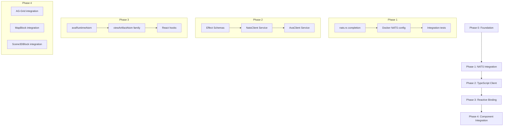

# AVA V2 Implementation Strategy

> **Status**: Strategic Planning Document
> **Date**: 2026-01-07
> **Author**: Val (Prime's Architectural Conscience)

## Executive Summary

This document synthesizes the existing AVA v2 architecture documentation into a cohesive implementation strategy. It identifies the current state, gaps, and a phased tactical approach for completing the AVA v2 reactive streaming system.

## Current State Analysis

### Completed Components (Phase 0)

| Component | Location | Status | Notes |
|-----------|----------|--------|-------|
| ava-domain | `ava-domain/src/` | ✅ Complete | Core types: ViewId, ViewProfileSpec, ViewArtifact, ChannelBinding |
| ava-reconciler/v2 | `ava-reconciler/src/v2/` | ✅ Complete | ReconcilerV2, ViewBroadcaster, TriggerEngine |
| ava-runtime/v2 | `ava-runtime/src/v2/` | ✅ Complete | AvaRuntimeV2, HydrationService |
| Proto definitions | `proto/ava/` | ✅ Complete | 5 services: View, Hydration, Reconciler, Discovery, Assemblage |
| gRPC services | `ava-api/src/grpc/` | ✅ Complete | All 4 streaming patterns implemented |

### In-Progress Components

| Component | Location | Status | Blocking |
|-----------|----------|--------|----------|
| NatsIntegration | `ava-runtime/src/v2/nats.rs` | 🔄 Partial | Feature-gated, needs completion |
| NATS docker setup | `docker/nats/` | 🔄 Partial | WebSocket gateway config needed |

### Missing Components (To Build)

| Component | Location | Priority | Dependencies |
|-----------|----------|----------|--------------|
| TypeScript schema layer | `src/lib/ava/schemas/` | P0 | Proto types |
| NatsClient Effect Service | `src/lib/ava/services/` | P0 | NATS WebSocket |
| AvaClient Effect Service | `src/lib/ava/services/` | P0 | NatsClient |
| Reactive binding atoms | `src/lib/ava/atoms/` | P1 | AvaClient |
| React hooks | `src/lib/ava/hooks/` | P1 | Atoms |
| AvaProvider | `src/lib/ava/provider.tsx` | P1 | All services |

## Architecture Overview

```
┌─────────────────────────────────────────────────────────────────┐
│                     FRONTEND (TypeScript)                       │
│  ┌─────────────────────────────────────────────────────────┐   │
│  │ React Components                                         │   │
│  │   useViewSubscription(spec) → Result<ViewArtifact>      │   │
│  │   useChannel(viewId, channelId) → Result<ChannelData>   │   │
│  └────────────────────────┬────────────────────────────────┘   │
│                           │                                     │
│  ┌────────────────────────┼────────────────────────────────┐   │
│  │ Effect-Atom Layer      ▼                                 │   │
│  │   avaRuntimeAtom = Atom.runtime(AvaClient.Default)      │   │
│  │   viewArtifactAtom = Atom.family(viewId => ...)         │   │
│  └────────────────────────┬────────────────────────────────┘   │
│                           │                                     │
│  ┌────────────────────────┼────────────────────────────────┐   │
│  │ Effect Services        ▼                                 │   │
│  │   AvaClient (Context.Tag) → subscribe, invalidate       │   │
│  │   NatsClient (Context.Tag) → WebSocket connection       │   │
│  │   Effect Schema: ViewProfileSpec, ViewArtifact, etc.    │   │
│  └────────────────────────┬────────────────────────────────┘   │
└───────────────────────────┼─────────────────────────────────────┘
                            │ NATS WebSocket (tmnl.ava.artifacts.*)
                            ▼
┌─────────────────────────────────────────────────────────────────┐
│                     BACKEND (Rust)                              │
│  ┌─────────────────────────────────────────────────────────┐   │
│  │ NATS JetStream                                           │   │
│  │   Stream: TMNL_AVA                                       │   │
│  │   Subjects: tmnl.ava.{artifacts,deltas,status}.*        │   │
│  └────────────────────────┬────────────────────────────────┘   │
│                           │                                     │
│  ┌────────────────────────┼────────────────────────────────┐   │
│  │ NatsPublisher          ▼                                 │   │
│  │   broadcast::Receiver<ViewArtifact> → JetStream publish │   │
│  └────────────────────────┬────────────────────────────────┘   │
│                           │                                     │
│  ┌────────────────────────┼────────────────────────────────┐   │
│  │ ReconcilerV2           ▼                                 │   │
│  │   ViewBroadcaster → broadcast::channel<ViewArtifact>    │   │
│  │   TriggerEngine → Source/Invalidate/Timer triggers      │   │
│  │   HydrationService → ChannelData population             │   │
│  └─────────────────────────────────────────────────────────┘   │
└─────────────────────────────────────────────────────────────────┘
```

## Strategic Decisions

### Transport: NATS WebSocket (Not gRPC-Web)

**Rationale**:
- ReconcilerV2 already uses `tokio::broadcast` channels
- NatsPublisher bridges broadcast → JetStream cleanly
- NATS WebSocket provides browser-native streaming
- Avoids gRPC-Web complexity and proxy requirements
- Aligns with existing NATS_ADAPTER_DESIGN.md

### State Management: Effect-Atom (Not useState)

**Rationale**:
- Cross-component state sharing without prop drilling
- Effect integration for async operations
- Service-scoped lifecycle management
- Reactive invalidation via `Atom.withReactivity`

### Type Safety: Effect Schema (Not Raw Types)

**Rationale**:
- Runtime validation at boundaries
- EventLog integration ready
- Branded types (ViewId, ChannelId) prevent misuse
- Decoder/encoder composition

## Implementation Phases

### Phase 1: NATS Integration Completion

**Objective**: Complete the Rust → NATS bridge

**Tasks**:
1. **Complete nats.rs** - Finish NatsPublisher and NatsSubscriber
2. **Docker config** - Add NATS with WebSocket gateway to docker-compose
3. **Integration test** - Verify artifact roundtrip

**Files to modify**:
- `src-ava/ava-runtime/src/v2/nats.rs`
- `src-ava/ava-runtime/Cargo.toml` (enable nats feature)
- `docker/docker-compose.yml`
- `docker/nats/nats.conf`

**Success criteria**:
- `cargo test --features nats` passes
- Artifacts published to JetStream visible via NATS CLI

### Phase 2: TypeScript Client Layer

**Objective**: Create Effect-based TypeScript client

**Tasks**:
1. **Effect Schema definitions** - Match proto types
2. **NatsClient Service** - WebSocket connection management
3. **AvaClient Service** - High-level subscribe/invalidate API
4. **Stream utilities** - Convert NATS messages to Effect.Stream

**File structure**:
```
src/lib/ava/
├── index.ts              # Public exports
├── schemas/
│   ├── index.ts
│   ├── view.ts           # ViewProfileSpec, ViewArtifact
│   ├── channel.ts        # ChannelBinding, ChannelData
│   └── common.ts         # ViewId, ChannelId (branded)
├── services/
│   ├── index.ts
│   ├── NatsClient.ts     # Effect.Service for NATS WebSocket
│   └── AvaClient.ts      # Effect.Service for AVA operations
└── errors.ts             # AvaError tagged unions
```

**Success criteria**:
- TypeScript compiles with strict mode
- Unit tests for schema encode/decode
- Integration test: subscribe → receive artifact

### Phase 3: Reactive Binding API

**Objective**: Create Effect-Atom integration layer

**Tasks**:
1. **avaRuntimeAtom** - Runtime with AvaClient layer
2. **viewArtifactAtom** - Family pattern for per-view state
3. **channelDataAtom** - Derived atoms for channel data
4. **Reactivity keys** - Invalidation propagation

**File structure**:
```
src/lib/ava/
├── atoms/
│   ├── index.ts
│   ├── runtime.ts        # avaRuntimeAtom
│   ├── views.ts          # viewArtifactAtom family
│   └── channels.ts       # channelDataAtom derived
├── hooks/
│   ├── index.ts
│   ├── useViewSubscription.ts
│   └── useChannel.ts
└── provider.tsx          # AvaProvider component
```

**Key patterns**:
```typescript
// Runtime with Layer
export const avaRuntimeAtom = Atom.runtime(
  Layer.merge(NatsClient.Default, AvaClient.Default)
)

// Per-view artifact atom (family pattern)
export const viewArtifactAtom = Atom.family((viewId: string) =>
  avaRuntimeAtom.atom(
    Effect.gen(function* () {
      const client = yield* AvaClient
      return yield* client.subscribeArtifacts(ViewId(viewId))
    })
  ).pipe(
    Atom.withReactivity([`ava:view:${viewId}`])
  )
)

// React hook
export function useViewSubscription(viewId: string) {
  const result = useAtomValue(viewArtifactAtom(viewId))
  const invalidate = useAtomSet(avaRuntimeAtom.fn(
    Effect.gen(function* () {
      const client = yield* AvaClient
      yield* client.invalidate(ViewId(viewId))
    }),
    { reactivityKeys: [`ava:view:${viewId}`] }
  ))
  return { result, invalidate }
}
```

**Success criteria**:
- Component renders artifact data
- Invalidation triggers re-render
- Cleanup on unmount

### Phase 4: Component Integration

**Objective**: Wire AVA to existing TMNL components

**Tasks**:
1. **AG-Grid integration** - Channel data → row data
2. **MapBlock integration** - GeoJSON channel → Maplibre
3. **Scene3DBlock integration** - 3D data channel → Three.js
4. **End-to-end test** - Full flow verification

**Integration points**:
- `src/lib/editor/v3/extensions/blocks/MapBlock/`
- `src/lib/editor/v3/extensions/blocks/Scene3DBlock/`
- `src/components/testbed/` (new AVA testbed)

**Success criteria**:
- Testbed displays live artifact updates
- AG-Grid updates reactively
- Block types render channel data

## Dependency Graph



## Critical Success Factors

1. **Proto as source of truth** - All types derive from proto definitions
2. **NATS as transport** - Not gRPC-Web, cleaner streaming model
3. **Effect-Atom for state** - Not useState, service-scoped reactivity
4. **Effect Schema for validation** - Runtime safety at boundaries
5. **Progressive hydration** - HydrationService populates channels on-demand

## Risk Mitigation

| Risk | Mitigation |
|------|------------|
| NATS WebSocket latency | Benchmark early, consider fallback to direct WebSocket |
| Effect-Atom learning curve | Start with simple atoms, add complexity incrementally |
| Proto → TypeScript drift | Automate generation in CI, fail on mismatch |
| Browser compatibility | Test Safari/Firefox early (WebSocket differences) |

## Testing Strategy

### Effect Testing Patterns (from effect-atom submodule)

```typescript
import { describe, it, expect } from '@effect/vitest'
import { Effect, Layer, Schedule, Duration } from 'effect'
import * as Registry from '@effect-atom/atom/Registry'
import * as Result from '@effect-atom/atom/Result'

// Registry-based atom testing
const r = Registry.make()
expect(r.get(myAtom)).toBe(initialValue)
r.set(myAtom, newValue)
expect(r.get(myAtom)).toBe(newValue)

// Effect-based tests
it.effect('test name', () =>
  Effect.gen(function* () {
    const result = yield* someEffect
    expect(result).toBe(expected)
  })
)

// Stream subscription testing
const unmount = r.mount(streamAtom)
r.set(streamAtom, input)
const result = r.get(streamAtom)
expect(Result.isSuccess(result)).toBe(true)
unmount()
```

### Retry and Reconnection Patterns

```typescript
// Exponential backoff with minimum delay
const retrySchedule = Schedule.exponential(Duration.millis(500), 1.5).pipe(
  Schedule.union(Schedule.spaced(Duration.seconds(5)))
)

// Connection with automatic refresh
const connectionResource = Resource.auto(
  connectEffect.pipe(Effect.retry(retrySchedule)),
  Schedule.spaced(Duration.minutes(5))
)
```

### Test Coverage Requirements

| Module | Test File | Coverage |
|--------|-----------|----------|
| schemas/v2 | ava-v2-schemas.test.ts | ✅ Complete |
| services/NatsClient | ava-v2-services.test.ts | 🔄 In Progress |
| services/AvaClientV2 | ava-v2-services.test.ts | 🔄 In Progress |
| atoms/v2 | (pending) | ⏳ Planned |
| hooks/v2 | (pending) | ⏳ Planned |

## References

- [ARCHITECTURE_V2.md](./ARCHITECTURE_V2.md) - Core v2 architecture
- [AVA_WASM_V2_ARCHITECTURE.md](./AVA_WASM_V2_ARCHITECTURE.md) - WASM client design
- [AVA_REACTIVE_BINDING_API.md](./AVA_REACTIVE_BINDING_API.md) - React binding API
- [NATS_ADAPTER_DESIGN.md](../ava-adapters/NATS_ADAPTER_DESIGN.md) - NATS integration
- [ADR-001-REST-FROM-GRPC.md](./ADR-001-REST-FROM-GRPC.md) - REST API design
- [effect-atom README](../../submodules/effect-atom/README.md) - Atom patterns
- [effect-atom tests](../../submodules/effect-atom/packages/atom/test/) - Canonical test patterns
