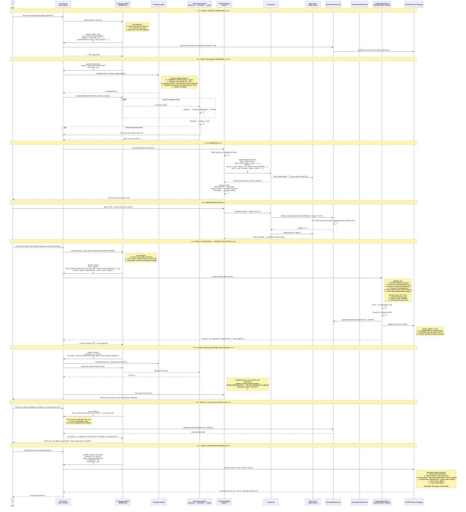

# Genifer LLM Sequence Diagram

How an LLM works with genifer end-to-end.

---

## The Core Insight

Genifer gives the LLM **eight tools**. Not one. The LLM doesn't just generate UI — it
programs the system. It defines new RPCs, registers new tools, writes Effect code, generates
interactive surfaces, and bundles the result as a reusable extension. Each tool call
extends the system's capabilities for subsequent turns.

This is the Cloudflare CodeAct pattern applied to Effect-TS: LLMs are better at writing
code that calls APIs than at making individual tool calls one at a time.

### The Tool Inventory

| Tool | What it does | When the LLM calls it |
|------|-------------|----------------------|
| `genifer_generate` | Create interactive UI from natural language | "Build me a search bar" |
| `genifer_refine` | Modify an existing surface | "Add a date filter to that" |
| `genifer_query` | Read/search persisted trees | "Show me the dashboard I built yesterday" |
| `genifer_define_rpc` | Register a runtime RPC with handler | Needs an API that doesn't exist yet |
| `genifer_define_tool` | Register a new callable tool | Needs a capability that doesn't exist yet |
| `genifer_define_event` | Register a custom event type | Surface needs domain-specific events |
| `genifer_code` | Write + execute Effect code in sandbox | Complex logic the JSON DSL can't express |
| `genifer_export_extension` | Bundle surface + registrations as extension | Package for reuse |

The LLM **chains these across turns**. Turn 1 defines an RPC. Turn 2 generates UI that
calls that RPC. Turn 3 writes Effect code that enriches the results. Turn 4 exports it all.

---

## Sequence Diagram



---

## Code Mode Is Not Inline Code Blocks

**Wrong mental model:** Code Mode = embedding `codeBlocks[]` inside behavior blocks.

**Correct mental model:** Code Mode = the LLM has a full programming API (`genifer_code` tool)
that it calls as a separate tool invocation to write Effect programs. The outputs get
registered back into the system as first-class citizens — RPCs, tools, atoms, events —
that persist for the session and can be called by subsequent tool invocations or
ActionGroup references.

The pattern is identical to Cloudflare's CodeAct:

| Cloudflare Code Mode | Genifer Code Mode |
|---|---|
| LLM writes TypeScript | LLM writes Effect-TS |
| Executes in Worker sandbox | Executes in isolated Effect runtime |
| Calls MCP tools via generated TypeScript API | Calls DynamicRpcService/EventService via GeniferCodeSDK |
| Results return to LLM context | Results register as RPCs/tools/atoms/events |
| Single `execute_code` tool | `genifer_code` tool with `define`/`execute`/`pipe` modes |

The key difference: Cloudflare's Code Mode returns results to context. Genifer's Code Mode
**registers capabilities** — the output persists as callable infrastructure, not just data.

---

## The Three Generation Tiers

### Tier 1: Component Reference

LLM names a pre-built `@component`. Zero DSL needed.

```
LLM: genifer_generate → tree references "FlightSearchBar"
System: interpretComponentRef() → catalog lookup → hydrate pre-built ActionGroup
```

### Tier 2: Behavior Block (JSON DSL)

LLM defines state + actions inline. The interpreter creates atoms and dispatch.

```
LLM: genifer_generate → tree includes behavior { state, actions, subscriptions }
System: interpretBehaviorBlock() → Atom.make() per field, dispatch(), event wiring
```

### Tier 3: Code Mode (Effect programs via `genifer_code` tool)

LLM calls `genifer_code` to write Effect programs that extend the system.

```
LLM: genifer_code({ code: "Effect.gen(...)", expose: { asRpc: "tag" } })
System: sandbox → execute → registerDynamicRpc() → available in future turns
```

**The tiers compose across turns.** The LLM might:
1. Call `genifer_code` to define a custom RPC with complex logic (Tier 3)
2. Call `genifer_generate` to build UI that references that RPC via callRpc action (Tier 2)
3. The generated UI includes a `ref` to a pre-built `@component` for the map view (Tier 1)

They're not mutually exclusive layers inside one JSON tree — they're **separate tool calls
across turns** that build on each other.

---

## genifer_code: The Full API

### Three Modes

| Mode | Purpose | Example |
|------|---------|---------|
| `define` | Create new service/handler/renderer | Define a custom RPC handler |
| `execute` | Run code and return result | Compute statistics, transform data |
| `pipe` | Create a stream transform | Real-time data enrichment pipeline |

### The SDK Surface

Code running inside the sandbox gets `GeniferCodeSDK` injected:

```typescript
interface GeniferCodeSDK {
  // --- Services (read + write) ---
  readonly rpc:     DynamicRpcService      // register + call RPCs
  readonly events:  DynamicEventService    // define + emit events  
  readonly catalog: CatalogService         // lookup components

  // --- Atoms (current surface's state) ---
  readonly atoms: {
    get:       <T>(atom: Atom<T>) => T
    set:       <T>(atom: Atom<T>, value: T) => void
    subscribe: <T>(atom: Atom<T>, fn: (v: T) => void) => () => void
  }
  readonly resolve: (field: string) => Atom.Writable<any, any>

  // --- Registration (expose outputs) ---
  readonly register: {
    tool:      (spec: ToolDefinition) => void        // LLM can call this next turn
    rpc:       (tag: string, handler: Function) => void
    event:     (tag: string, desc?: string) => void
    renderer:  (name: string, component: ComponentType) => void
    component: (name: string, renderer: ComponentType, schema: Schema.Schema<any>) => void
  }

  // --- HTTP (allowlisted domains) ---
  readonly http: {
    get:  (url: string, opts?) => Effect.Effect<Response>
    post: (url: string, body: unknown, opts?) => Effect.Effect<Response>
  }

  // --- Surface manipulation ---
  readonly surface: {
    create: (tree: UITree) => Effect.Effect<GeniferSurface>
    update: (id: string, fn: (tree: UITree) => UITree) => Effect.Effect<void>
    bind:   (id: string, key: string, binding: DataSourceBinding) => Effect.Effect<void>
  }

  // --- Effect runtime ---
  readonly effect: {
    run:       <A>(effect: Effect.Effect<A>) => Promise<A>
    runStream: <A>(stream: Stream.Stream<A>) => AsyncIterable<A>
  }
}
```

### Security Model

| Layer | Mechanism |
|-------|-----------|
| Sandbox isolation | Separate Effect runtime — no process/fs/parent scope |
| Schema validation | All RPC payloads validated against registered schemas |
| URL allowlist | HTTP only to approved domains |
| Rate limiting | Per-session execution budget |
| Audit log | Every execution logged to DynamicEventService |
| Confirmation gates | Destructive ops require user approval |
| TTL | Session-scoped by default; explicit persist to survive |

---

## The Full Flow: "OpenSky Dashboard" in 4 Turns

```
Turn 1:
  User: "Build me a flight search against OpenSky"
  
  LLM calls: genifer_define_rpc({
    tag: "opensky/SearchFlights",
    handler: { _tag: "http", url: "https://opensky-network.org/api/states/all" }
  })
  → RPC registered ✓

  LLM calls: genifer_generate({ prompt: "flight search", interactive: true })
  → Surface rendered with search bar + results table
  → ActionGroup "flight-search" with callRpc("opensky/SearchFlights")

Turn 2:
  User: "Enrich with altitude categories"

  LLM calls: genifer_code({
    mode: "define",
    code: `Effect.gen(function*() {
      const sdk = yield* GeniferCodeSDK
      sdk.register.rpc("flights/enrich", (flights) => {
        return flights.map(f => ({
          ...f,
          category: f.altitude > 10000 ? 'cruising' : f.altitude > 1000 ? 'climbing' : 'ground',
          speedKnots: Math.round(f.velocity * 1.944)
        }))
      })
    })`,
    expose: { asRpc: "flights/enrich", asTool: "enrich_flights" }
  })
  → RPC + tool registered ✓

  LLM calls: genifer_refine({ surfaceId: "sfc_abc", instruction: "chain enrich after search" })
  → Surface updated: search → enrich → display

Turn 3:
  User: "What's the altitude distribution over Europe?"

  LLM calls: enrich_flights({ bbox: { minLat: 36, maxLat: 71, minLon: -10, maxLon: 40 } })
  → The LLM is calling the tool IT DEFINED in Turn 2
  → Returns enriched data with categories
  
  LLM: "1,116 flights. 76% cruising, 19% climbing, 5% ground..."

Turn 4:
  User: "Package this"

  LLM calls: genifer_export_extension({
    surfaceId: "sfc_abc", name: "opensky-dashboard"
  })
  → Bundles: UI tree + behavior + 2 RPCs + 1 tool + event subscriptions
  → Extension artifact: installable, shareable, versionable
```

---

## File Map

```
PROMPT + GENERATION
  src/lib/genifer/compiler/PromptCompiler.ts     — builds system prompt
  src/lib/genifer/compiler/ai-adapter.ts         — generate() + refine() with retry
  src/lib/genifer/decorators/generation-schema.ts — DSL teaching fragment

STREAMING PIPELINE
  src/lib/genifer/streaming/pipeline.ts          — tokenize → normalize → repair → score

HYDRATION + RENDERING
  src/lib/genifer/react/BehaviorBridge.tsx        — resolves behaviors + sigils
  src/lib/genifer/react/SurfaceRenderer.tsx       — renders a surface

INTERPRETER
  src/lib/genifer/decorators/interpreter.ts       — interpretBehaviorBlock(), interpretComponentRef()
  src/lib/genifer/decorators/bootstrap.ts         — wires decorators → services

DYNAMIC SERVICES (built)
  src/lib/genifer/services/DynamicRpcService.ts   — runtime RPC dispatch
  src/lib/genifer/services/DynamicEventService.ts — pub/sub event bus

CODE MODE SDK (planned — #F622)
  (not yet built) CodeModeSandbox     — isolated Effect runtime
  (not yet built) CodeModeExecutor    — parse, compile, run
  (not yet built) GeniferCodeSDK      — injected API surface
  (not yet built) genifer_code tool   — ToolDefinition for harness
  (not yet built) expose() wiring     — register outputs as RPCs/tools/atoms/events

HARNESS TOOLS
  src/lib/genifer/harness/tools.ts               — genifer_generate + genifer_refine
  src/lib/genifer/harness/GeniferHarnessService.ts — surface lifecycle
```
