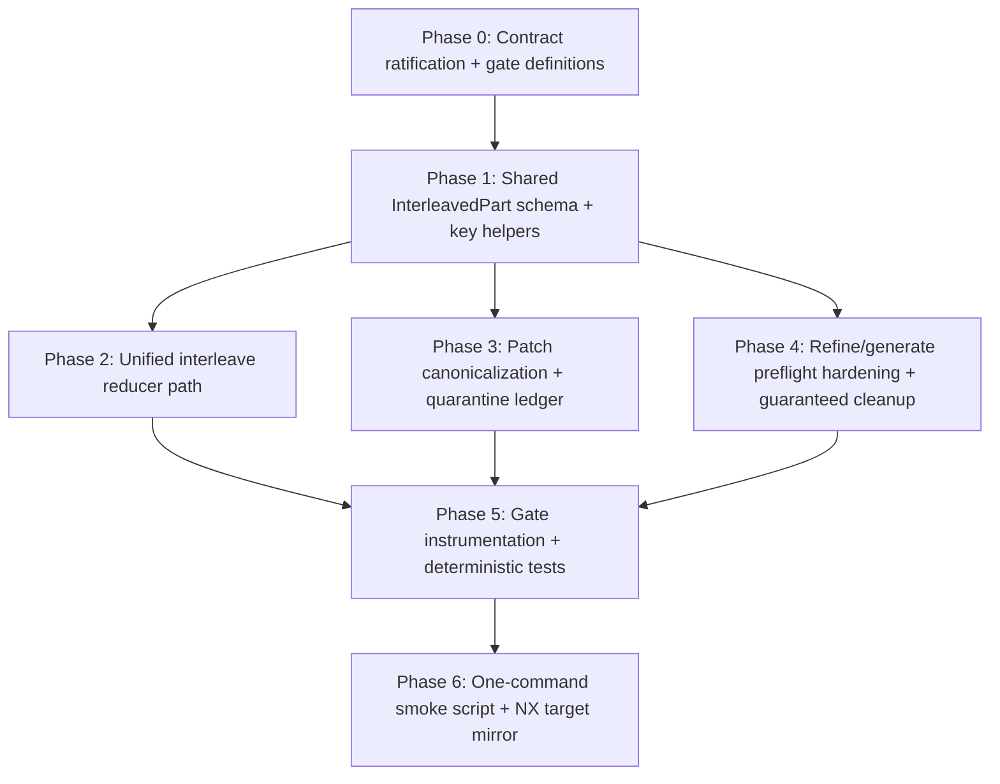

# INTERLEAVED_EXECUTION_PLAN

**Status:** Validate-phase execution plan (implementation-ready)  
**Date:** 2026-02-28  
**Inputs:**
- `docs/genifer/specs/INTERLEAVED_RENDERING_SPEC.md`
- `docs/genifer/specs/INTERLEAVED_GAP_ANALYSIS_SPEC.md`
- `.agents/comm/interleaved-design-handoff.md`
- `.agents/comm/interleaved-implement-response.md`

---

## 1) Reconciled Contract Baseline

### 1.1 Locked user acceptance criteria (non-negotiable)
1. `no-refine-crash`
2. `first patch visible <=200ms`
3. `branch-local rerender`
4. `malformed patch quarantine`
5. `one-command smoke`

### 1.2 Reconciled implementation contract
- Ordered interleave is canonical: text + tool + patch in one reducer path.
- Atom-as-state is canonical for hot updates; avoid whole-array streaming writes.
- Tool lifecycle is monotonic; terminal tool states are immutable.
- Patch streams are deduped/ordered by `patchSeq` and isolated per stream.
- Refine/generate require preflight seed validation and typed fast-fail semantics.

### 1.3 Provisional defaults for unresolved design choices (apply unless owner overrides)
1. **Branch identity split**
   - Message branch key: `sessionId:messageId`
   - Patch stream key: `${surfaceId ?? sessionId}:${toolCallId}`
2. **Latency gate time origin**
   - Start: refine/generate start event
   - End: `firstPatchCommittedTs` (first UI-visible patch commit)
3. **Quarantine retention**
   - Phase-1: bounded in-memory ring buffer + counters
4. **Smoke scope**
   - CI gate: deterministic vitest-only
   - Live harness smoke remains optional and separate
5. **Malformed patch escalation**
   - Do not hard-stop mid-stream by count alone
   - Hard fail at attempt boundary when canonical output cannot be formed

---

## 2) Dependency Order (Topological)



**Rule:** no downstream phase starts before upstream gate exit criteria are green.

---

## 3) Phased Implementation Plan (Commit Slices)

## Phase 0 — Gate-first ratification
**Goal:** Freeze measurement and failure semantics before code changes.  
**Deliverables:**
- Gate checklist file (or section in existing spec) with pass/fail math.
- Ratified defaults (Section 1.3) or explicit owner overrides.

**Exit criteria:**
- All 5 gates have exact pass/fail conditions and evidence source.

---

## Phase 1 — Schema + Identity (`Slice A`)
**Goal:** Introduce canonical interleaved schema and stable keys.

**Work:**
- Add `InterleavedPart` schema union with `part:text`, `part:thinking`, `part:tool`, `part:patch`.
- Add key helper utilities for message branch and patch stream keys.
- Add invariant checks for `contentIndex` monotonicity and stream key consistency.

**Exit criteria:**
- Unit tests validate schema decode/encode and identity helper outputs.

---

## Phase 2 — Reducer unification (`Slice B`)
**Goal:** Single ordered reducer path for text/tool/patch.

**Work:**
- Route `assistant_delta`, `tool start/update/end`, and patch events through one ordered reducer.
- Centralize tool transition guard; block terminal-to-nonterminal mutation.
- Keep `content` summary in sync with canonical parts.

**Exit criteria:**
- Deterministic reducer tests prove stable ordering and immutable terminal tool states.

---

## Phase 3 — Patch canonicalization + quarantine (`Slice C`)
**Goal:** Enforce protocol correctness without global fallout.

**Work:**
- Enforce stream-scoped `patchSeq` monotonicity/dedupe.
- Add malformed patch quarantine ledger (`line`, `lineIndex`, `reason`, `streamId`, `context`).
- Ensure apply failures are branch-local no-op.
- Tighten canonical validator and disable non-patch fallback for interleaved mode.

**Exit criteria:**
- Mixed valid/invalid streams continue safely.
- Canonical-invalid final outputs fail typed with quarantine evidence.

---

## Phase 4 — Refine/generate preflight hardening (`Slice D`)
**Goal:** Eliminate refine crash and stale active-generation leaks.

**Work:**
- Add explicit refine seed preflight helper.
- Perform preflight before any state mutation/start event.
- Wrap lifecycle in guaranteed cleanup (`Effect.ensuring` / `acquireRelease`).
- Emit typed failure rows (no uncaught exceptions).

**Exit criteria:**
- Invalid/missing seed always typed-fails without partial mutation.
- Active generation state always clears on every terminal path.

---

## Phase 5 — Gate instrumentation + tests (`Slice E`)
**Goal:** Make each locked acceptance criterion executable and deterministic.

**Work:**
- Add `startTs`, `firstPatchReceivedTs`, `firstPatchCommittedTs` probes.
- Add branch render counters for target vs non-target branches.
- Add quarantine ledger assertions and typed failure assertions.

**Exit criteria:**
- Each locked gate has at least one deterministic contract test.

---

## Phase 6 — One-command smoke + NX mirror
**Goal:** Single command to verify all locked gates.

**Work:**
- Add script: `interleaved:smoke` in `package.json`.
- Add NX target: `interleaved:smoke` in `project.json`.
- Script must fail non-zero on any gate failure.

**Exit criteria:**
- `bun run interleaved:smoke` and `nx run tmnl:interleaved:smoke` are green in deterministic CI mode.

---

## 4) Validation Strategy

### 4.1 Test tiers
1. **Schema/identity unit tests**
   - Interleaved part decode/encode
   - Branch/stream key determinism
2. **Reducer contract tests**
   - Ordered interleave behavior
   - Terminal lifecycle immutability
3. **Patch protocol tests**
   - Stream-scoped dedupe
   - Quarantine metadata ledger
   - Branch-local failure isolation
4. **Refine safety tests**
   - Typed preflight failures
   - No partial mutation
   - Always-clear active generation state
5. **Gate smoke tests**
   - Aggregate pass/fail for all 5 locked criteria

### 4.2 Determinism requirements
- Fixed fixture inputs and explicit sequence numbers.
- Fake/controlled timers for latency assertions.
- No dependency on live provider/harness network for CI gate pass.

---

## 5) Go / No-Go Gate Matrix (tied to user acceptance criteria)

| Gate | Pass condition | Evidence artifact | GO | NO-GO (block merge) |
|---|---|---|---|---|
| `no-refine-crash` | Invalid/missing refine seed returns typed failure; zero uncaught throws; zero partial state mutation | Contract test + state snapshot assertions | All assertions pass | Any uncaught exception or leaked active state |
| `first patch visible <=200ms` | P95(`startTs -> firstPatchCommittedTs`) <= 200ms on deterministic fixture run | Latency contract test output | P95 <= 200ms | P95 > 200ms or missing probe fields |
| `branch-local rerender` | Non-target branches do not rerender on target stream token/patch updates | Render-counter contract test | Non-target delta = 0 | Any non-target rerender drift |
| `malformed patch quarantine` | Invalid patch lines captured in ledger; valid lines continue when possible; no global crash | Quarantine contract test + ledger snapshot | Ledger and continuation assertions pass | Fatal stream/global abort from malformed line |
| `one-command smoke` | Single script executes all gate suites and returns non-zero on failure | `bun run interleaved:smoke` | Exit code 0 | Script missing, skips gate suite, or false-green |

---

## 6) Deterministic Smoke Command Sequence (paste-ready)

### 6.1 Gate test commands (author and wire into script)
```bash
# deterministic mode
CI=1 bunx vitest run \
  src/lib/genifer/__tests__/interleaved/no-refine-crash.contract.test.ts \
  src/lib/genifer/__tests__/interleaved/first-patch-latency.contract.test.ts \
  src/lib/morphchat/__tests__/interleaved/branch-local-rerender.contract.test.tsx \
  src/lib/genifer/__tests__/interleaved/patch-quarantine.contract.test.ts \
  src/lib/genifer/__tests__/interleaved/interleaved-smoke.contract.test.ts
```

### 6.2 Required one-command smoke
```bash
bun run interleaved:smoke
```

### 6.3 Optional NX mirror
```bash
nx run tmnl:interleaved:smoke
```

---

## 7) Execution Guardrails

- No UI styling changes in this execution stream.
- Keep commit slicing coherent by phase (A→F); each commit must map to one phase gate.
- Do not declare completion until all 5 locked gates are green via one-command smoke.
