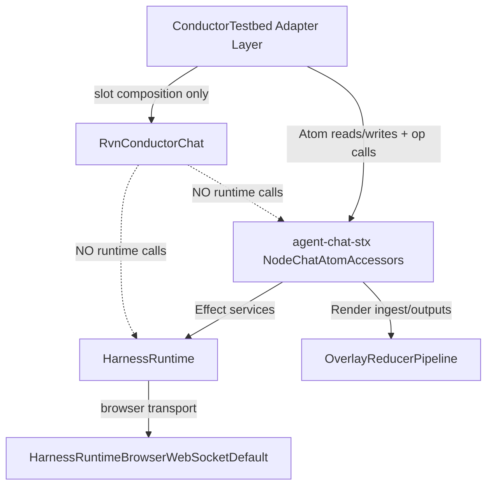

# RVN Harness Chat Integration Design v1

**Status:** Design (no implementation in this artifact)  
**Scope:** Replace `ConductorAgentChat` usage in `ConductorTestbed` with `RvnConductorChat` while preserving `agent-chat-stx` + `HarnessRuntime` as the only runtime boundary.

---

## 1) Inputs and validated findings (scout + repo evidence)

### Scout synthesis

1. `ConductorTestbed` currently binds chat state/ops through `NodeChatAtomAccessors` and mounts `ConductorAgentChat.Root` with a large prop/callback surface.
2. `agent-chat-stx` is already the runtime seam: Atom families + op families, with `HarnessRuntimeBrowserWebSocketDefault` and `OverlayReducerPipelineLive`.
3. `RvnConductorChat` exists as a slot-first compound shell with explicit `mode` + root callback controls (`onModeChange`, `onExitChat`) and controlled composer primitive (`ContentEditable`).
4. Existing hard-cut tests assert chat-v2 runtime path invariants (`openSession/resumeSession/getSnapshot`, no legacy polling path).

### Direct evidence index

- Current mount point in testbed: `src/components/testbed/ConductorTestbed.tsx:2273-2483`
- Chat atom/op binding in testbed: `src/components/testbed/ConductorTestbed.tsx:2026-2059`
- Current `ConductorAgentChat` contract: `src/components/testbed/conductor/ConductorAgentChat.tsx:75-100`
- Current expansion surface contract: `src/components/testbed/conductor/ConductorAgentChat.tsx:89-90,449-451`
- Existing node-level expansion state: `src/components/testbed/ConductorTestbed.tsx:2908,2919,3020-3037`
- Target `RvnConductorChat` root/mode contract: `src/components/testbed/conductor/RvnConductorChat.tsx:11-18`
- `RvnConductorChat` mode controls: `src/components/testbed/conductor/RvnConductorChat.tsx:184-202,301-319`
- `RvnConductorChat` contenteditable control contract: `src/components/testbed/conductor/RvnConductorChat.tsx:562-581`
- Runtime seam layer composition: `src/components/testbed/conductor/agent-chat-stx.ts:29-31`
- Runtime seam interface usage (`openSession/resumeSession/getSnapshot/send/abort`): `src/components/testbed/conductor/agent-chat-stx.ts:759,825,832,1071-1076,971`
- Event dedupe invariant (`seq` monotonic guard): `src/components/testbed/conductor/agent-chat-stx.ts:586-592`
- Session gating invariant for streams: `src/components/testbed/conductor/agent-chat-stx.ts:774-789`
- Single-subscription guard: `src/components/testbed/conductor/agent-chat-stx.ts:768-821`
- Harness runtime contract: `src/lib/harness/HarnessRuntime.ts:25-50`
- Browser runtime command mapping: `src/lib/harness/HarnessRuntimeBrowser.ts:114,135,150,170`
- Hard-cut invariant test: `src/components/testbed/conductor/__tests__/chat-v2-hardcut.test.ts:10-31`
- RVN chat contract test: `src/components/testbed/conductor/__tests__/RvnConductorChat.contract.test.tsx:7-104`

---

## 2) Goals

1. **Swap the view shell only:** replace `ConductorAgentChat` mount in `ConductorTestbed` with `RvnConductorChat` composition.
2. **Preserve runtime seam:** no new runtime path; all session/send/reconnect/abort/replay operations remain through `NodeChatAtomAccessors` (`agent-chat-stx`) and `HarnessRuntime`.
3. **Preserve event semantics:** keep sequence/session/replay invariants unchanged.
4. **Make mappings explicit:** define deterministic prop/event/mode mapping contract from current behavior to new shell.
5. **Gate-driven rollout:** define acceptance gates before implementation.

## 3) Non-goals

1. No changes to `HarnessRuntime`, `HarnessRuntimeBrowser`, or harness schemas.
2. No change to `agent-chat-stx` replay algorithm or stream subscription strategy.
3. No redesign of backend protocol/event tags.
4. No visual redesign outside replacing mount surface with `RvnConductorChat` slots.
5. No opportunistic feature expansion (new commands, new transport semantics).

---

## 4) Boundary architecture (must remain true)



### Boundary rules

- `RvnConductorChat` is **pure presentation + UI event emission**.
- `ConductorTestbed` adapter translates between node-scoped atoms and `RvnConductorChat` slots/events.
- Runtime access remains isolated in `agent-chat-stx` op families (`ensureNodeAgent`, `sendPrompt`, `reconnectNode`, `abortNode`).

---

## 5) Prop/event mapping matrix (current → target)

| Current integration (ConductorTestbed + ConductorAgentChat) | Target RVN surface | Adapter mapping decision |
|---|---|---|
| `title` | `Header.Root` content | Render title text in RVN header slot; no runtime impact. |
| `agents`, `activeAgentId`, `onActiveAgentChange` | `Header.AgentSwitch` | Keep same agent source list; switch action still sets `NodeChatAtomAccessors.activeAgent(...)` + provision-on-activate behavior. |
| `messages`, `streamingMessageId` | `Thread.UserMessage` / `Thread.AssistantMessage` / `AssistantMessage.StreamingBody` / `AssistantMessage.FinalBody` | Continue rendering from `chatMessagesAtom`; choose streaming/final body by `streamingMessageId`. |
| `statusRows` | `Thread.StatusRow` / `Thread.ErrorBanner` | Preserve existing synthesized status rows and tone mapping. |
| `draft`, `onDraftChange` | `Composer.ContentEditable` (`value`, `onValueChange`) | Direct controlled mapping; draft remains node-scoped atom. |
| `onSend(payload)` | `Composer.PrimaryAction` | Adapter owns payload assembly (`text`, `thinkingLevel`, `targetAgentId`, mentions). Runtime call path unchanged (`runChatPrompt`). |
| `onPause(targetAgentId)` while streaming | `Composer.PrimaryAction` alternate behavior | Preserve current “Pause when streaming, Send otherwise” behavior in adapter state machine. |
| `onReconnect(targetAgentId)` | `Composer.ReconnectAction` | Preserve reconnect/resync workflow and status indicators. |
| `onResetSession(targetAgentId)` | `Header.ResetSession` | Preserve full reset flow (abort + atom clears + node/session reset). |
| `onExitChat(targetAgentId)` | `Header.ExitL3` | Route to existing L3 exit behavior (`onChatExpansionLevelChange('l2')` equivalent). |
| `onToggleExpansion(nextLevel, targetAgentId)` + `expansionLevel` | `Root.mode` + `onModeChange` + `Header.CollapseToL2` + `Context.CollapseToggle` | Use deterministic mode mapping (section 6). |
| `threadScrollTop` / `onThreadScrollTopChange` | `Thread.Root` scroll container | Keep atom-backed scroll retention per active agent. |
| quick actions / slash / mention affordances | `Composer.SuggestionRail`, `Composer.SuggestionPopup`, `Composer.Slash.Root`, `Composer.Mention.Root` | Rebuild as adapter-composed children in RVN slots; runtime independent. |

---

## 6) Mode mapping contract

### Source model (today)

- `ChatExpansionLevel`: `'l2' | 'l3'` (`ConductorAgentChat` view size intent)
- `surface`: `'inspector' | 'chat'` (`AgentInspector` host mode)

### Target model (RVN)

- `RvnConductorChatMode`: `'collapsed' | 'expanded' | 'chat_full'`

### Deterministic mapping

| Source state | Target `RvnConductorChat.mode` | Notes |
|---|---|---|
| `surface='chat'` and `chatExpansionLevel='l3'` | `chat_full` | Full chat canvas intent. |
| `surface='chat'` and `chatExpansionLevel='l2'` and `contextCollapsed=false` | `expanded` | L2 chat with context visible. |
| `surface='chat'` and `chatExpansionLevel='l2'` and `contextCollapsed=true` | `collapsed` | L2 chat with context collapsed. |
| `surface='inspector'` | N/A (RVN chat unmounted) | Inspector lane remains non-chat surface. |

### Reverse mapping (RVN events → source state)

- `onModeChange('chat_full')` ⇒ set `chatExpansionLevel='l3'`, `contextCollapsed=false`
- `onModeChange('expanded')` ⇒ set `chatExpansionLevel='l2'`, `contextCollapsed=false`
- `onModeChange('collapsed')` ⇒ set `chatExpansionLevel='l2'`, `contextCollapsed=true`
- `onExitChat()` ⇒ equivalent to collapse-to-L2 + leave chat_full

---

## 7) Atom-as-state ownership model

| State domain | Owner | Reason |
|---|---|---|
| Session/message runtime (`messages`, `pending`, `error`, `sessionId`, `lastSeq`, `streamingMessageId`, reliability metrics) | `agent-chat-stx` node families (`nodeChat*Family`) | Runtime-coupled, sequence-sensitive, shared by multiple UI controls; already keepAlive + op-driven. |
| Runtime operations (`ensure`, `send`, `reconnect`, `abort`) | `agent-chat-stx` op families | Sole authorized path to `HarnessRuntime`; enforces boundary. |
| Tool lifecycle thread attachments | `inline-task-thread` atoms (`inlineTask*`) | Already fed from `chat:v2/tool_event` adapter mapping. |
| Chat presentation mode (`collapsed/expanded/chat_full`) and context-collapsed intent | **Adapter-level Atom state** (node-scoped) | UI-only but cross-slot/shared; should stay atomized rather than distributed local widget state. |
| Ephemeral DOM-local interaction state (focus ring, hover, menu open) | Component local state | Not shared, not runtime, no replay concern. |

**Invariant:** no `Effect.Ref` bridge for React-facing chat state in this slice; React reads/writes atoms directly.

---

## 8) Sequence/replay invariants (must not regress)

1. **Monotonic event apply** — ignore events with `seq <= lastSeq`. (`agent-chat-stx.ts:586-592`)
2. **Session isolation** — only apply events/emissions for active session id. (`agent-chat-stx.ts:774-789`)
3. **Single subscription per node** — stream registration occurs once per node lifecycle guard. (`agent-chat-stx.ts:768-821`)
4. **Resume-first reconnect** — reconnect attempts resume from known seq before fallback reopen. (`agent-chat-stx.ts:825-839`)
5. **Fallback recovery** — resume failure triggers reopen + snapshot + cursor reset + system note. (`agent-chat-stx.ts:840-850`)
6. **Snapshot replay accounting** — replay increments reliability counters and applies through same reducer path. (`agent-chat-stx.ts:281-299`)
7. **Schema-backed sequence domain** — `HarnessSeq` is non-negative and embedded in all chat-v2 events. (`src/lib/harness/schemas.ts:26-27,133-250`)
8. **Replay cursor contract remains available** — `HarnessReplayCursor.lastAppliedSeq` and store helpers (`deriveHeadSeq`, `toReplayEvents`) are unchanged. (`schemas.ts:301-303`, `HarnessSessionStore.ts:40-44`)

---

## 9) Risk register (design-level)

| Risk ID | Risk | Impact | Mitigation | Gate |
|---|---|---|---|---|
| R-01 | UI contract mismatch: `RvnConductorChat` lacks built-in orchestration behaviors from `ConductorAgentChat` | Lost UX parity (agent switching, suggestions, pause/send semantics) | Build explicit adapter composition matrix (section 5) and require behavior tests | G2, G4 |
| R-02 | Mode ambiguity (`l2/l3` vs `collapsed/expanded/chat_full`) | Incorrect panel sizing or wrong control behavior | Enforce deterministic mapping table (section 6) and callback normalization | G2 |
| R-03 | Runtime leakage from new UI shell | Boundary violation, duplicated runtime calls | Ban runtime imports from RVN shell integration path; runtime calls remain in `agent-chat-stx` ops only | G1 |
| R-04 | Replay invariants accidentally altered during adapter rewrite | Lost/double events on reconnect | Keep `agent-chat-stx` untouched in this migration slice; verify invariant tests | G3 |
| R-05 | Scroll/draft/session state regression during component swap | UX continuity loss per active agent | Keep draft/scroll/session atoms as source of truth; explicit ownership map | G2 |
| R-06 | Hidden regressions in status tone/action routing | Misleading operator states | Preserve status row generation logic and explicit tone-to-slot mapping | G2, G4 |

---

## 10) Acceptance gates (define before implementation)

### G0 — Design completeness gate
- This document contains: goals/non-goals, boundary diagram, mapping matrix, mode contract, ownership, invariants, risks, acceptance gates.

### G1 — Runtime boundary gate
- `ConductorTestbed` chat surface must not import runtime services directly.
- `RvnConductorChat` integration must not call `HarnessRuntime` directly.
- Runtime path remains: `ConductorTestbed adapter -> NodeChatAtomAccessors ops -> HarnessRuntime`.

### G2 — Contract behavior gate
- Mapped behaviors remain available:
  - active agent switching,
  - send/pause toggle,
  - reconnect/reset/exit controls,
  - draft + scroll persistence,
  - status rows + error banner,
  - suggestion rail/popup composition.

### G3 — Sequence/replay invariants gate
- Existing seq/session/reconnect invariants pass unchanged.

### G4 — Regression/test gate (bun)

Run at minimum:

```bash
bunx vitest src/components/testbed/conductor/__tests__/chat-v2-hardcut.test.ts
bunx vitest src/components/testbed/conductor/__tests__/RvnConductorChat.contract.test.tsx
bunx vitest src/components/testbed/conductor/__tests__/ConductorAgentChat.regression.test.tsx
```

### G5 — Hard-cut removal gate
- `ConductorTestbed.tsx` no longer mounts `ConductorAgentChat.*`.
- `ConductorTestbed.tsx` mounts `RvnConductorChat.*` composition for chat surface.
- `agent-chat-stx` remains runtime boundary without alternate transport path.

---

## 11) Migration slice plan (design-only, no code here)

1. **Slice A — Adapter scaffold:** mount RVN root and wire mode/draft/send/reconnect/reset/exit callbacks.
2. **Slice B — Thread parity:** map message/status/streaming/breakout rendering into RVN thread slots.
3. **Slice C — Composer parity:** map suggestion rail/popup, slash/mention affordances, pause/send transport.
4. **Slice D — Gate pass + hard-cut:** remove ConductorAgentChat mount, run acceptance gates.

---

## 12) Decision summary

- We are performing a **presentation-shell replacement**, not a runtime migration.
- The runtime boundary stays exactly where it already is: `agent-chat-stx` + `HarnessRuntime`.
- Success is measured by preserved behavior and preserved sequence/replay invariants, not by introducing new architecture surfaces.
