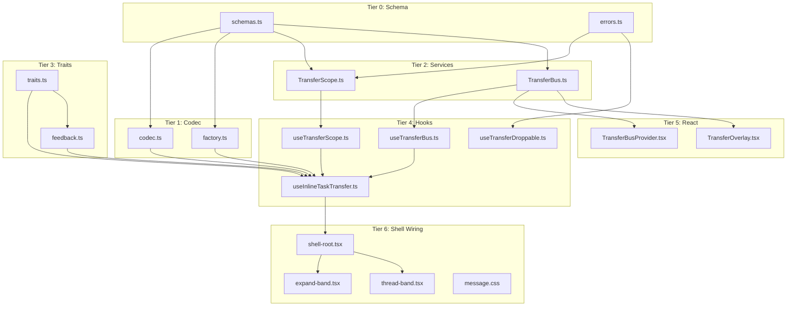

# 06 — Transfer Dependency Graph & Implementation Order

**Parent**: [Index](./00-transfer-redesign-index.md)

---

## Implementation Tiers

### Tier 0: Schema Foundation (no runtime dependencies)

| File | Description | Depends On |
|---|---|---|
| `src/lib/transfer/v2/schemas.ts` | Redesigned schema surface (doc 02) | Effect Schema only |
| `src/lib/transfer/v2/errors.ts` | `TransferReject` error class | Effect |

**Commit strategy**: 1 commit for schemas, 1 for errors.

### Tier 1: Codec + Token Factory (schema-dependent)

| File | Description | Depends On |
|---|---|---|
| `src/lib/transfer/v2/codec.ts` | Encode/decode tokens to clipboard text | Tier 0 schemas |
| `src/lib/transfer/v2/factory.ts` | `makeTaskToken`, `makeClusterToken` | Tier 0 schemas |

**Commit strategy**: 1 commit for codec, 1 for factory.

### Tier 2: Effect Services (algebra + scope + bus)

| File | Description | Depends On |
|---|---|---|
| `src/lib/transfer/v2/TransferScope.ts` | `TransferScope` service + `makeTransferScopeLayer` | Tier 0, Effect Scope |
| `src/lib/transfer/v2/TransferBus.ts` | `TransferBus` service + `TransferBusLive` layer | Effect Scope, Atom |

**Commit strategy**: 1 commit per service (2 total).

### Tier 3: Traits (feedback wiring)

| File | Description | Depends On |
|---|---|---|
| `src/lib/transfer/v2/traits.ts` | Redesigned `TransferSourceTrait`, `TransferTargetTrait`, `TransferFeedbackTrait` | Tier 0, createTrait, Tier 2 scope atoms |
| `src/lib/transfer/v2/feedback.ts` | Animation feedback hooks (accept flash, reject shake, copy badge) | Tier 3 traits, animation lib |

**Commit strategy**: 1 commit for traits, 1 for feedback.

### Tier 4: Hooks (compound + target)

| File | Description | Depends On |
|---|---|---|
| `src/lib/transfer/v2/hooks/useTransferScope.ts` | React bridge for Effect TransferScope | Tier 2 scope |
| `src/lib/transfer/v2/hooks/useTransferBus.ts` | React bridge for TransferBus | Tier 2 bus |
| `src/lib/transfer/v2/hooks/useInlineTaskTransfer.ts` | Compound hook (doc 05) | Tier 2, 3, 4 scope/bus hooks |
| `src/lib/transfer/v2/hooks/useTransferDroppable.ts` | Target-side drop hook (updated for v2) | Tier 2 scope |

**Commit strategy**: 1 per hook (4 total).

### Tier 5: React Integration

| File | Description | Depends On |
|---|---|---|
| `src/lib/transfer/v2/TransferBusProvider.tsx` | React context provider for bus | Tier 2 bus |
| `src/lib/transfer/v2/overlay/TransferOverlay.tsx` | Drag ghost overlay (updated for v2) | Tier 2 bus atoms |

**Commit strategy**: 1 per file.

### Tier 6: Shell Wiring

| File | Description | Depends On |
|---|---|---|
| `src/lib/rvn/chat/msg/inline-task-shell/inline-task-shell-root.tsx` | Add transfer compound hook | Tier 4 compound hook |
| `src/lib/rvn/chat/msg/inline-task-shell/expand-band/expand-band-root.tsx` | Wire cluster drag + shift-copy | Shell root context |
| `src/lib/rvn/chat/msg/inline-task-shell/thread-band/thread-band-root.tsx` | Wire per-row transfer props | Shell root context |
| `src/lib/rvn/chat/msg/inline-task-shell/row/inline-task-row-action-btn.tsx` | Wire copy button | Shell root context |
| `src/lib/rvn/chat/styles/message.css` | Add transfer feedback CSS selectors | None (CSS) |

**Commit strategy**: 1 for shell root + context changes, 1 for band wiring, 1 for CSS.

### Tier 7: Barrel + Migration

| File | Description | Depends On |
|---|---|---|
| `src/lib/transfer/v2/index.ts` | v2 barrel exports | All of v2 |
| `src/lib/transfer/index.ts` | Updated barrel — re-exports v2, deprecates v1 | v2 barrel |
| `src/lib/rvn/chat/msg/inline-task-virtualized-list.tsx` | Migrate to compound hook OR mark deprecated | Tier 4 |

**Commit strategy**: 1 for barrel, 1 for migration.

---

## Mermaid Dependency Graph



---

## File Inventory: v2 vs v1

### v2 New Files (~14 files)

```
src/lib/transfer/v2/
├── schemas.ts                          # Tier 0
├── errors.ts                           # Tier 0
├── codec.ts                            # Tier 1
├── factory.ts                          # Tier 1
├── TransferScope.ts                    # Tier 2
├── TransferBus.ts                      # Tier 2
├── traits.ts                           # Tier 3
├── feedback.ts                         # Tier 3
├── hooks/
│   ├── useTransferScope.ts             # Tier 4
│   ├── useTransferBus.ts               # Tier 4
│   ├── useInlineTaskTransfer.ts        # Tier 4
│   └── useTransferDroppable.ts         # Tier 4
├── TransferBusProvider.tsx             # Tier 5
├── overlay/TransferOverlay.tsx         # Tier 5
└── index.ts                            # Tier 7
```

### v1 Files (preserved, deprecated)

```
src/lib/transfer/
├── types.ts                # Deprecated, re-export v2 schemas
├── traits.ts               # Deprecated, re-export v2 traits  
├── codec.ts                # Deprecated, re-export v2 codec
├── factory.ts              # Deprecated, re-export v2 factory
├── transfer-stx.ts         # Deprecated, no v2 equivalent (scoped)
├── hooks/                  # Deprecated, re-export v2 hooks
├── overlay/                # Deprecated, re-export v2 overlay
└── index.ts                # Updated barrel
```

---

## Commit Order (Granular)

Total estimated: **~18 commits**

```
1.  feat(transfer): add v2 schema surface (schemas.ts, errors.ts)
2.  feat(transfer): add v2 codec with token versioning
3.  feat(transfer): add v2 token factory
4.  feat(transfer): add TransferScope Effect service
5.  feat(transfer): add TransferBus Effect service
6.  feat(transfer): wire transfer traits to scope atoms
7.  feat(transfer): add feedback animations (accept/reject/copy)
8.  feat(transfer): add useTransferScope React bridge
9.  feat(transfer): add useTransferBus React bridge
10. feat(transfer): add useInlineTaskTransfer compound hook
11. feat(transfer): add useTransferDroppable v2
12. feat(transfer): add TransferBusProvider component
13. feat(transfer): update TransferOverlay for v2
14. feat(transfer): v2 barrel exports
15. feat(rvn/shell): wire transfer into InlineTaskShellRoot context
16. feat(rvn/shell): wire ExpandBand cluster drag + shift-copy
17. feat(rvn/shell): wire ThreadBand per-row transfer props
18. style(rvn/shell): add transfer feedback CSS selectors
```

Optional follow-up commits:
```
19. refactor(transfer): deprecate v1 barrel with re-exports
20. refactor(rvn): migrate VirtualizedList to compound hook
21. test(transfer): scope lifecycle + cross-surface tests
22. test(transfer): compound hook integration tests
```

---

## Risk Assessment

| Risk | Mitigation |
|---|---|
| Effect Scope lifecycle mismatch with React | Test scope creation/teardown in useEffect cleanup. Follow effect-atom Registry pattern. |
| Bus atom updates cause cascade re-renders | Use `Atom.make` with identity-based comparison. Bus only stores IDs, not full scope objects. |
| Clipboard API permission variance | Keep in-memory fallback. Test in Firefox restrictive mode. |
| Backward compat with v1 consumers | v1 barrel re-exports v2. VirtualizedList keeps working until migrated. |
| TypeScript complexity from curried layers | Keep service interfaces narrow. Use `satisfies` checks on layer outputs. |
