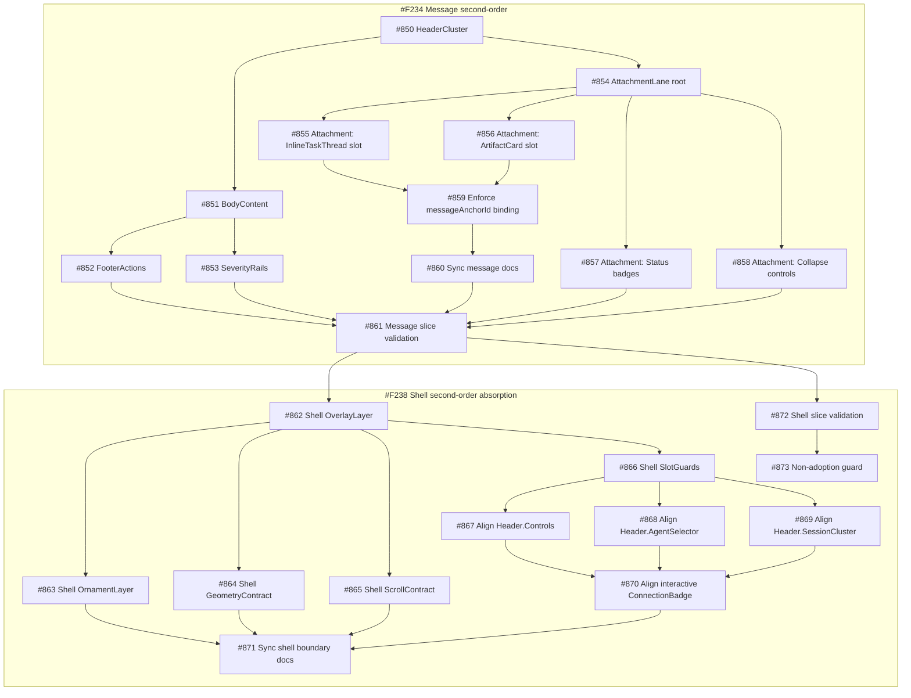

# Conductor Chat Message+Shell Dependency Graph + PR Slice Map v1

Date: 2026-02-11  
Owner: Val

Scope: `#F234` (Message second-order compounds) + `#F238` (Shell absorbs frame)

## 1) One-page dependency graph (focused)

## 2) PR slice map (execution order)

### PR-MSG-01 — Message lanes skeleton
- Tasks: `#850 #851 #852 #853 #854`
- Goal: lock second-order message lane contracts (no adoption).
- Exit: lane APIs compile and export cleanly.

### PR-MSG-02 — AttachmentLane required surfaces
- Tasks: `#855 #856 #857 #858 #859`
- Goal: attachment lane contract complete + `messageAnchorId` binding rule enforced.
- Exit: attachment mounts + controls present; binding policy documented in code comments/types.

### PR-MSG-03 — Message docs + validation
- Tasks: `#860 #861`
- Goal: docs synced and message slice validated.
- Exit: focused compile/tests pass for message slice.

Execution status:
- PR-MSG-01 ✅
- PR-MSG-02 ✅
- PR-MSG-03 ⏳ active

### PR-SHELL-01 — Shell second-order layer contracts
- Tasks: `#862 #863 #864 #865 #866`
- Depends on: `PR-MSG-03`
- Goal: shell absorbs frame responsibilities in explicit contracts.

### PR-SHELL-02 — Header semantic alignment under shell
- Tasks: `#867 #868 #869 #870`
- Depends on: `PR-SHELL-01`
- Goal: header semantic compounds + interactive connection badge alignment under shell ownership.

### PR-SHELL-03 — Docs/validation/guard
- Tasks: `#871 #872 #873`
- Depends on: `PR-SHELL-02` and message validation gate
- Goal: boundary docs finalized, validation run, and explicit no-big-bang guard verified.

Execution status:
- PR-SHELL-01 ✅
- PR-SHELL-02 ✅
- PR-SHELL-03 ✅

## 3) Guardrails

- Big-bang adoption in `ConductorAgentChat.tsx` stays blocked until explicit user unlock.
- This sequence is contract-first and non-invasive to runtime behavior.
