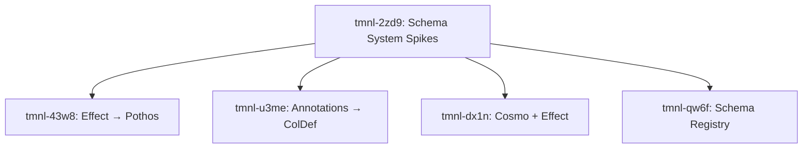

# Decomposition Report: Schema System Spikes

**Epic ID:** tmnl-2zd9
**EDIN Phase:** EXPERIMENT
**Decomposition Mode:** lean (spike-first, throwaway code)
**Generated:** 2025-12-09

## Summary

- **Epic:** Schema System Spikes (tmnl-2zd9)
- **Created:** 4 spike tasks
- **Mode:** Organic API exploration — validate assumptions before architecture

## Hypotheses Under Test

| Spike | Hypothesis | Success Criteria |
|-------|-----------|-----------------|
| **tmnl-43w8** | Effect Schema.ast can map to Pothos field types | GraphQL schema builds, TS types infer |
| **tmnl-u3me** | Schema.annotations() can carry grid config | ColDefs render in AG-Grid |
| **tmnl-dx1n** | Effect services can back Cosmo Connect handlers | gRPC errors map correctly |
| **tmnl-qw6f** | Registry can auto-detect payload schemas | Unknown payload → matched schema |

## V-Model Trace Matrix

```
┌─────────────────────────────────────────────────────────────────────────────┐
│                           V-MODEL TRACE MATRIX                               │
│                    (EXPERIMENT Phase — Lightweight)                          │
├─────────────────────────────────────────────────────────────────────────────┤
│ HYPOTHESIS (Left Arm)              VALIDATION (Right Arm)                    │
├─────────────────────────────────────────────────────────────────────────────┤
│ Epic: tmnl-2zd9                ◄─► Spike code runs without error            │
│ ├─ H1: tmnl-43w8               ◄─► builder.toSchema() succeeds              │
│ ├─ H2: tmnl-u3me               ◄─► AG-Grid renders columns from schema      │
│ ├─ H3: tmnl-dx1n               ◄─► Connect handler returns valid response   │
│ └─ H4: tmnl-qw6f               ◄─► registry.detect() returns schema match   │
└─────────────────────────────────────────────────────────────────────────────┘
```

## Dependency Graph



## Spike Locations

All spikes to be created at: `src/lib/schema-system/spikes/`

| File | Purpose |
|------|---------|
| `spike-1-schema-to-pothos.ts` | Effect Schema → Pothos ObjectRef |
| `spike-2-annotations-to-coldefs.ts` | Schema annotations → AG-Grid ColDef |
| `spike-3-cosmo-effect.ts` | Cosmo Connect + Effect Service |
| `spike-4-schema-registry.ts` | PayloadSchemaRegistry Effect.Service |

## Next Actions

All 4 spikes are **unblocked** and can run in parallel.

```bash
bd ready --parent=tmnl-2zd9
```

**Recommended execution:** Run spikes 1+2 in parallel (core schema transforms), then 3+4 (integration patterns).

## Post-Spike Decision Points

After spikes complete, we decide:

1. **Schema Primacy:** Which direction works better in practice?
2. **Annotation Ergonomics:** Are Schema.annotations() composable enough?
3. **Runtime Bridge:** Is Effect → Connect clean enough for production?
4. **Registry Scope:** Local-only or support remote introspection?

Findings inform DESIGN phase decomposition.

---
Co-Authored-By: Val <val@maidens.ai>
