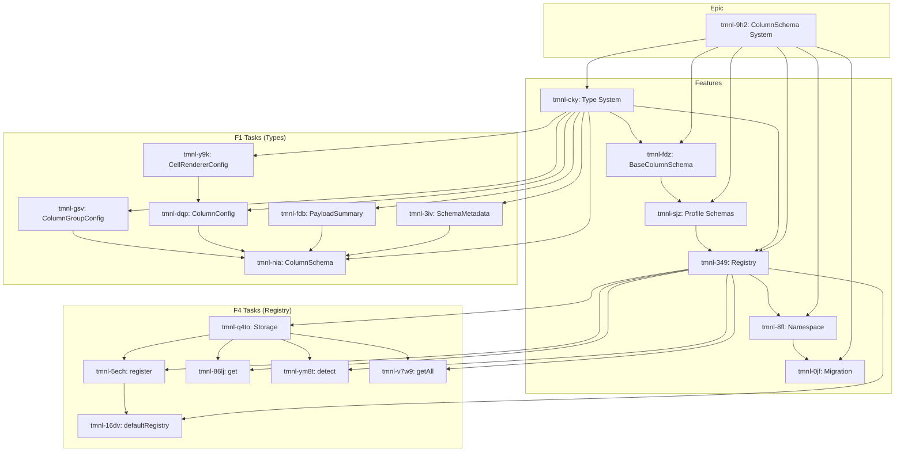

# Decomposition Report: Generic ColumnSchema System

**Epic ID:** tmnl-9h2
**EDIN Phase:** IMPLEMENT
**Decomposition Mode:** rigorous
**Generated:** 2025-12-08T20:45:00-05:00

## Summary

- **Epic:** Generic ColumnSchema System (tmnl-9h2)
- **Created:** 6 features, 34 tasks
- **Critical Path:** Type System → BaseColumnSchema → Profile Schemas → Registry → Namespace → Migration

## V-Model Trace Matrix

```
┌─────────────────────────────────────────────────────────────────────────────┐
│                           V-MODEL TRACE MATRIX                               │
├─────────────────────────────────────────────────────────────────────────────┤
│ REQUIREMENTS (Left Arm)              VALIDATION (Right Arm)                  │
├─────────────────────────────────────────────────────────────────────────────┤
│ Epic: tmnl-9h2                   ◄─► System Test: RawEventsPanel renders    │
│ ├─ Feature: tmnl-cky (Types)    ◄─► Integration: Schema exports compile     │
│ │  ├─ Task: tmnl-3iv            ◄─► Unit: SchemaMetadata fields valid       │
│ │  ├─ Task: tmnl-fdb            ◄─► Unit: PayloadSummary fields valid       │
│ │  ├─ Task: tmnl-dqp            ◄─► Unit: ColumnConfig → ColDef             │
│ │  ├─ Task: tmnl-gsv            ◄─► Unit: ColumnGroupConfig children        │
│ │  ├─ Task: tmnl-nia            ◄─► Unit: ColumnSchema interface complete   │
│ │  └─ Task: tmnl-y9k            ◄─► Unit: CellRendererConfig decoupled      │
│ ├─ Feature: tmnl-fdz (Base)     ◄─► Integration: Subclasses extend base     │
│ │  ├─ Task: tmnl-get            ◄─► Unit: Constructor stores metadata       │
│ │  ├─ Task: tmnl-n62            ◄─► Unit: toColDef maps all fields          │
│ │  ├─ Task: tmnl-8mw            ◄─► Unit: toColDefGroup recursive           │
│ │  ├─ Task: tmnl-75i            ◄─► Unit: Style methods return CSS          │
│ │  ├─ Task: tmnl-f80            ◄─► Unit: Format methods handle null        │
│ │  └─ Task: tmnl-zww            ◄─► Unit: Abstract methods declared         │
│ ├─ Feature: tmnl-sjz (Schemas)  ◄─► Integration: All profiles render        │
│ │  ├─ Task: tmnl-0b6            ◄─► Unit: SenML detect type guard           │
│ │  ├─ Task: tmnl-6hc            ◄─► Unit: SenML columns 4 groups            │
│ │  ├─ Task: tmnl-7bn            ◄─► Unit: SenML renderer shows +N           │
│ │  ├─ Task: tmnl-62f            ◄─► Unit: SenML summary extracts n,v,u      │
│ │  ├─ Task: tmnl-p3z            ◄─► Unit: OpcUa detect MessageType          │
│ │  ├─ Task: tmnl-4wq            ◄─► Unit: OpcUa columns 2 groups            │
│ │  ├─ Task: tmnl-1ma            ◄─► Unit: OpcUa renderer shows fields       │
│ │  ├─ Task: tmnl-46o            ◄─► Unit: OpcUa summary extracts pub        │
│ │  ├─ Task: tmnl-68i            ◄─► Unit: Prometheus detect metrics         │
│ │  ├─ Task: tmnl-fay            ◄─► Unit: Prometheus columns 2 groups       │
│ │  ├─ Task: tmnl-jlf8           ◄─► Unit: Prometheus renderer shows L,M     │
│ │  └─ Task: tmnl-5ril           ◄─► Unit: Prometheus summary extracts       │
│ ├─ Feature: tmnl-349 (Registry) ◄─► Integration: Auto-detect works          │
│ │  ├─ Task: tmnl-q4to           ◄─► Unit: Map storage private               │
│ │  ├─ Task: tmnl-5ech           ◄─► Unit: register() adds to map            │
│ │  ├─ Task: tmnl-86lj           ◄─► Unit: get() returns schema              │
│ │  ├─ Task: tmnl-ym8t           ◄─► Unit: detect() iterates all             │
│ │  ├─ Task: tmnl-v7w9           ◄─► Unit: getAll() readonly                 │
│ │  └─ Task: tmnl-16dv           ◄─► Unit: defaultRegistry has 3 schemas     │
│ ├─ Feature: tmnl-8fl (Namespace)◄─► Integration: Dot accessor works         │
│ │  ├─ Task: tmnl-ma4c           ◄─► Unit: Barrel exports all                │
│ │  ├─ Task: tmnl-5twb           ◄─► Unit: data-grid re-exports              │
│ │  ├─ Task: tmnl-8y6a           ◄─► Unit: Namespace attached                │
│ │  └─ Task: tmnl-uxt1           ◄─► Unit: Types augmented                   │
│ └─ Feature: tmnl-0jf (Migration)◄─► System: RawEventsPanel unchanged        │
│    ├─ Task: tmnl-nc4j           ◄─► Regression: Generators removed          │
│    ├─ Task: tmnl-5d0z           ◄─► Regression: Renderers moved             │
│    ├─ Task: tmnl-ooa5           ◄─► Unit: Import statement correct          │
│    ├─ Task: tmnl-z5j9           ◄─► Integration: detect() called            │
│    ├─ Task: tmnl-xxfk           ◄─► Integration: renderer delegated         │
│    └─ Task: tmnl-x7gb           ◄─► E2E: All profiles render correctly      │
└─────────────────────────────────────────────────────────────────────────────┘
```

## Dependency Graph



## Files to Create/Modify

| File | Action | Purpose |
|------|--------|---------|
| `src/lib/data-grid/column-schema/types.ts` | Create | Core interfaces |
| `src/lib/data-grid/column-schema/base.ts` | Create | Abstract base class |
| `src/lib/data-grid/column-schema/schemas/senml.ts` | Create | SenML schema |
| `src/lib/data-grid/column-schema/schemas/opcua.ts` | Create | OPC-UA schema |
| `src/lib/data-grid/column-schema/schemas/prometheus.ts` | Create | Prometheus schema |
| `src/lib/data-grid/column-schema/registry.ts` | Create | Registry singleton |
| `src/lib/data-grid/column-schema/index.ts` | Create | Barrel export |
| `src/lib/data-grid/index.ts` | Modify | Add ColumnSchema exports |
| `src/lib/data-grid/components/TmnlDataGrid.tsx` | Modify | Attach namespace |
| `src/components/playground/streams/panels/RawEventsPanel.tsx` | Modify | Use ColumnSchema |

## Critical Path

1. **tmnl-cky** (Types) — Foundation for all other work
2. **tmnl-fdz** (Base) — Enables schema implementations
3. **tmnl-sjz** (Schemas) — Parallel: SenML + OpcUa + Prometheus
4. **tmnl-349** (Registry) — Blocked on schemas
5. **tmnl-8fl** (Namespace) — Blocked on registry
6. **tmnl-0jf** (Migration) — Final integration

## Next Actions

Feature `tmnl-cky` (Type System) is unblocked. Begin with task `tmnl-y9k` (CellRendererConfig) as it's a leaf dependency.

**Recommended execution order:**
1. tmnl-y9k: CellRendererConfig interface
2. tmnl-3iv: SchemaMetadata interface
3. tmnl-fdb: PayloadSummary interface
4. tmnl-dqp: ColumnConfig interface (depends on y9k)
5. tmnl-gsv: ColumnGroupConfig interface
6. tmnl-nia: ColumnSchema interface (depends on all above)

---
Co-Authored-By: Val <val@maidens.ai>
