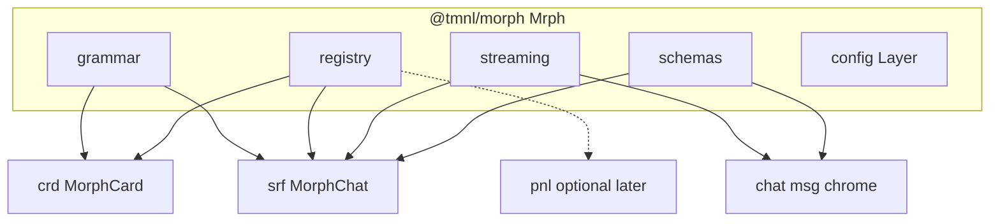

# `@tmnl/morph` / `Mrph` — morph substrate

**Naming SoT:** [tla-module-rose-tree-rfc.md](/home/getbygenius/getbyzenbook/projects/gbg/assets/code/repos/gbg/packages/tmnl/docs/architecture/tla-module-rose-tree-rfc.md). Sequence: [TMNL execution metaplan](cursor-plan://plan/tmnl_execution_metaplan_c9d81100.plan.md).

Elevation: 3-letter `mrp` → 4-letter **`mrph`** (suite keystone). Ordinary morph members stay 3-letter (`crd`, `srf`, later `edt`). `pnl` lives in `@tmnl/chrome` and may consume `mrph` registry after this lands; it must not block on `mrph`.

**Rose tree (ratified):** cut `packages/morph` now. `export * as Mrph from './mrph.js'`. Layout A (`mrph.ts` + `internal/mrph/`). Never `@tmnl/mrph`. `.js` specifiers. Source exports in-repo. Journal at `packages/morph/.extraction-journal.md`.

Kind **B + tiny A** ([TLA RFC §5](/home/getbygenius/getbyzenbook/projects/gbg/assets/code/repos/gbg/packages/tmnl/docs/architecture/tla-package-suites-rfc.md), Kind A/B still in force): Atom/XState factory like `stx`. Naming: [tla-module-rose-tree-rfc.md](/home/getbygenius/getbyzenbook/projects/gbg/assets/code/repos/gbg/packages/tmnl/docs/architecture/tla-module-rose-tree-rfc.md). The only Layer is `mrph/config`. Do not invent a service graph for grammar/registry/streaming.

Extract **first** in the morph suite (map: GREEN, dormant, zero collision). After grammar + registry + streaming move, `crd` ⊥ `srf` (no direct edge); chat↔morphchat cycle dissolves.

## What actually moves (not the whole morph-card tree)

| Subpath | Source | Why |
|---|---|---|
| `mrph/grammar` | [morph-card/schemas/transition-grammar.ts](/home/getbygenius/getbyzenbook/projects/gbg/assets/code/repos/gbg/packages/tmnl/src/lib/morph-card/schemas/transition-grammar.ts) | morphchat overlay already imports it; MorphCardTestbed too |
| `mrph/registry` | byte-copy pair [morph-card/atoms/registry.ts](/home/getbygenius/getbyzenbook/projects/gbg/assets/code/repos/gbg/packages/tmnl/src/lib/morph-card/atoms/registry.ts) and [morphchat/atoms/registry.ts](/home/getbygenius/getbyzenbook/projects/gbg/assets/code/repos/gbg/packages/tmnl/src/lib/morphchat/atoms/registry.ts) | both are `Registry.make()` + `RegistryContext.Provider`. Replace with `createScopedAtomRegistry({ id })` |
| `mrph/streaming` | [morphchat/components/streaming-metrics-provider.tsx](/home/getbygenius/getbyzenbook/projects/gbg/assets/code/repos/gbg/packages/tmnl/src/lib/morphchat/components/streaming-metrics-provider.tsx) | chat `stream-entry-placeholder`, `header-streaming-badge`, `stream-cursor` import this — the back-edge |
| `mrph/schemas` | [morphchat/schemas/message-types.tsx](/home/getbygenius/getbyzenbook/projects/gbg/assets/code/repos/gbg/packages/tmnl/src/lib/morphchat/schemas/message-types.tsx) `ToolInvocationState` | shared leaf; genifer already documents lifecycle parity |
| `mrph/config` | new, tiny Kind A | only Layer in the package |

Stay **out** of this package: `MorphCard.tsx` (crd/core, genifer-coupled), morphchat adapter-harness (extract last), cursor `CardEntity` (app-side), skins/UITreeDiffer (archive or park in crd).

## Package shape

Layout A, one Nx project for the cluster:

- `@tmnl/morph` — `export * as Mrph from './mrph.js'`
- Seams as named exports of `mrph.ts` / leaf paths `@tmnl/morph/mrph/grammar` (map via `internal/mrph/`)
- **No** frozen `export const Mrph = {…}`
- `project.json` on `packages/morph`: tags `scope:tmnl`, `type:lib`, `domain:morph`, `effect:v4`
- Canonical `effect` (v4). Journal at `packages/morph/.extraction-journal.md`
- Lift-gate testbed: MorphCardTestbed (moves under `src/.testbeds/` in cleanup Pass 0; keep wired)
- Chat re-points to `@tmnl/morph/mrph/streaming` (leaf) or `Mrph.streaming` (Kind A-ish provider — prefer leaf for the React provider)

## Sequence

1. **Grammar.** Move transition-grammar verbatim. Re-point morphchat overlay + MorphCardTestbed + any morph-card importers. No behavior change.
2. **Registry factory.** `createScopedAtomRegistry({ id: 'card' | 'chat' | 'pnl' })` returning `{ registry, Provider }`. MorphCard and MorphChat providers become one-liners. Delete the copy-paste files.
3. **Streaming leaf.** Move provider + `useStreamingMetrics`. Chat imports `@tmnl/morph/mrph/streaming`. Morphchat keeps producing metrics; chat stops depending on morphchat components.
4. **Schemas.** Extract `ToolInvocationState` (+ only the types that leaf needs). Chat tool-block and genifer re-point. Leave the rest of message-types in morphchat until `srf`.
5. **SurfaceId brand.** Replace genifer [prompt-eval.ts](/home/getbygenius/getbyzenbook/projects/gbg/assets/code/repos/gbg/packages/tmnl/src/lib/genifer/compiler/prompt-eval.ts) `Schema.Literal('morphchat', ...)` with an `mrph` SurfaceId. Do not drag genifer into this package.
6. **Lift** to `packages/morph`. In-tree paths become re-exports, then die. `layerTest` only on `config`.
7. **Stop.** `crd` leaves and `srf` are the next morph passes, not this plan.

## Gates

- `bunx tsc --noEmit` in `packages/morph`
- `bunx vitest run` for grammar schema round-trips + registry isolation (two scoped registries do not share atoms)
- MorphCardTestbed still loads
- `rg "@/lib/morph-card/schemas/transition-grammar"` and `rg "useStreamingMetrics"` from `src/lib/chat` are zero (chat uses `@tmnl/morph/mrph/...`)

## Coupling

- Cleanup Pass 0 is **before** this rewrite (docs → Pass 0 → reconvene → morph). Do not start mrph during Pass 0.
- `pnl` rewrite may ship a local scoped registry and re-home onto `mrph/registry` in step 2’s factory if the `{ id }` API matches.
- Do not start `srf/core` until streaming + grammar are in `mrph`.
## Backlinks

**Law:** [rose tree](cursor-plan://plan/tla_module_rose_tree_a8c41f02.plan.md) · [RFC](cursor-plan://plan/tla_module_rfc_b1e90211.plan.md)  
**Gate:** [cleanup](cursor-plan://plan/tmnl_cleanup_lift_3a3ae41c.plan.md)  
**Consumed by:** [pnl](cursor-plan://plan/pnl_floating_rewrite_4c958e4e.plan.md) (registry re-home) · later crd/srf/edt  
**Public root:** [tmnl public root](cursor-plan://plan/tmnl_public_root_c3d04422.plan.md)
