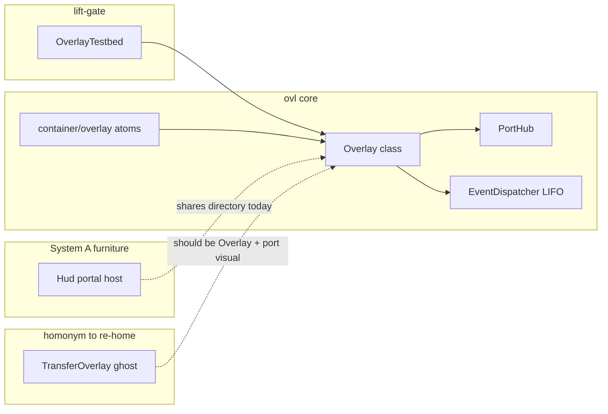

# `@tmnl/chrome` / `Ovl` — Overlay class is the core

**Naming SoT:** [tla-module-rose-tree-rfc.md](/home/getbygenius/getbyzenbook/projects/gbg/assets/code/repos/gbg/packages/tmnl/docs/architecture/tla-module-rose-tree-rfc.md). Sequence: [TMNL execution metaplan](cursor-plan://plan/tmnl_execution_metaplan_c9d81100.plan.md).

Why this exists: operator called overlays a **core module**. RN RFC `ov` elevates like `pn` → `pnl`. The pnl plan correctly refused to swallow this (floating panels ≠ overlays).

**Correction (2026-08-13):** the map’s “extract System A, finish-or-archive System B” is wrong for the rewrite. The thing that has power is the **Overlay class** — demonstrated by [OverlayTestbed.tsx](/home/getbygenius/getbyzenbook/projects/gbg/assets/code/repos/gbg/packages/tmnl/src/components/testbed/OverlayTestbed.tsx) (live at `/testbed/overlays`). That is ovl.

Live tree is `packages/tmnl/…`. `packages/mathkernel/vendor/eigen/…` is a vendored snapshot of the same files — do not plan or edit against the vendor copy.

## The interface (what the testbed proves)

Emacs minor-mode, container-scoped. From [Overlay.ts](/home/getbygenius/getbyzenbook/projects/gbg/assets/code/repos/gbg/packages/tmnl/src/lib/overlays/Overlay.ts) + OverlayTestbed hypotheses OV-H1..H10 (also [overlay.test.ts](/home/getbygenius/getbyzenbook/projects/gbg/assets/code/repos/gbg/packages/tmnl/src/lib/overlays/__tests__/overlay.test.ts)):

- **Container** lifecycle (`useOverlayContainer`)
- **Stack of overlays** (`useOverlay` / `new Overlay({ id, handlers, ports })`)
- **LIFO dispatch:** most recently enabled first
- **Handler results:** `handled` stops, `delegate` next, `broadcast` all
- **Ports:** typed pub/sub (`usePort`) — pointer/drag/keyboard in the testbed are three overlays talking through ports, not props
- **Isolation:** two containers do not share port namespaces
- **Optional visual** (`visualPriority`; testbed canvas reads ports and draws the drag ghost / pointer)

The testbed’s Pointer / Drag / Keyboard overlays **are** the API. The canvas ghost is a port subscriber. That composition is the product, not a lab toy.

Map claimed `Overlay.ts` has 0 importers and listed it §2 dead. **Stale.** OverlayTestbed, ScadaOverlayTestbed, and `useOverlay` all import it. What *is* deprecated is the Effect `OverlayRegistry` **service** — state moved to atoms (`services/index.ts`). Do not archive the class with the service.

## Three things named overlay (do not merge the names)

| Thing | Path | What it is | ovl? |
|---|---|---|---|
| **Overlay class** | `src/lib/overlays/Overlay.ts` | capability stack + ports + LIFO | **yes — the TLA** |
| **Hud** | ex-`GlobalSlot.tsx` | Viewport portal. Sibling TLA `hud`. Not ovl. | see hud plan |
| **Transfer ghost** | `src/lib/transfer/v2/overlay/TransferOverlay.tsx` | pointer-following label on `activeDragAtom` | **consumer**. Comments say “overlay system reads activeDrag”; the component never touches Overlay. Gnarly homonym. Re-home as `new Overlay` + visual bound to a port. Transfer keeps tokens/bus/traits (no TLA yet — not `flo`). |

v1 `src/lib/transfer/overlay/TransferOverlay.tsx` is the same ghost, older. Code-editor `CodeEditorOverlay.tsx` is another homonym (and truncated — Pass 0 corruption list). tldraw reticles are a fourth. None of those are ovl core.

## System A vs B (updated)

- Overlay class + PortHub + dispatcher = ovl core. Visuals paint through sibling **Hud**. Do not keep a 6-type GlobalSlot switch.
- **Do not** “extract A because it is cheap” and leave Overlay in finish-or-archive. That throws away OverlayTestbed.
- PersistentOverlays.tsx remains dead (zero runtime consumers). overlays/visual `PanelSlot` remains unused. Archive those in Pass 0 / this plan.
- Scada overlays are a thin ISA-typed layer **on the same ports**. Proof the interface works industrially. They ride with `@tmnl/domain` / iot — not dragged into chrome, not used as an excuse to kill Overlay.

## Package shape

Same cluster as pnl:

- `@tmnl/chrome` — `export * as Ovl from './ovl.js'` (alongside `Pnl`, `Hud`)
- Layout A: `ovl.ts` + `internal/ovl/`
- Leaf: `@tmnl/chrome/ovl/Overlay`
- **Viewport host is `hud`, not an ovl seam.** Overlay.`render` paints into Hud. See [hud viewport host](cursor-plan://plan/hud_viewport_host_d0e71199.plan.md).
- Tags `@tmnl/chrome/ovl/…`
- **No** `@tmnl/ovl`. **No** merge into `Pnl`. **No** frozen aggregate.

Does not own: floating/Niri (`Pnl`), viewport host (`Hud`), composition frame (`Shll` / `@tmnl/shell`), OS windows (`Wnd`), harness `panels`, transfer, tldraw reticles.

## Sequence

1. Treat OverlayTestbed as canonical. Keep it wired (`src/.testbeds/` after Pass 0). Tests OV-H1..H10 move with the package. OV-H9 (EventLog replay) is still skipped — decide finish vs drop, don’t silently archive.
2. Lift Overlay + PortHub + EventDispatcher + atoms/hooks. Re-point OverlayTestbed + ScadaCanvas + any `overlayRegistry` atom consumers.
3. Visuals paint through **Hud** (sibling TLA). Overlay.`render` is the attachment. Ovl does not mount a GlobalSlot.
4. Transfer ghost: implement as an Overlay (drag handlers already exist in the testbed) + a port-driven visual. `TransferOverlay` becomes a thin leaf or goes away. **After reconvene.** Transfer is not `flo` (`flo` is `src/lib/streams`). Do not block ovl core on a transfer rewrite.
5. Archive PersistentOverlays + unused visual PanelSlot. Leave OverlayRegistry service as deprecated shim until importers (`windows`, `terminal`) read atoms.

## Coupling

- **After RFC + cleanup Pass 0 + reconvene.** Pass 0 may archive PersistentOverlays; it must **not** archive Overlay.ts / OverlayTestbed.
- **Parallel with pnl and hud**, not inside them. Whoever cuts `packages/chrome` first owns the barrel.
- Transfer is a consumer (no TLA on the register). `flo` is `src/lib/streams` (Feed/Channel/FeedsManager) under `@tmnl/state` — not durable-streams (`lnk`), not NATS JetStream (`msh`), not transfer. No `flo` rewrite plan yet.
- Design/vnt tokens visuals; ovl does not own VANTA.

Depends on: rose-tree laws, chrome cluster existing or this plan creating `packages/chrome` if pnl hasn't yet.

## Backlinks

**Law:** [rose tree](cursor-plan://plan/tla_module_rose_tree_a8c41f02.plan.md) · [RFC](cursor-plan://plan/tla_module_rfc_b1e90211.plan.md)  
**Gate:** [cleanup](cursor-plan://plan/tmnl_cleanup_lift_3a3ae41c.plan.md) (PersistentOverlays archive OK; Overlay.ts / OverlayTestbed NOT)  
**Chrome siblings:** [pnl](cursor-plan://plan/pnl_floating_rewrite_4c958e4e.plan.md) · [hud](cursor-plan://plan/hud_viewport_host_d0e71199.plan.md)  
**Shell:** [shell cluster](cursor-plan://plan/shell_cluster_shl_wnd_a1f8c022.plan.md) · [shll](cursor-plan://plan/shll_keystone_frame_b2c10011.plan.md)  
**Paints into:** [hud](cursor-plan://plan/hud_viewport_host_d0e71199.plan.md)  
**Transfer ghost →:** Overlay.render (txf pending; not [flo](cursor-plan://plan/tla_module_rose_tree_a8c41f02.plan.md))
