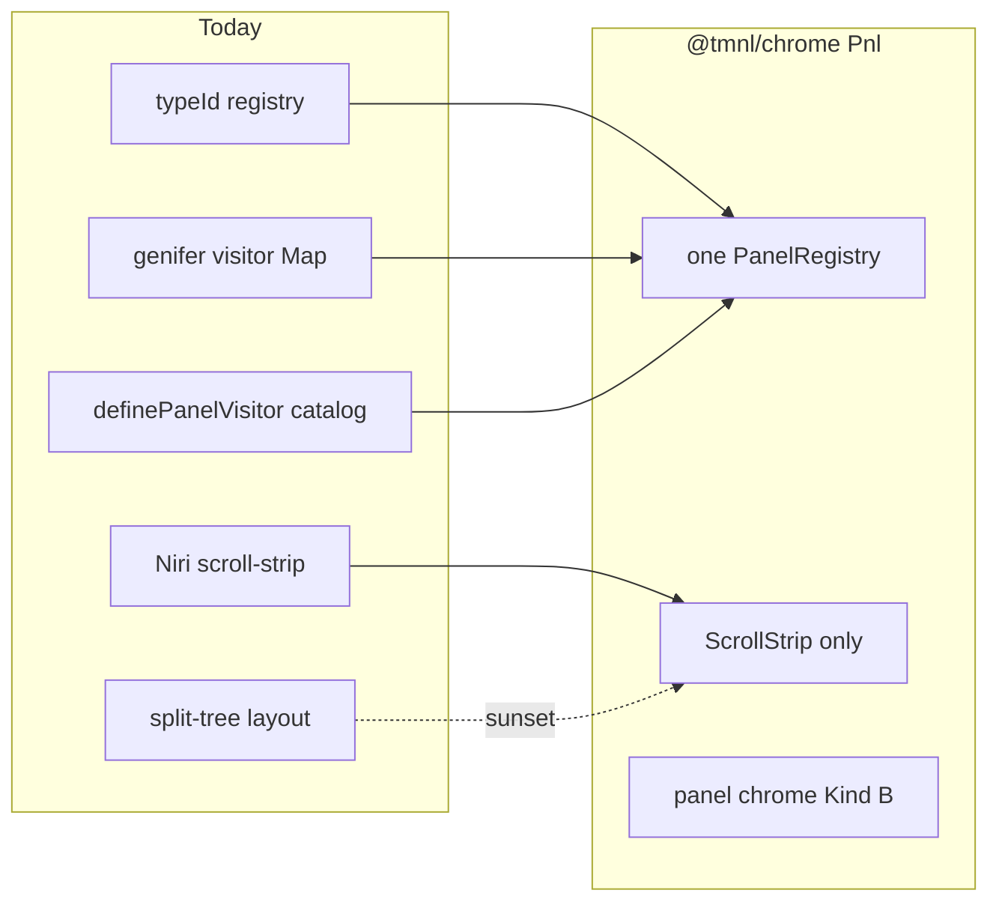

# `@tmnl/chrome` / `Pnl` — floating panels rewrite

**Naming SoT:** [tla-module-rose-tree-rfc.md](/home/getbygenius/getbyzenbook/projects/gbg/assets/code/repos/gbg/packages/tmnl/docs/architecture/tla-module-rose-tree-rfc.md). Sequence: [TMNL execution metaplan](cursor-plan://plan/tmnl_execution_metaplan_c9d81100.plan.md).

Elevation: RN RFC [§5.3](/home/getbygenius/getbyzenbook/projects/gbg/assets/code/repos/gbg/packages/tmnl/docs/architecture/tmnl-react-native-migration-rfc.md) names panels as 2-letter UI internal `pn`. Elevate to 3-letter TLA **`pnl`**. **Rose tree (ratified):** `packages/chrome`, `export * as Pnl from './pnl.js'`. Not under `@tmnl/design`. Not `@tmnl/pnl`. Layout A. `.js` specifiers. Source exports. One Nx project for the chrome cluster.

Kind B (Atom/XState factory), `stx`-shaped. No fake Layer graph. In-tree `src/lib/floating` (154 files) is the source; destination is `packages/chrome` (`pnl` module + `internal/pnl/`).

## Why a rewrite, not the 2026-02 decomposition

[DECOMPOSITION_SPEC.md](/home/getbygenius/getbyzenbook/projects/gbg/assets/code/repos/gbg/packages/tmnl/src/lib/floating/docs/DECOMPOSITION_SPEC.md) already split the 976-line provider down; file relocation was abandoned. Map wave-5 says finish **or supersede**. Supersede. The live bugs are architectural, not folder shape:

- Two layout engines at once ([PanelWorkspace.tsx](/home/getbygenius/getbyzenbook/projects/gbg/assets/code/repos/gbg/packages/tmnl/src/lib/floating/overlay/PanelWorkspace.tsx) tree vs strip). Operator: **Niri scroll-strip is truth; split-tree sunsets.**
- Three non-interoperating registries, all production: typeId side-effect (`main.tsx` panel types), genifer visitorId Map writes, Effect Schema/Layer `definePanelVisitor`. **None becomes canonical.** Author one new registry; migrate A/B/C plus morpheditor `panel-stx` onto it. Natural substrate: `mrph/registry` `createScopedAtomRegistry` once that leaf exists — `pnl` must not wait on `mrph` if the registry can land as a local Kind B factory and re-home later.
- Live edge to deprecated drawer `PanelSlot` ([PanelContent.tsx](/home/getbygenius/getbyzenbook/projects/gbg/assets/code/repos/gbg/packages/tmnl/src/lib/floating/components/PanelContent.tsx), TiledPanel). Overlays/visual PanelSlot has zero consumers. Repoint or replace as part of `pnl`.
- Backbone is **in-tree** `@/lib/stx` (~31 files deep), zero `@tmnl/stx`. Rewrite targets `packages/stx`.
- `PersistentOverlays.tsx` is dead; real mount is [main.tsx](/home/getbygenius/getbyzenbook/projects/gbg/assets/code/repos/gbg/packages/tmnl/src/main.tsx) `PanelWorkspaceOverlay` + `PanelWorkspace`.

## Package shape

Copy `stx` (Kind B), not `msh`:

- `@tmnl/chrome` — `export * as Pnl from './pnl.js'`
- Seams `registry` / `layout` / `dock` as named exports + leaf paths `@tmnl/chrome/pnl/registry`
- **No** frozen `export const Pnl = {…}`
- `project.json` on `packages/chrome`: tags `scope:tmnl`, `type:lib`, `domain:chrome`, `effect:v4`
- Peers: `react`, `packages/stx`, dnd-kit as needed
- Does **not** own overlay System A — that is sibling TLA **`ovl`**. Viewport host is **`hud`**. Composition frame is **`@tmnl/shell` / `Shll`** (keystone). OS windows are **`Wnd`** (greenfield) — pnl **consumes** them for pop-out. Harness `panels` API stays `rig`/app.

Collapse into `pnl` over time: `src/lib/floating`, `foldable-panel`, drawer-sunset remainder. Do **not** swallow overlays, `windows` (Emacs panes), or old `tauri-windows` (archived when wnd lands).

## Rewrite sequence

1. **Freeze the contract.** Effect-Schema types for panel id, visitor, strip column, dock zone. One `PanelRegistry` API: register / open / close / list / subscribe. No side-effect `registerPanelType` at module eval.
2. **Layout: strip only.** Keep [scroll-strip/](/home/getbygenius/getbyzenbook/projects/gbg/assets/code/repos/gbg/packages/tmnl/src/lib/floating/layout/scroll-strip) as the implementation. Delete or `.archive/` split-tree engine + the runtime toggle. State in [floating/stx](/home/getbygenius/getbyzenbook/projects/gbg/assets/code/repos/gbg/packages/tmnl/src/lib/floating/stx) drops the parallel `panelTree` once strip is sole.
3. **Migrate the three idioms** onto the new registry (egui, code-editor, geoint EntityPanel, genifer `panel-visitor`, morphchat/muse-log catalog). Dead paths `registerGeointVisitors` / `registerAllVisitors` archive.
4. **Cut drawer.** Replace legacy `PanelSlot` with pnl content host. Do not wait for a full overlays extraction.
5. **Lift to `packages/chrome`.** App `main.tsx` imports `@tmnl/chrome/pnl/…` (leaf) / `{ Pnl } from '@tmnl/chrome'`. In-tree `src/lib/floating` becomes re-export then goes away. Tests move with the package; add registry + strip tests (today: 5 files, none cover stx/machine/visitors).
6. **Gates.** Package `tsc` + `vitest run`. Tauri boot: open/close/dock a panel, genifer-spawned visitor, geoint panel. No `npx` — bun/Nx only (old GATES.md is stale on that).

## Coupling to the cleanup plan

- Pass 0 of the cleanup plan can archive dead overlay mounts without blocking `pnl`.
- `pnl` rewrite can start after typecheck repair; it should not wait for `qry`/`mrph`.
- When `mrph/registry` lands, pnl registry implementation re-homes onto it if the factory matches. Until then pnl owns a local scoped registry.
- Testbeds for floating/scroll-strip live under `src/.testbeds/` and stay wired.

## Out of scope

- RN / Expo.
- Overlay System A — **not abandoned**; see ovl + hud. pnl / ovl / hud may land in any order; whoever cuts `packages/chrome` first owns the cluster barrel.
- Making harness `src/lib/panels` part of `@tmnl/chrome` / `Pnl`.
- Finishing the 2026-02 line-count GATES.md as written.
## Backlinks

**Law:** [rose tree](cursor-plan://plan/tla_module_rose_tree_a8c41f02.plan.md) · [RFC](cursor-plan://plan/tla_module_rfc_b1e90211.plan.md)  
**Identity:** `pnl://` — [rfc-addr-algebra.md](/home/getbygenius/getbyzenbook/projects/gbg/assets/code/repos/gbg/packages/tmnl/docs/architecture/rfc-addr-algebra.md) (consume Addr; do not implement it)  
**Gate:** [cleanup](cursor-plan://plan/tmnl_cleanup_lift_3a3ae41c.plan.md)  
**Chrome siblings:** [ovl](cursor-plan://plan/ovl_overlays_rewrite_c9d60088.plan.md) · [hud](cursor-plan://plan/hud_viewport_host_d0e71199.plan.md)  
**Shell:** [shell cluster](cursor-plan://plan/shell_cluster_shl_wnd_a1f8c022.plan.md) · [shll](cursor-plan://plan/shll_keystone_frame_b2c10011.plan.md) (host) · [wnd](cursor-plan://plan/wnd_os_windows_c3d20022.plan.md) (pop-out)  
**May re-home registry onto:** [mrph](cursor-plan://plan/mrph_morph_substrate_055a30d0.plan.md)
