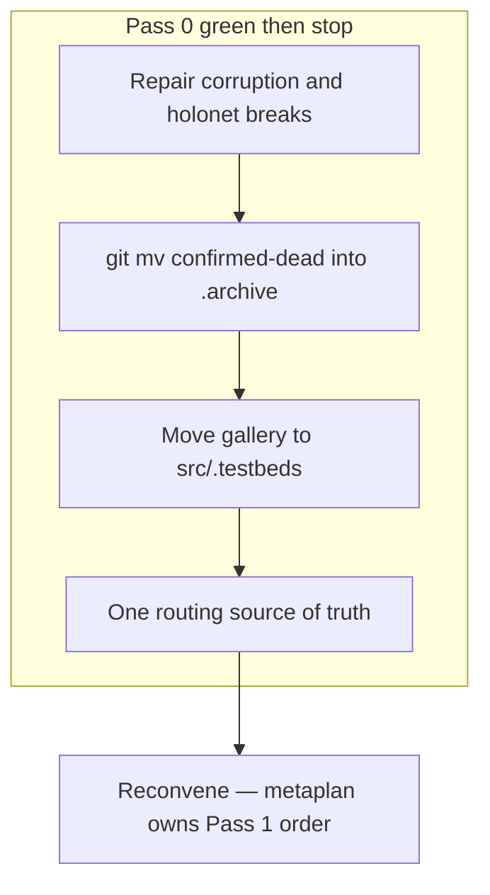

# TMNL cleanup, then package lift

Tauri stays. The RN sibling path is out of scope. The job is: **make the existing desktop app work**, strip unused gravity wells, then **literally lift** live subsystems into `packages/` under the TLA register.

Convention sources (do not invent a third naming scheme):

- [packages/tmnl/docs/architecture/tla-module-rose-tree-rfc.md](/home/getbygenius/getbyzenbook/projects/gbg/assets/code/repos/gbg/packages/tmnl/docs/architecture/tla-module-rose-tree-rfc.md) — **naming SoT.** TLA = module; cluster = npm name; Layout A; unscoped `tmnl`; never `@tmnl/<tla>`.
- [packages/tmnl/docs/architecture/tla-package-suites-rfc.md](/home/getbygenius/getbyzenbook/projects/gbg/assets/code/repos/gbg/packages/tmnl/docs/architecture/tla-package-suites-rfc.md) — Kind A = Layer graph (`msh`); Kind B = Atom/XState factory (`stx`). §0 naming/barrels superseded.
- **TLA elevation (Prime, this pass):** 2-letter UI internals (`pn`, `ly`, `ov`) stay chrome nicknames until they own a layer; owning a layer **elevates** (`pn` → `pnl`, `ov` → `ovl`, `mrp` → `mrph`). 3-letter = ordinary TLA. 4-letter = suite keystone / app (`mrph`, `tmnl`). Amends RFC §0 “exactly 3 letters.”
- [packages/tmnl/docs/architecture/latent-systems-map.md](/home/getbygenius/getbyzenbook/projects/gbg/assets/code/repos/gbg/packages/tmnl/docs/architecture/latent-systems-map.md) — used vs dead, composition root, extraction order.
- [packages/tmnl/docs/metaprompts/extract-latent-system.metaprompt.md](/home/getbygenius/getbyzenbook/projects/gbg/assets/code/repos/gbg/packages/tmnl/docs/metaprompts/extract-latent-system.metaprompt.md) — one-system-per-pass extraction protocol.
- Package shape: [packages/msh/AGENTS.md](/home/getbygenius/getbyzenbook/projects/gbg/assets/code/repos/gbg/packages/msh/AGENTS.md) (Kind A) and [packages/stx/package.json](/home/getbygenius/getbyzenbook/projects/gbg/assets/code/repos/gbg/packages/stx/package.json) (Kind B).

Live composition root today is [packages/tmnl/src/main.tsx](/home/getbygenius/getbyzenbook/projects/gbg/assets/code/repos/gbg/packages/tmnl/src/main.tsx) (`AppShell` + `HeaderContent` + `PanelWorkspace` + `GlobalSlot` + `Cursor`), **not** the dead `PersistentOverlays.tsx` prototype.

Pass 1 order is [TMNL execution metaplan](cursor-plan://plan/tmnl_execution_metaplan_c9d81100.plan.md). Not this drawing.

## Pass 0 — Make it work, then hide the gallery

**0a. Repair (gates every later tsc gate).** Re-verify the map’s 13-file corruption list (some may already parse). Fix remaining syntax truncations, the 6 broken holonet imports, AVA’s 3-point bootstrap (`lib/ava-client-v2` does not exist), and stx vitest duplicate-React (`react@19.2.4` vs tmnl canary). Root `tsc --noEmit` is a false green (references-only tsconfig) — use the real project tsconfig / Nx target.

**0b. Archive confirmed-dead** with `git mv` into [packages/tmnl/.archive/](/home/getbygenius/getbyzenbook/projects/gbg/assets/code/repos/gbg/packages/tmnl/.archive) (already exists). Do not delete. Map §2 plus wave-4/5 additions:

- `pty`, `motion`, `chat-shell`, `ai`, `nex`, `metaskill` husk, `eisenhower`, `bar` (pre-fork of getbyshell), `instrumentation`, `minibuffer/v1`, legacy `editor/`, `components/shell`, `PersistentOverlays.tsx`, dead ReactFlow canvas stack, `components/smoothui`
- Spec-only stay as docs, not code: `sream`, `getbygui`
- Operator-already-decided archive: `hypothesis-lab`

Zero-importer is **not** sufficient to archive (iiot/getbyshell/prospects/telegram are service-shaped).

**0c. Testbeds migrate, stay functional.** Relocate the gallery to `packages/tmnl/src/.testbeds/` (leading dot = not a product module). Keep routes working via explicit router imports. Unify the four disagreeing sources of truth ([App.tsx CARDS](/home/getbygenius/getbyzenbook/projects/gbg/assets/code/repos/gbg/packages/tmnl/src/App.tsx), [router.tsx](/home/getbygenius/getbyzenbook/projects/gbg/assets/code/repos/gbg/packages/tmnl/src/router.tsx), `routes/WindowRoute.tsx`, `lib/testbed/registry.ts`) so home cards, `/testbed/`*, and `?testbed=` all point at the new tree. Fix the 5 currently dead CARDS links as part of the move.

Keep these as **lift-gate testbeds** (do not hollow out): MorphCardTestbed, EffectAtomTestbed, FermionTestbed, collaboration/AutonomousEditorPanel, conductor shadow chat. They remain under `.testbeds/` but are treated as extraction fixtures, not cruft.

**0d. Product tree after Pass 0.** `src/lib/`* and `src/components/*` hold only live mounts + libraries those mounts import. `.archive/` = unused. `.testbeds/` = still-runnable gallery.

## Pass 1 — Face lift (literal package lift)

**Gated.** Pass 0 finishes, then **stop**. Reconvene. Pass 1 is the real work and does not start from this plan unprompted. Rose-tree order: RFC → Pass 0 → reconvene → lifts.

Follow TLA RFC §9 / map §5 after Pass 0 is green, **as amended by the rose-tree plan** (new RFC for naming/barrels). One system per pass; journal at `packages/<cluster>/.extraction-journal.md`. Bun only. Stage explicit paths, never `git add -A`.

Package contract on every lift:

- **Rose tree (ratified):** new work is a module of a cluster package. Never mint `@tmnl/<tla>`. Morph = `@tmnl/morph` / `Mrph`. Chrome = `@tmnl/chrome` / `Pnl`+`Ovl`+`Hud`. Shell = `@tmnl/shell` / `Shll`+`Wnd` (keystone latent across src/lib; ranks above chrome). qry = `@tmnl/state/qry` (may *create* the state cluster). Public API `import { Design } from 'tmnl'` (unscoped). Layout A. `.js` specifiers. One Nx project per cluster.
- Name from the register (`qry` not `@tmnl/search`; `grd` not `@tmnl/datagrid`; morph substrate is **`mrph`**, not `mrp`).
- Kind A: Context.Service, `static layer` / `layerTest`, `export * as Msh from './Msh.js'` — **no** frozen `export const Msh = {…}`. Tags `@tmnl/<cluster>/<tla>/<seam>/<Name>`.
- Kind B copies `stx` (no fake Layer theatre).
- App re-points imports; in-tree copy becomes a thin re-export then is removed.
- `layerTest` is mandatory for Kind A (house gap today).

Order (do not jump to iiot/harness/geoint):

1. **`mrph`** — dedicated plan. Lands in `@tmnl/morph`. Grammar + scoped registry factory + streaming leaf + ToolInvocationState. Then `crd` leaves (not in the mrph plan).
1b. **`shell` then chrome after reconvene** — `@tmnl/shell` (`shll` keystone + `wnd` greenfield) before chrome. Census latent shell bits. `pnl`+`ovl`+`hud` consume Wnd for pop-out.
2. `qry` — dedicated **state cluster qry** plan (ex-`src/lib/search`, 122/122 already green). Creates `@tmnl/state`.
3. **stx adoption debt:** migrate ~53 `@/lib/stx` importers onto existing [packages/stx](/home/getbygenius/getbyzenbook/projects/gbg/assets/code/repos/gbg/packages/stx); assimilate `fermion`. This is adoption, not a new package.
4. `flo` (`src/lib/streams` — Feed/Channel/FeedsManager; fold `streams/playground/` out). Not `durable-streams` (that's `lnk`). Then files, animation (only after it gains real tests).
5. Mechanical relocations already mis-homed in `src/lib`: prospects, getbyshell, telegram, `harness/pragma` → `packages/pragma`.
6. Transport — dedicated **transport fold** plan (holonet → msh, one `Msh.ConnectionLive`, breaking rename into `@tmnl/transport`).
7. Later: `@tmnl/chat` / `srf` / `genifer` / `editor` / `terminal` / `cog`. **Defer** iiot, geoint server-pipeline, sios, full `rig` (132 TaggedStruct).

Also honor already-made operator calls from the map, **as amended:** overlay **Overlay class** (OverlayTestbed / ports / LIFO) is core — ovl rewrite, not swallowed by pnl, not “extract System A and archive Overlay.ts”. Pass 0 may archive PersistentOverlays; it must not archive Overlay.ts or OverlayTestbed. Floating Niri scroll-strip wins over split-tree; new unified panel registry (do not canonize A/B/C); AutonomousEditorPanel promotes as morph-suite `edt` in a later pass, not Pass 0. Shell runway Pass 0: `screensaver`, `bar`, `components/shell`, `minibuffer/v1`.

## Out of scope

- Design system `@tmnl/design` / `vnt` (Vantablack + StyleX) and the `/testbed/vnt` exhibition lab are **sibling plans**, not this cleanup pass. Do not invent a third token file while those land. RVN is already archived at `packages/tmnl/.archive/rvn`.
- React Native / Expo / cockpit RN spine.
- Ratifying leftover TLA taste questions (`tmn` vs `tmnl-rn`, etc.).
- Authoring a greenfield `dmn` before iiot — **superseded**: dmn is lifted *from* iiot into `@tmnl/domain`; iot is the first consumer.
- Cutting `packages/addr` or retargeting `BufferMeta.uri` / `ydoc://` — Addr law is [rfc-addr-algebra.md](/home/getbygenius/getbyzenbook/projects/gbg/assets/code/repos/gbg/packages/tmnl/docs/architecture/rfc-addr-algebra.md). Lift after reconvene. Do not sneak it into Pass 0.
- Broad `git add -A` of the still-dirty tree.

## First verification

After Pass 0: semantic typecheck on the tmnl project (not root references tsconfig), tmnl unit tests that already existed, and a boot of the Tauri shell to the home cards + one `.testbeds/` route. After each Pass 1 lift: package `typecheck` + `vitest run` + the matching lift-gate testbed still loads.
## Backlinks

**Sequence:** [TMNL execution metaplan](cursor-plan://plan/tmnl_execution_metaplan_c9d81100.plan.md)  
**Law:** [rose tree](cursor-plan://plan/tla_module_rose_tree_a8c41f02.plan.md) · [RFC](cursor-plan://plan/tla_module_rfc_b1e90211.plan.md) (docs gate — before this Pass 0)  
**Addr (do not lift here):** [rfc-addr-algebra.md](/home/getbygenius/getbyzenbook/projects/gbg/assets/code/repos/gbg/packages/tmnl/docs/architecture/rfc-addr-algebra.md)  
**Shell runway:** [shell cluster](cursor-plan://plan/shell_cluster_shl_wnd_a1f8c022.plan.md) · [shll](cursor-plan://plan/shll_keystone_frame_b2c10011.plan.md) · [sidebar seam](cursor-plan://plan/shll_sidebar_seam_f6a50055.plan.md) · [cmd](cursor-plan://plan/cmd_command_spine_d4e30033.plan.md) (minibuffer/v1 delete)  
**Chrome after reconvene:** [pnl](cursor-plan://plan/pnl_floating_rewrite_4c958e4e.plan.md) · [ovl](cursor-plan://plan/ovl_overlays_rewrite_c9d60088.plan.md) · [hud](cursor-plan://plan/hud_viewport_host_d0e71199.plan.md)  
**Design (out of this pass):** [vnt](cursor-plan://plan/vnt_design_system_404272ea.plan.md) · [exhibition](cursor-plan://plan/vnt_exhibition_lab_55c5593d.plan.md)
