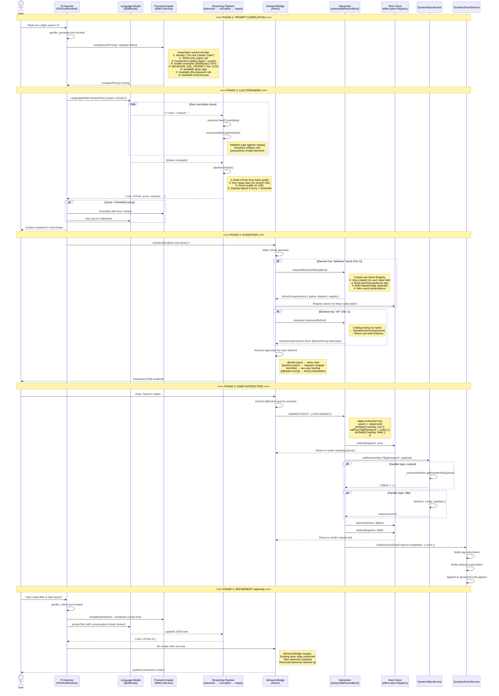

# Genifer LLM Sequence Diagram

How an LLM generates interactive UI end-to-end.

---

## Overview

There are **two entry points** — the LLM calling a tool during a conversation, or application code calling `generate()` directly. Both converge at the same pipeline.

```
User prompt → Pi Harness → genifer_generate tool → PromptCompiler → LLM → streaming JSON
                                                                              ↓
                                                                     Tokenizer → Pipeline
                                                                              ↓
                                                                     Normalize → Repair → Score
                                                                              ↓
                                                                     UITree + BehaviorBlocks
                                                                              ↓
                                                                     BehaviorBridge (React)
                                                                              ↓
                                                                     Interpreter → Atoms → DOM
                                                                              ↓
                                                                     User clicks → dispatch → atom mutation → re-render
                                                                              ↓
                                                                     callRpc / emitEvent → DynamicRpcService / DynamicEventService
```

---

## Sequence Diagram (Mermaid)



---

## The Three Tiers — What the LLM Actually Outputs

### Tier 1: Component Reference (catalog lookup)

The LLM names a pre-built `@component` decorated class. Zero JSON DSL needed.

```json
{
  "root": "search",
  "elements": {
    "search": {
      "type": "FlightSearchBar",
      "ref": { "component": "FlightSearchBar", "props": { "placeholder": "Where to?" } }
    }
  }
}
```

**Code path:** `interpretComponentRef()` → catalog lookup → `hydrateActionGroup()` → full interactive instance with pre-defined atoms, actions, RPC bindings.

### Tier 2: Behavior Block (JSON DSL)

The LLM defines state + actions + events inline. Most common tier.

```json
{
  "root": "container",
  "elements": {
    "container": {
      "type": "VStack",
      "behavior": {
        "name": "flight-search",
        "state": [
          { "field": "query", "initial": "" },
          { "field": "results", "initial": [] },
          { "field": "loading", "initial": false }
        ],
        "actions": {
          "search": {
            "_tag": "sequence",
            "actions": [
              { "_tag": "setState", "values": { "loading": true } },
              { "_tag": "callRpc", "rpc": "flights/search",
                "payload": { "query": "{{@state:query}}" },
                "resultField": "results", "loadingField": "loading" }
            ]
          },
          "clear": { "_tag": "setState", "values": { "query": "", "results": [] } }
        },
        "subscriptions": [],
        "emits": ["search.completed"]
      },
      "children": ["input", "btn", "results-list"]
    },
    "input": {
      "type": "TextInput",
      "props": { "value": "@state:query", "onChange": "@action:setQuery" }
    },
    "btn": {
      "type": "Button",
      "props": { "onClick": "@action:search", "disabled": "@state:loading", "label": "Search" }
    },
    "results-list": {
      "type": "Text",
      "props": { "content": "{{@state:results.length}} results" }
    }
  }
}
```

**Code path:** `interpretBehaviorBlock()` → creates Registry + Atoms + dispatch → `executeAction()` walks the ActionDef tree → `callDynamicRpc()` / `emitDynamicEvent()` for side effects.

### Tier 3: Code Block (sandboxed Effect — not yet implemented)

For when the DSL can't express the logic. The LLM writes an Effect program.

```json
{
  "codeBlocks": [{
    "_tag": "CodeBlock",
    "code": "Effect.gen(function*() { ... })",
    "expose": { "asRpc": ["complexSearch"], "asAtom": ["derivedMetrics"] }
  }]
}
```

**Code path:** (planned) Sandboxed Effect runtime → register exposed RPCs/atoms → same atom/dispatch flow.

---

## Key Invariants

| Principle | Implementation |
|-----------|---------------|
| **Compiler builds prompts, never calls model** | `PromptCompiler.compile()` returns a string |
| **Streaming pipeline is model-agnostic** | `feedChunk(delta)` accepts any string source |
| **BehaviorBridge resolves at render time** | Sigils → atom reads, action wrappers, bindings |
| **Atoms are the single source of truth** | `Effect.runSync` for mutations, React subscribes |
| **Services are pluggable** | `setRpcExecutor()`, `registerCustomRpcHandler()` |
| **Never `Effect.runPromise` for atom mutations** | Causes microtask scheduling that clobbers reads |
| **Interpreter output is identical to decorator path** | JSON BehaviorBlock → same ActionGroupInstance shape |

---

## File Map

```
PROMPT COMPILATION
  src/lib/genifer/compiler/PromptCompiler.ts    — builds system prompt from catalog + DSL
  src/lib/genifer/compiler/ai-adapter.ts        — generate() + refine() with retry loop
  src/lib/genifer/decorators/generation-schema.ts — BEHAVIOR_DSL_PROMPT teaching fragment

STREAMING PIPELINE
  src/lib/genifer/streaming/tokenizer.ts        — character-level JSON token extraction
  src/lib/genifer/streaming/pipeline.ts         — orchestrates tokenize → normalize → repair → score
  src/lib/genifer/core/incremental-normalize.ts — per-element validation against catalog
  src/lib/genifer/core/repair.ts                — fix broken refs, orphaned children

HYDRATION + RENDERING
  src/lib/genifer/react/BehaviorBridge.tsx       — walks tree, resolves behaviors + sigils
  src/lib/genifer/react/SurfaceRenderer.tsx      — renders a complete surface
  src/lib/genifer/react/SurfaceProvider.tsx       — context for surface state

INTERPRETER
  src/lib/genifer/decorators/interpreter.ts      — interpretBehaviorBlock(), interpretComponentRef()
  src/lib/genifer/decorators/bootstrap.ts        — wires decorators → services at startup

DYNAMIC SERVICES
  src/lib/genifer/services/DynamicRpcService.ts  — runtime RPC dispatch (custom, http, service, llm, script)
  src/lib/genifer/services/DynamicEventService.ts — pub/sub event bus + log

HARNESS INTEGRATION
  src/lib/genifer/harness/tools.ts               — genifer_generate + genifer_refine ToolDefinitions
  src/lib/genifer/harness/GeniferHarnessService.ts — surface lifecycle, state management
  src/lib/genifer/harness/surface.ts             — Surface type (hydrated interactive render tree)
```
