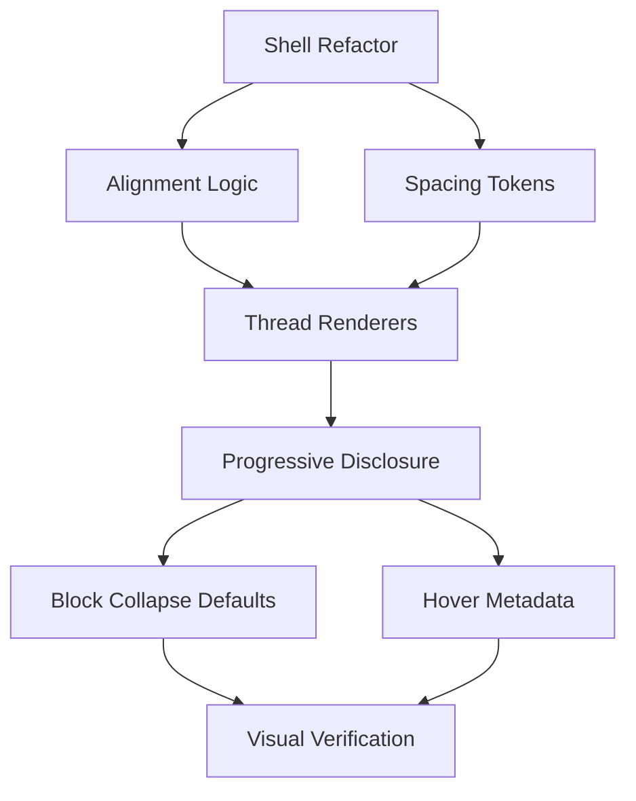

# Thread UX Overhaul — Synthesis

> Apple meets military industrial complex.
> Three plans, one coherent execution.

## Source Plans

1. **THREAD_SPACING_PLAN.md** — 8pt grid, turn gaps, border removal, spacing tokens
2. **MESSAGE_ALIGNMENT_PLAN.md** — User right, assistant left, role-aware shell
3. **PROGRESSIVE_DISCLOSURE_PLAN.md** — 3-tier attention model, hover metadata, collapsed defaults

## Dependency Graph



## Execution Phases

### Phase 1: Shell Foundation (4 tasks)
Foundation changes to `message-shell-root.tsx` and spacing tokens.

| # | Task | File(s) | Deps |
|---|------|---------|------|
| 1 | Add spacing CSS custom properties to `tokens.ts` | `tokens.ts` | — |
| 2 | Refactor shell to role-aware alignment (`ml-auto`/`mr-auto`/`mx-auto`) | `message-shell-root.tsx` | 1 |
| 3 | Add role-aware max-width (`max-w-[80%]` user, `85%` agent) | `message-shell-root.tsx` | 2 |
| 4 | Add role-aware shape (rounded-2xl user, transparent agent, rounded-xl system) | `message-shell-root.tsx` | 2 |

### Phase 2: Thread Renderers (4 tasks)
New message renderers in thread-view.tsx.

| # | Task | File(s) | Deps |
|---|------|---------|------|
| 5 | Create `UserMessage` renderer — no icon, no header, bubble style | `thread-view.tsx` | 2,3,4 |
| 6 | Rename `FullMessage` → `AssistantMessage` — keep full fidelity, adjust spacing | `thread-view.tsx` | 2 |
| 7 | Create `SystemMessage` renderer — centered, compact | `thread-view.tsx` | 2,3,4 |
| 8 | Implement turn-gap logic — `mt-5` between role changes, `mt-1` same-role | `thread-view.tsx` | 5,6,7 |

### Phase 3: Border & Spacing Cleanup (2 tasks)
Remove visual noise, let spacing breathe.

| # | Task | File(s) | Deps |
|---|------|---------|------|
| 9 | Remove `border-b` from shell, keep streaming `border-l` | `message-shell-root.tsx` | 8 |
| 10 | Adjust content block margins — `my-2` on code/tool, `my-1.5` on thinking/file | Various block roots | 9 |

### Phase 4: Progressive Disclosure (5 tasks)
Hover tiers and collapsed defaults.

| # | Task | File(s) | Deps |
|---|------|---------|------|
| 11 | Add `group/message` to shell, hover metadata row in thread renderers | `message-shell-root.tsx`, `thread-view.tsx` | 8 |
| 12 | Move timestamp + model + token summary to hover tier | `thread-view.tsx` | 11 |
| 13 | Tool blocks: collapsed by default, click-to-expand | `tool-block-root.tsx` | 10 |
| 14 | Code blocks: truncate > 12 lines with "Show more" | `code-block-root.tsx` | 10 |
| 15 | Token usage: compact summary (hover) → full detail (click) | `token-usage-root.tsx`, `thread-view.tsx` | 12 |

### Phase 5: Visual Verification (1 task)
| # | Task | Deps |
|---|------|------|
| 16 | Testbed visual verification — all presets render correctly | 15 |

## Total: 16 tasks across 5 phases

## Affected Files Summary

| File | Phase | Change Scope |
|------|-------|-------------|
| `src/lib/chat/tokens.ts` | 1 | Add spacing custom properties |
| `src/lib/chat/msg/message-shell/message-shell-root.tsx` | 1,3,4 | Major — alignment, shape, borders, group |
| `src/lib/morphchat/components/thread-view.tsx` | 2,3,4 | Major — new renderers, gap logic, disclosure |
| `src/lib/chat/msg/tool-block/tool-block-root.tsx` | 4 | Collapsed default + expand toggle |
| `src/lib/chat/msg/code-block/code-block-root.tsx` | 4 | Line truncation + "Show more" |
| `src/lib/chat/msg/token-usage/token-usage-root.tsx` | 4 | Compact summary mode |
| `src/lib/chat/msg/header-cluster/header-cluster-root.tsx` | 4 | Minor — hover opacity class |

## Design Tokens (to add to `tokens.ts`)

```typescript
export const THREAD_SPACING = {
  /** Gap between conversation turns (role change) */
  turnGap: 20,     // mt-5
  /** Gap between consecutive same-role messages */
  sameRoleGap: 4,  // mt-1
  /** Thread horizontal padding */
  padX: 16,        // px-4
  /** Thread vertical padding */
  padY: 12,
  /** User message padding */
  userPadX: 16,    // px-4
  userPadY: 10,    // py-2.5
  /** Agent message padding */
  agentPadX: 16,   // px-4
  agentPadY: 12,   // py-3
  /** Content block gap within a message */
  blockGap: 8,     // gap-2
} as const

export const MESSAGE_MAX_WIDTH = {
  user: '80%',
  assistant: '85%',
  system: '90%',
  tool: '85%',
} as const
```

## Non-Goals

- **No component deletion** — every compound stays, just repositioned
- **No new dependencies** — pure Tailwind + existing motion/react
- **No breaking API changes** — compound props remain identical
- **No density axis changes** — full/compact/pill still work within new alignment
