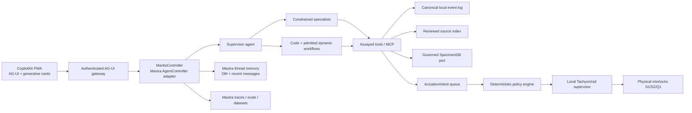

# Mantis Assistant — product and Mastra runtime outline

Status: `DESIGN OUTLINE / LAB-SIMULATION / NO LIVE ACTUATION`  
Revision: `A`  
Date: `2026-08-20`

## Decision

`assistant/` is a second engineered project in the mantis biomemetics lab. It
serves the live-care workflow, observation pipeline, terrarium project, and
reviewed evidence process. It is not itself a catalog Specimen and it does not
turn a local care subject into one.

The first product is an installable, offline-capable phone PWA. CopilotKit owns
the agentic React surface and AG-UI interaction. Mastra is the primary agent
runtime and supplies agents, `AgentController`, sessions, observational memory,
subagents, workflows, durable/background execution, tools/MCP, storage,
tracing, evals, and datasets. A small custom `MantisController` harness wraps
those primitives with the lab's epistemic, privacy, cost, and safety rules.

Mastra does **not** own:

- canonical care, observation, telemetry, claim, or evidence truth;
- SpecimenDB admission;
- device interlocks or the rail state machine;
- authorization to energize a load;
- the distinction between an observed fact and an interpretation.

The LLM can produce advice and proposed intents. It never directly controls
hardware.

## Product thesis

The keeper should be able to photograph an unfamiliar mantis and ask, “What do
I do now?” The assistant should return an immediately useful, uncertainty-aware
care plan; help find supplies and transit using ephemeral location; remember
what happened; and turn confirmed actions into structured records. The same app
should later expose qualified terrarium telemetry and reviewable laboratory
evidence without making the keeper operate an EE console.

Default UI language is care language. KiCad nets, B27/B50, S1/S2/Q1, channel
training, and raw diagnostics live behind `Service` mode.

## Golden first-use scenario

1. The user photographs a small mantis in a temporary cup and asks what to feed
   it.
2. The app creates a local `CareSubject`, not a Specimen. Taxon and life stage
   remain unset or explicitly hypothetical.
3. The observation specialist records only visible facts. A separate
   interpretation may suggest rank-by-rank identity with confidence.
4. The care specialist uses reviewed husbandry sources, the apparent size, the
   enclosure state, and the last confirmed care event. Unsupported numerical
   prescriptions are withheld or marked `unverified`.
5. If the user requests nearby supplies, the supply specialist receives a
   purpose-bound location token, checks current availability, and returns
   walking/transit options with timestamps. It does not persist the home
   address, infer specimen locality, or copy GPS into evidence.
6. CopilotKit renders an action card containing: do now, buy, how much to offer,
   warning signs, source/confidence, and a reminder option.
7. Offered, eaten, refused, and removed prey are logged as separate human-
   confirmed events. The assistant does not claim a feeding occurred because it
   recommended one.

## User modes and navigation

| Product surface | Keeper purpose | Controller mode | Initial authority |
| --- | --- | --- | --- |
| `Today` | Current status, next care action, reminders, urgent faults | `care` | Read, draft, remind |
| `Observe` | Photo/video/voice capture and event logging | `observe` | Draft observations only |
| `Ask` | Contextual care, supply, transit, and lab questions | `care` or `research` | Advice and drafts |
| `Terrarium` | Environment, camera availability, rail/load state | `terrarium-read` | Read-only/simulated |
| `Lab` | Claims, evidence drafts, artifacts, review state | `research` or `review` | Draft/validate; no self-admission |
| `Service` | Simulator, pairing, diagnostics, commissioning | `service-sim` | Simulator only in v1 |

One conversation may switch modes, but each mode has a separate tool allowlist,
instructions, budget, and approval policy. A model cannot switch itself into a
more privileged mode.

## System shape



The UI never chooses an arbitrary Mastra resource, agent, or tool. The server
binds authenticated identity, care subject, mode, and thread. CopilotKit actions
can create drafts, answer `ask_user`, approve a workflow step, or propose an
intent; they are not actuator calls.

## Mastra adoption map

| Mastra capability | Decision | Mantis use | Boundary |
| --- | --- | --- | --- |
| CopilotKit / AG-UI | Adopt | Streaming chat, generative care cards, approvals, workflow canvas | Server binds agent and resource; UI actions are untrusted input |
| `AgentController` and `Session` | Adopt behind adapter | Modes, threads, model selection, state, permissions, subagents | Beta API; exact version pinned; controller state is not canonical data |
| Observational Memory | Adopt, thread scope | Long-running conversational continuity and tool-result compression | Conversation observations are not biological `Observation` records or evidence |
| Working memory | Narrow use | Explicit preferences, active goal, unresolved questions | Never stores permission, device safety, or taxon as authority |
| Semantic recall / RAG | Adopt | Reviewed care sources and accepted lab records | Retrieval does not promote a claim or source class |
| Supervisor + subagents | Adopt | Specialist delegation with bounded context and tools | No unregistered spawning; no safety-sensitive `forked` subagents |
| Code-defined workflows | Adopt | Stable care, observation, review, and diagnostic flows | Source-controlled and versioned |
| Dynamic workflows | Pilot behind admission | User/agent-authored research and low-risk automation | Beta; P0–P2 only; validate, simulate, diff, approve, and hash before activation |
| HITL / suspend-resume | Adopt | Questions, plan approval, evidence review, tool approval | A chat “yes” is not sufficient for safety-critical control |
| Durable agents | Adopt selectively | Long research and mobile reconnect | Never auto-recover side-effectful control; replay can re-execute tools |
| Background tasks | Adopt selectively | Source research, media analysis, export validation | Read-only or idempotent tools only |
| Goals, schedules, signals | Adopt selectively | Care reminders, research goals, telemetry/fault wakeups | Schedules issue reminders; they do not actuate climate or feeding |
| Tools / MCP | Adopt after assay | Source lookup, maps/transit, records, simulators, SpecimenDB preview | Unknown or changed tools are quarantined |
| Skills | Adopt | Versioned husbandry, observation, EE, review, and privacy procedures | Skills guide behavior; they do not grant tools or authority |
| Studio, traces, metrics | Adopt | Development, trace review, latency/cost/failure analysis | Sensitive span fields redacted before export |
| Evals and datasets | Adopt heavily | CI regression, live sampling, trace scoring, golden scenarios | Deterministic safety gates outrank model-graded scores |
| Browser / connections | Quarantined pilot | Read-only source and inventory discovery when APIs fail | No purchasing, login, form submit, or arbitrary browsing by default |
| Channels | Later | Optional private reminders | Channel identity and approval affordances require a separate threat model |
| A2A / ACP / SDK subagents | Development-only pilot | Delegating bounded coding/research work | Not part of the live-animal control plane |

`AgentController`, dynamic workflows, and durable agents are beta upstream as of
this revision. The app therefore imports them through one compatibility module,
pins a stable package version, and has contract tests for every used behavior.
No alpha dependency is admitted merely because it is present on upstream
`main`.

## Custom `MantisController` harness

The custom harness is deliberately small. It configures Mastra rather than
reimplementing it.

It owns:

1. authenticated session creation and resource/thread partitioning;
2. mode transitions and exact per-mode tool visibility;
3. tool category resolution, deny/ask/allow ordering, and non-durable grants;
4. specialist registration, delegation hooks, max steps, budgets, and context
   filters;
5. observational-memory configuration and privacy processors;
6. tool-assay and dynamic-workflow admission registries;
7. model/provider allowlists, cost ceilings, timeouts, and no-silent-fallback
   behavior;
8. trace correlation with canonical event IDs without copying canonical records
   into Mastra memory;
9. conversion of model output into `CareAdvice`, `DraftRecord`, or
   `ActuationIntent`—never `ActuationCommand`;
10. fail-closed behavior on unknown mode, tool, agent version, workflow version,
    schema, identity, or stale state.

Recommended session identity:

```text
resourceId = opaque principal/care-space identifier
scope      = web | background | service-sim
threadId   = care:<local-care-subject>:<conversation>
```

The identifier is not a Specimen ID and carries no locality. `service-sim` uses
a separate session and thread from live care. An edge/device resource never
inherits a person's conversation memory.

## Agent hierarchy

The hierarchy is fixed and inspectable. Agent descriptions and schemas are part
of the routing contract.

### Layer 0 — deterministic host

`MantisController` authenticates, selects the mode, filters tools, enforces
budgets, and records the run. It is not an LLM.

### Layer 1 — supervisor

`mantis-coordinator` clarifies intent, selects a code workflow or delegates to a
registered specialist, and synthesizes the answer. Free-form agent-network
routing is permitted only in `research`, never in the control path.

### Layer 2 — specialists

| Agent | Purpose | Tool scope | Cannot do |
| --- | --- | --- | --- |
| `care-source` | Source-grounded husbandry advice | Reviewed-source read, care-history read | Diagnose, publish, or actuate |
| `observation-extractor` | Describe visible media and draft observations | Selected media read, draft write | Assert taxon/function or measure without scale |
| `taxon-hypothesis` | Rank-by-rank cited guesses | Source read, hypothesis draft | Promote a guess to fact or choose automation setpoints |
| `supply-transit` | Current prey/supply availability and route planning | Ephemeral location, inventory, transit read | Retain address, purchase, or infer locality |
| `terrarium-diagnostician` | Explain telemetry, freshness, rail state, and faults | Read-only gateway/simulator | Clear latches, move rail, energize loads |
| `evidence-curator` | Draft claim-bound evidence packets | Record/artifact read, evidence draft | Accept its own evidence or write SpecimenDB |
| `workflow-composer` | Produce a dynamic-workflow JSON draft | Primitive catalog read, workflow draft | Register or execute the draft |
| `tool-assessor` | Inspect and test a candidate tool | Sandbox and assay fixtures | Admit the tool it assessed |
| `adversarial-reviewer` | Attack outputs, workflows, and tool boundaries | Read-only traces/fixtures | Edit the candidate or issue final human admission |

Use normal constrained subagents, not `forked: true`, for domain and safety
roles. Upstream forked controller subagents clone the parent context and ignore
the definition's configured instructions, toolsets, allowlists, and default
model; that behavior is unsuitable for these boundaries.

Delegation hooks must:

- reject unavailable or over-budget specialists;
- rewrite the prompt to include only the minimum task packet;
- cap steps and wall time;
- strip exact location, secrets, unrelated media, and raw tool dumps;
- preserve source status and correlation IDs;
- record completion, rejection, cancellation, and score;
- prevent a specialist from delegating into a more privileged role.

## Observational memory policy

Mastra Observational Memory (OM) is used for conversation continuity, not as the
lab notebook.

### Memory layers

1. **Canonical event log** — confirmed care events, observations, telemetry,
   commands, receipts, and evidence. This is the operational source of truth.
2. **Recent messages** — the active turn window.
3. **Mastra OM** — dated, compressed conversation observations and reflections.
4. **Working memory** — explicit user preferences and current unresolved task.
5. **Semantic retrieval** — reviewed sources and accepted records selected for
   the current question.

Rules:

- Use thread-scoped OM initially. Resource-scoped OM is experimental upstream
  and currently disables async buffering.
- Enable async observation for long sessions, with pinned observer/reflector
  models and explicit token/cost thresholds.
- The observer and reflector cannot call canonical write tools.
- Store model IDs, package version, thresholds, and memory record ID on run
  traces so behavior can be reproduced.
- An OM sentence is `assistant-memory`, not `observed`, `measured`, or reviewed
  evidence.
- Original messages remain subject to the app's retention/export/delete policy.
- A privacy processor removes exact address, EXIF location, credentials, raw
  tokens, and unnecessary personal data before observation or trace export.
- Media stays in a content-addressed blob store. OM sees selected text
  annotations and digests, not an implicit permanent copy of every image.
- Canonical corrections do not rewrite OM into truth. Retrieval supplies the
  current accepted record and marks older memory as superseded.

## Tool assay and admission

No tool becomes visible to an agent merely because Mastra, MCP, a workspace, or
an integration discovered it.

Every candidate produces a versioned `ToolAssayRecord`:

```text
identity: id, version, provider, source URL, digest, license
contract: input/output schema, errors, timeout, streaming, determinism
effects: read/write/execute, external mutation, device impact, rollback
authority: actor, resource, credential, tenant, allowed modes and agents
data: privacy class, retention, network egress, secrets, location, media
behavior: idempotency, retry safety, cancellation, concurrency, rate/cost limits
evidence: source class produced, provenance fields, simulator and fixtures
safety: stale-state policy, preconditions, approval tier, physical interlocks
verification: static lint, sandbox smoke, negative tests, adversarial tests
review: assessor, independent reviewer, disposition, expiry/re-assay trigger
```

Admission states:

`discovered -> quarantined -> assayed -> simulated -> admitted-read | admitted-write -> revoked`

The assessor cannot admit its own tool. A registry change, schema change,
credential-scope change, provider version change, or failed live eval returns it
to `quarantined`.

Runtime policy uses both Mastra's mode allowlists and controller permission
categories:

- `read-public`
- `read-private`
- `draft-local`
- `external-write`
- `device-intent`
- `device-command` (never exposed to an LLM)
- `admin` (never exposed to an LLM)

Per-tool `deny` is absolute. Unknown tools default to deny. Session approvals do
not survive restart and never widen a mode allowlist. MCP servers are pinned by
identity and capability snapshot; newly advertised tools remain quarantined.

## Workflows

### Source-controlled workflows

The following begin as code-defined, schema-valid workflows:

- `intake-care-subject`
- `what-do-i-do-now`
- `feeding-help-and-removal-reminder`
- `suspected-molt-hold`
- `supply-and-transit-plan`
- `capture-observation`
- `telemetry-triage`
- `manual-carriage-reposition-guidance`
- `draft-evidence-packet`
- `assay-tool`
- `admit-dynamic-workflow`

Safety, evidence admission, privacy deletion, and device-service flows remain
code-defined.

### Dynamic workflows

Mastra dynamic workflows are JSON graphs referencing already registered agents,
tools, and workflows. They are useful for user/agent-authored research and lab
analysis, but are beta and are not an authority boundary.

A generated definition follows:

`draft -> schema/graph validation -> primitive resolution -> tool-assay closure -> static policy lint -> simulator run -> adversarial eval -> human diff/approval -> signed immutable version -> active`

Additional rules:

- P0–P2 capabilities only in the first release.
- A dynamic graph cannot reference an unassayed primitive, direct canonical
  mutation, SpecimenDB mutation, device command, browser action, or secret.
- Input, output, state, and request-context schemas are mandatory.
- Every definition records a digest, author, model/run, source prompt, referenced
  primitive versions, assay versions, tests, reviewer, and expiry.
- An update creates a new immutable application version. Running jobs retain the
  graph version they began with.
- Long sleeps and schedules produce reminders or revalidation signals, never a
  deferred actuator command.
- Time travel/replay is disabled for flows with external side effects.
- Durable-agent crash recovery is disabled for any flow whose tools are not
  proven idempotent; upstream recovery can re-issue model and tool calls.

### Durable and background execution

Use durable agents for source research and analysis that may outlive a mobile
connection. Use background tasks for assayed read-only/idempotent work. Persist
run IDs and stream events so CopilotKit can reconnect.

Do not put animal/environment actuation in a durable agent loop. Control intent
expiry and hardware state must be revalidated by the deterministic controller,
not resumed from an old conversational run.

## Advice and actuation boundary

```text
conversation / photo / records / sensors
             |
             v
CareAdvice or ActuationIntent (Mastra output; non-executable)
             |
             v
deterministic policy engine + current CarePlan + fresh state
             |
             v
explicit human consent where permitted
             |
             v
local edge supervisor
             |
             v
physical interlocks and independent limiters
             |
             v
ActuationReceipt
```

| Tier | Meaning | Initial policy |
| --- | --- | --- |
| P0 | Observe/read/summarize | Automatic with freshness and provenance |
| P1 | Draft/log/remind/no-flash capture | Draft automatically; user confirms durable interpretation/publication |
| P2 | Advice, supply/transit help, workflow draft | Allowed with source, uncertainty, and expiry |
| P3 | Bounded low-risk device action | Disabled until qualified; then deterministic policy + explicit approval |
| P4 | Mist, heat, powered vents, intense light | Disabled in v1; needs reviewed CarePlan, hardware limiters, qualification, dose/duty caps |
| P5 | Rail motion, binder release, door, interlock override, firmware safety | Human/local service only; no assistant execution |

Permanent prohibitions include remote door unlatch, automated prey release,
automatic pumping in v1, interlock override, energized ambiguous contact,
control from stale/unknown state, and species-specific climate changes derived
only from image inference.

## Core records and contracts

The assistant adds schemas for:

- `CareSubject` — local care identity; no implicit Specimen ID;
- `TaxonHypothesis` — rank, confidence, evidence, reviewer, never silent fact;
- `CarePlan` — reviewed sources, applicability, limits, expiry, reviewer;
- `CareEvent` — offered/eaten/refused/removed/misted/cleaned/outcome;
- `Observation` and `Interpretation` — separate records;
- `MediaAsset` and transform manifest — original/derivative digests and privacy;
- `SensorSample` — value, unit, uncertainty, calibration, revision, freshness;
- `CareAdvice` and `Recommendation` — sources, scope, risk, confidence, expiry;
- `ActuationIntent`, `ActuationCommand`, and `ActuationReceipt` — separate types;
- `Alert` — source values, rule/CarePlan version, action, acknowledgment;
- `AssistantRun` — agent/workflow/model/tool/memory/trace versions and costs;
- `ToolAssayRecord` and `ToolAdmission`;
- `DynamicWorkflowDefinition`, `WorkflowAdmission`, and `WorkflowRunReceipt`.

Care logs and OM are not automatically `EvidenceRecord`s. Raw sensor samples are
telemetry or `unverified` until calibration, method, and review support a
`measured` record. SpecimenDB projection remains deny-by-default through the
governed TypeScript adapter; direct PGlite writes remain prohibited.

## Storage, sync, and offline operation

- An append-only local event log drives rebuildable read models.
- Media lives in a content-addressed blob store, not event JSON.
- Corrections and supersessions are new events; accepted evidence is immutable.
- Unknown schema versions are retained but not applied.
- Control intents use a separate live channel and are never replayed by normal
  data sync.
- Offline intents expire and cannot execute after reconnection.
- Blob sync is resumable and digest-verified.
- A route lookup receives ephemeral coarse location and a per-use purpose. Exact
  location is excluded from lab/evidence sync unless the user explicitly elects
  otherwise.
- The app remains useful for manual logging and sourced offline guidance when
  Mastra, a model provider, Particle Cloud, or the camera is unavailable.

## Observability and eval program

Mastra traces every agent, workflow, tool, model, and memory operation. A custom
span processor removes secrets, exact location, full private media, and unsafe
prompt payloads before export. Keep local Studio-compatible storage; external
OpenTelemetry export is optional.

Deterministic gates:

- tool and workflow schema closure;
- mode/tool/agent permission matrix;
- no direct actuator path from an agent;
- no SpecimenDB mutation without a governed admission;
- no guessed taxon promoted to fact;
- no raw telemetry promoted to measured evidence;
- stale/unknown state disables control;
- replay, duplicate, cancellation, and restart safety;
- location stripping and retention/export/delete behavior.

Mastra scorers and datasets cover:

- citation/provenance coverage;
- observation-versus-interpretation separation;
- appropriate abstention and taxonomic uncertainty;
- care-plan applicability;
- unsafe-action and prompt-injection resistance;
- subagent selection and completion;
- tool choice and assay compliance;
- workflow usefulness, cost, latency, and user corrections;
- multi-turn memory updates and supersession.

The initial golden dataset includes the ambiguous juvenile-photo + feeding +
nearby supply + public-transit scenario. Live evals sample normal advice; hard
safety invariants run on every relevant CI and simulated-control trace.

## Proposed repository shape

```text
projects/biomemetics/labs/mantis/
  assistant/
    README.md
    contracts/
    policies/
    workflows/{definitions,admissions}/
    tools/{assays,admissions}/
    evals/
    datasets/
    fixtures/
    docs/
    app/                         # phone-first CopilotKit PWA
  tooling/typescript/
    mantis-assistant/            # Mastra server, controller, agents, workflows
  tooling/rust/
    mantis-edge/                 # eventual local deterministic gateway
  tooling/python/
    mantis-assistant-analysis/   # media/data analysis; no hardware writes
```

The exact package placement must follow gbg's discovered TypeScript/Nx
conventions. Cross-member meaning remains in JSON Schema, not private TypeScript
types.

## Self-contained Nix execution

The lab owns its own `flake.nix` and committed `flake.lock`. It must not rely on
or mutate the gbg root flake/lock.

Required outputs include:

```text
devShells.mantis-core
devShells.mantis-assistant
devShells.mantis-assistant-eval
devShells.mantis-edge
devShells.mantis-analysis
devShells.mantis-fabrication

packages.mantis-assistant-web
packages.mantis-assistant-server
packages.mantis-edge

checks.contracts
checks.assistant-typescript
checks.assistant-offline-e2e
checks.mastra-compat
checks.tool-assay
checks.workflow-admission
checks.agent-evals
checks.edge-simulator
```

Commit the Nix lock, the chosen JavaScript lock, `Cargo.lock`, and any admitted
Python dependency lock. Secrets and signing keys never enter the Nix store.
`checks.mastra-compat` pins and exercises the beta APIs used by the adapter,
including mode allowlists, approvals, constrained subagents, OM, dynamic
workflow registration, suspend/resume, durable reconnect, and trace redaction.

## Delivery sequence

### A0 — contracts, sources, and harness spike

- Source the husbandry/care pack and create `CarePlan`/advice contracts.
- Pin the self-contained Nix and JS dependency graph.
- Prove Mastra + CopilotKit streaming, controller sessions, thread OM, tool
  approvals, traces, and deterministic test doubles.
- Build the tool-assay/admission and workflow-admission schemas first.

### A1 — offline care vertical slice

- `Today`, `Observe`, and `Ask` PWA surfaces.
- Local care subject, media, manual timeline, reminders, export/import.
- The golden feeding/supply/transit flow.
- No hardware dependency and no live actuation.

### A2 — specialist hierarchy and memory

- Coordinator plus constrained care, observation, taxon, supply, and review
  specialists.
- OM privacy, retention, supersession, and multi-turn evals.
- Source-grounded answers and reviewable run receipts.

### A3 — dynamic workflow laboratory

- Visual CopilotKit workflow draft UI.
- Mastra dynamic-workflow adapter, simulator, linter, assay closure, review diff,
  signed versions, and audit history.
- Research/P0–P2 only.

### A4 — read-only edge integration

- Deterministic rail simulator, then Tachyon LAN gateway on an electrical test
  coupon.
- Telemetry freshness, camera availability, rail/load diagram, and faults.
- Video only when the authoritative gateway reports `LINK-TRAINED`.

### A5 — evidence and SpecimenDB bridge

- Evidence draft/review queues and projection previews.
- Governed attachment only after the SpecimenDB API issue is accepted.
- No automatic intake, Specimen creation, or provenance borrowing.

### A6 — qualified bounded control

- Only after physical EE, mechanical, enclosure, husbandry, HIL, and adversarial
  gates pass.
- Introduce narrowly bounded P3 capabilities through the deterministic policy
  service and local supervisor.
- P4/P5 remain separately gated or prohibited.

## MVP acceptance

- A feeding or observation event can be recorded offline in under 15 seconds.
- A photo and note survive restart and export/import without duplicate events.
- Every numerical care claim has a source/applicability or is withheld.
- Every assistant output distinguishes observation, inference, recommendation,
  and unknown.
- A guessed taxon never renders or persists as confirmed.
- Exact location is opt-in, purpose-bound, and absent from evidence by default.
- OM remembers relevant decisions without becoming canonical truth.
- A specialist cannot access a tool or context outside its declared scope.
- No unknown/unassayed tool or workflow can run.
- Dynamic workflows cannot reference write/control primitives.
- A chat response, CopilotKit action, replay, or recovered durable run cannot
  directly issue an actuator command.
- Unknown/stale telemetry never renders as safe.
- Pinch/fault simulation ends video immediately and leaves the branch off.
- SpecimenDB attachment remains impossible without valid accepted evidence, an
  existing explicit catalog target, and the governed API.
- Clean `nix flake check` builds the PWA/server and runs contract, compatibility,
  offline, memory, tool-assay, workflow, agent, and simulator tests.

## Upstream sources checked for revision A

- [Mastra + CopilotKit / AG-UI](https://mastra.ai/integrations/agentic-ui/copilotkit)
- [AgentController guide](https://mastra.ai/docs/harness/agent-controller)
- [AgentController reference](https://mastra.ai/reference/agent-controller/agent-controller-class)
- [Observational Memory](https://mastra.ai/docs/memory/observational-memory)
- [Subagents and delegation hooks](https://mastra.ai/docs/subagents)
- [Dynamic workflows](https://mastra.ai/docs/workflows/dynamic-workflows)
- [Human-in-the-loop workflows](https://mastra.ai/docs/workflows/human-in-the-loop)
- [Durable agents](https://mastra.ai/docs/harness/durable-agents)
- [Background tasks](https://mastra.ai/docs/harness/background-tasks)
- [Observability](https://mastra.ai/docs/observability/overview)
- [Evals](https://mastra.ai/docs/evals/overview)
- [Mastra open-source repository](https://github.com/mastra-ai/mastra)

## Open decisions before implementation

- reviewed care-source set and CarePlan authority;
- exact stable Mastra/CopilotKit/package versions after the compatibility spike;
- application storage/sync backend and encryption/retention policy;
- model/provider allowlist and per-role quality/cost budgets;
- identity and multi-device recovery without putting secrets in the PWA;
- exact source of live inventory/transit data and its retention terms;
- whether a native wrapper is required after PWA notification/storage testing;
- which P3 capability, if any, is the first hardware-in-loop candidate.

