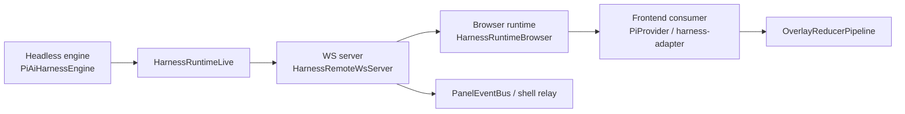

# GBG TMNL harness/UI decoupling map

## Short thesis
GBG TMNL already has a clean split between:

- **runtime/headless control plane**: `HarnessRuntime` → `PiAiHarnessEngine`
- **browser transport seam**: `HarnessRuntimeBrowser` + `HarnessBrowserTransport`
- **remote WS bridge**: `HarnessRemoteWsServer`
- **frontend consumers**: `PiProvider`, `harness-adapter`, `harness-event-processor`
- **render transform layer**: `OverlayReducerPipeline`

That means the harness can run without any UI attached, while the frontend can attach later and consume a replay/snapshot/event stream.

---

## 1) Headless runtime is the source of truth

### What exists
- `HarnessRuntime` defines open/resume/send/getSnapshot/abort/list/update/delete/fork/respond/events. (`packages/tmnl/src/lib/harness/HarnessRuntime.ts:66-107`)
- `HarnessRuntimeLive` is server-only and wires those methods directly to `PiAiHarnessEngine`. (`packages/tmnl/src/lib/harness/HarnessRuntimeLive.ts:1-4,27-145`)
- `PiAiHarnessEngine` owns session lifecycle, event persistence, snapshots, list/fork/delete, and an `events` stream. (`packages/tmnl/src/lib/harness/PiAiHarnessEngine.ts:105-142,253-337,1639-2172`)
- CLI operator guidance explicitly says the runtime can be operated “without relying on a UI surface” and the smoke flow is: open session → send prompt → wait for `chat:v2/assistant_final` → print metrics. (`packages/tmnl/src/lib/harness/docs/migration/conductor-piai-harness-operator-guide.md:8-22,42-82`)

### Meaning
The engine is already usable headlessly; UI is just one consumer of the runtime stream/snapshot APIs.

---

## 2) Remote harness seam (browser ↔ server)

### Server bridge
- `HarnessRemoteWsServer` exposes `/api/harness/ws` and health routes, then relays:
  - `runtime.events`
  - `InteractiveShellService.events`
  - `PanelEventBus.events`
  - and handles WS commands for open/resume/send/get_snapshot/list/update/delete/fork/abort/respond/models. (`packages/tmnl/src/lib/harness/server/HarnessRemoteWsServer.ts:34-35,267-360,437-479,591-620`)
- The server uses the same `HarnessRuntimeLive` instance, so tools/sessions are exposed even when no browser client is present. (`packages/tmnl/src/lib/harness/server/HarnessRemoteWsServer.ts:199-200,267-360,606-619`)
- `PanelEventBus` is a tiny PubSub-backed service with `events` + `emit`. (`packages/tmnl/src/lib/harness/panel-events/PanelEventBus.ts:4-24`)
- `PiAiToolRuntimeBuiltins` shows why panel events exist: `spawn_panel` emits `panel:spawned`, `panel:surface_updated`, `panel:closed` into that bus. (`packages/tmnl/src/lib/harness/PiAiToolRuntimeBuiltins.ts:377-379,451-457,495-499,539-560`)

### Browser schemas
- `HarnessBrowserRemoteSchemas` defines the browser WS envelope for:
  - `remote:chat_v2_*` commands
  - `remote:get_available_models`, `remote:list_sessions`, `remote:update_session_meta`, `remote:delete_session`, `remote:fork_session`
  - `remote:shell_*` commands
  - `remote:panel_event`, `remote:shell_event`, `remote:ws_event` wrappers. (`packages/tmnl/src/lib/harness/HarnessBrowserRemoteSchemas.ts:91-225,227-240`)
- `HarnessRemoteSchemas` is the older/local harness command surface (`harness:*`), showing the parallel shape used by non-browser harness flows. (`packages/tmnl/src/lib/harness/HarnessRemoteSchemas.ts:12-86`)

### Browser transport
- `HarnessBrowserTransport` resolves WS URL from `__TMNL_HARNESS_WS_URL`, `VITE_HARNESS_WS_URL`, `HARNESS_WS_URL`, otherwise same-origin `/api/harness/ws`, or `ws://127.0.0.1:8787/api/harness/ws` in SSR/CLI/tests. (`packages/tmnl/src/lib/harness/HarnessBrowserTransport.ts:51-94`)
- That means a frontend can attach to a remote harness without hard-coding environment assumptions.

---

## 3) Browser runtime seam: what the frontend actually sees

### `HarnessRuntimeBrowser`
- Maps remote commands to runtime methods: open/resume/send/getSnapshot/abort/respond/list/update/delete/fork/models. (`packages/tmnl/src/lib/harness/HarnessRuntimeBrowser.ts:203-425`)
- Its event stream decodes `HarnessRemoteEventEnvelope`, but only forwards `remote:chat_v2_event` into `runtime.events`; shell/panel events are ignored here. (`packages/tmnl/src/lib/harness/HarnessRuntimeBrowser.ts:386-400`)

### Consequence
The current browser runtime seam is intentionally narrow: frontend consumers get chat-v2 events, not shell/panel events, unless a higher layer explicitly projects them.

---

## 4) Frontend consumption path (events + snapshots)

### PiProvider (browser-facing provider)
- `toRenderReducerInput` maps `chat:v2/provider_marker` plus semantic chat events into render lanes/classes. (`packages/tmnl/src/lib/ai-core/providers/pi/PiProvider.ts:209-415`)
- `eventLoop` gates by active session, dedupes by seq, ingests render inputs, then applies state + publishes provider state. (`packages/tmnl/src/lib/ai-core/providers/pi/PiProvider.ts:565-596`)
- `reducerMetricLoop` converts overlay emissions into `chat:v2/metric` events (`renderTransformBatchMs`, `renderBacklogDepth`). (`packages/tmnl/src/lib/ai-core/providers/pi/PiProvider.ts:598-623`)
- `sendMessage` does explicit snapshot sync after send (`runtime.getSnapshot(sessionId, Option.some(lastSeq))`) to close replay gaps. (`packages/tmnl/src/lib/ai-core/providers/pi/PiProvider.ts:699-727`)
- `clear` opens a fresh session; `browserWebSocketLayer` wires the browser transport seam. (`packages/tmnl/src/lib/ai-core/providers/pi/PiProvider.ts:743-753,845-882`)

### MorphChat harness adapter
- Subscribes to `runtime.events`, calls `runtime.send`, and can fetch `runtime.getSnapshot(sessionId, Option.none())` on demand. (`packages/tmnl/src/lib/morphchat/adapters/harness-adapter.ts:584-730`)
- The shared event processor handles the same chat-v2 stream and updates structured message parts. (`packages/tmnl/src/lib/morphchat/adapters/harness-event-processor.ts:611-1026`)

### Effect
Frontend is not the source of truth; it is a projection layer over `HarnessRuntime` events/snapshots.

---

## 5) Rendering seam (server-side transform layer)

### Overlay reducer
- `OverlayReducerPipeline` is an independent service with `register/unregister/list/ingest/flushBucket/outputs`. (`packages/tmnl/src/lib/harness/rendering/OverlayReducerPipeline.ts:24-246`)
- Defaults are bucketed coalescing with immediate bypass classes (`error`, `terminal`, `extension`, `tool`), maxBatchSize=32, maxWaitMs=8. (`packages/tmnl/src/lib/harness/rendering/OverlayReducerPipeline.ts:24-39,205-233`)
- It emits `RenderReducerEmission` with `transformMs`, `batchSize`, `backlogDepth`, overlay list, patches, and nodes. (`packages/tmnl/src/lib/harness/rendering/OverlayReducerPipeline.ts:88-137`)

### Benchmarks/docs
- Rendering docs say the pipeline should be hot-ingest + frame-flush, with heavy work deferred to `text_end` / `done`. (`packages/tmnl/src/lib/harness/docs/rendering/custom-rendering-pipeline-architecture.md:11-31,35-107,152-173`)
- Observability docs define metrics/SLOs around `renderTransformDeltaMs`, `renderTransformBatchMs`, `renderCommitMs`, `renderBacklogDepth`, `unknownMarkerCount`. (`packages/tmnl/src/lib/harness/docs/rendering/custom-rendering-observability.md:9-75,79-160`)
- Benchmarks show switch-based dispatch beats Match in the hot path, while overlay coalescing is useful but bounded. (`packages/tmnl/src/lib/harness/docs/benchmarks/provider-marker-match-benchmark-report.md:41-121,125-135`; `packages/tmnl/src/lib/harness/docs/benchmarks/overlay-reducer-pipeline-benchmark-report.md:47-103`)

### Implication
The renderer layer is intentionally separate from the runtime layer; it consumes harness events but does not define them.

---

## 6) Practical decoupling picture

### What is decoupled
- **runtime from UI**: `HarnessRuntimeLive` and `PiAiHarnessEngine` can run without browser clients.
- **browser from engine**: `HarnessRuntimeBrowser` speaks WS envelopes, not engine internals.
- **rendering from transport**: `OverlayReducerPipeline` only sees normalized `RenderReducerInput`.
- **panel/shell from chat stream**: currently separate relays, not part of browser runtime events.

---

## 7) Gaps / risks to watch

1. `HarnessRuntimeBrowser.events` only forwards `remote:chat_v2_event`; if the frontend needs panel or shell events, a new projection seam is required. (`packages/tmnl/src/lib/harness/HarnessRuntimeBrowser.ts:386-400`)
2. `PiProvider` still relies on snapshot sync after send to avoid event races. (`packages/tmnl/src/lib/ai-core/providers/pi/PiProvider.ts:716-725`)
3. `OverlayReducerPipeline` is useful for UI decoupling, but it still lives in the consumer layer; don’t accidentally re-couple it to the engine. (`packages/tmnl/src/lib/harness/rendering/OverlayReducerPipeline.ts:24-246`)
4. `provider:marker/unknown` is intentionally preserved; consumers should not silently drop it. (`packages/tmnl/src/lib/harness/docs/specs/harness-provider-markers-spec.md:7-8,48-88,106-118`)

---

## 8) Visual explainer lanes/cards to add

### Lanes
1. **Control plane lane**
   - open / resume / send / snapshot / list / fork / delete / update / abort
2. **Event lane**
   - `chat:v2/session_opened`, `send_accepted`, `assistant_*`, `tool_event`, `error`, `metric`, `provider_marker`
3. **Panel/tool lane**
   - `PanelEventBus` and `InteractiveShellService` relays
4. **Render lane**
   - `RenderReducerInput` → `OverlayReducerPipeline` → `RenderReducerEmission`
5. **Frontend projection lane**
   - `PiProvider` / `harness-adapter` state derivation

### Cards
- **Headless session card**: “openSession → send → resume/getSnapshot → list/fork/delete”
- **WS bridge card**: “remote command ↔ remote response ↔ chat event relay”
- **Provider projection card**: “runtime.events → PiProvider state + snapshot sync”
- **Renderer card**: “provider_marker/text_delta → reducer ingest → metrics”
- **Tool/panel card**: “spawn_panel → PanelEventBus → WS relay”

### Suggested annotations
- color chat-v2 semantic events separately from raw provider markers
- mark shell/panel as currently orthogonal to browser runtime events
- show metrics as side-band, not primary UX state

---

## 9) Best next validation
- Run/inspect the headless smoke path and the browser WS path side by side.
- Confirm `runtime.events` stays monotonic per session.
- Confirm browser consumers only receive `remote:chat_v2_event` unless a new projection is added.
- Confirm render metrics flow from reducer emissions back into provider metrics.
